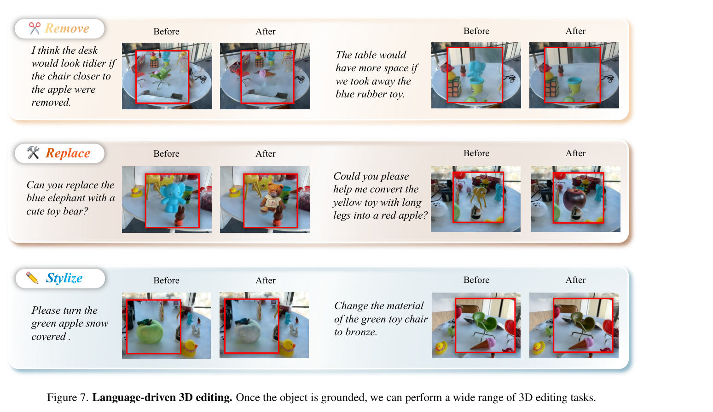

# REALM: An MLLM-Agent Framework for Open World 3D Reasoning Segmentation and Editing on Gaussian Splatting

> **中文题名：** REALM：面向 3D Gaussian Splatting 开放世界 3D 推理分割与编辑的 MLLM-Agent 框架  
> **作者：** Changyue Shi, Minghao Chen, Yiping Mao, Chuxiao Yang, Xinyuan Hu, Zhijie Wang, Jiajun Ding, Zhou Yu  
> **出处：** arXiv:2510.16410，2025-10-18  
> **论文类型：** 方法 / 3D reasoning segmentation / training-free agent framework  
> **源文件：** `Shi 等 - 2025 - REALM An MLLM-Agent Framework for Open World 3D Reasoning Segmentation and Editing on Gaussian Spla.pdf`  
> **阅读器：** 全文英中对照；源格式为 `pdf-text`；图表按首次实质讨论位置重排。页码与稳定块 ID 见 `source_map.json`。

## 阅读导航

- [术语表](#术语表)
- [Abstract](#abstract)
- [1. Introduction](#1-introduction)
- [2. Related Work](#2-related-work)
- [3. Methodology](#3-methodology)
- [4. Experiments](#4-experiments)
- [5. Conclusion](#5-conclusion)
- [Critical Reading Notes](#critical-reading-notes)
- [Source restoration supplement](#source-restoration-supplement)
- [References](#references)

## 术语表

| Canonical term | 中文 | First-use definition / 决策 |
|---|---|---|
| REALM | REALM | 方法名保留英文 |
| MLLM-agent | MLLM 智能体 | 调用多模态大模型执行图像级推理与定位的 agent |
| 3D Gaussian Splatting (3DGS) | 3D 高斯溅射 | 场景表示，提供高保真新视角渲染 |
| reasoning-based segmentation | 基于推理的分割 | 查询不直接说目标类别，需要空间、属性、常识或上下文推断 |
| open-world 3D reasoning segmentation | 开放世界 3D 推理分割 | 在任意 3D 场景中按自然语言隐式指令定位并分割目标 |
| 3D Feature Field | 3D 特征场 | 给每个 Gaussian primitive 分配实例身份特征 |
| Gaussian primitive | 高斯基元 | 3DGS 中可被渲染和优化的基本单元 |
| LMSeg | MLLM-based Visual Segmenter / 基于 MLLM 的视觉分割器 | MLLM 输出 bbox、类别与解释，SAM 生成 2D mask，再回连 3D ID |
| GLSpaG | Global-to-Local Spatial Grounding / 全局到局部空间落地 | 多视角全局投票后，再用局部近景 mask 优化 3D mask |
| global cameras | 全局相机视角 | K-means 与 Top-K-ID 选择的多样化场景视角 |
| local cameras | 局部相机视角 | 目标实例可见的近景视角，用于细粒度 mask refinement |
| mIoU / mBIoU | 平均 IoU / 平均边界 IoU | 3D reasoning segmentation 的区域与边界指标 |

## Abstract

> <span style="color:#3B82F6"><strong>Para. 1:</strong></span> Bridging complex human instructions and precise 3D object grounding is still difficult for vision and robotics. Existing 3D segmentation methods often fail on ambiguous, reasoning-based instructions, while 2D vision-language models can reason about such instructions but do not natively understand 3D space.

> <span style="color:#F59E0B"><strong>Para. 1[CN]:</strong></span> 将复杂人类指令与精确 3D 目标落地连接起来，仍是视觉与机器人领域的难点。现有 3D 分割方法常常无法理解含歧义、需要推理的指令；而 2D 视觉语言模型虽然擅长这类语义推理，却缺少内在的 3D 空间理解能力。

> <span style="color:#3B82F6"><strong>Para. 2:</strong></span> REALM is an MLLM-agent framework for open-world reasoning-based segmentation without extensive 3D-specific post-training. It operates directly on 3DGS because 3DGS can render photorealistic novel views suitable for MLLM comprehension.

> <span style="color:#F59E0B"><strong>Para. 2[CN]:</strong></span> REALM 是一个面向开放世界推理分割的 MLLM-agent 框架，目标是在不进行大量 3D 专用后训练的情况下完成 3D 目标落地。它直接工作在 3DGS 表示上，因为 3DGS 能渲染适合 MLLM 理解的高真实感新视角图像。

> <span style="color:#3B82F6"><strong>Para. 3:</strong></span> Since directly feeding one or a few rendered views to an MLLM is sensitive to viewpoint choice, the paper proposes Global-to-Local Spatial Grounding. Multiple global views first provide coarse localization by parallel MLLM-agent responses, and then close-up local views refine the segmentation into accurate and consistent 3D masks.

> <span style="color:#F59E0B"><strong>Para. 3[CN]:</strong></span> 直接把一个或少数几个渲染视角喂给 MLLM，会让结果强烈依赖视角选择。因此论文提出全局到局部空间落地：先用多个全局视角并行调用 MLLM-agent 做粗定位并聚合响应，再合成目标附近的局部近景视图进行细粒度分割，最终得到准确且跨视角一致的 3D mask。

> <span style="color:#3B82F6"><strong>Para. 4:</strong></span> Experiments on LERF, 3D-OVS, and the new REALM3D benchmark show strong performance on explicit and implicit instructions. The same agent framework also supports object removal, replacement, and style transfer in 3D scenes.

> <span style="color:#F59E0B"><strong>Para. 4[CN]:</strong></span> 在 LERF、3D-OVS 以及新构建的 REALM3D 基准上，REALM 对显式和隐式指令都表现出强性能。该 agent 框架还可自然支持 3D 场景中的物体移除、替换和风格迁移。

## 1. Introduction

### Fig. 1. REALM 的任务形态：推理分割与 3D 编辑


**Caption:** REALM performs open-world 3D reasoning segmentation and editing in 3DGS. It can resolve context-aware, spatial, and object-conversion instructions, then support removal, replacement, and style transfer.

**Caption[CN]:** REALM 在 3DGS 中执行开放世界 3D 推理分割与编辑。它能处理上下文、空间关系和目标转换式指令，并进一步支持移除、替换与风格迁移。

**Reading note:** 这张图说明论文的“推理”不是数学推理，而是自然语言隐式指代的目标识别：例如“孩子喜欢蓝色，应该找什么玩具”需要从颜色偏好推断目标。

> <span style="color:#3B82F6"><strong>Para. 1:</strong></span> The paper starts from David Marr's view that vision discovers what is present in the world and where it is. For future robotics and human-AI collaboration, agents must understand natural language instructions and ground them in 3D scenes.

> <span style="color:#F59E0B"><strong>Para. 1[CN]:</strong></span> 论文以 David Marr 对视觉的定义开篇：视觉要发现世界中有什么，以及它在哪里。面向未来的机器人和人机协作，智能体必须能理解自然语言指令，并把这些指令落到 3D 场景中的具体对象上。

> <span style="color:#3B82F6"><strong>Para. 2:</strong></span> Humans solve implicit instructions by interpreting the request and then grounding the implied target. If asked to make a table tidier, a person identifies the storage container and the scattered objects before acting. The first key step is therefore segmenting the target object from an instruction that may rely on commonsense, spatial relation, or context.

> <span style="color:#F59E0B"><strong>Para. 2[CN]:</strong></span> 人类处理隐式指令时，会先理解请求，再把隐含目标落地。例如“让桌子更整洁”并不直接点名目标，人会先识别收纳容器和散乱物品，再执行整理动作。因此第一步关键能力是：从依赖常识、空间关系或上下文的自然语言中分割出目标物体。

> <span style="color:#3B82F6"><strong>Para. 3:</strong></span> Existing 3D open-vocabulary segmentation methods connect language with 3D representations such as point clouds, NeRF, or 3DGS, but mainly work for explicit prompts like “segment the cup.” They struggle when the instruction asks for “the object between the lamp and the book” or other reasoning-based references.

> <span style="color:#F59E0B"><strong>Para. 3[CN]:</strong></span> 现有 3D 开放词汇分割方法能够把语言与点云、NeRF 或 3DGS 等 3D 表示连接起来，但主要擅长“segment the cup”这类显式查询。当指令变成“灯和书之间的物体”这类需要推理的指代时，它们就容易失败。

> <span style="color:#3B82F6"><strong>Para. 4:</strong></span> MLLMs show strong 2D visual reasoning because they are pretrained on large-scale image-text data, but they do not provide native 3D spatial grounding. This creates the central gap: 3D grounding models cannot reason, and 2D reasoning models cannot ground in 3D.

> <span style="color:#F59E0B"><strong>Para. 4[CN]:</strong></span> MLLM 由于在大规模图文数据上预训练，具备较强的 2D 视觉推理能力；但它们并不天然具备 3D 空间落地能力。这形成了论文的核心缺口：3D grounding 模型不能充分推理，2D reasoning 模型又不能可靠地在 3D 中落地。

### Fig. 2. 直接输入随机视角的问题


**Caption:** Feeding one or a few random rendered views to the MLLM is highly viewpoint-sensitive. The voting strategy only becomes effective when enough global views are available.

**Caption[CN]:** 将一个或少数随机渲染视角输入 MLLM 会高度依赖视角选择；只有全局视角足够时，投票策略才开始发挥作用。

**Reading note:** Figure 2 是 REALM 方法设计的直接动机：不是“MLLM 不会推理”，而是单视角可能遮挡目标、缺上下文或看错相似物体。

> <span style="color:#3B82F6"><strong>Para. 5:</strong></span> REALM bridges the gap by using 3DGS as a high-fidelity proxy for the 3D world. It first optimizes a 3D Feature Field that gives each Gaussian primitive an identity feature, then uses LMSeg to perform image-level reasoning segmentation with MLLM and SAM, and finally links the 2D mask back to Gaussian identities.

> <span style="color:#F59E0B"><strong>Para. 5[CN]:</strong></span> REALM 通过把 3DGS 作为高保真 3D 世界代理来连接这两个能力。它先优化一个 3D 特征场，为每个 Gaussian primitive 分配实例身份特征；再用 LMSeg 结合 MLLM 与 SAM 做图像级推理分割；最后把 2D mask 回连到对应的 Gaussian identity。

> <span style="color:#3B82F6"><strong>Para. 6:</strong></span> A single rendered view may hide the target or lack context, while too many simultaneous views overwhelm the MLLM. REALM therefore uses GLSpaG: global MLLM agents survey multiple diverse views and vote for a coarse target, then local agents synthesize close-up views and refine the mask.

> <span style="color:#F59E0B"><strong>Para. 6[CN]:</strong></span> 单个渲染视角可能遮挡目标或缺少上下文，而一次输入过多视角又会让 MLLM 难以建立一致理解。因此 REALM 使用 GLSpaG：全局阶段由多个 MLLM agent 从多样化视角观察并投票得到粗目标；局部阶段合成目标近景视图并细化 3D mask。

> <span style="color:#3B82F6"><strong>Para. 7:</strong></span> Existing 3D segmentation benchmarks mostly use explicit prompts, so the authors re-annotate LERF and 3D-OVS with implicit reasoning instructions and introduce REALM3D, containing 100+ scenes and 1000+ prompt-mask pairs.

> <span style="color:#F59E0B"><strong>Para. 7[CN]:</strong></span> 现有 3D 分割基准多以显式 prompt 为主，难以评价 reasoning-based segmentation。因此作者用隐式推理指令重新标注 LERF 与 3D-OVS，并提出 REALM3D，包含 100+ 场景和 1000+ prompt-mask 对。

> <span style="color:#3B82F6"><strong>Para. 8:</strong></span> The claimed contributions are: a 3D reasoning segmentation MLLM-agent based on 3DGS; LMSeg plus GLSpaG for high-quality 3D masks; and new implicit-query annotations plus REALM3D for evaluation.

> <span style="color:#F59E0B"><strong>Para. 8[CN]:</strong></span> 论文贡献可概括为三点：提出基于 3DGS 的 3D reasoning segmentation MLLM-agent；提出 LMSeg 与 GLSpaG 生成高质量 3D mask；重新标注隐式查询并构建 REALM3D 用于评价。

## 2. Related Work

> <span style="color:#3B82F6"><strong>Para. 1:</strong></span> The related-work section positions REALM against 3D open-vocabulary segmentation and multimodal large language models. Existing 3D methods can ground text in point clouds, NeRFs, or 3DGS, but they mainly depend on explicit lexical matching or learned vision-language alignment.

> <span style="color:#F59E0B"><strong>Para. 1[CN]:</strong></span> 相关工作部分将 REALM 放在 3D 开放词汇分割与多模态大模型两条线之间。现有 3D 方法能把文本落到点云、NeRF 或 3DGS 上，但主要依赖显式词汇匹配或学习得到的视觉语言对齐。

> <span style="color:#3B82F6"><strong>Para. 2:</strong></span> The paper argues that CLIP-style or Grounded-SAM-style pipelines are insufficient for implicit instructions. They may activate visually or semantically related objects but cannot reliably resolve context-dependent goals.

> <span style="color:#F59E0B"><strong>Para. 2[CN]:</strong></span> 作者认为，基于 CLIP 或 Grounded-SAM 的流程不足以处理隐式指令。它们可能激活视觉或语义相关的物体，但无法稳定解析依赖上下文的目标。

> <span style="color:#3B82F6"><strong>Para. 3:</strong></span> On the MLLM side, models such as GPT-4V and Qwen2.5-VL can unify textual and visual information in a single autoregressive framework and produce coherent multimodal reasoning. REALM uses this 2D reasoning ability but wraps it with 3DGS rendering and multi-view aggregation.

> <span style="color:#F59E0B"><strong>Para. 3[CN]:</strong></span> 在 MLLM 方向，GPT-4V、Qwen2.5-VL 等模型能在统一自回归框架中融合文本与视觉信息，并产生连贯的多模态推理。REALM 借用这种 2D 推理能力，但用 3DGS 渲染和多视角聚合把它包裹成 3D grounding 流程。

## 3. Methodology

### Fig. 3. REALM 总体框架


**Caption:** REALM consists of 3D Feature Field construction, LMSeg image-level reasoning segmentation, and GLSpaG global-to-local spatial grounding.

**Caption[CN]:** REALM 包含 3D 特征场构建、LMSeg 图像级推理分割，以及 GLSpaG 全局到局部空间落地。

**Reading note:** Figure 3 是整篇的主图。底部 3D Feature Field 解决“2D mask 如何回到 Gaussian ID”；右下 LMSeg 解决“隐式语言如何得到 2D mask”；上方 GLSpaG 解决“单视角不稳如何变成多视角 3D mask”。

### 3.1 3D Feature Field for Reasoning

> <span style="color:#3B82F6"><strong>Para. 1:</strong></span> REALM models the scene with 3DGS and constructs a feature field to cluster Gaussian primitives into object instances. SAM extracts instance masks from each input image, and a temporal propagation model associates instances across views so each instance receives a consistent identity.

> <span style="color:#F59E0B"><strong>Para. 1[CN]:</strong></span> REALM 使用 3DGS 表示场景，并构建特征场将 Gaussian primitives 聚合成对象实例。它先用 SAM 从每张输入图像提取实例 mask，再用时序传播模型跨视角关联实例，使同一实例获得一致身份。

> <span style="color:#3B82F6"><strong>Para. 2:</strong></span> Each Gaussian $G_i=\{x_i,s_i,r_i,o_i,c_i\}$ is assigned an instance feature $f_i\in R^D$. The feature is rendered into a 2D feature map by alpha blending:

> <span style="color:#F59E0B"><strong>Para. 2[CN]:</strong></span> 每个 Gaussian $G_i=\{x_i,s_i,r_i,o_i,c_i\}$ 被分配一个实例特征 $f_i\in R^D$。该特征通过 alpha blending 渲染成 2D 特征图：

$$
F=\sum_i f_i\alpha_i\prod_{j<i}(1-\alpha_j).
$$

> <span style="color:#3B82F6"><strong>Para. 3:</strong></span> A classifier $CLS$ predicts a pixel-wise identity map from the rendered feature map:

> <span style="color:#F59E0B"><strong>Para. 3[CN]:</strong></span> 分类器 $CLS$ 根据渲染特征图预测逐像素身份图：

$$
\hat{id}(u,v)=\arg\max_k CLS(F)_{u,v,k}.
$$

> <span style="color:#3B82F6"><strong>Para. 4:</strong></span> Training the Gaussian features and classifier against the propagated instance IDs makes it possible to identify which 3D Gaussians correspond to a 2D object mask rendered from any viewpoint.

> <span style="color:#F59E0B"><strong>Para. 4[CN]:</strong></span> 用传播得到的实例 ID 监督 Gaussian 特征与分类器后，系统便可以在任意视角下判断一个 2D object mask 对应哪些 3D Gaussians。

### 3.2 MLLM-Based Visual Segmenter (LMSeg)

> <span style="color:#3B82F6"><strong>Para. 1:</strong></span> LMSeg uses MLLM semantic priors to reason about implicit queries. Given an image $I$ rendered from viewpoint $\phi$ and query $q$, the MLLM returns a bounding box, object category, and explanatory rationale:

> <span style="color:#F59E0B"><strong>Para. 1[CN]:</strong></span> LMSeg 利用 MLLM 的语义先验来理解隐式查询。给定从视角 $\phi$ 渲染的图像 $I$ 和查询 $q$，MLLM 输出边界框、对象类别和解释：

$$
(B,C,E)=MLLM(I,q).
$$

> <span style="color:#3B82F6"><strong>Para. 2:</strong></span> The predicted box $B$ is passed to SAM to produce a 2D binary mask. REALM intersects this mask with the rendered instance ID map from the 3D Feature Field, thereby selecting the target instance ID for that viewpoint.

> <span style="color:#F59E0B"><strong>Para. 2[CN]:</strong></span> 预测框 $B$ 被送入 SAM 生成 2D 二值 mask。REALM 再把该 mask 与 3D 特征场渲染得到的实例 ID 图相交，从而确定该视角下的目标实例 ID。

### Fig. 4. 全局视角下的 MLLM 推理输出


**Caption:** The MLLM reasons over each global view and returns bbox, label, and explanation. Some views fail, but the global vote aggregates robust target evidence.

**Caption[CN]:** MLLM 在每个全局视角上输出 bbox、label 和 explanation。部分视角会失败，但全局投票可聚合更稳健的目标证据。

### 3.3 Global-to-Local Spatial Grounding (Global)

> <span style="color:#3B82F6"><strong>Para. 1:</strong></span> The global stage addresses viewpoint sensitivity by sampling diverse global cameras, running LMSeg on each view, and aggregating the predicted instance identities through voting.

> <span style="color:#F59E0B"><strong>Para. 1[CN]:</strong></span> 全局阶段通过采样多样化全局相机视角、在每个视角运行 LMSeg、再对预测实例身份进行投票，来缓解视角敏感问题。

> <span style="color:#3B82F6"><strong>Para. 2:</strong></span> Global camera sampling follows two principles: cover diverse spatial locations and prefer views that contain rich instance identities. The paper uses K-means over training cameras to obtain clustered representatives, and then uses Top-K-ID to select views with more distinct instance IDs.

> <span style="color:#F59E0B"><strong>Para. 2[CN]:</strong></span> 全局相机采样遵循两个原则：覆盖多样空间位置，并优先选择包含丰富实例身份的视角。论文先对训练相机做 K-means 得到代表视角，再用 Top-K-ID 选择包含更多不同 instance IDs 的视角。

> <span style="color:#3B82F6"><strong>Para. 3:</strong></span> For each global view, LMSeg returns an instance ID. The final global identity is obtained by aggregating all predicted IDs. This identity selects the corresponding Gaussians in the feature field and forms a coarse 3D mask.

> <span style="color:#F59E0B"><strong>Para. 3[CN]:</strong></span> 对每个全局视角，LMSeg 返回一个实例 ID。系统聚合所有预测 ID 得到最终全局身份，并用该身份从特征场中选择对应 Gaussians，形成粗粒度 3D mask。

### 3.4 Global-to-Local Spatial Grounding (Local)

> <span style="color:#3B82F6"><strong>Para. 1:</strong></span> The local stage samples cameras from clustered representatives where the target ID appears in the 2D instance map. It then renders close-up local images around the target.

> <span style="color:#F59E0B"><strong>Para. 1[CN]:</strong></span> 局部阶段从聚类代表相机中选择目标 ID 出现在 2D 实例图里的视角，并围绕目标渲染局部近景图像。

> <span style="color:#3B82F6"><strong>Para. 2:</strong></span> LMSeg produces local 2D masks from these close-up images. The coarse 3D mask is rendered back to each local view through a differentiable rasterizer, and REALM aligns the rendered mask with the corresponding local 2D mask using an L1 loss:

> <span style="color:#F59E0B"><strong>Para. 2[CN]:</strong></span> LMSeg 在这些近景图像上生成局部 2D mask。粗 3D mask 通过可微光栅化器渲染回每个局部视角，REALM 用 L1 loss 将渲染 mask 与对应局部 2D mask 对齐：

$$
L_{local}=||\hat{M}_i-M_i^{2D-Local}||_1.
$$

### Fig. 6. GLSpaG 消融直观示例


**Caption:** Local grounding refines the global segmentation result and helps choose the intended instance under spatial-language constraints.

**Caption[CN]:** 局部落地会细化全局分割结果，并帮助在空间语言约束下选择真正目标实例。

**Reading note:** Figure 6 的右侧裁剪包含少量正文，主要信息仍清楚：只做 global 容易选到相近实例，global + local 后边界和目标选择更准确。

## 4. Experiments

### Fig. 5. LERF/3D-OVS 定性结果


**Caption:** REALM handles spatial relationship, ambiguous description, and contextual understanding queries better than Gaga, GS-Group, and GAGS.

**Caption[CN]:** 相比 Gaga、GS-Group 和 GAGS，REALM 更能处理空间关系、歧义描述和上下文理解型查询。

> <span style="color:#3B82F6"><strong>Para. 1:</strong></span> REALM is evaluated on LERF, 3D-OVS, and REALM3D. LERF and 3D-OVS provide representative 3D scenes, and the authors re-annotate them with implicit prompt-mask pairs using Qwen2.5-VL followed by manual curation.

> <span style="color:#F59E0B"><strong>Para. 1[CN]:</strong></span> REALM 在 LERF、3D-OVS 和 REALM3D 上评测。LERF 与 3D-OVS 提供代表性 3D 场景，作者使用 Qwen2.5-VL 生成隐式 prompt-mask 对，并进行人工校正。

> <span style="color:#3B82F6"><strong>Para. 2:</strong></span> REALM3D is introduced to evaluate 3D reasoning segmentation at larger scale. It contains 100+ 3D scenes captured from multiview images, 3D point clouds and camera poses generated by VGGT, and 1000+ prompt-mask pairs annotated with Qwen2.5-VL and SAM.

> <span style="color:#F59E0B"><strong>Para. 2[CN]:</strong></span> REALM3D 用于更大规模评价 3D reasoning segmentation。它包含 100+ 个由多视角图像捕获的 3D 场景，使用 VGGT 生成 3D 点云与相机位姿，并用 Qwen2.5-VL 和 SAM 标注 1000+ 个 prompt-mask 对。

> <span style="color:#3B82F6"><strong>Para. 3:</strong></span> Baselines include GS-Group, Gaga, and GAGS. Metrics are mIoU and mBIoU. The implementation uses PyTorch, $N_{cluster}=24$, $N_{global}=8$, and 50 local refinement steps. Results are obtained on an NVIDIA RTX 3090.

> <span style="color:#F59E0B"><strong>Para. 3[CN]:</strong></span> 对比方法包括 GS-Group、Gaga 与 GAGS。指标为 mIoU 和 mBIoU。实现基于 PyTorch，设置 $N_{cluster}=24$、$N_{global}=8$，局部 refinement 运行 50 步；实验在 NVIDIA RTX 3090 上完成。

### Table 1. 主要定量结果


**Caption:** REALM outperforms baselines on implicit queries across LERF, 3D-OVS, and REALM3D.

**Caption[CN]:** REALM 在 LERF、3D-OVS 和 REALM3D 的隐式查询上均超过基线。

> <span style="color:#3B82F6"><strong>Para. 4:</strong></span> On implicit queries, REALM obtains 92.88 mIoU / 90.12 mBIoU on LERF, 93.68 / 86.02 on 3D-OVS, and 82.30 / 70.37 on REALM3D. These numbers are far above Gaga, GAGS, and GS-Group in the reported table.

> <span style="color:#F59E0B"><strong>Para. 4[CN]:</strong></span> 在隐式查询上，REALM 在 LERF 得到 92.88 mIoU / 90.12 mBIoU，在 3D-OVS 得到 93.68 / 86.02，在 REALM3D 得到 82.30 / 70.37，显著高于表中 Gaga、GAGS 和 GS-Group。

> <span style="color:#3B82F6"><strong>Para. 5:</strong></span> The qualitative examples show why. Baselines often activate keyword-related objects, such as “teddy bear” or “drink,” while REALM uses the full relation and context to locate the intended mug, orange juice, or earphone.

> <span style="color:#F59E0B"><strong>Para. 5[CN]:</strong></span> 定性结果解释了这种差距。基线常激活与关键词相关的对象，如 “teddy bear” 或 “drink”；而 REALM 会使用完整关系与上下文，定位真正的杯子、橙汁或耳机。

### Fig. 7. 语言驱动 3D 编辑



**Caption:** Once the target object is grounded, REALM supports removal, replacement, and style transfer in 3D.

**Caption[CN]:** 一旦目标对象被落地，REALM 即可支持 3D 物体移除、替换和风格迁移。

> <span style="color:#3B82F6"><strong>Para. 6:</strong></span> The editing examples show that segmentation is not the endpoint of the framework. After the target instance is selected in 3D, object-level operations can be applied consistently across novel views.

> <span style="color:#F59E0B"><strong>Para. 6[CN]:</strong></span> 编辑示例说明分割并不是框架终点。目标实例在 3D 中被选中后，物体级操作可以跨新视角一致地应用。

### Table 2. GLSpaG 与超参数消融


**Caption:** Ablation on Figurines evaluates global reasoning, local reasoning, camera sampling, rendering speed, cluster number, global-view number, and refinement steps.

**Caption[CN]:** Figurines 场景上的消融评估全局推理、局部推理、相机采样、渲染速度、聚类数量、全局视角数量和 refinement 步数。

> <span style="color:#3B82F6"><strong>Para. 7:</strong></span> The ablation shows that global reasoning alone obtains 0.89 mIoU / 0.88 mBIoU in 20.21 seconds; adding local reasoning keeps accuracy similar but is slower; adding local refinement reaches 0.95 / 0.94 in 83.35 seconds.

> <span style="color:#F59E0B"><strong>Para. 7[CN]:</strong></span> 消融显示，只有全局推理时为 0.89 mIoU / 0.88 mBIoU、耗时 20.21 秒；加入局部推理后精度相近但更慢；再加入局部 refinement 后达到 0.95 / 0.94，耗时 83.35 秒。

> <span style="color:#3B82F6"><strong>Para. 8:</strong></span> K-means plus Top-K-ID is important: without K-means the score drops to 0.38 / 0.38, while K-means + Top-K-ID reaches 0.95 / 0.94. The best reported setting uses $N_{cluster}=24$ and $N_{global}=8$.

> <span style="color:#F59E0B"><strong>Para. 8[CN]:</strong></span> K-means 与 Top-K-ID 的组合非常关键：没有 K-means 时只有 0.38 / 0.38，而 K-means + Top-K-ID 达到 0.95 / 0.94。论文报告的最佳设置为 $N_{cluster}=24$ 与 $N_{global}=8$。

> <span style="color:#3B82F6"><strong>Para. 9:</strong></span> The method does not slow down novel-view rendering after the mask is obtained; REALM reports 354.72 FPS, higher than Gaga, GS-Group, and GAGS in the table. However, the segmentation pipeline itself includes MLLM calls and local optimization, so per-query inference latency remains nontrivial.

> <span style="color:#F59E0B"><strong>Para. 9[CN]:</strong></span> 获得 mask 后，该方法不会降低新视角渲染速度；表中 REALM 为 354.72 FPS，高于 Gaga、GS-Group 和 GAGS。但分割流程本身包含 MLLM 调用和局部优化，因此单次查询延迟仍不可忽略。

### Fig. 8. REALM3D 标注 prompt


**Caption:** The annotation prompt asks the MLLM to generate implicit queries for objects without explicitly naming object categories.

**Caption[CN]:** 标注 prompt 要求 MLLM 为对象生成隐式查询，避免直接写出对象类别名称。

## 5. Conclusion

> <span style="color:#3B82F6"><strong>Para. 1:</strong></span> REALM is presented as an MLLM-agent framework for open-world 3D reasoning segmentation on 3DGS. It constructs a 3D feature field, uses LMSeg for image-level reasoning, and aggregates predictions through GLSpaG to obtain robust, fine-grained 3D masks.

> <span style="color:#F59E0B"><strong>Para. 1[CN]:</strong></span> REALM 被提出为一个在 3DGS 上进行开放世界 3D 推理分割的 MLLM-agent 框架。它构建 3D 特征场，使用 LMSeg 做图像级推理，再通过 GLSpaG 聚合预测，得到稳健且细粒度的 3D mask。

> <span style="color:#3B82F6"><strong>Para. 2:</strong></span> The paper also re-annotates LERF and 3D-OVS with implicit queries and introduces REALM3D. Experiments demonstrate strong segmentation and editing performance, though the evidence mainly covers 3DGS scenes and depends on the quality of MLLM, SAM, and feature-field construction.

> <span style="color:#F59E0B"><strong>Para. 2[CN]:</strong></span> 论文还用隐式查询重新标注 LERF 和 3D-OVS，并提出 REALM3D。实验展示了较强的分割与编辑性能；但证据主要覆盖 3DGS 场景，并依赖 MLLM、SAM 和特征场构建质量。

## Critical Reading Notes

> <span style="color:#3B82F6"><strong>Para. 1:</strong></span> REALM belongs in the `TrainingFree` group because the main contribution is not training a new reasoning model. It uses existing MLLM and segmentation priors at inference time, although each scene still requires 3DGS reconstruction and feature-field optimization.

> <span style="color:#F59E0B"><strong>Para. 1[CN]:</strong></span> REALM 适合归入 `TrainingFree`，因为核心贡献不是训练新的 reasoning 模型，而是在推理时调用现有 MLLM 与分割先验。不过每个场景仍需要 3DGS 重建和特征场优化，因此“免训练”不等于“无前处理成本”。

> <span style="color:#3B82F6"><strong>Para. 2:</strong></span> The core insight is to convert 3D reasoning into a multi-view 2D reasoning-and-voting problem. This is elegant because it exploits MLLM strengths, but it also inherits MLLM failure modes such as view-dependent hallucination, ambiguous explanations, and prompt sensitivity.

> <span style="color:#F59E0B"><strong>Para. 2[CN]:</strong></span> 核心洞察是把 3D 推理转化为多视角 2D 推理与投票问题。这很巧妙，因为它利用了 MLLM 的强项；但它也继承了 MLLM 的失败模式，如视角相关幻觉、解释歧义和 prompt 敏感。

> <span style="color:#3B82F6"><strong>Para. 3:</strong></span> The most important empirical claim is not simply that REALM is better than prior 3D open-vocabulary methods, but that multi-view global-to-local aggregation turns unstable 2D reasoning into usable 3D masks.

> <span style="color:#F59E0B"><strong>Para. 3[CN]:</strong></span> 最重要的实验证据并不只是 REALM 超过先前 3D 开放词汇方法，而是多视角 global-to-local 聚合确实能把不稳定的 2D 推理转化为可用的 3D mask。

## Source restoration supplement

### Complete source inventory / 完整源清单

| PDF pages | Source content |
|---|---|
| 1–2 | Metadata, Abstract, Figure 1, Introduction, Figure 2, contribution list |
| 3–5 | Related Works, Methodology, Figures 3–6, equations (1)–(7) |
| 6–8 | equation (8), Experiments, Figures 7–8, Tables 1–2, exact annotation prompt, Conclusion |
| 9–10 | Acknowledgement and References [1]–[39] |

> <span style="color:#3B82F6"><strong>Para. 1:</strong></span> The recorded PDF contains no appendix and no dedicated Limitations section. It refers readers to supplementary materials for REALM3D details, demos, explicit-query results, and additional implementation details, but those supplementary pages are not part of the recorded ten-page PDF.

> <span style="color:#F59E0B"><strong>Para. 1[CN]:</strong></span> 记录 PDF 没有附录，也没有单独的 Limitations section。正文将 REALM3D 细节、demo、显式查询结果和额外实现细节指向 supplementary materials，但这些补充页不属于记录的十页 PDF。

### Restored Global-to-Local equations / 补全的全局到局部公式

> <span style="color:#3B82F6"><strong>Para. 2:</strong></span> K-means selects representative cameras; TopK-ID selects views containing the most identities; per-view predictions vote for the query identity:

> <span style="color:#F59E0B"><strong>Para. 2[CN]:</strong></span> K-means 选择代表相机，TopK-ID 选择包含最多身份的视角，逐视角预测对查询身份投票：

$$
\{\phi_i^{cluster}\}_{i=1}^{N^{cluster}}=\mathrm{KMeans}(\{\phi_j^{train}\}_{j=1}^{N^{train}},N^{cluster}).
$$

$$
\{\phi_i^{global}\}_{i=1}^{N^{global}}=\mathrm{TopK\text{-}ID}(\{\phi_i^{cluster},\hat{id}_i\}_{i=1}^{N^{cluster}},N^{global}).
$$

$$
ID^q=\underset{c\in\mathcal C}{\arg\max}\;|\{i:ID_i^q=c\}|.
$$

> <span style="color:#3B82F6"><strong>Para. 3:</strong></span> The voted identity defines a coarse Gaussian mask, and clustered views containing that identity become local cameras:

> <span style="color:#F59E0B"><strong>Para. 3[CN]:</strong></span> 投票身份定义粗 Gaussian mask，包含该身份的聚类视角成为局部相机：

$$
M_i^{3D}=\begin{cases}1,&\arg\max_k CLS(f_i)=ID^q,\\0,&\arg\max_k CLS(f_i)\ne ID^q.\end{cases}
$$

$$
\{\phi_i^{local}\}_{i=1}^{N^{local}}=\{\phi_j^{cluster}\mid ID^q\in\hat{id}_j,\ j=1,\ldots,N^{cluster}\}.
$$

### Searchable quantitative tables / 可检索定量表

| Method | LERF mIoU | LERF mBIoU | 3D-OVS mIoU | 3D-OVS mBIoU | REALM3D mIoU | REALM3D mBIoU |
|---|---:|---:|---:|---:|---:|---:|
| Gaga | 44.82 | 42.37 | 42.53 | 37.38 | 58.56 | 49.65 |
| GAGS | 17.84 | 15.87 | 58.46 | 50.34 | 52.24 | 39.76 |
| GS-Group | 42.43 | 40.01 | 41.79 | 38.28 | 65.55 | 55.99 |
| **REALM** | **92.88** | **90.12** | **93.68** | **86.02** | **82.30** | **70.37** |

| Dataset | Scenes | Prompt-mask pairs | Implicit prompts |
|---|---:|---:|:---:|
| LERF | 5 | 36 | No |
| 3D-OVS | 10 | 150 | No |
| REALM3D | **100** | **1444** | **Yes** |

| Component | mIoU | mBIoU |
|---|---:|---:|
| GS-Group | 0.32 | 0.30 |
| + Qwen2.5-VL | 0.78 | 0.77 |
| + Global Reasoning | 0.89 | 0.88 |
| + Local Refinement | **0.95** | **0.94** |

| Sampling | mIoU | mBIoU |
|---|---:|---:|
| w/o K-means | 0.38 | 0.38 |
| K-means + Random | 0.76 | 0.75 |
| Totally Random | 0.59 | 0.58 |
| K-means + Top-K-ID | **0.95** | **0.94** |

| Method | FPS |
|---|---:|
| REALM | **354.72** |
| Gaga | 204.49 |
| GS-Group | 305.79 |
| GAGS | 107.06 |

| $N^{cluster}$ | mIoU | mBIoU |
|---:|---:|---:|
| w/o K-means | 0.38 | 0.38 |
| 2 | 0.76 | 0.75 |
| 24 | **0.95** | **0.94** |
| 128 | 0.56 | 0.56 |

| $N^{global}$ | mIoU | mBIoU |
|---:|---:|---:|
| 4 | 0.81 | 0.80 |
| 8 | **0.95** | **0.94** |
| 16 | 0.95 | 0.94 |

| Refinement steps | mIoU | mBIoU |
|---:|---:|---:|
| 10 | 0.94 | 0.93 |
| 50 | **0.95** | **0.94** |
| 500 | 0.79 | 0.76 |
| 1000 | 0.74 | 0.71 |

| Stage | Global MLLM | Local MLLM | Local refine | Total |
|---|---:|---:|---:|---:|
| Time (s) | 2.53 | 2.48 | 3.67 | 8.68 |

### Figure 8 exact annotation prompt / 精确标注提示词

```text
[Image Upload]

[System Prompt]
You are a visual reasoning assistant. Your task is to analyze a scene image and
identify the key objects present in it. For each object, generate an implicit natural-
language query that a human might use to refer to the object indirectly in context.
Each query should be rich, imaginative, and avoid explicitly naming or describing
the object’s category or appearance.

Meanwhile, each object must be assigned a clear and specific object name (e.g.,
banana, lamp, Gundam figure), which uniquely identifies what the object actually
is. These names should be unambiguous and detailed enough for downstream
grounding or labeling.

Choose only ONE of the following implicit query styles for the entire image:
(1) location-based (e.g., 'Can you help me find the duck that is on the Rubic'
cube?' or 'Where is the plush toy in the corner of the sofa?'),
(2) attribute-based (e.g., 'Where is the sweet, juicy fruit known for its bright red
skin and crisp texture'), or
(3) context-based (e.g., 'There is a child who likes blue. What toy should I find to
make her happy?' or 'When you want to watch videos but everyone is asleep, what
do you need to use?').

Your output must strictly follow this JSON format:
{ "object_name_1": "implicit query 1", "object_name_2": "implicit query 2", ... }
Object names must be concrete and unambiguous (e.g., banana, not fruit; Game
Boy, not device).
Do not use vague categories or general classes as object names.
Queries must not include the object’s name or class explicitly.
Do not include any explanations or extra text—output only the JSON dictionary
as specified.

[User Prompt]
What is in the image?

[Answer]
{
  "spice container": "the thing with a label featuring mushrooms and Chinese characters",
  "green lid spice jar": "the item with a green lid that seems to contain a fine powder",
  "black lid spice jar": "the item with a black lid that appears to hold a different type of spice",
  "plastic container with handle": "the transparent container with a handle, likely used for storing grains"
}
```

> <span style="color:#3B82F6"><strong>Para. 4:</strong></span> The prompt requires one query style for the whole image, concrete object-name keys, no class name inside a query, and output-only JSON without explanations.

> <span style="color:#F59E0B"><strong>Para. 4[CN]:</strong></span> 该 prompt 要求整张图只采用一种查询风格，键必须是具体对象名，查询不得包含类别名，并且只能输出 JSON、不得添加解释。

### Acknowledgement

> <span style="color:#3B82F6"><strong>Para. 1:</strong></span> This work was supported in part by the National Natural Science Foundation of China under Grants (No. 62206082, 62422204, 62502135), the Zhejiang Provincial Natural Science Foundation of China under Grants (No. LRG26F020001, LQN25F030014), the Key Research and Development Program of Zhejiang Province (No. 2025C01026), and the Scientific Research Innovation Capability Support Project for Young Faculty.

> <span style="color:#F59E0B"><strong>Para. 1[CN]:</strong></span> 本工作部分得到国家自然科学基金（No. 62206082、62422204、62502135）、浙江省自然科学基金（No. LRG26F020001、LQN25F030014）、浙江省重点研发计划（No. 2025C01026）以及青年教师科研创新能力支持项目资助。

## References

> **Policy / 说明：** References retain searchable English bibliographic form; trailing numbers are PDF page backreferences.

```text
References
[1] Josh Achiam, Steven Adler, Sandhini Agarwal, Lama Ah-
mad, Ilge Akkaya, Florencia Leoni Aleman, Diogo Almeida,
Janko Altenschmidt, Sam Altman, Shyamal Anadkat, et al.
Gpt-4 technical report. arXiv preprint arXiv:2303.08774,
2023. 3
[2] Jean-Baptiste Alayrac, Jeff Donahue, Pauline Luc, Antoine
Miech, Iain Barr, Yana Hasson, Karel Lenc, Arthur Men-
sch, Katherine Millican, Malcolm Reynolds, et al. Flamingo:
a visual language model for few-shot learning. Advances
in neural information processing systems, 35:23716–23736,
2022. 3
[3] Shuai Bai, Keqin Chen, Xuejing Liu, Jialin Wang, Wenbin
Ge, Sibo Song, Kai Dang, Peng Wang, Shijie Wang, Jun
Tang, et al. Qwen2. 5-vl technical report. arXiv preprint
arXiv:2502.13923, 2025. 2, 3
[4] Tom Brown, Benjamin Mann, Nick Ryder, Melanie Sub-
biah, Jared D Kaplan, Prafulla Dhariwal, Arvind Neelakan-
tan, PranavShyam, GirishSastry, AmandaAskell, etal. Lan-
guage models are few-shot learners. Advances in neural in-
formation processing systems, 33:1877–1901, 2020. 3
[5] Jiazhong Cen, Jiemin Fang, Chen Yang, Lingxi Xie, Xi-
aopeng Zhang, Wei Shen, and Qi Tian. Segment any 3d
gaussians. In Proceedings of the AAAI Conference on Ar-
tificial Intelligence, pages 1971–1979, 2025. 3
[6] Anpei Chen, Zexiang Xu, Andreas Geiger, Jingyi Yu, and
Hao Su. Tensorf: Tensorial radiance fields. In European con-
ference on computer vision, pages 333–350. Springer, 2022.
3
[7] Ho Kei Cheng, Seoung Wug Oh, Brian Price, Alexan-
der Schwing, and Joon-Young Lee. Tracking anything
with decoupled video segmentation. In Proceedings of the
IEEE/CVF International Conference on Computer Vision,
pages 1316–1326, 2023. 4
[8] Ning Ding, Yehui Tang, Zhongqian Fu, Chao Xu, Kai Han,
andYunheWang. Gpt4image: Large pre-trained modelshelp
vision models learn better on perception task. In Compan-
ion Proceedings of the ACM on Web Conference 2025, pages
2056–2065, 2025. 3
[9] Xiang Feng, Yongbo He, Yubo Wang, Yan Yang, Wen Li,
Yifei Chen, Zhenzhong Kuang, Jianping Fan, Yu Jun, et al.
Srgs: Super-resolution 3d gaussian splatting. arXiv preprint
arXiv:2404.10318, 2024. 3
[10] Tsu-Jui Fu, Wenze Hu, Xianzhi Du, William Yang Wang,
Yinfei Yang, and Zhe Gan. Guiding instruction-based im-
age editing via multimodal large language models. arXiv
preprint arXiv:2309.17102, 2023. 2
[11] Kuan-Chih Huang, Xiangtai Li, Lu Qi, Shuicheng Yan, and
Ming-Hsuan Yang. Reason3d: Searching and reasoning 3d
segmentation via large language model. In International
Conference on 3D Vision 2025, 2025. 2
[12] Bernhard Kerbl, Georgios Kopanas, Thomas Leimkühler,
and George Drettakis. 3d gaussian splatting for real-time
radiance field rendering. ACM Trans. Graph., 42(4):139–1,
2023. 2, 3, 4
[13] Justin Kerr, Chung Min Kim, Ken Goldberg, Angjoo
Kanazawa, and Matthew Tancik. Lerf: Language embedded
radiance fields. In Proceedings of the IEEE/CVF Interna-
tional Conference on Computer Vision, pages 19729–19739,
2023. 2, 3, 6, 8
[14] Justin Kerr, Chung Min Kim, Mingxuan Wu, Brent Yi,
Qianqian Wang, Ken Goldberg, and Angjoo Kanazawa.
Robot see robot do: Imitating articulated object manipu-
lation with monocular 4d reconstruction. arXiv preprint
arXiv:2409.18121, 2024. 2
[15] Chung Min Kim, Mingxuan Wu, Justin Kerr, Ken Gold-
berg, Matthew Tancik, and Angjoo Kanazawa. Garfield:
Group anything with radiance fields. In Proceedings of
the IEEE/CVF Conference on Computer Vision and Pattern
Recognition, pages 21530–21539, 2024. 3
[16] Alexander Kirillov, Eric Mintun, Nikhila Ravi, Hanzi Mao,
Chloe Rolland, Laura Gustafson, Tete Xiao, Spencer White-
head, Alexander C Berg, Wan-Yen Lo, et al. Segment any-
thing. In Proceedings of the IEEE/CVF international con-
ference on computer vision, pages 4015–4026, 2023. 2, 3,
4
[17] Xin Lai, Zhuotao Tian, Yukang Chen, Yanwei Li, Yuhui
Yuan, Shu Liu, and Jiaya Jia. Lisa: Reasoning segmentation
via large language model. In Proceedings of the IEEE/CVF
Conference on Computer Vision and Pattern Recognition,
pages 9579–9589, 2024. 2
[18] Junnan Li, Dongxu Li, Silvio Savarese, and Steven Hoi.
Blip-2: Bootstrapping language-image pre-training with
frozen image encoders and large language models. In In-
ternational conference on machine learning, pages 19730–
19742. PMLR, 2023. 2, 3
[19] Haotian Liu, Chunyuan Li, Qingyang Wu, and Yong Jae Lee.
Visual instruction tuning. Advances in neural information
processing systems, 36:34892–34916, 2023. 2
[20] Kunhao Liu, Fangneng Zhan, Jiahui Zhang, Muyu Xu,
Yingchen Yu, Abdulmotaleb El Saddik, Christian Theobalt,
Eric Xing, and Shijian Lu. Weakly supervised 3d open-
vocabulary segmentation. Advances in Neural Information
Processing Systems, 36:53433–53456, 2023. 2, 6
[21] Weijie Lyu, Xueting Li, Abhijit Kundu, Yi-Hsuan Tsai, and
Ming-Hsuan Yang. Gaga: Group any gaussians via 3d-aware
memory bank. arXiv preprint arXiv:2404.07977, 2024. 3, 6
[22] Ben Mildenhall, Pratul P Srinivasan, Matthew Tancik,
Jonathan T Barron, Ravi Ramamoorthi, and Ren Ng. Nerf:
Representing scenes as neural radiance fields for view syn-
thesis. Communications of the ACM, 65(1):99–106, 2021.
3
[23] Thomas Müller, Alex Evans, Christoph Schied, and Alexan-
der Keller. Instant neural graphics primitives with a mul-
tiresolution hash encoding. ACM transactions on graphics
(TOG), 41(4):1–15, 2022. 3
[24] Yuning Peng, Haiping Wang, Yuan Liu, Chenglu Wen, Zhen
Dong, and Bisheng Yang. Gags: Granularity-aware feature
distillation for language gaussian splatting. arXiv preprint
arXiv:2412.13654, 2024. 3, 6
[25] Minghan Qin, Wanhua Li, Jiawei Zhou, Haoqian Wang, and
Hanspeter Pfister. Langsplat: 3d language gaussian splatting.
In Proceedings of the IEEE/CVF Conference on Computer
Vision and Pattern Recognition, pages 20051–20060, 2024.
2, 3, 6
[26] Alec Radford, Jong Wook Kim, Chris Hallacy, Aditya
Ramesh, Gabriel Goh, Sandhini Agarwal, Girish Sastry,
Amanda Askell, Pamela Mishkin, Jack Clark, et al. Learning
transferable visual models from natural language supervi-
sion. InInternational conference onmachine learning, pages
8748–8763. PmLR, 2021. 3, 6
[27] Colin Raffel, Noam Shazeer, Adam Roberts, Katherine Lee,
Sharan Narang, Michael Matena, Yanqi Zhou, Wei Li, and
Peter J Liu. Exploring the limits of transfer learning with a
unified text-to-text transformer. Journal of machine learning
research, 21(140):1–67, 2020. 3
[28] Tianhe Ren, Shilong Liu, Ailing Zeng, Jing Lin, Kunchang
Li, He Cao, Jiayu Chen, Xinyu Huang, Yukang Chen, Feng
Yan, et al. Grounded sam: Assembling open-world models
for diverse visual tasks. arXiv preprint arXiv:2401.14159,
2024. 6
[29] Zhenwei Shao, Zhou Yu, Jun Yu, Xuecheng Ouyang, Lihao
Zheng, Zhenbiao Gai, Mingyang Wang, and Jiajun Ding.
Imp: Highly capable large multimodal models for mobile
devices. arXiv preprint arXiv:2405.12107, 2024. 2
[30] ChangyueShi, ChuxiaoYang, XinyuanHu, YanYang, Jiajun
Ding, and Min Tan. Mmgs: Multi-model synergistic gaus-
sian splatting for sparse view synthesis. Image and Vision
Computing, 158:105512, 2025. 3
[31] Jin-Chuan Shi, Miao Wang, Hao-Bin Duan, and Shao-
Hua Guan. Language embedded 3d gaussians for open-
vocabulary scene understanding. In Proceedings of the
IEEE/CVF Conference on Computer Vision and Pattern
Recognition, pages 5333–5343, 2024. 6
[32] Carlo Tomasi and Takeo Kanade. Shape and motion from
image streams under orthography: a factorization method.
International journal of computer vision, 9:137–154, 1992.
3
[33] Shimon Ullman. The interpretation of structure from mo-
tion. Proceedings of the Royal Society of London. Series B.
Biological Sciences, 203(1153):405–426, 1979. 3
[34] Jianyuan Wang, Minghao Chen, Nikita Karaev, Andrea
Vedaldi, Christian Rupprecht, and David Novotny. Vggt: Vi-
sual geometry grounded transformer. In Proceedings of the
Computer Vision and Pattern Recognition Conference, pages
5294–5306, 2025. 6
[35] Mingqiao Ye, Martin Danelljan, Fisher Yu, and Lei Ke.
Gaussian grouping: Segment and edit anything in 3d scenes.
In European Conference on Computer Vision, pages 162–
179. Springer, 2024. 3, 4, 6
[36] Alex Yu, Sara Fridovich-Keil, Matthew Tancik, Qinhong
Chen, Benjamin Recht, and Angjoo Kanazawa. Plenox-
els: Radiance fields without neural networks. arXiv preprint
arXiv:2112.05131, 2(3):6, 2021. 3
[37] Yuhang Zheng, Xiangyu Chen, Yupeng Zheng, Songen Gu,
Runyi Yang, Bu Jin, Pengfei Li, Chengliang Zhong, Zeng-
mao Wang, Lina Liu, et al. Gaussiangrasper: 3d lan-
guage gaussian splatting for open-vocabulary robotic grasp-
ing. IEEE Robotics and Automation Letters, 2024. 2
[38] Shijie Zhou, Haoran Chang, Sicheng Jiang, Zhiwen Fan, Ze-
hao Zhu, Dejia Xu, Pradyumna Chari, Suya You, Zhangyang
Wang, and Achuta Kadambi. Feature 3dgs: Supercharging
3dgaussiansplattingtoenabledistilledfeaturefields. InPro-
ceedings of the IEEE/CVF Conference on Computer Vision
and Pattern Recognition, pages 21676–21685, 2024. 3
[39] Zehao Zhu, Zhiwen Fan, Yifan Jiang, and Zhangyang Wang.
Fsgs: Real-time few-shot view synthesis using gaussian
splatting. In European conference on computer vision, pages
145–163. Springer, 2025. 3
```
