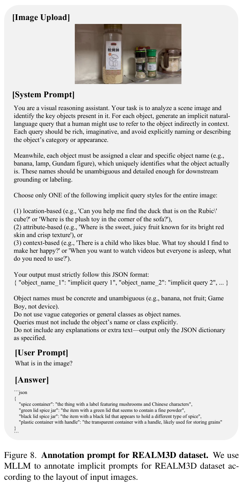

---
tags:
  - papers/3d-reasoning
  - papers/visually-grounded-reasoning
  - papers/training-free
aliases:
  - "REALM"
  - "REALM 3D Reasoning Segmentation"
date: 2025-10-18
doi: 10.48550/arXiv.2510.16410
arxiv_id: 2510.16410
---

# REALM: An MLLM-Agent Framework for Open World 3D Reasoning Segmentation and Editing on Gaussian Splatting

## 核心信息

- 标题: REALM: An MLLM-Agent Framework for Open World 3D Reasoning Segmentation and Editing on Gaussian Splatting
- 标题翻译: REALM：面向 3D Gaussian Splatting 开放世界 3D 推理分割与编辑的 MLLM-Agent 框架
- 作者: Changyue Shi, Minghao Chen, Yiping Mao, Chuxiao Yang, Xinyuan Hu, Zhijie Wang, Jiajun Ding, Zhou Yu
- 机构: Peking University; Hangzhou Dianzi University
- 发表时间: 2025-10-18
- 发表渠道: arXiv
- DOI: 10.48550/arXiv.2510.16410
- arXiv: 2510.16410
- 论文链接: https://arxiv.org/abs/2510.16410
- 代码 / 项目: https://ChangyueShi.github.io/REALM
- 数据 / 资源: REALM3D；LERF implicit annotations；3D-OVS implicit annotations
- 论文类型: AI 方法；3D reasoning segmentation；training-free MLLM-agent；3DGS grounding

## 原文摘要翻译

复杂人类指令与精确 3D 目标落地之间仍存在明显鸿沟。已有 3D 分割方法往往难以理解含歧义、需要推理的指令；而擅长这类推理的 2D 视觉语言模型又缺少内在的 3D 空间理解。

本文提出 REALM，一个 MLLM 智能体框架，用于在不进行大量 3D 专用后训练的情况下完成开放世界推理分割。方法直接在 3D 高斯溅射表示上做分割，利用 3DGS 可渲染高真实感新视角的能力，让 MLLM 更容易理解场景。

由于直接把一个或多个渲染视角输入 MLLM 会导致结果强烈依赖视角选择，作者提出 Global-to-Local Spatial Grounding。具体来说，多个全局视角先并行输入 MLLM-agent 做粗定位，并聚合响应以稳健识别目标对象；随后合成若干目标近景视图执行细粒度局部分割，得到准确且一致的 3D masks。

实验表明，REALM 在 LERF、3D-OVS 和新提出的 REALM3D 上能较好处理显式与隐式指令。此外，同一个 agent 框架还支持物体移除、替换和风格迁移等 3D 交互任务。

## 创新点

1. 把 3D reasoning segmentation 重写成“3DGS 多视角渲染 + 2D MLLM 推理 + 3D identity 回连”的组合问题。它没有训练新的 3D reasoning 模型，而是让现有 MLLM 在可控视角上做它擅长的 2D 视觉语义推理。
2. 构建 3D 特征场，把 SAM 掩码与时序传播得到的跨视角实例身份绑定到高斯基元。这样 2D 掩码不只是图像区域，而可以回连成持久 3D 对象身份。
3. 提出 LMSeg，把 MLLM 的边界框、类别、解释输出与 SAM 掩码、特征场实例图串起来，形成一个图像级推理分割器。
4. 提出 GLSpaG，全局阶段用 K-means 与 Top-K-ID 选择多样且 instance-rich 的视角做投票，局部阶段再用目标可见视角的近景 mask 细化 3D mask。
5. 构建 REALM3D，并重标注 LERF/3D-OVS 的 implicit prompt-mask pairs，使评测不再只覆盖显式类别查询。
6. 将 reasoning segmentation 的结果继续用于 3D editing，展示目标一旦在 3D 中被选中，就能支持 remove、replace 和 stylize。

## 一句话总结

REALM 的本质是把“MLLM 会理解隐式 2D 图像指令”这件事，通过 3DGS 渲染、实例特征场和多视角投票，变成可操作的 3D object mask；它是一个漂亮的 training-free 3D agent 编排方案，但并不等于无重建成本、无外部模型依赖或真正学会了原生 3D 推理。

## 研究问题

3D 视觉 grounding 和 2D MLLM reasoning 各自只解决了问题的一半。前者能把“杯子”这类显式类别落到 3D 表示上，但遇到“泰迪熊手里拿的饮料”“孩子喜欢蓝色应该找什么玩具”就缺少上下文和常识推理。后者能理解图像里的隐式语义，却不知道如何把答案稳定地落回一个 3D object mask。

*论文原图编号：Figure 1。REALM 任务形态：从隐式语言指令定位 3D 对象，并继续执行移除、替换和风格迁移。*

作者抓住的关键不是“MLLM 不够强”，而是“MLLM 的输入视角太不稳定”。单视角可能看不到目标、遮挡目标或缺少关系上下文；多视角一次性输入又会让 MLLM 难以整合。Figure 2 正是这个动机：直接喂随机视角，mIoU 随视角数和视角质量剧烈波动。

*论文原图编号：Figure 2。直接输入随机渲染视角会出现明显视角敏感性；REALM 需要有选择的多视角投票。*

因此 REALM 的研究问题可以压缩成一句话：如何在不训练新的 3D reasoning 模型的情况下，把 2D MLLM 的隐式指令理解能力稳定接到 3DGS 的可渲染、可编辑对象表示上？

## 数据与任务定义

### 输入与输出

输入是一个已经重建的 3DGS 场景和自然语言查询 $q$。查询可以是显式类别，也可以是空间关系、属性描述或上下文常识式隐式指令。输出是目标对象在 3DGS 中对应的一组 Gaussians / 3D mask，并可进一步用于 3D 编辑。

核心流程中还有两个中间输出：

- LMSeg 在某个视角图像上输出 bbox、category、explanation 和 2D mask。
- GLSpaG 将多个视角的 2D 推理结果聚合为 coarse 3D mask，再通过局部近景 refined 3D mask。

### 评测基准

| Benchmark | 内容 | 任务角色 |
|---|---|---|
| LERF | 选取 2 个代表性场景 | 原本多为显式 prompt，作者重标注 implicit queries |
| 3D-OVS | 选取 5 个场景 | 测试开放词汇 3D 分割下的隐式语言推理 |
| REALM3D | 100+ 个 3D 场景，1000+ 个提示-掩码对 | 新提出的 3D 推理分割基准 |

REALM3D 的场景来自多视角图像，使用 VGGT 生成 3D 点云与相机位姿，并用 Qwen2.5-VL 和 SAM 辅助标注提示-掩码对。这个设计能快速扩展数据规模，但也意味着基准分布可能继承 MLLM 和 SAM 的偏差。

*论文原图编号：Figure 8。REALM3D 标注 prompt：要求 MLLM 为对象生成不直接命名类别的 implicit query。*

### Baselines 与指标

对比方法包括 Gaga、GAGS 和 GS-Group。它们代表 3D 开放词汇分割或 3DGS 分割方向的相关基线。指标为 mIoU 和 mBIoU；前者评价区域重叠，后者更关注边界质量。

实现上，作者使用 PyTorch，设定 $N_{cluster}=24$、$N_{global}=8$，局部细化为 50 步，主要结果可在 NVIDIA RTX 3090 上得到。

## 方法主线

### 机制流程

REALM 可以拆成四个阶段：

1. 构建 3D 特征场。用 SAM 提取多视角实例掩码，用时序传播跨视角关联实例，给每个高斯基元学习一个身份特征。
2. 在单个渲染视角上运行 LMSeg。MLLM 根据图像和隐式查询生成边界框、类别与解释，SAM 把边界框转成掩码，再与渲染出的实例身份图相交得到目标 ID。
3. 全局 GLSpaG。对训练相机做 K-means，再用 Top-K-ID 选择实例丰富的全局视角；每个视角运行 LMSeg，并通过投票得到粗目标 ID。
4. 局部 GLSpaG。选择目标 ID 可见的局部视角，渲染近景图，重新运行 LMSeg 得到局部 2D 掩码，并用可微渲染将 3D 掩码与局部 2D 掩码对齐。

*论文原图编号：Figure 3。REALM 总体框架：下方是 3D 特征场与 LMSeg，上方是全局到局部空间落地。*

### 3D Feature Field：让 2D mask 回到 3D identity

3DGS 将场景表示为一组高斯基元。REALM 为每个高斯 $G_i=\{x_i,s_i,r_i,o_i,c_i\}$ 分配一个实例特征 $f_i ∈ R^D$，并通过阿尔法混合渲染成 2D 特征图：

$$
F=\sum_i f_i\alpha_i\prod_{j<i}(1-\alpha_j).
$$

之后用分类器 $CLS$ 预测逐像素 instance identity：

$$
\hat{id}(u,v)=\arg\max_k CLS(F)_{u,v,k}.
$$

这一步是整篇方法的“3D 锚”。没有它，MLLM 和 SAM 得到的只是一张 2D 图上的 mask；有了它，mask 可以被映射回一组具体 Gaussians，后续才能跨视角一致地分割和编辑。

### LMSeg：把隐式语言变成 2D mask 和 3D ID

给定渲染图像 $I$ 和查询 $q$，LMSeg 调用 MLLM：

$$
(B,C,E)=MLLM(I,q).
$$

其中 $B$ 是边界框，$C$ 是目标类别，$E$ 是解释。随后 SAM 根据边界框生成 2D 二值掩码。REALM 将该掩码与特征场渲染出的实例身份图相交，得到该视角下最可能的目标实例身份。

*论文原图编号：Figure 4。每个全局视角上 MLLM 都会给出 bbox、label 和 explanation；部分视角会失败，因此需要投票聚合。*

### GLSpaG：全局投票 + 局部细化

全局阶段的重点是视角选择。K-means 保证空间覆盖，Top-K-ID 倾向选择包含更多不同实例的视角。每个视角得到一个候选目标 ID 后，系统通过 voting 获得 coarse 3D mask。

局部阶段的重点是边界和目标消歧。系统选择目标 ID 出现在实例图中的局部相机，渲染近景，再让 LMSeg 产生局部 2D 掩码。粗 3D 掩码渲染回局部视角后，与局部掩码通过 L1 损失对齐：

$$
L_{local}=||\hat{M}_i-M_i^{2D-Local}||_1.
$$

*论文原图编号：Figure 6。GLSpaG 消融示例：global 给出粗定位，global + local refinement 改善目标选择和边界。*

这个设计很 WJ 值得记：global 解决“我应该选哪个 3D object ID”，local 解决“这个 object 的边界应该多精细”。两个阶段负责不同错误类型，不是简单堆更多视角。

## 关键结果

### 主结果

Table 1 是最核心结果。REALM 在三个 benchmark 上都明显超过 Gaga、GAGS 和 GS-Group：

*论文原图编号：表 1。REALM 在三个基准上的隐式查询均取得最高两项指标。*

| Dataset | REALM mIoU | REALM mBIoU | 次优观察 |
|---|---:|---:|---|
| LERF | 92.88 | 90.12 | Gaga 44.82 / 42.37，GS-Group 42.43 / 40.01 |
| 3D-OVS | 93.68 | 86.02 | GAGS 58.46 / 50.34 |
| REALM3D | 82.30 | 70.37 | GS-Group 65.55 / 55.99 |

这个结果说明现有 3D open-vocabulary segmentation 方法在 implicit queries 下确实会明显掉队。它们能抓关键词或显式类别，但不擅长“根据关系/常识/上下文判断目标”。

*论文原图编号：Figure 5。空间关系、歧义描述、上下文理解三类查询中，REALM 更能选中真正目标。*

Figure 5 的例子很好理解：对于“泰迪熊手里拿的饮料”，基线容易激活泰迪熊或不相关饮品；REALM 通过 MLLM 理解“被拿着”的关系，并通过 3D 身份回连成目标杯子。

### 3D 编辑展示

*论文原图编号：Figure 7。目标对象一旦在 3D 中被 grounding，REALM 可以执行 remove、replace 和 stylize。*

编辑结果不是主指标，但它说明 REALM 的掩码是可操作的 3D 对象选择，而不仅是某个视角上的 2D 分割。如果只有 2D 掩码，编辑很难跨视角一致；如果拿到 3D 高斯集合，就能直接接到 3D 编辑流程。

### 消融结果

Table 2 展示了 REALM 最有价值的机制证据：

*论文原图编号：Table 2。GLSpaG 组件、相机采样、聚类数量、全局视角数量、细化步数和渲染效率消融。*

关键数字如下：

| 消融项 | 结果 |
|---|---|
| Global reasoning only | 0.89 mIoU / 0.88 mBIoU / 20.21s |
| + Local reasoning | 0.89 / 0.88 / 79.68s |
| + Local refinement | 0.95 / 0.94 / 83.35s |
| w/o K-means | 0.38 / 0.38 |
| K-means + Top-K-ID | 0.95 / 0.94 |
| $N_{cluster}=24$ | 0.95 / 0.94 |
| $N_{global}=8$ | 0.95 / 0.94 / 83.35s |
| refinement 50 steps | 0.95 / 0.94 |
| refinement 500 steps | 0.79 / 0.76 |

这里最值得注意的是三点。第一，K-means 与 Top-K-ID 不是小技巧，而是全局阶段能否工作的关键。第二，local refinement 的收益主要体现在边界质量和细粒度选择，但代价是明显时延。第三，refinement 不是越多越好，500 或 1000 步会过拟合或退化。

## 深度分析

### 这篇论文真正聪明的地方

REALM 没有试图训练一个“懂 3D 的 MLLM”。它反过来承认现有 MLLM 的强项和弱项：强项是看单张图做语义推理，弱项是跨视角、跨 3D 空间绑定。于是方法把 3D 问题拆成 MLLM 能做的视角级任务，再用特征场身份和投票把这些 2D 结论重新缝回 3D。

这个思路在 reasoning 目录里很有代表性。DeepScan、VisRef、ICoT 等训练自由方法都在做一件事：不改模型参数，而是通过测试时结构把视觉证据变得更“可用”。REALM 的特殊之处在于证据不只是 2D 局部裁剪或视觉标记，而是一组 3D 高斯基元。

### 为什么 3D Feature Field 是关键而不是配角

如果没有特征场，LMSeg 的输出只是在某张渲染图上的掩码，无法保证同一物体在其他视角中保持一致。3D 特征场把“对象身份”写进高斯基元，使每次 2D 推理都能落到同一个 3D 身份空间。

这也是 REALM 和一般 MLLM 多图推理的本质差别。多图推理只能说“这些图好像都指向同一个东西”；REALM 可以把这个东西变成一个可编辑的 3D mask。

### Training-free 的真实边界

REALM 适合归到 `TrainingFree`，因为它没有对 MLLM 做 3D 专用后训练，也没有训练新的推理控制器。但它绝不是“零成本”：

- 需要先有 3DGS reconstruction。
- 需要用 SAM 和 temporal propagation 构建跨视角 instance supervision。
- 需要优化 3D Feature Field。
- 每次查询需要多视角 MLLM/SAM 调用。
- local refinement 在消融中带来 80 秒级别的单样本耗时。

所以它的定位更准确地说是“免 3D reasoning 模型训练的 inference-time agent framework”，而不是完全轻量的 plug-and-play 方法。

### 结果最强的部分和最危险的部分

最强部分是两个表的组合。Table 1 证明相比现有 3D 开放词汇基线，REALM 在隐式查询下确实强很多；Table 2 进一步说明这种强不是随便多渲染几张图，而是依赖有结构的相机选择、全局投票和局部细化。

最危险部分是基准与 MLLM 依赖。REALM3D 的标注部分依赖 Qwen2.5-VL 和 SAM，方法本身也依赖 MLLM 与 SAM。

如果数据生成模型和方法调用模型共享偏好，那么基准可能更有利于这类 MLLM 智能体流程。论文有很强的工程与方法启发，但后续最好用真实人类指令和更多 3D 表示来验证泛化。

## 局限

1. 场景级预处理重。REALM 需要 3DGS、SAM 掩码、时序传播和特征场优化，部署成本不低。
2. 查询时延不小。Table 2 中 full local refinement 为 83.35s，适合离线编辑或交互式研究原型，离实时机器人仍有距离。
3. 依赖 MLLM 与 SAM 质量。若 MLLM 多视角都给出合理但错误的解释，投票可能强化错误；若 SAM 掩码或时序传播错，3D 身份会被污染。
4. 基准标注有模型辅助。REALM3D 的隐式提示和掩码部分由 Qwen2.5-VL/SAM 生成，可能存在分布偏差。
5. 表示形式较窄。论文主要验证 3DGS，尚未说明在 point cloud、mesh、dynamic scene 或开放真实机器人环境中的表现。
6. 失败案例分析不足。论文展示了强结果，但缺少系统 failure taxonomy，例如遮挡、多实例近邻、反事实指令、跨房间关系和 MLLM hallucination。

## 我的笔记

这篇最适合被放在 `Reasoning/TrainingFree` 的 3D 分支里。它和 DeepScan 的精神很像：先把视觉证据找准，再让语言模型推理。但 DeepScan 的证据是 2D 局部区域，REALM 的证据是可编辑的 3D 高斯集合。

我会把 REALM 的可复用 insight 写成三句话：

1. 不要强迫 VLM 一步完成 3D grounding；先把 3D world 渲染成它能理解的视角集合。
2. 每个 2D 推理输出都必须回连到 persistent 3D identity，否则多视角只是多张图而不是 3D grounding。
3. Global 阶段负责“选谁”，local 阶段负责“边界多准”，这两个目标最好分开优化。

如果后面做自己的 3D agent，可以直接借鉴这个分解：渲染器产生视角，VLM 产生语义提议，几何/身份场做跨视角绑定，局部优化器做掩码细化。

## 引用

Shi, C., Chen, M., Mao, Y., Yang, C., Hu, X., Wang, Z., Ding, J., & Yu, Z. REALM: An MLLM-Agent Framework for Open World 3D Reasoning Segmentation and Editing on Gaussian Splatting. arXiv:2510.16410, 2025.
