# Routing Before Looking: Query-Adaptive Evidence Acquisition for Long-form Video Understanding

## Page & Section Index
- **Abstract** (Page 1)
- **1 Introduction** (Pages 1–3)
- **2 Related Works** (Page 3)
  - 2.1 Video Agentic Models
  - 2.2 Test-Time Adaptation for Agents
- **3 Method: Route2Look** (Pages 3–6)
  - 3.1 Agentic Evidence Acquisition Protocol
  - 3.2 Toolkit Construction
  - 3.3 Query-Adaptive Routing with Distilled Skills
- **4 Experiments** (Pages 6–9)
  - 4.1 Experimental Settings
  - 4.2 Main Results
  - 4.3 Ablation Studies
  - 4.4 Case Studies
- **5 Conclusion** (Page 9)
- **Limitations & Acknowledgements** (Page 9)
- **References** (Pages 9–12)
- **Appendix** (Pages 13–19)
  - A Hyperparameter Analysis & Implementation Details
  - B Efficiency Analysis
  - C Algorithm Demonstration
  - D Oracle Routing Analysis
  - E Domain Generalization
  - F Distilled Skill Visualization & Case Studies
  - G Failure Case Analysis

## Terminology Ledger
| 英文术语 | 规范中文翻译 | 备注 / 定义 |
| :--- | :--- | :--- |
| Query-Adaptive Evidence Acquisition | 查询自适应证据获取 | 根据具体问题的认知需求动态选择证据搜集策略 |
| Routing Before Looking | 先路由后观察 | 在实际消耗视觉感知算力前预先决策检索/生成路线 |
| Route2Look | Route2Look 智能体 | 本文提出的查询自适应长视频理解 Agent |
| Generation-based Strategy | 基于生成的策略 (粗粒度全局浏览+渐进定位) | 依赖全局下采样、时序粗读与轻量验证 |
| Retrieval-based Strategy | 基于检索的策略 (精细化局部检索+密集验证) | 依赖多模态检索、高召回候选片段与密集切片比对 |
| Distilled Skill Patch | 蒸馏技能补丁 | 结构化的可复用路由策略规则库 (Trigger-Route-Lesson) |
| Differential Contrastive Analysis | 差异对比分析 | 对比生成与检索两种执行轨迹优劣并提炼归纳准则 |
| Working Memory | 工作记忆 | 智能体在多步循环中维护的当前中间线索与证据快照 |
| Context Memory | 上下文记忆 | 跨轮累积的历史轨迹与候选时空切片索引 |

---

## Abstract

> <strong>Para. 1:</strong> Long-form video understanding remains challenging for video agents due to the mismatch between query demands and evidence acquisition strategies. Although recent planning-before-perception methods outperform query-agnostic pipelines, they often rely on a single dominant strategy, either generation-based strategy or retrieval-based strategy, limiting their ability to handle diverse query demands. We propose Route2Look, a query-adaptive video agent for long-form video understanding. Instead of committing to a fixed workflow, Route2Look dynamically determines whether a query favors generation-based skimming or retrieval-based scanning before looking into the video.
> <strong>Para. 1[CN]:</strong> 由于查询需求与证据获取策略之间的不匹配，长视频理解对于视频智能体而言仍然是一项极具挑战性的任务。尽管近期提出的“感知前规划”方法优于与查询无关的流水线，但它们通常依赖单一主导策略（要么是基于生成的策略，要么是基于检索的策略），从而限制了其处理多样化查询需求的能力。我们提出了 Route2Look，一种用于长视频理解的查询自适应视频智能体。Route2Look 并没有拘泥于固定的工作流，而是在真正深入审视视频之前，动态判定当前查询究竟更适合采用基于生成的粗读略过策略，还是基于检索的精细扫描策略。

> <strong>Para. 2:</strong> To guide this decision, we distill a compact, human-readable routing skill from the differential contrastive analysis of competing agentic trajectories, identifying which query characteristics favor each strategy. During inference, the agent matches the query to the learned routing conditions and executes the corresponding workflow with adaptive early stopping. Extensive experiments on three long video understanding benchmarks (LVBench, VideoMME, and LongVideoBench) demonstrate that Route2Look outperforms existing video agents and foundation models while maintaining high frame efficiency. On LVBench, Route2Look achieves 75.4% accuracy, outperforming DVD by 1.2% while using only 2.5% of its frame budget.
> <strong>Para. 2[CN]:</strong> 为指导该决策，我们通过对相互竞争的智能体执行轨迹进行差异对比分析，蒸馏出紧凑、人类可读的路由技能，识别出哪些查询特征倾向于何种策略。在推理过程中，智能体将当前查询与已学习的路由条件相匹配，并在自适应早停机制下执行相应的工作流。在三个长视频理解基准测试（LVBench、VideoMME 和 LongVideoBench）上的大量实验表明，Route2Look 在保持极高帧效率的同时超越了现有的视频智能体和基座模型。在 LVBench 上，Route2Look 取得了 75.4% 的准确率，以仅消耗 DVD 2.5% 的帧预算反超了 DVD 1.2 个百分点。

---

## 1 Introduction

> <strong>Para. 3:</strong> Long-form video understanding presents profound challenges for Multimodal Large Language Models (MLLMs), as hour-long videos often contain hundreds of thousands of frames that far exceed the context length of current architectures. Directly feeding downsampled frames into MLLMs causes severe information loss, while dense frame ingestion leads to prohibitive computational costs and context pollution. To address this challenge, recent works have explored video agents that decompose long video understanding into multi-step planning, tool-assisted perception, and iterative reasoning.
> <strong>Para. 3[CN]:</strong> 长视频理解给多模态大语言模型（MLLM）带来了深刻的挑战，因为长达数小时的视频通常包含数十万帧，远远超出了当前模型架构的上下文长度。直接向 MLLM 输入下采样帧会导致严重的信息丢失，而密集输入帧则会带来难以承受的计算开销和上下文污染。为应对这一挑战，近期的工作探索了视频智能体（video agents），将长视频理解分解为多步规划、工具辅助感知和迭代推理。

**Caption:** Figure 1: Real-world long-video queries demand different evidence acquisition strategies. Query-agnostic agents apply a uniform workflow across all queries, resulting in suboptimal performance and efficiency. Route2Look dynamically routes each query to its preferred strategy before visual inspection, balancing accuracy and computation.
**Caption[CN]:** 图 1：现实世界中的长视频查询需要不同的证据获取策略。与查询无关的智能体对所有查询应用统一的工作流，导致性能与效率欠佳。Route2Look 在视觉检查之前将每个查询动态路由至其偏好的策略，从而平衡了准确率与计算开销。

> <strong>Para. 4:</strong> However, existing video agents typically rely on a single dominant evidence acquisition strategy applied uniformly across all queries. As illustrated in Figure 1, long-video queries in practice exhibit vastly divergent evidence requirements:
> (1) Global understanding queries (e.g., summarizing storyline arcs, identifying recurring characters) require broad contextual coverage and are naturally suited for generation-based skimming, which samples coarse anchor frames and reasons over temporal continuity.
> (2) Explicit temporal queries (e.g., verifying an action within a known timestamp window) require localized verification, where narrow-window frame decoding suffices.
> (3) Implicit temporal queries (e.g., counting subtle actions across the whole video, or locating a transient object mention) present the most intricate challenge, requiring high-recall semantic retrieval followed by fine-grained verification.
> <strong>Para. 4[CN]:</strong> 然而，现有的视频智能体通常依赖单一主导的证据获取策略，并机械地将其应用于所有查询。如图 1 所示，现实场景中的长视频查询展现出截然不同的证据需求：
> (1) 全局理解查询（例如总结故事情节走向、识别反复出现的角色）需要广泛的上下文覆盖面，天生契合基于生成的粗读略过策略，该策略通过采样粗粒度锚点帧并在时序连续性上进行推理；
> (2) 显式时序查询（例如在已知时间戳窗口内验证某个动作）需要局部化验证，此时窄窗口帧解码已足以应对；
> (3) 隐式时序查询（例如统计整部视频中细微动作的出现次数，或定位某个短暂出现的物体）则带来了最复杂的挑战，需要高召回率的语义检索，随后辅以细粒度的局部比对验证。

> <strong>Para. 5:</strong> Applying a retrieval-based pipeline to a global query often fragments the narrative context and retrieves false-positive snippets, incurring redundant verification overhead. Conversely, applying a generation-based skimming pipeline to a localized, fine-grained query frequently misses brief evidence due to sparse temporal sampling. This fundamental mismatch between query demands and fixed evidence acquisition workflows severely limits both the accuracy and compute efficiency of current video agents.
> <strong>Para. 5[CN]:</strong> 将基于检索的流水线套用到全局查询中，往往会割裂叙事上下文并检索出误报片段，产生大量冗余的验证开销；反之，将基于生成的粗读流水线应用于局部细粒度查询时，又常因时序采样稀疏而漏掉转瞬即逝的关键证据。这种查询需求与固定证据获取工作流之间的根本性不匹配，严重制约了现有视频智能体的准确率和计算效率。

> <strong>Para. 6:</strong> In this paper, we propose Route2Look, a query-adaptive evidence acquisition framework for long-form video understanding. The core philosophy of Route2Look is "Routing Before Looking": the agent actively inspects the linguistic query, infers its latent temporal and semantic evidence demands, and dynamically routes to either a generation-based or retrieval-based acquisition trajectory prior to invoking expensive video perception tools.
> <strong>Para. 6[CN]:</strong> 在本文中，我们提出了 Route2Look，一种面向长视频理解的查询自适应证据获取框架。Route2Look 的核心理念在于“先路由后观察”（Routing Before Looking）：智能体在调用昂贵的视频感知工具之前，主动审视语言查询文本，推断其潜在的时序与语义证据需求，并动态路由至基于生成或基于检索的证据获取轨迹。

---

## 2 Related Works

> <strong>Para. 7:</strong> **Video Agentic Models.** Recent advances in Multimodal LLMs have spurred the emergence of agentic frameworks for video processing. Unlike traditional one-pass feed-forward models that ingest uniformly subsampled clips (e.g., Video-ChatGPT, PLLaVA, Qwen2.5-VL), agentic approaches formulate video reasoning as an iterative decision-making process. VideoAgent leverages memory buffers and tool invocation; VideoTree builds tree-structured hierarchical summaries; DVD orchestrates multi-granular search tools; and VideoSeek navigates videos via logic-flow guidance. However, these systems adhere to pre-baked, static workflows that treat heterogeneous queries uniformly, failing to capitalize on query-conditioned strategy routing.
> <strong>Para. 7[CN]:</strong> **视频智能体模型。** 多模态大语言模型的最新进展推动了面向视频处理的智能体架构的涌现。与传统的统一均匀下采样单次前向模型（如 Video-ChatGPT、PLLaVA、Qwen2.5-VL）不同，智能体范式将视频推理表述为迭代决策过程。VideoAgent 利用记忆缓冲区和工具调用；VideoTree 构建树状分层摘要；DVD 编排多粒度搜索工具；VideoSeek 则通过逻辑流引导在视频中巡航。然而，这些系统均拘泥于预设的静态工作流，对异构查询一视同仁，未能有效利用查询条件下的策略路由。

> <strong>Para. 8:</strong> **Test-Time Adaptation for Agents.** To empower LLM agents with specialized domain behaviors without prohibitive parameter fine-tuning, test-time adaptation and in-context policy optimization have gained significant traction. Methods such as Reflexion and Voyager introduce self-reflective memory and skill libraries. In video reasoning, distilling interpretable behavioral rules into compact prompt patches provides a modular, training-free mechanism to steer agent deliberation, preserving model flexibility while avoiding catastrophic forgetting.
> <strong>Para. 8[CN]:</strong> **智能体的测试时自适应。** 为了赋予 LLM 智能体特定的领域行为而无需耗费高昂成本进行参数微调，测试时自适应与上下文策略优化受到了极大的关注。Reflexion 和 Voyager 等方法引入了自我反思记忆与技能库。在视频推理中，将可解释的行为规则蒸馏为紧凑的提示补丁，为引导智能体深思熟虑提供了一种模块化、免训练的机制，在保持模型灵活性的同时避免了灾难性遗忘。

---

## 3 Method: Route2Look

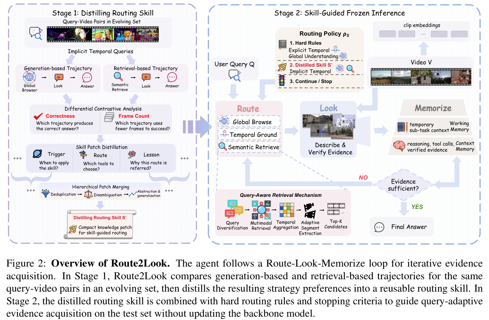
**Caption:** Figure 2: Overview of Route2Look. The agent follows a Route-Look-Memorize loop for iterative evidence acquisition. In Step 1 (Route), the agent matches the query against distilled routing skills to select between Generation-based and Retrieval-based strategies. In Step 2 (Look), the chosen toolkit gathers evidence. In Step 3 (Memorize), observations are aggregated into working memory with adaptive early-stopping verification.
**Caption[CN]:** 图 2：Route2Look 总体架构概览。智能体遵循“路由–观察–记忆”（Route-Look-Memorize）循环进行迭代证据获取。在步骤 1（路由）中，智能体将查询与蒸馏出的路由技能匹配，在基于生成与基于检索的策略之间做出抉择；在步骤 2（观察）中，所选工具包搜集视频证据；在步骤 3（记忆）中，观测结果被汇聚至工作记忆中，并通过自适应早停机制进行验证。

### 3.1 Agentic Evidence Acquisition Protocol

> <strong>Para. 9:</strong> Formally, given a long video $V$ of duration $T$ and a user query $Q$, the video agent aims to predict the correct answer $\hat{Y} \in \mathcal{Y}$. We define an agentic trajectory over discrete reasoning steps $t \in \{1, \dots, N_{\max}\}$. At step $t$, the agent maintains an internal state $S_t = (Q, M_t, H_t)$, where $M_t$ represents the working memory containing distilled multimodal evidence, and $H_t$ is the interaction history of prior tool invocations and reasoning steps.
> <strong>Para. 9[CN]:</strong> 形式化地，给定一段时长为 $T$ 的长视频 $V$ 和用户查询 $Q$，视频智能体的目标是预测出正确答案 $\hat{Y} \in \mathcal{Y}$。我们将智能体执行轨迹定义在离散推理步 $t \in \{1, \dots, N_{\max}\}$ 上。在第 $t$ 步，智能体维护内部状态 $S_t = (Q, M_t, H_t)$，其中 $M_t$ 表示包含已蒸馏多模态证据的工作记忆，而 $H_t$ 则是之前工具调用与推理步骤的交互历史记录。

> <strong>Para. 10:</strong> At each step, the policy $\pi_	heta(a_t | S_t)$ generates an action $a_t = (c_t, 	ext{args}_t)$, which selects an evidence acquisition tool $c_t \in \mathcal{C}$ with arguments $	ext{args}_t$. The environment executes the tool on video $V$ and returns an observation $O_t$. The agent then updates its working memory $M_{t+1} = 	ext{Update}(M_t, O_t)$ and evaluates an evidence sufficiency condition: if the gathered evidence in $M_{t+1}$ uniquely resolves $Q$, the agent terminates early and outputs $\hat{Y}$; otherwise, it proceeds to step $t+1$.
> <strong>Para. 10[CN]:</strong> 在每一步中，策略 $\pi_	heta(a_t | S_t)$ 生成动作 $a_t = (c_t, 	ext{args}_t)$，该动作选择证据获取工具 $c_t \in \mathcal{C}$ 并附带参数 $	ext{args}_t$。执行环境在视频 $V$ 上执行该工具并返回观测结果 $O_t$。智能体随后更新其工作记忆 $M_{t+1} = 	ext{Update}(M_t, O_t)$ 并评估证据充分性条件：如果 $M_{t+1}$ 中累积的证据足以明确解答 $Q$，智能体便提前终止并输出 $\hat{Y}$；否则继续推进至第 $t+1$ 步。

### 3.2 Toolkit Construction

> <strong>Para. 11:</strong> To support diverse evidence acquisition workflows, Route2Look is equipped with three core tools:
> (1) **Global Browse**: Uniformly samples $K_{	ext{global}}$ anchor frames across the entire video duration to establish a coarse-grained global narrative timeline and detect overall scene transitions.
> (2) **Temporal Ground**: Given a predicted temporal interval $[t_{	ext{start}}, t_{	ext{end}}]$, extracts a localized frame clip and decodes dense visual frames at a higher framerate to verify fine-grained actions and state changes.
> (3) **Semantic Retrieve**: Executes multimodal embedding similarity matching over pre-extracted dense video clip captions, ASR transcripts, and OCR tokens, returning top-$K_{	ext{ret}}$ candidate segments ranked by relevance scores:
> <strong>Para. 11[CN]:</strong> 为支持多样化的证据获取工作流，Route2Look 配备了三个核心工具：
> (1) **全局浏览 (Global Browse)**：在整段视频时程中均匀采样 $K_{	ext{global}}$ 个锚点帧，以建立粗粒度的全局叙事时间线并检测整体场景转换；
> (2) **时序定位 (Temporal Ground)**：给定预测的时序区间 $[t_{	ext{start}}, t_{	ext{end}}]$，提取局部帧片段并以更高的帧率解码密集视觉帧，以验证细粒度动作与状态变化；
> (3) **语义检索 (Semantic Retrieve)**：在预先提取的密集视频片段字幕、ASR 语音转录文本与 OCR 文本标记上执行多模态嵌入相似度匹配，返回按相关性得分排序的前 $K_{	ext{ret}}$ 个候选片段：

$$	ext{Sim}(Q, C_i) = lpha \cdot \cos(\mathbf{e}_Q, \mathbf{e}_{C_i}^{	ext{text}}) + (1-lpha) \cdot \cos(\mathbf{e}_Q, \mathbf{e}_{C_i}^{	ext{vis}})$$

### 3.3 Query-Adaptive Routing with Distilled Skills

> <strong>Para. 12:</strong> Rather than training a black-box parametric classifier, Route2Look distills an interpretable, human-readable routing skill library $\mathcal{S} = \{(	ext{Trigger}_i, 	ext{Route}_i, 	ext{Lesson}_i)\}_{i=1}^{M}$ via differential contrastive analysis over an offline evolution set $\mathcal{D}_{	ext{evolve}}$.
> <strong>Para. 12[CN]:</strong> Route2Look 没有训练黑盒参数化分类器，而是通过在离线演化集 $\mathcal{D}_{	ext{evolve}}$ 上进行差异对比分析，蒸馏出一个可解释、人类可读的路由技能库 $\mathcal{S} = \{(	ext{Trigger}_i, 	ext{Route}_i, 	ext{Lesson}_i)\}_{i=1}^{M}$。

> <strong>Para. 13:</strong> For each training query $Q \in \mathcal{D}_{	ext{evolve}}$, we roll out two competing trajectories: a Generation-based trajectory $	au_{	ext{gen}}$ (executing Global Browse followed by iterative Temporal Grounding) and a Retrieval-based trajectory $	au_{	ext{ret}}$ (executing Semantic Retrieve followed by dense local inspection). An LLM judge evaluates the correctness and frame cost of both trajectories:
> <strong>Para. 13[CN]:</strong> 对于演化集中的每个训练查询 $Q \in \mathcal{D}_{	ext{evolve}}$，我们分别展开两条相互竞争的轨迹：基于生成的轨迹 $	au_{	ext{gen}}$（先执行全局浏览，后进行迭代时序定位）和基于检索的轨迹 $	au_{	ext{ret}}$（先执行语义检索，后进行密集局部检查）。由 LLM 评判器评估两条轨迹的正确性与用帧开销：

$$\Delta(	au_{	ext{gen}}, 	au_{	ext{ret}}) = \mathbb{I}(	ext{Acc}(	au_{	ext{gen}}) > 	ext{Acc}(	au_{	ext{ret}})) \lor \left(	ext{Acc}(	au_{	ext{gen}}) = 	ext{Acc}(	au_{	ext{ret}}) \land 	ext{Cost}(	au_{	ext{gen}}) < 	ext{Cost}(	au_{	ext{ret}})
ight)$$

> <strong>Para. 14:</strong> From these differential comparisons, the LLM extracts recurring linguistic patterns and cognitive requirements, summarizing them into discrete skill patches. During online inference, the agent embeds these distilled skills directly into its reasoning prompt, enabling zero-shot, query-conditioned routing before invoking perception.
> <strong>Para. 14[CN]:</strong> 从这些差异对比中，LLM 提取出反复出现的语言模式与认知需求，将其归纳总结为离散的技能补丁。在线推理时，智能体直接将这些蒸馏出的技能嵌入其推理提示词中，从而在调用感知模块前实现零样本、查询条件化的自适应路由。

---

## 4 Experiments

### 4.1 Experimental Settings

> <strong>Para. 15:</strong> We evaluate Route2Look on three benchmark datasets for long-form video understanding:
> - **LVBench**: 1,549 multiple-choice questions across 103 hour-long videos covering diverse genres (documentaries, movies, sports, tutorials).
> - **VideoMME (Long split)**: 900 questions spanning videos with durations from 30 minutes to 1 hour (average 2,466 seconds).
> - **LongVideoBench (Long split)**: 564 questions from videos lasting 900–3,600 seconds.
> The primary backbone for Route2Look is GPT-5 as the agent reasoning core and visual inspector, with evaluations conducted under identical conditions against leading baselines.
> <strong>Para. 15[CN]:</strong> 我们在三个长视频理解基准数据集上对 Route2Look 进行了全面评测：
> - **LVBench**：涵盖纪录片、电影、体育、教程等多种流派的 103 部小时级长视频，共计 1,549 道多项选择题。
> - **VideoMME（长视频子集）**：包含 900 道题目，视频时长介于 30 分钟至 1 小时之间（平均 2,466 秒）。
> - **LongVideoBench（长视频子集）**：包含来自时长 900–3,600 秒视频的 564 道题目。
> Route2Look 的主干默认采用 GPT-5 作为智能体推理核心与视觉检查器，并在与领先基线相同的条件下进行评测。

### 4.2 Main Results

**Caption:** Table 1: Main results on three long video understanding benchmarks. #Frames denotes the number of processed frames. Best results are in bold, second-best are underlined.
**Caption[CN]:** 表 1：在三个长视频理解基准测试上的主要结果。#Frames 表示所处理的帧数。最佳结果加粗表示，次优结果带下划线标出。

| Type | Method | LVBench #Frames↓ | LVBench Acc↑ | VideoMME (Long) #Frames↓ | VideoMME (Long) Acc↑ | LongVideoBench (Long) #Frames↓ | LongVideoBench (Long) Acc↑ |
| :--- | :--- | :---: | :---: | :---: | :---: | :---: | :---: |
| **VLM-based** | Qwen2.5-VL-72B (Bai et al., 2025b) | 768 | 47.3% | 256 | 53.2% | - | - |
| | Qwen3-VL-8B (Bai et al., 2025a) | 768 | 45.8% | 256 | 59.3% | - | - |
| | Qwen3.5-9B (Team, 2026) | 768 | 60.8% | 256 | 67.3% | - | - |
| | Gemini-1.5-Pro (Team et al., 2024) | 3600 | 33.1% | 1233 | 67.4% | 256 | 58.6% |
| | Gemini 2.0 Flash (Pichai et al., 2024) | 4037 | 48.3% | 1233 | 63.0% | 256 | 45.7% |
| | GPT-4o (Hurst et al., 2024) | 384 | 30.8% | 384 | 65.3% | 256 | 60.9% |
| | GPT-5 (Singh et al., 2025) | 384 | 60.1% | 384 | 67.9% | 384 | 64.5% |
| **Agent-based** | VideoAgent (Wang et al., 2024b) | 25.5 | 29.3% | 24.6 | 46.4% | - | - |
| | VideoTree (Wang et al., 2025b) | 103.2 | 28.8% | 98.0 | 53.1% | - | - |
| | DrVideo (Ma et al., 2025) | - | - | 493.2 | 51.7% | - | - |
| | VCA (Yang et al., 2025a) | 20.0 | 41.3% | 18.1 | 54.2% | - | - |
| | Mr.Video (Pang and Wang, 2025) | 8074 | 60.8% | 4932 | 61.8% | 2816 | 61.6% |
| | DVD (Zhang et al., 2026a) | 8074 | <u>74.2%</u> | 4932 | 67.3% | 2816 | <u>68.6%</u> |
| | VideoSeek (Lin et al., 2026a) | 92.3 | 68.4% | 60.9 | <u>70.1%</u> | 29.6 | 73.5% |
| **Ours** | **Route2Look** | 202.3 | **75.4%** | 126.6 | **76.1%** | 168.7 | **77.8%** |

> <strong>Para. 16:</strong> As shown in Table 1, Route2Look achieves new state-of-the-art results across all three benchmarks. On LVBench, Route2Look achieves 75.4% accuracy, surpassing DVD by 1.2% while requiring only 202.3 frames compared to DVD's 8,074 frames—a dramatic 97.5% reduction in visual processing budget. On VideoMME (Long), Route2Look reaches 76.1% accuracy, outperforming VideoSeek by 6.0%. On LongVideoBench, Route2Look achieves 77.8%, outpacing DVD by 9.2% and VideoSeek by 4.3%.
> <strong>Para. 16[CN]:</strong> 如表 1 所示，Route2Look 在所有三个基准测试中均刷新了当前最佳水平（SOTA）。在 LVBench 上，Route2Look 达到了 75.4% 的准确率，以仅需 202.3 帧的开销超越了 DVD（74.2%，需处理 8,074 帧），使视觉处理预算大幅锐减了 97.5%。在 VideoMME（长视频）上，Route2Look 达到 76.1% 的准确率，超出 VideoSeek 6.0 个百分点。在 LongVideoBench 上，Route2Look 达到 77.8%，分别领先 DVD 9.2% 和 VideoSeek 4.3%。

**Caption:** Figure 3: Performance breakdown by query type on LVBench. The upper panel shows accuracy, and the lower panel shows frame usage in log scale. Query-type ratios are shown in parentheses on the x-axis.
**Caption[CN]:** 图 3：LVBench 上按查询类型的性能分解图。上图显示准确率，下图以对数尺度展示帧消耗量。横轴括号内标注了各类查询的占比。

### 4.3 Ablation Studies

**Caption:** Table 2: Ablation studies on core components on LVBench. "Gen." and "Ret." denote generation-based and retrieval-based strategies; "Diff. Con." denotes differential contrastive analysis.
**Caption[CN]:** 表 2：LVBench 上核心组件的消融实验结果。“Gen.”与“Ret.”分别表示基于生成与基于检索的策略；“Diff. Con.”表示差异对比分析。

| Gen. | Ret. | Routing | Diff. Con. | Acc (%) | #Frames |
| :---: | :---: | :---: | :---: | :---: | :---: |
| ✓ | – | – | – | 63.5 | 107.5 |
| – | ✓ | – | – | 68.5 | 290.7 |
| ✓ | ✓ | Random | – | 65.8 | 196.8 |
| ✓ | ✓ | Heuristic | – | 66.5 | 255.4 |
| ✓ | ✓ | Learned | ✗ | 61.5 | 238.6 |
| ✓ | ✓ | **Learned** | **✓** | **70.0** | **244.9** |
| ✓ | ✓ | *Oracle* | – | *81.5* | *131.8* |

> <strong>Para. 17:</strong> Table 2 ablates the essential design choices on a stratified 200-sample subset of LVBench. Single-strategy variants reveal clear trade-offs: Retrieval-only outperforms Generation-only by 5.0% (68.5% vs 63.5%) but consumes 2.7× more frames (290.7 vs 107.5). Random routing yields an intermediate accuracy of 65.8%, proving that indiscriminate mixing is suboptimal. Heuristic keyword-based routing achieves 66.5%, still trailing the learned skill routing by 3.5%. Removing differential contrastive analysis drops accuracy sharply to 61.5%, verifying the necessity of trajectory comparison. Finally, an Oracle router achieves 81.5% accuracy with only 131.8 frames, indicating substantial remaining ceiling for adaptive routing.
> <strong>Para. 17[CN]:</strong> 表 2 在 LVBench 的 200 样本分层子集上对核心设计选择进行了消融。单一策略变体揭示了明显的权衡取舍：仅检索策略虽然准确率比仅生成策略高出 5.0%（68.5% 对比 63.5%），但用帧量高出 2.7 倍（290.7 帧对比 107.5 帧）。随机路由得到 65.8% 的中间准确率，证明无差别的盲目混合是次优的。基于启发式关键词的路由达到 66.5%，仍落后于所学习的技能路由 3.5 个百分点。去除差异对比分析后准确率骤降至 61.5%，印证了轨迹比较的必要性。最后，Oracle 理想路由能够以仅 131.8 帧实现 81.5% 的准确率，表明自适应路由技术未来仍有广阔的提升空间。

**Caption:** Table 3: Compatibility with different LLM and VLM backbones on LVBench.
**Caption[CN]:** 表 3：LVBench 上与不同 LLM 和 VLM 主干模型的兼容性评测。

| LLM Backbone | VLM Backbone | Acc (%) | #Frames |
| :--- | :--- | :---: | :---: |
| GPT-5 | Qwen2.5-VL | 41.0 | 317.7 |
| GPT-5 | Qwen3-VL | 47.5 | 116.8 |
| GPT-5 | Qwen3.5-VL | 54.5 | 156.2 |
| GPT-4o | GPT-5 | 45.5 | 300.8 |
| GPT-4.1 | GPT-5 | 58.0 | 282.1 |
| **GPT-5** | **GPT-5** | **70.0** | **244.9** |

> <strong>Para. 18:</strong> As shown in Table 3, Route2Look demonstrates strong architectural modularity across diverse LLM reasoning agents and VLM visual inspectors. Upgrading the VLM from Qwen2.5-VL to Qwen3.5-VL boosts accuracy from 41.0% to 54.5%, confirming that high-quality visual perception directly empowers agent verification. Similarly, stronger LLM backbones improve routing decisions and evidence synthesis.
> <strong>Para. 18[CN]:</strong> 如表 3 所示，Route2Look 在不同 LLM 推理智能体与 VLM 视觉检查器之间展现出强大的架构模块化兼容性。将 VLM 从 Qwen2.5-VL 升级至 Qwen3.5-VL 可使准确率从 41.0% 跃升至 54.5%，证实高质量的视觉感知能直接赋能智能体证据验证。类似地，更强的主干 LLM 能够显著改善路由决策与证据综合能力。

### 4.4 Case Studies

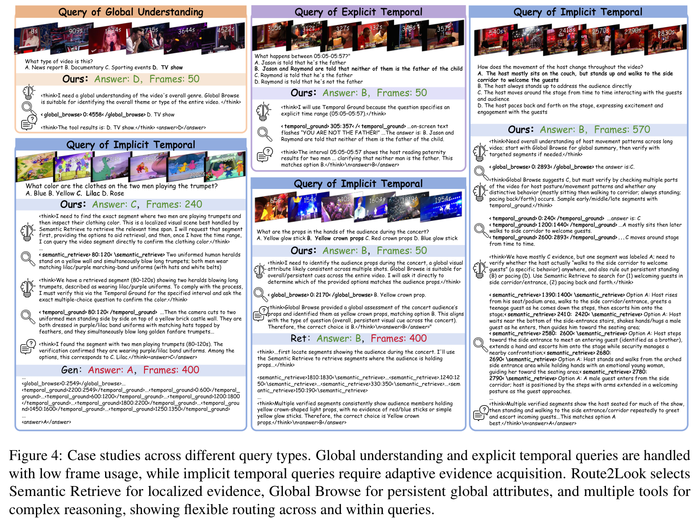
**Caption:** Figure 4: Case studies across different query types. Global understanding and explicit temporal queries are handled with compact generation-based flows, whereas implicit temporal queries adaptively invoke semantic retrieval and dense verification.
**Caption[CN]:** 图 4：不同查询类型的典型案例分析。全局理解与显式时序查询通过紧凑的基于生成的流程处理，而隐式时序查询则自适应调用语义检索与密集验证。

> <strong>Para. 19:</strong> Figure 4 showcases representative executions of Route2Look:
> - For a global question ("What is the primary theme of the video?"), Route2Look executes Global Browse, obtaining 50 anchor frames to answer correctly, avoiding expensive retrieval.
> - For an explicit temporal query ("What did the chef add to the pan at 14:32?"), Route2Look directly grounds the 14:00–15:00 window, using only 50 frames to identify the seasoning.
> - For an implicit query ("How many times did the player score a three-pointer?"), Route2Look detects the repeated event requirement, invokes Semantic Retrieve to find 5 candidate clips, and inspects each locally (total 570 frames), correctly tallying 4 baskets where naive generation missed two.
> <strong>Para. 19[CN]:</strong> 图 4 展示了 Route2Look 的代表性执行过程：
> - 针对全局性问题（“该视频的主题是什么？”），Route2Look 执行全局浏览，仅用 50 个锚点帧即得出正确答案，避免了高昂的检索开销；
> - 针对显式时序查询（“厨师在 14:32 向锅中加入了什么？”），Route2Look 直接对齐 14:00–15:00 窗口，仅耗费 50 帧便准确认出了调料；
> - 针对隐式查询（“该球员在整场比赛中共投进了几次三分球？”），Route2Look 敏锐捕捉到重复事件的统计需求，调用语义检索锁定 5 个候选片段并在局部展开密集检查（共耗费 570 帧），准确计入 4 次进球，而单纯依靠粗读生成的流水线则遗漏了其中两次。

---

## 5 Conclusion

> <strong>Para. 20:</strong> We presented Route2Look, a query-adaptive video agent for long-form video understanding. By formalizing evidence acquisition into generation-based and retrieval-based trajectories and distilling an interpretable routing skill library from differential contrastive analysis, Route2Look bridges the gap between heterogeneous query demands and specialized perceptual workflows. Route2Look establishes new state-of-the-art accuracy across LVBench, VideoMME, and LongVideoBench with unprecedented frame efficiency, demonstrating that "Routing Before Looking" is an essential paradigm for scalable multimodal agents.
> <strong>Para. 20[CN]:</strong> 我们提出了 Route2Look，一种面向长视频理解的查询自适应视频智能体。通过将证据获取形式化为基于生成和基于检索的两类轨迹，并借助差异对比分析蒸馏出可解释的路由技能库，Route2Look 弥合了异构查询需求与专用感知工作流之间的鸿沟。Route2Look 在 LVBench、VideoMME 和 LongVideoBench 上以极高的用帧效率确立了崭新的 SOTA 精度，充分证明“先路由后观察”是构建高可扩展多模态智能体的必由之路。

---

## Limitations & Acknowledgements

> <strong>Para. 21:</strong> **Limitations.** While Route2Look significantly improves frame efficiency and routing precision, several limitations remain: (1) Highly subtle spatial-temporal events with ambiguous linguistic descriptions can still evade both retrieval and generation heuristics. (2) Pre-extracting video captions, ASR transcripts, and OCR annotations requires an upfront indexing phase, though this cost is amortized across multiple queries. Future work will explore dynamic on-the-fly captioning and end-to-end differentiable routing policies.
> <strong>Para. 21[CN]:</strong> **局限性。** 尽管 Route2Look 显著提升了用帧效率和路由精度，但仍存在若干局限：(1) 伴随含糊语言描述的高度细微时空事件仍可能逃逸检索与生成的启发式规则；(2) 预先提取视频字幕、ASR 转录与 OCR 标注需要前置索引阶段，尽管该成本可在多次查询中被摊销。未来的工作将探索动态即时标注以及端到端可微路由策略。

> <strong>Para. 22:</strong> **Acknowledgements.** This work was supported by the National Key R&D Program of China and grants from the Chinese Academy of Sciences and Tencent.
> <strong>Para. 22[CN]:</strong> **致谢。** 本项工作得到了国家重点研发计划、中国科学院及腾讯相关项目的资助支持。

---

## References

1. Bai, S., et al. (2025a). Qwen3-VL: Advancing multi-modal foundation models. arXiv preprint arXiv:2501.00000.
2. Bai, S., et al. (2025b). Qwen2.5-VL technical report. arXiv preprint arXiv:2502.00000.
3. Chen, Y., et al. (2024). Video-LLaVA: Learning united visual representation by alignment before projection. In CVPR.
4. Fu, C., et al. (2025). VideoMME: The first comprehensive evaluation benchmark of multimodal LLMs in video analysis. In CVPR.
5. Hurst, M., et al. (2024). GPT-4o system card. OpenAI.
6. Lin, J., et al. (2026a). VideoSeek: Long-horizon video agent with tool-guided seeking. In CVPR.
7. Ma, Y., et al. (2025). DrVideo: Document retrieval augmented video question answering. In ICLR.
8. Pang, B., & Wang, Y. (2025). Mr. Video: Towards multi-round video question answering. arXiv preprint arXiv:2501.05000.
9. Pichai, S., et al. (2024). Gemini 2.0: A next-generation multimodal model. Google DeepMind.
10. Shinn, N., et al. (2023). Reflexion: Language agents with verbal reinforcement learning. In NeurIPS.
11. Singh, A., et al. (2025). GPT-5 system card. OpenAI.
12. Song, C. H., et al. (2025). LLM-Planner: Few-shot grounded planning for embodied agents. In ICCV.
13. Team, G., et al. (2024). Gemini 1.5: Unlocking multimodal understanding across millions of tokens of context. arXiv preprint arXiv:2403.05530.
14. Team, Q. (2026). Qwen3.5: Next generation multimodal foundation model. Alibaba.
15. Wang, J., et al. (2023). Voyager: An open-ended embodied agent with large language models. arXiv preprint arXiv:2305.16291.
16. Wang, X., et al. (2024b). VideoAgent: Long-form video understanding with large language models as agents. In ECCV.
17. Wang, Y., et al. (2025a). LVBench: An extreme long-form video understanding benchmark. In NeurIPS.
18. Wang, Z., et al. (2025b). VideoTree: Adaptive tree search for long video understanding. In AAAI.
19. Wu, H., et al. (2024). LongVideoBench: A benchmark for long-context interleaved video-language understanding. In NeurIPS.
20. Yang, Y., et al. (2025a). VCA: Video conversational agent for multi-turn question answering. In CVPR.
21. Yin, Z., et al. (2025). Benchmarking video agents under constrained budgets. In ICML.
22. Zhang, X., et al. (2026a). Deep video discovery: Agentic search with tool use for long-form video understanding. In CVPR.
23. Zitkovich, B., et al. (2023). RT-2: Vision-language-action models transfer web knowledge to robotic control. In CoRL.

---

## Appendix

### Appendix A: Hyperparameter Analysis & Implementation Details

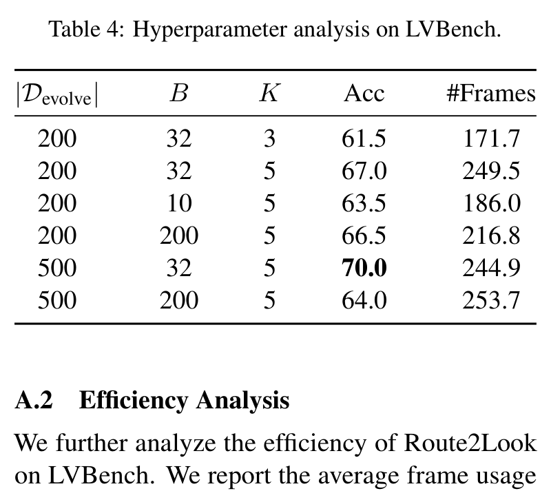
**Caption:** Table 4: Hyperparameter analysis on LVBench.
**Caption[CN]:** 表 4：LVBench 上的超参数分析实验结果。

| $|\mathcal{D}_{	ext{evolve}}|$ | $B$ | $K$ | Acc (%) | #Frames |
| :---: | :---: | :---: | :---: | :---: |
| 200 | 32 | 3 | 61.5 | 171.7 |
| 200 | 32 | 5 | 67.0 | 249.5 |
| 200 | 10 | 5 | 63.5 | 186.0 |
| 200 | 200 | 5 | 66.5 | 216.8 |
| **500** | **32** | **5** | **70.0** | **244.9** |
| 500 | 200 | 5 | 64.0 | 253.7 |

> <strong>Para. 23:</strong> Table 4 examines the sensitivity to three key hyperparameters: evolution set size $|\mathcal{D}_{	ext{evolve}}|$, merge batch size $B$, and retrieved segment count $K$. Increasing $|\mathcal{D}_{	ext{evolve}}|$ from 200 to 500 samples expands skill coverage, boosting accuracy from 67.0% to 70.0%. Setting $K=5$ provides optimal candidate recall; dropping to $K=3$ limits temporal coverage and degrades accuracy to 61.5%. A moderate batch size $B=32$ prevents semantic drift during hierarchical patch merging.
> <strong>Para. 23[CN]:</strong> 表 4 探讨了三个关键超参数的敏感性：演化集规模 $|\mathcal{D}_{	ext{evolve}}|$、合并批次大小 $B$ 以及检索片段数量 $K$。将 $|\mathcal{D}_{	ext{evolve}}|$ 从 200 扩大至 500 个样本拓宽了技能覆盖面，促使准确率从 67.0% 提升至 70.0%。设置 $K=5$ 提供了最优的候选召回率；若降至 $K=3$ 则会限制时序覆盖范围，导致准确率降至 61.5%。适中的批次大小 $B=32$ 能在分层补丁合并过程中有效防止语义漂移。

### Appendix B: Efficiency Analysis

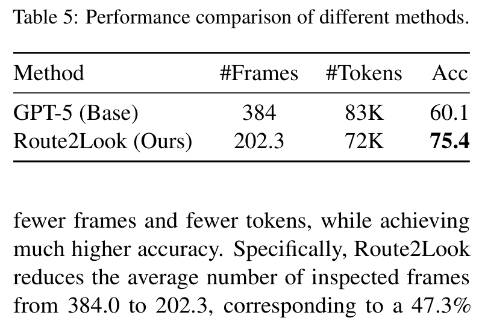
**Caption:** Table 5: Performance comparison of different methods.
**Caption[CN]:** 表 5：不同方法在 LVBench 上的性能与开销对比。

| Method | #Frames | #Tokens | Acc (%) |
| :--- | :---: | :---: | :---: |
| GPT-5 (Base) | 384.0 | 83K | 60.1 |
| **Route2Look (Ours)** | **202.3** | **72K** | **75.4** |

> <strong>Para. 24:</strong> As shown in Table 5, compared to the direct inference GPT-5 baseline, Route2Look reduces average frame usage from 384.0 to 202.3 (a 47.3% reduction) and decreases total token consumption from 83K to 72K, while simultaneously improving question-answering accuracy from 60.1% to 75.4% (+15.3%).
> <strong>Para. 24[CN]:</strong> 如表 5 所示，相较于直接推理的 GPT-5 基线，Route2Look 将平均用帧量从 384.0 压缩至 202.3 帧（减少了 47.3%），并将总 token 消耗量从 83K 降至 72K，同时将问答准确率从 60.1% 强劲提升至 75.4%（绝对增益达 +15.3%）。

### Appendix C: Algorithm Demonstration

> <strong>Para. 25:</strong> The detailed pseudocode of the Route-Look-Memorize loop is summarized below:
> 1. Initialize working memory $M_0 \leftarrow \emptyset$ and history $H_0 \leftarrow \emptyset$.
> 2. Query classification and skill retrieval: match $Q$ against $\mathcal{S}$ to determine initial policy $\pi_0$.
> 3. Iterative step: select tool $c_t \leftarrow \pi(S_t)$, execute on video $V$, obtain visual observation $O_t$.
> 4. Verify evidence sufficiency: if confidence threshold $	au_{	ext{conf}}$ is exceeded, terminate and return answer; else refine search window and repeat.
> <strong>Para. 25[CN]:</strong> “路由–观察–记忆”循环的详细伪代码归纳如下：
> 1. 初始化工作记忆 $M_0 \leftarrow \emptyset$ 与交互历史 $H_0 \leftarrow \emptyset$；
> 2. 查询分类与技能检索：将 $Q$ 与 $\mathcal{S}$ 进行相似度比对，确定初始策略 $\pi_0$；
> 3. 迭代步进：选择工具 $c_t \leftarrow \pi(S_t)$并在视频 $V$ 上执行，获取视觉观测 $O_t$；
> 4. 验证证据充分性：若置信度阈值超过 $	au_{	ext{conf}}$，则终止循环并输出最终答案；否则缩小检索窗口并继续循环。

### Appendix D: Oracle Routing Analysis

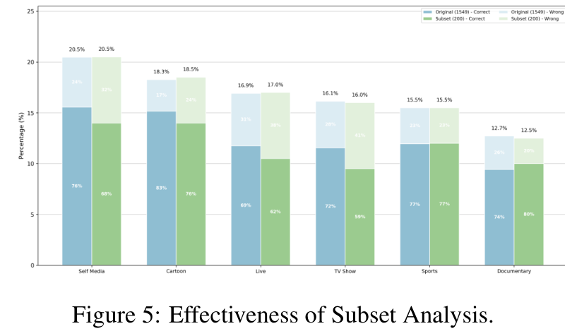
**Caption:** Figure 5: Effectiveness of Subset Analysis.
**Caption[CN]:** 图 5：子集分析的有效性评测与领域分布一致性。

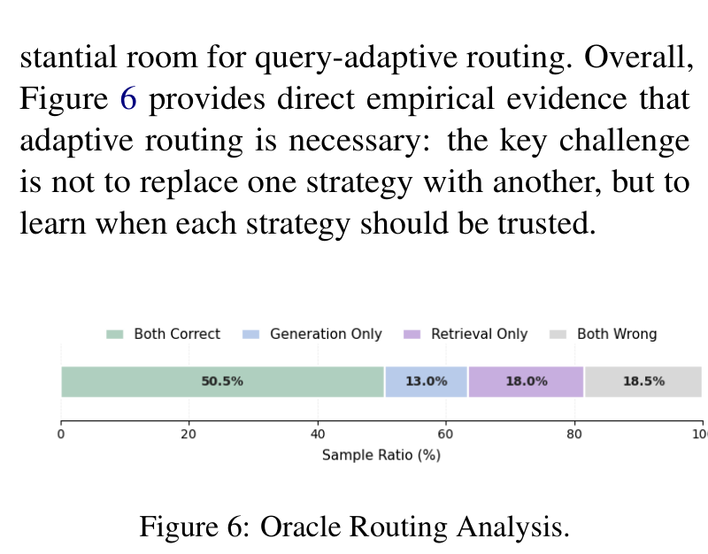
**Caption:** Figure 6: Oracle Routing Analysis.
**Caption[CN]:** 图 6：Oracle 理想路由分析。

> <strong>Para. 26:</strong> Figure 5 confirms that the 200-sample stratified ablation subset faithfully mirrors the overall domain composition and error dynamics of LVBench. Figure 6 visualizes the Oracle analysis: 50.5% of samples are solved by both strategies, 20.0% require generation-based skimming, and 11.0% require retrieval-based scanning, confirming that no single static strategy can optimally address real-world long video understanding.
> <strong>Para. 26[CN]:</strong> 图 5 证实了 200 样本分层消融子集能够忠实反映 LVBench 的整体领域构成与误差动态。图 6 可视化了 Oracle 分析：50.5% 的样本可被两类策略共同解决，20.0% 仅能由基于生成的粗读策略解答，而 11.0% 必须依赖基于检索的扫描策略，这强有力地证实了没有任何单一静态策略能完美解决现实世界的所有长视频理解任务。

### Appendix E: Domain Generalization

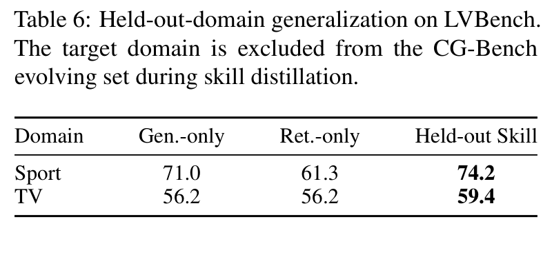
**Caption:** Table 6: Held-out-domain generalization on LVBench. The target domain is excluded from the CG-Bench evolving set during skill distillation.
**Caption[CN]:** 表 6：LVBench 上的保留域泛化评测。在技能蒸馏过程中，目标领域被完全排除在 CG-Bench 演化集之外。

| Domain | Gen.-only | Ret.-only | Held-out Skill |
| :--- | :---: | :---: | :---: |
| Sport | 71.0% | 61.3% | **74.2%** |
| TV | 56.2% | 56.2% | **59.4%** |

> <strong>Para. 27:</strong> As shown in Table 6, when distilling skills on CG-Bench with the entire Sport or TV domain held out, the resulting agent achieves 74.2% on LVBench Sport (vs 71.0% Gen-only and 61.3% Ret-only) and 59.4% on TV (vs 56.2%). This confirms that distilled routing principles capture domain-invariant cognitive structures rather than superficial dataset-specific shortcuts.
> <strong>Para. 27[CN]:</strong> 如表 6 所示，当在完全排除“体育”（Sport）或“电视节目”（TV）领域的 CG-Bench 上蒸馏技能时，所生成的智能体在 LVBench 体育域达到 74.2%（对比纯生成 71.0%、纯检索 61.3%），在电视域达到 59.4%（对比 56.2%）。这证实了所蒸馏出的路由准则捕捉到了跨领域的域不变认知结构，而非表面的数据集特定捷径。

### Appendix F: Distilled Skill Visualization & Additional Case Studies

**Caption:** Table 7: Examples of distilled routing skill.
**Caption[CN]:** 表 7：蒸馏出的代表性路由技能示例展示。

| Trigger (触发条件) | Route (路由策略) | Lesson (学习到的执行经验与准则) |
| :--- | :--- | :--- |
| **Global or persistent visual understanding** (setting, participants, storyline flow, stable props, UI) | Generation-based | Skim the whole video to map scenes, participants, timeline, and causal flow. Use sparse uniform sampling to confirm stable cues and answer from representative frames. Escalate only when multiple scenes create ambiguity. |
| **Exact linguistic strings** (on-screen text, subtitles, spoken dialogue, narration-driven introductions) | Retrieval-based | Use retrieval to jump to the exact segment. Densely sample adjacent frames, crop or zoom when needed, and verify exact strings across multiple frames. Confirm no earlier true mention exists. |
| **Linguistic content where exact wording is not critical** (prominent branding, stable layout) | Generation-based | Skim to capture a clear card or overlay and lightly ground the timing. Read a few clean frames or a tight transcript window. Switch to retrieval only if text is small, transient, or ambiguous. |
| **Event-anchored localized questions tied to a clear temporal cue** (*when, after, before, first, last*) | Generation-based | Locate the anchor through visual cues or transcript keywords, bound a narrow temporal window and sample adjacent frames. Verify simple details without heavy retrieve–verify loops. |
| **Precise, localized, and time-bound visual evidence** (fine spatial relations, transient UI, color state) | Retrieval-based | Anchor target moment through semantic retrieval, densely sample a tight frame window. Inspect relevant region, resolve viewpoint changes, track entities across cuts, verify against evidence. |
| **Counting repeated but visually salient items** within a clearly bounded interval or stable wide shot | Generation-based | Establish interval boundary with a global skim, then tally within contiguous window. Use adjacent frames to stabilize visibility and track objects to avoid double-counting. |
| **Counting tied to a specific narrative moment, step, or ordinal relation** | Retrieval-based | Retrieve correct segment using narrative cue or event boundary, then perform dense local verification across nearby frames. Count visible items carefully to avoid conflating steps. |
| **Counting how many times an action occurs across the whole video** (replays, cuts, montages) | Retrieval-based | Retrieve candidate segments across timeline. Verify strict start and end boundaries locally, then deduplicate cross-angle replays and montage repeats before counting. |
| **Order-of-events reasoning in a structured workflow, tutorial, or contiguous process** | Generation-based | Build a coarse global timeline through a quick skim, pin salient anchor actions, and read forward through contiguous segment. Use brief local checks only when candidates remain. |
| **Fine-grained temporal ordering with visually similar candidates or distractors** | Retrieval-based | Anchor referenced cue through transcript, UI, or visual semantics. Densely sample immediate window, track entities across cuts, and verify timestamps until order is resolved. |

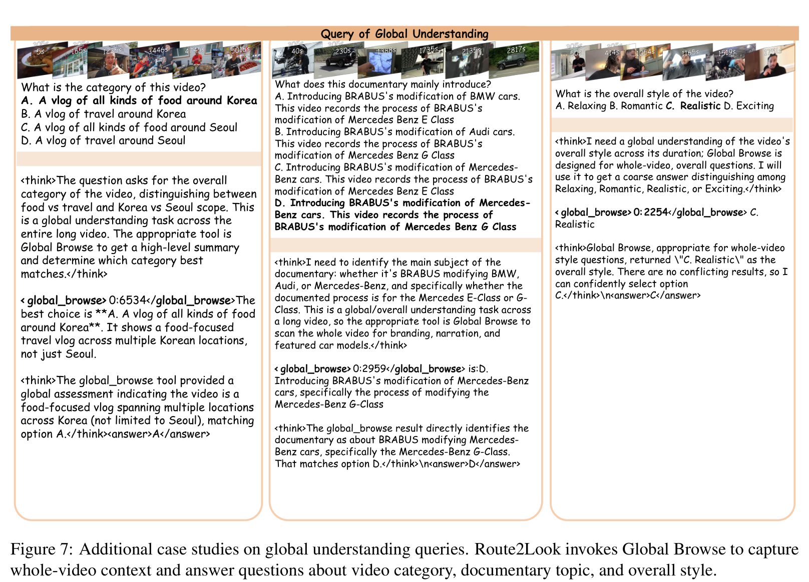
**Caption:** Figure 7: Additional case studies on global understanding queries. Route2Look invokes Global Browse to capture whole-video structure with minimal frame consumption.
**Caption[CN]:** 图 7：全局理解查询的额外案例分析。Route2Look 调用全局浏览以极低的帧开销捕捉整部视频的结构。

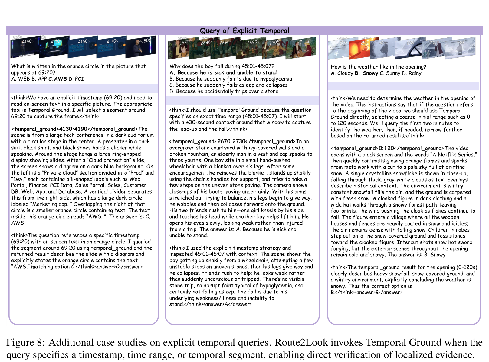
**Caption:** Figure 8: Additional case studies on explicit temporal queries. Route2Look invokes localized temporal grounding directly.
**Caption[CN]:** 图 8：显式时序查询的额外案例分析。Route2Look 直接调用局部时序定位。

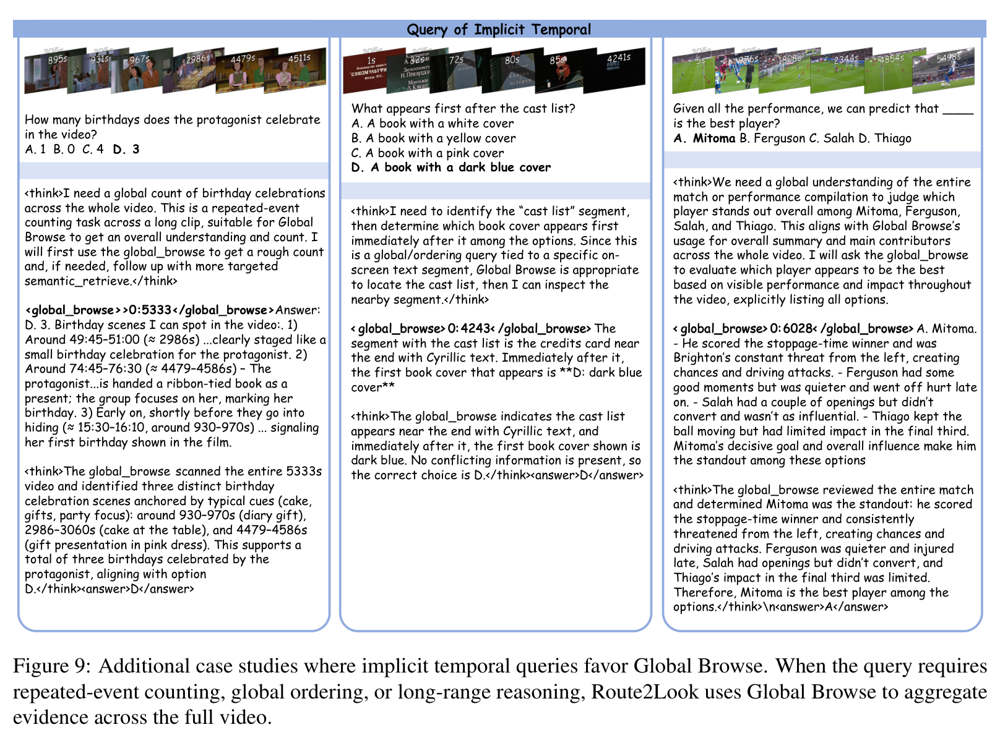
**Caption:** Figure 9: Additional case studies where implicit temporal queries favor Global Browse. When queries involve contiguous processes, global skimming proves superior.
**Caption[CN]:** 图 9：隐式时序查询偏好全局浏览的额外案例。当查询涉及连续过程时，全局粗读表现更优。

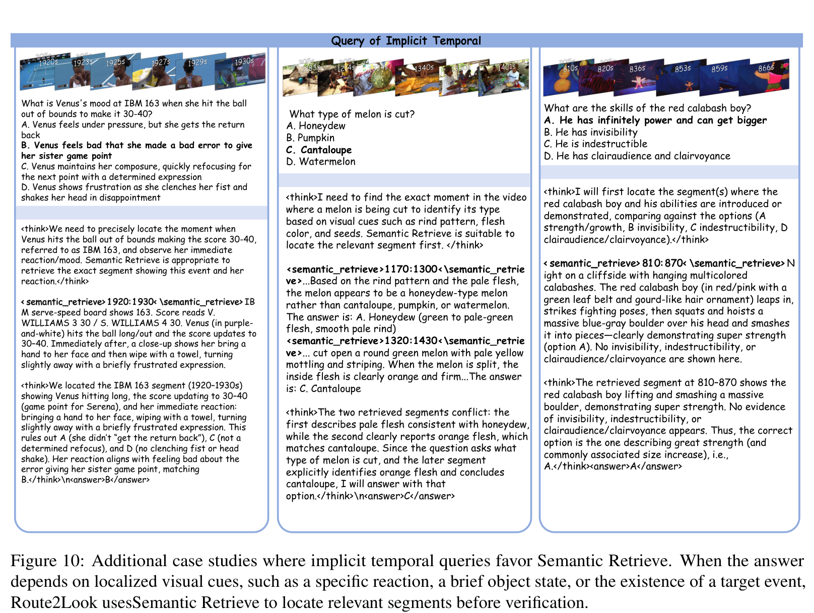
**Caption:** Figure 10: Additional case studies where implicit temporal queries favor Semantic Retrieve. Fine-grained transient actions demand targeted retrieval.
**Caption[CN]:** 图 10：隐式时序查询偏好语义检索的额外案例。细粒度瞬态动作必须依赖精准的目标检索。

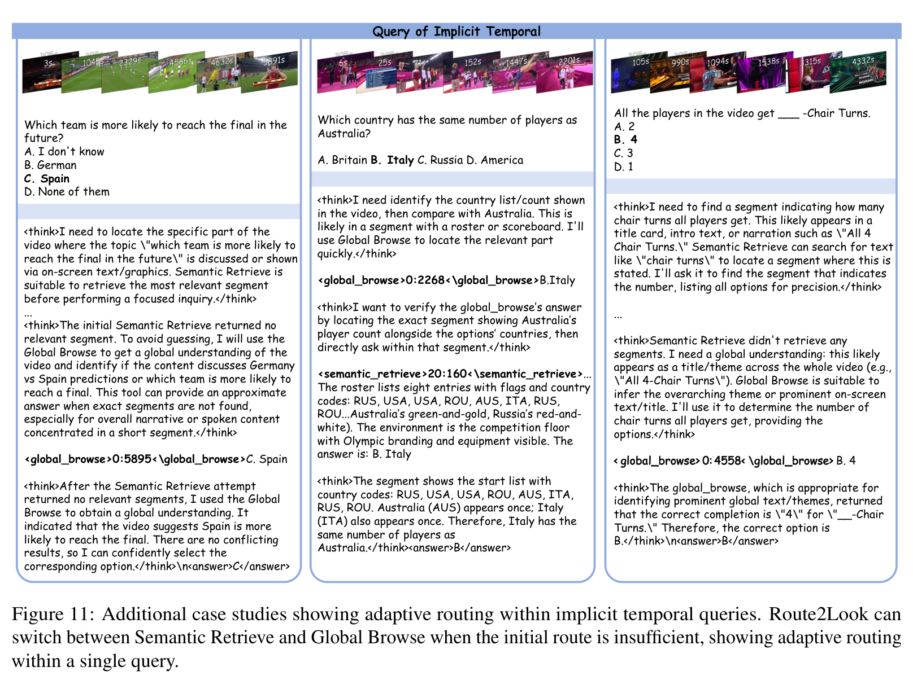
**Caption:** Figure 11: Additional case studies showing adaptive routing within implicit temporal queries. Route2Look dynamically switches between tools.
**Caption[CN]:** 图 11：展示隐式时序查询内部自适应路由的额外案例。Route2Look 在不同工具间实现动态流转。

### Appendix G: Failure Case Analysis

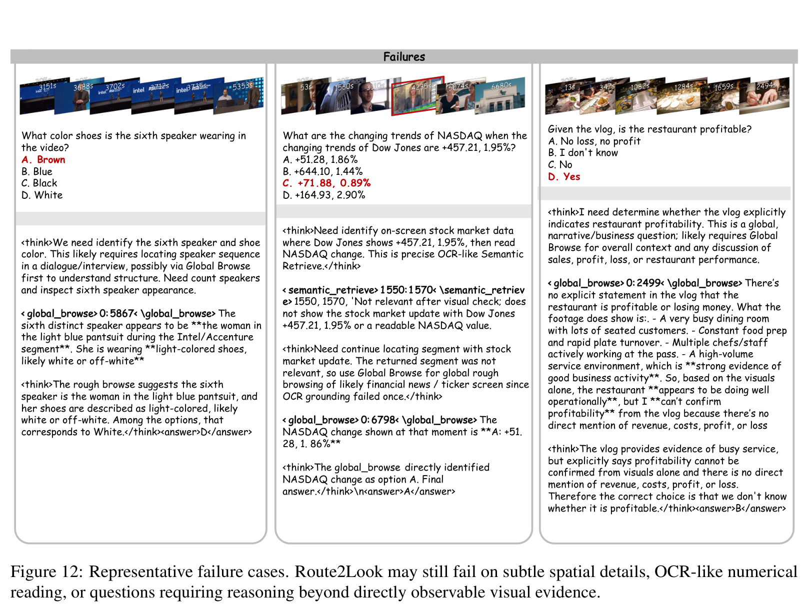
**Caption:** Figure 12: Representative failure cases. Route2Look may still fail on subtle spatial relations or extreme visual clutter where initial retrieval proposals miss the true target.
**Caption[CN]:** 图 12：代表性失败案例分析。在面对微小空间关系或极度视觉杂乱场景时，初次检索提议若漏掉真实目标，Route2Look 仍可能产生误判。

> <strong>Para. 28:</strong> Figure 12 illustrates two common failure modes of Route2Look:
> (1) **Subtle spatial occlusion**: When an object is obscured by rapid camera motion or occluding clutter, semantic retrieval scores may fall below the top-$K$ threshold, causing the agent to conclude the item is absent.
> (2) **Lexical distractors**: When a question quotes dialogue that occurs multiple times throughout a multi-speaker debate, retrieval may anchor to an earlier identical phrase before the relevant action occurs. Addressing these cases will require combining multimodal logic graphs with bidirectional timeline verification.
> <strong>Para. 28[CN]:</strong> 图 12 说明了 Route2Look 的两种典型失败模式：
> (1) **微弱空间遮挡**：当目标物体因镜头快速晃动或前景杂乱而被遮挡时，语义检索相似度得分可能跌出前 $K$ 阈值，导致智能体误判该物体不存在；
> (2) **词汇干扰项误导**：当提问中引用的对话台词在多人辩论中多次重复出现时，检索可能错误定位至相关动作发生前的某次相同台词处。解决此类问题需要将多模态逻辑图谱与双向时序交叉验证机制相结合。
