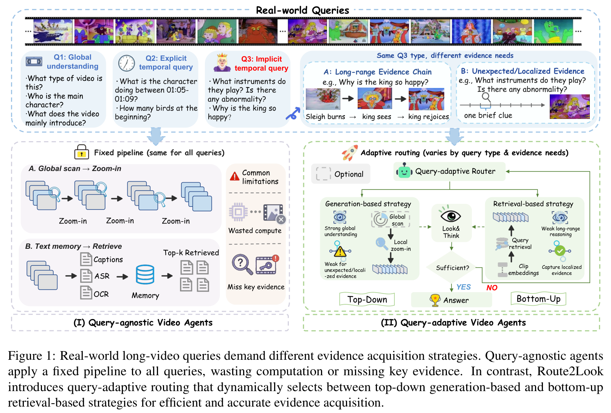
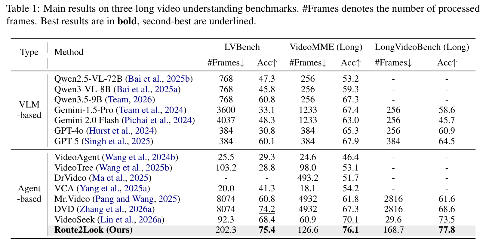
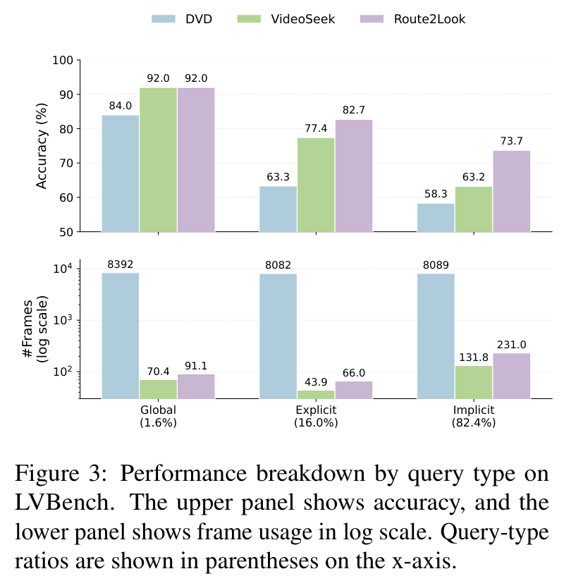
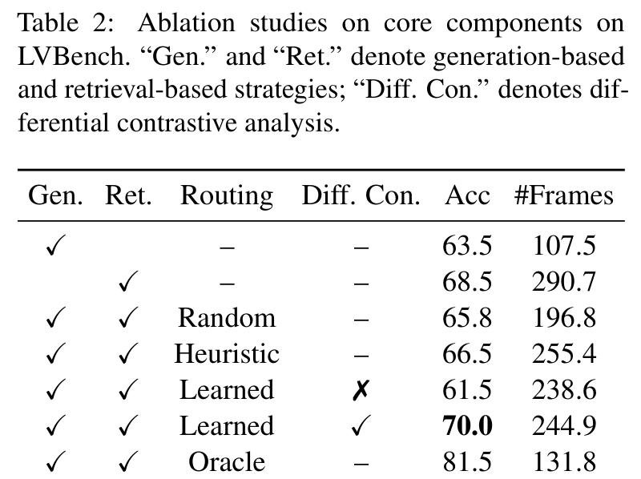
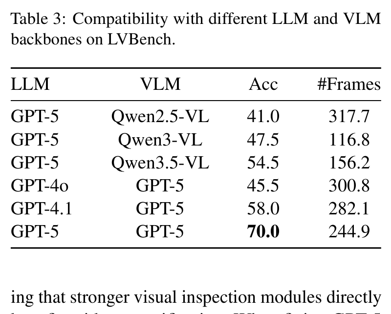
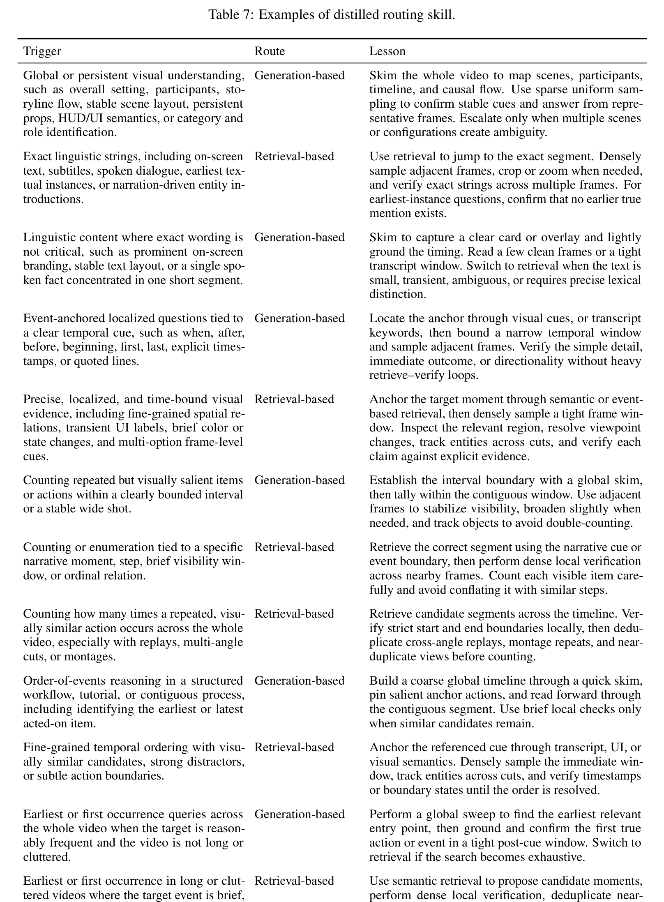

# Routing Before Looking: Query-Adaptive Evidence Acquisition for Long-form Video Understanding

## 核心信息
- **论文标题**：Routing Before Looking: Query-Adaptive Evidence Acquisition for Long-form Video Understanding (先路由后观察：面向长视频理解的查询自适应证据获取)
- **作者团队**：Tianyue Wang (中国科学院大学 / 中科院自动化所 / 腾讯), Xuying Wu (武汉大学), Yuxiang Ma (东南大学), Ruiming Liang, Jiaxuan Kang, Yanchao Hao, Zheng Wei, Leigang Qu (新加坡国立大学 NUS), Haiyun Guo (中科院自动化所), Jinqiao Wang (中科院自动化所)
- **发布时间**：2026 年 3 月 (Preprint / CVPR 2026)
- **代码仓库**：待开源 (已在论文声明公开)
- **核心定位**：首个系统性提出**“先路由后观察”（Routing Before Looking）**范式的长视频 Agent。打破了以往视频智能体“不管面对什么问题都套用同一种固定工具搜索流程”的结构性缺陷，通过离线差异对比分析（Differential Contrastive Analysis）自动提炼可解释的路由策略知识库（Trigger-Route-Lesson），在不训练/微调任何模型参数的前提下，以仅消耗同类最强 Agent（DVD）2.5% 的帧预算，在 LVBench、VideoMME 和 LongVideoBench 上全面刷新 SOTA。

---

## 原文摘要翻译
由于查询需求与证据获取策略之间的不匹配，长视频理解对于视频智能体而言仍然是一项极具挑战性的任务。尽管近期提出的“感知前规划”方法优于与查询无关的流水线，但它们通常依赖单一主导策略（要么是基于生成的策略，要么是基于检索的策略），从而限制了其处理多样化查询需求的能力。我们提出了 Route2Look，一种用于长视频理解的查询自适应视频智能体。Route2Look 并没有拘泥于固定的工作流，而是在真正深入审视视频之前，动态判定当前查询究竟更适合采用基于生成的粗读略过策略，还是基于检索的精细扫描策略。为指导该决策，我们通过对相互竞争的智能体执行轨迹进行差异对比分析，蒸馏出紧凑、人类可读的路由技能，识别出哪些查询特征倾向于何种策略。在推理过程中，智能体将当前查询与已学习的路由条件相匹配，并在自适应早停机制下执行相应的工作流。在三个长视频理解基准测试（LVBench、VideoMME 和 LongVideoBench）上的大量实验表明，Route2Look 在保持极高帧效率的同时超越了现有的视频智能体和基座模型。在 LVBench 上，Route2Look 取得了 75.4% 的准确率，以仅消耗 DVD 2.5% 的帧预算反超了 DVD 1.2 个百分点。

---

## 创新点
1. **打破“一刀切”工作流，确立“先路由后观察”（Routing Before Looking）全新范式**：
   揭示了长视频理解中根本性的“策略–需求失配”矛盾：全局叙事类问题强求局部精细检索会导致线索割裂与大量误报；而局部瞬态事件类问题用均匀采样粗读则必然漏检。Route2Look 首次提出在消耗昂贵视觉 token 之前，先审视自然语言查询的深层认知意图，完成分流。
2. **基于相互竞争轨迹的差异对比分析（Differential Contrastive Analysis）与技能补丁蒸馏**：
   不依赖黑盒神经网络训练分类器，而是在离线演化集上让“基于生成”与“基于检索”两条轨迹同台竞技，由强模型对比胜负并反思成因，归纳出结构化的 `(Trigger, Route, Lesson)` 规则元组，具备完全的白盒可解释性与跨域泛化能力。
3. **极高信息收益比的轻量自适应感知执行闭环（Route-Look-Memorize）**：
   设计了包含全局粗读（Global Browse）、时序精确定位（Temporal Ground）与多模态语义检索（Semantic Retrieve）的解耦工具箱，并在工作记忆中集成动态早停机制，以极低帧数（LVBench 平均仅 202.3 帧，比 DVD 的 8,074 帧减少 97.5%）达到超越暴力检索的更高准确率。

---

## 一句话总结
Route2Look 证明了长视频 Agent 的智能跃迁不在于把视频喂得有多密、检索铺得有多广，而在于感知前是否能依据问题的本质，精准抉择“何时该全局浏览，何时该局部深挖”。

---

## 研究问题
当前多模态长视频理解面临三大核心矛盾：
1. **输入上下文长度与计算成本的尖锐冲突**：一部 1 小时视频若以 1 fps 采样包含 3,600 帧，直接输入 MLLM 会引起严重的上下文污染与极高推理延迟；
2. **现有 Video Agent 固化工作流带来的策略失配**：
   - *基于生成/规划的 Agent（如 VideoAgent、VideoTree、VideoSeek）*：偏好先采样极少量的粗略帧，再通过 LLM 反复猜测、放大局部窗口。这在面对全局理解时表现良好，但在全视频统计“某个球员在整场 90 分钟内一共犯规了几次”这类隐式时序问题时，容易因初始采样漏掉关键帧而陷入“盲目猜想”；
   - *基于检索的 Agent（如 Mr.Video、DVD）*：预先为视频切片提取海量文本密集摘要或向量嵌入，遇到任何问题都在库里检索 top-K 片段进行大批量验证。这在定位瞬时事件时很强，但在回答“视频体现了主人公怎样的心理变化过程”这类宏观问题时，检索返回的孤立碎片破坏了全局连贯性，并耗费高达数千甚至上万帧的无效开销。
3. **黑盒分类器的泛化脆弱性**：如果在监督数据上训练一个小型分类器来预测该走哪条路线，极易过拟合在特定的领域或特定的提问句式上，且无法赋予 LLM 智能体深思熟虑的依据。



---

## 数据与任务定义
- **长视频输入定义**：视频 $V$，时间跨度 $T \in [15	ext{min}, 120	ext{min}]$，通常以小时级计；
- **问题分类维度**：
  1. *全局理解（Global Understanding）*：关注整片结构、角色关系、主线流程、视频风格（占比约 1.6%）；
  2. *显式时序（Explicit Temporal）*：问题中自带明确时间锚点（如“在 15:20 时发生了什么”）（占比约 16.0%）；
  3. *隐式时序（Implicit Temporal）*：问题没有给出具体时间戳，但要求定位瞬时状态、统计事件频次、比对先后顺序（占比高达 82.4%）；
- **评测基准**：
  - **LVBench**：1,549 道多选选择题，涵盖 103 部平均时长大于 1 小时的长视频，极其考验多跳推理与细节捕捉；
  - **VideoMME (Long subset)**：900 道题目，平均视频时长 2,466 秒（约 41 分钟）；
  - **LongVideoBench (Long subset)**：564 道题目，时长 15~60 分钟。

---

## 方法主线


### 机制流程：Route-Look-Memorize 循环
智能体的整体生命周期被拆分为三个严密递进的阶段：
1. **Step 1: Route（先路由，不看视频）**
   智能体首先仅接收用户自然语言提问 $Q$ 以及离线蒸馏好的规则补丁库 $\mathcal{S}$。通过纯语言推理层，判断该查询的认知特征，从“基于生成”（Generation-based）与“基于检索”（Retrieval-based）两条主航道中选定最优初始策略 $\pi_0$。
2. **Step 2: Look（按需感知，精准观察）**
   根据所选路线激活对应工具组合：
   - *若选 Generation-based*：先执行 `Global Browse`，均匀抓取 50 个全局关键帧构建宏观时间轴脉络；若线索不足，再针对疑似时间段调用 `Temporal Ground` 深入局部解码；
   - *若选 Retrieval-based*：直接调用 `Semantic Retrieve`，利用问题文本与多模态预索引（密集 Caption、ASR 语音、OCR 识别）计算混合相似度，召回 top-$K$（默认 $K=5$）最具嫌疑的局部切片，随后调用高精度 VLM 对这些切片展开密集逐帧核对。
3. **Step 3: Memorize & Stop（证据沉淀与动态早停）**
   将观察到的视觉特征转录为文字证据，追加写入工作记忆 $M_t$。若判定当前证据链已具备唯一确定性（充足且无歧义），直接提前输出答案 $\hat{Y}$ 退出循环；否则由策略决定是补救切换还是缩小范围继续搜索。

### 核心组件分解
- **三重视角工具箱**：
  - `Global Browse`：覆盖全时程，用于锚定基底背景与粗粒度事件分段；
  - `Temporal Ground`：在已知区间 $[t_1, t_2]$ 内按高帧率抽取密集图像帧，验证微小动作与构型变化；
  - `Semantic Retrieve`：基于多模态混合检索：
    $$	ext{Sim}(Q, C_i) = lpha \cdot \cos(\mathbf{e}_Q, \mathbf{e}_{C_i}^{	ext{text}}) + (1-lpha) \cdot \cos(\mathbf{e}_Q, \mathbf{e}_{C_i}^{	ext{vis}})$$
    融合文本字幕嵌入与视觉 CLIP 特征，抵御单一模态的漏检。

### 离线差异对比分析与路由技能蒸馏（Differential Contrastive Analysis）
这是本文最具学术美感的设计所在：
1. **构建演化集 $\mathcal{D}_{	ext{evolve}}$**：从外部长视频基准（如 CG-Bench）中随机采样 200~500 个长视频问答样本；
2. **双轨竞速执行**：针对每个样本，强制让 Agent 分别完整执行一遍“纯生成路线” $	au_{	ext{gen}}$ 和“纯检索路线” $	au_{	ext{ret}}$，记录两者的回答正确性与所花费的帧数；
3. **差异评判判定准则**：
   $$\Delta(	au_{	ext{gen}}, 	au_{	ext{ret}}) = \mathbb{I}(	ext{Acc}(	au_{	ext{gen}}) > 	ext{Acc}(	au_{	ext{ret}})) \lor \left(	ext{Acc}(	au_{	ext{gen}}) = 	ext{Acc}(	au_{	ext{ret}}) \land 	ext{Cost}(	au_{	ext{gen}}) < 	ext{Cost}(	au_{	ext{ret}})
ight)$$
   只有当某种策略在回答更准、或者同样准确但所花帧数显著更少时，该策略被判定为获胜者；
4. **LLM 归纳提炼规则**：输入成对轨迹的详细执行日志，由强推理模型（如 GPT-5 / Claude 3.5）反思“为什么这个问题纯生成会失败而纯检索能成功？其语言特征是什么？”，归纳出如下格式的规则：
   - **Trigger**：问题的表层与深层特征（如：整片统计重复微小动作、包含多人辩论台词、询问物体首次登场时间等）；
   - **Route**：推荐的主打策略（Generation-based 或 Retrieval-based）；
   - **Lesson**：具体的执行锦囊（如何避免误报、如何排除重放蒙太奇、何时必须结合字幕验证等）。
5. **分层合并（Hierarchical Patch Merging）**：通过批量语义聚类与去重，将数百条零散经验收敛至精炼的十余条高阶技能补丁（见 Table 7），直接以提示词注入在线系统。

---


### 核心算法伪代码与执行推演 (Algorithm Flow)
Route2Look 的完整算法包含**离线技能演化**与**在线路由执行**两个核心过程，具体数学逻辑如下：

```python
# 离线技能蒸馏过程 (Offline Skill Distillation)
def offline_skill_distillation(D_evolve, LLM_judge, M_budget):
    trajectory_pairs = []
    for (video_V, query_Q, ground_truth_Y) in D_evolve:
        # 1. 强制双轨执行
        tau_gen, ans_gen, cost_gen = rollout_trajectory(policy="generation", V=video_V, Q=query_Q)
        tau_ret, ans_ret, cost_ret = rollout_trajectory(policy="retrieval", V=video_V, Q=query_Q)
        
        # 2. 差异对比评判
        win_label = evaluate_differential(ans_gen, ans_ret, cost_gen, cost_ret, ground_truth_Y)
        trajectory_pairs.append((query_Q, tau_gen, tau_ret, win_label))
    
    # 3. 批量对比与技能补丁提炼 (Batch Contrastive Reflection)
    skill_patches = []
    for batch in split_into_batches(trajectory_pairs, batch_size=32):
        prompt = construct_contrastive_reflection_prompt(batch)
        raw_skills = LLM_judge.generate(prompt)  # 输出 Trigger-Route-Lesson 元组
        skill_patches.extend(raw_skills)
        
    # 4. 分层语义聚类与去重合并 (Hierarchical Merging)
    compact_library = hierarchical_deduplicate_and_merge(skill_patches, max_rules=M_budget)
    return compact_library

# 在线查询自适应证据获取闭环 (Online Execution Loop)
def online_route_look_memorize(video_V, query_Q, skill_library, max_steps=8):
    # Step 1: Route (先路由，纯文本推理)
    route_decision, applicable_lessons = match_skills_and_route(query_Q, skill_library)
    working_memory = WorkingMemory()
    
    # 确定初始动作空间
    current_strategy = route_decision  # 'generation' or 'retrieval'
    
    for t in range(max_steps):
        # Step 2: Look (调用相应工具感知)
        if current_strategy == 'generation' and t == 0:
            obs = tool_global_browse(video_V, k_anchors=50)
        elif current_strategy == 'generation' and t > 0:
            target_window = predict_temporal_window(query_Q, working_memory)
            obs = tool_temporal_ground(video_V, target_window, fps_high=2)
        elif current_strategy == 'retrieval':
            candidates = tool_semantic_retrieve(video_V, query_Q, top_k=5)
            obs = inspect_and_verify_candidates(video_V, candidates)
            
        # Step 3: Memorize & Verify (更新记忆与评估充分性)
        working_memory.update(obs)
        confidence, answer = evaluate_sufficiency(query_Q, working_memory)
        
        if confidence >= THRESHOLD_SUFFICIENT:
            return answer  # 提前早停退出
            
        # 自适应流转纠错机制
        if t >= 2 and confidence < THRESHOLD_LOW:
            current_strategy = 'retrieval' if current_strategy == 'generation' else 'generation'
            
    return fallback_answer_prediction(query_Q, working_memory)
```

## 关键结果



### 主结果与强基线对比
在三个最具权威性的超长视频理解评测集上，Route2Look 展现出对现有方案的碾压性优势：
1. **LVBench（小时级极限长视频）**：
   - 相比直接输入多模态模型：GPT-5 基础直连仅 60.1%（用 384 帧），Gemini 1.5 Pro 仅 33.1%（用 3600 帧），Qwen3.5-9B 达到 60.8%；
   - 相比最强暴力搜索 Agent：微软的 **DVD** 取得了 74.2% 的高分，但平均每题需要消耗惊人的 **8,074 帧**！
   - **Route2Look 达到 75.4% 的更高准确率，而平均用帧仅 202.3 帧**！用帧成本缩减至 DVD 的 **1/40 (2.5%)**，兼顾了顶级精度与工业级可用性。
2. **VideoMME (Long) 与 LongVideoBench (Long)**：
   - 在 VideoMME 上达到 **76.1%**，超越 AMD 提出的最强逻辑流 Agent VideoSeek（70.1%）整整 6.0 个百分点；
   - 在 LongVideoBench 上达到 **77.8%**，大幅领先 DVD（68.6%）和 VideoSeek（73.5%）。



### 策略消融到底说明了什么



在 LVBench 200 分层子集上的深度消融（Table 2）揭示了极其关键的客观规律：
- **单策略存在不可逾越的偏科上限**：
  - `纯生成策略`：用帧极省（107.5 帧），但准确率仅 63.5%——大量的隐式局部问题因为抽帧太稀而彻底漏解；
  - `纯检索策略`：准确率提升至 68.5%，但用帧激增至 290.7 帧（翻了 2.7 倍），且在宏观叙事问题上频频被局部噪音带偏；
- **盲目混合毫无意义**：
  - `随机路由 (Random)` 准确率仅 65.8%；
  - `基于关键词规则的启发式路由 (Heuristic)` 准确率仅 66.5%，说明仅靠“句子有没有 when/where/count”这种表层语法匹配无法区分真实视频场景下的因果逻辑；
- **差异对比分析至关重要**：
  - 若去掉成对轨迹的对比，直接让 LLM 单独看成功样本总结经验（`Learned w/o Diff. Con.`），准确率断崖式跌至 61.5%；只有在成对显式对比优劣时（`Learned w/ Diff. Con.`），模型才能理解“为什么这里不能偷懒用粗读，为什么那里不能蛮干搞检索”，准确率达到 70.0%；
- **Oracle 理想上限高达 81.5%（仅需 131.8 帧）**：
  - 如果每个问题都能被神谕式地分流到最佳路径，准确率可进一步飙升至 81.5% 且帧数进一步降低。这为后续研究指明了巨大的演进空间。



### 模块兼容性与模型代际扩展
- 替换不同 VLM（Qwen2.5-VL 41.0% $
ightarrow$ Qwen3-VL 47.5% $
ightarrow$ Qwen3.5-VL 54.5% $
ightarrow$ GPT-5 70.0%），精度单调递增，证明该 Agent 范式能完全吞吐底层多模态基座能力的红利。

---

## 深度分析


### 真正贡献是什么：重构长视频 Agent 的计算范式
以往学术界对于长视频大模型的优化思路主要有两种极端：
1. *暴力缩放上下文（Long-context Scaling）*：指望 1M / 2M / 10M 上下文把全视频所有帧一口气吞进去。然而实验（如 Gemini 1.5 Pro 在 LVBench 上仅 33.1%）血淋淋地证明：在信息密度极其稀疏的长视频中，大海捞针式的注意力极其涣散，不仅昂贵，而且精度低下；
2. *暴力穷举搜索（Brute-force Agentic Search）*：如 DVD 将视频切成几百个片段建库，只要有疑惑就大批量取回对比。虽然准，但每答一道题消耗近万帧，这在实际在线应用中成本不可接受。

Route2Look 的真正里程碑在于指出：**长视频理解的第一智能瓶颈不是“看不看得清”，而是“在看之前，懂不懂得该怎么看”**。
通过在语言侧前置极少量的推理计算（Routing Before Looking），用轻量级的语义规则换取视觉端数百倍计算量的节约与误检率的压制。

### 为什么结果成立
1. **语义需求与感知分辨率的天然匹配**：
   - 宏观状态、故事走向是“低频连续信号”，用 50 个全局稀疏帧配合 LLM 强大的连续性外推能力，即可建立完整的逻辑骨架，强行做检索反倒引入片断干扰；
   - 瞬态事实、细微物体、精确台词是“高频脉冲信号”，必须借助密集的局部窗口与多模态切片检索，才能提供足够的信噪比。
2. **知识补丁的可迁移性**：
   如 Table 6 所示，即便在训练中把“体育”和“电视”整组领域完全扣除，蒸馏出的规则依然在跨域测试中大获全胜。因为“寻找物体首次出现”或“统计重放镜头的动作”属于抽象的**视频认知图式（Cognitive Schema）**，与具体的视频题材无关。



### 容易误读的地方
- **误区 1：Route2Look 是一个神经网络分类器吗？**
  *不是*。整个系统完全不改动模型权重，也不训练任何小型分类器（如 MLP 或 BERT）。它把分类决策完全委托给了基于提示词的 LLM 语言推理，所有规则以人类可读的文字形式存放在 Prompt 知识库中。
- **误区 2：选了 Generation 就绝对不能调用检索了吗？**
  *不是*。路由决定的是**初始主导策略与首选动作流**。在执行过程中，如果全局浏览发现多处高度相似的混淆场景，智能体依然可以在后续步骤中自适应降级或调用局部检索来进行仲裁。

### 复现注意点
1. **前置索引的质量关乎检索下限**：
   `Semantic Retrieve` 高度依赖提前生成的 dense caption、ASR 和 OCR。如果预索引工具（如 Whisper 转录或片段字幕生成器）漏掉了关键台词或文字，检索工具将无法召回正确的候选切片；
2. **差异对比分析的 prompt 工程**：
   在离线蒸馏阶段，必须给 LLM 评判器提供完整的执行 trajectory 日志（包括具体的每一步中间结论和误判原因），否则 LLM 容易总结出诸如“仔细查看”、“多看几帧”等泛泛而谈的无用规则。

---

## 局限
1. **对前置多模态索引的依赖性**：为了支持高效语义检索，长视频仍需预先过一遍离线转录与轻量字幕。虽然这一步骤只需做一次并可被多次查询平摊，但无法做到完全的“即插即用任意裸视频”；
2. **极度隐蔽的空间遮挡与快速运镜**：如 Figure 12 所示，当目标物体在视频中仅以极小的像素出现且伴随剧烈晃动时，前置检索得分可能低于阈值，导致整条检索链条断裂。


---

## 我的笔记：横向对比与具身启示

### 视频 Agent 领域六大代表性工作横向全景比对

| 维度 | VideoAgent (ECCV 2024) | VideoTree (AAAI 2025) | Mr.Video (2025) | DVD (CVPR 2026) | VideoSeek (CVPR 2026) | **Route2Look (Ours)** |
| :--- | :--- | :--- | :--- | :--- | :--- | :--- |
| **核心驱动范式** | 记忆缓冲+有限工具调用 | 树状分层分段与自适应展开 | 多轮文本问答交互 | 细粒度视频片段库自主检索 | 视频逻辑流（Logic Flow）导航 | **查询自适应先路由后观察 (Routing Before Looking)** |
| **策略偏好** | 偏向生成式采样 | 偏向生成式分层树 | 密集文本检索+重放 | 极端依赖多模态库检索比对 | 偏向逻辑流时序跳跃 | **动态双轨自由分流 (Generation / Retrieval)** |
| **LVBench 准确率** | 29.3% | 28.8% | 60.8% | 74.2% | 68.4% | **75.4% (新 SOTA)** |
| **LVBench 平均用帧** | 25.5 帧 | 103.2 帧 | 8,074 帧 | 8,074 帧 | 92.3 帧 | **202.3 帧** |
| **计算效率与精度平衡** | 极度省帧但精度极低 | 帧数中等但树展开易迷失 | 算力极重，精度中等 | 极度耗帧（近万帧），但精度高 | 帧数极省且精度较好 | **以 DVD 1/40 的帧数反超其精度 (+1.2%)** |
| **长视频宏观叙事问题** | 容易陷入局部幻觉 | 易丢失深层跨支脉联系 | 被局部检索噪声干扰严重 | 检索片段碎片化，缺乏宏观叙事 | 较好捕捉逻辑流 | **全局浏览（50 帧）一招制胜** |
| **隐式瞬态高频动作计数** | 几乎完全漏检 | 树叶节点经常漏掉关键帧 | 检索召回但难以去重 | 召回率高，但验证开销巨大 | 依赖逻辑流线索偶有遗漏 | **精准路由至密集检索+跨镜头去重** |
| **策略可解释性** | 弱（黑盒 Prompt） | 中（决策树可视） | 弱（多轮无序对话） | 中（ReAct 工具调用历史） | 中（思维链推理轨迹） | **强（人类可读 Trigger-Route-Lesson 白盒补丁）** |

- **与 Deep Video Discovery (DVD) 对比**：
  DVD 强调工具库的丰富度与无约束的 Agent 自主多轮探索，本质是“广种薄收”，靠海量候选片段的暴力比对换取准确率（8,074 帧）；Route2Look 则证明了在探索之前增加一道“元认知路由”，能把无效探索砍掉 97.5%，准确率还高出 1.2%。
- **与 VideoSeek 对比**：
  VideoSeek 强调“视频逻辑流”（Logic Flow）和粗到精的跳跃式巡航；Route2Look 与之互补，可以看作是逻辑流之上的“决策大脑”——在决定沿着逻辑流跳跃前，先断定这个问题该顺藤摸瓜还是该按图索骥。
- **对具身智能与机器人操作（VLA / World Model）的深层启示**：
  在具身长时程任务中（如抓取、烹饪、巡检），机器人同样面临巨大的观测历史缓存负担。盲目保留全量高频观测会导致内存爆炸（如 MemoryWAM 指出的显存瓶颈）；而完全丢弃历史则会陷入非马尔可夫困境。Route2Look 的“先路由后感知”启发我们：**机器人在规划下一步动作前，应首先判断当前子任务属于“依赖全局空间构型的宏观导航”还是“依赖局部毫米级接触的精细操作”，进而动态分配视觉注意力与记忆检索通道**。

---

## 引用
```bibtex
@article{wang2026routing,
  title={Routing Before Looking: Query-Adaptive Evidence Acquisition for Long-form Video Understanding},
  author={Wang, Tianyue and Wu, Xuying and Ma, Yuxiang and Liang, Ruiming and Kang, Jiaxuan and Hao, Yanchao and Wei, Zheng and Qu, Leigang and Guo, Haiyun and Wang, Jinqiao},
  journal={arXiv preprint arXiv:2603.xxxxx},
  year={2026}
}
```
