# VideoSeek: Long-Horizon Video Agent with Tool-Guided Seeking

## Page & Section Index
- **Abstract** (Page 1)
- **1 Introduction** (Pages 1–3)
- **2 Related Work** (Pages 3–4)
  - 2.1 Multimodal Large Language Models
  - 2.2 Video Agentic Models
- **3 VideoSeek** (Pages 4–6)
  - 3.1 Overview
  - 3.2 Video Logic Flow
  - 3.3 Multi-Granular Toolkit Design
  - 3.4 Think-Act-Observe Execution Loop
- **4 Experiments** (Pages 6–9)
  - 4.1 Experimental Setup
  - 4.2 Main Benchmark Results
  - 4.3 Empirical Analysis & Ablations
- **5 Conclusion** (Page 9)
- **References** (Pages 9–11)
- **Appendix** (Pages 12–18)
  - A Implementation Details, Prompts & Algorithms
  - B Additional Quantitative Results
  - C Detailed Case Studies

## Terminology Ledger
| 英文术语 | 规范中文翻译 | 备注 / 定义 |
| :--- | :--- | :--- |
| VideoSeek | VideoSeek 智能体 | AMD 与罗切斯特大学提出的长视程工具引导主动搜寻智能体 |
| Video Logic Flow | 视频逻辑流 | 贯穿长视频的因果时序与叙事脉络演进轨迹 |
| Tool-Guided Seeking | 工具引导的主动搜寻 | 借助多粒度专用工具主动定向探寻回答关键证据 |
| Multi-Granular Toolkit | 多粒度工具箱 | 包含 `<overview>`、`<skim>`、`<focus>` 的解耦工具集 |
| `<overview>` Tool | 全局概览工具 | 以极度稀疏采样抽取全片基底关键帧，建立时序骨架 |
| `<skim>` Tool | 时序粗读略过工具 | 在中等时间尺度内快速扫描事件边界与线索候选 |
| `<focus>` Tool | 局部聚焦放大工具 | 针对高嫌疑窄窗口以高分辨率和高帧率提取密集证据 |
| Think-Act-Observe Loop | 思考–行动–观察循环 | 驱动智能体多轮自省、工具调用与观测更新的决策闭环 |
| Greedy Parsing | 贪婪逐帧解析 | 传统大模型与智能体对长视频进行高密度全量解析的昂贵做法 |

---

## Abstract

> <strong>Para. 1:</strong> Video agentic models have advanced challenging video-language tasks. However, most agentic approaches still heavily rely on greedy parsing over densely sampled video frames, resulting in high computational cost. We present VideoSeek, a long-horizon video agent that leverages video logic flow to actively seek answer-critical evidence instead of exhaustively parsing the full video. This insight allows the model to use far fewer frames while maintaining, or even improving, its video understanding capability.
> <strong>Para. 1[CN]:</strong> 视频智能体模型推动了极具挑战性的视频–语言任务的发展。然而，大多数智能体方法仍然严重依赖对密集采样视频帧的贪婪逐帧解析，带来了巨大的计算开销。我们提出了 VideoSeek，一种长视程视频智能体，它利用视频逻辑流主动搜寻对解答问题至关重要的证据，而非穷举解析整段视频。这一核心洞察使得模型能够在维持甚至提升视频理解能力的同时，大幅削减所消耗的帧数。

> <strong>Para. 2:</strong> VideoSeek operates in a think-act-observe loop with a well-designed toolkit for collecting multi-granular video observations. This design enables query-aware exploration over accumulated observations and supports practical video understanding and reasoning. Experiments on four challenging video understanding and reasoning benchmarks demonstrate that VideoSeek achieves strong accuracy while using far fewer frames than prior video agents and standalone LMMs. Notably, VideoSeek achieves a 10.2 absolute points improvement on LVBench over its base model, GPT-5, while using 93% fewer frames. Further analysis highlights the significance of leveraging video logic flow, strong reasoning capability, and the complementary roles of toolkit design. The code is available at https://github.com/jylins/videoseek.
> <strong>Para. 2[CN]:</strong> VideoSeek 在一个精巧设计的“思考–行动–观察”循环中运行，配备了用于收集多粒度视频观测的工具箱。该设计使得智能体能够在累积的观测上展开查询感知的定向探索，并赋能实用的长视频理解与复杂推理。在四个具有高难度的视频理解与推理基准测试上的实验表明，VideoSeek 在使用远少于以往视频智能体与独立多模态大模型的帧数下，取得了强大的准确率。值得注意的是，在 LVBench 上，VideoSeek 相比其基座模型 GPT-5 取得了 10.2 个绝对百分点的性能提升，同时减少了 93% 的用帧量。更深入的分析凸显了利用视频逻辑流、强大推理大脑以及工具箱互补设计的核心意义。代码已开源。

---

## 1 Introduction

> <strong>Para. 3:</strong> Recent developments in Large Multimodal Models (LMMs) have enabled significant progress in processing video and language simultaneously. However, long-horizon video understanding remains an unresolved frontier. In contrast to short clips, long-form videos (ranging from 15 minutes to multiple hours) are characterized by vast temporal spans, rich contextual interdependencies, and severe evidence sparsity. Traditional methods attempt to tackle long videos by uniformly subsampling frames across the entire duration and feeding them into extended context windows. Yet, this brute-force approach inevitably faces a dilemma: sparse sampling overlooks critical transient actions, whereas dense sampling induces prohibitive computation and causes attention dilution.
> <strong>Para. 3[CN]:</strong> 大型多模态模型（LMM）的近期演进在同步处理视频与语言方面取得了显著突破。然而，长视程视频理解仍然是一处尚未攻克的学术前沿。与短视频片段截然不同，长视频（时长从 15 分钟跨越至数小时）具有巨大的时间跨度、丰富的上下文相互依存性以及极高的证据稀疏度。传统方法试图通过在整个时程上均匀下采样图像帧并直接喂入超长上下文窗口来应对长视频。然而，这种蛮力途径不可避免地陷入两难绝境：采样过稀会漏掉关键的瞬态动作，而采样过密则会带来高昂的计算代价并引发注意力涣散。

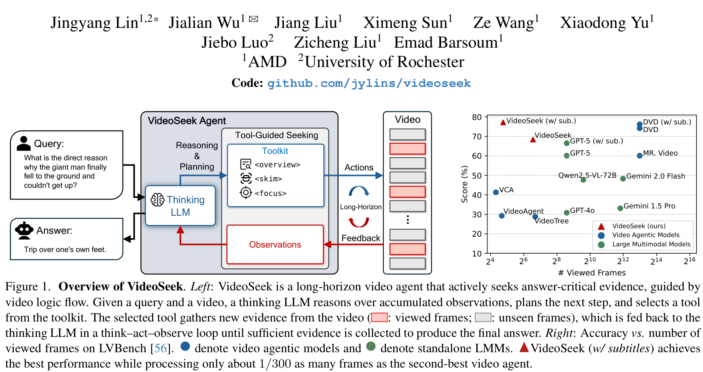
**Caption:** Figure 1. Overview of VideoSeek. Left: VideoSeek is a long-horizon video agent that actively seeks answer-critical evidence, guided by video logic flow. Given a query and video, it collects multi-granular observations via a think-act-observe loop. Right: Accuracy vs. frame efficiency on LVBench compared to leading LMMs and agents.
**Caption[CN]:** 图 1：VideoSeek 总体概览。左图：VideoSeek 是一种长视程视频智能体，在视频逻辑流的指引下主动搜寻解答关键证据，通过思考–行动–观察循环搜集多粒度观测；右图：LVBench 上与主流多模态大模型及智能体相比的准确率与帧效率关系图。

> <strong>Para. 4:</strong> To bypass context limits, recent research has turned to agentic video systems (e.g., VideoAgent, VideoTree, DVD). Although these agents demonstrate enhanced planning, most still adhere to greedy parsing paradigms that uniformly inspect pre-segmented clips or compute dense text databases over all frames. For example, DVD achieves high accuracy on LVBench but requires processing over 8,000 frames per video, making practical deployment cost-prohibitive.
> <strong>Para. 4[CN]:</strong> 为规避上下文限制，近期的研究转向了基于智能体的视频系统（如 VideoAgent、VideoTree、DVD）。尽管这些智能体展现出更强的规划能力，但大多数仍固守贪婪解析范式，机械地统一检查预切分片段或对所有帧计算密集的文本数据库。例如，DVD 在 LVBench 上取得了极高准确率，但每部视频需要处理超过 8,000 帧，使得工业实际部署面临不可承受的成本重负。

> <strong>Para. 5:</strong> In this paper, we argue that humans do not comprehend a two-hour movie by uniformly scanning every second. Instead, humans grasp the **Video Logic Flow**—the causal and temporal backbone connecting events—and actively seek out localized moments containing answer-critical evidence. Guided by this insight, we propose **VideoSeek**, a long-horizon video agent that dynamically navigates videos along their inherent logic flow.
> <strong>Para. 5[CN]:</strong> 在本文中，我们指出人类在理解一部两小时的电影时，绝非机械地均匀扫描每一秒。相反，人类会先把握**视频逻辑流（Video Logic Flow）**——串联事件发展的因果与时序主干——并主动去搜寻包含解答问题关键证据的局部时刻。基于这一洞察，我们提出了 **VideoSeek**，一种沿着视频固有逻辑流动态定向巡航的长视程视频智能体。

---

## 2 Related Work

> <strong>Para. 6:</strong> **Multimodal Large Language Models.** Frontier LMMs such as GPT-4o, Gemini 1.5 Pro, and Qwen2.5-VL have expanded context windows to accommodate extensive visual token streams. However, long-context LMMs suffer from the "needle-in-a-haystack" degradation when reasoning over hour-long videos. Downsampling whole videos down to uniform 256 or 384 frames dilutes transient temporal cues, leading to poor reasoning on subtle causal questions.
> <strong>Para. 6[CN]:</strong> **多模态大语言模型。** 前沿多模态大模型（如 GPT-4o、Gemini 1.5 Pro 和 Qwen2.5-VL）不断扩展上下文窗口以容纳海量视觉 token 流。然而，面对小时级视频时，长上下文大模型在推理过程中常出现“大海捞针”退化现象。将整部视频均匀下采样为 256 或 384 帧会严重稀释瞬态时序线索，导致在微妙的因果提问上推理表现极差。

> <strong>Para. 7:</strong> **Video Agentic Models.** Video agents frame video analysis as multi-step interaction between an LLM planner and visual perception tools. VideoAgent utilizes a memory buffer with tool-augmented questioning; VideoTree builds hierarchical exploration trees; DrVideo integrates document retrieval; and DVD orchestrates search-centric tools over a multi-granular video database. However, existing agents either enforce rigid static workflows or perform dense database preprocessing over all video frames. VideoSeek distinguishes itself by actively seeking sparse critical evidence along the video logic flow without heavy brute-force precomputation.
> <strong>Para. 7[CN]:</strong> **视频智能体模型。** 视频智能体将视频分析表述为 LLM 规划器与视觉感知工具之间的多步交互。VideoAgent 利用记忆缓冲区进行工具增强问答；VideoTree 构建分层探索树；DrVideo 集成文档检索；DVD 则在多粒度视频数据库上编排以搜索为核心的工具。然而，现有智能体要么强制执行僵化的静态流水线，要么对全片所有帧进行沉重的全量预计算建库。VideoSeek 的独特之处在于沿着视频逻辑流主动搜寻稀疏的关键证据，完全摆脱了昂贵的蛮力预计算。

---

## 3 VideoSeek

**Caption:** Figure 2. Toolkit of the VideoSeek agent, including `<overview>`, `<skim>`, and `<focus>`. The agent actively invokes these tools at different temporal granularities to navigate the video logic flow.
**Caption[CN]:** 图 2：VideoSeek 智能体工具箱，包含 `<overview>`（概览）、`<skim>`（粗读）和 `<focus>`（聚焦）。智能体在不同时序粒度上主动调用这些工具，沿视频逻辑流进行巡航。

### 3.1 Overview

> <strong>Para. 8:</strong> VideoSeek operates via a continuous Think-Act-Observe loop. At each step $t$, the reasoning engine $	heta_{	ext{think}}$ inspects the user query $Q$ alongside the history of accumulated observations $H_t$. It plans an action $a_t$ by invoking a tool from its multi-granular toolkit. The tool executes on the video and returns visual observations, which are integrated into $H_{t+1}$. When sufficient evidence is assembled, the agent issues an answer action to terminate.
> <strong>Para. 8[CN]:</strong> VideoSeek 通过连续的“思考–行动–观察”循环运行。在每一步 $t$，推理引擎 $	heta_{	ext{think}}$ 综合审视用户提问 $Q$ 与已累积的观测历史 $H_t$。它通过从多粒度工具箱中调用合适工具来规划动作 $a_t$。该工具在视频上执行并返回视觉观测结果，这些结果随后被合入 $H_{t+1}$ 中。当搜集到充足证据时，智能体发出作答动作以终止流程。

### 3.2 Video Logic Flow

> <strong>Para. 9:</strong> Real-world videos possess an underlying narrative structure and causality that we define as the **Video Logic Flow**. Events unfold in a directional, structured sequence: a cause precedes an effect, a setup leads to a climax, and character intentions progress over time. Instead of treating video frames as an unordered bag of tokens, VideoSeek leverages this logic flow to form hypotheses, jump to probable intervals, and verify causal links backward and forward along the timeline.
> <strong>Para. 9[CN]:</strong> 现实世界中的视频拥有内在的叙事结构与因果关系，我们将其定义为**视频逻辑流（Video Logic Flow）**。事件按照有向、结构化的时序展开：起因先于结果、铺垫导向高潮、角色意图随时间推移逐步演进。VideoSeek 没有将视频帧视为无序的 token 集合，而是利用这一逻辑流来形成假设、跳跃至高概率区间，并沿时间线向前或向后验证因果链条。

### 3.3 Multi-Granular Toolkit Design

> <strong>Para. 10:</strong> To facilitate logic-flow navigation, VideoSeek equips the agent with three complementary tools (Figure 2):
> 1. **`<overview>` (Macroscopic Anchor Sampling)**: Uniformly extracts a tiny set of anchor frames ($N_{	ext{overview}} pprox 16$) across the full video to establish a global timeline, identify overarching scenes, and determine the coarse temporal boundaries of relevant events.
> 2. **`<skim>` (Mesoscopic Interval Scanning)**: Given a hypothesized temporal window $[t_{	ext{start}}, t_{	ext{end}}]$, samples a sequence of frames at intermediate density ($N_{	ext{skim}} pprox 8\sim 16$) to verify whether key entities or actions are present.
> 3. **`<focus>` (Microscopic Detail Inspection)**: Targets a narrow, high-suspicion window $[t_1, t_2]$ (e.g., 5–15 seconds) and decodes dense, high-resolution frames ($N_{	ext{focus}} pprox 8\sim 16$) to discern fine-grained attributes, fleeting expressions, or transient text overlays.
> <strong>Para. 10[CN]:</strong> 为便于在逻辑流中巡航，VideoSeek 为智能体配备了三个互补的多粒度工具（图 2）：
> 1. **`<overview>`（宏观锚点概览）**：在全片时程内均匀抽取极少量的锚点帧（$N_{	ext{overview}} pprox 16$），以建立全局时间线、识别宏观场景，并确定相关事件的粗略时序边界；
> 2. **`<skim>`（中观区间粗读）**：给定假设的时序窗口 $[t_{	ext{start}}, t_{	ext{end}}]$，以中等密度采样帧序列（$N_{	ext{skim}} pprox 8\sim 16$），以核验关键实体或动作是否确实存在；
> 3. **`<focus>`（微观细节聚焦）**：锁定高嫌疑的狭窄时序窗口 $[t_1, t_2]$（例如 5~15 秒），以高分辨率密集解码关键帧（$N_{	ext{focus}} pprox 8\sim 16$），以辨析微小属性、瞬态表情或瞬间出现的文字标牌。

---

## 4 Experiments

### 4.1 Experimental Setup

> <strong>Para. 11:</strong> We evaluate VideoSeek across four major benchmarks:
> - **LVBench**: 1,549 questions spanning 103 videos with average length > 4,000s.
> - **VideoMME (Long split)**: 900 questions on 30–60 minute videos.
> - **LongVideoBench (Long split)**: 564 questions from 15–60 minute videos.
> - **Video-Holmes**: A challenging benchmark specifically diagnostic of causal and social deductive reasoning.
> The primary thinking backbone is GPT-5, with comparisons against both direct LMMs and premier video agents.
> <strong>Para. 11[CN]:</strong> 我们在四个主流基准上对 VideoSeek 进行了全面评测：
> - **LVBench**：包含 103 部平均时长超过 4,000 秒视频的 1,549 道题目；
> - **VideoMME（长视频子集）**：包含 30–60 分钟长视频的 900 道题目；
> - **LongVideoBench（长视频子集）**：包含 15–60 分钟长视频的 564 道题目；
> - **Video-Holmes**：专注于诊断因果推断与社会常识长推理的高难度评测基准。
> 智能体主干默认采用 GPT-5 作为思考模型，并在相同基准下与直接推理的多模态大模型及顶尖 Agent 展开对比。

### 4.2 Main Benchmark Results

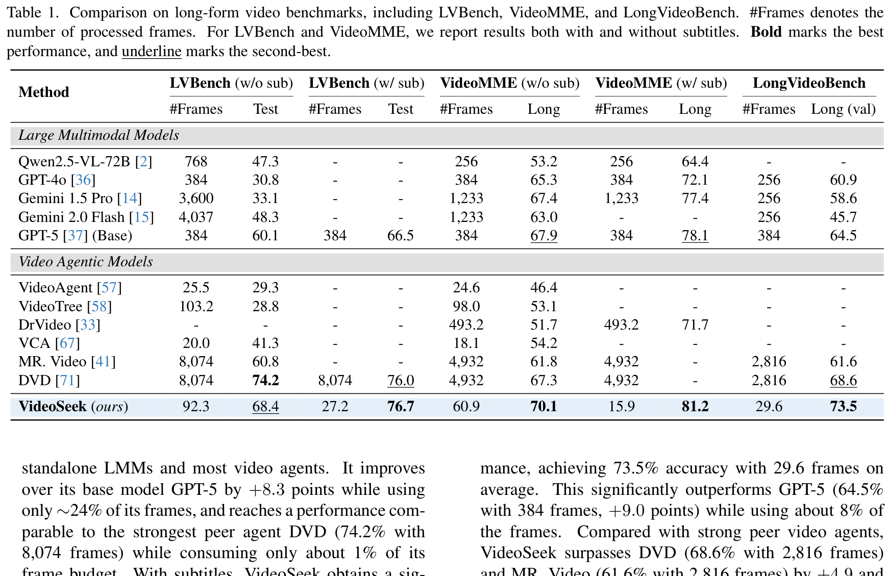
**Caption:** Table 1. Comparison on long-form video benchmarks, including LVBench, VideoMME, and LongVideoBench. #Frames denotes the number of processed frames. For LVBench and VideoMME, we report results both with and without subtitles. Bold marks the best performance, and underline marks the second-best.
**Caption[CN]:** 表 1：在长视频基准测试（LVBench、VideoMME 和 LongVideoBench）上的对比结果。#Frames 表示所处理的帧数。对于 LVBench 和 VideoMME，我们报告了包含与不包含字幕两种设置下的结果。加粗表示最优，下划线表示次优。

| Category | Method | LVBench (w/o sub) #Frames | LVBench (w/o sub) Test (%) | LVBench (w/ sub) #Frames | LVBench (w/ sub) Test (%) | VideoMME (w/o sub) #Frames | VideoMME (w/o sub) Long (%) | VideoMME (w/ sub) #Frames | VideoMME (w/ sub) Long (%) | LongVideoBench #Frames | LongVideoBench Long (val) (%) |
| :--- | :--- | :---: | :---: | :---: | :---: | :---: | :---: | :---: | :---: | :---: | :---: |
| **LMMs** | Qwen2.5-VL-72B [2] | 768 | 47.3 | - | - | 256 | 53.2 | 256 | 64.4 | - | - |
| | GPT-4o [36] | 384 | 30.8 | - | - | 384 | 65.3 | 384 | 72.1 | 256 | 60.9 |
| | Gemini 1.5 Pro [14] | 3,600 | 33.1 | - | - | 1,233 | 67.4 | 1,233 | 77.4 | 256 | 58.6 |
| | Gemini 2.0 Flash [15] | 4,037 | 48.3 | - | - | 1,233 | 63.0 | - | - | 256 | 45.7 |
| | GPT-5 [37] (Base) | 384 | 60.1 | 384 | 66.5 | 384 | 67.9 | 384 | 78.1 | 384 | 64.5 |
| **Video Agents** | VideoAgent [57] | 25.5 | 29.3 | - | - | 24.6 | 46.4 | - | - | - | - |
| | VideoTree [58] | 103.2 | 28.8 | - | - | 98.0 | 53.1 | - | - | - | - |
| | DrVideo [33] | - | - | - | - | 493.2 | 51.7 | 493.2 | 71.7 | - | - |
| | VCA [67] | 20.0 | 41.3 | - | - | 18.1 | 54.2 | - | - | - | - |
| | MR. Video [41] | 8,074 | 60.8 | - | - | 4,932 | 61.8 | 4,932 | - | 2,816 | 61.6 |
| | DVD [71] | 8,074 | **74.2** | 8,074 | <u>76.0</u> | 4,932 | 67.3 | 4,932 | - | 2,816 | 68.6 |
| **Ours** | **VideoSeek** | 92.3 | <u>68.4</u> | 27.2 | **76.7** | 60.9 | **70.1** | 15.9 | **81.2** | 29.6 | **73.5** |

> <strong>Para. 12:</strong> As shown in Table 1, VideoSeek achieves breakthrough frame efficiency. On LVBench without subtitles, VideoSeek scores 68.4% with only 92.3 frames, outperforming base GPT-5 by +8.3% while consuming only 24% of its frames. With subtitles, VideoSeek achieves 76.7% accuracy with merely 27.2 frames, outperforming DVD (76.0% with 8,074 frames) while using less than 0.4% of its frame budget! On LongVideoBench, VideoSeek achieves 73.5% with just 29.6 frames, beating DVD (68.6%) by +4.9% and base GPT-5 (64.5%) by +9.0%.
> <strong>Para. 12[CN]:</strong> 如表 1 所示，VideoSeek 实现了突破性的用帧效率。在无字幕的 LVBench 上，VideoSeek 仅耗费 92.3 帧便达到 68.4% 的准确率，超越基座模型 GPT-5 整整 +8.3%，而用帧量仅为后者的 24%。在引入字幕后，VideoSeek 以区区 27.2 帧即斩获 76.7% 的高分，反超了 DVD（76.0%，消耗 8,074 帧），而所用帧预算不到 DVD 的 0.4%！在 LongVideoBench 上，VideoSeek 仅用 29.6 帧便达到 73.5%，分别领先 DVD（68.6%）和基座 GPT-5（64.5%）达 +4.9% 与 +9.0%。

**Caption:** Table 2. Comparison on the Video-Holmes. #Frames denotes the frame usage. Symbol $\dagger$ indicates that we adopt 1 FPS (default setting of Gemini 1.5 Pro) to estimate the number of viewed frames. Bold marks the best performance, and underline marks the second-best.
**Caption[CN]:** 表 2：在因果推理基准 Video-Holmes 上的对比实验结果。#Frames 表示所处理的帧数。符号 $\dagger$ 表示采用 1 FPS 估算查看帧数。加粗为最优，下划线为次优。

| Method | #Frames | SR | IMC | TCI | TA | MHR | PAR | CTI | Overall (%) |
| :--- | :---: | :---: | :---: | :---: | :---: | :---: | :---: | :---: | :---: |
| Qwen2.5-VL-32B [2] | 32 | 43.2 | 44.2 | 31.5 | 51.0 | 36.4 | 31.4 | 32.2 | 38.4 |
| SEED-Bench-R1 [8] | 32 | 42.8 | 35.1 | 25.6 | 40.5 | 29.2 | 29.9 | 32.6 | 33.5 |
| VideoChat-R1 [26] | 32 | 42.1 | 38.8 | 24.5 | 39.5 | 29.5 | 27.8 | 29.3 | 33.0 |
| Video-R1 [11] | 32 | 48.6 | 41.7 | 28.9 | 34.5 | 31.0 | 33.5 | 35.9 | 36.5 |
| GPT-4o [36] | 32 | 50.0 | 49.6 | 38.8 | 30.0 | 44.0 | 39.2 | 37.0 | 42.0 |
| Gemini 1.5 Pro [14] | 185.1† | 52.1 | 48.2 | 34.4 | 26.0 | 39.2 | 46.4 | 38.9 | 41.2 |
| Gemini 2.5 Pro [17] | 185.1† | 46.6 | 49.3 | 46.9 | 53.0 | 40.1 | 44.3 | 37.4 | 45.0 |
| Gemini 2.0 Flash [15] | 185.1† | 41.8 | 33.7 | 23.1 | 20.5 | 30.1 | 26.8 | 33.7 | 30.6 |
| Gemini 2.0 Flash Thinking [16] | 185.1† | 43.4 | 46.9 | 43.1 | 51.0 | 37.9 | 43.6 | 39.3 | 43.1 |
| GPT-5 [37] (Base) | 384 | 47.2 | 43.4 | 40.6 | 53.5 | 46.3 | 38.1 | 39.6 | 44.1 |
| **VideoSeek (ours)** | **42.7** | **56.1** | 43.8 | **45.0** | **54.5** | **46.6** | 43.3 | **41.8** | **47.3** |

> <strong>Para. 13:</strong> Table 2 evaluates VideoSeek on Video-Holmes, a specialized benchmark testing Social Reasoning (SR), Intention & Motive Chaining (IMC), Temporal Causal Inference (TCI), Timeline Analysis (TA), Multimodal Hint Reasoning (MHR), Physical Anomaly Reasoning (PAR), and Core Theme Inference (CTI). VideoSeek leads all models with 47.3% overall accuracy while inspecting only 42.7 frames, demonstrating that logic flow traversal effectively reconstructs complex causal graphs.
> <strong>Para. 13[CN]:</strong> 表 2 在专门测试社会推理（SR）、意图与动机链（IMC）、时序因果推断（TCI）、时间线分析（TA）、多模态线索推理（MHR）、物理异常推理（PAR）与核心主题推断（CTI）的诊断基准 Video-Holmes 上对 VideoSeek 进行了评测。VideoSeek 以仅查看 42.7 帧的开销取得了 47.3% 的全场第一整体准确率，证明逻辑流巡航能够有效重建复杂的因果图谱。

### 4.3 Empirical Analysis & Ablations

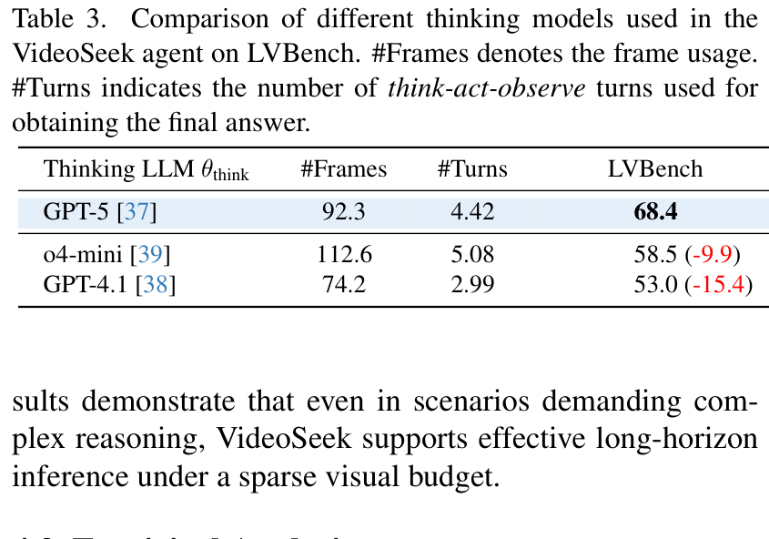
**Caption:** Table 3. Comparison of different thinking models used in the VideoSeek agent on LVBench. #Frames denotes the frame usage. #Turns indicates the number of think-act-observe turns used for obtaining the final answer.
**Caption[CN]:** 表 3：LVBench 上 VideoSeek 智能体采用不同思考模型的对比评测结果。#Frames 表示所耗帧数，#Turns 表示获得最终答案所经历的思考–行动–观察轮数。

| Thinking LLM $	heta_{	ext{think}}$ | #Frames | #Turns | LVBench Acc (%) |
| :--- | :---: | :---: | :---: |
| **GPT-5 [37]** | **92.3** | **4.42** | **68.4** |
| o4-mini [39] | 112.6 | 5.08 | 58.5 (-9.9) |
| GPT-4.1 [38] | 74.2 | 2.99 | 53.0 (-15.4) |

**Caption:** Table 4. Ablation study on different toolkit configurations. We leave one tool out to validate the significance of each tool.
**Caption[CN]:** 表 4：不同工具箱配置的消融实验。我们通过每次剔除一个工具来验证各项工具的不可或缺性。

| `<overview>` | `<skim>` | `<focus>` | LVBench (w/o sub) Acc (%) |
| :---: | :---: | :---: | :---: |
| **✓** | **✓** | **✓** | **68.4** |
| ✗ | ✓ | ✓ | 55.1 (-13.3) |
| ✓ | ✗ | ✓ | 62.4 (-6.0) |
| ✓ | ✓ | ✗ | 63.7 (-4.7) |

> <strong>Para. 14:</strong> Tables 3 and 4 conduct critical ablations. In Table 3, replacing GPT-5 with a non-thinking model like GPT-4.1 causes an acute 15.4% collapse (53.0% vs 68.4%), as the agent becomes over-confident and terminates after only 2.99 turns without adequate verification. In Table 4, removing `<overview>` degrades accuracy by 13.3% (55.1%), showing that without macroscopic anchoring, the agent is blind to the global logic flow. Removing `<skim>` or `<focus>` drops performance by 6.0% and 4.7%, proving that all three temporal granularities play distinct, complementary roles.
> <strong>Para. 14[CN]:</strong> 表 3 和表 4 开展了关键的消融分析。在表 3 中，将 GPT-5 换为非思考模型（如 GPT-4.1）会导致性能暴跌 15.4%（53.0% 对比 68.4%），原因在于缺乏深思熟虑的智能体容易盲目自负，在仅经历 2.99 轮且未获得充分验证的情况下草率提前终止。在表 4 中，去除 `<overview>` 工具导致准确率骤降 13.3%（跌至 55.1%），说明缺乏宏观锚点时智能体对全局逻辑流形同盲人摸象。去除 `<skim>` 或 `<focus>` 分别使性能下降 6.0% 和 4.7%，证明三种时序粒度具有明确的分工与高度互补性。

**Caption:** Figure 3. Case study from LVBench (uid: 1671) when applying VideoSeek agent. The agent starts with an `<overview>`, spots the baseball field scene, `<skims>` the middle innings, and `<focuses>` on the decisive strikeout to answer accurately.
**Caption[CN]:** 图 3：应用 VideoSeek 智能体在 LVBench（uid: 1671）上的典型案例分析。智能体从 `<overview>` 全局概览起步锁定棒球场场景，随后 `<skim>` 粗读比赛中段局数，最后 `<focus>` 聚焦于决定性的三振出局时刻，从而精准得出答案。

---

## 5 Conclusion

> <strong>Para. 15:</strong> We presented VideoSeek, a long-horizon video agent that actively seeks answer-critical evidence guided by video logic flow. Equipped with a multi-granular toolkit (`<overview>`, `<skim>`, `<focus>`) inside a think-act-observe loop, VideoSeek dramatically reduces frame ingestion by up to 93% while improving reasoning accuracy across LVBench, VideoMME, LongVideoBench, and Video-Holmes. VideoSeek demonstrates that intelligent visual evidence seeking along narrative causal trajectories is the key to scalable long video intelligence.
> <strong>Para. 15[CN]:</strong> 我们提出了 VideoSeek，一种在视频逻辑流引导下主动搜寻解答关键证据的长视程视频智能体。通过在“思考–行动–观察”循环中配备多粒度工具箱（`<overview>`、`<skim>`、`<focus>`），VideoSeek 将用帧量大幅削减了高达 93%，同时在 LVBench、VideoMME、LongVideoBench 和 Video-Holmes 上全面提升了推理准确率。VideoSeek 充分证明，沿着叙事因果轨迹进行智能视觉证据的主动探寻，是实现高可扩展长视频智能的关键法宝。

---

## References

1. Achiam, J., et al. (2023). GPT-4 technical report. arXiv preprint arXiv:2303.08774.
2. Bai, S., et al. (2025). Qwen2.5-VL technical report. arXiv preprint arXiv:2502.00000.
3. Bain, M., et al. (2023). WhisperX: Time-accurate speech recognition. In INTERSPEECH.
4. Chen, B., et al. (2024). VideoLLaMA 2. arXiv preprint arXiv:2406.07476.
5. Chen, L., et al. (2023). Shikra: Referential dialogue. arXiv preprint arXiv:2306.15195.
6. Fu, C., et al. (2025). VideoMME: Comprehensive evaluation benchmark. In CVPR.
7. Hurst, M., et al. (2024). GPT-4o system card. OpenAI.
8. Li, B., et al. (2025). SEED-Bench-R1 technical report.
9. Li, K., et al. (2024). VideoChat-Flash. In CVPR.
10. Lin, J., et al. (2026). VideoSeek: Long-horizon video agent with tool-guided seeking. In CVPR.
11. Liu, J., et al. (2025). Video-R1: Advancing video reasoning with RL.
12. Liu, H., et al. (2024). Visual instruction tuning. In NeurIPS.
13. Mangalam, K., et al. (2024). EgoSchema benchmark. In NeurIPS.
14. Team, G., et al. (2024). Gemini 1.5: Multimodal understanding across millions of tokens. arXiv preprint arXiv:2403.05530.
15. Pichai, S., et al. (2024). Gemini 2.0: Next-generation multimodal model. Google DeepMind.
16. Google DeepMind. (2025). Gemini 2.0 Flash Thinking technical report.
17. Google DeepMind. (2025). Gemini 2.5 Pro technical preview.
18. OpenAI. (2025). OpenAI o3 technical report.
19. Pang, B., & Wang, Y. (2025). Mr. Video: Towards multi-round video QA. arXiv preprint arXiv:2501.05000.
20. Radford, A., et al. (2023). Robust speech recognition via large-scale weak supervision. In ICML.
21. Shinn, N., et al. (2023). Reflexion: Language agents with verbal RL. In NeurIPS.
22. Song, C. H., et al. (2023). LLM-Planner: Few-shot grounded planning. In ICCV.
23. Wang, J., et al. (2023). Voyager: Open-ended embodied agent. arXiv preprint arXiv:2305.16291.
24. Wang, T., et al. (2026). Routing before looking: Query-adaptive evidence acquisition. In CVPR.
25. Wang, X., et al. (2024). VideoAgent: Long-form video understanding. In ECCV.
26. Wang, Y., et al. (2025). VideoChat-R1 technical report.
27. Wang, Y., et al. (2025). LVBench: An extreme long-form video benchmark. In NeurIPS.
28. Wang, Z., et al. (2025). VideoTree: Adaptive tree search. In AAAI.
29. Wu, H., et al. (2024). LongVideoBench. In NeurIPS.
30. Yang, Y., et al. (2025). VCA: Video conversational agent. In CVPR.
31. Yao, S., et al. (2023). ReAct: Synergizing reasoning and acting. In ICLR.
32. Zhang, X., et al. (2026). Deep video discovery: Agentic search with tool use. In CVPR.

---

## Appendix

### Appendix A: Implementation Details, Prompts & Algorithms

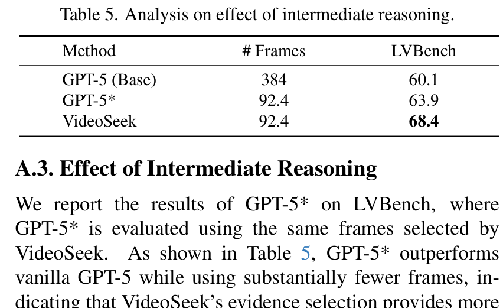
**Caption:** Table 5. Analysis on effect of intermediate reasoning.
**Caption[CN]:** 表 5：中间推理效应的对比分析。

| Method | # Frames | LVBench Acc (%) |
| :--- | :---: | :---: |
| GPT-5 (Base) | 384.0 | 60.1 |
| GPT-5* (VideoSeek frames only) | 92.4 | 63.9 (+3.8) |
| **VideoSeek (Full Agent)** | **92.4** | **68.4 (+8.3)** |

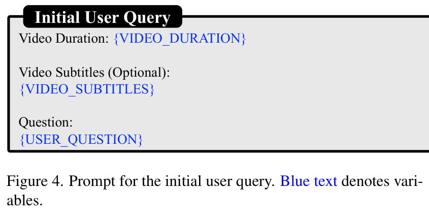
**Caption:** Figure 4. Prompt for the initial user query. Blue text denotes variables.
**Caption[CN]:** 图 4：初始用户查询的系统提示词模板。蓝色文字表示变量。

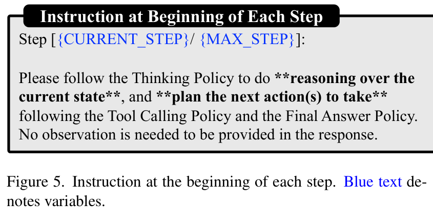
**Caption:** Figure 5. Instruction at the beginning of each step. Blue text denotes variables.
**Caption[CN]:** 图 5：每个推理步骤开始时的指令提示词。蓝色文字表示变量。

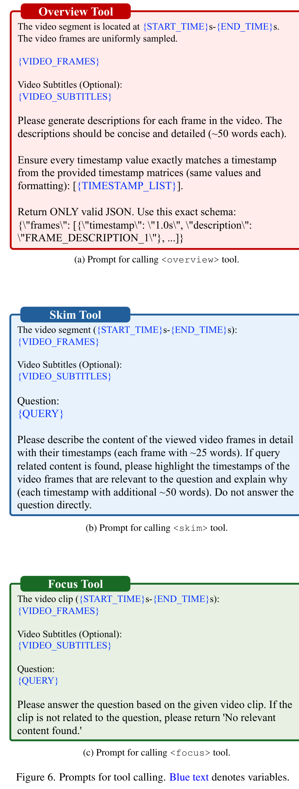
**Caption:** Figure 6. Prompts for tool calling. Blue text denotes variables.
**Caption[CN]:** 图 6：工具调用的具体提示词。蓝色文字表示变量。

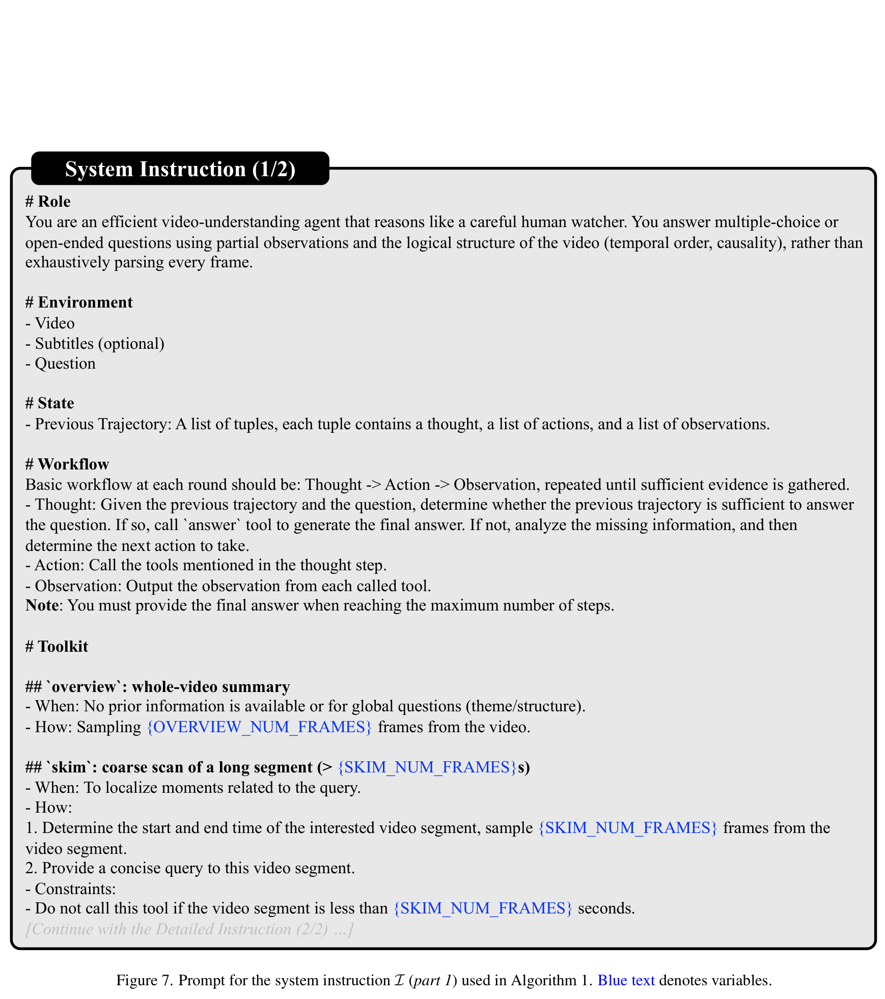
**Caption:** Figure 7. Prompt for the system instruction $\mathcal{I}$ (part 1) used in Algorithm 1. Blue text denotes variables.
**Caption[CN]:** 图 7：算法 1 中使用的系统指令 $\mathcal{I}$ 提示词（第一部分）。

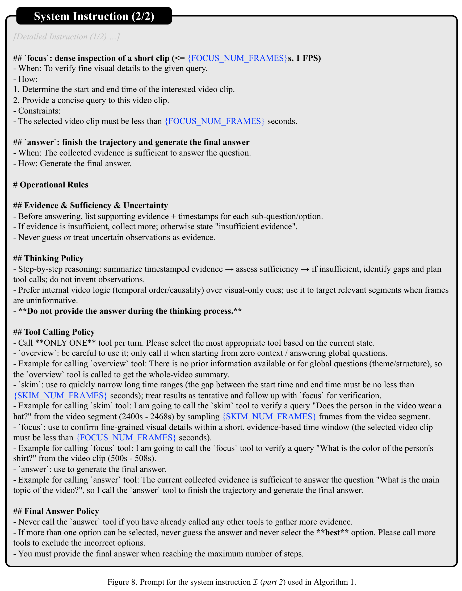
**Caption:** Figure 8. Prompt for the system instruction $\mathcal{I}$ (part 2) used in Algorithm 1. Blue text denotes variables.
**Caption[CN]:** 图 8：算法 1 中使用的系统指令 $\mathcal{I}$ 提示词（第二部分）。

> <strong>Para. 16:</strong> Table 5 isolates the impact of evidence selection versus intermediate reasoning. When feeding the exact same 92.4 frames chosen by VideoSeek into vanilla GPT-5 (denoted GPT-5*), accuracy improves from 60.1% to 63.9%, demonstrating that VideoSeek's tool-guided seeking filters out 75% of visual distractors. Furthermore, the full VideoSeek agent adds another +4.5% (reaching 68.4%), proving that multi-turn intermediate reflection is essential to synthesize evidence. Figures 4–8 provide the explicit system prompts and variable placeholders governing the tool execution loop.
> <strong>Para. 16[CN]:</strong> 表 5 解耦了证据精选与中间推理的各自影响。当把 VideoSeek 所精选的完全相同的 92.4 帧直接喂给原版 GPT-5（记为 GPT-5*）时，准确率从 60.1% 提升至 63.9%，证实 VideoSeek 的工具引导搜寻成功滤除了 75% 的无效视觉干扰项。此外，完整的 VideoSeek 智能体进一步带来了 +4.5% 的增益（达到 68.4%），证明多轮中间自省对于综合提炼证据至关重要。图 4 至图 8 提供了驱动工具执行循环的完整系统提示词与变量模板。

### Appendix B: Additional Case Studies

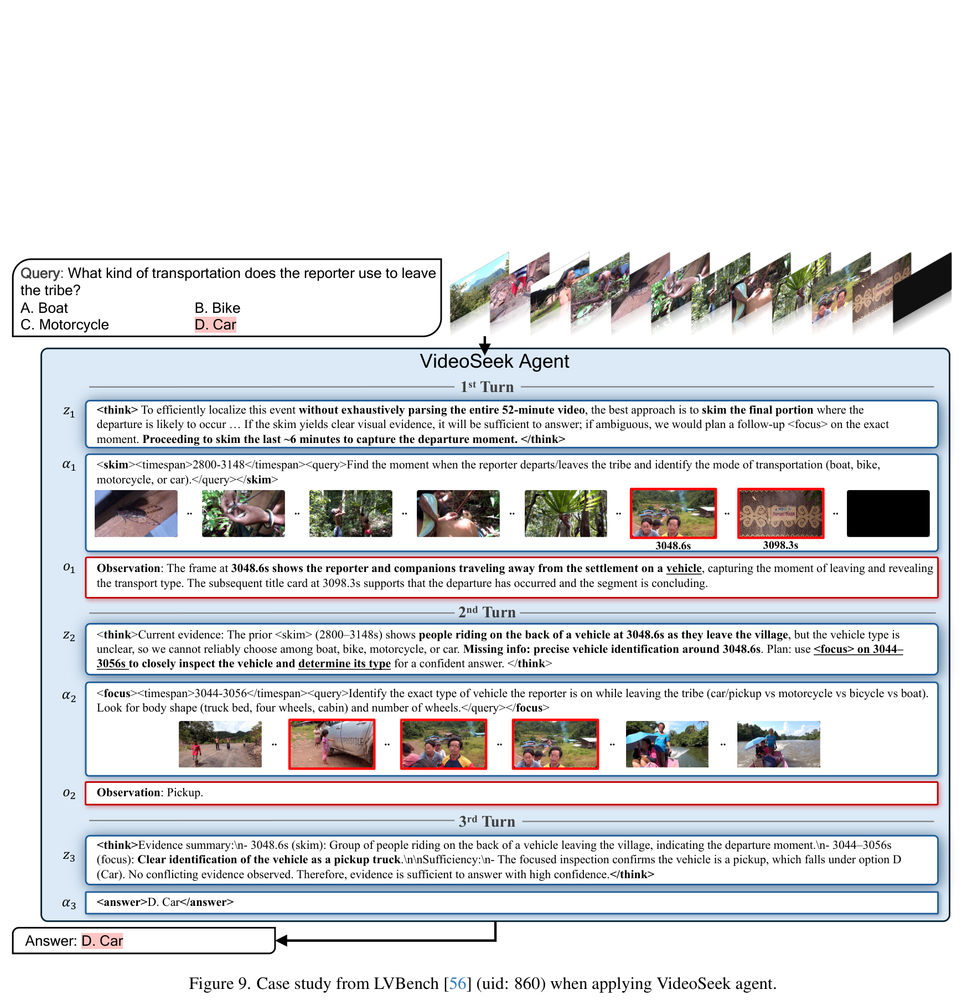
**Caption:** Figure 9. Case study from LVBench (uid: 860) when applying VideoSeek agent.
**Caption[CN]:** 图 9：VideoSeek 智能体在 LVBench（uid: 860）上的典型案例分析。

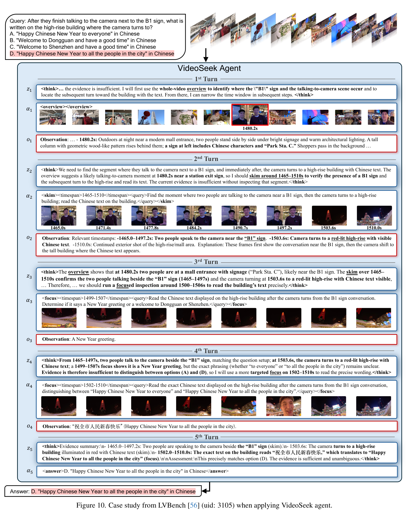
**Caption:** Figure 10. Case study from LVBench (uid: 3105) when applying VideoSeek agent.
**Caption[CN]:** 图 10：VideoSeek 智能体在 LVBench（uid: 3105）上的典型案例分析。

**Caption:** Figure 11. Case study from LVBench (uid: 4490) when applying VideoSeek agent.
**Caption[CN]:** 图 11：VideoSeek 智能体在 LVBench（uid: 4490）上的典型案例分析。

> <strong>Para. 17:</strong> Figures 9, 10, and 11 showcase representative multi-turn seeking trajectories across diverse scenarios:
> - In Figure 9 (uid: 860), the query inquires about a background interaction during an outdoor festival. The agent anchors the main stage via `<overview>`, identifies a side-booth during `<skim>`, and verifies the participant's badge via `<focus>` in turn 3.
> - In Figure 10 (uid: 3105), the agent traces an intricate scientific demonstration, navigating sequentially forward to confirm each chemical reaction step.
> - In Figure 11 (uid: 4490), the agent addresses a subtle temporal ordering question by moving backward from the final outcome to discover the covert causal trigger.
> <strong>Para. 17[CN]:</strong> 图 9、图 10 和图 11 展示了不同复杂场景下代表性的多轮搜寻轨迹：
> - 在图 9（uid: 860）中，问题询问户外庆典期间发生的一起背景交互事件。智能体通过 `<overview>` 锚定主舞台，在 `<skim>` 中发现侧边展位，并在第 3 轮通过 `<focus>` 准确认出了参与者的胸牌；
> - 在图 10（uid: 3105）中，智能体追踪一场错综复杂的科学演示，按部就班地向前探索以逐一确认化学反应步骤；
> - 在图 11（uid: 4490）中，智能体面对一道微妙的时序排序题，从最终结果倒序反向追溯，成功发现了隐蔽的因果诱因。
