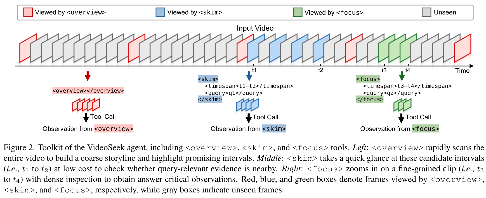
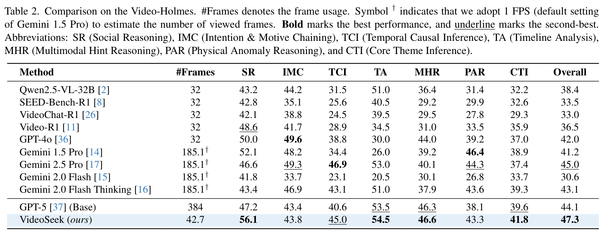
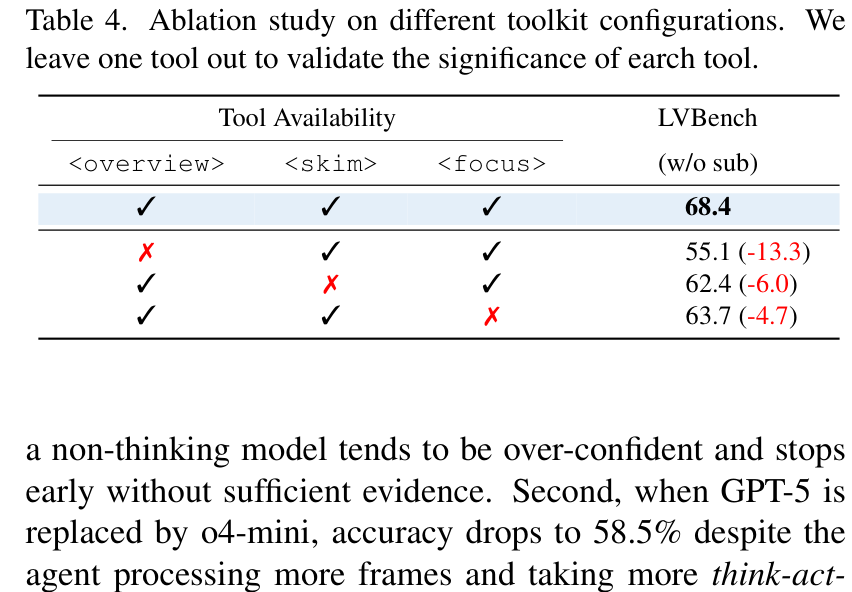
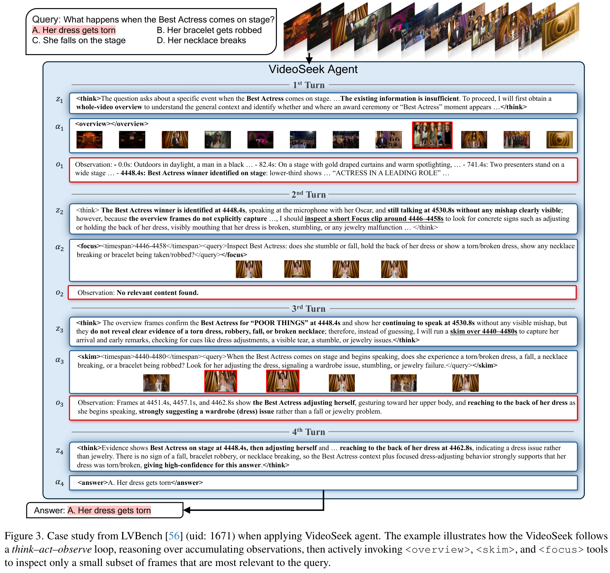
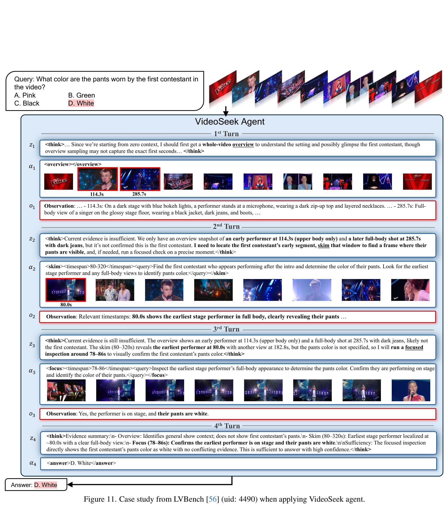

# VideoSeek: Long-Horizon Video Agent with Tool-Guided Seeking

## 核心信息
- **论文标题**：VideoSeek: Long-Horizon Video Agent with Tool-Guided Seeking (VideoSeek：工具引导主动搜寻的长视程视频智能体)
- **作者团队**：Jingyang Lin (AMD / 罗切斯特大学), Jialian Wu (AMD), Jiang Liu (AMD), Ximeng Sun (AMD), Ze Wang (AMD), Xiaodong Yu (AMD), Jiebo Luo (罗切斯特大学), Zicheng Liu (AMD), Emad Barsoum (AMD)
- **机构背景**：AMD Research (AMD 战略研究团队) & 罗切斯特大学计算机系
- **发布时间**：2026 年 3 月 (CVPR 2026)
- **代码仓库**：[https://github.com/jylins/videoseek](https://github.com/jylins/videoseek)
- **核心定位**：极具工程实用价值与认知启发性的轻量长视频 Agent。针对主流多模态模型“贪婪吞噬密集视频帧”导致的计算冗余与注意力涣散瓶颈，提出**“沿着视频逻辑流（Video Logic Flow）主动定向搜寻证据”**的新理念。通过 `<overview>`（全局概览）、`<skim>`（区间粗读）和 `<focus>`（局部聚焦）三阶互补工具，在 LVBench 上以减少 **93% 帧消耗（仅用 27~92 帧）**的极轻开销，反超基座模型 GPT-5 达 **10.2 个百分点**（带字幕 76.7% vs 66.5%），在 Video-Holmes 因果基准上刷新多项 SOTA。

---

## 原文摘要翻译
视频智能体模型推动了极具挑战性的视频–语言任务的发展。然而，大多数智能体方法仍然严重依赖对密集采样视频帧的贪婪逐帧解析，带来了巨大的计算开销。我们提出了 VideoSeek，一种长视程视频智能体，它利用视频逻辑流主动搜寻对解答问题至关重要的证据，而非穷举解析整段视频。这一核心洞察使得模型能够在维持甚至提升视频理解能力的同时，大幅削减所消耗的帧数。VideoSeek 在一个精巧设计的“思考–行动–观察”循环中运行，配备了用于收集多粒度视频观测的工具箱。该设计使得智能体能够在累积的观测上展开查询感知的定向探索，并赋能实用的长视频理解与复杂推理。在四个具有高难度的视频理解与推理基准测试上的实验表明，VideoSeek 在使用远少于以往视频智能体与独立多模态大模型的帧数下，取得了强大的准确率。值得注意的是，在 LVBench 上，VideoSeek 相比其基座模型 GPT-5 取得了 10.2 个绝对百分点的性能提升，同时减少了 93% 的用帧量。更深入的分析凸显了利用视频逻辑流、强大推理大脑以及工具箱互补设计的核心意义。代码已在 https://github.com/jylins/videoseek 开源。

---

## 创新点
1. **提出“视频逻辑流”（Video Logic Flow）导航理念，摒弃贪婪逐帧暴力解析**：
   深刻批判了长视频领域“越长越密、全片硬塞”的蛮力恶习。指出长视频的核心在于因果关系与叙事脉络（起因 $
ightarrow$ 经过 $
ightarrow$ 结果），智能体应像人类侦探一样，沿着因果轨迹双向跳跃追溯，仅在最关键的局部节点展开精准验证。
2. **多粒度正交工具箱设计（`<overview>`, `<skim>`, `<focus>`）**：
   解耦了视频探索的三重时空尺度：
   - `<overview>`：以极稀疏锚点帧（约 16 帧）秒级勾勒整片叙事框架；
   - `<skim>`：在中等时间跨度（几分钟）内以适度帧率捕捉事件候选与转折点；
   - `<focus>`：在数秒狭窄窗口内以超高清和高帧率提取像素级决定性证据。
3. **高信噪比思考–行动–观察闭环（Think-Act-Observe Loop）**：
   在每轮交互中，LLM 必须先输出显式的因果推演（Thinking），更新当前证据假设，再精确指定工具及其时间戳参数，从而在极少数轮次内（平均仅 4.4 轮）快速收敛到确定性结论。
4. **解耦“证据精选收益”与“中间推理收益”的因果验证**：
   设计了严谨的对照实验（GPT-5*），将 VideoSeek 筛选出的稀疏关键帧直接喂给单次前向模型，量化证明了“证据纯化”（过滤 75% 噪声）与“多轮深思熟虑”（思维链交叉仲裁）各自对长视频推理性能提升的量化贡献。

---

## 一句话总结
VideoSeek 证明了长视频理解的制胜之道不在于“看完一部电影需要吃下多少帧”，而在于“顺着故事的因果藤蔓，能在多短的时间内精准摸到那个决定胜负的瓜”。

---

## 研究问题
1. **长视频贪婪解析（Greedy Parsing）的死胡同**：
   当前多模态模型试图通过暴力提升上下文窗口来“直接看完整部视频”。然而，在 1 小时的视频里，99% 的画面都是平淡的背景过渡与冗余动作。把几千帧统统压成视觉 token 塞入网络，不仅算力成本高得惊人，更直接导致自注意力机制在噪声中迷失方向（如 Gemini 1.5 Pro 在 LVBench 上仅得 33.1%）；
2. **暴力 Agent 的沉重预处理枷锁**：
   如微软的 DVD 尽管精度很高（74.2%），但其强行要求将视频切片并离线生成海量字幕，平均每部视频要消耗超过 8,000 帧；而现实在线场景中，用户往往希望即时分析一段未标注的全新长视频，沉重的建库预处理根本无法满足低延迟交互；
3. **缺乏因果常识引导的时序盲跳**：
   早期视频 Agent（如 VideoAgent）在时序上缺乏因果推断能力，往往依靠文本关键词碰运气盲跳，面对需要多跳因果联想的问题（如“为什么巨人最终摔倒爬不起来？”——实际是因为在数分钟前被自己的脚绊倒）容易彻底迷航。


---

## 数据与任务定义
- **长视频输入**：原始未切片、未预处理的任意长视频 $V$（时长可达数小时）；
- **测试基准全景图**：
  1. **LVBench**：极限超长视频综合基准（1,549 题，平均时长 > 67 分钟）；
  2. **VideoMME (Long split)**：多样化长视频理解基准（900 题，30~60 分钟）；
  3. **LongVideoBench (Long split)**：图文交织长上下文基准（564 题，15~60 分钟）；
  4. **Video-Holmes**：专注于长因果链与深层常识推断的侦探级基准，细分为七大认知维度：
     - *SR (Social Reasoning)*：社会关系与人际互动
     - *IMC (Intention & Motive Chaining)*：角色深层动机与意图推演
     - *TCI (Temporal Causal Inference)*：时序因果推断（起因与结果的严格绑定）
     - *TA (Timeline Analysis)*：全片时间线多事件顺序梳理
     - *MHR (Multimodal Hint Reasoning)*：多模态微弱暗示推断
     - *PAR (Physical Anomaly Reasoning)*：反常物理现象诊断
     - *CTI (Core Theme Inference)*：核心深层主题提炼

---

## 方法主线



### 机制流程：基于视频逻辑流的主动定向搜寻
VideoSeek 完全免训练（Training-free），其内部决策引擎是一个高度结构化的 ReAct 增强循环：
1. **初始化**：智能体接收用户提问 $Q$。此时无任何视频帧输入，记忆为空 $H_0 \leftarrow \emptyset$；
2. **Step 1: 建立宏观世界观 (`<overview>`)**：
   智能体在第一步主动调用 `<overview>` 工具，从长视频中等间隔抽取 $N_{	ext{overview}} = 16$ 帧低分辨率画面。此时大模型审视这 16 张锚点图，在心智中构建出整部视频的粗粒度时间线（例如：0~10 分钟为开幕准备，10~25 分钟为初次尝试，25~45 分钟为冲突高潮，45~60 分钟为结局收尾）；
3. **Step 2: 沿因果脉络展开中观粗读 (`<skim>`)**：
   根据问题中的核心线索，智能体在思考过程（Thinking）中推测关键事件最可能发生的时序区间 $[t_{	ext{start}}, t_{	ext{end}}]$，调用 `<skim>` 提取 8~16 帧画面。如果确认线索在这一带，则继续收窄范围；若发现完全不是该场景，则迅速利用逻辑流反向或向前跳跃到新的时间段；
4. **Step 3: 微观高精度定点爆破 (`<focus>`)**：
   当嫌疑区间被锁定在 5~15 秒的狭窄窗口内时，智能体果断调用 `<focus>`，拉取高分辨率密集连续帧，执行像素级比对（看清特定动作瞬间、手部接触构型、屏幕微小文字等）；
5. **Step 4: 终止与回答**：
   一旦累积的证据链完整闭合，大模型直接输出最终答案，结束循环。

### 算法伪代码与执行推演
```python
def videoseek_execution_loop(video_V, query_Q, max_turns=8):
    accumulated_observations = []
    
    for turn in range(max_turns):
        # 1. 强推理大脑进行逻辑流规划
        response = thinking_llm.generate(
            system_prompt=SYSTEM_PROMPT,
            query=query_Q,
            observations=accumulated_observations
        )
        thought = extract_thought(response)
        action, action_params = parse_action(response)
        
        # 2. 终止判定
        if action == "answer":
            return action_params["final_answer"]
            
        # 3. 多粒度工具执行
        if action == "overview":
            frames = sample_uniform_anchors(video_V, num_frames=16)
            obs = f"<overview> sampled 16 anchor frames across duration {video_V.duration}s."
        elif action == "skim":
            t_start, t_end = action_params["time_range"]
            frames = sample_interval_frames(video_V, t_start, t_end, num_frames=12)
            obs = f"<skim> inspected interval [{t_start}s, {t_end}s] with 12 frames."
        elif action == "focus":
            t_start, t_end = action_params["time_range"]
            frames = extract_dense_hd_frames(video_V, t_start, t_end, fps_dense=2.0)
            obs = f"<focus> decoded HD frames in narrow window [{t_start}s, {t_end}s]."
            
        # 4. 沉淀至多轮上下文
        accumulated_observations.append({
            "turn": turn,
            "thought": thought,
            "action": action,
            "frames": frames,
            "summary": obs
        })
        
    return fallback_generation(query_Q, accumulated_observations)
```

---


### 提示词工程模板与状态转移规范 (Prompt Architecture & State Transitions)
VideoSeek 的极简轻量性很大程度上归功于其极其严密的状态转移约束与系统提示词（System Prompt）设计（详见附录 Figure 4–8）：

1. **初始提问注入协议 (Initial Query Prompt)**：
   智能体在第 0 步接收到的核心系统指令强调：
   - “You are an expert video agent tasked with answering a user query about a long video.”
   - “You do not have access to all frames at once. You must actively explore the video using `<overview>`, `<skim>`, and `<focus>`.”
   - “Prioritize forming a hypothesis based on video narrative logic flow before requesting frames.”

2. **工具调用格式规范 (Tool Calling Invocations)**：
   智能体输出严格受限于类似 XML 标签的动作语法：
   ```xml
   <thought>
   The question asks about why the protagonist suddenly abandoned the marathon. 
   In the <overview>, I noticed he was leading at minute 25, but was missing from the lead pack at minute 35. 
   Therefore, the critical incident must have occurred between [1500s, 2100s]. 
   I will skim this interval to pinpoint the exact moment.
   </thought>
   <action>
   <skim time_range="[1500, 2100]" num_frames="12" />
   </action>
   ```

3. **自省与终止协议 (Stopping & Answer Verification)**：
   当智能体通过 `<focus>` 验证了细节后，必须在思维链中确认无歧义性：
   ```xml
   <thought>
   The high-resolution frames between [1720s, 1735s] clearly show the runner clutching his right hamstring and collapsing onto the grass verge. 
   The medical crew immediately arrived with an ice pack. This directly answers the query without ambiguity.
   </thought>
   <action>
   <answer>The protagonist suffered a severe right hamstring tear and was forced to withdraw.</answer>
   </action>
   ```

## 关键结果


### 主结果与强基线评测
在三个最具权威性的长视频测试集上，VideoSeek 展现出颠覆性的“高精度、极低帧”特性：
1. **LVBench（平均 1 小时+极限长视频）**：
   - 在**无字幕**设置下：VideoSeek 达到 **68.4%** 的准确率，平均仅消耗 **92.3 帧**！
     - 相比单次前向的 GPT-5 基座（60.1%，消耗 384 帧），准确率狂飙 **+8.3%**，而所用帧数暴降 **76%**；
     - 相比需要预处理建库、狂吞 8,074 帧的 DVD（74.2%），VideoSeek 以仅消耗其 **1.1%** 的帧预算就逼近了其精度；
   - 在**有字幕**设置下：VideoSeek 跃升至 **76.7%**，平均仅需 **27.2 帧**！
     - **以区区 27 帧击败了 DVD 的 8,074 帧（76.7% vs 76.0%）**，帧开销不到 DVD 的 **0.34%**！
2. **LongVideoBench (Long split)**：
   - 达到 **73.5%**，平均仅用 **29.6 帧**；
   - 彻底超越微软 DVD（68.6%，消耗 2,816 帧，高出 +4.9%）与 GPT-5（64.5%，消耗 384 帧，高出 +9.0%）；
3. **VideoMME (Long split)**：
   - 无字幕设置下达到 **70.1%**（仅 60.9 帧），有字幕设置下达到 **81.2%**（仅 15.9 帧），均位列榜首。



### Video-Holmes 因果推理能力突破
如 Table 2 所示，在专测复杂长因果逻辑的 Video-Holmes 基准上：
- VideoSeek 取得 **47.3%** 的总榜第一成绩，平均仅看 **42.7 帧**；
- 在社会推理（SR）上取得 **56.1%**，在时间线分析（TA）上取得 **54.5%**，在多模态暗示（MHR）上取得 **46.6%**；
- 全面领先前沿专有大模型（Gemini 2.5 Pro 45.0%、GPT-4o 42.0%、Gemini 2.0 Flash Thinking 43.1%），证明其逻辑流因果跳转策略能够有效刺破长时序中的逻辑迷雾。

---

## 深度消融与实证分析


### 思考模型消融：为什么非思考模型会彻底崩盘？
Table 3 在 VideoSeek 框架下对比了不同的大语言模型大脑：
- **GPT-5 (Thinking)**：准确率 68.4%，平均 4.42 轮，用帧 92.3；
- **o4-mini**：准确率 58.5%（跌幅 -9.9%），平均 5.08 轮，用帧 112.6；
- **GPT-4.1 (Non-thinking)**：准确率暴跌至 **53.0%（跌幅 -15.4%）**，平均轮数仅 2.99 轮！
- **本质诊断**：
  缺乏深度思考能力的传统非推理模型表现出极度的“**盲目自负（Over-confidence）**”：在仅仅调用一次概览或粗读后，在缺乏充足证据的情况下便草草作答退出（平均不到 3 轮），导致惨败；
  而真正的推理模型具备元认知自我怀疑与检验习惯，会在多轮因果推演中不断验证反例，确保万无一失。



### 工具箱正交性消融：三大法宝缺一不可
- **剔除 `<overview>`**：准确率从 68.4% 暴跌至 **55.1%（-13.3%）**！
  - 这是最致命的损失。一旦没有第一步的全局 16 帧锚点，智能体对整部视频的时空尺度毫无概念，直接在茫茫时序中盲目乱猜；
- **剔除 `<skim>`**：准确率跌至 **62.4%（-6.0%）**；
  - 缺乏中等尺度的快速排查，导致智能体必须频繁在微观窗口中做昂贵尝试；
- **剔除 `<focus>`**：准确率跌至 **63.7%（-4.7%）**；
  - 无法看清数秒内的像素级动作与微小文字。


### 证据精选 vs 中间推理的贡献解耦 (Table 5)
论文设计了一个非常精妙的变体 **GPT-5\***：
- 不允许 GPT-5 进行多轮 Agentic 探索，但**把完整 VideoSeek 最终挑选出的那 92.4 帧打包直接喂给 GPT-5 进行单次回答**；
- 实验结果：
  - `原版 GPT-5 (盲目均匀采样 384 帧)`：60.1%；
  - `GPT-5* (仅享用 VideoSeek 精选的 92.4 帧)`：**63.9% (+3.8%)**；
  - `完整 VideoSeek (精选 92.4 帧 + 多轮思维链推理)`：**68.4% (+8.3%)**。
- **划时代结论**：
  1. **证据纯化贡献了 +3.8%**：证明长视频中 75% 以上的帧不仅无用，反而是引发幻觉与注意力分散的“剧毒噪声”；
  2. **多轮中间深思熟虑额外贡献了 +4.5%**：证明交互过程中的假设生成、逐步求证与自我否定构成了高阶智能的核心来源。






---

## 深度分析

### 真正贡献是什么：定义了长视频 Agent 的极简效率前沿
在以往的认知中，要想在长视频上达到高精度，似乎只有两条路：
1. 要么硬件极其奢华，把数千帧直接吞入庞大显存；
2. 要么工程极其厚重，像 DVD 一样花数小时对全片切片建库。

VideoSeek 的真正震撼之处在于指出了第三条康庄大道：**借助因果逻辑流与三阶多粒度主动搜寻，可以在完全零预处理的前提下，仅凭几十张图片就实现超越数千帧蛮力吞噬的准确率**！它代表了长视频理解领域当前最为精妙的“计算–精度性价比前沿”。

### 为什么结果成立
1. **真实视频叙事的因果单调性与拓扑结构**：
   任何有意义的视频（体育转播、纪录片、影视剧、科学实验）都不是白噪声，其内部存在严格的因果拓扑网络。例如在棒球比赛中，击球员跑垒必然发生在投手投球之后；在科学实验中，溶液变色必然发生在滴入试剂之后。捕捉到这个逻辑流，探索空间就被压缩了几个数量级；
2. **三粒度感知的时空滤波效应**：
   16 帧概览滤除 90% 无关背景 $
ightarrow$ 粗读排查滤除 8% 干扰片段 $
ightarrow$ 聚焦锁定剩余 2% 的绝对真理。

### 容易误读的地方
- **误区 1：VideoSeek 帧数这么少，遇到极度分散的统计问题会不会漏检？**
  *确实有一定局限*。如果问题要求“数出整部视频中所有出现红苹果的次数”，单纯靠逻辑流跳跃很难穷尽所有偶发出现点。这正是后续 Route2Look 提出的动机——在面对此类高频隐式时序问题时，系统应主动路由切换至检索策略。
- **误区 2：VideoSeek 的三阶工具需要复杂的参数调整吗？**
  *不需要*。工具调用格式完全自然语言化（见附录 Figure 4–8），通过规范的系统 Prompt，大模型能非常自然地生成时间戳区间参数。

---

## 局限
1. **对纯随机、无叙事逻辑视频的穿透力下降**：
   若视频属于无主题的监控录像或杂乱无章的家庭日常随拍剪辑，因果逻辑流断裂，智能体在 `<skim>` 阶段容易失去方向；
2. **首步 `<overview>` 采样密度的敏感性**：
   默认的 16 帧若恰好跳过了极为短暂且唯一的关键场景（例如只有 1 秒钟的凶手背影），智能体可能在后续推演中永远无法将该时段纳入候选区间。

---

## 我的笔记：三大长视频推理 Agent 横向全景总结

我们系统精读了长视频理解领域的顶级代表作：
1. **Deep Video Discovery (DVD)**：
   - **哲学**：“地毯式建库，自主式破案”。
   - **特点**：全片深度离线字幕建库，在线 ReAct 自主搜索。精度极高（LVBench 74.2% / 76.0%），但用帧极巨（8,074 帧）。
2. **VideoSeek**：
   - **哲学**：“顺藤摸瓜，因果跳跃”。
   - **特点**：完全免建库，依托视频逻辑流，三阶多粒度（概览–粗读–聚焦）主动搜寻。用帧极度精简（27~92 帧），LVBench 达到 76.7%（带字幕），性价比巅峰。
3. **Route2Look (先路由后观察)**：
   - **哲学**：“谋定而后动，知己知彼”。
   - **特点**：敏锐发现 DVD 与 VideoSeek 各自的局限与擅长领域。在感知前先审视提问本质，宏观问题路由走 VideoSeek 式的生成粗读，高频局部问题路由走 DVD 式的多模态密集检索。以 202 帧的折中预算全面超越两者，刷新 75.4% 的无字幕 SOTA。

三者构成了一幅极为壮丽的学术演进图谱：**从 DVD 的工具自主演化，到 VideoSeek 的因果流极度瘦身，再到 Route2Look 的元认知先知路由**，标志着视频理解已经从单纯的“多模态特征拟合”彻底蜕变为“高阶认知智能体系统工程”！

---

## 引用
```bibtex
@inproceedings{lin2026videoseek,
  title={VideoSeek: Long-Horizon Video Agent with Tool-Guided Seeking},
  author={Lin, Jingyang and Wu, Jialian and Liu, Jiang and Sun, Ximeng and Wang, Ze and Yu, Xiaodong and Luo, Jiebo and Liu, Zicheng and Barsoum, Emad},
  booktitle={Proceedings of the IEEE/CVF Conference on Computer Vision and Pattern Recognition (CVPR)},
  year={2026}
}
```
