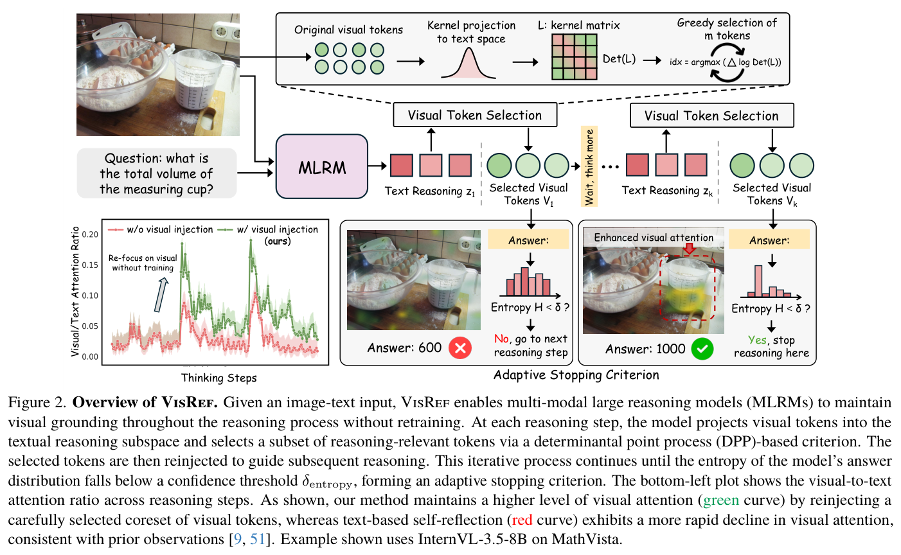
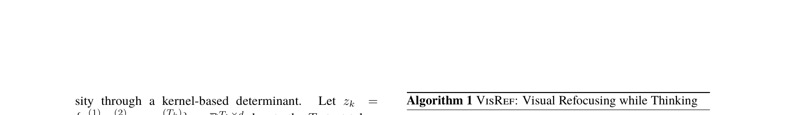
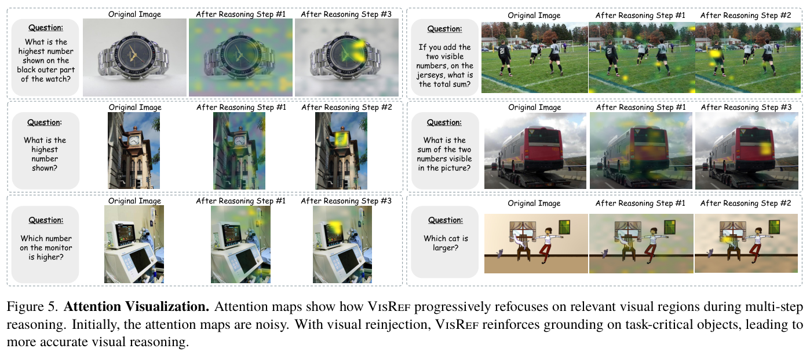
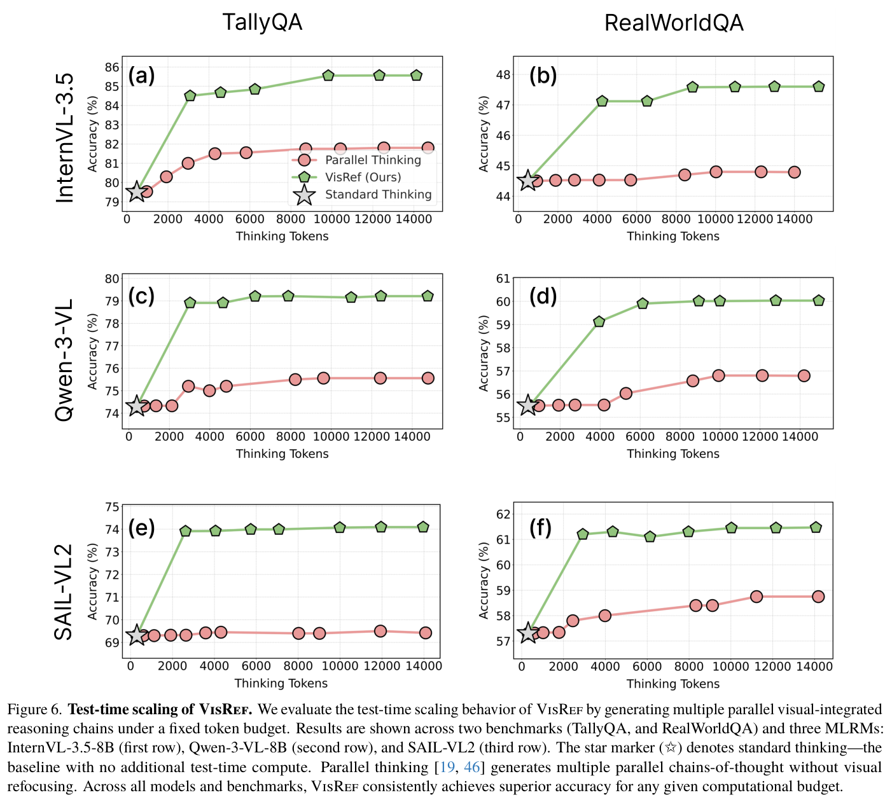
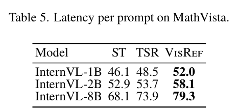
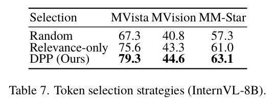

# VisRef: Visual Refocusing while Thinking Improves Test-Time Scaling in Multi-Modal Large Reasoning Models

> **中文题名：** VisRef：边思考边视觉再聚焦，提升多模态大推理模型的测试时扩展  
> **作者：** Soumya Suvra Ghosal, Youngeun Kim, Zhuowei Li, Ritwick Chaudhry, Linghan Xu, Hongjing Zhang, Jakub Zablocki, Yifan Xing, Qin Zhang  
> **出处：** arXiv:2603.00207v1，2026-02-27  
> **论文类型：** 方法 / training-free visual refocusing / test-time scaling  
> **源文件：** `Ghosal 等 - 2026 - VisRef Visual Refocusing while Thinking Improves Test-Time Scaling in Multi-Modal Large Reasoning M.pdf`  
> **版本与完整性：** 完整英中逐段对照，覆盖 PDF 全部 16 页、正文、参考文献与附录 A–K；图表按首次实质讨论位置放置。

## Page / Section Index

- Abstract: page 1
- 1. Introduction: pages 1–2
- 2. Related Works: pages 2–3
- 3. Preliminaries: page 3
- 4. Proposed Framework: pages 3–6
- 5. Experiments: pages 6–7
- 6. Discussion: pages 7–8
- 7. Conclusion: page 8
- References: pages 9–11
- Appendix A–F: page 12
- Appendix E–G and Figure 6: page 13
- Appendix G–J and Tables 4–7: page 14
- Appendix J–K and Table 8: page 15
- Figure 7 and final caption: page 16

## Terminology Ledger

| Canonical term | 中文 | Usage decision |
|---|---|---|
| Multi-modal Large Reasoning Models (MLRMs) | 多模态大推理模型 | 保留 MLRM 缩写 |
| test-time scaling | 测试时扩展 | 指推理阶段增加计算或轨迹 |
| visual refocusing | 视觉再聚焦 | 指推理中重新注入视觉证据 |
| visual grounding | 视觉落地 / 视觉奠基 | 指推理与实际图像内容保持对应 |
| visual token dilution | 视觉 token 稀释 | 长文本推理中视觉信息影响衰减 |
| textual self-reflection (TSR) | 文本自反思 | 保留 TSR 缩写 |
| Standard Thinking (ST) | 标准思考 | 保留 ST 缩写 |
| visual token coreset | 视觉 token 核心集 | 每步选择的紧凑视觉子集 |
| Determinantal Point Process (DPP) | 行列式点过程 | 平衡相关性与多样性 |
| adaptive stopping criterion | 自适应停止准则 | 基于答案分布熵终止推理 |
| relevance | 相关性 | 与当前文本推理状态对齐 |
| diversity | 多样性 | 减少冗余并扩大视觉覆盖 |

**Soumya Suvra Ghosal<sup>1∗</sup> · Youngeun Kim<sup>2∗</sup> · Zhuowei Li<sup>2</sup> · Ritwick Chaudhry<sup>2</sup> · Linghan Xu<sup>2</sup> · Hongjing Zhang<sup>2</sup> · Jakub Zablocki<sup>2</sup> · Yifan Xing<sup>2</sup> · Qin Zhang<sup>3†</sup>**

<sup>1</sup> University of Maryland, College Park  
<sup>2</sup> Amazon  
<sup>3</sup> Physion Labs

`sghosal@umd.edu` · `{youngeuk,zhuoweli,ritwic,linghanx,zhhongji,jzablock,yifax}@amazon.com` · `qin@physionlabs.ai`

> <span style="color:#3B82F6"><strong>Para. 1:</strong></span> ∗ Equal contribution. This work was done during Soumya Suvra Ghosal’s internship at AWS AI Labs.

> <span style="color:#F59E0B"><strong>Para. 1[CN]:</strong></span> ∗ 同等贡献。本工作完成于 Soumya Suvra Ghosal 在 AWS AI Labs 实习期间。

> <span style="color:#3B82F6"><strong>Para. 2:</strong></span> † Work done while at AWS AI Labs.

> <span style="color:#F59E0B"><strong>Para. 2[CN]:</strong></span> † 本工作完成于任职 AWS AI Labs 期间。

## Abstract

> <span style="color:#3B82F6"><strong>Para. 1:</strong></span> Advances in large reasoning models have shown strong performance on complex reasoning tasks by scaling test-time compute through extended reasoning. However, recent studies observe that in vision-dependent tasks, extended textual reasoning at inference time can degrade performance as models progressively lose attention to visual tokens and increasingly rely on textual priors alone. To address this, prior works use reinforcement learning (RL)-based fine-tuning to route visual tokens or employ refocusing mechanisms during reasoning. While effective, these methods are computationally expensive, requiring large-scale data generation and policy optimization. To leverage the benefits of test-time compute without additional RL fine-tuning, we propose VisRef, a visually grounded test-time scaling framework. Our key idea is to actively guide the reasoning process by re-injecting a coreset of visual tokens that are semantically relevant to the reasoning context while remaining diverse and globally representative of the image, enabling more grounded multi-modal reasoning. Experiments on three visual reasoning benchmarks with state-of-the-art multi-modal large reasoning models demonstrate that, under fixed test-time compute budgets, VisRef consistently outperforms existing test-time scaling approaches by up to 6.4%.

> <span style="color:#F59E0B"><strong>Para. 1[CN]:</strong></span> 大型推理模型的进展表明，通过延长推理来扩展测试时计算，可以在复杂推理任务上取得强劲性能。然而，近期研究发现，在依赖视觉的任务中，推理阶段延长文本推理反而可能降低性能，因为模型会逐渐减少对视觉 token 的关注，并日益仅依赖文本先验。为解决这一问题，先前工作采用基于强化学习（RL）的微调来路由视觉 token，或在推理过程中使用重新聚焦机制。尽管有效，这些方法的计算成本很高，需要大规模数据生成和策略优化。为在不进行额外 RL 微调的情况下利用测试时计算的优势，我们提出 VisRef，一个具有视觉 grounding 的测试时扩展框架。我们的核心思想是主动引导推理过程：重新注入一组视觉 token 核心集，这些 token 在语义上与推理上下文相关，同时保持多样性，并能从全局上代表图像，从而实现更有 grounding 的多模态推理。在三个视觉推理基准上使用最先进的多模态大型推理模型进行的实验表明，在固定测试时计算预算下，VisRef 始终优于现有测试时扩展方法，最高提升达 6.4%。


**Caption:** Figure 1. Illustration comparing our approach with prior test-time scaling methods. (a) Textual self-reflection-based test-time scaling [2, 34] extends reasoning by encouraging the model to think longer, but progressively loses grounding in the visual input as the reasoning chain grows. (b) Training-free Visual Refocusing (ours) dynamically selects and re-injects reasoning-relevant visual cues during inference, effectively restoring visual grounding without retraining and yielding substantial accuracy gains on the MathVista and MM-Star benchmarks with InternVL3.5-8B.

**Caption[CN]:** 图 1. 我们的方法与先前测试时扩展方法的比较示意图。(a) 基于文本自我反思的测试时扩展方法 [2, 34] 通过鼓励模型思考更长时间来延长推理，但随着推理链增长，它会逐渐失去对视觉输入的 grounding。(b) 无需训练的 Visual Refocusing（我们的方法）在推理期间动态选择并重新注入与推理相关的视觉线索，在无需重新训练的情况下有效恢复视觉 grounding，并在使用 InternVL3.5-8B 的 MathVista 和 MM-Star 基准上带来显著的准确率提升。

## 1. Introduction

> <span style="color:#3B82F6"><strong>Para. 1:</strong></span> Multi-modal Large Reasoning Models (MLRMs) [4, 9, 53] have demonstrated remarkable capabilities by extending Chain-of-Thought reasoning [47] to vision-language reasoning tasks [32, 57]. By generating explicit thinking traces before producing final answers, these models achieve strong performance on benchmarks requiring mathematical reasoning [32], scientific problem-solving [57], and general multi-modal understanding [8]. However, a critical limitation emerges: for several vision-critical tasks, as these models generate longer reasoning traces, their attention to visual information progressively diminishes [9, 51]. Visual tokens become increasingly diluted in the expanding context window, causing the model to rely more on textual priors rather than grounding its reasoning in actual image content [29, 65].

> <span style="color:#F59E0B"><strong>Para. 1[CN]:</strong></span> 多模态大型推理模型（MLRMs）[4, 9, 53] 将思维链推理 [47] 扩展到视觉—语言推理任务 [32, 57]，展现出了卓越能力。通过在给出最终答案前生成显式思考轨迹，这些模型在需要数学推理 [32]、科学问题求解 [57] 和通用多模态理解 [8] 的基准上取得了强劲性能。然而，一个关键局限随之出现：对于若干视觉关键型任务，随着这些模型生成更长的推理轨迹，它们对视觉信息的注意会逐渐减弱 [9, 51]。视觉 token 在不断扩大的上下文窗口中日益被稀释，导致模型更多依赖文本先验，而不是将推理建立在实际图像内容之上 [29, 65]。

> <span style="color:#3B82F6"><strong>Para. 2:</strong></span> This dilution of attention to visual tokens in MLRMs stands in stark contrast to human problem-solving. When humans reason about a multi-modal task, whether solving a geometry problem, interpreting a chart, or analyzing a diagram, they naturally alternate between examining the image and working through their reasoning, returning to verify visual details whenever uncertainty arises [5, 12]. This interplay between perception and reasoning, where visual information grounds abstract thinking and reasoning guides visual attention, is fundamental to robust visual reasoning. Current MLRMs, however, lack this feedback loop: once visual tokens are processed initially, they progressively fade from the model’s attention as textual reasoning dominates.

> <span style="color:#F59E0B"><strong>Para. 2[CN]:</strong></span> MLRM 对视觉 token 的这种注意稀释，与人类的问题求解方式形成鲜明对比。当人类对多模态任务进行推理时，无论是在求解几何题、解读图表，还是分析示意图，他们都会自然地在检查图像与推进推理之间交替，并在出现不确定性时返回核验视觉细节 [5, 12]。感知与推理之间的这种相互作用——视觉信息为抽象思考提供 grounding，而推理又引导视觉注意——是稳健视觉推理的基础。然而，当前 MLRM 缺少这一反馈回路：视觉 token 在最初被处理后，随着文本推理占据主导，会逐渐淡出模型的注意。

> <span style="color:#3B82F6"><strong>Para. 3:</strong></span> Recent studies have tried to address visual dilution through two main directions. The first employs reinforcement learning (RL) fine-tuning to teach models explicit “look-back” behaviors [9, 51]. While effective, these methods are computationally expensive, and require curating large-scale annotated datasets, limiting their scalability. The second direction, test-time scaling, allocates additional inference compute to refine reasoning [2, 34, 38]. These methods generate longer reasoning chains or employ self-verification during thinking. However, existing test-time scaling approaches remain predominantly text-centric: they extend textual reasoning but fail to actively maintain visual grounding throughout the process. As the reasoning chain grows longer, visual information continues to fade, limiting their effectiveness on vision-dependent reasoning tasks [9].

> <span style="color:#F59E0B"><strong>Para. 3[CN]:</strong></span> 近期研究主要从两个方向尝试解决视觉信息稀释问题。第一个方向采用强化学习（RL）微调，教会模型显式的“回看（look-back）”行为 [9, 51]。尽管有效，这些方法计算成本高昂，并且需要整理大规模标注数据集，限制了其可扩展性。第二个方向是测试时扩展，即分配额外的推理计算来改进推理 [2, 34, 38]。这些方法生成更长的推理链，或在思考过程中采用自验证。然而，现有测试时扩展方法仍以文本为中心：它们延长了文本推理，却未能在整个过程中主动维持视觉 grounding。随着推理链变长，视觉信息持续淡化，从而限制了这些方法在依赖视觉的推理任务上的有效性 [9]。

> <span style="color:#3B82F6"><strong>Para. 4:</strong></span> This gap between costly training-based solutions and ineffective text-centric test-time scaling motivates our central question: Can we restore visual grounding entirely at test time, without any retraining? To this end, we introduce VisRef, a training-free framework that adaptively reinjects carefully selected visual tokens at each reasoning step, allowing the model to refocus on relevant visual content as its reasoning evolves (Fig. 1). This approach mimics the human strategy of alternating between visual examination and abstract reasoning, but does so purely at test time, requiring no specialized training data and RL fine-tuning. The core challenge is determining which visual tokens to reinject at each step, as naively reinjecting all tokens is computationally prohibitive and can introduce redundant information. We formulate this as an optimization problem: selecting a coreset that is both relevant to the current reasoning state and diverse in its visual coverage. We employ Determinantal Point Processes (DPPs) [28], which provide a principled and tractable mechanism to balance these two objectives. Furthermore, we introduce an entropy-based stopping criterion to prevent unbounded computation, terminating reasoning once the model achieves sufficient confidence.

> <span style="color:#F59E0B"><strong>Para. 4[CN]:</strong></span> 昂贵的训练式解决方案与低效的文本中心测试时扩展之间存在鸿沟，这促使我们提出核心问题：能否完全在测试时恢复视觉 grounding，而无需任何重新训练？为此，我们提出 VisRef，一个无需训练的框架，它在每个推理步骤自适应地重新注入经过精心选择的视觉 token，使模型能够随着推理演进重新聚焦于相关视觉内容（图 1）。该方法模拟人类在视觉检查与抽象推理之间交替的策略，但完全在测试时实现，不需要专门的训练数据或 RL 微调。核心挑战在于确定每一步应重新注入哪些视觉 token，因为朴素地重新注入全部 token 在计算上不可承受，并且可能引入冗余信息。我们将其表述为一个优化问题：选择一个既与当前推理状态相关、又在视觉覆盖上具有多样性的核心集。我们采用行列式点过程（Determinantal Point Processes，DPPs）[28]，它为平衡这两个目标提供了一种有原则且可处理的机制。此外，我们引入基于熵的停止准则以防止计算无限增长：一旦模型达到足够置信度，便终止推理。

> <span style="color:#3B82F6"><strong>Para. 5:</strong></span> We validate VisRef on three challenging visual-reasoning benchmarks (Section 5): MathVista [32], MM-Star [8], and MathVision [43]. Experiments across state-of-the-art MLRMs, including InternVL-3.5 [44], Qwen-3-VL [4], and SAIL-VL2 [56] demonstrate consistent and significant improvements. For instance, on MathVision with SAIL-VL2, VisRef achieves 7.5% absolute accuracy improvement over standard thinking and 5.4% over textual self-reflection [34]. Furthermore, we demonstrate that VisRef scales favorably with increased test-time compute: when generating multiple parallel reasoning chains under a fixed token budget [19, 46], VisRef consistently achieves superior performance for any given computational budget across all benchmarks. These results establish training-free visual refocusing as a practical and generalizable approach to maintaining visual grounding.

> <span style="color:#F59E0B"><strong>Para. 5[CN]:</strong></span> 我们在三个具有挑战性的视觉推理基准（第 5 节）上验证 VisRef：MathVista [32]、MM-Star [8] 和 MathVision [43]。在包括 InternVL-3.5 [44]、Qwen-3-VL [4] 和 SAIL-VL2 [56] 在内的最先进 MLRM 上开展实验，均取得了一致且显著的提升。例如，在使用 SAIL-VL2 的 MathVision 上，VisRef 相比标准思考取得 7.5% 的绝对准确率提升，相比文本自我反思 [34] 提升 5.4%。此外，我们证明 VisRef 能够随测试时计算的增加而良好扩展：在固定 token 预算下生成多条并行推理链时 [19, 46]，对于任意给定的计算预算，VisRef 在所有基准上都始终取得更优性能。这些结果表明，无需训练的视觉重新聚焦是一种维持视觉 grounding 的实用且可泛化的方法。

> <span style="color:#3B82F6"><strong>Para. 6:</strong></span> We summarize our contributions as follows:

> <span style="color:#F59E0B"><strong>Para. 6[CN]:</strong></span> 我们的贡献总结如下：

> <span style="color:#3B82F6"><strong>Para. 7:</strong></span> • We propose VisRef, a training-free framework for adaptive visual refocusing that dynamically reinjects visual information during test-time reasoning without modifying model parameters.

> <span style="color:#F59E0B"><strong>Para. 7[CN]:</strong></span> • 我们提出 VisRef，这是一个无需训练的自适应视觉重新聚焦框架，可在测试时推理期间动态重新注入视觉信息，而无需修改模型参数。

> <span style="color:#3B82F6"><strong>Para. 8:</strong></span> • We leverage a DPP-based formulation for selecting visual tokens, ensuring the selected subset is both relevant to the current reasoning state and provides diverse visual coverage in the feature space.

> <span style="color:#F59E0B"><strong>Para. 8[CN]:</strong></span> • 我们利用基于 DPP 的表述来选择视觉 token，确保所选子集既与当前推理状态相关，又能在特征空间中提供多样化的视觉覆盖。

> <span style="color:#3B82F6"><strong>Para. 9:</strong></span> • We provide comprehensive empirical validation on challenging benchmarks (MathVista, MM-Star, MathVision) and state-of-the-art models (InternVL-3.5, Qwen3-VL, SAIL-VL2), demonstrating that VisRef significantly outperforms existing text-centric test-time scaling approaches.

> <span style="color:#F59E0B"><strong>Para. 9[CN]:</strong></span> • 我们在具有挑战性的基准（MathVista、MM-Star、MathVision）和最先进模型（InternVL-3.5、Qwen3-VL、SAIL-VL2）上进行了全面的实证验证，证明 VisRef 显著优于现有以文本为中心的测试时扩展方法。

## 2. Related Works

> <span style="color:#3B82F6"><strong>Para. 1:</strong></span> **Multi-modal Large Reasoning Models (MLRMs).** The success of Chain-of-Thought (CoT) reasoning in LLMs [47] spurred its adaptation to the multi-modal domain through Multimodal Chain-of-Thought (MCoT) [16, 37, 63]. Initial MCoT methods relied on prompt engineering to elicit step-by-step reasoning traces. However, these short, reactive chains often proved insufficient for complex, real-world tasks requiring long-horizon planning [57, 62, 64]. To address this gap, recent research has shifted toward using reinforcement learning [21] to instill more deliberate and methodologically structured reasoning processes. This paradigm shift, notably influenced by work like DeepSeek-R1 [21], has inspired a new generation of MLRMs designed for deeper reasoning [4, 6, 13, 20, 24, 36, 41, 42, 44, 50, 53, 54].

> <span style="color:#F59E0B"><strong>Para. 1[CN]:</strong></span> **多模态大型推理模型（MLRMs）。** LLM 中思维链（CoT）推理的成功 [47] 推动了其通过多模态思维链（MCoT）[16, 37, 63] 向多模态领域的适配。早期 MCoT 方法依赖提示工程来引出逐步推理轨迹。然而，对于需要长程规划的复杂现实任务，这些短而被动的推理链往往被证明是不充分的 [57, 62, 64]。为弥合这一差距，近期研究转向使用强化学习 [21]，以赋予模型更审慎、方法结构更清晰的推理过程。这一范式转变尤其受到 DeepSeek-R1 [21] 等工作的影响，并催生了为更深层推理而设计的新一代 MLRM [4, 6, 13, 20, 24, 36, 41, 42, 44, 50, 53, 54]。

> <span style="color:#3B82F6"><strong>Para. 2:</strong></span> **Test-time Scaling in Reasoning Models.** Recent work by Muennighoff et al. [34] introduced the concept of budget forcing to replicate the test-time scaling behavior observed in o1 models [35]. Another recent approach, L1 [2], proposed length-controlled policy optimization, providing precise control over the length of the reasoning trace during generation. Yang et al. [52] introduced a thinking-optimal scaling strategy, training models to adapt dynamically to different levels of reasoning effort depending on the test-time compute budget. Recently, a lot of studies have also focused on fine-tuning models to think efficiently according to task complexity [3, 14, 23, 26, 31, 59, 61]. However, a growing body of evidence indicates that simply extending the thinking process at test time can lead to oscillatory performance [19, 22, 48]. In the multimodal setting, Chu et al. [9] observed a similar trend: as reasoning length increases, attention to visual tokens degrades, harming visual grounding.

> <span style="color:#F59E0B"><strong>Para. 2[CN]:</strong></span> **推理模型中的测试时扩展。** Muennighoff 等人 [34] 的近期工作提出了预算强制（budget forcing）概念，用于复现 o1 模型 [35] 中观察到的测试时扩展行为。另一种近期方法 L1 [2] 提出了长度可控的策略优化，从而可以精确控制生成期间推理轨迹的长度。Yang 等人 [52] 提出思考最优扩展策略，训练模型根据测试时计算预算动态适应不同程度的推理投入。近期，许多研究也聚焦于根据任务复杂度微调模型，使其能够高效思考 [3, 14, 23, 26, 31, 59, 61]。然而，越来越多的证据表明，仅仅在测试时延长思考过程可能导致性能振荡 [19, 22, 48]。在多模态场景中，Chu 等人 [9] 观察到了类似趋势：随着推理长度增加，对视觉 token 的注意会退化，损害视觉 grounding。

> <span style="color:#3B82F6"><strong>Para. 3:</strong></span> **Visual refocusing in MLRMs.** Recent works [9, 51, 58] has emphasized the need to refocus on visual tokens during multi-modal reasoning, as extended inference often leads to degradation of visual grounding. Chu et al. [9] address this by fine-tuning models with explicit “look-back” or “reflect” mechanisms that copy or route visual tokens during inference. Similarly, Yang et al. [51] proposed an implicit refocusing scheme using specialized supervision to encourage models to revisit image context mid-reasoning. Another emerging line of research explores enhancing multi-modal models through the integration of external visual tools. Several approaches incorporate zoom, cropping, or agent-based utilities [25, 39, 58, 60], or leverage advanced vision modules through supervised fine-tuning or reinforcement learning to enable tool-using behaviors [10, 18, 60]. While above-mentioned methods successfully enhance visual grounding, they typically require specialized dataset construction, model retraining, tool-calling, or architectural modifications. In contrast, our framework, VisRef, enables efficient and adaptive visual refocusing purely at test time with minimal overhead, making it plug-and-play for any pre-trained MLRM.

> <span style="color:#F59E0B"><strong>Para. 3[CN]:</strong></span> **MLRM 中的视觉重新聚焦。** 近期工作 [9, 51, 58] 强调了在多模态推理期间重新聚焦视觉 token 的必要性，因为延长推理往往会导致视觉 grounding 退化。Chu 等人 [9] 通过使用显式“回看（look-back）”或“反思（reflect）”机制微调模型来解决这一问题，这些机制会在推理期间复制或路由视觉 token。类似地，Yang 等人 [51] 提出了一种隐式重新聚焦方案，通过专门监督鼓励模型在推理中途重新审视图像上下文。另一条新兴研究路线探索通过集成外部视觉工具来增强多模态模型。一些方法引入缩放、裁剪或基于智能体的工具 [25, 39, 58, 60]，或通过监督微调或强化学习利用先进视觉模块来实现工具使用行为 [10, 18, 60]。尽管上述方法成功增强了视觉 grounding，但通常需要专门的数据集构建、模型重新训练、工具调用或架构修改。相比之下，我们的框架 VisRef 只在测试时以极小开销实现高效且自适应的视觉重新聚焦，从而可即插即用于任何预训练 MLRM。

## 3. Preliminaries

> <span style="color:#3B82F6"><strong>Para. 1:</strong></span> **Mathematical formulation of thinking process.** Formally, an MLRM-generated thinking process can be expressed as:

> <span style="color:#F59E0B"><strong>Para. 1[CN]:</strong></span> **思考过程的数学表述。** 形式上，由 MLRM 生成的思考过程可以表示为：

$$
x_{\mathrm{input}} \rightarrow z \rightarrow y,
\tag{1}
$$

> <span style="color:#3B82F6"><strong>Para. 2:</strong></span> where $x_{\mathrm{input}}=[I,T]$ denotes the input, with $I\in\mathcal{I}$ the visual input (e.g., image) and $T=(t_1,t_2,\ldots,t_P)$ the textual prompt consisting of $P$ tokens ($t_i\in\mathcal{M}$ for vocabulary $\mathcal{M}$). The model first produces a reasoning (or thinking) trace $z\sim\pi_\theta(\cdot\mid x_{\mathrm{input}})$ and then a final answer $y\sim\pi_\theta(\cdot\mid x_{\mathrm{input}},z)$. The RL objective for training reasoning models is:

> <span style="color:#F59E0B"><strong>Para. 2[CN]:</strong></span> 其中，$x_{\mathrm{input}}=[I,T]$ 表示输入，$I\in\mathcal{I}$ 是视觉输入（例如图像），$T=(t_1,t_2,\ldots,t_P)$ 是由 $P$ 个 token 组成的文本提示（对于词汇表 $\mathcal{M}$，有 $t_i\in\mathcal{M}$）。模型首先生成推理（或思考）轨迹 $z\sim\pi_\theta(\cdot\mid x_{\mathrm{input}})$，然后生成最终答案 $y\sim\pi_\theta(\cdot\mid x_{\mathrm{input}},z)$。训练推理模型的 RL 目标为：

$$
\max_{\theta}\;
\mathbb{E}_{\substack{x_{\mathrm{input}},\,z\sim\pi_\theta(\cdot\mid x_{\mathrm{input}}),\\
y\sim\pi_\theta(\cdot\mid x_{\mathrm{input}},z)}}
\left[R(x_{\mathrm{input}},y)\right],
\tag{2}
$$

> <span style="color:#3B82F6"><strong>Para. 3:</strong></span> where $\pi_\theta$ is the parameterized model and $R(x_{\mathrm{input}},y)$ represents the true reward function (e.g., an indicator to check if $y$ is correct or not), which is obtained once the policy generates the final response $y$.

> <span style="color:#F59E0B"><strong>Para. 3[CN]:</strong></span> 其中，$\pi_\theta$ 是参数化模型，$R(x_{\mathrm{input}},y)$ 表示真实奖励函数（例如，用于检查 $y$ 是否正确的指示函数），该奖励在策略生成最终响应 $y$ 后获得。

> <span style="color:#3B82F6"><strong>Para. 4:</strong></span> **Textual self-reflection in reasoning models.** Textual self-reflection [34] extends the thinking process as:

> <span style="color:#F59E0B"><strong>Para. 4[CN]:</strong></span> **推理模型中的文本自我反思。** 文本自我反思 [34] 将思考过程扩展为：

$$
x_{\mathrm{input}}\rightarrow z_1\rightarrow z_2\rightarrow\cdots\rightarrow z_k\rightarrow y,
$$

> <span style="color:#3B82F6"><strong>Para. 5:</strong></span> where, given the prompt $x_{\mathrm{input}}$, the model first generates an initial reasoning step $z_1\sim\pi_\theta(\cdot\mid x_{\mathrm{input}})$. Rather than producing the final answer immediately, the model is prompted to continue reasoning using special instruction tokens (e.g., “Wait”, “Think more”), denoted by $c$. Subsequent reasoning steps are sampled iteratively as $z_t\sim\pi_\theta(\cdot\mid x_{\mathrm{input}},z_{1:t-1},c)$ for $t=2,\ldots,k$, until the model generates final response as $y\sim\pi_\theta(\cdot\mid x_{\mathrm{input}},z_{1:k},c)$. For brevity, we omit explicit mention of $c$ in the conditioning and denote the thinking traces in the condition as $y\sim\pi_\theta(\cdot\mid x_{\mathrm{input}},z_{1:k})$.

> <span style="color:#F59E0B"><strong>Para. 5[CN]:</strong></span> 其中，给定提示 $x_{\mathrm{input}}$，模型首先生成初始推理步骤 $z_1\sim\pi_\theta(\cdot\mid x_{\mathrm{input}})$。模型不会立即给出最终答案，而是通过特殊指令 token（例如，“Wait”“Think more”）被提示继续推理，这些 token 记为 $c$。随后，对于 $t=2,\ldots,k$，以 $z_t\sim\pi_\theta(\cdot\mid x_{\mathrm{input}},z_{1:t-1},c)$ 的方式迭代采样推理步骤，直至模型生成最终响应 $y\sim\pi_\theta(\cdot\mid x_{\mathrm{input}},z_{1:k},c)$。为简洁起见，我们在条件中省略对 $c$ 的显式提及，并将条件中的思考轨迹记为 $y\sim\pi_\theta(\cdot\mid x_{\mathrm{input}},z_{1:k})$。

## 4. Proposed Framework

> <span style="color:#3B82F6"><strong>Para. 1:</strong></span> **Problem Setup.** Recent studies [9, 51] have observed that in vision-dependent reasoning tasks [32, 57], scaling test-time compute by extending textual reasoning often leads to a dilution of visual information, weakening the influence of visual tokens and inducing visual hallucinations [15, 30, 65]. To mitigate this issue, prior works [9, 51] employed RL fine-tuning [21] to enable models to autonomously decide when and how to refocus on visual input during reasoning. While empirically effective, RL-based approaches are computationally intensive and require costly data curation. This motivates a central question: Can we achieve adaptive visual refocusing entirely at test time, without additional fine-tuning?

> <span style="color:#F59E0B"><strong>Para. 1[CN]:</strong></span> **问题设置。** 近期研究 [9, 51] 发现，在依赖视觉的推理任务 [32, 57] 中，通过延长文本推理来扩展测试时计算，往往会导致视觉信息稀释，削弱视觉 token 的影响，并诱发视觉幻觉 [15, 30, 65]。为缓解这一问题，先前工作 [9, 51] 采用 RL 微调 [21]，使模型能够自主决定在推理期间何时以及如何重新聚焦视觉输入。尽管在实证上有效，基于 RL 的方法计算密集，并且需要成本高昂的数据整理。这引出了一个核心问题：我们能否完全在测试时实现自适应视觉重新聚焦，而不进行额外微调？

> <span style="color:#3B82F6"><strong>Para. 2:</strong></span> We address this challenge by introducing VisRef, a training-free framework that dynamically reintegrates visual information during thinking. Our key insight is to augment the textual reasoning trace by adaptively reinjecting relevant visual tokens at each step, ensuring the model maintains grounded visual context throughout its reasoning process.

> <span style="color:#F59E0B"><strong>Para. 2[CN]:</strong></span> 我们通过提出 VisRef 来应对这一挑战。VisRef 是一个无需训练的框架，可在思考期间动态重新整合视觉信息。我们的关键洞见是：在每一步自适应地重新注入相关视觉 token，以增强文本推理轨迹，从而确保模型在整个推理过程中维持具有 grounding 的视觉上下文。

> <span style="color:#3B82F6"><strong>Para. 3:</strong></span> Formally, given an image–text input $x_{\mathrm{input}}=[I,T]$, let $V=\{v_1,v_2,\cdots,v_N\}$ denote the set of $N$ visual token embeddings extracted from image $I$, where each $v_i\in\mathbb{R}^d$ is a $d$-dimensional vector. At reasoning step $k$, the visual-integrated reasoning trajectory can be expressed as:

> <span style="color:#F59E0B"><strong>Para. 3[CN]:</strong></span> 形式上，给定图像—文本输入 $x_{\mathrm{input}}=[I,T]$，令 $V=\{v_1,v_2,\cdots,v_N\}$ 表示从图像 $I$ 中提取的 $N$ 个视觉 token 嵌入的集合，其中每个 $v_i\in\mathbb{R}^d$ 都是一个 $d$ 维向量。在推理步骤 $k$，视觉整合的推理轨迹可以表示为：

$$
\tau_{1:k}
=
\left\{(z_1,V_1),(z_2,V_2),\ldots,(z_k,V_k)\right\},
\tag{3}
$$

> <span style="color:#3B82F6"><strong>Para. 4:</strong></span> where $z_i$ denotes the textual reasoning step at step $i$ and $V_i\subseteq V$ represents the subset of visual tokens reinjected at that step. The model continues the reasoning process until a stopping condition is met and generates the final answer as $y\sim\pi_\theta(\cdot\mid x_{\mathrm{input}},\tau_{1:k})$. The stopping criterion is important as indefinitely reinjecting tokens may degrade performance due to overthinking [19, 38], while premature stopping can yield incomplete reasoning and incorrect predictions.

> <span style="color:#F59E0B"><strong>Para. 4[CN]:</strong></span> 其中，$z_i$ 表示第 $i$ 步的文本推理步骤，$V_i\subseteq V$ 表示在该步重新注入的视觉 token 子集。模型持续推理，直至满足停止条件，并生成最终答案 $y\sim\pi_\theta(\cdot\mid x_{\mathrm{input}},\tau_{1:k})$。停止准则十分重要，因为无限期地重新注入 token 可能因过度思考而降低性能 [19, 38]，而过早停止则可能导致推理不完整和预测错误。

### 4.1. Our Approach: VisRef

> <span style="color:#3B82F6"><strong>Para. 5:</strong></span> Enabling autonomous visual refocusing during reasoning presents two key challenges: (1) visual token selection: identifying which subset of visual tokens to re-inject at each step, and (2) stopping criterion: determining when to terminate reasoning and generate the final answer. We address challenge 1 in 4.1.1 and challenge 2 in 4.1.2. The overall method is illustrated in Fig. 2.

> <span style="color:#F59E0B"><strong>Para. 5[CN]:</strong></span> 在推理期间实现自主视觉重新聚焦面临两个关键挑战：(1) 视觉 token 选择：确定每一步应重新注入哪个视觉 token 子集；以及 (2) 停止准则：确定何时终止推理并生成最终答案。我们在 4.1.1 中解决挑战 1，在 4.1.2 中解决挑战 2。整体方法如图 2 所示。



**Caption:** Figure 2. Overview of VisRef. Given an image-text input, VisRef enables multi-modal large reasoning models (MLRMs) to maintain visual grounding throughout the reasoning process without retraining. At each reasoning step, the model projects visual tokens into the textual reasoning subspace and selects a subset of reasoning-relevant tokens via a determinantal point process (DPP)-based criterion. The selected tokens are then reinjected to guide subsequent reasoning. This iterative process continues until the entropy of the model’s answer distribution falls below a confidence threshold $\delta_{\mathrm{entropy}}$, forming an adaptive stopping criterion. The bottom-left plot shows the visual-to-text attention ratio across reasoning steps. As shown, our method maintains a higher level of visual attention (green curve) by reinjecting a carefully selected coreset of visual tokens, whereas text-based self-reflection (red curve) exhibits a more rapid decline in visual attention, consistent with prior observations [9, 51]. Example shown uses InternVL-3.5-8B on MathVista.

**Caption[CN]:** 图 2. VisRef 概览。给定图像—文本输入，VisRef 使多模态大型推理模型（MLRM）无需重新训练即可在整个推理过程中维持视觉 grounding。在每个推理步骤，模型将视觉 token 投影到文本推理子空间，并通过基于行列式点过程（DPP）的准则选择一个与推理相关的 token 子集。随后，所选 token 被重新注入，以引导后续推理。该迭代过程持续进行，直至模型答案分布的熵低于置信度阈值 $\delta_{\mathrm{entropy}}$，从而形成自适应停止准则。左下角图展示了各推理步骤中的视觉—文本注意比率。如图所示，我们的方法通过重新注入精心选择的视觉 token 核心集，维持了更高水平的视觉注意（绿色曲线）；相比之下，基于文本的自我反思（红色曲线）表现出更快的视觉注意下降，这与先前观察 [9, 51] 一致。所示示例使用 InternVL-3.5-8B 在 MathVista 上得到。

#### 4.1.1. Identifying Optimal Visual Token Subsets

> <span style="color:#3B82F6"><strong>Para. 6:</strong></span> A naive solution to mitigate visual token dilution would be reinjecting all $N$ visual tokens at every reasoning step. However, this strategy is computationally prohibitive in practice, significantly increasing context length and inference latency. For example, using InternVL-3.5-8B [44] on MathVista [32], the number of visual tokens per image averages approximately $3\times$ the text tokens generated in each reasoning step (e.g., $\sim$1,772 visual tokens vs. $\sim$615 text tokens), and appending all visual tokens leads to a $2.3\times$ increase in inference latency compared to text-only reasoning. Hence, to address this computational bottleneck, we seek to select a coreset of visual tokens $V_k\subseteq V$ at each reasoning step $k$ that maximizes the expected reward of the final answer. Formally, the optimal coreset satisfies:

> <span style="color:#F59E0B"><strong>Para. 6[CN]:</strong></span> 缓解视觉 token 稀释的一种朴素方案，是在每个推理步骤重新注入全部 $N$ 个视觉 token。然而，该策略在实践中计算成本过高，会显著增加上下文长度和推理延迟。例如，在 MathVista [32] 上使用 InternVL-3.5-8B [44] 时，每张图像的视觉 token 数量平均约为每个推理步骤生成的文本 token 数量的 $3\times$（例如，约 1,772 个视觉 token，而文本 token 约为 615 个），与仅文本推理相比，追加全部视觉 token 会导致推理延迟增加 $2.3\times$。因此，为解决这一计算瓶颈，我们希望在每个推理步骤 $k$ 选择视觉 token 核心集 $V_k\subseteq V$，使最终答案的期望奖励最大化。形式上，最优核心集满足：

$$
V_k^*
=
\arg\max_{V_k\subseteq V}
\;
\mathbb{E}_{\substack{
y\sim\pi_\theta(\cdot\mid x_{\mathrm{input}},\tau_{1:K}),\\
z_{k+1:K}\sim\pi_\theta(\cdot\mid x_{\mathrm{input}},\tau_{1:k-1},z_k,V_k)
}}
\left[R(x_{\mathrm{input}},y)\right],
\tag{4}
$$

> <span style="color:#3B82F6"><strong>Para. 7:</strong></span> where $\tau_{1:k-1}=\{(z_1,V_1),\ldots,(z_{k-1},V_{k-1})\}$ denotes the visually integrated reasoning trajectory up to step $k-1$. The objective in Equation 4 aims to find the visual token subset $V_k$ that maximizes the expected reward of the final answer $y$, marginalized over all possible future reasoning paths. However, directly optimizing Equation 4 is intractable at test time, as it requires (i) access to the true reward function $R$, which is only available after generating the final answer, and (ii) enumerating over the exponentially large space of visual token subsets and future trajectories.

> <span style="color:#F59E0B"><strong>Para. 7[CN]:</strong></span> 其中，$\tau_{1:k-1}=\{(z_1,V_1),\ldots,(z_{k-1},V_{k-1})\}$ 表示截至第 $k-1$ 步的视觉整合推理轨迹。公式 4 的目标是找到使最终答案 $y$ 的期望奖励最大化的视觉 token 子集 $V_k$，其中对所有可能的未来推理路径进行边缘化。然而，在测试时直接优化公式 4 是不可处理的，因为这要求：(i) 能够访问真实奖励函数 $R$，而该函数只有在生成最终答案后才可获得；以及 (ii) 在规模呈指数增长的视觉 token 子集与未来轨迹空间中进行枚举。

> <span style="color:#3B82F6"><strong>Para. 8:</strong></span> **Tractable test-time optimization.** To circumvent the challenge of directly optimizing Equation 4, we reformulate the problem by introducing a simplifying assumption that leads to a tractable test-time objective. Specifically, we adopt a Markov assumption, positing that the utility of $V_k$ at step $k$ depends primarily on the current reasoning state $z_k$ rather than the entire reasoning history $\tau_{1:k-1}$. This is reasonable since $z_k$ is generated autoregressively conditioned on $\tau_{1:k-1}$, thus implicitly encoding the relevant historical context. With this assumption, we replace the intractable expected reward in Equation 4 with a tractable proxy test-time objective:

> <span style="color:#F59E0B"><strong>Para. 8[CN]:</strong></span> **可处理的测试时优化。** 为规避直接优化公式 4 的挑战，我们引入一个简化假设来重新表述问题，从而得到可处理的测试时目标。具体而言，我们采用马尔可夫假设，认为第 $k$ 步中 $V_k$ 的效用主要取决于当前推理状态 $z_k$，而非完整推理历史 $\tau_{1:k-1}$。这一假设是合理的，因为 $z_k$ 是在以 $\tau_{1:k-1}$ 为条件的情况下自回归生成的，因此隐式编码了相关历史上下文。基于该假设，我们用一个可处理的代理测试时目标替代公式 4 中不可处理的期望奖励：

$$
\widetilde{V}_k
=
\arg\max_{V_k\subseteq V}
J(V_k\mid x_{\mathrm{input}},z_k),
\tag{5}
$$

> <span style="color:#3B82F6"><strong>Para. 9:</strong></span> where $J(V_k\mid x_{\mathrm{input}},z_k)$ is a scoring function that helps select the best visual tokens in $V_k$.

> <span style="color:#F59E0B"><strong>Para. 9[CN]:</strong></span> 其中，$J(V_k\mid x_{\mathrm{input}},z_k)$ 是一个评分函数，用于帮助选择 $V_k$ 中最佳的视觉 token。

> <span style="color:#3B82F6"><strong>Para. 10:</strong></span> **Designing the scoring function $J$.** Intuitively, we seek a coreset $V_k$ whose tokens are not only relevant to the current reasoning step $z_k$ but also maximally diverse to ensure maximum coverage of the visual content and avoid redundancy. Geometrically, this corresponds to finding tokens whose feature representations, when projected into the subspace defined by $z_k$, span the largest volume – ensuring relevance through projection and diversity through volume maximization [11, 28, 40].

> <span style="color:#F59E0B"><strong>Para. 10[CN]:</strong></span> **评分函数 $J$ 的设计。** 直观而言，我们希望找到一个核心集 $V_k$，其中的 token 不仅与当前推理步骤 $z_k$ 相关，而且具有最大多样性，以确保最大程度覆盖视觉内容并避免冗余。从几何上看，这对应于寻找这样的 token：当其特征表示被投影到由 $z_k$ 定义的子空间时，能够张成最大体积——通过投影保证相关性，通过体积最大化保证多样性 [11, 28, 40]。

> <span style="color:#3B82F6"><strong>Para. 11:</strong></span> To formalize this intuition, we employ Determinantal Point Processes (DPPs) [28, 40], a probabilistic framework that naturally captures both relevance and diversity through a kernel-based determinant. Let $z_k=\{z_k^{(1)},z_k^{(2)},\ldots,z_k^{(T_k)}\}\in\mathbb{R}^{T_k\times d}$ denote the $T_k$ text token embeddings in reasoning state $z_k$. We capture the reasoning subspace geometry via:

> <span style="color:#F59E0B"><strong>Para. 11[CN]:</strong></span> 为将这一直觉形式化，我们采用行列式点过程（DPP）[28, 40]，这是一种通过基于核的行列式自然刻画相关性与多样性的概率框架。令 $z_k=\{z_k^{(1)},z_k^{(2)},\ldots,z_k^{(T_k)}\}\in\mathbb{R}^{T_k\times d}$ 表示推理状态 $z_k$ 中的 $T_k$ 个文本 token 嵌入。我们通过下式刻画推理子空间的几何结构：

$$
M_k
=
\sum_{i=1}^{T_k}
z_k^{(i)}\left(z_k^{(i)}\right)^\top.
\tag{6}
$$

> <span style="color:#3B82F6"><strong>Para. 12:</strong></span> We then define a positive semi-definite similarity kernel that measures how similar any pair of visual tokens $v_i,v_j$ appear when projected into this textual subspace $L_k(v_i,v_j)=\phi_k(v_i)^\top\phi_k(v_j)$ where $\phi_k(v)=M_k^{1/2}v$ embeds the visual token $v$ into a feature space aligned with the geometry of the reasoning subspace spanned by $z_k$. Using this kernel, we define our scoring function as the determinant of the kernel matrix restricted to subset $V_k$:

> <span style="color:#F59E0B"><strong>Para. 12[CN]:</strong></span> 随后，我们定义一个半正定相似度核，用于度量任意一对视觉 token $v_i,v_j$ 投影到该文本子空间后呈现出的相似程度：$L_k(v_i,v_j)=\phi_k(v_i)^\top\phi_k(v_j)$，其中 $\phi_k(v)=M_k^{1/2}v$ 将视觉 token $v$ 嵌入到一个与 $z_k$ 所张成推理子空间的几何结构对齐的特征空间中。利用该核，我们将评分函数定义为限制在子集 $V_k$ 上的核矩阵的行列式：

$$
J(V_k\mid x_{\mathrm{input}},z_k)
=
\det\!\left(L_{V_k}^{k}\right),
\tag{7}
$$

> <span style="color:#3B82F6"><strong>Para. 13:</strong></span> where $L_{V_k}^{k}\in\mathbb{R}^{|V_k|\times|V_k|}$ is the kernel matrix restricted to the subset $V_k$, with entries $[L_{V_k}^{k}]_{ij}=L_k(v_i,v_j)$ for $v_i,v_j\in V_k$. The determinant naturally balances relevance and diversity: it increases when tokens are individually relevant to $z_k$ (high diagonal values) while penalizing redundancy through the correlation structure (off-diagonal terms). By jointly considering Equations 5 and 7, our final optimization becomes:

> <span style="color:#F59E0B"><strong>Para. 13[CN]:</strong></span> 其中，$L_{V_k}^{k}\in\mathbb{R}^{|V_k|\times|V_k|}$ 是限制在子集 $V_k$ 上的核矩阵；对于 $v_i,v_j\in V_k$，其元素为 $[L_{V_k}^{k}]_{ij}=L_k(v_i,v_j)$。该行列式能够自然地平衡相关性与多样性：当各个 token 分别与 $z_k$ 相关时（对角线值较高），其值会增大；同时，它通过相关结构（非对角项）惩罚冗余。综合考虑公式 5 和 7，我们的最终优化变为：

$$
\widetilde{V}_k
=
\arg\max_{V_k\subseteq V}
\det\!\left(L_{V_k}^{k}\right).
\tag{8}
$$

> <span style="color:#3B82F6"><strong>Para. 14:</strong></span> **Why maximizing the determinant works?** Maximizing $\log\det(L_{V_k}^{k})$ in Equation (8) explicitly balances relevance and diversity. For each visual token $v_i$, we define its relevance to the current reasoning state $z_k$ as

> <span style="color:#F59E0B"><strong>Para. 14[CN]:</strong></span> **为什么最大化行列式有效？** 公式 (8) 中最大化 $\log\det(L_{V_k}^{k})$ 显式地平衡了相关性与多样性。对于每个视觉 token $v_i$，我们将其与当前推理状态 $z_k$ 的相关性定义为

$$
r_i^2
=
\phi_k(v_i)^\top\phi_k(v_i)
=
v_i^\top M_k v_i
=
\sum_{j=1}^{T_k}
\left(v_i^\top z_k^{(j)}\right)^2,
\tag{9}
$$

> <span style="color:#3B82F6"><strong>Para. 15:</strong></span> which measures the alignment between token $v_i$ and the text-conditioned representation $z_k$. We also define a normalized diversity kernel $[\bar{L}_k]_{ij}=[L_k]_{ij}/(r_ir_j)$, so that $\forall V_k$, the kernel matrix factorizes as $L_{V_k}^{k}=\operatorname{Diag}(r_{V_k})\bar{L}_{V_k}^{k}\operatorname{Diag}(r_{V_k})$, yielding (full derivation in Appendix):

> <span style="color:#F59E0B"><strong>Para. 15[CN]:</strong></span> 它度量 token $v_i$ 与文本条件表示 $z_k$ 之间的对齐程度。我们还定义归一化多样性核 $[\bar{L}_k]_{ij}=[L_k]_{ij}/(r_ir_j)$，使得对于 $\forall V_k$，核矩阵可分解为 $L_{V_k}^{k}=\operatorname{Diag}(r_{V_k})\bar{L}_{V_k}^{k}\operatorname{Diag}(r_{V_k})$，从而得到（完整推导见附录）：

$$
\log\det\!\left(L_{V_k}^{k}\right)
=
\underbrace{\sum_{v_i\in V_k}\log\!\left(r_i^2\right)}_{\text{relevance}}
+
\underbrace{\log\det\!\left(\bar{L}_{V_k}^{k}\right)}_{\text{diversity}}.
\tag{10}
$$

> <span style="color:#3B82F6"><strong>Para. 16:</strong></span> This decomposition reveals that our objective naturally balances: (1) the relevance term, measuring the overall alignment of selected visual tokens with the textual context, and (2) the diversity term, ensuring selected tokens are mutually dissimilar ensuring maximum visual coverage.

> <span style="color:#F59E0B"><strong>Para. 16[CN]:</strong></span> 这一分解表明，我们的目标自然平衡了：(1) 相关性项，用于衡量所选视觉 token 与文本上下文的整体对齐程度；以及 (2) 多样性项，用于确保所选 token 彼此不相似，从而保证最大视觉覆盖。



**Caption:** Algorithm 1 VisRef: Visual Refocusing while Thinking

**Caption[CN]:** 算法 1 VisRef：思考时的视觉重新聚焦

```text
Require: Image-text input x_input = [I, T], visual tokens
         V = {v_1, ..., v_N}, token budget m, entropy threshold
         δ_entropy, maximum steps K_max
Ensure: Final answer y

1:  Initialize k ← 1, τ ← ∅
2:  while k ≤ K_max do
3:      // Generate reasoning step
4:      Sample z_k ∼ π_θ(· | x_input, τ_{1:k−1})
5:      // Select relevant and diverse visual tokens (Section 4.1.1)
6:      Compute text subspace: M_k = Σ_{j=1}^{T_k} z_k^(j)(z_k^(j))^⊤
7:      Define kernel: L_k(v_i, v_j) = v_i^⊤ M_k v_j
8:      Ṽ_k ← Greedy selection of m tokens via Eq. (11)
9:      // Update trajectory
10:     τ_{1:k} ← τ_{1:k−1} ∪ {(z_k, Ṽ_k)}
11:     // Check stopping criterion (Section 4.1.2)
12:     H_k ← − E_{y∼π_θ}[log π_θ(y | x_input, τ_{1:k})]
13:     if H_k < δ_entropy then
14:         break
15:     k ← k + 1
16: // Generate final answer
17: Sample y ∼ π_θ(· | x_input, τ_{1:k})
18: return y
```

> <span style="color:#3B82F6"><strong>Para. 17:</strong></span> **Efficient inference-time solution.** The combinatorial optimization in Equation (8) is NP-hard [27]. Hence, following prior works [7, 55], we approximate the solution via a greedy selection algorithm. We introduce a token budget $m$ that controls the number of visual tokens selected at each reasoning step, enforcing $|V_k|=m$. Starting from $V_k^{(0)}=\emptyset$, at iteration $i$ we select the token with maximum marginal gain:

> <span style="color:#F59E0B"><strong>Para. 17[CN]:</strong></span> **高效的推理时解法。** 公式 (8) 中的组合优化是 NP-hard 的 [27]。因此，遵循先前工作 [7, 55]，我们通过贪心选择算法近似求解。我们引入 token 预算 $m$，用于控制每个推理步骤选择的视觉 token 数量，并强制满足 $|V_k|=m$。从 $V_k^{(0)}=\emptyset$ 开始，在第 $i$ 次迭代中，我们选择具有最大边际增益的 token：

$$
v_{k,i}
=
\arg\max_{v\in V\setminus V_k^{(i-1)}}
\left[
\log
\left(
\frac{
\det\!\left(L_{V_k^{(i-1)}\cup\{v\}}^{k}\right)
}{
\det\!\left(L_{V_k^{(i-1)}}^{k}\right)
}
\right)
\right].
\tag{11}
$$

> <span style="color:#3B82F6"><strong>Para. 18:</strong></span> and update $V_k^{(i)}\leftarrow V_k^{(i-1)}\cup\{v_{k,i}\}$. We terminate after $m$ iterations, setting $\widetilde{V}_k\leftarrow V_k^{(m)}$.

> <span style="color:#F59E0B"><strong>Para. 18[CN]:</strong></span> 并更新 $V_k^{(i)}\leftarrow V_k^{(i-1)}\cup\{v_{k,i}\}$。我们在 $m$ 次迭代后终止，并令 $\widetilde{V}_k\leftarrow V_k^{(m)}$。

#### 4.1.2. Adaptive Stopping Criterion

> <span style="color:#3B82F6"><strong>Para. 19:</strong></span> Beyond selecting the optimal visual tokens, the framework must also determine when to terminate reasoning and produce the final answer. For this, we propose an adaptive stopping criterion based on the model’s predictive confidence. At each reasoning step $k$, given the current visual-integrated trajectory $\tau_{1:k}=\{(z_1,V_1),\ldots,(z_k,V_k)\}$, we assess the model’s certainty by measuring the entropy of its response distribution, defined as $H_k=-\mathbb{E}_{y\sim\pi_\theta(\cdot\mid x_{\mathrm{input}},\tau_{1:k})}[\log\pi_\theta(y\mid x_{\mathrm{input}},\tau_{1:k})]$. A low entropy $H_k<\delta_{\mathrm{entropy}}$, where $\delta_{\mathrm{entropy}}$ is a threshold hyperparameter, signals that the model has converged to a confident answer distribution where further reasoning is unlikely to yield improvement. Conversely, high entropy indicates uncertainty and the potential benefit of additional reasoning steps with visual refocusing.

> <span style="color:#F59E0B"><strong>Para. 19[CN]:</strong></span> 除了选择最优视觉 token 外，该框架还必须确定何时终止推理并给出最终答案。为此，我们提出一种基于模型预测置信度的自适应停止准则。在每个推理步骤 $k$，给定当前视觉整合轨迹 $\tau_{1:k}=\{(z_1,V_1),\ldots,(z_k,V_k)\}$，我们通过测量响应分布的熵来评估模型的确定性，该熵定义为 $H_k=-\mathbb{E}_{y\sim\pi_\theta(\cdot\mid x_{\mathrm{input}},\tau_{1:k})}[\log\pi_\theta(y\mid x_{\mathrm{input}},\tau_{1:k})]$。低熵 $H_k<\delta_{\mathrm{entropy}}$（其中 $\delta_{\mathrm{entropy}}$ 是阈值超参数）表明模型已经收敛到一个置信度较高的答案分布，进一步推理不太可能带来改进。相反，高熵表明模型存在不确定性，并且通过视觉重新聚焦增加推理步骤可能有益。

> <span style="color:#3B82F6"><strong>Para. 20:</strong></span> To bound computation, we enforce a maximum number of reasoning steps, $K_{\max}$. This criterion naturally adapts to problem difficulty: simpler questions reach low entropy quickly, while complex problems utilize extended reasoning before achieving sufficient confidence. After termination of the reasoning trajectory, the final answer is generated as: $y\sim\pi_\theta(\cdot\mid x_{\mathrm{input}},\tau_k)$.

> <span style="color:#F59E0B"><strong>Para. 20[CN]:</strong></span> 为限制计算量，我们强制设置最大推理步骤数 $K_{\max}$。该准则能够自然适应问题难度：较简单的问题会很快达到低熵，而复杂问题则会在达到足够置信度之前使用更长的推理。推理轨迹终止后，最终答案生成如下：$y\sim\pi_\theta(\cdot\mid x_{\mathrm{input}},\tau_k)$。

> <span style="color:#3B82F6"><strong>Para. 21:</strong></span> The complete framework, combining our visual token selection (Section 4.1.1) with the adaptive stopping criterion (Section 4.1.2), is summarized in Algorithm 1.

> <span style="color:#F59E0B"><strong>Para. 21[CN]:</strong></span> 完整框架将我们的视觉 token 选择（第 4.1.1 节）与自适应停止准则（第 4.1.2 节）相结合，总结于算法 1。

## 5. Experiments

> <span style="color:#3B82F6"><strong>Para. 1:</strong></span> **Experimental Setup .** We evaluate VisRef on three visual reasoning benchmarks—MathVista [33] (testmini, 1,000 problems), MathVision [43] (304 competition-style problems), and MM-Star [8] (1,500 vision-dependent questions)—using three state-of-the-art MLRMs in their reasoning (thinking) mode: InternVL3.5-8B [45], SAIL-VL2-Thinking [56], and Qwen-3-VL-8B-Thinking [4]. We compare against (i) Standard Thinking (ST; Eq. 1) and (ii) Textual Self-Reflection (TSR) [34]; unless otherwise stated, we set the adaptive stopping entropy threshold $\delta_{\mathrm{entropy}}=0.25$, visual token budget $m=\lfloor0.3|V|\rfloor$, and maximum reasoning steps $K_{\max}=10$. We report test accuracy by checking whether each model’s final prediction $y$ matches the ground-truth answer $y^*$ for each image-text input. A detailed description is provided in the Appendix.

> <span style="color:#F59E0B"><strong>Para. 1[CN]:</strong></span> **实验设置。** 我们在三个视觉推理基准上评估 VisRef——MathVista [33]（testmini，1,000 个问题）、MathVision [43]（304 个竞赛风格问题）和 MM-Star [8]（1,500 个依赖视觉的问题）——并使用三种处于推理（思考）模式的最先进 MLRM：InternVL3.5-8B [45]、SAIL-VL2-Thinking [56] 和 Qwen-3-VL-8B-Thinking [4]。我们与以下方法进行比较：(i) 标准思考（ST；公式 1）和 (ii) 文本自我反思（TSR）[34]；除非另有说明，我们将自适应停止熵阈值设为 $\delta_{\mathrm{entropy}}=0.25$，将视觉 token 预算设为 $m=\lfloor0.3|V|\rfloor$，并将最大推理步骤数设为 $K_{\max}=10$。对于每个图像—文本输入，我们通过检查各模型的最终预测 $y$ 是否与真实答案 $y^*$ 匹配来报告测试准确率。详细说明见附录。


| Model | Method | MathVision | MathVista | MM-Star |
|---|---|---:|---:|---:|
| InternVL3.5-8B | ST (Baseline) | 39.2 | 68.1 | 57.2 |
| InternVL3.5-8B | TSR [34] | 40.1 | 73.9 | 58.3 |
| InternVL3.5-8B | **VisRef (Ours)** | **44.6 (+4.5)** | **79.3 (+5.4)** | **63.1 (+4.8)** |
| Qwen3-VL-8B | ST (Baseline) | 53.8 | 74.1 | 66.5 |
| Qwen3-VL-8B | TSR [34] | 54.3 | 74.2 | 65.9 |
| Qwen3-VL-8B | **VisRef (Ours)** | **56.6 (+2.3)** | **77.1 (+2.9)** | **69.1 (+3.2)** |
| SAIL-VL2-8B | ST (Baseline) | 29.8 | 73.1 | 47.7 |
| SAIL-VL2-8B | TSR [34] | 31.9 | 73.8 | 48.9 |
| SAIL-VL2-8B | **VisRef (Ours)** | **37.3 (+5.4)** | **78.2 (+4.4)** | **55.3 (+6.4)** |

**Caption:** Table 1. Evaluation on visual reasoning benchmarks. We evaluate VisRef across three visual reasoning benchmarks. To ensure a fair comparison, all methods adopt the adaptive stopping criterion described in Section 4.1.2. For brevity, we denote Standard Thinking as ST, and Textual Self-Reflection [34] as TSR. All results are reported in accuracy (%), and the numbers in parentheses indicate the performance gain over the ST baseline.

**Caption[CN]:** 表 1. 视觉推理基准上的评估。我们在三个视觉推理基准上评估 VisRef。为确保公平比较，所有方法均采用第 4.1.2 节所述的自适应停止准则。为简洁起见，我们将 Standard Thinking 记为 ST，将 Textual Self-Reflection [34] 记为 TSR。所有结果均以准确率（%）报告，括号中的数字表示相对于 ST 基线的性能增益。

> <span style="color:#3B82F6"><strong>Para. 2:</strong></span> **Evaluation Results.** Table 1 presents evaluation results across three visual reasoning benchmarks and three MLRMs comparing VisRef with standard thinking (ST), and textual self-reflection (TSR) [34]. To ensure fair comparison, we employ the same adaptive stopping criterion (Section 4.1.2) for textual self-reflection as well. First, we observe that textual self-reflection provides inconsistent improvements over standard thinking, with gains ranging from 0.1% to 2.1% on most benchmarks but notably degrading performance by 0.6% on MM-Star with Qwen-3-VL-8B. This inconsistency suggests that purely textual reasoning extension offers limited and unreliable benefits for vision-dependent tasks. In contrast, VisRef consistently outperforms both baselines across all settings. Using InternVL-3.5-8B, VisRef achieves substantial improvements of 5.4%, 11.2%, and 5.9% over standard thinking on MathVision, MathVista, and MM-Star, respectively. Compared to textual self-reflection, VisRef gains an additional 4.5% and 5.4% on MathVision and MathVista respectively. Similar improvements are observed with Qwen-3-VL-8B (2.8%, 3.0%, 2.6%) and SAIL-VL2-8B (7.5%, 5.1%, 7.6%), demonstrating the generalizability of our approach across different model architectures. These results highlight that selective visual token reinjection effectively maintains visual grounding throughout reasoning.

> <span style="color:#F59E0B"><strong>Para. 2[CN]:</strong></span> **评估结果。** 表 1 给出了三个视觉推理基准和三种 MLRM 上的评估结果，对 VisRef、标准思考（ST）和文本自我反思（TSR）[34] 进行了比较。为确保公平比较，我们也为文本自我反思采用相同的自适应停止准则（第 4.1.2 节）。首先，我们观察到，文本自我反思相较标准思考带来的改进并不一致：在大多数基准上的增益范围为 0.1% 至 2.1%，但在使用 Qwen-3-VL-8B 的 MM-Star 上，性能却明显下降了 0.6%。这种不一致性表明，纯文本推理扩展对依赖视觉的任务所带来的收益有限且不可靠。相比之下，VisRef 在所有设置下都始终优于两个基线。使用 InternVL-3.5-8B 时，VisRef 在 MathVision、MathVista 和 MM-Star 上相较标准思考分别取得 5.4%、11.2% 和 5.9% 的显著提升。与文本自我反思相比，VisRef 在 MathVision 和 MathVista 上又分别提升 4.5% 和 5.4%。在 Qwen-3-VL-8B（2.8%、3.0%、2.6%）和 SAIL-VL2-8B（7.5%、5.1%、7.6%）上也观察到类似改进，证明了我们的方法对不同模型架构的可泛化性。这些结果强调，选择性重新注入视觉 token 能够在整个推理过程中有效维持视觉 grounding。

> <span style="color:#3B82F6"><strong>Para. 3:</strong></span> **Understanding test-time scaling behavior.** Recent studies [17, 19] show that given a fixed test-time thinking token budget $B$, an efficient utilization approach is to generate multiple parallel chains of thought. Following this, we evaluate how VisRef scales with increased test-time compute by generating $C$ parallel visual-integrated thinking traces for a given image-text pair $x_{\mathrm{input}}$: $\tau^{(i)}\sim\pi_\theta(\cdot\mid x_{\mathrm{input}})$, $i=1,2,\ldots,C$, subject to $\sum_{i=1}^{C}|\tau^{(i)}|\leq B$. Each trace $\tau^{(i)}$ is sampled independently using Algorithm 1. For each reasoning trace $\tau^{(i)}$, we generate a final answer $y^{(i)}\sim\pi_\theta(\cdot\mid\tau^{(i)},x_{\mathrm{input}})$, yielding a candidate set $Y=\{y^{(1)},y^{(2)},\ldots,y^{(C)}\}$. Following self-consistency aggregation [46], we select the final output via majority voting: $\widetilde{y}=\arg\max_{y\in Y}\sum_{i=1}^{C}\mathbb{I}[y^{(i)}=y]$, where $\mathbb{I}$ represents the indicator function.

> <span style="color:#F59E0B"><strong>Para. 3[CN]:</strong></span> **理解测试时扩展行为。** 近期研究 [17, 19] 表明，给定固定的测试时思考 token 预算 $B$，一种高效的利用方式是生成多条并行思维链。遵循这一思路，我们通过针对给定图像—文本对 $x_{\mathrm{input}}$ 生成 $C$ 条并行的视觉整合思考轨迹，评估 VisRef 如何随测试时计算增加而扩展：$\tau^{(i)}\sim\pi_\theta(\cdot\mid x_{\mathrm{input}})$，$i=1,2,\ldots,C$，并满足 $\sum_{i=1}^{C}|\tau^{(i)}|\leq B$。每条轨迹 $\tau^{(i)}$ 均使用算法 1 独立采样。对于每条推理轨迹 $\tau^{(i)}$，我们生成最终答案 $y^{(i)}\sim\pi_\theta(\cdot\mid\tau^{(i)},x_{\mathrm{input}})$，得到候选集 $Y=\{y^{(1)},y^{(2)},\ldots,y^{(C)}\}$。遵循自一致性聚合 [46]，我们通过多数投票选择最终输出：$\widetilde{y}=\arg\max_{y\in Y}\sum_{i=1}^{C}\mathbb{I}[y^{(i)}=y]$，其中 $\mathbb{I}$ 表示指示函数。

> <span style="color:#3B82F6"><strong>Para. 4:</strong></span> Figure 3 presents the test-time scaling behavior of VisRef across three visual reasoning benchmarks—MathVision [43], MathVista [32], and MM-Star [8]—and three MLRMs–InternVL-3.5-8B (first row), Qwen-3-VL-8B (second row), and SAIL-VL2 (third row). The star marker (✩) denotes the baseline with no additional test-time compute (standard thinking), while each successive circle to the right represents increasing test-time token budget. We compare VisRef against parallel thinking [19, 46], which samples multiple text-only reasoning trajectories without visual refocusing. Across all benchmarks and models, VisRef consistently achieves superior accuracy for any given computational budget. On MM-Star using InternVL-3.5-8B with a budget of 14K thinking tokens, VisRef achieves around 6% higher accuracy compared to parallel thinking, demonstrating the benefit of maintaining visual grounding throughout the reasoning process.

> <span style="color:#F59E0B"><strong>Para. 4[CN]:</strong></span> 图 3 展示了 VisRef 在三个视觉推理基准——MathVision [43]、MathVista [32] 和 MM-Star [8]——以及三种 MLRM 上的测试时扩展行为：InternVL-3.5-8B（第一行）、Qwen-3-VL-8B（第二行）和 SAIL-VL2（第三行）。星形标记（✩）表示不使用额外测试时计算的基线（标准思考），其右侧依次出现的每个圆形标记表示测试时 token 预算逐步增加。我们将 VisRef 与并行思考 [19, 46] 进行比较；后者在不进行视觉重新聚焦的情况下采样多条仅文本推理轨迹。在所有基准和模型上，对于任意给定计算预算，VisRef 都始终取得更高的准确率。在 MM-Star 上使用 InternVL-3.5-8B、思考 token 预算为 14K 时，VisRef 相比并行思考取得约 6% 的准确率提升，证明了在整个推理过程中维持视觉 grounding 的益处。


**Caption:** Figure 3. Test-time scaling of VisRef. We evaluate the test-time scaling behavior of VisRef by generating multiple parallel visual-integrated reasoning chains under a fixed token budget. Results are shown across three benchmarks (MathVision, MathVista, and MM-Star) and three MLRMs: InternVL-3.5-8B (first row), Qwen-3-VL-8B (second row), and SAIL-VL2 (third row). The star marker (✩) denotes standard thinking—the baseline with no additional test-time compute. Parallel thinking [19, 46] generates multiple parallel chains-of-thought without visual refocusing. Across all models and benchmarks, VisRef consistently achieves superior accuracy for any given computational budget.

**Caption[CN]:** 图 3. VisRef 的测试时扩展。我们通过在固定 token 预算下生成多条并行的视觉整合推理链，评估 VisRef 的测试时扩展行为。结果覆盖三个基准（MathVision、MathVista 和 MM-Star）与三种 MLRM：InternVL-3.5-8B（第一行）、Qwen-3-VL-8B（第二行）和 SAIL-VL2（第三行）。星形标记（✩）表示标准思考，即不使用额外测试时计算的基线。并行思考 [19, 46] 在不进行视觉重新聚焦的情况下生成多条并行思维链。在所有模型和基准上，对于任意给定计算预算，VisRef 都始终取得更高的准确率。

> <span style="color:#3B82F6"><strong>Para. 5:</strong></span> **Comparison with training-based methods.** Table 2 compares VisRef with Look-Back [51] using InternVL-3.5-8B. While Look-Back achieves strong performance through RL fine-tuning, VisRef attains competitive results entirely without training. Moreover, combining Look-Back [1] with VisRef yields the best performance across all benchmarks, demonstrating that our approach is orthogonal to training-based methods and can provide complementary gains. Crucially, VisRef is training-free and can be immediately applied to any pretrained MLRM, whereas Look-Back requires fine-tuning for 60 GPU hours with A6000.

> <span style="color:#F59E0B"><strong>Para. 5[CN]:</strong></span> **与基于训练的方法比较。** 表 2 使用 InternVL-3.5-8B 比较 VisRef 与 Look-Back [51]。Look-Back 通过 RL 微调取得强劲性能，而 VisRef 完全无需训练即可获得有竞争力的结果。此外，将 Look-Back [1] 与 VisRef 结合，可在所有基准上取得最佳性能，这表明我们的方法与基于训练的方法相互正交，并可提供互补增益。关键的是，VisRef 无需训练，可立即应用于任何预训练 MLRM；而 Look-Back 则需要在 A6000 上微调 60 GPU 小时。


**Caption:** Figure 4. Ablation study of hyper-parameters. (a) We visualize the ablation results of the entropy threshold $\delta_{\mathrm{entropy}}$ used as the stopping criterion. Although the accuracy does not vary significantly across different thresholds, our evaluation shows that $\delta_{\mathrm{entropy}}=0.25$ achieves the best balance between accuracy and inference efficiency. (b) We show the ablation of the token budget $m$ (fraction of visual tokens selected) on MathVista using InternVL-3.5-8B. Accuracy improves from 76.1% to 79.2% as $m$ increases from 20% to 30% but plateaus for $m\geq30\%$.

**Caption[CN]:** 图 4. 超参数消融研究。(a) 我们可视化了用作停止准则的熵阈值 $\delta_{\mathrm{entropy}}$ 的消融结果。尽管准确率在不同阈值下没有显著变化，但评估表明，$\delta_{\mathrm{entropy}}=0.25$ 在准确率与推理效率之间取得了最佳平衡。(b) 我们展示了在 MathVista 上使用 InternVL-3.5-8B 时，token 预算 $m$（所选视觉 token 的比例）的消融结果。随着 $m$ 从 20% 增加到 30%，准确率由 76.1% 提升至 79.2%；但当 $m\geq30\%$ 时，准确率进入平台期。


| Method | MathVista [32] | MathVison [43] | MM-Star [8] |
|---|---:|---:|---:|
| ST | 68.1 | 39.2 | 57.2 |
| Look-Back [51] | 80.8 | 44.2 | 63.7 |
| VisRef | 79.3 | 44.6 | 63.1 |
| Look-Back [51]+VisRef | **83.1** | **48.2** | **66.0** |

**Caption:** Table 2. Comparison with training-based method (i.e., Look-Back [51]) across benchmarks using InternVL-3.5-8B.

**Caption[CN]:** 表 2. 使用 InternVL-3.5-8B，在各基准上与基于训练的方法（即 Look-Back [51]）进行比较。

> <span style="color:#3B82F6"><strong>Para. 6:</strong></span> **Comparison with training-based methods.** Table 2 compares VisRef with Look-Back [1] using InternVL-3.5-8B. While Look-Back achieves strong performance through RL fine-tuning, VisRef attains competitive results entirely without training. Moreover, combining Look-Back [1] with VisRef yields the best performance across all benchmarks, demonstrating that our approach is orthogonal to training-based methods and can provide complementary gains. Crucially, VisRef is training-free and can be immediately applied to any pretrained MLRM, whereas Look-Back [1] requires fine-tuning for 60 GPU hours with A6000.

> <span style="color:#F59E0B"><strong>Para. 6[CN]:</strong></span> **与基于训练的方法比较。** 表 2 使用 InternVL-3.5-8B 比较 VisRef 与 Look-Back [1]。Look-Back 通过 RL 微调取得强劲性能，而 VisRef 完全无需训练即可获得有竞争力的结果。此外，将 Look-Back [1] 与 VisRef 结合，可在所有基准上取得最佳性能，这表明我们的方法与基于训练的方法相互正交，并可提供互补增益。关键的是，VisRef 无需训练，可立即应用于任何预训练 MLRM；而 Look-Back [1] 则需要在 A6000 上微调 60 GPU 小时。

## 6. Discussion

> <span style="color:#3B82F6"><strong>Para. 1:</strong></span> **Understanding the importance of relevance and diversity.** As formalized in Equation 10, our objective decomposes into two terms: a relevance term that measures the alignment of visual tokens with the current reasoning step $z_k$, and a diversity term that ensures a broad coverage of the visual content. We conduct an ablation study to assess the individual importance of each term. Table 3 presents results on InternVL-3.5-8B across three benchmarks. We observe that the full objective, which jointly optimizes both terms, outperforms variants that use only relevance or only diversity. Notably, using relevance alone results in substantial performance degradation, demonstrating the importance of diversity in selecting effective visual tokens.

> <span style="color:#F59E0B"><strong>Para. 1[CN]:</strong></span> **理解相关性与多样性的重要性。** 如公式 10 所形式化，我们的目标可分解为两项：相关性项，用于衡量视觉 token 与当前推理步骤 $z_k$ 的对齐程度；多样性项，用于确保对视觉内容进行广泛覆盖。我们开展消融研究，以评估每一项各自的重要性。表 3 给出了 InternVL-3.5-8B 在三个基准上的结果。我们观察到，同时联合优化两项的完整目标优于仅使用相关性或仅使用多样性的变体。值得注意的是，仅使用相关性会导致显著的性能下降，这证明了多样性对于选择有效视觉 token 的重要性。



**Caption:** Figure 5. Attention Visualization. Attention maps show how VisRef progressively refocuses on relevant visual regions during multi-step reasoning. Initially, the attention maps are noisy. With visual reinjection, VisRef reinforces grounding on task-critical objects, leading to more accurate visual reasoning.

**Caption[CN]:** 图 5. 注意可视化。注意图展示了 VisRef 如何在多步推理期间逐渐重新聚焦于相关视觉区域。最初，注意图较为嘈杂。通过视觉重新注入，VisRef 强化了对任务关键物体的 grounding，从而带来更准确的视觉推理。


| Relevance | Diversity | MathVista [32] | MathVison [43] | MM-Star [8] |
|:---:|:---:|---:|---:|---:|
| ✓ | ✗ | 75.6 | 43.3 | 61.0 |
| ✗ | ✓ | 77.4 | 42.9 | 62.8 |
| ✓ | ✓ | **79.3** | **44.6** | **63.1** |

**Caption:** Table 3. Importance of relevance and diversity. Ablation study to understand the individual importance of the relevance term and diversity term in our scoring function (Equation 10). We evaluate on InternVL-3.5-8B across all three benchmarks. Accuracy values are reported in percentage (%). Best results are highlighted in bold.

**Caption[CN]:** 表 3. 相关性与多样性的重要性。该消融研究旨在理解评分函数（公式 10）中相关性项与多样性项各自的重要性。我们在 InternVL-3.5-8B 上针对全部三个基准进行评估。准确率数值以百分比（%）报告。最佳结果以粗体突出显示。

> <span style="color:#3B82F6"><strong>Para. 2:</strong></span> **Analysis of entropy threshold.** We analyze the impact of the entropy threshold $\delta_{\mathrm{entropy}}$, which determines when to terminate reasoning. Figure 4(a) presents the relationship between accuracy and $\delta_{\mathrm{entropy}}$ on MathVista using InternVL3.5-8B. While the overall accuracy remains relatively stable across different thresholds, we observe that $\delta_{\mathrm{entropy}}=0.25$ consistently yields the highest accuracy across all token budgets. A smaller threshold (e.g., 0.15) requires the model to achieve higher confidence (lower entropy) before stopping, leading to excessive reasoning steps that may introduce overthinking without accuracy gains. Conversely, a larger threshold (e.g., 0.30) can lead to premature termination when the model has insufficient confidence, resulting in under-reasoning and incorrect answer. The same trend is observed for the other two models, Qwen3-VL-8B and SAIL-VL2, demonstrating that this configuration generalizes well across model scales.

> <span style="color:#F59E0B"><strong>Para. 2[CN]:</strong></span> **熵阈值分析。** 我们分析熵阈值 $\delta_{\mathrm{entropy}}$ 的影响，该阈值决定何时终止推理。图 4(a) 给出了在 MathVista 上使用 InternVL3.5-8B 时，准确率与 $\delta_{\mathrm{entropy}}$ 之间的关系。尽管总体准确率在不同阈值下保持相对稳定，我们观察到，$\delta_{\mathrm{entropy}}=0.25$ 在所有 token 预算下都始终产生最高准确率。较小的阈值（例如 0.15）要求模型在停止前达到更高置信度（更低熵），从而导致过多的推理步骤；这些步骤可能引入过度思考，却不会带来准确率提升。相反，较大的阈值（例如 0.30）可能在模型置信度不足时导致过早终止，从而造成推理不足和错误答案。在另外两个模型 Qwen3-VL-8B 和 SAIL-VL2 上也观察到相同趋势，证明这一配置能够良好泛化到不同模型规模。

> <span style="color:#3B82F6"><strong>Para. 3:</strong></span> **Analysis of token budget.** We next analyze the effect of the token budget $m$, which controls the number of visual tokens selected at each reasoning step. Figure 4(b) shows accuracy as a function of $m$. Accuracy increases from 76.1% to 79.2% as $m$ grows from 20% to 30%, but further increasing $m$ to 40% yields no additional gains. A similar trend is observed across other models, indicating that VisRef remains robust to different token-budget configurations. Based on these findings, we set $m=30\%$ and $\delta_{\mathrm{entropy}}=0.25$ for all main experiments, as this configuration achieves a well-balanced trade-off between accuracy and efficiency.

> <span style="color:#F59E0B"><strong>Para. 3[CN]:</strong></span> **token 预算分析。** 接下来，我们分析 token 预算 $m$ 的影响，它控制每个推理步骤所选视觉 token 的数量。图 4(b) 展示了准确率随 $m$ 的变化。当 $m$ 从 20% 增加到 30% 时，准确率由 76.1% 提升至 79.2%；但将 $m$ 进一步增加到 40% 并未带来额外增益。在其他模型上也观察到类似趋势，表明 VisRef 对不同 token 预算配置保持稳健。基于这些发现，我们在所有主要实验中将 $m=30\%$、$\delta_{\mathrm{entropy}}=0.25$，因为该配置在准确率与效率之间实现了良好平衡。

> <span style="color:#3B82F6"><strong>Para. 4:</strong></span> **Qualitative evaluation of VisRef.** To provide deeper insight into how VisRef maintains visual grounding during reasoning, we visualize attention patterns before and after visual refocusing in Figure 5. We present examples from MathVista using InternVL-3.5-8B, where we visualize attention maps across reasoning steps. In the initial reasoning phase without visual refocusing, the attention maps exhibit diffuse and noisy patterns, with the model attending broadly across irrelevant image regions while failing to focus on task-critical visual elements. After applying VisRef’s selective visual token reinjection, the attention patterns become substantially more focused and coherent, concentrating on the objects and regions directly relevant to solving the problem.

> <span style="color:#F59E0B"><strong>Para. 4[CN]:</strong></span> **VisRef 的定性评估。** 为更深入地理解 VisRef 如何在推理期间维持视觉 grounding，我们在图 5 中可视化视觉重新聚焦前后的注意模式。我们给出了使用 InternVL-3.5-8B 在 MathVista 上得到的示例，并可视化各推理步骤中的注意图。在不进行视觉重新聚焦的初始推理阶段，注意图呈现弥散且嘈杂的模式：模型广泛关注不相关的图像区域，却未能聚焦于任务关键的视觉元素。应用 VisRef 的选择性视觉 token 重新注入后，注意模式变得显著更加聚焦和连贯，集中于与解决问题直接相关的物体和区域。

## 7. Conclusion

> <span style="color:#3B82F6"><strong>Para. 1:</strong></span> We study how to preserve visual grounding during extended test-time reasoning in multimodal large reasoning models, which tend to overrely on textual priors as the reasoning trace length increases. We propose VisRef, a training-free framework that dynamically reinjects visual information throughout reasoning. Our method selects a compact subset of visual tokens using a DPP-based objective and adaptively terminates reasoning via an entropy-based criterion. Across three visual reasoning benchmarks, under any fixed test-time compute budget, VisRef delivers superior accuracy while remaining efficient by selectively reinjecting visual tokens.

> <span style="color:#F59E0B"><strong>Para. 1[CN]:</strong></span> 我们研究了如何在多模态大型推理模型的扩展测试时推理期间保持视觉 grounding；随着推理轨迹长度增加，这些模型往往会过度依赖文本先验。我们提出 VisRef，一个无需训练、可在整个推理过程中动态重新注入视觉信息的框架。我们的方法使用基于 DPP 的目标选择一个紧凑的视觉 token 子集，并通过基于熵的准则自适应地终止推理。在三个视觉推理基准上，对于任意固定的测试时计算预算，VisRef 都能取得更高的准确率，同时通过选择性重新注入视觉 token 保持高效。

## References / 参考文献

> <span style="color:#3B82F6"><strong>Para. 1:</strong></span> References are retained in their original searchable bibliographic form.

> <span style="color:#F59E0B"><strong>Para. 1[CN]:</strong></span> 参考文献保留为原始、可检索的书目信息格式。

[1] Manoj Acharya, Kushal Kafle, and Christopher Kanan. Tallyqa: Answering complex counting questions. In Proceedings of the AAAI conference on artificial intelligence, pages 8076–8084, 2019.

[2] Pranjal Aggarwal and Sean Welleck. L1: Controlling how long a reasoning model thinks with reinforcement learning. arXiv preprint arXiv:2503.04697, 2025.

[3] Daman Arora and Andrea Zanette. Training language models to reason efficiently. 2025.

[4] Shuai Bai, Keqin Chen, Xuejing Liu, Jialin Wang, Wenbin Ge, Sibo Song, Kai Dang, Peng Wang, Shijie Wang, Jun Tang, Humen Zhong, Yuanzhi Zhu, Mingkun Yang, Zhaohai Li, Jianqiang Wan, Pengfei Wang, Wei Ding, Zheren Fu, Yiheng Xu, Jiabo Ye, Xi Zhang, Tianbao Xie, Zesen Cheng, Hang Zhang, Zhibo Yang, Haiyang Xu, and Junyang Lin. Qwen2.5-vl technical report. arXiv preprint arXiv:2502.13923, 2025.

[5] Lawrence W Barsalou. Grounded cognition. Annu. Rev. Psychol., 59(1):617–645, 2008.

[6] Hardy Chen, Haoqin Tu, Fali Wang, Hui Liu, Xianfeng Tang, Xinya Du, Yuyin Zhou, and Cihang Xie. Sft or rl? an early investigation into training r1-like reasoning large vision-language models, 2025.

[7] Laming Chen, Guoxin Zhang, and Hanning Zhou. Fast greedy map inference for determinantal point process to improve recommendation diversity, 2018.

[8] Lin Chen, Jinsong Li, Xiaoyi Dong, Pan Zhang, Yuhang Zang, Zehui Chen, Haodong Duan, Jiaqi Wang, Yu Qiao, Dahua Lin, et al. Are we on the right way for evaluating large vision-language models? Advances in Neural Information Processing Systems, 37:27056–27087, 2024.

[9] Xu Chu, Xinrong Chen, Guanyu Wang, Zhijie Tan, Kui Huang, Wenyu Lv, Tong Mo, and Weiping Li. Qwen look again: Guiding vision-language reasoning models to re-attention visual information. arXiv preprint arXiv:2505.23558, 2025.

[10] Jiwan Chung, Junhyeok Kim, Siyeol Kim, Jaeyoung Lee, Min Soo Kim, and Youngjae Yu. Don’t look only once: Towards multimodal interactive reasoning with selective visual revisitation. arXiv preprint arXiv:2505.18842, 2025.

[11] Ali Civril and Malik Magdon-Ismail. On selecting a maximum volume sub-matrix of a matrix and related problems. Theoretical Computer Science, 410(47-49):4801–4811, 2009.

[12] Andy Clark. Whatever next? predictive brains, situated agents, and the future of cognitive science. Behavioral and brain sciences, 36(3):181–204, 2013.

[13] Yihe Deng, Hritik Bansal, Fan Yin, Nanyun Peng, Wei Wang, and Kai-Wei Chang. Openvlthinker: An early exploration to complex vision-language reasoning via iterative self-improvement. arXiv preprint arXiv:2503.17352, 2025.

[14] Gongfan Fang, Xinyin Ma, and Xinchao Wang. Thinkless: Llm learns when to think. arXiv preprint arXiv:2505.13379, 2025.

[15] Alessandro Favero, Luca Zancato, Matthew Trager, Siddharth Choudhary, Pramuditha Perera, Alessandro Achille, Ashwin Swaminathan, and Stefano Soatto. Multi-modal hallucination control by visual information grounding. In Proceedings of the IEEE/CVF Conference on Computer Vision and Pattern Recognition, pages 14303–14312, 2024.

[16] Hao Fei, Shengqiong Wu, Wei Ji, Hanwang Zhang, Meishan Zhang, Mong-Li Lee, and Wynne Hsu. Video-of-thought: Step-by-step video reasoning from perception to cognition. arXiv preprint arXiv:2501.03230, 2024.

[17] Yunzhen Feng, Julia Kempe, Cheng Zhang, Parag Jain, and Anthony Hartshorn. What characterizes effective reasoning? revisiting length, review, and structure of cot. arXiv preprint arXiv:2509.19284, 2025.

[18] Xinyu Geng, Peng Xia, Zhen Zhang, Xinyu Wang, Qiuchen Wang, Ruixue Ding, Chenxi Wang, Jialong Wu, Yida Zhao, Kuan Li, et al. Webwatcher: Breaking new frontier of vision-language deep research agent. arXiv preprint arXiv:2508.05748, 2025.

[19] Soumya Suvra Ghosal, Souradip Chakraborty, Avinash Reddy, Yifu Lu, Mengdi Wang, Dinesh Manocha, Furong Huang, Mohammad Ghavamzadeh, and Amrit Singh Bedi. Does thinking more always help? understanding test-time scaling in reasoning models. arXiv preprint arXiv:2506.04210, 2025.

[20] Google DeepMind. Gemini 2.5 Pro: The latest Gemini multimodal model. https://deepmind.google/technologies/gemini/, 2024.

[21] Daya Guo, Dejian Yang, Haowei Zhang, Junxiao Song, Ruoyu Zhang, Runxin Xu, Qihao Zhu, Shirong Ma, Peiyi Wang, Xiao Bi, et al. Deepseek-r1: Incentivizing reasoning capability in llms via reinforcement learning. arXiv preprint arXiv:2501.12948, 2025.

[22] Michael Hassid, Gabriel Synnaeve, Yossi Adi, and Roy Schwartz. Don’t overthink it. preferring shorter thinking chains for improved llm reasoning. arXiv preprint arXiv:2505.17813, 2025.

[23] Shijue Huang, Hongru Wang, Wanjun Zhong, Zhaochen Su, Jiazhan Feng, Bowen Cao, and Yi R Fung. Adactrl: Towards adaptive and controllable reasoning via difficulty-aware budgeting. arXiv preprint arXiv:2505.18822, 2025.

[24] Wenxuan Huang, Bohan Jia, Zijie Zhai, Shaosheng Cao, Zheyu Ye, Fei Zhao, Zhe Xu, Yao Hu, and Shaohui Lin. Vision-r1: Incentivizing reasoning capability in multimodal large language models. arXiv preprint arXiv:2503.06749, 2025.

[25] Zeyi Huang, Yuyang Ji, Anirudh Sundara Rajan, Zefan Cai, Wen Xiao, Haohan Wang, Junjie Hu, and Yong Jae Lee. Visualtoolagent (vista): A reinforcement learning framework for visual tool selection. arXiv preprint arXiv:2505.20289, 2025.

[26] Lingjie Jiang, Xun Wu, Shaohan Huang, Qingxiu Dong, Zewen Chi, Li Dong, Xingxing Zhang, Tengchao Lv, Lei Cui, and Furu Wei. Think only when you need with large hybrid-reasoning models. arXiv preprint arXiv:2505.14631, 2025.

[27] Chun-Wa Ko, Jon Lee, and Maurice Queyranne. An exact algorithm for maximum entropy sampling. Operations Research, 43(4):684–691, 1995.

[28] Alex Kulesza, Ben Taskar, et al. Determinantal point processes for machine learning. Foundations and Trends® in Machine Learning, 5(2–3):123–286, 2012.

[29] Yifan Li, Yifan Du, Kun Zhou, Jinpeng Wang, Wayne Xin Zhao, and Ji-Rong Wen. Evaluating object hallucination in large vision-language models. arXiv preprint arXiv:2305.10355, 2023.

[30] Zhuowei Li, Haizhou Shi, Yunhe Gao, Di Liu, Zhenting Wang, Yuxiao Chen, Ting Liu, Long Zhao, Hao Wang, and Dimitris N Metaxas. The hidden life of tokens: Reducing hallucination of large vision-language models via visual information steering. arXiv preprint arXiv:2502.03628, 2025.

[31] Guosheng Liang, Longguang Zhong, Ziyi Yang, and Xiaojun Quan. Thinkswitcher: When to think hard, when to think fast. arXiv preprint arXiv:2505.14183, 2025.

[32] Pan Lu, Hritik Bansal, Tony Xia, Jiacheng Liu, Chunyuan Li, Hannaneh Hajishirzi, Hao Cheng, Kai-Wei Chang, Michel Galley, and Jianfeng Gao. Mathvista: Evaluating mathematical reasoning of foundation models in visual contexts. In The Twelfth International Conference on Learning Representations.

[33] Pan Lu, Hritik Bansal, Tony Xia, Jiacheng Liu, Chunyuan Li, Hannaneh Hajishirzi, Hao Cheng, Kai-Wei Chang, Michel Galley, and Jianfeng Gao. Mathvista: Evaluating mathematical reasoning of foundation models in visual contexts. arXiv preprint arXiv:2310.02255, 2023.

[34] Niklas Muennighoff, Zitong Yang, Weijia Shi, Xiang Lisa Li, Li Fei-Fei, Hannaneh Hajishirzi, Luke Zettlemoyer, Percy Liang, Emmanuel Candès, and Tatsunori Hashimoto. s1: Simple test-time scaling. arXiv preprint arXiv:2501.19393, 2025.

[35] openai. Learning to reason with llms. 2024.

[36] Yingzhe Peng, Gongrui Zhang, Miaosen Zhang, Zhiyuan You, Jie Liu, Qipeng Zhu, Kai Yang, Xingzhong Xu, Xin Geng, and Xu Yang. Lmm-r1: Empowering 3b lmms with strong reasoning abilities through two-stage rule-based rl. arXiv preprint arXiv:2503.07536, 2025.

[37] Hao Shao, Shengju Qian, Han Xiao, Guanglu Song, Zhuofan Zong, Letian Wang, Yu Liu, and Hongsheng Li. Visual cot: Advancing multi-modal language models with a comprehensive dataset and benchmark for chain-of-thought reasoning. Advances in Neural Information Processing Systems, 37:8612–8642, 2024.

[38] Charlie Snell, Jaehoon Lee, Kelvin Xu, and Aviral Kumar. Scaling llm test-time compute optimally can be more effective than scaling model parameters. arXiv preprint arXiv:2408.03314, 2024.

[39] Alex Su, Haozhe Wang, Weiming Ren, Fangzhen Lin, and Wenhu Chen. Pixel reasoner: Incentivizing pixel-space reasoning with curiosity-driven reinforcement learning. arXiv preprint arXiv:2505.15966, 2025.

[40] Alex Kulesza Ben Taskar. Determinantal point processes for machine learning. stat, 1050:10, 2013.

[41] Kimi Team, Angang Du, Bohong Yin, Bowei Xing, Bowen Qu, Bowen Wang, Cheng Chen, Chenlin Zhang, Chenzhuang Du, Chu Wei, et al. Kimi-vl technical report. arXiv preprint arXiv:2504.07491, 2025.

[42] Omkar Thawakar, Dinura Dissanayake, Ketan More, Ritesh Thawkar, Ahmed Heakl, Noor Ahsan, Yuhao Li, Mohammed Zumri, Jean Lahoud, Rao Muhammad Anwer, et al. Llamav-o1: Rethinking step-by-step visual reasoning in llms. arXiv preprint arXiv:2501.06186, 2025.

[43] Ke Wang, Junting Pan, Weikang Shi, Zimu Lu, Houxing Ren, Aojun Zhou, Mingjie Zhan, and Hongsheng Li. Measuring multimodal mathematical reasoning with math-vision dataset. In The Thirty-eight Conference on Neural Information Processing Systems Datasets and Benchmarks Track, 2024.

[44] Weiyun Wang, Zhangwei Gao, Lixin Gu, Hengjun Pu, Long Cui, Xingguang Wei, Zhaoyang Liu, Linglin Jing, Shenglong Ye, Jie Shao, Zhaokai Wang, Zhe Chen, Hongjie Zhang, Ganlin Yang, Haomin Wang, Qi Wei, Jinhui Yin, Wenhao Li, Erfei Cui, Guanzhou Chen, Zichen Ding, Changyao Tian, Zhenyu Wu, Jingjing Xie, Zehao Li, Bowen Yang, Yuchen Duan, Xuehui Wang, Zhi Hou, Haoran Hao, Tianyi Zhang, Songze Li, Xiangyu Zhao, Haodong Duan, Nianchen Deng, Bin Fu, Yinan He, Yi Wang, Conghui He, Botian Shi, Junjun He, Yingtong Xiong, Han Lv, Lijun Wu, Wenqi Shao, Kaipeng Zhang, Huipeng Deng, Biqing Qi, Jiaye Ge, Qipeng Guo, Wenwei Zhang, Songyang Zhang, Maosong Cao, Junyao Lin, Kexian Tang, Jianfei Gao, Haian Huang, Yuzhe Gu, Chengqi Lyu, Huanze Tang, Rui Wang, Haijun Lv, Wanli Ouyang, Limin Wang, Min Dou, Xizhou Zhu, Tong Lu, Dahua Lin, Jifeng Dai, Weijie Su, Bowen Zhou, Kai Chen, Yu Qiao, Wenhai Wang, and Gen Luo. Internvl3.5: Advancing open-source multimodal models in versatility, reasoning, and efficiency, 2025.

[45] Weiyun Wang, Zhangwei Gao, Lixin Gu, Hengjun Pu, Long Cui, Xingguang Wei, Zhaoyang Liu, Linglin Jing, Shenglong Ye, Jie Shao, et al. Internvl3.5: Advancing open-source multimodal models in versatility, reasoning, and efficiency. arXiv preprint arXiv:2508.18265, 2025.

[46] Yizhong Wang, Yeganeh Kordi, Swaroop Mishra, Alisa Liu, Noah A Smith, Daniel Khashabi, and Hannaneh Hajishirzi. Self-instruct: Aligning language models with self-generated instructions. arXiv preprint arXiv:2212.10560, 2022.

[47] Jason Wei, Xuezhi Wang, Dale Schuurmans, Maarten Bosma, Fei Xia, Ed Chi, Quoc V Le, Denny Zhou, et al. Chain-of-thought prompting elicits reasoning in large language models. Advances in neural information processing systems, 35:24824–24837, 2022.

[48] Yuyang Wu, Yifei Wang, Ziyu Ye, Tianqi Du, Stefanie Jegelka, and Yisen Wang. When more is less: Understanding chain-of-thought length in llms. arXiv preprint arXiv:2502.07266, 2025.

[49] xAI. Realworldqa, 2024.

[50] Guowei Xu, Peng Jin, Ziang Wu, Hao Li, Yibing Song, Lichao Sun, and Li Yuan. Llava-cot: Let vision language models reason step-by-step. arXiv preprint arXiv:2411.10440, 2024.

[51] Shuo Yang, Yuwei Niu, Yuyang Liu, Yang Ye, Bin Lin, and Li Yuan. Look-back: Implicit visual re-focusing in mllm reasoning. arXiv preprint arXiv:2507.03019, 2025.

[52] Wenkai Yang, Shuming Ma, Yankai Lin, and Furu Wei. Towards thinking-optimal scaling of test-time compute for llm reasoning, 2025.

[53] Yi Yang, Xiaoxuan He, Hongkun Pan, Xiyan Jiang, Yan Deng, Xingtao Yang, Haoyu Lu, Dacheng Yin, Fengyun Rao, Minfeng Zhu, et al. R1-onevision: Advancing generalized multimodal reasoning through cross-modal formalization. arXiv preprint arXiv:2503.10615, 2025.

[54] Huanjin Yao, Jiaxing Huang, Wenhao Wu, Jingyi Zhang, Yibo Wang, Shunyu Liu, Yingjie Wang, Yuxin Song, Haocheng Feng, Li Shen, et al. Mulberry: Empowering mllm with o1-like reasoning and reflection via collective monte carlo tree search. arXiv preprint arXiv:2412.18319, 2024.

[55] Jiacheng Ye, Zhiyong Wu, Jiangtao Feng, Tao Yu, and Lingpeng Kong. Compositional exemplars for in-context learning. In International Conference on Machine Learning, pages 39818–39833. PMLR, 2023.

[56] Weijie Yin, Yongjie Ye, Fangxun Shu, Yue Liao, Zijian Kang, Hongyuan Dong, Haiyang Yu, Dingkang Yang, Jiacong Wang, Han Wang, et al. Sail-vl2 technical report. arXiv preprint arXiv:2509.14033, 2025.

[57] Xiang Yue, Yuansheng Ni, Kai Zhang, Tianyu Zheng, Ruoqi Liu, Ge Zhang, Samuel Stevens, Dongfu Jiang, Weiming Ren, Yuxuan Sun, et al. Mmmu: A massive multi-discipline multimodal understanding and reasoning benchmark for expert agi. In Proceedings of the IEEE/CVF Conference on Computer Vision and Pattern Recognition, pages 9556–9567, 2024.

[58] Jiarui Zhang, Mahyar Khayatkhoei, Prateek Chhikara, and Filip Ilievski. Mllms know where to look: Training-free perception of small visual details with multimodal llms. arXiv preprint arXiv:2502.17422, 2025.

[59] Jiajie Zhang, Nianyi Lin, Lei Hou, Ling Feng, and Juanzi Li. Adaptthink: Reasoning models can learn when to think. arXiv preprint arXiv:2505.13417, 2025.

[60] Xintong Zhang, Zhi Gao, Bofei Zhang, Pengxiang Li, Xiaowen Zhang, Yang Liu, Tao Yuan, Yuwei Wu, Yunde Jia, Song-Chun Zhu, et al. Chain-of-focus: Adaptive visual search and zooming for multimodal reasoning via rl. arXiv preprint arXiv:2505.15436, 2025.

[61] Xiaoyun Zhang, Jingqing Ruan, Xing Ma, Yawen Zhu, Haodong Zhao, Hao Li, Jiansong Chen, Ke Zeng, and Xunliang Cai. When to continue thinking: Adaptive thinking mode switching for efficient reasoning. arXiv preprint arXiv:2505.15400, 2025.

[62] Yi-Fan Zhang, Huanyu Zhang, Haochen Tian, Chaoyou Fu, Shuangqing Zhang, Junfei Wu, Feng Li, Kun Wang, Qingsong Wen, Zhang Zhang, et al. Mme-realworld: Could your multimodal llm challenge high-resolution real-world scenarios that are difficult for humans? arXiv preprint arXiv:2408.13257, 2024.

[63] Zhuosheng Zhang, Aston Zhang, Mu Li, Hai Zhao, George Karypis, and Alex Smola. Multimodal chain-of-thought reasoning in language models. arXiv preprint arXiv:2302.00923, 2023.

[64] Yu Zhao, Huifeng Yin, Bo Zeng, Hao Wang, Tianqi Shi, Chenyang Lyu, Longyue Wang, Weihua Luo, and Kaifu Zhang. Marco-o1: Towards open reasoning models for open-ended solutions. arXiv preprint arXiv:2411.14405, 2024.

[65] Yiyang Zhou, Chenhang Cui, Jaehong Yoon, Linjun Zhang, Zhun Deng, Chelsea Finn, Mohit Bansal, and Huaxiu Yao. Analyzing and mitigating object hallucination in large vision-language models. arXiv preprint arXiv:2310.00754, 2023.

# VisRef Appendix (Pages 12–16) / VisRef 附录（第 12–16 页）

## A. Limitations / 局限性

> <span style="color:#3B82F6"><strong>Para. 1:</strong></span> Although VisRef provides consistent improvements across a variety of visual-reasoning benchmarks and model architectures, it introduces additional computational overhead. In particular, applying DPP-based token selection at every reasoning step increases inference latency compared to standard decoding. This accuracy–latency trade-off is inherent to test-time scaling methods; however, our approach offers higher accuracy for a given computational budget than existing alternatives.

> <span style="color:#F59E0B"><strong>Para. 1[CN]:</strong></span> 尽管 VisRef 在多种视觉推理基准和模型架构上都带来了稳定的提升，但它也引入了额外的计算开销。具体而言，在每个推理步骤应用基于 DPP 的 token 选择，相较于标准解码会增加推理延迟。这种准确率—延迟权衡是测试时扩展方法固有的；然而，在给定计算预算下，我们的方法比现有替代方案具有更高的准确率。

## B. Software and Hardware / 软件与硬件

> <span style="color:#3B82F6"><strong>Para. 1:</strong></span> We run all experiments with Python 3.10.18, PyTorch 2.7.0, and Transformers 4.55.0. For all experimentation, we use four Nvidia A10G GPUs.

> <span style="color:#F59E0B"><strong>Para. 1[CN]:</strong></span> 我们使用 Python 3.10.18、PyTorch 2.7.0 和 Transformers 4.55.0 运行所有实验。全部实验均使用四块 Nvidia A10G GPU。

## C. Baselines and Implementation Details / 基线与实现细节

> <span style="color:#3B82F6"><strong>Para. 1:</strong></span> For evaluation, we compare VisRef with two baselines: (1) standard thinking (Equation 1), where the model generates a single reasoning trace without additional intervention, and (2) textual self-reflection [34], which extends reasoning through text-only reflection without visual refocusing. Based on ablations (Section 5), we set the adaptive stopping entropy threshold $\delta_{\mathrm{entropy}} = 0.25$, the visual token budget $m = \lfloor 0.3|V| \rfloor$ (i.e., 30% of the total visual tokens $V$), and the maximum reasoning steps $K_{\max} = 10$.

> <span style="color:#F59E0B"><strong>Para. 1[CN]:</strong></span> 在评估中，我们将 VisRef 与两个基线进行比较：(1) 标准思考（公式 1），其中模型在没有额外干预的情况下生成单条推理轨迹；(2) 文本自反思 [34]，它通过纯文本反思来延长推理，但不进行视觉重聚焦。根据消融实验（第 5 节），我们将自适应停止熵阈值设为 $\delta_{\mathrm{entropy}} = 0.25$，将视觉 token 预算设为 $m = \lfloor 0.3|V| \rfloor$（即全部视觉 token $V$ 的 30%），并将最大推理步数设为 $K_{\max} = 10$。

## D. Evaluation Criteria / 评估标准

> <span style="color:#3B82F6"><strong>Para. 1:</strong></span> To evaluate reasoning performance, we report the accuracy of each model on the test set of each dataset. Specifically, for each image-text input $x_{\mathrm{input}} = [I,T] \in \mathcal{D}_{\mathrm{test}}$, the model first generates a thinking trace $\tau$, followed by the final answer $y$. The accuracy metric is defined as:

> <span style="color:#F59E0B"><strong>Para. 1[CN]:</strong></span> 为了评估推理性能，我们报告每个模型在各数据集测试集上的准确率。具体而言，对于每个图像—文本输入 $x_{\mathrm{input}} = [I,T] \in \mathcal{D}_{\mathrm{test}}$，模型首先生成思考轨迹 $\tau$，随后生成最终答案 $y$。准确率指标定义为：

$$
\mathbb{E}_{x_{\mathrm{input}} \sim \mathcal{D}_{\mathrm{test}},\,
\tau \sim \pi_\theta(\cdot \mid x_{\mathrm{input}}),\,
y \sim \pi_\theta(\cdot \mid x_{\mathrm{input}},\tau)}
\left[\mathbb{I}\{y = y^*\}\right],
$$

> <span style="color:#3B82F6"><strong>Para. 2:</strong></span> where $y^*$ is the correct answer.

> <span style="color:#F59E0B"><strong>Para. 2[CN]:</strong></span> 其中，$y^*$ 是正确答案。

### Datasets & Models / 数据集与模型

> <span style="color:#3B82F6"><strong>Para. 3:</strong></span> To validate the effectiveness of VisRef, we conduct experiments on three visual reasoning benchmarks. MathVista [33] unifies 31 visual-math datasets covering puzzles, functional plots, and scientific figures to assess diverse mathematical reasoning skills in visual contexts; we use the testmini split containing 1,000 problems. MathVision [43] includes 304 visually grounded math competition problems across 16 disciplines and five difficulty levels, enabling fine-grained evaluation of visual mathematical reasoning. MM-Star [8] is a human-curated benchmark of 1,500 vision-dependent questions designed to assess six core multimodal capabilities across 18 detailed axes, including perception, spatial reasoning, and commonsense understanding. We evaluate VisRef on three state-of-the-art MLRMs—InternVL3.5-8B [45], SAIL-VL2-Thinking [56], and Qwen-3-VL-8B-Thinking [4]—all evaluated in their reasoning (“thinking”) mode, which generates explicit reasoning traces before producing the final answer.

> <span style="color:#F59E0B"><strong>Para. 3[CN]:</strong></span> 为验证 VisRef 的有效性，我们在三个视觉推理基准上开展实验。MathVista [33] 汇集了 31 个视觉数学数据集，涵盖谜题、函数图以及科学图示，用于评估视觉情境下多样化的数学推理能力；我们使用其中包含 1,000 个问题的 testmini 划分。MathVision [43] 包含横跨 16 个学科、五个难度等级的 304 道视觉奠基数学竞赛题，从而支持对视觉数学推理进行细粒度评估。MM-Star [8] 是一个由人工策划的基准，包含 1,500 个依赖视觉的问题，旨在从 18 个细分维度评估六项核心多模态能力，包括感知、空间推理和常识理解。我们在三个最先进的 MLRM 上评估 VisRef——InternVL3.5-8B [45]、SAIL-VL2-Thinking [56] 和 Qwen-3-VL-8B-Thinking [4]——所有模型均在其推理（“thinking”）模式下评估；该模式会先生成显式推理轨迹，再给出最终答案。

## E. Additional Results / 补充结果

> <span style="color:#3B82F6"><strong>Para. 1:</strong></span> In the main paper (Section 5), we evaluated VisRef on three visual reasoning benchmarks. Here, we extend our evaluation to two additional benchmarks: TallyQA [1] and RealWorldQA [49]. TallyQA [1] focuses on complex counting tasks in visual scenes, requiring models to identify and enumerate multiple objects while maintaining spatial awareness. This benchmark is particularly challenging as it tests whether models can preserve precise visual grounding throughout iterative counting processes. RealWorldQA [49] is designed to evaluate real-world visual understanding using over 700 images, including anonymized vehicular footage and diverse real-world scenes. This benchmark tests models’ abilities to reason about authentic, uncurated visual scenarios encountered in everyday settings. Table 4 presents results on these benchmarks. On TallyQA, VisRef achieves substantial improvements across all three models, with gains of 5.1%, 4.6%, and 5.4% for InternVL3.5-8B, Qwen3-VL-8B, and SAIL-VL2-8B respectively, compared to standard thinking. Similarly, RealWorldQA shows consistent improvements ranging from 2.6% to 3.9% across the model suite, demonstrating VisRef’s effectiveness on real-world visual understanding tasks.

> <span style="color:#F59E0B"><strong>Para. 1[CN]:</strong></span> 在正文（第 5 节）中，我们在三个视觉推理基准上评估了 VisRef。在此，我们将评估扩展到另外两个基准：TallyQA [1] 和 RealWorldQA [49]。TallyQA [1] 聚焦于视觉场景中的复杂计数任务，要求模型在保持空间感知的同时识别并枚举多个物体。该基准尤其具有挑战性，因为它检验模型能否在迭代计数过程中始终保持精确的视觉奠基。RealWorldQA [49] 旨在使用 700 多张图像评估真实世界视觉理解能力，其中包括匿名化的车辆影像和多样化的真实世界场景。该基准检验模型对日常环境中真实、未经策划的视觉情境进行推理的能力。表 4 给出了这些基准上的结果。在 TallyQA 上，与标准思考相比，VisRef 在全部三个模型上均取得显著提升：InternVL3.5-8B、Qwen3-VL-8B 和 SAIL-VL2-8B 分别提升 5.1%、4.6% 和 5.4%。同样，在整个模型组上，RealWorldQA 的提升稳定地介于 2.6% 至 3.9%，证明了 VisRef 在真实世界视觉理解任务上的有效性。

> <span style="color:#3B82F6"><strong>Para. 2:</strong></span> Figure 6 illustrates the test-time scaling behavior of VisRef across both additional benchmarks using three MLRMs: InternVL-3.5-8B (top row), Qwen3-VL-8B (middle row), and SAIL-VL2-8B (bottom row). The star marker (✩) indicates the baseline with no additional test-time compute (standard thinking), while successive circles represent increasing test-time token budgets. We compare VisRef against parallel thinking [19, 46], which samples multiple text-only reasoning trajectories without visual refocusing. Across all benchmarks and models, VisRef consistently achieves superior accuracy for any given computational budget.

> <span style="color:#F59E0B"><strong>Para. 2[CN]:</strong></span> 图 6 展示了 VisRef 在两个新增基准上的测试时扩展行为，使用的三个 MLRM 分别为：InternVL-3.5-8B（顶行）、Qwen3-VL-8B（中间行）和 SAIL-VL2-8B（底行）。星形标记（✩）表示不使用额外测试时计算的基线（标准思考），后续各圆点则表示逐步增加的测试时 token 预算。我们将 VisRef 与并行思考 [19, 46] 进行比较；后者在不进行视觉重聚焦的情况下采样多条纯文本推理轨迹。在所有基准和模型上，对于任意给定的计算预算，VisRef 始终取得更高的准确率。

### Table 4. Evaluation on additional visual reasoning benchmarks / 补充视觉推理基准评估

| Model | Method | TallyQA | RealWorldQA |
|---|---|---:|---:|
| InternVL3.5-8B | ST (Baseline) | 79.4 | 44.6 |
| InternVL3.5-8B | TSR [34] | 79.6 | 44.9 |
| InternVL3.5-8B | VisRef (Ours) | 84.5 (+5.1) | 47.2 (+2.6) |
| Qwen3-VL-8B | ST (Baseline) | 74.3 | 55.4 |
| Qwen3-VL-8B | TSR [34] | 75.1 | 56.9 |
| Qwen3-VL-8B | VisRef (Ours) | 78.9 (+4.6) | 59.1 (+3.7) |
| SAIL-VL2-8B | ST (Baseline) | 69.3 | 57.3 |
| SAIL-VL2-8B | TSR [34] | 71.7 | 58.0 |
| SAIL-VL2-8B | VisRef (Ours) | 73.9 (+5.4) | 61.2 (+3.9) |

**Caption:** Table 4. Evaluation on additional visual reasoning benchmarks. We evaluate VisRef across three visual reasoning benchmarks: TallyQA, and RealQA. To ensure a fair comparison, all methods adopt the adaptive stopping criterion described in Section 4.1.2. For brevity, we denote Standard Thinking as ST, and Textual Self-Reflection [34] as TSR. All results are reported in accuracy (%), and the numbers in parentheses indicate the performance gain over the ST baseline.

**Caption[CN]:** 表 4. 补充视觉推理基准上的评估。我们在三个视觉推理基准上评估 VisRef：TallyQA 和 RealQA。为确保公平比较，所有方法均采用第 4.1.2 节所述的自适应停止准则。为简洁起见，我们将 Standard Thinking 记作 ST，将 Textual Self-Reflection [34] 记作 TSR。所有结果均以准确率（%）报告，括号中的数字表示相对于 ST 基线的性能增益。

### Figure 6. Test-time scaling of VisRef / VisRef 的测试时扩展



**Caption:** Figure 6. Test-time scaling of VisRef. We evaluate the test-time scaling behavior of VisRef by generating multiple parallel visual-integrated reasoning chains under a fixed token budget. Results are shown across two benchmarks (TallyQA, and RealWorldQA) and three MLRMs: InternVL-3.5-8B (first row), Qwen-3-VL-8B (second row), and SAIL-VL2 (third row). The star marker (✩) denotes standard thinking—the baseline with no additional test-time compute. Parallel thinking [19, 46] generates multiple parallel chains-of-thought without visual refocusing. Across all models and benchmarks, VisRef consistently achieves superior accuracy for any given computational budget.

**Caption[CN]:** 图 6. VisRef 的测试时扩展。我们在固定 token 预算下生成多条并行的视觉整合推理链，以评估 VisRef 的测试时扩展行为。结果涵盖两个基准（TallyQA 和 RealWorldQA）以及三个 MLRM：InternVL-3.5-8B（第一行）、Qwen-3-VL-8B（第二行）和 SAIL-VL2（第三行）。星形标记（✩）表示标准思考，即不使用额外测试时计算的基线。并行思考 [19, 46] 在不进行视觉重聚焦的情况下生成多条并行思维链。在所有模型和基准上，对于任意给定的计算预算，VisRef 始终取得更高的准确率。

## F. Additional Qualitative Evaluations / 补充定性评估

> <span style="color:#3B82F6"><strong>Para. 1:</strong></span> To provide deeper insights into how VisRef maintains visual grounding during reasoning, we visualize attention patterns before and after visual refocusing in Figure 7. The visualizations use images from the RealWorldQA [49] dataset with the InternVL-3.5-8B model. We observe that after applying VisRef’s visual token reinjection, the attention patterns become substantially more focused on task-relevant regions, confirming that our method effectively counteracts visual token dilution during extended reasoning chains.

> <span style="color:#F59E0B"><strong>Para. 1[CN]:</strong></span> 为了更深入地揭示 VisRef 如何在推理过程中保持视觉奠基，我们在图 7 中可视化了视觉重聚焦前后的注意力模式。该可视化使用 RealWorldQA [49] 数据集中的图像，并采用 InternVL-3.5-8B 模型。我们观察到，在应用 VisRef 的视觉 token 重新注入后，注意力模式明显更加集中于任务相关区域，这证实了我们的方法能够有效抵消长推理链中的视觉 token 稀释。

### Figure 7. Attention Visualization / 注意力可视化


**Caption:** Figure 7. Attention Visualization. Attention maps show how VisRef progressively refocuses on relevant visual regions during multi-step reasoning. Initially, the attention maps are noisy. With visual reinjection, VisRef reinforces grounding on task-critical objects, leading to more accurate visual reasoning.

**Caption[CN]:** 图 7. 注意力可视化。注意力图展示了 VisRef 如何在多步推理过程中逐渐重新聚焦于相关视觉区域。最初，注意力图较为嘈杂。通过视觉重新注入，VisRef 强化了对任务关键物体的奠基，从而实现更准确的视觉推理。

| Exact question literal | 中文翻译 |
|---|---|
| `Which direction is the bike on the sign facing?` | 标志牌上的自行车朝哪个方向？ |
| `Where is the red car?` | 红色汽车在哪里？ |
| `Where is the stairs relative to the doors?` | 楼梯相对于门在哪里？ |
| `Where is the road flooded?` | 道路的哪里被水淹了？ |
| `Are there any stop signs?` | 有停车标志吗？ |

## G. Derivation of the Relevance-Diversity Decomposition / 相关性—多样性分解的推导

> <span style="color:#3B82F6"><strong>Para. 1:</strong></span> In this section, we provide the complete derivation of Equation 10 from the main paper, which decomposes the log-determinant of the kernel matrix into relevance and diversity terms. Specifically, given the kernel matrix $L_k^{V_k} \in \mathbb{R}^{|V_k|\times|V_k|}$ restricted to visual token subset $V_k$, the log-determinant can be decomposed as:

> <span style="color:#F59E0B"><strong>Para. 1[CN]:</strong></span> 在本节中，我们给出正文公式 10 的完整推导，该公式将核矩阵的对数行列式分解为相关性项和多样性项。具体而言，给定限制在视觉 token 子集 $V_k$ 上的核矩阵 $L_k^{V_k} \in \mathbb{R}^{|V_k|\times|V_k|}$，其对数行列式可分解为：

$$
\log \det\!\left(L_k^{V_k}\right)
=
\sum_{v_i \in V_k}\log\!\left(r_i^2\right)
+
\log \det\!\left(\bar{L}_k^{V_k}\right).
\tag{12}
$$

> <span style="color:#3B82F6"><strong>Para. 2:</strong></span> where $r_i$ denotes the relevance score of token $v_i$, and $\bar{L}_k^{V_k}$ is the normalized diversity kernel.

> <span style="color:#F59E0B"><strong>Para. 2[CN]:</strong></span> 其中，$r_i$ 表示 token $v_i$ 的相关性分数，$\bar{L}_k^{V_k}$ 是归一化多样性核。

> <span style="color:#3B82F6"><strong>Para. 3:</strong></span> Derivation. For any selected subset $V_k = \{v_1,\ldots,v_m\} \subseteq V$, the kernel matrix entries are given by:

> <span style="color:#F59E0B"><strong>Para. 3[CN]:</strong></span> 推导。对于任意选定的子集 $V_k = \{v_1,\ldots,v_m\} \subseteq V$，核矩阵的元素为：

$$
\left[L_k^{V_k}\right]_{ij}
=
L_k(v_i,v_j)
=
\phi_k(v_i)^\top \phi_k(v_j)
=
v_i^\top M_k v_j.
\tag{13}
$$

> <span style="color:#3B82F6"><strong>Para. 4:</strong></span> where $\phi_k(v) = M_k^{1/2}v$ projects visual token $v$ into the textual reasoning subspace defined by $M_k = \sum_{j=1}^{T_k} z_k^{(j)}(z_k^{(j)})^\top$.

> <span style="color:#F59E0B"><strong>Para. 4[CN]:</strong></span> 其中，$\phi_k(v) = M_k^{1/2}v$ 将视觉 token $v$ 投影到由 $M_k = \sum_{j=1}^{T_k} z_k^{(j)}(z_k^{(j)})^\top$ 定义的文本推理子空间中。

> <span style="color:#3B82F6"><strong>Para. 5:</strong></span> The relevance of token $v_i$ to the current reasoning state $z_k$ is measured by:

> <span style="color:#F59E0B"><strong>Para. 5[CN]:</strong></span> token $v_i$ 与当前推理状态 $z_k$ 的相关性通过下式衡量：

$$
r_i^2
=
\left\|\phi_k(v_i)\right\|_2^2
=
v_i^\top M_k v_i
=
\sum_{j=1}^{T_k}\left(v_i^\top z_k^{(j)}\right)^2.
\tag{14}
$$

> <span style="color:#3B82F6"><strong>Para. 6:</strong></span> This quantity captures the alignment between visual token $v_i$ and the textual context, with $r_i^2 = [L_k^{V_k}]_{ii}$. Next, we introduce the normalized kernel $\bar{L}_k^{V_k}$ with entries:

> <span style="color:#F59E0B"><strong>Para. 6[CN]:</strong></span> 该量刻画了视觉 token $v_i$ 与文本上下文之间的对齐程度，并且 $r_i^2 = [L_k^{V_k}]_{ii}$。接下来，我们引入归一化核 $\bar{L}_k^{V_k}$，其元素为：

$$
\left[\bar{L}_k^{V_k}\right]_{ij}
=
\frac{\left[L_k^{V_k}\right]_{ij}}{r_i r_j}
=
\frac{\phi_k(v_i)^\top \phi_k(v_j)}
{\left\|\phi_k(v_i)\right\|_2\left\|\phi_k(v_j)\right\|_2}.
\tag{15}
$$

> <span style="color:#3B82F6"><strong>Para. 7:</strong></span> Note that $[\bar{L}_k^{V_k}]_{ii} = 1$ for all $i$, representing normalized correlations between tokens. Let $D_{V_k} = \operatorname{diag}(r_1,\ldots,r_m)$. The kernel matrix can then be factorized as:

> <span style="color:#F59E0B"><strong>Para. 7[CN]:</strong></span> 注意，对于所有 $i$，均有 $[\bar{L}_k^{V_k}]_{ii} = 1$，表示 token 之间的归一化相关性。令 $D_{V_k} = \operatorname{diag}(r_1,\ldots,r_m)$。于是，核矩阵可分解为：

$$
L_k^{V_k}
=
D_{V_k}\bar{L}_k^{V_k}D_{V_k}.
\tag{16}
$$

> <span style="color:#3B82F6"><strong>Para. 8:</strong></span> Thus, we can write each element as: $[D_{V_k}\bar{L}_k^{V_k}D_{V_k}]_{ij} = r_i \cdot \frac{[L_k^{V_k}]_{ij}}{r_i r_j} \cdot r_j = [L_k^{V_k}]_{ij}$. Applying the multiplicative property of determinants:

> <span style="color:#F59E0B"><strong>Para. 8[CN]:</strong></span> 因此，每个元素都可写为：$[D_{V_k}\bar{L}_k^{V_k}D_{V_k}]_{ij} = r_i \cdot \frac{[L_k^{V_k}]_{ij}}{r_i r_j} \cdot r_j = [L_k^{V_k}]_{ij}$。应用行列式的乘法性质可得：

$$
\det\!\left(L_k^{V_k}\right)
=
\det\!\left(D_{V_k}\right)^2
\det\!\left(\bar{L}_k^{V_k}\right)
=
\left(\prod_{v_i \in V_k} r_i^2\right)
\det\!\left(\bar{L}_k^{V_k}\right).
\tag{17}
$$

> <span style="color:#3B82F6"><strong>Para. 9:</strong></span> Finally, taking the natural logarithm yields:

> <span style="color:#F59E0B"><strong>Para. 9[CN]:</strong></span> 最后，取自然对数可得：

$$
\log \det\!\left(L_k^{V_k}\right)
=
\underbrace{\sum_{v_i \in V_k}\log\!\left(r_i^2\right)}_{\text{relevance term}}
+
\underbrace{\log \det\!\left(\bar{L}_k^{V_k}\right)}_{\text{diversity term}}.
\tag{18}
$$

> <span style="color:#3B82F6"><strong>Para. 10:</strong></span> The first term aggregates individual token relevances to the reasoning context, while the second term, through the normalized kernel determinant, penalizes redundancy and encourages diverse visual coverage. This decomposition provides theoretical justification for why maximizing $\log \det(L_k^{V_k})$ naturally balances both objectives.

> <span style="color:#F59E0B"><strong>Para. 10[CN]:</strong></span> 第一项汇总各个 token 与推理上下文的相关性，而第二项通过归一化核的行列式惩罚冗余，并鼓励多样化的视觉覆盖。该分解从理论上解释了为何最大化 $\log \det(L_k^{V_k})$ 能够自然地平衡这两个目标。

## H. Computational cost analysis / 计算成本分析

> <span style="color:#3B82F6"><strong>Para. 1:</strong></span> Table 5 reports detailed latency measurements (on 1 H100 GPU) on the Mathvista dataset using InternVL-3.5-8B. On average, our DPP-based token selection adds only 0.5 secs of overhead compared to Textual self-reflection (TSR), and 1.1 secs compared to standard thinking (ST). Note that ST does not include self-reflection, so it is faster than others. The efficiency of VisRef stems from greedy approximation of Eq. 11.

> <span style="color:#F59E0B"><strong>Para. 1[CN]:</strong></span> 表 5 报告了在 Mathvista 数据集上使用 InternVL-3.5-8B 时的详细延迟测量结果（在 1 块 H100 GPU 上）。平均而言，与文本自反思（TSR）相比，我们基于 DPP 的 token 选择仅增加 0.5 秒开销；与标准思考（ST）相比仅增加 1.1 秒。请注意，ST 不包含自反思，因此比其他方法更快。VisRef 的效率源于对公式 11 的贪心近似。

### Table 5. Latency per prompt on MathVista / MathVista 上每个提示的延迟



| Method | Time |
|---|---:|
| ST | 7.1s |
| TSR | 7.7s |
| Look-Back [1] | 7.6s |
| VisRef | 8.2s |

**Caption:** Table 5. Latency per prompt on MathVista.

**Caption[CN]:** 表 5. MathVista 上每个提示的延迟。

## I. Generalization Across Model Scales / 跨模型规模的泛化

> <span style="color:#3B82F6"><strong>Para. 1:</strong></span> We study whether VisRef consistently improves multi-step visual reasoning as the backbone model scales. Specifically, we evaluate InternVL models spanning 1B, 2B, and 8B parameters under the same decoding setup and token budget. Table 6 shows that VisRef yields gains over both Standard Thinking (ST) and Textual Self-Reflection (TSR) at every scale: for the 1B model, VisRef improves accuracy from 46.1% (ST) and 48.5% (TSR) to 52.0%; for 2B, it increases accuracy from 52.9%/53.7% to 58.1%; and for 8B, it improves performance from 68.1%/73.9% to 79.3%. These results suggest that the benefit of visual refocusing is not confined to a particular parameter regime, but instead persists from small to larger models, indicating that VisRef effectively counteracts visual token dilution during extended reasoning across model capacities.

> <span style="color:#F59E0B"><strong>Para. 1[CN]:</strong></span> 我们研究随着骨干模型规模扩大，VisRef 是否能持续改进多步视觉推理。具体而言，我们在相同的解码设置和 token 预算下评估参数规模涵盖 1B、2B 和 8B 的 InternVL 模型。表 6 显示，VisRef 在每个规模上都优于 Standard Thinking（ST）和 Textual Self-Reflection（TSR）：对于 1B 模型，VisRef 将准确率从 46.1%（ST）和 48.5%（TSR）提升至 52.0%；对于 2B，准确率从 52.9%/53.7% 提升至 58.1%；对于 8B，性能从 68.1%/73.9% 提升至 79.3%。这些结果表明，视觉重聚焦的收益并不局限于某个特定参数规模，而是从小模型一直延续到更大模型，说明 VisRef 能够在不同模型容量的长程推理过程中有效抵消视觉 token 稀释。

### Table 6. Accuracy across model scales on MathVista / MathVista 上不同模型规模的准确率


| Model | ST | TSR | VisRef |
|---|---:|---:|---:|
| InternVL-1B | 46.1 | 48.5 | 52.0 |
| InternVL-2B | 52.9 | 53.7 | 58.1 |
| InternVL-8B | 68.1 | 73.9 | 79.3 |

**Caption:** Table 6. Accuracy (%) across model scales on MathVista.

**Caption[CN]:** 表 6. MathVista 上不同模型规模的准确率（%）。

## J. Random Sampling Baseline / 随机采样基线

> <span style="color:#3B82F6"><strong>Para. 1:</strong></span> We further verify that the improvement of VisRef is not merely due to selecting any subset of visual tokens under a fixed budget. To this end, Table 7 compares three selection strategies on InternVL-8B: (i) Random selection, (ii) Relevance-only selection that greedily keeps the most text-aligned tokens, and (iii) our DPP-based selection that jointly optimizes relevance and diversity. Random selection performs close to the ST baseline and is substantially worse than VisRef across all benchmarks, indicating that naive token subsampling fails to preserve the visual evidence needed for multi-step reasoning. Relevance-only selection improves over random sampling, but it remains consistently below DPP (Ours), suggesting that selecting only the most aligned tokens can still be redundant (e.g., repeatedly focusing on similar regions) and may miss complementary evidence elsewhere in the image. By explicitly encouraging diversity in addition to relevance, DPP (Ours) achieves the best results, supporting our claim that balancing relevance and diversity is essential for effective visual refocusing under tight token budgets.

> <span style="color:#F59E0B"><strong>Para. 1[CN]:</strong></span> 我们进一步验证，VisRef 的改进并非仅仅源自在固定预算下任意选择一个视觉 token 子集。为此，表 7 在 InternVL-8B 上比较了三种选择策略：(i) 随机选择；(ii) 仅相关性选择，即以贪心方式保留与文本最对齐的 token；(iii) 我们基于 DPP 的选择，同时优化相关性与多样性。随机选择的表现接近 ST 基线，并且在所有基准上都显著差于 VisRef，这表明朴素的 token 子采样无法保留多步推理所需的视觉证据。仅相关性选择优于随机采样，但仍持续低于 DPP（Ours），这说明仅选择最对齐的 token 仍可能产生冗余（例如，反复关注相似区域），并且可能遗漏图像其他位置的互补证据。通过在相关性之外显式鼓励多样性，DPP（Ours）取得了最佳结果，支持了我们的主张：在严格 token 预算下，平衡相关性与多样性对于有效的视觉重聚焦至关重要。

### Table 7. Token selection strategies / Token 选择策略



| Selection | MVista | MVision | MM-Star |
|---|---:|---:|---:|
| Random | 67.3 | 40.8 | 57.3 |
| Relevance-only | 75.6 | 43.3 | 61.0 |
| DPP (Ours) | 79.3 | 44.6 | 63.1 |

**Caption:** Table 7. Token selection strategies (InternVL-8B).

**Caption[CN]:** 表 7. Token 选择策略（InternVL-8B）。

## K. Weighted Version of Eq. 10 / 公式 10 的加权版本

> <span style="color:#3B82F6"><strong>Para. 1:</strong></span> We additionally experimented with a weighted objective of the form $\lambda \cdot \mathrm{relevance} + (1-\lambda) \cdot \mathrm{diversity}$. As shown in Table 8, performance peaks at $\lambda=0.5$ across both MathVista and MathVision, indicating that balancing relevance and diversity is important in practice. This result supports our default (unweighted) formulation in the main paper, where the two terms contribute equally.

> <span style="color:#F59E0B"><strong>Para. 1[CN]:</strong></span> 我们还实验了形式为 $\lambda \cdot \mathrm{relevance} + (1-\lambda) \cdot \mathrm{diversity}$ 的加权目标。如表 8 所示，在 MathVista 和 MathVision 上，性能均在 $\lambda=0.5$ 时达到峰值，表明在实践中平衡相关性与多样性十分重要。该结果支持正文中默认的（未加权）形式，其中两项的贡献相同。

### Table 8. Effect of λ weighting / λ 加权的影响


| $\lambda$ | 0.0 (Div) | 0.25 | 0.5 (Ours) | 0.75 | 1.0 (Rel) |
|---|---:|---:|---:|---:|---:|
| MVista | 71.2 | 76.8 | 79.3 | 77.4 | 75.6 |
| MVision | 41.5 | 43.1 | 44.6 | 44.2 | 43.3 |

**Caption:** Table 8. Effect of λ weighting (InternVL-8B).

**Caption[CN]:** 表 8. λ 加权的影响（InternVL-8B）。
