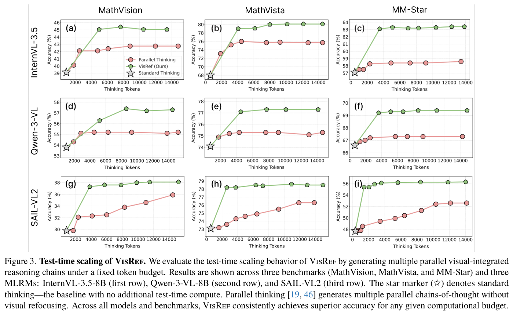
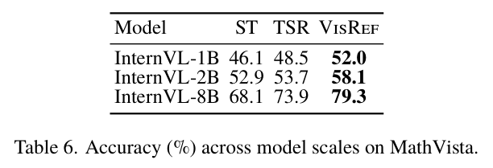
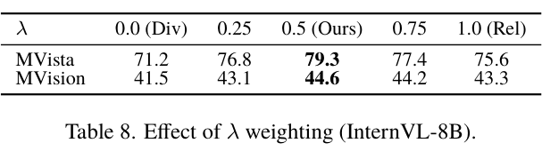

---
tags:
  - papers/visually-grounded-reasoning
  - papers/test-time-scaling
  - papers/training-free
aliases:
  - "VisRef"
  - "Visual Refocusing while Thinking"
date: 2026-02-27
doi: 10.48550/arXiv.2603.00207
arxiv_id: 2603.00207
---

# VisRef: Visual Refocusing while Thinking Improves Test-Time Scaling in Multi-Modal Large Reasoning Models

## 核心信息

- 标题: VisRef: Visual Refocusing while Thinking Improves Test-Time Scaling in Multi-Modal Large Reasoning Models
- 标题翻译: VisRef：边思考边视觉再聚焦，提升多模态大推理模型的测试时扩展
- 作者: Soumya Suvra Ghosal, Youngeun Kim, Zhuowei Li, Ritwick Chaudhry, Linghan Xu, Hongjing Zhang, Jakub Zablocki, Yifan Xing, Qin Zhang
- 机构: University of Maryland, College Park; Amazon; Physion Labs
- 发表时间: 2026-02-27
- 发表渠道: arXiv
- DOI: 10.48550/arXiv.2603.00207
- arXiv: 2603.00207
- 论文链接: http://arxiv.org/abs/2603.00207
- 数据 / 资源: MathVista；MathVision；MM-Star；TallyQA；RealWorldQA；InternVL3.5-8B；Qwen-3-VL-8B；SAIL-VL2-8B
- 论文类型: AI 方法；免训练视觉再聚焦；测试时扩展；视觉标记核心集重注入

## 原文摘要翻译

大推理模型已经显示出强大的复杂推理能力，其中一个重要来源是在测试时通过延长推理来扩大计算量。然而，近期研究观察到，在依赖视觉的任务中，推理时延长纯文本思考反而可能降低性能，因为模型会逐渐失去对视觉标记的注意力，并越来越依赖文本先验。

为解决这一问题，已有工作使用基于强化学习的微调来路由视觉标记，或在推理过程中引入再聚焦机制。虽然这些方法有效，但计算代价高，需要大规模数据生成和策略优化。为了在不额外进行强化学习微调的情况下利用测试时计算，作者提出 VisRef，一个视觉落地的测试时扩展框架。

VisRef 的关键思想是在推理过程中主动重新注入一组视觉标记核心集。这组标记与当前推理上下文在语义上相关，同时保持多样性，并能代表图像整体内容，从而支持更有视觉依据的多模态推理。三个视觉推理基准上的实验表明，在固定测试时计算预算下，VisRef 相比现有测试时扩展方法最高提升 6.4%。

## 创新点

1. 明确把长推理失败归因到“视觉标记稀释”。论文不是泛泛说多模态推理会幻觉，而是指出文本轨迹越长，视觉标记在上下文和注意力中的影响越弱。
2. 提出免训练视觉再聚焦。VisRef 不通过强化学习让模型学会回看，而是在测试时把选中的视觉标记重新注入推理轨迹。
3. 用 DPP 做视觉标记核心集选择。它同时追求与当前文本推理状态相关，以及覆盖图像中互补区域，避免只选一堆重复的高相关标记。
4. 引入基于答案熵的自适应停止准则。方法不只是“每步都加视觉标记”，而是当答案分布足够确定时停止继续思考。
5. 把测试时扩展从纯文本轨迹扩展到视觉整合轨迹。多条轨迹投票时，每条轨迹都带有视觉重注入，因此比纯文本并行思考更稳。
6. 与训练型方法互补。Table 2 显示 VisRef 可以和 Look-Back 叠加，说明它不是替代训练路线，而是可放在推理时的视觉证据控制层。

## 一句话总结

VisRef 的核心不是让 MLRM 想得更久，而是在每一步想的时候把相关且多样的视觉标记核心集重新注入上下文；它是 `Reasoning/TrainingFree` 线里最典型的视觉标记层 test-time scaling 方法。

## 研究问题

长思维链对文本模型往往有用，但对多模态推理并不总是好事。原因是图像只在开头进入模型，后续文本理由越长，视觉标记在上下文中的相对权重越低。模型表面上仍在“看图答题”，实际后半段推理可能已经主要靠文本先验。

*论文原图编号：Figure 1。文本自反思让模型继续想，但视觉注意力会继续衰减；VisRef 在推理中重新注入视觉线索，从而恢复视觉落地。*

这和 ICoT、DaP-ICoT 的问题意识相邻，但粒度不同。ICoT/DaP-ICoT 关心在推理中插入图像区域或对象图像；VisRef 关心的是视觉标记层：从原始视觉标记中选一个核心集，在每个推理步骤重新注入。

论文要回答的问题可以概括为：不训练模型、不调用额外视觉工具的情况下，能否仅通过测试时视觉标记重注入，让多模态模型在长推理中持续看回图像？

## 数据与任务定义

### 推理轨迹

标准 MLRM 推理可以写作：

$$
x_{\mathrm{input}}\to z\to y.
$$

其中 $x_{\mathrm{input}}=[I,T]$ 包含图像和文本提示，$z$ 是模型生成的思考轨迹，$y$ 是最终答案。

文本自反思把它扩展成：

$$
x_{\mathrm{input}}\to z_1\to z_2\to\cdots\to z_k\to y.
$$

VisRef 则把每一步文本理由和视觉标记子集配成视觉整合轨迹：

$$
\tau_{1:k}=((z_1,V_1),(z_2,V_2),\ldots,(z_k,V_k)).
$$

### 数据集与模型

| 基准 | 规模与任务 | 指标 |
|---|---|---|
| MathVista | testmini，1,000 题；视觉数学、图表、科学图形 | accuracy |
| MathVision | 304 道视觉落地数学竞赛题，覆盖 16 个学科和 5 个难度 | accuracy |
| MM-Star | 1,500 个视觉依赖问题，覆盖 6 类能力和 18 个细分轴 | accuracy |
| TallyQA | 复杂计数补充实验 | accuracy |
| RealWorldQA | 真实世界视觉理解补充实验 | accuracy |

实验覆盖三个八十亿参数级多模态模型：InternVL、Qwen-VL 与 SAIL-VL。对比基线是标准思考和文本自反思。

主实验使用 0.25 的答案熵阈值、30% 的视觉标记预算，最多推理 10 步。

## 方法主线

### 机制流程

1. 输入图像与文本问题，MLRM 生成当前文本推理步骤 $z_k$，同时保留原始视觉标记集合 $V$。
2. 将视觉标记投影到当前文本推理子空间，构造 DPP 核矩阵，并贪心选择 $m$ 个相关且多样的视觉标记。
3. 把选中的视觉标记核心集 $V_k$ 重新注入推理轨迹，更新为 $(z_k,V_k)$ 并继续下一步推理。
4. 查询当前答案分布熵 $H_k$；若 $H_k<\delta_{\mathrm{entropy}}$ 则停止推理并输出答案，否则继续下一轮视觉再聚焦。

*论文原图编号：Figure 2。VisRef 在每个思考步骤选择视觉标记核心集并重新注入，同时用答案熵判断是否停止。*

### DPP 核心集选择

全量重注入不可行。论文报告，在 InternVL3.5-8B + MathVista 上，平均每步约有 `1,772` 个视觉标记和 `615` 个文本标记；如果每一步都加入全部视觉标记，延迟会变成文本推理的 `2.3` 倍。

VisRef 的目标是在每一步选出一个小核心集。设当前文本推理状态为 $z_k=\{z_k^{(1)},\ldots,z_k^{(T_k)}\}$，作者用文本标记构造推理子空间：

$$
M_k=\sum_{j=1}^{T_k}z_k^{(j)}(z_k^{(j)})^\top.
$$

然后定义视觉标记之间的核：

$$
L_k(v_i,v_j)=v_i^\top M_kv_j.
$$

最终选择最大化行列式的视觉标记子集：

$$
\widetilde{V}_k=\arg\max_{V_k\subseteq V}\det(L_k^{V_k}).
$$

这个目标的直觉很漂亮：高相关视觉标记会增加对角项，而高度重复的视觉标记会让核矩阵行列式变小。因此它不是简单选最相关标记，而是在相关和互补之间做平衡。

### 相关性与多样性分解

论文进一步给出分解：

$$
\log\det(L_k^{V_k})
=\sum_{v_i\in V_k}\log(r_i^2)+\log\det(\bar{L}_k^{V_k}).
$$

第一项是相关性，衡量被选视觉标记和当前文本推理状态的对齐；第二项是多样性，惩罚冗余并鼓励视觉覆盖。因为直接优化组合目标是 NP-hard，作者使用贪心近似，并用预算 $m$ 控制每步选多少视觉标记。

### 自适应停止

VisRef 不希望无限加视觉标记。每一步得到视觉整合轨迹 $\tau_{1:k}$ 后，系统估计答案分布的熵：

$$
H_k=-\mathbb{E}_{y\sim\pi_\theta(\cdot\mid x_{\mathrm{input}},\tau_{1:k})}
\left[\log\pi_\theta(y\mid x_{\mathrm{input}},\tau_{1:k})\right].
$$

当 $H_k<\delta_{\mathrm{entropy}}$，说明模型答案分布已经足够确定，推理停止；否则继续下一步视觉再聚焦。这一点让 VisRef 更像一个可控的推理时循环，而不是盲目延长推理。

## 关键结果

### 主结果与强基线

*论文原图编号：Table 1。VisRef 在 MathVision、MathVista 和 MM-Star 上，跨三个 MLRM 均超过标准思考和文本自反思。*

| Model | Method | MathVision | MathVista | MM-Star |
|---|---|---:|---:|---:|
| InternVL3.5-8B | ST | 39.2 | 68.1 | 57.2 |
| InternVL3.5-8B | TSR | 40.1 | 73.9 | 58.3 |
| InternVL3.5-8B | VisRef | 44.6 | 79.3 | 63.1 |
| Qwen-3-VL-8B | ST | 53.8 | 74.1 | 66.5 |
| Qwen-3-VL-8B | TSR | 54.3 | 74.2 | 65.9 |
| Qwen-3-VL-8B | VisRef | 56.6 | 77.1 | 69.1 |
| SAIL-VL2-8B | ST | 29.8 | 73.1 | 47.7 |
| SAIL-VL2-8B | TSR | 31.9 | 73.8 | 48.9 |
| SAIL-VL2-8B | VisRef | 37.3 | 78.2 | 55.3 |

最关键的观察是：文本自反思并不稳定，有些设置只涨 `0.1` 到 `2.1`，甚至在 Qwen-3-VL-8B 的 MM-Star 上下降 `0.6`。VisRef 则在所有模型和基准上更稳定地提升。这说明多模态任务中“想更久”不等于“看得更准”，视觉证据必须进入后续推理。

### 测试时扩展曲线

*论文原图编号：Figure 3。在固定标记预算下，VisRef 的视觉整合并行推理轨迹普遍优于纯文本并行思考。*

作者把固定测试时预算 $B$ 分成多条并行推理轨迹，再用多数投票聚合答案。区别在于：普通并行思考采样多条纯文本轨迹，VisRef 采样多条带视觉重注入的轨迹。

图 3 的结论很直接：在相同预算下，VisRef 几乎总是高于纯文本并行思考。例如在 InternVL3.5-8B 的 MM-Star 上，`14K` 思考标记预算下 VisRef 大约高 `6%`。这支撑了论文标题中的 “test-time scaling”：不是单条轨迹更长，而是同样预算下更会使用视觉信息。

### 和训练型 Look-Back 的关系

*论文原图编号：Table 2。VisRef 不训练模型，但与训练型 Look-Back 竞争；二者结合效果最好。*

| Method | MathVista | MathVision | MM-Star |
|---|---:|---:|---:|
| ST | 68.1 | 39.2 | 57.2 |
| Look-Back | 80.8 | 44.2 | 63.7 |
| VisRef | 79.3 | 44.6 | 63.1 |
| Look-Back + VisRef | 83.1 | 48.2 | 66.0 |

Look-Back 需要强化学习微调，论文报告约需 `60` 个 A6000 GPU 小时。VisRef 虽略低于 Look-Back 的部分结果，但完全免训练；更重要的是二者叠加最好，说明 VisRef 更像推理时控制层，而不是和训练路线互斥。

### 消融到底说明了什么

*论文原图编号：Table 3。相关性和多样性都重要，完整 DPP 目标优于只用单项。*

| Selection objective | MathVista | MathVision | MM-Star |
|---|---:|---:|---:|
| diversity only | 75.6 | 43.3 | 61.0 |
| relevance only | 77.4 | 42.9 | 62.8 |
| relevance + diversity | 79.3 | 44.6 | 63.1 |

只选最相关标记会有冗余问题：模型可能一直看向相似区域，错过互补证据。只追求多样性又可能引入不相关区域。DPP 的价值就在于用一个行列式目标把二者合起来。

*论文原图编号：Figure 4。熵阈值和视觉标记预算的消融。主实验选择 $\delta_{\mathrm{entropy}}=0.25$，$m=30\%$。*

熵阈值过低会要求模型达到过高置信度，导致多想但未必更准；阈值过高又可能过早停止。作者选择 `0.25` 作为准确率和效率的折中。

视觉标记预算也不是越大越好。MathVista 上，$m$ 从 `20%` 增加到 `30%` 时准确率从 `76.1%` 到 `79.2%`；继续到 `40%` 不再提升。这支持“核心集”这个设计：有效视觉证据需要压缩，而不是全部回放。

### 注意力可视化

*论文原图编号：Figure 5。VisRef 后的注意力图更集中到手表数字、球衣号码、显示器、猫等任务关键区域。*

定性图显示，原始注意力常是散的；重新注入后，模型会更集中到题目相关区域。这个证据不能单独证明因果，但和主结果、DPP 消融放在一起，能支撑“视觉再聚焦确实改变了后续推理的视觉依据”。

### 附录结果

*论文原图编号：Table 5。MathVista 上每个 prompt 的延迟。VisRef 为 8.2 秒，高于 ST 的 7.1 秒和 TSR 的 7.7 秒。*

延迟结果很重要，因为它给“免训练”补上了成本边界。VisRef 不需要训练，但每步做 DPP 选择，仍然比标准解码慢。作者报告在 1 张 H100 上，VisRef 比 TSR 多 `0.5` 秒，比 ST 多 `1.1` 秒。

*论文原图编号：Table 6。不同 InternVL 规模上，VisRef 均提升 MathVista。*

模型规模实验显示，InternVL-1B 从 `46.1/48.5` 提升到 `52.0`，2B 从 `52.9/53.7` 提升到 `58.1`，8B 从 `68.1/73.9` 提升到 `79.3`。这说明视觉再聚焦收益不只存在于 8B 模型。

*论文原图编号：Table 7。随机、只看相关性、DPP 三种视觉标记选择策略对比。*

表 7 进一步验证：随机选择接近标准思考，相关性选择有提升，但行列式点过程最好。它比表 3 更像工程消融，因为它直接回答“是不是随便选一部分视觉标记也行”。答案是否定的。

*论文原图编号：Table 8。相关性与多样性加权消融，$\lambda=0.5$ 最优。*

加权实验显示，$\lambda=0.5$ 在 MathVista 和 MathVision 上都最好。这也支持主文默认不加偏置地平衡两项，而不是更偏向相关性或多样性。

## 深度分析

### 真正贡献是什么

VisRef 的真正贡献是把测试时扩展从“生成更多文本”改成“生成文本时持续补回视觉证据”。这一步很关键，因为多模态推理的瓶颈并不总是推理步数不足，而是推理过程中视觉依据逐渐消失。

它也给 `Reasoning` 目录里的 TrainingFree 路线补了一块：DeepScan 是测试时找证据，ICoT/DaP-ICoT 是测试时插视觉图像，VisRef 是测试时重注入视觉标记核心集。三者都不改模型参数，但介入的粒度不同。

### 为什么结果成立

结果成立主要因为三个机制叠加。

第一，视觉重注入抵消了长文本轨迹中的视觉注意力衰减。即使模型一开始看过图，长推理时视觉标记的有效影响仍会被文本上下文冲淡。重注入相当于把视觉证据重新放回当前步骤附近。

第二，DPP 让视觉压缩不是盲目压缩。只按相关性选，可能全都来自一个区域；只按多样性选，可能引入无关区域。行列式目标让相关和覆盖同时进入选择。

第三，熵停止让推理长度可控。视觉重注入如果无限循环，也会变成另一种过度思考。用答案熵停止，至少给了一个任务难度自适应的计算边界。

### 容易误读的地方

不要把 VisRef 理解成“无成本增强”。论文确实免训练，但推理时要做 DPP 选择和视觉标记重注入，所以延迟增加是明确存在的。

也不要把表 1 的涨点直接解释成模型学会了新的视觉能力。模型参数没有改变，VisRef 改变的是上下文中视觉标记的组织方式和出现时机。它更像推理时记忆管理，而不是新能力学习。

还要注意，VisRef 的证据单位是视觉标记，不是对象或区域。它能提升注意力聚焦，但不一定天然具备对象完整性。和 DaP-ICoT 的对象级插图相比，这是优点也是限制：更轻、更贴近模型内部，但可解释性弱一些。

### 复现注意点

1. 需要能访问模型视觉标记嵌入和当前文本推理状态，否则无法构造 $M_k$ 和 DPP 核。
2. 贪心 DPP 选择虽然比精确组合优化便宜，但仍会增加每步推理开销。
3. 主实验使用 $\delta_{\mathrm{entropy}}=0.25$、$m=30\%$、$K_{\max}=10$，新模型或新任务上最好重新检查。
4. 若模型视觉标记数很大，显存和延迟可能成为真实瓶颈。
5. 评估主要是选择/短答案式 accuracy；开放式长答案是否同样稳定，需要额外验证。

## 局限

1. 计算开销明确存在。附录指出 DPP 选择会增加推理延迟，Table 5 中 VisRef 为 `8.2s`，高于 ST 的 `7.1s`。
2. 超参数仍需设定。熵阈值、视觉标记预算和最大步数都影响成本与效果。
3. 视觉标记核心集不保证对象完整性。它更适合模型内部的标记级再聚焦，不一定能给出人类可读的完整证据区域。
4. 主实验集中在视觉数学、视觉依赖问答和有限模型族，泛化到开放式视觉问答、视频和 3D 场景仍需验证。
5. 方法依赖模型能暴露视觉标记和文本隐状态，不是所有闭源 MLRM 都能直接实现。

## 我的笔记

这篇对 3D 智能体很有参考价值。它的长规划也会遇到“越想越离开感知”的问题：一开始看到的多视角证据会被后续语言规划冲淡。VisRef 提供的不是完整答案，而是一个设计模式：每个推理步骤都可以刷新一次视觉记忆。

如果把它迁到三维场景，视觉标记核心集可以对应多视角标记、局部渲染块、对象记忆或三维高斯泼溅中的局部高斯集合。行列式点过程的“相关性加多样性”思想尤其适合多视角：既要选和当前子目标相关的视角，也要避免全部来自同一个相机角度。

我也会把它和 PRCR 放在一起读。VisRef 解决“选什么视觉标记重注入”，PRCR 解决“如何低成本复用视觉缓存”。一个偏算法选择，一个偏系统效率，理论上可以组合。

## 引用

- 推荐引用键: `ghosal2026visref`
- arXiv: http://arxiv.org/abs/2603.00207
- DOI: https://doi.org/10.48550/arXiv.2603.00207
- Zotero item: `34QUN2EN`
- Source PDF: `/Users/roywangj/journey_wj/research/papers4zotero/zotero1/storage/V8UHNJTS/Ghosal 等 - 2026 - VisRef Visual Refocusing while Thinking Improves Test-Time Scaling in Multi-Modal Large Reasoning M.pdf`
