# ABot-M0.5: Unified Mobility-and-Manipulation World Action Model

**Authors:** Ronghan Chen, Yandan Yang, Zuojin Tang, Dongjie Huo, Tong Lin, Haoning Wu, Haoyun Liu, Yuzhi Chen, Lulu Zheng, Botai Yuan, Tianlun Li, Mingxin Wang, Dekang Qi, Bin Hu, Wei Mei, Yuze Xuan, Haolong Yang, Yanqing Zhu, Mu Xu, Zhiheng Ma, Xinyuan Chang  
**Affiliation:** AMAP CV Lab, Alibaba Group  
**Source:** `/Users/roywangj/journey_wj/research/papers4zotero/zotero1/storage/W37BGA56/Chen 等 - 2026 - ABot-M0.5 Unified Mobility-and-Manipulation World Action Model.pdf`  
**Detected source format:** selectable-text PDF (`pdf-text`), 33 pages  
**Version:** arXiv:2607.00678v2, 6 July 2026  
**Reader type:** complete paragraph-level Chinese–English reader with searchable equations, tables, captions, acknowledgments, contributions, and references.

> [!note] 阅读说明
> 正文按原文顺序组织，英文段落后紧跟中文译文。图 1–13 均保留本地裁图与双语图注；表 1–6 同时保留裁图和可检索文本，表 7–8 因自动裁图不完整而仅作 Markdown 转录。参考文献保留原始英文书目信息，不逐条翻译，以保持题名、作者和 arXiv 标识可检索。

## Page / Section Index

| Pages | Source section | 本稿位置 |
|---|---|---|
| 1–2 | Abstract | [Abstract](#abstract) |
| 3–4 | 1 Introduction | [1 Introduction](#1-introduction) |
| 4–6 | 2 Alignment-Aware World-Action Learning | [2 Alignment-Aware World-Action Learning](#2-alignment-aware-world-action-learning) |
| 6–12 | 3 The ABot-M0.5 Model | [3 The ABot-M0.5 Model](#3-the-abot-m05-model) |
| 12–17 | 4 Training Paradigm | [4 Training Paradigm](#4-training-paradigm) |
| 17–27 | 5 Experiments | [5 Experiments](#5-experiments) |
| 27–28 | 6 Conclusion and Future Work | [6 Conclusion and Future Work](#6-conclusion-and-future-work) |
| 28 | 7 Contributions | [7 Contributions](#7-contributions) |
| 28–29 | Acknowledgments | [Acknowledgments](#acknowledgments) |
| 29–33 | References | [References](#references) |

## Terminology Ledger

| English term | 中文译法 | 使用说明 |
|---|---|---|
| World Action Model (WAM) | 世界—动作模型 | 联合预测未来视觉状态与机器人动作的模型 |
| Vision-Language-Action (VLA) | 视觉—语言—动作模型 | 由视觉和指令直接输出动作的策略 |
| latent action | 潜在动作 | 从相邻视觉状态转移中编码的帧级运动意图 |
| mobility action | 移动动作 | 底盘、足式移动等负责位姿迁移的控制分支 |
| manipulation action | 操作动作 | 机械臂、手或夹爪等负责物体交互的控制分支 |
| Mixture-of-Transformers (MoT) | Transformer 混合架构 | 为不同模态或动作子空间配置专用子网络 |
| Dual-Level MoT (D-MoT) | 双层 Transformer 混合架构 | 同时在模态层和动作层解耦 |
| Dream Forcing | 梦境强制训练 | 用模型自己预测的未来视觉/潜在动作训练逆动力学 |
| teacher forcing | 教师强制 | 训练时使用真实历史或真实未来条件 |
| exposure bias | 暴露偏差 | 训练条件与自回归推理条件不同导致的误差累积 |
| conditional flow matching (CFM) | 条件流匹配 | 本文用于视频、潜在动作和控制动作生成的扩散式目标 |
| action chunk | 动作块 | 一次预测的长度为 $H$ 的连续动作序列 |
| process score | 过程分数 | 长时程任务中衡量子阶段完成程度的指标 |

## Abstract

> <strong>Para. 1:</strong> Mobile manipulation is a key capability for general-purpose robots, yet it remains challenging for current embodied-learning methods. Vision-language-action policies are typically reactive and lack explicit world modeling. Existing World Action Models are also poorly aligned with mobile manipulation: they operate on coarse video chunks, model entangled navigation–manipulation actions, and train inverse dynamics with supervision that differs from autoregressive inference. They therefore miss fine-grained contact dynamics, suffer from conflicts between action distributions, and accumulate errors in long-horizon rollouts.

> <strong>Para. 1[CN]:</strong> 移动操作是通用机器人需要具备的关键能力，但对现有具身学习方法仍然很有挑战。视觉—语言—动作策略通常是反应式的，缺少显式世界建模；现有世界—动作模型与移动操作的结构也没有充分对齐：它们在粗粒度视频块上工作，把导航与操作动作纠缠在一起，并用不同于自回归推理条件的监督来训练逆动力学。因此，这些模型容易忽略细粒度接触动力学，产生动作分布冲突，并在长时程滚动预测中持续累积误差。

> <strong>Para. 2:</strong> ABot-M0.5 is built on the observation that mobile manipulation requires alignment at three levels: temporal granularity, action space, and train–test consistency. Intermediate latent actions capture local visual-state transitions and bridge video latents with embodiment-specific controls. A dual-level Mixture-of-Transformers disentangles modality representations and heterogeneous action subspaces such as base movement and arm manipulation. Dream Forcing progressively trains inverse dynamics on model-predicted videos, improving robustness under autoregressive prediction.

> <strong>Para. 2[CN]:</strong> ABot-M0.5 的出发点是：移动操作需要在三个层面完成对齐，即时间粒度、动作空间以及训练—测试一致性。中间潜在动作负责刻画局部视觉状态转移，在视频潜变量与具体机器人控制量之间建立桥梁；双层 Transformer 混合架构同时解耦模态表征和底盘移动、机械臂操作等异质动作子空间；Dream Forcing 则逐步让逆动力学在模型自己预测的视频上接受训练，从而提升自回归预测时的鲁棒性。

> <strong>Para. 3:</strong> Experiments on mobile and fine-grained manipulation benchmarks show state-of-the-art long-horizon task success and fine-grained control accuracy. The results emphasize the value of granularity-aligned, action-disentangled, and inference-consistent world-action modeling.

> <strong>Para. 3[CN]:</strong> 在移动操作和精细操作基准上的实验表明，该模型在长时程任务成功率与细粒度控制精度上取得了领先结果。作者据此强调：世界—动作建模要真正适用于移动操作，时间粒度对齐、动作解耦和推理条件一致性缺一不可。

## 1 Introduction

> <strong>Para. 1:</strong> General-purpose robots must move through environments, reason over long temporal contexts, interact with objects in clutter, and execute precise contacts. Mobile manipulation therefore combines two very different control regimes: large-scale relocation and fine-grained manipulation. A successful policy must preserve task intent over long horizons while remaining sensitive to short-lived contact events.

> <strong>Para. 1[CN]:</strong> 通用机器人既要在环境中移动、跨越长时间上下文维持推理，又要在杂乱场景中与物体交互并完成精确接触。移动操作因此把两种差异很大的控制机制放在同一任务里：大尺度位置迁移与细粒度物体操作。有效策略既要在长时程内保持任务意图，又必须对短暂的接触事件足够敏感。

> <strong>Para. 2:</strong> Current VLA models map visual observations and language instructions directly to actions. Their strong reactive control does not by itself provide an explicit predictive model of future visual states. WAMs add future imagination, but most inherit a video-chunk abstraction that is too coarse for frame-level robot control and often attach a single inverse-dynamics head to a heterogeneous action vector.

> <strong>Para. 2[CN]:</strong> 现有 VLA 模型直接把视觉观测和语言指令映射为动作，反应式控制能力很强，但本身不提供对未来视觉状态的显式预测。WAM 引入了未来想象，不过多数方法沿用了视频块级抽象：这个粒度对逐帧机器人控制过于粗糙，而且通常用单一逆动力学头处理内部结构差异很大的动作向量。

> <strong>Para. 3:</strong> The paper identifies three mismatches. First, video generation and action execution use different temporal granularities. Second, navigation and manipulation dimensions obey different distributions and dynamics but are decoded together. Third, an inverse-dynamics model trained on ground-truth future states is evaluated on self-generated, imperfect future states, creating exposure bias.

> <strong>Para. 3[CN]:</strong> 论文把核心困难归纳为三种错配。第一，视频生成与动作执行采用不同的时间粒度；第二，导航与操作维度具有不同的分布和动力学，却被统一解码；第三，逆动力学模型在训练时看到真实未来状态，推理时却只能看到自身生成且带误差的未来状态，由此形成暴露偏差。

> <strong>Para. 4:</strong> ABot-M0.5 factorizes prediction into a structured cascade from future video to frame-level latent action and then to executable control. It further introduces a dual-level MoT and a two-phase Dream Forcing procedure. The complete model is trained progressively from a pretrained video world model, through supervised world-action learning, to dreamed-condition action training.

> <strong>Para. 4[CN]:</strong> ABot-M0.5 将预测分解为结构化级联：先生成未来视频，再得到帧级潜在动作，最后输出可执行控制；随后用双层 MoT 解耦模态和动作子空间，并通过两阶段 Dream Forcing 让动作模型适应“自生成未来”这一真实推理条件。完整训练流程从预训练视频世界模型开始，经过监督式世界—动作学习，再进入基于梦境条件的动作训练。

> <strong>Para. 5:</strong> The main contributions are: (1) a temporally aligned intermediate latent-action space between video prediction and control; (2) a dual-level MoT that separates video, latent-action, mobility-action, and manipulation-action processing while retaining shared interaction; and (3) Dream Forcing, which trains action prediction on model-generated futures and reduces the train–test gap.

> <strong>Para. 5[CN]:</strong> 主要贡献包括：  
> 1. 在视频预测与控制之间引入时间粒度对齐的中间潜在动作空间；  
> 2. 提出双层 MoT，分别处理视频、潜在动作、移动动作和操作动作，同时保留共享信息交互；  
> 3. 提出 Dream Forcing，使动作预测在模型生成的未来条件上训练，以缩小训练—测试差距。

### Figure 1. ABot-M0.5 overview

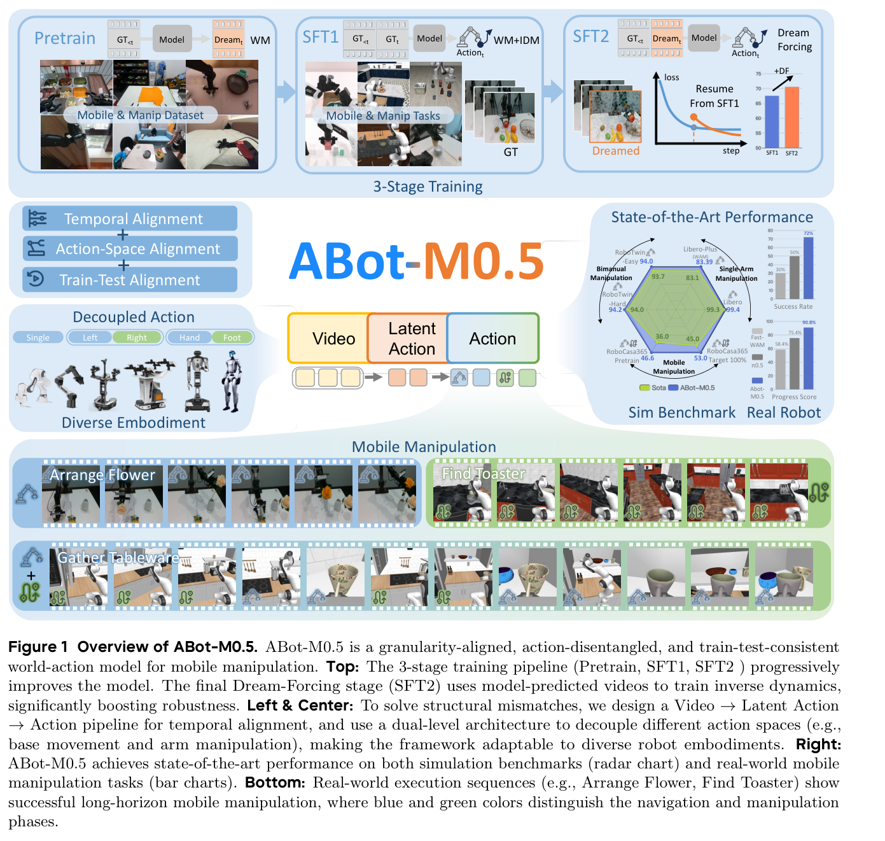

**Caption:** Overview of ABot-M0.5. The method aligns temporal granularity through latent actions, aligns heterogeneous controls through decoupled action modeling, and aligns training with inference through Dream Forcing. It follows a three-stage training pipeline and is evaluated in simulation and on a real robot.

**Caption[CN]:** ABot-M0.5 总览。方法以潜在动作对齐时间粒度，以解耦动作建模对齐异质控制，并以 Dream Forcing 对齐训练和推理条件；训练采用三个阶段，最终在仿真与真实机器人上评估。

## 2 Alignment-Aware World-Action Learning

### 2.1 Problem Setting

> <strong>Para. 1:</strong> At time $t$, the robot receives a multi-view observation $o_t=\{I_t^{(1)},\ldots,I_t^{(N_c)}\}$, where $N_c$ is the number of camera views. Together with observation history, past actions, and language instruction $l$, a policy predicts an action chunk of horizon $H$.

> <strong>Para. 1[CN]:</strong> 在时间步 $t$，机器人接收多视角观测 $o_t=\{I_t^{(1)},\ldots,I_t^{(N_c)}\}$，其中 $N_c$ 表示相机视角数。策略结合观测历史、过去动作与语言指令 $l$，预测长度为 $H$ 的动作块。

$$
a_{t:t+H-1}\sim \pi(\cdot\mid o_{\le t},a_{<t},l).
\tag{1}
$$

> <strong>Para. 2:</strong> A World Action Model additionally predicts future visual latents $z_{t+1:t+H}$, so world evolution and action generation can be learned jointly.

> <strong>Para. 2[CN]:</strong> 世界—动作模型还要预测未来视觉潜变量 $z_{t+1:t+H}$，从而联合学习世界演化与动作生成。

$$
(z_{t+1:t+H},a_{t:t+H-1})
\sim p(\cdot\mid o_{\le t},a_{<t},l).
\tag{2}
$$

> <strong>Para. 3:</strong> ABot-M0.5 replaces a direct video-to-control mapping with a hierarchy in which the video latent predicts a frame-level motion intent, and the motion intent then predicts embodiment-specific control.

> <strong>Para. 3[CN]:</strong> ABot-M0.5 不再直接从视频映射到控制量，而是建立层次结构：视频潜变量先预测帧级运动意图，再由运动意图预测具体机器人形态对应的控制量。

$$
\text{Video latent }z_{t+1}
\rightarrow
\text{frame-level motion intent }m_t
\rightarrow
\text{robot action }a_t.
\tag{3}
$$

### 2.2 Core Bottlenecks in Mobile Manipulation

> <strong>Para. 1:</strong> **Temporal-granularity mismatch.** Video models commonly predict compressed chunks, whereas controls are executed at a finer frame or control rate. A single coarse video latent may hide several distinct contacts or corrections, making the inverse mapping ill-conditioned.

> <strong>Para. 1[CN]:</strong> **时间粒度错配。** 视频模型通常预测压缩后的视频块，而控制在更细的帧率或控制频率下执行。一个粗粒度视频潜变量可能掩盖多个不同的接触或纠偏过程，使逆映射变得病态。

> <strong>Para. 2:</strong> **Action-space mismatch.** Mobile robots combine base, arm, gripper, hand, or other embodiment-specific controls. These dimensions have different semantics, scales, and distributions. Treating them as a homogeneous vector can create gradient and distribution conflicts.

> <strong>Para. 2[CN]:</strong> **动作空间错配。** 移动机器人同时包含底盘、机械臂、夹爪、手或其他与形态相关的控制量，这些维度在语义、尺度和分布上都不相同。把它们当成同质向量处理，会带来梯度冲突和分布冲突。

> <strong>Para. 3:</strong> **Rollout-condition mismatch.** Teacher-forced inverse dynamics observes clean future states during training, but autoregressive deployment conditions it on model predictions. The resulting exposure bias becomes especially damaging over long-horizon mobile tasks.

> <strong>Para. 3[CN]:</strong> **滚动条件错配。** 采用教师强制的逆动力学在训练时观察干净的真实未来状态，但自回归部署只能以模型预测为条件。这种暴露偏差在长时程移动任务中尤其容易被放大。

## 3 The ABot-M0.5 Model

### 3.1 Overall Architecture and Notation

> <strong>Para. 1:</strong> ABot-M0.5 uses the Wan2.2 video-diffusion backbone, a 3D VAE for visual latents, and UMT5 for language conditioning. Its central factorization is $z_{t+1}\rightarrow m_t\rightarrow a_t$: future visual state, intermediate motion intent, and executable action.

> <strong>Para. 1[CN]:</strong> ABot-M0.5 以 Wan2.2 视频扩散模型为骨干，用 3D VAE 表示视觉潜变量，并用 UMT5 编码语言条件。核心分解为 $z_{t+1}\rightarrow m_t\rightarrow a_t$：依次对应未来视觉状态、中间运动意图和可执行动作。

$$
z_{t+1}\rightarrow m_t\rightarrow a_t.
\tag{4}
$$

> <strong>Para. 2:</strong> Future-video learning uses conditional flow matching. A noisy visual latent is interpolated as $z_{t+1}^{\tau}=\tau z_{t+1}+(1-\tau)\epsilon$, and the model predicts the velocity from noise to data while conditioning on history, previous latent actions, past actions, time, and language.

> <strong>Para. 2[CN]:</strong> 未来视频学习采用条件流匹配。噪声视觉潜变量写作 $z_{t+1}^{\tau}=\tau z_{t+1}+(1-\tau)\epsilon$，模型在历史观测、过去潜在动作、过去动作、扩散时间和语言条件下预测从噪声到数据的速度场。

$$
\mathcal{L}_z=
\mathbb{E}\left[
\left\|
v_\theta^z(z_{t+1}^{\tau};z_{\le t},m_{<t},a_{<t},\tau,l)
-(z_{t+1}-\epsilon)
\right\|_2^2
\right].
\tag{5}
$$

> <strong>Para. 3:</strong> The transformer receives three token streams. Its attention is deliberately asymmetric: future-video tokens cannot read the current latent-action or action targets, while downstream latent-action and action tokens may attend to the upstream predictions they depend on.

> <strong>Para. 3[CN]:</strong> Transformer 接收三类 token 流。注意力设计有意采用非对称结构：未来视频 token 不能读取当前潜在动作或动作目标，而下游潜在动作与动作 token 可以访问它们所依赖的上游预测。

$$
\left[X^z_{t+1},X^m_t,X^a_t\right].
\tag{6}
$$

### Table 1. Notation

**Caption:** Main notation used in the model formulation.

**Caption[CN]:** 模型定义中使用的主要符号。

| Symbol | Meaning | 中文 |
|---|---|---|
| $t$ | time index | 时间索引 |
| $l$ | language instruction | 语言指令 |
| $I_t$ | raw image frame | 原始图像帧 |
| $o_t$ | raw multi-view observation | 原始多视角观测 |
| $z_t$ | video latent | 视频潜变量 |
| $m_t$ | frame-level latent action | 帧级潜在动作 |
| $a_t$ | executable robot action | 可执行机器人动作 |
| $a_t^{\mathrm{move}}$ | mobility action | 移动动作 |
| $a_t^{\mathrm{manip}}$ | manipulation action | 操作动作 |
| $H$ | action horizon | 动作预测长度 |
| $N_c$ | number of cameras | 相机数 |
| $X$ | modality token | 模态 token |
| $\hat{\cdot}$ | dreamed/model-predicted variable | 梦境／模型预测变量 |
| $\tilde{\cdot}$ | noisy variable | 加噪变量 |
| $\tau$ | diffusion time | 扩散时间 |

### Figure 2. Overall architecture

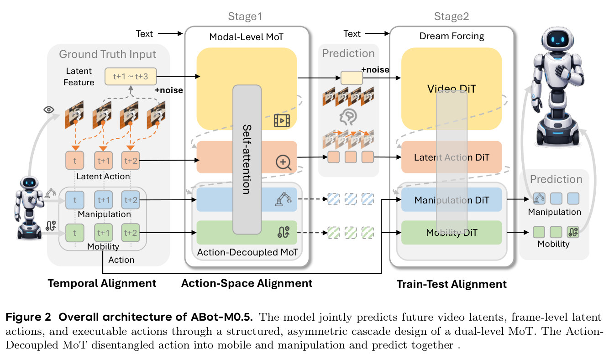

**Caption:** ABot-M0.5 jointly predicts future video latents, frame-level latent actions, and executable actions through a structured asymmetric cascade. The action-decoupled MoT separates mobility and manipulation while allowing joint prediction.

**Caption[CN]:** ABot-M0.5 通过结构化、非对称的级联联合预测未来视频潜变量、帧级潜在动作和可执行动作；动作解耦 MoT 将移动与操作分开建模，同时保留联合预测。

### 3.2 Intermediate Latent Action Modeling

> <strong>Para. 1:</strong> The intermediate latent action is intended to be more temporally local than a video chunk and more embodiment-agnostic than a robot command. It converts context into a predicted world transition, then into a compact motion representation, and finally into control.

> <strong>Para. 1[CN]:</strong> 中间潜在动作在时间上比视频块更局部，在形态上又比机器人控制指令更通用。它把上下文先转换为预测的世界状态转移，再压缩为运动表征，最后映射成控制量。

$$
\text{context}\rightarrow z_{t+1}\rightarrow m_t\rightarrow a_t.
\tag{7}
$$

> <strong>Para. 2:</strong> A pretrained latent-action encoder $E_m$ extracts the transition between adjacent frames. For multiple cameras and a horizon of $H$, the extracted representation has shape $H\times N_c\times d_m$.

> <strong>Para. 2[CN]:</strong> 预训练潜在动作编码器 $E_m$ 从相邻帧中提取状态转移。对于 $N_c$ 个相机和长度为 $H$ 的时间范围，所得表示的形状为 $H\times N_c\times d_m$。

$$
m_t=E_m(I_t,I_{t+1})\in\mathbb{R}^{d_m},
\qquad
M\in\mathbb{R}^{H\times N_c\times d_m}.
\tag{8}
$$

> <strong>Para. 3:</strong> The latent-action stream is also trained with conditional flow matching. Because it conditions on the predicted next visual latent, it is the explicit bridge between world prediction and action decoding.

> <strong>Para. 3[CN]:</strong> 潜在动作流同样通过条件流匹配训练。由于它以预测的下一时刻视觉潜变量为条件，因此成为世界预测与动作解码之间的显式桥梁。

$$
\mathcal{L}_m=
\mathbb{E}\left[
\left\|
v_\theta^m(m_t^\tau;z_{\le t+1},m_{<t},a_{<t},\tau,l)
-(m_t-\epsilon)
\right\|_2^2
\right],
\quad
m_t^\tau=\tau m_t+(1-\tau)\epsilon .
\tag{9}
$$

### 3.3 Dual-Level Mixture-of-Transformers

> <strong>Para. 1:</strong> D-MoT performs two decompositions. At the modality level, video, latent action, and executable action use separate input projections, timestep embeddings, feed-forward paths, and output heads. At the action level, mobility and manipulation use dedicated feed-forward modules and heads but share joint self-attention so that coordination is not lost.

> <strong>Para. 1[CN]:</strong> D-MoT 包含两级分解。模态层面上，视频、潜在动作和可执行动作分别使用输入投影、时间步嵌入、前馈路径与输出头；动作层面上，移动与操作使用专用前馈模块和输出头，但共享联合自注意力，以免失去协同信息。

### Figure 3. Dual-level Mixture-of-Transformers

**Caption:** Modality-level MoT separates video, latent-action, and action computation. Action-level MoT further separates mobility and manipulation branches, while shared self-attention enables cross-branch coordination.

**Caption[CN]:** 模态级 MoT 分离视频、潜在动作和动作计算；动作级 MoT 进一步拆分移动与操作分支，同时用共享自注意力维持跨分支协同。

> <strong>Para. 2:</strong> During action training, both mobility and manipulation targets are independently noised at a shared diffusion time. Each branch predicts its own velocity while conditioning on the other noisy branch, the visual and latent-action context, history, and language.

> <strong>Para. 2[CN]:</strong> 动作训练时，移动和操作目标在同一个扩散时间上分别加噪。每个分支预测自己的速度场，同时以另一条加噪分支、视觉与潜在动作上下文、历史和语言为条件。

$$
a_t^{\mathrm{move},\tau}
=\tau a_t^{\mathrm{move}}+(1-\tau)\epsilon_{\mathrm{move}},
\qquad
a_t^{\mathrm{manip},\tau}
=\tau a_t^{\mathrm{manip}}+(1-\tau)\epsilon_{\mathrm{manip}}.
\tag{10}
$$

$$
\mathcal{L}_{\mathrm{move}}
=
\mathbb{E}\left[
\left\|
v_\theta^{\mathrm{move}}
(a_t^{\mathrm{move},\tau};
z_{\le t+1},m_{\le t},a_{<t},
a_t^{\mathrm{manip},\tau},\tau,l)
-(a_t^{\mathrm{move}}-\epsilon_{\mathrm{move}})
\right\|_2^2
\right].
\tag{11}
$$

$$
\mathcal{L}_{\mathrm{manip}}
=
\mathbb{E}\left[
\left\|
v_\theta^{\mathrm{manip}}
(a_t^{\mathrm{manip},\tau};
z_{\le t+1},m_{\le t},a_{<t},
a_t^{\mathrm{move},\tau},\tau,l)
-(a_t^{\mathrm{manip}}-\epsilon_{\mathrm{manip}})
\right\|_2^2
\right].
\tag{12}
$$

$$
\mathcal{L}_a
=
\lambda_{\mathrm{move}}\mathcal{L}_{\mathrm{move}}
+\lambda_{\mathrm{manip}}\mathcal{L}_{\mathrm{manip}}.
\tag{13}
$$

### 3.4 Dream Forcing for Train–Test Aligned Action Prediction

> <strong>Para. 1:</strong> Teacher forcing trains inverse dynamics with ground-truth future video and latent actions, which are unavailable at inference. Independently noising ground-truth futures, as in ordinary diffusion training, creates diverse perturbations but still does not reproduce the structured error trajectory of the model's own rollout. Dream Forcing instead conditions action learning on self-predicted futures.

> <strong>Para. 1[CN]:</strong> 教师强制用真实未来视频和真实潜在动作训练逆动力学，但推理时无法获得这些条件。普通扩散训练虽然对真实未来独立加噪、产生多样扰动，仍无法复现模型自身滚动预测形成的结构化误差轨迹。Dream Forcing 则直接让动作学习以模型自己预测的未来为条件。

### Figure 4. Teacher forcing, diffusion forcing, and Dream Forcing

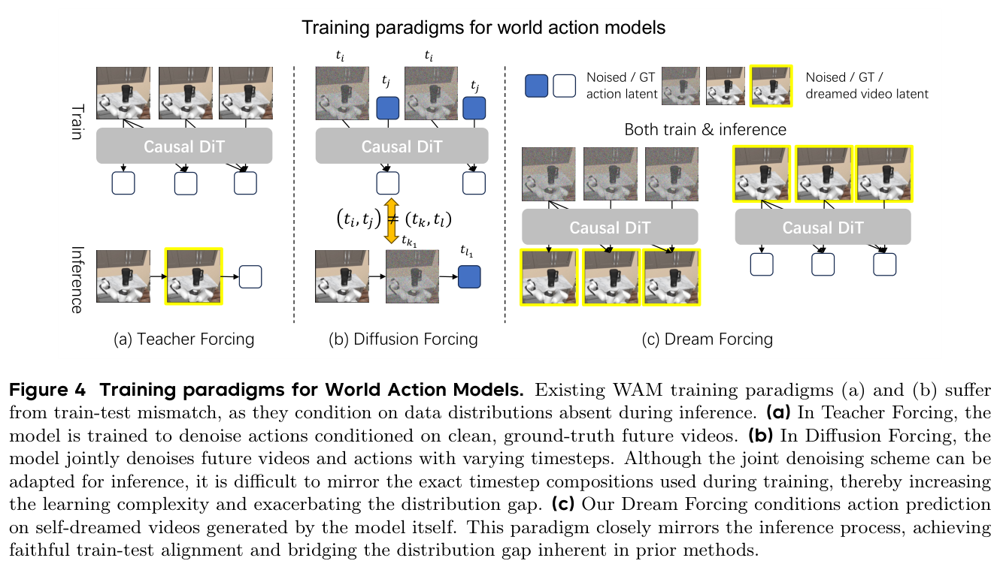

**Caption:** Comparison of training conditions. Teacher forcing uses ground-truth futures; diffusion forcing perturbs ground-truth futures; Dream Forcing uses futures dreamed by the current model, matching autoregressive deployment more closely.

**Caption[CN]:** 三种训练条件对比。教师强制使用真实未来，扩散强制扰动真实未来，Dream Forcing 使用当前模型自行“梦到”的未来，因此更接近自回归部署。

> <strong>Para. 2:</strong> Dream Forcing has two phases. Phase A runs a small number of parallel denoising steps to dream only the newest future chunk, because earlier history is grounded by the current observation. Phase B performs a second forward pass and learns the action conditioned on the dreamed visual latent and dreamed latent action. The world and latent-action generators remain supervised by their ordinary objectives.

> <strong>Para. 2[CN]:</strong> Dream Forcing 分为两个阶段。阶段 A 通过少量并行去噪步骤，只生成最新的未来块，因为更早的历史已由当前观测锚定；阶段 B 再做一次前向传播，让动作在梦境视觉潜变量和梦境潜在动作条件下学习。世界生成器与潜在动作生成器仍由原有监督目标约束。

$$
p_a\!\left(
\cdot\mid z_{\le t+1},m_{\le t},a_{<t},l
\right).
\tag{14}
$$

$$
p_a\!\left(
\cdot\mid
\hat z_{t+1},z_{\le t},
\hat m_t,m_{<t},
a_{<t},l
\right).
\tag{15}
$$

### Figure 5. Two-phase Dream Forcing

**Caption:** Phase A produces a short dreamed future with few-step denoising. Phase B predicts actions from that dreamed video and latent-action context, explicitly training on inference-like inputs.

**Caption[CN]:** 阶段 A 用少步去噪生成短期梦境未来；阶段 B 在该梦境视频和潜在动作条件下预测动作，从而显式使用接近推理时的输入进行训练。

## 4 Training Paradigm

> <strong>Para. 1:</strong> Training is progressive. The model first learns a general video world model, then learns an algebraically regularized latent-action encoder, then jointly fine-tunes future video, latent action, and control on robot trajectories, and finally resumes from Stage I for Dream Forcing.

> <strong>Para. 1[CN]:</strong> 训练采用渐进式流程：先学习通用视频世界模型，再学习带代数一致性约束的潜在动作编码器，随后在机器人轨迹上联合微调未来视频、潜在动作与控制，最后从阶段 I 的权重继续进行 Dream Forcing。

### 4.1 Pretraining Data

> <strong>Para. 1:</strong> The robot-data mixture includes Open X-Embodiment, OXE-AugE, AgiBot-Beta, RoboCOIN, RoboMind, Galaxea, InternData-A1, RoboNet, BridgeData V2, and DROID. The mixture covers multiple embodiments and viewpoints; Galaxea contributes trajectories with base mobility. The latent-action model can also learn from videos without robot-action labels.

> <strong>Para. 1[CN]:</strong> 机器人数据混合包含 Open X-Embodiment、OXE-AugE、AgiBot-Beta、RoboCOIN、RoboMind、Galaxea、InternData-A1、RoboNet、BridgeData V2 和 DROID，覆盖多种机器人形态与视角，其中 Galaxea 提供包含底盘移动的轨迹。由于潜在动作从视觉状态转移中学习，它还可以利用没有机器人动作标注的视频。

### 4.2 World Model Pretraining

> <strong>Para. 1:</strong> The authors fully pretrain the 5B-parameter Wan2.2 backbone as an autoregressive, action-unconditioned world model. Input views are mapped to four fixed camera slots: the first two are third-person views and the last two are wrist views. Excess views are sampled; missing views are zero-padded and masked.

> <strong>Para. 1[CN]:</strong> 作者对 50 亿参数的 Wan2.2 骨干进行全参数预训练，把它作为不以动作显式为条件的自回归世界模型。输入统一映射到四个固定相机槽：前两个是第三人称视角，后两个是腕部视角；视角过多时采样，缺失时用零填充并通过掩码忽略。

$$
\mathcal{L}_{\mathrm{pretrain}}
=
\mathbb{E}\left[
\left\|
v_\theta^z(z_t^\tau;z_{<t},\tau,l)
-(z_t-\epsilon)
\right\|_2^2
\right].
\tag{16}
$$

### Figure 6. World-model pretraining and multi-view layout

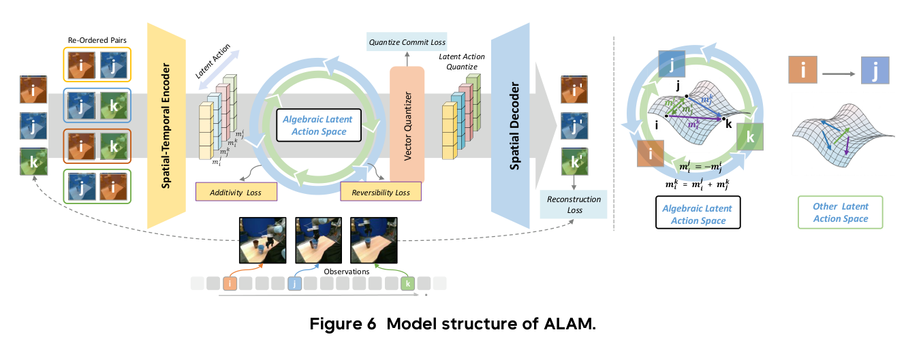

**Caption:** World-model pretraining uses a fixed four-slot multi-view representation with masking for unavailable cameras.

**Caption[CN]:** 世界模型预训练采用固定四槽位的多视角表示，并对不可用相机进行掩码。

### 4.3 Latent Action Model Pretraining

> <strong>Para. 1:</strong> The latent-action encoder follows the ALAM formulation. For a triplet of frames $(I_i,I_j,I_k)$, a transition from $i$ to $k$ should agree with the composition of transitions $i\rightarrow j$ and $j\rightarrow k$, and a transition should cancel its reverse. These constraints encourage a reusable motion space rather than a dataset-specific code.

> <strong>Para. 1[CN]:</strong> 潜在动作编码器采用 ALAM 形式。对帧三元组 $(I_i,I_j,I_k)$，从 $i$ 到 $k$ 的转移应与 $i\rightarrow j$ 和 $j\rightarrow k$ 的组合一致；一个转移与其反向转移应相互抵消。这些约束促使模型学习可复用的运动空间，而不是数据集特定编码。

$$
\mathcal{L}_{\mathrm{add}}
=
\left\|
m_i^k-(m_i^j+m_j^k)
\right\|_2^2.
\tag{17}
$$

$$
\mathcal{L}_{\mathrm{rev}}
=
\left\|
m_i^j+m_j^i
\right\|_2^2.
\tag{18}
$$

$$
\mathcal{L}_{\mathrm{LAM}}
=
\lambda_{\mathrm{vq}}\mathcal{L}_{\mathrm{vq}}
+\lambda_{\mathrm{rec}}\mathcal{L}_{\mathrm{rec}}
+\lambda_{\mathrm{perc}}\mathcal{L}_{\mathrm{perc}}
+\lambda_{\mathrm{add}}\mathcal{L}_{\mathrm{add}}
+\lambda_{\mathrm{rev}}\mathcal{L}_{\mathrm{rev}}.
\tag{19}
$$

> <strong>Para. 2:</strong> After pretraining, the decoder and vector-quantization components are discarded. The encoder is frozen and used offline to extract latent-action targets for world-action supervised fine-tuning.

> <strong>Para. 2[CN]:</strong> 预训练完成后，解码器和向量量化组件被丢弃，只保留并冻结编码器；训练世界—动作模型前，作者离线提取潜在动作监督目标。

### 4.4 Progressive Supervised Fine-Tuning

> <strong>Para. 1:</strong> Stage I uses ground-truth future video and latent-action targets. The factorized model learns the world distribution, the latent-action distribution conditioned on the world transition, and the action distribution conditioned on both.

> <strong>Para. 1[CN]:</strong> 阶段 I 使用真实未来视频与潜在动作目标。分解模型分别学习世界分布、以世界转移为条件的潜在动作分布，以及同时以二者为条件的动作分布。

$$
z_{t+1}\sim
p_z(\cdot\mid z_{\le t},m_{<t},a_{<t},l).
\tag{20}
$$

$$
m_t\sim
p_m(\cdot\mid z_{\le t+1},m_{<t},a_{<t},l).
\tag{21}
$$

$$
a_t\sim
p_a(\cdot\mid z_{\le t+1},m_{\le t},a_{<t},l).
\tag{22}
$$

$$
\mathcal{L}_{\mathrm{SFT1}}
=
\lambda_z\mathcal{L}_z
+\lambda_m\mathcal{L}_m
+\lambda_a\mathcal{L}_a.
\tag{23}
$$

> <strong>Para. 2:</strong> Stage II resumes from Stage I and replaces clean upstream action conditions with dreamed variables. Only the inverse-dynamics action loss changes; the world and latent-action objectives remain anchored to data.

> <strong>Para. 2[CN]:</strong> 阶段 II 从阶段 I 的权重继续训练，用梦境变量替代动作预测所依赖的干净上游条件。变化只发生在逆动力学动作损失，世界与潜在动作目标仍由数据锚定。

$$
a_t\sim
p_a\!\left(
\cdot\mid
\hat z_{t+1},z_{\le t},
\hat m_t,m_{<t},a_{<t},l
\right).
\tag{24}
$$

$$
\widetilde{\mathcal{L}}_{\mathrm{move}}
=
\mathbb{E}\left[
\left\|
v_\theta^{\mathrm{move}}
(a_t^{\mathrm{move},\tau};
\hat z_{t+1},z_{\le t},\hat m_t,m_{<t},a_{<t},
a_t^{\mathrm{manip},\tau},\tau,l)
-(a_t^{\mathrm{move}}-\epsilon_{\mathrm{move}})
\right\|_2^2
\right].
\tag{25}
$$

$$
\widetilde{\mathcal{L}}_{\mathrm{manip}}
=
\mathbb{E}\left[
\left\|
v_\theta^{\mathrm{manip}}
(a_t^{\mathrm{manip},\tau};
\hat z_{t+1},z_{\le t},\hat m_t,m_{<t},a_{<t},
a_t^{\mathrm{move},\tau},\tau,l)
-(a_t^{\mathrm{manip}}-\epsilon_{\mathrm{manip}})
\right\|_2^2
\right].
\tag{26}
$$

$$
\mathcal{L}_{\mathrm{SFT2}}
=
\lambda_z\mathcal{L}_z
+\lambda_m\mathcal{L}_m
+\lambda_a\widetilde{\mathcal{L}}_a.
\tag{27}
$$

$$
\widetilde{\mathcal{L}}_a
=
\lambda_{\mathrm{move}}\widetilde{\mathcal{L}}_{\mathrm{move}}
+\lambda_{\mathrm{manip}}\widetilde{\mathcal{L}}_{\mathrm{manip}}.
\tag{28}
$$

### Figure 7. Progressive SFT attention masks

**Caption:** Structured masks used for Stage-I supervised learning and Stage-II dreamed-condition action learning.

**Caption[CN]:** 阶段 I 监督学习与阶段 II 梦境条件动作学习所使用的结构化注意力掩码。

### 4.5 Efficient Structured Attention and Latent Augmentation

> <strong>Para. 1:</strong> The asymmetric attention pattern is implemented by packing its dense subproblems with variable-length FlashAttention. The paper reports roughly a five-fold forward-and-backward speedup over its FlexAttention baseline for this structured computation.

> <strong>Para. 1[CN]:</strong> 作者把非对称注意力拆成若干稠密子问题，并用变长 FlashAttention 打包计算。论文称，相比其 FlexAttention 基线，这一结构化实现的前向与反向速度约提升五倍。

> <strong>Para. 2:</strong> Offset augmentation changes the starting point of the $H$-frame segmentation. For an offset $s\in\{0,\ldots,H-1\}$, the trajectory is partitioned into segments $[s+tH,\ldots,s+(t+1)H]$. This produces $H$ valid segmentations and reduces dependence on arbitrary chunk boundaries.

> <strong>Para. 2[CN]:</strong> 偏移增强改变长度为 $H$ 的分段起点。对偏移 $s\in\{0,\ldots,H-1\}$，轨迹被划分为 $[s+tH,\ldots,s+(t+1)H]$。同一轨迹因此产生 $H$ 种有效分段，降低模型对任意动作块边界的依赖。

$$
s\in\{0,\ldots,H-1\},
\qquad
\mathcal{S}_{t,s}=[s+tH,\ldots,s+(t+1)H].
\tag{29}
$$

## 5 Experiments

### 5.1 Experimental Setup

> <strong>Para. 1:</strong> The evaluation covers RoboCasa365 for mobile manipulation, RoboTwin 2.0 for bimanual manipulation, LIBERO for compositional tabletop manipulation, LIBERO-Plus for robustness under visual, language, robot, and layout shifts, and five real-robot tasks. Success rate is the main metric; real-world long-horizon tasks also use process score to credit completed sub-stages.

> <strong>Para. 1[CN]:</strong> 评测覆盖用于移动操作的 RoboCasa365、用于双臂操作的 RoboTwin 2.0、用于组合式桌面操作的 LIBERO、考察视觉／语言／机器人／布局变化鲁棒性的 LIBERO-Plus，以及五个真实机器人任务。主要指标为成功率；真实长时程任务还报告过程分数，以反映已完成的子阶段。

### Figure 8. Qualitative benchmark examples

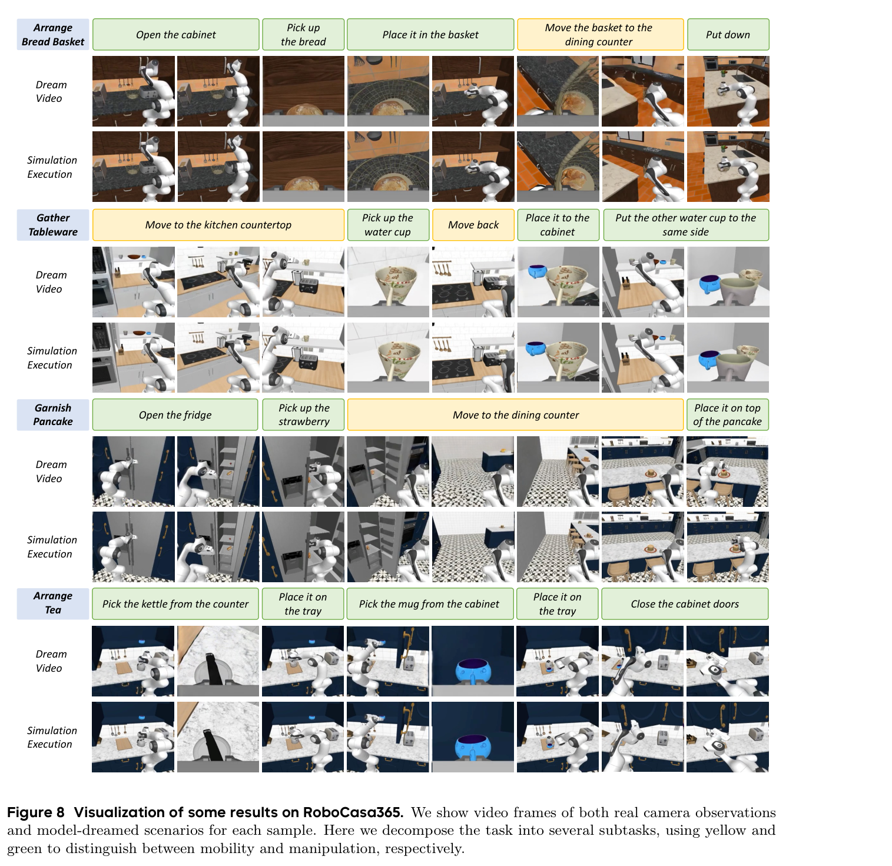

**Caption:** Qualitative examples from mobile manipulation, bimanual manipulation, tabletop manipulation, and real-world evaluation.

**Caption[CN]:** 移动操作、双臂操作、桌面操作与真实机器人评测的定性示例。

### 5.2 Main Results on Mobile Manipulation

> <strong>Para. 1:</strong> On RoboCasa365 pretraining tasks, the base ABot-M0.5 reaches a 40.4% average success rate. The reported “+ Condensed Memory” variant reaches 46.6%, compared with 35.9% for Qwen-RobotManip and 33.2% for RLDX-1. The strongest gain is on Composite Seen tasks; Composite Unseen remains much harder.

> <strong>Para. 1[CN]:</strong> 在 RoboCasa365 预训练任务上，基础版 ABot-M0.5 的平均成功率为 40.4%；论文所列“+ Condensed Memory”版本达到 46.6%，高于 Qwen-RobotManip 的 35.9% 和 RLDX-1 的 33.2%。提升主要来自 Composite Seen，而 Composite Unseen 仍明显更难。

### Table 2. RoboCasa365 pretraining tasks

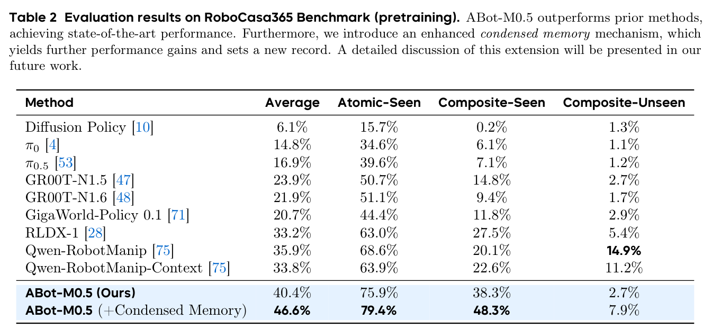

**Caption:** Success rates (%) on RoboCasa365 pretraining tasks.

**Caption[CN]:** RoboCasa365 预训练任务成功率（%）。

| Method | Avg. | Atomic Seen | Composite Seen | Composite Unseen |
|---|---:|---:|---:|---:|
| Diffusion Policy | 6.1 | 15.7 | 0.2 | 1.3 |
| $\pi_0$ | 14.8 | 34.6 | 6.1 | 1.1 |
| $\pi_{0.5}$ | 16.9 | 39.6 | 7.1 | 1.2 |
| GR00T-N1.5 | 23.9 | 50.7 | 14.8 | 2.7 |
| GR00T-N1.6 | 21.9 | 51.1 | 9.4 | 1.7 |
| GigaWorld | 20.7 | 44.4 | 11.8 | 2.9 |
| RLDX-1 | 33.2 | 63.0 | 27.5 | 5.4 |
| Qwen-RobotManip | 35.9 | 68.6 | 20.1 | 14.9 |
| Qwen-RobotManip-Context | 33.8 | 63.9 | 22.6 | 11.2 |
| ABot-M0.5 | 40.4 | 75.9 | 38.3 | 2.7 |
| ABot-M0.5 + Condensed Memory | **46.6** | **79.4** | **48.3** | 7.9 |

> <strong>Para. 2:</strong> On the RoboCasa365 Target100 split, ABot-M0.5 obtains 54.2% average success; on Target10 it obtains 30.1%. The corresponding best listed baselines are 45.1% for Lingbot-VA on Target100 and 21.0% for GR00T on Target10.

> <strong>Para. 2[CN]:</strong> 在 RoboCasa365 Target100 划分上，ABot-M0.5 的平均成功率为 54.2%；在 Target10 上为 30.1%。相应的表内最强基线分别是 Target100 上 Lingbot-VA 的 45.1%，以及 Target10 上 GR00T 的 21.0%。

### Table 3. RoboCasa365 target tasks

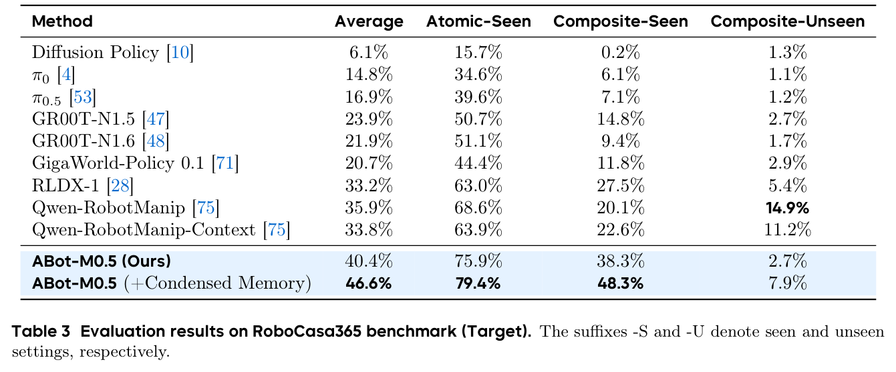

**Caption:** Success rates (%) on RoboCasa365 target-task splits.

**Caption[CN]:** RoboCasa365 目标任务划分成功率（%）。

| Split | Method | Atomic | Composite Seen | Composite Unseen | Avg. |
|---|---|---:|---:|---:|---:|
| Target100 | GR00T | 60.6 | 35.0 | 33.3 | 43.7 |
| Target100 | Fast-WAM | 59.1 | 36.4 | 33.2 | 43.5 |
| Target100 | Lingbot-VA | 63.5 | 37.3 | 32.1 | 45.1 |
| Target100 | ABot-M0.5 | **70.6** | **44.3** | **45.6** | **54.2** |
| Target10 | GR00T | 38.7 | 11.0 | 11.2 | 21.0 |
| Target10 | ABot-M0.5 | **49.0** | **23.4** | **15.4** | **30.1** |

### 5.3 Results on Manipulation Benchmarks

> <strong>Para. 1:</strong> On RoboTwin 2.0, ABot-M0.5 records 94.00% on Easy and 94.20% on Hard, for a 94.10% average. This narrowly exceeds the strongest listed competing averages, including Qwen-RobotManip at 93.85% and G0.5 at 93.30%.

> <strong>Para. 1[CN]:</strong> 在 RoboTwin 2.0 上，ABot-M0.5 在 Easy 和 Hard 上分别达到 94.00% 与 94.20%，平均为 94.10%。这一结果小幅超过表中最强竞争方法，包括平均 93.85% 的 Qwen-RobotManip 和 93.30% 的 G0.5。

### Table 4. RoboTwin 2.0

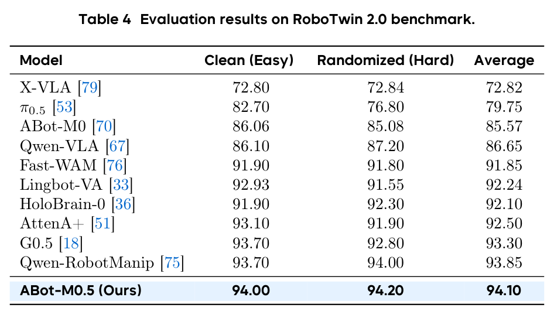

**Caption:** Success rates (%) on RoboTwin 2.0 Easy and Hard.

**Caption[CN]:** RoboTwin 2.0 Easy 与 Hard 成功率（%）。

| Method | Easy | Hard | Avg. |
|---|---:|---:|---:|
| X-VLA | 72.80 | 72.84 | 72.82 |
| $\pi_{0.5}$ | 82.70 | 76.80 | 79.75 |
| ABot-M0 | 86.06 | 85.08 | 85.57 |
| Qwen-VLA | 86.10 | 87.20 | 86.65 |
| Fast-WAM | 91.90 | 91.80 | 91.85 |
| Lingbot-VA | 92.93 | 91.55 | 92.24 |
| HoloBrain-0 | 91.90 | 92.30 | 92.10 |
| AttenA+ | 93.10 | 91.90 | 92.50 |
| G0.5 | 93.70 | 92.80 | 93.30 |
| Qwen-RobotManip | 93.70 | 94.00 | 93.85 |
| ABot-M0.5 | **94.00** | **94.20** | **94.10** |

### Figure 9. RoboTwin task rollouts

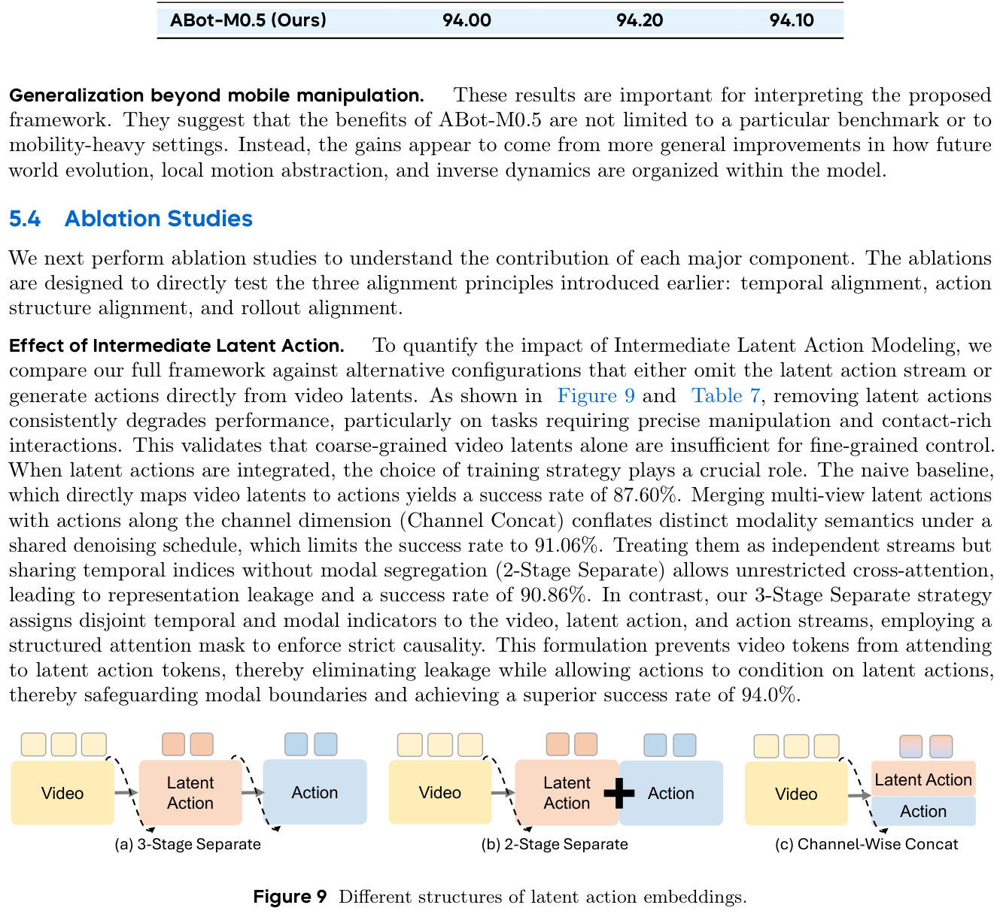

**Caption:** Qualitative RoboTwin rollouts illustrating coordinated bimanual manipulation.

**Caption[CN]:** RoboTwin 定性滚动结果，展示双臂协同操作。

> <strong>Para. 2:</strong> On LIBERO, ABot-M0.5 obtains 100.0 on Spatial, 99.8 on Object, 99.4 on Goal, and 98.4 on Long, averaging 99.4. The margin over already saturated methods is small, but performance remains high on the long-horizon subset.

> <strong>Para. 2[CN]:</strong> 在 LIBERO 上，ABot-M0.5 在 Spatial、Object、Goal 和 Long 上分别取得 100.0、99.8、99.4 和 98.4，平均 99.4。由于该基准已接近饱和，其领先幅度很小，但在长时程子集上仍保持较高结果。

### Table 5. LIBERO

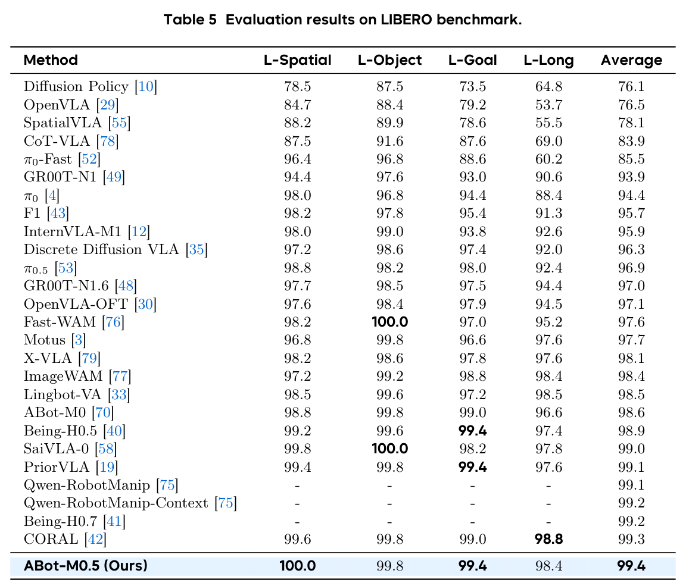

**Caption:** Success rates (%) on the four LIBERO suites.

**Caption[CN]:** 四个 LIBERO 任务套件上的成功率（%）。

| Method | Spatial | Object | Goal | Long | Avg. |
|---|---:|---:|---:|---:|---:|
| Diffusion Policy | 78.5 | 87.5 | 73.5 | 64.8 | 76.1 |
| OpenVLA | 84.7 | 88.4 | 79.2 | 53.7 | 76.5 |
| SpatialVLA | 88.2 | 89.9 | 78.6 | 55.5 | 78.1 |
| CoT-VLA | 87.5 | 91.6 | 87.6 | 69.0 | 83.9 |
| $\pi_0$-Fast | 96.4 | 96.8 | 88.6 | 60.2 | 85.5 |
| GR00T-N1 | 94.4 | 97.6 | 93.0 | 90.6 | 93.9 |
| $\pi_0$ | 98.0 | 96.8 | 94.4 | 88.4 | 94.4 |
| F1 | 98.2 | 97.8 | 95.4 | 91.3 | 95.7 |
| InternVLA-M1 | 98.0 | 99.0 | 93.8 | 92.6 | 95.9 |
| Discrete Diffusion VLA | 97.2 | 98.6 | 97.4 | 92.0 | 96.3 |
| $\pi_{0.5}$ | 98.8 | 98.2 | 98.0 | 92.4 | 96.9 |
| GR00T-N1.6 | 97.7 | 98.5 | 97.5 | 94.4 | 97.0 |
| OpenVLA-OFT | 97.6 | 98.4 | 97.9 | 94.5 | 97.1 |
| Fast-WAM | 98.2 | 100.0 | 97.0 | 95.2 | 97.6 |
| Motus | 96.8 | 99.8 | 96.6 | 97.6 | 97.7 |
| X-VLA | 98.2 | 98.6 | 97.8 | 97.6 | 98.1 |
| ImageWAM | 97.2 | 99.2 | 98.8 | 98.4 | 98.4 |
| Lingbot-VA | 98.5 | 99.6 | 97.2 | 98.5 | 98.5 |
| ABot-M0 | 98.8 | 99.8 | 99.0 | 96.6 | 98.6 |
| Being-H0.5 | 99.2 | 99.6 | 99.4 | 97.4 | 98.9 |
| SaiVLA-0 | 99.8 | 100.0 | 98.2 | 97.8 | 99.0 |
| PriorVLA | 99.4 | 99.8 | 99.4 | 97.6 | 99.1 |
| Qwen-RobotManip | — | — | — | — | 99.1 |
| Qwen-RobotManip-Context | — | — | — | — | 99.2 |
| Being-H0.7 | — | — | — | — | 99.2 |
| CORAL | 99.6 | 99.8 | 99.0 | 98.8 | 99.3 |
| ABot-M0.5 | **100.0** | 99.8 | **99.4** | 98.4 | **99.4** |

### Figure 10. D-MoT learning behavior

**Caption:** Training comparison showing that decoupled mobility and manipulation branches learn faster and reach higher performance than a coupled action model.

**Caption[CN]:** 训练对比显示，相比耦合动作模型，解耦的移动与操作分支学习更快，并达到更高性能。

> <strong>Para. 3:</strong> LIBERO-Plus exposes a different picture because it evaluates robustness to systematic shifts. ABot-M0.5 reaches an 83.4 total score. This is the best total among the WAM rows shown, slightly above ImageWAM at 83.1 and Cosmos-Policy at 82.2, but it is not the best method overall: Qwen-RobotManip-Context reaches 91.4.

> <strong>Para. 3[CN]:</strong> LIBERO-Plus 通过系统性分布变化考察鲁棒性，因此呈现不同结论。ABot-M0.5 的总分为 83.4，在表中 WAM 分组内最高，略高于 ImageWAM 的 83.1 和 Cosmos-Policy 的 82.2；但它并非所有方法中的最高结果，因为 Qwen-RobotManip-Context 达到 91.4。

### Table 6. LIBERO-Plus robustness

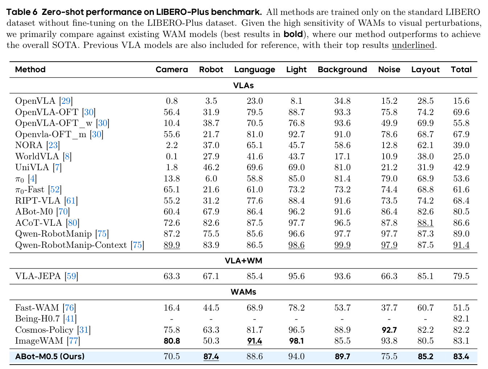

**Caption:** Robustness scores under camera, robot, language, lighting, background, noise, and layout shifts.

**Caption[CN]:** 在相机、机器人、语言、光照、背景、噪声和布局变化下的鲁棒性分数。

| Family | Method | Camera | Robot | Language | Light | Background | Noise | Layout | Total |
|---|---|---:|---:|---:|---:|---:|---:|---:|---:|
| VLA | OpenVLA | 0.8 | 3.5 | 23.0 | 8.1 | 34.8 | 15.2 | 28.5 | 15.6 |
| VLA | OpenVLA-OFT | 56.4 | 31.9 | 79.5 | 88.7 | 93.3 | 75.8 | 74.2 | 69.6 |
| VLA | OpenVLA-OFT_w | 10.4 | 38.7 | 70.5 | 76.8 | 93.6 | 49.9 | 69.9 | 55.8 |
| VLA | OpenVLA-OFT_m | 55.6 | 21.7 | 81.0 | 92.7 | 91.0 | 78.6 | 68.7 | 67.9 |
| VLA | NORA | 2.2 | 37.0 | 65.1 | 45.7 | 58.6 | 12.8 | 62.1 | 39.0 |
| VLA | WorldVLA | 0.1 | 27.9 | 41.6 | 43.7 | 17.1 | 10.9 | 38.0 | 25.0 |
| VLA | UniVLA | 1.8 | 46.2 | 69.6 | 69.0 | 81.0 | 21.2 | 31.9 | 42.9 |
| VLA | $\pi_0$ | 13.8 | 6.0 | 58.8 | 85.0 | 81.4 | 79.0 | 68.9 | 53.6 |
| VLA | $\pi_0$-Fast | 65.1 | 21.6 | 61.0 | 73.2 | 73.2 | 74.4 | 68.8 | 61.6 |
| VLA | RIPT-VLA | 55.2 | 31.2 | 77.6 | 88.4 | 91.6 | 73.5 | 74.2 | 68.4 |
| VLA | ABot-M0 | 60.4 | 67.9 | 86.4 | 96.2 | 91.6 | 86.4 | 82.6 | 80.5 |
| VLA | ACoT-VLA | 72.6 | 82.6 | 87.5 | 97.7 | 96.5 | 87.8 | 88.1 | 86.6 |
| VLA | Qwen-RobotManip | 87.2 | 75.5 | 85.6 | 96.6 | 97.7 | 97.7 | 87.3 | 89.0 |
| VLA | Qwen-RobotManip-Context | 89.9 | 83.9 | 86.5 | 98.6 | 99.9 | 97.9 | 87.5 | **91.4** |
| VLA+WM | VLA-JEPA | 63.3 | 67.1 | 85.4 | 95.6 | 93.6 | 66.3 | 85.1 | 79.5 |
| WAM | Fast-WAM | 16.4 | 44.5 | 68.9 | 78.2 | 53.7 | 37.7 | 60.7 | 51.5 |
| WAM | Being-H0.7 | — | — | — | — | — | — | — | 82.1 |
| WAM | Cosmos-Policy | 75.8 | 63.3 | 81.7 | 96.5 | 88.9 | 92.7 | 82.2 | 82.2 |
| WAM | ImageWAM | 80.8 | 50.3 | 91.4 | 98.1 | 85.5 | 93.8 | 80.5 | 83.1 |
| WAM | ABot-M0.5 | 70.5 | **87.4** | 88.6 | 94.0 | 89.7 | 75.5 | 85.2 | **83.4** |

### 5.4 Ablation Studies

> <strong>Para. 1:</strong> The latent-action ablation improves from 87.60 without the staged bridge to 94.00 with the three-stage separate design and zero latent-action dropout. The two-stage and channel-concatenation variants reach about 91%. A dropout probability of 0.2 reduces the three-stage model to 91.06, suggesting that randomly removing the latent bridge recreates a train–test mismatch.

> <strong>Para. 1[CN]:</strong> 潜在动作消融中，不使用分阶段桥接的基线为 87.60；采用三阶段独立设计且潜在动作 dropout 为 0 时提升到 94.00。两阶段和通道拼接变体约为 91%。把三阶段模型的 dropout 概率设为 0.2 会降到 91.06，说明随机移除潜在桥梁可能重新引入训练—测试错配。

### Table 7. Latent-action design ablation

**Caption:** Ablation of latent-action staging, fusion, and dropout.

**Caption[CN]:** 潜在动作分阶段方式、融合方式与 dropout 的消融。

| Design | Dropout | Score |
|---|---:|---:|
| Baseline | — | 87.60 |
| 2-Stage Separate | — | 90.86 |
| 2-Stage Channel Concat | — | 91.06 |
| 3-Stage Separate | 0.2 | 91.06 |
| 3-Stage Separate | 0 | **94.00** |

> <strong>Para. 2:</strong> The D-MoT ablation raises the reported score from 0.34 for the coupled formulation to 0.48 for the decoupled formulation, and the learning curve indicates faster convergence. The paper attributes this to reducing interference between mobility and manipulation distributions.

> <strong>Para. 2[CN]:</strong> D-MoT 消融中，耦合形式的分数为 0.34，解耦形式提升到 0.48，学习曲线也显示收敛更快。论文把这一结果归因于移动与操作动作分布之间的干扰得到缓解。

> <strong>Para. 3:</strong> Extending ordinary Stage-I teacher-forced training by 5k steps decreases the score from 67.55 to 66.78, while 10k extra steps reaches 68.90. Resuming the same Stage-I checkpoint with 5k Dream-Forcing steps reaches 70.56, supporting the claim that the gain is not merely due to more optimization steps.

> <strong>Para. 3[CN]:</strong> 在普通阶段 I 教师强制训练后继续训练 5k 步，分数从 67.55 降至 66.78；继续 10k 步则达到 68.90。若从同一阶段 I 检查点继续进行 5k 步 Dream Forcing，则达到 70.56，这说明收益并不只是来自更多优化步数。

### Table 8. Dream Forcing ablation

**Caption:** Comparison of additional teacher-forced training and Stage-II Dream Forcing.

**Caption[CN]:** 额外教师强制训练与阶段 II Dream Forcing 的对比。

| Training | Total steps | Score |
|---|---:|---:|
| SFT1 Base | 50k | 67.55 |
| SFT1 + 5k | 55k | 66.78 |
| SFT1 + 10k | 60k | 68.90 |
| SFT2 + Dream Forcing 5k | 55k | **70.56** |

> <strong>Para. 4:</strong> World-model pretraining is evaluated on RoboCasa365 Target10, containing 16 tasks with 50 trajectories per task. The pretrained model reaches 49.0, while direct fine-tuning from Wan2.2 reaches 17.8, a gain of 31.2 points.

> <strong>Para. 4[CN]:</strong> 世界模型预训练在 RoboCasa365 Target10 上评估，该设置包含 16 个任务，每个任务 50 条轨迹。经过预训练的模型达到 49.0，而从 Wan2.2 直接微调仅为 17.8，差值为 31.2 个百分点。

### Figure 11. Effect of world-model pretraining

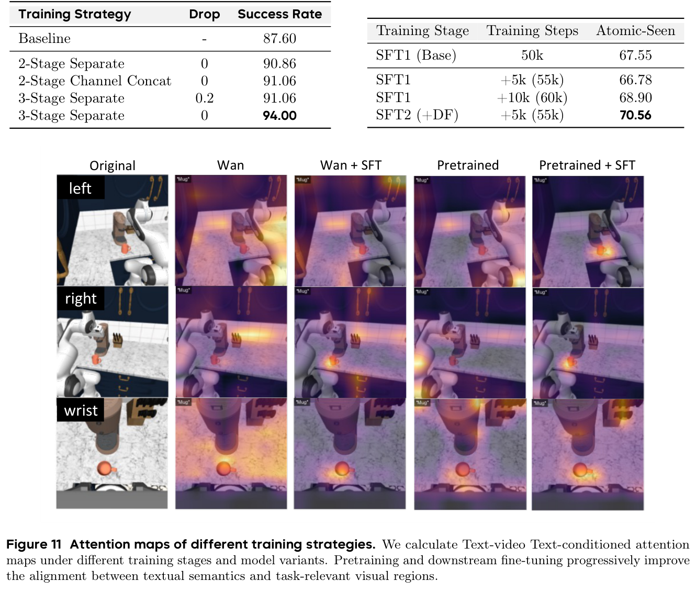

**Caption:** Attention visualization and Target10 comparison illustrating the benefit of robot-video world-model pretraining.

**Caption[CN]:** 注意力可视化与 Target10 对比，说明机器人视频世界模型预训练带来的收益。

### 5.5 Real-World Experiments

> <strong>Para. 1:</strong> Real-world evaluation uses an Agilex Piper single-arm platform with a 6-DoF arm. Each task provides 50 demonstrations. ABot-M0.5 is compared with $\pi_{0.5}$ and Fast-WAM on one fine-grained peg task and four long-horizon tasks: Organize Plate, Arrange Fruits, Cup Stacking, and Arrange Flower.

> <strong>Para. 1[CN]:</strong> 真实世界评测使用搭载六自由度机械臂的 Agilex Piper 单臂平台，每个任务提供 50 条示范。ABot-M0.5 与 $\pi_{0.5}$、Fast-WAM 在一个精细插柱任务和四个长时程任务上比较：Organize Plate、Arrange Fruits、Cup Stacking 和 Arrange Flower。

> <strong>Para. 2:</strong> ABot-M0.5 obtains success rates of 70%, 70%, 80%, 80%, and 60% across Peg, Plate, Fruits, Cup, and Flower. The corresponding process scores are 96, 90, 90, 90, and 88. It outperforms both baselines on every reported task and metric.

> <strong>Para. 2[CN]:</strong> ABot-M0.5 在 Peg、Plate、Fruits、Cup 和 Flower 上的成功率依次为 70%、70%、80%、80% 和 60%，过程分数依次为 96、90、90、90 和 88；在所有报告任务与指标上均高于两个基线。

### Figure 12. Real-robot quantitative results

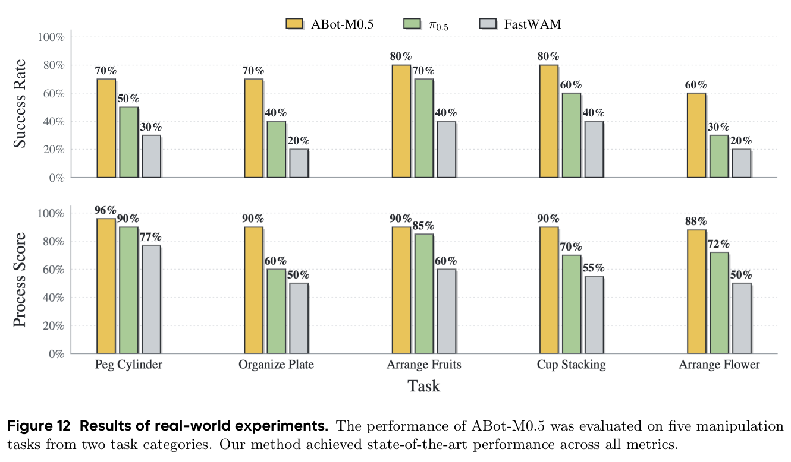

**Caption:** Success rate and process score for ABot-M0.5, $\pi_{0.5}$, and Fast-WAM on five real-robot tasks.

**Caption[CN]:** ABot-M0.5、$\pi_{0.5}$ 与 Fast-WAM 在五个真实机器人任务上的成功率和过程分数。

| Task | Metric | ABot-M0.5 | $\pi_{0.5}$ | Fast-WAM |
|---|---|---:|---:|---:|
| Peg | Success rate | 70 | 50 | 30 |
| Plate | Success rate | 70 | 40 | 20 |
| Fruits | Success rate | 80 | 70 | 40 |
| Cup | Success rate | 80 | 60 | 40 |
| Flower | Success rate | 60 | 30 | 20 |
| Peg | Process score | 96 | 90 | 77 |
| Plate | Process score | 90 | 60 | 50 |
| Fruits | Process score | 90 | 85 | 60 |
| Cup | Process score | 90 | 70 | 55 |
| Flower | Process score | 88 | 72 | 50 |

### Figure 13. Real-robot rollout sequences

**Caption:** Real-robot execution sequences for precise contact and long-horizon rearrangement tasks.

**Caption[CN]:** 精确接触与长时程重排任务的真实机器人执行序列。

> <strong>Para. 3:</strong> The qualitative sequences show that the model can maintain a multi-step plan and recover local control after intermediate contacts. The evidence is encouraging but is limited to a single-arm tabletop platform; it does not directly demonstrate deployment on a moving mobile base.

> <strong>Para. 3[CN]:</strong> 定性序列表明，模型能够维持多步计划，并在中间接触后恢复局部控制。不过，这些证据来自单臂桌面平台；它们并不能直接证明模型已经在真实移动底盘上完成部署。

## 6 Conclusion and Future Work

> <strong>Para. 1:</strong> ABot-M0.5 presents a unified World Action Model for mobility and manipulation. Its central design is the alignment of temporal abstraction, heterogeneous action structure, and autoregressive training conditions through intermediate latent actions, D-MoT, and Dream Forcing.

> <strong>Para. 1[CN]:</strong> ABot-M0.5 提出面向移动与操作的统一世界—动作模型。其核心设计是通过中间潜在动作、D-MoT 和 Dream Forcing，分别对齐时间抽象、异质动作结构以及自回归训练条件。

> <strong>Para. 2:</strong> The authors identify broader real-world data, scaling laws, stronger memory, faster inference, and edge deployment as future directions. These are important because the present model is large, the real-robot evaluation is narrow, and long-horizon deployment will require both memory and computational efficiency.

> <strong>Para. 2[CN]:</strong> 作者把更广泛的真实世界数据、缩放规律、更强记忆机制、更快推理和端侧部署列为未来方向。这些问题很关键：当前模型规模较大，真实机器人评测范围较窄，而长时程部署同时需要记忆能力和计算效率。

## 7 Contributions

> <strong>Para. 1:</strong> **Data Collection & Standardization:** Yandan Yang, Ronghan Chen, Yuzhi Chen, Haoyun Liu, Dekang Qi. **Model & Training:** Ronghan Chen, Zuojin Tang, Tong Lin, Yandan Yang. **Post-Training & Evaluation:** Zuojin Tang, Tianlun Li, Haoning Wu, Ronghan Chen, Tong Lin, Mingxin Wang, Bin Hu. **Real-Robot:** Dongjie Huo, Lulu Zheng, Botai Yuan.

> <strong>Para. 1[CN]:</strong> **数据收集与标准化：** Yandan Yang、Ronghan Chen、Yuzhi Chen、Haoyun Liu、Dekang Qi。**模型与训练：** Ronghan Chen、Zuojin Tang、Tong Lin、Yandan Yang。**后训练与评估：** Zuojin Tang、Tianlun Li、Haoning Wu、Ronghan Chen、Tong Lin、Mingxin Wang、Bin Hu。**真实机器人：** Dongjie Huo、Lulu Zheng、Botai Yuan。

> <strong>Para. 2:</strong> **Writing:** Yandan Yang, Ronghan Chen, Zuojin Tang, Dekang Qi, Haoyun Liu. **Challenge:** Yanqing Zhu, Wei Mei, Yuze Xuan, Haolong Yang, Dongjie Huo. **Project Lead:** Xinyuan Chang. **Advisors:** Mu Xu and Zhiheng Ma.

> <strong>Para. 2[CN]:</strong> **论文写作：** Yandan Yang、Ronghan Chen、Zuojin Tang、Dekang Qi、Haoyun Liu。**挑战赛：** Yanqing Zhu、Wei Mei、Yuze Xuan、Haolong Yang、Dongjie Huo。**项目负责人：** Xinyuan Chang。**顾问：** Mu Xu、Zhiheng Ma。

## Acknowledgments

> <strong>Para. 1:</strong> The authors thank Jian Zhang, Ziqiao Li, and Chunlong Lv for resource support; Zheng Wu, Zheng Zhang, Dazhi Zhang, Zhiming Sun, and Hongyu Pan for data collection and processing; and Xuan Zhou and Yufeng Wang for hardware support. The corresponding author is Mu Xu (`xumu.xm@alibaba-inc.com`), and Yanqing Zhu is the lead for the challenge submission.

> <strong>Para. 1[CN]:</strong> 作者感谢 Jian Zhang、Ziqiao Li、Chunlong Lv 提供资源支持，感谢 Zheng Wu、Zheng Zhang、Dazhi Zhang、Zhiming Sun、Hongyu Pan 参与数据收集与处理，并感谢 Xuan Zhou、Yufeng Wang 提供硬件支持。通讯作者为 Mu Xu（`xumu.xm@alibaba-inc.com`），Yanqing Zhu 负责挑战赛提交。

## References

> [!info] Reference policy
> The bibliography is retained in its original English form so that author names, titles, venues, DOI/arXiv identifiers, and URLs remain directly searchable. No substantive appendix follows the references in the supplied PDF.

1. AgiBot-World-Contributors et al. “AgiBot World Colosseo: A Large-Scale Manipulation Platform for Scalable and Intelligent Embodied Systems.” arXiv:2503.06669, 2025.
2. Bengio, S., Vinyals, O., Jaitly, N., and Shazeer, N. “Scheduled Sampling for Sequence Prediction with Recurrent Neural Networks.” arXiv:1506.03099, 2015.
3. Bi, H. et al. “Motus: A Unified Latent Action World Model.” arXiv:2512.13030, 2025.
4. Black, K. et al. “$\pi_0$: A Vision-Language-Action Flow Model for General Robot Control.” arXiv:2410.24164, 2024.
5. Brohan, A. et al. “RT-2: Vision-Language-Action Models Transfer Web Knowledge to Robotic Control.” arXiv:2307.15818, 2023.
6. Brohan, A. et al. “RT-1: Robotics Transformer for Real-World Control at Scale.” arXiv:2212.06817, 2023.
7. Bu, Q. et al. “UniVLA: Learning to Act Anywhere with Task-Centric Latent Actions.” RSS, 2025.
8. Cen, J. et al. “WorldVLA: Towards Autoregressive Action World Model.” arXiv:2506.21539, 2025.
9. Chen, T. et al. “RoboTwin 2.0: A Scalable Data Generator and Benchmark with Strong Domain Randomization for Robust Bimanual Robotic Manipulation.” arXiv:2506.18088, 2025.
10. Chi, C. et al. “Diffusion Policy: Visuomotor Policy Learning via Action Diffusion.” *The International Journal of Robotics Research* 44(10–11):1684–1704, 2025.
11. Open X-Embodiment Collaboration. “Open X-Embodiment: Robotic Learning Datasets and RT-X Models.” arXiv:2310.08864, 2023.
12. InternVLA-M1 Contributors. “InternVLA-M1: A Spatially Guided Vision-Language-Action Framework for Generalist Robot Policy.” arXiv:2510.13778, 2025.
13. Cui, J. et al. “Self-Forcing++: Towards Minute-Scale High-Quality Video Generation.” arXiv:2510.02283, 2025.
14. Dao, T. et al. “FlashAttention: Fast and Memory-Efficient Exact Attention with IO-Awareness.” arXiv:2205.14135, 2022.
15. Dasari, S. et al. “RoboNet: Large-Scale Multi-Robot Learning.” arXiv:1910.11215, 2020.
16. Fei, S. et al. “LIBERO-Plus: In-Depth Robustness Analysis of Vision-Language-Action Models.” arXiv:2510.13626, 2025.
17. Feng, Y. et al. “Vidar: Embodied Video Diffusion Model for Generalist Manipulation.” arXiv:2507.12898, 2025.
18. Galaxea Team. “Galaxea G0.5 Technical Report.” 2026.
19. Guo, X. et al. “PriorVLA: Prior-Preserving Adaptation for Vision-Language-Action Models.” arXiv:2605.10925, 2026.
20. Ha, D. and Schmidhuber, J. “World Models.” arXiv:1803.10122, 2018.
21. Hafner, D. et al. “Mastering Diverse Domains through World Models.” arXiv:2301.04104, 2024.
22. Huang, X. et al. “Self Forcing: Bridging the Train-Test Gap in Autoregressive Video Diffusion.” *NeurIPS* 38:167283–167308, 2026.
23. Hung, C.-Y. et al. “NORA: A Small Open-Sourced Generalist Vision Language Action Model for Embodied Tasks.” arXiv:2504.19854, 2025.
24. Huo, D. et al. “ABot-Claw: A Foundation for Persistent, Cooperative, and Self-Evolving Robotic Agents.” arXiv:2604.10096, 2026.
25. Ji, G. et al. “OXE-AugE: A Large-Scale Robot Augmentation of OXE for Scaling Cross-Embodiment Policy Learning.” arXiv:2512.13100, 2025.
26. Jiang, T. et al. “Galaxea Open-World Dataset and G0 Dual-System VLA Model.” arXiv:2509.00576, 2025.
27. Khazatsky, A. et al. “DROID: A Large-Scale In-the-Wild Robot Manipulation Dataset.” arXiv:2403.12945, 2025.
28. Kim, D. et al. “RLDX-1 Technical Report.” arXiv:2605.03269, 2026.
29. Kim, M. J. et al. “OpenVLA: An Open-Source Vision-Language-Action Model.” arXiv:2406.09246, 2024.
30. Kim, M. J., Finn, C., and Liang, P. “Fine-Tuning Vision-Language-Action Models: Optimizing Speed and Success.” RSS, 2025.
31. Kim, M. J. et al. “Cosmos Policy: Fine-Tuning Video Models for Visuomotor Control and Planning.” arXiv:2601.16163, 2026.
32. Li, C. et al. “BEHAVIOR-1K: A Human-Centered, Embodied AI Benchmark with 1,000 Everyday Activities and Realistic Simulation.” arXiv:2403.09227, 2024.
33. Li, L. et al. “Causal World Modeling for Robot Control.” arXiv:2601.21998, 2026.
34. Liang, A. et al. “CLAM: Continuous Latent Action Models for Robot Learning from Unlabeled Demonstrations.” arXiv:2505.04999, 2025.
35. Liang, Z. et al. “Discrete Diffusion VLA: Bringing Discrete Diffusion to Action Decoding in Vision-Language-Action Policies.” arXiv:2508.20072, 2025.
36. Lin, X. et al. “HoloBrain-0 Technical Report.” arXiv:2602.12062, 2026.
37. Lipman, Y. et al. “Flow Matching for Generative Modeling.” arXiv:2210.02747, 2023.
38. Liu, B. et al. “LIBERO: Benchmarking Knowledge Transfer for Lifelong Robot Learning.” arXiv:2306.03310, 2023.
39. Liu, K. et al. “Rolling Forcing: Autoregressive Long Video Diffusion in Real Time.” arXiv:2509.25161, 2025.
40. Luo, H. et al. “Being-H0.5: Scaling Human-Centric Robot Learning for Cross-Embodiment Generalization.” arXiv:2601.12993, 2026.
41. Luo, H. et al. “Being-H0.7: A Latent World-Action Model from Egocentric Videos.” arXiv:2605.00078, 2026.
42. Luo, Y. et al. “CORAL: Scalable Multi-Task Robot Learning via LoRA Experts.” arXiv:2603.09298, 2026.
43. Lv, Q. et al. “F1: A Vision-Language-Action Model Bridging Understanding and Generation to Actions.” arXiv:2509.06951, 2025.
44. Ma, Y. et al. “A Survey on Vision-Language-Action Models for Embodied AI.” *IEEE TNNLS*, 2026. DOI: 10.1109/TNNLS.2025.3650584.
45. Nasiriany, S. et al. “RoboCasa365: A Large-Scale Simulation Framework for Training and Benchmarking Generalist Robots.” arXiv:2603.04356, 2026.
46. Ning, M. et al. “Elucidating the Exposure Bias in Diffusion Models.” ICLR, 2024.
47. NVIDIA. “GR00T N1.5: An Improved Open Foundation Model for Generalist Humanoid Robots.” 2026.
48. NVIDIA. “GR00T N1.6: An Improved Open Foundation Model for Generalist Humanoid Robots.” 2026.
49. NVIDIA et al. “GR00T N1: An Open Foundation Model for Generalist Humanoid Robots.” arXiv:2503.14734, 2025.
50. Pai, J. et al. “mimic-video: Video-Action Models for Generalizable Robot Control beyond VLAs.” arXiv:2512.15692, 2025.
51. Peng, D. et al. “AttenA+: Rectifying Action Inequality in Robotic Foundation Models.” arXiv:2605.13548, 2026.
52. Pertsch, K. et al. “FAST: Efficient Action Tokenization for Vision-Language-Action Models.” arXiv:2501.09747, 2025.
53. Physical Intelligence et al. “$\pi_{0.5}$: A Vision-Language-Action Model with Open-World Generalization.” arXiv:2504.16054, 2025.
54. Physical Intelligence et al. “$\pi_{0.7}$: A Steerable Generalist Robotic Foundation Model with Emergent Capabilities.” arXiv:2604.15483, 2026.
55. Qu, D. et al. “SpatialVLA: Exploring Spatial Representations for Visual-Language-Action Model.” RSS, 2025.
56. Ross, S., Gordon, G. J., and Bagnell, J. A. “A Reduction of Imitation Learning and Structured Prediction to No-Regret Online Learning.” arXiv:1011.0686, 2011.
57. Schmidt, F. “Generalization in Generation: A Closer Look at Exposure Bias.” *Neural Generation and Translation Workshop*, 2019.
58. Shi, X. et al. “SaiVLA-0: Cerebrum–Pons–Cerebellum Tripartite Architecture for Compute-Aware Vision-Language-Action.” arXiv:2603.08124, 2026.
59. Sun, J. et al. “VLA-JEPA: Enhancing Vision-Language-Action Model with Latent World Model.” arXiv:2602.10098, 2026.
60. Szot, A. et al. “Habitat 2.0: Training Home Assistants to Rearrange Their Habitat.” arXiv:2106.14405, 2022.
61. Tan, S. et al. “Interactive Post-Training for Vision-Language-Action Models.” arXiv:2505.17016, 2025.
62. Tang, Z. et al. “ALAM: Algebraically Consistent Latent Action Model for Vision-Language-Action Models.” arXiv:2605.10819, 2026.
63. Tang, Z. et al. “One Token per Frame: Reconsidering Visual Bandwidth in World Models for VLA Policy.” arXiv:2605.07931, 2026.
64. Tian, Y. et al. “InternData-A1: Pioneering High-Fidelity Synthetic Data for Pre-Training Generalist Policy.” arXiv:2511.16651, 2025.
65. Walke, H. et al. “BridgeData V2: A Dataset for Robot Learning at Scale.” arXiv:2308.12952, 2024.
66. Wan Team et al. “Wan: Open and Advanced Large-Scale Video Generative Models.” arXiv:2503.20314, 2025.
67. Wang, Q. et al. “Qwen-VLA: Unifying Vision-Language-Action Modeling across Tasks, Environments, and Robot Embodiments.” arXiv:2605.30280, 2026.
68. Wu, K. et al. “RoboMind: Benchmark on Multi-Embodiment Intelligence Normative Data for Robot Manipulation.” arXiv:2412.13877, 2024.
69. Wu, S. et al. “RoboCOIN: An Open-Sourced Bimanual Robotic Data Collection for Integrated Manipulation.” arXiv:2511.17441, 2025.
70. Yang, Y. et al. “ABot-M0: VLA Foundation Model for Robotic Manipulation with Action Manifold Learning.” arXiv:2602.11236, 2026.
71. Ye, A. et al. “GigaWorld-Policy: An Efficient Action-Centered World–Action Model.” arXiv:2603.17240, 2026.
72. Ye, S. et al. “Latent Action Pretraining from Videos.” arXiv:2410.11758, 2025.
73. Ye, S. et al. “World Action Models Are Zero-Shot Policies.” arXiv:2602.15922, 2026.
74. Yenamandra, S. et al. “HomeRobot: Open-Vocabulary Mobile Manipulation.” arXiv:2306.11565, 2024.
75. Yuan, H. et al. “Qwen-RobotManip Technical Report: Alignment Unlocks Scale for Robotic Manipulation Foundation Models.” arXiv:2606.17846, 2026.
76. Yuan, T. et al. “Fast-WAM: Do World Action Models Need Test-Time Future Imagination?” arXiv:2603.16666, 2026.
77. Zhang, Y. et al. “ImageWAM: Do World Action Models Really Need Video Generation, or Just Image Editing?” arXiv:2606.19531, 2026.
78. Zhao, Q. et al. “CoT-VLA: Visual Chain-of-Thought Reasoning for Vision-Language-Action Models.” CVPR, 2025.
79. Zheng, J. et al. “X-VLA: Soft-Prompted Transformer as Scalable Cross-Embodiment Vision-Language-Action Model.” ICLR, 2025.
80. Zhong, L. et al. “ACoT-VLA: Action Chain-of-Thought for Vision-Language-Action Models.” CVPR, 2026.
81. Zhu, C. et al. “Unified World Models: Coupling Video and Action Diffusion for Pretraining on Large Robotic Datasets.” arXiv:2504.02792, 2025.
82. Zhu, H. et al. “Causal Forcing: Autoregressive Diffusion Distillation Done Right for High-Quality Real-Time Interactive Video Generation.” arXiv:2602.02214, 2026.

## Critical Reading Notes

- **真正的主线不是“更大的视频模型”，而是三种对齐。** 潜在动作解决时间粒度，D-MoT 解决动作分布冲突，Dream Forcing 解决自回归条件错配；三者分别对应清晰的失效模式。
- **最强证据来自组合而非单个 SOTA 数字。** RoboCasa365、RoboTwin、LIBERO、LIBERO-Plus 与真实机器人共同覆盖移动、双臂、桌面组合、分布偏移和长时程执行，使机制论证比只报一个饱和基准更完整。
- **需要谨慎解释 46.6%。** 该数值来自“ABot-M0.5 + Condensed Memory”，但正文没有给出足够完整的模块定义和独立消融；基础模型的对应平均值是 40.4%。
- **LIBERO-Plus 并非总体最优。** 83.4 是表中 WAM 分组的最高总分，而 Qwen-RobotManip-Context 的总体结果为 91.4。
- **真实实验没有真正验证移动底盘。** 使用的是 Agilex Piper 六自由度单臂桌面平台。论文对“统一移动—操作模型”的真实部署证据仍主要来自仿真移动任务。
- **复现信息仍不够完整。** 文中未清楚给出各模块参数量拆分、训练 GPU／时长、动作维度、控制频率、Dream Forcing 的额外计算成本，以及若干消融的重复次数和方差。
- **文本存在一个内部不一致。** 真实实验段落称有“三个多阶段任务”，但列举和图中实际包含 Plate、Fruits、Cup Stacking、Flower 四个长时程任务。
