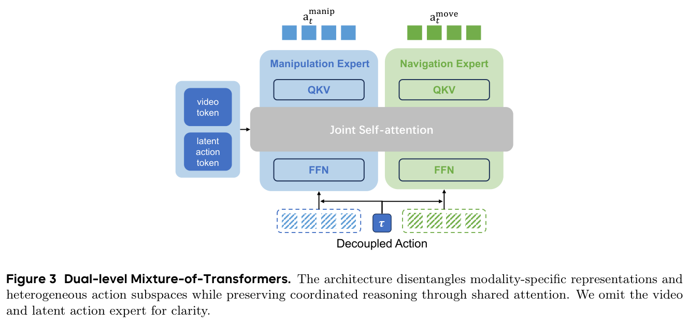
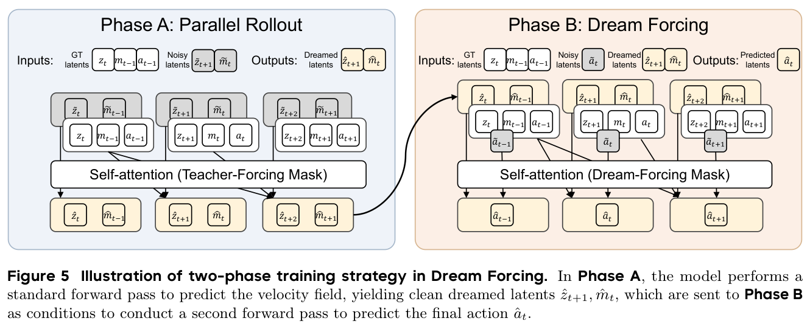
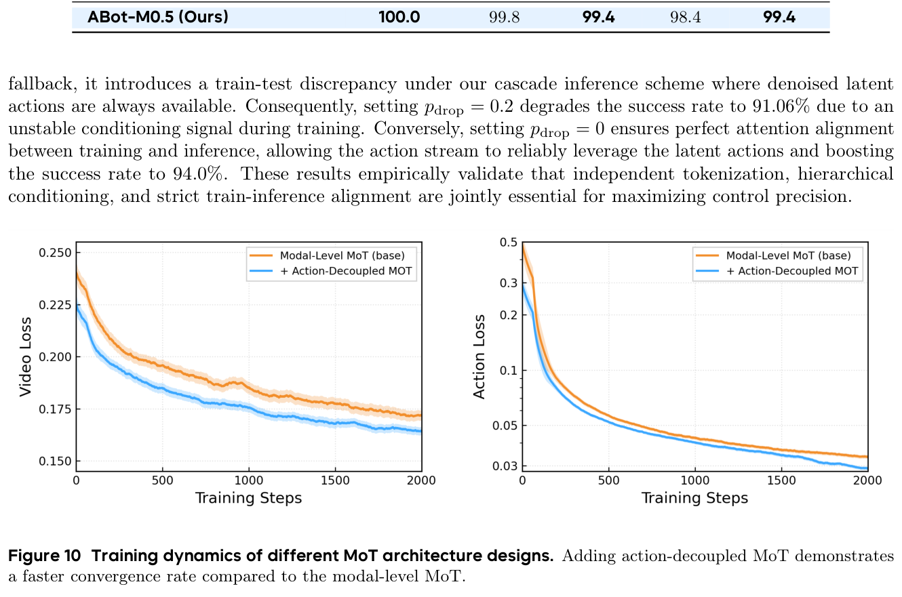
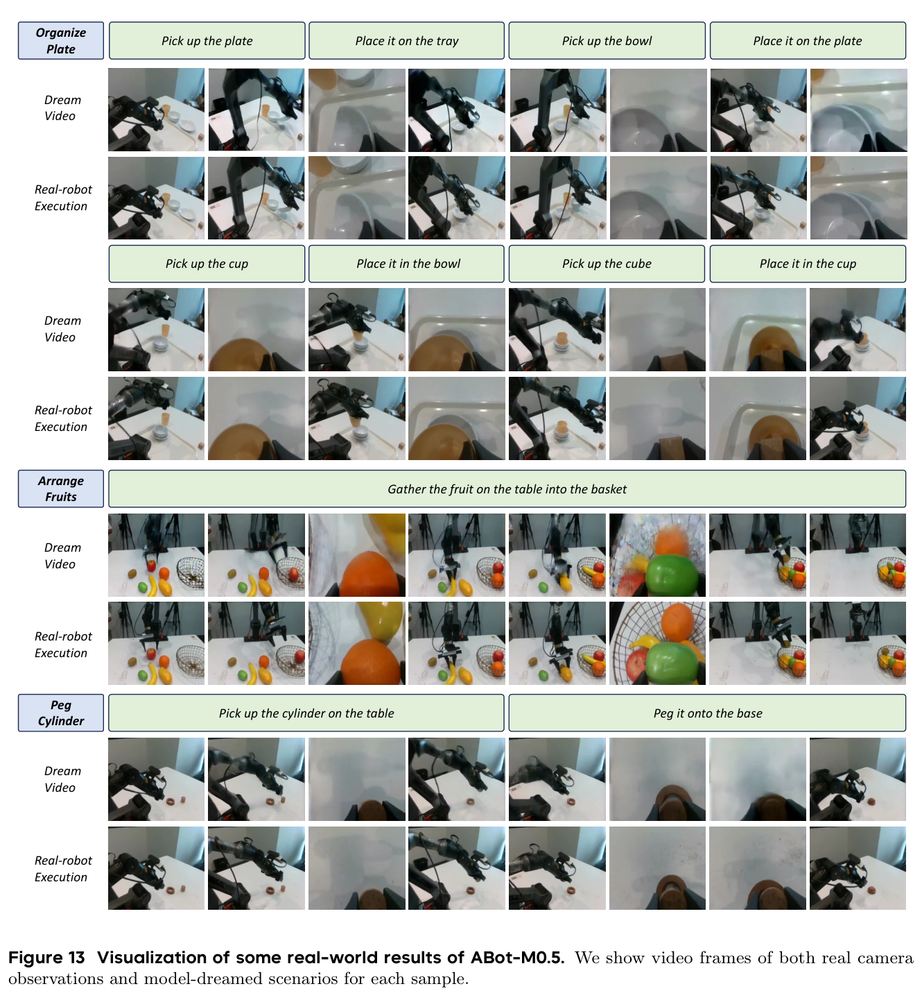

# ABot-M0.5: Unified Mobility-and-Manipulation World Action Model

## 核心信息

- 标题: ABot-M0.5: Unified Mobility-and-Manipulation World Action Model
- 标题翻译: ABot-M0.5：统一移动与操作的世界—动作模型
- 作者: Ronghan Chen, Yandan Yang, Zuojin Tang, Dongjie Huo, Tong Lin, Haoning Wu, Haoyun Liu, Yuzhi Chen, Lulu Zheng, Botai Yuan, Tianlun Li, Mingxin Wang, Dekang Qi, Bin Hu, Wei Mei, Yuze Xuan, Haolong Yang, Yanqing Zhu, Mu Xu, Zhiheng Ma, Xinyuan Chang
- 机构: AMAP CV Lab, Alibaba Group
- 发表时间: 2026-07-01；当前版本为 2026-07-06 发布的 arXiv v2
- 发表渠道: arXiv 预印本
- DOI: 10.48550/arXiv.2607.00678
- arXiv: 2607.00678
- 论文链接: https://arxiv.org/abs/2607.00678
- 代码 / 项目: https://github.com/amap-cvlab/ABot-Manipulation
- 数据 / 资源: Open X-Embodiment、OXE-AugE、AgiBot-Beta、RoboCOIN、RoboMind、Galaxea、InternData-A1、RoboNet、BridgeData V2、DROID
- 论文类型: 机器人世界—动作模型与具身策略方法

## 原文摘要翻译

移动操作是通用机器人的关键能力，但对当前具身学习方法仍然具有挑战。视觉—语言—动作策略通常是反应式的，缺乏显式世界建模；现有世界—动作模型与移动操作的结构也没有充分对齐：它们在粗粒度视频块上运行，建模相互纠缠的导航—操作动作，并在与自回归推理不匹配的监督条件下训练逆动力学。因此，这些方法经常错过细粒度接触动力学，遭遇动作分布冲突，并在长时程滚动预测中累积误差。

本文提出 ABot-M0.5，其基本认识是：移动操作需要在时间粒度、动作空间和训练—测试一致性三个层面完成对齐。为对齐时间粒度，作者引入中间潜在动作，用于捕获局部视觉状态转移，并在视频潜变量与具体机器人形态的控制量之间充当桥接动作空间。为对齐动作空间，作者设计双层 Transformer 混合架构，同时解耦模态表征和底盘移动、机械臂操作等异质动作子空间。为对齐推理条件，作者提出 Dream Forcing 训练策略，逐步在模型预测的视频上训练逆动力学，从而改善训练—测试一致性以及自回归预测时的鲁棒性。

在具有挑战性的移动操作和精细操作基准上，ABot-M0.5 在长时程任务成功率与细粒度控制精度方面取得领先结果。这些结果凸显了时间粒度对齐、动作解耦和推理一致的世界—动作建模的重要性。

## 创新点

1. **把“世界模型到动作”的跳跃改造成三级因果接口。** 方法不再让粗粒度视频块直接解释高频控制，而是显式采用“未来视频潜变量 $\rightarrow$ 帧级潜在动作 $\rightarrow$ 可执行动作”的级联。潜在动作由相邻图像状态转移提取，既比视频块细，又比某个机器人关节向量更接近跨形态运动语义。

2. **双层解耦不是简单的多头输出。** 第一层按照视频、潜在动作、控制动作拆分投影、时间嵌入、前馈网络和输出头；第二层再把移动与操作动作拆成专用专家，同时共享自注意力。它试图同时满足“参数不互相打架”和“底盘、机械臂仍需协同”这两个看似冲突的要求。

3. **Dream Forcing 直接攻击世界—动作模型特有的暴露偏差。** 常规逆动力学训练看到真实未来状态，部署时却接收世界模型自己生成的未来。本文先让模型产生短期“梦境”视频和潜在动作，再进行第二次前向传播训练动作头，使逆动力学真正适应上游模型的结构化误差，而不是只适应独立高斯噪声。

4. **把移动、双臂、桌面组合、鲁棒性和真实机器人放进一套评估。** 这不能自动证明通用性，但比只在单一饱和基准上报分更能检验三级对齐是否具有跨任务价值。

## 一句话总结

ABot-M0.5 的真正贡献不是“再做一个会生成视频的机器人策略”，而是把世界预测与控制之间的三类错配逐一结构化：潜在动作对齐时间粒度，双层 MoT 对齐异质动作分布，Dream Forcing 对齐训练与自回归推理条件。


*图 1：三级对齐、三级生成链、三阶段训练与主要评测结果的整体概览。*

图 1 把论文的逻辑压缩得很清楚：三类失配分别对应三个模块，训练则依次经历世界模型预训练、真实条件监督微调和梦境条件微调。我的判断是，这种“问题—模块”一一对应关系比单独的结果数字更值得保留。

## 研究问题

### 为什么已有 VLA 与 WAM 都不够

VLA 的优势是直接、反应快，但它并不显式回答“动作之后世界会变成什么样”。因此，当任务需要跨房间移动、维持长时程意图、处理遮挡与接触时，仅靠当前观测到动作的映射容易缺少可检查的未来状态。

WAM 虽然补上了未来想象，却通常沿用视频生成的块级表示。这里出现第一个问题：一段压缩视频可能覆盖多个控制帧和多个接触事件，逆动力学却要从这段粗信息恢复精细控制，映射天然存在一对多或信息丢失。第二个问题是动作结构：移动底盘与机械臂关节在数值尺度、物理语义和时序特性上不同，统一动作头会让不同分布共享同一套变换。第三个问题最隐蔽：训练时逆动力学看到真实未来，推理时看到模型生成未来；上游小误差会改变下游输入分布，并在长时程滚动中不断放大。


*图 4：教师强制、扩散式扰动与 Dream Forcing 的训练—推理条件对比。*

图 4 区分了三种训练逻辑：

- 教师强制使用真实未来，输入最干净，但与部署差距最大；
- 扩散式扰动对真实未来独立加噪，能增加难度，却不一定复现模型滚动时有方向、有相关性的错误；
- Dream Forcing 让当前模型自己产生未来，再用这个未来训练动作，因此输入误差更接近真实推理轨迹。

### 论文试图验证的因果链

这篇文章实际提出了三条可检验假设：

1. 若在视频与动作之间加入帧级运动接口，控制精度与长时程成功率应提高。
2. 若把移动和操作解耦为不同专家，同时保留共享注意力，学习应更快、最终性能应更好。
3. 若动作头在自生成未来上训练，相同步数下应优于继续做教师强制训练。

实验基本覆盖了三条假设，但证据强度不同。潜在动作有结构消融和预训练迁移结果；动作解耦有分数与训练曲线；Dream Forcing 有等步数对照，但只在一个设置上报告，缺少方差与额外成本。

## 数据与任务定义

### 输入、输出与动作层级

在时间步 $t$，输入为多相机观测

$$
o_t=\{I_t^{(1)},\ldots,I_t^{(N_c)}\},
$$

以及语言指令 $l$、历史观测和过去动作。普通策略直接预测长度为 $H$ 的动作块：

$$
a_{t:t+H-1}\sim\pi(\cdot\mid o_{\le t},a_{<t},l).
$$

ABot-M0.5 同时生成未来视觉潜变量 $z_{t+1}$、帧级潜在动作 $m_t$ 和可执行动作 $a_t$。动作进一步分为移动分支 $a_t^{\mathrm{move}}$ 与操作分支 $a_t^{\mathrm{manip}}$。这个定义允许同一框架容纳底盘、单臂、双臂、手和足式控制，但具体数据集未必包含全部形态。

### 预训练数据的作用分工

数据混合覆盖十个机器人数据集，具体名单见“核心信息”。这里不能只看数据名称，关键是三种监督来源：

- 机器人视频为世界模型提供可交互环境中的视觉变化；
- 有动作标注的轨迹把视觉变化对齐到具体控制量；
- 无动作视频仍可用于潜在动作学习，因为 $m_t$ 来自相邻帧状态转移。

Galaxea 数据包含底盘移动，是“移动与操作统一”中较关键的数据来源。论文没有给出每个数据源的样本占比、清洗规则和采样权重，这会直接影响复现时不同形态之间的平衡。

### 评测覆盖

| 基准 | 主要能力 | 论文使用的信号 |
|---|---|---|
| RoboCasa365 | 移动操作、组合任务、已见与未见组合 | 成功率；预训练任务、Target100、Target10 |
| RoboTwin 2.0 | 双臂协同与域随机化 | Easy、Hard 成功率 |
| LIBERO | 空间、物体、目标、长时程桌面操作 | 四套任务成功率 |
| LIBERO-Plus | 相机、机器人、语言、光照、背景、噪声、布局变化 | 七类扰动与总分 |
| 真实机器人 | 精细插接与多阶段物体整理 | 成功率、过程分数 |


*图 8：RoboCasa365 中移动阶段与操作阶段交替出现的定性轨迹。*

图 8 值得看的是任务阶段交替：模型并非一直“导航”或一直“操作”，而是需要在接近目标、交互、再次移动和继续交互之间切换。这样的轨迹正好对应动作解耦模块的动机。

## 方法主线

### 机制流程

1. **输入与世界预测。** 把多视角历史、语言指令和过去动作编码为上下文，用 Wan2.2 骨干与 3D VAE 预测下一段视觉潜变量 $z_{t+1}$；输出进入潜在动作分支，而不是直接映射到机器人控制。

2. **视觉转移压缩为潜在动作。** 冻结的 ALAM 编码器从相邻图像提取 $m_t=E_m(I_t,I_{t+1})$，联合模型学习由未来视觉潜变量预测同一潜在动作。输出是帧级、相对形态无关的运动意图。

3. **双层动作解码。** 模态级 MoT 分离视频、潜在动作和动作计算；动作级 MoT 再把移动与操作分支拆开。两条动作分支通过共享自注意力交换信息，分别由专用前馈网络和输出头生成。

4. **梦境条件校准。** 第一阶段用真实未来训练完整级联；第二阶段先用少步去噪生成 $\hat z_{t+1}$ 与 $\hat m_t$，再进行第二次前向传播，仅把动作损失改为以梦境变量为条件，使逆动力学适应部署时的上游误差。


*图 2：未来视频、帧级潜在动作与可执行动作组成的非对称三级架构。*

### 中间潜在动作：为什么不是多余的一层

核心级联为

$$
z_{t+1}\rightarrow m_t\rightarrow a_t.
$$

潜在动作的价值来自“粒度居中”。视频潜变量包含外观、背景、相机视角和物体状态等大量信息，动作向量则高度依赖机器人形态。$m_t$ 只编码局部视觉状态变化，理论上把两端的复杂性分开：世界模型回答“发生了什么变化”，动作头回答“当前机器人怎样实现这种变化”。

潜在动作通过条件流匹配学习：

$$
\mathcal{L}_m=
\mathbb{E}\left[
\left\|
v_\theta^m(m_t^\tau;z_{\le t+1},m_{<t},a_{<t},\tau,l)
-(m_t-\epsilon)
\right\|_2^2
\right].
$$

这不是纯粹的中间特征，因为它有独立的离线教师。ALAM 编码器用三帧转移建立加法与反向一致性：

$$
\mathcal{L}_{\mathrm{add}}=
\left\|m_i^k-(m_i^j+m_j^k)\right\|_2^2,
\qquad
\mathcal{L}_{\mathrm{rev}}=
\left\|m_i^j+m_j^i\right\|_2^2.
$$

加法约束要求长转移与短转移组合一致，反向约束要求往返变化相互抵消。它们为潜在空间注入一种近似运动代数结构，但论文没有证明该空间在不同机器人之间严格同构，因此“跨形态动作空间”应理解为经验上的共享接口，而不是形式化保证。

### 双层 MoT：专门化与协同如何兼得


*图 3：共享自注意力负责跨分支协同，专用前馈网络负责动作分布适配。*

第一层是模态解耦：视频、潜在动作和控制动作各自拥有输入映射、扩散时间嵌入、前馈网络和输出头。第二层是动作解耦：移动与操作分支各自有专家前馈网络和输出头，但共享联合自注意力。

这种结构的关键不是“多放几个专家”，而是把共享位置放在注意力、把专用位置放在非线性变换。共享注意力负责回答“底盘和机械臂现在需要怎样协调”，专用前馈网络负责适配不同动作分布。若完全分离，两者难以协调；若全部共享，移动动作的大尺度变化和机械臂的精细变化会争夺同一表示容量。

动作损失写为

$$
\mathcal{L}_a=
\lambda_{\mathrm{move}}\mathcal{L}_{\mathrm{move}}
+\lambda_{\mathrm{manip}}\mathcal{L}_{\mathrm{manip}}.
$$

两条分支在同一扩散时间加噪，并互相观察对方的加噪动作。这使“解耦”不是统计独立，而是参数专用、上下文联合。

### 非对称注意力：阻止目标泄漏

模型同时处理 $[X^z_{t+1},X^m_t,X^a_t]$ 三种令牌。视频预测不能读取当前潜在动作和动作目标，否则训练时可能通过下游监督泄漏答案；潜在动作可以读取未来视频，动作可以读取视频和潜在动作。这个掩码把计算图强制成与推理顺序一致的上游到下游级联。

作者使用变长 FlashAttention 打包非对称掩码中的稠密子问题，相比其 FlexAttention 基线报告约五倍的前向—反向加速。这个数字说明工程实现有价值，但论文没有提供端到端吞吐、显存、硬件型号与序列长度，不能直接外推到完整训练成本。

### Dream Forcing：两次前向换取条件一致


*图 5：先生成短期梦境变量，再以梦境条件监督动作预测的两阶段前向。*

阶段 I 的动作条件是

$$
p_a(\cdot\mid z_{\le t+1},m_{\le t},a_{<t},l),
$$

阶段 II 改为

$$
p_a(\cdot\mid
\hat z_{t+1},z_{\le t},\hat m_t,m_{<t},a_{<t},l).
$$

这里的设计很克制：Dream Forcing 不让整个世界模型在自己的错误上自由漂移，而是继续用真实数据监督 $z$ 与 $m$，只让动作头接受梦境条件。这样既暴露逆动力学于真实推理误差，又避免世界模型因自训练而快速退化。

代价也很明确：一次更新至少包含生成梦境的少步去噪和第二次动作前向。论文没有量化额外训练时间、显存或采样步数敏感性，所以方法收益明确，成本边界却不完整。

### 渐进训练为何必要

训练顺序是：

1. 全参数预训练 5B Wan2.2 世界模型。
2. 单独预训练并冻结 ALAM 编码器。
3. 在真实未来条件下联合训练视频、潜在动作与动作。
4. 从阶段 III 的检查点继续 Dream Forcing。

这是一种典型的“先建立可生成表征，再建立控制接口，最后校准闭环分布”的课程学习。若从头同时优化，世界视频、潜在动作和控制动作三类扩散目标可能相互拖拽；若过早使用梦境条件，上游预测尚不可靠，动作头学到的只是如何适应随机坏输入。

## 关键结果

### 移动操作主结果

RoboCasa365 是论文最能支持“移动—操作统一”叙事的基准。

| 设置 | 代表性基线 | 基线平均成功率 | ABot-M0.5 | 差值 |
|---|---|---:|---:|---:|
| Pretrain | Qwen-RobotManip | 35.9 | 40.4 | +4.5 |
| Pretrain + Condensed Memory | Qwen-RobotManip | 35.9 | 46.6 | +10.7 |
| Target100 | Lingbot-VA | 45.1 | 54.2 | +9.1 |
| Target10 | GR00T | 21.0 | 30.1 | +9.1 |

基础模型是 40.4%，46.6% 属于额外加入“压缩记忆”的版本。论文没有充分定义该记忆模块，因此最稳妥的主模型比较应使用 40.4%，把 46.6% 视为增强版本结果。Target100 与 Target10 的同幅度提升更能说明预训练与结构在低数据目标任务上有迁移价值。

### 操作基准与鲁棒性

| 基准 | ABot-M0.5 | 强竞争结果 | 应如何解释 |
|---|---:|---:|---|
| RoboTwin Easy / Hard / Avg. | 94.00 / 94.20 / 94.10 | Qwen-RobotManip Avg. 93.85 | 小幅领先，支持双臂适配 |
| LIBERO 四个子集 | 100.0 / 99.8 / 99.4 / 98.4 | CORAL 99.3 | 平均 99.4，基准接近饱和 |
| LIBERO-Plus Total | 83.4 | Qwen-RobotManip-Context 91.4 | WAM 分组最佳，不是总体最佳 |

LIBERO 的 99.4 很亮眼，但区分度有限；更有信息量的是 LIBERO-Plus。ABot-M0.5 在机器人变化上达到 87.4，在布局变化上为 85.2，说明动作解耦和视觉转移接口对部分分布变化有帮助；但相机变化只有 70.5，噪声变化只有 75.5，且总体落后于强 VLA+Context 方法。世界想象并没有自动解决视觉鲁棒性。

### 三个关键消融

| 机制 | 对照 | 最佳设置 | 变化 |
|---|---:|---:|---:|
| 潜在动作结构 | Baseline 87.60 | 3-Stage Separate、dropout 0：94.00 | +6.40 |
| 动作解耦 | Coupled 0.34 | D-MoT 0.48 | +0.14 |
| Dream Forcing | SFT1 Base 67.55 | SFT2 + DF 5k：70.56 | +3.01 |
| 世界模型预训练 | Wan2.2 直接微调 17.8 | 机器人视频预训练 49.0 | +31.2 |

潜在动作消融中，两阶段独立为 90.86，通道拼接为 91.06，三阶段独立但 dropout 为 0.2 也是 91.06，只有不随机丢弃潜在动作时达到 94.00。这个结果表明 $m_t$ 不是可有可无的辅助特征；训练时偶尔移除它，推理时却始终依赖它，会引入新的条件错配。


*图 10：动作解耦前后的训练损失与收敛动态。*

图 10 不只给出最终 0.34 到 0.48，还显示动作解耦后的训练动态更快。它支持“减少分布干扰”的解释，但论文未说明该消融覆盖多少任务、是否多次运行、误差条如何计算，因此不宜把 0.14 当成高精度稳定估计。

Dream Forcing 的对照更有针对性：

| 训练方式 | 总步数 | 分数 |
|---|---:|---:|
| SFT1 Base | 50k | 67.55 |
| SFT1 再训练 5k | 55k | 66.78 |
| SFT1 再训练 10k | 60k | 68.90 |
| SFT2 + Dream Forcing 5k | 55k | 70.56 |

相同步数下，Dream Forcing 比继续教师强制高 3.78；即使教师强制多训练到 60k，也仍低 1.66。这是论文中最干净的机制证据之一。不过它只验证了单个训练点，没有梦境去噪步数、梦境质量、冻结策略等更细消融。

### 真实机器人结果


*图 12：五项真实机器人任务上的成功率与过程分数。*

真实平台为 Agilex Piper 六自由度单臂，每个任务 50 条示范。

| 任务 | ABot 成功率 | $\pi_{0.5}$ | Fast-WAM | ABot 过程分 |
|---|---:|---:|---:|---:|
| Peg | 70 | 50 | 30 | 96 |
| Plate | 70 | 40 | 20 | 90 |
| Fruits | 80 | 70 | 40 | 90 |
| Cup | 80 | 60 | 40 | 90 |
| Flower | 60 | 30 | 20 | 88 |

ABot-M0.5 在五项任务上都领先，尤其在 Plate、Cup 与 Flower 这类多阶段任务上优势明显。过程分普遍高于成功率，说明模型常能完成大部分阶段但会在最后的精细接触或摆放上失败。这个指标比单一二值成功率更能暴露长时程策略的失败位置。


*图 13：真实观测、模型预测未来与最终执行动作的时序对应。*

图 13 把真实观测、模型生成未来与最终动作序列放在一起，说明“想象”确实进入了控制链，而不只是训练时辅助损失。不过真实实验全部是固定桌面单臂，并未验证真实移动底盘，因此它支持精细操作与长时程执行，不足以完成“真实世界移动—操作统一”的闭环证明。

## 深度分析

### 真正贡献：为 WAM 建立可训练的接口层

最值得借鉴的是“接口设计”而不是某个单模块。传统 WAM 里，视频生成器与动作头往往只是串联；本文把接口层明确分成语义和统计两部分：

- 语义接口是潜在动作，把视觉变化变成运动意图；
- 统计接口是 D-MoT，让异质控制拥有专用参数；
- 分布接口是 Dream Forcing，让下游适应上游误差。

这三层接口使系统更像一个可诊断的模型，而不是一个只靠规模联合训练的黑盒。如果未来做 3D world model、导航代理或多工具 agent，这种思路可以迁移：不要只问“是否共享骨干”，还要问不同预测层之间是否存在粒度、参数分布与部署条件的错配。

### 为什么预训练收益会这么大

Target10 中，机器人视频预训练达到 49.0，而 Wan2.2 直接微调只有 17.8，差 31.2。这个差距不太可能仅由网络初始化解释。通用互联网视频模型擅长外观和自然运动，但机器人任务需要相机—机械臂共现、夹爪接近、接触前后物体变化以及多视角一致性。机器人视频预训练先让世界模型学习“可操作性先验”，后续少量轨迹才不必从零建立这些关联。


*图 11：预训练与监督微调阶段对可交互区域和任务目标的注意力变化。*

图 11 的注意力变化提供了定性支持：预训练阶段开始聚焦可交互区域，监督微调后注意力进一步与任务目标对齐。它不能单独证明因果，但与 31.2 点迁移差值一致。

### Dream Forcing 与普通噪声增强的本质区别

独立噪声主要改变样本难度，模型自生成误差则改变条件分布。自回归误差往往具有：

- 时间相关性：上一时刻偏差影响下一时刻；
- 语义相关性：可能把手和目标物关系预测错，而不是所有像素均匀变差；
- 模态耦合：视频错误会进一步影响潜在动作，再影响控制。

Dream Forcing 的价值在于用当前模型生成这种“有结构的坏输入”。它与模仿学习中的数据聚合思想相近：训练不仅覆盖专家轨迹附近的状态，也覆盖当前策略实际会访问的状态。不同之处是这里访问的并非真实环境状态，而是世界模型的潜在预测状态。

### 结果模式如何对应三个机制

RoboCasa365 的长时程提升最可能同时依赖潜在动作和 Dream Forcing，因为任务包含多次移动—交互切换，误差会沿时间累积。RoboTwin 的提升更直接对应动作结构适配：虽然没有移动底盘，但双臂同样属于异质、需要协调的动作子空间。LIBERO 高分说明统一框架没有牺牲桌面精细操作；LIBERO-Plus 的相机和噪声短板则提示世界模型仍受视觉分布偏移限制。

真实任务过程分明显高于最终成功率，说明模型已经能维持大部分长时程计划，但末端接触仍是瓶颈。潜在动作缓解了视频块过粗的问题，却不等于拥有精确物理状态估计；若视觉预测在毫米级接触处不可靠，逆动力学仍会失败。

### 与相邻路线的定位

| 路线 | 典型优势 | ABot-M0.5 的区别 |
|---|---|---|
| 直接 VLA | 推理链短、动作监督直接 | 显式建模未来，并用潜在动作连接视觉变化与控制 |
| 单体 WAM | 视频与动作统一生成 | 将视频、潜在动作和动作分层，并校准自生成未来 |
| 潜在动作 VLA | 可利用无动作视频、跨形态接口 | 把潜在动作嵌入世界预测级联，而非只作策略预训练 |
| 多专家动作模型 | 适配不同动作维度 | 使用共享注意力维持移动与操作协同 |
| 记忆增强策略 | 长时程上下文更强 | 正文主方法重点是短期世界—动作对齐；压缩记忆模块未充分展开 |

论文相对 Fast-WAM、ImageWAM 等工作的核心立场是：测试时是否真的需要长视频想象并非唯一问题，更关键的是训练时如何把世界表示转换为动作，以及下游是否适应上游的真实误差分布。

### 复现时最容易踩的坑

1. **相机槽位语义不能随便换。** 世界模型固定四槽，前两槽是第三人称，后两槽是腕部视角。缺失视角需要零填充并掩码；如果不同数据集的槽位定义不一致，模型会把视角差异当作运动变化。

2. **潜在动作必须离线稳定。** ALAM 编码器训练完成后被冻结并离线提取目标。若联合更新教师编码器，目标空间会漂移，视频到潜在动作与潜在动作到控制两个映射都难以收敛。

3. **非对称掩码要防止目标泄漏。** 视频令牌不能读取当前潜在动作和动作目标。实现稍有错误，训练损失可能很好看，但推理时性能崩溃。

4. **动作归一化应按子空间处理。** 底盘、机械臂和夹爪的尺度及频率不同；既然模型已拆分专家，数据归一化和损失权重也应匹配子空间。论文没有公开足够细节，需要从代码确认。

5. **Dream Forcing 的梦境生成必须与部署采样一致。** 若训练用的去噪步数、调度器或历史窗口与推理不同，条件对齐会再次失效。

6. **不能只复现最终成功率。** 至少应记录世界视频质量、潜在动作预测误差、移动／操作分支损失、过程分数和闭环错误位置，否则无法判断三级级联中哪一层失败。

## 局限

### 证据边界

- **真实移动能力没有被真实机器人实验验证。** 平台是固定的 Agilex Piper 单臂，而不是带底盘的移动操作系统；“真实统一移动—操作”仍依赖仿真外推。
- **压缩记忆模块定义不足。** 46.6% 是最醒目的 RoboCasa365 数字，但记忆模块的结构、训练方式和独立贡献没有完整披露。基础 ABot-M0.5 是 40.4%。
- **LIBERO-Plus 的 SOTA 表述要限定分组。** 83.4 在 WAM 子组最高，但总体低于 Qwen-RobotManip-Context 的 91.4，也低于若干强 VLA。
- **消融缺少统计信息。** D-MoT 的 0.34 到 0.48、Dream Forcing 的 67.55 到 70.56 都没有报告重复运行方差；部分设置也没有清楚说明任务数量。
- **训练与推理成本不透明。** 未完整给出 GPU、训练时长、显存、控制频率、动作维度、Dream Forcing 额外计算和实时推理速度。
- **视觉未来不等于物理状态。** 生成视频可能在视觉上合理但在接触几何上错误；当前实验没有独立测量未来视频的物理一致性或校准误差。
- **数据配比不可审计。** 多数据源的采样权重、去重、质量过滤和形态平衡未充分披露，而这些因素可能与结构设计一样重要。

### 文本内部不一致

真实实验文字称包含“三个多阶段任务”，但结果图和任务列表实际给出 Plate、Fruits、Cup Stacking、Flower 四个长时程任务，另加 Peg 精细操作任务。精读和引用时应按图表中的五个任务理解。

## 我的笔记

### 对自己研究最可复用的三个想法

1. **中间表征要按失配设计，而不是按网络习惯设计。** 如果上游是低频、下游是高频，应该先寻找可监督的中间时间尺度；如果上游是跨形态语义、下游是具体控制，应该让中间空间尽量弱化形态依赖。

2. **“共享还是分离”可以拆成不同算子回答。** ABot-M0.5 让注意力共享、前馈网络分离，是一个很实用的模板：交互关系共享，分布适配专用。类似设计可迁移到多传感器、多工具、多身体部件或多任务策略。

3. **闭环模型必须在自己的错误上训练。** 世界模型、规划器或记忆模块只要位于策略上游，下游就不应只看真实中间状态。更稳健的做法是保留真实监督锚点，同时逐步加入模型自身生成的条件。

### 我会怎样做下一版实验

- 在真实移动底盘上复现“导航—接近—操作—再移动”的完整链条；
- 分别测量视频误差、潜在动作误差和控制误差，建立三级误差传播曲线；
- 对 Dream Forcing 扫描去噪步数、梦境长度、冻结范围和训练比例，并报告额外算力；
- 用动作维度、动作频率和机器人形态分层报告 D-MoT 收益；
- 将压缩记忆模块单独定义和消融，避免增强版本与基础模型混在主结论中；
- 在 LIBERO-Plus 相机和噪声变化下增加视觉稳健性训练，验证世界模型短板是否限制最终控制；
- 报告多随机种子与置信区间，尤其是样本较少的真实机器人任务。

### 最终判断

这是一篇结构思想强于理论证明、系统证据强于复现透明度的工作。它没有证明潜在动作是唯一正确接口，也没有证明视频想象本身具有物理真实性；但它非常清楚地指出了世界模型用于机器人控制时常被忽略的三种接口错配，并给出了对应、可消融、能跨多个基准工作的工程解法。对做具身世界模型的人，最值得学习的是“先画出误差和条件如何穿过模块，再决定哪里共享、哪里解耦、哪里需要闭环训练”。

## 引用

```bibtex
@article{chen2026abotm05, title={ABot-M0.5: Unified Mobility-and-Manipulation World Action Model}, author={Chen, Ronghan and Yang, Yandan and Tang, Zuojin and Huo, Dongjie and Lin, Tong and Wu, Haoning and Liu, Haoyun and Chen, Yuzhi and Zheng, Lulu and Yuan, Botai and others}, journal={arXiv preprint arXiv:2607.00678}, year={2026}, doi={10.48550/arXiv.2607.00678}}
```
