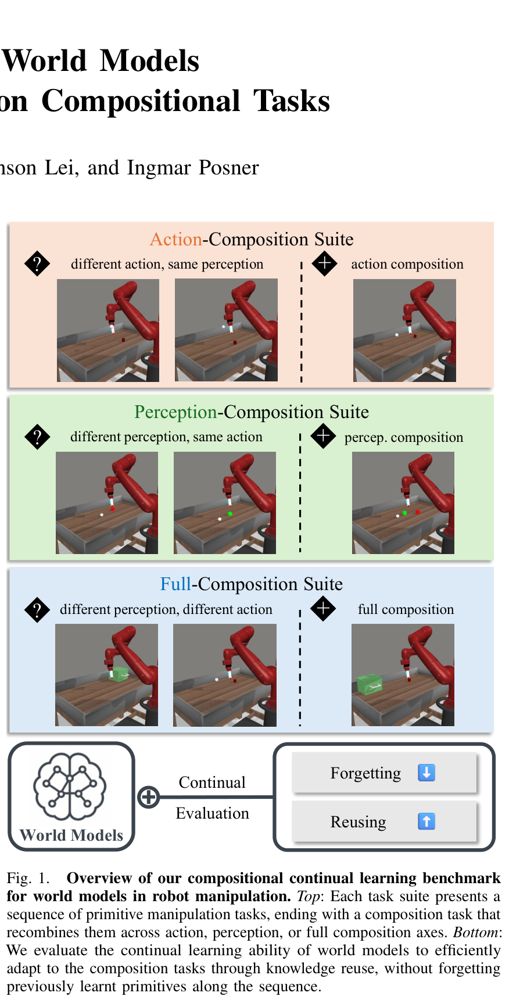
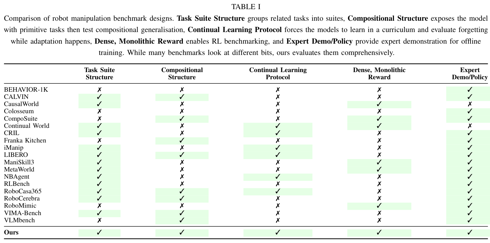

# Benchmarking World Models for Continual Learning on Compositional Tasks
# 组合任务上世界模型持续学习基准评测

> **Authors:** Haoyu Zhou*, Joe Watson, Anson Lei, Ingmar Posner  
> **Affiliation:** Applied Artificial Intelligence (A2I) Lab, Department of Engineering Science, University of Oxford  
> **Publication:** arXiv:2609.22055v1 [cs.LG], 18 Sep 2026  
> **Project Website:** [https://object814.github.io/Compositional-Continual-Learning/](https://object814.github.io/Compositional-Continual-Learning/)

---

## 目录 / Table of Contents
- [Abstract / 摘要](#abstract--摘要)
- [I. Introduction / 引言](#i-introduction--引言)
- [II. Related Work / 相关工作](#ii-related-work--相关工作)
- [III. Compositional Continual Learning Benchmark for World Models / 面向世界模型的组合式持续学习基准](#iii-compositional-continual-learning-benchmark-for-world-models--面向世界模型的组合式持续学习基准)
  - [A. Problem Setting / 问题设定](#a-problem-setting--问题设定)
  - [B. Factorising Composition Along Action and Perception / 沿动作与感知分解组合](#b-factorising-composition-along-action-and-perception--沿动作与感知分解组合)
  - [C. Model Separation and Continual Learning Adaptation / 模型解耦与持续学习自适应](#c-model-separation-and-continual-learning-adaptation--模型解耦与持续学习自适应)
  - [D. Baseline World Models and Interface Adaptation / 基准世界模型与接口适配](#d-baseline-world-models-and-interface-adaptation--基准世界模型与接口适配)
  - [E. Continual Learning with World Models / 基于世界模型的持续学习方法](#e-continual-learning-with-world-models--基于世界模型的持续学习方法)
- [IV. Experiments / 实验](#iv-experiments--实验)
  - [A. Baseline Performance and Comparison / 基准模型表现与对比](#a-baseline-performance-and-comparison--基准模型表现与对比)
  - [B. Probing Reuse in the Modular World Model / 探究模块化世界模型中的知识复用](#b-probing-reuse-in-the-modular-world-model--探究模块化世界模型中的知识复用)
- [V. Conclusion and Limitations / 结论与局限性](#v-conclusion-and-limitations--结论与局限性)
- [References / 参考文献](#references--参考文献)

---

## 术语表 / Terminology Ledger
- **World Model (世界模型)**: 学习环境转移概率与视觉动力学的模型，包含观测编码器、动力学预测器与任务头。
- **Continual Learning (持续学习 / 终身学习)**: 智能体按顺序面对一系列任务流时，在适应新任务的同时克服灾难性遗忘的能力。
- **Compositional Tasks (组合任务)**: 将之前所学基础原语（动作原语或感知原语）重新拼装组合而成的新任务。
- **Backward Transfer (BWT, 后向迁移 / 遗忘度)**: 衡量在新任务训练完成后，智能体在先前已训练任务上性能退化的程度。BWT 越低表示遗忘越少。
- **Forward Transfer (FWT, 前向迁移 / 复用度)**: 衡量智能体利用先前经验学习最终组合任务相比于从头学习的加速程度。FWT 越高表示知识复用越有效。
- **Action Composition (动作组合)**: 保持感知背景与物体外观不变，重新组合动作原语（如 Reach 空间轴组合、Pick 与 Place 串联）。
- **Perception Composition (感知组合)**: 保持动作执行模式不变，改变物体颜色/外观或容器组合（如不同颜色 Bin 间的搬运）。
- **Full Composition (完全组合)**: 动作原语与感知上下文同时发生复合重组（如开抽屉 + 放置物体）。
- **Task-Agnostic Backbone (任务无关骨干)**: 负责学习跨任务可通用的物理演化与观测压缩潜变量（编码器与动力学模型）。
- **Task-Specific Heads (任务特定头)**: 负责特定任务的奖励预测、价值估计与动作策略输出，在新任务到达时重置初始化。
- **Prismatic World Model (PWM, 棱镜模块化世界模型)**: 基于混合专家（MoE）的动力学世界模型，包含可动态路由的独立专家模块。
- **Frozen-Encoder Diagnostic (冻结编码器诊断实验)**: 通过在全任务示范上预训练并冻结视觉编码器，严格隔离表征漂移对动力学复用的干扰。

---

## Abstract / 摘要

> <span style="color:#3B82F6"><strong>Para. 1:</strong></span> A desirable property of a world model is the ability to learn continually across tasks, adapting to new environments without forgetting what the agent has already learnt. In particular, the ability to retain and reuse knowledge obtained from prior experiences underpins an agent's ability to efficiently adapt to novel environments, as the dynamics of the physical world can often be described in recurring mechanisms. However, the world model's measure of adaptation entangles two abilities: the speed and capacity to learn unseen tasks, and the reuse of knowledge already acquired, since incoming tasks carry novel content alongside what recurs. In order to isolate knowledge reuse from prior experiences, we propose a compositional continual learning benchmark for world models in robot manipulation. Specifically, we design each task curriculum with compositional tasks that combine aspects of the tasks seen in the sequence. We further factorise this composition along the axes of action and perception to better understand how different input modalities bottleneck knowledge reuse. We evaluate state-of-the-art world models under canonical continual learning methods, alongside a modular world model whose dynamics backbone contains explicitly reusable components. Results show that modularity balances reuse against forgetting better than conventional methods, but none solve the problem fully, leaving clear room for continual world models built to reuse without forgetting. More details are available on our project website: https://object814.github.io/Compositional-Continual-Learning/.
> <span style="color:#F59E0B"><strong>Para. 1[CN]:</strong></span> 世界模型的一个理想特性是跨任务进行持续学习的能力，即在适应新环境的同时不遗忘智能体已经习得的知识。特别是，保留并复用从先前经验中获取的知识，构成了智能体高效适应新环境的基石，因为物理世界的动力学规律通常可以由一组反复出现的物理机制来描述。然而，现存世界模型对自适应能力的评估往往将两种能力混淆纠缠在一起：学习全新未知任务的速度与容量，以及复用已获得知识的能力，因为序列中到来的新任务通常既包含全新的内容，也包含反复出现的要素。为了将“从先前经验中复用知识”这一能力独立解耦出来，我们提出了一个面向机器人操作中世界模型的组合式持续学习基准（Compositional Continual Learning Benchmark）。具体而言，我们设计的每个任务课程都以组合任务收尾，该任务重新组合了序列中先前出现过的各项任务要素。我们进一步将这种组合沿动作（Action）和感知（Perception）两个输入轴进行正交分解，以深入理解不同输入模态如何构成知识复用的瓶颈。我们在经典持续学习方法下评估了最先进的世界模型，并同时评估了一种动力学骨干包含显式可复用组件的模块化世界模型。实验结果表明，模块化设计比传统方法能更好地平衡知识复用与遗忘，但尚无任何现有方法能够彻底解决该问题，这为构建能够“兼顾复用且不遗忘”的持续世界模型留下了明确的研究空间。更多详情可在项目主页获取：https://object814.github.io/Compositional-Continual-Learning/。

## I. Introduction / 引言

> <span style="color:#3B82F6"><strong>Para. 2:</strong></span> Agents should be able to solve a sequence of related tasks efficiently by using and reusing their acquired knowledge. Methods using world models are a natural solution, as the learnt dynamics model is a persistent component across tasks. In this work, we propose a benchmark for evaluating continual reinforcement learning with world models, specifically looking at robot manipulation due to its compositional nature.
> <span style="color:#F59E0B"><strong>Para. 2[CN]:</strong></span> 智能体应当能够通过利用和复用所获得的知识，高效地解决一系列相互关联的任务。基于世界模型的方法是一种天然的解决方案，因为学习到的动力学模型是跨任务持久存在的核心组件。在这项工作中，我们提出了一个用于评估世界模型持续强化学习能力的基准，由于机器人操作任务天然具备高度的组合性（Compositional Nature），我们专门聚焦于机器人操作领域。

> <span style="color:#3B82F6"><strong>Para. 3:</strong></span> Existing continual learning benchmarks in robot manipulation [1], [2] investigate how well models adapt to new tasks without forgetting previous ones. Their measure of adaptation, however, usually entangles the raw speed of learning new interactions, and the ability to reuse previous knowledge. This entanglement arises because every task arriving in their sequences carries novel, previously unseen content alongside the objects and actions that recur. In the context of world models, we argue that reuse is the main route to efficient adaptation, as the dynamics of the environment can often be explained by a small set of reusable mechanisms [3]–[5].
> <span style="color:#F59E0B"><strong>Para. 3[CN]:</strong></span> 现有的机器人操作持续学习基准 [1], [2] 主要探讨模型在不遗忘先前任务的前提下适应新任务的表现。然而，它们对自适应能力的度量通常将学习全新交互行为的原始速度与复用先前知识的能力混杂纠缠在一起。这种纠缠之所以产生，是因为在它们的任务序列中，到来的每个新任务在包含反复出现的物体和动作的同时，也夹杂着先前从未见过的全新内容。在世界模型的语境下，我们认为知识复用是实现高效自适应的主要途径，因为环境动力学往往可以通过一小组可复用的底层机制得到解释 [3]–[5]。

> <span style="color:#3B82F6"><strong>Para. 4:</strong></span> In this light, we propose a benchmark that isolates the reusability of world models in model-based reinforcement learning. We design task sequences that end with a composition task built by recombining the primitive tasks that precede it, examining how well world models are able to reuse without forgetting. We further factorise this composition along the two inputs a world model is conditioned on, namely action and perception, into separate task suites. The results therefore reveal not only whether a model reuses, but also along which input modality that reuse succeeds or fails.
> <span style="color:#F59E0B"><strong>Para. 4[CN]:</strong></span> 鉴于此，我们提出了一个在基于模型的强化学习（MBRL）中专门隔离评估世界模型可复用性的基准。我们设计的任务序列均以一个组合任务作为终局，该任务通过重新组合序列前序出现过的基元任务（Primitive Tasks）构建而成，以此检验世界模型在不遗忘的前提下进行知识复用的能力。我们进一步将这种组合沿世界模型所依赖的两个条件输入维度——动作与感知——正交分解为独立的任务套件。因此，评估结果不仅能揭示模型是否实现了知识复用，还能定位复用成功或失败的具体输入模态。



**Caption:** Fig. 1. Overview of our compositional continual learning benchmark for world models in robot manipulation. Top: Each task suite presents a sequence of primitive manipulation tasks, ending with a composition task that recombines them across action, perception, or full composition axes. Bottom: We evaluate the continual learning ability of world models to efficiently adapt to the composition tasks through knowledge reuse, without forgetting previously learnt primitives along the sequence.  
**Caption[CN]:** 图 1. 机器人操作中面向世界模型的组合式持续学习基准总览。顶部：每个任务套件包含一系列基元操作任务，并以一个沿动作、感知或完全组合轴对先前基元进行重组的组合任务作为结尾。底部：我们评估世界模型通过知识复用高效适应最终组合任务的持续学习能力，同时检验其是否记住了序列中先前学到的各个基元任务。

> <span style="color:#3B82F6"><strong>Para. 5:</strong></span> We evaluate state-of-the-art world models paired with conventional continual learning methods on our benchmark to see how far they carry world models towards compositional continual learning. Additionally, we look into a modular world model, whose dynamics are a mixture of experts rather than a monolithic network. Such an explicitly factorised model is a direct architectural expression of our view, since its modules are candidate reusable components that mirror the compositional structure of the environment. Whether modular world models enable compositional continual learning is what our benchmark asks. We also introduce a principled way to separate world models into a task-agnostic backbone and task-specific heads, applying continual learning only to the part meant to capture reusable mechanisms. In summary, our key contributions are:
> <span style="color:#F59E0B"><strong>Para. 5[CN]:</strong></span> 我们在基准上评估了与传统持续学习方法相结合的代表性世界模型，以检验它们在多大程度上推动世界模型走向组合式持续学习。此外，我们深入探索了一种模块化世界模型，其动力学网络由混合专家（Mixture of Experts, MoE）而非单一整块网络构成。这种显式分解的模型是我们观点的直接架构体现，因为其各个专家模块正是反映环境组合结构的候选可复用组件。模块化世界模型是否能真正实现组合式持续学习，正是我们基准的核心探究问题。我们还引入了一种原则性的解耦方法，将世界模型划分为任务无关骨干（Task-Agnostic Backbone）与任务特定头（Task-Specific Heads），仅将持续学习机制应用于旨在捕获可复用物理机制的骨干部分。综上所述，我们的核心贡献包括：

> <span style="color:#3B82F6"><strong>Para. 6:</strong></span> • A compositional continual learning benchmark. We build a benchmark for world models in robot manipulation, where each task sequence ends with a task constructed by recombining previous primitives, and is factorised along action and perception, so that forward transfer isolates reuse and localises where it fails.  
> • A principled separation of world models for continual learning. We distinguish the task-agnostic backbone that must be learnt continually from the task-specific heads that need not be, and apply continual learning methods only to the former.  
> • An evaluation of state-of-the-art world models. We evaluate monolithic world models under canonical continual learning methods to see how far they carry world models towards compositional continual learning, alongside a continual variant we construct on a modular world model to see what modularity adds.
> <span style="color:#F59E0B"><strong>Para. 6[CN]:</strong></span> • 组合式持续学习基准：我们构建了一个面向机器人操作世界模型的评测基准，每个任务序列均以重组前序基元的新任务收尾，并沿动作与感知进行正交解耦，使得前向迁移指标能够纯粹隔离复用能力并精确定位复用失效的模态环节。  
> • 面向持续学习的原则性世界模型解耦架构：我们严格区分了必须进行持续学习的任务无关骨干与无须持续保留的任务特定头，并仅将持续学习约束应用于前者。  
> • 对最先进世界模型的系统评估：我们在经典持续学习方法下评估了整块式（Monolithic）世界模型，检验它们迈向组合持续学习的极限；同时在一款模块化世界模型上构建了持续学习变体，深入探讨显式模块化架构带来的独特增益。

## II. Related Work / 相关工作

> <span style="color:#3B82F6"><strong>Para. 7:</strong></span> a) General-purpose robot manipulation benchmarks: A first wave of manipulation benchmarks has emphasised broad task coverage, visual realism, and policy generalisation in single or multi-task regimes. Several benchmarks provide diverse manipulation suites with expert demonstrations or meta-learning structure [6], [7], while others scale robot learning through larger asset libraries, multiple embodiments, and more realistic household scenes [8]–[11]. A complementary line focuses on demonstration-driven evaluation, offline learning, and long-horizon manipulation, from structured human demonstration datasets to kitchen-style and household tasks [12], [13]. Together they provide rich task diversity, abundant demonstrations, and vivid rendering, but target single-task or multi-task learning rather than the sequential task arrival a general-purpose robot meets over its lifetime.
> <span style="color:#F59E0B"><strong>Para. 7[CN]:</strong></span> a) 通用机器人操作基准：第一波机器人操作基准侧重于单任务或多任务机制下的广泛任务覆盖率、视觉拟真度以及策略泛化能力。一些基准提供了包含专家示范或元学习结构的丰富操作套件 [6], [7]，而另一些基准则通过扩充资产库、引入多具身形态以及构建更拟真的家庭场景来扩展机器人学习 [8]–[11]。另一条互补的研究线索侧重于示范驱动评估、离线学习以及长时程操作，涵盖从结构化人类示范数据集到厨房风格及家庭杂务任务 [12], [13]。这些工作共同提供了丰富的任务多样性、海量示范与细腻渲染，但它们的目标依然是单任务或静态多任务联合学习，而非通用机器人在其生命周期中必须面对的任务时序渐进到达场景。

> <span style="color:#3B82F6"><strong>Para. 8:</strong></span> b) Continual learning robot manipulation benchmarks: A more closely related cluster of benchmarking works directly evaluates the continual learning performance in robot manipulation settings. Continual World [2] arranges sequences of Meta-World [7] tasks and evaluates continual RL agents through forward-transfer and forgetting metrics, but its sequences are built from monolithic tasks, which does not align with evaluating the compositional aspect of continual learning. LIBERO [1] extends continual robot learning with task suites organised around spatial, object, goal, and mixed distribution shifts. However, these shifts are pairwise rather than cumulative: each task varies relative to its neighbours, and no task is defined as a recombination of everything that precedes it. A model can score well by adapting to the most recent shift alone, without ever reusing its full history.
> <span style="color:#F59E0B"><strong>Para. 8[CN]:</strong></span> b) 持续学习机器人操作基准：更紧密相关的基准工作直接评估机器人操作设置下的持续学习性能。Continual World [2] 编排了 Meta-World [7] 的任务序列，并通过前向迁移与遗忘度指标评估持续强化学习智能体，但其序列由孤立整块任务构建，未对齐持续学习中的组合式特性。LIBERO [1] 围绕空间、物体、目标及混合分布偏移构建任务套件，拓展了持续机器人学习。然而，这些分布偏移是两两相对而非累积重组的：每个任务仅相对于其邻近任务发生变化，没有任何任务被定义为前序所有基元的综合重组。模型仅需适应最近的单次偏移即可取得高分，而完全不需要复用整个历史经验。

> <span style="color:#3B82F6"><strong>Para. 9:</strong></span> c) Composition robot manipulation benchmarks: A third cluster targets compositional or causal generalisation explicitly. CompoSuite [14] factorises 256 manipulation tasks along robot, object, objective and obstacle axes, exposing shared components across tasks; VIMA-Bench [15] formalises multimodal tasks under a four-level generalisation protocol; CALVIN [16] composes long-horizon language-conditioned skills across four environments; THE COLOSSEUM [17] systematically perturbs RLBench tasks along fourteen environmental axes; and VLMbench [18] provides a compositional vision-and-language manipulation suite. CausalWorld [19] sits adjacent to this line, enabling fine-grained interventions over causal factors such as mass, colour, friction to study transfer. These benchmarks make the compositional structure of manipulation explicit, but evaluate it only under a static training regime. The agent is given the full task distribution up front, with no continual arrival nor measurement of whether previously learnt content is retained while reusing. We summarise this comparison in Table I.
> <span style="color:#F59E0B"><strong>Para. 9[CN]:</strong></span> c) 组合式机器人操作基准：第三类相关工作显式针对组合泛化或因果泛化。CompoSuite [14] 沿机器人、物体、目标和障碍物四个轴分解了 256 个操作任务，暴露了跨任务共享组件；VIMA-Bench [15] 在四级泛化协议下形式化了多模态任务；CALVIN [16] 在四个环境中组合长时程语言条件化技能；THE COLOSSEUM [17] 沿 14 个环境轴系统扰动 RLBench 任务；VLMbench [18] 提供了视觉语言组合操作套件。CausalWorld [19] 与此紧密相邻，支持对质量、颜色、摩擦力等因果因子进行细粒度干预以研究迁移。这些基准显式展现了操作的组合结构，但仅在静态训练模式下评估。智能体在一开始就获得了全量任务分布，既不存在时序持续到达，也无法衡量在复用过程中先前习得的内容是否被完好保留。我们在表 I 中总结了这一对比。



**Caption:** TABLE I. Comparison of robot manipulation benchmark designs. Task Suite Structure groups related tasks into suites, Compositional Structure exposes the model with primitive tasks then test compositional generalisation, Continual Learning Protocol forces the models to learn in a curriculum and evaluate forgetting while adaptation happens, Dense, Monolithic Reward enables RL benchmarking, and Expert Demo/Policy provide expert demonstration for offline training. While many benchmarks look at different bits, ours evaluates them comprehensively.  
**Caption[CN]:** 表 I. 机器人操作基准设计对比。任务套件结构（Task Suite Structure）将相关任务分组；组合结构（Compositional Structure）先让模型学习基元任务再测试组合泛化；持续学习协议（Continual Learning Protocol）强制模型在课程序列中学习并在适应新任务时评估遗忘；稠密统一奖励（Dense, Monolithic Reward）支持强化学习评测；专家示范/策略（Expert Demo/Policy）提供离线训练数据。现有众多基准仅涉及其中部分维度，而本文基准首次实现了全维度综合覆盖。

| Benchmark (基准) | Task Suite Structure (任务套件结构) | Compositional Structure (组合结构) | Continual Learning Protocol (持续学习协议) | Dense, Monolithic Reward (稠密奖励) | Expert Demo/Policy (专家示范/策略) |
| :--- | :---: | :---: | :---: | :---: | :---: |
| **BEHAVIOR-1K** [11] | ✗ | ✗ | ✗ | ✗ | ✓ |
| **CALVIN** [16] | ✓ | ✓ | ✗ | ✗ | ✓ |
| **CausalWorld** [19] | ✓ | ✗ | ✗ | ✓ | ✗ |
| **Colosseum** [17] | ✗ | ✗ | ✗ | ✗ | ✓ |
| **CompoSuite** [14] | ✗ | ✓ | ✗ | ✓ | ✓ |
| **Continual World** [2] | ✓ | ✗ | ✓ | ✓ | ✗ |
| **CRIL** | ✓ | ✗ | ✓ | ✗ | ✓ |
| **Franka Kitchen** [12] | ✗ | ✓ | ✗ | ✗ | ✓ |
| **iManip** | ✓ | ✗ | ✓ | ✗ | ✓ |
| **LIBERO** [1] | ✓ | ✓ | ✓ | ✗ | ✓ |
| **ManiSkill3** [9] | ✓ | ✗ | ✗ | ✓ | ✓ |
| **MetaWorld** [7] | ✓ | ✗ | ✗ | ✓ | ✓ |
| **NBAgent** | ✓ | ✗ | ✗ | ✗ | ✓ |
| **RLBench** [6] | ✓ | ✗ | ✗ | ✗ | ✓ |
| **RoboCasa365** [10] | ✓ | ✓ | ✓ | ✗ | ✓ |
| **RoboCerebra** [13] | ✓ | ✓ | ✗ | ✗ | ✓ |
| **RoboMimic** | ✗ | ✗ | ✗ | ✓ | ✓ |
| **VIMA-Bench** [15] | ✓ | ✓ | ✗ | ✗ | ✓ |
| **VLMbench** [18] | ✗ | ✓ | ✗ | ✗ | ✓ |
| **Ours (本文基准)** | **✓** | **✓** | **✓** | **✓** | **✓** |

## III. Compositional Continual Learning Benchmark for World Models / 面向世界模型的组合式持续学习基准

### A. Problem Setting / 问题设定

> <span style="color:#3B82F6"><strong>Para. 10:</strong></span> We consider a curriculum of $T$ tasks arriving in sequence, where each task is a partially observed Markov decision process $\mathcal{T}_t = (\mathcal{S}_t, \mathcal{A}, \mathcal{O}, p_t, r_t, \gamma)$ with underlying states $s_h \in \mathcal{S}_t$, actions $a_h \in \mathcal{A}$, observations $o_h \in \mathcal{O}$, transition distribution $p_t(s_{h+1} \mid s_h, a_h)$, reward $r_t$ and discount $\gamma$, where $h$ indexes timesteps within an episode. The observation space $\mathcal{O}$ and the continuous action space $\mathcal{A}$ are shared across all tasks. The goal is to maximise the expected discounted return $J_i(\pi) = \mathbb{E}\left[\sum_h \gamma^h r_i(s_h, a_h)\right]$ on each task $i \le t$ encountered so far, while only the current task's environment is available for the agent to interact with.
> <span style="color:#F59E0B"><strong>Para. 10[CN]:</strong></span> 我们考虑一个由 $T$ 个任务按时序到达的课程序列，其中每个任务都是一个部分可观测马尔可夫决策过程（POMDP）$\mathcal{T}_t = (\mathcal{S}_t, \mathcal{A}, \mathcal{O}, p_t, r_t, \gamma)$，包含底层状态 $s_h \in \mathcal{S}_t$、动作 $a_h \in \mathcal{A}$、观测 $o_h \in \mathcal{O}$、状态转移分布 $p_t(s_{h+1} \mid s_h, a_h)$、奖励函数 $r_t$ 以及折扣因子 $\gamma$，其中 $h$ 表示单轮轨迹内的时步索引。所有任务共享相同的观测空间 $\mathcal{O}$ 和连续动作空间 $\mathcal{A}$。优化的目标是在迄今为止遇到的每个任务 $i \le t$ 上最大化期望累积折扣回报 $J_i(\pi) = \mathbb{E}\left[\sum_h \gamma^h r_i(s_h, a_h)\right]$，而在任意时刻，智能体仅能与当前任务的环境进行交互。

> <span style="color:#3B82F6"><strong>Para. 11:</strong></span> We solve each task using a parametric world model $\mathcal{W} = (\theta, \phi_t)$, where $\theta \in \mathbb{R}^m$ denotes the task-agnostic parameters capturing reusable environment dynamics, and $\phi_t \in \mathbb{R}^n$ represents the task-specific parameters for each task. The task-agnostic part compresses perception into a latent $z_h \in \mathcal{Z}$ and predicts how that latent evolves, given very generally by:
> <span style="color:#F59E0B"><strong>Para. 11[CN]:</strong></span> 我们使用参数化世界模型 $\mathcal{W} = (\theta, \phi_t)$ 来求解各个任务，其中 $\theta \in \mathbb{R}^m$ 表示捕获可复用环境动力学的任务无关参数，$\phi_t \in \mathbb{R}^n$ 表示针对每个任务特化的任务特定参数。任务无关部分将感知压缩为潜在状态 $z_h \in \mathcal{Z}$，并预测该潜在状态如何演化，其通用形式定义为：

$$z_h \sim e_\theta(\cdot \mid z_{h-1}, a_{h-1}, o_h), \quad \hat{z}_{h+1} \sim d_\theta(\cdot \mid z_h, a_h) \tag{1}$$

> <span style="color:#3B82F6"><strong>Para. 12:</strong></span> where $e_\theta$ encodes the current observation into the latent given the preceding latent and action, and $d_\theta$ predicts the next latent from the latent and action alone, enabling action-conditioned latent rollouts. A set of heads $\phi_t$ then consumes $z_h$ to produce the quantities needed for control on task $t$, e.g., reward, termination, value estimation, and a policy. The backbones we evaluate populate the general description in Equation 1 differently. DreamerV3 [20] carries the recurrence in $e_\theta$ through an explicit sequence model with a stochastic latent, reconstructs observations with a decoder, and acts through its policy directly, while TD-MPC2 [21] and PWM [22] produce a deterministic latent through a feed-forward network, are decoder-free, and use the policy as a prior for planning. These differences change which components instantiate $(e_\theta, d_\theta, \phi_t)$, but not the fact that every model in this family is an action- and perception-conditioned latent predictor.
> <span style="color:#F59E0B"><strong>Para. 12[CN]:</strong></span> 其中 $e_\theta$ 在给定前一时步潜在状态和动作的前提下，将当前观测编码为潜在状态；$d_\theta$ 则仅依据当前潜在状态和动作预测下一时步的潜在状态，从而支持动作条件化的潜在空间推演（Latent Rollouts）。随后，一组任务头 $\phi_t$ 读取潜在状态 $z_h$，生成任务 $t$ 控制所需的物理量（如奖励预测、终止信号、价值估计和动作策略）。我们评估的不同基准骨干以不同形式实现了公式 (1) 的通用定义。DreamerV3 [20] 通过包含随机潜在变量的显式序列模型实现 $e_\theta$ 中的循环递归，使用解码器重构观测像素，并直接通过策略网络产生动作；而 TD-MPC2 [21] 和 PWM [22] 则通过前馈网络生成确定性潜在状态，舍弃了解码器，并将策略网络作为模型预测控制（MPC）规划的先验分布。这些差异虽然改变了 $(e_\theta, d_\theta, \phi_t)$ 的具体实例化组件，但未改变该模型家族每一个成员本质上都是“以动作为条件、以感知为条件的潜在状态预测器”这一核心属性。

> <span style="color:#3B82F6"><strong>Para. 13:</strong></span> Our problem formulation exposes two properties that our benchmark builds on throughout: the two inputs a world model is conditioned on, and the separation of its parameters.  
> a) The world model input perspective (Section III-B): A world model is characterised by its input modality at each step, namely action and perception. These modalities enter the model through different components: perception is consumed by the encoder before the dynamics are queried, while the action conditions the dynamics model directly. This perspective motivates us to factorise the composition task suites along these two axes, resolving a single compositional score into where reuse breaks.  
> b) The world model architecture perspective (Section III-C): We partition a world model into the task-agnostic backbone $\theta$ and the task-specific heads $\phi_t$, e.g., state prediction is task-agnostic while reward prediction is task-specific. This detail motivates how we apply continual learning to world models.
> <span style="color:#F59E0B"><strong>Para. 13[CN]:</strong></span> 我们的问题形式化揭示了贯穿基准始终的两大核心属性：世界模型所依赖的两种输入模态，以及模型参数的解耦划分。  
> a) 世界模型输入模态视角（第 III-B 节）：世界模型在每一步均由两种输入模态表征，即动作与感知。这两种模态通过不同组件注入模型：感知在查询动力学之前先由编码器处理，而动作则直接条件化动力学模型。这一视角启发我们将组合任务套件沿这两个轴进行正交解耦，从而将单一的组合得分细化定位到复用失效的具体环节。  
> b) 世界模型网络架构视角（第 III-C 节）：我们将世界模型划分为任务无关骨干 $\theta$ 与任务特定头 $\phi_t$（例如状态预测是任务无关的，而奖励预测是任务特定的）。这一划分决定了我们在世界模型上实施持续学习的具体机制。

### B. Factorising Composition Along Action and Perception / 沿动作与感知分解组合

> <span style="color:#3B82F6"><strong>Para. 14:</strong></span> At each step, a world model takes two inputs: an action to be taken, and current perception, which in our case consists of multiple camera views and proprioception. The dynamics it must learn are therefore conditioned on both. This motivates the central design choice of our benchmark's task suites, we compose primitive skills along these two input modalities, yielding three task suite types:  
> a) Action-composition: The perception context is held fixed. The scene and objects stay consistent while the final composition task combines action primitives learnt through the curriculum, e.g., reaching and grasping. This design isolates whether the model reuses across the action space under a familiar perception input.  
> b) Perception-composition: The action primitives are held approximately fixed. The same manipulation is performed on objects with different visual appearances, and the composition task operates on an unseen combination of them. This design isolates whether the model reuses across the perception space under a familiar action distribution.  
> c) Full composition: Both action and perception axes change simultaneously. The primitive tasks differ in both action primitive and perception context, and the composition task combines both.
> <span style="color:#F59E0B"><strong>Para. 14[CN]:</strong></span> 在每一个时步，世界模型接收两组输入：将要执行的动作，以及当前感知信息（在本文中由多机位相机视角和本体感觉共同构成）。因此，它必须学习的动力学规律是同时以这两者为条件的。这构成了我们基准任务套件的核心设计决策：我们沿这两种输入模态来组合基元技能，形成了三种类型的任务套件：  
> a) 动作组合（Action-composition）：保持感知上下文固定不变。场景与物体保持一致，而最终的组合任务则重组课程序列中所学到的动作基元（例如将到达 Reach 与抓取 Grasp 组合）。该设计旨在隔离验证模型在熟悉感知输入下跨动作空间的复用能力。  
> b) 感知组合（Perception-composition）：动作基元大致保持固定。对具有不同视觉外观的物体执行相同的操作，而最终组合任务则在这些外观组合的前所未见新配置上运行。该设计旨在隔离验证模型在熟悉动作分布下跨感知空间的复用能力。  
> c) 完全组合（Full composition）：动作轴与感知轴同时发生改变。基元任务在动作基元和感知上下文两个维度上均存在差异，而最终的组合任务同时融合了两者的重组。

### C. Model Separation and Continual Learning Adaptation / 模型解耦与持续学习自适应

> <span style="color:#3B82F6"><strong>Para. 15:</strong></span> Our second perspective is a structural way of applying continual learning in world models. As illustrated in Figure 2, a world model naturally partitions into two groups by semantic role. The task-agnostic components capture how the world evolves and how observations are generated, and should be independent of any specific task. The task-specific components consume the latent representation produced by the task-agnostic components to decide what the robot should do, and depend entirely on the task definition.
> <span style="color:#F59E0B"><strong>Para. 15[CN]:</strong></span> 我们的第二个视角是在世界模型中实施持续学习的结构化解耦方式。如图 2 所示，世界模型按语义角色天然划分为两组。任务无关组件捕获物理世界如何演化以及观测如何生成，它应当独立于任何具体任务；任务特定组件则读取任务无关组件生成的潜在表征，以决定机器人应当采取何种控制行为，它完全依赖于任务的具体定义。


**Caption:** Fig. 2. World model separation for continual learning. The task-agnostic part captures how the world evolves and is learnt continually across the curriculum. The task-specific heads consume the dynamics latent and are re-initialised for each new task.  
**Caption[CN]:** 图 2. 面向持续学习的世界模型解耦架构。任务无关部分捕获物理世界的演化机制，在整个课程序列中持续学习；任务特定头读取动力学潜在状态，并在每个新任务到来时重新初始化。

> <span style="color:#3B82F6"><strong>Para. 16:</strong></span> This partition is consequential for how we apply continual learning, illustrated in Algorithm 1. When a new task arrives, the novel observations and dynamics must be absorbed by the task-agnostic part of the world model continually. The task-specific heads are instantiated for each task and re-initialised when the curriculum advances. This separation is because different tasks can be modelled using a shared world model, while each has its own reward and optimal policy.
> <span style="color:#F59E0B"><strong>Para. 16[CN]:</strong></span> 这种划分直接决定了我们应用持续学习的方式，如算法 1 所示。当新任务到来时，全新的观测与动力学必须被世界模型的任务无关部分持续吸收；而任务特定头则针对每个任务单独实例化，并在课程推进时重新初始化。这种解耦是因为不同任务可以在同一个共享世界模型下建模，但各自拥有独特的奖励函数与最优策略。


**Caption:** TABLE II. The six composition task suites. Primitives are trained in the listed order, final composition task is shown in bold.  
**Caption[CN]:** 表 II. 六个组合任务套件。基元任务按列出顺序依次训练，最终的组合任务加粗显示。

| Suite Type (套件类型) | Suite Name (套件名称) | Primitive Tasks $\to$ Composition Task (基元任务序列 $\to$ **最终组合任务**) |
| :--- | :--- | :--- |
| **Action composition** (动作组合) | **Reach** | reach in xy (plane) $\to$ reach in xz $\to$ reach in yz $\to$ **reach in xyz** |
| | **Grasp** | pick cube $\to$ place cube $\to$ **pick and place cube** |
| **Perception composition** (感知组合) | **BinPnP** | pick and place cube from red bin to blue bin $\to$ yellow to blue $\to$ red to purple $\to$ **yellow to purple** |
| | **PnPBlock** | pick and place red block $\to$ pick and place blue block $\to$ **stack the two blocks** |
| **Full composition** (完全组合) | **DrawerPnP** | pick and place cube $\to$ open drawer $\to$ **open drawer then pick and place cube inside** |
| | **PnPBoxClose** | pick and place cube $\to$ close box $\to$ **pick and place cube inside box then close it** |

```
Algorithm 1: Continual learning and evaluation protocol (持续学习与评估协议)
Input: T tasks; Continual Learning method C; World model W = (θ, ϕ)
1: Initialize task-agnostic backbone θ
2: for t = 1 to T do
3:     Initialize fresh task-specific heads ϕ_t
4:     while task t training do
5:         θ ← C(θ)         // update backbone continually (持续更新骨干)
6:         ϕ_t ← update(ϕ_t) // update heads independently (独立更新任务头)
7:     end while
8:     store ϕ_t             // freeze head for task t (冻结当前任务头)
9:     for i = 1 to t do
10:        R_i(t) ← evaluate(θ, ϕ_i) on task i  // eval task i (评估历史各任务性能)
11:    end for
12: end for
13: return {R_i(t)}
```

### D. Baseline World Models and Interface Adaptation / 基准世界模型与接口适配

> <span style="color:#3B82F6"><strong>Para. 17:</strong></span> We evaluate three world-model families under the model-based reinforcement learning view introduced above, namely DreamerV3 [20], TD-MPC2 [21], and prismatic world model (PWM) [22]. The first two serve as our monolithic baselines, while PWM is our modular baseline. We present all baselines with the same observation space $\mathcal{O}$ and action space $\mathcal{A}$. Observations $o_t \in \mathcal{O}$ consist of channel-stacked images from three camera views (topview, frontview, gripperPOV) and a 7-D proprioceptive vector comprising end-effector pose, velocity, and gripper status. The action space $a \in \mathbb{R}^4$ comprises relative end-effector displacement $\Delta p \in \mathbb{R}^3$ and a scalar gripper command $g \in \mathbb{R}$. Each task has a success-based absorbing state. We rescale the original reward of each task to $[-1, 0]$ to encourage minimum-time solutions when combined with the absorbing state.
> <span style="color:#F59E0B"><strong>Para. 17[CN]:</strong></span> 我们在上述基于模型的强化学习框架下评估了三个代表性世界模型家族：DreamerV3 [20]、TD-MPC2 [21] 以及棱镜世界模型（PWM）[22]。前两者作为整块式（Monolithic）基准模型，而 PWM 则作为模块化基准模型。我们为所有基准模型提供了完全对齐的观测空间 $\mathcal{O}$ 和动作空间 $\mathcal{A}$。观测 $o_t \in \mathcal{O}$ 由三个相机机位（俯视图 topview、正视图 frontview、夹爪视角 gripperPOV）通道堆叠的 9 通道图像，以及包含末端执行器位姿、速度和夹爪开合状态的 7 维本体感觉向量组成。动作空间 $a \in \mathbb{R}^4$ 包含末端执行器的 3 维相对位移 $\Delta p \in \mathbb{R}^3$ 和 1 维标量夹爪控制指令 $g \in \mathbb{R}$。每个任务均设有基于成功判定的吸收终止状态（Absorbing State）。我们将每个任务的原始奖励重缩放至 $[-1, 0]$ 区间，当与吸收状态结合时，这能自然鼓励策略寻求用时最短的解。

> <span style="color:#3B82F6"><strong>Para. 18:</strong></span> Fitting each baseline to this interface requires three modifications: (i) widening or replacing the visual encoder, typically designed for a single low-resolution frame, so that it accepts the 9-channel multi-camera image; (ii) adding an MLP branch for proprioception and a fusion step that combines the two modalities before forming the latent state; and (iii) ensuring that the action interface supports continuous control. Beyond these changes, we preserve the native architecture, planning or imagination procedure, and actor-critic training of each baseline as faithfully as possible.
> <span style="color:#F59E0B"><strong>Para. 18[CN]:</strong></span> 使各个基准模型适配此接口需要进行三处修改：(i) 展宽或替换原本为单张低分辨率图像设计的视觉编码器，使其能够接收 9 通道多视角相机图像；(ii) 为本体感觉增加一个 MLP 分支，并在形成潜在状态前增加两模态特征融合步骤；(iii) 确保动作接口完全支持连续控制。除上述适配外，我们尽可能忠实地保留了各个基准模型原生的网络架构、规划或想象推演流程以及 Actor-Critic 训练算法。

### E. Continual Learning with World Models / 基于世界模型的持续学习方法

> <span style="color:#3B82F6"><strong>Para. 19:</strong></span> a) Monolithic world model: Following the model separation of Section III-C, we apply three popular continual learning methods to the task-agnostic parts, spanning the canonical families of replay, regularisation, and parameter isolation. The implementation follows their original formulations [23]–[25] in DreamerV3 and TD-MPC2: Experience replay (ER) represents the replay family. We maintain a buffer holding 5% [23] of each previously seen task's raw transitions and mix uniform samples from it into the backbone updates for the current task, so that earlier dynamics continue to be rehearsed as new tasks arrive. Elastic weight consolidation (EWC) [24] represents the regularisation family. After each task, we estimate the diagonal Fisher information of the parameters to represent the importance of each parameter, and add a quadratic penalty that discourages important ones from drifting. PackNet [25] represents the parameter-isolation family. After training on each task, we prune the backbone to retain 25% [25] of its remaining free parameters and freeze that subset as a protected sub-network. Together with naive Fine-tuning (FT), four continual learning paradigms are adapted for each monolithic world model to benchmark.
> <span style="color:#F59E0B"><strong>Para. 19[CN]:</strong></span> a) 整块式世界模型：遵循第 III-C 节的模型解耦策略，我们将三种主流持续学习方法应用于任务无关骨干部分，涵盖了经验重放、正则化和参数隔离三大经典流派。在 DreamerV3 和 TD-MPC2 中的实现严格遵循原始文献 [23]–[25]：经验重放（Experience Replay, ER）代表重放流派。我们维护一个保存每个先前任务 5% [23] 原始转移数据的重放缓冲区，并在当前任务的骨干更新中均匀采样混合这些历史数据，以便新任务到达时先前动力学得以持续复习。弹性权重整合（Elastic Weight Consolidation, EWC）[24] 代表正则化流派。在每个任务训练完成后，我们估计参数的对角 Fisher 信息矩阵以表征参数重要性，并施加二次惩罚项以抑制关键参数的漂移。PackNet [25] 代表参数隔离流派。在每个任务训练后，我们剪枝骨干网络以保留剩余空闲参数的 25% [25]，并将该子网络冻结为受保护子网。连同朴素微调（Fine-tuning, FT），共有四种持续学习范式被适配至各个整块式世界模型参与基准评测。

> <span style="color:#3B82F6"><strong>Para. 20:</strong></span> b) Modular world model: For the modular world model motivated in Section I, we build upon the mixture-of-experts (MoE) world model PWM [22], which extends TD-MPC2 to multiple dynamics experts that produce intermediate representations, combined by a learnt soft router to produce the final latent, making it a close counterpart to TD-MPC2. The original PWM, however, is designed for multi-task learning. It trains on all tasks jointly and provides no mechanism for tasks that arrive in sequence, so we first construct a continual variant by transferring the progressive mixture-of-experts idea from Wang et al. [26]. For each incoming task we introduce $K = 3$ new trainable dynamics experts, while the experts of previous tasks are frozen. The router can access all experts activated up to the current task, so the model can reuse previously learnt dynamics while still introducing new capacity when needed.
> <span style="color:#F59E0B"><strong>Para. 20[CN]:</strong></span> b) 模块化世界模型：针对第 I 节所提出的模块化世界模型思路，我们基于混合专家（MoE）世界模型 PWM [22] 进行构建。PWM 将 TD-MPC2 扩展为多个生成中间表征的动力学专家，并通过学习到的软路由（Soft Router）将其融合输出最终潜在状态，这使其成为 TD-MPC2 绝佳的结构对应物。然而，原版 PWM 是专为静态多任务联合学习设计的，缺少应对任务时序到达的机制。因此，我们借鉴 Wang 等人 [26] 的渐进式混合专家思想，构建了其持续学习变体。对于每一个到来的新任务，我们引入 $K = 3$ 个全新的可训练动力学专家，同时将先前任务的专家予以严格冻结。路由器可以访问当前任务及之前所有激活的专家，从而使模型能够在复用先前动力学的同时，在需要时引入新的参数容量。

> <span style="color:#3B82F6"><strong>Para. 21:</strong></span> c) Frozen-encoder diagnostic: While our modification lets PWM's dynamics model learn and combine experts progressively along the curriculum, the results it produces do not yet isolate what the modular design contributes. Its encoder remains a single network that keeps updating throughout the curriculum. The experts therefore operate on a latent representation that is itself drifting, and any result is thus entangled with this encoder drift. To remove this effect and isolate what the modular architecture contributes, we pretrain the encoder in PWM with a simple autoencoder reconstruction objective on expert demonstrations of all tasks in our benchmark, then freeze it throughout sequential learning. To control for the contribution of this privileged encoder, we use the exact same encoder checkpoint on the monolithic TD-MPC2 for comparison, attributing any remaining performance gap to the modular dynamics design, up to the additional capacity it introduces.
> <span style="color:#F59E0B"><strong>Para. 21[CN]:</strong></span> c) 冻结编码器诊断实验：虽然我们的改进使 PWM 的动力学模型能够沿课程序列渐进学习并组合专家，但所得结果仍未能纯粹分离出模块化架构本身的贡献。因为其视觉编码器仍然是一个在整个课程中持续更新的整块网络，专家模块所读取的潜在表征本身在不断发生漂移，任何实验结果都会与这种编码器表征漂移纠缠在一起。为了消除这一干扰并精准隔离模块化架构的贡献，我们在基准所有任务的专家示范上使用简单的自编码重构目标对 PWM 的编码器进行预训练，并在后续的时序学习中将其完全冻结。为了控制这一特权编码器带来的增益，我们在整块式 TD-MPC2 上加载完全相同的预训练编码器检查点作为严密对照，从而将两者剩余的性能差距完全归因于模块化动力学设计（以及其引入的额外容量）。

## IV. Experiments / 实验

> <span style="color:#3B82F6"><strong>Para. 22:</strong></span> Following the continual learning protocol discussed in Section III-C, we report two metrics: Backward transfer (BWT) [27] measures how much earlier tasks degrade after their training ends and new tasks start. Lower BWT indicates less forgetting. Forward transfer (FWT) [2] measures how fast the final composition task is learnt relative to learning it from scratch. Higher FWT indicates more reuse. FWT is only measured on the final composition task to evaluate reusing. Cumulative discounted returns achieved during training and evaluation are normalised between a failure floor of 0 and a scripted oracle policy reference of 100, further enabling FWT and BWT calculation. We first report the BWT and FWT scores of different backbones and methods under our benchmark (Figure 3) and analyse the results based on our composition point of view in Section IV-A. Then we investigate whether the modular world model actually reuses its previously learnt components through visualisations and ablations in Section IV-B.
> <span style="color:#F59E0B"><strong>Para. 22[CN]:</strong></span> 遵循第 III-C 节阐述的持续学习评估协议，我们报告两项核心指标：后向迁移（Backward Transfer, BWT）[27] 用于衡量先前任务在训练结束且新任务开始后性能退化的幅度，BWT 越低表示遗忘越少；前向迁移（Forward Transfer, FWT）[2] 用于衡量最终组合任务相比于从头学习的加速程度，FWT 越高表示知识复用越充分。FWT 仅在最终的组合任务上测定，以专门评估复用能力。在训练和评估期间获得的累积折扣回报在失败基底 0 分和脚本化 Oracle 专家参考 100 分之间进行归一化，以支持 BWT 和 FWT 的精确计算。我们首先在图 3 中汇报不同骨干和方法在我们基准下的 BWT 和 FWT 得分，并在第 IV-A 节中从组合视角剖析结果；随后在第 IV-B 节中通过可视化与消融实验探究模块化世界模型是否真实复用了其先前学到的组件。


**Caption:** Fig. 3. Continual learning performance on all six task suites. Task suites are shaded by composition type. Lower BWT and higher FWT are better, black outlines mark the best method within a backbone. Left: the monolithic backbones DreamerV3 (blue) and TD-MPC2 (orange) under four continual learning methods. Right: modular PWM (teal) against monolithic TD-MPC2 (orange), with a scratch or a pretrained frozen encoder. Bars show the mean over three random seeds with minimum and maximum scores indicated.  
**Caption[CN]:** 图 3. 所有六个任务套件上的持续学习性能。任务套件按组合类型阴影区分。BWT 越低越好（遗忘少），FWT 越高越好（复用多），黑色轮廓线标记同一骨干内的最佳方法。左图：四种持续学习方法下的整块式骨干 DreamerV3（蓝色）与 TD-MPC2（橙色）。右图：模块化 PWM（青色）与整块式 TD-MPC2（橙色）的对比，分别采用从头训练或预训练冻结编码器。柱状图展示了三个随机种子的平均值，并标出了最低和最高分范围。

### A. Baseline Performance and Comparison / 基准模型表现与对比

> <span style="color:#3B82F6"><strong>Para. 23:</strong></span> a) DreamerV3 outperforms TD-MPC2: Under naive fine-tuning and all three conventional continual learning methods, DreamerV3 consistently outperforms TD-MPC2 on both BWT and FWT, as shown in the left half of Figure 3. We attribute this to DreamerV3's generative reconstruction objective, which encourages its latent to encode the scene more broadly than the current task alone requires. In contrast, TD-MPC2 is decoder-free by design and shapes its latent only through latent consistency, reward prediction and TD-learning, none of which requires the representation to retain scene detail the current task does not use.
> <span style="color:#F59E0B"><strong>Para. 23[CN]:</strong></span> a) DreamerV3 全面超越 TD-MPC2：在朴素微调以及全部三种传统持续学习方法下，DreamerV3 在 BWT（抗遗忘）和 FWT（知识复用）两项指标上均持续稳定地优于 TD-MPC2，如图 3 左侧所示。我们将此归因于 DreamerV3 的生成式像素重构目标，该目标促使其潜在状态对场景进行更广泛全面的编码，超出单一当前任务的狭隘所需。相比之下，TD-MPC2 在设计上舍弃了解码器，仅通过潜在一致性、奖励预测和时序差分（TD）学习来塑造潜在状态，这些目标均不要求表征保留当前任务未直接使用的场景细节。

> <span style="color:#3B82F6"><strong>Para. 24:</strong></span> b) Conventional methods trade forward transfer against backward transfer: No conventional method achieves both, each sits at a different point along the same trade-off. Fine-tuning is second only to ER in forward transfer. When the composition task arrives, the backbone already encodes the required primitives, and every parameter is directly available. But with no forgetting prevention, the parameters it reads are the ones it writes, so nothing separates recombining a mechanism from overwriting it, giving the most forgetting. ER preserves what fine-tuning reuses, keeping predictions on earlier dynamics correct while parameters still move freely to recombine for the composition task. This yields the best forward transfer of all, with roughly half fine-tuning's forgetting. However, drift is only slowed rather than stopped, and the buffer grows unbounded as more tasks arrive.
> <span style="color:#F59E0B"><strong>Para. 24[CN]:</strong></span> b) 传统方法在前向迁移与后向迁移之间顾此失彼：没有任何传统持续学习方法能够同时兼顾二者，每种方法仅仅处于同一权衡曲线的不同折中点上。在知识复用（FWT）方面，朴素微调仅次于 ER。当组合任务到达时，骨干网络已经编码了所需的各个基元，且所有参数均直接可读写。然而由于毫无防遗忘机制，模型读取的参数正是它覆写的参数，没有任何机制能将“重组机制”与“覆写机制”区分开来，导致最为严重的灾难性遗忘。经验重放（ER）在保留微调复用能力的同时，通过复习保持先前动力学预测的准确性，而参数依然可以自由移动以重组应对组合任务。这带来了全场最高的前向迁移得分，且遗忘幅度约为微调的一半。然而，表征漂移只是被减缓而非彻底消除，且随着任务持续增加，缓冲区容量呈无界膨胀。

> <span style="color:#3B82F6"><strong>Para. 25:</strong></span> EWC prevents forgetting through penalising updates to the parameters holding prior knowledge. It can then neither move those parameters to recombine them, as fine-tuning and ER do, nor fall back on free capacity to reuse them, as PackNet does. It is the weakest method here, retaining less well than PackNet while leaving the model worse at learning the composition task than starting from scratch. PackNet comes closest because freezing is paired with a pathway for reusing. While pruning and freezing one sub-network per task, task $t$ during inference activates every parameter allocated to tasks $n \le t$, so primitives remain available as reusable components, and the pruned remainder is unpenalised from learning a combination over previous knowledge. PackNet therefore drives forgetting near zero while retaining competitive forward transfer. The escape is only partial, as model capacity shrinks along the sequence, so forward transfer still trails fine-tuning and ER. Also, pruning allocates a fixed fraction per task and bounds curriculum length in advance, making PackNet the least scalable.
> <span style="color:#F59E0B"><strong>Para. 25[CN]:</strong></span> EWC 通过惩罚承载先前知识的参数更新来防止遗忘。这导致它既无法像微调和 ER 那样通过调整参数来进行机制重组，又无法像 PackNet 那样利用空闲容量来实现复用。它是表现最弱的方法，抗遗忘表现逊于 PackNet，同时使得模型在组合任务上的学习速度甚至比从头训练还要慢（FWT 呈负值）。PackNet 表现最为接近理想状态，因为它的“参数冻结”与“复用通道”形成了有机闭环。在针对每个任务剪枝并冻结一个子网络的同时，任务 $t$ 在推断时会激活分配给所有历史任务 $n \le t$ 的全部参数，从而使先前基元始终作为可复用组件保持可用，而剪枝后的剩余空闲参数在学习先前知识的重组时不受任何惩罚。因此，PackNet 将遗忘度压低至接近于零，同时保持了极具竞争力的前向迁移。然而这种突破只是部分的：随着任务序列推进，模型可用容量单调缩减，导致其前向迁移仍落后于微调和 ER；此外，预先为每个任务分配固定比例的参数限制了可学习课程的理论长度，使得 PackNet 在扩展性上存在天然瓶颈。

> <span style="color:#3B82F6"><strong>Para. 26:</strong></span> c) Explicit modularity pushes the frontier further: PWM preserves reusable components and enables recombination through an explicit architectural structure in the dynamics model. Each task adds its own dynamics experts, which we fix at three, while previous ones are frozen, and a router learns to combine over them. Comparing it against its direct monolithic counterpart TD-MPC2 under our frozen encoder diagnostic to isolate modular design contributions, we see a sharp improvement, shown in the right half of Figure 3. Averaged across the six task suites, PWM reaches BWT 3.85 and FWT 36.18 against TD-MPC2's 34.97 and 38.11, nearly eliminating forgetting by freezing experts while matching how fast TD-MPC2 learns the composition task under fine-tuning, a stronger baseline for forward transfer. Adaptation survives because the router supplies combining capacity, and unlike PackNet, this capacity is added with each task rather than carved from a shrinking pool, making the method more scalable. However, modularity does not push the reuse axis further, as forward transfer only matches what the monolithic model already achieved. Moreover, PWM's advantage holds only under the privileged frozen encoder, without which its performance is on par with TD-MPC2. Therefore, a design that reuses components more effectively, and an encoder that supplies a stable representation without privileged access to the full task distribution, both remain open.
> <span style="color:#F59E0B"><strong>Para. 26[CN]:</strong></span> c) 显式模块化将技术前沿推向更深处：PWM 通过动力学模型中的显式架构结构保留可复用组件并实现动态重组。每个新任务添加其专属的动力学专家（我们固定为 3 个），同时将先前专家完全冻结，由学习到的路由器负责在所有专家之上进行组合。在我们的冻结编码器诊断实验中，将 PWM 与其直接的整块式对应模型 TD-MPC2 进行严格对比以隔离模块化架构的贡献，我们可以看到显著的飞跃（如图 3 右侧所示）。在六个任务套件的平均表现中，PWM 取得了 BWT 3.85 和 FWT 36.18 的优异成绩，而 TD-MPC2 则为 34.97 和 38.11；PWM 凭借专家冻结机制几乎完全消除了遗忘，同时其组合任务的学习速度媲美 TD-MPC2 在微调下的最高表现。自适应能力之所以得以保留，是因为路由器提供了持续的组合能力，且与 PackNet 不同，这种容量是随新任务动态追加的而非从不断缩减的参数池中割裂划分，因而具备更高的可扩展性。然而，模块化并未进一步拔高知识复用上限，其 FWT 仅仅持平于整块式模型所能达到的水平；更重要的是，PWM 的压倒性优势仅在享有特权的冻结编码器下成立，脱离这一特权后，其表现与 TD-MPC2 基本持平。因此，如何更高效地复用组件，以及如何在不借助特权全任务分布的前提下训练出抗漂移的稳定视觉编码器，依然是悬而未决的开放问题。

> <span style="color:#3B82F6"><strong>Para. 27:</strong></span> d) Difficulty rises along the composition axis: We average the two suites of each composition type over all four continual learning methods, to represent the overall performance on that composition axis, in Table III. BWT worsens monotonically from action to perception to full composition on both backbones. FWT instead separates them. DreamerV3 stays within a narrow band across all three axes, whereas TD-MPC2 loses forward transfer entirely once perception is involved. This ordering follows where each axis enters the model. Recombining actions under a familiar scene leaves the dynamics model a shifted action distribution over a stable visual latent, whereas a perception shift lands on the encoder and also reaches the dynamics model through a drifting visual latent. Full composition perturbs both inputs directly at once, and neither backbone reuses without forgetting there.
> <span style="color:#F59E0B"><strong>Para. 27[CN]:</strong></span> d) 任务难度沿组合维度单调上升：我们在表 III 中汇报了四种持续学习方法在每类组合维度的两个套件上的平均综合表现。在两个骨干模型上，BWT（遗忘度）均从动作组合到感知组合再到完全组合呈现单调恶化趋势；而 FWT（复用度）则展现出更鲜明的分水岭：DreamerV3 在三个轴向上保持在一个相对稳定的窄带区间内，而 TD-MPC2 一旦涉及感知组合，其前向迁移复用能力便发生彻底崩溃（负迁移或接近于零）。这一难度梯度完全吻合两种模态输入模型的具体路径：在熟悉的感知场景下重组动作，动力学模型所面对的仅仅是在稳定视觉潜在表征之上漂移的动作分布；而感知维度的变动直接冲击视觉编码器，并通过不断漂移的潜在表征传递至动力学模型；完全组合则同时对两个输入轴施加剧烈扰动，没有任何现有骨干能够在这一终极挑战下实现“兼顾复用且不遗忘”。


**Caption:** TABLE III. Performance by composition axis. BWT $\downarrow$ and FWT $\uparrow$ grouped by composition type, each averaged over all four continual learning methods and both task suites of that modality. Bold indicates the best performance of each backbone across the composition axis.  
**Caption[CN]:** 表 III. 沿不同组合轴向的性能表现。BWT $\downarrow$（越低越好）与 FWT $\uparrow$（越高越好）按组合类型分组，分别针对该模态下的四种持续学习方法和两个任务套件取平均值。加粗数值表示各骨干在对应组合维度上的最佳表现。

| Backbone (骨干模型) | Action Composition (动作组合) BWT $\downarrow$ | Action Composition (动作组合) FWT $\uparrow$ | Perception Composition (感知组合) BWT $\downarrow$ | Perception Composition (感知组合) FWT $\uparrow$ | Full Composition (完全组合) BWT $\downarrow$ | Full Composition (完全组合) FWT $\uparrow$ |
| :--- | :---: | :---: | :---: | :---: | :---: | :---: |
| **DreamerV3** | **5.94** | 21.56 | 11.79 | **24.52** | 30.12 | 15.54 |
| **TD-MPC2** | 32.15 | **16.76** | 57.81 | -1.88 | 68.68 | 1.54 |

### B. Probing Reuse in the Modular World Model / 探究模块化世界模型中的知识复用

> <span style="color:#3B82F6"><strong>Para. 28:</strong></span> Section IV-A showed that, under a frozen encoder, PWM largely eliminates forgetting while retaining competitive forward transfer. However, it remains less clear whether adaptation is based on reusing previous experts or on learning the newly introduced ones. Our benchmark's explicit compositional structure allows us to examine this distinction directly. We therefore probe the pretrained, frozen-encoder PWM by first inspecting whether routing reflects the known task composition, then ablating expert access and routing to test how prior experts, new experts, and learnt weighting contribute to composition-task performance.
> <span style="color:#F59E0B"><strong>Para. 28[CN]:</strong></span> 第 IV-A 节表明，在冻结编码器前提下，PWM 在基本消除遗忘的同时保持了极具竞争力的前向迁移。然而，这种快速自适应究竟是基于对先前专家的真实复用，还是仅仅依赖对新引入专家的拟合？我们基准显式的组合结构使我们能够直接剖析这一核心差异。因此，我们对预训练且冻结编码器的 PWM 展开深度探针实验：首先检验路由器的权重分配是否如实反映了已知的任务组合拓扑；随后对专家的访问权限和路由机制进行系统消融，检验历史专家、新专家以及学习到的路由权重各自对最终组合任务性能的具体贡献。


**Caption:** Fig. 4. Task composition structure and expert routing dynamics. Left: Task-composition structure for each curriculum. For a matrix with rows $i$ and columns $j$, entry $(i, j)$ indicates whether task $i$ contains a reusable component from task $j$ along the corresponding action, perception, or full-composition axis. Middle: Relative change in the average routing weight assigned to the three experts introduced by each task. Each entry is expressed as a ratio to that task's weight immediately after learning the corresponding task itself; $1\times$ denotes no change, values below $1\times$ indicate down-weighting, and values above $1\times$ indicate increased weighting. If PWM reuses experts according to the task-composition structure, the pattern in this panel should broadly correspond to that on the left. Right: Detailed routing weights over individual experts at each curriculum stage, normalised by the uniform allocation $1/K_{\text{active}}$, such that $1.0$ denotes uniform weighting. Each row shows the expert weight allocation after training on a task, while each column tracks the routing weight of a specific expert over the curriculum. The boxed final row shows routing after learning the composition task.  
**Caption[CN]:** 图 4. 任务组合结构与专家路由动态学。左图：各课程的任务组合拓扑矩阵。对于第 $i$ 行第 $j$ 列的元素 $(i, j)$，指示任务 $i$ 是否沿对应的动作、感知或完全组合轴包含了来自任务 $j$ 的可复用组件。中图：分配给各任务所引入的 3 个专家的平均路由权重的相对变化率，以刚学完该任务时的初始权重为基准比值；$1\times$ 表示权重不变，低于 $1\times$ 表示权重衰减，高于 $1\times$ 表示权重增强。若 PWM 严格按任务组合拓扑复用专家，中图的激活模式应与左图高度契合。右图：课程各阶段各独立专家的详细路由权重，以均匀分配权重 $1/K_{\text{active}}$ 进行归一化（1.0 表示均匀权重）。每行展示完成某任务训练后的专家权重分配，每列追踪特定专家在整个课程中的权重演变，带方框的最后一行展示组合任务训练后的最终路由分布。

> <span style="color:#3B82F6"><strong>Para. 29:</strong></span> a) Router weights recover task-level reuse structure in several curricula: Fig. 4 compares the compositional structure between tasks with how PWM reallocates weight to previously introduced experts. Across several curricula, the learnt routing broadly follows the expected reuse pattern, particularly for the Reach, Grasp, and BinPnP suites. Experts associated with recurring components tend to retain more of their original weight, while unrelated experts are more strongly down-weighted. BinPnP provides a clear example during primitive-task learning: on the third task, the router increases the weight assigned to experts from an overlapping prior task to $1.20\times$ while reducing that of a non-overlapping one to $0.57\times$. Similar trends in Grasp and Reach also suggest that PWM selectively allocates weight to prior experts when their underlying components recur.
> <span style="color:#F59E0B"><strong>Para. 29[CN]:</strong></span> a) 路由权重在多个课程中准确还原了任务级复用拓扑：图 4 将已知的任务间组合结构与 PWM 重新分配给历史专家的路由权重进行了对比。在多个课程中，学习到的路由行为与预期的知识复用模式高度吻合，尤其在 Reach、Grasp 和 BinPnP 套件中表现尤为鲜明。与重现组件相关的专家往往保留了更多原始权重，而无关专家的权重则被大幅削减。BinPnP 在基元学习阶段提供了一个极为清晰的范例：在训练第三个任务时，路由器将分配给重合历史任务专家的权重提升至 $1.20\times$，同时将无重叠任务专家的权重压低至 $0.57\times$。在 Grasp 和 Reach 套件中观察到的类似趋势同样证实，当底层物理组件再度出现时，PWM 能够自适应地选择性强化对相关历史专家的权重分配。

> <span style="color:#3B82F6"><strong>Para. 30:</strong></span> b) Task-level routing may limit temporal composition: However, this correspondence between routing and task structure is not consistent across all task suites. In particular, we do not observe the expected reuse pattern in PnPBlock and the two full-composition suites after composition learning. We attribute this to PWM's router being task-conditioned rather than state-conditioned. A fixed expert allocation is learnt for each task, preventing the router from varying its allocation on-the-fly. This fixed router may limit its suitability for temporally composed tasks, where different primitives are required at different stages. Notably, the three suites without a clear routing correspondence involve such temporal composition. More generally, composition tasks may also introduce interactions that are not captured by either primitive in isolation, such as transitions between them. These observations suggest that effective reuse may require both routing that adapts across stages of a task and additional capacity to capture interactions between primitives.
> <span style="color:#F59E0B"><strong>Para. 30[CN]:</strong></span> b) 任务级固定路由限制了时序组合的表达：然而，这种路由模式与任务结构的对应关系并未贯穿所有套件。具体而言，在 PnPBlock 以及两个完全组合套件中，我们在最终组合学习后未能观察到预期的复用模式。我们将此局限归因于 PWM 的路由器是基于任务级别条件化（Task-Conditioned）而非状态自适应条件化（State-Conditioned）的。模型为每个任务学习一个全局固定的专家权重分配，使得路由器无法在执行过程中随时间动态切换。这种静态路由机制严重限制了其在时序组合任务中的适用性——在这类任务中，执行的不同阶段需要激活完全不同的动作基元。值得注意的是，缺乏清晰路由对应关系的三套任务套件恰恰全部属于此类时序组合。更广泛而言，组合任务还会引入两个孤立基元均不包含的全新交互动态（例如不同技能间的平滑过渡阶段）。这些发现表明，真正高效的知识复用既需要能够跨越任务执行阶段自适应变化的动态路由，也需要额外的模型容量来捕获基元之间的交接交互。

> <span style="color:#3B82F6"><strong>Para. 31:</strong></span> c) Composition learning preserves expert-level preferences: The right panel of Figure 4 looks closer into the weight distribution for individual experts, and shows that expert-level preferences persist across all learning curriculums. The highest-weighted expert within each primitive task remains top-ranked after composition learning in 13 out of 14 cases. Moreover, weight remains distributed across prior and new experts rather than concentrating exclusively on the newly introduced capacity. This observation motivates us to design the following ablation to test whether their routing weights correspond to a functional contribution.
> <span style="color:#F59E0B"><strong>Para. 31[CN]:</strong></span> c) 组合学习保留了专家层级的特定偏好：图 4 右侧面板进一步深入分析了各个独立专家的权重分布，揭示出专家级的偏好在整个学习课程中具有显著的持久性。在 14 种基元情形中，有 13 种情况下每个基元任务内部权重最高的专家在经历组合学习后依然稳居榜首。此外，权重始终均衡分布于历史专家与新增专家之间，而非完全坍塌聚焦于新引入的参数容量上。这一现象促使我们设计进一步的消融实验，以检验这些路由权重是否真实对应了功能性的物理贡献。

> <span style="color:#3B82F6"><strong>Para. 32:</strong></span> d) Expert ablation confirms functional reuse of prior experts: To test whether routing patterns reflect functional reuse, Figure 5 compares closed-loop return and open-loop latent prediction fidelity under three ablations: retaining only prior experts from primitive tasks, retaining only new experts for composition task, and uniformly weighting all, each relative to the full learnt mixture. Prior experts alone retain near-baseline performance on BinPnP, providing clear functional support for our routing analysis. They also preserve substantial return on Reach and DrawerPnP, although prediction fidelity drops more sharply. The DrawerPnP result demonstrates that useful prior dynamics remain available even when routing does not clearly reflect expected compositional structure. New experts alone perform poorly across suites, while uniform routing falls well below the full mixture, showing that having experts is insufficient without learning their routing. Together, these results are consistent with functional reuse of prior dynamics through learnt routing.
> <span style="color:#F59E0B"><strong>Para. 32[CN]:</strong></span> d) 专家消融实验证实对历史专家的功能性复用：为了检验路由模式是否真实对应功能性知识复用，图 5 对比了三种消融配置下的闭环累积回报与开环潜在预测保真度（均相对于完整混合模型归一化）：仅保留来自基元任务的历史专家、仅保留组合任务新增的专家、以及对所有专家赋予均匀权重。在 BinPnP 任务上，仅凭历史专家即可保持接近基准线的高水平表现，为我们的路由分析提供了坚实的功能性证据；在 Reach 和 DrawerPnP 上，历史专家同样保留了可观的闭环回报，尽管开环预测保真度下降相对明显。DrawerPnP 的结果令人振奋地证明：即便路由权重未能清晰呈现预期的组合拓扑，有价值的历史动力学依然在发挥关键作用。相比之下，仅保留新专家在所有套件上表现均极其糟糕，而均匀路由同样显著落后于完整模型，这表明单纯堆叠专家模块是远远不够的，学习精准的路由分配才是知识复用的核心灵魂。综合来看，这些结果强有力地证实了模型通过学习到的路由机制对先前动力学实现了真正的功能性复用。


**Caption:** Fig. 5. Expert ablation on the composition task. Closed-loop return and open-loop latent prediction fidelity on the composition tasks when activating only prior experts, only new composition task experts, or uniformly weighting all, relative to the full learnt mixture. Prior experts retain substantial performance, while new experts alone and uniform routing perform worse.  
**Caption[CN]:** 图 5. 组合任务上的专家消融实验。在仅激活历史专家、仅激活组合任务新增专家、或对所有专家均匀加权时，组合任务上的闭环回报（Closed-loop return）与开环潜在预测保真度（Open-loop fidelity，均相对于完整学习到的混合模型归一化）。历史专家保留了相当可观的性能，而仅用新专家或采用均匀路由的表现则显著恶化。

## V. Conclusion and Limitations / 结论与局限性

> <span style="color:#3B82F6"><strong>Para. 33:</strong></span> We propose a compositional continual learning benchmark for world models in robot manipulation, where each curriculum ends with a task built by recombining the primitives preceding it, so that forward transfer isolates reuse from raw learning speed. We also factorise the composition along action and perception to localise where reuse without forgetting fails. Furthermore, we introduce a principled separation of world models into a continually learnt task-agnostic backbone and task-specific heads, giving a consistent way to apply continual learning across this model family.
> <span style="color:#F59E0B"><strong>Para. 33[CN]:</strong></span> 我们提出了一个面向机器人操作中世界模型的组合式持续学习基准，其中每个课程序列均以重组前序基元的新任务收尾，使得前向迁移指标能够将纯粹的知识复用与新任务学习的原始速度严格分离开来。我们还将任务组合沿动作与感知两个输入轴进行正交解耦，以精确定位“兼顾复用且不遗忘”在哪一模态环节遭遇瓶颈。此外，我们提出了一种原则性的世界模型解耦框架，将模型划分为持续学习的任务无关骨干与任务特定头，为跨整个世界模型家族应用持续学习提供了统一范式。

> <span style="color:#3B82F6"><strong>Para. 34:</strong></span> Our evaluation shows that no conventional continual learning method solves reuse without forgetting, all trading one side of it for the other, and this difficulty increases along the action, perception, and full composition axes. An explicit modular dynamics model drives forgetting close to zero while matching the forward transfer of its monolithic counterpart, but only under a diagnostic encoder pretrained on demonstrations of all tasks and then frozen. Without this privilege, it is on par with that counterpart throughout. We read this as evidence for what explicit reusable model design can buy, rather than as a state-of-the-art result. These results motivate world models that can combine prior experts more effectively, and leverage general pre-trained features such as the DINOv2 features used by DINO-WM [28], towards a fully task-agnostic backbone that reuses without forgetting.
> <span style="color:#F59E0B"><strong>Para. 34[CN]:</strong></span> 我们的评估表明，现存的传统持续学习方法均未能攻克“兼顾复用且不遗忘”的难题，各方法无一例外都在两端之间相互妥协折中，且这种困境沿动作组合、感知组合到完全组合轴向呈阶梯式加剧。显式模块化动力学模型（PWM）在冻结编码器诊断实验下，将遗忘度压低至接近于零，同时持平了整块式对应模型的前向迁移水平；然而，这种巨大优势完全依赖于在全任务示范上预训练并冻结特权编码器。脱离这一特权，模块化模型的表现与整块式基准并无实质差异。我们将此视为显式可复用架构所能带来的潜力的概念性验证，而非终极 SOTA 方案。这些结论强力启示未来的研究：世界模型需要探索更加动态高效的历史专家组合机制，并积极借助通用预训练视觉表征（例如 DINO-WM [28] 所采用的 DINOv2 特征），从而构建出真正能够实现“复用且不遗忘”的完全任务无关通用物理骨干。

> <span style="color:#3B82F6"><strong>Para. 35:</strong></span> We acknowledge several limitations of our benchmark that can be improved. Our evaluation is limited to simulated curricula, online MBRL world models, and a single model size or expert number per baseline without controlled parameter or compute budgets. We omit real-robot deployment because online MBRL requires on the order of $10^5$–$10^6$ environment steps per task, repeated across six suites, multiple backbones, methods and seeds, and because our protocol relies on dense rewards, oracle-normalised returns and automatic resets that are simulator affordances. Porting the compositional protocol to hardware therefore depends on offline-pretrained backbones and learnt success detection, which we leave to future work.
> <span style="color:#F59E0B"><strong>Para. 35[CN]:</strong></span> 我们坦承当前基准存在若干值得后续改进的局限性。我们的评估目前局限于仿真环境课程、在线 MBRL 世界模型以及每个基准固定的单一模型规模/专家数量，尚未对总参数量或算力预算施加严格的恒定约束。我们未包含真机实体部署，主要是因为在线基于模型的强化学习每个任务需要高达 $10^5 \sim 10^6$ 环境步的交互采样，且需在六个套件、多个骨干、多种持续学习方法和多个随机种子间重复，加之评测协议依赖仿真器特有的稠密奖励、Oracle 归一化基准以及自动化环境重置机制。因此，将该组合式持续学习评测协议移植至真实物理硬件，有赖于离线预训练物理骨干以及自主学习的任务成功检测器，我们将其留待未来工作中展开。

## References / 参考文献

[1] B. Liu, Y. Zhu, C. Gao, Y. Feng, Q. Liu et al., “LIBERO: Benchmarking knowledge transfer for lifelong robot learning,” Advances in Neural Information Processing Systems (NeurIPS), 2023.

[2] M. Wołczyk, M. Zając, R. Pascanu, Ł. Kuciński, and P. Miłoś, “Continual World: A robotic benchmark for continual reinforcement learning,” Advances in Neural Information Processing Systems (NeurIPS), 2021.

[3] B. Schölkopf, F. Locatello, S. Bauer, N. R. Ke, N. Kalchbrenner et al., “Toward causal representation learning,” Proceedings of the IEEE, 2021.

[4] I. Posner, A. Lei, and B. Schölkopf, “From observation to insight: Mechanistic world models and the quest for autonomous discovery,” arXiv preprint arXiv:2607.12474, 2026.

[5] I. Momennejad and R. Raileanu, “A compositional framework for open-ended intelligence,” arXiv preprint arXiv:2606.15386, 2026.

[6] S. James, Z. Ma, D. R. Arrojo, and A. J. Davison, “RLBench: The robot learning benchmark & learning environment,” IEEE Robotics and Automation Letters, vol. 5, no. 2, pp. 3019–3026, 2020.

[7] T. Yu, D. Quillen, Z. He, R. Julian, K. Hausman et al., “Meta-World: A benchmark and evaluation for multi-task and meta reinforcement learning,” in Conference on Robot Learning (CoRL), 2020.

[8] J. Gu, F. Xiang, X. Li, Z. Ling, X. Liu et al., “Maniskill2: A unified benchmark for generalizable manipulation skills,” in International Conference on Learning Representations (ICLR), 2023.

[9] S. Tao, F. Xiang, A. Shukla, Y. Qin, X. Hinrichsen et al., “ManiSkill3: GPU parallelized robotics simulation and rendering for generalizable embodied AI,” arXiv preprint arXiv:2410.00425, 2024.

[10] S. Nasiriany, A. Maddukuri, L. Zhang, A. Parikh, A. Lo et al., “RoboCasa: Large-scale simulation of everyday tasks for generalist robots,” in Robotics: Science and Systems (RSS), 2024.

[11] C. Li, R. Zhang, J. Wong, C. Gokmen, S. Srivastava et al., “BEHAVIOR-1K: A benchmark for embodied AI with 1,000 everyday activities and realistic simulation,” in Conference on Robot Learning (CoRL), 2023.

[12] J. Fu, A. Kumar, O. Nachum, G. Tucker, and S. Levine, “D4RL: Datasets for deep data-driven reinforcement learning,” arXiv preprint arXiv:2004.07219, 2020.

[13] S. Han, B. Qiu, Y. Liao, S. Huang, C. Gao et al., “RoboCerebra: A large-scale benchmark for long-horizon robotic manipulation evaluation,” Advances in Neural Information Processing Systems (NeurIPS), 2026.

[14] J. A. Mendez, M. Hussing, M. Gummadi, and E. Eaton, “CompoSuite: A compositional reinforcement learning benchmark,” in Conference on Lifelong Learning Agents (CoLLAs), 2022.

[15] Y. Jiang, A. Gupta, Z. Zhang, G. Wang, Y. Dou et al., “VIMA: Robot manipulation with multimodal prompts,” arXiv preprint arXiv:2303.04141, 2023.

[16] O. Mees, L. Hermann, E. Rosete-Beas, and W. Burgard, “CALVIN: A benchmark for language-conditioned policy learning for long-horizon robot manipulation tasks,” IEEE Robotics and Automation Letters, vol. 7, no. 3, pp. 7327–7334, 2022.

[17] W. Pumacay, I. Singh, J. Duan, R. Krishna, J. Thomason, and D. Fox, “THE COLOSSEUM: A benchmark for evaluating generalization for robotic manipulation,” in IEEE International Conference on Robotics and Automation (ICRA), 2024.

[18] K. Zheng, X. Chen, O. C. Jenkins, and X. Wang, “VLMBench: A compositional benchmark for vision-and-language manipulation,” Advances in Neural Information Processing Systems (NeurIPS), 2022.

[19] O. Ahmed, F. Träuble, A. Goyal, A. Neitz, Y. Bengio et al., “CausalWorld: A robotic manipulation benchmark for causal structure and transfer learning,” in International Conference on Learning Representations ICLR, 2021.

[20] D. Hafner, J. Pasukonis, J. Ba, and T. Lillicrap, “Mastering diverse domains through world models,” Nature, vol. 640, pp. 647–653, 2025.

[21] N. Hansen, H. Su, and X. Wang, “TD-MPC2: Scalable, robust world models for continuous control,” in International Conference on Learning Representations (ICLR), 2024.

[22] M. Li, X. Zhang, C. Yang, Z. Zheng, and Y. Yang, “Prismatic world model: Learning compositional dynamics for planning in hybrid systems,” arXiv preprint arXiv:2512.08411, 2025.

[23] D. Rolnick, A. Ahuja, J. Schwarz, T. Lillicrap, and G. Wayne, “Experience replay for continual learning,” Advances in Neural Information Processing Systems (NeurIPS), 2019.

[24] J. Kirkpatrick, R. Pascanu, N. Rabinowitz, J. Veness, G. Desjardins, et al., “Overcoming catastrophic forgetting in neural networks,” Proceedings of the National Academy of Sciences (PNAS), 2017.

[25] A. Mallya and S. Lazebnik, “PackNet: Adding multiple tasks to a single network by iterative pruning,” in Proceedings of the IEEE Conference on Computer Vision and Pattern Recognition (CVPR), 2018.

[26] Y. Wang, Y. Zhang, M. Huo, R. Tian, X. Zhang et al., “Sparse diffusion policy: A sparse, reusable, and flexible policy for robot learning,” in Conference on Robot Learning (CoRL), 2024.

[27] D. Lopez-Paz and M. Ranzato, “Gradient episodic memory for continual learning,” Advances in Neural Information Processing Systems (NeurIPS), 2017.

[28] G. Zhou, H. Pan, Y. LeCun, and L. Pinto, “DINO-WM: World models on pre-trained visual features enable zero-shot planning,” arXiv preprint arXiv:2411.04983, 2024.
