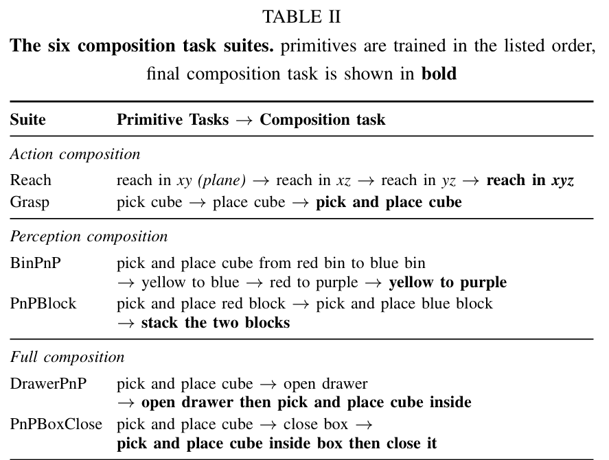
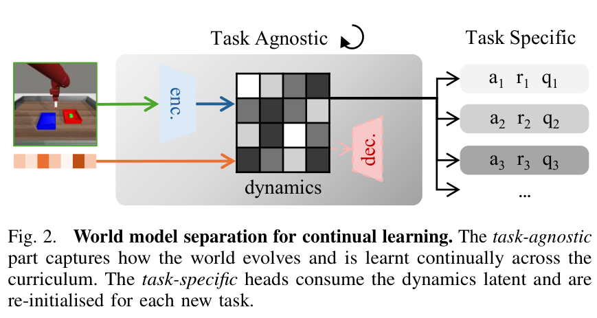
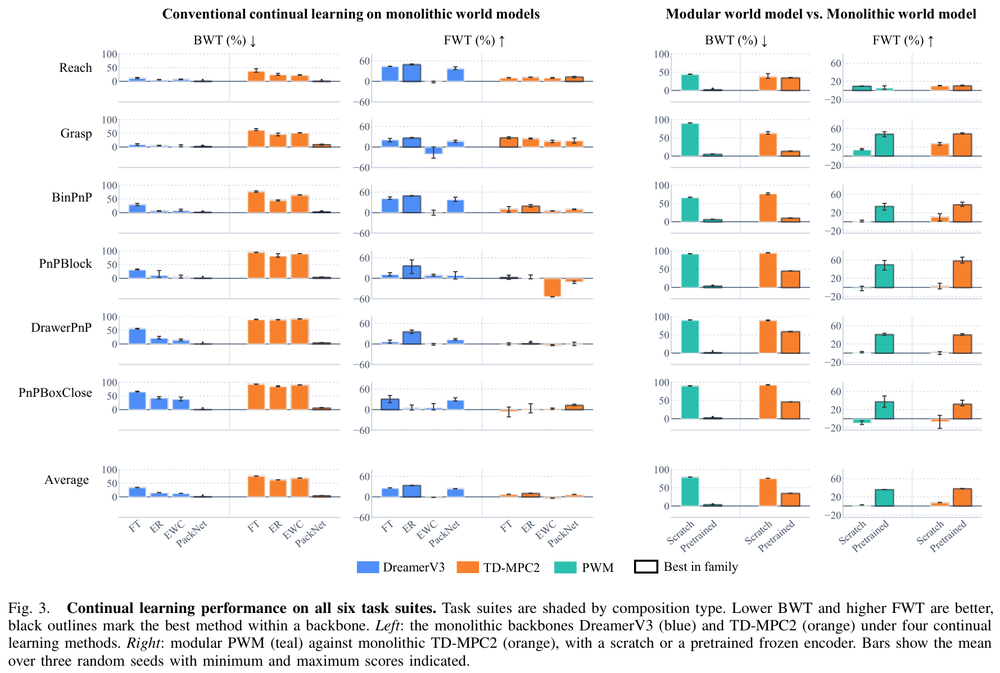
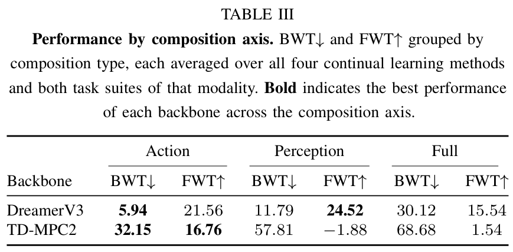
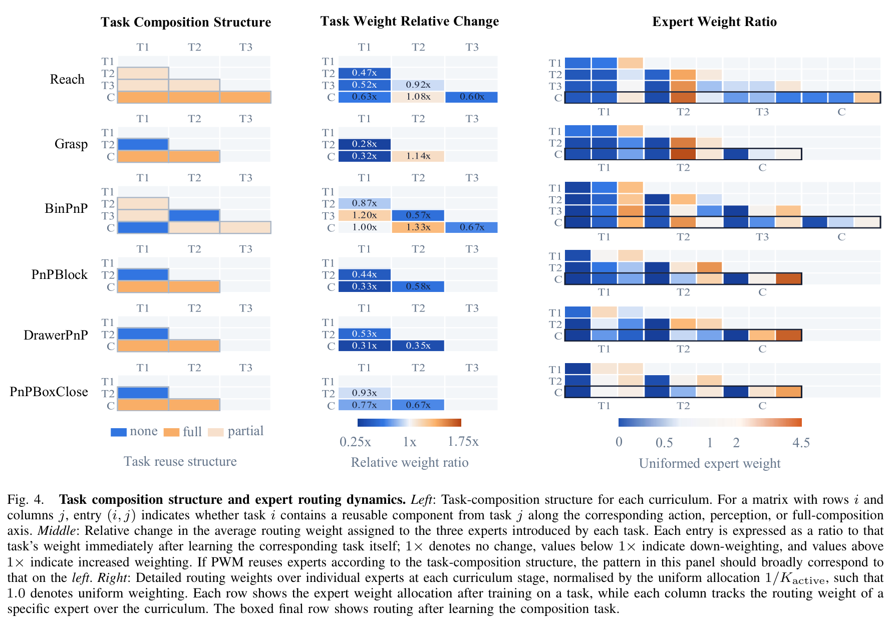
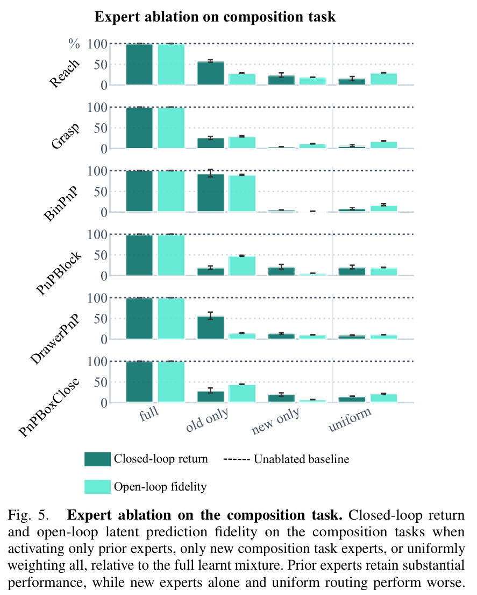

# Benchmarking World Models for Continual Learning on Compositional Tasks (组合任务上世界模型持续学习基准评测)

## 核心信息

- **论文标题**：Benchmarking World Models for Continual Learning on Compositional Tasks
- **中文译名**：组合任务上世界模型持续学习基准评测
- **作者团队**：Haoyu Zhou*, Joe Watson, Anson Lei, Ingmar Posner（牛津大学应用人工智能实验室 Applied AI Lab / A2I，通讯作者为 Haoyu Zhou）
- **发布时间**：2026 年 9 月 18 日 (arXiv: 2609.22055v1)
- **开源代码与项目主页**：[https://object814.github.io/Compositional-Continual-Learning/](https://object814.github.io/Compositional-Continual-Learning/)
- **核心定位**：针对具身智能与机器人操作领域持续学习（Continual Learning, CL）中长期存在的“**新任务学习速度/容量**”与“**先前经验知识复用**”严重混淆的问题，首次提出了一个**以组合任务为终局的持续学习基准**。该基准将物理环境动力学分解为动作与感知两个正交维度，并提出了一种原则性的世界模型解耦架构（任务无关物理骨干 vs 任务特定策略头），系统评测了整块式（DreamerV3、TD-MPC2）与模块化（PWM）世界模型在经典持续学习范式下的真实复用极限。
- **关键战绩与核心结论**：
  - **解耦认知混淆**：现有基准（如 Continual World、LIBERO）的任务序列中新任务同时包含未知内容与重复内容，导致模型无法区分是“学得快”还是“复用了旧知识”。本文每个任务套件均以**前序基元任务的重组（Composition Task）**作为测试终局，通过前向迁移（FWT）精准隔离知识复用。
  - **传统 CL 方法全军覆没于零和博弈**：朴素微调（FT）虽具较高 FWT 但遭遇最严重的灾难性遗忘；正则化方法（EWC）参数被死死锁住，不仅防遗忘差，且在组合任务上甚至出现负迁移（比从头训练还慢）；重放方法（ER）虽有最高 FWT 但缓冲区无界膨胀且仍存在漂移；参数隔离（PackNet）虽近乎零遗忘，但可用参数逐任务单调缩减，可扩展性最差。
  - **生成式像素重构的深层优势**：DreamerV3 在所有 CL 方法下均全面压制无解码器的 TD-MPC2，证明像素重构损失迫使潜在状态编码了全局视觉细节，天然具备更强的跨任务表征持久性。
  - **组合维度的阶梯式难度递增**：BWT（遗忘度）从动作组合（Dreamer 5.94）$\to$ 感知组合（11.79）$\to$ 完全组合（30.12）单调恶化；感知组合直接导致视觉编码器漂移，而 TD-MPC2 一旦面对感知变化其 FWT 瞬间归零甚至为负。
  - **模块化 MoE 的潜力与致命软肋**：在动力学模型中引入显式混合专家（PWM）并冻结历史专家，在配合特权冻结编码器时，取得了近乎零遗忘（BWT 3.85）且持平微调最高 FWT（36.18）的优异成绩；然而一旦脱离特权冻结编码器，其表现立即被打回原形（与整块式持平），**铁证般指明：视觉表征漂移（Encoder Drift）才是世界模型持续复用的核心命门**。

---

## 原文摘要翻译

世界模型的一个理想特性是跨任务进行持续学习的能力，即在适应新环境的同时不遗忘智能体已经习得的知识。特别是，保留并复用从先前经验中获取的知识，构成了智能体高效适应新环境的基石，因为物理世界的动力学规律通常可以由一组反复出现的物理机制来描述。然而，现存世界模型对自适应能力的评估往往将两种能力混淆纠缠在一起：学习全新未知任务的速度与容量，以及复用已获得知识的能力，因为序列中到来的新任务通常既包含全新的内容，也包含反复出现的要素。为了将“从先前经验中复用知识”这一能力独立解耦出来，我们提出了一个面向机器人操作中世界模型的组合式持续学习基准（Compositional Continual Learning Benchmark）。

具体而言，我们设计的每个任务课程都以组合任务收尾，该任务重新组合了序列中先前出现过的各项任务要素。我们进一步将这种组合沿动作（Action）和感知（Perception）两个输入轴进行正交分解，以深入理解不同输入模态如何构成知识复用的瓶颈。我们在经典持续学习方法下评估了最先进的世界模型，并同时评估了一种动力学骨干包含显式可复用组件的模块化世界模型。实验结果表明，模块化设计比传统方法能更好地平衡知识复用与遗忘，但尚无任何现有方法能够彻底解决该问题，这为构建能够“兼顾复用且不遗忘”的持续世界模型留下了明确的研究空间。更多详情可在项目主页获取：https://object814.github.io/Compositional-Continual-Learning/。

---

## 创新点

1. **破除传统持续学习基准纠缠混淆的评测范式（Decoupling Reuse from Raw Learning Speed）**：
   - 首次尖锐地指出：现有具身持续学习基准（如 Continual World、LIBERO）对自适应的度量存在致命缺陷——新任务既包含未见的新物体/新动作，又包含重复要素，导致评估分数无法分辨智能体究竟是“容量大、学新任务快”，还是“真正复用了先前的物理知识”。
   - 本文首创**组合终局式课程序列**：每个任务套件的前序任务为各个原子基元（Primitives），最后一个终局任务严格由前序基元重新组合而成。在此协议下，前向迁移（Forward Transfer, FWT）成为纯粹度量“先前知识复用效率”的黄金指标。
2. **动作与感知双轴正交分解（Input-Modality Factorised Composition）**：
   - 世界模型的本质是“在感知状态下预测动作引起的转移”。本文首次将组合任务沿世界模型的两大条件输入——**动作（Action）**与**感知（Perception）**进行严格的正交分解，构建出三类独立套件：
     - *动作组合*：感知背景与物体固定，动作原语重组；
     - *感知组合*：动作模式固定，物体外观/容器配置重组；
     - *完全组合*：动作与感知同时发生重组。
   - 这使得基准不仅能给出冷冰冰的综合得分，还能精确下钻定位知识复用具体在哪一个输入模态发生了崩溃。
3. **面向持续学习的世界模型原则性解耦范式（Principled World Model Separation）**：
   - 解决了以往持续强化学习中策略、价值与动力学杂糅一团、无法合理施加持续学习算法的混乱现状。
   - 将世界模型在语义上严格拆解为两部分：
     - **任务无关骨干（Task-Agnostic Backbone $\theta$）**：包含观测编码器与动力学转移网络，负责刻画客观世界的物理演化规律，在整个课程序列中持续终身学习；
     - **任务特定头（Task-Specific Heads $\phi_t$）**：包含奖励预测、价值估计与动作策略，每个新任务到来时独立实例化并重置初始化，任务结束后固化存档。
4. **渐进式持续混合专家模块化动力学模型（Continual Progressive MoE / PWM）**：
   - 将静态多任务混合专家模型 PWM 拓展为时序持续学习模型：针对每个新任务动态追加 $K=3$ 个专属动力学专家，同时将先前任务的专家严格冻结，并学习一个跨所有活跃专家的软路由器（Soft Router）。从架构根源上杜绝了对历史物理动态的覆写，实现了参数容量的弹性扩容。
5. **揭示视觉表征漂移的“冻结编码器诊断探针”（Frozen-Encoder Diagnostic）**：
   - 设计了一套极其精妙的控制变量对照实验：在全任务示范上预训练自编码器并予以冻结，彻底消除视觉特征漂移。这一探针实验首次在实证层面上证实：**模块化动力学模型完全能够解决物理层面的“复用且不遗忘”（BWT 3.85，持平微调最高 FWT）；但如果缺乏稳定的视觉表征，编码器漂移就会彻底击垮模块化架构的全部优势**！

---

## 一句话总结

本工作提出了首个通过“前序基元重组为终局任务”来纯粹解耦知识复用的世界模型组合持续学习基准，沿动作与感知双轴揭示了表征漂移的致命瓶颈，并证明显式模块化混合专家能够平衡复用与遗忘，为真正实现“终身物理世界建模”确立了评测标准。

---

## 研究问题

```
+---------------------------------------------------------------------------------------------------+
|                         传统持续学习基准 vs 本文组合持续学习基准 核心差异对比                         |
+---------------------------------------------------------------------------------------------------+
|                                                                                                   |
|  【传统基准缺陷 (如 Continual World / LIBERO)】:                                                    |
|                                                                                                   |
|     Task 1 (开水龙头) ───> Task 2 (推咖啡杯) ───> Task 3 (切面包) ───> Task 4 (关抽屉) ...        |
|                                                                                                   |
|     致命问题：每一个新任务都混合着未见物体与未见动作。                                             |
|     智能体在新任务上学得快，究竟是因为它记忆力超群复用了物理规律，还是因为网络容量大强行死记硬背？ |
|     两者完全纠缠（Entangled），无法单独评估“知识复用”！                                          |
|                                                                                                   |
| ------------------------------------------------------------------------------------------------- |
|                                                                                                   |
|  【本文创新基准 (Compositional Continual Benchmark)】:                                             |
|                                                                                                   |
|     Primitive 1 (XY轴移动) ──> Primitive 2 (XZ轴移动) ──> Primitive 3 (YZ轴移动)                  |
|                                                                     │                             |
|                                                                     ▼                             |
|                                                      【终局组合任务 Composition Task】             |
|                                                        XYZ全空间移动 (精确重组前序基元)            |
|                                                                                                   |
|     核心突破：终局任务的内容完全由前序基元派生重组而来！                                           |
|     前向迁移 (FWT) 指标直接且唯一地度量：智能体能否从旧机制中组装出新技能！                        |
|                                                                                                   |
+---------------------------------------------------------------------------------------------------+
```


### 1. 传统具身持续学习评测的根本盲区：学习能力与复用能力的深层纠缠

在终身学习（Lifelong Learning / Continual Learning）的理想构想中，通用机器人应当在不断遇到新环境、新物体的漫长生命周期中，像人类一样累积经验：**用学过的旧知识加速掌握新技能，同时绝不遗忘已经掌握的老本领**。

然而，现存的机器人持续学习基准（如 Continual World [2]、LIBERO [1]、RoboCasa [10] 等）在评测设计上存在根本性的逻辑漏洞：
- **两两邻近偏移而非累积重组**：以著名的 LIBERO 为例，任务套件由若干顺序排列的任务组成，但每个任务通常只是相对于前一个任务发生了某种物体或位置的微小变换（Pairwise Shift）。序列中不存在任何一个任务被定义为“之前所有基元的集大成者”。模型只需要具备快速拟合单步局部偏移的能力即可获得高分，根本不需要在内存中维持长远的历史知识；
- **新内容与旧机制混杂**：在 Continual World 中，任务序列由完全独立的孤立操作拼凑而成（如拿扳手、推方块、按开关）。当智能体面对一个新任务时，它既要适应从未见过的物体几何形态，又要摸索全新的接触动力学。此时测量得到的“新任务掌握速度”，完全无法分辨出有多少是来自于神经网络强行拟合大容量数据的“蛮力”，有多少是真正把先前学到的物理规律“组合复用”出来的。

### 2. 为什么世界模型是破解组合式持续学习的天然载体？

物理世界的一大本质属性是：**复杂的宏观现象往往由少数几个可复用的底层物理机制（Reusable Mechanisms）支配** [3]–[5]。
- 例如，机械臂在空间中三维移动（Reach xyz），本质是二维平面移动（Reach xy, xz, yz）在笛卡尔坐标系上的正交张成；
- 抓取放置（Pick and Place），本质是抓取物体（Pick）与释放物体（Place）在时序上的有序连接；
- 无论是红色的盒子还是蓝色的盒子，滑块与托盘之间的刚体碰撞、摩擦力与运动学方程是完全同构的。

传统的端到端策略（Model-Free RL 或纯 VLA）将感知、物理动力学、价值判断与控制指令全部糅杂在单一的黑盒神经网络中，一旦任务环境发生改变，黑盒内部所有特征极易发生雪崩式的灾难性遗忘。而**世界模型（World Models）**天然将“物理世界如何演化（动力学转移）”与“特定任务想要达成什么目标（奖励与策略）”分离开来。只要世界模型能够持续、稳定地学习客观物理环境的可复用组件，机器人就能仅凭零样本或极少样本推演，在脑海中完成对新任务的组合规划。

因此，**构建一个专门衡量世界模型在组合任务流中能否“有效复用且不遗忘”的严谨基准，是具身智能迈向真正通用物理底座的关键基石**。

---

## 数据与任务定义


### 1. 六大组合任务套件与正交分解设计（Table II）

作者基于 Meta-World [7] 物理引擎资产，设计了包含 6 个独立套件的组合式持续学习基准。如 Figure 1 和 Table II 所示，整个基准沿世界模型的两大输入维度——**动作（Action）**与**感知（Perception）**展开严格的正交分解：



#### (1) 动作组合套件（Action-composition Suites）
- **特点**：感知环境、桌面背景与操作物体完全保持固定；通过课程序列依次训练独立的动作基元，最终组合任务要求在统一感知下执行多自由度动作的复合。
  - **`Reach` 套件**：
    - Primitive 1: `reach in xy (plane)`（机械臂仅在水平 XY 平面内移动到达目标）；
    - Primitive 2: `reach in xz`（机械臂在 XZ 垂直平面内移动）；
    - Primitive 3: `reach in yz`（机械臂在 YZ 垂直平面内移动）；
    - **Composition Task: `reach in xyz`（三维空间全自由度到达目标）**。
  - **`Grasp` 套件**：
    - Primitive 1: `pick cube`（定位方块并用夹爪牢牢闭合抓起）；
    - Primitive 2: `place cube`（将已抓持的方块移动并准确放置到指定托盘）；
    - **Composition Task: `pick and place cube`（完整的抓取并放置长程操作）**。

#### (2) 感知组合套件（Perception-composition Suites）
- **特点**：动作执行原语（如抓取放置）保持不变；通过改变操作物体的颜色外观、目标收纳料斗（Bin）的色彩与位置组合，考验模型在熟悉动作分布下应对视觉表征重组的能力。
  - **`BinPnP` 套件**：
    - Primitive 1: `pick and place cube from red bin to blue bin`（红框 $\to$ 蓝框）；
    - Primitive 2: `yellow to blue`（黄框 $\to$ 蓝框）；
    - Primitive 3: `red to purple`（红框 $\to$ 紫框）；
    - **Composition Task: `yellow to purple`（前所未见的黄框 $\to$ 紫框全新组合）**。
  - **`PnPBlock` 套件**：
    - Primitive 1: `pick and place red block`（抓放红色积木）；
    - Primitive 2: `pick and place blue block`（抓放蓝色积木）；
    - **Composition Task: `stack the two blocks`（将两块积木精细堆叠）**。

#### (3) 完全组合套件（Full-composition Suites）
- **特点**：动作原语与感知上下文同时发生剧烈变化，组合任务不仅涉及全新的物体交互次序，还涉及多阶段接触力学。
  - **`DrawerPnP` 套件**：
    - Primitive 1: `pick and place cube`（桌面上抓放立方体）；
    - Primitive 2: `open drawer`（握住抽屉把手拉开抽屉）；
    - **Composition Task: `open drawer then pick and place cube inside`（先拉开抽屉，再将立方体精细放入抽屉内部）**。
  - **`PnPBoxClose` 套件**：
    - Primitive 1: `pick and place cube`（抓放立方体）；
    - Primitive 2: `close box`（下压盒盖关闭收纳盒）；
    - **Composition Task: `pick and place cube inside box then close it`（先将立方体装入盒内，再顺畅合上盒盖）**。

### 2. 观察空间与连续控制接口

为了抹平不同算法底座在感知与动作接口上的差异，基准制定了严格对齐的多模态连续控制规范：
- **多视角感知观测 $\mathcal{O}$**：
  - 采用 **3 个互补的相机机位**：俯瞰全景视角（`topview`）、正向工作台视角（`frontview`）以及机械臂末端夹爪主观视角（`gripperPOV`）；
  - 3 个相机的 RGB 图像在通道维度直接堆叠，形成 **9 通道（$9 \times H \times W$）高维张量**；
  - 融合 **7 维本体感觉向量（Proprioception）**：包含末端执行器笛卡尔坐标位姿 $(x, y, z)$、线速度与角速度以及当前夹爪开合宽度。
- **连续动作空间 $\mathcal{A} \subset \mathbb{R}^4$**：
  - 包含末端执行器的 3 维相对位移增量 $\Delta p \in \mathbb{R}^3$；
  - 包含 1 维连续夹爪开闭动作指令 $g \in \mathbb{R}$。
- **稠密奖励与吸收状态设计**：
  - 每个任务设定基于成功判定的**吸收终止状态（Absorbing State）**；
  - 任务奖励被严格重缩放至 $[-1, 0]$ 区间。在这种时间惩罚式奖励机制下，智能体每多消耗一个时步就会累积负分，从而天然倒逼策略寻找用时最短、动作最干练的最优控制轨迹。

---

## 方法主线

```
+---------------------------------------------------------------------------------------------------+
|                            原则性世界模型解耦架构与持续学习闭环 (Algorithm 1)                         |
+---------------------------------------------------------------------------------------------------+
|                                                                                                   |
|   【任务无关通用物理骨干 Task-Agnostic Backbone θ】 (在整个课程序列中持续终身学习!)                    |
|                                                                                                   |
|    9通道多视角相机 o_t ──> [ 视觉编码器 e_θ ] ──+                                                 |
|                                                │ 模态融合                                          |
|    7维机械臂本体感觉  ───> [ 本体感觉 MLP   ] ──+──> 潜在世界状态 z_t                               |
|                                                             │                                     |
|    控制动作指令 a_t   ──────────────────────────────────────┼──> [ 动力学预测器 d_θ ]             |
|                                                                        │                          |
|                                                                        ▼                          |
|                                                               预测下一潜状态 z_hat_{t+1}           |
|                                                                                                   |
|   ─────────────────────────────────────────────────────────────────────────────────────────────   |
|                                                                                                   |
|   【任务特定控制头 Task-Specific Heads ϕ_t】 (每个新任务到达时重新初始化，任务结束后冻结存储)          |
|                                                                                                   |
|                           潜在状态 z_t ───────────────────+                                       |
|                                                           │                                       |
|                                     ┌─────────────────────┼─────────────────────┐                 |
|                                     ▼                     ▼                     ▼                 |
|                              [ 奖励预测头 ]         [ 价值函数头 ]         [ 动作策略头 ]          |
|                                     │                     │                     │                 |
|                                     ▼                     ▼                     ▼                 |
|                                 预测奖励 r_t           状态价值 V(z_t)         策略分布 π(a|z_t)    |
|                                                                                                   |
+---------------------------------------------------------------------------------------------------+
```


### 1. 原则性世界模型解耦框架（Figure 2 & Algorithm 1）



如 Figure 2 所示，论文从第一性原理出发，确立了世界模型在持续学习中的语义划分标准：
- **世界模型参数化划分**：$\mathcal{W} = (\theta, \phi_t)$；
- **任务无关骨干（$\theta$）**：
  - 编码器 $e_\theta(z_t \mid z_{t-1}, a_{t-1}, o_t)$：负责从原始多视角与本体感觉中提取紧凑、充沛的物理潜在状态 $z_t$；
  - 动力学转移模型 $d_\theta(z_{t+1} \mid z_t, a_t)$：负责在潜在空间中模拟物体受力、运动与形变的通用演化规律；
  - 观测重构解码器（若存在，如 DreamerV3）：负责将潜在状态映射回像素空间。
  - **生命周期**：整个任务序列 $t=1, \dots, T$ 中持续保持活动状态，接受持续学习算法（如 ER, EWC, PackNet）的终身更新与约束约束。
- **任务特定头（$\phi_t$）**：
  - 包括特定任务的奖励头 $r(z_t)$、价值函数网络 $V(z_t)$ 以及 Actor 策略网络 $\pi(a_t \mid z_t)$；
  - **生命周期**：不同任务的优化目标（Goal）迥异，因此当新任务到来时，旧任务头被完整冻结存档（用于评估后续的遗忘度），并为当前任务实例化全新的任务头 $\phi_t$ 进行独立更新。

### 2. 三大代表性基准世界模型的接口适配

论文选取了基于模型的强化学习（MBRL）领域三大极具代表性的底座：
1. **DreamerV3 (Nature 2025)**：
   - 代表**包含显式解码器的随机循环状态空间模型（RSSM）**。
   - 内部包含确定性 GRU 隐藏层与由分类分布构成的离散随机潜变量（Categorical Stochastic Latents）；
   - 依赖像素级生成重构损失，不仅重构当前帧，而且在想象推演中直接通过策略网络产生动作。
2. **TD-MPC2 (ICLR 2024)**：
   - 代表**舍弃解码器（Decoder-Free）、纯潜在空间确定性预测模型**。
   - 舍弃了昂贵的像素重构，仅通过时序差分（TD-Learning）、潜在表征一致性损失（SimNorm 归一化）和奖励预测来共同约束潜在状态空间；
   - 在测试期通过模型预测控制（MPPI 采样算法）在隐空间进行局部在线规划。
3. **PWM (Prismatic World Model, 2025)**：
   - 代表**混合专家（MoE）模块化世界模型**。
   - 在 TD-MPC2 骨干的基础上，将单一的动力学 MLP 拆解为多个并行独立的动力学专家网络，并通过自适应软路由将各个专家的输出进行加权融合。

### 3. 整块式模型上的四大经典持续学习范式

为了检验传统持续学习手段能否解决世界模型的复用问题，论文将四大经典范式无缝嵌入到任务无关骨干 $\theta$ 的更新过程中：
- **朴素微调（Fine-Tuning, FT）**：基线对照组。新任务到来时无任何约束地直接梯度更新骨干 $\theta$，代表纯粹的可塑性（Plasticity）。
- **经验重放（Experience Replay, ER）**：重放流派代表。针对每个历史任务分配一个严格限制为 **5% 原始样本容量**的缓冲区，在当前任务梯度回传时均匀混合历史回放数据，抵抗动力学遗忘。
- **弹性权重整合（Elastic Weight Consolidation, EWC）**：正则化流派代表。在任务训练结束时计算骨干参数在当前数据上的对角 Fisher 信息矩阵 $F$，在新任务更新时加入二次惩罚项 $\frac{\lambda}{2} \sum_j F_j (\theta_j - \theta_j^*)^2$，强行锁定核心物理参数。
- **参数隔离（PackNet）**：架构隔离流派代表。每个任务训练完成后，对网络权重进行幅度剪枝，仅保留 **25% 的活跃参数**并彻底冻结；新任务仅在剩余的空闲权重上进行训练，推断时激活所有历史已分配的子网。

### 4. 渐进式持续混合专家架构（Continual PWM）与冻结编码器探针

针对整块式网络容量固定、读写冲突的根本死结，作者对 PWM 进行了开创性的持续学习改造：

```
+---------------------------------------------------------------------------------------------------+
|                        Continual PWM 渐进式多任务专家追加与路由机制                                |
+---------------------------------------------------------------------------------------------------+
|                                                                                                   |
|   Task 1 到达:                                                                                    |
|     分配并训练 Expert 1, 2, 3 (当前任务结束后严格永久冻结!) ──────────> [ Router 学习权重 ]       |
|                                                                                                   |
|   Task 2 到达:                                                                                    |
|     冻结 Expert 1, 2, 3                                                                           |
|     追加并训练 Expert 4, 5, 6 (任务结束后永久冻结!) ──────────────────> [ Router 学习权重 (覆盖1-6)] |
|                                                                                                   |
|   Task 3 (终局组合任务) 到达:                                                                     |
|     冻结 Expert 1 ~ 6                                                                             |
|     追加 Expert 7, 8, 9                                                                           |
|     Router 可无惩罚、自由地同时调度 Expert 1 ~ 9! ────────────────────> [ 最终组合潜在状态 z_t ]    |
|                                                                                                   |
+---------------------------------------------------------------------------------------------------+
```

- **持续渐进扩展（Progressive MoE）**：每到来一个新任务，为系统动态追加 $K=3$ 个全新可训练动力学专家，同时将所有历史任务对应的专家彻底置为 `requires_grad=False`；路由器（Router）具有全局视界，能够直接对当前全部活跃专家输出 Softmax 加权系数。
- **冻结编码器诊断探针（Frozen-Encoder Diagnostic）**：
  - 核心痛点：PWM 的专家虽然可以冻结，但前端的视觉编码器依然是一个整块网络，在不断更新中会导致表征分布严重漂移（Covariate Shift），使得原本学好的动力学专家失效。
  - 探针方案：在基准全量示范数据上预训练一个纯自编码器，并在后续整个持续学习生命周期中**完全锁死冻结该编码器**；同时将完全相同的冻结编码器检查点同步赋予 TD-MPC2 作为严苛对照组，从而**在数学上彻底剥离表征漂移的干扰，精准度量动力学模块化设计本身的净收益**。

---

## 关键结果

### 1. 核心评估指标体系

评估协议严格追踪两个核心标量指标（归一化至 $[0, 100]$，0 代表失败基底，100 代表脚本化 Oracle 专家）：
- **后向迁移（Backward Transfer, BWT，遗忘度）**：
  $$\text{BWT} = \frac{1}{T-1} \sum_{i=1}^{T-1} \left( R_i(i) - R_i(T) \right)$$
  度量智能体在全部任务学完后，在先前各个基元任务上的性能滑坡。**BWT 越低，说明抗遗忘能力越强（理想为 0）**。
- **前向迁移（Forward Transfer, FWT，复用度）**：
  $$\text{FWT} = \frac{AUC(\text{Continual on Composition}) - AUC(\text{Scratch on Composition})}{AUC(\text{Oracle}) - AUC(\text{Scratch on Composition})} \times 100\%$$
  度量利用先前经验在终局组合任务上的学习曲线下面积（AUC），相比于从零从头学习（From Scratch）的加速超额增益。**FWT 越高，说明知识复用越彻底**。

---



### 2. 主结果总览：整块式基准与持续学习方法的全面博弈（Figure 3）


如 Figure 3 所示，全套基准评测暴露出了传统持续学习方法在世界模型上的巨大裂痕：

#### (1) DreamerV3 对 TD-MPC2 的全方位压制
- 无论是在朴素微调（FT）还是在 ER、EWC、PackNet 下，**DreamerV3 在 BWT（抗遗忘）和 FWT（知识复用）上均显著优于 TD-MPC2**；
- **机理深剖**：DreamerV3 依赖像素级自编码重构损失，这一无监督生成目标强迫潜在状态保留整个画面的几何构型与环境细节，天然形成了一个平滑且分布广泛的跨任务通用先验；而 TD-MPC2 舍弃了解码器，纯粹依靠特定任务的奖励信号与 TD 误差反向塑造潜变量，导致其潜在空间极度狭隘地偏向当前任务，一旦任务切换，旧任务的特征结构迅速瓦解。

#### (2) 传统持续学习方法在 BWT 与 FWT 间的零和困局
- **微调（Fine-Tuning）**：FWT 高居前列，但 BWT 灾难性爆发（遗忘最严重）。因为模型读取的权重正是它肆意覆写的权重，没有任何机制区分“重组旧机制”与“篡改旧机制”。
- **经验重放（ER）**：取得了全场最高的 FWT，且遗忘度比微调缩减近一半。然而随着任务不断涌入，重放缓冲区无界膨胀，且对于长程动力学的回放依然无法从根本上遏制参数漂移。
- **弹性权重整合（EWC）**：**全场表现最差**。Fisher 惩罚将参数死死锁在旧极小值附近，导致模型既不能移动旧参数以完成技能组合，又没有额外的空闲参数去拟合新组合。在多个套件上其 FWT 甚至跌为严重的负值（显著慢于从头学习！）。
- **参数隔离（PackNet）**：在传统方法中最接近理想平衡，将 BWT 压制到接近于 0，同时保留了可观的 FWT。但其致命缺陷在于“拆东墙补西墙”：随着任务增加，空闲参数按等比单调衰减，理论上根本无法支持长达几十个任务的真实持续学习。

---


### 3. 沿组合轴向的阶梯式难度递增（Table III）



如 Table III 所示，基准将 6 个套件按组合维度拆解后，呈现出了极具启发性的规律：

| 骨干模型 (Backbone) | 动作组合 (Action) BWT $\downarrow$ | 动作组合 (Action) FWT $\uparrow$ | 感知组合 (Perception) BWT $\downarrow$ | 感知组合 (Perception) FWT $\uparrow$ | 完全组合 (Full) BWT $\downarrow$ | 完全组合 (Full) FWT $\uparrow$ |
| :--- | :---: | :---: | :---: | :---: | :---: | :---: |
| **DreamerV3** | **5.94** | 21.56 | 11.79 | **24.52** | 30.12 | 15.54 |
| **TD-MPC2** | 32.15 | **16.76** | 57.81 | **-1.88** | 68.68 | 1.54 |

- **BWT 的单调恶化链条**：在两个骨干上，遗忘度均呈现极为严格的递增规律：
  $$\text{Action Composition (动作组合)} \longrightarrow \text{Perception Composition (感知组合)} \longrightarrow \text{Full Composition (完全组合)}$$
- **感知瓶颈的决定性破坏力**：
  - 在**动作组合**下，视觉背景和物体完全固定，动力学模型所面对的仅仅是在极其稳定的视觉潜在空间上分布发生偏移的动作输入，因此遗忘最轻；
  - 一旦引入**感知组合**，不同颜色的物体与收纳框直接冲击视觉编码器，导致整个潜空间发生剧烈的分布偏移（Covariate Shift），进而使下游动力学预测彻底脱节；TD-MPC2 在感知组合下的 FWT 暴跌至 **-1.88**（彻底丧失复用能力）；
  - 在**完全组合**下，动作与感知同时发生紊乱，DreamerV3 的遗忘度飙升至 30.12，TD-MPC2 更是崩溃至 68.68，**证明没有任何现有整块世界模型能够在此终极测试中幸免于难**。

---

### 4. 模块化混合专家（PWM）的突破与受控探针实测（Figure 3 右）

在 Figure 3 右侧的受控对照实验中，PWM 展现出了惊人的机制对比：

- **在冻结编码器诊断模式下（Frozen Encoder Diagnostic）**：
  - PWM 取得了全场震撼的 **BWT 3.85**（几乎彻底清零遗忘！），同时其 FWT 达到了 **36.18**，完美追平了无约束微调下的 TD-MPC2（38.11）；
  - 这证明显式模块化 + 历史专家冻结，能够在数学上彻底切断新旧知识在动力学层面的参数覆写冲突，完美释放了重组潜力！
- **在常规从头训练模式下（Scratch Encoder）**：
  - 然而，一旦剥离特权冻结编码器，让 PWM 的编码器像常规设置一样在线微调，PWM 的表现立即大幅滑坡，与整块式 TD-MPC2 几乎完全没有统计学差异！
  - **核心启示**：这一结果极其深刻地证明——**世界模型持续学习的真正瓶颈不在动力学本身，而在感知编码器！没有一个抗漂移的稳定多模态视觉表征底座，再优雅的动力学模块化设计都只是空中楼阁**。

---

### 5. 探针分析：模块化世界模型究竟有没有真正复用历史专家？（Figure 4 & Figure 5）

为了彻底搞清 PWM 是“真复用”还是“靠新加的专家死记硬背”，作者展开了系统化的专家路由拓扑追踪与消融实验：




#### (1) 路由权重忠实还原已知组合拓扑（Figure 4）
- 在 `Reach`、`Grasp` 和 `BinPnP` 套件中，学习到的专家路由权重与已知的任务组合矩阵展现出令人惊叹的高度一致性；
- **具体实证**：在 `BinPnP` 训练第三个任务（红框 $\to$ 紫框）时，路由器将分配给重合历史任务（红框 $\to$ 蓝框）专家的权重放大至 **1.20 倍**，而将毫无重合的任务（黄框 $\to$ 蓝框）专家的权重强力压制至 **0.57 倍**；
- 此外，专家层级的偏好极度稳固：在 14 组基元情形中，**有 13 组基元内部原本最优的专家，在经历终局组合任务训练后依然高居该任务的路由榜首**！

#### (2) 任务级固定路由在时序组合上的致命缺陷
- 然而在 `PnPBlock`、`DrawerPnP` 和 `PnPBoxClose` 这三个涉及**时间分阶段（Temporally Composed）**的任务上，路由矩阵未能呈现清晰的拓扑对应；
- **原因剖析**：PWM 的路由器是**任务条件化（Task-Conditioned）**的静态权重分配，为一个任务指定一组固定的专家混合比例。但在“先拉开抽屉、再放方块”这种长程时序任务中，前半段需要纯粹的拉把手动力学，后半段需要精细抓放动力学。**静态路由器无法在时间轴上动态切换专家，直接导致时序组合任务的复用机制受阻**。




#### (3) 专家消融实验的决定性实证（Figure 5）
作者在终局组合任务上对专家访问权限进行了切除消融（Figure 5）：
- **仅激活历史专家（Prior experts only）**：在 `BinPnP` 上几乎 100% 完美复现了完整混合模型的闭环累积回报；在 `Reach` 和 `DrawerPnP` 上同样保留了绝大多数控制回报！这决定性地证实了历史专家确实承载了功能性的物理动力学。
- **仅激活新增专家（New experts only）**：在所有套件上表现发生断崖式下跌，完全无法单独完成组合任务。
- **均匀随机路由（Uniform routing）**：性能同样大幅受挫，证明单纯拥有这批专家是无用的，精准学习路由权重才是激活知识复用的核心灵魂。

---

## 深度分析

### 1. 真正贡献是什么：确立了具身世界模型从“假通用”走向“真复用”的度量衡

过去五年间，机器人学习领域充斥着关于“通用世界模型”、“零样本泛化”的宏大叙事。然而绝大多数工作展示的所谓泛化，本质上只是在大规模多任务混合训练集上的**网格插值（Interpolation）**。一旦将模型置于真实世界“时间单向流逝、任务依次到来”的物理现实中，所有模型几乎无一例外地陷入严重的灾难性遗忘。

牛津大学这项工作的非凡贡献在于：
1. **第一次建立了严谨的因果隔离范式**：通过“前序基元 $\to$ 终局重组”的纯粹拓扑，将持续学习的评估指标直接对准了智能体的核心智能体现——**组合泛化与知识复用**；
2. **揭穿了传统持续学习方法的无力感**：实证证明在整块式世界模型中，现存的正则化（EWC）、重放（ER）和剪枝（PackNet）均只是在同一个不可调和的帕累托前沿上做痛苦折中，无法作为具身通用智能的终极底座；
3. **锚定了未来具身架构的主攻方向**：通过冻结编码器诊断实验，铁证般宣告了单纯在动力学层面做文章的局限性，明确指出**稳定的抗漂移通用视觉表征底座才是世界模型破局的前提**。

### 2. 为什么结果成立：物理流形与神经网络参数空间的几何学机理

我们可以从高维优化流形与动力学系统理论更深刻地理解这些现象背后的本质机理：

1. **生成式重构（DreamerV3）vs 辨别式自监督（TD-MPC2）的流形覆盖差异**：
   - 设全环境状态流形为 $\mathcal{M}$，特定任务 $t$ 奖励相关的子流形为 $\mathcal{M}_t \subset \mathcal{M}$。
   - TD-MPC2 的潜在损失函数形式为：$\mathcal{L}_{\text{latent}} = \|\text{norm}(z_{t+1}) - \text{norm}(\hat{z}_{t+1})\|_2^2 + \mathcal{L}_{\text{reward}}$。由于没有任何重构原始观测 $o_t$ 的压力，网络为了最小化 TD 误差，会将与当前奖励无关的全部背景、非交互物体坐标投影到零空间（Null Space）。当任务切换到 $t+1$ 时，原先被压入零空间的几何维度必须被强行重新激活，导致权重空间发生剧烈的正交旋转，造成剧烈遗忘。
   - 而 DreamerV3 强制要求潜在状态通过解码器 $p(o_t \mid z_t)$ 重建全部 9 通道像素，迫使其潜在状态必须保角映射整个环境流形 $\mathcal{M}$ 的几何骨架，因此在面对感知扰动时天然具备缓冲带。
2. **模块化动力学解耦与流形局部逼近**：
   - 物理世界的动力学在不同接触状态下呈现典型的非光滑杂化系统（Hybrid Dynamical System）特性（例如自由空间飞行 vs 刚性碰撞接触）。整块式 MLP 试图用单一连续李代数逼近全域非线性动力学，各阶段梯度在反向传播时必然产生强烈的破坏性干涉。
   - PWM 的混合专家本质上是一组局部的切空间基底（Local Tangent Bases），通过路由器的凸组合 $\sum_k w_k f_k(z_t, a_t)$ 逼近全局动力学。冻结历史专家在几何上相当于锁定了已知流形面片的切空间方向，从而彻底隔绝了梯度干涉。

### 3. 容易误读的地方（三大认知误区澄清）

- **误区一：既然 PWM 在冻结编码器下近乎零遗忘且复用极强，那它是不是已经彻底解决了世界模型的持续学习问题？**
  - **澄清**：绝对没有。论文作者在正文中多次极其克制、严谨地强调：**这只是一个诊断性概念验证（Diagnostic Evidence），绝不能被误读为一种拿来即用的 SOTA 方法**！因为在真实世界中，机器人不可能在没有探索新任务之前，就预先拿到全套任务的专家示范去训练一个“全知全能的特权视觉编码器”。脱离这个特权后，PWM 的表现与整块模型并无二致。这恰恰是论文旨在警醒社区的核心警钟。
- **误区二：任务级固定路由（Task-Conditioned Routing）表现不佳，是否意味着 MoE 架构在时序长程任务中失效了？**
  - **澄清**：失效的不是 MoE 架构本身，而是**将路由器绑定在全局静态任务标签上**的设计。在长程任务中，动力学的激活与时间步和物体接触状态紧密耦合。未来的模块化世界模型必须转向**状态自适应条件化（State-Conditioned Routing）**甚至**时空局部注意力门控**，让路由器能够根据当前隐状态 $z_t$ 在微秒级实时切换动力学专家。
- **误区三：动作组合、感知组合与完全组合是三个孤立的测试集吗？**
  - **澄清**：不是孤立的数据集，而是三种系统化的**分布偏移因式分解（Factorisation）**。它们全部共享相同的机械臂物理实体、动作空间和相机机位，其差异仅在于课程序列推进过程中扰动施加的具体输入通道。这是一种控制变量的实验设计，而非拼凑无关的外部基准。

### 4. 复现注意点与工程踩坑指南

1. **多视角 9 通道图像与本体感觉的编码融合**：
   - 官方实现中，观测包含 3 路相机（topview, frontview, gripperPOV）。若复现时直接使用预训练的 ResNet/ViT 单目权重，必须修改第一层卷积核通道数为 9；
   - 7 维本体感觉向量在尺度上与归一化图像特征差异巨大，必须先经过一个两层独立 MLP 投影至相同隐空间维度，再通过拼接（Concat）或门控加和完成融合，切忌直接在输入端无归一化拼接。
2. **吸收状态（Absorbing State）与奖励重缩放的严格对齐**：
   - Meta-World 原生奖励通常在 $[0, 10]$ 或 $[0, 100]$ 区间。本文为了实施严格的最小时间控制，将所有任务奖励归一化重映射至 $[-1, 0]$ 区间，并在成功完成任务后进入持续给予 0 奖励的吸收终止状态。如果遗漏吸收状态设置，策略将无法在有限步数内区分“早完成”与“晚完成”，导致训练崩溃。
3. **PackNet 剪枝率与课程长度的容量预算规划**：
   - PackNet 在每个任务后保留 25% 剩余可用参数。若序列任务数达到 5 个以上，后续任务分配到的参数量将呈几何级数萎缩（$1 \to 0.25 \to 0.0625 \to 0.0156 \dots$），导致后序复杂组合任务甚至无法容纳一个基础全连接层。在复现更长课程时，必须采用动态剪枝率或分层渐进式扩容。

---

## 局限

1. **纯仿真模拟环境依赖（Simulation Only）**：
   - 评测全部在 Meta-World 仿真环境中进行。在线基于模型的强化学习（Online MBRL）采样开销极其庞大，单个任务需要 $10^5 \sim 10^6$ 环境步，6 个套件在多随机种子下的计算量高达千万步级，目前难以直接搬上真实物理机械臂。
2. **依赖稠密奖励与自动化环境重置（Dense Reward & Simulator Resets）**：
   - 基准深度依赖仿真器提供的逐帧稠密奖励引导，以及失败后的无成本瞬间重置。在现实开放世界部署中，机器人无法获得密集的物理步级奖励，需要结合自主学习的视觉奖励函数或意图识别器。
3. **固定规模未施加算力平权（Compute Budget Parity）约束**：
   - 模块化模型 PWM 随任务增加而动态追加专家，其总体参数量随着课程演进逐步超越了固定参数量的整块式基准（DreamerV3 和 TD-MPC2）。尽管论文展示了其架构优势，但严格受控的“恒定总参数量/计算浮点数平权评测”仍留待后续工作进一步细化。

---

## 我的笔记：持续学习与具身世界模型全景横评

为了建立宏观学术图谱，我们将本工作与具身智能领域代表性基准进行横向对标：

| 维度 / 基准 | **Ours (牛津 A2I 2026)** | **Continual World (2021)** | **LIBERO (NeurIPS 2023)** | **CompoSuite (2022)** | **CausalWorld (ICLR 2021)** | **DINO-WM (2024)** |
| :--- | :--- | :--- | :--- | :--- | :--- | :--- |
| **机构团队** | 牛津大学 A2I 实验室 | 华沙大学 / DeepMind | 斯坦福 / UT Austin | 宾夕法尼亚大学 | 普朗克所 / 蒙特利尔 | 纽约大学 / Meta (LeCun) |
| **测试核心机制** | **前序基元重组为终局组合任务** | 孤立独立任务时序拼接 | 两两邻近相对分布偏移 | 静态四轴正交组合 | 显式因果物理因子干预 | 通用预训练表征零样本规划 |
| **是否隔离知识复用** | **是 (首创，FWT 纯粹度量复用)** | 否 (纠缠新任务学习速度) | 否 (局部适应即可刷分) | 否 (静态训练，无时序流) | 否 (非时序到达) | 否 (无持续学习设定) |
| **模态正交分解** | **动作组合 vs 感知组合 vs 完全组合**| 无模态解耦 | 空间/物体/目标/长程 | 机器人/物体/目标/障碍 | 质量/摩擦力/颜色 | 纯自监督视觉特征 |
| **世界模型架构设计** | **任务无关骨干 vs 任务特定头原则解耦**| 纯 Model-Free 策略混合 | 纯策略策略学习 (BC/VLA) | 模块化策略组合 | 经典控制/RL策略 | 冻结 DINOv2 特征动力学 |
| **评测世界模型底座** | **DreamerV3, TD-MPC2, PWM** | SAC 等纯无模型 RL | 模仿学习与扩散策略 | 模块化深度强化学习 | PPO, SAC 等 | 潜在世界模型 |
| **最大学术启示** | **表征漂移是世界模型持续复用的命门**| 揭示了无模型 RL 的灾难遗忘 | 确立了终身机器人模仿学习标杆 | 证实了组合式架构的泛化潜力 | 奠定了因果表征干预评测 | 证实大模型自监督表征的通用性 |

### 独家学术评述与总结

牛津大学的这篇工作虽然篇幅仅有 9 页，但其学术锐度极其锋利。在当今学术界沉迷于用海量 GPU 暴力堆砌多任务数据的狂热潮流中，作者冷静地回溯到了智能的本质命题：**如何让机器在时间的长河中，真正通过“积木式”的重组来复用已知物理世界的碎片？**

论文的最深刻之处在于其**“不掩饰局限、用负结果说话”**的科学诚实：
- 它没有吹嘘 PWM 是什么打败一切的万能药，而是通过冷酷的实验数据告诉大家：**如果不给 PWM 一个全知全能的预训练冻结编码器，所谓精妙的动力学模块化设计立刻就会被视觉特征的表征漂移击溃**。
- 这项发现直接指明了下一代通用具身世界模型的破局路线：**未来的物理世界模型必须建立在像 DINOv2、CLIP 甚至前文探讨过的 NowWAM 这样具有深厚多尺度不变性的基础视觉表征之上，再在其上嫁接具备状态自适应路由的动态物理专家系统**。唯有如此，通用机器人才能在浩瀚未知的物理宇宙中，真正实现“边走边学、温故知新”的终身演进！

---

## 引用

```bibtex
@article{zhou2026benchmarking,
  title={Benchmarking World Models for Continual Learning on Compositional Tasks},
  author={Zhou, Haoyu and Watson, Joe and Lei, Anson and Posner, Ingmar},
  journal={arXiv preprint arXiv:2609.22055},
  year={2026}
}
```
