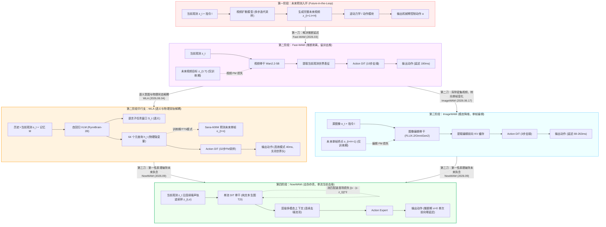

# 从 Fast-WAM、WLA、ImageWAM 到 NowWAM：具身世界动作模型的“未来预测去虚存真”演进史与深度四方异同剖析

> [!abstract] 核心认知结论速览（Executive Summary）
> 1. **具身世界动作模型（WAM/WLA）的四年探索，本质是一场围绕“未来预测在控制中究竟扮演什么角色”的连续四次范式突围**：
>    - **第一阶段 · Fast-WAM (2026.03)**：**“测试期去虚”**——发现测试时根本不需要生成未来视频，将显式 rollout 剪除，仅保留训练期未来视频流匹配协同训练，把推断延迟从 800ms+ 压至 190ms；
>    - **第二阶段 · WLA (2026.06.04)**：**“语义与动力学解耦”**——提出世界-语言-动作统一模型，不再把未来视为纯像素视频，而是拆解为“自回归语言子任务窗口（语义意图）+ 元查询物理隐变量 $h_t$（动力学）”，用 2D Sana-600M 预测未来单帧终点，高效模式直接关闭世界专家（40ms），高算力模式开启测试期扩展（Best-of-K）；
>    - **第三阶段 · ImageWAM (2026.06.17)**：**“视频模态去虚”**——进一步发现纯 DiT 架构中训练期也不需要预测包含无关细节的整段未来视频，将其降维为预测未来单帧终点的“图像编辑任务”，将训练/推断 FLOPs 压低至 1/6；
>    - **第四阶段 · NowWAM (2026.09)**：**“未来目标彻底去虚”**——发出第一性原理灵魂拷问：如果测试期完全不用未来，训练期预测未来真的必要吗？通过严格受控实验证明**预测过去（83.80%）与预测未来（82.89%）效果完全等价**！这彻底戳穿了“前向视频推演是唯一物理先验”的幻觉，证明真正起效的是**流匹配去噪轨迹的几何与语义平滑正则项**。进而提出单流当前帧去噪，不仅视觉 Token 减半、训练提速 1.8 倍，且在 LIBERO-Plus 极限扰动上刷新至 87.8%（视角扰动 88.6% 碾压全场）。
> 2. **表征接口的拓扑演进谱系**：
>    - Fast-WAM：$[l \mid z_t \mid z_{1:T, \sigma} \mid a]$（多帧视频双流，密集时空 Token）
>    - WLA：$[l, o_{t-h}, o_t, M \xrightarrow{\text{LLM}} (S_t, h_t)] \to [h_t, o_t \xrightarrow{\text{Sana}} o_{t+n}] + [h_t, q_t \xrightarrow{\text{Act}} a]$（VLM 自回归元查询 + 双专家分流）
>    - ImageWAM：$[l \mid z_t \mid z_{t+H+1, \sigma} \mid a]$（单帧编辑双流，784 视觉 Token）
>    - NowWAM：$[l \mid z_{t, \sigma} \mid a]$（**当前帧单流强耦合，392 视觉 Token，推断期评估 $\sigma=0$ 纯净端点**）
> 3. **骨干生态的彻底解放**：
>    - 从依赖定制视频扩散模型（Wan2.2-5B）$\to$ 依赖 VLM + 扩散混合堆叠（RynnBrain + Sana）$\to$ 依赖图文编辑模型（OmniGen2 / FLUX.2）$\to$ **无缝接入最通用的开源纯文本生图（T2I）DiT（Z-Image-6B / FLUX2-Klein-4B）**，彻底打破了具身模型被少数昂贵视频基座锁死的困局。

---

## 1. 四大具身世界模型技术全景对照表

为了系统厘清四者之间的技术脉络，下表从底层假设、网络结构、Token 消耗、语言与记忆机制到真实性能进行了全面多维横向对标：

| 维度 / 特性 | **Fast-WAM (2026.03)** | **WLA / WLA-0 (2026.06.04)** | **ImageWAM (2026.06.17)** | **NowWAM (2026.09, 本文)** |
| :--- | :--- | :--- | :--- | :--- |
| **论文标题** | *Fast-WAM: Do World Action Models Need Test-time Future Imagination?* | *World-Language-Action Model for Unified World Modeling, Language Reasoning, and Action Synthesis* | *ImageWAM: Do World Action Models Really Need Video Generation, or Just Image Editing?* | *Beyond Future Prediction: Denoising as Generative Adaptation for Robot Control* |
| **机构团队** | 清华大学交叉信息院 / Galaxea AI (赵行团队等) | 上海交大 / 上海 AI Lab / 华科 (邓智杰团队等) | 上海交大 / 东方理工 / 腾讯 Robotics X / 清华 (杨小康、金鑫等) | 加州大学圣迭戈分校 (UCSD) / 香港大学 / 普林斯顿大学 (王梦迪、刘世龙等) |
| **追问的核心问题** | 部署测试时真的必须显式生成未来视频吗？ | 动作到底需要什么层级的未来表征？语言推理与物理世界建模如何统一？ | 训练时真的需要昂贵的视频生成吗，还是只需图像编辑？ | 如果推断弃用未来，训练期预测未来真的是必要条件吗？生成先验到底如何自适应控制？ |
| **范式定位** | **留训去推 · 视频世界模型** | **自回归 VLM + 双专家分流统一模型** | **留训去推 · 图像编辑世界模型** | **去伪存真 · 单流当前帧去噪自适应模型** |
| **视觉骨干类型** | 专用视频扩散 DiT (Wan2.2-5B) | **混合架构**：RynnBrain-2B (自回归 VLM) + Sana-600M (2D DiT 世界专家) | 专用图像编辑 DiT (OmniGen2, Ovis-U1, FLUX.2-Edit) | **通用纯文本生图 (T2I) DiT** (FLUX2-Klein-4B, Z-Image-6B) |
| **动作专家模块** | 独立 Action DiT (~1B)，逐层读取视频前向 KV | 独立 0.39B 流匹配动作头，读取元查询 $h_t$ 与状态 $q_t$ | 独立 Action DiT (~0.64B-1.1B)，读取编辑前向 KV | 独立 Action DiT-MoT 专家，读取连续去噪特征 |
| **语言与推理角色** | 外部静态条件文本（T5 编码），无文本生成 | **原生参与闭环**：自回归预测子任务窗口 $S_t$，维护显式记忆 $M$ | 任务级写死 prompt（Qwen3-4B cache），无文本生成 | 外部文本条件，通过 T2I 语言编码器注入 |
| **训练期辅助目标** | 未来多帧视频潜变量 $z_{1:T}$ 的流匹配恢复 | 未来单帧目标图像 $o_{t+n}$ (或 $t+32$) 的 2D 潜在流匹配 | 未来单帧目标图像 $z_{t+H+1}$ 的图像编辑流匹配 | **彻底剔除未来目标**；当前观测潜变量 $z_t$ 的扰动去噪速度场 |
| **概念训练流表示** | $[l \mid z_t \mid z_{1:T, \sigma} \mid a]$ | $[l, o, M \to S_t, h_t] \to [o_{t+n}, a]$ | $[l \mid z_t \mid z_{t+H+1, \sigma} \mid a]$ | $[l \mid z_{t, \sigma} \mid a]$ |
| **输入拓扑形式** | **双流（Two-Stream）**：当前干净流 + 未来多帧带噪流 | **三分支分流（Tri-Branch）**：VLM 主干汇聚 $\to$ 世界专家与动作专家解耦 | **双流（Two-Stream）**：当前源图流 + 未来带噪编辑流 | **单流（Single-Stream）**：当前观测自身沿去噪轨迹加噪 |
| **训练视觉 Token** | 密集多帧时空 Token (通常 $\ge 784$) | 基础图像 Token + 64 个 Meta-Query Token | 784 (源图 392 + 目标图 392) | **392 (腰斩 50%)** |
| **训练单步耗时** | 较长 (受制于多帧或双流计算) | 中等 (Sana-600M 较轻，但有 VLM 自回归) | 2.85 秒 (2$\times$H200, BS=64, FLUX2-4B) | **1.63 秒 (提速 1.8×，同硬件同骨干)** |
| **显存峰值开销** | 高 | 中等 (两阶段/多头优化) | 78.9 GiB | **74.3 GiB (降低 5.8%)** |
| **测试期扩展 (TTS)**| 不支持（测试期无搜索） | **支持**（世界专家想象 $K$ 帧候选，价值模型打分） | 不支持（固定时间步或 prefix 前向） | 不支持（推断期单步前向，追求极致零延迟反应） |
| **推断系统延迟** | ~190 ms (A6000) | **40 ms** (RTX 5090, 高效模式关闭世界头) | ~263 ms (未经编译) / 69 ms (静态图编译后) | 单次视觉前向，无辅助流前向延迟 |
| **动作去噪步数** | 10 步流匹配采样 | 32 步流匹配采样 (少于 32 步有机械臂抖动) | 3 步流匹配采样 | 流匹配微调，动作专家高效前向 |
| **无动作视频利用** | 困难（强绑定动作流） | **原生支持**（可用未标注跨具身视频算 $L_{wm}$） | 困难（依赖编辑对齐动作） | 聚焦于借用预训练图文生成先验 |
| **Standard LIBERO** | 97.6% (Spatial 98.2, Object 100.0) | 98.6% (TTS 模式 98.9%) | 98.4% (Spatial 97.2, Object 99.2) | **98.4%** (Spatial **99.5**, Object **100.0**) |
| **LIBERO-Plus 抗扰** | 49.5% (极端扰动下崩溃) | 未完整报告 10,030 轮七类抗扰 | 81.6% (FLUX2-Klein-4B) | **87.7%** (FLUX2-Klein) / **87.8%** (Z-Image) |
| **Camera Viewpoint 视角**| 15.5% (视差畸变下失效) | 未单独评测视角压力 | 77.7% | **88.6% (领先 ImageWAM 10.9 个百分点)** |
| **RoboTwin 2.0 clean**| 91.88% | 92.94% | 93.20% | 同步适配中 |
| **RMBench 记忆基准** | 未接入 | **56.5%** (语言损失去掉暴跌至 17.3%) | 在 battery_try 上有微调实践 | 待扩展至长程记忆接口 |
| **理论实质贡献** | 证实世界模型价值在于训练表征，非推断生成 | 提出语义意图与物理动态解耦；支持 TTS 与跨具身视频 | 证实世界模型无须连续时空，单帧状态差异即够 | **彻底证实未来预测非必要；去噪流形是核心正则项** |

---

## 2. 演进主线：从“多帧视频”到“语义解耦”，从“单帧编辑”到“当前去噪”

我们可以通过一个宏观演进图谱清晰透视具身世界模型范式的四重突围：



### 1. WLA 在技术光谱中的独特生态位
在 Fast-WAM 提出“测试期剪除未来”后，具身智能界分裂为两个不同演进方向：
- **纯 DiT 流派（ImageWAM $\to$ NowWAM）**：
  - 坚持纯扩散变换器架构，探索纯视觉驱动的表征学习极限。ImageWAM 将多帧视频压缩为单帧编辑，NowWAM 进一步将单帧编辑压缩为当前帧流匹配去噪。这一流派追求**架构极度精简、视觉 Token 最少、极端抗扰鲁棒性最高**。
- **VLM + 世界模型混合流派（WLA）**：
  - 认为纯 DiT 模型缺乏语言长程推理与任务分解能力，无法解决需要记忆过去信息的复杂部分可观测任务（POMDP）。
  - WLA 创新性地引入了 **自回归语言主干（RynnBrain-2B）**，将“未来状态”分解为：
    1. **语义层（Semantic Blueprint）**：预测可读的文本子任务序列 $S_t$（如“先移向把手，再向右旋转”），并把完成状态回写进显式记忆缓冲区 $M$；
    2. **物理层（Physical Dynamics）**：通过 64 个可学习的 **Meta-Queries $Q$**，在 VLM 深层注意力中提取出高度浓缩的物理状态转移潜变量 $h_t$；
    3. **物理世界预测外挂（SANA-600M）**：用 $h_t$ 作为条件，生成未来终点图像 $o_{t+n}$，迫使 $h_t$ 必须包含物理世界的因果动力学。

---

## 3. 四大核心维度的深度异同剖析

### 维度一：未来监督的形态与必要性（从未来视频到未来单帧，再到无未来目标）

这是四篇论文在底层机理认知上最根本的层层递进：

1. **Fast-WAM** 认为：必须用**未来多帧连续视频**监督，因为时序连续性是物理世界的基本法则。
2. **WLA** 认为：不需要多帧视频，未来状态可以用**语义计划 + 终点单帧图像**充分表达。且未来的终点图像由轻量化的 2D 扩散模型（Sana-600M）通过隐变量 $h_t$ 生成。
3. **ImageWAM** 认为：不需要多帧视频，但未来终点必须被建模为从当前到未来的**图像编辑变化**（Image Editing），利用通用多模态编辑模型的预训练权重。
4. **NowWAM** 的实证彻底颠覆了前三者：
   - 无论是 Fast-WAM 的未来视频、WLA 的未来终点帧，还是 ImageWAM 的未来编辑图，它们都默认了一个共同的前提：**“机器人必须从对未来视觉的预测中获得物理先验”**。
   - NowWAM 进行了严谨受控对照（Table 3b）：保持一切其他条件相同，辅助预测**过去帧（$t-16$, 83.80%）**与辅助预测**未来帧（$t+16$, 82.89%）**在抗扰成功率上**毫无统计学差异**！
   - **核心领悟**：辅助目标在时序上的朝向（过去还是未来）并不重要，它的本质只是迫使扩散模型维持一个**去噪流形空间**。既然过去与未来等价，那么何必引入第二张图像来增加 Token 和显存开销？**直接在当前帧 $z_t$ 上施加流匹配去噪，即可直接获取完整的生成式几何平滑正则！**

### 维度二：推断期世界模型的利用模式（关闭、单步、测试期扩展）

在执行部署阶段，四者展现出了不同的工程权衡：

```text
推断期流程对比：
Fast-WAM:  输入当前首帧 -> 视频 DiT 前向 1 次提取 KV -> Action DiT 执行 10 步去噪 -> 输出动作 (190ms)
WLA:       
  ├─ [高效模式]: 输入观测与记忆 -> VLM 输出 S_t 与 h_t -> 动作头 32 步采样 -> 输出动作 (40ms, 世界头关闭!)
  └─ [TTS 模式]: 动作头产生 K 组动作 -> Sana-600M 想象 K 张终点图 -> 价值模型选最优动作 (测试期搜索)
ImageWAM:  输入当前图 -> 编辑 DiT 前向 1 次 (固定 τ*) 提取 KV -> Action DiT 执行 3 步去噪 -> 输出动作 (69-263ms)
NowWAM:    输入当前图 -> 设定 σ=0 (纯净端点) -> 单流 DiT 单次前向 -> Action Expert 直接输出动作 (零生成开销!)
```

- **WLA 的独特优势：原生支持测试期扩展（Test-Time Scaling, TTS）**：
  - WLA 拥有四者中唯一的**双模推断机制**。当机器人处于常规平稳环境时，关闭 Sana-600M，40ms 极速闭环；当处于高难度未见障碍场景时，可以消耗额外算力，让世界专家对 $K$ 个候选动作分别想象未来结果，由价值模型打分选择最优解。
- **NowWAM 的纯净与极端低延迟**：
  - NowWAM 证明在不需要显式搜索的大多数操控场景下，单流当前去噪在测试期只需评估 $\sigma=0$ 纯净端点，不仅不需要任何辅助前向，而且在最严峻的抗扰评测（LIBERO-Plus）中超越了所有对手。

### 维度三：语言推理、长程任务与记忆机制的交锋（WLA vs NowWAM/ImageWAM）

这是 WLA 相比于其他三篇以视觉扩散为主的工作最鲜明的杀手锏：

- **纯 DiT 路线（Fast-WAM / ImageWAM / NowWAM）的软肋**：
  - 语言指令在这些模型中仅仅是一个静态条件 Embedding（例如 T5 或 Qwen 编码的全局特征）。
  - 模型无法“动态思考”当前已经完成了哪一步、接下来该做哪一步。在面对诸如 **RMBench**（机器人记忆基准，包含电池极性试错、积木隐藏遮挡记忆等）这类高度非马尔可夫（Non-Markovian）长程任务时，纯反应式策略因缺乏显式工作记忆，容易陷入死循环或遗忘初始条件。
- **WLA 的自回归长程解法**：
  - WLA 引入了完整的 VLM 自回归语言生成机制，模型显式输出当前时间窗口所对应的子任务 $S_t$，并将已完成的子任务持久化写入记忆缓冲区 $M$。
  - 在 RMBench 消融实验中，**去掉语言子任务损失后，WLA 的成功率从 56.5% 暴跌至 17.3%**！这强力证明对于多阶段长程逻辑任务，高层语义显式记忆具有不可替代的决定性作用。

### 维度四：训练吞吐量、硬件开销与骨干兼容性

| 指标 / 方法 | Fast-WAM | WLA / WLA-0 | ImageWAM | **NowWAM (本文)** |
| :--- | :---: | :---: | :---: | :---: |
| **训练视觉 Token 负担** | 极高（多帧 3D 时空 Token $\ge 784$） | 中等（当前帧视觉 Patch + 64 个元查询） | 较高（784 个 Token：当前 392 + 目标 392） | **最低（仅 392 个 Token，腰斩 50%）** |
| **单步训练延迟** | 慢 | 中等（VLM 与 DiT 分段或联合优化） | 2.85s / step (2$\times$H200, BS=64, FLUX2-4B) | **1.63s / step (提速 1.8 倍，极速收敛)** |
| **显存峰值 (GiB)** | 接近 80 GiB 极限 | 受 VLM 序列与 Sana 尺度双重制约 | 78.9 GiB (2$\times$H200) | **74.3 GiB (降低 5.8%，远离 OOM 悬崖)** |
| **无动作视频预训练** | 较难直接适配 | **原生支持**（可用大规模无动作人类/机器人视频微调世界专家） | 难以利用未对齐视频 | 聚焦于借力开源图文大模型先验 |
| **开源底座通用性** | 极窄（绑定稀缺的视频扩散底座 Wan2.2） | 适中（需搭配 VLM 与轻量 DiT） | 较窄（需具备特定图像编辑能力的底座） | **最广（无缝兼容 Z-Image、FLUX 等任何开源纯文本生图 T2I 底座）** |

---

## 5. 性能与鲁棒性大比拼：不同战场上的胜负手

综合四篇论文在公开通用基准上的实测数据：

```text
                               LIBERO-Plus 极限扰动成功率 (%)
NowWAM (FLUX2-4B / Z-Image-6B) ──────────────────────────────────────── 87.8% (SOTA, 视角扰动 88.6%)
ImageWAM (FLUX.2-4B)           ─────────────────────────────── 81.6%
Fast-WAM (Wan2.2-5B)           ────────────────── 49.5% (视角扰动崩溃至 15.5%)

                               RoboTwin 2.0 干净场景成功率 (%)
ImageWAM (FLUX.2-4B)           ──────────────────────────────────────── 93.20%
WLA-0 (RynnBrain+Sana)         ─────────────────────────────────────── 92.94%
Fast-WAM (Wan2.2-5B)           ────────────────────────────────────── 91.88%

                               RMBench 长程记忆综合基准成功率 (%)
WLA-0 (带自回归子任务窗口与记忆)  ──────────────────────────────────────── 56.5% (语言模块去掉骤降至 17.3%)
```

1. **极限视觉抗扰战场（LIBERO-Plus）**：
   - **NowWAM 展现压倒性统治力（87.8%）**。特别是在相机视角发生剧烈拉伸与偏移时，NowWAM 凭借单流去噪流匹配对当前观测空间结构的深度重构，斩获 88.6% 的超高分，远远甩开 ImageWAM（77.7%）与 Fast-WAM（15.5%）。
2. **多任务灵巧双臂基准（RoboTwin 2.0）**：
   - ImageWAM（93.20%）与 WLA-0（92.94%）均表现出极其顶尖的操控水准，超越了传统的 Fast-WAM（91.88%）。这说明单帧未来终点监督（无论是编辑模式还是 Sana 隐变量预测）在多任务双臂协调上已经足够强大。
3. **复杂长程与记忆依赖战场（RMBench）**：
   - **WLA 凭借自回归语言子任务记忆一枝独秀（56.5%）**。对于需要多次方向试错、遮挡覆盖识别的非马尔可夫决策任务，单纯依靠单步视觉反应式策略（Fast-WAM/ImageWAM/NowWAM）都会遭遇记忆瓶颈，而 WLA 的 VLM 记忆闭环在此类任务上展现了不可替代的价值。

---

## 6. 学术启示与 2026 具身世界模型技术选型指引

这四篇里程碑级工作的交汇，为我们勾勒出了具身智能世界模型的最清晰技术选型路线图：

```text
                                具身智能策略架构选型决策树
                                           │
                    你的任务是否包含长程多阶段、强部分可观测性 (POMDP)
                              或需要多步试错与显式记忆？
                                           │
                         ┌─────────────────┴─────────────────┐
                        是                                   否
                         │                                   │
                         ▼                                   ▼
             【选择 WLA 混合架构】                 你的核心瓶颈是环境视觉变化、视角扰动、
       采用 VLM 自回归预测子任务进度                光照剧变或硬件算力受限（单步控制）？
          并维护显式记忆缓冲区 M                              │
       (需要时开启 TTS 测试期扩展)                 ┌─────────┴─────────┐
                                                  是                  否
                                                  │                   │
                                                  ▼                   ▼
                                       【选择 NowWAM 架构】   【选择传统 VLA / Diffusion Policy】
                                    彻底剔除未来目标，使用单流
                                    当前帧流匹配去噪 + T2I 骨干
                                   (Token腰斩50%，抗扰性能最高)
```

> [!tip] 总结一句话
> - **如果你的核心目标是让单步抓放与反应式操控拥有最强的高清视觉抗扰性、跨视角泛化能力，且希望训练最快、Token 最省：请毫不犹豫地选择 NowWAM 单流去噪范式！**
> - **如果你的目标是解决复杂长程多任务推理、需要记录数分钟前的历史线索，或者希望利用海量无动作视频进行跨具身预训练：请选择 WLA 的“自回归语义意图 + 物理元查询”双轨解耦范式！**

---

## 7. 核心文献与本地笔记索引

- **Fast-WAM**: Yuan et al., *Fast-WAM: Do World Action Models Need Test-time Future Imagination?*, arXiv:2603.16666, 2026.
  - 本地笔记：[[Fast-WAM Do World Action Models Need Test-time Future Imagination/paper_DeepPaperNote|Fast-WAM DeepPaperNote]]
  - 代码库：`/Users/roywangj/journey_wj/research/author/WAM/FastWAM`
- **WLA**: Yang et al., *World-Language-Action Model for Unified World Modeling, Language Reasoning, and Action Synthesis*, arXiv:2606.05979, 2026.
  - 本地笔记：[[World-Language-Action Model for Unified World Modeling, Language Reasoning, and Action Synthesis/paper_DeepPaperNote|WLA DeepPaperNote]]
  - 代码库：`/Users/roywangj/journey_wj/research/author/WAM/WLA`
  - 专项对比：[[WLA vs ImageWAM|WLA vs ImageWAM 在 RMBench 上的差别]]
- **ImageWAM**: Zhang et al., *ImageWAM: Do World Action Models Really Need Video Generation, or Just Image Editing?*, arXiv:2606.19531, 2026.
  - 本地笔记：[[ImageWAM Do World Action Models Really Need Video Generation, or Just Image Editing/paper_DeepPaperNote|ImageWAM DeepPaperNote]]
  - 代码库：`/Users/roywangj/journey_wj/research/author/WAM/ImageWAM`
- **NowWAM**: Wang et al., *Beyond Future Prediction: Denoising as Generative Adaptation for Robot Control*, arXiv:2609.28339, 2026.
  - 本地笔记：[[Beyond Future Prediction Denoising as Generative Adaptation for Robot Control/paper_DeepPaperNote|NowWAM DeepPaperNote]]
  - 项目主页：[https://xmz111.github.io/NowWAM](https://xmz111.github.io/NowWAM)
