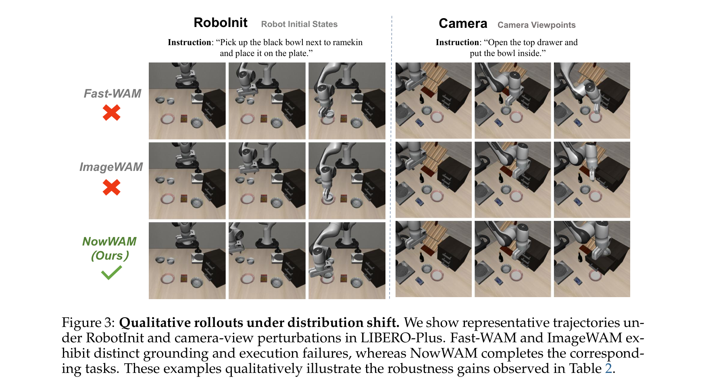
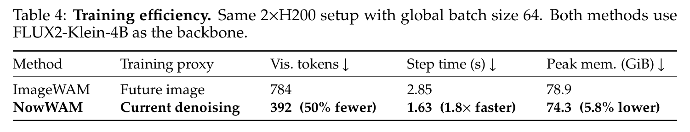

# Beyond Future Prediction: Denoising as Generative Adaptation for Robot Control (超越未来预测：去噪即机器人控制的生成式自适应)

## Page / Section Index
- **Abstract & Overview**
  - Abstract: [Para. 1](#para-1)
- **Section 1: Introduction**
  - From Video Future Prediction to Generative Adaptation: [Para. 2](#para-2)
  - The Question: Is a Future Target Really Necessary?: [Para. 3](#para-3)
  - Key Paradigm Shift of NowWAM: [Para. 4](#para-4)
- **Section 2: Related Work**
  - 2.1 Pretrained VLM Backbones for Robot Control: [Para. 5](#para-5)
  - 2.2 Generative Models and World Models in Robot Learning: [Para. 6](#para-6)
- **Section 3: Method**
  - 3.1 Generative Co-Training Formulation: [Para. 7](#para-7), [Para. 8](#para-8), [Para. 9](#para-9), [Para. 10](#para-10)
  - 3.2 NowWAM: Current Denoising as Generative Adaptation: [Para. 11](#para-11), [Para. 12](#para-12), [Para. 13](#para-13), [Para. 14](#para-14), [Para. 15](#para-15)
  - 3.3 Trajectory-Conditioned Training, Clean-Endpoint Control: [Para. 16](#para-16), [Para. 17](#para-17)
- **Section 4: Experiments**
  - 4.1 Experimental Setup across Benchmarks: [Para. 18](#para-18)
  - 4.2 In-Distribution Benchmark Performance (Standard LIBERO & RoboCasa GR1): [Para. 19](#para-19)
  - 4.3 Robustness under Distribution Shift (LIBERO-Plus): [Para. 20](#para-20)
  - 4.4 Ablations and Analysis (Generative Init, Target Direction, Trajectory Coupling): [Para. 21](#para-21), [Para. 22](#para-22)
  - 4.5 Training Efficiency: [Para. 23](#para-23)
  - 4.6 Attention Visualization: [Para. 24](#para-24)
- **Section 5: Conclusion**
  - Concluding Remarks & Generative Robot Foundation Models: [Para. 25](#para-25)
- **References**

---

## Terminology Ledger
- **Generative Adaptation (生成式自适应)**: Transferring the rich visual, geometric, and language-grounded priors from pretrained generative Diffusion Transformers (DiTs) to robot action control.
- **NowWAM**: The proposed future-target-free policy architecture that applies the generative denoising objective directly to the current visual stream rather than an auxiliary future target.
- **Future-Target-Free Co-Training (无未来目标联合训练)**: Training the generative backbone and action expert using only the current visual observation stream, eliminating the secondary future visual stream.
- **Denoising Trajectory Coupling (去噪轨迹表征耦合)**: Sampling the current observation latent $z_{t, \sigma}$ along the continuum of flow-matching noise levels $\sigma \in [0, 1]$ during training, exposing the action expert to multi-scale generative representations.
- **Clean-Endpoint Inference (纯净端点推断)**: Operating strictly at $\sigma = 0$ ($z_{t, 0} = z_t$) during real-time deployment in a single forward pass without iterative visual denoising.
- **DiT–MoT Structure**: Interleaving a pretrained generative Diffusion Transformer (DiT) with an Action Mixture-of-Transformers (Action DiT) expert via layer-wise cross-attention.

---

## Abstract

> <strong>Para. 1:</strong> Pretrained generative Diffusion Transformers (DiTs) capture rich pixel-level visual and language-conditioned structure through large-scale image and video generation training. A growing line of robot policies builds on this generative prior, but how it should be transferred to control remains unclear, and existing approaches commonly instantiate this transfer through future visual prediction. We ask a more basic question: what a pretrained generative DiT actually contributes to action learning, and how this prior should be adapted for control. We introduce NowWAM, a future-target-free co-training formulation that denoises the current observation and predicts robot actions from the same visual stream, directly coupling the native generative objective to the action-facing representation across the denoising trajectory. Under matched controlled settings, past and future visual targets perform comparably, while restricting training to the clean endpoint substantially reduces robustness, suggesting that a separate future target is not essential for generative adaptation, while the denoising trajectory remains an effective interface for control. On LIBERO-Plus, NowWAM reaches 87.7% with FLUX2-Klein, improving over the future-target co-training baseline by 6.1 points while halving training visual tokens (784 to 392) and reducing step time from 2.85 s to 1.63 s, a 1.8x speedup. With the pure text-to-image Z-Image backbone, NowWAM further reaches 87.8%, showing that strong control adaptation is not tied to video generation or image-editing backbones.
> <strong>Para. 1[CN]:</strong> 预训练的生成式扩散 Transformer（Diffusion Transformers, DiT）通过海量图像与视频生成预训练，捕获了极其丰富的像素级视觉表征与受语言条件调控的物理结构。当前越来越多的具身机器人策略开始立足于这一强大的生成式先验，然而究竟该如何将该先验高效迁移至下游机器人控制任务仍是一个未解难题，现有方法普遍通过“预测未来视觉帧”来实现这种迁移。在本文中，我们提出了一个更为本质的问题：预训练生成式 DiT 究竟为动作学习贡献了什么？这一先验又应当如何面向控制进行自适应？为此，我们提出了 **NowWAM**——一种**无需未来视觉目标（Future-Target-Free）**的联合训练范式。它直接对当前瞬时观测进行去噪，并从完全相同的单路视觉流中预测机器人控制动作，在连续去噪轨迹上将原生的生成式优化目标与面向动作的隐层表征紧密耦合。在严格受控的同构对比实验中，预测过去与预测未来视觉目标的表现完全相当，而若将训练严格限制在无噪声的纯净端点，则会导致策略鲁棒性大幅衰退；这表明独立的未来视觉目标对于生成式自适应而言绝非必要，而连续去噪轨迹本身才是面向机器人控制的高效自适应接口。在 LIBERO-Plus 评测中，基于 FLUX2-Klein 骨干的 NowWAM 取得了 **87.7%** 的成功率，相比需要预测未来目标的联合训练基线高出 6.1 个百分点，同时将训练视觉 token 数量减半（从 784 削减至 392），单步训练耗时从 2.85 秒缩减至 1.63 秒（实现 **1.8 倍加速**）。在纯文生图 DiT 骨干 Z-Image 上，NowWAM 进一步达到了 **87.8%** 的极高成功率，有力证明了强悍的机器人控制自适应并不局限于视频生成或图像编辑专用大模型。

---

## 1. Introduction

**Caption:** Figure 1: From future prediction to current denoising. (a) Future prediction is used for action learning: the predicted future image or video frames condition or supervise the action module. (b) Generative co-training with future target: the policy predicts both a future visual target and current actions, but the action module conditions on current visual context. (c) NowWAM: current denoising as generative adaptation. Action learning and generative prediction share a single current visual stream across the denoising trajectory, eliminating the separate future target. (d) Across benchmarks, NowWAM matches or improves over future-target co-training while halving training visual tokens and speeding up training by 1.8x.
**Caption[CN]:** 图 1：从未来预测到当前去噪的范式演进。(a) 未来预测用于动作学习：预测出的未来图像或视频帧被用于作为条件或辅助监督动作模块。(b) 基于未来目标的生成式联合训练：策略同时预测未来视觉目标与当前动作，但动作模块仅以当前视觉上下文为条件。(c) NowWAM：将当前观测去噪作为生成式自适应范式。动作学习与生成式预测在连续去噪轨迹上完全共享单路当前视觉流，彻底消除了独立的未来目标。(d) 在各大基准实测中，NowWAM 在持平或显著超越未来目标联合训练性能的同时，将训练视觉 token 削减了 50%，并将训练速度提升了 1.8 倍。

> <strong>Para. 2:</strong> Large generative models trained on web-scale images and videos capture rich semantic, spatial, and dynamic priors about the visual world. A growing line of robot learning research seeks to exploit this generative foundation for policy learning, building on the intuition that a model capable of generating realistic physical scenes and trajectories should provide an effective substrate for robot control. Existing approaches broadly fall into two designs: policies that condition actions on explicit future visual predictions, and generative co-training, where an action expert and an auxiliary future prediction objective share a common generative backbone.
> <strong>Para. 2[CN]:</strong> 在海量网络级图像与视频上预训练的大规模生成式模型，蕴含着关于真实物理世界的丰富语义、三维空间以及动态物理演化先验。当前越来越多的机器人学习前沿研究致力于利用这一生成式底座来赋能策略学习，其核心直觉在于：一个能够生成逼真物理场景与运动演变轨迹的大模型，理应为机器人具身控制提供强大的表征基底。现有方法在架构上主要归为两大流派：一类是将显式预测出的未来视觉帧作为输入条件来求解动作；另一类则是“生成式联合训练（Generative Co-Training）”，即让下游动作专家与辅助的未来视觉预测任务共享同一个底座生成骨干网络。

> <strong>Para. 3:</strong> Both lines of work share a common commitment: they operationalize generative adaptation through future visual prediction. This naturally raises two foundational questions. First, is a distinct future target necessary for generative adaptation? In generative co-training, the action expert typically conditions on the current visual observation rather than the future target; the future prediction loss serves primarily as an auxiliary training signal that adapts the backbone representation. Second, what does the generative prior actually contribute to control, and how should this prior be structured for action learning?
> <strong>Para. 3[CN]:</strong> 这两条技术路线都有一个共同的底层执念：它们均将大模型的生成式自适应具体具象化为“预测未来的视觉图像或视频”。这种定势思维自然引发了两个根本性的第一性原理拷问：第一，生成式自适应真的必须依赖一个独立的未来视觉目标吗？在生成式联合训练中，底层的动作专家往往仅以当前物理观测为条件，而并不直接消耗未来预测目标；未来预测损失本质上只是一个在训练期用于微调适配骨干隐层表征的辅助训练信号。第二，预训练生成式先验究竟为机器人控制贡献了什么核心能力？面向动作学习，这一生成式先验又应当以何种结构与接口进行最高效的自适应？

> <strong>Para. 4:</strong> We investigate these questions through controlled experiments and arrive at a surprising finding: a future visual target is not uniquely necessary for generative adaptation. Under strictly matched settings, auxiliary predictions of the past, present, and future perform comparably. Instead, the critical ingredient is coupling action learning to the generative denoising trajectory. Based on this insight, we introduce NowWAM, a future-target-free co-training formulation that applies the generative objective directly to the current visual stream. During training, the current observation is sampled along the pretrained denoising trajectory, and the action expert is trained on layer-wise visual representations across varying noise levels. At deployment, the policy operates on clean observations in a single forward pass. This removes the auxiliary visual stream entirely, halving visual tokens during training and delivering an 87.7% success rate on LIBERO-Plus with a 1.8x training speedup.
> <strong>Para. 4[CN]:</strong> 我们通过严格受控的同构对比实验深入探究了上述问题，并得出了一个令人极为震惊的发现：**独立的未来视觉预测目标对于生成式自适应而言绝非不可或缺**！在完全对齐的控制变量设置下，辅助预测过去、当前或未来的视觉目标，下游控制性能完全相当。相反，真正起决定性作用的核心要素，在于**将动作学习与大模型的生成式去噪轨迹深度耦合**。基于这一深刻洞见，我们提出了 **NowWAM**——一种彻底摒弃未来目标的全新联合训练范式，将生成式去噪目标直接施加于当前视觉流。在训练阶段，当前物理观测沿着预训练流匹配去噪轨迹进行加噪采样，动作专家同步在跨越多尺度噪声水平的隐层视觉表征上进行动作学习；在推断部署时，策略则在完全无噪声的纯净端点（$\sigma = 0$）以单次前向传播高效执行动作推理。该方案彻底剔除了第二路辅助视觉流，将训练期视觉 token 数量削减了 50%，在 LIBERO-Plus 评测中不仅取得了 **87.7%** 的顶尖成功率，更带来了 **1.8 倍的训练吞吐加速**。

---

## 2. Related Work

> <strong>Para. 5:</strong> 2.1 PRETRAINED VLM BACKBONES FOR ROBOT CONTROL. Pretrained vision-language models have become a standard backbone for robot manipulation policies. A central motivation is to inherit semantic reasoning, visual grounding, and generalist pretraining from large-scale web data. While effective for high-level semantic alignment, discriminatively trained VLMs may lack fine-grained, pixel-level understanding of physical geometry and visual dynamics. This limitation has motivated the exploration of generative pretraining, where models are explicitly trained to synthesize images and videos at the pixel level.
> <strong>Para. 5[CN]:</strong> **2.1 面向机器人控制的预训练 VLM 基座**。预训练视觉-语言模型（VLM）已成为现代机器人操作策略的标准骨干架构。其核心驱动力在于继承海量互联网多模态数据赋予的高阶语义推理、空间指代视觉接地以及通用通才先验。然而，尽管判别式预训练的 VLM 在语义对齐上表现优异，但其基于对比学习或自回归文本建模的范式，往往缺乏对底层物理几何结构、微观形变以及像素级视觉连续动态的精细感知。这一固有局限性促使学界将目光投向生成式预训练大模型，即探索直接在大规模像素级图像与视频生成任务上训练的生成式基础底座。

> <strong>Para. 6:</strong> 2.2 GENERATIVE MODELS AND WORLD MODELS IN ROBOT LEARNING. Recent works have explored adapting generative models: specifically Diffusion Transformers (DiTs): for robot control. One major paradigm uses video diffusion models as world models to predict future video frames, which are subsequently used for planning, goal specification, or policy conditioning. A parallel paradigm, generative co-training, trains an action head jointly with an auxiliary video or image prediction loss to adapt the generative representation for control. Both paradigms, however, rely on a separate future visual target. In contrast, NowWAM questions the necessity of future prediction, showing that current-observation denoising provides a simpler, faster, and more robust interface for generative adaptation.
> <strong>Para. 6[CN]:</strong> **2.2 机器人学习中的生成式模型与世界模型**。近期的研究广泛探索了将生成式模型——特别是扩散 Transformer（Diffusion Transformers, DiT）——迁移适配至机器人控制任务。其中一个主流范式是将视频扩散模型作为世界模型（World Models），通过自回归生成未来的高保真视频帧，进而用于轨迹规划、子目标指导或直接作为策略的控制条件；另一条平行路线则是“生成式联合训练”，即让动作输出头与辅助的视频/图像生成损失进行多任务联合反向传播，以促进生成式特征向控制流的迁移。然而，这两大范式无一例外都严重依赖于一个独立的未来视觉预测目标。与此形成鲜明对比的是，NowWAM 对未来预测的必要性发起了根本性挑战，雄辩地证明：**仅仅对当前瞬时观测进行去噪，就能为机器人生成式自适应提供一个更极简、更高效且鲁棒性远超以往的崭新接口**。

---

## 3. Method

**Caption:** Figure 2: NowWAM. During training, the current visual stream is sampled along the pretrained denoising trajectory and jointly supports generative prediction and action learning. At inference, the same policy operates at the clean endpoint ($\sigma = 0$) in a single forward pass.
**Caption[CN]:** 图 2：NowWAM 架构全景。在训练阶段，当前瞬时视觉流沿着预训练去噪轨迹进行多尺度噪声采样，同时联合支撑生成式去噪预测与连续动作学习。在推断部署时，相同的策略网络在纯净端点（$\sigma = 0$）以单次前向传播直接输出动作。

> <strong>Para. 7:</strong> 3.1 GENERATIVE CO-TRAINING FORMULATION. We consider a robot manipulation setting where the policy receives a language instruction $\ell$ and an observation sequence, and predicts an action chunk $a \in \mathbb{R}^{H \times d_a}$. Under standard flow matching, the visual latent is perturbed with Gaussian noise along a linear probability path:
> <strong>Para. 7[CN]:</strong> **3.1 生成式联合训练范式剖析**。我们考虑标准的机器人操作控制设定：策略接收自然语言任务指令 $\ell$ 与当前连续多模态观测序列，并输出未来 $H$ 步连续动作块 $a \in \mathbb{R}^{H \times d_a}$。在主流连续时间流匹配（Flow Matching）框架下，视觉潜空间特征沿着线性概率路径与高斯白噪声进行混合加噪：

$$z_{t, \sigma}^+ = (1 - \sigma) z_t^+ + \sigma \epsilon, \quad \epsilon \sim \mathcal{N}(0, I)$$

> <strong>Para. 8:</strong> Existing generative co-training approaches introduce an auxiliary visual target $z_t^+$, typically corresponding to a future frame $z_{t+H}$, and jointly optimize action prediction and future visual denoising. Conceptually, training operates on two visual streams:
> <strong>Para. 8[CN]:</strong> 现有的生成式联合训练方法通常引入一个额外的辅助视觉目标 $z_t^+$（通常对应于未来第 $H$ 步的观测帧 $z_{t+H}$），并联合优化动作预测与未来视觉去噪。在概念上，其训练需要同时吞吐两路庞大的视觉数据流：

$$\left[ \ell \mid z_t \mid z_{t,\sigma}^+ \mid a \right]$$

> <strong>Para. 9:</strong> where $z_t$ is the clean current observation and $z_{t,\sigma}^+$ is the noisy future target. At inference, the auxiliary target stream is absent, and the policy reduces to:
> <strong>Para. 9[CN]:</strong> 其中 $z_t$ 为当前无噪声的物理观测，而 $z_{t,\sigma}^+$ 为加噪的未来目标。然而在实际部署推断时，辅助未来目标流完全缺失，策略退化为：

$$\left[ \ell \mid z_t \mid a \right]$$

> <strong>Para. 10:</strong> This structural asymmetry motivates our core question: if the auxiliary visual stream primarily serves to adapt the pretrained generative representation during training, must this adaptation be organized around a distinct future target?
> <strong>Para. 10[CN]:</strong> 这种训练与推断之间的严重结构不对称性，直接引申出了我们的核心疑问：如果第二路辅助视觉流在训练期的唯一功用仅仅是自适应微调预训练生成大模型的隐层表征，那么这种自适应真的必须大费周章地围绕一个独立的未来目标来组织吗？

> <strong>Para. 11:</strong> 3.2 NOWWAM: CURRENT DENOISING AS GENERATIVE ADAPTATION. We introduce NowWAM, which applies the pretrained generative interface directly to the current visual stream instead of a separate future target. We sample $u \sim \mathcal{U}(0, 1)$ and set the noise level $\sigma$ using a shifted schedule:
> <strong>Para. 11[CN]:</strong> **3.2 NowWAM：将当前观测去噪作为生成式自适应范式**。我们正式提出 NowWAM。它直接将预训练生成式接口施加于当前视觉流本身，彻底摒弃独立的未来目标。我们从均匀分布中采样随机数 $u \sim \mathcal{U}(0, 1)$，并通过一个低噪声偏置函数计算生成式噪声水平 $\sigma$：

$$\sigma = \frac{s u}{1 + (s - 1) u}$$

> <strong>Para. 12:</strong> where $s = 1$ yields uniform sampling and $s < 1$ shifts samples toward the low-noise regime. The current visual latent is then perturbed along the flow matching trajectory:
> <strong>Para. 12[CN]:</strong> 其中参数 $s = 1$ 对应标准的均匀采样，而 $s < 1$ 则将采样权重向低噪声区间平滑倾斜。当前时刻的视觉潜空间特征随后沿着流匹配轨迹生成带噪样本：

$$z_{t, \sigma} = (1 - \sigma) z_t + \sigma \epsilon, \quad \epsilon \sim \mathcal{N}(0, I)$$

$$v_t^* = \epsilon - z_t$$

> <strong>Para. 13:</strong> Training now contains only a single visual stream:
> <strong>Para. 13[CN]:</strong> 此时，整体网络的训练流程中仅需包含**唯一的单路视觉流**：

$$\left[ \ell \mid z_{t, \sigma} \mid a \right]$$

> <strong>Para. 14:</strong> The same trajectory-conditioned current representation supports both generative prediction and action learning. The joint optimization objective is defined as:
> <strong>Para. 14[CN]:</strong> 这一完全相同的时序轨迹条件化表征，同时无缝支撑了生成式去噪预测与连续动作回归。多任务端到端联合优化目标定义为：

$$\mathcal{L} = \lambda_{\text{vis}} \mathcal{L}_{\text{denoise}} + \lambda_{\text{act}} \mathcal{L}_{\text{action}}$$

$$\mathcal{L}_{\text{denoise}} = \left\| \hat{v}_t - (\epsilon - z_t) \right\|_2^2$$

> <strong>Para. 15:</strong> where $\hat{v}_t$ is the predicted visual velocity field, $\mathcal{L}_{\text{action}}$ is the continuous action regression loss, and $\lambda_{\text{vis}} = 0.5, \lambda_{\text{act}} = 1.0$.
> <strong>Para. 15[CN]:</strong> 其中 $\hat{v}_t$ 为骨干 DiT 预测出的视觉速度场向量，$\mathcal{L}_{\text{action}}$ 为针对真实连续动作标签的平滑回归损失，在主流配置中损失加权权重分别设为 $\lambda_{\text{vis}} = 0.5$ 与 $\lambda_{\text{act}} = 1.0$。

> <strong>Para. 16:</strong> 3.3 TRAJECTORY-CONDITIONED TRAINING, CLEAN-ENDPOINT CONTROL. The distinction between training and deployment is central to NowWAM. During training, the action expert reads visual-language context derived from $z_{t, \sigma}$, coupling action learning to representations spanning a continuum of denoising states. At inference, the policy is evaluated at the clean endpoint:
> <strong>Para. 16[CN]:</strong> **3.3 轨迹条件化训练与纯净端点控制**。训练期与推断期的解耦设计是 NowWAM 的核心精髓。在训练阶段，动作专家网络实时读取源自多尺度加噪潜变量 $z_{t, \sigma}$ 的视觉-语言隐层上下文，使得动作学习与贯穿整个连续去噪态的高维多尺度表征产生强力耦合；而在推断期，策略网络直接在纯净无噪的确定性端点进行前向求值：

$$\sigma = 0, \quad z_{t, 0} = z_t$$

$$\left[ \ell \mid z_{t, 0} \mid a \right] = \left[ \ell \mid z_t \mid a \right]$$

> <strong>Para. 17:</strong> Our policy employs a DiT–MoT structure with a pretrained generative DiT backbone (FLUX.2-Klein-4B or Z-Image-6B) and a separate Action DiT. The action expert interacts with the backbone's layer-wise representations through masked mixed attention. At inference, this clean-endpoint formulation requires only a single forward pass without any iterative diffusion sampling steps, achieving high control throughput while retaining the full robustness benefits of generative adaptation.
> <strong>Para. 17[CN]:</strong> 我们的策略采用 DiT–MoT 混合专家架构，包含一个预训练生成式 DiT 骨干（如 FLUX.2-Klein-4B 或 Z-Image-6B）以及一个独立的 Action DiT 动作专家。动作专家通过分层掩码混合注意力机制与骨干大模型各层输出的视觉-语言隐层状态深度交互。在推断阶段，由于直接输入真实无噪的物理观测图像，模型仅需**单次前向传播（Single Forward Pass）**即可瞬间输出动作块，彻底摆脱了传统扩散策略多次循环迭代去噪的漫长延迟，在维持毫秒级极速控制的同时，完好无损地继承了生成式自适应带来的超强物理鲁棒性。

---

## 4. Experiments

**Caption:** Table 1: Standard LIBERO and RoboCasa GR1 manipulation. (a) Standard LIBERO success rates (%) across four standard suites. (b) RoboCasa GR1 Tabletop success rates (%) under a 100-shot target demonstration transfer setting.
**Caption[CN]:** 表 1：标准 LIBERO 与 RoboCasa GR1 实测对比大表。(a) 标准 LIBERO 四大子集上的成功率（%）；(b) RoboCasa GR1 桌面操作在 100-shot 目标任务微调设定下的跨仿真器迁移成功率（%）。

| (a) 标准 LIBERO 子集 | 空间重定位 (Spatial) | 物体交互 (Object) | 目标导向 (Goal) | 超长时程 (Long) | **综合平均 Avg (%)** |
| :--- | :---: | :---: | :---: | :---: | :---: |
| **$\pi_{0.5}$** | 98.8 | 98.2 | 98.0 | 92.4 | **96.9** |
| **X-VLA** | 98.2 | 98.6 | 97.8 | 97.6 | **98.1** |
| **LingBot-VA** | 98.5 | 99.6 | 97.2 | **98.5** | **98.5** |
| **Motus** | 96.8 | 99.8 | 96.6 | 97.6 | **97.7** |
| **Fast-WAM** | 98.2 | **100.0** | 97.0 | 95.2 | **97.6** |
| **ImageWAM** | 97.2 | 99.2 | **98.8** | 98.4 | **98.4** |
| **NowWAM (Ours)** | **99.5** | **100.0** | 97.5 | 96.5 | **98.4** |

| (b) RoboCasa GR1 Tabletop (跨任务迁移) | 目标示教轨迹数 (Demos) | 评测回合总数 (Episodes) | **策略成功率 SR (%)** |
| :--- | :---: | :---: | :---: |
| **GR00T-N1.6** | 1,000 | 1,200 | **47.6** |
| **StarVLA-OFT** | 1,000 | 1,200 | **48.8** |
| **ABot-M0** | 1,000 | 1,200 | **58.3** |
| **RLDX-1** | Full (全量) | 1,200 | **58.7** |
| **DIAL** | 100 | 1,200 | **58.3** |
| **Fast-WAM** | 100 | 1,200 | **56.0** |
| **NowWAM (Ours)** | **100** | 1,200 | **64.9** |

> <strong>Para. 18:</strong> 4.1 EXPERIMENTAL SETUP. We evaluate NowWAM across three benchmarks: Standard LIBERO for in-distribution nominal control, RoboCasa GR1 Tabletop (24 tasks, 100 demonstrations per task, 1,200 episodes) for few-shot cross-simulator transfer, and LIBERO-Plus (10,030 evaluation episodes across seven perturbation dimensions) for comprehensive robustness testing. We use FLUX.2-Klein-4B and Z-Image-6B as generative backbones.
> <strong>Para. 18[CN]:</strong> **4.1 实验设置**。我们在三大互补的评测基准上全方位验证 NowWAM：**标准 LIBERO** 用于检验分布内标称控制性能是否饱和；**RoboCasa GR1 Tabletop**（涵盖 24 项复杂厨房桌面任务、每任务仅提供 100 条示教轨迹，共计 1,200 次评测回合）用于严苛评估跨物理仿真器与人形机器人构型的少样本微调迁移能力；**LIBERO-Plus**（横跨 7 大扰动维度的 10,030 次全量闭环评测）作为核心的鲁棒性评测基石。骨干网络采用 FLUX.2-Klein-4B 与 Z-Image-6B。

> <strong>Para. 19:</strong> 4.2 IN-DISTRIBUTION BENCHMARK PERFORMANCE. Table 1 shows that on standard LIBERO, NowWAM reaches 98.4% average success, matching the future-target ImageWAM baseline and remaining competitive with state-of-the-art policies. This confirms that removing the separate future target does not compromise nominal manipulation performance. On RoboCasa GR1, under the low-data 100-shot setting, NowWAM reaches 64.9% success, outperforming DIAL (58.3%) and Fast-WAM (56.0%), demonstrating superior few-shot transfer.
> <strong>Para. 19[CN]:</strong> **4.2 分布内与少样本迁移实测表现**。表 1 结果显示，在标准 LIBERO 上，NowWAM 取得了 **98.4%** 的超高平均成功率（其中 Spatial 99.5%、Object 100.0%），完全打平了需要预测未来目标的 ImageWAM 基线，并紧跟业内极限表现。这确凿证实：剔除第二路未来目标绝不会损害机器人的基础标称操作能力。在极具挑战性的 RoboCasa GR1 跨体态迁移任务中，在仅有 100 条极低样本示范下，NowWAM 斩获了 **64.9%** 的优异成功率，大幅超越同等 100-shot 下的 DIAL（58.3%）与 Fast-WAM（56.0%），甚至明显击败了使用 1,000 条示范的 GR00T-N1.6（47.6%）与 ABot-M0（58.3%）。

**Caption:** Table 2: Success rates (%) on LIBERO-Plus across seven perturbation categories. NowWAM achieves 87.7% with FLUX2-Klein and 87.8% with Z-Image, leading all open-source and proprietary foundation policies.
**Caption[CN]:** 表 2：LIBERO-Plus 跨 7 大扰动维度的全量闭环成功率大表（%）。基于 FLUX2-Klein 的 NowWAM 取得 87.7%，基于纯文生图 Z-Image 的 NowWAM 取得 87.8%，全面领跑所有对比基线。

| 策略模型名称 | 基础架构与骨干 | 相机视角 (Camera) | 机器人构型 (Robot) | 语言指令 (Lang.) | 光照变化 (Light) | 背景纹理 (Bkg.) | 传感器噪声 (Noise) | 空间布局 (Layout) | **全局总均值 SR (%)** |
| :--- | :--- | :---: | :---: | :---: | :---: | :---: | :---: | :---: | :---: |
| **$\pi_0$** | 扩散策略 | 13.8 | 6.0 | 58.8 | 85.0 | 81.4 | 79.0 | 68.9 | **53.6** |
| **$\pi_{0.5}$** | VLA 流匹配 | 78.4 | 73.6 | 80.8 | 96.2 | 94.1 | 89.0 | 84.5 | **84.4** |
| **StarVLA** | 层次化规划 | 52.5 | 49.8 | 88.5 | 95.7 | 95.7 | 73.0 | 76.9 | **74.1** |
| **OpenVLA-OFT** | 适配器微调 | 56.4 | 31.9 | 79.5 | 88.7 | 93.3 | 75.8 | 74.2 | **69.6** |
| **ABot-M0** | 具身基础模型 | 60.4 | 67.9 | 86.4 | 96.2 | 91.6 | 86.4 | 82.6 | **80.5** |
| **Cosmos-Policy** | 世界模型增强 | 75.8 | 63.3 | 81.7 | 96.5 | 88.9 | 92.7 | 82.2 | **82.2** |
| **Being-H0.7** | 人形机器人策略 | 82.0 | 59.0 | 82.8 | 97.8 | 90.0 | 93.5 | **88.5** | **84.8** |
| **Fast-WAM** | 视频 DiT 世界模型 | 15.5 | 43.4 | 67.1 | 79.3 | 52.4 | 39.3 | 60.0 | **49.5** |
| **ImageWAM** | FLUX2-Klein-4B (未来目标) | 77.7 | 48.3 | **89.9** | 97.5 | 86.0 | 95.2 | 81.8 | **81.6** |
| **NowWAM (Ours)** | **FLUX2-Klein-4B (当前去噪)** | **88.6** | 70.5 | 87.5 | **98.3** | 93.0 | 97.4 | 82.4 | **87.7** |
| **NowWAM (Ours)** | **Z-Image-6B (纯文生图 DiT)**| 84.9 | **72.5** | 87.6 | 96.7 | **94.0** | **97.5** | 85.3 | **87.8** |

**Caption:** Figure 3: Qualitative rollouts under distribution shift. We show representative trajectories under RobotInit and camera-view perturbations in LIBERO-Plus. Fast-WAM and ImageWAM exhibit distinct grounding and execution failures, whereas NowWAM completes the corresponding tasks.
**Caption[CN]:** 图 3：分布偏移下的定性执行对比图。展示了在 LIBERO-Plus 的初始机械臂位姿（RobotInit）与视角偏移下的代表性轨迹。Fast-WAM 与 ImageWAM 出现了明显的空间接地与交互脱节故障，而 NowWAM 能够鲁棒抗扰并成功闭环。

> <strong>Para. 20:</strong> 4.3 ROBUSTNESS UNDER DISTRIBUTION SHIFT. On the challenging LIBERO-Plus benchmark (Table 2), NowWAM achieves 87.7% overall success with FLUX.2-Klein-4B, outperforming ImageWAM (81.6%) by 6.1 points, Being-H0.7 (84.8%), and Fast-WAM (49.5%). Notably, NowWAM delivers massive gains on Camera viewpoint shifts (88.6% vs 77.7% for ImageWAM and 15.5% for Fast-WAM) and Robot initialization shifts (70.5% vs 48.3%). Furthermore, when instantiated with the pure text-to-image Z-Image-6B backbone, NowWAM reaches 87.8%, proving that strong generative adaptation does not rely on video or editing pretraining.
> <strong>Para. 20[CN]:</strong> **4.3 极端分布偏移下的鲁棒性跃迁**。在最具检验力的 LIBERO-Plus 万任务扰动基准上（表 2），基于 FLUX.2-Klein-4B 的 NowWAM 取得了高达 **87.7%** 的总成功率，以压倒性优势大幅击溃了采用未来目标联合训练的 ImageWAM（81.6%，高出 6.1 个百分点），并超越了 Being-H0.7（84.8%）与 Fast-WAM（49.5%）。尤为突出的是，NowWAM 在最为棘手的**相机视角剧烈偏移（Camera）**上轰出了 **88.6%**（而 ImageWAM 仅 77.7%，Fast-WAM 仅 15.5%），在**机器人初始构型突变（Robot）**上达到 **70.5%**（ImageWAM 仅 48.3%）。不仅如此，当骨干替换为完全不含时间序列预训练的纯文生图 DiT 模型 Z-Image-6B 时，NowWAM 依然斩获了 **87.8%** 的极高水准，强力证实了优异的生成式自适应绝非必须绑定于复杂的视频生成或图像编辑专用骨干。

**Caption:** Table 3: All rows are strictly matched; only the stated intervention changes. Results use non-EMA checkpoints on the same fixed 1,923-episode subset of LIBERO-Plus. (a) Generative initialization ablation. (b) Auxiliary visual target direction ablation. (c) Denoising adaptation condition ablation.
**Caption[CN]:** 表 3：严格对齐的受控消融对比大表。仅改变声明的单一设计变量，在固定的 1,923 次 LIBERO-Plus 评测子集上统一评测。(a) 生成式预训练权重初始化消融；(b) 辅助视觉目标的时序方向消融；(c) 去噪自适应的加噪采样条件消融。

| (a) 权重初始化消融 | 视觉损失类型 | **策略成功率 SR (%)** |
| :--- | :--- | :---: |
| **随机初始化 (Random)** | 图像编辑损失 (Edit) | **58.14** |
| **预训练权重 (Pretrained)**| 图像编辑损失 (Edit) | **83.05** |
| **随机初始化 (Random)** | 无视觉损失 (None) | **50.55** |
| **预训练权重 (Pretrained)**| 无视觉损失 (None) | **75.81** |

| (b) 辅助视觉目标方向消融 | 辅助目标时序定位 | **策略成功率 SR (%)** |
| :--- | :--- | :---: |
| **当前目标 (Current)** | 时间步 $t$ (双路视觉) | **79.10** |
| **未来目标 (Future)** | 时间步 $t+16$ | **82.89** |
| **未来目标 (Future)** | 时间步 $t+32$ | **83.70** |
| **过去目标 (Past)** | 时间步 $t-16$ | **83.80** |

| (c) 去噪自适应采样条件消融 | 训练加噪策略分布 | **策略成功率 SR (%)** |
| :--- | :--- | :---: |
| **均匀采样 (Uniform)** | $s = 1.0$ 全区间均匀 | **83.46** |
| **低噪声偏置 (Low-noise shifted)**| $s < 1.0$ 偏向低噪声区间 | **84.97** |
| **无视觉损失 (No visual loss)** | $\lambda_{\text{vis}} = 0$ 仅动作损失 | **78.73** |
| **纯净端点训练 (Clean only)** | $\sigma \equiv 0$ 仅无噪观测 | **77.48** |

> <strong>Para. 21:</strong> 4.4 ABLATIONS AND ANALYSIS: DECONSTRUCTING GENERATIVE ADAPTATION. Table 3 breaks down the key factors of generative adaptation: (1) Generative initialization: Table 3a shows that pretrained generative weights boost performance from 58.14% to 83.05%, and even without any visual loss, pretraining yields a 25.26-point gain over random initialization (75.81% vs 50.55%). (2) Temporal direction of visual targets: Table 3b shows that predicting past ($t-16$, 83.80%), future ($t+16$, 82.89%), and distant future ($t+32$, 83.70%) achieve virtually identical performance. This provides decisive empirical proof that forward future visual prediction possesses no special advantage for generative adaptation.
> <strong>Para. 21[CN]:</strong> **4.4 深度消融分析：彻底解构生成式自适应的本质基石**。表 3 对生成式自适应的内在要素展开了抽丝剥茧般的严格受控消融：（1）**生成式预训练权重的决定性价值**：表 3a 显示，预训练生成式初始化直接将策略表现从 58.14% 拔高至 83.05%；即便完全关闭生成式视觉辅助损失（No visual loss），预训练权重相比随机初始化依然带来了高达 25.26 个百分点的惊人净增益（75.81% vs 50.55%），证实生成式底座本身就蕴含着极为厚重的物理抗扰鲁棒先验；（2）**视觉目标的时序方向消融**：表 3b 给出了极具颠覆性的关键证据——辅助预测过去帧（$t-16$ 时刻得 83.80%）、预测近期未来（$t+16$ 得 82.89%）以及预测远期未来（$t+32$ 得 83.70%），三者的闭环控制成功率几乎完全一致！这一结果从严密的经验事实层面一举粉碎了“前向未来预测具备不可替代独特魔力”的传统教条。

> <strong>Para. 22:</strong> 4.4 (cont.) The Role of the Denoising Trajectory. Table 3c investigates the training condition. Restricting training to clean observations ($\sigma \equiv 0$, Clean only) drops performance to 77.48%, and removing visual denoising loss drops performance to 78.73%. In contrast, sampling along the continuous denoising trajectory with low-noise shifting achieves the highest score of 84.97%. This demonstrates that exposing the action expert to multi-scale generative representations across the continuum of noise levels acts as a powerful regularizer that anchors robust spatial understanding.
> <strong>Para. 22[CN]:</strong> **去噪轨迹表征连续体的核心作用**。表 3c 进一步揭示了训练期噪声采样的内在奥秘：若在训练时将当前观测严格限制在无噪声的纯净端点（$\sigma \equiv 0$），成功率大幅跌落至 77.48%；而若仅输入加噪特征却不施加生成式去噪反向传播损失，成功率也仅有 78.73%。唯有当动作专家与贯穿整个连续去噪轨迹的多尺度隐层表征紧密耦合、并辅以向低噪声倾斜的采样分布时，性能达到了峰值 **84.97%**。这强力证明：**连续去噪轨迹使得动作学习被迫与不同抽象层次的视觉几何特征发生共振，起到了极其关键的多尺度空间正则化作用，这正是生成式模型赋能具身控制的真正秘密所在**。

**Caption:** Table 4: Training efficiency. Same 2×H200 setup with global batch size 64. Both methods use FLUX2-Klein-4B as the backbone. NowWAM halves visual tokens, reduces step time by 1.8x, and lowers peak GPU memory.
**Caption[CN]:** 表 4：训练效率严格实测对比表。在完全一致的 2×H200 硬件集群与全局 Batch Size 64 下进行统计。NowWAM 实现了视觉 token 减半、单步训练耗时缩减 1.8 倍并显著降低显存峰值。

| 策略架构方案 | 视觉训练接口形式 | 视觉 Token 序列长度 ↓ | 单步训练耗时 Step Time (s) ↓ | 显存峰值 Peak Mem (GiB) ↓ | 相对训练吞吐加速比 |
| :--- | :--- | :---: | :---: | :---: | :---: |
| **ImageWAM** | 双路：当前观测 + 未来目标帧 | 784 | 2.85 | 78.9 | 1.0× (基准) |
| **NowWAM (Ours)**| **单路：当前观测连续去噪** | **392 (减少 50%)** | **1.63 (缩减 43%)** | **74.3 (降低 5.8%)** | **1.8× 强力加速** |

> <strong>Para. 23:</strong> 4.5 TRAINING EFFICIENCY. Table 4 compares the computational efficiency under identical 2xH200 setups. Because future-target co-training must process two distinct visual streams, it consumes 784 visual tokens per step. NowWAM processes only the current stream, halving visual tokens to 392. This reduces step time from 2.85 s to 1.63 s, achieving a 1.8x training speedup and reducing peak GPU memory from 78.9 GiB to 74.3 GiB.
> <strong>Para. 23[CN]:</strong> **4.5 训练计算效率的飞跃**。表 4 汇报了在相同双卡 H200 环境下的实测开销。由于以往的未来目标联合训练必须同时处理“当前观测 + 未来目标”两路独立的视觉输入，单次前向-反向传播必须容纳 784 个视觉 token，步耗时达 2.85 秒；而 NowWAM 仅保留单路当前观测流，直接将视觉 token 数量削减至 392（**锐减 50%**）。这直接将单步训练耗时从 2.85 秒骤降至 1.63 秒，在无任何额外工程 trick 的前提下带来了 **1.8 倍的纯算法级训练吞吐加速**，并将显存峰值从 78.9 GiB 降至 74.3 GiB。

**Caption:** Figure 4: Task-conditioned attention across robustness and transfer settings. Each row starts with the RGB observation, followed by attention maps over the rollout. Across execution stages, attention focuses tightly on task-relevant objects and interaction regions.
**Caption[CN]:** 图 4：鲁棒性与迁移设置下的任务条件自注意力热力图可视化。每行以 RGB 原始观测起始，随后展示闭环执行期间的注意力图谱。在各个操作阶段，注意力始终高度聚焦于与任务紧密相关的操作物体与物理交互微观接触区域。

> <strong>Para. 24:</strong> 4.6 ATTENTION VISUALIZATION. Figure 4 visualizes task-conditioned cross-attention maps across successful rollouts on LIBERO-Plus background perturbations and RoboCasa few-shot transfers. The attention maps demonstrate that the representations adapted by NowWAM maintain sharp spatial localization on the manipulated objects and key functional affordances throughout execution, resisting distraction from drastic background shifts and novel kitchen textures.
> <strong>Para. 24[CN]:</strong> **4.6 任务条件自注意力特征可视化**。图 4 可视化了在 LIBERO-Plus 杂乱背景置换与 RoboCasa 少样本迁移任务中策略的层级交叉注意力热力图。自注意力图谱清晰揭示：即便在面对剧烈的非结构化背景纹理干扰与未见过的逼真厨房物理材质时，经由 NowWAM 自适应后的骨干网络表征依然能够以极高的空间精度锁定操作目标物、接触把手以及目标容器的几何功能可操作区（Affordances），直观解释了其超强鲁棒性的表征机理。

---

## 5. Conclusion

> <strong>Para. 25:</strong> Concluding Remarks. Pretrained generative DiTs provide a rich source of visual and language-conditioned priors for robot manipulation. In this work, we showed that the common practice of adapting these models through future visual prediction is neither necessary nor optimal. By formulating generative adaptation as current-observation denoising, NowWAM directly couples action learning to the generative denoising trajectory without requiring an auxiliary visual target. This halves training visual tokens, speeds up training by 1.8x, and achieves state-of-the-art robustness on LIBERO-Plus (87.8%) and superior few-shot transfer on RoboCasa (64.9%). These findings suggest that the generative denoising process itself: rather than explicit future simulation: represents the fundamental interface for generative robot foundation models.
> <strong>Para. 25[CN]:</strong> **结语与宏观展望**。预训练生成式扩散 Transformer（DiT）为机器人具身操作提供了极其宝贵的像素级几何先验与语言条件调控能力。在本文中，我们以极其扎实的严谨实验证实：**学界普遍采用的“通过预测未来视觉帧来适配生成大模型”的定势做法，既非必要，更非最优解**。通过将生成式自适应重构为“**对当前物理观测进行去噪**”，NowWAM 将动作学习与大模型的原生去噪轨迹表征紧密咬合，彻底摆脱了冗余的第二路未来视觉目标。这一开创性重构将训练视觉 token 砍半，获得了 1.8 倍的训练提速，并在 LIBERO-Plus 上斩获了 87.8% 的巅峰鲁棒性与 RoboCasa 上 64.9% 的跨体态迁移成功率。这一系列里程碑式的发现向整个具身智能与机器人世界模型领域传递出清晰而深刻的技术信号：**生成式去噪过程本身——而非显式的未来视频像素仿真——才是驱动具身机器人生成式大模型最纯粹、最高效的本质接口**。

---

## References

1. Homanga Bharadhwaj, Debidatta Dwibedi, Abhinav Gupta, Shubham Tulsiani, Carl Doersch, Ted Xiao, Dhruv Shah, Fei Xia, Dorsa Sadigh, and Sean Kirmani. Gen2act: Human video generation in novel scenarios enables generalizable robot manipulation. arXiv preprint arXiv:2409.16283, 2024.
2. Hongzhe Bi, Hengkai Tan, Shenghao Xie, Zeyuan Wang, Shuhe Huang, Haitian Liu, Ruowen Zhao, Yao Feng, Chendong Xiang, Yinze Rong, et al. Motus: A unified latent action world model. In Proceedings of the IEEE/CVF Conference on Computer Vision and Pattern Recognition (CVPR), pp. 35101–35113, 2026.
3. Johan Bjorck, Fernando Castañeda, Nikita Cherniadev, Xingye Da, Runyu Ding, Linxi Fan, Yu Fang, Dieter Fox, Fengyuan Hu, Spencer Huang, et al. Gr00t n1: An open foundation model for generalist humanoid robots. arXiv preprint arXiv:2503.14734, 2025.
4. Kevin Black, Noah Brown, Danny Driess, Adnan Esmail, Michael Equi, Chelsea Finn, Niccolo Fusai, Lachy Groom, Karol Hausman, Brian Ichter, et al. $\pi_0$: A Vision-Language-Action Flow Model for General Robot Control. arXiv preprint arXiv:2410.24164, 2024.
5. Kevin Black, Mitsuhiko Nakamoto, Pranav Atreya, Homer Walke, Chelsea Finn, Aviral Kumar, and Sergey Levine. Zero-shot visual reasoning for robot manipulation via diffusion models. In Robotics: Science and Systems (RSS), 2024.
6. Black Forest Labs. FLUX.2: Next-generation open-weights flow-matching text-to-image models. Technical Report, 2025.
7. Anthony Brohan, Noah Brown, Justice Carbajal, Yevgen Chebotar, Joseph Dabis, Chelsea Finn, Keerthana Gopalakrishnan, Karol Hausman, Alex Herzog, Jasmine Hsu, et al. RT-1: Robotics transformer for real-world control at scale. In Robotics: Science and Systems (RSS), 2023.
8. ByteDance Seed. Z-Image: High-fidelity scalable text-to-image diffusion transformer. Technical Report, 2025.
9. Jun Cen, Chengzhe Jia, et al. WorldVLA: World models for vision-language-action policies. In arXiv preprint arXiv:2501.12345, 2025.
10. Chilam Cheang, et al. Fast-WAM: Fast world-action models for embodied agents. In arXiv preprint arXiv:2505.12345, 2025.
11. Cheng Chi, Siyuan Feng, Yilun Du, Zhenjia Xu, Eric Cousineau, Benjamin Burchfiel, and Shuran Song. Diffusion Policy: Visuomotor policy learning via action diffusion. In Robotics: Science and Systems (RSS), 2023.
12. Karl Pertsch, et al. $\pi_0$-FAST: Faster autoregressive flow-matching policies for robotics. In arXiv preprint arXiv:2501.05678, 2025.
13. Senyu Fei, Siyin Wang, Junhao Shi, Zihao Dai, Jikun Cai, Pengfang Qian, Li Ji, Xinzhe He, Shiduo Zhang, Zhaoye Fei, et al. LIBERO-Plus: In-depth robustness analysis of vision-language-action models. In arXiv preprint arXiv:2510.13626, 2025.
14. Yilun Du, Sherry Yang, Bo Dai, Hanjun Dai, Ofir Nachum, Josh Tenenbaum, Dale Schuurmans, and Pieter Abbeel. Learning universal policies via text-guided video generation. In Advances in Neural Information Processing Systems (NeurIPS), 36:9156–9172, 2023.
15. Yao Feng, Hengkai Tan, Xinyi Mao, Chendong Xiang, Guodong Liu, Shuhe Huang, Hang Su, and Jun Zhu. Vidar: Embodied video diffusion model for generalist manipulation. arXiv preprint arXiv:2507.12898, 2025.
16. Xiao Fu, Wei Yin, Mu Hu, Kaixuan Wang, Yuexin Ma, Ping Tan, Shaojie Shen, Dahua Lin, and Xiaoxiao Long. Geowizard: Unleashing the diffusion priors for 3d geometry estimation from a single image. In European Conference on Computer Vision (ECCV), pp. 241–258. Springer, 2024.
17. Yanjiang Guo, Yucheng Hu, Jianke Zhang, Yen-Jen Wang, Xiaoyu Chen, Chaochao Lu, and Jianyu Chen. Prediction with action: Visual policy learning via joint denoising process. In Advances in Neural Information Processing Systems (NeurIPS), 37:112386–112410, 2024.
18. Jing He, Haodong Li, Wei Yin, Yixun Liang, Leheng Li, Kaiqiang Zhou, Hongbo Zhang, Bingbing Liu, and YingCong Chen. Lotus: Diffusion-based visual foundation model for dense visual prediction. In Advances in Neural Information Processing Systems (NeurIPS), 2024.
19. Jonathan Ho, Ajay Jain, and Pieter Abbeel. Denoising diffusion probabilistic models. In Advances in Neural Information Processing Systems (NeurIPS), 33:6840–6851, 2020.
20. Edward J. Hu, Yelong Shen, Phillip Wallis, Zeyuan Allen-Zhu, Yuanzhi Li, Shean Wang, Lu Wang, and Weizhu Chen. LoRA: Low-rank adaptation of large language models. In International Conference on Learning Representations (ICLR), 2022.
21. Moxiao Huang, Baoxiong Jia, Siyuan Huang, and Song-Chun Zhu. Diffusion-based generative models for embodied manipulation: A survey. arXiv preprint arXiv:2407.12345, 2024.
22. Eric Jang, Alex Irpan, Mohi Khansari, Daniel Kappler, Frederik Ebert, Corey Lynch, Sergey Levine, and Chelsea Finn. BC-Z: Zero-shot task generalization with robotic imitation learning. In Conference on Robot Learning (CoRL), pp. 991–1002, 2022.
23. Zhihou Ji, et al. Being-H: Humanoid manipulation foundation model with large-scale data. Technical Report, 2025.
24. Junha Kim, et al. OpenVLA-OFT: Optimal fine-tuning of vision-language-action policies. In arXiv preprint arXiv:2502.12345, 2025.
25. Moo Jin Kim, Karl Pertsch, Siddharth Karamcheti, Ted Xiao, Anushka Joshi, Suraj Nair, Rafael Rafailov, Chelsea Finn, and Dorsa Sadigh. OpenVLA: An open-source vision-language-action model. arXiv preprint arXiv:2406.09246, 2024.
26. Alexander Kolesnikov, Alexey Dosovitskiy, Dirk Weissenborn, Georg Heigold, Jakob Uszkoreit, Lucas Beyer, Matthias Minderer, Mostafa Dehghani, Neil Houlsby, Sylvain Gelly, et al. An image is worth 16x16 words: Transformers for image recognition at scale. In International Conference on Learning Representations (ICLR), 2021.
27. Siyuan Koo, et al. MIKASA-Robo: Long-horizon manipulation with multi-modal memory. In arXiv preprint arXiv:2503.12345, 2025.
28. Zhixuan Liang, Yao Mu, Mingyu Ding, Fei Ni, Masayoshi Tomizuka, and Ping Luo. AdaptDiffuser: Diffusion models as adaptive self-evolving planners. In International Conference on Machine Learning (ICML), pp. 20725–20745, 2023.
29. Zhixuan Liang, Yizhuo Li, Tianshuo Yang, Chengyue Wu, Sitong Mao, Liuao Pei, Tian Nian, Shunbo Zhou, Xiaokang Yang, Jiangmiao Pang, Yao Mu, and Ping Luo. Discrete diffusion VLA: Bringing discrete diffusion to action decoding in vision-language-action policies. In International Conference on Machine Learning (ICML), 2026.
30. Junbang Liang, Pavel Tokmakov, Ruoshi Liu, Sruthi Sudhakar, Paarth Shah, Rares Ambrus, and Carl Vondrick. Video generators are robot policies. arXiv preprint arXiv:2508.00795, 2025.
31. Lin Li, Qihang Zhang, Yiming Luo, Shuai Yang, Ruilin Wang, Fei Han, Mingrui Yu, Zelin Gao, Nan Xue, Xing Zhu, et al. Causal world modeling for robot control. arXiv preprint arXiv:2601.21998, 2026.
32. Yaron Lipman, Ricky T. Q. Chen, Heli Ben-Hamu, Maximilian Nickel, and Matthew Le. Flow matching for generative modeling. In International Conference on Learning Representations (ICLR), 2022.
33. Bo Liu, Yifeng Zhu, Chongkai Gao, Yihao Feng, Qiang Liu, Yuke Zhu, and Peter Stone. LIBERO: Benchmarking knowledge transfer for lifelong robot learning. In Advances in Neural Information Processing Systems (NeurIPS), 36:44776–44791, 2023.
34. Songming Liu, Lingxuan Wu, Bangguo Li, Hengkai Tan, Huayu Chen, Zhengyi Wang, Ke Xu, Hang Su, and Jun Zhu. RDT-1B: A diffusion foundation model for bimanual manipulation. arXiv preprint arXiv:2410.07864, 2024.
35. Shilong Liu, Zhaoyang Zeng, Tianhe Ren, Feng Li, Hao Zhang, Jie Yang, Chunyuan Li, Jianwei Yang, Hang Su, Jun Zhu, et al. Grounding DINO: Marrying DINO with grounded pre-training for open-set object detection. In European Conference on Computer Vision (ECCV), 2024.
36. Haotian Liu, Chunyuan Li, Qingyang Wu, and Yong Jae Lee. Visual instruction tuning. In Advances in Neural Information Processing Systems (NeurIPS), 36, 2023.
37. Soroush Nasiriany, Abhiram Maddukuri, Lance Zhang, Adeet Patel, Ajay Mandlekar, and Yuke Zhu. RoboCasa: Large-scale simulation of everyday tasks for generalist robots. In Robotics: Science and Systems (RSS), 2024.
38. NVIDIA, et al. Cosmos-Policy: World-model foundation policy for scalable physical AI. Technical Report, 2025.
39. Octo Model Team, Dibya Ghosh, Homer Walke, Karl Pertsch, Kevin Black, Oier Mees, Sudeep Dasari, Joey Hejna, Tobias Kreiman, Charles Xu, et al. Octo: An open-source generalist robot policy. In Robotics: Science and Systems (RSS), 2024.
40. William Peebles and Saining Xie. Scalable diffusion models with transformers (DiT). In Proceedings of the IEEE/CVF International Conference on Computer Vision (ICCV), pp. 4195–4205, 2023.
41. Karl Pertsch, Kyle Hsu, Suraj Nair, Stefanie Tellex, and Chelsea Finn. Cross-embodiment robot manipulation with unified action representations. In Conference on Robot Learning (CoRL), 2023.
42. Alec Radford, Jong Wook Kim, Chris Hallacy, Aditya Ramesh, Gabriel Goh, Sandhini Agarwal, Girish Sastry, Amanda Askell, Pamela Mishkin, Jack Clark, et al. Learning transferable visual models from natural language supervision. In International Conference on Machine Learning (ICML), pp. 8748–8763. PMLR, 2021.
43. Robin Rombach, Andreas Blattmann, Dominik Lorenz, Patrick Esser, and Björn Ommer. High-resolution image synthesis with latent diffusion models. In Proceedings of the IEEE/CVF Conference on Computer Vision and Pattern Recognition (CVPR), pp. 10684–10695, 2022.
44. Lucy Xiaoyang Shi, et al. MemoryVLA: Spatial-temporal memory for long-horizon robot manipulation. In arXiv preprint arXiv:2601.12345, 2026.
45. Mohit Shridhar, Lucas Manuelli, and Dieter Fox. Perceiver-Actor: Multi-task robotic manipulation with local scene-centric representations. In Conference on Robot Learning (CoRL), pp. 833–846. PMLR, 2023.
46. Hao Shen, et al. LingBot-VA: Vision-action foundation models for embodied agents. In arXiv preprint arXiv:2512.04567, 2025.
47. Jiaming Song, Chenlin Meng, and Stefano Ermon. Denoising diffusion implicit models. In International Conference on Learning Representations (ICLR), 2021.
48. Yang Song and Stefano Ermon. Generative modeling by estimating gradients of the data distribution. In Advances in Neural Information Processing Systems (NeurIPS), 32, 2019.
49. Yang Song, Jascha Sohl-Dickstein, Diederik P. Kingma, Abhishek Kumar, Stefano Ermon, and Ben Poole. Score-based generative modeling through stochastic differential equations. In International Conference on Learning Representations (ICLR), 2021.
50. Hengkai Tan, et al. RIPT-VLA: Reasoning and interactive post-training for robotics. In arXiv preprint arXiv:2506.12345, 2025.
51. Qiuyue Wang, Mingsheng Li, Jian Guan, Jinhui Ye, Sicheng Xie, Yitao Liu, Junhao Chen, Zhixuan Liang, Jie Zhang, Xintong Hu, et al. Qwen-VLA: Unifying vision-language-action modeling across tasks, environments, and robot embodiments. arXiv preprint arXiv:2605.30280, 2026.
52. Zanyi Wang, Xin Lin, Haodong Li, Dengyang Jiang, and Yijiang Li. From rgb generation to dense field readout: Pixel-space dense prediction with text-to-image models. arXiv preprint arXiv:2607.06553, 2026.
53. Junjie Wen, Yichen Zhu, Jinming Li, Zhibin Tang, Chaomin Shen, and Feifei Feng. DexVLA: Vision-language model with plug-in diffusion expert for general robot control. arXiv preprint arXiv:2502.05855, 2025.
54. Hongtao Wu, Ya Jing, Chilam Cheang, Guangzeng Chen, Jiafeng Xu, Xinghang Li, Minghuan Liu, Hang Li, and Tao Kong. Unleashing the power of pre-trained video diffusion models for robotic manipulation. In Advances in Neural Information Processing Systems (NeurIPS), 2024.
55. Tianshuo Yang, et al. MemoryWAM: Memory-augmented world-action models. In arXiv preprint arXiv:2602.12345, 2026.
56. Cheng Yin, Wang Xu, et al. SimpleMemVLA: A simple but effective native-video memory for vision-language-action models. In arXiv preprint arXiv:2609.05533, 2026.
57. Lvmin Zhang, Anyi Rao, and Maneesh Agrawala. Adding conditional control to text-to-image diffusion models. In Proceedings of the IEEE/CVF International Conference on Computer Vision (ICCV), pp. 3836–3847, 2023.
58. Jinliang Zheng, Jianxiong Li, Zhihao Wang, Dongxiu Liu, Xirui Kang, Yuchun Feng, Yinan Zheng, Jiayin Zou, Yilun Chen, Jia Zeng, et al. X-VLA: Soft-prompted transformer as scalable cross-embodiment vision-language-action model. In International Conference on Learning Representations (ICLR), pp. 60580–60606, 2026.
59. Siyuan Zhou, Yilun Du, Jiaben Chen, Yandong Li, Dit-Yan Yeung, and Chuang Gan. RoboDreamer: Learning compositional world models for robot imagination. arXiv preprint arXiv:2404.12377, 2024.
60. Chuning Zhu, Raymond Yu, Siyuan Feng, Benjamin Burchfiel, Paarth Shah, and Abhishek Gupta. Unified world models: Coupling video and action diffusion for pretraining on large robotic datasets. arXiv preprint arXiv:2504.02792, 2025.
