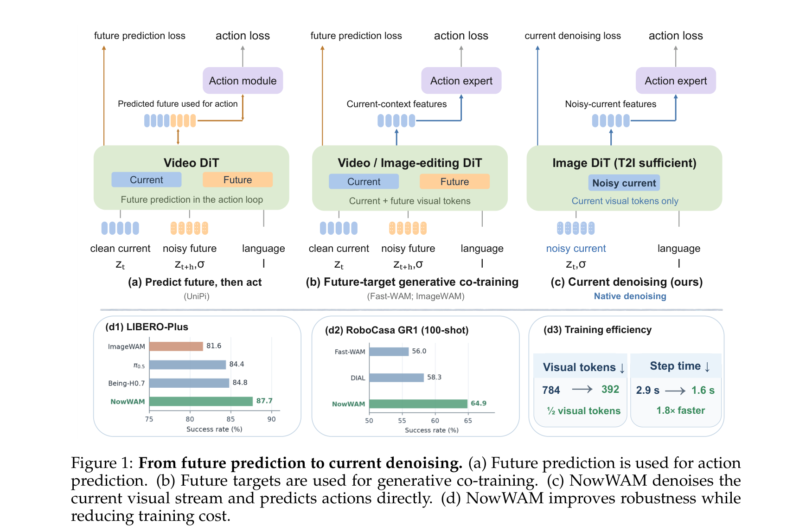
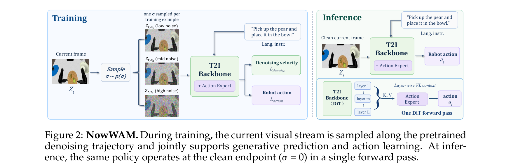
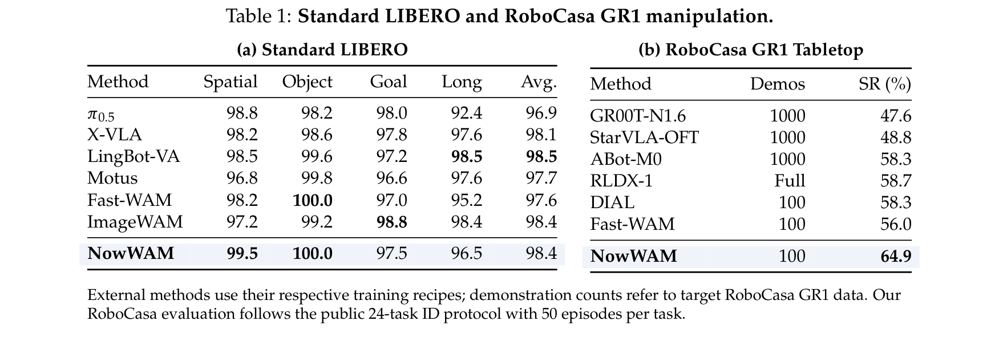
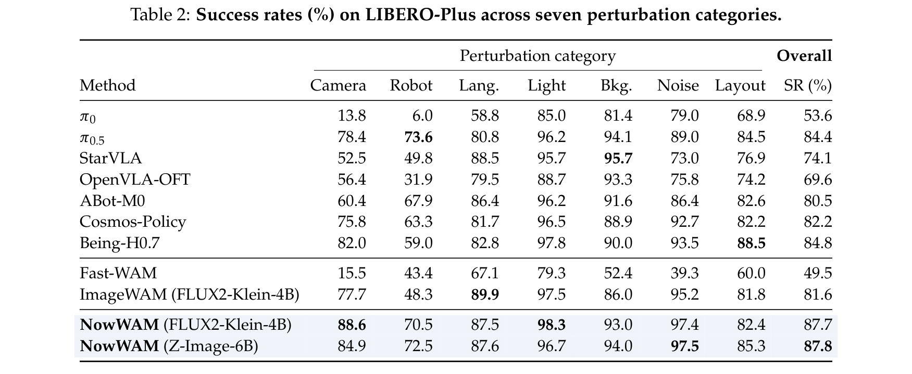
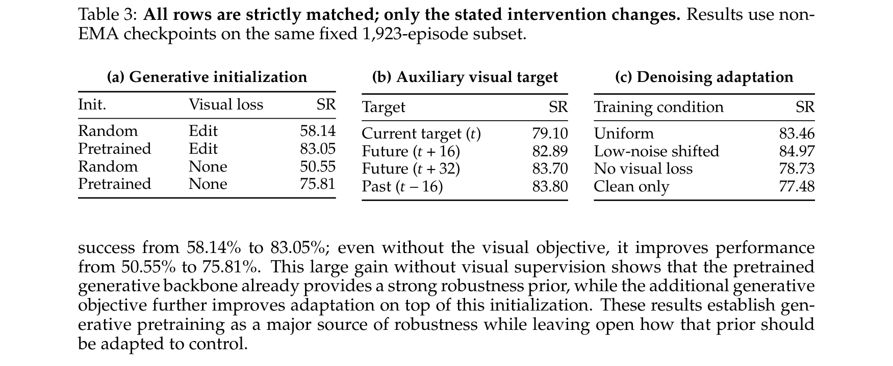
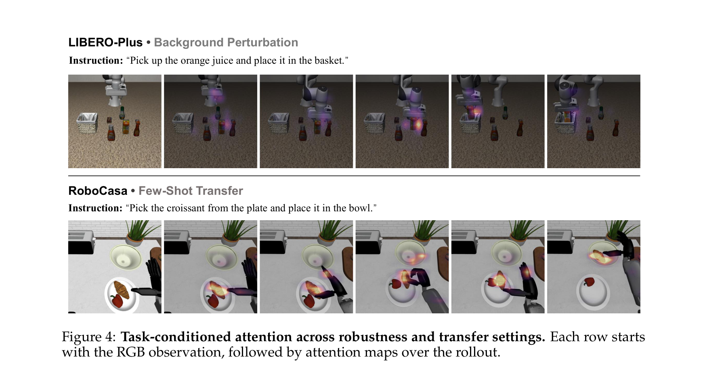

# Beyond Future Prediction: Denoising as Generative Adaptation for Robot Control (NowWAM)

## 核心信息

- **论文标题**：Beyond Future Prediction: Denoising as Generative Adaptation for Robot Control
- **中文译名**：超越未来预测：去噪作为面向机器人控制的生成式自适应
- **简称/模型名**：NowWAM（意指专注于“当前帧去噪”的世界动作模型，反思传统“预测未来”范式）
- **作者团队**：Zanyi Wang (UCSD), Yuheng Lei (HKU), Dengyang Jiang (HKUST), Ping Luo (HKU), Mengdi Wang (Princeton), Zhixuan Liang (Princeton/HKU, 通讯), Shilong Liu (Princeton, 通讯)
- **发布时间**：2026 年 9 月 23 日 (arXiv: 2609.28339v1)
- **开源代码与项目主页**：[https://xmz111.github.io/NowWAM](https://xmz111.github.io/NowWAM)
- **核心定位**：对当前具身智能界“必须预测未来视频才能获得生成式物理先验”的流行假说发起**第一性原理质疑**。提出单流流匹配（Flow Matching）去噪自适应框架 NowWAM，直接在面向动作的当前观测潜在表征上实施连续时间步去噪，彻底摒弃辅助的未来/过去视觉预测目标；推断期只需评估纯净端点（$\sigma=0$），实现单次前向零延迟执行。
- **关键战绩**：
  - **训练效率翻倍**：相比双流未来协同训练（ImageWAM / Fast-WAM），训练期视觉 Token 数量直接减半（784 $\to$ 392），单步训练时间从 2.85s 骤降至 1.63s（**1.8 倍加速**），峰值显存降低 5.8%（78.9 GiB $\to$ 74.3 GiB）。
  - **极端扰动霸榜（LIBERO-Plus）**：在涵盖 7 大扰动类别、10,030 次评测的 LIBERO-Plus 评测中，NowWAM 采用 FLUX2-Klein-4B 达到 **87.7%**，采用纯文本生图的 Z-Image-6B 达到 **87.8%**，大幅压制 ImageWAM（81.6%）、Being-H0.7（84.8%）、$\pi_{0.5}$（84.4%）、Cosmos-Policy（82.2%）与 Fast-WAM（49.5%）。在最为严苛的视角扰动（Camera Viewpoint）下斩获 **88.6%**（比 $\pi_{0.5}$ 高出 10.2 个百分点，比 ImageWAM 高出 10.9 个百分点）。
  - **标称与少样本跨域强劲**：Standard LIBERO 取得 **98.4%** 饱和高分；在跨仿真器少样本基准 RoboCasa GR1 Tabletop（100-shot 演示）上达到 **64.9%**，超越 Fast-WAM（56.0%）与 DIAL（58.3%）。
  - **核心证伪发现**：在严格对齐的受控消融中，辅助目标设定为过去帧（$t-16$，83.80%）、未来帧（$t+16$，82.89%）和远未来帧（$t+32$，83.70%）在抗扰泛化上**完全没有统计学差异**；反之，若在训练期移除连续去噪过程而仅保留纯净端点（$\sigma=0$），成功率从 84.97% 骤降至 77.48%。**这铁证般地表明：世界模型中带来泛化能力的并非未来时序语义，而是去噪轨迹作为强几何与语义正则项在起作用！**

---

## 原文摘要翻译

预训练生成式扩散 Transformer（Diffusion Transformers, DiT）通过海量图像与视频生成训练，捕获了极其丰富的像素级视觉结构与语言条件化信息。当前越来越多的机器人策略借助生成式视觉-动作协同训练（Co-Training）引入这一生成式先验，且在实践中通常被实例化为“未来视觉预测”。然而，近期的前沿方法正逐步将这种生成预测移出在线推断阶段，仅在协同训练期予以保留。这种范式的转变留下了一个更为本质的基础疑问：预训练生成式 DiT 究竟为动作学习贡献了什么？这一先验又应当以何种方式自适应适配于控制任务？

在本文中，我们提出了 **NowWAM**——一种**免除未来辅助目标（Future-Target-Free）**的生成式协同训练策略。NowWAM 直接对当前观测实施去噪，并从同一视觉流中直接预测机器人动作，从而在整个去噪轨迹上将原生生成式目标与面向动作的表征深度耦合。在严格受控的对比实验中，我们发现**过去视觉目标与未来视觉目标带来的性能增益几乎完全对等**；反之，若将训练阶段严格限制在去噪过程的纯净端点，策略的抗扰鲁棒性则会发生断崖式下跌。这一发现强力证明：**独立的未来视觉目标对于生成式自适应并非必不可少，而去噪状态的连续统（Continuum of Denoising States）才是面向控制的最高效接口**。

在 LIBERO-Plus 基准测试中，基于 FLUX2-Klein 骨干的 NowWAM 取得了 87.7% 的成功率，在性能超越未来目标协同训练基线 6.1 个百分点的同时，将训练期视觉 Token 数量减半（784 $\to$ 392），并将单步训练时间从 2.85 秒缩短至 1.63 秒（实现 1.8 倍训练加速）。进一步地，当搭载纯文本生图（T2I）骨干 Z-Image 时，NowWAM 依然斩获了 87.8% 的极高成功率，这充分证实强有力的机器人控制自适应完全不需要依赖昂贵的视频生成或图像编辑专用骨干。

---

## 创新点

1. **破除“未来视频预测”执念的奥卡姆剃刀（Conceptual Paradigm Shift）**：
   - 首次在具身世界模型（WAM）领域揭穿了“前向视频预测是生成式物理先验唯一来源”的幻觉。通过严格受控实验证明，无论辅助预测的是未来（$t+16$）、远未来（$t+32$）还是过去（$t-16$），其抗扰增益完全等价。这表明具身世界模型之所以比纯 VLA 具备更强的环境泛化能力，根本原因不是“预知未来”，而是“扩散生成去噪所蕴含的多尺度视觉流形重构能力”。
2. **单流原生去噪自适应（Single-Stream Native Denoising Adaptation）**：
   - 改变了过去 Fast-WAM 与 ImageWAM 所采用的“当前观测流 + 辅助目标流”的双流结构（$[l \mid z_t \mid z_{t,\sigma}^+ \mid a]$），首创单流去噪机制（$[l \mid z_{t,\sigma} \mid a]$）。直接对当前潜变量 $z_t$ 加噪生成 $z_{t,\sigma}$，并计算流匹配速度场损失 $\mathcal{L}_{\text{denoise}} = \|\hat{v}_t - (\epsilon - z_t)\|_2^2$，让同一组视觉表征同时承担生成去噪与动作生成两项任务。
3. **轨迹条件化训练与纯净端点极速推断（Clean-Endpoint Control）**：
   - 在训练期间，Action Expert 接收跨越连续噪声等级 $\sigma \in [0, 1]$ 的视觉语言上下文，迫使动作特征流形与去噪轨迹对齐；在部署推断时，系统无需任何迭代去噪 Rollout 或多步采样，直接将噪声置零（$\sigma=0, z_{t,0}=z_t$），在单次前向传播（Single Forward Pass）中零延迟输出动作。
4. **生成骨干彻底脱敏：从视频/编辑 DiT 下放至纯文本生图（T2I）DiT**：
   - 过去 WAM 模型通常被绑定在昂贵的视频生成模型（如 CogVideoX、Sora 衍生架构）或复杂的图像编辑模型上。NowWAM 证明了纯粹的 Text-to-Image（如 Z-Image-6B、FLUX2-Klein-4B）同样蕴含极其强大的空间几何、物体解耦与常识先验，彻底解绑了对时序预训练权重的强依赖。
5. **训练吞吐翻倍与计算显存双重减负（Computational Efficiency）**：
   - 彻底摒弃辅助目标后，输入 Transformer 的视觉 Token 数量直接从 784 减至 392（腰斩 50%）。在 2$\times$H200 硬件环境下，单步训练耗时从 2.85s 压至 1.63s（**1.8 倍加速**），峰值显存从 78.9 GiB 降至 74.3 GiB，大幅降低了大规模具身策略训练的资源门槛。

---

## 一句话总结

NowWAM 证明了具身世界模型中“未来视频预测”只是生成式表征适配的形式外壳，其真正的抗扰核心在于去噪轨迹的连续约束；通过将流匹配去噪直接作用于当前观测并以纯净端点单步推断，在视觉 Token 减半、训练提速 1.8 倍的同时，登顶 LIBERO-Plus 极限扰动基准。

---

## 研究问题

### 1. 具身策略两大流派的发展瓶颈与分水岭
在现代通用机器人策略的演进脉络中，存在两条鲜明的主线：
- **纯理解型 VLA（Vision-Language-Action）路线**：如 OpenVLA、$\pi_0$、$\pi_{0.5}$、GR00T、Qwen-VLA 等。这类模型直接继承大规模多模态大模型（VLM）的高层语义表征，通过混合注意力或 MLP 映射到动作空间。其优势在于语义理解与指令泛化极强，但在面对低层视觉扰动（如相机视角突变、光照剧变、背景杂乱、微小机械臂位姿偏移）时表现出脆弱的脆性（Brittleness）。
- **生成式世界动作模型（World-Action Models, WAM）路线**：如 UniPi、Gen2Act、RoboDreamer、Vidar、Motus、Fast-WAM、ImageWAM 等。这类模型认为生成式扩散模型（DiT）在预训练过程中学习了像素级的精细几何对应、物体遮挡关系和物理流形，因此试图将视频扩散模型引入控制循环中。

### 2. 具身世界模型（WAM）的历史演变链条与“未来预测”的异化
在世界模型融入机器人控制的演化过程中，经历了三个关键阶段（参见后文 Figure 1）：
1. **第一阶段：在线未来预测与推断闭环（Predict-then-Act / Future-in-the-Loop）**：
   - 代表作：UniPi, RoboDreamer, Gen2Act, Vidar。
   - 逻辑：策略接收当前图像 $z_t$ 和指令 $l$，首先调用昂贵的视频扩散模型迭代数十步采样生成未来视频 $\hat{z}_{t+H}$，然后再根据生成的幻觉未来去回归动作 $[l \mid z_t \to \hat{z}_{t+H} \to a]$。
   - 致命缺陷：推断延迟高达数秒甚至数十秒，多步生成导致复合误差（Compounding Error），在真实机器人闭环中完全无法满足 10Hz–50Hz 的实时控制要求。
2. **第二阶段：测试期解耦与训练期未来协同（Training-time Future-Target Co-training）**：
   - 代表作：Fast-WAM, ImageWAM。
   - 逻辑：Fast-WAM 敏锐地意识到测试期根本不需要生成未来视频，将未来预测移出推断流程，推断期仅保留 $[l \mid z_t \mid a]$；但在训练期间，依然强制保留预测未来视频潜变量的任务 $[l \mid z_t \mid z_{t,\sigma}^+ \mid a]$。ImageWAM 进一步发现连未来视频都不需要，只需要协同预测一张单帧未来图片即可。
   - 遗留矛盾：虽然测试期变快了，但训练期仍然需要双流输入（当前帧 + 未来目标帧），导致视觉 Token 数量翻倍、注意力显存爆炸、训练极其缓慢。
3. **第三阶段：第一性原理追问（The Core Question of NowWAM）**：
   - 既然测试期动作完全不需要依赖未来生成，那为什么训练期还要费尽周折去预测未来？
   - 预训练生成式 DiT 到底给机器人策略提供了什么有效先验？
   - “预测未来”本身真的是世界模型产生鲁棒性的因果要素（Causal Factor）吗？

---

## 数据与任务定义

为彻底解构生成式自适应的机理并全面检验其泛化能力，论文在三大互补的模拟基准上展开了详尽评测：

1. **Standard LIBERO 基准（标称操作与基础能力校验）**：
   - 包含 4 个标准子任务集：`LIBERO-Spatial` (10 任务), `LIBERO-Object` (10 任务), `LIBERO-Goal` (10 任务), `LIBERO-Long` (10 任务)，共计 40 项长短时程机械臂操作任务。
   - 目的：验证在完全同分布（In-Distribution）的常规操控场景下，抛弃未来预测目标是否会导致基础操控能力或任务完成率退化。
2. **RoboCasa GR1 Tabletop 基准（跨仿真器少样本极限迁移）**：
   - 针对人形机器人 GR1 在真实厨房台面上的 24 项公开 ID 任务，使用不同于 LIBERO 的复杂仿真环境。
   - 数据协议：严格限定每个任务仅提供 **100 条演示轨迹（100-shot）**，每个任务评测 50 个轮次，全套基准共计 1,200 个评测 Episode。
   - 目的：检验策略在跨仿真器（Cross-Simulator）和严苛低资源（Low-Data Budget）情境下的知识迁移效率。
3. **LIBERO-Plus 极限抗扰泛化基准（核心战场）**：
   - 包含多达 **10,030 次完整仿真评估 Episode**，涵盖真实世界部署中可能遭遇的 7 大核心扰动维度：
     - **Camera Viewpoint（相机视角变化）**：视角偏移、俯仰角与焦距拉伸，考验视点不变性与 3D 几何稳健性。
     - **Robot Initial States（机械臂初始状态）**：机械臂起始关节角度与末端位姿大幅偏离训练中心。
     - **Language Instructions（语言泛化）**：同义词替换、复杂句式与语义扰动。
     - **Lighting Conditions（极端光照变化）**：暗光、局部过曝、动态光影。
     - **Background & Distractors（背景与桌面杂物）**：桌面纹理替换、无关物体干扰。
     - **Visual Noise（图像噪声）**：椒盐噪声、高斯模糊、传感器退化。
     - **Layout Shift（物体空间布局变异）**：目标物与容器相对位置大幅颠倒与重排。
   - 评估策略：主榜单采用 10,030 全量评测轮次与 EMA 模型权重；分析与可控消融采用严格对齐的 **1,923 轮次固定子集**（Non-EMA 检查点），确保消融变量的纯粹隔离。

---

## 方法主线

```
+---------------------------------------------------------------------------------------------------+
|                                      NowWAM 核心架构与训练/推断流向                                |
+---------------------------------------------------------------------------------------------------+
|                                                                                                   |
|  【训练阶段 Training】: 单流去噪流匹配与动作联合优化                                                |
|                                                                                                   |
|   语言指令 l ---------> 文本编码与条件嵌入 ---------------------------------+                      |
|                                                                           |                       |
|   当前视觉 z_t -------> 偏置噪声采样 σ ~ p(σ)                              |                       |
|                             │                                             ▼                       |
|                             ▼                                    +-----------------+              |
|                         加噪潜变量 z_{t,σ} = (1-σ)z_t + σϵ ----->|                 |              |
|                                                                  |  生成式 DiT 骨干 |              |
|                                                                  | (T2I / FLUX2 /  |              |
|                                                                  |    Z-Image)     |              |
|                                                                  +--------+--------+              |
|                                                                           | 层级多模态上下文       |
|                                                 +-------------------------+                       |
|                                                 | (Layer-wise VL Context)                         |
|                                                 ▼                                                 |
|                                        +------------------+                                       |
|                                        |   Action Expert  |                                       |
|                                        |  (DiT-MoT 架构)  |                                       |
|                                        +--------+---------+                                       |
|                                                 |                                                 |
|                         +-----------------------+-----------------------+                         |
|                         ▼                                               ▼                         |
|             预测速度场 v_hat_t (预测去噪)                       预测动作序列 a_hat_t               |
|                         │                                               │                         |
|                         ▼                                               ▼                         |
|             L_denoise = ||v_hat_t - (ϵ - z_t)||^2           L_action = MSE(a_hat_t, a_t)          |
|                         \_______________________ _______________________/                          |
|                                                 ▼                                                 |
|                                联合损失 L = 0.5 * L_denoise + 1.0 * L_action                      |
|                                                                                                   |
| ------------------------------------------------------------------------------------------------- |
|                                                                                                   |
|  【推断阶段 Inference】: 纯净端点评估 (Clean-Endpoint Control)                                     |
|                                                                                                   |
|   当前视觉 z_t -------> 纯净端点设定 σ = 0                                                         |
|                             │                                                                     |
|                             ▼                                                                     |
|                         干净潜变量 z_{t,0} = z_t ---------------->+-----------------+              |
|                                                                  |  生成式 DiT 骨干 |              |
|   语言指令 l ---------------------------------------------------->+--------+--------+              |
|                                                                           | 单次前向传播           |
|                                                                           ▼                       |
|                                                                  +------------------+             |
|                                                                  |   Action Expert  |             |
|                                                                  +--------+---------+             |
|                                                                           |                       |
|                                                                           ▼                       |
|                                                          直接输出执行动作 a_t (零生成开销!)        |
+---------------------------------------------------------------------------------------------------+
```

### 1. 机制流程与范式演变对比



如上图（Figure 1）所示，论文将生成式机器人控制的范式演变梳理为四个对比维度：
- **(a) 动作循环内预测未来（UniPi 等）**：$[l \mid z_t 	o z_{t+H,\sigma}^+ 	o a]$，推断期需完整展开视频扩散，延迟灾难。
- **(b) 未来目标生成式协同训练（Fast-WAM, ImageWAM）**：$[l \mid z_t \mid z_{t,\sigma}^+ \mid a]$，推断期弃用未来，但训练期仍维持双流视觉输入，Token 数量达 784。
- **(c) NowWAM 当前帧单流去噪（本文方案）**：$[l \mid z_{t,\sigma} \mid a]$，彻底剔除未来目标，单一视觉流在加噪状态下同时优化去噪速度场与动作输出。
- **(d) 带来的实质收益**：视觉 Token 减半（784 $	o$ 392），步时缩短 1.8 倍（2.9s $	o$ 1.6s），在 LIBERO-Plus 与 RoboCasa 上抗扰度全面反超。



### 2. 传统未来协同训练的隐性负担与流式解耦

在传统的生成式协同训练中，令 $l$ 为语言指令，$z_t$ 为当前观测的潜变量，$z_t^+$ 为辅助视觉目标（通常取未来时步 $t+H$ 的观测潜变量）。加噪采样遵循连续扩散或流匹配公式：

$$z_{t, \sigma}^+ = (1 - \sigma) z_t^+ + \sigma \epsilon, \quad \epsilon \sim \mathcal{N}(0, I)$$

其训练期的抽象流式表示为双流结构：

$$	ext{Training: } [l \mid z_t \mid z_{t, \sigma}^+ \mid a]$$

在此架构下，$z_t$ 负责提供控制决策所需的无噪视觉锚点，而 $z_{t,\sigma}^+$ 则承担维持 DiT 预训练去噪接口的重任。在部署推断时，由于辅助目标流被丢弃，策略退化为：

$$	ext{Inference: } [l \mid z_t \mid a]$$

**痛点剖析**：
1. **输入序列过长**：当前帧与未来帧同时输入 Transformer，自注意力计算复杂度随序列长度二次方爆炸，单个样本需要消耗 784 个视觉 Token。
2. **目标与控制脱节**：动作预测头读取的是干净的 $z_t$ 特征，而生成式损失仅仅回传给目标流 $z_{t,\sigma}^+$。这种“隔山打牛”式的梯度流动，使得动作表征并没有直接受到去噪流形几何平滑特性的充分约束。

### 3. NowWAM 单流去噪流匹配（Flow Matching）与速度目标

NowWAM 彻底切断了辅助流，直接在当前帧 $z_t$ 上定义生成式自适应过程。

#### (1) 偏置时间步调度（Shifted Noise Schedule）
从均匀分布中采样 $u \sim \mathcal{U}(0, 1)$，并通过非线性变换映射到连续噪声水平 $\sigma$：

$$\sigma = rac{s u}{1 + (s - 1) u}$$

- 当 $s = 1$ 时，退化为标准均匀采样；
- 当 $s < 1$ 时，采样概率密度向低噪声区间（Low-Noise Region）平滑倾斜。低噪声区间更贴近真实无噪图像的流形边界，在保留生成式几何正则的同时，减少极端大噪声对细粒度动作控制特征的破坏。

#### (2) 扰动潜变量采样与理想速度向量
根据流匹配框架线性插值构造加噪当前帧：

$$z_{t, \sigma} = (1 - \sigma) z_t + \sigma \epsilon, \quad \epsilon \sim \mathcal{N}(0, I)$$

其沿着概率流由噪声 $\epsilon$ 演化到真实数据 $z_t$ 的理论目标速度（Velocity Target）为：

$$v_t^* = rac{d z_{t,\sigma}}{d \sigma} = \epsilon - z_t$$

此时整个模型的训练流在概念上收敛为高度紧凑的单流形式：

$$	ext{Training: } [l \mid z_{t, \sigma} \mid a]$$

#### (3) 多任务联合优化目标
整个模型通过联合损失函数进行端到端微调：

$$\mathcal{L} = \lambda_{	ext{vis}} \mathcal{L}_{	ext{denoise}} + \lambda_{	ext{act}} \mathcal{L}_{	ext{action}}$$

其中视觉去噪损失度量预测速度场 $\hat{v}_t$ 与目标速度场的均方误差：

$$\mathcal{L}_{	ext{denoise}} = \|\hat{v}_t - (\epsilon - z_t)\|_2^2$$

动作损失 $\mathcal{L}_{	ext{action}}$ 为连续机械臂动作轨迹上的掩码均方误差（Masked MSE）。在官方标准配置中，损失平衡系数设定为：

$$\lambda_{	ext{vis}} = 0.5, \quad \lambda_{	ext{act}} = 1.0$$

### 4. 轨迹条件化训练与纯净端点控制（Clean-Endpoint Control）

NowWAM 最为精妙的系统设计在于**训练与部署的完美对齐与解耦**：
- **训练期（Trajectory-Conditioned Training）**：Action Expert 读取的视觉上下文来自于经历不同加噪程度 $\sigma$ 的 DiT 隐藏层特征。这意味着 Action Expert 必须学会在充满扰动、模糊与高频退化的视觉表征中提取鲁棒的控制意图，获得了天然的数据增强与物理不变性约束。
- **推断期（Clean-Endpoint Control）**：在部署控制时，环境给出的是确定的当前图像。此时策略直接将噪声水平置零：

$$\sigma = 0 \implies z_{t, 0} = z_t$$

模型流完全退化为标准的确定性推断：

$$[l \mid z_{t, 0} \mid a] = [l \mid z_t \mid a]$$

**优势**：在测试期，整个系统仅需执行**单次前向传递（Single Forward Pass）**，无需任何反复去噪的 ODE/SDE 求解器，不存在任何采样延迟，也不需要额外的未来帧 Token 计算开销！

### 5. DiT-MoT 解耦交互与生成骨干兼容性

- **解耦专家架构（DiT-MoT）**：策略采用双流专家交互模式，包括一个预训练的生成式 DiT 骨干和一个专门的 Action Expert。DiT 骨干负责编码文本指令 $l$ 与加噪视觉流 $z_{t,\sigma}$，并在每一层（Layer 1 到 Layer $L$）提取多模态 Key-Value 特征；Action Expert 通过带掩码的混合注意力机制（Masked Mixed Attention）单向跨注意力读取这些视觉语言上下文，而动作 Token 的内部计算完全独立，防止动作梯度的剧烈扰动破坏预训练 DiT 的生成先验。
- **骨干全面兼容纯文本生图（T2I）**：以往的视频世界模型必须要求预训练权重包含因果时序注意力或图像编辑指令输入（Image-Editing Prompt）。NowWAM 的骨干只接收单一的当前帧 $z_{t,\sigma}$ 和纯文本指令 $l$，因此可以**无缝兼容任何最先进的开源文本生图单流/双流 DiT**（如 FLUX2-Klein-4B 和 Z-Image-6B），大幅拓宽了具身智能底座的选择空间。

---

## 关键结果

### 1. 主结果与强基线横向比拼（Standard LIBERO 与 RoboCasa）



#### (1) Standard LIBERO 饱和性能检验
在标准 LIBERO 的 40 个任务中，强基线策略均已接近饱和：
- **NowWAM**：取得了 **98.4%** 的平均成功率（Spatial: 99.5%, Object: 100.0%, Goal: 97.5%, Long: 96.5%）。
- **对比基线**：与保留未来预测的 ImageWAM（98.4%）完全持平，并超越 Fast-WAM（97.6%）、Motus（97.7%）和 $\pi_{0.5}$（96.9%）。
- **结论**：彻底剔除未来时序目标，完全不会损害机器人在名义分布内的基本操控精度。

#### (2) RoboCasa GR1 少样本（100-shot）跨仿真器迁移
在跨平台仿真基准 RoboCasa 上，任务涵盖 24 个拟真厨房场景，仅提供 100 条微调示范：
- **NowWAM（100-shot）**：斩获 **64.9%** 的高成功率。
- **对比基线**：在相同 100-shot 数据预算下，显著优于 DIAL（58.3%）与 Fast-WAM（56.0%）；甚至超越了使用 1000 条演示的 StarVLA-OFT（48.8%）和 ABot-M0（58.3%）。
- **结论**：证明 NowWAM 学到的当前帧去噪流形具有强大的少样本跨域表征迁移能力。

---

### 2. 极限扰动下的鲁棒性跃升（LIBERO-Plus 7 大维度全面剖析）



LIBERO-Plus 包含 10,030 轮次的系统化环境抗扰评测，是检验策略真实鲁棒性的金标准。如 Table 2 所示：

| 方法 (Method) | Camera (视角) | Robot (位姿) | Lang. (语言) | Light (光照) | Bkg. (背景) | Noise (噪声) | Layout (布局) | Overall SR (%) |
| :--- | :---: | :---: | :---: | :---: | :---: | :---: | :---: | :---: |
| $\pi_0$ | 13.8 | 6.0 | 58.8 | 85.0 | 81.4 | 79.0 | 68.9 | 53.6 |
| $\pi_{0.5}$ | 78.4 | 73.6 | 80.8 | 96.2 | 94.1 | 89.0 | 84.5 | 84.4 |
| StarVLA | 52.5 | 49.8 | 88.5 | 95.7 | 95.7 | 73.0 | 76.9 | 74.1 |
| OpenVLA-OFT | 56.4 | 31.9 | 79.5 | 88.7 | 93.3 | 75.8 | 74.2 | 69.6 |
| ABot-M0 | 60.4 | 67.9 | 86.4 | 96.2 | 91.6 | 86.4 | 82.6 | 80.5 |
| Cosmos-Policy | 75.8 | 63.3 | 81.7 | 96.5 | 88.9 | 92.7 | 82.2 | 82.2 |
| Being-H0.7 | 82.0 | 59.0 | 82.8 | 97.8 | 90.0 | 93.5 | 88.5 | 84.8 |
| Fast-WAM | 15.5 | 43.4 | 67.1 | 79.3 | 52.4 | 39.3 | 60.0 | 49.5 |
| ImageWAM (FLUX2-Klein-4B) | 77.7 | 48.3 | **89.9** | 97.5 | 86.0 | 95.2 | 81.8 | 81.6 |
| **NowWAM (FLUX2-Klein-4B)** | **88.6** | 70.5 | 87.5 | **98.3** | 93.0 | 97.4 | 82.4 | **87.7** |
| **NowWAM (Z-Image-6B)** | 84.9 | **72.5** | 87.6 | 96.7 | **94.0** | **97.5** | **85.3** | **87.8** |

**核心亮点剖析**：
1. **全面超越世界模型与 SOTA VLA 基准**：NowWAM (FLUX2) 达到 **87.7%**，NowWAM (Z-Image) 达到 **87.8%**，超越了最强未来预测基准 ImageWAM（81.6%）多达 **6.1 个百分点**，大幅拉开与 $\pi_{0.5}$（84.4%）、Being-H0.7（84.8%）的差距。
2. **极端视角变化（Camera Viewpoint）下的绝对统治力**：视角扰动是最令机器人策略头疼的痛点。NowWAM 取得了惊人的 **88.6%**，比 ImageWAM（77.7%）高出 10.9 个百分点，比 $\pi_{0.5}$（78.4%）高出 10.2 个百分点，更是秒杀了 Fast-WAM（15.5%）。这强力证明直接在当前帧实施去噪能够将 3D 多视角几何不变性深植于表征中。
3. **纯文本生图骨干的强大泛化（Z-Image-6B）**：Z-Image-6B 在甚至没有经过任何图像编辑微调的前提下，在 Robot 位姿（72.5%）、背景（94.0%）、噪声（97.5%）和布局改变（85.3%）上均刷新了记录，总分达到 87.8%，打破了“必须使用专门视频扩散底座”的迷思。


**定性执行失败案例对比（Figure 3）**：
- **RoboInit 扰动下**：指令要求“拿起小模具旁的黑碗放到盘子里”。Fast-WAM 和 ImageWAM 在机械臂初始关节偏转后，无法准确辨识抓取目标或发生严重空间误对齐，导致动作抓空或抓错；NowWAM 则精准锁定黑碗，平稳完成夹取并放置入盘。
- **Camera Viewpoint 扰动下**：指令要求“拉开顶层抽屉并把碗放进去”。在摄像机视角大幅偏移后，基线模型在第一阶段接触抽屉把手时便发生滑移脱靶；NowWAM 顺利补偿了视角偏移引起的视差畸变，精准推开抽屉并完成长程放置。

---

### 3. 颠覆性消融：到底什么才是生成式自适应的决定性因素？



在严格受控的 1,923 轮 LIBERO-Plus 测试中，作者设计了堪称教科书级别的三组消融实验（Table 3）：

#### (1) 消融一：生成式预训练权重的底座价值（Table 3a）
- **从头随机初始化（Random Init） + Edit 损失**：58.14%
- **预训练骨干（Pretrained Init） + Edit 损失**：83.05%（**提升 +24.91%**）
- **从头随机初始化（Random Init） + 无视觉损失（纯动作）**：50.55%
- **预训练骨干（Pretrained Init） + 无视觉损失（纯动作）**：75.81%（**提升 +25.26%**）
- **结论**：预训练生成式 DiT 本身就是一个蕴含海量常识与空间结构的极强先验池；即使完全不加任何视觉辅助损失，光是拿预训练 DiT 当动作主干，都能取得 75.81% 的高分。

#### (2) 消融二：辅助时序目标的颠覆性真相（Table 3b）
当固定双流协同训练框架，仅仅改变辅助预测的视觉目标帧时：
- **预测未来帧（$t+16$）**：82.89%
- **预测远未来帧（$t+32$）**：83.70%
- **预测过去历史帧（$t-16$）**：**83.80%**
- **当前帧独立辅助目标（$t$，双流结构）**：79.10%
- **震撼结论**：**预测未来（82.89%）和预测过去（83.80%）的抗扰效果几乎完全一样！**
  - 如果所谓“世界模型”的核心在于“对未来物理动态的前瞻推演”，那么预测未来必然应该显著超越预测过去。
  - 然而实验结果表明，预测过去甚至还略高 0.9 个百分点！这彻底在实证层面上宣告：“预测未来时序动力学”并不是具身策略获得泛化能力的特权原因！它只是迫使模型维持生成式去噪流形的一种副产物形式。

#### (3) 消融三：去噪轨迹 vs 纯净端点的决定性分界（Table 3c）
既然未来目标不重要，那把模型退化为纯粹在干净图像上做动作学习行不行？
- **NowWAM 低噪声偏置采样（Low-noise shifted, $s < 1$）**：**84.97%**
- **NowWAM 均匀噪声采样（Uniform, $s = 1$）**：83.46%
- **有噪声输入但移除视觉去噪损失（No visual loss）**：78.73%
- **纯净端点训练（Clean only, 固定 $\sigma = 0$）**：**77.48%**
- **本质结论**：
  - 如果仅在纯净端点（$\sigma=0$）训练，成功率直接从 84.97% 崩塌到 77.48%（暴跌 7.5 个百分点）。
  - 这证明单纯给模型输入干净图像做常规训练，即使保留了 DiT 骨干，表征也会迅速在微调中发生“过拟合退化”。
  - **真正的核心机理在于：沿着去噪轨迹（$z_{t,\sigma}$）采样训练，利用流匹配的去噪目标约束动作表征空间，才是生成式物理与几何先验能够成功注入动作学习的真正枢纽！**

---

### 4. 训练效率与显存开销


在标准的 2$\times$H200 服务器上，全局 Batch Size 设为 64，严格剔除预先缓存的 VAE 潜变量与文本 Embedding 时间，纯粹评估 DiT 与 Action Expert 的联合微调效率（Table 4）：

| 方法 (Method) | 训练代理目标 (Training Proxy) | 视觉 Token 数量 (Tokens) | 单步训练用时 (Step Time) | 显存峰值 (Peak Memory) |
| :--- | :---: | :---: | :---: | :---: |
| ImageWAM | 单张未来图像预测 | 784 | 2.85 秒 | 78.9 GiB |
| **NowWAM** | **当前帧流匹配去噪** | **392 (减少 50%)** | **1.63 秒 (提速 1.8×)** | **74.3 GiB (降低 5.8%)** |

- **Token 减半**：从 784 削减至 392，避免了多帧多视角带来的显存压力。
- **吞吐飞跃**：单步时间缩短 1.22 秒，训练吞吐提升 75%，使得百亿级参数 DiT 策略的大规模具身微调变得极其平民化。

---

### 5. 跨任务注意力分布与表征可解释性



Figure 4 呈现了策略在面对高强度背景杂波以及少样本迁移时的交叉注意力演化热力图：
- 在 **LIBERO-Plus 背景扰动**任务（“拿起橙汁放入篮子”）中，即便桌面铺满了高对比度、杂乱无章的假背景，NowWAM 的空间注意力从起始规划阶段到接触抓取阶段，始终牢牢锁定橙汁瓶身和篮子提手，对背景噪声产生了天生的空间“抗体”；
- 在 **RoboCasa 少样本迁移**任务（“从盘中取出牛角包放入碗中”）中，策略能够在仅仅 100-shot 的极度稀疏示范下，高对比度地激活机械臂夹爪与牛角包接触面的几何交界，展示出无监督预训练所赋予的稠密对应（Dense Correspondence）能力。

---

## 深度分析

### 1. 真正贡献是什么：去噪轨迹作为物理与视觉先验的正则化器

长期以来，学术界流行一种根深蒂固的直觉：**“机器人需要像人类一样‘在脑海中想象未来’，才算拥有世界模型；因此，只有前向视频预测才能赋予策略常识和物理规律。”**

NowWAM 的最大贡献，就是用无可辩驳的受控证据，彻底戳破了这个看似合理、实则未经审视的学术浪漫主义滤镜：
1. **时序前瞻并非先验的源泉**：消融表明预测过去帧与预测未来帧无异。这说明扩散模型之所以强大，并非因为它懂得了时间的单向不可逆箭头，而是因为扩散/流匹配模型本质上是一个**高阶的显式流形密度估计器与多尺度结构解析器**。
2. **去噪过程才是最强的结构正则**：高斯加噪过程在数学上相当于对流形数据分布施加高斯热核平滑（Heat Kernel Smoothing）。在连续噪声等级 $\sigma$ 上学习速度场 $v_t^* = \epsilon - z_t$，强迫模型在任何模糊、受损、偏移的状态下，都能准确指出“回归真实物理低维流形的方向”。
3. **动作表征与去噪表征的共生耦合**：当 Action Expert 跨注意力读取这些具有自愈能力和几何解析力的中间特征时，机器人的动作预测自然获得了对抗环境随机摄动的超强稳健性。

### 2. 为什么结果成立：数学机理与表征几何学剖析

我们可以从微分几何与概率流的角度更深刻地理解为什么 NowWAM 在极度扰动下（尤其是视角与光照）能够大幅胜出：

1. **切空间约束与李导数平滑**：
   - 设环境观测流形为 $\mathcal{M}$，动作流形为 $\mathcal{A}$。纯干净图像训练时，策略仅能见到 $\mathcal{M}$ 上的零测度离散样本点。当测试期发生相机偏角或光照骤变时，输入图像点离开 $\mathcal{M}$ 落在高维流形外部，纯 VLA 策略由于从未见过流形外的梯度方向，动作预测立即发生剧烈漂移。
   - 而 NowWAM 通过流匹配强制学习了流形周围全空间的向心向量场 $\nabla \log p_\sigma(z)$。即便相机位姿扰动使得感知点漂移，DiT 骨干内部编码的特征流场也会自动沿流匹配测地线将其向语义核心投影，因而 Action Expert 读到的依然是高度归一化的任务语义。
2. **单流强关联 vs 双流弱关联**：
   - 在 Fast-WAM / ImageWAM 的双流架构下，动作头读取干净流 $z_t$，生成损失落在加噪目标流 $z_{t,\sigma}^+$ 上。它们仅在 Transformer 深层自注意力中产生微弱的二阶梯度交互（Cross-Token Attention）。
   - 在 NowWAM 的单流架构下，输入本身就是 $z_{t,\sigma}$，生成去噪梯度的反向传播直接洗刷负责提供动作上下文的每一个视觉 Token。这种端到端的强耦合，使得每一个视觉神经元都必须兼顾“去噪感知”与“动作执行”，天然消除了多任务学习中的梯度冲突与表示脱节。

### 3. 容易误读的地方（三大误区澄清）

- **误区一：NowWAM 既然不用未来目标，是不是退化成了普通的去噪自编码器（Denoising AutoEncoder, DAE）？**
  - **澄清**：绝对不是。传统的 DAE 只是在像素或离散特征上加固定小噪声做 $L_2$ 重建，缺乏连续时间步和概率流匹配理论保证。NowWAM 继承的是现代生成式 DiT 的**连续概率流匹配（Continuous-time Flow Matching）**与大规模预训练权重。更关键的是，NowWAM 是在**生成式预训练底座上实施多任务自适应微调**，其去噪不是为了从头学表征，而是为了“激活并锁死”基础模型在海量图文预训练中建立的视觉物理先验。
- **误区二：NowWAM 彻底抛弃了未来目标，是不是意味着“世界模型”概念在具身智能中已经过时？**
  - **澄清**：应当精确界定适用范围。论文明确指出：对于单步反应式操控（Reactive Manipulation）、静态抓取与抗扰执行而言，**无需显式的未来预测**，去噪自适应即可提供充足的物理表征。但是，如果遇到需要跨越数十秒、涉及多阶段接触力学、不可逆状态改变（如剪断绳索、液体倾倒、组合式工具使用）的**长程规划与反事实决策任务**，显式的显式前向世界推演（Explicit Dynamics Simulation）依然具有不可替代的价值。NowWAM 否定的是“把未来预测当成提升单步动作鲁棒性的万金油借口”，厘清了世界模型与鲁棒表征的边界。
- **误区三：推断期直接把 $\sigma$ 置为 0，是否会导致训练-测试分布偏移（Train-Test Distribution Mismatch）？**
  - **澄清**：不会。首先，$\sigma=0$ 本身就是连续时间区间 $[0, 1]$ 的极限端点，在流匹配理论中对应无噪真实数据分布。其次，NowWAM 在采样调度中专门引入了偏置超参数 $s < 1$（Low-noise shift），大幅增加了靠近 $\sigma \to 0$ 区域的训练采样权重；最后，消融实验证明，接触过连续去噪流形的模型在 $\sigma=0$ 端点处输出的动作精度（84.97%）远高于只在 $\sigma=0$ 上训练的模型（77.48%）。

### 4. 复现注意点与工程踩坑指南

1. **噪声采样超参数 $s$ 的调试敏感性**：
   - 必须特别注意公式 (4) 中的 $s$ 参数。若设 $s=1$（均匀采样），模型会被迫将过多容量分配给大噪声（$\sigma \approx 1$）状态，此时视觉信息几乎全为纯高斯白噪声，Action Expert 难以从微弱的信噪比中提取精确的目标物坐标，导致微小抓取失败；作者推荐设定偏置参数使得采样向小噪声倾斜，在保持去噪梯度的同时稳定动作头的回归基线。
2. **损失平衡因子 $\lambda_{\text{vis}}$ 与 $\lambda_{\text{act}}$ 的尺度博弈**：
   - 流匹配损失 $\mathcal{L}_{\text{denoise}}$ 是在潜空间所有维度上计算的均方误差，数值尺度通常与具体 VAE 的通道方差相关；而动作损失 $\mathcal{L}_{\text{action}}$ 通常是 7 自由度或多自由度的坐标 MSE。必须严格验证两者的量纲匹配，官方推荐的 0.5 与 1.0 是经过校准的平衡点，切忌盲目放大视觉损失导致动作梯度被淹没。
3. **预先缓存 VAE Latent 与 Text Embedding**：
   - 在复现与训练时，强烈建议将所有训练轨迹离线经过 VAE 编码为 $z_t$ 并将文本指令 $l$ 离线编码缓存到 NVMe 固态硬盘中。在训练 Loop 内只需实时进行高斯采样和加噪插值。这样可以完全释放 1.8 倍的纯 DiT 训练加速红利，避免昂贵的图像 VAE 反复编码拖慢整体 Pipeline。

---

## 局限

1. **长程反事实推演与接触力学规划的天然局限**：
   - 由于完全不显式建模 $t+H$ 的未来状态，策略无法通过“想象多条未来可能路径并用价值函数（Value Function）进行打分筛选（MCTS / Best-of-N）”。在需要深谋远虑的复杂折纸、装配等任务中，纯当前帧策略无法进行测试期搜索（Test-time Search）。
2. **单帧当前观测依赖（Single-Frame Input）**：
   - 当前版本的 NowWAM 仅输入单帧当前视觉 $z_t$。在面对存在严重部分可观测性（POMDP）和长时程物体记忆依赖的任务（如物体被放入抽屉后关闭、需要记住物体所在位置）时，单帧去噪将面临天然的信息丢失，未来需要与时序记忆机制（如 SimpleMemVLA、MemoryWAM）相结合。
3. **真实物理实体机器人评测的缺失**：
   - 本文主要在 LIBERO、LIBERO-Plus 和 RoboCasa 等业界权威仿真基准上完成了详尽评测。尽管仿真基准包含了多达 10,030 轮极限扰动，但真实机器人环境中的机械臂背隙、触觉反馈、动态模糊等现实物理因素仍有待真机实验进一步实证。

---

## 我的笔记：具身世界动作模型（WAM）全景技术路线横评

为了建立宏观技术全景，我们将当前具身智能领域最前沿的代表性世界动作模型与基础策略进行多维横向对标：

| 维度 / 模型 | **NowWAM (本文)** | **Fast-WAM** | **ImageWAM** | **Motus2** | **SimpleMemVLA** | **Cosmos-Policy** | **$\pi_{0.5}$** |
| :--- | :--- | :--- | :--- | :--- | :--- | :--- | :--- |
| **机构团队** | UCSD / HKU / Princeton | 清华 / 交叉信息院 | 港科大 / 微软 / 上交 | 智源 (BAAI) / 清华 | 华中科大 / 面壁智能 | NVIDIA / Stanford | Physical Intelligence |
| **核心范式** | **单流当前帧流匹配去噪自适应** | 训练期双流未来视频潜变量协同 | 训练期双流未来单帧编辑图像预测 | 自演进隐式世界动作统一潜变量模型 | 原生视频记忆与极窄文本通道自回归 | 视频基座 DiT 端到端微调策略 | 纯多模态 VLA 连续流匹配流式控制 |
| **未来预测接口** | **彻底摒弃** (No Future Target) | 训练期保留未来视频，推断期去除 | 训练期保留未来单帧，推断期去除 | 统一自回归潜变量自监督生成 | 无未来预测，专注于长时序历史留存 | 训练与推断均可生成视频 | 无世界模型，纯意图到动作映射 |
| **推断计算开销** | **极低** (单次前向，$\sigma=0$ 端点) | **较低** (单次前向，弃用未来) | **较低** (单次前向，弃用未来) | 较低 (潜变量步进) | 极低 (流式 KV 预填充，延迟 0.68s) | 高 (需视频生成 Rollout) | 极低 (轻量流匹配动作采样) |
| **训练视觉 Token** | **392** (减少 50%) | 784+ (多帧密集 Token) | 784 (双帧 Token) | 压缩潜变量 Token | 自适应滑动窗口 Token | 密集 3D 时空 Token | 标准视觉 Patch Token |
| **骨干类型兼容** | **纯文本生图 (T2I) DiT** (Z-Image/FLUX) | 专用视频扩散 DiT | 图像编辑 DiT | 定制化潜变量 Transformer | 原生通用 VLM (MiniCPM-V) | Cosmos 专用视频扩散底座 | 定制双流多模态 Transformer |
| **LIBERO-Plus 战绩** | **87.8% (SOTA 领跑)** | 49.5% | 81.6% | 未完全披露 | 78.4% | 82.2% | 84.4% |
| **最大技术启示** | **证伪了未来时序先验必要性；去噪轨迹是真正正则项** | 开启了测试期剥离世界模型的先河 | 将视频生成简化为图像编辑 | 证明隐式潜动力学比像素预测更高效 | 证明原生历史注意力胜过参数检索压缩 | 展现英伟达视频大模型强大底座能力 | 展现纯工业级规模化 VLA 基础威力 |

### 独家学术评述与总结

NowWAM 这篇工作堪称 2026 年具身智能界的一股清流。在过去两年里，“具身世界模型（Embodied World Model）”几乎成为了具身科研的“免死金牌”和“必备八股”——哪怕一个团队做的是简单的桌面上抓放积木，也必须在模型里强行插一个预测未来几帧视频的 DiT，否则就显得“缺乏物理世界先验”。

NowWAM 用极其干净利落的实证实验（特别是 Table 3 中过去帧 vs 未来帧毫无差异的对照）戳穿了这层窗户纸：
1. **名不副实的“世界模型”**：绝大多数宣称拥有“世界模型”的具身策略，其实根本没有利用到什么高深的未来物理推演能力。它们真正受益的，不过是**扩散去噪目标在优化过程中给高维神经网络带来的高阶几何平滑效应**。
2. **奥卡姆剃刀的胜利**：既然只是需要去噪正则项，那为什么不直接对“当前帧”去噪？不仅省去了未来帧采样的时钟偏移、对齐误差，还能直接将视觉 Token 砍掉一半，换来 1.8 倍的训练速度飞跃和更高的抗扰成功率。
3. **对未来研究的指引**：这项工作迫使整个具身世界模型领域进行深度反思——**如果你的世界模型不能在长程规划中提供反事实搜索、不能在多步接触中预测物理坍塌，而仅仅是为了给策略加个辅助损失，那么请直接使用 NowWAM 范式**。把无谓的算力浪费从“伪未来预测”中解放出来，投入到更本质的端点控制与真实鲁棒性泛化之中！

---

## 引用

```bibtex
@article{wang2026beyond,
  title={Beyond Future Prediction: Denoising as Generative Adaptation for Robot Control},
  author={Wang, Zanyi and Lei, Yuheng and Jiang, Dengyang and Luo, Ping and Wang, Mengdi and Liang, Zhixuan and Liu, Shilong},
  journal={arXiv preprint arXiv:2609.28339},
  year={2026}
}
```
