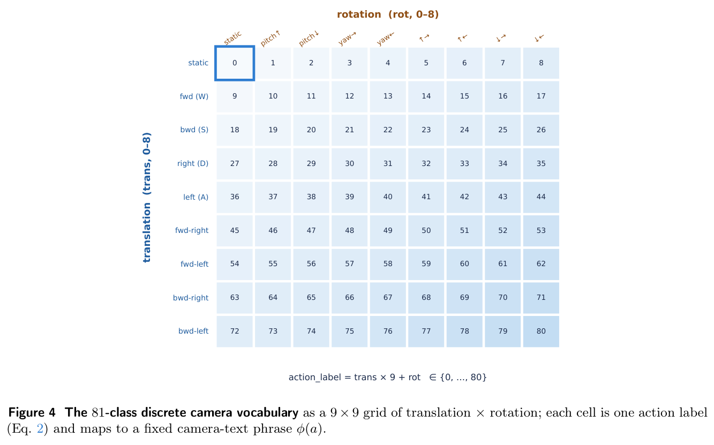

# BiWM: Advancing Open-Source Interactive Video World Models with Bidirectional Autoregression

**Authors:** Shaohao Rui, Xiaofeng Mao, Zhanyu Zhang, Peijia Lin, Yansong Zhu, Yibo Zhang, Haibin Wan, Weijie Ma (LynnReal AI; Shanghai Innovation Institute; Shanghai Jiao Tong University; Fudan University)  
**Source:** `/root/wwwroy/papernotes/papers/Rui 等 - 2026 - BiWM Advancing Open-Source Interactive Video World Models with Bidirectional Autoregression.pdf` (arXiv:2606.10135v1, 2026-06-08; Code: https://github.com/LynnReal-AI/BiWM)  
**Detected source format:** selectable-text PDF (`pdf-text`)  
**Reader type:** full-paper Chinese-English Markdown reader with figure/table assets.

## Page / Section Index

| Pages | Section | Reader anchor |
|---:|---|---|
| 1–2 | Title, abstract, overview figures | [Abstract](#abstract) |
| 2–4 | 1. Introduction | [Introduction](#1-introduction) |
| 4–5 | 2. Related Work | [Related Work](#2-related-work) |
| 5–13 | 3. Method (3.1–3.7) | [Method](#3-method) |
| 13 | 4. Implementation Details | [Implementation Details](#4-implementation-details) |
| 13–14 | 5. Results | [Results](#5-results) |
| 14–17 | 6. Conclusion（含 Figure 7–9） | [Conclusion](#6-conclusion) |
| 17–19 | References | [References](#references) |

## Terminology Ledger

| Canonical term | 中文约定 | First-use definition / note |
|---|---|---|
| interactive video world model | 交互式视频世界模型 | 在用户动作流（尤其是相机运动）驱动下逐帧续写虚拟世界的视频生成器 |
| bidirectional autoregression | 双向自回归 | chunk 内全双向注意力、chunk 间自回归；历史每步被重新编码并可修正 |
| causal autoregression | 因果自回归 | 因果 mask + KV cache；历史一旦写入缓存即冻结，误差永久累积 |
| chunk | chunk（块） | 一次联合去噪的 $K$ 个 latent 帧窗口，保留英文 |
| KV cache | KV 缓存 | 因果模型缓存历史键值以加速 rollout 的机制 |
| Distribution Matching Distillation (DMD) | 分布匹配蒸馏 | 少步蒸馏主目标；reverse-KL、mode-seeking |
| Self-Forcing | Self-Forcing | 训练时让生成器自 rollout 的蒸馏训练循环，本文改为 chunk 级双向版本 |
| mode-seeking / mass-covering | mode-seeking（模式收缩）/ mass-covering（质量覆盖） | reverse-KL 丢模式 vs forward-KL 罚丢模式，保留英文术语 |
| camera-text | camera-text（相机文本） | 把离散相机动作写成固定自然语言短语、经文本通路注入的控制信号 |
| 81-class discrete action vocabulary | 81 类离散动作词表 | 9 向平移 × 9 向旋转的组合标签 $a_i = g_t \times 9 + g_r$ |
| history compression | 历史压缩 | sliding window + sink / PackForcing 编码器 / FramePack 金字塔三种可插拔模式 |
| FramePack / PackForcing | FramePack / PackForcing | 多尺度时空金字塔布局 / 学习式定长历史编码器，均保留英文 |
| first-frame sink | 首帧 sink | 高分辨率保留的第一帧锚点 token，稳定全局布局 |
| flow matching | 流匹配 | $x_\sigma = (1-\sigma)x_0 + \sigma\epsilon$，velocity target $(\epsilon - x_0)$ |
| SFT anchor | SFT 锚（监督回归锚） | 低噪声水平上对真实视频的 velocity 回归 |
| forward-KL anchor | forward-KL 锚 | mass-covering 正则项，分 real / teacher 两种实例化 |
| NVFP4 / FP8-E4M3 | NVFP4 / FP8-E4M3 | 4 位 / 8 位浮点推理格式，保留英文 |
| QAT (quantization-aware training) | 量化感知训练 | Stage 2 尾部开启 fake-quant + 量化自蒸馏 |
| 6-DoF pose | 六自由度位姿 | 相机平移 + 旋转的连续几何表示 |
| minWM | minWM | 因果范式的开源全栈框架，本文的对照系与互补对象 |

### Figure 1. Overview of BiWM

**Caption:** Overview of BiWM. From a pretrained bidirectional video foundation model, BiWM runs just two short training stages—camera/action control fine-tuning and few-step DMD distillation, both keeping full bidirectional attention—to obtain a bidirectional autoregressive interactive world model. The recipe uses only two training stages, is highly efficient (a few hundred steps on 8×H200 GPUs), self-corrects through bidirectional rollout for stable long-horizon generation, and attains high fidelity with strong controllability.

**Caption[CN]:** BiWM 总览。从预训练双向视频基础模型出发，BiWM 只需两个简短训练阶段——相机/动作控制微调和少步 DMD 蒸馏，两个阶段都保留完整双向注意力——即可得到双向自回归交互式世界模型。该配方只有两个训练阶段、训练高效（8×H200 GPU 上数百步收敛）、通过双向 rollout 自我纠正实现稳定长时程生成，并兼具高保真与强可控性。

**Reading note:** 这张图是全文主线：左边冻结的双向基础模型，中间两个训练阶段（火焰表示可训练），右边输出双向自回归世界模型；底部绿色条即论文的四个卖点。

## Abstract

> <strong>Para. 1:</strong> Transitioning bidirectional video generation models into an autoregressive paradigm has significantly enhanced the interactivity and real-time responsiveness of video world models. However, existing causal autoregressive pipelines typically undergo a multi-stage process encompassing control fine-tuning, autoregressive training, causal initialization, and few-step distillation. This complex pipeline is not only computationally cumbersome to assemble but also leaves a noticeable quality gap compared to bidirectional counterparts due to compounding error accumulation. In contrast, recent world models like Yume-1.5 and Matrix-Game-3.0 adopt a bidirectional autoregressive approach, achieving superior visual fidelity and more stable long-horizon exploration thanks to the self-correcting nature of bidirectional error propagation.

> <strong>Para. 1[CN]:</strong> 把双向视频生成模型转入自回归范式，显著增强了视频世界模型的交互性与实时响应能力。然而，现有因果自回归流水线通常要经历控制微调、自回归训练、因果初始化和少步蒸馏的多阶段流程；这套复杂流水线不仅组装起来计算繁重，还因误差累积的复合效应而与双向模型存在明显质量差距。相比之下，Yume-1.5、Matrix-Game-3.0 等近期世界模型采用双向自回归方案，凭借双向误差传播的自我纠正特性，取得更高的视觉保真度和更稳定的长时程探索。

> <strong>Para. 2:</strong> To bridge the architectural gap in open-source tools, where frameworks like minWM support only causal models, the authors present BiWM, the first full-stack framework dedicated to building interactive video world models under the bidirectional autoregressive paradigm, jointly optimizing generation quality and inference speed. Capitalizing on a pretrained video foundation model, BiWM injects camera-control capabilities via fine-tuning in the first stage, followed immediately by a few-step Distribution Matching Distillation (DMD) stage that transforms the backbone into an action- or camera-controllable interactive world model. By compressing the pipeline into two training stages instead of the four required by minWM, BiWM is highly efficient: both stages jointly converge within a few hundred optimizer steps on 8×H200 GPUs, facilitating rapid prototyping under academic budgets. The framework provides versatile full-stack training across Wan2.1-T2V-1.3B, Wan2.2-TI2V-5B, HunyuanVideo-1.5-TI2V-8B, and LTX-2.3-22B, additionally supports secondary fine-tuning of existing bidirectional models to novel data distributions, and enables real-world camera control, a scenario in which minWM frequently loses controllability.

> <strong>Para. 2[CN]:</strong> 为弥合开源工具的架构缺口——minWM 等框架只支持因果模型——作者提出 BiWM：第一个专门面向双向自回归范式构建交互式视频世界模型、同时优化生成质量与推理速度的全栈框架。BiWM 依托预训练视频基础模型，第一阶段通过微调注入相机控制能力，随后紧接一个少步 Distribution Matching Distillation (DMD) 阶段，把骨干转变为可由动作或相机控制的交互式世界模型。BiWM 把流水线压缩为两个训练阶段（minWM 需要四个），训练非常高效：两个阶段在 8×H200 GPU 上各自数百个 optimizer step 内联合收敛，便于学术预算下的快速原型迭代。框架提供覆盖 Wan2.1-T2V-1.3B、Wan2.2-TI2V-5B、HunyuanVideo-1.5-TI2V-8B 和 LTX-2.3-22B 的全栈训练，还支持对既有双向模型做二次微调以适配新数据分布，并实现了真实世界相机控制——这正是 minWM 经常丧失可控性的场景。

> <strong>Para. 3:</strong> To keep bidirectional rollout affordable over long horizons, BiWM integrates pluggable history-compression mechanisms, including a FramePack-style memory layout (as in Yume-1.5) and a PackForcing-style scheme, which reduce the memory and compute of autoregressive inference while preserving long-range context. For deployment, an optional NVFP4 (4-bit floating-point) training and inference pipeline casts the distilled generator to 4-bit precision for additional inference acceleration. To mitigate the mode-seeking pathology inherent in DMD, the authors introduce a suite of anti-degradation techniques, including a GAN-based adversarial refinement objective and a forward-KL, mass-covering regularization term that maximally preserves complex scene dynamics. They hope BiWM will serve resource-constrained research and high-fidelity environment simulation, and argue that updatable history states represent an important direction for future world models.

> <strong>Para. 3[CN]:</strong> 为了让双向 rollout 在长时程下依然可负担，BiWM 集成了可插拔的历史压缩机制，包括 FramePack 风格的记忆布局（同 Yume-1.5）和 PackForcing 风格的方案，在保留长程上下文的同时降低自回归推理的显存与计算量。部署侧还开源了可选的 NVFP4（4 位浮点）训练与推理管线，把蒸馏后的生成器转为 4 位精度以进一步加速推理。针对 DMD 固有的 mode-seeking 病理，作者引入一组抗退化技术，包括基于 GAN 的对抗精修目标和一个 forward-KL、mass-covering 的正则项，最大限度保留复杂场景动态。作者希望 BiWM 能服务于资源受限研究和需要高保真环境模拟的场景，并主张"可更新的历史状态"是未来世界模型的重要方向。

## 1. Introduction

> <strong>Para. 1:</strong> Given a text or image prompt, contemporary video-diffusion models synthesize seconds to minutes of high-fidelity, temporally coherent footage. Re-purposing such a generator into an interactive video world model—one that continues a virtual world frame by frame under a stream of user actions (above all camera movements) and lets a person steer through it—has become a central goal of generative world modeling. Turning such an offline bidirectional generator into an autoregressive one that emits frames on demand is what makes these systems interactive and real-time, and is therefore the central technical challenge in building them.

> <strong>Para. 1[CN]:</strong> 给定文本或图像提示，当代视频扩散模型已能合成数秒到数分钟的高保真、时间连贯影像。把这样的生成器改造成交互式视频世界模型——在用户动作流（尤其是相机运动）驱动下逐帧续写虚拟世界、让人在其中自由穿行——已成为生成式世界建模的核心目标。而把这种离线双向生成器变成能按需吐出帧的自回归模型，正是让系统具备交互性与实时性的关键，因此也是构建它们的核心技术挑战。

> <strong>Para. 2:</strong> Existing autoregressive world models fall into two families, distinguished by how frames within a window attend to one another. Causal models impose a causal mask so that each frame sees only its past; their appeal is efficiency, since the past can be stored as a key-value (KV) cache and reused to accelerate the rollout. (In practice many "causal" world models adopt a local window—bidirectional within a short window, causal across windows—but a window's representation is still frozen once it leaves the cache, so the argument is unaffected.) This caching conceals a structural weakness: once a frame is frozen into the KV cache its representation can never be revised, so any error in the generated history is permanent and compounds as the rollout lengthens, eventually corrupting both the imagery and the model's response to control. The drift is more damaging for video diffusion than for language: an autoregressive language model predicts over a discrete vocabulary and re-quantizes onto valid tokens at every step, which endows it with an innate ability to absorb and correct small mistakes; a diffusion-based video model instead fits a continuous distribution over pixels, where sub-token deviations are never snapped back and accumulate unchecked until the scene collapses. The two failures compound: errors in the imagery and drift in the camera response reinforce one another, so a causal rollout under camera control degrades faster than either alone (Fig. 3).

> <strong>Para. 2[CN]:</strong> 现有自回归世界模型分为两族，区别在于窗口内各帧如何相互注意。因果模型施加因果 mask，使每帧只能看到自己的过去；其吸引力在于效率——过去可以存成键值（KV）缓存并复用以加速 rollout。（实践中许多"因果"世界模型采用局部窗口：短窗口内双向、窗口之间因果；但窗口一旦离开缓存其表征依然被冻结，所以不影响论证。）这种缓存掩盖了一个结构性弱点：帧一旦冻入 KV 缓存，其表征就永远无法修订，生成历史中的任何误差都是永久性的，并随 rollout 变长而复合累积，最终同时腐蚀画面和模型对控制的响应。这种漂移对视频扩散的伤害远大于语言：自回归语言模型在离散词表上预测，每一步都重新量化到合法 token 上，天然具备吸收和纠正小错误的能力；而基于扩散的视频模型拟合的是像素上的连续分布，亚 token 级的偏差永远不会被"扣回"，会不受约束地累积直至场景崩溃。两种失败还会互相强化：画面误差和相机响应漂移彼此放大，所以带相机控制的因果 rollout 比单独任一种失败退化得更快（图 3）。

### Figure 3. Why fully causal camera control collapses

**Caption:** Why fully causal camera control collapses. A causal autoregressive baseline (Self-Forcing-style, continuous-pose control) rolling out an image-to-video clip under a walking camera trajectory (joystick overlay, bottom-left shows the commanded action). Left to right, errors frozen into the KV cache and drift in the camera response compound, and the scene degrades from a clean street into a washed-out, structureless frame. BiWM's chunk-wise bidirectional rollout (self-correcting history) and discrete text-camera control are designed to avoid both failure modes.

**Caption[CN]:** 全因果相机控制为何崩溃。一个因果自回归基线（Self-Forcing 风格、连续位姿控制）在步行相机轨迹下 rollout 一段图生视频（左下角摇杆叠层显示指令动作）。从左到右，冻入 KV 缓存的误差与相机响应漂移相互复合，场景从干净街道退化为褪色、无结构的画面。BiWM 的 chunk 级双向 rollout（自我纠正的历史）和离散 text-camera 控制正是为规避这两种失败模式而设计。

**Reading note:** 这是全文动机的核心证据图，但注意它是单一 baseline、单条轨迹的定性演示，并非统计性对比。

> <strong>Para. 3:</strong> Bidirectional models, namely the Yume series and Matrix-Game-3.0, instead let every frame in a window attend to every other, exactly as the pretrained backbone does, and this is precisely what counteracts the drift: because earlier history latents remain visible to, and are refreshed alongside, the frames currently being denoised, the model continually self-corrects its own past, trading a modest amount of caching efficiency for substantially better fidelity and controllability over long horizons. What makes this trade-off practical is few-step distillation: once a window denoises in only a handful of steps, retaining full bidirectional attention within it incurs little additional cost, and error resilience, rather than latency, becomes the deciding factor.

> <strong>Para. 3[CN]:</strong> 双向模型——即 Yume 系列和 Matrix-Game-3.0——则让窗口内每一帧注意其他所有帧，与预训练骨干完全一致，而这恰恰是对抗漂移的关键：较早的历史 latent 始终对当前正在去噪的帧可见，并与之一同被刷新，因此模型持续地自我修正自己的过去，用少量缓存效率换取长时程下明显更好的保真度与可控性。让这笔交易变得划算的是少步蒸馏：一旦窗口只需几步就能去噪完成，窗口内保留完整双向注意力的额外开销就很小，此时决定性因素不再是延迟，而是误差韧性。

> <strong>Para. 4:</strong> These bidirectional systems confirm the benefit empirically, reporting sharper frames and more stable long-horizon exploration than their causal counterparts. What the community still lacks, however, is an open, end-to-end recipe for the paradigm. minWM has open-sourced a full-stack framework for causal interactive world models, yet no full-stack, open-source counterpart exists for the bidirectional autoregressive paradigm, which leaves its strong empirical results difficult to reproduce or extend.

> <strong>Para. 4[CN]:</strong> 这些双向系统在经验上证实了该范式的收益：相比因果对应物，它们报告了更清晰的帧和更稳定的长时程探索。但社区仍然缺少这一范式的开放端到端配方。minWM 已开源了因果交互式世界模型的全栈框架，而双向自回归范式尚无对应的全栈开源实现，其强劲的经验结果因而难以复现或扩展。

> <strong>Para. 5:</strong> The authors close this gap with BiWM, to their knowledge the first full-stack, open-source framework for building interactive video world models under the bidirectional autoregressive paradigm, designed to balance generation quality against generation speed. BiWM keeps the backbone's native full attention within each short window of latent frames and pays the autoregressive cost only across windows, conditioning each window on the history of those before it. Starting from a pretrained video foundation model, the recipe needs only two stages: a first stage that injects camera control by fine-tuning, and a second stage that directly performs few-step self-rollout DMD distillation, building on Self-Forcing but in the chunk-wise bidirectional rather than causal setting, after which the backbone becomes a camera- and action-controllable interactive world model. To counter the mode-seeking tendency of distribution-matching distillation, which otherwise collapses scene dynamics, the DMD objective is augmented with anti-degradation terms, including an adversarial (GAN) term and a mass-covering forward-KL anchor that preserves motion diversity.

> <strong>Para. 5[CN]:</strong> 作者用 BiWM 填补这一空白——据其所知，这是第一个在双向自回归范式下构建交互式视频世界模型的全栈开源框架，其设计目标是在生成质量与生成速度之间取得平衡。BiWM 在每个短的 latent 帧窗口内保留骨干原生的全注意力，只在窗口之间支付自回归代价：每个窗口以其之前窗口的历史为条件。从预训练视频基础模型出发，配方只需两个阶段：第一阶段通过微调注入相机控制；第二阶段直接做少步自 rollout 的 DMD 蒸馏——基于 Self-Forcing，但把它从因果设定移到 chunk 级双向设定——之后骨干就成为可由相机和动作控制的交互式世界模型。为对抗分布匹配蒸馏的 mode-seeking 倾向（否则会压塌场景动态），DMD 目标被抗退化项增强，包括一个对抗（GAN）项和一个保持运动多样性的 mass-covering forward-KL 锚。

> <strong>Para. 6:</strong> Importantly, BiWM is built for the resource budgets of academic research. It uses only two training stages, compared with four in minWM, and is inexpensive to train: camera control and DMD distillation jointly converge within a few hundred optimizer steps on 8×H200 GPUs, so a complete world model can be validated and iterated within hours rather than weeks. Because none of the recipe is tied to a particular backbone, full-stack training is provided across Wan2.1-T2V-1.3B, Wan2.2-TI2V-5B, HunyuanVideo-1.5-TI2V-8B, and LTX-2.3-22B. The same framework also supports secondary fine-tuning of existing bidirectional autoregressive models such as Yume-1.5 and Matrix-Game-3.0, adapting them to new data distributions at low cost, and it enables real-world camera control, a regime that proves nearly uncontrollable under minWM. To keep bidirectional rollout affordable over long horizons, BiWM further integrates pluggable history-compression mechanisms—a FramePack-style memory layout (as in Yume-1.5) and a PackForcing-style scheme—which reduce the memory and compute of autoregressive inference while preserving long-range context. For deployment, an optional NVFP4 training and inference pipeline casts the distilled generator to 4-bit precision. Fig. 1 summarizes the two-stage recipe. BiWM is positioned not as a competitor to causal frameworks but as their bidirectional complement in the same open-source design space, trading a small amount of per-window latency for fidelity, controllability, and substantially shorter training.

> <strong>Para. 6[CN]:</strong> 重要的是，BiWM 是按学术研究的资源预算设计的。它只用两个训练阶段（minWM 用四个），训练开销低：相机控制和 DMD 蒸馏在 8×H200 GPU 上各自数百个 optimizer step 内联合收敛，因此一个完整世界模型可以在数小时内完成验证和迭代，而不是数周。由于配方不绑定特定骨干，框架提供覆盖 Wan2.1-T2V-1.3B、Wan2.2-TI2V-5B、HunyuanVideo-1.5-TI2V-8B、LTX-2.3-22B 的全栈训练；同一框架还支持对 Yume-1.5、Matrix-Game-3.0 等既有双向自回归模型做二次微调，以低成本适配新数据分布，并实现了真实世界相机控制——这一场景在 minWM 下几乎不可控。为让双向 rollout 在长时程下可负担，BiWM 进一步集成可插拔的历史压缩机制——FramePack 风格的记忆布局（同 Yume-1.5）和 PackForcing 风格的方案——在保留长程上下文的同时降低自回归推理的显存与计算。部署侧另有可选的 NVFP4 训练与推理管线，把蒸馏生成器转为 4 位精度。图 1 总结了两阶段配方。BiWM 的定位不是因果框架的竞争者，而是同一开源设计空间中的双向补集：用一点点窗口内延迟换取保真度、可控性和大幅缩短的训练。

> <strong>Para. 7:</strong> Contributions. (1) BiWM, the first full-stack, open-source framework for interactive video world models under the bidirectional autoregressive paradigm—full bidirectional attention within a chunk, autoregression across chunks—positioned as the bidirectional complement to causal frameworks such as minWM. (2) A compact two-stage recipe (camera-control fine-tuning followed by few-step DMD distillation, versus four stages in minWM) deliberately suited to academic budgets, with anti-degradation objectives—an adversarial (GAN) term and a mass-covering forward-KL anchor—that prevent the mode-seeking collapse of distribution-matching distillation. (3) Generality and reproducibility: full-stack training across the four backbones, secondary fine-tuning of bidirectional autoregressive models (Yume-1.5, Matrix-Game-3.0) to new data distributions, real-world camera control that proves nearly uncontrollable under minWM, and released code, scripts, checkpoints, and reproducible component studies.

> <strong>Para. 7[CN]:</strong> 贡献总结。(1) 提出 BiWM：第一个双向自回归范式下的交互式视频世界模型全栈开源框架——chunk 内完整双向注意力、chunk 间自回归——定位为 minWM 等因果框架的双向补集。(2) 设计了紧凑的两阶段配方（相机控制微调 + 少步 DMD 蒸馏，对比 minWM 的四阶段），刻意面向学术预算；并加入抗退化目标——对抗（GAN）项和 mass-covering forward-KL 锚——防止分布匹配蒸馏的 mode-seeking 崩塌。(3) 展示通用性与可复现性：四个骨干上的全栈训练、对双向自回归模型（Yume-1.5、Matrix-Game-3.0）的二次微调、minWM 下几乎不可控的真实世界相机控制，并发布代码、脚本、checkpoint 与可复现的组件研究。

## 2. Related Work

> <strong>Para. 1:</strong> Video (and audio-video) diffusion backbones. Large-scale diffusion transformers have become the generative prior behind most recent video world models, producing high-fidelity, temporally coherent clips across three broad architectural families: cross-attention conditioned designs, MMDiT designs that jointly attend over text and video tokens, and, increasingly, models that generate synchronized audio and video. A property they all share is full bidirectional spatiotemporal attention over the entire clip—the very source of their fidelity. BiWM takes such a model as its teacher and retains this bidirectional attention within each generated chunk, rather than re-training it to be strictly causal. Since the recipe alters only the conditioning and the rollout, leaving the backbone's attention untouched, the same framework transfers cleanly across all three families.

> <strong>Para. 1[CN]:</strong> 视频（及音视频）扩散骨干。大规模 diffusion transformer 已成为多数近期视频世界模型背后的生成先验，能在三大架构族中产出高保真、时间连贯的片段：cross-attention 条件注入设计、对文本和视频 token 联合注意的 MMDiT 设计，以及日益增多的音视频同步生成模型。它们共享一个性质：对整段视频的完整双向时空注意力——这正是其保真度的来源。BiWM 把这样的模型当作 teacher，并在每个生成 chunk 内保留这份双向注意力，而不是把它重新训练成严格因果。由于配方只改动条件注入与 rollout、不触碰骨干的注意力，同一框架可以干净地迁移到全部三个架构族。

> <strong>Para. 2:</strong> Causal interactive world models. Most real-time world models convert an offline generator into a controllable, causal, low-latency roll-out engine, typically following the block-causal AR template of CausVid and Self-Forcing and distilling it to a few steps. minWM packages this conversion via Causal Forcing with continuous PRoPE camera control. BiWM differs at the level of paradigm—keeping windows bidirectional—and in its controls (discrete text-camera actions), its objective (multi-objective short distillation), and its breadth of backbones.

> <strong>Para. 2[CN]:</strong> 因果交互式世界模型。多数实时世界模型把离线生成器改造成可控、因果、低延迟的 rollout 引擎，通常沿用 CausVid 和 Self-Forcing 的 block-causal 自回归模板并蒸馏到少步。minWM 用 Causal Forcing 加连续 PRoPE 相机控制打包了这套转换。BiWM 的差异首先在范式层面——保持窗口双向——其次在控制方式（离散 text-camera 动作）、目标函数（多目标短程蒸馏）和骨干覆盖广度上。

> <strong>Para. 3:</strong> Bidirectional interactive world models. A complementary line keeps each window bidirectional. The Yume series (Yume-1.0 and Yume-1.5) and Matrix-Game-3.0 let every frame in a window attend to every other and report sharper, more stable long-horizon rollouts than causal models, confirming the paradigm's benefit empirically. These systems remain hard to reproduce, however: at the time of writing none has released its training dataset or a complete training pipeline, and Matrix-Game-3.0 in particular still depends on a many-stage training recipe. BiWM targets exactly this gap, offering a fully open, two-stage recipe for the bidirectional paradigm together with its data and training code.

> <strong>Para. 3[CN]:</strong> 双向交互式世界模型。另一条互补路线保持每个窗口双向。Yume 系列（Yume-1.0 与 Yume-1.5）和 Matrix-Game-3.0 让窗口内每帧注意其他所有帧，并报告了比因果模型更清晰、更稳定的长时程 rollout，在经验上证实了该范式的收益。但这些系统仍然难以复现：截至论文写作时，没有一个发布了训练数据集或完整训练流水线，Matrix-Game-3.0 尤其还依赖多阶段训练配方。BiWM 瞄准的正是这个缺口：为双向范式提供完全开放的两阶段配方，连同数据和训练代码一起发布。

> <strong>Para. 4:</strong> Camera-signal injection. Existing ways to inject camera control into a video diffusion backbone fall into two families. Absolute injection adds the camera signal onto the per-frame hidden state, either as a global, low-frequency control applied to the latent before the DiT, or layer-by-layer into every block's hidden state. Because the pose is encoded as an absolute per-frame signal, this couples the temporal dynamics of the camera trajectory with those of the video itself, which tends to amplify error accumulation over long rollouts. Relative injection instead alters the inter-frame attention so that the interaction between two frames accounts for their relative pose; representative methods include CaPE, GTA, and PRoPE (also adopted in HunyuanWorld 1.5), as well as UCPE (adopted in SANA-WM). These are more robust, but they still inject the camera signal as a residual branch alongside the original attention; even with zero initialization, the residual perturbs the pretrained attention and induces a transient drop in visual quality early in training. Both families typically require a relatively heavy camera encoder or per-layer learnable injection modules, converge slowly, and lean on large batch sizes for training stability.

> <strong>Para. 4[CN]:</strong> 相机信号注入。向视频扩散骨干注入相机控制的既有做法分两族。绝对注入把相机信号加到逐帧隐状态上：要么作为全局低频控制在进 DiT 之前施加到 latent，要么逐层加进每个 block 的隐状态。由于位姿被编码为逐帧的绝对信号，这会把相机轨迹的时间动态与视频自身的时间动态耦合起来，在长 rollout 中倾向于放大误差累积。相对注入则修改帧间注意力，使两帧的交互考虑其相对位姿；代表方法包括 CaPE、GTA、PRoPE（HunyuanWorld 1.5 亦采用），以及 UCPE（SANA-WM 采用）。这类方法更稳健，但仍把相机信号作为原注意力旁边的残差分支注入；即便零初始化，残差也会扰动预训练注意力，导致训练早期出现短暂的视觉质量下滑。两族方法通常都需要较重的相机 encoder 或逐层可学习注入模块，收敛慢，且依赖大 batch size 保证训练稳定。

> <strong>Para. 5:</strong> In contrast, BiWM casts camera control as a conditioning task and injects the signal through the text space directly into the video tokens (Sec. 3.3): it adds no new learnable parameters, converges within roughly a hundred steps, and leaves the base generator's visual quality intact.

> <strong>Para. 5[CN]:</strong> 与之相对，BiWM 把相机控制当作纯条件注入任务，经文本空间把信号直接注入视频 token（第 3.3 节）：不新增任何可学习参数，约一百步内收敛，且完全不损伤基础生成器的视觉质量。

> <strong>Para. 6:</strong> Few-step distillation, adversarial objectives, and long-horizon memory. Distribution matching distillation (DMD) and consistency distillation compress many-step samplers to a handful of steps; applied to AR video, DMD with self-rollout is the standard route to real-time generation. As its reverse-KL objective is mode-seeking, the authors pair it with an adversarial term in the spirit of projected GANs, a supervised regression (SFT) term, and mass-covering forward-KL anchors, which together stabilize and accelerate convergence. For long-horizon rollout, the ever-growing history must be compressed, and existing schemes fall into three families: sink-based sliding windows that keep only the most recent frames plus a first-frame "sink"; learned history encoders such as PackForcing that fold the entire past into a fixed-size memory; and multi-scale layouts such as FramePack (adopted by Yume-1.5 and related long-context generators) that keep recent frames sharp and distant ones coarse. Rather than commit to one, BiWM implements all three—a sink-based sliding window, a PackForcing-style history encoder, and a FramePack-style pyramid—behind a single interface, so they can be swapped and ablated directly.

> <strong>Para. 6[CN]:</strong> 少步蒸馏、对抗目标与长时程记忆。Distribution matching distillation (DMD) 与 consistency distillation 把多步采样器压缩到几步；用于自回归视频时，带自 rollout 的 DMD 是通往实时生成的标准路线。由于其 reverse-KL 目标是 mode-seeking 的，作者为它配上 projected GAN 风格的对抗项、监督回归（SFT）项以及 mass-covering 的 forward-KL 锚，共同稳定并加速收敛。至于长时程 rollout，不断增长的历史必须被压缩，既有方案分三族：只保留最近帧加首帧"sink"的基于 sink 的滑动窗口；把整个过去折叠进定长记忆的学习式历史编码器（如 PackForcing）；以及让近处帧保持清晰、远处帧逐级变粗的多尺度布局（如 FramePack，被 Yume-1.5 及相关长上下文生成器采用）。BiWM 不押注其中任何一种，而是在同一接口后实现全部三种——sink 滑动窗口、PackForcing 风格历史编码器、FramePack 风格金字塔——使它们可以直接互换和消融。

## 3. Method

> <strong>Para. 1:</strong> BiWM converts a pretrained multi-step bidirectional video-diffusion model into a few-step, camera-controllable, chunk-wise autoregressive world model. The entire training pipeline comprises exactly two stages (Fig. 1): Stage 1, camera-text pretraining, and Stage 2, multi-objective few-step distillation. There is no separate data-curation, quantization, or post-alignment stage; low-bit inference (Sec. 3.7) is an optional deployment step rather than part of training. The central design choice is to factorize generation into chunks that are denoised with full bidirectional attention internally yet produced autoregressively, each conditioned on the history of preceding chunks and on a stream of discrete camera-action tokens. The section establishes notation (3.1) and the data preprocessing that recovers continuous 6-DoF poses (3.2), then describes camera-text control (3.3), the bidirectional autoregressive rollout with history compression (3.4), the multi-objective distillation (3.5), how a single recipe spans cross-attention, MMDiT, and audio-video backbones (3.6), and the training budget plus optional low-bit inference (3.7).

> <strong>Para. 1[CN]:</strong> BiWM 把一个预训练的多步双向视频扩散模型转换为少步、可相机控制、chunk 级自回归的世界模型。整个训练流水线恰好只有两个阶段（图 1）：Stage 1 相机文本预训练，Stage 2 多目标少步蒸馏。没有单独的数据整理、量化或后对齐阶段；低比特推理（3.7 节）是可选的部署步骤而非训练环节。核心设计选择是把生成分解为若干 chunk：chunk 内部以完整双向注意力去噪，chunk 之间自回归地产生，每个 chunk 以之前 chunk 的历史和离散相机动作 token 流为条件。本节先建立记号（3.1）与恢复连续六自由度位姿的数据预处理（3.2），再依次介绍 camera-text 控制（3.3）、带历史压缩的双向自回归 rollout（3.4）、多目标蒸馏（3.5）、单一配方如何横跨 cross-attention、MMDiT 与音视频骨干（3.6），以及训练预算与可选低比特推理（3.7）。

### 3.1 Problem Formulation

> <strong>Para. 1:</strong> Let $\mathbf{x} = (x_1, \dots, x_T)$ be the latent frames of a video produced by the VAE encoder of a foundation backbone, and let $c$ be a (static-only) scene caption. The $T$ latent frames are partitioned into $B$ contiguous chunks of $K$ frames each, $\mathbf{x} = (\mathbf{c}_1, \dots, \mathbf{c}_B)$ with $\mathbf{c}_b = x_{(b-1)K+1:bK}$. Autoregression simply means generating these chunks one after another; both the causal and the bidirectional paradigm share the same chunk-wise factorization

$$
p(\mathbf{x} \mid c, \mathbf{a}) \;=\; \prod_{b=1}^{B} p\big(\mathbf{c}_b \,\big|\, \mathbf{c}_{<b},\, c,\, \mathbf{a}_b\big),
\tag{1}
$$

> <strong>Para. 1 (cont.):</strong> where $\mathbf{a} = (a_1, \dots, a_B)$ is a stream of discrete camera actions and $\mathbf{a}_b$ is the per-frame action sequence governing chunk $b$. What separates the two paradigms is not the chunk size but how each factor treats the history $\mathbf{c}_{<b}$ inside the attention.

> <strong>Para. 1[CN]:</strong> 设 $\mathbf{x} = (x_1, \dots, x_T)$ 为基础骨干 VAE encoder 产出的视频 latent 帧，$c$ 为（只描述静态内容的）场景 caption。把 $T$ 个 latent 帧划分为 $B$ 个各含 $K$ 帧的连续 chunk：$\mathbf{x} = (\mathbf{c}_1, \dots, \mathbf{c}_B)$，其中 $\mathbf{c}_b = x_{(b-1)K+1:bK}$。自回归的含义就是逐个生成这些 chunk；因果与双向两种范式共享同一个 chunk 级分解式（式 1），其中 $\mathbf{a} = (a_1, \dots, a_B)$ 是离散相机动作流，$\mathbf{a}_b$ 是支配第 $b$ 个 chunk 的逐帧动作序列。区分两种范式的不是 chunk 大小，而是每个因子在注意力内部如何对待历史 $\mathbf{c}_{<b}$。

> <strong>Para. 2:</strong> Causal vs. bidirectional autoregression. A causal autoregressive model imposes a causal attention mask: while denoising chunk $\mathbf{c}_b$, the history is read from a frozen key-value cache, and the current chunk may attend to the past but the past may never attend to the present. Consequently the representation (the "state") of each history frame is fixed the moment it is produced and can never be revised. BiWM is instead bidirectional autoregressive: at each step it attends jointly and bidirectionally over the current chunk and its history, so the state of the history is itself conditioned on—and refreshed by—the chunk being generated. Because every already-generated frame remains free to update under the influence of the frames that follow it, the model continually re-interprets and self-corrects its own past, which is exactly what suppresses the error accumulation and camera drift of strict causality (Fig. 3).

> <strong>Para. 2[CN]:</strong> 因果 vs. 双向自回归。因果自回归模型施加因果注意力 mask：去噪 chunk $\mathbf{c}_b$ 时，历史从冻结的键值缓存中读取，当前 chunk 可以注意过去，但过去永远不能注意现在。于是每个历史帧的表征（"状态"）在产生的那一刻就被固定，永远无法修订。BiWM 则是双向自回归：每一步对当前 chunk 及其历史做联合、双向的注意，历史的状态本身也以正在生成的 chunk 为条件、并被其刷新。由于每个已生成帧都可以在后续帧的影响下继续更新，模型会持续地重新解释并自我修正自己的过去——这正是抑制严格因果性所带来的误差累积与相机漂移的机制（图 3）。

> <strong>Para. 3:</strong> In short, what makes a model causal or bidirectional is simply whether its already-generated frames are still allowed to change—not how many frames it produces at a time. BiWM generates a short chunk of frames at each step and lets that chunk, together with the visible history, attend back and forth freely; the history is therefore re-encoded at every step and keeps being refined as generation moves forward. This is modestly more costly than caching the frozen history, but it is what lets the model stay sharp and on-trajectory while the rollout continues for arbitrarily long.

> <strong>Para. 3[CN]:</strong> 简言之，模型是因果还是双向，只取决于已生成的帧是否还允许改变——而不是一次产出多少帧。BiWM 每步生成一小段 chunk，并让该 chunk 与可见历史自由地前后互相注意；历史因此在每一步都被重新编码，随生成推进不断被精修。这比缓存冻结历史的开销略高，但正是它让模型在 rollout 任意延长时依然保持清晰、不偏离轨迹。

### 3.2 Data Preprocessing: Camera Trajectories to Discrete Actions

> <strong>Para. 1:</strong> BiWM is grounded in continuous camera geometry: the discrete control of Sec. 3.3 is a quantization of true 6-DoF poses, not a hand-assigned categorical label. Two complementary sources are used, each providing per-frame continuous camera trajectories that are later quantized into the action vocabulary.

> <strong>Para. 1[CN]:</strong> BiWM 立足于连续相机几何：第 3.3 节的离散控制是对真实六自由度位姿的量化，而不是人为指定的类别标签。数据来自两个互补来源，各自提供逐帧连续相机轨迹，随后被量化到动作词表。

> <strong>Para. 2:</strong> Prescribed trajectories (OpenVid + WorldPlay). The authors directly reuse the open-source prescribed-trajectory data released by minWM, which samples still images from OpenVid and uses WorldPlay to generate videos that follow specified camera trajectories. Because the trajectory is prescribed rather than estimated, these clips carry exact ground-truth 6-DoF poses by construction, providing clean and diverse camera supervision at scale.

> <strong>Para. 2[CN]:</strong> 规定轨迹（OpenVid + WorldPlay）。作者直接复用 minWM 发布的开源规定轨迹数据：从 OpenVid 采样静态图像，用 WorldPlay 生成沿指定相机轨迹运动的视频。由于轨迹是规定的而非估计的，这些片段天然携带精确的 ground-truth 六自由度位姿，提供大规模、干净且多样的相机监督。

> <strong>Para. 3:</strong> Real footage (Sekai). For real-world coverage the Sekai walking dataset serves as the real-footage split: in-the-wild egocentric footage whose camera trajectory is not given and must be recovered. Following the camera-annotation pipeline of SANA-WM, a SLAM-style video pose engine is run, grounded with learned monocular geometry—a temporally consistent multi-view estimator for structure together with a metric monocular model for absolute scale—and per-frame intrinsics are refined through bundle adjustment. This recovers metric-scale per-frame camera-to-world extrinsics $T^{cw} \in SE(3)$ and intrinsics $K_i$ for every real clip.

> <strong>Para. 3[CN]:</strong> 真实素材（Sekai）。真实世界覆盖使用 Sekai 步行数据集作为 real-footage split：野外第一视角素材，其相机轨迹没有给定，必须重建。作者沿用 SANA-WM 的相机标注流水线：运行 SLAM 风格的视频位姿引擎，并以学习式单目几何作支撑——用时间一致的多视角估计器恢复结构、用 metric 单目模型提供绝对尺度——再通过 bundle adjustment 精修逐帧内参。这为每段真实片段恢复了 metric 尺度的逐帧 camera-to-world 外参 $T^{cw} \in SE(3)$ 与内参 $K_i$。

> <strong>Para. 4:</strong> Filtering and captioning. Clips pass generic visual filters (aesthetic quality, motion magnitude, optical-flow consistency, scene-cut removal) and camera-specific filters on field of view, focal-length consistency, trajectory smoothness, and scale stability, which discard clips whose camera geometry is unreliable. Captions are written under a strict static-only instruction that describes objects, layout, and appearance but never camera motion, so that textual supervision cannot leak the trajectory and all motion is learned through the action stream.

> <strong>Para. 4[CN]:</strong> 过滤与打 caption。片段先过通用视觉过滤器（美学质量、运动幅度、光流一致性、镜头切换剔除），再过相机专属过滤器（视场角、焦距一致性、轨迹平滑度、尺度稳定性），淘汰相机几何不可靠的片段。caption 在严格的"只写静态"指令下撰写：只描述物体、布局与外观，绝不描述相机运动——这样文本监督无法泄露轨迹，所有运动都必须从动作流中学习。

> <strong>Para. 5:</strong> From continuous poses to discrete actions. Finally, the recovered continuous trajectory is converted into the per-frame relative pose $(\Delta t_i, \Delta R_i)$ used by the quantizer of Sec. 3.3 (Eq. 2). The relationship is stressed: BiWM remains faithful to continuous 6-DoF geometry throughout annotation, and discreteness enters only at the final quantization step, which maps the continuous motion onto the compact 81-class vocabulary so that it can be expressed as injectable text. The discrete vocabulary is thus a low-bandwidth, text-friendly encoding of real camera geometry, not a replacement for it.

> <strong>Para. 5[CN]:</strong> 从连续位姿到离散动作。最后，重建的连续轨迹被转换为逐帧相对位姿 $(\Delta t_i, \Delta R_i)$，供第 3.3 节的量化器（式 2）使用。作者强调二者关系：BiWM 在整个标注过程中忠实保持连续六自由度几何，离散性只在最终量化一步引入——把连续运动映射到紧凑的 81 类词表，以便表达成可注入的文本。因此离散词表是真实相机几何的一种低带宽、文本友好的编码，而不是对它的替代。

### 3.3 Text-based Camera Control

> <strong>Para. 1:</strong> The defining choice of BiWM is to treat camera control as a pure conditioning task carried entirely in the text space, adding no camera encoder and no new learnable parameters. Quantizing continuous 6-DoF camera motion into a discrete action vocabulary was introduced by HunyuanWorld-1.5, which injects the resulting discrete action into the diffusion time embedding. BiWM instead injects it into the text space: because the action is expressed as ordinary text and consumed through the backbone's existing text-conditioning path, it leaves the pretrained input distribution intact and makes fine-tuning substantially more stable and data-efficient. The mechanism has four parts: quantization of camera motion into a discrete action vocabulary, one-time pre-encoding of that vocabulary, per-frame assembly of a camera-text + caption condition, and per-frame injection through the backbone's existing cross-attention. Let $\tau(\cdot)$ denote the (frozen) text encoder with output dimension $d_t$, and let $W : \mathbb{R}^{d_t} \to \mathbb{R}^{d}$ be the backbone's existing text-projection (the same one applied to captions).

> <strong>Para. 1[CN]:</strong> BiWM 的决定性选择是把相机控制当作完全承载于文本空间的纯条件注入任务：不加相机 encoder，不加任何新的可学习参数。把连续六自由度相机运动量化为离散动作词表的做法由 HunyuanWorld-1.5 提出，但它把离散动作注入扩散时间嵌入；BiWM 改为注入文本空间——动作被表达为普通文本，经骨干既有的文本条件通路消费，因此完全不破坏预训练输入分布，使微调明显更稳定、更省数据。机制分四部分：把相机运动量化为离散动作词表；对词表做一次性预编码；逐帧组装 camera-text + caption 条件；经骨干既有 cross-attention 逐帧注入。记 $\tau(\cdot)$ 为（冻结的）text encoder，输出维度 $d_t$；$W : \mathbb{R}^{d_t} \to \mathbb{R}^{d}$ 为骨干既有的文本投影（与作用于 caption 的是同一个）。

> <strong>Para. 2:</strong> (i) Quantization of camera motion. Continuous camera motion is mapped to one discrete action per latent frame. From the continuous trajectory recovered in Sec. 3.2, a frame's relative camera pose—a translation $\Delta t_i$ and rotation $\Delta R_i$ w.r.t. the previous keyframe—is fed to a direction-angle classifier, which assigns a translation class $g_t(\Delta t_i) \in \{0, \dots, 8\}$ and a rotation class $g_r(\Delta R_i) \in \{0, \dots, 8\}$ (class 0 = static when the magnitude is below an adaptive threshold; otherwise the nearest of eight canonical directions), combined into a single label

$$
a_i \;=\; g_t(\Delta t_i) \times 9 \;+\; g_r(\Delta R_i) \;\in\; \{0, \dots, 80\},
\tag{2}
$$

> <strong>Para. 2 (cont.):</strong> i.e. a 9-way translation (static / forward / backward / left / right / four diagonals) crossed with a 9-way rotation (static / pitch± / yaw± / four diagonals); see Fig. 4. The direction-magnitude decoupling makes the quantization robust to pose noise. Equivalently, keyboard/mouse logs or a textual pose string are parsed directly to the same labels, yielding a per-clip action stream $\mathbf{a} = (a_1, \dots, a_{T_a})$.

> <strong>Para. 2[CN]:</strong> (i) 相机运动量化。连续相机运动被映射为每个 latent 帧一个离散动作。基于 3.2 节重建的连续轨迹，一帧相对上一关键帧的相机位姿——平移 $\Delta t_i$ 与旋转 $\Delta R_i$——送入方向-角度分类器，得到平移类 $g_t(\Delta t_i) \in \{0, \dots, 8\}$ 和旋转类 $g_r(\Delta R_i) \in \{0, \dots, 8\}$（幅度低于自适应阈值时取类 0 = 静止，否则取八个规范方向中最近的一个），按式 2 合并为单一标签：即 9 向平移（静止/前/后/左/右/四个对角）与 9 向旋转（静止/pitch±/yaw±/四个对角）的笛卡尔积；见图 4。方向与幅度解耦使量化对位姿噪声稳健。等价地，键鼠日志或文本位姿串也可直接解析为相同标签，得到每段视频的动作流 $\mathbf{a} = (a_1, \dots, a_{T_a})$。

### Figure 4. The 81-class discrete camera vocabulary

**Caption:** The 81-class discrete camera vocabulary as a 9×9 grid of translation × rotation; each cell is one action label (Eq. 2) and maps to a fixed camera-text phrase $\phi(a)$.

**Caption[CN]:** 81 类离散相机词表：平移 × 旋转的 9×9 网格；每个格子是一个动作标签（式 2），并映射到一条固定的 camera-text 短语 $\phi(a)$。

> <strong>Para. 3:</strong> (ii) One-time pre-encoding (separate encoding). Each of the 81 classes is tied to a fixed natural-language camera-motion phrase $\phi(a)$ (e.g. "Camera moves forward. Camera yaws right."). Crucially, the camera vocabulary and the scene caption are encoded separately, and the vocabulary is encoded once at initialization rather than every step:

$$
E[a] = \tau\big(\phi(a)\big) \in \mathbb{R}^{L_a \times d_t}, \quad a \in \{0, \dots, 80\}, \qquad
\hat{E} \in \mathbb{R}^{81 \times S_a \times d_t} \;\; (\text{zero-padded to } S_a = \max_a L_a),
\tag{3}
$$

> <strong>Para. 3 (cont.):</strong> and stored as a frozen buffer. At run time only a gather from $\hat{E}$ is needed; the text encoder is never invoked on camera phrases during training, which removes them from the per-step training cost.

> <strong>Para. 3[CN]:</strong> (ii) 一次性预编码（分离编码）。81 个类各自绑定一条固定的自然语言相机运动短语 $\phi(a)$（例如 "Camera moves forward. Camera yaws right."）。关键在于：相机词表与场景 caption 分开编码，且词表只在初始化时编码一次而非每步编码（式 3），结果存为冻结 buffer。运行时只需从 $\hat{E}$ 做 gather；训练期间 text encoder 从不对相机短语调用，从而把这部分从每步训练开销中彻底移除。

> <strong>Para. 4:</strong> (iii) Per-frame condition assembly (text-feature concatenation). Let $C = \tau(c) \in \mathbb{R}^{S_c \times d_t}$ be the caption embedding. For each latent frame $i$ its gathered camera-text is concatenated with the caption and projected through the shared text head,

$$
Z_i = \Pi_S\big(\big[\, \hat{E}[a_i] \,;\, C \,\big]\big) \in \mathbb{R}^{S \times d_t}, \qquad
H_i = W Z_i \in \mathbb{R}^{S \times d},
\tag{4}
$$

> <strong>Para. 4 (cont.):</strong> where $[\,\cdot\,;\,\cdot\,]$ is row-wise concatenation and $\Pi_S$ truncates/zero-pads to the fixed text length $S$ (S=512 is used). Because the cross-attention applies no positional encoding to the context and no key masking, the result is invariant to the order of the camera and caption rows, which permits implementing Eq. 4 as a single padded, vectorized gather (camera-to-latent length is aligned by nearest-neighbour interpolation, $a \leftarrow \mathrm{NN}(a, T)$, which preserves discrete class boundaries that linear interpolation would blur).

> <strong>Para. 4[CN]:</strong> (iii) 逐帧条件组装（文本特征拼接）。设 caption 嵌入为 $C = \tau(c) \in \mathbb{R}^{S_c \times d_t}$。对每个 latent 帧 $i$，把 gather 到的 camera-text 与 caption 按行拼接，再经共享文本投影头得到 $H_i$（式 4），其中 $[\,\cdot\,;\,\cdot\,]$ 为按行拼接，$\Pi_S$ 截断/零填充到固定文本长度 $S$（取 $S=512$）。由于 cross-attention 对上下文不加位置编码、也不做 key masking，结果对相机行与 caption 行的顺序不变，因此式 4 可以实现为一次 padded 向量化 gather（动作到 latent 的长度对齐用最近邻插值 $a \leftarrow \mathrm{NN}(a, T)$，它保留线性插值会模糊掉的离散类边界）。

> <strong>Para. 5:</strong> (iv) Per-frame injection (decoupled streams). At every block, the camera-text enters through the backbone's existing cross-attention, with no new module. Each latent frame being generated is reshaped per frame and attends to its own condition: denoting frame $i$'s $N_p$ patch tokens by $X_i$,

$$
X_i \mathrel{+}= \mathrm{CrossAttn}\big(X_i,\; H_i\big),
\tag{5}
$$

> <strong>Para. 5 (cont.):</strong> with $X_i$ as query and $H_i$ as key/value, so each frame attends to its own camera-text + caption $H_i$. In Stage 1 the whole clip is denoised jointly and there is no history, so this per-frame injection is the only conditioning path: every latent frame receives its prescribed camera action through Eq. 5. During autoregressive rollout (Stage 2, Sec. 3.4), the already-generated frames are summarized into history/memory tokens $X_{\mathrm{mem}}$ (produced by one of the three history modes) that condition the next chunk. These memory tokens carry no camera-text and attend to the caption only,

$$
X_{\mathrm{mem}} \mathrel{+}= \mathrm{CrossAttn}\big(X_{\mathrm{mem}},\; W[\,C\,;\,0\,]\big),
\tag{6}
$$

> <strong>Para. 5 (cont. 2):</strong> so the camera action is applied only to the chunk currently being generated, never re-applied to history. Keeping the two streams separate disentangles "what the world looks like" (caption) from "how the camera moves" (action), and prevents the history from leaking spurious camera cues into the future.

> <strong>Para. 5[CN]:</strong> (iv) 逐帧注入（解耦的双流）。在每个 block，camera-text 都经骨干既有的 cross-attention 进入，不加任何新模块。正在生成的每个 latent 帧被按帧 reshape 并注意自己的条件：记帧 $i$ 的 $N_p$ 个 patch token 为 $X_i$，则按式 5 以 $X_i$ 为 query、$H_i$ 为 key/value 做 cross-attention，使每帧注意属于自己的 camera-text + caption 条件 $H_i$。Stage 1 中整段视频联合去噪、没有历史，这条逐帧注入就是唯一的条件通路：每个 latent 帧都经式 5 接收其规定的相机动作。而在自回归 rollout（Stage 2，3.4 节）中，已生成帧被汇总成历史/记忆 token $X_{\mathrm{mem}}$（由三种历史模式之一产生）来给下一个 chunk 提供条件。这些记忆 token 不携带任何 camera-text，只注意 caption（式 6）——相机动作只施加于当前正在生成的 chunk，绝不重复施加到历史上。两条流的分离把"世界长什么样"（caption）与"相机怎么动"（action）解耦，并防止历史向未来泄漏虚假的相机线索。

> <strong>Para. 6:</strong> Parameter efficiency and training stability. Every operation above reuses pretrained components: the gather from $\hat{E}$ is parameter-free, and $W$ and the cross-attention are the backbone's own. Unlike absolute or residual-relative injection, BiWM adds no parameters and no residual branch onto the self-attention, so at step 0 the model is exactly the pretrained generator conditioned on richer text. This is why control emerges in ~100 steps (Sec. 3.7) without the early-training quality dip or the large-batch requirement that prior residual camera-injection methods rely on.

> <strong>Para. 6[CN]:</strong> 参数效率与训练稳定性。上述每一步操作都在复用预训练组件：从 $\hat{E}$ 的 gather 无参数，$W$ 与 cross-attention 都是骨干自己的。不同于绝对注入或残差式相对注入，BiWM 不加参数、也不在 self-attention 旁挂残差分支，所以在第 0 步时模型恰好就是"以更丰富文本为条件的预训练生成器"。这就是为什么控制能力约 100 步即可涌现（3.7 节），且没有既往残差相机注入方法依赖的训练早期质量下滑和大 batch 需求。

### 3.4 Chunk-wise Autoregressive Rollout and History Conditioning

> <strong>Para. 1:</strong> To realize Eq. 1, chunk $b$ is generated by the backbone conditioned on a memory representation of the already-generated history $\mathbf{c}_{<b}$. BiWM exposes three interchangeable history modes behind a single interface: each returns a set of memory tokens $M \in \mathbb{R}^{N \times d}$ together with an index grid giving every token's $(T, H, W)$ bounds in the latent coordinate system. The tokens are prepended to the chunk's sequence as a key/value prefix, and the bounds are reduced to integer RoPE positions (by the bound midpoint), so the three modes are interchangeable without any change to the rest of the model.

> <strong>Para. 1[CN]:</strong> 为实现式 1，chunk $b$ 由骨干在"已生成历史 $\mathbf{c}_{<b}$ 的记忆表示"条件下生成。BiWM 在单一接口后暴露三种可互换的历史模式：每种都返回一组记忆 token $M \in \mathbb{R}^{N \times d}$，以及一个索引网格，给出每个 token 在 latent 坐标系中的 $(T, H, W)$ 边界。token 作为 key/value 前缀接在 chunk 序列之前，边界按中点归约为整数 RoPE 位置，因此三种模式可以互换而无需改动模型其余部分。

> <strong>Para. 2:</strong> Sliding-window conditioning (sink-based). The already-generated clean latents of $\mathbf{c}_{<b}$ are placed at noise level $\sigma = 0$ in the sequence prefix, and the new chunk denoises conditioned on them through the backbone's native image-to-video timestep separation. To bound the cost, conditioning is restricted to a sliding window of the most recent clean latents together with a first-frame sink that anchors global layout; history beyond the window is discarded rather than compressed. The scheme is exact within the window and parameter-free, which makes it the default for short to medium rollouts; because it keeps no long-range memory, however, distant context is lost once the rollout outgrows the window.

> <strong>Para. 2[CN]:</strong> 滑动窗口条件（基于 sink）。把 $\mathbf{c}_{<b}$ 中已生成的干净 latent 以噪声水平 $\sigma = 0$ 放进序列前缀，新 chunk 借助骨干原生的图生视频 timestep 分离机制、以它们为条件去噪。为控制开销，条件只限于最近若干干净 latent 的滑动窗口，外加一个锚定全局布局的首帧 sink；窗口之外的历史直接丢弃而非压缩。该方案在窗口内是精确的、且无参数，因而是中短程 rollout 的默认选择；但它不保留长程记忆，一旦 rollout 超出窗口，远处上下文就丢失了。

> <strong>Para. 3:</strong> PackForcing-style history encoder. For unbounded rollout a learned memory encoder in the spirit of PackForcing compresses $\mathbf{c}_{<b}$ into a fixed-size bank with two complementary rates. A high-rate (HR) branch is a stack of eight causal 3D-convolution blocks: causality is enforced by left-padding the temporal dimension so that frame $t$ never sees $t' > t$, preserving the autoregressive ordering. The blocks progressively downsample (a temporal stride, then a spatial stride of 2) and widen the channels (64→128→256→512), after which an optional 3D self-attention with a temporal-causal mask mixes the $(T, H, W)$ tokens and a 1×1 convolution projects them to the model width. A low-rate (LR) branch carries low-cost global context by reusing the main transformer's own patch-embedding (not a copy) on the raw history latent and trilinearly resizing it to the HR grid; the two branches are summed into the final memory prefix. The encoder is trained end to end with the distillation stage. Because its output size is fixed, HR+LR keeps memory bounded as the rollout grows arbitrarily long, while the LR branch retains a coarse view of the entire past that the heavily compressed HR branch would otherwise lose.

> <strong>Para. 3[CN]:</strong> PackForcing 风格历史编码器。面向无界 rollout，一个 PackForcing 精神的学习式记忆编码器把 $\mathbf{c}_{<b}$ 压缩为带两种互补速率的定长记忆库。高速率（HR）分支是八个因果 3D 卷积块的堆叠：通过对时间维做左填充强制因果性，使帧 $t$ 永远看不到 $t' > t$，保持自回归顺序。各块逐级下采样（先时间 stride，再空间 stride 2）并加宽通道（64→128→256→512），随后一个可选的、带时间因果 mask 的 3D self-attention 混合 $(T, H, W)$ token，最后 1×1 卷积投影到模型宽度。低速率（LR）分支以低成本携带全局上下文：直接复用主 transformer 自己的 patch-embedding（不是拷贝）作用于原始历史 latent，再三线性缩放到 HR 网格；两个分支求和构成最终记忆前缀。编码器随蒸馏阶段端到端训练。由于输出尺寸固定，HR+LR 使显存在 rollout 任意增长时保持有界，而 LR 分支保留了整个过去的粗视图——这正是被重度压缩的 HR 分支会丢掉的信息。

> <strong>Para. 4:</strong> Multi-scale spatiotemporal pyramid (Yume-1.5-style). As a second bounded-memory option the FramePack scheme used in Yume-1.5 is reconstructed, realizing a recency-weighted compression: recent history is kept at high resolution while distant history is downsampled ever more aggressively. The timeline is partitioned into segments (sink, far, mid, near, recent); each segment is assigned a spatial scale $s \in \{1, 2, 4, 8, 16\}$ (the farthest also a 2× temporal compression), and a strategy is selected adaptively from the history length, with tokens compressed more as the horizon lengthens (roughly 2× once the history exceeds a few frames, up to 16–32× for very long histories). The per-scale downsamplers are learnable multi-scale convolutions, initialized by trilinearly upsampling the main patch-embedding weights and trained end to end (Yume-style), so the pyramid is adapted rather than fixed. A first-frame sink token is preserved at high resolution as a stable anchor. Unlike the PackForcing-style encoder it uses no low-rate branch, since the pyramid tokens already constitute the full compressed history.

> <strong>Para. 4[CN]:</strong> 多尺度时空金字塔（Yume-1.5 风格）。作为第二种有界记忆选项，作者重构了 Yume-1.5 所用的 FramePack 方案，实现按新近度加权的压缩：近期历史保持高分辨率，远期历史被越来越激进地下采样。时间轴划分为若干段（sink、far、mid、near、recent）；每段分配空间尺度 $s \in \{1, 2, 4, 8, 16\}$（最远段还叠加 2 倍时间压缩），并根据历史长度自适应选择策略——时程越长压缩越狠（历史超过几帧后约 2 倍，极长历史可达 16–32 倍）。各尺度下采样器是可学习的多尺度卷积，用主 patch-embedding 权重三线性上采样来初始化、随后端到端训练（Yume 式），因此金字塔是自适应的而非固定的。首帧 sink token 以高分辨率保留，充当稳定锚点。与 PackForcing 风格编码器不同，它不用低速率分支，因为金字塔 token 本身已构成完整的压缩历史。

> <strong>Para. 5:</strong> Both compressed modes share a subtle but critical RoPE convention. A memory token's $(T, H, W)$ bounds must be expressed in patch-grid units so that its position aligns with the target frames' grid: a scale-$s$ pyramid token spans $s$ patch cells and therefore advances its spatial position by $s$ (not by the $2s$ latent pixels its convolution stride covers), and the time axis must retain true frame indices with no per-chunk rebasing. Either error—spatial positions in latent rather than patch units, or a rebased time axis—makes the history jump spatially at every chunk boundary or scrambles the temporal order; BiWM fixes both, which is what lets the three modes share one RoPE path with no change to the backbone.

> <strong>Para. 5[CN]:</strong> 两种压缩模式共享一个微妙但关键的 RoPE 约定。记忆 token 的 $(T, H, W)$ 边界必须以 patch 网格为单位表达，才能与目标帧的网格对齐：尺度为 $s$ 的金字塔 token 覆盖 $s$ 个 patch 格，因此其空间位置应按 $s$ 递进（而不是按其卷积 stride 覆盖的 $2s$ 个 latent 像素递进）；时间轴必须保留真实帧索引，不能按 chunk 重新归零。这两处任何一处出错——空间位置用 latent 单位而非 patch 单位，或时间轴被重新基准化——都会让历史在每个 chunk 边界处发生空间跳变、或打乱时间顺序；BiWM 把两处都修正了，这正是三种模式能共享同一条 RoPE 通路、且骨干无需改动的原因。

### 3.5 Multi-Objective Few-Step Distillation

> <strong>Para. 1:</strong> The camera-text-pretrained model of Sec. 3.3 is a 50-step bidirectional sampler. Stage 2 distills it into a 4-step chunk-wise generator with self-rollout distribution-matching distillation. The training loop directly builds on Self-Forcing—the generator rolls out its own chunks during training and is supervised by a DMD objective, closing the train-test gap of autoregressive video diffusion—and the key change is the paradigm: where Self-Forcing rolls out under a strictly causal mask, BiWM rolls out chunk-wise bidirectionally (full attention within each chunk, autoregression across chunks, Eq. 1). Three copies are initialized from the Stage-1 weights: a frozen real score $s_{\mathrm{real}}$ (the bidirectional teacher, evaluated with classifier-free guidance), an online fake score $s_{\mathrm{fake}}$ (a critic tracking the student's distribution), and the generator $G_\theta$ with velocity field $v_\theta$, which self-rolls out a sequence $\tilde{x}$ chunk by chunk. A flow-matching parameterization is adopted: for a clean latent $x_0$, noise level $\sigma \in (0, 1)$ and $\epsilon \sim \mathcal{N}(0, I)$, the noised sample is $x_\sigma = (1-\sigma)x_0 + \sigma\epsilon$, the velocity target is $(\epsilon - x_0)$, and the model's clean estimate is $\hat{x}_0 = x_\sigma - \sigma\, v_\theta(x_\sigma, \sigma, c, a)$. The Stage-2 objective is a primary distribution-matching term regularized by three families of complementary anchors.

> <strong>Para. 1[CN]:</strong> 经过 3.3 节 camera-text 预训练的模型是一个 50 步双向采样器。Stage 2 用自 rollout 的分布匹配蒸馏把它蒸成 4 步的 chunk 级生成器。训练循环直接建立在 Self-Forcing 之上——生成器在训练时自己 rollout 各 chunk，并由 DMD 目标监督，弥合自回归视频扩散的训练-测试差距——关键改动在范式：Self-Forcing 在严格因果 mask 下 rollout，BiWM 则 chunk 级双向地 rollout（chunk 内全注意力、chunk 间自回归，式 1）。从 Stage-1 权重初始化三份拷贝：冻结的 real score $s_{\mathrm{real}}$（双向 teacher，以 classifier-free guidance 评估）、在线的 fake score $s_{\mathrm{fake}}$（跟踪 student 分布的 critic），以及带 velocity field $v_\theta$ 的生成器 $G_\theta$，后者逐 chunk 自 rollout 出序列 $\tilde{x}$。采用 flow-matching 参数化：对干净 latent $x_0$、噪声水平 $\sigma \in (0, 1)$ 和 $\epsilon \sim \mathcal{N}(0, I)$，加噪样本为 $x_\sigma = (1-\sigma)x_0 + \sigma\epsilon$，velocity target 为 $(\epsilon - x_0)$，模型的干净估计为 $\hat{x}_0 = x_\sigma - \sigma\, v_\theta(x_\sigma, \sigma, c, a)$。Stage-2 目标由一个主分布匹配项加三族互补锚构成。

> <strong>Para. 2:</strong> Primary: distribution-matching distillation. The leading term aligns the student to the teacher distribution through the asymmetric DMD gradient

$$
\nabla_\theta\, \mathbb{E}_t\, \mathrm{KL}\big(p_{\theta,t}(\tilde{x}_t)\,\big\|\,p_{\mathrm{data},t}(\tilde{x}_t)\big)
= -\,\mathbb{E}_{\tilde{x},\, t,\, \tilde{x}_t}\Big[\big(s_{\mathrm{real}}(\tilde{x}_t, t) - s_{\mathrm{fake}}(\tilde{x}_t, t)\big)\, \tfrac{\partial \tilde{x}}{\partial \theta}\Big],
\tag{7}
$$

> <strong>Para. 2 (cont.):</strong> where $\tilde{x}_t$ is the noised student sample at level $t$, and $s_{\mathrm{real}}, s_{\mathrm{fake}}$ receive the same caption and camera-text conditions so controllability survives distillation. The critic $s_{\mathrm{fake}}$ is itself trained online (at an N:1 ratio against the generator) with a flow-matching velocity loss on the detached generator outputs. To keep self-rollout tractable, the gradient is retained on a single randomly chosen denoising step per chunk and history is detached across chunks, so the graph never spans the full rollout; a dynamic chunk-count curriculum concentrates compute on longer histories. Crucially, Eq. 7 is a reverse-KL objective and is therefore mode-seeking: minimized in isolation it tends to drop modes, manifesting as motion that decays toward a static scene or as high-frequency collapse. The three anchors below counteract these failure modes.

> <strong>Para. 2[CN]:</strong> 主项：分布匹配蒸馏。首要项通过非对称 DMD 梯度（式 7）把 student 对齐到 teacher 分布，其中 $\tilde{x}_t$ 是噪声水平 $t$ 下加噪的 student 样本；$s_{\mathrm{real}}, s_{\mathrm{fake}}$ 接收相同的 caption 与 camera-text 条件，使可控性在蒸馏后得以保留。critic $s_{\mathrm{fake}}$ 本身在线训练（与生成器按 N:1 比例交替），在 detach 的生成器输出上用 flow-matching velocity loss。为让自 rollout 可行，每个 chunk 只在随机选中的单个去噪步上保留梯度，且历史跨 chunk detach，计算图从不横跨整个 rollout；动态 chunk 数 curriculum 把算力集中到更长的历史上。关键在于：式 7 是 reverse-KL 目标，因而是 mode-seeking 的——单独最小化时倾向于丢弃模式，表现为运动衰减到近乎静止的场景，或高频细节崩塌。下面三类锚正是为对抗这些失败模式而设。

> <strong>Para. 3:</strong> Adversarial anchor (GAN, hinge). To restore high-frequency detail and prevent texture collapse, a projected-discriminator objective is added. A discriminator $D_\phi$ projects each decoded frame through a frozen self-supervised backbone and scores it with frame-level and feature-level heads. It is trained with the hinge loss, and the generator is pushed to raise the discriminator's score on its own samples:

$$
\mathcal{L}_D(\phi) = \tfrac{1}{2}\, \mathbb{E}_{x_0}\big[\mathrm{relu}(1 - D_\phi(x_0))\big] + \tfrac{1}{2}\, \mathbb{E}_{\tilde{x}_0}\big[\mathrm{relu}(1 + D_\phi(\tilde{x}_0))\big], \qquad
\mathcal{L}_{\mathrm{GAN}}(\theta) = -\,\mathbb{E}_{\tilde{x}_0}\big[D_\phi(\tilde{x}_0)\big],
\tag{8}
$$

> <strong>Para. 3 (cont.):</strong> where $x_0$ is a real latent and $\tilde{x}_0$ is the generator's clean output (both heads summed). The discriminator is the only auxiliary parameter introduced, and it is discarded after training.

> <strong>Para. 3[CN]:</strong> 对抗锚（GAN，hinge）。为恢复高频细节、防止纹理崩塌，加入 projected discriminator 目标。判别器 $D_\phi$ 把每个解码帧投影过一个冻结的自监督骨干，并用帧级与特征级两个 head 打分。判别器用 hinge loss 训练，生成器则被推动去抬高判别器对自己样本的打分（式 8），其中 $x_0$ 是真实 latent，$\tilde{x}_0$ 是生成器的干净输出（两个 head 求和）。判别器是全流程引入的唯一辅助参数，训练结束即丢弃。

> <strong>Para. 4:</strong> Supervised anchor (SFT, low-$\sigma$ velocity MLE). On the full real video latent $x_0$ (all $T$ frames, decoupled from the per-iteration rollout length) a flow-matching velocity regression is added at low noise levels:

$$
\mathcal{L}_{\mathrm{SFT}}(\theta) = \mathbb{E}_{x_0,\ \sigma \sim U(\sigma_{\min},\, \sigma_{\mathrm{sft}}),\ \epsilon}\Big[\big\| v_\theta(x_\sigma, \sigma, c, a) - (\epsilon - x_0) \big\|^2\Big], \qquad \sigma_{\mathrm{sft}}\ \text{small}.
\tag{9}
$$

> <strong>Para. 4 (cont.):</strong> At low $\sigma$ this is a strong maximum-likelihood anchor to the real data that refines fine detail; because it is computed on the complete video rather than on the (possibly short) rollout, it preserves long-video and motion modeling even when warmup uses a single block.

> <strong>Para. 4[CN]:</strong> 监督锚（SFT，低 $\sigma$ velocity 最大似然）。在完整真实视频 latent $x_0$ 上（全部 $T$ 帧，与每次迭代的 rollout 长度解耦），在低噪声水平加一个 flow-matching velocity 回归（式 9）。低 $\sigma$ 下这是对真实数据的强最大似然锚，用于精修细节；由于它在完整视频而非（可能很短的）rollout 上计算，即便 warmup 只用单个 block，它也能保住长视频与运动建模能力。

> <strong>Para. 5:</strong> Forward-KL anchors (mass-covering). To directly oppose the mode-seeking bias of Eq. 7, a forward-KL term $\mathrm{KL}(p_{\mathrm{data}} \| p_\theta)$ is added, which is mass-covering and penalizes dropping data modes (the source of low-motion degeneration). Minimizing forward KL reduces to an $x_0$-regression (maximum-likelihood) objective on samples from the covered distribution, instantiated two ways. (a) Real forward-KL noises the full real video at high $\sigma$ and regresses the student's clean estimate back to it,

$$
\mathcal{L}_{\mathrm{rFKL}}(\theta) = \mathbb{E}_{x_0,\ \sigma \sim U(\sigma_{\mathrm{lo}},\, \sigma_{\mathrm{hi}}),\ \epsilon}\Big[\big\| \hat{x}_0(x_\sigma, \sigma) - x_0 \big\|^2\Big], \qquad \sigma_{\mathrm{lo}} > \sigma_{\mathrm{sft}},
\tag{10}
$$

> <strong>Para. 5 (cont.):</strong> complementing SFT: high $\sigma$ governs global layout and motion, low $\sigma$ governs detail. (b) Teacher forward-KL is data-free: the frozen teacher (with CFG) is rolled out along a dense ODE trajectory $\sigma\!: 1 \to 0$; for sampled trajectory anchors $(x_{\sigma_a}, x_{\sigma_b})$ the teacher's clean target is read off by linear extrapolation, and the student's estimate is regressed at the same point:

$$
x_{\mathrm{teach}} = x_{\sigma_a} - \sigma_a\, \frac{x_{\sigma_b} - x_{\sigma_a}}{\sigma_b - \sigma_a}, \qquad
\mathcal{L}_{\mathrm{tFKL}}(\theta) = \mathbb{E}\Big[\big\| \big(x_{\sigma_a} - \sigma_a\, v_\theta(x_{\sigma_a}, \sigma_a, c, a)\big) - x_{\mathrm{teach}} \big\|^2\Big].
\tag{11}
$$

> <strong>Para. 5 (cont. 2):</strong> This transfers the teacher's full, mass-covering distribution without any real data, countering mode shrink and preserving rich camera-driven motion.

> <strong>Para. 5[CN]:</strong> forward-KL 锚（mass-covering）。为直接对抗式 7 的 mode-seeking 偏差，加入 forward-KL 项 $\mathrm{KL}(p_{\mathrm{data}} \| p_\theta)$——它是 mass-covering 的，会惩罚丢弃数据模式的行为（低运动退化的根源）。最小化 forward KL 归结为在被覆盖分布的样本上做 $x_0$ 回归（最大似然），论文给出两种实例化。(a) Real forward-KL：对完整真实视频加高 $\sigma$ 噪声，把 student 的干净估计回归回真值（式 10），与 SFT 互补——高 $\sigma$ 支配全局布局与运动，低 $\sigma$ 支配细节。(b) Teacher forward-KL 不需要任何真实数据：把冻结 teacher（带 CFG）沿稠密 ODE 轨迹 $\sigma\!: 1 \to 0$ rollout，对采样到的轨迹锚点 $(x_{\sigma_a}, x_{\sigma_b})$ 用线性外推读出 teacher 的干净目标 $x_{\mathrm{teach}}$，再让 student 在同一点的估计向其回归（式 11）。这在不用任何真实数据的情况下迁移了 teacher 完整的 mass-covering 分布，对抗模式收缩并保住丰富的相机驱动运动。

> <strong>Para. 6:</strong> Total objective. The generator minimizes

$$
\mathcal{L} = \mathcal{L}_{\mathrm{DMD}} + \lambda_{\mathrm{GAN}}\mathcal{L}_{\mathrm{GAN}} + \lambda_{\mathrm{SFT}}\mathcal{L}_{\mathrm{SFT}} + \lambda_{\mathrm{rFKL}}\mathcal{L}_{\mathrm{rFKL}} + \lambda_{\mathrm{tFKL}}\mathcal{L}_{\mathrm{tFKL}},
\tag{12}
$$

> <strong>Para. 6 (cont.):</strong> where each auxiliary term is optional and toggled by a single flag, letting practitioners trade stability for speed. Conceptually the four objectives are complementary: DMD matches the teacher (mode-seeking), the forward-KL anchors restore coverage (mode-covering), SFT anchors fine detail to real data, and the GAN term sharpens high-frequency texture. With this objective the generator produces each $K$-frame chunk in 4 denoising steps and rolls out to 60 s and beyond.

> <strong>Para. 6[CN]:</strong> 总目标。生成器最小化式 12，其中每个辅助项都是可选的、由单个 flag 开关，让使用者在稳定性与速度之间自行取舍。概念上四个目标互补：DMD 匹配 teacher（mode-seeking）、forward-KL 锚恢复覆盖（mode-covering）、SFT 把细节锚到真实数据、GAN 项锐化高频纹理。在该目标下，生成器每个 $K$ 帧 chunk 只需 4 步去噪，可 rollout 到 60 秒乃至更长。

> <strong>Para. 7:</strong> Real-time event editing. A capability that the bidirectional paradigm makes natural—and that, to the authors' knowledge, no prior open framework releases—is event editing: injecting a textual event into the scene while it is being explored. Each chunk is conditioned jointly on the event text and the discrete camera action, and because the history is continually re-encoded (Sec. 3.1), a user can introduce an event for the upcoming chunks and the bidirectional self-correction weaves it into the ongoing world coherently and in real time, then move on to the next event seamlessly. Fig. 5 shows BiWM realizing fantastical, prompt-specified events—glowing talisman streetlamps, rune-covered mechanical ladybugs, crystals breaking through the soil, a self-driving floating wheelchair—inside real street scenes while the camera moves under the joystick overlay. BiWM exposes this as a first-class feature, and the event dataset and scripts are released alongside the framework.

> <strong>Para. 7[CN]:</strong> 实时事件编辑。双向范式带来的一项自然能力——据作者所知此前没有任何开源框架发布过——是事件编辑：在探索场景的同时，把一个文本事件注入其中。每个 chunk 同时以事件文本和离散相机动作为条件；由于历史被持续重新编码（3.1 节），用户可以为接下来的 chunk 引入一个事件，双向自我修正机制会把它连贯、实时地织入正在展开的世界，然后无缝切换到下一个事件。图 5 展示 BiWM 在真实街景中实现提示词指定的奇幻事件——发光的符箓路灯、覆满符文的机械瓢虫、破土而出的水晶、自动驾驶的悬浮轮椅——同时相机在摇杆叠层指示下运动。BiWM 把它作为一等公民特性开放，并随框架发布事件数据集与脚本。

### Figure 5. Event generation / real-time event editing

**Caption:** Event generation / real-time event editing. BiWM injects prompt-specified, fantastical events into real street scenes while the camera moves (joystick overlay, bottom-left). Top to bottom: glowing talisman streetlamps, rune-covered mechanical ladybugs that repel insects, mechanical rabbits, crystal clusters breaking through the soil, a self-driving floating wheelchair, and a flashing alley advertisement sign; each is shown over four frames. The event is specified purely by text and can be introduced or switched mid-rollout in real time. The event dataset and scripts are released. Qualitative illustration, not a benchmark.

**Caption[CN]:** 事件生成 / 实时事件编辑。BiWM 在相机运动的同时（左下角摇杆叠层）把提示词指定的奇幻事件注入真实街景。自上而下：发光的符箓路灯、驱虫的符文机械瓢虫、机械兔、破土而出的水晶簇、自动驾驶的悬浮轮椅、闪烁的小巷广告牌；每个事件展示四帧。事件完全由文本指定，可在 rollout 中途实时引入或切换。事件数据集与脚本随框架发布。定性示意，非 benchmark。

> <strong>Para. 8:</strong> Image-to-video at inference without additional training. Although Stage 2 is run purely text-to-video, the resulting generator is image-to-video capable with no additional training. The across-chunk conditioning path (Sec. 3.4) already accepts clean latents as history; at inference the user-provided image is simply encoded into the first clean latent frame and placed as the initial history, after which the model continues the sequence under camera control exactly as in T2V rollout. The same mechanism that enables long-horizon continuation thus also serves as an I2V entry point, so a single distilled checkpoint serves both modes. Fig. 6 shows this training-free I2V path: from held-out real first frames (the real-footage (Sekai) split), BiWM rolls out camera-controlled video that preserves the photometric character of the real footage. Beyond this inference-time path, BiWM also supports mixed-task training that jointly optimizes text-to-video, image-to-video, and video-to-video objectives in a single run, which further strengthens the model's conditioning capability across all three modes.

> <strong>Para. 8[CN]:</strong> 推理期图生视频，无需额外训练。尽管 Stage 2 纯粹按 text-to-video 训练，得到的生成器无需任何额外训练即可做 image-to-video。跨 chunk 条件通路（3.4 节）本来就接受干净 latent 作为历史；推理时只需把用户提供的图像编码为第一个干净 latent 帧、放为初始历史，此后模型就像 T2V rollout 一样在相机控制下续写序列。支撑长时程续写的同一机制因此也充当了 I2V 入口，单个蒸馏 checkpoint 同时服务两种模式。图 6 展示这条免训练 I2V 路径：从留出的真实首帧（real-footage (Sekai) split）出发，BiWM rollout 出保持真实素材光度特征的相机可控视频。除这条推理期路径外，BiWM 还支持在单次训练中联合优化 text-to-video、image-to-video、video-to-video 目标的混合任务训练，进一步强化模型在三种模式下的条件能力。

### Figure 6. Training-free image-to-video on real footage

**Caption:** Training-free image-to-video on real footage. Although the generator is distilled purely text-to-video, it performs image-to-video at inference with no extra training. Each row is a camera-controlled rollout from a held-out real first frame (the real-footage (Sekai) split); the bottom-left joystick overlay marks the action being followed. The camera obeys the prescribed motion while preserving the appearance of the real footage. Qualitative illustration, not a benchmark.

**Caption[CN]:** 真实素材上的免训练图生视频。虽然生成器纯按 text-to-video 蒸馏，但推理时无需额外训练即可做 image-to-video。每行是从留出真实首帧（real-footage (Sekai) split）出发的相机可控 rollout；左下角摇杆叠层标记正被执行的动作。相机服从规定运动，同时保持真实素材的外观。定性示意，非 benchmark。

### 3.6 Generality Across Architectures and Modalities

> <strong>Para. 1:</strong> Nothing above is tied to a particular backbone: BiWM only requires a video-diffusion model whose attention can be evaluated chunk-wise and whose conditioning accepts per-frame text. This is exploited to instantiate the same two-stage recipe across three architecture families. On cross-attention backbones (Wan2.1-T2V-1.3B and Wan2.2-TI2V-5B), camera-text enters through the existing text cross-attention. On an MMDiT backbone (HunyuanVideo-1.5), where text and video tokens are jointly attended in double-stream blocks, the camera-text tokens are concatenated into the text stream and the chunk/history logic wraps the joint attention. On a joint audio-video backbone (LTX-2.3-22B), the chunk groups paired audio and video latents so that each window denoises synchronized sound and vision together; the across-chunk history carries both streams, yielding an interactive world model that is audible as well as visible. Adapting to a new backbone amounts to providing an encoder for clean-latent history and a hook for per-frame camera-text, typically a thin adapter, while the camera vocabulary, rollout, and distillation code are shared.

> <strong>Para. 1[CN]:</strong> 以上没有任何部分绑定特定骨干：BiWM 只要求视频扩散模型的注意力可以按 chunk 评估、条件通路接受逐帧文本。借此，同一两阶段配方被实例化到三个架构族。在 cross-attention 骨干（Wan2.1-T2V-1.3B、Wan2.2-TI2V-5B）上，camera-text 经既有文本 cross-attention 进入。在 MMDiT 骨干（HunyuanVideo-1.5）上——文本与视频 token 在双流 block 中联合注意——camera-text token 被拼进文本流，chunk/历史逻辑包裹联合注意力。在音视频联合骨干（LTX-2.3-22B）上，chunk 把成对的音频与视频 latent 编组，使每个窗口同步去噪声音与画面；跨 chunk 历史同时携带两条流，得到一个"既可看又可听"的交互式世界模型。适配新骨干只需提供干净 latent 历史的编码器和逐帧 camera-text 的挂钩（通常是一个薄 adapter），相机词表、rollout 与蒸馏代码全部共享。

### 3.7 Training Budget and Optional Low-Bit Inference

> <strong>Para. 1:</strong> A practical highlight of BiWM is how little training it needs. The chunk-wise bidirectional design keeps the backbone close to its pretrained prior, and the disentangled discrete camera-text is a low-dimensional signal to learn, so Stage 1 acquires reliable camera control in only ~100 optimizer steps. Stage 2 distillation, with the SFT anchor of Eq. 9, converges in ~200 steps. Both stages run on 8×H200 GPUs with gradient accumulation 4, so the entire pipeline completes in hours rather than days. Notably, there is no separate quantization or post-alignment stage; the two stages above constitute the whole recipe.

> <strong>Para. 1[CN]:</strong> BiWM 的实用亮点是训练需求极小。chunk 级双向设计让骨干贴近其预训练先验，解耦的离散 camera-text 又是低维、易学的信号，所以 Stage 1 只需约 100 个 optimizer step 就获得可靠的相机控制。Stage 2 蒸馏在式 9 的 SFT 锚辅助下约 200 步收敛。两个阶段都在 8×H200 GPU、梯度累积 4 下运行，因此整条流水线在数小时内完成，而不是数天。值得注意的是没有单独的量化或后对齐阶段：上述两个阶段就是完整配方。

> <strong>Para. 2:</strong> For deployment, BiWM additionally open-sources an optional low-bit pathway. The distilled generator can be cast to FP8-E4M3 (on Hopper, through hardware FP8 matrix-multiply kernels) or NVFP4 (through native Blackwell kernels) for inference. Rather than a naive post-hoc cast, quantization-aware training (QAT) is supported: late in Stage 2, fake-quant is switched on and a quantization self-distillation objective is added, in which the same generator's full-precision forward serves as a teacher and its quantized forward as a student, aligned by a forward-KL on both the velocity field and the predicted clean latent $\hat{x}_0$. This folds into the tail of Stage 2 and thus introduces no separate stage, after which the checkpoint can be served directly as a quantized model for genuine inference acceleration.

> <strong>Para. 2[CN]:</strong> 部署侧，BiWM 额外开源一条可选低比特通路。蒸馏后的生成器可转为 FP8-E4M3（Hopper 上经硬件 FP8 矩阵乘 kernel）或 NVFP4（经原生 Blackwell kernel）做推理。这不是简单的事后转换，而是支持量化感知训练（QAT）：在 Stage 2 后期开启 fake-quant，并加入量化自蒸馏目标——同一生成器的全精度前向充当 teacher、其量化前向充当 student，以对 velocity field 和预测干净 latent $\hat{x}_0$ 的 forward-KL 对齐。它折叠进 Stage 2 的尾部，不引入额外阶段；此后 checkpoint 可直接作为量化模型上线，取得真实的推理加速。

> <strong>Para. 3:</strong> The forward-KL is the key ingredient for preserving the model's dynamics: being mass-covering, it drives the quantized student to match the full distribution of the full-precision teacher rather than collapsing onto a few dominant modes, so the camera-driven motion and scene dynamics survive at low precision—whereas a mode-seeking (reverse-KL) or plain MSE alignment tends to suppress motion and produce a static, unchanging scene. The authors note that most open-source world models release only inference code while keeping the quantization-distillation training closed; BiWM open-sources this QAT pipeline as well. Low-bit inference primarily trades precision for memory at batch size 1 and yields throughput gains only when batched inference, graph compilation, and genuine low-bit kernels are combined; it is therefore kept out of the core recipe and its effect is reported honestly.

> <strong>Para. 3[CN]:</strong> forward-KL 是保住模型动态的关键成分：它是 mass-covering 的，驱使量化 student 去匹配全精度 teacher 的完整分布，而不是塌缩到少数主导模式，因此相机驱动的运动和场景动态在低精度下得以存活——相比之下，mode-seeking（reverse-KL）或朴素 MSE 对齐往往会压制运动、产出静止不变的场景。作者指出，多数开源世界模型只发布推理代码、把量化蒸馏训练闭源；BiWM 连这条 QAT 流水线也一并开源。低比特推理在 batch size 1 时主要是用精度换显存，只有把批量推理、图编译和真正的低比特 kernel 结合起来才有吞吐收益；因此它被排除在核心配方之外，其效果也被如实报告。

## 4. Implementation Details

> <strong>Para. 1:</strong> The settings needed to reproduce BiWM beyond the recipe of Sec. 3 are summarized as follows. Real clips are truncated to 77 frames and captioned under a static-only instruction so that motion is carried solely by the discrete action stream; captions and the per-class camera-text bank are pre-encoded once for efficiency, and action-to-latent length alignment uses nearest-neighbour interpolation to preserve discrete class boundaries. In Stage 2 the generator self-rolls out chunk by chunk with one random denoising step per chunk retaining gradient (history detached across chunks), and a dynamic chunk-count curriculum concentrates compute on longer histories.

> <strong>Para. 1[CN]:</strong> 除第 3 节的配方外，复现 BiWM 所需的设置总结如下。真实片段截断到 77 帧，并按"只写静态"指令打 caption，使运动完全由离散动作流承载；caption 和逐类 camera-text bank 都只预编码一次以提高效率，动作到 latent 的长度对齐用最近邻插值以保留离散类边界。Stage 2 中生成器逐 chunk 自 rollout，每个 chunk 只在一个随机去噪步上保留梯度（历史跨 chunk detach），并用动态 chunk 数 curriculum 把算力集中到更长历史上。

> <strong>Para. 2:</strong> Both stages run on 8×H200 GPUs with gradient accumulation 4, converging in ~100 (Stage 1) and ~200 (Stage 2) optimizer steps; the history-compression mode and each auxiliary loss are toggled by a single flag. For full reproducibility, all qualitative figures in the paper are generated from raw rollout frames by the released figure-generation script, and the released fine-tuning scripts reproduce both training stages and inference across the four backbones.

> <strong>Para. 2[CN]:</strong> 两个阶段都在 8×H200 GPU、梯度累积 4 下运行，分别约 100 步（Stage 1）和约 200 步（Stage 2）收敛；历史压缩模式和每个辅助损失都由单个 flag 开关。为完全可复现，论文中所有定性图都由发布的作图脚本从原始 rollout 帧生成，发布的微调脚本可在四个骨干上复现两个训练阶段和推理。

## 5. Results

> <strong>Para. 1:</strong> Because BiWM is a framework rather than a single model, it is characterized through the function of each design choice rather than through a single benchmark number. The authors first record how the framework is instantiated and then analyze, component by component, the contribution and rationale of each element. A systematic quantitative study across backbones is ongoing and will accompany the code release; the goal here is to make the role of every component precise.

> <strong>Para. 1[CN]:</strong> 由于 BiWM 是一个框架而非单一模型，作者选择通过每个设计选择的功能来刻画它，而不是通过某个单一 benchmark 数字。他们先记录框架如何实例化，再逐组件分析每个元素的贡献与理由。跨骨干的系统量化研究仍在进行中，将随代码发布一同给出；这里的目标是把每个组件的角色讲清楚。

### 5.1 Instantiations

> <strong>Para. 1:</strong> Backbones. The same recipe is instantiated on four backbones spanning three architecture families: cross-attention condition injection (Wan2.1-T2V-1.3B and Wan2.2-TI2V-5B), an MMDiT design (HunyuanVideo-1.5), and a joint audio-video design (LTX-2.3-22B). Unless noted, clips are 77 frames (encoded to 20 latent frames) at each backbone's native resolution, grouped into chunks of $K$ latent frames, with the distilled generator run at 4 denoising steps per chunk.

> <strong>Para. 1[CN]:</strong> 骨干。同一配方在横跨三个架构族的四个骨干上实例化：cross-attention 条件注入（Wan2.1-T2V-1.3B、Wan2.2-TI2V-5B）、MMDiT 设计（HunyuanVideo-1.5）、音视频联合设计（LTX-2.3-22B）。除非另有说明，片段为 77 帧（编码为 20 个 latent 帧）、各骨干原生分辨率，按 $K$ 个 latent 帧编组为 chunk，蒸馏生成器每 chunk 跑 4 个去噪步。

> <strong>Para. 2:</strong> Data. Both stages share one format, a per-clip caption plus discrete camera actions: OpenVid+WorldPlay clips with prescribed-trajectory actions (Sec. 3.2), and the real-footage (Sekai) split, whose recovered poses are quantized into the 81 combined-action classes (9 translation × 9 rotation). Captions are produced by a vision-language model under a strict static-only instruction that describes scene appearance but never camera or object motion, so all motion supervision flows through the discrete action stream. These real pairs also supply the SFT and real forward-KL targets (Eqs. 9, 10).

> <strong>Para. 2[CN]:</strong> 数据。两个阶段共享同一格式：每段视频一条 caption 加离散相机动作——带规定轨迹动作的 OpenVid+WorldPlay 片段（3.2 节），以及 real-footage (Sekai) split（其重建位姿被量化为 81 个组合动作类，9 平移 × 9 旋转）。caption 由视觉语言模型在严格"只写静态"指令下产出：只描述场景外观、绝不描述相机或物体运动，因此所有运动监督都流经离散动作流。这些真实数据对同时提供 SFT 和 real forward-KL 的回归目标（式 9、10）。

> <strong>Para. 3:</strong> Training budget. Both stages are short—~100 (Stage 1) and ~200 (Stage 2) optimizer steps on 8×H200 GPUs with gradient accumulation 4, with no separate quantization or alignment stage; see Sec. 3.7 for why this short budget suffices.

> <strong>Para. 3[CN]:</strong> 训练预算。两个阶段都很短——8×H200 GPU、梯度累积 4 下，Stage 1 约 100 步、Stage 2 约 200 步 optimizer step 收敛，且没有单独的量化或对齐阶段；为何如此短的预算就够，见 3.7 节。

### 5.2 Qualitative Results

> <strong>Para. 1:</strong> These results illustrate BiWM's qualitative behavior; they convey mechanism and visual quality rather than serving as quantitative benchmarks. Long-horizon rollouts under camera control: Figure 7 shows chunk-wise text-to-video rollouts in which each window stays bidirectional and the history keeps updating as it is generated (Sec. 3.1, 3.4). Scene identity and geometry are preserved as the camera moves, and history compression extends the rollout to far longer horizons.

> <strong>Para. 1[CN]:</strong> 这些结果展示 BiWM 的定性行为，传达的是机制和视觉质量，而非量化 benchmark。相机控制下的长时程 rollout：图 7 展示 chunk 级 text-to-video rollout——每个窗口保持双向、历史随生成不断更新（3.1、3.4 节）。相机运动过程中场景身份和几何得以保持，历史压缩把 rollout 延展到远更长的时程。

### Figure 7. Illustrative T2V rollouts under camera control

**Caption:** Illustrative T2V rollouts under camera control. Each row is a different text-prompted scene rolled out chunk-wise under its own camera motion (joystick overlay, bottom-left); keeping each window bidirectional preserves scene identity and geometry as the camera moves. Shown to illustrate the mechanism, not as a quantitative evaluation; history compression (Sec. 3.4) extends the rollout to far longer horizons.

**Caption[CN]:** 相机控制下的示意性 T2V rollout。每行是一个不同文本提示的场景，在各自相机运动下按 chunk rollout（左下角摇杆叠层）；保持每个窗口双向使场景身份与几何在相机移动中得以保持。仅用于展示机制，不作为量化评估；历史压缩（3.4 节）可把 rollout 延展到远更长的时程。

> <strong>Para. 2:</strong> Camera controllability. Figure 2 isolates the text-based control of Sec. 3.3: with a single constant discrete action per row, the camera obeys the prescribed translation and look direction while preserving scene fidelity.

> <strong>Para. 2[CN]:</strong> 相机可控性。图 2 单独检验 3.3 节的文本式控制：每行只施加一个恒定的离散动作，相机服从规定的平移与视线方向，同时保持场景保真度。

### Figure 2. Interactive world exploration with BiWM

**Caption:** Interactive world exploration with BiWM. Driven by discrete keyboard+mouse actions, BiWM lets a user explore a generated world. Text-to-video rollouts on Sekai-domain street scenes, each row navigated under a different constant discrete camera action—from top: backward-right + yaw-right, right + yaw-left, forward-right + pitch-up, yaw-left, and forward, static look. The bottom-left joystick overlay shows the action; the camera obeys each prescribed translation and look direction while preserving scene fidelity.

**Caption[CN]:** 用 BiWM 交互探索世界。在离散键盘+鼠标动作驱动下，BiWM 让用户探索生成的世界。Sekai 域街景上的 text-to-video rollout，每行在不同的恒定离散相机动作下导航——自上而下：后右移+右转视、右移+左转视、前右移+抬视、左转视、前移+视线不动。左下角摇杆叠层显示动作；相机服从每个规定的平移与视线方向，同时保持场景保真度。

> <strong>Para. 3:</strong> Effect of the anchor losses. Figure 8 contrasts the generator distilled without the anchor losses (DMD term alone) against the one trained with them (adding the GAN, SFT, and forward-KL anchors), under the same prompt, camera script, and random seed. Without the anchor losses the rollout is hazy and low in contrast, and its content barely changes over time, a direct symptom of the mode-seeking bias toward static, over-smoothed motion. With the anchor losses, high-frequency structure and contrast are restored and temporal dynamics increase markedly, with lighting and scene geometry evolving visibly across the horizon. The terms are complementary: the GAN anchor restores texture, the SFT anchor ties fine detail to real data, and the forward-KL anchors preserve motion.

> <strong>Para. 3[CN]:</strong> 锚损失的作用。图 8 对比不加锚损失（只有 DMD 项）与加上锚损失（GAN、SFT、forward-KL 锚）蒸馏出的生成器，二者使用相同的提示词、相机脚本和随机种子。没有锚损失时，rollout 朦胧、对比度低，内容随时间几乎不变——这正是 mode-seeking 偏差滑向静态、过度平滑运动的直接症状。加上锚损失后，高频结构和对比度恢复，时间动态显著增强，光照与场景几何在整个时程上可见地演化。各项互补：GAN 锚恢复纹理，SFT 锚把细节系到真实数据，forward-KL 锚保住运动。

### Figure 8. With vs. without the anchor losses

**Caption:** With vs. without the anchor losses. Same prompt, camera trajectory, and random seed; frames sampled every second from a 5 s rollout. The top row (w/o anchor loss) is the 4-step generator distilled with the DMD term only; the bottom row (w/ anchor loss) adds the GAN, SFT, and forward-KL anchors. The anchor losses yield markedly sharper detail, higher contrast, and richer temporal dynamics, whereas DMD alone drifts toward a hazy, near-static rollout.

**Caption[CN]:** 有无锚损失对比。相同提示词、相机轨迹和随机种子；从 5 秒 rollout 中每秒采一帧。上行（无锚损失）是只用 DMD 项蒸馏的 4 步生成器；下行（有锚损失）加入 GAN、SFT 和 forward-KL 锚。锚损失带来明显更锐的细节、更高的对比度和更丰富的时间动态，而单用 DMD 会漂向朦胧、近乎静止的 rollout。

> <strong>Para. 4:</strong> Low-bit inference fidelity. Figure 9 shows that the distilled generator can be cast to low precision while preserving visual quality: BF16 and FP8-E4M3 rollouts are frame-for-frame near-indistinguishable, and the 4-bit NVFP4 rollout retains the same per-frame sharpness and colour, though its autoregressive content drifts slightly under accumulated quantization noise.

> <strong>Para. 4[CN]:</strong> 低比特推理保真度。图 9 显示蒸馏生成器可以在保持视觉质量的前提下转为低精度：BF16 与 FP8-E4M3 的 rollout 逐帧几乎不可区分；4 位 NVFP4 的 rollout 保持相同的逐帧锐度和色彩，只是在累积量化噪声下，其自回归内容会轻微漂移。

### Figure 9. Optional low-bit inference

**Caption:** Optional low-bit inference. BF16, FP8-E4M3, and 4-bit NVFP4 rollouts of the distilled generator (top to bottom). BF16 and FP8 coincide frame-for-frame; NVFP4 preserves per-frame visual quality (sharpness, colour, scene appearance) but its autoregressive rollout drifts in content under accumulated quantization noise, so its frames are not pixel-matched to the others. Low-bit casting thus retains quality while trading precision for a smaller memory footprint.

**Caption[CN]:** 可选低比特推理。蒸馏生成器的 BF16、FP8-E4M3、4 位 NVFP4 rollout（自上而下）。BF16 与 FP8 逐帧一致；NVFP4 保持逐帧视觉质量（锐度、色彩、场景外观），但其自回归 rollout 在累积量化噪声下发生内容漂移，因此其帧与其他两行不逐像素对齐。低比特转换以精度换更小的显存占用，同时保住质量。

## 6. Conclusion

> <strong>Para. 1:</strong> The paper presented BiWM, a recipe for bidirectional autoregressive video world models built on a chunk-wise factorization that retains the backbone's full bidirectional attention within each generated chunk while rolling out autoregressively across chunks. Two short training stages—camera-text pretraining and a multi-objective few-step distillation that augments distribution matching with auxiliary GAN, SFT, and forward-KL terms—transform a 50-step bidirectional teacher into a 4-step chunk-wise generator steered by an 81-class discrete camera-action vocabulary. The recipe is economical: control emerges in ~100 steps and distillation converges in ~200 steps on 8×H200 GPUs, with no quantization or alignment stage.

> <strong>Para. 1[CN]:</strong> 论文提出了 BiWM：一套双向自回归视频世界模型配方，建立在 chunk 级分解之上——每个生成 chunk 内保留骨干的完整双向注意力，chunk 之间自回归 rollout。两个简短训练阶段——camera-text 预训练，以及在分布匹配之外增补 GAN、SFT、forward-KL 辅助项的多目标少步蒸馏——把一个 50 步双向 teacher 转变为由 81 类离散相机动作词表驾驭的 4 步 chunk 级生成器。配方非常经济：控制约 100 步涌现，蒸馏约 200 步收敛（8×H200 GPU），且没有量化或对齐阶段。

> <strong>Para. 2:</strong> It is also broad: a single recipe spans cross-attention (Wan2.1-1.3B, Wan2.2-5B), MMDiT (HunyuanVideo-1.5), and audio-video (LTX-2.3-22B) backbones, with the last yielding a world model that generates synchronized audio together with vision, and a checkpoint distilled purely text-to-video supports image-to-video at inference without additional training. The authors regard BiWM as the bidirectional point in the same design space as causal frameworks such as minWM, trading a small amount of per-window latency for fidelity, controllability, and markedly shorter training. Future directions include continuous and compositional action vocabularies, stronger long-horizon memory, richer audio-video control, and head-to-head benchmarking against causal recipes; code, checkpoints, and inference scripts are released to support them.

> <strong>Para. 2[CN]:</strong> 配方同样宽广：单一配方横跨 cross-attention（Wan2.1-1.3B、Wan2.2-5B）、MMDiT（HunyuanVideo-1.5）与音视频（LTX-2.3-22B）骨干——最后者产出一个能同步生成声音与画面的世界模型；且纯 text-to-video 蒸馏的 checkpoint 无需额外训练即可在推理期支持 image-to-video。作者把 BiWM 视为与 minWM 等因果框架处于同一设计空间中的"双向端点"：用一点点窗口内延迟换取保真度、可控性和显著更短的训练。未来方向包括连续与可组合的动作词表、更强的长时程记忆、更丰富的音视频控制，以及与因果配方的正面 benchmark 对比；代码、checkpoint 与推理脚本均已发布以支持这些方向。

## References

The bibliography occupies pages 17–19 and is preserved in the source PDF. Following the reader contract, individual entries are not translated line by line. The central lineages covered in the body are: video diffusion backbones (Wan, HunyuanVideo, LTX-Video, CogVideoX, Vidu, Sora), interactive world models both causal (Genie/Genie 3, minWM, CausVid, Self-Forcing, Causal Forcing/++, Matrix-Game 2.0, HunyuanWorld, Relic, WorldCam, SANA-WM) and bidirectional (Yume-1.0/1.5, Matrix-Game-3.0), camera-control injection (CameraCtrl, CaPE, GTA, PRoPE, UCPE), few-step distillation (DMD/DMD2, consistency models, Diff-Instruct, adversarial post-training, projected GANs), long-context memory (FramePack, PackForcing, SkyReels-v2), and camera annotation (ViPE, π³, MoGe-2, Sekai, OpenVid, WorldPlay).

参考文献位于 PDF 第 17–19 页。按阅读器约定，不逐条翻译 bibliography；正文已保留与论证直接相关的技术谱系：视频扩散骨干（Wan、HunyuanVideo、LTX-Video、CogVideoX、Vidu、Sora）、因果交互世界模型（Genie/Genie 3、minWM、CausVid、Self-Forcing、Causal Forcing/++、Matrix-Game 2.0、HunyuanWorld、Relic、WorldCam、SANA-WM）与双向交互世界模型（Yume-1.0/1.5、Matrix-Game-3.0）、相机控制注入（CameraCtrl、CaPE、GTA、PRoPE、UCPE）、少步蒸馏（DMD/DMD2、consistency model、Diff-Instruct、对抗后训练、projected GAN）、长上下文记忆（FramePack、PackForcing、SkyReels-v2）、以及相机标注（ViPE、π³、MoGe-2、Sekai、OpenVid、WorldPlay）。

## Critical Reading Notes

- **这是一篇基础设施/配方论文，不是算法定理论文。** 真正的贡献是把 Yume-1.5 / Matrix-Game-3.0 已经验证过的"双向自回归"范式做成第一个开源全栈配方（两阶段、数百步收敛、四骨干、三种历史压缩、QAT 全开源）。核心机制（chunk 内双向 + chunk 间 AR、DMD 蒸馏、FramePack/PackForcing）大多是既有工作的组合与工程化，论文自己也把定位说成 minWM 的"双向补集"。
- **全文没有量化 benchmark。** 论文明确说"systematic quantitative study across backbones is ongoing"，Results 一节全部是定性图（图 2、5–9），多张图注自带"Qualitative illustration, not a benchmark"。"双向优于因果"的关键证据链是：(a) 引用 Yume/Matrix-Game 的报告；(b) 图 3 的单 baseline 单轨迹失败案例；(c) 语言 vs 像素的重量化论证。读者应把"bidirectional > causal"当作有原理支撑的假设，而非本文实证结论。
- **~100/~200 步收敛是最可疑也最有价值的数字。** 它依赖两个前提：camera-text 注入完全复用预训练文本通路（第 0 步就是原生成器），以及离散 81 类动作是低维信号。若换成连续控制、更远离预训练分布的数据、或更大的动作词表，这个预算未必成立；复现时应优先验证这一点。
- **81 类离散动作是刻意的低带宽选择。** 优点：文本友好、可预编码、量化对位姿噪声稳健；代价：无法表达速度/幅度/平滑连续轨迹，与 minWM 的连续 PRoPE 相比控制粒度天然更粗。论文把"连续几何保真"放在标注端（SLAM + bundle adjustment），控制端仍是 9×9 网格；future work 里自己列了 continuous and compositional action vocabularies。
- **双向 rollout 的真实代价没有数字。** 历史每步重新编码意味着放弃 KV cache 复用，per-window 计算随窗口和历史长度增长；论文用少步蒸馏（4 步）加历史压缩来对冲，但没有给出与因果方案的延迟/吞吐对照表，也没有给出实时帧率数字。"real-time"主要由事件编辑与交互演示支撑。
- **RoPE 单位约定（3.4 节末）是复现时最容易踩的坑：** 压缩记忆 token 的空间位置必须按 patch 单位步进（尺度 s 的 token 按 s 递进而非 2s latent 像素），时间轴保留真实帧索引、不得按 chunk 重新归零；错一处就会出现 chunk 边界空间跳变或时间乱序。
- **诚实度较高的部分值得肯定：** 低比特一节明确说 batch=1 时主要省显存、吞吐收益需要 batched + graph compile + 真低比特 kernel 才能兑现，NVFP4 有内容漂移；所有定性图由发布脚本从原始 rollout 帧生成。
- **在 WJ 库内的位置：** 与 minWM（因果全栈框架）构成同一开源设计空间的两极；与 DreamZero 等 World Action Model 论文互补——后者关注"视频先验 → 机器人动作策略"，本文关注"可交互视频世界生成本身"的训练基础设施。若后续做 world-model-as-policy 的工作，BiWM 的双向自我纠正历史与"updatable history states"主张是值得引用的机制论点。
