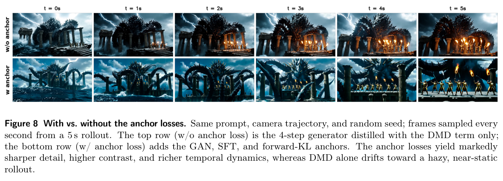
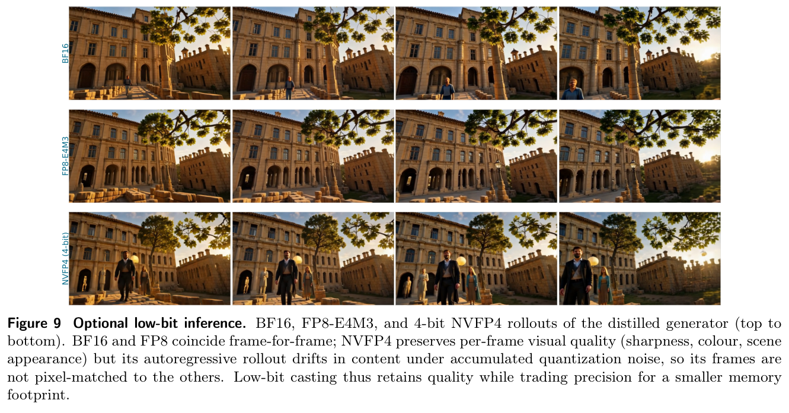
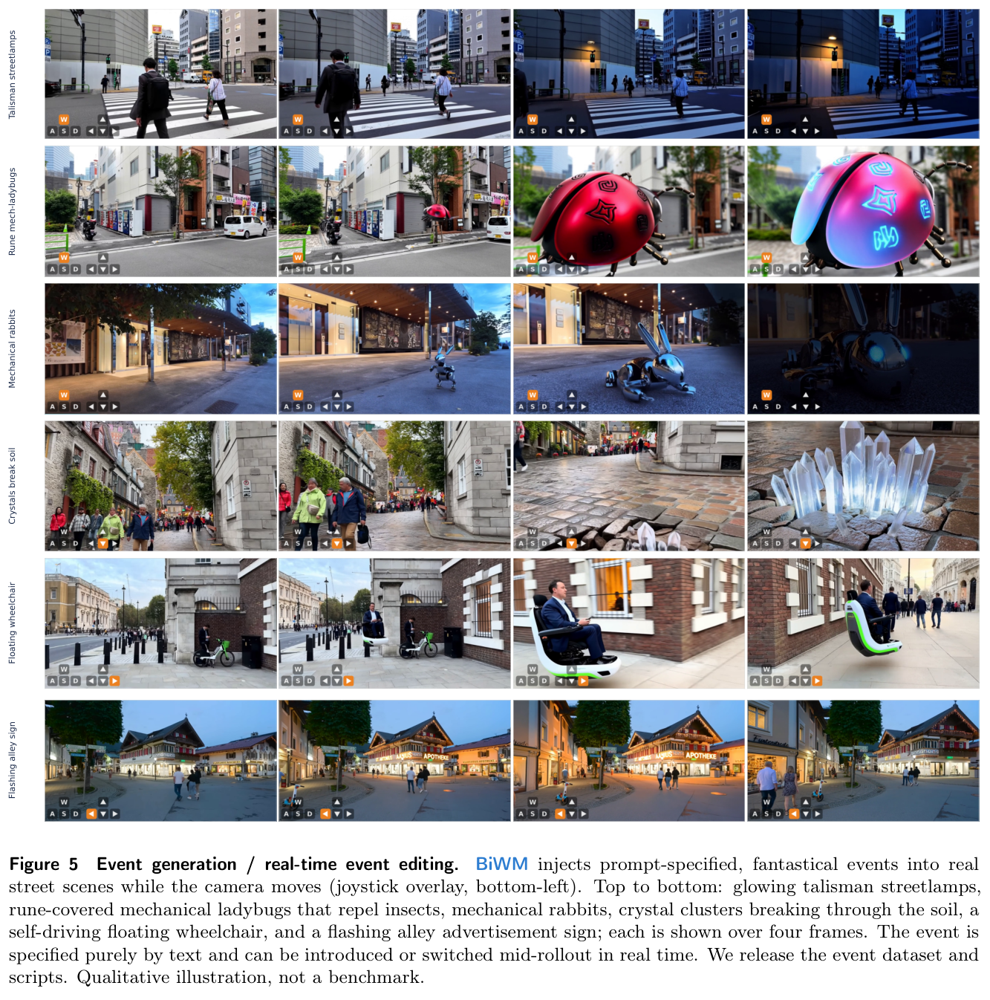
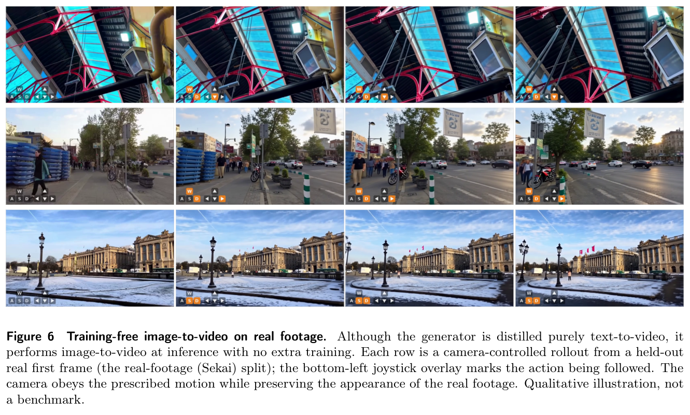

---
tags:
  - papers/WorldModel
  - video-world-model
  - diffusion-distillation
  - interactive-generation
aliases:
  - BiWM
  - 双向自回归交互视频世界模型
date: 2026-06-09
doi: 10.48550/arXiv.2606.10135
arxiv_id: 2606.10135
---

# BiWM: Advancing Open-Source Interactive Video World Models with Bidirectional Autoregression

## 核心信息

- 标题: BiWM: Advancing Open-Source Interactive Video World Models with Bidirectional Autoregression
- 标题翻译: BiWM：以双向自回归推进开源交互式视频世界模型
- 作者: Shaohao Rui, Xiaofeng Mao, Zhanyu Zhang, Peijia Lin, Yansong Zhu, Yibo Zhang, Haibin Wan, Weijie Ma
- 机构: LynnReal AI；Shanghai Innovation Institute；上海交通大学；复旦大学
- 发表时间: 2026-06-09
- 发表渠道: arXiv 预印本
- DOI: 10.48550/arXiv.2606.10135
- arXiv: 2606.10135
- 论文链接: https://arxiv.org/abs/2606.10135
- 代码 / 项目: https://github.com/LynnReal-AI/BiWM
- 数据 / 资源: OpenVid+WorldPlay 规定轨迹数据（复用 minWM 开源发布）；Sekai 真实行走视频；事件编辑数据集与脚本随框架一并开源
- 论文类型: 开源框架 / AI 方法论文（交互式视频世界模型）

## 原文摘要翻译

将双向视频生成模型转入自回归范式，显著增强了视频世界模型的交互性与实时响应能力。然而，现有因果自回归管线通常要经历控制微调、自回归训练、因果初始化和少步蒸馏的多阶段流程。这一复杂管线不仅在计算上组装繁重，而且由于复合误差累积，相对双向对应模型仍留有明显的质量差距。相比之下，Yume-1.5 与 Matrix-Game-3.0 等近期世界模型采用双向自回归方案，得益于双向误差传播的自我纠正性质，取得了更优的视觉保真度与更稳定的长时程探索。

为弥合开源工具中的架构空档——minWM 之类的框架只支持因果模型——我们提出 BiWM：第一个专注于在双向自回归范式下构建交互式视频世界模型、并同时联合优化生成质量与推理速度的全栈框架。BiWM 依托预训练视频基础模型，第一阶段通过微调注入相机控制能力，随即进行少步分布匹配蒸馏（DMD），把骨干转化为动作或相机可控的交互世界模型。

通过把管线压缩为两个训练阶段（minWM 需要四个），BiWM 训练非常高效：两个阶段在 8×H200 GPU 上均可在几百个优化器步内共同收敛，便于在学术预算下快速原型开发。

我们的框架具备跨多种架构与模态的全栈训练支持，包括 Wan2.1-T2V-1.3B、Wan2.2-TI2V-5B、HunyuanVideo-1.5-TI2V-8B 与 LTX-2.3-22B，并额外支持对既有双向模型做二次微调，使其适配新的数据分布。值得注意的是，BiWM 能实现真实场景相机控制，而 minWM 在该场景中经常失去可控性。

为了让双向滚出在长时程上保持可负担，BiWM 进一步集成可插拔的历史压缩机制，包括 FramePack 式记忆布局（如 Yume-1.5 所用）与 PackForcing 式方案，在保留长程上下文的同时降低自回归推理的显存与计算。面向部署，我们还开源了可选的 NVFP4（4 位浮点）训练与推理管线，把蒸馏后的生成器转为 4 位精度以获得额外推理加速。

为缓解 DMD 固有的模式寻求病理，我们引入一套抗退化技术，包括基于 GAN 的对抗精修目标和一个前向 KL、质量覆盖式的正则项，最大程度保留复杂的场景动态。我们希望 BiWM 能成为资源受限研究和需要高保真环境模拟场景的实用选择，从而加速学术界的算法迭代。最后，我们认为可更新的历史状态是未来世界模型的重要方向，并邀请社区进一步探索。

## 创新点

1. **把因果与双向的分界从架构表述还原为一个可操作的判据：已生成帧是否允许被后续生成修改。** BiWM 的块内全双向注意力、跨块自回归与历史逐步重编码，使已生成帧持续接受"来自未来"的修正；这直接针对因果范式的结构性弱点——误差被冻结进键值缓存，而连续分布的视频扩散又缺少语言模型那种离散重量化的自纠错通道。
2. **零参数的文本空间相机控制。** 把连续 6-DoF 相机运动量化为 81 类离散动作（9 向平移 × 9 向旋转），每类绑定固定文本短语、一次性预编码为冻结缓冲，经骨干既有交叉注意力逐帧注入。不加任何新模块，第 0 步时模型严格等于预训练生成器，因此约 100 步就能学出控制，避开了绝对/残差注入法的早期画质塌陷和大批量依赖。
3. **针对 DMD 模式寻求病理的锚项工具箱。** 在自滚出蒸馏主项之外提供对抗项、低噪声监督回归和真实数据与教师两路前向 KL 共四个可单独开关的抗退化锚，明确用质量覆盖的前向 KL 对冲反向 KL 的模式塌缩——同一思想还被复用到量化自蒸馏，解释了为什么低比特模型不会退化成静态场景。
4. **把闭源范式变成可复现基础设施。** Yume-1.5 与 Matrix-Game-3.0 证明了双向范式的收益但都不放数据与完整训练管线；BiWM 提供两阶段配方、四骨干三架构族支持、三种可插拔历史压缩和开源低比特训练管线，把范式验证成本压到学术预算内（8×H200、几百步、数小时）。

*Fig. 1：BiWM 总览——从预训练双向视频基础模型出发，仅两个训练阶段（相机/动作控制微调、少步 DMD 蒸馏，均保留全双向注意力）得到双向自回归交互世界模型；裁切完整、图注齐全。*

## 一句话总结

这篇论文的实际角色是基础设施而非新算法：它把 Yume-1.5 与 Matrix-Game-3.0 用而不放的双向自回归范式做成了两阶段、几百步、跨四种骨干的可复现开源配方，真正的技术亮点是零参数的文本空间相机控制和对模式塌缩的前向 KL 解药；但要清楚，全文没有一个定量基准，所有质量优势与"minWM 在真实场景失控"的说法目前都停留在机制论证加定性演示层面。

## 研究问题

交互式视频世界模型的核心工程问题是：如何把一个离线的、整段去噪的双向视频扩散模型，改造成能在用户动作流（首先是相机运动）驱动下逐帧续写世界的自回归系统。现有主流做法是因果化——加因果掩码、把历史存成键值缓存复用。论文指出这条路线的结构性代价：一旦某帧被冻结进缓存，它的表征就永远不能再修改，生成历史中的任何误差都会永久化并随滚出变长而复合。

作者对"为什么视频比语言更怕这种漂移"给出了一个值得记住的论证：自回归语言模型在离散词表上预测，每一步都把输出重新量化回合法词元，天然具备吸收小错误的能力；扩散视频模型拟合的是像素上的连续分布，亚词元级的偏差永远不会被拉回，只会不受控地累积直到场景崩坏。更糟的是图像误差与相机响应漂移互相强化——因果滚出在相机控制下的退化比两者单独发生都快。

*Fig. 3：因果自回归基线（Self-Forcing 式、连续位姿控制）在行走相机轨迹下的崩溃过程——冻进缓存的误差与相机响应漂移复合，街景逐步退化为泛白的无结构帧；裁切完整清晰，是全文论证的起点。*

双向系统（Yume 系列、Matrix-Game-3.0）让窗口内每帧互相可见：早先的历史潜帧对正在去噪的帧保持可见并随之刷新，模型持续重新解释、自我纠正自己的过去。这些系统的经验结果更好，但都难以复现——截至论文写作时没有一家放出训练数据或完整训练管线。于是问题变成：开源生态里有 minWM 这样的因果全栈框架，却没有双向范式的对应物。

让这个范式在经济上成立的关键洞察是：**少步蒸馏之后，双向注意力的额外成本变小了**。当一个窗口只需 4 步去噪，保留窗口内全注意力的代价有限，此时决定架构选择的因素从时延变成误差韧性。这是全文最有普适价值的一个判断。

## 数据与任务定义

### 任务形式

给定静态场景描述（或首帧图像）与逐帧离散相机动作流，模型按块自回归地生成潜帧序列。默认设置：视频截断为 77 帧、经 VAE 编码为 20 个潜帧，按每块若干潜帧划分，蒸馏后每块只需 4 步去噪，整条滚出可延伸至 60 秒以上。

### 两路数据源

| 数据源 | 轨迹来源 | 角色 |
|---|---|---|
| OpenVid + WorldPlay | 规定轨迹（按指定相机轨迹生成视频），6-DoF 位姿按构造精确 | 干净、多样、规模化的相机监督；直接复用 minWM 的开源发布 |
| Sekai 真实行走视频 | SLAM 式视频位姿引擎，配合时序一致多视几何与度量尺度单目模型，经光束法平差精化 | 真实分布覆盖；恢复度量尺度的逐帧外参与内参 |

两路数据共享同一格式：每条片段一个场景描述加一串离散相机动作。两个约定值得注意。其一，场景描述在严格的"仅静态"指令下书写——只描述物体、布局、外观，绝不描述相机运动，保证文本监督不可能泄漏轨迹，所有运动信号都必须流经动作通道。其二，质量过滤除通用视觉指标外还有相机专用项（视场角、焦距一致性、轨迹平滑度、尺度稳定性），几何不可靠的片段直接丢弃。

### 从连续位姿到离散动作

逐帧相对位姿（相对上一关键帧的平移与旋转）经方向-角度分类器量化：平移类取 0 到 8（静止 / 前后左右 / 四对角），旋转类取 0 到 8（静止 / 俯仰 ± / 偏航 ± / 四对角），幅度低于自适应阈值即判静止，合成单一标签

$$
a_i = g_t(\Delta t_i)\times 9 + g_r(\Delta R_i) \in \{0,\dots,80\}.
$$

方向与幅度解耦使量化对位姿噪声鲁棒；键鼠日志或文本位姿串也能直接解析到同一标签空间。作者强调整条标注链忠于连续 6-DoF 几何，离散化只发生在最后一步——81 类词表是真实相机几何的低带宽文本友好编码，不是手工指定的类别标签。

## 方法主线

### 机制流程

1. **动作流 → 逐帧文本条件。** 每个潜帧的动作标签从一次性预编码的冻结缓冲（81 类 × 短语长度 × 文本维度）中取出相机文本嵌入，与场景描述嵌入行拼接、截断补零到固定长度 512，过骨干自己的文本投影得到逐帧条件；训练期间文本编码器从不对相机短语做前向。
2. **块内双向去噪。** 当前块与可见历史联合做全双向注意力；每个正在生成的帧被重排成逐帧粒度，其图块标记经既有交叉注意力只读自己的相机加场景条件；历史/记忆标记只条件于场景描述、不携带任何相机文本——相机动作只作用于当前块，从不重复施加到历史。
3. **跨块自回归 + 历史压缩。** 已生成的干净潜帧经三种可插拔模式之一变成记忆标记前缀：首帧锚滑窗（干净潜帧以零噪声进前缀，窗口外直接丢弃）、PackForcing 式高低码率双支编码器（固定尺寸记忆库）、或 FramePack 式多尺度金字塔（近处清晰、远处粗化）；旋转位置编码统一按图块网格计数并保留真实帧索引。
4. **少步生成 → 用户闭环。** 蒸馏后每块 4 步去噪输出，用户可逐块改变相机动作或注入文本事件；把用户图像编码为首帧干净历史即得免训练图生视频，同一检查点同时支持文生与图生两种入口。

### 双向自回归为什么不是矛盾修辞

因果与双向共享同一个块级分解：

$$
p(x \mid c, a) = \prod_{b=1}^{B} p\!\left(c_b \mid c_{<b},\, c,\, a_b\right),
$$

区别不在块大小，而在每个因子内部注意力如何对待历史。因果模型从冻结缓存读历史，过去永远看不见现在；BiWM 在每一步对当前块与历史做联合双向注意力，历史的表征本身被正在生成的块重新条件化、随之刷新。判据只有一条：**已生成帧是否还允许改变**。代价是历史要在每步重编码而不能缓存，论文只承认这"适度更贵"——没有给出时延数字，这是后面要回到的问题。

论文脚注里还有个诚实的细节：许多"因果"世界模型实际采用局部窗口——窗口内双向、跨窗因果——但窗口一旦滑出缓存，其表征仍被冻结，所以上面的判据不受影响。这也意味着 BiWM 与"局部窗口因果"模型的架构差异，最终只剩"历史是否持续被刷新"这一件事。

### 文本空间相机控制

*Fig. 4：81 类离散相机词表——9 向平移 × 9 向旋转的网格，每格一个动作标签并映射到固定相机文本短语；裁切完整清晰。*

与两类既有注入法对比才能看出这个设计的分量。绝对注入（CameraCtrl 式全局控制、逐层注入）把逐帧绝对位姿编码进隐藏状态，相机轨迹的时序动态与视频自身动态耦合，放大长滚出的误差累积。相对注入（CaPE、GTA、PRoPE、UCPE）改写帧间注意力更鲁棒，但残差支路即使零初始化也会扰动预训练注意力、造成训练早期画质下跌，且通常需要较重的相机编码器与大批量训练。

BiWM 的选择是把相机控制彻底做成条件化任务：81 类动作各绑定一条固定英文短语（意为"相机前移、相机右偏航"之类），初始化时一次性全部预编码存为冻结缓冲，运行时只做查表。由于交叉注意力对上下文不加位置编码也不做键掩码，相机行与描述行的拼接顺序无关，整个装配可向量化为一次查表；动作到潜帧长度的对齐用最近邻插值，保住离散类别边界。所有运算复用预训练组件，**第 0 步时模型严格等于预训练生成器**——这是约 100 步收敛、无画质下跌、无大批量依赖的机制根源。

还有一个容易忽略的顺序细节：第一阶段整段联合去噪、不存在历史，逐帧注入是唯一条件路径；自回归、历史压缩与记忆流的分离都到第二阶段才进入。

### 多目标少步蒸馏

第二阶段把 50 步双向采样器蒸成 4 步块级生成器，训练循环直接建立在 Self-Forcing 之上——生成器训练中自行滚出、由分布匹配目标监督，闭合自回归视频扩散的训练-测试差距——关键改动是范式：滚出在块级双向而非严格因果掩码下进行。采用流匹配参数化：

$$
x_\sigma = (1-\sigma)\,x_0 + \sigma\,\epsilon,\qquad
\hat x_0 = x_\sigma - \sigma\, v_\theta(x_\sigma, \sigma, c, a),
$$

速度目标为噪声减去干净样本。三份权重均从第一阶段初始化：冻结的真实分数（带无分类器引导的双向教师）、在线伪分数（按 N:1 频率追踪学生分布的批评器）与生成器本体。主项是非对称分布匹配梯度：

$$
\nabla_\theta \, \mathbb{E}_t\, \mathrm{KL}\!\left(p_{\theta,t} \,\|\, p_{data,t}\right)
= -\,\mathbb{E}\!\left[\left(s_{real}(\tilde x_t, t) - s_{fake}(\tilde x_t, t)\right)\frac{\partial \tilde x}{\partial \theta}\right],
$$

两个分数收到相同的场景描述与相机文本条件，保证可控性在蒸馏中存活。为了让自滚出可训练：每块只保留一个随机去噪步的梯度、历史跨块截断梯度（计算图从不跨越整条滚出），动态块数课程把算力集中到长历史。

关键问题：分布匹配主项是反向 KL、天然模式寻求，单独最小化会丢模式——表现为运动衰减到静态场景或高频塌缩。三类锚项分别对冲：

| 锚项 | 噪声区间 / 数据 | 对冲的失败模式 |
|---|---|---|
| 对抗项（投影判别器加铰链损失，训练后丢弃） | 解码帧的帧级与特征级评分 | 高频纹理塌缩 |
| 监督回归：低噪声区速度回归，作用于完整 77 帧真实视频 | 低噪声区间 | 细节锚定到真实数据；预热期只滚单块时仍保住长视频与运动建模 |
| 真实前向 KL：高噪声区把学生的干净估计回归到真实视频 | 高噪声区间（高于监督项区间） | 全局布局与运动的模式覆盖 |
| 教师前向 KL：教师沿稠密常微分方程轨迹滚出，线性外推出干净目标供学生回归 | 无需真实数据 | 转移教师的完整质量覆盖分布，防运动收缩 |

总目标为

$$
\mathcal{L} = \mathcal{L}_{DMD} + \lambda_{GAN}\mathcal{L}_{GAN} + \lambda_{SFT}\mathcal{L}_{SFT} + \lambda_{rFKL}\mathcal{L}_{rFKL} + \lambda_{tFKL}\mathcal{L}_{tFKL},
$$

每个辅助项由单一开关控制。概念分工清晰：分布匹配项对齐教师（模式寻求）、前向 KL 恢复覆盖（质量覆盖）、监督项锚定细节、对抗项锐化纹理。

### 训练预算与可选低比特

第一阶段约 100 个优化器步学出可靠相机控制，第二阶段约 200 步收敛，均在 8×H200、梯度累积 4 下完成，整条管线以小时计。

没有独立的量化或后对齐阶段：量化感知训练折叠进第二阶段尾部——打开伪量化，用同一生成器的全精度前向当教师、量化前向当学生，再用前向 KL 同时对齐速度场与干净估计。作者点明前向 KL 是低比特保动态的关键：质量覆盖迫使量化学生匹配全精度分布的完整形态，而反向 KL 或朴素均方误差对齐会压制运动、产出静态场景。

低比特路径支持 FP8-E4M3（Hopper 硬件核）与 NVFP4（Blackwell 原生核）。

## 关键结果

先说清一件事：**这篇论文没有任何定量基准**。结果一节开篇明说"按组件功能刻画框架而非单一基准数字"，系统性定量研究"正在进行、将随代码发布"；所有效果图都标注"定性演示，非基准"。所以这一节能整理的硬数字只有训练预算与配置，质量证据全部是机制对照式的定性图。

### 框架级对比：开源生态中的位置

| 维度 | BiWM | minWM | Yume-1.5 | Matrix-Game-3.0 |
|---|---|---|---|---|
| 范式 | 块内双向 + 跨块自回归 | 因果（Causal Forcing） | 双向 | 双向 |
| 训练阶段数 | 2 | 4 | 未完整公开 | 多阶段 |
| 相机控制 | 81 类离散文本动作，零新参数 | 连续 PRoPE | 文本控制 | 键鼠动作 |
| 数据 + 训练管线开源 | 全部 | 全部 | 未放数据与完整管线 | 未放数据与完整管线 |
| 训练预算 | 约 100 + 200 步，8×H200 | 相对更重（四阶段） | 不明 | 不明 |

这张表是论文真正的"主结果"：BiWM 的贡献主张不在打榜，而在把右边两列闭源系统的范式变成可复现配方。

四个骨干——Wan2.1-T2V-1.3B、Wan2.2-TI2V-5B、HunyuanVideo-1.5-TI2V-8B 与 LTX-2.3-22B——横跨交叉注意力、MMDiT 与音视频联合三个架构族，其中 22B 实例直接给出一个"可听可看"的世界模型。

框架还支持对 Yume-1.5 与 Matrix-Game-3.0 做二次微调，把既有双向模型低成本适配到新数据分布。

### 消融到底说明了什么

全文最接近消融的证据是锚项对照——同提示词、同相机脚本、同随机种子，仅分布匹配项蒸馏对比加全部锚项：

*Fig. 8：有无锚项的同种子对照，帧按每秒从 5 秒滚出采样。上排（仅 DMD）雾状、低对比、内容几乎不随时间变化；下排（加对抗、监督与前向 KL 锚）细节、对比度与时序动态显著恢复；裁切完整清晰。*

这个对照证明的是"锚项组合有效"，**没有**证明各锚项的边际贡献——对抗、监督、两路前向 KL 的逐项消融不存在，损失虽可单开关切换但论文没给对应结果。上排的近静态退化倒是很有教学价值：它是反向 KL 模式寻求病理在视频域的直观形态——丢掉的模式恰好是运动本身。

### 低比特三精度对照

*Fig. 9：三种精度的滚出对照。BF16 与 FP8-E4M3 逐帧重合；NVFP4 保住帧级清晰度与色彩，但自回归内容在量化噪声累积下漂移、不再与上两行逐帧对齐；裁切完整清晰。*

值得表扬的是作者的诚实表述：低比特在批量为 1 时主要以精度换显存，吞吐收益需要批量推理、图编译与真低比特核组合才能兑现，因此被明确排除在核心配方之外。NVFP4 的内容漂移也提示：量化噪声在双向自回归下同样会累积——自纠错机制不能消化系统性的数值扰动。

### 能力演示：事件编辑与免训练图生视频

*Fig. 5：实时事件编辑六例——发光符箓路灯、符文机械瓢虫、机械兔、破土水晶、悬浮轮椅、闪烁小巷灯牌，在相机移动的同时以纯文本注入真实街景；裁切完整、图注齐全。*

事件编辑是双向范式的自然副产品：历史被持续重编码，所以中途注入的文本事件能被"织入"正在进行的世界而保持连贯。作者称这是首个开源发布该能力的框架，并随框架放出事件数据集与脚本。

*Fig. 6：免训练图生视频——生成器纯文生视频蒸馏，推理时把留出的真实首帧（Sekai 划分）编码为初始历史即可做相机控制续写，保持真实素材的光度特征；裁切完整清晰。*

免训练图生视频的机制值得注意：跨块条件路径本来就接受干净潜帧作历史，推理时把用户图像放进首帧历史即可——长时程续写与图生视频入口是同一机制的两个用法。此外框架还支持文生、图生、视频续写三目标混合训练，进一步强化条件能力。

> [!figure] Figure 2：键鼠动作驱动的交互世界探索
> 建议位置：本小节，作为离散动作控制服从性的主演示。
> 放置原因：每行一个恒定离散动作（后右加右偏航、右移加左偏航、前右加上仰、左偏航、前进加静止视线），展示相机严格服从指令而场景保真。
> 当前状态：人工检查发现自动裁切缺失图注所述五行中的一行、且图注末行被截断，未插入不完整图片；内容已在此转写，控制服从性可参考 Fig. 4 词表与 Fig. 5、Fig. 6 中的摇杆覆盖层。

## 深度分析

### 真正贡献是什么

分三层看。**范式层的贡献是"民主化"而非发明**：双向自回归不是 BiWM 首创（Yume-1.5、Matrix-Game-3.0 在先），它的贡献是第一次把这个范式做成数据、代码、检查点齐全的开源配方，并把训练成本压到 8×H200 几百步——这类基础设施贡献的价值取决于社区采用，不取决于论文本身的数字。

**机制层有一个真创新：文本空间相机控制。** 它不是"又一个相机编码器"，而是观察到低维控制信号根本不需要专用注入通路——量化成词表、走文本条件路径，就能同时拿到零新参数、初始无扰动、约 100 步收敛三件好处。这个设计与既有绝对/相对注入法的失败模式（时序耦合、残差扰动）有清晰的因果对应，是全文机制论证最扎实的部分。

**工程层是高质量组装**：三种历史压缩是对首帧锚滑窗、PackForcing、FramePack 三条已有路线的统一接口复现（含旋转位置编码按图块网格计数、时间轴不得逐块重置这类踩坑细节），多目标蒸馏是 Self-Forcing 加投影对抗项加前向 KL 正则的组合，低比特是部署工程。

组装本身无新意，但"全部开源 + 单开关可消融"让它们变成公共实验平台，这正是 minWM 在因果侧做过的事。

### 为什么结果成立

第一，双向自纠错有明确的机制根源。连续分布扩散没有离散重量化的纠错通道，那么纠错只能来自"让过去保持可修改"：历史潜帧对当前去噪可见并随之刷新，等价于每步都在重新推断过去。这不是玄学，是把误差冻结点从"帧生成完成时"推迟到"帧滑出窗口时"。

第二，文本空间控制成立的前提是控制信号足够低维。81 类离散词表带宽极低，预训练文本通路的容量绰绰有余；如果控制信号是高维连续的（如逐帧完整位姿矩阵或机器人关节轨迹），这条路径未必够用——这是把该设计迁移到其他领域时必须先问的问题。

第三，前向 KL 对冲反向 KL 有干净的数学互补性：反向 KL 罚"学生有而数据无"（模式寻求），前向 KL 罚"数据有而学生无"（质量覆盖），运动模式恰好是最容易被丢掉的那部分质量。同一论证在量化自蒸馏里二次兑现，说明这是可迁移的原理而非调参巧合。

第四，整个范式的经济性建立在少步蒸馏之上：4 步去噪把块内全注意力的相对开销压低，误差韧性于是压过时延成为决策因素。反过来说，如果未来出现单步因果方案且质量追平，这个平衡还会翻回去。

### 容易误读的地方

- **"第一个全栈开源双向自回归框架"是定位主张**，取决于"全栈"的定义——Yume-1.5 开源了模型权重，缺的是数据与完整训练管线。主张本身大体成立，但不宜引用为"此前无人开源双向世界模型"。
- **"minWM 在真实场景相机控制中频繁失控"没有实验协议支撑**，目前是作者断言。引用这个对比时应标注"作者观察"。
- **"实时"没有帧率或时延数字。** 双向重编码历史"适度更贵"到底是多少毫秒、多长历史下仍可交互，全文无数据。不要把 BiWM 引用为"已证明实时"。
- **约 100/200 步收敛是作者自述**，没有公开训练曲线，且与骨干规模的关系未展开——22B 骨干是否同样几百步收敛存疑。
- **两位核心作者同时是 Yume 系列与 PackForcing 的作者**。这既是可信度来源（一线经验），也意味着"双向优于因果"的立场先于本文存在，读该论断时应保持这个背景意识。

### 复现注意点

1. 代码与检查点：https://github.com/LynnReal-AI/BiWM ；四骨干的微调脚本与推理脚本均声明可复现，所有定性图由随仓库发布的图形生成脚本从原始滚出帧生成。
2. 数据入口现成：规定轨迹部分直接用 minWM 发布的 OpenVid+WorldPlay 数据；Sekai 部分需自跑位姿标注管线（SLAM 式位姿引擎、多视几何、度量单目模型加光束法平差），这是复现中最重的一段。
3. 关键超参：77 帧截断、20 个潜帧、每块若干潜帧、文本条件长度 512、批评器与生成器按 N:1 更新、每块单随机步保留梯度、跨块截断梯度、动态块数课程、梯度累积 4。
4. 场景描述必须严格"仅静态"，动作到潜帧的对齐必须用最近邻而非线性插值——这两点直接决定控制信号是否纯净。
5. 锚项与历史压缩模式均为单开关切换，适合做论文没做的逐项消融。
6. 量化感知训练在第二阶段尾部开启伪量化；FP8 需 Hopper、NVFP4 需 Blackwell 硬件核，没有对应硬件时低比特路径只有存档意义。

## 局限

1. **零定量基准。** 没有视频质量指标、没有控制误差指标、没有用户研究；与 minWM、Yume-1.5 的所有比较均无协议化实验。作者自己把正面定量对比列为未来工作，这诚实但也意味着"双向优于因果"在本文内没有新增定量证据。
2. **无时延数字。** 双向重编码历史的每块成本、可交互的最大历史长度、端到端帧率全部缺失，"实时"与"交互性"主张缺硬指标。
3. **离散控制的表达力天花板。** 81 类词表方向-幅度解耦意味着不编码速度与幅值，缓慢推拉、变速运动等连续控制不可表达；连续与组合动作词表被作者列为未来方向。
4. **长程记忆未验证。** 首帧锚滑窗超窗即忘；PackForcing 与 FramePack 两种学习式压缩的记忆保持质量论文说"可直接消融"但没有给结果。
5. **NVFP4 内容漂移。** 帧级质量保留但自回归内容在量化噪声下漂移，说明自纠错并不能吸收系统性数值扰动；低比特在批量为 1 时只省显存不提速。
6. **领域覆盖窄。** 数据与演示集中在街景与自然场景的自运动探索，物体操纵、物理交互、多智能体均不在分布内。

## 我的笔记

### 与 [[World Action Models are Zero-shot Policies]] 的直接对话

- 两篇说的"双向"不是同一个东西，这一点最容易被混淆。DreamZero 第 13 图消融批评的双向是"固定长度整段双向"：任务中点采样时为匹配整段语言描述可能重采样视频、破坏原生帧率，造成视频与动作的时间错位，因此它选了因果自回归加真值回填。BiWM 的块级双向自回归恰好落在该消融未覆盖的中间点——跨块仍是自回归（保原生帧率、按块条件化历史），只在块内部保留全注意力。
- 换句话说，DreamZero 排除的是整段双向，BiWM 论证的是块内双向，两个结论可以同时成立。值得做的实验：在 DreamZero 的抓放消融设定里把双向基线换成 BiWM 式块级双向，看两者各 50% 任务进度的平手是否被打破。
- 两篇对"历史误差如何被纠正"给出互补答案：DreamZero 用环境真值回填缓存——外部锚，因为机器人闭环里每个动作块执行后有真实观测可用；BiWM 用双向重编码——内部锚，因为交互世界模型生成的就是世界本身、无处取真值。由此得到一条设计准则：有真实环境反馈时优先外部锚（便宜且无偏），纯生成场景只能靠内部自纠错；而内部自纠错只是分布内平滑，对系统性偏差（如 NVFP4 的量化噪声漂移）无能为力。

### 对本地 sim-anchored WAM 项目的启示

- BiWM 是 [[insight]] 中最小可行实验阶段理想的迭代平台：两阶段几百步、多骨干、损失单开关切换，正好匹配"先用 5B 级骨干快速迭代"的计划。
- 文本空间动作注入是给视频骨干加动作条件的零参数起步方案，可先用它验证仿真动作流水线；但机器人动作块是高维连续信号，81 类词表式的低带宽路径大概率不够，需要先做表达力测试再决定注入方式。
- 前向 KL 锚项工具箱直接回答了 [[insight]] 风险表里"蒸馏导致动态塌缩"一项；仿真裁决的偏好目标若做成流匹配偏好优化，也应配质量覆盖锚防止模式收缩。
- BiWM 的内部自纠错与 generated-future verifier 作用机制不同、可叠加：双向重编码修的是分布内不一致（视觉平滑、身份保持），仿真裁决否决的是分布外物理错误（穿透、漂移、消失）；前者不需要外部知识，后者必须有。一个完整的世界模型栈两层都要。

### 追踪清单

- 作者预告的跨骨干系统性定量研究（随代码发布）。
- 可更新历史状态方向——结论中作者点名邀请社区探索，与 PackForcing 的作者背景一致，可能是他们的下一篇。
- minWM 阵营对"真实场景相机控制失控"断言的回应。

## 引用

Rui, S., Mao, X., Zhang, Z., Lin, P., Zhu, Y., Zhang, Y., Wan, H., Ma, W. *BiWM: Advancing Open-Source Interactive Video World Models with Bidirectional Autoregression*. arXiv:2606.10135 (2026). DOI: 10.48550/arXiv.2606.10135.
