# BridgeVLA++: A Data-Efficient, Generalizable, and Memory-Augmented Vision-Language-Action Framework for 3D Manipulation

**Authors:** Peiyan Li, Yuze Zhu, Yixiang Chen, Qisen Ma, Yuan Xu, Jiabing Yang, He Guan, Yan Huang, Hongtao Wu, Xiao Ma, Tao Kong, Liang Wang, Tieniu Tan  
**Source:** `/Users/roywangj/journey_wj/research/papers4zotero/zotero1/storage/UQ5DQRWD/Li 等 - 2026 - BridgeVLA++ A Data-Efficient, Generalizable, and Memory-Augmented Vision-Language-Action Framework.pdf`  
**Detected source format:** selectable-text PDF with author-provided LaTeX source (`pdf-text` + `arXiv-source`)  
**Reader type:** complete paragraph-level Chinese-English reader with equations, searchable tables, bilingual captions, appendices, and figure assets.  
**Version:** arXiv:2608.05042v1, 5 August 2026; manuscript header: *IEEE Transactions on Pattern Analysis and Machine Intelligence*.

## Page / Section Index

| Pages | Source content | Reader section |
|---|---|---|
| 1–3 | Abstract, Introduction, Related Work | Abstract; Introduction; Related Work |
| 4–6 | BridgeVLA formulation, heatmap pre-training, 3D fine-tuning | BridgeVLA |
| 6–8 | BridgeVLA++ temporal/spatial memory, integration, bimanual extension | BridgeVLA++ |
| 8–14 | Experiments, ablations, conclusion | Experiments; Conclusion |
| 14–16 | References | References policy |
| 16–25 | Appendices A–P: architecture, training, protocols, cost, full results | Appendix |
| 25–36 | Appendix figure gallery | Figures 6–21 |

## Terminology Ledger

| Term | 中文处理 | Operational meaning in this paper |
|---|---|---|
| Vision-Language-Action model (VLA) | 视觉—语言—动作模型 | 由视觉和语言直接预测机器人动作的策略 |
| input–output alignment | 输入—输出对齐 | 让 VLM 的预训练输入与下游输入都保持 2D 图像，让中间输出与动作定位都保持 2D 热图 |
| orthographic projection | 正交投影 | 将彩色点云渲染为 top/front/right 三个 2D 视图 |
| coarse-to-fine | 粗到细 | 先全局定位粗 waypoint，再以其为中心裁剪、放大、重渲染并精定位 |
| temporal memory | 时间记忆 | 初始锚点、最近邻关键帧与自适应子目标关键帧组成的历史 token 缓存 |
| spatial memory | 空间记忆 | 保存初始彩色点云，并按当前粗 waypoint 重渲染为视图对齐的少遮挡参考 |
| sub-goal gate | 子目标门控器 | 判断当前关键帧是否应进入长期子目标槽位的二分类模块 |
| keyframe | 关键帧 | 稀疏决策点；策略输出下一个末端执行器目标位姿 |
| convex upsampling | 凸上采样 | 从 VLM patch token 网格恢复与输入等分辨率热图的可学习上采样器 |
| RMBench / MemoryBench | 保留英文 | 分别测试双臂与单臂记忆依赖操作的基准 |

## Abstract

> <strong>Para. 1:</strong> Leveraging pre-trained vision-language models (VLMs) to construct vision-language-action (VLA) models has emerged as a promising paradigm for 3D robot manipulation. However, existing 3D VLA methods remain data-hungry, exhibit limited generalization under distribution shifts, and lack explicit memory of past observations. These limitations hinder their application to data-scarce, open-world, and memory-dependent manipulation scenarios.

> <strong>Para. 1[CN]:</strong> 利用预训练视觉—语言模型（VLM）构建视觉—语言—动作模型（VLA），已经成为三维机器人操作中一种很有前景的范式。然而，现有 3D VLA 方法仍然依赖大量数据，在分布偏移下泛化有限，而且缺少对过往观测的显式记忆。这些问题阻碍了它们在数据稀缺、开放世界和记忆依赖型操作场景中的应用。

> <strong>Para. 2:</strong> Our previous work, BridgeVLA, improves data efficiency and generalization by preserving the input–output alignment of a pre-trained VLM during 3D action learning: raw point clouds are projected into multi-view images, and intermediate heatmaps are predicted before generating robot actions. In this work, we develop BridgeVLA++ by equipping BridgeVLA with a unified spatio-temporal memory architecture that models persistent spatial context and temporal interaction history.

> <strong>Para. 2[CN]:</strong> 作者此前的 BridgeVLA 在三维动作学习期间保持预训练 VLM 的输入—输出对齐，从而改善数据效率和泛化：原始点云被投影为多视角图像，并在生成机器人动作之前先预测中间热图。本文进一步为 BridgeVLA 配备统一的时空记忆架构，用它建模持续存在的空间上下文与时间交互历史，形成 BridgeVLA++。

> <strong>Para. 3:</strong> The resulting memory-augmented framework can reason over observation histories while preserving BridgeVLA's data efficiency and generalization capabilities. Extensive experiments show strong performance on spatial manipulation tasks and robust generalization. BridgeVLA++ further achieves state-of-the-art performance on two challenging memory-dependent manipulation benchmarks without sacrificing the data efficiency and generalization of the original BridgeVLA.

> <strong>Para. 3[CN]:</strong> 得到的记忆增强框架可以基于观测历史进行推理，同时保留 BridgeVLA 的数据效率与泛化能力。大量实验表明，该框架在空间操作任务上表现强劲并具有稳健的泛化能力；BridgeVLA++ 还在两个具有挑战性的记忆依赖操作基准上取得了最先进表现，同时没有牺牲原始 BridgeVLA 的数据效率和泛化能力。

> <strong>Para. 4:</strong> In addition, BridgeVLA++ performs effectively in bimanual manipulation settings and is validated on an additional real-world robotic platform, demonstrating its scalability across tasks, environments, and robotic platforms. These results establish BridgeVLA++ as a unified 3D vision-language-action framework that simultaneously supports data-efficient learning, robust generalization, and effective memory-aware robot manipulation. Project website: https://bridgevla-plus.github.io/.

> <strong>Para. 4[CN]:</strong> 此外，BridgeVLA++ 在双臂操作设置中同样有效，并在一个新增的真实机器人平台上得到验证，展示了跨任务、跨环境和跨机器人平台的可扩展性。这些结果把 BridgeVLA++ 确立为一种统一的 3D VLA 框架，能够同时支持数据高效学习、稳健泛化和有效的记忆感知机器人操作。项目主页：https://bridgevla-plus.github.io/。

## I. Introduction

### Figure 1. BridgeVLA++ overview

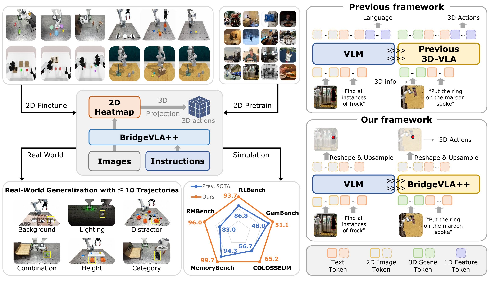

**Caption:** Overview. BridgeVLA aligns its inputs and outputs in a unified 2D image space: it is pre-trained on object grounding using 2D heatmaps and fine-tuned on 3D manipulation. BridgeVLA++ adds temporal memory for deciding what to do next and spatial memory for deciding where exactly to act, while preserving data efficiency and generalization.

**Caption[CN]:** 总览。BridgeVLA 把输入与输出对齐到统一的二维图像空间：先用二维热图进行目标定位预训练，再针对三维操作微调。BridgeVLA++ 增加时间记忆以判断“下一步做什么”，并增加空间记忆以判断“精确在哪里操作”，同时保留数据效率和泛化能力。

> <strong>Para. 1:</strong> Leveraging pre-trained VLMs to construct VLA models has become a promising approach to learning generalizable and robust robot manipulation policies [1–5]. Most VLA models, however, operate on 2D images and require large amounts of robot data, whereas 3D manipulation policies exploit geometric structure and achieve higher sample efficiency [6–10]. This raises a question: can a unified 3D VLA combine the semantic generalization of pre-trained VLMs with the geometric efficiency of 3D manipulation policies?

> <strong>Para. 1[CN]:</strong> 使用预训练 VLM 构建 VLA 已成为学习可泛化、稳健机器人操作策略的重要路线 [1–5]。然而，多数 VLA 在二维图像上运行并需要大量机器人数据，而三维操作策略通过利用几何结构获得更高的样本效率 [6–10]。由此产生核心问题：统一的 3D VLA 能否同时获得预训练 VLM 的语义泛化与三维操作策略的几何效率？

> <strong>Para. 2:</strong> Existing 3D VLA attempts do not fully resolve this challenge [11,12]. Many encode actions as token sequences and predict them autoregressively, discarding the spatial correspondence between 3D observations and actions that underlies the efficiency of prior 3D policies. Introducing 3D inputs into a VLM also creates a modality gap from its 2D image pre-training, limiting both VLM-prior transfer and the use of explicit 3D structure.

> <strong>Para. 2[CN]:</strong> 现有 3D VLA 尝试并没有完全解决这一挑战 [11,12]。许多方法把动作编码为 token 序列并自回归预测，从而丢掉三维观测与动作之间的空间对应关系，而这恰恰是既有三维策略高效率的来源。直接向 VLM 引入三维输入还会与其二维图像预训练形成模态鸿沟，同时限制 VLM 先验迁移和显式三维结构的利用。

> <strong>Para. 3:</strong> Memory is an additional challenge. Most VLA and 3D manipulation policies predict each action primarily from the current observation. They struggle when the correct action depends on previous interactions or when task-relevant geometry observed earlier becomes occluded. A capable 3D VLA should retain temporal task context and persistent spatial information while preserving data efficiency and generalization.

> <strong>Para. 3[CN]:</strong> 记忆构成另一项挑战。多数 VLA 和三维操作策略主要依据当前观测预测动作；如果正确动作依赖此前的交互，或早先看到的任务相关几何在执行中被遮挡，它们就会遇到困难。一个有能力的 3D VLA 应在保留数据效率和泛化能力的同时，维持时间任务上下文和持续的空间信息。

> <strong>Para. 4:</strong> BridgeVLA addresses the first two challenges through input–output alignment. It projects point clouds into multi-view orthographic images [9,10] and processes them with a pre-trained VLM. Instead of predicting action tokens, it predicts a 2D translational heatmap for each view and back-projects the maxima into a 3D end-effector position. Object-grounding pre-training teaches the VLM to predict language-conditioned heatmaps before robot-policy fine-tuning; pre-training and manipulation therefore share the same 2D localization space.

> <strong>Para. 4[CN]:</strong> BridgeVLA 通过输入—输出对齐解决前两项挑战。它把点云投影为多视角正交图像 [9,10]，再由预训练 VLM 处理；方法不预测动作 token，而是为每个视角预测二维平移热图，并把热图极大值反投影为三维末端执行器位置。在机器人策略微调前，目标定位预训练先教 VLM 预测语言条件热图，因此预训练与操作学习共享同一个二维定位空间。

> <strong>Para. 5:</strong> BridgeVLA++ introduces unified spatio-temporal memory. Temporal memory maintains selected historical observations, distinguishing visually similar situations at different task stages to determine what to do next. Spatial memory preserves geometry from an earlier, less-occluded observation and re-renders it to recover target regions hidden by the robot or manipulated objects, helping determine where exactly to act. The scene-level representation can be shared across two arms, enabling a common backbone with arm-specific action heads.

> <strong>Para. 5[CN]:</strong> BridgeVLA++ 引入统一时空记忆。时间记忆保存经过选择的历史观测，用于区分不同任务阶段中视觉上相似的状态，从而判断下一步做什么；空间记忆保存更早且遮挡较少的几何，并通过重渲染恢复被机械臂或被操作物体挡住的目标区域，从而判断精确在哪里操作。这种场景级表示还可以在两条机械臂之间共享，用公共骨干配合手臂专属动作头实现双臂扩展。

> <strong>Para. 6:</strong> Across five simulation benchmarks, BridgeVLA achieves state-of-the-art results on RLBench, COLOSSEUM, and GemBench, while BridgeVLA++ establishes state-of-the-art results on RMBench and MemoryBench and matches or improves the base model on its original benchmarks. On Franka Research 3 and Dobot CR5A, BridgeVLA outperforms a strong baseline by 32% on average in memory-free tasks; BridgeVLA++ raises memory-dependent task success from 20.0% to 93.3% over BridgeVLA.

> <strong>Para. 6[CN]:</strong> 在五个仿真基准上，BridgeVLA 在 RLBench、COLOSSEUM 和 GemBench 上取得最先进结果；BridgeVLA++ 则在 RMBench 与 MemoryBench 上建立最先进结果，并在原有基准上持平或超过基础模型。在 Franka Research 3 和 Dobot CR5A 上，BridgeVLA 在无记忆任务中平均领先强基线 32%；BridgeVLA++ 相对 BridgeVLA 把记忆依赖任务成功率从 20.0% 提高到 93.3%。

> <strong>Para. 7:</strong> The contributions are: (1) BridgeVLA, which aligns VLM pre-training and 3D manipulation in a shared 2D heatmap space; (2) scalable language-conditioned heatmap pre-training for transferring object grounding to action prediction; (3) BridgeVLA++, which combines temporal interaction history with persistent spatial information; and (4) extensive simulation and two-platform real-world validation covering data efficiency, generalization, bimanual control, and memory-dependent reasoning.

> <strong>Para. 7[CN]:</strong> 论文贡献包括：（1）BridgeVLA，把 VLM 预训练和三维操作对齐到共享二维热图空间；（2）可扩展的语言条件热图预训练，把目标定位知识迁移到动作预测；（3）BridgeVLA++，组合时间交互历史与持续空间信息；（4）覆盖仿真和两个真实平台的大规模验证，评估数据效率、泛化、双臂控制和记忆依赖推理。

> <strong>Para. 8:</strong> This article extends the NeurIPS 2025 BridgeVLA paper with a unified spatio-temporal memory architecture, two additional memory-dependent benchmarks, a single-arm-to-bimanual extension, and new experiments on different robot embodiments and tasks. Implementation and evaluation details appear in Appendices A–F and full results in Appendices G–P.

> <strong>Para. 8[CN]:</strong> 本文是 NeurIPS 2025 BridgeVLA 会议论文的扩展版：新增统一时空记忆架构、两个记忆依赖基准、从单臂到双臂的扩展，以及不同机器人本体与任务上的新实验。实现和评估细节见附录 A–F，完整实验结果见附录 G–P。

## II. Related Work

### A. Language-Conditioned Visuomotor Policies

> <strong>Para. 1:</strong> Most language-conditioned visuomotor policies use transformers to process 2D visual inputs and directly generate 3D actions [1,4,5,19,20]. Large VLA models built on pre-trained VLMs are effective for complex skills but generally depend on large trajectory datasets [28]. In contrast, point-cloud, voxel, and orthographic-projection policies exploit 3D structure for data efficiency. BridgeVLA seeks to unify VLA semantics with the efficiency of 3D manipulation in one framework.

> <strong>Para. 1[CN]:</strong> 多数语言条件视觉运动策略用 Transformer 处理二维视觉输入并直接生成三维动作 [1,4,5,19,20]。建立在预训练 VLM 上的大型 VLA 能学习复杂技能，却通常依赖大规模轨迹数据 [28]。相比之下，点云、体素与正交投影策略利用三维结构获得数据效率。BridgeVLA 的目标是在一个框架内统一 VLA 的语义能力和三维操作的效率。

### B. 3D Vision-Language-Action Models

> <strong>Para. 1:</strong> 3D-VLA builds on a 3D LLM for reasoning, goal generation, and planning; Lift3D combines 2D foundation models with implicit and explicit 3D robotic representations; FP3 fuses point clouds, proprioception, and language; PointVLA injects point-cloud features into selected blocks of a frozen VLA action expert; SpatialVLA adds Ego3D positional encoding and adaptive action grids. BridgeVLA instead avoids a dedicated 3D encoder and avoids modifying the VLM core: it maps point clouds to orthographic images and actions to heatmaps in the VLM's native 2D domain. Concurrent OG-VLA uses a similar projection idea with an auxiliary diffusion decoder.

> <strong>Para. 1[CN]:</strong> 3D-VLA 基于 3D LLM 完成推理、目标生成与规划；Lift3D 把二维基础模型与隐式、显式三维机器人表示结合；FP3 融合点云、本体感觉和语言；PointVLA 向冻结 VLA 动作专家的部分 block 注入点云特征；SpatialVLA 则加入 Ego3D 位置编码和自适应动作网格。BridgeVLA 不使用专门三维编码器，也不修改 VLM 核心，而是把点云映射为正交图像、把动作映射为热图，使二者都留在 VLM 原生二维域中。同期 OG-VLA 采用类似投影思路，但使用辅助扩散解码器。

### C. Memory-Dependent Manipulation

> <strong>Para. 1:</strong> Markovian manipulation policies are inadequate when tasks require temporal context or when critical geometry becomes occluded. Attending to the complete history scales poorly; recent methods use bounded memory banks, generative world models, hierarchical planners, visual traces, cognitive/gated memory, explicit pose tracking, or persistent workspace representations. BridgeVLA++ jointly addresses temporal context and spatial occlusion through lightweight token-space memory: historical context for what to do next and persistent geometry for where to act.

> <strong>Para. 1[CN]:</strong> 当任务需要时间上下文或关键几何被遮挡时，马尔可夫式操作策略并不充分。对全部历史做注意力计算的成本随时长恶化；近期方法改用有界记忆库、生成式世界模型、层级规划器、视觉轨迹、认知/门控记忆、显式位姿跟踪或持续工作区表示。BridgeVLA++ 用轻量 token 空间记忆同时处理时间上下文与空间遮挡：历史上下文回答下一步做什么，持续几何回答在哪里操作。

## III. BridgeVLA

### Figure 2. Model architecture

**Caption:** Model architecture. Top: language-conditioned 2D heatmap pre-training is transferred to coarse-to-fine 3D action fine-tuning. Bottom: BridgeVLA++ injects anchor and history tokens at the coarse stage and a zoom-aligned initial-scene reference at the fine stage.

**Caption[CN]:** 模型架构。上：语言条件二维热图预训练被迁移到粗到细的三维动作微调。下：BridgeVLA++ 在粗阶段注入锚点与历史 token，在细阶段注入与当前缩放窗口对齐的初始场景参考。

> <strong>Para. 1:</strong> The key idea of BridgeVLA is to align both input and output of 3D manipulation in a shared 2D space. It first learns language-conditioned heatmap grounding from large-scale 2D data. During policy fine-tuning, the 3D scene is rendered into orthographic views and heatmaps are back-projected to recover the next 3D end-effector translation.

> <strong>Para. 1[CN]:</strong> BridgeVLA 的核心是把三维操作的输入与输出都对齐到共享二维空间。方法先从大规模二维数据学习语言条件热图定位；策略微调时再把三维场景渲染成正交视图，并反投影热图以恢复下一个三维末端执行器平移目标。

### A. Problem Formulation

> <strong>Para. 1:</strong> Language-conditioned multi-task manipulation is learned from expert demonstrations $\mathcal{D}=\{\tau^i\}_{i=1}^{N}$, where each demonstration contains a language instruction, RGB-D observations from calibrated cameras, and expert actions:

> <strong>Para. 1[CN]:</strong> 语言条件多任务操作从专家示范集合 $\mathcal{D}=\{\tau^i\}_{i=1}^{N}$ 中学习；每条示范包含语言指令、标定相机采集的 RGB-D 观测以及专家动作：

$$
\tau^i=\left(l^i,\left\{\left(\mathbf{o}_t^i,\mathbf{a}_t^i\right)\right\}_{t=1}^{H_i}\right).
$$

> <strong>Para. 2:</strong> The policy is queried at sparse decision points and predicts the next keyframe configuration. For a single arm, $\mathbf{x}_t$ is target translation, $\mathbf{R}_t$ target rotation, $g_t$ gripper state, and $c_t$ a collision-avoidance flag:

> <strong>Para. 2[CN]:</strong> 策略只在稀疏决策点被查询，并预测下一个关键帧的末端配置。对单臂而言，$\mathbf{x}_t$ 是目标平移，$\mathbf{R}_t$ 是目标旋转，$g_t$ 是夹爪状态，$c_t$ 是避碰标志：

$$
\mathbf{a}_t=(\mathbf{x}_t,\mathbf{R}_t,g_t,c_t),\qquad
\mathbf{a}_t=\pi_{\mathrm B}(\mathbf{o}_t,l).
$$

> <strong>Para. 3:</strong> A motion planner or benchmark-specific controller executes each predicted target, the observation is refreshed, and prediction continues until completion or a step limit. This is memory-free because every action depends only on the current observation and language.

> <strong>Para. 3[CN]:</strong> 运动规划器或基准专属低层控制器执行每个预测目标，随后刷新观测并继续预测，直到任务完成或达到步数上限。这是无记忆形式，因为每个动作仅依赖当前观测和语言。

### B. 2D-Heatmap Pre-Training

> <strong>Para. 1:</strong> The 120K object-detection split of RoboPoint supplies images, prompts describing target objects, and bounding boxes. For object $i$, a spatially truncated Gaussian is centered at box center $\widehat{\mathbf{x}}_i$:

> <strong>Para. 1[CN]:</strong> RoboPoint 的 12 万目标检测划分提供图像、描述目标物体的提示词和边界框。对物体 $i$，在边界框中心 $\widehat{\mathbf{x}}_i$ 放置空间截断高斯：

$$
H_i^{\mathrm{gt}}(\mathbf{x})=
\begin{cases}
p_i(\mathbf{x}),&p_i(\mathbf{x})\ge p_{\min},\\
0,&\text{otherwise},
\end{cases}
\qquad
p_i(\mathbf{x})=\exp\left(-\frac{\|\mathbf{x}-\widehat{\mathbf{x}}_i\|_2^2}{2\sigma^2}\right).
$$

> <strong>Para. 2:</strong> When a prompt names multiple objects, their maps are averaged and normalized over image domain $\Omega$:

> <strong>Para. 2[CN]:</strong> 当一个提示词指定多个物体时，各物体概率图先取平均，再在图像域 $\Omega$ 上归一化：

$$
H_{\mathrm{avg}}(\mathbf{x})=\frac{1}{N_{\mathrm{obj}}}\sum_{i=1}^{N_{\mathrm{obj}}}H_i^{\mathrm{gt}}(\mathbf{x}),\qquad
H^{\mathrm{gt}}(\mathbf{x})=\frac{H_{\mathrm{avg}}(\mathbf{x})}{\sum_{\mathbf{x}'\in\Omega}H_{\mathrm{avg}}(\mathbf{x}')}.
$$

> <strong>Para. 3:</strong> The PaliGemma backbone combines a SigLIP vision encoder and Gemma transformer. Because image and prefix-text tokens interact bidirectionally, each output image token is conditioned on vision and query language. Tokens are rearranged to their patch grid and decoded by convex upsampling, whose spatially varying interpolation weights recover finer details than fixed bilinear or nearest-neighbor interpolation.

> <strong>Para. 3[CN]:</strong> PaliGemma 骨干由 SigLIP 视觉编码器和 Gemma Transformer 组成。图像 token 与前缀文本 token 之间存在双向交互，因此每个输出图像 token 同时以视觉观测和语言查询为条件。随后 token 按原始 patch 位置重排为网格，并由凸上采样解码；后者使用空间变化的插值权重，比固定双线性或最近邻插值更能恢复精细定位细节。

> <strong>Para. 4:</strong> The pre-training loss is cross-entropy between normalized target and predicted heatmaps. This changes the VLM output interface from unstructured text tokens to language-conditioned spatial localization, and can in principle use any vision-language annotations convertible to object centers, keypoints, or segmentation regions.

> <strong>Para. 4[CN]:</strong> 预训练损失是归一化目标热图与预测热图之间的交叉熵。它把 VLM 输出接口从无结构文本 token 改造成语言条件空间定位；原则上，任何能转成目标中心、关键点或分割区域的视觉—语言标注都可用于此阶段。

$$
L_{\mathrm{pre}}=-\sum_{\mathbf{x}\in\Omega}H^{\mathrm{gt}}(\mathbf{x})\log\widehat H(\mathbf{x}).
$$

### C. 3D Action Fine-Tuning

> <strong>Para. 1:</strong> RGB-D images are reconstructed into a colored point cloud and rendered as top, front, and right orthographic views. The VLM receives only images and language—not joint states or end-effector poses—preserving the pre-training input format and reducing distribution shift.

> <strong>Para. 1[CN]:</strong> RGB-D 图像先重建为彩色点云，再渲染成 top、front 和 right 三个正交视图。VLM 只接收图像和语言，不接收关节状态或末端位姿，从而保持预训练输入格式并减小分布偏移。

> <strong>Para. 2:</strong> Candidate 3D locations are uniformly sampled. Each is projected into all three views and scored by summing heatmap probabilities; the maximum-scoring candidate becomes the next translation:

> <strong>Para. 2[CN]:</strong> 方法在工作区均匀采样候选三维位置，把每个候选投影到三个视图并累加热图概率；得分最高的候选成为下一平移目标：

$$
s_t(\mathbf{x})=\sum_{v=1}^{3}\widehat H_{t,v}(\Pi_v(\mathbf{x})),\qquad
\widehat{\mathbf{x}}_t=\arg\max_{\mathbf{x}}s_t(\mathbf{x}).
$$

> <strong>Para. 3:</strong> Rotation, gripper, and collision are predicted from global max-pooled tokens and local tokens at the projected coarse waypoint. A three-layer MLP emits all non-translational components. Rotation uses a continuous 6D representation converted to $SO(3)$ by Gram–Schmidt orthonormalization; gripper and collision are binary softmax predictions.

> <strong>Para. 3[CN]:</strong> 旋转、夹爪和避碰由全局最大池化 token 与粗 waypoint 投影位置处的局部 token 联合预测。三层 MLP 输出所有非平移分量；旋转采用连续 6D 表示并通过 Gram–Schmidt 正交化转换到 $SO(3)$，夹爪与避碰则是二分类 softmax。

> <strong>Para. 4:</strong> Coarse-to-fine refinement first predicts over the full workspace, then crops and magnifies a cuboid around the coarse translation, re-renders it, and runs the same shared-weight VLM to obtain the final fine translation. The two passes differ only in spatial extent.

> <strong>Para. 4[CN]:</strong> 粗到细优化先在完整工作区预测，再以粗平移为中心裁剪并放大一个长方体，重新渲染后用同一共享权重 VLM 得到最终精细平移。两次前向只在空间覆盖范围上不同。

> <strong>Para. 5:</strong> The fine-tuning objective adds translation, rotation, gripper, and collision terms. Translation cross-entropy supervises both coarse and fine heatmaps; rotation uses squared Frobenius error; gripper and collision use binary cross-entropy. Random rigid transforms are applied jointly to point clouds and actions.

> <strong>Para. 5[CN]:</strong> 微调目标由平移、旋转、夹爪和避碰四项相加。平移交叉熵同时监督粗、细热图；旋转使用 Frobenius 范数平方误差；夹爪与避碰使用二分类交叉熵。训练时对点云与动作共同施加随机刚体变换。

$$
L_{\mathrm{base}}=L_{\mathrm{trans}}+L_{\mathrm{rot}}+L_{\mathrm{gripper}}+L_{\mathrm{collision}}.
$$

> <strong>Para. 6:</strong> The coarse-to-fine decomposition exposes natural insertion points for memory: global coarse reasoning can use history and completed sub-goals, while local fine reasoning can use a persistent spatial reference when the current crop is occluded.

> <strong>Para. 6[CN]:</strong> 粗到细分解为记忆提供了自然插入点：全局粗定位可以利用历史和已完成子目标，局部细定位则可以在当前裁剪区域被遮挡时利用持续空间参考。

## IV. BridgeVLA++

### A. Overview

> <strong>Para. 1:</strong> BridgeVLA++ conditions the policy on episode memory $\mathcal M_t$, decomposed into temporal memory $\mathcal T_t$ and spatial memory $\mathcal S_t$. Temporal memory enters the coarse stage to decide what to do next; spatial memory enters the fine stage to decide where exactly to act. Both are represented in the VLM visual-token space, so the heatmap action interface remains unchanged.

> <strong>Para. 1[CN]:</strong> BridgeVLA++ 让策略以回合记忆 $\mathcal M_t$ 为条件，并把它分解为时间记忆 $\mathcal T_t$ 与空间记忆 $\mathcal S_t$。时间记忆进入粗阶段判断下一步做什么，空间记忆进入细阶段判断精确在哪里操作。二者都表示在 VLM 视觉 token 空间中，因此热图动作接口无需修改。

$$
\mathbf a_t=\pi_{\mathrm M}(\mathbf o_t,l,\mathcal M_t),\qquad
\mathcal M_t=(\mathcal T_t,\mathcal S_t).
$$

### B. Temporal Memory for Coarse-Stage Reasoning

> <strong>Para. 1:</strong> Temporal memory consists of initial anchor views $\mathbf A_0$, recent neighboring keyframes $\mathcal H_t^{\mathrm{nbr}}$, and adaptively selected sub-goal keyframes $\mathcal H_t^{\mathrm{sub}}$. Stored as coarse-stage visual tokens, they provide an initial global reference, short-term transitions, and longer-term evidence of completed sub-goals.

> <strong>Para. 1[CN]:</strong> 时间记忆由初始锚点视图 $\mathbf A_0$、最近邻关键帧 $\mathcal H_t^{\mathrm{nbr}}$ 和自适应选择的子目标关键帧 $\mathcal H_t^{\mathrm{sub}}$ 组成。它们以粗阶段视觉 token 存储，分别提供初始全局参考、短期状态转移和已完成子目标的长期证据。

$$
\mathcal T_t=(\mathbf A_0,\mathcal H_t^{\mathrm{nbr}},\mathcal H_t^{\mathrm{sub}}).
$$

> <strong>Para. 2:</strong> The initial point cloud is rendered with the same fixed virtual cameras as the coarse stage and cached as $\mathbf A_0$. Comparing the current representation with this anchor reveals changes since episode start. The neighboring memory stores the most recent $n=2$ executed keyframes; the sub-goal memory stores representative milestones chosen by an adaptive selector.

> <strong>Para. 2[CN]:</strong> 初始点云通过与粗阶段相同的固定虚拟相机渲染，并缓存为 $\mathbf A_0$。比较当前表示和该锚点可以发现从回合开始至今的场景变化。邻近记忆保存最近执行的 $n=2$ 个关键帧；子目标记忆保存自适应选择器选出的代表性里程碑。

> <strong>Para. 3:</strong> A learnable query attends to memory-conditioned image tokens and an MLP predicts a retention probability. A frame enters the sub-goal memory if the probability exceeds a threshold. Because selection occurs after memory integration, the gate can judge whether the current observation adds information not already represented in memory.

> <strong>Para. 3[CN]:</strong> 一个可学习查询 token 对记忆条件图像 token 做注意力汇聚，再由 MLP 预测保留概率；概率超过阈值时，该帧进入子目标记忆。选择发生在记忆整合之后，因此门控器可以判断当前观测是否包含已有记忆尚未覆盖的信息。

### C. Spatial Memory for Occlusion-Robust Fine Localization

### Figure 3. Zoom-aligned spatial reference

**Caption:** Occlusion-robust fine localization. Left: the current zoomed observation is occluded by the gripper and manipulated object. Right: the initial point cloud is re-rendered under the same waypoint and zoom, supplying a view-aligned, less-occluded reference.

**Caption[CN]:** 面向遮挡的精细定位。左：当前缩放观测被夹爪和被操作物体遮挡。右：初始点云在相同 waypoint 与缩放配置下重渲染，提供视图对齐、遮挡更少的几何参考。

> <strong>Para. 1:</strong> Temporal memory identifies the next region but cannot recover fine geometry hidden by the arm, gripper, or object. BridgeVLA++ stores the initial colored point cloud $\mathbf P_0$, which usually observes the workspace before substantial interaction and hence with less occlusion. Unlike a fixed image, this point cloud can be re-rendered for any later local crop.

> <strong>Para. 1[CN]:</strong> 时间记忆能识别下一个区域，却不能恢复被机械臂、夹爪或物体挡住的精细几何。BridgeVLA++ 保存初始彩色点云 $\mathbf P_0$；它通常在大规模交互前观察工作区，因此遮挡较少。不同于固定图像，该点云可以针对任意后续局部裁剪重新渲染。

> <strong>Para. 2:</strong> After coarse waypoint $\widehat{\mathbf x}^{\mathrm c}_t$ is predicted, the same zoom is applied to the current cloud and $\mathbf P_0$. The reference crop is rendered with fine-stage virtual cameras and encoded with the language instruction:

> <strong>Para. 2[CN]:</strong> 得到粗 waypoint $\widehat{\mathbf x}^{\mathrm c}_t$ 后，同一缩放操作同时作用于当前点云和 $\mathbf P_0$；参考裁剪由细阶段虚拟相机渲染，并与语言指令一起编码：

$$
\mathcal S_t=\Phi\!\left(\mathrm{Render}\!\left(\mathrm{Zoom}\!\left(\mathbf P_0;\widehat{\mathbf x}^{\mathrm c}_t\right)\right)\right).
$$

> <strong>Para. 3:</strong> Current and reference views share the same virtual cameras, so each current view attends only to its corresponding memory view. The reference complements rather than replaces the latest observation. Because the local region changes with the coarse waypoint, spatial memory is rendered and encoded on demand at every step.

> <strong>Para. 3[CN]:</strong> 当前视图和参考视图共享相同虚拟相机，因此每个当前视图只关注相应的记忆视图。参考不会替代最新观测，而是补充被遮挡的几何。由于局部区域随粗 waypoint 变化，空间记忆需要在每个决策步按需渲染和编码。

### D. Memory Integration

> <strong>Para. 1:</strong> Temporal buffers cache encoded language-conditioned visual tokens, avoiding repeated encoding of raw historical images. Each observation has shape $\mathbb R^{V\times N\times d}$. Current tokens query memory tokens in cross-attention; retrieved information is fused through self-attention and feed-forward updates, preserving the token-grid shape for the unchanged heatmap and action heads.

> <strong>Para. 1[CN]:</strong> 时间缓冲区缓存已经编码且受语言条件化的视觉 token，避免重复编码原始历史图像。每条观测形状为 $\mathbb R^{V\times N\times d}$。当前 token 在交叉注意力中查询记忆 token，取回的信息再经自注意力和前馈更新融合，同时保持 token 网格形状不变，以便复用原有热图与动作头。

$$
\widetilde{\mathbf Z}^{\mathrm c}_t=F_{\mathrm{temp}}(\mathbf Z^{\mathrm c}_t,\mathcal T_t),\qquad
\widetilde{\mathbf Z}^{\mathrm f}_t=F_{\mathrm{spa}}(\mathbf Z^{\mathrm f}_t,\mathcal S_t).
$$

> <strong>Para. 2:</strong> Temporal and spatial injection add approximately 168M and 84M parameters, and the sub-goal selector approximately 18M. The output remains $\mathbb R^{V\times N\times d}$, so convex upsampling and action prediction require no change.

> <strong>Para. 2[CN]:</strong> 时间与空间注入模块分别增加约 168M 和 84M 参数，子目标选择器增加约 18M。输出仍保持 $\mathbb R^{V\times N\times d}$，因此凸上采样与动作预测模块无需改变。

### E. Bimanual Extension

> <strong>Para. 1:</strong> Scene-level memories are shared across arms. BridgeVLA++ duplicates only convex-upsampling and MLP action heads, while sharing the VLM backbone and all memory modules. Each arm predicts a coarse waypoint from the shared representation, independently crops a fine region, and outputs its own action; the bimanual action is $\mathbf a_t^{\mathrm{bi}}=(\mathbf a_t^{\mathrm{left}},\mathbf a_t^{\mathrm{right}})$.

> <strong>Para. 1[CN]:</strong> 场景级记忆在两条机械臂之间共享。BridgeVLA++ 只复制凸上采样器和 MLP 动作头，而共享 VLM 骨干和全部记忆模块。每条手臂从共享表示预测自己的粗 waypoint，再独立裁剪细区域并输出动作；双臂动作为 $\mathbf a_t^{\mathrm{bi}}=(\mathbf a_t^{\mathrm{left}},\mathbf a_t^{\mathrm{right}})$。

### F. Training and Inference

> <strong>Para. 1:</strong> Training constructs memories from preceding observations in each expert trajectory. Initial observations supply anchor and spatial reference; earlier neighboring and annotated sub-goal keyframes populate temporal memory. Rigid-body augmentation is applied consistently to current observation, memories, and ground-truth actions. The adaptive gate adds binary cross-entropy $L_{\mathrm{check}}$:

> <strong>Para. 1[CN]:</strong> 训练时从每条专家轨迹的先前观测构造记忆。初始观测提供锚点和空间参考，较早的邻近关键帧与标注子目标关键帧填充时间记忆。刚体增强一致地施加到当前观测、记忆观测和真值动作。自适应门控器增加二分类交叉熵 $L_{\mathrm{check}}$：

$$
L=L_{\mathrm{base}}+\lambda_{\mathrm{check}}L_{\mathrm{check}}.
$$

> <strong>Para. 2:</strong> At inference, anchor and $\mathbf P_0$ are built at episode start. Each executed observation enters the neighboring buffer and may enter the sub-goal buffer according to the gate; oldest entries are evicted when capacity is exceeded. Temporal images are not re-encoded, while the single spatial reference must be re-rendered and re-encoded because its crop depends on the latest waypoint.

> <strong>Para. 2[CN]:</strong> 推理开始时构造锚点与 $\mathbf P_0$。每次执行后的观测进入邻近缓冲区，并根据门控器决定是否进入子目标缓冲区；容量超限时淘汰最旧条目。时间图像不需重复编码，而单个空间参考必须重渲染并重新编码，因为其裁剪依赖最新 waypoint。

> <strong>Para. 3:</strong> The full memory extension adds 269.77M parameters, 9.2% over the 2.92B backbone. On one RTX 4090, BridgeVLA takes 0.35 s and BridgeVLA++ 0.57 s per prediction; observation transmission and robot motion dominate the real control loop.

> <strong>Para. 3[CN]:</strong> 完整记忆扩展增加 269.77M 参数，相当于 2.92B 骨干的 9.2%。在单张 RTX 4090 上，BridgeVLA 每次预测耗时 0.35 秒，BridgeVLA++ 为 0.57 秒；真实控制循环仍主要受观测传输与机器人运动执行支配。

## V. Experiments

> <strong>Para. 1:</strong> The experiments ask five questions: (Q1) performance with sufficient demonstrations; (Q2) robustness to distractors, lighting, backgrounds, novel object–skill combinations, and unseen categories; (Q3) importance of heatmap decoding, 2D pre-training, and memory; (Q4) effectiveness across real robots with only ten demonstrations; and (Q5) effectiveness on memory-dependent manipulation.

> <strong>Para. 1[CN]:</strong> 实验围绕五个问题展开：（Q1）示范充足时的性能；（Q2）对干扰物、光照、背景、新物体—技能组合和未见类别的稳健性；（Q3）热图解码、二维预训练与记忆的作用；（Q4）每任务仅十条示范时跨真实机器人的有效性；（Q5）记忆依赖操作能力。

### A. RLBench: General 3D Manipulation

> <strong>Para. 1:</strong> RLBench uses a Franka Panda with four RGB-D cameras and 18 tasks spanning non-prehensile manipulation, pick-and-place, and precise insertion. Training uses 100 demonstrations per task. Results are averaged over five runs of 25 episodes per task. Baselines are PerAct, Act3D, RVT, 3D Diffuser Actor, RVT-2, and SAM2Act.

> <strong>Para. 1[CN]:</strong> RLBench 使用配备四个 RGB-D 相机的 Franka Panda，覆盖 18 项非抓取、拾放和精密插入任务。每任务用 100 条示范训练，结果取五次评估、每次每任务 25 个 episode 的均值。基线包括 PerAct、Act3D、RVT、3D Diffuser Actor、RVT-2 与 SAM2Act。

### Table I. RLBench main results and design ablations

**Caption:** Success rate across 18 RLBench tasks; full per-task values and standard deviations are retained in the source table. Indented variants isolate rotation, heatmap, 3D input, and memory choices.

**Caption[CN]:** 18 项 RLBench 任务的成功率；完整逐任务数值与标准差保留在源表中。缩进变体分别隔离旋转表示、热图、三维输入和记忆设计。

| Method / variant | Avg. SR (%) | Avg. rank | Key interpretation |
|---|---:|---:|---|
| PerAct | 49.4 | 11.33 | voxel baseline |
| Act3D | 65.0 | 9.17 | sampled 3D points |
| RVT | 62.9 | 9.08 | multi-view projection |
| 3D Diffuser Actor | 81.3 | 6.19 | diffusion trajectory |
| RVT-2 | 81.4 | 5.97 | coarse-to-fine projection |
| SAM2Act | 86.8 ± 0.5 | 5.47 | prior strongest baseline |
| **BridgeVLA** | **90.5 ± 1.1** | 4.75 | aligned base model |
| ├─ discretized rotation | 88.2 | 4.86 | continuous 6D contributes 2.3 points |
| ├─ no heatmap decoding | 31.4 | 12.78 | direct regression collapses by 59.1 points |
| └─ with 3D position input | 56.2 | 10.14 | extra 3D input disrupts VLM alignment |
| **BridgeVLA++** | **93.7 ± 0.6** | **3.64** | full memory model |
| ├─ no spatial memory | 92.0 ± 0.5 | 3.81 | targeted loss on occlusion-heavy tasks |
| └─ no temporal memory | 91.9 ± 1.0 | 3.81 | modest RLBench loss, severe RMBench loss |

> <strong>Para. 2:</strong> BridgeVLA reaches 90.5%, 3.7 points above SAM2Act. Its remaining failures concentrate in occlusion-heavy fine localization. BridgeVLA++ raises the average to 93.7%, with +16.8 points on Sort Shape and +18.4 on Place Cups, supporting the claim that persistent geometry resolves arm-induced occlusion.

> <strong>Para. 2[CN]:</strong> BridgeVLA 达到 90.5%，比 SAM2Act 高 3.7 点；其剩余失败集中于遮挡严重的精细定位。BridgeVLA++ 把平均成功率提高到 93.7%，其中 Sort Shape 提升 16.8 点、Place Cups 提升 18.4 点，支持“持续几何能缓解机械臂遮挡”的解释。

### B. COLOSSEUM and GemBench: Generalization

> <strong>Para. 1:</strong> COLOSSEUM introduces 12 unseen perturbation axes plus the original setting and an all-perturbations setting. GemBench evaluates hierarchical systematic generalization from changed placements to novel rigid objects, articulated objects, and long-horizon compositions. BridgeVLA scores 64.0% on COLOSSEUM and 50.0% on GemBench; BridgeVLA++ scores 65.2% and 51.1%, indicating that memory does not erase the base model's OOD robustness.

> <strong>Para. 1[CN]:</strong> COLOSSEUM 包含 12 个训练未见的扰动轴，另加原始设置和全部扰动联合设置。GemBench 从位置变化逐级测试到新刚体、新关节物体和新长时程组合。BridgeVLA 在两者上分别达到 64.0% 和 50.0%，BridgeVLA++ 达到 65.2% 和 51.1%，说明加入记忆没有抹掉基础模型的分布外稳健性。

### Table II. RMBench results

**Caption:** Success rates over 100 episodes for nine bimanual memory-dependent tasks, grouped into short-term $M(1)$ and long-term $M(n)$ regimes.

**Caption[CN]:** 九项双臂记忆依赖任务、每项 100 个 episode 的成功率，按短期 $M(1)$ 与长期 $M(n)$ 记忆划分。

| Method | Overall | $M(1)$ avg. | $M(n)$ avg. |
|---|---:|---:|---:|
| DP | 5.8 | 6.4 | 5.0 |
| ACT | 5.9 | 6.8 | 4.8 |
| $\pi_{0.5}$ | 10.4 | 14.4 | 5.5 |
| X-VLA | 9.8 | 11.8 | 7.3 |
| Mem-0 | 42.0 | 52.8 | 28.5 |
| Fast-WAM | 5.9 | 1.4 | 11.5 |
| LingBot-VA | 78.2 | 80.0 | 76.0 |
| MemoryWAM | 83.0 | 84.2 | 81.5 |
| BridgeVLA | 18.9 | 19.0 | 18.8 |
| **BridgeVLA++** | **96.0** | **95.2** | **97.0** |

### Table III. COLOSSEUM summary

**Caption:** Average success over 14 evaluation conditions. The full source table reports all 12 perturbation axes, original RLBench variation, all-perturbations condition, and average rank.

**Caption[CN]:** 14 种评估条件的平均成功率。源表完整报告 12 个扰动轴、原始 RLBench 变化、全部扰动联合条件和平均排名。

| Method | Avg. SR (%) | All perturb. | Distractor | RLBench | Avg. rank |
|---|---:|---:|---:|---:|---:|
| PerAct | 27.9 | 7.2 | 27.1 | 39.4 | 4.71 |
| RVT | 35.4 | 6.4 | 18.8 | 53.4 | 4.29 |
| RVT-2 | 56.7 | 15.6 | **60.8** | 68.8 | 2.86 |
| BridgeVLA | 64.0 | 18.7 | 51.8 | **73.1** | **1.50** |
| **BridgeVLA++** | **65.2** | **38.9** | **61.6** | 68.5 | 1.64 |

> <strong>Para. 2:</strong> BridgeVLA's largest COLOSSEUM margins appear under table texture/color, light color, and receptacle texture—appearance shifts well represented in 2D pre-training. Its exception is Distractor, where RVT-2 scores 60.8 versus 51.8. BridgeVLA++ improves the two hardest settings: All Perturbations from 18.7 to 38.9 and Distractor from 51.8 to 61.6.

> <strong>Para. 2[CN]:</strong> BridgeVLA 在 COLOSSEUM 上的最大优势出现在桌面纹理/颜色、光照颜色和容器纹理等外观偏移上，这些恰是二维预训练大量覆盖的变化。例外是 Distractor：RVT-2 为 60.8，BridgeVLA 为 51.8。BridgeVLA++ 恰好改善最难的两个设置：All Perturbations 从 18.7 提高到 38.9，Distractor 从 51.8 提高到 61.6。

### Table XI. GemBench summary

**Caption:** Success rates on GemBench levels L1–L4: placement, novel rigid object, novel articulated object, and novel long-horizon composition.

**Caption[CN]:** GemBench L1–L4 的成功率，依次对应位置变化、新刚体、新关节物体与新长时程组合。

| Method | Avg. | L1 | L2 | L3 | L4 |
|---|---:|---:|---:|---:|---:|
| Hiveformer | 30.4 | 60.3 | 26.1 | 35.1 | 0.0 |
| PolarNet | 38.4 | 77.7 | 37.1 | 38.5 | 0.1 |
| 3D Diffuser Actor | 43.1 | 91.9 | 43.4 | 37.0 | 0.0 |
| RVT-2 | 44.0 | 89.1 | 51.0 | 36.0 | 0.0 |
| 3D-LOTUS | 45.7 | **94.3** | 49.9 | 38.1 | 0.3 |
| 3D-LOTUS++ | 48.0 | 68.7 | 64.5 | 41.5 | **17.4** |
| BridgeVLA | 50.0 | 91.1 | 65.0 | **43.8** | 0.0 |
| **BridgeVLA++** | **51.1** | 88.6 | **68.9** | 38.5 | 8.2 |

> <strong>Para. 3:</strong> GemBench exposes a boundary hidden by the average. BridgeVLA scores 0.0 on L4 and BridgeVLA++ 8.2, still below planner-augmented 3D-LOTUS++ at 17.4. The memory gain comes mainly from PushButtons4, where neighboring frames indicate which button was just pressed. Thus memory helps history-dependent composition but does not solve general long-horizon planning.

> <strong>Para. 3[CN]:</strong> GemBench 揭示了平均值掩盖的边界：BridgeVLA 在 L4 上为 0.0，BridgeVLA++ 为 8.2，仍低于加入规划器的 3D-LOTUS++（17.4）。记忆收益主要来自 PushButtons4，因为邻近帧能表明刚刚按过哪个按钮。因此，记忆有助于历史依赖组合，却没有解决通用长时程规划。

### C. RMBench: Memory-Dependent Bimanual Manipulation

> <strong>Para. 1:</strong> RMBench contains nine dual-arm tasks whose current frames are insufficient, spanning short-term $M(1)$ and long-term $M(n)$ memory. Models train on 50 demonstrations per task and are evaluated for 100 episodes. BridgeVLA achieves only 18.9%, whereas BridgeVLA++ reaches 96.0%, 13 points above MemoryWAM and 54 points above Mem-0. Battery Try rises to 96% versus MemoryWAM's 41%.

> <strong>Para. 1[CN]:</strong> RMBench 包含九项仅凭当前帧无法解决的双臂任务，覆盖短期 $M(1)$ 与长期 $M(n)$ 记忆。每任务用 50 条示范训练，并评估 100 个 episode。BridgeVLA 只有 18.9%，BridgeVLA++ 达到 96.0%，比 MemoryWAM 高 13 点、比 Mem-0 高 54 点。Battery Try 达到 96%，而 MemoryWAM 为 41%。

### D. MemoryBench: Single-Arm Memory Validation

### Table XII. MemoryBench results

**Caption:** Mean success rates for three single-arm memory tasks; BridgeVLA and BridgeVLA++ use five evaluation seeds.

**Caption[CN]:** 三项单臂记忆任务的平均成功率；BridgeVLA 与 BridgeVLA++ 采用五个评估随机种子。

| Method | Avg. | Reopen Drawer | Put Block Back | Rearrange Block |
|---|---:|---:|---:|---:|
| RVT-2 | 54.0 ± 5.3 | 60.0 | 50.0 | 52.0 |
| SAM2Act | 55.0 ± 24.3 | 48.0 | 35.0 | 82.0 |
| SAM2Act+ | 94.3 ± 9.0 | 84.0 | 100.0 | 99.0 |
| BridgeVLA | 11.3 ± 0.8 | 29.6 | 2.8 | 1.6 |
| **BridgeVLA++** | **99.7 ± 0.3** | **100.0** | 99.8 | **99.2** |

> <strong>Para. 1:</strong> MemoryBench confirms that the gain is not specific to dual-arm control. BridgeVLA++ achieves $99.7\pm0.3$%, while memory-free BridgeVLA collapses to $11.3\pm0.8$%. The largest advantage over SAM2Act+ is Reopen Drawer, 100% versus 84%.

> <strong>Para. 1[CN]:</strong> MemoryBench 说明收益并非双臂控制特有。BridgeVLA++ 达到 $99.7\pm0.3$%，无记忆 BridgeVLA 则降至 $11.3\pm0.8$%。相对 SAM2Act+ 的最大优势出现在 Reopen Drawer：100% 对 84%。

### E. Real-World Experiments

### Figure 4. Real-robot evaluation setup

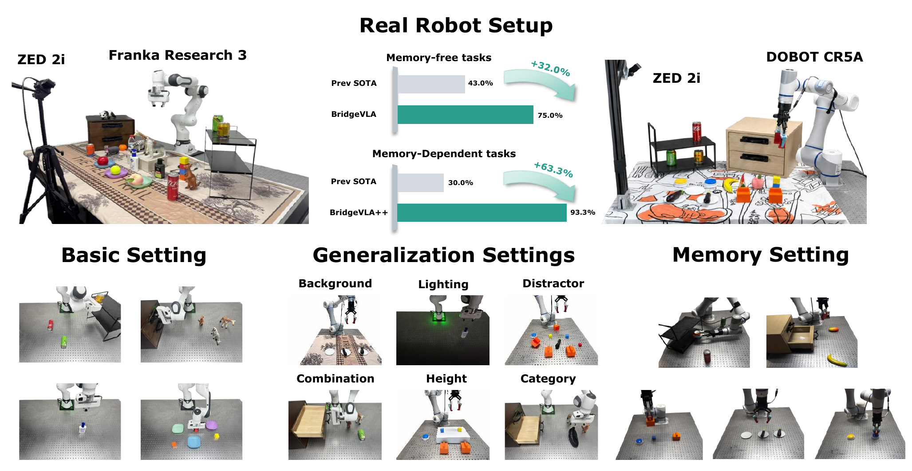

**Caption:** Real-robot setup. Franka Research 3 evaluates data-efficient general manipulation and six generalization settings; Dobot CR5A evaluates memory-dependent and memory-free tasks. Both use a static ZED 2i RGB-D camera.

**Caption[CN]:** 真实机器人设置。Franka Research 3 测试数据高效的一般操作与六类泛化；Dobot CR5A 同时测试记忆依赖和无记忆任务。两个平台均使用静态 ZED 2i RGB-D 相机。

> <strong>Para. 1:</strong> On Franka Research 3, BridgeVLA trains one multi-task model on 13 tasks with ten demonstrations each and compares with SpatialVLA, $\pi_{0.5}$, ACT, and RVT-2. Every method is tested for ten trials per task under manually reproduced scene configurations. Most baselines fail in the low-data regime; RVT-2 and BridgeVLA, which explicitly exploit 3D structure, remain strong.

> <strong>Para. 1[CN]:</strong> 在 Franka Research 3 上，BridgeVLA 对 13 个任务、每任务十条示范联合训练一个多任务模型，并与 SpatialVLA、$\pi_{0.5}$、ACT 和 RVT-2 比较。每种方法在人工复现的相同场景配置下、每任务测试十次。多数基线在低数据设置中失败；显式利用三维结构的 RVT-2 与 BridgeVLA 仍然较强。

### Table IV. Franka basic-setting results

**Caption:** Average success over 13 real-robot tasks, ten trials per task. All methods use ten demonstrations except the marked reference rows.

**Caption[CN]:** 13 项真实机器人任务的平均成功率，每任务十次试验。除标注的参考行外，所有方法均用十条示范。

| Method | Demos/task | Avg. SR (%) |
|---|---:|---:|
| SpatialVLA | 50 | 28.5 |
| SpatialVLA | 10 | 3.1 |
| $\pi_{0.5}$ | 10 | 20.0 |
| ACT | 10 | 21.5 |
| RVT-2 | 10 | 90.0 |
| BridgeVLA | 3 | 95.4 |
| **BridgeVLA** | **10** | **96.9** |

> <strong>Para. 2:</strong> BridgeVLA reaches 96.9% with ten demonstrations and 95.4% with only three. Although SpatialVLA uses 3D information, even 50 demonstrations yield 28.5%, showing that 3D input alone is not sufficient; interface alignment matters. Across Basic, Distractor, Lighting, Background, Height, Combination, and Category, BridgeVLA improves over RVT-2 by 32 points on average.

> <strong>Para. 2[CN]:</strong> BridgeVLA 用十条示范达到 96.9%，仅三条示范仍为 95.4%。SpatialVLA 虽然使用三维信息，但即使 50 条示范也只有 28.5%，说明“三维输入”本身并不充分，接口对齐才是关键。跨 Basic、Distractor、Lighting、Background、Height、Combination 和 Category 七种设置，BridgeVLA 平均领先 RVT-2 32 点。

### Figure 5. Franka generalization results

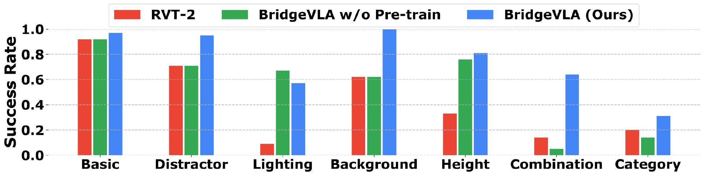

**Caption:** Average success on 13 Franka tasks under the basic and six generalization settings. The no-pre-training variant isolates the transfer from language-conditioned 2D heatmap grounding.

**Caption[CN]:** 13 项 Franka 任务在基础设置和六类泛化设置下的平均成功率。去掉预训练的变体用于隔离语言条件二维热图定位所带来的迁移。

> <strong>Para. 3:</strong> On Dobot CR5A, three tasks require episodic memory—Cover Blocks, Press Button, and Swap Eggplant—while Put in Drawer and Put on Shelf are memory-free controls. Seven language instructions each have ten demonstrations. Evaluation covers Basic, Distractor, Background, Height, and Lighting, with ten trials per instruction and setting.

> <strong>Para. 3[CN]:</strong> 在 Dobot CR5A 上，Cover Blocks、Press Button 和 Swap Eggplant 三项任务需要回合记忆，Put in Drawer 与 Put on Shelf 则作为无记忆对照。七条语言指令各有十条示范；评估覆盖 Basic、Distractor、Background、Height 与 Lighting，每指令每设置十次试验。

### Table V. Dobot basic-setting results

**Caption:** Per-task success rates on the Dobot platform. Drawer and shelf values average two target-height instructions.

**Caption[CN]:** Dobot 平台逐任务成功率。抽屉和架子任务分别对两个目标高度指令取平均。

| Method | Memory | Cover Blocks | Press Button | Swap Eggplant | Put in Drawer | Put on Shelf |
|---|---|---:|---:|---:|---:|---:|
| SAM2Act+ | yes | 20.0 | 0.0 | 70.0 | 60.0 | 20.0 |
| BridgeVLA | no | 0.0 | 0.0 | 60.0 | 100.0 | 90.0 |
| **BridgeVLA++** | **yes** | **100.0** | **100.0** | **80.0** | **100.0** | **100.0** |

### Table VI. Dobot generalization across all settings

**Caption:** Mean success for memory-dependent and memory-free task groups. “Avg.” averages the four disturbance settings, excluding Basic.

**Caption[CN]:** 记忆依赖和无记忆任务组的平均成功率。“Avg.” 对四种扰动设置取平均，不含 Basic。

| Group | Method | Basic | Distractor | Background | Height | Lighting | Disturbance avg. |
|---|---|---:|---:|---:|---:|---:|---:|
| Memory-dependent | SAM2Act+ | 30.0 | 0.0 | 0.0 | 0.0 | 3.3 | 0.8 |
| Memory-dependent | BridgeVLA | 20.0 | 20.0 | 23.3 | 6.7 | 13.3 | 15.8 |
| Memory-dependent | **BridgeVLA++** | **93.3** | **73.3** | **86.7** | **76.7** | **76.7** | **78.3** |
| Memory-free | SAM2Act+ | 40.0 | 0.0 | 0.0 | 0.0 | 7.5 | 1.9 |
| Memory-free | BridgeVLA | 95.0 | 57.5 | 72.5 | 67.5 | 67.5 | 66.3 |
| Memory-free | **BridgeVLA++** | **100.0** | **70.0** | **100.0** | **82.5** | **75.0** | **81.9** |

> <strong>Para. 4:</strong> In Basic memory-dependent tasks, BridgeVLA++ reaches 93.3%, versus 30.0% for SAM2Act+ and 20.0% for BridgeVLA. SAM2Act+ stores every step but retrieves a fixed temporal window, so near-duplicate frames can displace critical early evidence. BridgeVLA++ uses anchor, neighboring, and selected milestone memories. It also matches or exceeds BridgeVLA on memory-free tasks, suggesting that the extension is additive under these protocols.

> <strong>Para. 4[CN]:</strong> 在 Basic 记忆依赖任务中，BridgeVLA++ 达到 93.3%，SAM2Act+ 为 30.0%，BridgeVLA 为 20.0%。SAM2Act+ 保存每一步却只检索固定时间窗口，近重复帧可能把关键早期证据挤出；BridgeVLA++ 则组合锚点、邻近帧与选择后的里程碑记忆。它在无记忆任务上也持平或超过 BridgeVLA，说明在当前协议下记忆扩展是加性的。

### F. Ablation Studies

> <strong>Para. 1:</strong> Replacing the 309M-parameter convex heatmap decoder with a parameter-matched 303M Transformer direct-position regressor drops RLBench from 90.5% to 31.4%, despite requiring batch size 192 instead of 64. Dense supervision, 3D-to-2D spatial priors, and input–output structural alignment jointly explain the advantage.

> <strong>Para. 1[CN]:</strong> 用参数量匹配的 303M Transformer 直接位置回归器替换 309M 凸热图解码器，会把 RLBench 从 90.5% 降到 31.4%，且前者还需要 192 而非 64 的 batch size。密集监督、3D 到 2D 的空间先验以及输入—输出结构对齐共同解释了热图优势。

> <strong>Para. 2:</strong> Adding per-pixel 3D positions through a 3D convolutional module lowers success from 90.5% to 56.2%. Although geometrically richer, it shifts image features away from the VLM pre-training distribution. Removing 2D heatmap pre-training particularly damages language-related Combination and Category generalization, showing that a handful of robot trajectories cannot install object grounding by itself.

> <strong>Para. 2[CN]:</strong> 通过三维卷积模块加入逐像素三维位置，会把成功率从 90.5% 降到 56.2%。这种输入几何更丰富，却让图像特征偏离 VLM 预训练分布。去掉二维热图预训练尤其损害语言相关的 Combination 与 Category 泛化，说明少量机器人轨迹本身无法学出目标定位能力。

> <strong>Para. 3:</strong> Continuous 6D rotation improves 90.5 versus 88.2 for discretized Euler bins and avoids gimbal-lock discontinuities. Removing spatial memory lowers BridgeVLA++ from 93.7 to 92.0 on RLBench and hurts occlusion-heavy Sort Shape from 72.0 to 60.8, but barely changes RMBench. Removing temporal memory collapses RMBench from 96.0 to 21.3, close to the memory-free 18.9.

> <strong>Para. 3[CN]:</strong> 连续 6D 旋转相对离散 Euler bin 把成功率从 88.2 提高到 90.5，并避免万向节锁导致的不连续。移除空间记忆会把 RLBench 从 93.7 降到 92.0，并让遮挡严重的 Sort Shape 从 72.0 降到 60.8，但对 RMBench 几乎无影响。移除时间记忆则让 RMBench 从 96.0 崩到 21.3，接近无记忆模型的 18.9。

## VI. Conclusion and Future Work

> <strong>Para. 1:</strong> BridgeVLA aligns 3D observations, 2D orthographic images, 2D heatmap actions, and object-grounding pre-training. BridgeVLA++ adds temporal memory for deciding what comes next and spatial re-rendering for deciding where to act. Simulation and real-world results indicate that memory can be added without losing the base model's sample efficiency and generalization under the tested conditions.

> <strong>Para. 1[CN]:</strong> BridgeVLA 对齐三维观测、二维正交图像、二维热图动作以及目标定位预训练。BridgeVLA++ 再加入时间记忆以决定下一步做什么，加入空间重渲染以决定在哪里操作。仿真和真实实验表明，在测试条件内，记忆可以在不损害基础模型样本效率和泛化能力的前提下加入。

> <strong>Para. 2:</strong> Future work includes broader pre-training from semantic segmentation and keypoints, more expressive action decoders, self-supervised sub-goal selection instead of annotation-dependent gates, and cross-episode or lifelong memory that accumulates manipulation experience over longer operational horizons.

> <strong>Para. 2[CN]:</strong> 未来方向包括：用语义分割与关键点扩展预训练、采用更有表达力的动作解码器、用自监督子目标选择替代依赖标注的门控器，以及发展跨回合或终身记忆，使机器人在更长运行周期内持续积累操作经验。

## References

> <strong>Para. 1:</strong> The reference list is retained in its original searchable bibliographic form in the author source file `.pipeline/arxiv_src/main.bib`. The paper cites the main VLA line (RT-1/RT-2, OpenVLA, $\pi_0/\pi_{0.5}$), 3D policies (PerAct, Act3D, RVT/RVT-2, 3D Diffuser Actor, 3D-LOTUS), 3D VLAs (3D-VLA, Lift3D, FP3, PointVLA, SpatialVLA, OG-VLA), and memory-aware manipulation methods (SAM2Act+, RMBench/Mem-0, MemoryWAM, LingBot-VA, RoboMemory, MemoryVLA, MemWorld).

> <strong>Para. 1[CN]:</strong> 参考文献以原始、可搜索的书目信息保留在作者源码 `.pipeline/arxiv_src/main.bib` 中。论文覆盖主要 VLA 路线（RT-1/RT-2、OpenVLA、$\pi_0/\pi_{0.5}$）、三维策略（PerAct、Act3D、RVT/RVT-2、3D Diffuser Actor、3D-LOTUS）、3D VLA（3D-VLA、Lift3D、FP3、PointVLA、SpatialVLA、OG-VLA）以及记忆感知操作方法（SAM2Act+、RMBench/Mem-0、MemoryWAM、LingBot-VA、RoboMemory、MemoryVLA、MemWorld）。本读本不逐条翻译书目，以避免破坏作者、题名、期刊和链接的检索性。

## Appendix

### A. Network and Memory Architecture

> <strong>Para. 1:</strong> Each memory-injection block stacks $L=2$ layers with eight attention heads of dimension 128, feed-forward expansion factor 2, and 2048-dimensional backbone patch tokens. Temporal memory uses one block for anchor views and one for dynamic history; spatial memory uses a third. Anchor attention concatenates three views to track changes across viewpoints, while the history and spatial blocks restrict attention to corresponding views.

> <strong>Para. 1[CN]:</strong> 每个记忆注入 block 堆叠 $L=2$ 层，每层使用 8 个维度为 128 的注意力头、2 倍前馈扩展，并在骨干 2048 维 patch token 上运行。时间记忆分别用一个 block 处理锚点、一个处理动态历史；空间记忆使用第三个 block。锚点注意力拼接三个视图以跨视角追踪场景变化，历史与空间 block 则只在对应视图间做注意力。

### B. Pre-Training

> <strong>Para. 1:</strong> All runs warm-start from one 2D-heatmap pre-training run on RoboPoint 120K. Memory blocks and the sub-goal gate are not pre-trained; they start from scratch during manipulation fine-tuning. When memory input is empty, injection blocks gate masked residuals to zero so that the exact memory-free forward is recovered.

> <strong>Para. 1[CN]:</strong> 所有实验都从同一次 RoboPoint 120K 二维热图预训练初始化。记忆 block 和子目标门控器不参与预训练，而是在操作微调中从头训练。当某阶段没有记忆输入时，注入 block 把掩码记忆的残差贡献门控为零，从而精确恢复无记忆前向路径。

### C. Fine-Tuning Details

### Table VII. Per-benchmark fine-tuning configuration

**Caption:** Two-phase fine-tuning freezes PaliGemma first, trains newly added modules, then unfreezes the backbone except SigLIP and language embeddings. Warmup restarts at each phase.

**Caption[CN]:** 两阶段微调先冻结 PaliGemma、训练新增模块，再解冻骨干；SigLIP 与语言嵌入始终冻结。每一阶段重新进行 warmup。

| Setting | RLBench | COLOSSEUM | GemBench | RMBench | MemoryBench |
|---|---:|---:|---:|---:|---:|
| Epochs / freeze epochs | 130 / 4 | 200 / 4 | 200 / 2 | ~320 per task / 5 | 160 / 20 |
| Warmup steps / phase | 1,500 | 1,500 | 1,000 | 1,000 | 1,000 |
| Learning rate | $8\times10^{-5}$ | $8\times10^{-5}$ | $5\times10^{-5}$ | $5\times10^{-5}$ | $5\times10^{-5}$ |
| Weight decay | $10^{-2}$ | $10^{-2}$ | $10^{-3}$ | $10^{-3}$ | $10^{-3}$ |
| Batch/GPU | 4 | 4 | 4 | 4 | 4 |
| GPUs | 32 | 32 | 32 | 8 | 8 |
| SE(3) augmentation, translation / yaw | 0.125 / 45° | 0.125 / 45° | 0.125 / 45° | 0.03 / 30° | 0.125 / 45° |
| Stage-2 zoom jitter | 0.05 | 0.05 | 0.05 | 0.005 | 0.05 |
| Slot budget $K$ | 2 | 2 | 2 | 12 | 2 |
| Neighboring frames $n$ | 2 | 2 | 2 | 2 | 2 |
| Gate $\lambda$/positive weight/threshold | — | — | — | 1.0 / 5.5 / 0.5 | — |
| Demonstrations/task | 100 | 100 | 100/variation | 50 | 100 |
| Input cameras | 4 at $128^2$ | 4 at $128^2$ | 4 at $256^2$ | 4 at $224^2$ | 4 at $128^2$ |
| Orthographic window scale | 2.0 | 2.0 | 2.0 | 0.8 | 2.0 |

> <strong>Para. 1:</strong> Phase one freezes PaliGemma and trains convex upsampling, action heads, memory blocks, and the gate. Phase two unfreezes the Gemma backbone but keeps SigLIP and language-token embeddings frozen. The optimizer is reinitialized at the boundary. AdamW uses $(\beta_1,\beta_2)=(0.9,0.95)$.

> <strong>Para. 1[CN]:</strong> 第一阶段冻结 PaliGemma，只训练凸上采样、动作头、记忆 block 与门控器。第二阶段解冻 Gemma 骨干，但 SigLIP 和语言 token 嵌入始终冻结；阶段切换时重新初始化优化器。AdamW 使用 $(\beta_1,\beta_2)=(0.9,0.95)$。

> <strong>Para. 2:</strong> With memory enabled, random in-plane image augmentation is disabled and the workspace cube uses fixed scene bounds, because either change would break pixel correspondence between current and cached views. Joint SE(3) augmentation is instead applied consistently to current, anchor, and history point clouds.

> <strong>Para. 2[CN]:</strong> 启用记忆时关闭随机平面内图像增强，并用固定场景边界而非逐帧点云均值确定工作区立方体，因为这两种变化都会破坏当前视图与缓存视图的像素对应。替代方案是对当前、锚点与历史点云一致地施加联合 SE(3) 增强。

> <strong>Para. 3:</strong> RMBench uses $K=12$: two neighboring frames and up to ten sub-goal slots. A gated frame enters a sub-goal slot only after it leaves the two-frame neighboring window; the oldest milestone is evicted when full. Other benchmarks lack sub-goal labels, so the gate is disabled and only the initial anchor plus two neighboring frames are used.

> <strong>Para. 3[CN]:</strong> RMBench 使用 $K=12$：两个邻近帧槽位加最多十个子目标槽位。被门控选中的帧只有在离开两帧邻近窗口后才进入子目标槽位；槽位满时淘汰最旧里程碑。其他基准没有子目标标注，因此关闭门控器，只使用初始锚点和两个邻近帧。

> <strong>Para. 4:</strong> All point clouds are rendered into three $224\times224$ orthographic views regardless of sensor resolution. Discretized rotation uses per-axis Euler angles in 5° bins; direct action regression replaces a 309M convex decoder with a 303M Transformer under MSE; the 3D-input ablation adds per-pixel positions via 3D convolution.

> <strong>Para. 4[CN]:</strong> 无论传感器分辨率如何，所有点云都渲染成三个 $224\times224$ 正交视图。离散旋转变体使用每轴 5° 的 Euler bin；直接动作回归用 303M Transformer 与 MSE 替换 309M 凸解码器；三维输入变体则经三维卷积加入逐像素位置。

### D. Training Data Preparation

> <strong>Para. 1:</strong> Single-arm keyframes follow PerAct: stationary robot steps, gripper changes, and final episode steps are retained. RMBench uses a bimanual variant that retains the last frame of every segment where both arms are still. Sub-goal positives are the final keyframes of language segments; repeated identical instructions remain separate. Positives comprise 9–15% of keyframes and use positive-class weight 5.5.

> <strong>Para. 1[CN]:</strong> 单臂关键帧沿用 PerAct：机器人静止、夹爪状态变化或 episode 最后一步时保留。RMBench 使用双臂变体，保留两条手臂都静止的每个分段末帧。子目标正样本是语言分段的最后关键帧；重复的同文本指令仍作为不同分段处理。正样本占关键帧的 9–15%，正类权重为 5.5。

### E. Evaluation Protocol

> <strong>Para. 1:</strong> RLBench reports five evaluation runs with 25 episodes per task, mostly under 25 keyframe steps. COLOSSEUM uses 25 trials per task and condition and reports three test repetitions. GemBench uses five seeds and 20 trials per task variation. RMBench reports one 100-episode evaluation per task after selecting the best checkpoint from one independently trained model per task. MemoryBench reports five seeds under a 25-step budget.

> <strong>Para. 1[CN]:</strong> RLBench 报告五次评估、每任务 25 个 episode，多数任务限 25 个关键帧步。COLOSSEUM 每任务每条件 25 次试验并报告三次测试重复。GemBench 使用五个随机种子、每任务变化 20 次试验。RMBench 每任务单独训练模型、选择最好 checkpoint，再报告一次 100-episode 评估。MemoryBench 在 25 步上限下报告五个种子。

> <strong>Para. 2:</strong> Franka trains one joint model on 13 tasks, ten demonstrations each, and evaluates ten trials per task; a low-data variant uses three demonstrations. Dobot uses seven instructions and 70 total demonstrations, trains one joint model per method, and tests every instruction ten times in five settings. The comparison includes memory-free BridgeVLA and memory-based SAM2Act+ to separate backbone effects from memory effects.

> <strong>Para. 2[CN]:</strong> Franka 对 13 个任务、每任务十条示范联合训练一个模型，并每任务评估十次；低数据变体只用三条示范。Dobot 使用七条指令、共 70 条示范，每种方法训练一个联合模型，并在五种设置下每指令测试十次。对比同时包含无记忆 BridgeVLA 与有记忆 SAM2Act+，用于区分骨干效应和记忆效应。

### F. Computational Cost

> <strong>Para. 1:</strong> Heatmap pre-training takes about two hours on eight A100 GPUs. Large simulation fine-tuning runs use 32 H20 GPUs; RMBench uses eight H20s per task; MemoryBench uses eight A100s; real-world fine-tuning takes about 1.5 hours on eight A100s. Evaluation uses one GPU.

> <strong>Para. 1[CN]:</strong> 热图预训练在 8 张 A100 上约需 2 小时。大型仿真微调使用 32 张 H20；RMBench 每任务用 8 张 H20；MemoryBench 用 8 张 A100；真实机器人微调在 8 张 A100 上约需 1.5 小时。评估均使用单张 GPU。

> <strong>Para. 2:</strong> Each injection block has 83.95M parameters and the sub-goal gate 17.91M. A cached bf16 frame occupies 3.0 MiB; $K=12$ plus the anchor uses 39 MiB. Cache and cross-attention scale linearly with $K$, but backbone forward count does not: two for BridgeVLA, three for single-arm BridgeVLA++, and five for dual-arm deployment.

> <strong>Para. 2[CN]:</strong> 每个注入 block 有 83.95M 参数，子目标门控器有 17.91M。每个 bf16 缓存帧占 3.0 MiB；$K=12$ 再加锚点共占 39 MiB。缓存与交叉注意力成本随 $K$ 线性增长，但骨干前向次数不变：BridgeVLA 两次、单臂 BridgeVLA++ 三次、双臂部署五次。

### G–J. Complete Simulation Results

> <strong>Para. 1:</strong> Per-task COLOSSEUM matrices show BridgeVLA leading prior methods in 13 of 14 aggregate conditions and BridgeVLA++ improving the hardest combined and distractor settings. Per-task GemBench matrices show that L4 remains broadly unsolved; BridgeVLA++'s 8.2% average is concentrated on PushButtons4. MemoryBench's near-saturated average reflects only a handful of failures across seeds.

> <strong>Para. 1[CN]:</strong> COLOSSEUM 逐任务矩阵显示 BridgeVLA 在 14 个汇总条件中的 13 个领先既有方法，而 BridgeVLA++ 改善最难的联合扰动与干扰物设置。GemBench 逐任务矩阵表明 L4 整体仍未解决；BridgeVLA++ 的 8.2% 平均值主要集中在 PushButtons4。MemoryBench 接近饱和的均值只对应跨随机种子的少量失败。

### Table VIII. Per-task BridgeVLA results on COLOSSEUM

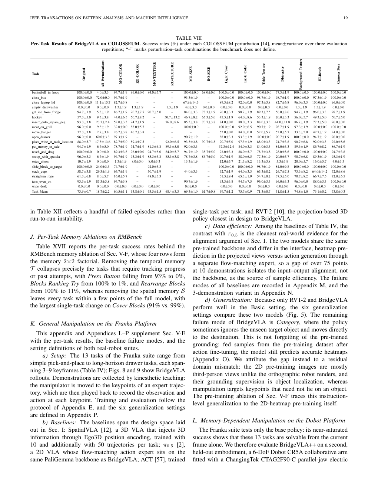

**Caption:** Full per-task BridgeVLA success-rate matrix across COLOSSEUM perturbations, mean ± variance over three evaluation repetitions.

**Caption[CN]:** BridgeVLA 在 COLOSSEUM 各扰动下的完整逐任务成功率矩阵，报告三次评估重复的均值 ± 方差。

### Table IX. Per-task BridgeVLA++ results on COLOSSEUM

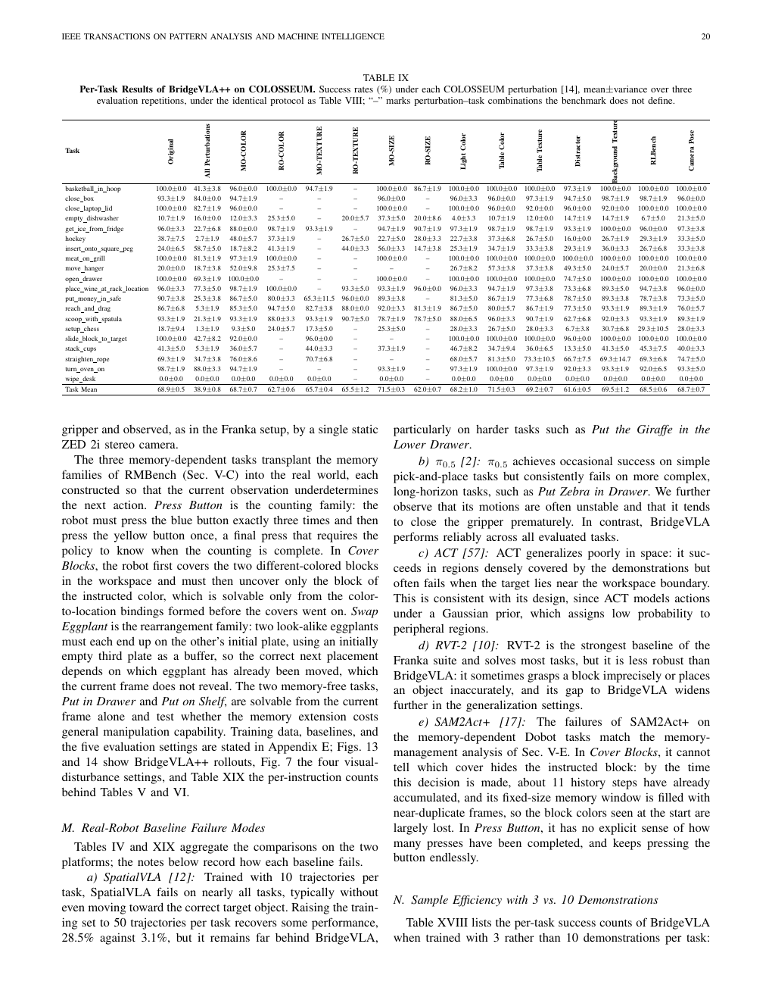

**Caption:** Full per-task BridgeVLA++ matrix under the identical COLOSSEUM protocol.

**Caption[CN]:** 在相同 COLOSSEUM 协议下，BridgeVLA++ 的完整逐任务矩阵。

### Table X. Per-task RVT-2 results; Tables XI–XII summaries

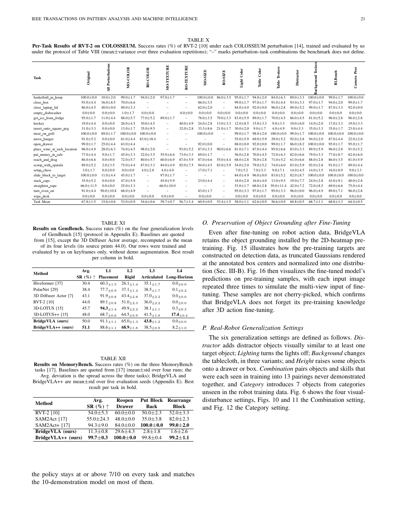

**Caption:** Rendered source page containing the full RVT-2 COLOSSEUM matrix and the GemBench and MemoryBench summary tables; searchable summary values are transcribed above.

**Caption[CN]:** 包含 RVT-2 的 COLOSSEUM 完整矩阵以及 GemBench、MemoryBench 汇总表的源页渲染；可搜索的汇总数值已在上文转写。

### Tables XIII–XIV. GemBench L1 and L2 per-task results

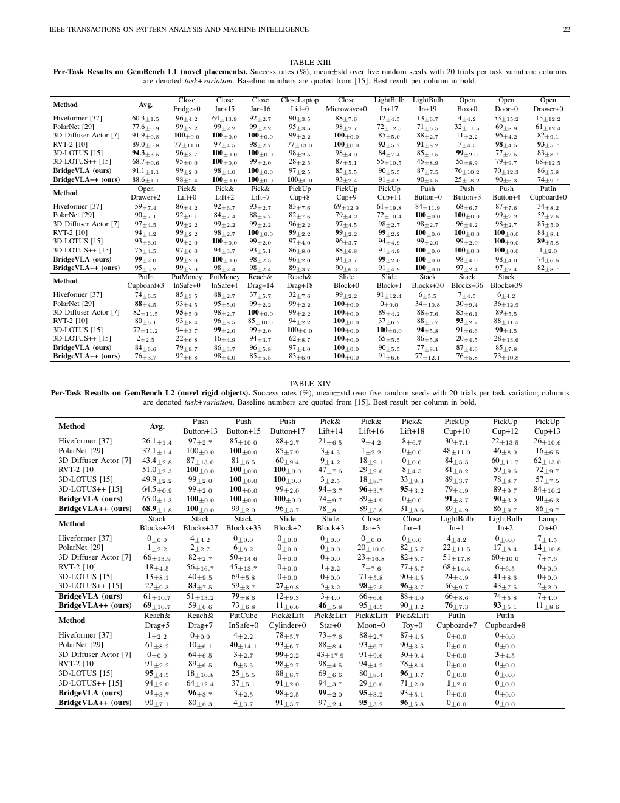

**Caption:** Full per-task matrices for novel placements (L1) and novel rigid objects (L2), averaged over five seeds with 20 trials per variation.

**Caption[CN]:** 新位置（L1）与新刚体（L2）的完整逐任务矩阵；每个变化评估 20 次，并对五个种子取平均。

### Tables XV–XVI. GemBench L3 and L4 per-task results

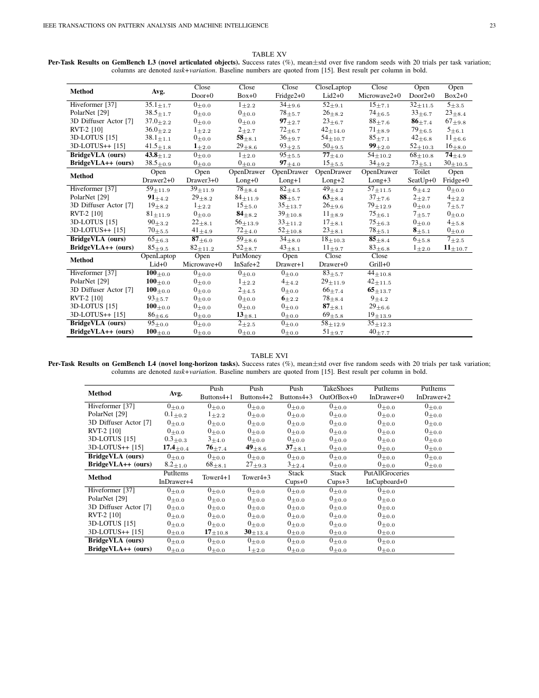

**Caption:** Full per-task matrices for novel articulated objects (L3) and novel long-horizon compositions (L4).

**Caption[CN]:** 新关节物体（L3）与新长时程组合（L4）的完整逐任务矩阵。

### Table XVII. RMBench memory factorial

**Caption:** Per-task success for full memory, spatial-only, temporal-only, and no-memory variants.

**Caption[CN]:** 完整记忆、仅空间、仅时间与无记忆变体的逐任务成功率。

| Variant | $M(1)$ avg. | $M(n)$ avg. | Overall |
|---|---:|---:|---:|
| Full BridgeVLA++ | 95.2 | 97.0 | 96.0 |
| No spatial memory | 96.2 | 94.5 | 95.4 |
| No temporal memory | 27.0 | 14.3 | 21.3 |
| BridgeVLA, no memory | 19.0 | 18.8 | 18.9 |

### Tables XVIII–XIX. Real-robot low-data and per-instruction results

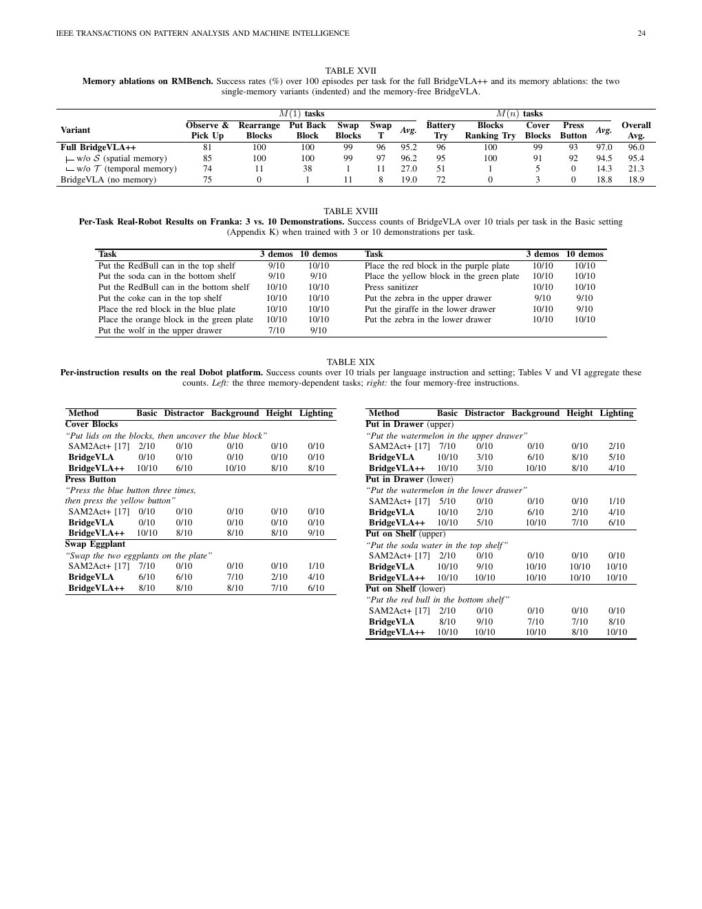

**Caption:** Source page containing the RMBench memory factorial, Franka 3-vs-10 demonstration counts, and all Dobot per-instruction counts. Franka stays at or above 7/10 on every task with three demonstrations; the exact seven Dobot instruction-by-setting counts remain visible in the rendered table.

**Caption[CN]:** 源页包含 RMBench 记忆因子表、Franka 三条对十条示范成功次数，以及 Dobot 全部逐指令次数。Franka 在仅三条示范时每个任务仍不低于 7/10；七条 Dobot 指令在各设置下的精确次数保留在渲染表中。

### K. General Manipulation on Franka

> <strong>Para. 1:</strong> The 13 Franka tasks span three to nine keyframes and use kinesthetic teaching. SpatialVLA fails to approach targets with ten trajectories and reaches only 28.5% with fifty. $\pi_{0.5}$ shares the same PaliGemma backbone as BridgeVLA yet differs in interface; its over-75-point gap at ten demonstrations is the cleanest evidence that alignment, rather than backbone identity, drives sample efficiency.

> <strong>Para. 1[CN]:</strong> 13 个 Franka 任务跨越 3–9 个关键帧，并通过动觉示教采集。SpatialVLA 用十条轨迹时几乎不接近正确目标，用五十条也只有 28.5%。$\pi_{0.5}$ 与 BridgeVLA 共享 PaliGemma 骨干但接口不同；十条示范下超过 75 点的差距，是“对齐而非骨干身份驱动样本效率”的最干净证据。

> <strong>Para. 2:</strong> BridgeVLA's main real-world weakness is Category, where it may ignore an unseen target and move directly to the destination. Post-fine-tuning heatmaps show that pre-trained grounding is retained, so the authors attribute the failure to residual domain mismatch: third-person detection images differ from orthographic robot renders, and object localization differs from predicting manipulation keypoints that may lie off-object.

> <strong>Para. 2[CN]:</strong> BridgeVLA 的主要真实弱点是 Category：模型可能忽略未见目标物体而直接移动到目的地。微调后热图表明预训练定位能力仍被保留，因此作者把失败归因于残余域差异：第三人称检测图像不同于机器人正交渲染，而且目标定位也不同于预测可能位于物体之外的操作关键点。

### L. Memory-Dependent Manipulation on Dobot

> <strong>Para. 1:</strong> Press Button requires pressing blue exactly three times then yellow; Cover Blocks requires remembering the color-to-location binding before covers hide the blocks; Swap Eggplant requires tracking which look-alike object has already moved through a temporary plate. In each case, the current frame underdetermines the next action. The two memory-free tasks test whether memory damages ordinary manipulation.

> <strong>Para. 1[CN]:</strong> Press Button 要求恰好按蓝色按钮三次再按黄色；Cover Blocks 要求记住盖子遮挡前的颜色—位置绑定；Swap Eggplant 要求追踪两个外观相似物体中哪个已经经过临时盘移动。每种任务的当前帧都不足以确定下一动作。两项无记忆任务用于检验记忆是否损害普通操作。

### M. Real-Robot Baseline Failure Modes

> <strong>Para. 1:</strong> SpatialVLA usually does not move toward the target; $\pi_{0.5}$ produces unstable motions and premature gripper closure on long tasks; ACT works in demonstration-dense regions but fails near workspace boundaries; RVT-2 is strong but less precise under generalization; SAM2Act+ loses early evidence when its fixed window fills with near-duplicate steps and may press a button indefinitely.

> <strong>Para. 1[CN]:</strong> SpatialVLA 通常不会朝正确目标移动；$\pi_{0.5}$ 在长任务中动作不稳定且过早闭合夹爪；ACT 在示范密集区域有效，却在工作区边界失败；RVT-2 很强，但泛化条件下定位精度更弱；SAM2Act+ 的固定窗口会被近重复步骤填满并丢失早期证据，甚至可能无限重复按按钮。

### N–P. Sample Efficiency, Grounding Preservation, and Generalization Settings

> <strong>Para. 1:</strong> With three demonstrations, BridgeVLA matches the ten-demonstration model on most Franka tasks and never falls below 7/10. On held-out RoboPoint samples after action fine-tuning, predicted heatmaps remain accurate and the examples are not cherry-picked. Generalization settings add visually similar distractors, turn off lighting, change tablecloth backgrounds, raise objects, recombine seen objects and skills into unseen pairs, or introduce seven unseen-category objects.

> <strong>Para. 1[CN]:</strong> 只用三条示范时，BridgeVLA 在多数 Franka 任务上与十条示范模型持平，且没有任务低于 7/10。动作微调后在留出的 RoboPoint 样本上，预测热图仍然准确，且示例不是挑选出来的。泛化设置分别加入视觉相似干扰物、关闭照明、更换桌布背景、抬高物体、把已见物体和技能重组成未见配对，或引入七个训练未见类别物体。

### Figure 6. Franka disturbance settings

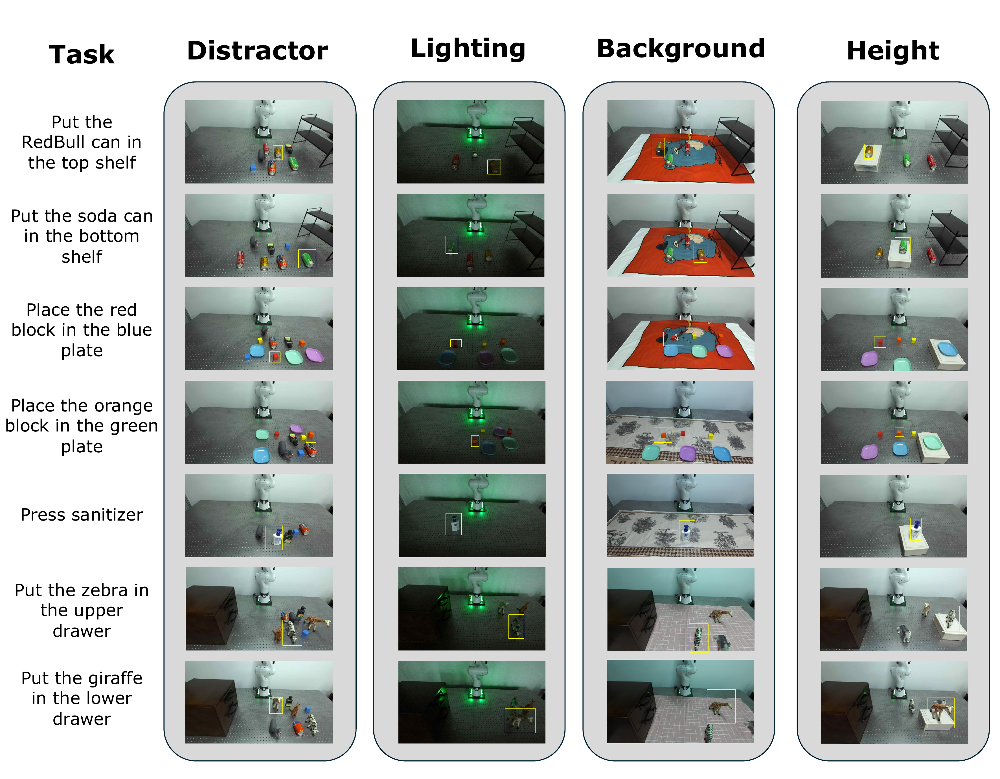

**Caption:** Distractor, Lighting, Background, and Height settings in the Franka real-robot suite.

**Caption[CN]:** Franka 真实机器人套件中的 Distractor、Lighting、Background 与 Height 设置。

### Figure 7. Dobot disturbance settings

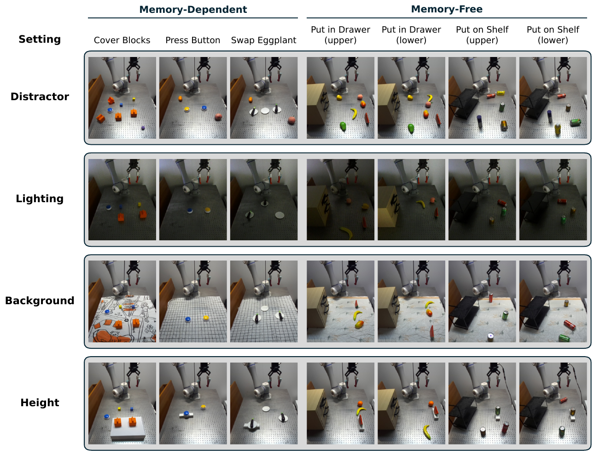

**Caption:** Initial scenes for every Dobot instruction under four visual disturbances; lighting images are gamma-darkened for display, while the policy receives raw frames.

**Caption[CN]:** 每条 Dobot 指令在四种视觉扰动下的初始场景；Lighting 图像仅为展示而做 gamma 压暗，策略接收原始帧。

### Figure 8. Franka rollouts I

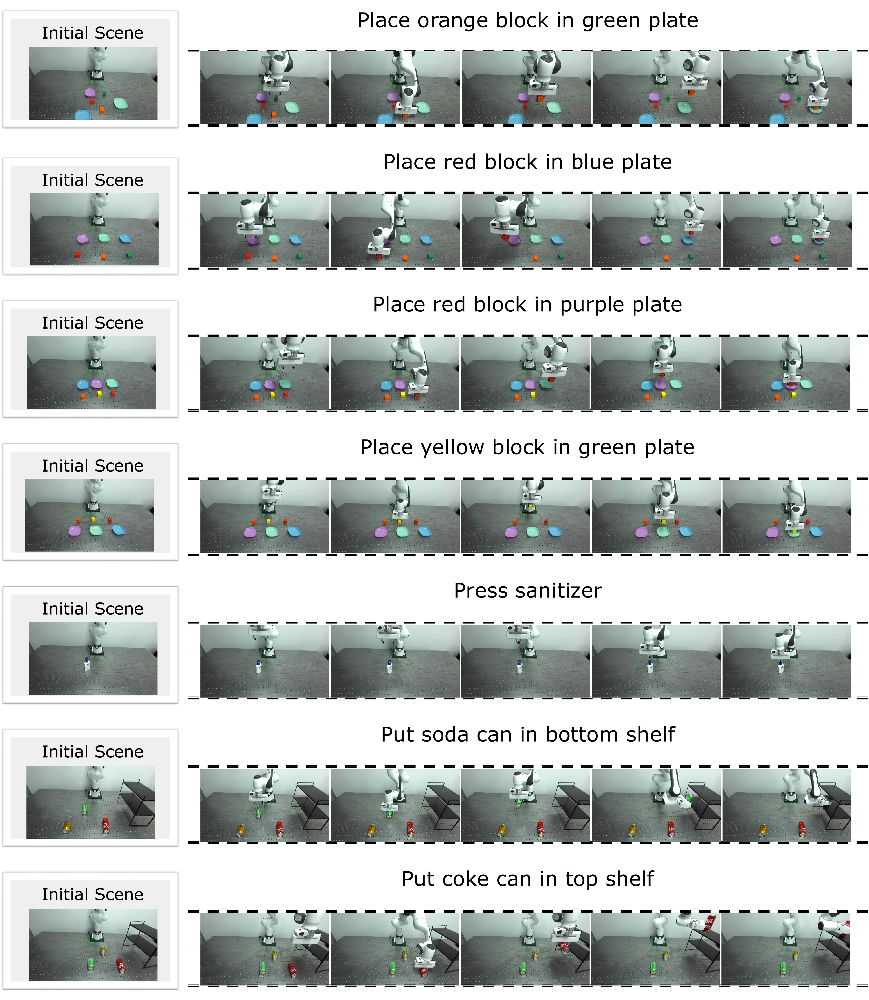

**Caption:** BridgeVLA rollouts on the first group of Franka tasks.

**Caption[CN]:** BridgeVLA 在第一组 Franka 任务上的执行轨迹。

### Figure 9. Franka rollouts II

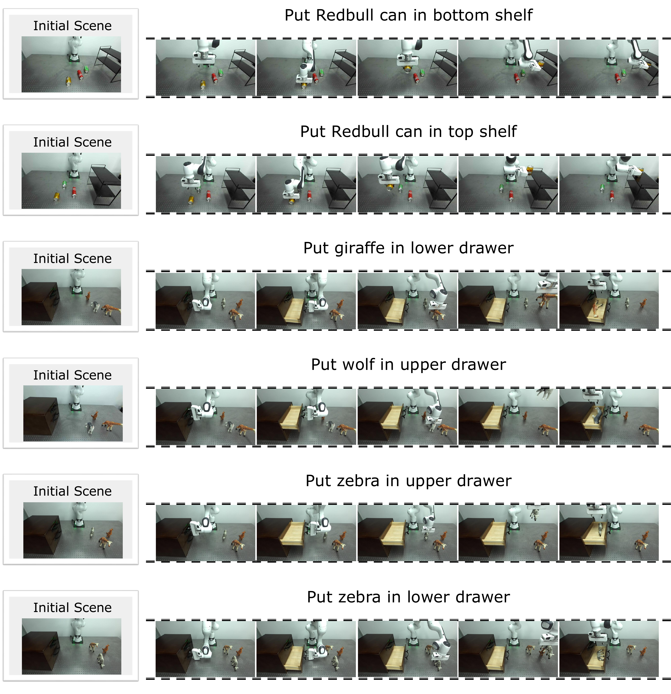

**Caption:** BridgeVLA rollouts on the second group of Franka tasks.

**Caption[CN]:** BridgeVLA 在第二组 Franka 任务上的执行轨迹。

### Figure 10. Combination setting I

**Caption:** Training sees each object and each skill, but not the shown object–skill combinations.

**Caption[CN]:** 训练中分别见过每个物体和每项技能，但没有见过图示的物体—技能组合。

### Figure 11. Combination setting II

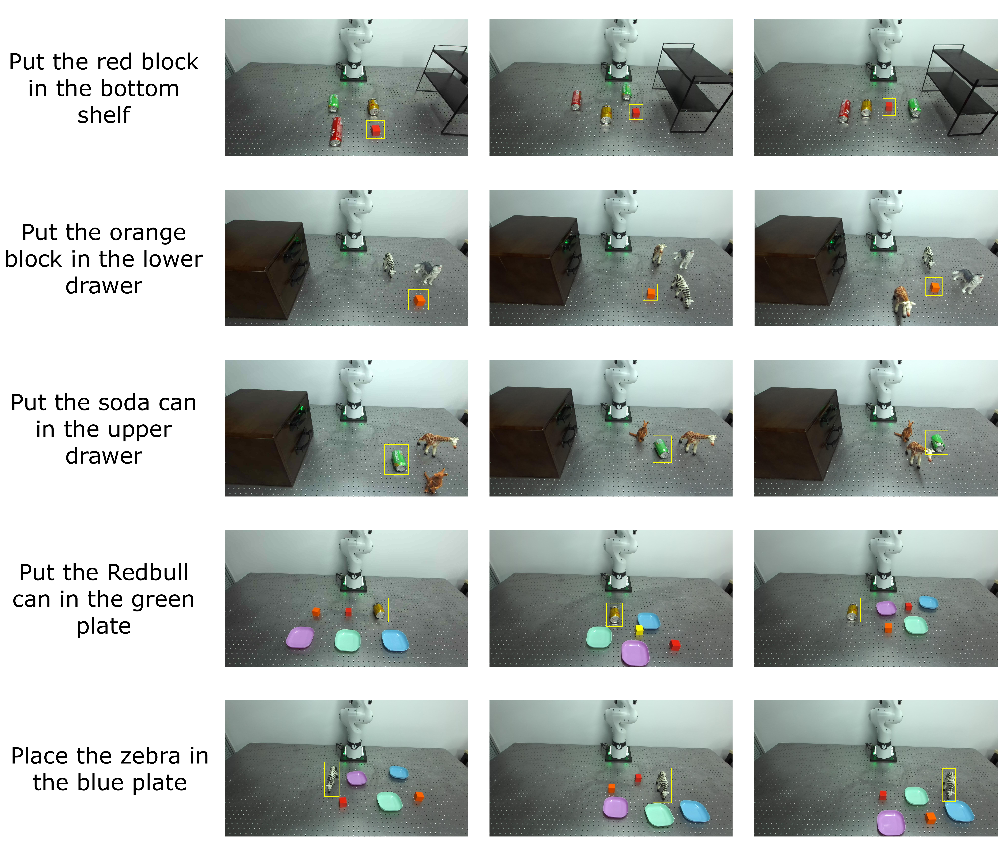

**Caption:** Additional unseen combinations assembled from individually seen objects and skills.

**Caption[CN]:** 由分别已见的物体和技能组成的更多未见组合。

### Figure 12. Category setting

**Caption:** Seven test objects come from categories unseen in robot-policy training.

**Caption[CN]:** 七个测试物体来自机器人策略训练中未见的类别。

### Figure 13. Dobot memory-dependent rollouts

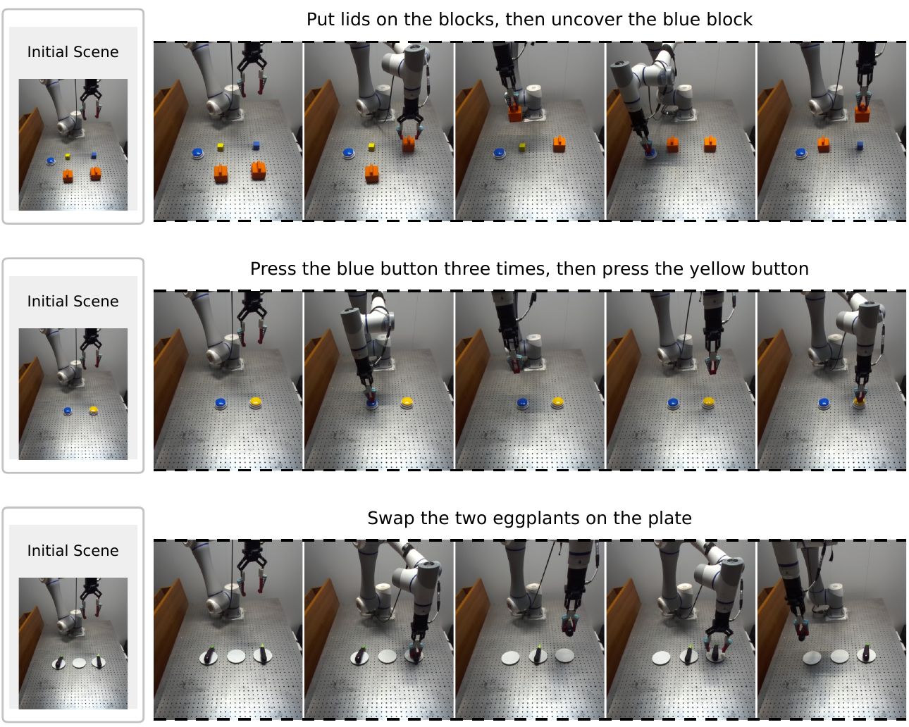

**Caption:** Successful BridgeVLA++ episodes for Cover Blocks, Press Button, and Swap Eggplant.

**Caption[CN]:** BridgeVLA++ 在 Cover Blocks、Press Button 与 Swap Eggplant 上的成功 episode。

### Figure 14. Dobot memory-free rollouts

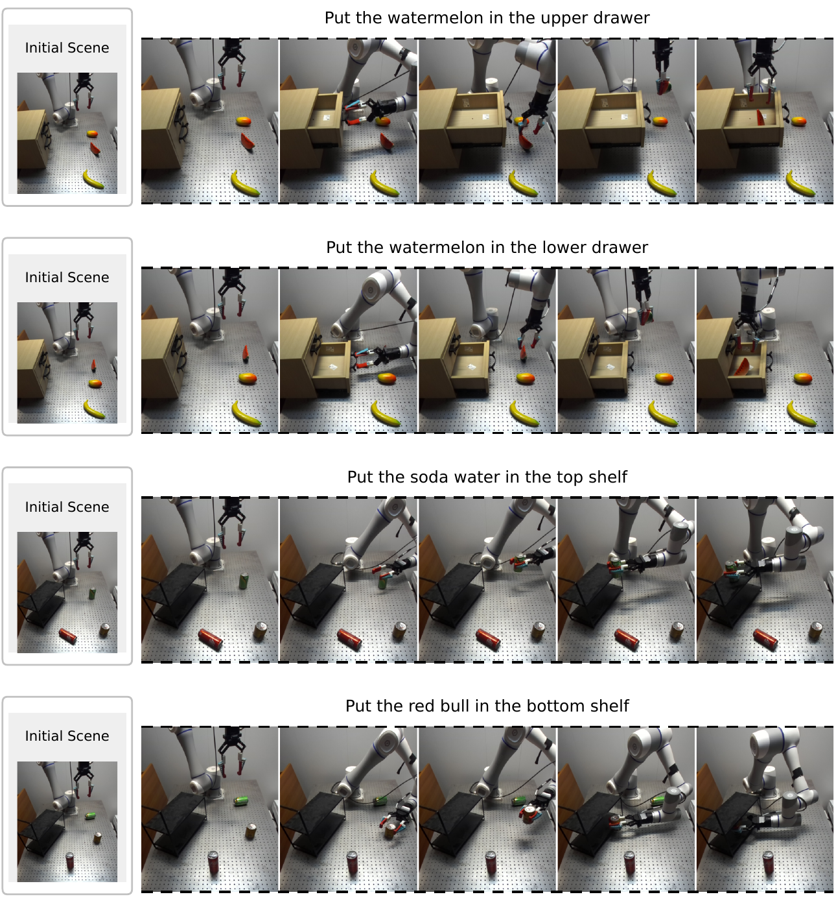

**Caption:** Successful BridgeVLA++ episodes for the four memory-free drawer and shelf instructions.

**Caption[CN]:** BridgeVLA++ 在四条无记忆抽屉与架子指令上的成功 episode。

### Figure 15. Ground-truth heatmap construction

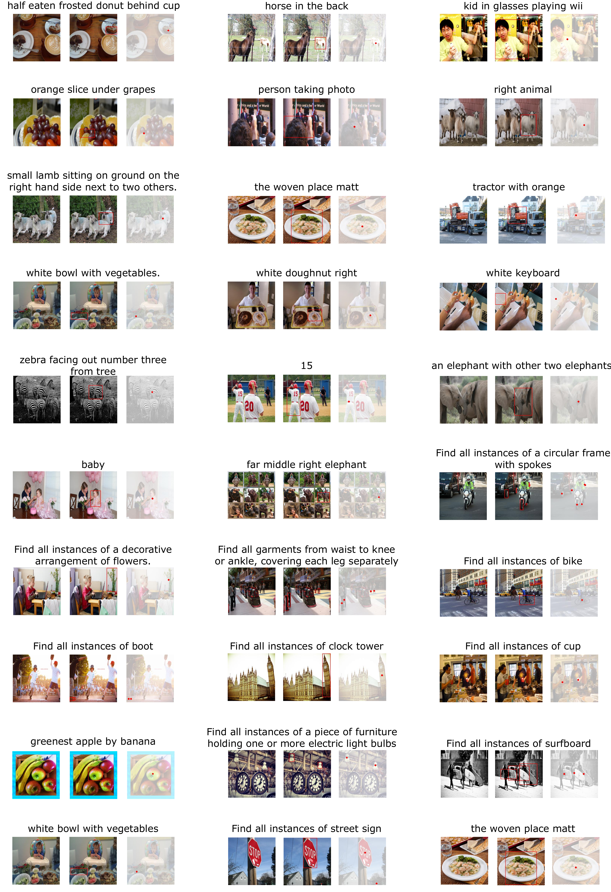

**Caption:** Original detection image, target bounding boxes, and normalized truncated-Gaussian heatmap for each pre-training sample.

**Caption[CN]:** 每条预训练样本的原始检测图像、目标边界框以及归一化截断高斯热图。

### Figure 16. Grounding after action fine-tuning

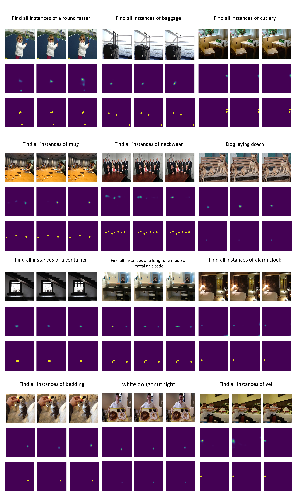

**Caption:** Non-cherry-picked pre-training samples after manipulation fine-tuning: repeated input images, predicted heatmaps, and ground truth.

**Caption[CN]:** 操作微调后的非挑选预训练样本：重复输入图像、预测热图与真值热图。

### Figure 17. RLBench tasks

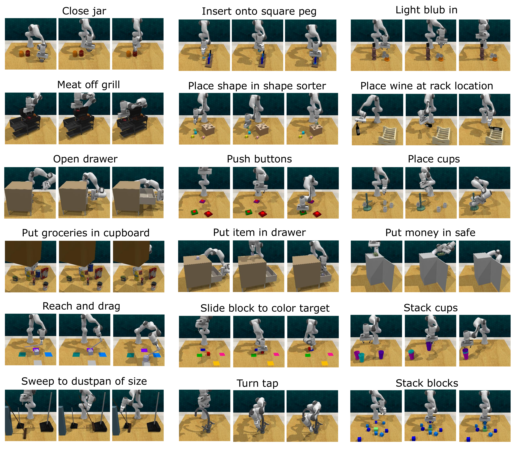

**Caption:** The 18 RLBench tasks used for general 3D manipulation evaluation.

**Caption[CN]:** 用于一般三维操作评估的 18 项 RLBench 任务。

### Figure 18. RMBench tasks

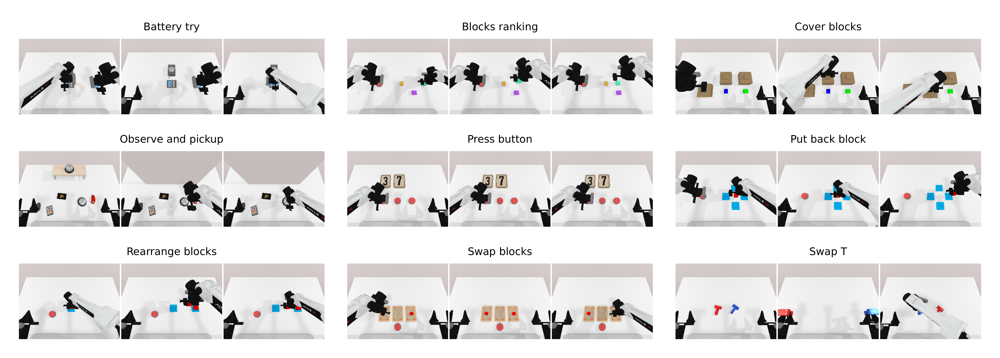

**Caption:** The nine dual-arm RMBench tasks, shown as temporal triplets across $M(1)$ and $M(n)$ regimes.

**Caption[CN]:** 九项双臂 RMBench 任务，以时间三帧展示短期 $M(1)$ 和长期 $M(n)$ 设置。

### Figure 19. COLOSSEUM perturbations

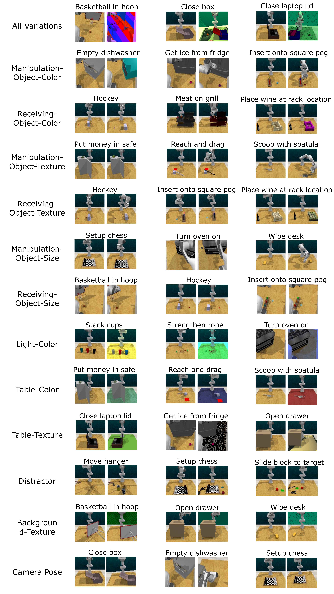

**Caption:** COLOSSEUM perturbation axes except the original-RLBench variation.

**Caption[CN]:** 除原始 RLBench 变化外的 COLOSSEUM 扰动轴。

### Figure 20. GemBench task suite

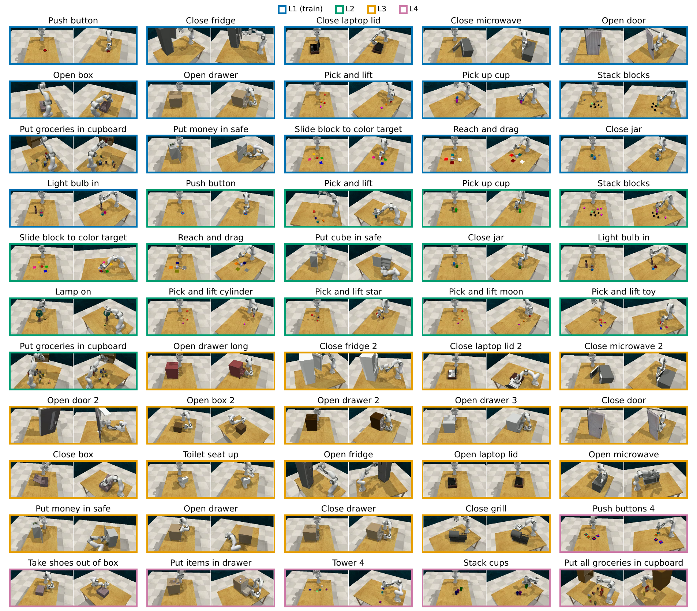

**Caption:** Representative initial and final frames. Border colors mark L1 placement, L2 rigid-object, L3 articulated-object, and L4 long-horizon generalization.

**Caption[CN]:** 代表性的初始帧与结束帧。边框颜色分别标记 L1 位置、L2 刚体、L3 关节物体和 L4 长时程泛化。

### Figure 21. MemoryBench tasks

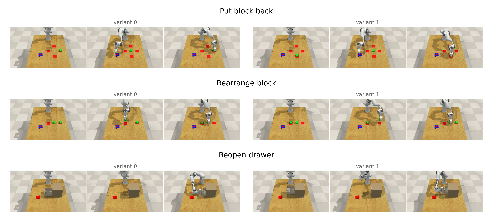

**Caption:** Two variants of each MemoryBench task; the robot's intervention erases visual evidence required by a later decision.

**Caption[CN]:** 每项 MemoryBench 任务的两个变体；机器人自身的操作会抹掉后续决策所需的视觉证据。

## Critical Reading Notes

- **The paper actually contains two contributions of different ages.** BridgeVLA's 2D input–output alignment and heatmap pre-training come from the NeurIPS 2025 work; the journal extension's new technical contribution is the coarse-stage temporal memory plus fine-stage spatial memory and its bimanual sharing.
- **The strongest causal evidence is not the SOTA table.** Heatmap decoding $90.5\rightarrow31.4$, 3D input $90.5\rightarrow56.2$, and temporal-memory ablation $96.0\rightarrow21.3$ on RMBench directly support the proposed mechanisms. Small gains such as spatial memory $93.7\rightarrow92.0$ are targeted rather than universal.
- **“Data efficient” is unusually well supported in the Franka protocol**, because BridgeVLA keeps 95.4% with three demonstrations and shares PaliGemma with the weak $\pi_{0.5}$ baseline. Still, only 13 tabletop tasks and ten evaluation trials per task are used, so uncertainty is coarse.
- **“Memory” is partly annotation dependent.** The adaptive sub-goal gate is supervised from language segment boundaries that exist in RMBench, and it is disabled on benchmarks without those labels. The full long-term memory claim therefore depends on a supervision signal that may be unavailable in new datasets.
- **Spatial memory assumes a useful initial scene.** Re-rendering $\mathbf P_0$ is elegant and geometrically aligned, but it cannot restore objects or target geometry absent, badly reconstructed, or already occluded at episode start; it also risks using stale geometry after large scene changes.
- **Long-horizon generalization remains open.** BridgeVLA++ improves GemBench L4 from 0.0 to 8.2, but remains below 3D-LOTUS++ at 17.4 and gains mainly on one history-sensitive task. Episodic memory is not equivalent to general planning.
- **Protocol caveats:** RMBench selects the best checkpoint for each independently trained task model and reports one 100-episode run without multi-seed variance; many real-robot cells are only ten trials; there is no explicit safety study or cross-episode evaluation.
