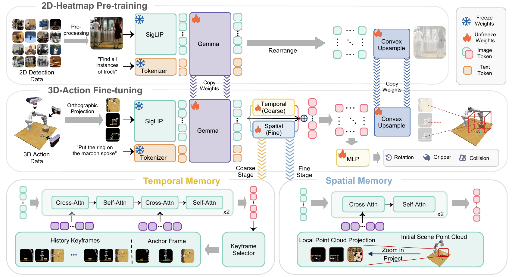
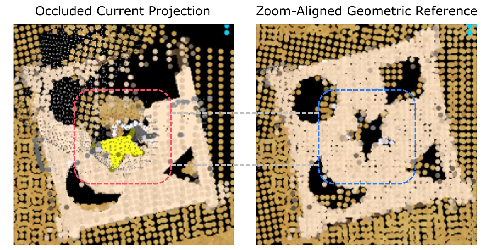

# BridgeVLA++: A Data-Efficient, Generalizable, and Memory-Augmented Vision-Language-Action Framework for 3D Manipulation

## 核心信息

- 标题: BridgeVLA++: A Data-Efficient, Generalizable, and Memory-Augmented Vision-Language-Action Framework for 3D Manipulation
- 标题翻译: BridgeVLA++：面向三维操作的数据高效、可泛化且具记忆增强的视觉—语言—动作框架
- 作者: Peiyan Li, Yuze Zhu, Yixiang Chen, Qisen Ma, Yuan Xu, Jiabing Yang, He Guan, Yan Huang, Hongtao Wu, Xiao Ma, Tao Kong, Liang Wang, Tieniu Tan
- 机构: 中国科学院自动化研究所模式识别国家重点实验室、中国科学院大学人工智能学院、FiveAges；部分作者在 ByteDance Seed 工作期间参与
- 发表时间: 2026-08-05
- 发表渠道: arXiv 预印本；稿件页眉为 IEEE Transactions on Pattern Analysis and Machine Intelligence
- DOI: 10.48550/arXiv.2608.05042
- arXiv: 2608.05042
- 论文链接: https://arxiv.org/abs/2608.05042
- 代码 / 项目: https://bridgevla-plus.github.io/
- 数据 / 资源: RoboPoint 120K、RLBench、COLOSSEUM、GemBench、RMBench、MemoryBench；Franka Research 3 与 Dobot CR5A 真实任务
- 论文类型: 三维视觉—语言—动作模型与记忆增强机器人操作方法

## 原文摘要翻译

利用预训练视觉—语言模型构建视觉—语言—动作模型，已经成为三维机器人操作中很有前景的范式。然而，现有 3D VLA 方法仍然依赖大量数据，在分布偏移下泛化能力有限，而且缺少对过往观测的显式记忆。这些局限阻碍了它们在数据稀缺、开放世界和记忆依赖操作场景中的应用。

作者此前提出的 BridgeVLA 在三维动作学习期间保持预训练 VLM 的输入—输出对齐，从而改善数据效率和泛化：原始点云被投影成多视角图像，模型在生成机器人动作之前先预测中间热图。本文进一步为 BridgeVLA 配备统一的时空记忆架构，用它建模持续空间上下文和时间交互历史，形成 BridgeVLA++。

得到的记忆增强框架能够基于观测历史推理，同时保留 BridgeVLA 的数据效率与泛化能力。大量实验表明，该框架在空间操作任务中表现强劲，并具有稳健的泛化能力。BridgeVLA++ 还在两个具有挑战性的记忆依赖操作基准上取得最先进性能，同时没有牺牲原始 BridgeVLA 的数据效率与泛化能力。此外，BridgeVLA++ 能够有效处理双臂操作，并在另一个真实机器人平台上得到验证，展示了跨任务、环境和机器人平台的可扩展性。这些结果使 BridgeVLA++ 成为一种统一的三维 VLA 框架，同时支持数据高效学习、稳健泛化和有效的记忆感知机器人操作。

## 创新点

1. **把预训练迁移问题明确成“输入和输出都要对齐”。** BridgeVLA 不把点云硬塞进二维 VLM，也不把动作改成脱离空间的离散符号。它把点云渲染为顶视、前视和右视三个正交图像，再让动作平移也通过二维热图表达。这样，预训练和操作微调的输入都仍是图像—语言，输出都仍是空间定位。

2. **让时间记忆和空间记忆承担不同的决策职责。** 时间记忆进入粗定位阶段，用初始锚点、最近两帧和稀疏子目标里程碑回答“下一步做什么”；空间记忆进入精定位阶段，把初始点云按当前粗 waypoint 重渲染，回答“精确在哪里操作”。这不是把所有历史一股脑拼进 Transformer，而是按 coarse-to-fine 的决策语义放置记忆。

3. **用场景级记忆自然扩展双臂。** 两条机械臂共享 VLM 骨干、时间/空间记忆和子目标选择器，只复制热图解码器与动作头。共享部分表达“场景现在处于什么阶段”，专属部分表达“左/右臂分别去哪里”。

4. **证据覆盖低样本、外观偏移、记忆歧义和真实硬件。** 论文没有只报一个容易饱和的基准，而是同时测试一般精密操作、分布外泛化、双臂/单臂记忆任务，以及两个真实机器人平台。更重要的是，热图、显式三维输入和两类记忆都有对应消融。

## 一句话总结

这篇工作的主线可以压成一句话：BridgeVLA 用“二维图像输入—二维热图输出”桥接预训练 VLM 与三维动作，BridgeVLA++ 再把历史任务进度放进粗阶段、把少遮挡几何放进细阶段，从而同时追求低样本、泛化和记忆操作。

*图 1：BridgeVLA 的二维对齐、BridgeVLA++ 的时空记忆，以及五个仿真基准与真实泛化的整体关系。*

图 1 很容易造成一个误读：它把 BridgeVLA 和 BridgeVLA++ 画成一个整体，但两者的创新时间不同。二维热图对齐和目标定位预训练来自作者的 NeurIPS 2025 BridgeVLA；这篇扩展版真正新增的是时空记忆、双臂共享和更完整的跨平台实验。后续判断创新性时应把这两层分开。

## 研究问题

### 为什么已有 3D VLA 仍不够数据高效

二维 VLA 可以继承 VLM 的语义先验，却往往需要大量机器人轨迹才能把“语言—图像”映射到连续动作；三维策略利用点云或体素的空间结构，数据效率更好，却难以直接承接二维互联网预训练。现有 3D VLA 常见的做法是加入点云编码器、三维位置编码或离散动作序列，但这会产生两类失配：

- 输入失配：预训练看二维自然图像，微调突然加入三维特征；
- 输出失配：预训练输出文本序列，下游却要预测具有明确空间位置的三维动作。

BridgeVLA 的判断是，迁移效率取决于接口是否连续，而不是三维信息是否更多。这个判断后来得到很强的消融支持：向 VLM 加入显式逐像素三维位置，反而把 RLBench 从 90.5% 降到 56.2%；去掉热图、直接回归三维位置则降到 31.4%。

### 当前帧为什么不足

论文区分了两种“当前观测无法回答”的问题。

第一种是时间歧义：当前画面可能在多个任务阶段看起来相似，但正确动作取决于已经做过什么。例如按蓝色按钮三次后再按黄色按钮，最后一次决策必须知道此前计数；交换两个外观相似的茄子时，必须知道哪个已经移动。

第二种是空间遮挡：策略知道下一步要作用于哪个区域，却看不清精确几何。夹爪、机械臂或手中物体可能恰好挡住插入槽、容器边缘或放置点。这里需要的不是更长的行为历史，而是一个遮挡更少、且与当前局部视图几何对齐的参考。

### 本文真正新增了什么

BridgeVLA++ 没有重新设计基础 VLA，而是在 BridgeVLA 的 coarse-to-fine 结构上找到两个天然插槽：

- 粗阶段覆盖全工作区，适合查询任务历史，决定下一目标区域；
- 细阶段围绕 waypoint 放大局部，适合查询初始几何，恢复精确位置。

这使“记忆”从一个泛化词变成两个可独立消融的模块。RMBench 去时间记忆从 96.0% 降到 21.3%，而去空间记忆仍有 95.4%；RLBench 的遮挡重任务则对空间记忆更敏感。这种任务选择性比单纯的总体 SOTA 更能支持作者的机制解释。

## 数据与任务定义

### 观测、动作和决策频率

输入是一到多个标定相机的 RGB-D 图像与语言指令。策略不在每个控制 tick 输出低层动作，而是在稀疏关键帧上预测下一个末端执行器目标：

$$
\mathbf a_t=(\mathbf x_t,\mathbf R_t,g_t,c_t),
$$

其中四个分量依次表示平移、旋转、夹爪开合和避碰标志。运动规划器或基准控制器负责在两个关键帧之间执行动作。因此，这篇论文测试的是高层空间目标预测，不是高频力矩或速度策略。

### 预训练数据与监督接口

预训练使用 RoboPoint 的 12 万目标检测样本。每条样本包括图像、描述一个或多个目标的文本和边界框；作者把框中心转换成截断高斯热图。这个设计的意义不在于数据集规模很大，而在于监督类型和下游平移动作相同：都是“语言指定的位置在二维图上哪里”。

PaliGemma 由 SigLIP 视觉编码器和 Gemma Transformer 组成。预训练后，图像 patch token 被重新排成二维网格，再由凸上采样器恢复与输入同分辨率的概率图。机器人微调阶段沿用同一个骨干和热图解码器。

### 仿真与真实任务矩阵

| 评测 | 任务与训练量 | 主要能力 | 报告方式 |
|---|---|---|---|
| RLBench | 18 任务；每任务 100 示范 | 一般三维操作、精密定位、遮挡 | 5 次评估，每次每任务 25 episode |
| COLOSSEUM | 20 任务；每任务 100 示范 | 12 类单独扰动、原始设置、全部扰动 | 每条件 25 次；作者方法 3 次测试重复 |
| GemBench | 16 个训练任务、44 个测试任务 | L1 位置、L2 新刚体、L3 新关节物体、L4 长时程组合 | 5 个种子，每个变化 20 次 |
| RMBench | 9 个双臂任务；每任务 50 示范 | 短期 $M(1)$ 与长期 $M(n)$ 回合记忆 | 每任务单独训练，最佳 checkpoint 评估 100 episode |
| MemoryBench | 3 个单臂任务、9 个变化；每任务 100 示范 | 干预后证据消失的记忆任务 | 5 个评估种子，25 步上限 |
| Franka | 13 任务；每任务 10 或 3 示范 | 低样本与六类真实泛化 | 每任务 10 次试验 |
| Dobot | 5 任务、7 条指令；每指令 10 示范 | 3 个记忆任务、2 个无记忆控制组 | 5 种设置，每指令每设置 10 次 |

*图 4：Franka Research 3 负责低样本和泛化，Dobot CR5A 负责记忆任务与无记忆控制组。*

*图 18：RMBench 九项双臂任务，每项以三帧展示时间演化。*

RMBench 是这篇论文最关键、也最需要谨慎阅读的基准。它确实让当前帧不足，但作者对每个任务独立训练一个模型、选择该训练 run 中表现最好的 checkpoint，再做单次 100-episode 评估。这个协议适合展示“能否学会”，却弱于多随机种子、固定 checkpoint 规则下的稳健比较。

*图 13：Cover Blocks、Press Button 和 Swap Eggplant 的成功执行序列。*

Dobot 的三项任务分别对应三种历史需求：记住颜色—位置绑定、记住重复次数、记住同形物体的移动身份。它们比泛泛的“需要记忆”更有诊断性：无记忆模型在遮盖方块和重复按键任务中都是 0%，而交换茄子任务仍有 60%，说明后者的当前帧偶尔仍能泄露可用线索。

## 方法主线

### 机制流程

1. **输入：RGB-D 与语言；操作：二维正交桥接；输出去向：粗阶段热图。** 多相机 RGB-D 先重建为彩色点云，再渲染成顶视、前视和右视三个正交图像。VLM 只看到图像与语言，不接收关节状态或显式三维位置；输出图像特征经凸上采样变成三张平移热图。

2. **输入：全工作区热图；操作：三视图反投影与局部放大；输出去向：最终平移和非平移动作。** 候选三维点投影到三个视图并累加热图概率，最高分点成为粗定位点。以其为中心裁剪点云、放大并重渲染，第二次共享权重前向得到精细平移；粗阶段的全局与局部特征同时预测旋转、夹爪和避碰。

3. **输入：当前粗阶段表征与历史；操作：时间记忆检索；输出去向：下一目标区域。** 当前表征查询初始锚点、最近两帧与稀疏子目标里程碑。交叉注意力取回任务进度，再经自注意力融合，帮助粗阶段决定下一步做什么。

4. **输入：当前局部裁剪与初始点云；操作：缩放对齐的空间重渲染；输出去向：精细热图。** 初始点云按当前粗 waypoint 使用同一 zoom 与虚拟相机重新渲染。当前每个视图只查询对应参考视图，从遮挡更少的历史几何中恢复目标边缘和容器位置。

*图 2：上半部分是热图预训练和粗到细三维动作；下半部分是时间与空间记忆的插入位置。*

### 二维热图如何变成三维动作

候选三维点 $\mathbf x$ 在三个视图中的得分为

$$
s_t(\mathbf x)=\sum_{v=1}^{3}\widehat H_{t,v}(\Pi_v(\mathbf x)),\qquad
\widehat{\mathbf x}_t=\arg\max_{\mathbf x}s_t(\mathbf x).
$$

这个接口保留了三层对应关系：三维点云中的位置、二维投影图中的像素、三维末端平移。与离散动作序列相比，监督不需要模型先学会一套任意的符号系统；与直接均方误差回归位置相比，热图为大量像素提供密集梯度，并显式注入视图几何先验。

旋转采用连续 6D 表示，经 Gram–Schmidt 正交化恢复旋转矩阵；夹爪和避碰使用二分类。总损失为

$$
L_{\mathrm{base}}=L_{\mathrm{trans}}+L_{\mathrm{rot}}+L_{\mathrm{gripper}}+L_{\mathrm{collision}}.
$$

这里有一个工程上重要的限制：VLM 不接收本体感觉，策略输出的是稀疏关键帧目标，并依赖外部运动规划器执行。这降低了学习难度，也意味着论文结论不能直接外推到高频接触控制或无规划器的端到端策略。

### 时间记忆：锚点、邻居和里程碑

时间记忆写成

$$
\mathcal T_t=(\mathbf A_0,\mathcal H_t^{\mathrm{nbr}},\mathcal H_t^{\mathrm{sub}}).
$$

- $\mathbf A_0$ 是初始场景的三视图特征，提供固定全局参考；
- $\mathcal H_t^{\mathrm{nbr}}$ 永远保存最近 $n=2$ 个已执行关键帧，表示短期状态变化；
- $\mathcal H_t^{\mathrm{sub}}$ 保存经过门控的任务里程碑，表示较长期的已完成子目标。

门控器用一个可学习查询向量汇聚已经融合过记忆的当前表示，再由 MLP 输出保留概率。RMBench 中容量 $K=12$：两个邻近槽位加最多十个子目标槽位。一个被选中的帧要等离开两帧邻近窗口后才进入子目标区，从而避免同一帧重复占用两种时间尺度。

这个设计最值得借鉴的地方是，固定锚点、短期窗口和稀疏里程碑不是同一种“历史帧”。它们分别承担相对初始状态、局部转移和长程进度三种语义。单纯扩大最近窗口很容易被近重复帧占满，这正是论文对 SAM2Act+ 在 Dobot 上失败的解释。

### 空间记忆：把初始点云变成动态局部参考

空间记忆保存初始彩色点云 $\mathbf P_0$。每次粗 waypoint 改变时，作者对当前点云和 $\mathbf P_0$ 做完全相同的局部裁剪、缩放和虚拟相机渲染：

$$
\mathcal S_t=\Phi\left(\mathrm{Render}\left(\mathrm{Zoom}\left(\mathbf P_0;\widehat{\mathbf x}^{\mathrm c}_t\right)\right)\right).
$$

*图 3：当前局部点云被夹爪和物体遮挡，初始点云重渲染后提供对齐且更完整的几何。*

空间记忆不是图像补全，也不是学习式世界模型。它只是把一个早先观测到的静态点云变换到当前局部坐标。优点是几何对应直接、训练简单；缺点是初始时没看见的内容永远无法恢复，且物体大幅移动后参考可能过时。论文的实验主要覆盖机械臂遮挡，没有系统测试“旧几何误导当前动作”的情况。

### 双臂、训练与推理

双臂版本共享 VLM、锚点、动态历史、空间参考和门控器，只为左右臂复制凸上采样器与 MLP 动作头。粗阶段共享场景推理后分别产生两个 waypoint，细阶段围绕各自 waypoint 独立放大。

训练采用两阶段日程：先冻结 PaliGemma，训练新增解码器、动作头和记忆模块；再解冻 Gemma 骨干联合微调，但 SigLIP 与语言嵌入始终冻结。记忆开启后不能随意做独立二维图像增强或逐帧改变工作区中心，否则当前帧与缓存特征的像素对应会被破坏；作者改用对当前、锚点和历史点云一致施加的 SE(3) 增强。

子目标门控损失为二分类交叉熵，并与动作损失相加。关键问题是：正样本来自 RMBench 语言分段的最后关键帧，且只占 9–15%。没有这种标注的 RLBench、COLOSSEUM、GemBench 和 MemoryBench 都关闭门控器，仅保留锚点与最近两帧。因此，论文证明了“有标注里程碑时长期记忆有效”和“无标注时短期记忆有效”，但没有证明自适应长期记忆能自动迁移到任意数据集。

## 关键结果

### 主结果与强基线

| 场景 | 强基线 | BridgeVLA | BridgeVLA++ | 应如何解读 |
|---|---:|---:|---:|---|
| RLBench | SAM2Act 86.8 | 90.5 | **93.7** | 基础对齐已强；空间/时间上下文继续改善遮挡任务 |
| COLOSSEUM | RVT-2 56.7 | 64.0 | **65.2** | 记忆没有破坏 OOD，全部扰动和干扰物反而明显提高 |
| GemBench | 3D-LOTUS++ 48.0 | 50.0 | **51.1** | 平均领先，但 L4 仍落后规划增强基线 |
| RMBench | MemoryWAM 83.0 | 18.9 | **96.0** | 当前帧明显不够，时间记忆是决定性因素 |
| MemoryBench | SAM2Act+ 94.3 | 11.3 | **99.7** | 记忆收益跨双臂/单臂成立 |
| Franka Basic | RVT-2 90.0 | **96.9** | — | 十示范下强；三示范仍有 95.4 |
| Dobot 记忆任务 Basic | SAM2Act+ 30.0 | 20.0 | **93.3** | 真实回合记忆有效，但每任务只有十次试验 |

RMBench 的绝对增益最大：无记忆基础模型为 18.9%，完整模型为 96.0%，并超过最强记忆基线的 83.0%。在尝试电池任务上，完整模型为 96%，最强基线只有 41%。但该表不能被简化成“所有记忆方法中无条件领先”：作者行采用每任务独立训练、最佳检查点和单次评估，缺少多种子方差。

MemoryBench 提供互补证据：在不同模拟器、单臂任务和五个评估种子下，BridgeVLA++ 达到 $99.7\pm0.3$%，无记忆版本只有 $11.3\pm0.8$%。这说明记忆收益不是双臂 action head 的副产物。

### 低样本与真实泛化

Franka 是“数据高效”最有说服力的部分。十条示范时 BridgeVLA 为 96.9%，三条示范仍有 95.4%；同为十条示范时，RVT-2 为 90.0%，SpatialVLA 为 3.1%，$\pi_{0.5}$ 为 20.0%。后者与 BridgeVLA 共享 PaliGemma 骨干，因此超过 75 点的差距更可能来自动作接口与空间对齐，而不是基础模型强弱。

*图 5：BridgeVLA、去热图预训练版本与 RVT-2 在七类真实设置中的比较。*

BridgeVLA 相对 RVT-2 在七种设置平均提高 32 点，未见组合和背景变化下的优势尤其大。不过图中还有两个边界：弱光条件下去预训练版本有时不低于完整模型，说明光照稳健不完全来自目标定位预训练；未见类别下的完整模型仍只有约 0.31，说明保留 VLM 语义没有自动解决操作关键点泛化。

### 消融到底说明了什么

| 消融 | 完整值 | 消融值 | 结论强度 |
|---|---:|---:|---|
| 去热图解码，直接回归 | 90.5 | 31.4 | 极强：参数量匹配且退化 59.1 点 |
| 加显式三维位置输入 | 90.5 | 56.2 | 强：更多几何反而破坏预训练输入域 |
| 离散 Euler 旋转 | 90.5 | 88.2 | 中等：连续 6D 对精密姿态有小而稳定收益 |
| RLBench 去空间记忆 | 93.7 | 92.0 | 目标明确：总体小，Sort Shape 72.0→60.8 |
| RMBench 去空间记忆 | 96.0 | 95.4 | 近乎无影响：该基准主要测时间顺序 |
| RMBench 去时间记忆 | 96.0 | 21.3 | 决定性：与无记忆 18.9 接近 |

最好的消融不是“每个模块都涨一点”，而是两类记忆在不同任务上呈现预期的非对称性。空间记忆不该在纯顺序任务中大涨，时间记忆也不该只在遮挡定位中大涨。论文结果基本符合这一因果图。

热图与显式三维输入消融的幅度非常大，但仍要注意它们各自改变了优化问题：热图提供密集分类监督，直接位置头用 MSE；三维输入加入额外卷积模块并改变视觉特征分布。因此它们证明“作者的整套接口更好优化”，尚不能精确分摊密集监督、投影先验和预训练分布各占多少贡献。

### 负结果与不稳定设置

- BridgeVLA 在 GemBench L4 是 0.0，BridgeVLA++ 只有 8.2，低于 3D-LOTUS++ 的 17.4；增益主要集中在 PushButtons4。
- BridgeVLA 在 COLOSSEUM Distractor 为 51.8，低于 RVT-2 的 60.8；BridgeVLA++ 才提高到 61.6。
- 空间记忆不是普遍有效模块：RMBench 去掉它只从 96.0 变成 95.4。
- 未见类别仍可能被忽略，模型会直接移动到目的地。
- 真实机器人碰撞率、安全事件和置信度校准不在本文评估范围内。

## 深度分析

### 真正贡献是什么

如果把这篇文章定位在 VLA/WorldModel 图谱里，它不是 world action model：它不生成未来视频，也不在潜在世界轨迹上规划。更准确的位置是“具有结构化回合记忆的三维 VLA”。它最值得保留的贡献有两个层次：

1. BridgeVLA 提供一种非常干净的基础模型迁移原则：输入不离开预训练图像域，输出不离开空间定位域。

2. BridgeVLA++ 展示如何沿粗到细计算图按职责安放两种记忆，而不是增加一个无差别历史 Transformer。

第一层带来大部分低样本与一般泛化能力，第二层带来记忆依赖任务的巨大跃迁。把两者混写成“一个新模型同时解决所有问题”会掩盖真正的机制结构。

### 为什么结果成立

**热图使动作监督更像视觉定位。** 三维平移不再是孤立的三个连续数，而是一组三视图上的概率分布。它同时增加监督密度、保留空间邻近性，并让 RoboPoint 的目标定位知识可以直接迁移。

**时间记忆的三时间尺度减少了窗口污染。** 初始锚点永远不被挤出，最近两帧覆盖局部转移，门控里程碑覆盖长期进度。SAM2Act+ 在真实任务中逐帧保存、固定窗口检索，容易让早期关键证据被近重复帧淹没。

**空间记忆利用了已知相机几何。** 当前局部视图与参考局部视图使用同一个粗 waypoint、zoom 和虚拟相机，因此对应视图之间的交叉注意力不必从零学习对齐。它更像可微的历史几何查询，而不是语义模糊的图像记忆。

**记忆放置点与任务阶段一致。** 时间上下文主要影响“选哪个区域”，所以进入粗阶段；遮挡几何主要影响“区域内精确哪里”，所以进入细阶段。模块位置本身就是先验。

### 容易误读的地方

**误读一：BridgeVLA++ 在所有泛化维度都最好。** COLOSSEUM 上基础模型的平均排名反而更好，记忆版本主要改善全部扰动联合设置和干扰物设置；GemBench 的长时程层级也不是最优。

**误读二：长期记忆完全自动学习。** 只有 RMBench 具备语言分段标注，因此只有那里训练子目标门控器；其他基准使用的其实是锚点加最近两帧。

**误读三：空间记忆是动态世界模型。** 它保存的是初始点云，不能表达未观测表面、物体后续形变或动态更新。如果初始几何已经错误，重渲染只会稳定地复用错误。

**误读四：95.4% 证明三条示范足以解决开放世界操作。** 它证明的是作者 13 个 Franka 桌面任务、同一平台、同一评测环境中的低样本拟合和有限扰动泛化，不代表新技能、新本体或非刚性物体。

### 目标定位是否在微调后遗忘

*图 16：动作微调后，模型在未挑选的 RoboPoint 样本上仍能输出与真值一致的定位热图。*

这张图排除了最简单的解释：Category 失败并不是因为模型把预训练目标定位完全忘了。更合理的解释是监督语义不完全一致：RoboPoint 多为第三人称自然图像，机器人输入是正交点云渲染；检测目标是物体中心，操作 waypoint 可能落在把手、容器内部或物体外部。后续工作应针对“可操作关键点”做跨域预训练，而不只是扩大目标检测数据。

### 复杂度与扩展性

完整记忆增加 269.77M 参数，是 2.92B 骨干的 9.2%。缓存并不大：每个 bf16 粗阶段特征网格占 3.0 MiB，12 帧加锚点共 39 MiB。真正的成本来自空间参考必须额外跑一次骨干：单臂从粗、细两次前向变成三次，双臂则是共享粗阶段，加左右细阶段及空间参考，共五次。

RTX 4090 上单步延迟从 0.35 秒增到 0.57 秒，增加 62.9%。作者认为真实系统的图像传输和机械运动更慢，因此这个差异不主导总循环；这个解释对关键帧控制合理，但若迁移到高频闭环或并行多机器人，额外前向会更重要。

### 复现注意点

- 所有点云最终都渲染为三个 $224\times224$ 正交视图，与传感器原始分辨率无关。
- 两阶段微调在阶段边界重新初始化 AdamW，并分别 warmup；SigLIP 与语言嵌入始终冻结。
- 开启记忆后必须禁止破坏像素对应的独立二维增强，并固定工作区边界。
- RMBench 的 $K=12$ 与门控权重/阈值是 `1.0 / 5.5 / 0.5`；其他基准 $K=2$ 且不训练门控器。
- 大型仿真微调使用 32 张 H20，RMBench 每任务 8 张 H20，真实微调使用 8 张 A100 约 1.5 小时。
- RMBench 数字来自每任务最佳 checkpoint；复现时必须明确 checkpoint 选择规则，否则容易出现不可比结果。
- 策略依赖标定相机、RGB-D 点云重建和运动规划器；这些系统依赖不是网络结构之外的“免费条件”。

## 局限

1. **长期记忆依赖标注。** 子目标门控需要语言分段末帧标签。论文已经提出自监督门控作为未来工作，但当前 96.0% RMBench 结果仍建立在这类标签上。

2. **空间参考静态且单一。** 初始点云可能缺失、遮挡或在后续变得过时。模型没有地图更新、冲突检测或参考置信度，也没有针对大场景变化的消融。

3. **长时程规划仍弱。** GemBench L4 只有 8.2%，且主要由一个按键历史任务贡献。记住过去发生了什么不等于能把新长任务分解成子目标。

4. **统计强度不均。** RLBench/MemoryBench 有多次评估，RMBench 却是最佳 checkpoint 的单次 100-episode；真实机器人每个条件只有十次试验，成功率差一个 episode 就变化 10 点。

5. **真实场景范围窄。** 两个平台都是固定桌面、静态外部 RGB-D 相机和刚性物体；没有移动底盘、灵巧手、动态人类、非刚性物体或跨房间任务。

6. **控制层级较高。** 模型预测关键帧末端目标并依赖规划器执行，不能直接说明高频接触、力控制或实时安全能力。

7. **代码开放状态不清晰。** 论文给出项目主页，但在当前稿件中没有形成可直接审计的完整训练代码、数据处理与评测版本锁定说明。

## 我的笔记

这篇最值得借鉴的不是简单“加入记忆”，而是两个设计习惯。

第一，预训练迁移时要画一张接口对齐表：预训练输入是什么、下游输入是什么、预训练输出是什么、下游中间监督是什么。BridgeVLA 的成功说明，保持输入域与输出结构的连续性，可能比增加更强的三维编码器更重要。对于自己的世界模型或具身工作，可以检查：是否为了加入几何而破坏基础模型熟悉的特征统计？是否能找到一个既能由互联网数据监督、又能直接服务动作的中间表示？

第二，记忆模块最好由失败类型决定，而不是由“历史越长越好”决定。任务进度、最近动作、几何遮挡、对象身份和语言承诺可能需要完全不同的记忆。BridgeVLA++ 把粗阶段与细阶段对应到时间和空间，是一种很好的模块放置范式。

我会把后续研究问题集中在四个方向：

- 用无标注的新颖度或预测误差替代语言分段门控；
- 让空间记忆可更新，并为过时几何建立置信度；
- 把稀疏里程碑记忆接到显式任务规划，而不仅是下一 waypoint；
- 在相同骨干、相同动作头容量下，对热图、离散动作序列与流匹配做严格接口对照。

如果只读三个数字，应该记住：热图接口消融 `90.5→31.4`，时间记忆消融 `96.0→21.3`，GemBench L4 只有 `8.2`。前两个说明方法为什么有效，最后一个提醒它还没有解决什么。

## 引用

1. Li, P. et al. *BridgeVLA++: A Data-Efficient, Generalizable, and Memory-Augmented Vision-Language-Action Framework for 3D Manipulation*. arXiv:2608.05042 (2026). https://arxiv.org/abs/2608.05042

2. Project website: https://bridgevla-plus.github.io/

3. 本地完整中英读本：[[WorldModel/BridgeVLA++ A Data-Efficient, Generalizable, and Memory-Augmented Vision-Language-Action Framework/paper]]；逐段详细版：[[WorldModel/BridgeVLA++ A Data-Efficient, Generalizable, and Memory-Augmented Vision-Language-Action Framework/detailed_paper]]。
