# Causal World Modeling for Robot Control

**Authors:** Lin Li, Qihang Zhang, Yiming Luo, Shuai Yang, Ruilin Wang, Fei Han, Mingrui Yu, Zelin Gao, Nan Xue, Xing Zhu, Yujun Shen, Yinghao Xu  
**Source:** `/Users/roywangj/journey_wj/research/papers4zotero/zotero1/storage/ECJKCB63/Li 等 - 2026 - Causal World Modeling for Robot Control.pdf`  
**Detected source format:** selectable-text PDF (`pdf-text`)  
**Reader type:** full-paper Chinese-English Markdown reader with figure/table assets  
**arXiv:** 2601.21998v2 (22 Mar 2026)

## Page / Section Index

| PDF pages | Content |
|---|---|
| 1–2 | Abstract; 1 Introduction; Fig. 1 |
| 3–4 | 2 Preliminary; Fig. 2; 3.1 Problem Statement |
| 5–9 | 3.2–3.4 Method; Fig. 3–4; Algorithm 1–2 |
| 10–17 | 4 Experiments; Fig. 5–10; Table 1–3 |
| 17–18 | 5 Related Work; 6 Conclusion |
| 19–22 | References (bibliography retained in source PDF, not translated line by line) |
| 23–31 | Appendix A; Table S1–S7 |

## Terminology Ledger

| Canonical term | 中文 | Decision |
|---|---|---|
| LingBot-VA | LingBot-VA | 方法名不译 |
| Vision-Language-Action policy (VLA) | 视觉-语言-动作策略 | 首次展开，后用 VLA |
| world model | 世界模型 | 统一译法 |
| causal world modeling | 因果世界建模 | 指时间上只依赖过去的建模方式 |
| autoregressive (AR) | 自回归 | 跨 chunk 因果生成；chunk 内可并行 |
| flow matching | 流匹配 | 保留公式符号与 flow time |
| inverse dynamics model (IDM) | 逆动力学模型 | 从视觉状态转移反推动作 |
| Forward Dynamics Model (FDM) | 前向动力学模型 | 由真实反馈与动作预测结果状态 |
| Mixture-of-Transformers (MoT) | Transformer 混合架构 | 视频/动作双流、共享注意力 |
| KV cache | KV 缓存 | 保留英文缩写 |
| teacher forcing | 教师强制 | 训练时以上一时刻真实 token 为上下文 |
| Noisy History Augmentation | 噪声历史增强 | 方法模块名保留英文并给中文 |
| chunk size $K$ | 分块大小 $K$ | 每步预测的视频 latent 帧数 |
| progress score (PS) | 进度分数 | 实机评测指标 |
| success rate (SR) | 成功率 | 实机/仿真评测指标 |

## Abstract

> <strong>Para. 1:</strong> This work highlights that video world modeling, alongside vision-language pre-training, establishes a fresh and independent foundation for robot learning. Video world models provide the ability to “imagine” the near future by understanding the causality between actions and visual dynamics. We introduce LingBot-VA, an autoregressive diffusion framework that learns frame prediction and policy execution simultaneously. It uses (1) a shared latent space integrating vision and action tokens through a Mixture-of-Transformers architecture, (2) a closed-loop rollout mechanism that continually incorporates ground-truth environmental observations, and (3) an asynchronous inference pipeline that parallelizes action prediction and motor execution. Evaluation in simulation and the real world shows promise in long-horizon manipulation, post-training data efficiency, and generalization to novel configurations. Code and models are publicly released.

> <strong>Para. 1[CN]:</strong> 本文强调：除视觉-语言预训练之外，视频世界建模为机器人学习建立了一种新的、相对独立的基础。视频世界模型通过理解动作与视觉动态之间的因果关系，获得“想象”近期未来的能力。作者提出 LingBot-VA，这是一种同时学习帧预测与策略执行的自回归扩散框架。它包含三项设计：(1) 通过 Transformer 混合架构，将视觉与动作 token 整合进共享 latent 空间；(2) 闭环 rollout 机制，持续引入来自环境的真实观测；(3) 异步推理流水线，使动作预测与电机执行并行。仿真与实机实验表明，该方法在长时序操作、后训练数据效率以及新配置泛化方面具有明显潜力。代码与模型均已公开。

## 1 Introduction

> <strong>Para. 1:</strong> Vision-Language-Action (VLA) models are a promising paradigm for general-purpose robotic manipulation [7, 11, 12, 34], grounding linguistic instructions in visual perception across diverse objects and unstructured environments. Yet most VLAs use a feedforward mapping from current observations to action sequences [17, 91], forcing one network to learn scene understanding, physical dynamics, and motor control from one supervision signal. This representation entanglement compresses heterogeneous high-dimensional visual semantics and low-dimensional motor commands into one space, often limiting sample efficiency and generalization. Without explicit environmental-evolution modeling [25, 26, 82], a reactive policy may rely on pattern matching rather than physical understanding.

> <strong>Para. 1[CN]:</strong> 视觉-语言-动作（VLA）模型已成为通用机器人操作的重要范式 [7, 11, 12, 34]，能够在多样物体和非结构化环境中，把语言指令落到视觉感知与动作上。然而，大多数 VLA 采用从当前观测到动作序列的前馈映射 [17, 91]，要求单个网络依靠同一种监督信号同时学习场景理解、物理动力学和运动控制。这种表征纠缠迫使模型把高维视觉语义与低维运动命令压入同一空间，往往限制样本效率与泛化能力。如果不显式建模环境如何演化 [25, 26, 82]，反应式策略可能只是在匹配训练模式，而没有真正理解物理动态。

> <strong>Para. 2:</strong> Existing attempts to introduce world modeling include interactive neural simulators such as UniSim [86], chunk-based video-action diffusion models such as UVA [40] and UWM [97], and offline video generators for subgoal synthesis such as Gen2Act [4] and Act2Goal [95]. They face three limitations for closed-loop control: a reactivity gap because long open-loop chunks omit real-time feedback; limited long-term memory because history is not persistently cached; and a causality problem because bidirectional attention lets future tokens influence past predictions. These limitations motivate an autoregressive formulation.

> <strong>Para. 2[CN]:</strong> 现有世界模型路线包括 UniSim [86] 一类交互式神经模拟器、UVA [40] 与 UWM [97] 一类分块视频-动作扩散模型，以及 Gen2Act [4]、Act2Goal [95] 一类用于生成子目标的离线视频生成器。它们用于闭环控制时主要有三项限制：其一，长片段开环生成不能及时吸收反馈，形成“反应性缺口”；其二，历史没有被持续缓存，跨块生成缺少长期记忆；其三，片段内双向注意力允许未来 token 影响较早预测，不符合物理世界的因果方向。因此作者转向自回归建模。

### Fig. 1. LingBot-VA 总览

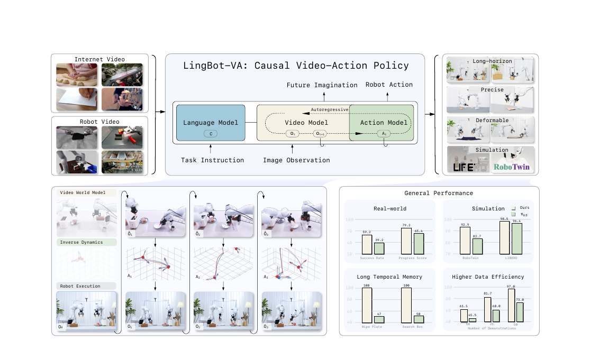

**Caption:** LingBot-VA is an autoregressive world model for robotic manipulation. It is pretrained on in-the-wild videos and robot action data; evaluated on real-world and simulation tasks; supports visual dynamics prediction and inverse dynamics; and exhibits temporal memory and few-shot adaptation.

**Caption[CN]:** LingBot-VA 是面向机器人操作的自回归世界模型。它在自然视频与机器人动作数据上预训练，在实机与仿真任务上评估，能够进行视觉动态预测和逆动力学推断，并表现出时间记忆与少样本适应能力。

**Reading note:** 左侧给出“视频世界模型 → 逆动力学 → 机器人执行”的循环；右侧数据概括作者声称的长时序、精细操作、仿真与数据效率优势。

> <strong>Para. 3:</strong> LingBot-VA is an autoregressive diffusion video-action framework operating in a continuous latent space via flow matching [46, 50]. It interleaves video and action tokens into one autoregressive sequence. A dual-stream MoT architecture processes both modalities with shared attention, so latent imagination and action inference occur jointly: at each step it denoises future visual states while decoding corresponding actions, allowing mutual conditioning. Built on a large video-diffusion backbone [79], the design provides a reactive AR loop, persistent context through KV cache, and causal consistency through causal masking. Real observations are incorporated at every step to reduce long-horizon distribution drift.

> <strong>Para. 3[CN]:</strong> LingBot-VA 是运行在连续 latent 空间中的自回归扩散式视频-动作框架，并采用流匹配 [46, 50]。它把视频 token 与动作 token 交错排入同一条自回归序列，再由双流 MoT 架构通过共享注意力联合处理。因此，“视觉想象”与动作推断同时发生：每一步迭代去噪未来视觉状态，也解码相应动作，两条流能够相互提供条件。依托大型视频扩散骨干 [79]，该设计带来可依据最新观测校准的 AR 闭环、由 KV 缓存维持的持久上下文，以及由因果 mask 保证的时间一致性。每一步注入真实观测，可缓解长时序中的分布漂移。

> <strong>Para. 4:</strong> High-fidelity autoregressive video generation is expensive. The authors therefore introduce Noisy History Augmentation, which trains the action decoder to use partially noisy visual latents so that inference can stop video denoising early. They also overlap model computation with robot execution through an asynchronous coordination pipeline. Combined with variable chunk-size training, these measures aim to provide high-frequency closed-loop control without sacrificing action quality.

> <strong>Para. 4[CN]:</strong> 高保真自回归视频生成计算昂贵。作者因此提出噪声历史增强，让动作解码器在训练时学会利用仍带噪声的视觉 latent，使推理时的视频去噪可以提前停止；同时又通过异步协调流水线，将模型计算与机器人执行重叠。再结合可变 chunk 大小训练，这些措施试图在不牺牲动作质量的情况下实现高频闭环控制。

> <strong>Para. 5:</strong> The paper claims three contributions: an autoregressive diffusion formulation unifying visual prediction and action inference in one causally masked sequence; an asymmetric dual-stream MoT plus partial denoising and asynchronous execution; and state-of-the-art long-horizon and precision performance, together with improved data efficiency and generalization.

> <strong>Para. 5[CN]:</strong> 本文将贡献概括为三点：第一，在一条带因果 mask 的序列中，以自回归扩散统一视觉预测与动作推断；第二，采用非对称双流 MoT，并结合部分去噪和异步执行；第三，在长时序与高精度操作中取得领先结果，同时提高数据效率与泛化能力。

## 2 Preliminary

### 2.1 Flow Matching

> <strong>Para. 1:</strong> Flow matching [46, 50, 75] learns a continuous-time vector field that transports a simple source distribution, such as Gaussian noise, to the data distribution. Given data $x_1$ and noise $\epsilon\sim\mathcal N(0,I)$, the vector field $v_s:\mathbb R^d\times[0,1]\rightarrow\mathbb R^d$ specifies the instantaneous velocity of a trajectory $x(s)$:

> <strong>Para. 1[CN]:</strong> 流匹配 [46, 50, 75] 学习一个连续时间向量场，把高斯噪声等简单源分布运输到数据分布。给定数据 $x_1$ 和噪声 $\epsilon\sim\mathcal N(0,I)$，向量场 $v_s:\mathbb R^d\times[0,1]\rightarrow\mathbb R^d$ 描述轨迹 $x(s)$ 的瞬时速度：

$$
\frac{dx(s)}{ds}=v_s(x(s)),\qquad x(0)=\epsilon\sim\mathcal N(0,I). \tag{1}
$$

> <strong>Para. 2:</strong> The model is trained by matching the predicted vector field to the true velocity along an interpolation path, usually $x(s)=(1-s)\epsilon+s x_1$, for which $\dot x(s)=x_1-\epsilon$:

> <strong>Para. 2[CN]:</strong> 训练目标是使预测向量场逼近插值路径上的真实速度。常用路径为 $x(s)=(1-s)\epsilon+s x_1$，其速度是 $\dot x(s)=x_1-\epsilon$：

$$
\mathcal L_{\mathrm{FM}}=\mathbb E_{s,\epsilon,x_1}\left[\left\|v_\theta(x(s),s)-\dot x(s)\right\|^2\right]. \tag{2}
$$

> <strong>Para. 3:</strong> At inference, generation solves the learned ordinary differential equation from $s=0$ to $s=1$.

> <strong>Para. 3[CN]:</strong> 推理时，从 $s=0$ 的噪声出发，对学得的常微分方程积分到 $s=1$，得到数据样本。

$$
x_1=\epsilon+\int_0^1v_\theta(x(s),s)\,ds. \tag{3}
$$

### 2.2 Video Generation with Conditional Flow Matching

> <strong>Para. 1:</strong> Conditional video flow-matching models [23, 35, 54, 79] operate in the latent space of a pretrained video autoencoder. An encoder maps observations to $z_t=E(o_t)$. Conditioned on text or an initial image $c$, the model generates $z=\{z_1,\ldots,z_T\}$ by predicting the vector field $v_\theta(z(s),s\mid c)=d z^{(s)}/ds$. Generation starts at $z^{(0)}=\epsilon$ and integrates to $z^{(1)}$, which is decoded to pixels. Standard video generation uses bidirectional processing within the generated segment.

> <strong>Para. 1[CN]:</strong> 条件视频流匹配模型 [23, 35, 54, 79] 在预训练视频自编码器的 latent 空间中工作，编码器把观测映射为 $z_t=E(o_t)$。在文本或初始图像条件 $c$ 下，模型通过预测向量场 $v_\theta(z(s),s\mid c)=d z^{(s)}/ds$ 来生成 $z=\{z_1,\ldots,z_T\}$。生成从 $z^{(0)}=\epsilon$ 开始，积分到 $z^{(1)}$，再解码到像素空间。标准视频生成通常在待生成片段内部采用双向处理。

### Fig. 2. LingBot-VA 框架

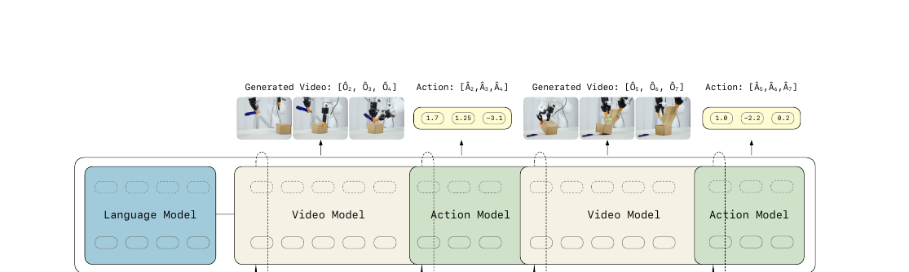

**Caption:** LingBot-VA interleaves video and action tokens in one autoregressive diffusion sequence. The video stream initialized from Wan2.2-5B predicts future latent visual states; the action stream infers corresponding actions from predicted transitions.

**Caption[CN]:** LingBot-VA 将视频与动作 token 交错放入同一自回归扩散序列。由 Wan2.2-5B 初始化的视频流预测未来视觉 latent，动作流根据预测的视觉转移推断相应动作。

**Reading note:** 图中“先视频、后动作”是概念分解；实际网络中两种 token 通过 MoT 共享注意力并联合去噪。

## 3 Method

### 3.1 Problem Statement & Approach Overview

> <strong>Para. 1:</strong> Robotic manipulation is treated as sequential decision-making under partial observability. At time $t$, the agent observes $o_t\in\mathcal O$, executes $a_t\in\mathcal A$, and receives the next observation $o_{t+1}$. A conventional VLA policy learns the reactive imitation-learning mapping $a_t\sim\pi_\theta(\cdot\mid o_t)$, which entangles scene understanding, dynamics, and control.

> <strong>Para. 1[CN]:</strong> 机器人操作被视为部分可观测条件下的序贯决策问题。在时刻 $t$，智能体接收观测 $o_t\in\mathcal O$、执行动作 $a_t\in\mathcal A$，并得到下一观测 $o_{t+1}$。传统 VLA 通过模仿学习直接学习反应式映射 $a_t\sim\pi_\theta(\cdot\mid o_t)$，从而把场景理解、动力学和控制纠缠在一起。

> <strong>Para. 2:</strong> LingBot-VA instead uses a two-stage world-model view: first predict how the visual world evolves, then infer which action realizes that visual transition.

> <strong>Para. 2[CN]:</strong> LingBot-VA 改用两阶段世界模型视角：先预测视觉世界将如何演化，再反推出实现该视觉转移所需的动作。

$$
\text{Stage 1: }o_{t+1}\sim p_\theta(\cdot\mid o_{\le t}),\qquad
\text{Stage 2: }a_t\sim g_\psi(\cdot\mid o_t,o_{t+1}). \tag{6}
$$

> <strong>Para. 3:</strong> This decomposition lets Stage 1 exploit large-scale video for physical priors, while Stage 2 requires robot demonstrations only to ground predicted visual transitions in executable actions. The following sections present the autoregressive formulation (§3.2), its unified architecture and training (§3.3), and real-time asynchronous deployment (§3.4).

> <strong>Para. 3[CN]:</strong> 这一分解使第一阶段能够利用大规模视频学习物理先验，而第二阶段只需使用机器人示范，把预测的视觉转移落到可执行动作上。下文依次介绍自回归公式化（§3.2）、统一架构与训练（§3.3），以及面向实时控制的异步部署（§3.4）。

### 3.2 Autoregressive Video-Action World Modeling

> <strong>Para. 1:</strong> Prior robotic world models either generate video open-endedly [54], learn interactive environments mainly for games or simulation [13, 56], decouple video prediction and action inference [16, 27], or use bidirectional diffusion within chunks [97]. LingBot-VA instead jointly models visual observations and actions in one causal autoregressive process, with KV-cached memory and continual real-observation integration.

> <strong>Para. 1[CN]:</strong> 既有机器人世界模型要么进行开放式视频预测 [54]，要么主要面向游戏或仿真的交互环境 [13, 56]，要么把视频预测与动作推断分离 [16, 27]，或者在 chunk 内使用双向扩散 [97]。LingBot-VA 则在同一个因果自回归过程中联合建模视觉观测与动作，通过 KV 缓存保留记忆，并持续吸收真实观测。

> <strong>Para. 2:</strong> Open-loop long-sequence generation is expensive and cannot correct errors from new feedback. Independently generated chunks can drift without persistent history, while bidirectional attention within a chunk does not match the temporal direction of physical execution. The authors argue that causal autoregression brings persistent memory, causal consistency with arriving observations, and a practical balance between parallel chunk generation and frequent correction.

> <strong>Para. 2[CN]:</strong> 开环生成长序列不仅昂贵，也无法依据新反馈纠错；相互独立的 chunk 如果没有持久历史，会产生时间不一致与漂移；chunk 内的双向注意力也不完全符合物理执行的时间方向。作者认为，因果自回归同时带来持久记忆、与实时观测一致的因果结构，以及“chunk 内并行生成”和“频繁闭环修正”之间的工程折中。

> <strong>Para. 3:</strong> At each step, the model predicts the next $K$ video frames conditioned on all prior observations. Tokens inside one chunk are generated in parallel with bidirectional attention, but dependencies across chunks remain causal.

> <strong>Para. 3[CN]:</strong> 每一步中，模型依据全部过去观测预测接下来的 $K$ 帧。一个 chunk 内部的 token 通过双向注意力并行生成，但不同 chunk 之间仍保持由过去到未来的因果依赖。

$$
o_{t+1:t+K}\sim p_\theta(\cdot\mid o_{\le t}). \tag{7}
$$

> <strong>Para. 4:</strong> A causal video VAE [79] compresses pixels into $z_t=E(o_t\mid o_{<t})\in\mathbb R^{N\times C}$, where $N$ is the number of spatial tokens and $C$ the channel count. Robot actions $a_t\in\mathbb R^D$ are projected by a lightweight MLP $\phi(\cdot)$ to the video-token dimension, enabling temporal interleaving.

> <strong>Para. 4[CN]:</strong> 因果视频 VAE [79] 把像素压缩为 $z_t=E(o_t\mid o_{<t})\in\mathbb R^{N\times C}$，其中 $N$ 是空间 token 数，$C$ 是通道数。机器人动作 $a_t\in\mathbb R^D$ 经轻量 MLP $\phi(\cdot)$ 投影到视频 token 维度，从而可以按时间顺序与视频 token 交错排列。

> <strong>Para. 5:</strong> Because many robot actions encode absolute end-effector pose, action history summarizes how the embodiment has moved. The latent transition therefore conditions on both visual and action histories:

> <strong>Para. 5[CN]:</strong> 许多机器人动作包含绝对末端执行器位姿，因此动作历史能够概括机器人本体如何运动。视觉 latent 转移于是同时以视觉历史和动作历史为条件：

$$
z_{t+1:t+K}\sim p_\theta(\cdot\mid z_{\le t},a_{<t}). \tag{8}
$$

> <strong>Para. 6:</strong> The inverse dynamics model does not rely only on $(z_t,z_{t+1})$. It uses predicted future visual states, the full observation history, and action history, since the histories encode embodiment state and multi-step context such as whether an object was already grasped.

> <strong>Para. 6[CN]:</strong> 逆动力学模型并非只依赖 $(z_t,z_{t+1})$。它同时读取预测的未来视觉状态、完整观测历史和动作历史，因为这些历史分别编码机器人本体状态及多步交互上下文，例如物体是否已经被抓取。

$$
a_{t:t+K-1}\sim g_\psi(\cdot\mid \hat z_{t+1:t+K},z_{\le t},a_{<t}). \tag{9}
$$

### 3.3 LingBot-VA: Unified Architecture & Training

> <strong>Para. 1:</strong> The architecture contains two diffusion-transformer streams. The video stream is initialized from Wan2.2-5B with width $d_v$; the action stream has the same depth but a much smaller width $d_a\ll d_v$. The asymmetry reflects that low-dimensional action distributions require less capacity than visual dynamics.

> <strong>Para. 1[CN]:</strong> 网络包含两条扩散 Transformer 流。视频流由宽度为 $d_v$ 的 Wan2.2-5B 初始化；动作流深度相同，但宽度显著更小，即 $d_a\ll d_v$。这种非对称结构基于一个判断：低维动作分布所需容量小于复杂视觉动态。

> <strong>Para. 2:</strong> Video is temporally downsampled by $\tau=4$ because robot scenes change slowly. For every retained frame $o_t$, four consecutive actions $\{a_{t,1},\ldots,a_{t,\tau}\}$ are interleaved, producing $[z_t,a_{t,1},\ldots,a_{t,\tau},z_{t+1},\ldots]$. Thus, predicting $K$ video frames corresponds to $\tau K$ high-frequency actions.

> <strong>Para. 2[CN]:</strong> 机器人场景通常缓慢变化，因此视频在时间上按 $\tau=4$ 下采样。对每个保留的视频帧 $o_t$，模型交错插入四个连续动作 $\{a_{t,1},\ldots,a_{t,\tau}\}$，形成 $[z_t,a_{t,1},\ldots,a_{t,\tau},z_{t+1},\ldots]$。所以预测 $K$ 个视频帧对应生成 $\tau K$ 个高频动作。

> <strong>Para. 3:</strong> In each Mixture-of-Transformers layer, video and action streams use distinct QKV projections. Action tokens are projected to video width for joint self-attention, then projected back through a residual path. This lets modalities influence each other while retaining separate parameterizations. A linear head maps the final action-stream features to actions.

> <strong>Para. 3[CN]:</strong> 每个 MoT 层中，视频流和动作流使用各自的 QKV 投影。动作 token 先映射到视频流宽度，参与联合 self-attention，之后再通过残差路径投影回原维度。这样，两种模态可以交换信息，同时仍保留各自的参数化空间。动作流末端使用线性头输出低维动作。

> <strong>Para. 4:</strong> Random action-stream initialization destabilizes joint attention because early action features differ greatly from video features. The authors interpolate the pretrained video weights to the action width and scale them by $\alpha=\sqrt{d_v/d_a}$ to preserve output variance, producing comparable initial feature distributions and faster convergence.

> <strong>Para. 4[CN]:</strong> 如果随机初始化动作流，早期动作特征与视频特征的分布差异很大，会干扰联合注意力。作者把预训练视频权重插值到动作流宽度，再乘以 $\alpha=\sqrt{d_v/d_a}$ 以保持输出方差，使两条流初始分布更可比，从而稳定并加快收敛。

> <strong>Para. 5:</strong> During training, chunk size $K$ is randomly sampled from a predefined range, for example $K\in[1,8]$. At deployment, larger chunks reduce the number of autoregressive calls but delay feedback, while smaller chunks increase correction frequency. The experiments use $K=4$ as a compromise.

> <strong>Para. 5[CN]:</strong> 训练时从预设区间随机采样 chunk 大小 $K$，例如 $K\in[1,8]$。部署时，较大的 chunk 能减少自回归调用次数，却降低反馈频率；较小的 chunk 则可以更频繁纠错。实验以 $K=4$ 作为折中。

### Fig. 3. 教师强制注意力 mask

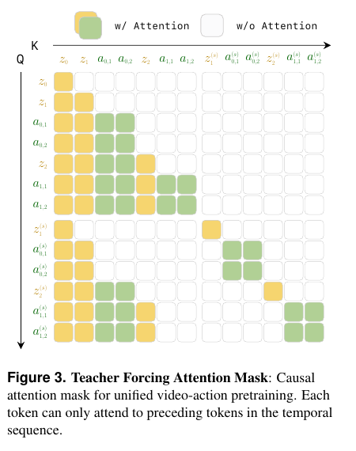

**Caption:** Causal attention mask for unified video-action pretraining. Each token can attend only to preceding tokens in temporal order.

**Caption[CN]:** 统一视频-动作预训练所用的因果注意力 mask；每个 token 只能关注时间顺序中不晚于自身的 token。

**Reading note:** 图中一个当前带噪 token 可以读取先前的干净真实 token；训练时并行处理整段 episode，但 mask 阻止未来信息泄漏。

> <strong>Para. 6:</strong> Teacher forcing treats the interleaved video-action trajectory as one sequence and trains each token from all preceding ground-truth tokens. Causal masking enforces temporal order. Unlike unconstrained generative modeling, the authors argue that this train-test gap is limited in robot control because deployment continually supplies real observations. One forward pass can supervise all episode timesteps in parallel.

> <strong>Para. 6[CN]:</strong> 教师强制把交错的视频-动作轨迹视为一条序列，让每个 token 依据此前所有真实 token 学习预测，并用因果 mask 保证时间顺序。作者认为，这种做法在机器人控制中的训练-测试差距小于纯生成任务，因为部署时环境会持续提供真实观测；同时，单次前向传播便可并行监督 episode 中的全部时间步。

> <strong>Para. 7:</strong> Noisy History Augmentation addresses the cost of video denoising. With probability $0.5$, visual history is replaced by a partially noisy interpolation with $s_{\mathrm{aug}}\in[0.5,1]$; otherwise it remains clean. This teaches inverse dynamics to extract action-relevant information before the video is fully reconstructed.

> <strong>Para. 7[CN]:</strong> 噪声历史增强用于降低视频去噪成本。以 $0.5$ 的概率，视觉历史被替换为 $s_{\mathrm{aug}}\in[0.5,1]$ 的部分含噪插值；其余情况下仍使用干净历史。这样，逆动力学模块能够学会在视频尚未完全重建时提取与动作有关的信息。

$$
\tilde z_{\le t}=
\begin{cases}
(1-s_{\mathrm{aug}})\epsilon+s_{\mathrm{aug}}z_{\le t}, & p=0.5,\ s_{\mathrm{aug}}\in[0.5,1],\ \epsilon\sim\mathcal N(0,I),\\
z_{\le t}, & 1-p=0.5.
\end{cases} \tag{10}
$$

> <strong>Para. 8:</strong> At inference, video integration can stop at $s=0.5$ instead of reaching $s=1$, approximately halving its denoising work, while action denoising still reaches $s=1$.

> <strong>Para. 8[CN]:</strong> 推理时，视频积分可以在 $s=0.5$ 提前停止，而不必达到 $s=1$，从而大约减半视频去噪量；动作去噪仍积分到 $s=1$。

#### Algorithm 1. KV Cache Inference

> <strong>Para. 9:</strong> Initialize $z_0=E(o_0)$ and cache $C=\{z_0\}$. Repeatedly sample noise, integrate the video field only to $s=0.5$ to obtain $\tilde z_{t+1:t+K}$, then integrate the action field to $s=1$ to obtain $a_{t:t+K-1}$. Execute every action in the chunk, encode the resulting real observations, append real visual latents and executed actions to the KV cache, and advance by $K$.

> <strong>Para. 9[CN]:</strong> 首先令 $z_0=E(o_0)$，建立缓存 $C=\{z_0\}$。随后循环执行：采样噪声，只把视频向量场积分到 $s=0.5$，得到 $\tilde z_{t+1:t+K}$；再把动作向量场积分到 $s=1$，得到 $a_{t:t+K-1}$。执行 chunk 内全部动作、编码执行后获得的真实观测，将真实视觉 latent 和已执行动作写入 KV 缓存，然后时间索引前进 $K$。

> <strong>Para. 10:</strong> The video dynamics and inverse-dynamics streams are trained jointly. The dynamics loss predicts the velocity of the next video latent from augmented history and past actions; the inverse-dynamics loss predicts action velocity from current/next noisy visual tokens and action history. Their sum is $\mathcal L=\mathcal L_{\mathrm{dyn}}+\lambda\mathcal L_{\mathrm{inv}}$.

> <strong>Para. 10[CN]:</strong> 视频动力学流和逆动力学流联合训练。动力学损失依据增强后的视觉历史与过去动作，预测下一视频 latent 的速度；逆动力学损失依据当前/下一时刻的含噪视觉 token 和动作历史，预测动作速度。总目标为 $\mathcal L=\mathcal L_{\mathrm{dyn}}+\lambda\mathcal L_{\mathrm{inv}}$。

$$
\mathcal L_{\mathrm{dyn}}=\mathbb E\left[\left\|v_\theta(z_{t+1}^{(s)},s,\tilde z_{\le t},a_{<t}\mid c)-\dot z_{t+1}^{(s)}\right\|^2\right], \tag{11}
$$

$$
\mathcal L_{\mathrm{inv}}=\mathbb E\left[\left\|v_\psi(a_t^{(s)},s,\tilde z_{\le t+1},a_{<t}\mid c)-\dot a_t^{(s)}\right\|^2\right]. \tag{12}
$$

### 3.4 Real-time Deployment & Asynchronous Inference

> <strong>Para. 1:</strong> KV caching avoids recomputing attention over all previous observations and actions. At each autoregressive step, only new tokens require full attention computation; cached key-value pairs summarize history.

> <strong>Para. 1[CN]:</strong> KV 缓存避免在每一步重新计算全部历史观测和动作的注意力。每个自回归步骤只需对新 token 做完整注意力计算，历史则由已经缓存的 key-value 表征提供。

### Fig. 4. 同步、朴素异步与 FDM-grounded 异步流水线

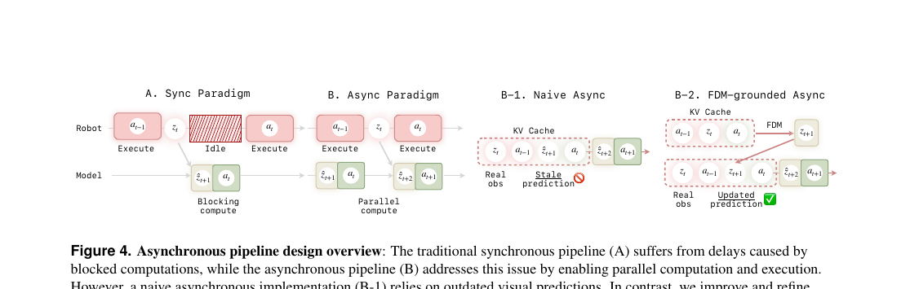

**Caption:** Synchronous inference blocks execution; asynchronous inference overlaps prediction and execution. Naive asynchronous rollout reuses stale hallucinated visual forecasts, whereas FDM-grounded asynchronous inference refreshes the forecast using recent real observations and the executing action.

**Caption[CN]:** 同步推理会阻塞机器人执行；异步推理将预测与执行重叠。朴素异步 rollout 会沿用陈旧的幻觉视频预测，而 FDM-grounded 异步推理利用最近的真实观测与正在执行的动作刷新预测。

**Reading note:** B-2 的关键不是简单并发，而是在预测下一个 action chunk 前，先做一次由真实反馈“落地”的前向动力学更新。

> <strong>Para. 2:</strong> In the asynchronous pipeline, while the robot executes action chunk $a_t$, the model predicts the next chunk using the latest available real observation. The active context contains executed $a_{t-1}$, recent ground-truth $z_{t-1}$, currently executing $a_t$, and its visual forecast $\hat z_t$. A naive implementation caches the hallucinated forecast and continues from it; because video generators favor temporal smoothness, the model may ignore the real observation and drift open-loop.

> <strong>Para. 2[CN]:</strong> 在异步流水线中，机器人执行动作块 $a_t$ 的同时，模型使用当前可获得的最新真实观测预测下一块。活动上下文包括已执行的 $a_{t-1}$、最近真实观测 $z_{t-1}$、正在执行的 $a_t$，以及与其对应的视觉预测 $\hat z_t$。朴素实现会缓存幻觉预测并沿其继续生成；由于视频生成器偏好时间平滑，它可能忽略真实观测，逐步退化为开环漂移。

> <strong>Para. 3:</strong> The FDM-grounded variant uses the recent feedback $z_{t-1}$ and current action $a_t$ to re-imagine the resulting state $z_t$, then caches this feedback-grounded prediction rather than the stale forecast. The next visual/action prediction is therefore realigned with the environment.

> <strong>Para. 3[CN]:</strong> FDM-grounded 方案利用最近反馈 $z_{t-1}$ 和当前动作 $a_t$，重新“想象”动作后的状态 $z_t$，并缓存这个由反馈约束的预测，而不是陈旧预测。这样，下一次视觉/动作预测会重新与现实环境对齐。

#### Algorithm 2. Asynchronous Inference and Execution

> <strong>Para. 4:</strong> After a cold-start prediction, two branches run in parallel. Branch A asynchronously executes the precomputed action chunk and queues real observations. Branch B dequeues feedback, encodes it, updates the cache with real latents and executed actions, temporarily adds the currently executing action, predicts its visual outcome through FDM, and then predicts the subsequent visual/action chunk. The loop advances by $K$.

> <strong>Para. 4[CN]:</strong> 冷启动预测后，两条分支并行运行。分支 A 异步执行预先计算的动作块，并把真实观测写入队列；分支 B 从队列取出反馈并编码，用真实 latent 和已执行动作更新缓存，再临时加入当前正在执行的动作，通过 FDM 预测其视觉结果，最后预测再下一段视频/动作块。每轮时间索引前进 $K$。

> <strong>Para. 5:</strong> During post-training, the authors add a forward-dynamics loss that predicts the next visual latent from current real state, action, and prior context:

> <strong>Para. 5[CN]:</strong> 在后训练阶段，作者加入前向动力学损失，要求模型依据当前真实状态、动作及历史上下文预测下一视觉 latent：

$$
\mathcal L_{\mathrm{fdm}}=\mathbb E\left[\left\|v_\psi(\tilde z_{t+1},s,z_t,a_t,\tilde z_{<t},\hat a_{<t}\mid c)-\dot z_{t+1}^{(s)}\right\|^2\right]. \tag{13}
$$

## 4 Experiments

### 4.1 Dataset Curation and Preprocessing

> <strong>Para. 1:</strong> The training corpus aggregates public robot-manipulation datasets, each split 90%/10% for training and validation. Preprocessing standardizes data formats and annotation quality.

> <strong>Para. 1[CN]:</strong> 训练语料汇总多个公开机器人操作数据集，每个数据集按 90%/10% 划分训练集与验证集，并通过预处理统一数据格式和标注质量。

> <strong>Para. 2:</strong> A universal dual-arm action interface represents each arm by a 7-D end-effector pose (XYZ plus quaternion), up to seven joint angles padded with zeros when necessary, and one gripper dimension. The full dual-arm vector is therefore $(7+7+1)\times2=30$ dimensions.

> <strong>Para. 2[CN]:</strong> 通用双臂动作接口用 7 维末端位姿（XYZ 加四元数）、最多 7 维关节角（不足时补零）和 1 维夹爪动作表示每条机械臂，因此完整双臂动作向量为 $(7+7+1)\times2=30$ 维。

> <strong>Para. 3:</strong> Data come from Agibot [2], RoboMind [81], InternData-A1 [74], the OpenVLA subset of OXE [53], UMI datasets [18, 45, 48, 51, 60, 92] excluding DexUMI, RoboCOIN [84], and internally collected demonstrations. The aggregate corpus contains about 16K hours across embodiments, tasks, and environments.

> <strong>Para. 3[CN]:</strong> 数据来源包括 Agibot [2]、RoboMind [81]、InternData-A1 [74]、OXE [53] 的 OpenVLA 子集、去除 DexUMI 后的 UMI 数据 [18, 45, 48, 51, 60, 92]、RoboCOIN [84]，以及内部采集示范。汇总语料约 1.6 万小时，覆盖多种机器人本体、任务与环境。

### 4.2 Implementation & Training Details

> <strong>Para. 1:</strong> The video stream uses Wan2.2-5B with $d_v=3072$ and 30 transformer layers. The action stream has $d_a=768$ and about 350M parameters, yielding a 5.3B total model. Both use RoPE and MoT. The Wan2.2 causal VAE compresses by $4\times16\times16$ in time, height, and width; patchification reduces spatial dimensions by another factor of 2. Concatenated views produce $N=192$ spatial tokens per frame. Action MLPs have hidden width 256, actions use per-dimension quantile normalization, and a frozen T5 encoder supplies language through cross-attention. Training samples $K\in[1,4]$.

> <strong>Para. 1[CN]:</strong> 视频流采用 30 层、$d_v=3072$ 的 Wan2.2-5B。动作流宽度为 $d_a=768$，约含 3.5 亿参数，总模型规模为 53 亿参数。两条流都采用 RoPE 并由 MoT 连接。Wan2.2 因果 VAE 在时间、高度、宽度上按 $4\times16\times16$ 压缩，patchify 又把空间尺寸缩小 2 倍；多视角沿宽度拼接后，每帧得到 $N=192$ 个空间 token。动作编码/解码 MLP 隐层宽度为 256；动作按维度做分位数归一化；冻结 T5 编码器通过 cross-attention 注入任务指令。训练时采样 $K\in[1,4]$。

> <strong>Para. 2:</strong> Inference uses three Euler steps for video, stopping at $s=0.6$, and ten steps for action, reaching $s=1$. Video/action CFG scales are 5.0/1.0. Noise augmentation uses probability $0.5$ with $s_{\mathrm{aug}}\sim\mathrm{Uniform}[0.5,1]$. Episodes are packed into sequences up to 10K tokens with attention masks.

> <strong>Para. 2[CN]:</strong> 推理时，视频使用 3 步 Euler 求解并在 $s=0.6$ 停止；动作使用 10 步并积分到 $s=1$。视频/动作的 CFG 系数分别为 5.0/1.0。噪声增强概率为 $0.5$，且 $s_{\mathrm{aug}}\sim\mathrm{Uniform}[0.5,1]$。参考 LLM 训练方式，多个 episode 被打包进最长 10K token 的序列，并由 attention mask 隔离。

### Fig. 5. 六项实机任务与总体结果

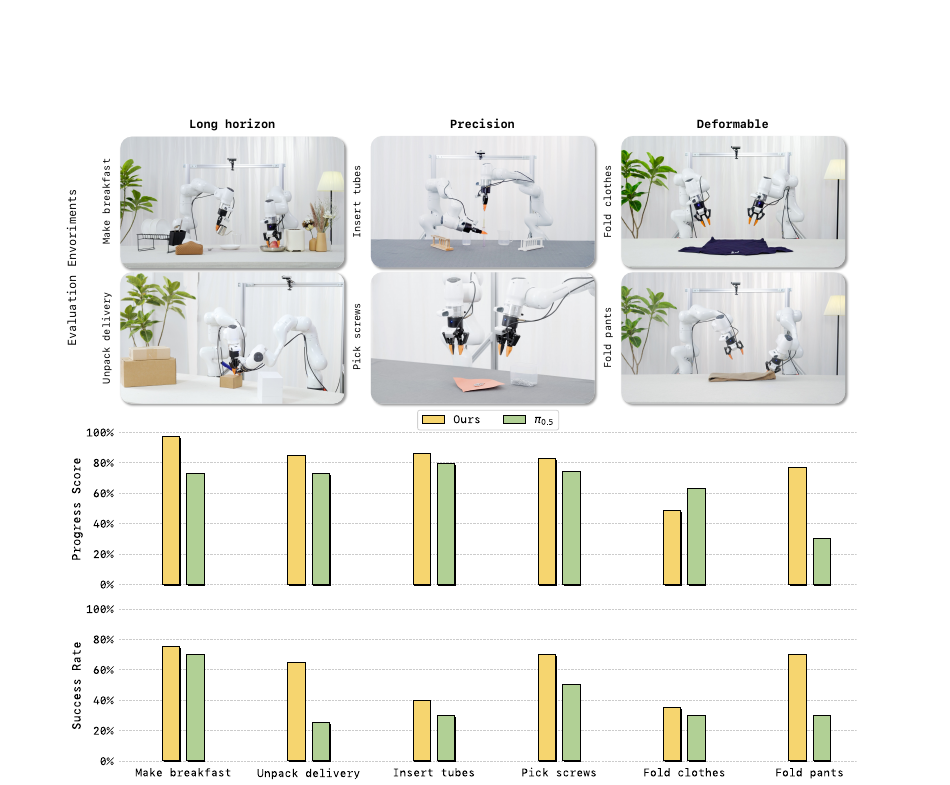

**Caption:** Real-world evaluation covers long-horizon, precision, and deformable/articulated-object tasks; the figure reports success rate and progress score against $\pi_{0.5}$.

**Caption[CN]:** 实机评测覆盖长时序、精密操作以及可变形/关节物体任务，并以成功率和进度分数比较 LingBot-VA 与 $\pi_{0.5}$。

**Reading note:** 需同时看 SR 与 PS：某次 rollout 未完成全部步骤时，PS 仍保留已完成中间步骤的信息。

> <strong>Para. 3:</strong> Pretraining runs for 1.4T tokens on the curated corpus using AdamW, peak learning rate $10^{-4}$, weight decay $0.01$, cosine decay with linear warmup, bfloat16, and gradient clipping at 2.0. Text dropout for classifier-free guidance is 0.1, $\lambda=1$, datasets are uniformly sampled, and video/action use uniform-SNR sampling.

> <strong>Para. 3[CN]:</strong> 预训练在整理后的语料上进行 1.4T token，采用 AdamW、峰值学习率 $10^{-4}$、权重衰减 $0.01$、线性 warmup 加余弦退火、bfloat16 混合精度和 2.0 的梯度裁剪。classifier-free guidance 的文本 dropout 为 0.1，$\lambda=1$；各数据源均匀采样，视频与动作均使用 uniform-SNR sampler。

> <strong>Para. 4:</strong> For post-training on new robot platforms, the authors report that 50 demonstrations can suffice. Their default uses learning rate $10^{-5}$ for 3K steps; a faster alternative uses $10^{-4}$ for 1K steps with slightly worse results.

> <strong>Para. 4[CN]:</strong> 面向新机器人平台后训练时，作者称 50 条示范即可有效适配。默认设置使用学习率 $10^{-5}$ 训练 3K 步；资源受限时可改用 $10^{-4}$ 训练 1K 步，但性能略差。

### 4.3 Main Results

#### 4.3.1 Real-world Deployment

> <strong>Para. 1:</strong> Six physical-robot tasks cover three categories: long-horizon Make Breakfast and Unpack Delivery; precision-oriented Insert Tubes and Pick Screws; and deformable-object Fold Clothes and Fold Pants. Each task uses only 50 real demonstrations. The reported task-specific run fine-tunes for 500 steps with learning rate $10^{-4}$ and sequence length 150,000.

> <strong>Para. 1[CN]:</strong> 六项实机任务分为三类：长时序的 Make Breakfast 与 Unpack Delivery；强调精度的 Insert Tubes 与 Pick Screws；以及可变形物体任务 Fold Clothes 与 Fold Pants。每项任务仅采集 50 条真实示范，文中报告的任务训练采用学习率 $10^{-4}$、序列长度 150,000，微调 500 步。

### Fig. 6. 六项实机任务的分步流程

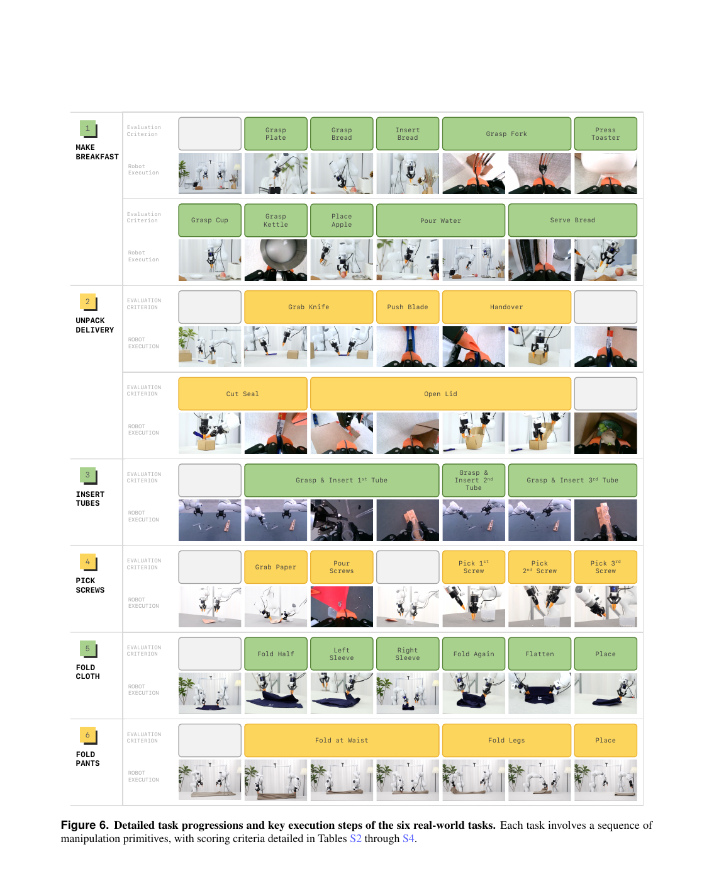

**Caption:** Detailed execution and scoring stages for the six real-world tasks. The exact per-step criteria are reported in Appendix Tables S2–S7.

**Caption[CN]:** 六项实机任务的详细执行过程与分步评分标准；逐步骤评测记录见附录 Table S2–S7。

**Reading note:** 该图说明“成功”不是一次简单抓取，而是多个原子步骤全部完成；这也是论文强调长期记忆与进度分数的原因。

> <strong>Para. 2:</strong> LingBot-VA outperforms $\pi_{0.5}$ across all six tasks on success rate and progress score. The authors associate long-horizon gains with persistent temporal memory, precision gains with tighter video-action coupling in the unified latent space, and deformable-object gains with generated futures that provide implicit guidance about object dynamics.

> <strong>Para. 2[CN]:</strong> LingBot-VA 在六项任务的成功率与进度分数上均优于 $\pi_{0.5}$。作者把长时序优势归因于持久时间记忆，把精度优势归因于共享 latent 空间中更紧密的视频-动作耦合，并认为生成的未来视频可隐式提供物体动态信息，从而改善可变形物体操作。

#### 4.3.2 Simulation Evaluation

> <strong>Para. 1:</strong> Simulation evaluation uses RoboTwin 2.0 [15] and LIBERO [47]. RoboTwin training combines 2,500 clean-scene demonstrations (50 per task) with 25,000 heavily randomized demonstrations (500 per task). Video is reduced from 50 Hz to 12.5 Hz while actions remain 50 Hz; training uses 50K steps at learning rate $10^{-5}$. Tasks are grouped by horizon.

> <strong>Para. 1[CN]:</strong> 仿真评测采用 RoboTwin 2.0 [15] 和 LIBERO [47]。RoboTwin 训练数据包括 2,500 条干净场景示范（每任务 50 条）和 25,000 条强随机化场景示范（每任务 500 条）。视频从 50 Hz 下采样到 12.5 Hz，动作仍为 50 Hz；模型以学习率 $10^{-5}$ 训练 50K 步。任务按操作 horizon 分组。

> <strong>Para. 2:</strong> LIBERO evaluation covers Spatial, Object, Goal, and Long suites, each with ten tasks and 50 demonstrations per task. Failed demonstrations are filtered following OpenVLA. Fine-tuning uses 4K steps, learning rate $10^{-5}$, and sequence length $10^5$. Each suite is evaluated over three seeds, 500 trials per seed.

> <strong>Para. 2[CN]:</strong> LIBERO 评测覆盖 Spatial、Object、Goal 和 Long 四个套件，每套含 10 个任务、每任务 50 条示范。作者遵循 OpenVLA 过滤失败示范，以学习率 $10^{-5}$、序列长度 $10^5$ 微调 4K 步。每个套件使用三个随机种子，每个种子评测 500 次，共 1,500 次。

### Table 1. RoboTwin 2.0 汇总结果

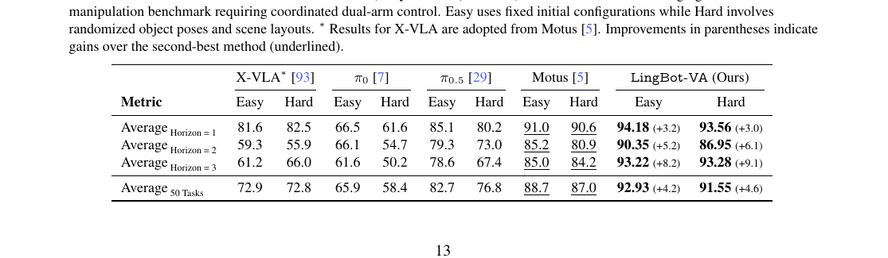

**Caption:** On 50 RoboTwin tasks, LingBot-VA reaches 92.93% on Easy and 91.55% on Hard. At horizon 3, gains over the runner-up are +8.2 and +9.1 points.

**Caption[CN]:** 在 50 项 RoboTwin 任务上，LingBot-VA 的 Easy/Hard 平均成功率为 92.93%/91.55%；在 horizon 3 上，分别领先第二名 8.2/9.1 个百分点。

**Reading note:** 随 horizon 增大，优势没有缩小，反而变大，这是作者支持“长期记忆有效”的核心证据之一。

### Table 2. LIBERO 结果

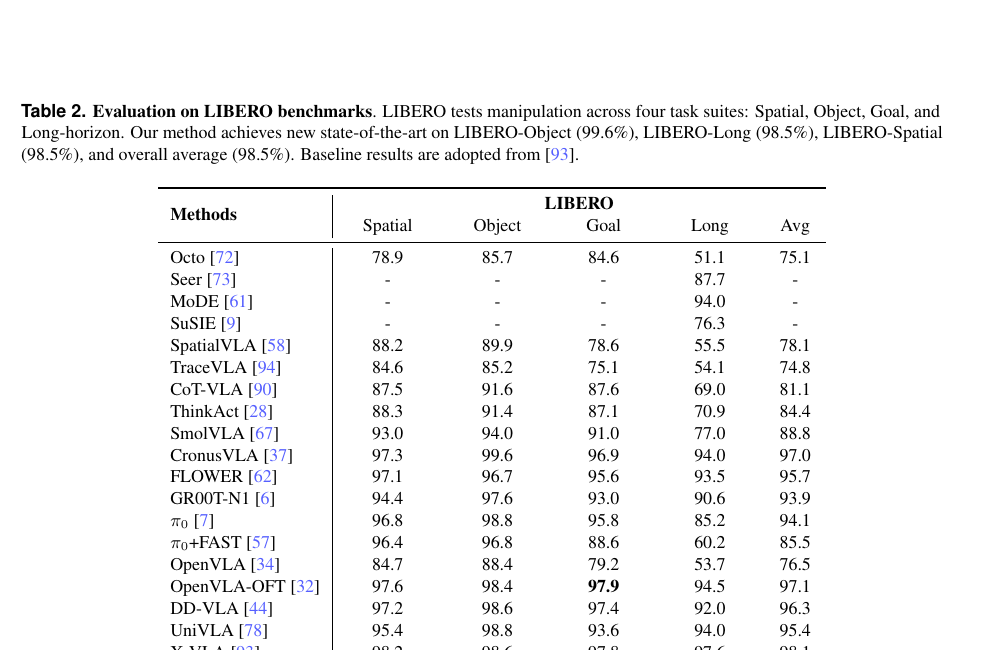

**Caption:** LingBot-VA reports 98.5% Spatial, 99.6% Object, 97.2% Goal, 98.5% Long, and 98.5% average success.

**Caption[CN]:** LingBot-VA 在 LIBERO Spatial、Object、Goal、Long 和总体平均上的成功率分别为 98.5%、99.6%、97.2%、98.5% 和 98.5%。

**Reading note:** 平均结果只比强基线 X-VLA 高 0.4 点，但 LIBERO-Long 的差距更能对应本文的长时序主张。

> <strong>Para. 3:</strong> RoboTwin requires coordinated bimanual control under fixed Easy and randomized Hard configurations. LingBot-VA obtains 92.9% and 91.6%, respectively, outperforming $\pi_0$, $\pi_{0.5}$, X-VLA, and Motus. Its larger gains at horizon 3 are interpreted as evidence that autoregressive cached context improves long-range temporal behavior.

> <strong>Para. 3[CN]:</strong> RoboTwin 要求双臂协调控制，Easy 使用固定初始配置，Hard 则随机化物体姿态和场景布局。LingBot-VA 分别达到 92.9% 和 91.6%，超过 $\pi_0$、$\pi_{0.5}$、X-VLA 与 Motus。它在 horizon 3 上更大的领先幅度，被作者解释为自回归缓存上下文改善长时序行为的证据。

> <strong>Para. 4:</strong> On LIBERO, the 98.5% mean and 98.5% LIBERO-Long result establish the paper’s claimed state of the art among the compared foundation VLA methods.

> <strong>Para. 4[CN]:</strong> 在 LIBERO 上，98.5% 的总体平均值和 98.5% 的 LIBERO-Long 结果构成作者所称的领先性能，比较范围是表中列出的基础 VLA 方法。

### 4.4 Ablation

### Table 3. RoboTwin 消融

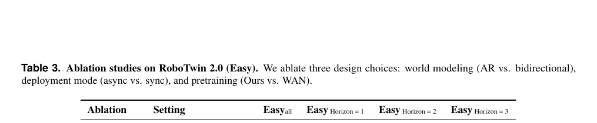

**Caption:** The ablation compares the main model with FDM-grounded asynchronous execution, naive asynchronous execution, and direct WAN initialization.

**Caption[CN]:** 消融比较完整模型、FDM-grounded 异步执行、朴素异步执行，以及仅从 WAN 视频模型直接适配的设置。

**Reading note:** 朴素异步的整体 Easy 成功率为 74.3，而 FDM-grounded async 为 90.4；最大差异出现在 horizon 3（32.9 对 85.6），直接支持“陈旧幻觉会在长任务中漂移”。

> <strong>Para. 1:</strong> Asynchronous and synchronous variants have comparable success, but asynchronous execution finishes tasks about twice as fast by predicting future video and actions while the current chunk executes.

> <strong>Para. 1[CN]:</strong> 异步与同步方案的成功率相近，但异步方案在执行当前 chunk 时同时预测后续视频和动作，因此任务完成速度约快 2 倍。

> <strong>Para. 2:</strong> To isolate pretraining, pretrained LingBot-VA and the original WAN backbone are fine-tuned on the same RoboTwin data with identical procedures. LingBot-VA reaches 92.10% Easy and 91.12% Hard, while direct WAN adaptation is substantially lower. The paper attributes the gap to robot video-action pretraining rather than the video backbone alone.

> <strong>Para. 2[CN]:</strong> 为隔离预训练作用，作者把预训练 LingBot-VA 与原始 WAN 骨干放在同一 RoboTwin 数据和同一后训练流程下比较。LingBot-VA 达到 92.10% Easy 和 91.12% Hard，而直接适配 WAN 明显更低。作者据此把差距归因于机器人视频-动作联合预训练，而不是仅仅来自视频骨干。

### Fig. 7. 动作网络初始化的训练动态

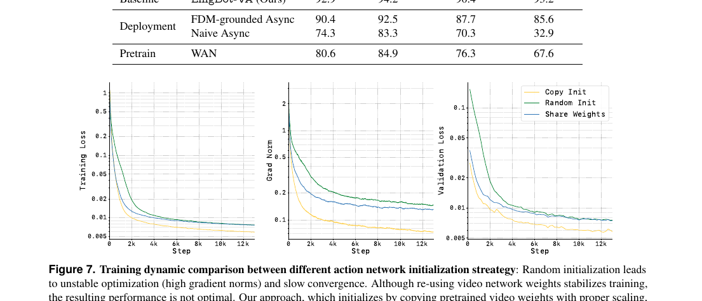

**Caption:** Random initialization is unstable and slow; direct weight sharing is stable but suboptimal; dimension-adapted copying of video weights with variance-preserving scaling converges most smoothly.

**Caption[CN]:** 随机初始化不稳定且收敛慢；直接共享权重虽稳定但并非最优；将视频权重适配到动作维度并做方差保持缩放，训练最平滑。

**Reading note:** 三幅曲线分别给出训练损失、梯度范数和验证损失；优势主要体现在训练稳定性，而非提出新的优化器。

> <strong>Para. 3:</strong> The training curves show that random action initialization creates volatile gradients and slow convergence because its feature distribution initially conflicts with the video stream. The scaled copied initialization is smoother and reaches lower validation loss.

> <strong>Para. 3[CN]:</strong> 训练曲线显示，随机初始化动作流会产生剧烈梯度波动并减慢收敛，原因是其初始特征分布与视频流不匹配。经过缩放的拷贝初始化更平滑，并达到更低的验证损失。

### 4.5 Analysis

#### 4.5.1 Sample Efficiency

### Fig. 8. 后训练样本效率

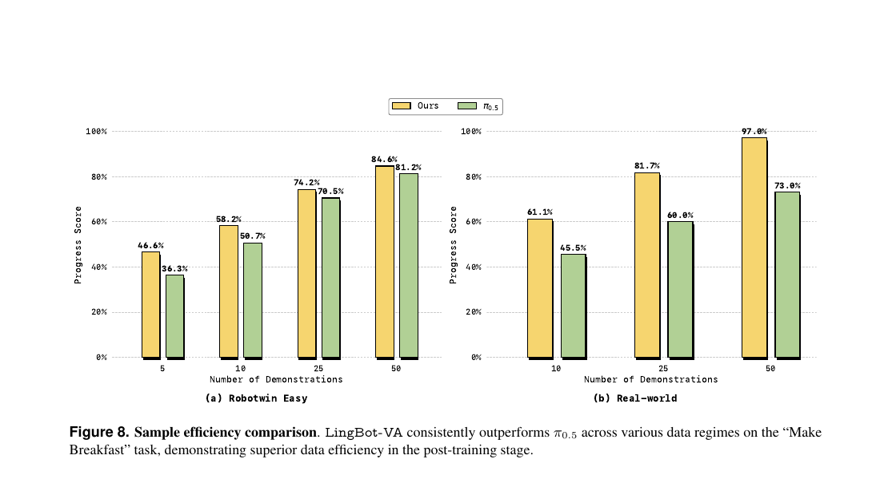

**Caption:** LingBot-VA versus $\pi_{0.5}$ under 5/10/25/50 demonstrations on RoboTwin Easy and 10/25/50 demonstrations on real-world Make Breakfast.

**Caption[CN]:** LingBot-VA 与 $\pi_{0.5}$ 在 RoboTwin Easy 的 5/10/25/50 条示范，以及实机 Make Breakfast 的 10/25/50 条示范下进行比较。

**Reading note:** 低数据区间差距更明显；例如 10 条示范时，RoboTwin Easy 高 10.3 点，实机任务高 15.6 点。

> <strong>Para. 1:</strong> Sample efficiency is measured on Make Breakfast and RoboTwin Easy. Across all demonstration counts, LingBot-VA exceeds $\pi_{0.5}$. With ten demonstrations, progress is higher by 15.6 points on Make Breakfast and 10.3 points on RoboTwin Easy.

> <strong>Para. 1[CN]:</strong> 样本效率在 Make Breakfast 与 RoboTwin Easy 上评测。所有示范数量下，LingBot-VA 均优于 $\pi_{0.5}$；使用 10 条示范时，Make Breakfast 和 RoboTwin Easy 的进度分数分别高 15.6 和 10.3 个百分点。

> <strong>Para. 2:</strong> The authors attribute the gain to visual-dynamics and object-interaction priors learned by the jointly pretrained video stream. These priors regularize post-training, whereas a VLA without explicit visual dynamics must acquire more task-specific behavior from demonstrations.

> <strong>Para. 2[CN]:</strong> 作者把这种优势归因于联合预训练视频流所学的视觉动态与物体交互先验。这些先验在后训练中起到隐式正则化作用；没有显式视觉动态建模的 VLA 则需要更多示范才能获得任务特定行为。

#### 4.5.2 Temporal Memory

### Fig. 9. 时间记忆评测

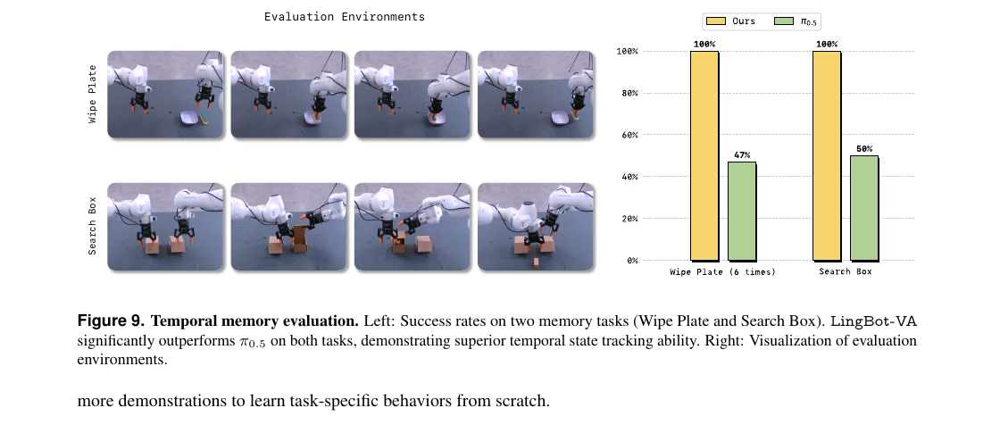

**Caption:** Wipe Plate requires exactly six wipes; Search Box requires remembering that the right box was already checked. LingBot-VA outperforms $\pi_{0.5}$ on both.

**Caption[CN]:** Wipe Plate 要求恰好擦拭六次；Search Box 要求记住右侧盒子已经检查过。LingBot-VA 在两项任务上均优于 $\pi_{0.5}$。

**Reading note:** 这两项任务刻意破坏“仅凭当前帧即可决策”的假设，用计数和已搜索位置测试历史状态跟踪。

> <strong>Para. 1:</strong> Wipe Plate requires the robot to wipe exactly six times, testing counting over repeated actions. Search Box contains two boxes, one with a block. Training places the block equally often in either box; testing always places it in the left box. A memoryless policy may reopen the already checked right box with 50% probability, whereas a stateful policy proceeds left.

> <strong>Para. 1[CN]:</strong> Wipe Plate 要求机器人恰好擦拭六次，用重复动作中的计数测试记忆。Search Box 包含左右两个盒子，只有一个装有积木；训练时积木等概率位于任一盒子，测试时总在左盒。没有记忆的策略在发现右盒为空后，仍有 50% 概率再次打开右盒；有状态策略则会继续搜索左盒。

> <strong>Para. 2:</strong> LingBot-VA performs substantially better on both memory tasks. The explanation offered is that teacher forcing exposes full history in training, while the KV cache preserves history at inference.

> <strong>Para. 2[CN]:</strong> LingBot-VA 在两项记忆任务上都明显更好。论文给出的解释是：训练时教师强制让预测读取完整历史，推理时 KV 缓存又持续保存这些历史。

#### 4.5.3 Generalization

### Fig. 10. 新物体与空间泛化

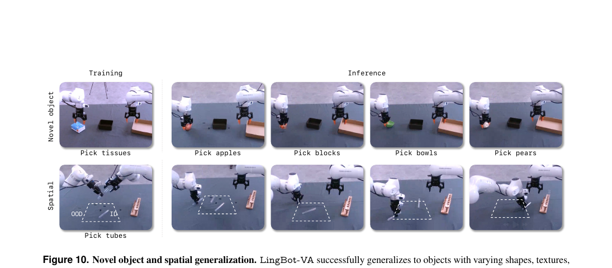

**Caption:** The model is trained with one object and localized positions, then tested on objects with new shapes/textures and on placements outside the training region.

**Caption[CN]:** 模型在单一物体和局部位置上训练，再测试不同形状/纹理的新物体，以及训练区域以外的物体摆放。

**Reading note:** 该图主要是定性序列，没有像主表那样给出系统数值，因此对“强泛化”的支持力度弱于 RoboTwin/LIBERO 结果。

> <strong>Para. 1:</strong> Novel-object evaluation trains pick-and-place with one object and tests different shapes and textures. Spatial evaluation trains fixed positions in a localized in-distribution region and tests randomized placements, especially out-of-distribution regions.

> <strong>Para. 1[CN]:</strong> 新物体泛化实验用单一物体训练 pick-and-place，再测试不同形状与纹理的物体；空间泛化实验在局部 ID 区域的固定位置训练，再测试随机位置，尤其是 OOD 区域。

> <strong>Para. 2:</strong> The qualitative examples show successful transfer in both settings. The paper argues that video prediction learns object-agnostic visual and physical priors.

> <strong>Para. 2[CN]:</strong> 定性样例显示模型在两种设置下都能成功迁移。论文认为，视频预测学习到了与具体物体无关的视觉表征和物理先验。

## 5 Related Work

> <strong>Para. 1:</strong> Large VLA policies such as $\pi_{0.5}$ [29], GR-3 [39], and GR00T-N1 [6] use web knowledge and diverse robot demonstrations to map perception to control. Most inherit pretrained VLMs [6, 7, 11, 29, 34, 39, 87, 93], and recent work improves lightweight deployment, tokenization, real-time inference, and fine-tuning [8, 10, 30, 32, 38, 49, 57, 62, 67, 70]. The paper argues that image-text pretraining underrepresents fine physical dynamics and low-level trajectories; direct action supervision approximates action distributions without explicitly learning transitions, and reactive current-observation policies cannot resolve history-dependent ambiguity. Recent world-model policies [1, 5, 40, 64, 97] address dynamics but often retain bidirectional attention and lack persistent full-trajectory memory. LingBot-VA instead imposes causal temporal structure and maintains a KV cache over the interaction history.

> <strong>Para. 1[CN]:</strong> $\pi_{0.5}$ [29]、GR-3 [39]、GR00T-N1 [6] 等大型 VLA 利用网络知识和多样机器人示范，把感知直接映射到控制；多数方法继承预训练 VLM [6, 7, 11, 29, 34, 39, 87, 93]，近期研究则继续改善轻量部署、token 化、实时推理和微调 [8, 10, 30, 32, 38, 49, 57, 62, 67, 70]。本文认为，图像-文本预训练缺少精细物理动态与低层轨迹；动作监督只能逼近动作分布，却没有显式学习状态转移；只看当前观测的反应式策略也无法解决依赖历史的歧义。近期世界模型策略 [1, 5, 40, 64, 97] 开始建模动力学，但常保留双向注意力，也缺少贯穿完整轨迹的持久记忆。LingBot-VA 则引入因果时间结构，并用 KV 缓存保存交互历史。

> <strong>Para. 2:</strong> Robot world models may represent state in latent vectors [36, 41, 63, 80], 3D point clouds with graph networks [66, 69, 77, 88, 89], or pixels/keyframes/video [21, 33, 95, 96]. LingBot-VA belongs to the third category and specifically predicts future frames during execution to condition action generation. Earlier open-loop video-conditioned policies can suffer mismatch between hallucinated and real dynamics, accumulated execution drift, and high generation latency. LingBot-VA uses causal masking, KV caching, real-observation refresh, and partial denoising to target these issues.

> <strong>Para. 2[CN]:</strong> 机器人世界模型可以在紧凑 latent 向量 [36, 41, 63, 80]、由图网络处理的 3D 点云 [66, 69, 77, 88, 89]，或者像素/关键帧/视频 [21, 33, 95, 96] 中表示状态。LingBot-VA 属于第三类，并在执行过程中预测未来帧，以此为动作生成提供条件。早期开环视频条件策略会受到幻觉视频与真实动态失配、执行误差累积以及视频生成延迟的影响；LingBot-VA 针对这些问题组合了因果 mask、KV 缓存、真实观测刷新和部分去噪。

## 6 Conclusion

> <strong>Para. 1:</strong> LingBot-VA unifies video dynamics prediction and action inference in an autoregressive diffusion framework. Interleaved tokens and a MoT architecture model causal physical interactions, while real observations provide closed-loop updates. The paper reports about 92% on RoboTwin 2.0, 98.5% on LIBERO, and more than 20-point gains over $\pi_{0.5}$ on challenging adapted tasks with 50 demonstrations.

> <strong>Para. 1[CN]:</strong> LingBot-VA 在自回归扩散框架中统一视频动态预测与动作推断。交错 token 和 MoT 架构用于建模因果物理交互，真实观测则持续提供闭环更新。论文报告 RoboTwin 2.0 约 92%、LIBERO 98.5% 的结果，并在仅用 50 条示范适配的困难任务上，相比 $\pi_{0.5}$ 提升超过 20 个百分点。

> <strong>Para. 2:</strong> Future work includes more efficient video compression and additional tactile, force, and audio inputs for contact-rich manipulation.

> <strong>Para. 2[CN]:</strong> 未来工作包括更高效的视频压缩，以及引入触觉、力觉和音频等多模态传感信号，以增强复杂接触任务中的鲁棒性。

> <strong>Para. 3:</strong> The authors thank Kecheng Zheng, Wei Wu, Fangyi Xu, and Yishu Shen for discussions, dataset preparation, and post-training data collection.

> <strong>Para. 3[CN]:</strong> 作者感谢 Kecheng Zheng、Wei Wu、Fangyi Xu 与 Yishu Shen 在讨论、数据准备和后训练数据采集方面的帮助。

## References

> <strong>Para. 1:</strong> The source PDF contains 97 bibliography entries on VLA policies, video/world models, flow matching, robot datasets, and manipulation benchmarks. Entries [1]–[97] are retained verbatim in the source PDF and are not translated line by line in this reader.

> <strong>Para. 1[CN]:</strong> 原 PDF 含 97 条参考文献，覆盖 VLA、视频/世界模型、流匹配、机器人数据集和操作基准。为避免破坏标准书目信息，本 reader 不逐条翻译 [1]–[97]；完整条目保留在源 PDF 中。

## Appendix A. Real-world Evaluation Details

> <strong>Para. 1:</strong> Every real-world task is evaluated for 20 trials with LingBot-VA and 20 trials with $\pi_{0.5}$. Trials alternate between methods to improve fairness. Each intermediate step receives 1 for first-attempt success, 0.5 if a retry is needed, and 0 for failure. A trial counts as fully successful only when every step is completed.

> <strong>Para. 1[CN]:</strong> 每项实机任务分别使用 LingBot-VA 与 $\pi_{0.5}$ 评测 20 次，并交替执行两种方法以提高公平性。每个中间步骤首次成功记 1 分、重试后成功记 0.5 分、失败记 0 分；只有全部步骤完成时，整次试验才计为成功。

> <strong>Para. 2:</strong> Progress Score is the average accumulated step score divided by the maximum score, expressed as a percentage. Success Rate is the number of fully successful trials divided by the number of trials.

> <strong>Para. 2[CN]:</strong> 进度分数等于全部试验的平均累计步骤得分除以最高可能得分，并转为百分比；成功率等于完整成功的试验次数除以总试验次数。

$$
\mathrm{PS}=\frac{\text{Average Progress}}{\text{Max Steps}}\times100\%,\qquad
\mathrm{SR}=\frac{\#\text{Successful Trials}}{N}\times100\%.
$$

> <strong>Para. 3:</strong> The six tasks are Make Breakfast (10 steps), Pick Screws (5 steps), Fold Clothes (6 steps), Unpack Delivery (5 steps), Insert Tubes (three grasps and three insertions), and Fold Pants (3 steps). They span long-horizon sequencing, precision control, and deformable-object manipulation. Tables S2–S7 report every trial.

> <strong>Para. 3[CN]:</strong> 六项任务分别是 Make Breakfast（10 步）、Pick Screws（5 步）、Fold Clothes（6 步）、Unpack Delivery（5 步）、Insert Tubes（三次抓取加三次插入）和 Fold Pants（3 步），覆盖长时序规划、精细控制与可变形物体操作。Table S2–S7 给出每次试验的完整记录。

### Table S1. RoboTwin 2.0 的 50 项逐任务结果

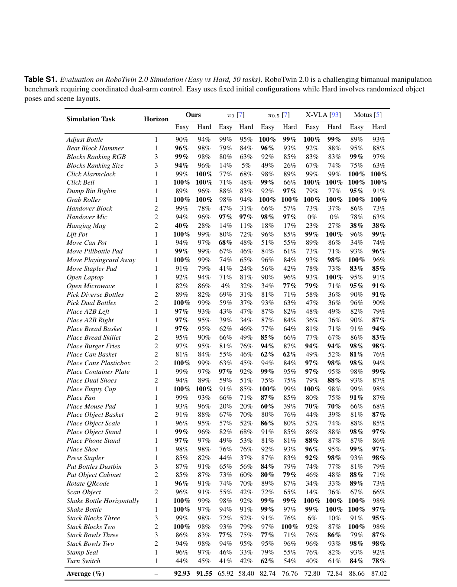

**Caption:** Per-task Easy/Hard success rates and task horizons for LingBot-VA, $\pi_0$, $\pi_{0.5}$, X-VLA, and Motus.

**Caption[CN]:** LingBot-VA、$\pi_0$、$\pi_{0.5}$、X-VLA 与 Motus 在 RoboTwin 2.0 的 50 项任务上的 Easy/Hard 成功率及任务 horizon。

**Reading note:** 总体平均掩盖了任务差异；例如 Hanging Mug 和 Turn Switch 对所有方法都更困难，而部分简单抓放任务已接近饱和。

### Table S2. Make Breakfast 逐试验结果

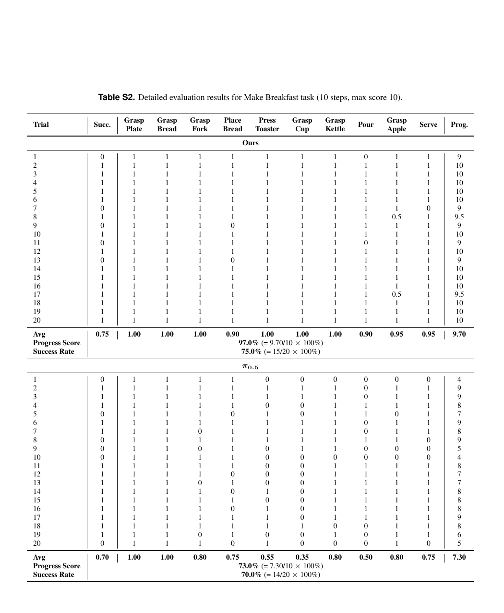

**Caption:** Twenty trials per method over ten scored stages. LingBot-VA reports PS 97.0% and SR 75.0%; $\pi_{0.5}$ reports PS 73.0% and SR 70.0%.

**Caption[CN]:** 每种方法进行 20 次、每次含 10 个评分步骤。LingBot-VA 的 PS/SR 为 97.0%/75.0%，$\pi_{0.5}$ 为 73.0%/70.0%。

### Table S3. Pick Screws 逐试验结果

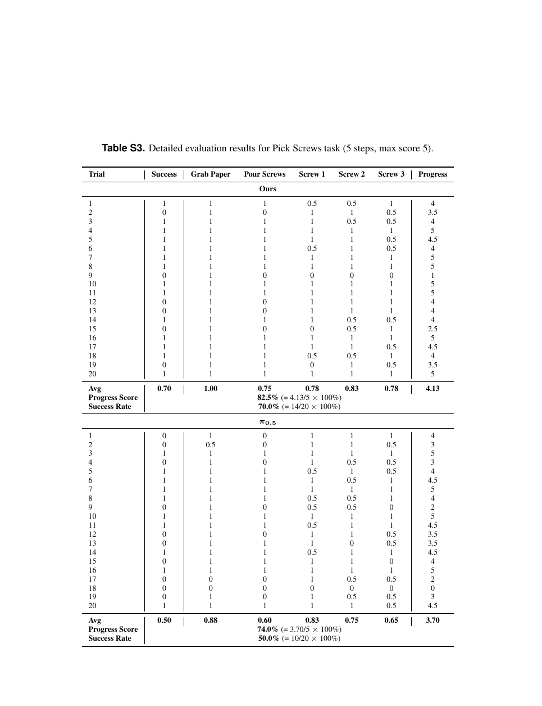

**Caption:** LingBot-VA reports PS 82.5% and SR 70.0%; $\pi_{0.5}$ reports PS 74.0% and SR 50.0%.

**Caption[CN]:** LingBot-VA 的 PS/SR 为 82.5%/70.0%，$\pi_{0.5}$ 为 74.0%/50.0%。

### Table S4. Fold Clothes 逐试验结果

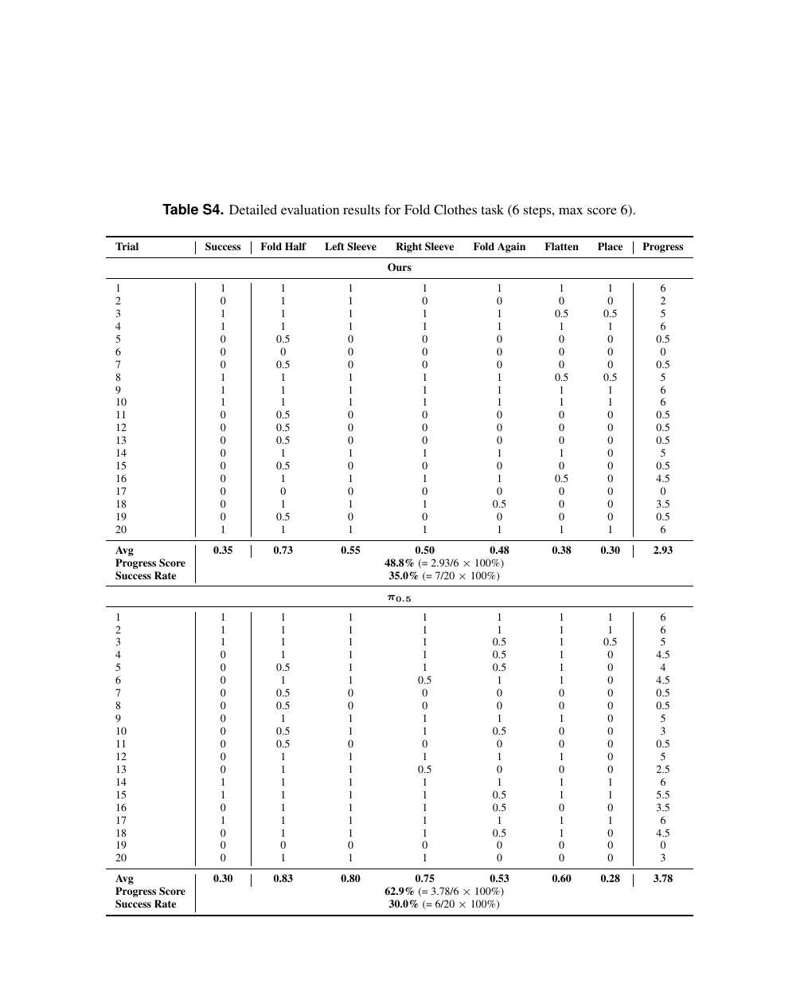

**Caption:** LingBot-VA reports PS 48.8% and SR 35.0%; $\pi_{0.5}$ reports PS 62.9% and SR 30.0%.

**Caption[CN]:** LingBot-VA 的 PS/SR 为 48.8%/35.0%，$\pi_{0.5}$ 为 62.9%/30.0%。这里两项指标给出不同排序：LingBot-VA 的完整成功率略高，但 $\pi_{0.5}$ 的平均进度更高。

### Table S5. Unpack Delivery 逐试验结果

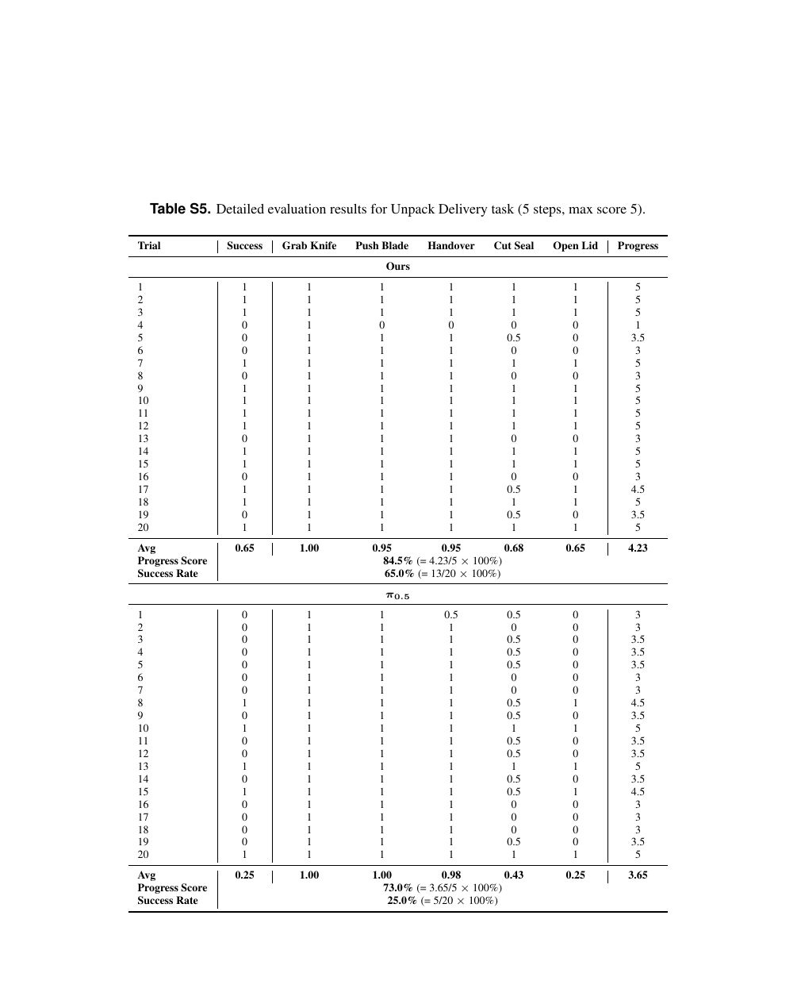

**Caption:** LingBot-VA reports PS 84.5% and SR 65.0%; $\pi_{0.5}$ reports PS 73.0% and SR 25.0%.

**Caption[CN]:** LingBot-VA 的 PS/SR 为 84.5%/65.0%，$\pi_{0.5}$ 为 73.0%/25.0%。

### Table S6. Insert Tubes 逐试验结果

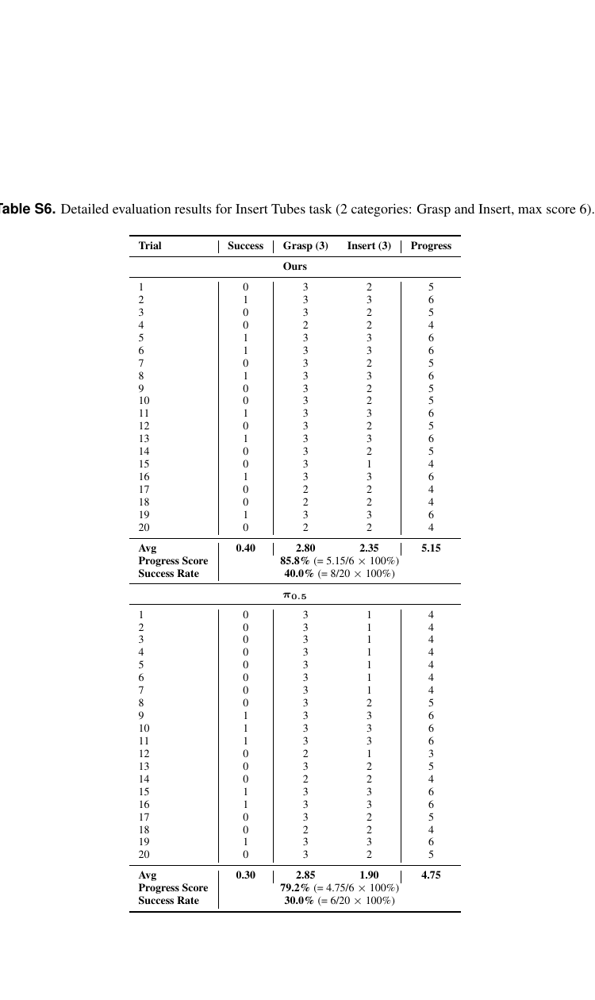

**Caption:** LingBot-VA reports PS 85.8% and SR 40.0%; $\pi_{0.5}$ reports PS 79.2% and SR 30.0%.

**Caption[CN]:** LingBot-VA 的 PS/SR 为 85.8%/40.0%，$\pi_{0.5}$ 为 79.2%/30.0%。

### Table S7. Fold Pants 逐试验结果

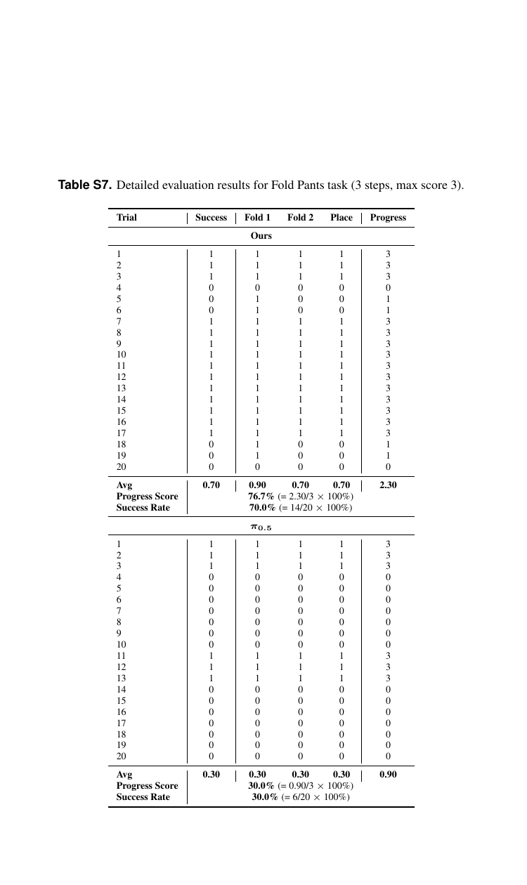

**Caption:** LingBot-VA reports PS 76.7% and SR 70.0%; $\pi_{0.5}$ reports PS 30.0% and SR 30.0%.

**Caption[CN]:** LingBot-VA 的 PS/SR 为 76.7%/70.0%，$\pi_{0.5}$ 为 30.0%/30.0%。

## Critical Reading Notes

1. 本文真正的核心不是“生成更清晰的视频”，而是把因果 AR、真实观测刷新和动作推断接成可部署闭环；噪声历史增强甚至明确允许视频保持部分含噪，只要动作仍可靠。
2. “causal”需要精确理解：跨 chunk 只依赖历史，但同一 chunk 内仍使用双向注意力并行生成，因此并非逐 token 严格单向。
3. FDM-grounded async 是关键工程贡献。Table 3 中朴素异步在 horizon 3 上从 85.6 降到 32.9，说明异步本身不足，必须处理陈旧预测与真实反馈之间的错位。
4. “长期记忆”证据来自 horizon 分组与两个专门记忆任务，但论文没有系统扫描 KV 上下文长度，也没有与显式记忆模块在同等规模下比较。
5. Fold Clothes 上，LingBot-VA 的 SR 略高但 PS 低于 $\pi_{0.5}$；因此正文“所有任务、两个指标均领先”的概括与附录逐试验表并不完全一致，阅读主图时应核对 Table S4。
6. 结果混合了大规模 16K 小时预训练、特定任务后训练和架构贡献。WAN 对照与样本效率曲线提供了一定拆分，但还不能完全隔离数据规模、视频骨干和闭环算法各自的贡献。
