# Code World Model: Coding Agent as World Brain

## 文档元数据与源信息

- **Authors / 作者:** Yiwen Chen, Guosheng Lin, Chi Zhang
- **Affiliations / 单位:** 1 AGI Lab, Westlake University; 2 Nanyang Technological University
- **Source / 来源:** arXiv:2608.25927v1 [cs.CV], 26 Aug 2026
- **Paper URL / 论文主页:** https://buaacyw.github.io/cwm/
- **Source PDF / PDF 源文件:** `/Users/roywangj/journey_wj/research/papers4zotero/zotero1/storage/YBPYU5CT/Chen 等 - 2026 - Code World Model Coding Agent as World Brain.pdf`
- **Source format / 源格式:** 20-page, letter-size, two-column PDF generated with arXiv GenPDF; text is extractable, with embedded raster figures and an appendix containing long-form prompts.
- **Reading mode / 阅读模式:** New full-paper build. English source text is followed immediately by a Chinese translation. References are retained in searchable original bibliographic form, as required by the reader contract.

## 章节索引

1. Abstract
2. Introduction
3. Related Work
   - 2.1 Interactive video world models
   - 2.2 Generative 3D Worlds
   - 2.3 Coding agents and world models
4. Method
   - 3.1 Code World Model
   - 3.2 World-State Conditioning for the Video Model
   - 3.3 Data
5. Experiments
   - 4.1 Implementation Details
   - 4.2 Visual Quality Results
6. Limitations and Conclusions
7. References
8. Appendix A. Text Prompt Examples

## 术语表

| English | 中文处理 | 说明 |
|---|---|---|
| Code World Model | Code World Model（代码世界模型） | 论文提出的框架名称；首次出现时补充中文释义。 |
| world brain | 世界大脑 | 指承担高层推理、规划和代码维护的 coding agent。 |
| coding agent | coding agent（编码智能体） | 保留英文以避免与一般代码生成器混淆。 |
| executable state | 可执行状态 | 可由代码直接操作的世界状态。 |
| visual state | 视觉状态 | 由 video model 产生且需要跨时间保持一致的视觉信息。 |
| proxy / proxy video | proxy（代理表示）/ proxy video（代理视频） | 从世界状态确定性编译出的粗粒度视觉条件。 |
| spatiotemporal | 时空的 | 同时涉及空间布局、轨迹、帧级变化和相机运动。 |
| structured text | 结构化文本 | 将选定世界状态序列化为语言条件。 |
| Ref2VA | Ref2VA | MiniMax-H3 的 appearance-reference 分支名称，保留原文。 |
| semantic-ID map | 语义 ID 图 | 代理条件中的类别实例标识通道。 |
| fixed-log depth | fixed-log 深度 | 训练代理使用的深度通道，保留方法原称。 |

---

## 1. Abstract

> <strong>Para. 1:</strong> World models aim to simulate how complex environments evolve under actions and events, yet existing video-based world models primarily learn dynamics from visual observations, which reveal outcomes rather than the underlying knowledge, rules, and mechanisms governing world evolution. This makes it difficult to maintain persistent consequences and support coherent, open-ended evolution. We introduce Code World Model, a framework that separates world evolution from visual realization by combining the reasoning and coding capabilities of language models with the generative priors of video models. A coding agent serves as the world brain, reasoning about events and their consequences and generating executable code to maintain persistent world state and perform rule-consistent evolution. To connect executable state with visual generation, we introduce a proxy representation that encodes frame-wise spatiotemporal constraints and is compiled into a proxy video, which conditions a video model to render high-fidelity visual observations. We further develop data pipelines for constructing aligned proxy–observation pairs from gameplay and real-world videos. After fine-tuning on paired gameplay data, MiniMax-H3 follows proxy-based spatiotemporal specifications from simple interactive worlds built by the coding agent while preserving rich visual details and dynamics. These results demonstrate the potential of combining code for persistent world evolution with video models for flexible visual realization, providing a new path toward open-ended world models.

> <strong>Para. 1[CN]:</strong> 世界模型旨在模拟复杂环境如何在动作和事件作用下演化；然而，现有基于视频的世界模型主要从视觉观测中学习动力学，而视觉观测呈现的是结果，并不直接呈现支配世界演化的底层知识、规则与机制。这使得模型难以维持持久性后果，也难以支持连贯、开放式的演化。我们提出 Code World Model（代码世界模型），通过结合语言模型的推理与编码能力以及视频模型的生成先验，将世界演化与视觉实现分离。一个 coding agent（编码智能体）充当“世界大脑”，对事件及其后果进行推理，并生成可执行代码来维护持久的世界状态、执行符合规则的演化。为连接可执行状态与视觉生成，我们引入一种 proxy 表示，它编码逐帧时空约束，并被编译为 proxy video（代理视频）；代理视频作为条件输入视频模型，以渲染高保真视觉观测。我们还构建了从游戏视频和真实世界视频中生成对齐的 proxy–observation（代理–观测）对的数据流水线。在成对游戏数据上微调后，MiniMax-H3 能够遵循由编码智能体构建的简单交互世界所给出的、基于 proxy 的时空规格，同时保留丰富的视觉细节与动态。这些结果展示了将用于持久世界演化的代码与用于灵活视觉实现的视频模型相结合的潜力，为开放式世界模型提供了一条新路径。

### Figure 1. Code World Model 总览

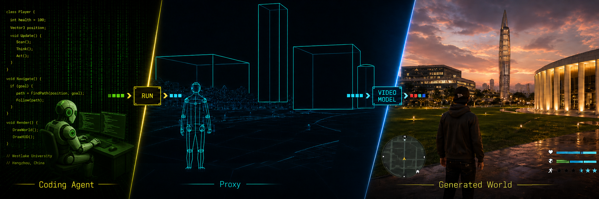

**Caption:** Fig. 1. Overview of Code World Model: Left: a coding agent updates state via executable code; Middle: a lightweight compiler renders a coarse proxy video; Right: a video model generates high-fidelity observations from the proxy and text. This figure is AI-generated for illustration purposes.

**Caption[CN]:** 图 1. Code World Model 总览：左侧，coding agent 通过可执行代码更新状态；中间，轻量级编译器渲染粗粒度 proxy video；右侧，视频模型根据 proxy 和文本生成高保真观测。本图由 AI 生成，仅用于示意。

---

## 2. Introduction

> <strong>Para. 1:</strong> A world model aims to represent the state of a world and how that state evolves in response to actions and events [1–3]. Such models are essential for applications that must understand, predict, and act in evolving environments, including autonomous driving, embodied intelligence, and open-ended game worlds [4–6]. A complex interactive world may contain a large number of entities whose attributes, relationships, and behaviors evolve jointly over long time horizons. An action can affect not only the state of its immediate target, but also subsequent events and the future behavior of related entities. For example, in a game setting, actions by players, non-player characters, and environmental events can jointly reshape the world over time. If a player assassinates the ruler of a city, the local order, faction alliances, and the behavior of many non-player characters all change, and the consequences continue to unfold in subsequent interactions. Modeling such evolution requires broad world knowledge, an understanding of complex relationships among entities and events, the ability to infer consequences based on commonsense knowledge and world rules, and continual reasoning, planning, and decision-making. These capabilities are essential for building worlds that evolve coherently beyond predefined trajectories and support open-ended interaction; such worlds, in turn, provide a foundation for game generation and for training and evaluating agents [5, 7–9].

> <strong>Para. 1[CN]:</strong> 世界模型旨在表示世界的状态，以及该状态如何响应动作和事件而演化 [1–3]。这类模型对于必须理解、预测并在演化环境中行动的应用至关重要，包括自动驾驶、具身智能和开放式游戏世界 [4–6]。复杂的交互世界可能包含大量实体，它们的属性、关系和行为会在很长的时间跨度内共同演化。一个动作影响的不仅是其直接目标的状态，还可能影响后续事件以及相关实体未来的行为。例如在游戏场景中，玩家、非玩家角色和环境事件的行动可以共同重塑世界。如果玩家刺杀了一座城市的统治者，地方秩序、派系联盟以及许多非玩家角色的行为都会改变，而且这些后果还会在后续交互中持续展开。对这种演化进行建模，需要广泛的世界知识、对实体与事件之间复杂关系的理解、依据常识知识和世界规则推断后果的能力，以及持续的推理、规划和决策能力。这些能力是构建能够超越预定义轨迹而连贯演化、并支持开放式交互的世界的基础；反过来，这类世界也为游戏生成以及智能体的训练与评测提供基础 [5, 7–9]。

> <strong>Para. 2:</strong> Among existing approaches to interactive world modeling, video world models have emerged as a particularly promising direction because they learn world dynamics directly from visual experience [4–7, 10–14]. Recent systems primarily formulate the task as action- or prompt-conditioned video generation and have achieved substantial progress in visual quality and action controllability [15–31]. Other efforts improve long-horizon temporal consistency and persistent memory [32–44], while streaming and real-time systems support increasingly responsive interaction [45–55]. By learning from large-scale visual data, video models acquire rich priors over environments, agents, motion, and interaction, enabling highly expressive visual synthesis without manually crafting every appearance and motion pattern. Videos also naturally capture how complex worlds evolve over time.

> <strong>Para. 2[CN]:</strong> 在现有的交互世界建模方法中，视频世界模型已经成为尤其有前景的方向，因为它们直接从视觉经验中学习世界动力学 [4–7, 10–14]。近期系统主要将任务形式化为动作条件或 prompt 条件的视频生成，并在视觉质量和动作可控性方面取得了显著进展 [15–31]。另一些工作改善长时间跨度的时间一致性和持久记忆 [32–44]；流式和实时系统则支持越来越响应迅速的交互 [45–55]。通过从大规模视觉数据中学习，视频模型获得了关于环境、智能体、运动和交互的丰富先验，从而无需手工设计每一种外观和运动模式，就能进行高度富有表现力的视觉合成。视频也天然记录了复杂世界随时间演化的方式。

> <strong>Para. 3:</strong> Yet a central obstacle to building such world models is learning the hidden mechanisms that govern world evolution from visual experience alone. Videos record the observable outcomes of world dynamics, whereas the world knowledge, commonsense rules, inter-entity relations, long-horizon plans, and mechanisms of consequence propagation that produce these outcomes are not directly observable. This is particularly evident in gameplay videos: each frame is rendered by executing fixed game code, yet the executable logic that produces each frame is discarded after rendering and can be observed only indirectly through its sparse visual consequences. Moreover, many important state changes occur out of view or extend beyond the temporal context available to the model [34, 38, 39]. Scaling up training data provides more observed outcomes but no direct evidence of the underlying mechanisms: the model must still infer them from their visible effects. Although scaling up video training data can improve these capabilities to some extent, existing video world models have not yet demonstrated the commonsense reasoning, long-horizon planning, and continual prediction of consequences required for open-ended world evolution. Merely generating the next observation is therefore insufficient to sustain a complex interactive world as it continues to evolve.

> <strong>Para. 3[CN]:</strong> 然而，构建这类世界模型的一个核心障碍，是仅凭视觉经验学习支配世界演化的隐藏机制。视频记录的是世界动力学的可观测结果，而产生这些结果的世界知识、常识规则、实体间关系、长时间跨度规划以及后果传播机制，并不能被直接观测到。这一点在游戏视频中尤为明显：每一帧都是执行固定游戏代码后渲染出来的，但生成该帧的可执行逻辑在渲染后被丢弃，只能通过稀疏的视觉后果间接观察。此外，许多重要的状态变化发生在视野之外，或者延伸到模型可用时间上下文之外 [34, 38, 39]。扩大训练数据规模只能提供更多已观测的结果，却不能提供底层机制的直接证据；模型仍然必须从可见效果中推断这些机制。尽管扩大视频训练数据在一定程度上能够改善这些能力，现有视频世界模型仍未展示开放式世界演化所需的常识推理、长时域规划以及对后果的持续预测能力。因此，仅仅生成下一个观测，不足以维持一个持续演化的复杂交互世界。

> <strong>Para. 4:</strong> Building on this motivation, a capable world model should combine two complementary strengths. First, it should continually maintain and operate a complete world, inferring the consequences of events from knowledge and world rules and allowing the resulting changes to persist throughout long-term evolution. Second, it should retain the ability of video models to generate rich visual appearance, motion, and fine-grained dynamics, rendering the evolving world into high-fidelity, open-ended visual observations. Achieving this goal requires several qualitatively different capabilities: broad knowledge and reasoning to decide how events should affect the world; the ability to maintain a persistent world state that records entities, relations, rules, and historical events, so that past changes continue to influence future evolution even when they are not currently visible; and generative visual capabilities that translate the evolved world into final observations. This naturally suggests a functional decomposition: world reasoning and execution determine how the state evolves, while visual generation renders the evolved state into visual observations. Crucially, these two sets of capabilities have already been extensively developed using different data sources, which motivates us to combine the knowledge and reasoning learned from text and code with the visual and motion priors learned from video.

> <strong>Para. 4[CN]:</strong> 基于这一动机，一个有能力的世界模型应当结合两种互补优势。第一，它应持续维护并运行一个完整世界，从知识和世界规则中推断事件后果，并允许由此产生的变化在长期演化中持久存在。第二，它应保留视频模型生成丰富视觉外观、运动和细粒度动力学的能力，将演化中的世界渲染为高保真、开放式的视觉观测。实现这一目标需要几种性质不同的能力：用于决定事件应如何影响世界的广泛知识和推理能力；维护持久世界状态的能力，该状态记录实体、关系、规则和历史事件，使过去的变化即使当前不可见，也能继续影响未来演化；以及将演化后的世界转换为最终观测的生成式视觉能力。这自然导向一种功能分解：世界推理与执行决定状态如何演化，而视觉生成则将演化后的状态渲染为视觉观测。关键在于，这两组能力已经通过不同数据源得到广泛发展，因此可以将从文本和代码中学习到的知识与推理能力，与从视频中学习到的视觉和运动先验结合起来。

> <strong>Para. 5:</strong> The first strength calls for a component that can understand world knowledge, reason over events, and determine their long-horizon consequences. Language models are natural candidates for governing this evolution [56–70]. Unlike video models, which primarily learn dynamics from visual experience, language models acquire rich world knowledge from large-scale text and code and have demonstrated strong capabilities in understanding abstract concepts, modeling complex relationships, and performing long-horizon reasoning. They can leverage this knowledge to reason, plan, make decisions, and anticipate the potential consequences of events. A complex world, however, also involves a large number of fine-grained and repetitive state changes. Invoking a language model for every low-level interaction is feasible but computationally inefficient; moreover, critical outcomes often need to be rule-consistent and reproducible.

> <strong>Para. 5[CN]:</strong> 第一种优势需要一个能够理解世界知识、围绕事件推理并确定其长期后果的组件。语言模型是治理这种演化的自然候选者 [56–70]。与主要从视觉经验中学习动力学的视频模型不同，语言模型从大规模文本和代码中获得丰富的世界知识，并且已经展示出理解抽象概念、建模复杂关系和执行长时域推理的强大能力。它们可以利用这些知识进行推理、规划和决策，并预判事件可能产生的后果。然而，复杂世界还包含大量细粒度、重复性的状态变化。为每一次低层交互调用语言模型虽然可行，但计算效率低；此外，关键结果往往还需要符合规则并且可复现。

> <strong>Para. 6:</strong> The second strength calls for an execution substrate that can realize these decisions through frequent, rule-consistent updates. Code provides a natural execution substrate for such updates. In a game, for example, a video model can render the visual appearance of an attack, but whether it hits should be determined by the current world state, including the distance to the target and the attack range. Without stable rules, players cannot form reliable expectations about how their actions affect the world. Meanwhile, recent agentic language models and coding agents have become increasingly capable of autonomously generating, modifying, and maintaining complex codebases [71–74]. Code therefore need not be limited to static scripts predefined by developers: a coding agent can invoke, compose, and revise executable mechanisms as the world state, goals, and interactions change.

> <strong>Para. 6[CN]:</strong> 第二种优势需要一种执行基底，通过频繁且符合规则的更新来实现这些决策。代码为此类更新提供了天然的执行基底。例如在游戏中，视频模型可以渲染攻击的视觉外观，但攻击是否命中应由当前世界状态决定，其中包括到目标的距离和攻击范围。如果没有稳定的规则，玩家就无法对自己的动作如何影响世界形成可靠预期。同时，近期的 agentic language models 和 coding agents 已越来越能够自主生成、修改和维护复杂代码库 [71–74]。因此，代码不必局限于开发者预先定义的静态脚本；随着世界状态、目标和交互发生变化，coding agent 可以调用、组合并修订可执行机制。

### Figure 2. Code World Model 流程

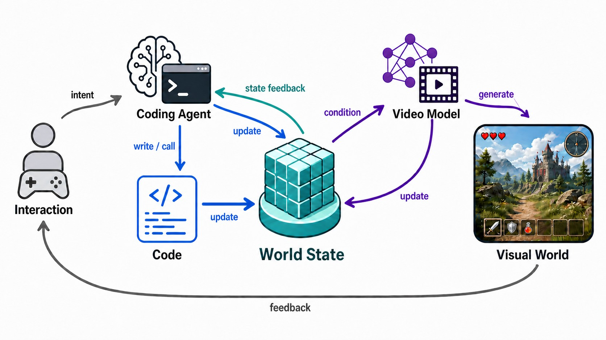

**Caption:** Fig. 2. Pipeline of the proposed Code World Model. The coding agent serves as the brain of the world model, translating interaction intent into code that updates the world state. The updated world state is compiled into a proxy and paired with a text prompt to condition the video model, which generates the corresponding visual observations. Generated observations and state feedback then support subsequent interaction and world evolution.

**Caption[CN]:** 图 2. 所提出的 Code World Model 流程。coding agent 充当世界模型的大脑，将交互意图转换为更新世界状态的代码。更新后的世界状态被编译为 proxy，并与文本 prompt 配对，以条件化视频模型；视频模型生成相应的视觉观测。生成的观测和状态反馈随后支持后续交互与世界演化。

> <strong>Para. 7:</strong> Motivated by these observations, we propose Code World Model (Fig. 1), a world-modeling framework that comprises an executable world-evolution mechanism driven by a coding agent, a programmable interface between world state and visual generation, and a video model that produces the final visual observations. At its core, the coding agent serves as the world brain: it governs world state and its evolution through code, while the video model renders the evolved world into visual observations. Knowledge and rules thus drive changes in world state, while the world’s visual realization draws on learned priors, allowing an interactive world to evolve continually and coherently beyond predefined trajectories. Fig. 2 summarizes how the coding agent updates world state through code and how the resulting proxy and prompt condition the video model to generate visual observations.

> <strong>Para. 7[CN]:</strong> 受上述观察启发，我们提出 Code World Model（图 1），一种由 coding agent 驱动的可执行世界演化机制、连接世界状态与视觉生成的可编程接口，以及负责产生最终视觉观测的视频模型共同组成的世界建模框架。在其核心位置，coding agent 充当世界大脑：它通过代码治理世界状态及其演化，而视频模型将演化后的世界渲染为视觉观测。因此，知识与规则驱动世界状态发生变化，世界的视觉实现则利用学习到的先验，使交互世界能够超越预定义轨迹持续且连贯地演化。图 2 总结了 coding agent 如何通过代码更新世界状态，以及生成的 proxy 和 prompt 如何条件化视频模型以生成视觉观测。

> <strong>Para. 8:</strong> The coding agent and code operate in two distinct computational regimes. The coding agent handles infrequent but complex decisions, such as interpreting new events, reasoning about long-term consequences, selecting mechanisms, and revising how the world operates; it translates these decisions into executable, reusable, and modifiable code. Code then performs high-frequency, repetitive, and deterministic operations—updating positions and numerical attributes, resolving collisions, and executing rules—without invoking the coding agent at every step. This agent–code organization decouples the frequency of high-level reasoning from that of low-level state updates, allowing world state to evolve continuously while its operating mechanisms remain modifiable.

> <strong>Para. 8[CN]:</strong> coding agent 与代码在两种不同的计算机制中运行。coding agent 处理不频繁但复杂的决策，例如解释新事件、推理长期后果、选择机制以及修改世界的运行方式；它将这些决策转换为可执行、可复用且可修改的代码。随后，代码执行高频、重复且确定性的操作——更新位置和数值属性、解决碰撞以及执行规则——而无需在每一步都调用 coding agent。这种 agent–code 组织方式将高层推理频率与低层状态更新频率解耦，使世界状态能够连续演化，同时其运行机制仍可修改。

> <strong>Para. 9:</strong> With this executable world state in place, a central technical challenge is to translate it into a conditioning representation that a video model can reliably interpret. One straightforward solution is to express the state as structured text; however, current video models cannot yet reliably translate dense, constantly changing textual specifications into observations with precise frame-wise positions, spatial relations, and camera trajectories. An alternative is for the coding agent to construct a complete, explicit 3D world and condition the video model on its renderings [75, 76]. Although this provides stronger spatial control, constructing production-quality geometry, assets, animation, materials, and rendering systems is costly and prematurely constrains the final visual realization. To retain the flexibility of text-based specifications while recovering the spatial control of explicit 3D representations, we introduce proxy, a coarse representation of world state that encodes entity positions, poses, trajectories, spatial relations, and camera motion. A lightweight deterministic compiler renders it into a proxy video, which provides the video model with direct spatiotemporal constraints while leaving appearance and fine-grained dynamics unspecified.

> <strong>Para. 9[CN]:</strong> 在具备这一可执行世界状态之后，一个核心技术挑战是将其转换为视频模型能够可靠解释的条件表示。一种直接方案是将状态表达为结构化文本；然而，当前视频模型还不能可靠地把密集且持续变化的文本规格，转换为具有精确逐帧位置、空间关系和相机轨迹的观测。另一种方案是让 coding agent 构建一个完整、显式的 3D 世界，并用其渲染结果条件化视频模型 [75, 76]。尽管这种方式提供更强的空间控制，但构建生产级几何体、资产、动画、材质和渲染系统成本高昂，还会过早限制最终视觉实现。为保留基于文本规格的灵活性，同时恢复显式 3D 表示的空间控制能力，我们引入 proxy：一种对世界状态进行粗粒度表示的形式，编码实体位置、姿态、轨迹、空间关系和相机运动。轻量级确定性编译器将其渲染为 proxy video，为视频模型提供直接的时空约束，同时不指定外观和细粒度动力学。

> <strong>Para. 10:</strong> The proxy need only specify coarse spatial relations and overall trajectories, while the video model synthesizes local motion and physical interactions from its learned priors. Conditioned jointly on the proxy video and structured text, the video model generates the final observation using its learned priors over appearance, motion, and interaction. In this way, code determines what happens in the world and which consequences persist, while the video model determines how these outcomes are visually realized. Proxy therefore extends the coding agent’s control from language into visual space, allowing it to express evolving world state as adjustable frame-wise constraints for the video model.

> <strong>Para. 10[CN]:</strong> proxy 只需指定粗粒度空间关系和总体轨迹，而视频模型则从学习到的先验中合成局部运动和物理交互。在 proxy video 与结构化文本的联合条件下，视频模型利用关于外观、运动和交互的学习先验生成最终观测。这样，代码决定世界中发生什么以及哪些后果会持久存在，而视频模型决定这些结果以何种视觉方式实现。因此，proxy 将 coding agent 的控制从语言扩展到视觉空间，使其能够以可调整的逐帧约束形式表达演化中的世界状态，并将其传给视频模型。

> <strong>Para. 11:</strong> To instantiate and evaluate the interface from executable world state to visual observations, we develop a data-construction scheme for both gameplay and real-world videos. Our current prototype first adapts a pretrained video model using gameplay data. During gameplay, the target video and the camera, entity, and scene states required to construct the proxy are recorded synchronously from the same execution, yielding spatiotemporally aligned proxy–observation pairs. Real-world videos can likewise be paired with aligned proxies constructed from 3D reconstructions and object annotations, without requiring action labels and thereby substantially lowering the annotation burden. Fine-tuned on our paired gameplay data, MiniMax-H3 qualitatively adheres to the proxy specifications for character locations, action trajectories, scene layouts, and camera motion when conditioned on proxies recorded from simple interactive worlds built by the coding agent, while preserving high-fidelity appearance and fine-grained dynamics. Compared with control interfaces that express only coarse intent through text or low-dimensional signals for action and camera control [31, 34, 37], our interface directly specifies frame-wise entity motion and viewpoint changes, enabling finer-grained and more direct spatiotemporal control.

> <strong>Para. 11[CN]:</strong> 为实例化并评估从可执行世界状态到视觉观测的接口，我们针对游戏视频和真实世界视频开发了数据构建方案。当前原型首先利用游戏数据适配一个预训练视频模型。在游戏运行期间，目标视频以及构建 proxy 所需的相机、实体和场景状态，都从同一次执行中同步记录，由此得到时空对齐的 proxy–observation 对。真实世界视频同样可以与根据 3D 重建和物体标注构建的对齐 proxy 配对，而不需要动作标签，从而显著降低标注负担。在我们构建的成对游戏数据上微调后，当输入由 coding agent 构建的简单交互世界中记录的 proxy 时，MiniMax-H3 在定性上遵循了人物位置、动作轨迹、场景布局和相机运动的 proxy 规格，同时保留高保真外观和细粒度动态。与只通过文本或用于动作和相机控制的低维信号表达粗粒度意图的控制接口 [31, 34, 37] 相比，我们的接口直接指定逐帧实体运动和视点变化，从而实现更细粒度、更直接的时空控制。

> <strong>Para. 12:</strong> Overall, Code World Model unifies knowledge-driven, rule-consistent world evolution with the visual, motion, and interaction priors learned by video models. Our current prototype provides preliminary evidence for the viability of the framework’s two key components: the coding agent can modify the state and operating mechanisms of a world by writing and revising code, and the fine-tuned video model can render the world state expressed by the proxy into corresponding visual observations.

> <strong>Para. 12[CN]:</strong> 总体而言，Code World Model 将知识驱动、符合规则的世界演化，与视频模型学习到的视觉、运动和交互先验统一起来。当前原型为框架的两个关键组件提供了初步可行性证据：coding agent 能够通过编写和修改代码来改变世界的状态及其运行机制；经过微调的视频模型能够将 proxy 表达的世界状态渲染为对应的视觉观测。

> <strong>Para. 13:</strong> Our contributions are summarized as follows:
>
> - We introduce Code World Model, a framework in which a coding agent governs long-horizon world evolution through executable code, while a video model renders the evolving world state into high-fidelity visual observations.
> - We design a proxy-based interface that translates executable world state into a proxy video, providing direct frame-wise spatiotemporal constraints without requiring a complete high-quality 3D asset and rendering pipeline.
> - We construct a spatiotemporally aligned gameplay data pipeline and demonstrate geometry-assisted offline proxy construction on real-world recordings, providing preliminary evidence that proxy can serve as a learnable interface to world state.

> <strong>Para. 13[CN]:</strong> 我们的贡献总结如下：
>
> - 提出 Code World Model：一种由 coding agent 通过可执行代码治理长时间跨度世界演化的框架，同时由视频模型将演化中的世界状态渲染为高保真视觉观测。
> - 设计基于 proxy 的接口，将可执行世界状态转换为 proxy video，在无需完整高质量 3D 资产与渲染流水线的情况下提供直接的逐帧时空约束。
> - 构建时空对齐的游戏数据流水线，并在真实世界记录上展示几何辅助的离线 proxy 构建，为 proxy 作为世界状态可学习接口的可行性提供初步证据。

---

## 3. Related Work

### 3.1. Interactive video world models

> <strong>Para. 1:</strong> Scalable diffusion transformers underpin many recent high-fidelity video generators, including HunyuanVideo and Wan [78–80]. Learned interactive environments further formulate world evolution as conditional prediction of future visual observations. Early work learns action-conditioned visual dynamics from gameplay or infers latent action spaces from unlabeled video [10–13], while diffusion-based systems demonstrate that generative models can serve as playable neural simulators [6, 7, 14]. Recent systems scale this paradigm toward language-guided simulation, action-controllable environments, and real-time navigable worlds [15–19, 46]. Subsequent studies extend this formulation toward online control, streaming generation, and longer interaction in game environments [20–22, 28, 45, 47–49]. A parallel direction broadens the generated scenes and control interface through open-domain game transfer, free-form actions, keyboard and mouse inputs, and text-directed world events [23–27, 29]. Together, these works establish action-conditioned video generation as a direct route to visually rich interactive rollouts without first constructing a complete explicit 3D world.

> <strong>Para. 1[CN]:</strong> 可扩展的 diffusion transformer 支撑了许多近期的高保真视频生成器，包括 HunyuanVideo 和 Wan [78–80]。学习式交互环境进一步将世界演化形式化为对未来视觉观测的条件预测。早期工作从游戏视频中学习动作条件视觉动力学，或从无标注视频中推断潜在动作空间 [10–13]；基于扩散的系统则证明生成模型可以充当可游玩的神经模拟器 [6, 7, 14]。近期系统将这一范式扩展到语言引导模拟、动作可控环境和实时可导航世界 [15–19, 46]。后续研究又将其扩展到在线控制、流式生成以及游戏环境中的更长交互 [20–22, 28, 45, 47–49]。另一条并行方向通过开放域游戏迁移、自由形式动作、键盘鼠标输入和文本指示的世界事件，拓宽生成场景与控制接口 [23–27, 29]。总体上，这些工作确立了动作条件视频生成这一直接路径：无需先构建完整显式 3D 世界，即可得到具有丰富视觉表现力的交互 rollout。

> <strong>Para. 2:</strong> Long-horizon generation introduces a second set of challenges: errors accumulate autoregressively, while scene information outside the current context becomes difficult to recover. Recent systems address these problems through geometry-aware history, longer-context training, and broader general-domain data [30, 32–37, 43, 44]. Others introduce retrieved historical frames, persistent view representations, or event- and action-aware memory to preserve information that remains relevant later in a rollout [38–41]. Complementary work reduces train–inference mismatch and deployment cost through self-rollout training, efficient long-video generation, causal distillation, and full-stack inference systems [42, 50–55]. Most closely related to our setting, LingBot-World 2.0 augments a causal video generator with pilot and director agents, enabling semantic actions and mid-rollout world intervention [31].

> <strong>Para. 2[CN]:</strong> 长时域生成引入了第二组挑战：误差会以自回归方式累积，而当前上下文之外的场景信息变得难以恢复。近期系统通过几何感知历史、更长上下文训练以及更广泛的通用领域数据来处理这些问题 [30, 32–37, 43, 44]。另一些工作引入检索到的历史帧、持久视图表示，或事件感知与动作感知的记忆，以保留 rollout 后续仍然相关的信息 [38–41]。互补的研究则通过 self-rollout 训练、高效长视频生成、因果蒸馏和全栈推理系统，减少训练–推理不匹配与部署成本 [42, 50–55]。与我们的设定最接近的是 LingBot-World 2.0：它为因果视频生成器增加 pilot agent 和 director agent，使系统能够执行语义动作并在 rollout 中途干预世界 [31]。

> <strong>Para. 3:</strong> These advances progressively strengthen control, memory, and agentic interaction around a learned visual rollout. Their central modeling object, however, remains the generated observation sequence: scene-specific state and interaction outcomes are primarily carried by visual history, latent context, or visual memory. Code World Model instead places a coding agent and its persistent code in charge of an explicit world state, including the consequences that must continue to affect later interaction. The video model remains responsible for generating the world’s appearance and dynamics, but receives the relevant state through the proxy rather than being required to internalize the entire process of world evolution.

> <strong>Para. 3[CN]:</strong> 这些进展逐步增强了围绕学习式视觉 rollout 的控制、记忆和 agentic 交互能力。然而，它们的核心建模对象仍然是生成的观测序列：特定场景的状态和交互结果主要由视觉历史、潜在上下文或视觉记忆承载。Code World Model 则让 coding agent 及其持久代码负责管理显式世界状态，其中包括必须继续影响后续交互的后果。视频模型仍然负责生成世界的外观和动力学，但通过 proxy 接收相关状态，而不必将整个世界演化过程内化。

### 3.2. Generative 3D Worlds

> <strong>Para. 1:</strong> Generative 3D world models pursue explicit scene representations that support navigation, spatial editing, and free-viewpoint rendering. One line expands generated images or panoramic observations into connected meshes, Gaussian representations, or other explorable 3D scenes [75, 81–83]. Another combines video or multi-view generation with reconstruction to increase navigable scene coverage and accelerate 3D world creation [84–86]. More recent systems emphasize extendable scene generation, language-guided asset and layout composition, traversability, and unified world generation and reconstruction [76, 87–89]. These directions demonstrate the value of making geometry explicit when exploration, viewpoint consistency, or downstream graphics integration is required.

> <strong>Para. 1[CN]:</strong> 生成式 3D 世界模型追求显式场景表示，以支持导航、空间编辑和自由视点渲染。一条路线将生成图像或全景观测扩展为相互连接的网格、Gaussian 表示或其他可探索的 3D 场景 [75, 81–83]。另一条路线将视频或多视角生成与重建结合，以扩大可导航场景覆盖范围并加速 3D 世界创建 [84–86]。较新的系统强调可扩展场景生成、语言引导的资产与布局组合、可通行性以及统一的世界生成与重建 [76, 87–89]。当任务需要探索、视点一致性或下游图形集成时，这些方向展示了将几何显式化的价值。

> <strong>Para. 2:</strong> In these systems, the generated geometry, assets, and rendering pipeline constitute the visual world from which observations are produced. Our proxy serves a different purpose. It is not intended to be the final 3D world or to prescribe production-quality geometry and appearance; it is a coarse, programmatically constructed condition that communicates camera motion, entity layout, trajectories, and interaction-relevant state to the video model. The video model then generates the final appearance and fine-grained dynamics under these constraints. Simple 3D primitives may therefore be used to express the proxy, but explicit 3D construction is an interface to visual generation rather than its endpoint.

> <strong>Para. 2[CN]:</strong> 在这些系统中，生成的几何体、资产和渲染流水线构成了产生观测的视觉世界。而我们的 proxy 用途不同。它并不旨在成为最终 3D 世界，也不用于规定生产级几何和外观；它是一种以程序方式构建的粗粒度条件，向视频模型传达相机运动、实体布局、轨迹以及与交互相关的状态。随后，视频模型在这些约束下生成最终外观和细粒度动力学。因此，可以使用简单的 3D 基元表达 proxy，但显式 3D 构建在这里是视觉生成的接口，而不是终点。

### 3.3. Coding agents and world models

> <strong>Para. 1:</strong> Programs provide another representation of environment dynamics. WorldCoder [67] has an LLM agent build a world model by writing a Python program and refining it through environment interaction, and Curtis et al. [69] induce probabilistic programs for POMDP model estimation under LLM guidance. Dainese et al. [68] generate Python transition models with an LLM guided by Monte Carlo tree search for model-based reinforcement learning. Lehrach et al. [70] encode state transitions, legal actions, observations, rewards, and termination as program functions consumed by a planner for general game playing; follow-up work distills this synthesis into lightweight models [90] and applies coding agents to build executable world models for interactive benchmarks [91]. This line shows that world rules and transition structure can be externalized as code that is inspectable, testable, and revisable. FAIR CodeGen Team [92] instead mid-train an open-weights LLM on Python execution traces and agentic interactions so that the model learns to simulate code execution, using world modeling to strengthen code generation and reasoning.

> <strong>Para. 1[CN]:</strong> 程序为环境动力学提供了另一种表示。WorldCoder [67] 让 LLM agent 通过编写 Python 程序并在环境交互中不断改进来构建世界模型；Curtis 等人 [69] 则在 LLM 引导下，为 POMDP 模型估计归纳概率程序。Dainese 等人 [68] 使用由 Monte Carlo tree search 引导的 LLM 生成 Python 转移模型，用于基于模型的强化学习。Lehrach 等人 [70] 将状态转移、合法动作、观测、奖励和终止编码为程序函数，供通用游戏规划器调用；后续工作将这种合成蒸馏为轻量模型 [90]，并将 coding agents 用于为交互基准构建可执行世界模型 [91]。这条研究路线表明，世界规则和转移结构可以外化为可检查、可测试、可修改的代码。相比之下，FAIR CodeGen Team [92] 在中途训练阶段使用 Python 执行轨迹和 agentic 交互训练开放权重 LLM，使模型学会模拟代码执行，并利用世界建模增强代码生成和推理能力。

> <strong>Para. 2:</strong> Recent agentic language models report strong performance on long-horizon coding and software-engineering tasks [71, 72]. A complementary direction studies coding agents as builders of playable software, including benchmarks for multimodal game-development tasks and agentic systems for end-to-end game creation [73, 74]. These works demonstrate the growing ability of coding agents to construct and modify complex interactive programs, but focus primarily on producing the game artifact rather than using persistent, revisable code as the operating medium of a learned visual world model. In Code World Model, the coding agent instead governs the evolution of an open visual world through persistent code, and a learned video model converts state-derived proxy conditions into high-fidelity visual observations.

> <strong>Para. 2[CN]:</strong> 近期 agentic language models 在长时间跨度编码和软件工程任务上表现出很强的性能 [71, 72]。一个互补方向研究 coding agents 作为可玩软件的构建者，包括多模态游戏开发任务基准以及端到端游戏创建的 agentic 系统 [73, 74]。这些工作展示了 coding agents 构建和修改复杂交互程序的能力正在增强，但主要关注产生游戏制品，而不是把持久、可修改的代码作为学习式视觉世界模型的运行媒介。在 Code World Model 中，coding agent 则通过持久代码治理开放视觉世界的演化，学习式视频模型将由状态派生的 proxy 条件转换为高保真视觉观测。

---

## 4. Method

> <strong>Para. 1:</strong> Our goal is to build open worlds that approach the causal complexity of the real world while maintaining high visual fidelity. We believe that building such worlds requires a coding agent to serve as the world brain, code to efficiently execute continuous, high-frequency state updates, and a video model to generate high-fidelity visual observations with realistic motion. To achieve this goal, we introduce Code World Model, which unifies these components within a single framework. As summarized in Fig. 2, the coding agent updates world state through code, and the resulting proxy and prompt condition the video model to produce visual observations.

> <strong>Para. 1[CN]:</strong> 我们的目标是构建因果复杂度接近真实世界、同时保持高视觉保真的开放世界。我们认为，构建这类世界需要 coding agent 充当世界大脑，需要代码高效执行连续的高频状态更新，还需要视频模型生成具有逼真运动的高保真视觉观测。为实现这一目标，我们提出 Code World Model，在单一框架中统一这些组件。如图 2 所总结，coding agent 通过代码更新世界状态，而生成的 proxy 和 prompt 则条件化视频模型以产生视觉观测。

> <strong>Para. 2:</strong> Section 3.1 defines Code World Model and explains how a coding agent governs world evolution through continuously maintained, executable, and modifiable code. Section 3.2 studies how world state can be communicated to the video model. It begins with structured text and analyzes its practical limitations. To tackle this challenge, we introduce a coarse visual condition, termed the proxy, that is deterministically generated from world state and provides the video model with direct spatiotemporal constraints. Building on this proxy design, Section 3.3 presents a data pipeline for training the video model to understand and follow proxy conditions.

> <strong>Para. 2[CN]:</strong> 第 3.1 节定义 Code World Model，并解释 coding agent 如何通过持续维护、可执行且可修改的代码来治理世界演化。第 3.2 节研究如何将世界状态传达给视频模型。该节从结构化文本开始，分析其实际局限。为解决这一挑战，我们引入一种称为 proxy 的粗粒度视觉条件，它从世界状态中确定性生成，并为视频模型提供直接的时空约束。在这一 proxy 设计基础上，第 3.3 节提出用于训练视频模型理解并遵循 proxy 条件的数据流水线。

### 4.1. Code World Model

> <strong>Para. 1:</strong> To make the challenges posed by such complex interactions concrete, we return to the fantasy-world example from the Introduction. After a player assassinates a city’s ruler and leaves, that event should continue to affect succession, local order, trade, faction relations, and the beliefs, goals, and behavior of many non-player characters. These consequences may keep developing while the city is off-screen, interact with later events, and become visible only when the player returns much later. A system must therefore determine not only how the city should look upon return, but also what happened during the player’s absence, why it happened, which consequences remain active, and how the current situation will shape future evolution.

> <strong>Para. 1[CN]:</strong> 为使这类复杂交互带来的挑战具体化，我们回到引言中的幻想世界例子。玩家刺杀一座城市的统治者并离开后，这一事件应继续影响继承、地方秩序、贸易、派系关系，以及许多非玩家角色的信念、目标和行为。当城市处于屏幕之外时，这些后果可能继续发展、与后续事件交互，并且只有在玩家很久之后返回时才显现。因此，一个系统不仅必须决定玩家返回时城市应当呈现什么样子，还必须决定玩家缺席期间发生了什么、为何发生、哪些后果仍然有效，以及当前局势将如何塑造未来演化。

> <strong>Para. 2:</strong> From the perspective of running the world, such complex interactions present two different challenges. The first is sparse but semantically complex reasoning: interpreting new events, connecting them to world knowledge, character relations, and social structures, determining which entities and mechanisms are affected, and planning consequences over long periods. The second is dense and repetitive execution: maintaining positions, attributes, schedules, cooldowns, collisions, and numerical rules, and translating high-level decisions into concrete state updates. A complex world requires both. The latter must operate at a substantially higher update frequency than the former, whereas the former demands substantially more sophisticated reasoning.

> <strong>Para. 2[CN]:</strong> 从运行世界的角度看，这种复杂交互带来两种不同挑战。第一种是稀疏但语义复杂的推理：解释新事件，将其与世界知识、角色关系和社会结构联系起来，确定哪些实体和机制受到影响，并规划跨越长时间的后果。第二种是密集且重复的执行：维护位置、属性、日程、冷却时间、碰撞和数值规则，并将高层决策转换为具体状态更新。复杂世界两者都需要。后者必须以显著高于前者的更新频率运行，而前者则要求显著更复杂的推理。

> <strong>Para. 3:</strong> Video models provide valuable learned priors for how environments, characters, and interactions evolve visually [5–7, 14]. Theoretically, sufficiently capable video models could acquire the capabilities needed to address both challenges from visual experience. In practice, however, video data reveal world rules only indirectly through their outcomes; off-screen character states have no continuous visual record; and consequences that propagate across locations and long time spans are sparse [38, 39]. The training context windows of current video models are typically shorter than one minute, whereas many causal processes that require reasoning unfold over days or even years in world time. This makes it particularly difficult for video models to acquire the capabilities needed to address the first challenge: the semantically complex reasoning required to construct and evolve a coherent world. Moreover, current video world models are trained primarily on gameplay videos, which preserve only the visual outputs of running fixed game code. The model must therefore infer the underlying rules and state transitions from those outputs alone, making this learning process highly inefficient and ultimately suboptimal.

> <strong>Para. 3[CN]:</strong> 视频模型为环境、角色和交互如何在视觉上演化提供了有价值的学习先验 [5–7, 14]。从理论上说，能力足够强的视频模型可以从视觉经验中获得解决这两类挑战所需的能力。但在实践中，视频数据只能通过结果间接揭示世界规则；屏幕外的角色状态没有连续视觉记录；跨地点和长时间跨度传播的后果也很稀疏 [38, 39]。当前视频模型的训练上下文窗口通常短于一分钟，而许多需要推理的因果过程会在世界时间中经过数天甚至数年才展开。这使视频模型尤其难以获得解决第一类挑战所需的能力，即构建和演化连贯世界所需的语义复杂推理。此外，当前视频世界模型主要在游戏视频上训练，而游戏视频只保留执行固定游戏代码后得到的视觉输出。因此，模型必须仅从这些输出推断底层规则和状态转移，使这一学习过程非常低效且最终并不理想。

> <strong>Para. 4:</strong> The world knowledge, relational reasoning, and long-horizon planning capabilities of language models make them a natural choice for governing world evolution [67–70]. An agent can organize these capabilities into a continuing loop: read the current world, decide what should happen next, observe the result, and revise subsequent decisions. The agent should not, however, become the step-by-step executor of the entire world. As a world grows, thousands of world-state variables may require frequent updates, covering characters, objects, and global processes such as weather, traffic, and scheduled events. Invoking a language model for every such update would incur high inference costs and fail to sustain the update frequency and responsiveness required for real-time operation. A more scalable organization converts high-level decisions into reusable code and lets that code execute across entities, time, and events.

> <strong>Para. 4[CN]:</strong> 语言模型的世界知识、关系推理和长时域规划能力，使其成为治理世界演化的自然选择 [67–70]。智能体可以将这些能力组织成持续循环：读取当前世界，决定接下来应发生什么，观察结果，并修改后续决策。然而，智能体不应成为整个世界逐步执行的主体。随着世界规模增长，可能有数千个世界状态变量需要频繁更新，涵盖角色、物体以及天气、交通和计划事件等全局过程。为每一次这样的更新调用语言模型会带来高推理成本，也无法维持实时运行所需的更新频率和响应能力。更可扩展的组织方式是将高层决策转换为可复用代码，让代码跨实体、时间和事件执行。

> <strong>Para. 5:</strong> This organization aligns naturally with the central strength of contemporary coding agents: translating high-level intent into code that can be executed, reused, and continuously revised [73, 74]. Suppose that, after the ruler is assassinated, the coding agent decides that the city should enter an emergency state. It may change faction goals, activate existing behavioral rules, or add new mechanisms for patrols, succession, and message propagation. The coding agent need only decide the high-level behavior of each character and intervene when a goal changes, an exception occurs, or a mechanism must be revised. At other times, code continuously updates positions, orientations, and other runtime state at high frequency according to existing rules. Its execution rate is decoupled from both the coding agent’s reasoning frequency and the video model’s generation frame rate. In a large battle, code can continuously process distances, collisions, attack ranges, cooldowns, hits, damage, and chained triggers for many entities, while the coding agent focuses on sparse high-level intent, exceptions, and mechanisms that must be added or changed.

> <strong>Para. 5[CN]:</strong> 这种组织方式与当代 coding agents 的核心优势天然一致：将高层意图转换为可执行、可复用并能持续修改的代码 [73, 74]。假设统治者被刺杀后，coding agent 决定城市应进入紧急状态。它可以改变派系目标、激活已有行为规则，或者增加巡逻、继承和消息传播的新机制。coding agent 只需决定每个角色的高层行为，并在目标改变、异常发生或需要修改机制时进行干预。在其他时间，代码根据已有规则以高频率持续更新位置、朝向和其他运行时状态。代码的执行速率与 coding agent 的推理频率以及视频模型的生成帧率都相互解耦。在一场大规模战斗中，代码可以持续为许多实体处理距离、碰撞、攻击范围、冷却时间、命中、伤害和链式触发，而 coding agent 则专注于稀疏的高层意图、异常情况以及需要新增或修改的机制。

> <strong>Para. 6:</strong> The result is a continuing agent-code loop. An interaction or world event first changes the current situation. The coding agent reads the maintained world state and chooses either to invoke existing code or locally modify the world program. Code then executes reusable mechanisms and advances many state variables. Execution results, tests, and new world feedback return to the coding agent as evidence for its next decision. Most repetitive updates require no additional model call, and world state may advance in an event-driven manner or at a frequency higher than visual generation. When existing mechanisms cannot handle a new situation, the coding agent can adaptively revise the world program, changing not only the current state but also how the world will operate in the future. Code is therefore neither permanently frozen game logic nor a controller independent of the agent; it is the coding agent’s continuously maintained, executable, and modifiable extension.

> <strong>Para. 6[CN]:</strong> 结果是一个持续运行的 agent-code 循环。一次交互或世界事件首先改变当前局势。coding agent 读取被维护的世界状态，然后选择调用已有代码，或在局部修改世界程序。代码随后执行可复用机制并推进大量状态变量。执行结果、测试和新的世界反馈作为下一次决策的证据返回 coding agent。大多数重复更新不需要额外的模型调用，世界状态可以事件驱动地推进，或以高于视觉生成的频率推进。当已有机制无法处理新情况时，coding agent 可以自适应地修改世界程序，不仅改变当前状态，也改变世界未来的运行方式。因此，代码既不是永久冻结的游戏逻辑，也不是独立于智能体的控制器；它是 coding agent 持续维护、可执行且可修改的延伸。

> <strong>Para. 7:</strong> Building on this insight, we introduce Code World Model: a world model that uses a coding agent as its brain. The core of Code World Model is to make the coding agent the primary intelligence governing world evolution. Through executable and modifiable code, it controls world state, operating mechanisms, and subsequent evolution, while code performs dense and reusable low-level updates on its behalf. This organization distinguishes Code World Model from existing video world models, which primarily govern generation through action, camera, or semantic conditions supplied to video model rollouts [30, 31, 34, 37]. Rather than merely supplying high-level guidance, the coding agent directly participates in the executable evolution of the world.

> <strong>Para. 7[CN]:</strong> 基于这一认识，我们提出 Code World Model：一种以 coding agent 为大脑的世界模型。Code World Model 的核心，是让 coding agent 成为治理世界演化的主要智能。它通过可执行且可修改的代码控制世界状态、运行机制和后续演化，同时由代码代替它执行密集且可复用的低层更新。这种组织方式区别于现有视频世界模型；后者主要通过提供给视频模型 rollout 的动作、相机或语义条件来治理生成 [30, 31, 34, 37]。coding agent 不只是提供高层指导，而是直接参与世界的可执行演化。

#### From world state to visual observations

> <strong>Para. 8:</strong> The agent-code loop determines how a world operates, but it does not determine how that world should be visually instantiated. Because the paradigm is defined by how the world is governed and evolved, its visual backend is selectable. A seemingly direct solution is to have the coding agent construct an explicit 3D environment [75, 76]. This route is effective when the required entities, appearances, actions, and interactions are known in advance, because each can be supported by prepared assets, animations, and simulation rules. An open world, however, can continually introduce new characters, objects, behaviors, and situations that were not anticipated by the existing pipeline. Supporting them requires not only new executable logic, but also corresponding visual assets, motion, and physical responses. More fundamentally, the ceiling of this route is set by the fidelity and coverage of its assets and simulators, making it difficult to approach the visual richness and physical complexity of the real world. This dependence makes explicit 3D difficult to scale toward open-ended visual worlds.

> <strong>Para. 8[CN]:</strong> agent-code 循环决定世界如何运行，但并不决定该世界应如何在视觉上实例化。由于这一范式由世界如何被治理和演化所定义，其视觉后端是可选择的。一种看似直接的方案，是让 coding agent 构建显式 3D 环境 [75, 76]。当所需实体、外观、动作和交互预先已知时，这条路线很有效，因为每一项都可以由准备好的资产、动画和模拟规则支持。然而，开放世界可能持续引入现有流水线未预料的新角色、物体、行为和情境。支持它们不仅需要新的可执行逻辑，还需要相应的视觉资产、运动和物理响应。更根本地说，这一路线的上限由资产和模拟器的保真度与覆盖范围决定，难以接近真实世界的视觉丰富度和物理复杂性。这种依赖使显式 3D 难以扩展到开放式视觉世界。

> <strong>Para. 9:</strong> A video model can instead map conditions supplied by the executable world directly to visual observations without requiring a complete asset-animation-simulation-rendering chain. Learned from large-scale visual data, modern diffusion-transformer video models provide rich priors over appearance, motion, interaction, and physical behavior [78–80]. Code determines what occurs in the world and which outcomes affect subsequent interaction; the video model generates how those outcomes unfold and appear. Compared with a complete explicit 3D realization, this route offers a higher ceiling for visual realism and fine-grained interaction and can absorb broader real-world motion and physical priors as data, models, and compute scale, without expanding each asset, animation, and simulation component separately. This scalability supports both high-fidelity virtual worlds and visual environments closer to the real distribution required for VLM and embodied agent training. We therefore use a video model as the visual backend of Code World Model.

> <strong>Para. 9[CN]:</strong> 视频模型则可以将可执行世界提供的条件直接映射为视觉观测，而不需要完整的资产–动画–模拟–渲染链。现代 diffusion-transformer 视频模型从大规模视觉数据中学习，拥有关于外观、运动、交互和物理行为的丰富先验 [78–80]。代码决定世界中发生什么以及哪些结果会影响后续交互；视频模型生成这些结果如何展开并呈现。与完整显式 3D 实现相比，这条路线在视觉真实感和细粒度交互方面具有更高上限；随着数据、模型和计算规模扩大，它也可以吸收更广泛的真实世界运动与物理先验，而不必分别扩展每个资产、动画和模拟组件。这种可扩展性既支持高保真虚拟世界，也支持更接近 VLM 和具身智能体训练所需真实分布的视觉环境。因此，我们使用视频模型作为 Code World Model 的视觉后端。

> <strong>Para. 10:</strong> The primary cost of this choice is that every new visual observation requires generative inference, leading to higher marginal computation and latency than conventional rendering. For our objective of maximizing visual fidelity and open-ended generation, we consider the quality gain worth this cost. We expect video model inference to become increasingly efficient, making this trade-off more favorable over time [52, 54, 55].

> <strong>Para. 10[CN]:</strong> 这一选择的主要代价是每个新的视觉观测都需要生成式推理，因此相较传统渲染会带来更高的边际计算量和延迟。对于最大化视觉保真度和开放式生成这一目标，我们认为质量收益值得付出该成本。我们预计视频模型推理会越来越高效，使这一权衡随时间变得更加有利 [52, 54, 55]。

#### Formulation

> <strong>Para. 11:</strong> Let $S_t$ denote the complete world state at time $t$, $A_t$ an action applied to the world by a player, the environment, or another agent, and $O_t$ the visual observation received by a user or downstream agent. Under the conventional formulation of a world model, the current state and action determine the next state, which subsequently produces the next observation [1, 2]:

$$S_{t+1} \sim p(S_{t+1} \mid S_t, A_t), \qquad O_{t+1} \sim p(O_{t+1} \mid S_{t+1}). \tag{1}$$

> <strong>Para. 11[CN]:</strong> 令 $S_t$ 表示时间 $t$ 的完整世界状态，$A_t$ 表示玩家、环境或另一个智能体施加于世界的动作，$O_t$ 表示用户或下游智能体接收到的视觉观测。在传统世界模型形式化中，当前状态和动作决定下一状态，随后下一状态产生下一观测 [1, 2]：

$$S_{t+1} \sim p(S_{t+1} \mid S_t, A_t), \qquad O_{t+1} \sim p(O_{t+1} \mid S_{t+1}). \tag{1}$$

> <strong>Para. 12:</strong> In Code World Model, the complete world state must support both executable world evolution and visually coherent generation. We therefore decompose $S_t$ into an executable state $S_t^{\mathrm{exe}}$ and a visual state $S_t^{\mathrm{vis}}$:

$$S_t = \left(S_t^{\mathrm{exe}}, S_t^{\mathrm{vis}}\right). \tag{2}$$

> <strong>Para. 12[CN]:</strong> 在 Code World Model 中，完整世界状态必须同时支持可执行的世界演化和视觉连贯的生成。因此，我们将 $S_t$ 分解为可执行状态 $S_t^{\mathrm{exe}}$ 和视觉状态 $S_t^{\mathrm{vis}}$：

$$S_t = \left(S_t^{\mathrm{exe}}, S_t^{\mathrm{vis}}\right). \tag{2}$$

> <strong>Para. 13:</strong> The executable state $S_t^{\mathrm{exe}}$ contains the evolving world program, entity attributes, rules, relations, event history, and other variables that can be directly operated on. The visual state $S_t^{\mathrm{vis}}$ contains appearance, motion, and other visual information produced by the video model that must remain consistent over time.

> <strong>Para. 13[CN]:</strong> 可执行状态 $S_t^{\mathrm{exe}}$ 包含不断演化的世界程序、实体属性、规则、关系、事件历史以及其他可以直接操作的变量。视觉状态 $S_t^{\mathrm{vis}}$ 包含视频模型产生的外观、运动和其他视觉信息，这些信息必须在时间上保持一致。

> <strong>Para. 14:</strong> These two parts are updated through different but coupled processes. We use $T_{AC}$ to denote the joint agent-code transition. Code repeatedly executes high-frequency deterministic updates under existing rules, while the coding agent invokes, composes, or revises these mechanisms according to its goals and feedback from the world. Together, they produce the next executable state. We use $G_\theta$ to denote the video model, which generates the next visual state from the updated executable state and the previous visual state. Their updates are written as

$$S_{t+1}^{\mathrm{exe}} = T_{AC}\left(S_t^{\mathrm{exe}}, A_t\right), \tag{3}$$

$$S_{t+1}^{\mathrm{vis}} \sim G_\theta\left(S_t^{\mathrm{vis}}, S_{t+1}^{\mathrm{exe}}\right). \tag{4}$$

> <strong>Para. 14[CN]:</strong> 这两个部分通过不同但相互耦合的过程更新。我们使用 $T_{AC}$ 表示联合的 agent-code 转移。代码在已有规则下反复执行高频确定性更新，而 coding agent 根据自身目标和来自世界的反馈来调用、组合或修改这些机制。二者共同产生下一时刻的可执行状态。我们使用 $G_\theta$ 表示视频模型，它根据更新后的可执行状态和上一时刻的视觉状态生成下一视觉状态。其更新写为

$$S_{t+1}^{\mathrm{exe}} = T_{AC}\left(S_t^{\mathrm{exe}}, A_t\right), \tag{3}$$

$$S_{t+1}^{\mathrm{vis}} \sim G_\theta\left(S_t^{\mathrm{vis}}, S_{t+1}^{\mathrm{exe}}\right). \tag{4}$$

> <strong>Para. 15:</strong> The resulting visual state determines the observation presented to the user or downstream agent. Visual information that must persist is retained in world state, managed by the coding agent, and provided again when the relevant character, location, or event reappears. Writing $S_{t+1}^{\mathrm{exe}}$ as an input to $G_\theta$ expresses only an abstract conditional dependency; it does not mean that raw code or the complete executable state is passed directly to the network. Section 3.2 explains how the relevant information is selected and represented as a condition for the video model.

> <strong>Para. 15[CN]:</strong> 生成的视觉状态决定呈现给用户或下游智能体的观测。必须持久存在的视觉信息被保留在世界状态中，由 coding agent 管理，并在相关角色、地点或事件再次出现时重新提供。将 $S_{t+1}^{\mathrm{exe}}$ 写成 $G_\theta$ 的输入，只表示一种抽象的条件依赖；这并不意味着原始代码或完整可执行状态会被直接传给网络。第 3.2 节将解释如何选择相关信息，并将其表示为视频模型的条件。

### 4.2. World-State Conditioning for the Video Model

> <strong>Para. 1:</strong> Once a video model is selected as the visual backend, a direct question follows: how should the coding agent’s high-level intent and the continuously changing world state produced by code execution be converted into a condition that the video model can use effectively?

> <strong>Para. 1[CN]:</strong> 一旦选定视频模型作为视觉后端，就会产生一个直接问题：如何将 coding agent 的高层意图，以及代码执行产生的持续变化世界状态，转换为视频模型能够有效使用的条件？

> <strong>Para. 2:</strong> The most direct solution is to organize executable state as structured text, since recent interactive video models already accept language conditions [15, 17, 29]. The coding agent may write semantic descriptions of appearance, role, and goals for every persistent identity and store them in identity records managed by code. As the world runs, code continuously updates entity position, orientation, relations, behavior, and combat state. The system can automatically organize these persistent descriptions and runtime variables by identity, time, and event; merge them with the coding agent’s current high-level intent and original text prompt; and provide the result to the video model. This route introduces no new condition modality and naturally accommodates new objects, attributes, and rules. It is therefore the simplest, most elegant, and apparently most scalable choice.

> <strong>Para. 2[CN]:</strong> 最直接的解决方案是将可执行状态组织为结构化文本，因为近期交互视频模型已经能够接受语言条件 [15, 17, 29]。coding agent 可以为每个持久身份编写外观、角色和目标的语义描述，并将它们存储在由代码管理的身份记录中。世界运行时，代码持续更新实体的位置、朝向、关系、行为和战斗状态。系统可以按照身份、时间和事件自动组织这些持久描述与运行时变量；将它们与 coding agent 当前的高层意图和原始文本 prompt 合并；然后把结果提供给视频模型。这条路线不引入新的条件模态，也能自然容纳新物体、属性和规则。因此它看起来是最简单、最优雅、也最具可扩展性的选择。

> <strong>Para. 3:</strong> However, our experiments with recent video world models trained at scale [31] show that text conditioning, even when paired with a dedicated camera-conditioning pathway, still fails to provide precise control over camera trajectories and entity motion. This observation does not imply that language cannot express precise world state. Given a sufficiently long description, language could theoretically specify every pixel of every frame. However, such a description would be extremely token-inefficient and would make it difficult to meet the latency requirements of real-time interaction. Current video models also struggle to follow instructions of such complexity reliably.

> <strong>Para. 3[CN]:</strong> 然而，我们在近期大规模训练的视频世界模型上的实验 [31] 表明，即使文本条件与专门的相机条件路径结合，也仍然无法精确控制相机轨迹和实体运动。这一观察并不意味着语言不能表达精确的世界状态。给定足够长的描述，语言在理论上可以指定每一帧的每一个像素。但是，这样的描述在 token 使用上极其低效，并会使实时交互的延迟要求难以满足。当前视频模型也难以可靠遵循如此复杂的指令。

#### Proxy

> <strong>Para. 4:</strong> These experiments show that a primary challenge is enabling the video model to follow precise, high-frequency updates to entity positions, spatial relations, and camera trajectories. This motivates us to explore a different conditioning mechanism that provides more direct and fine-grained spatiotemporal control.

> <strong>Para. 4[CN]:</strong> 这些实验表明，一个主要挑战是让视频模型遵循实体位置、空间关系和相机轨迹的精确高频更新。这促使我们探索另一种条件机制，以提供更直接、更细粒度的时空控制。

> <strong>Para. 5:</strong> Since the target output is itself a video, a natural choice is to express this control in the same spatiotemporal modality. Such a condition can specify camera motion, entity location, occlusion, relative relations, and trajectories directly in image coordinates. The video model then reads control information whose spatiotemporal organization is already established. Compared with text alone, this provides clearer grounding in a representation that the model can more readily interpret.

> <strong>Para. 5[CN]:</strong> 由于目标输出本身就是视频，一个自然选择是用相同的时空模态表达这种控制。这样的条件可以直接在图像坐标中指定相机运动、实体位置、遮挡、相对关系和轨迹。视频模型随后读取一个时空组织已经确定的控制信息。与单独使用文本相比，这在模型更容易解释的表示中提供了更清晰的锚定。

> <strong>Para. 6:</strong> The information in this visual condition should come entirely from world state jointly constructed and executed by the coding agent and code. It should not be supplemented by another information source or generative model, such as a learned 3D generator, because that would introduce a mapping that the coding agent cannot directly inspect or control. Nor should the coding agent be required to produce a complex visual world: doing so would raise construction cost and prematurely prescribe the final image. Every control signal in the resulting condition should be traceable to world state, keeping the state-to-condition path white-box to the coding agent.

> <strong>Para. 6[CN]:</strong> 这种视觉条件中的信息应完全来自由 coding agent 与代码共同构建和执行的世界状态。不应使用另一个信息源或生成模型（例如学习式 3D 生成器）来补充它，因为那会引入 coding agent 无法直接检查或控制的映射。也不应要求 coding agent 生成一个复杂的视觉世界：这样会增加构建成本，并过早规定最终图像。生成条件中的每一个控制信号都应能追溯到世界状态，从而使状态到条件的路径对 coding agent 保持 white-box（白盒）。

> <strong>Para. 7:</strong> We organize the camera, entity positions, poses, trajectories, and spatial relations that affect the current observation into a coarse programmable world representation, which we call the proxy. A deterministic rendering process converts the proxy into a spatiotemporal visual condition, which we call the proxy video. Structured text and the proxy originate from the same world state but use different condition representations. Text serializes selected state as language; the proxy organizes it spatially before it is supplied to the video model as a proxy video. In this way, the coding agent controls the video model through two complementary channels: text communicates semantic intent, while proxy video expresses evolving world state as adjustable frame-wise constraints.

> <strong>Para. 7[CN]:</strong> 我们将影响当前观测的相机、实体位置、姿态、轨迹和空间关系组织为一种粗粒度可编程世界表示，称为 proxy。确定性渲染过程将 proxy 转换为时空视觉条件，称为 proxy video。结构化文本和 proxy 都源于同一世界状态，但使用不同的条件表示。文本将选定状态序列化为语言；proxy 则在以 proxy video 形式提供给视频模型之前，将这些状态按空间方式组织起来。这样，coding agent 通过两个互补通道控制视频模型：文本传达语义意图，而 proxy video 将演化中的世界状态表达为可调整的逐帧约束。

> <strong>Para. 8:</strong> The proxy is not intended to represent the target world as completely as possible. It retains only the coarse structure and interaction state that the current observation must obey. It does not attempt to express textures, materials, fine lighting, or other appearance information that the video model should generate. Its goal is not to provide a low-quality target video, but to express required state and spatiotemporal relationships in the simplest useful form.

> <strong>Para. 8[CN]:</strong> proxy 并不旨在尽可能完整地表示目标世界。它只保留当前观测必须遵循的粗粒度结构和交互状态。它不试图表达纹理、材质、精细光照或其他应由视频模型生成的外观信息。它的目标不是提供低质量的目标视频，而是以最简单且有用的形式表达所需状态和时空关系。

> <strong>Para. 9:</strong> Constructing the proxy and rendering the corresponding proxy video also does not require a complete 3D asset-production or high-quality rendering pipeline. The coding agent programmatically calls and combines a given set of simple reusable primitives. Each primitive can be expressed by only a few lines of code and therefore adds little representational burden for the agent. Addressable parameters specify entity position, scale, pose, layout, camera, and state markers; a simple deterministic compiler then performs lightweight rasterization. The process requires no production-quality assets, complex materials, lighting, fine animation, or expensive rendering. The proxy is therefore constructible, inspectable, addressable, and locally editable rather than an opaque visual proposal from a learned 3D generator. Although the final condition enters the video model as image or video tokens, its control information still originates from world state.

> <strong>Para. 9[CN]:</strong> 构建 proxy 并渲染相应 proxy video，也不需要完整的 3D 资产生产流水线或高质量渲染管线。coding agent 以程序方式调用并组合一组给定的简单可复用基元。每个基元只需用几行代码表达，因此对智能体增加的表示负担很小。可寻址参数指定实体位置、尺度、姿态、布局、相机和状态标记；随后，简单的确定性编译器执行轻量光栅化。整个过程不需要生产级资产、复杂材质、光照、精细动画或昂贵渲染。因此，proxy 是可构建、可检查、可寻址且可局部编辑的，而不是学习式 3D 生成器输出的不透明视觉提案。尽管最终条件以图像或视频 token 的形式进入视频模型，其控制信息仍然源自世界状态。

> <strong>Para. 10:</strong> The proxy is used jointly with structured text. It expresses coarse spatiotemporal state that the current observation must obey, while text specifies character and object appearance, action semantics, and dynamic details left unspecified by the proxy. Adding a proxy requires the coding agent to construct a coarse spatial representation, but in return it provides clearer spatiotemporal grounding. Text alone requires no visual representation and leaves the largest space for the video model’s realization, but makes precise spatial control more difficult.

> <strong>Para. 10[CN]:</strong> proxy 与结构化文本联合使用。它表达当前观测必须遵循的粗粒度时空状态，而文本指定角色和物体的外观、动作语义以及 proxy 未指定的动态细节。加入 proxy 要求 coding agent 构建粗粒度空间表示，但作为回报，它提供了更清晰的时空锚定。单独使用文本无需视觉表示，并为视频模型的实现留下最大空间，但会使精确空间控制更加困难。

#### Condition bandwidth

> <strong>Para. 11:</strong> The central proxy-design choice is its condition bandwidth. A richer proxy provides stronger grounding of entities, layout, and camera, but asks the coding agent to construct and maintain more primitives and parameters. For example, if the proxy encodes a character’s articulated motion at the joint level, the coding agent must also control that character’s joint trajectories during inference. Current coding agents still struggle to implement such joint-level motion control reliably, which can limit final performance. A proxy with too little information is lighter to construct but may fail to impose sufficient spatiotemporal constraints. We formulate proxy design as a trade-off between constructability and grounding strength: it should provide the minimum sufficient state that the current observation must obey, while leaving final appearance and fine-grained dynamics to the video model.

> <strong>Para. 11[CN]:</strong> proxy 设计的核心选择是其条件带宽。更丰富的 proxy 能够更强地锚定实体、布局和相机，但要求 coding agent 构建并维护更多基元和参数。例如，如果 proxy 在关节层面编码角色的关节运动，coding agent 还必须在推理时控制该角色的关节轨迹。当前 coding agents 仍然难以可靠实现这种关节级运动控制，这可能限制最终性能。信息过少的 proxy 构建起来更轻量，但可能无法施加足够的时空约束。因此，我们将 proxy 设计表述为可构建性与锚定强度之间的权衡：它应提供当前观测必须遵循的最小充分状态，同时将最终外观和细粒度动力学留给视频模型。

> <strong>Para. 12:</strong> A natural concern is that a visual condition may introduce too many tokens. In our implementation, the proxy uses one-quarter of the target video’s resolution along each spatial dimension and therefore adds only 1/16 as many visual tokens as the target video to the omni transformer, making its additional inference burden negligible.

> <strong>Para. 12[CN]:</strong> 一个自然担忧是视觉条件可能引入过多 token。在我们的实现中，proxy 在每个空间维度上使用目标视频四分之一的分辨率，因此对于 omni transformer，它只增加目标视频视觉 token 数量的 $1/16$，使额外推理负担可以忽略。

> <strong>Para. 13:</strong> The proxy should not be interpreted as a globally fixed condition. Instead, it is a visual prompting tool through which the coding agent controls the video model, serving as the visual counterpart of a text prompt. In a complete Code World Model, the coding agent itself determines whether to enable, disable, or adjust the proxy according to the current world and generation task. When text alone is sufficient, it can omit the proxy; when an observation must closely follow positions, trajectories, spatial relations, or interaction topology, it can activate the relevant proxy. The coding agent can further select interaction-critical entities and regions and adjust the represented state types, spatial granularity, resolution, and condition frame rate. As video model control improves, the proxy may become sparser or disappear in selected situations. This paper instantiates and evaluates one fixed proxy design; autonomous switching and bandwidth adjustment remain part of the broader paradigm’s design space.

> <strong>Para. 13[CN]:</strong> 不应将 proxy 理解为全局固定的条件。相反，它是一种视觉 prompting 工具，coding agent 通过它控制视频模型，充当文本 prompt 的视觉对应物。在完整的 Code World Model 中，coding agent 会根据当前世界和生成任务自行决定启用、禁用或调整 proxy。当仅靠文本就足够时，可以省略 proxy；当观测必须紧密遵循位置、轨迹、空间关系或交互拓扑时，则可以激活相关 proxy。coding agent 还可以选择交互关键的实体和区域，并调整所表示的状态类型、空间粒度、分辨率和条件帧率。随着视频模型控制能力提高，proxy 在某些情形下可能变得更稀疏，甚至消失。本文实例化并评估了一种固定 proxy 设计；自主切换和带宽调整仍属于更广泛范式的设计空间。

> <strong>Para. 14:</strong> The discussion above treats the language model and video model as separate components, but the condition-design problem is independent of that implementation choice. Even if they are unified into an omni-modal network, continuously changing external world state maintained by code must still be encoded and supplied to the visual generation process. Parameter sharing may simplify communication between components, but it does not remove the state-to-condition problem.

> <strong>Para. 14[CN]:</strong> 上述讨论将语言模型和视频模型视为独立组件，但条件设计问题与这一实现选择无关。即使二者被统一到一个 omni-modal network 中，由代码维护、持续变化的外部世界状态仍然必须被编码并提供给视觉生成过程。参数共享可能简化组件间通信，但并不会消除状态到条件的问题。

### 4.3. Data

> <strong>Para. 1:</strong> Building on the proxy design above, we require paired proxy and target videos. Data construction must maintain their spatiotemporal alignment so that the video model learns to generate the target video while following the proxy. Because action consequences and camera motion are already represented in the proxy video, this interface requires neither separate action labels nor explicit camera-pose annotations, which also makes real-video data easier to incorporate.

> <strong>Para. 1[CN]:</strong> 基于上述 proxy 设计，我们需要成对的 proxy video 和目标视频。数据构建必须保持二者的时空对齐，使视频模型学会在遵循 proxy 的同时生成目标视频。由于动作后果和相机运动已经在 proxy video 中表示，这一接口既不需要单独的动作标签，也不需要显式的相机姿态标注，这也使真实视频数据更容易被纳入。

#### Game data

> <strong>Para. 2:</strong> Games are a particularly suitable source because a target video and its corresponding runtime state can be obtained synchronously from the same execution [7, 10, 14]. During gameplay, we record the target video and extract from the runtime only the state required to construct the proxy. We do not retain complete 3D models, textures, or materials; we record camera state, entity positions and orientations, approximate scale, scene layout, and interaction-critical state. We use these variables to programmatically construct a proxy that is rendered along the target video’s camera trajectory, forming a condition-target pair for the same gameplay process. The same runtime recording can be recompiled into proxies with different coverage and information granularity without recollecting the target video.

> <strong>Para. 2[CN]:</strong> 游戏是特别合适的数据来源，因为可以从同一次执行中同步获得目标视频及其对应的运行时状态 [7, 10, 14]。游戏过程中，我们记录目标视频，并从运行时只提取构建 proxy 所需的状态。我们不保留完整 3D 模型、纹理或材质；我们记录相机状态、实体位置和朝向、近似尺度、场景布局以及交互关键状态。利用这些变量，我们以程序方式构建 proxy，使其沿目标视频的相机轨迹渲染，从而为同一游戏过程形成条件–目标对。同一份运行时记录可以被重新编译为覆盖范围和信息粒度不同的 proxy，而无需重新采集目标视频。

> <strong>Para. 3:</strong> The primitive vocabulary need not be fixed to one shape, granularity, or visual style across all data. We find that contemporary video models can learn correspondences between varied coarse primitives and target visual objects. For complex objects that cannot retain sufficient discriminability through simple primitives, the proxy may use only a bounding box to convey location and coarse extent, while structured text specifies identity and attributes. Any residual ambiguity can be further resolved through identity, appearance, and action semantics in the accompanying text.

> <strong>Para. 3[CN]:</strong> 在所有数据中，基元词汇不必固定为一种形状、粒度或视觉风格。我们发现，当代视频模型能够学习多种粗粒度基元与目标视觉物体之间的对应关系。对于无法通过简单基元保留足够辨识度的复杂物体，proxy 可以只使用 bounding box 表达位置和粗略范围，而由结构化文本指定身份和属性。剩余的歧义还可以通过配套文本中的身份、外观和动作语义进一步消解。

### Figure 3. 成对数据构建

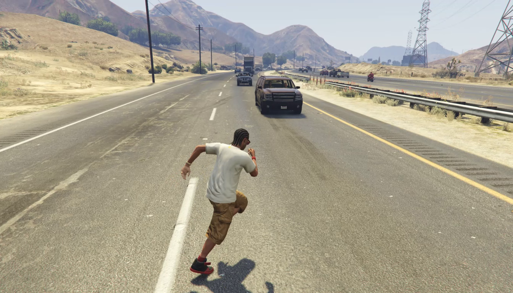

**Caption:** Fig. 3(a), game pair data: RGB target frame from gameplay.

**Caption[CN]:** 图 3(a)，游戏成对数据：游戏过程中的 RGB 目标帧。

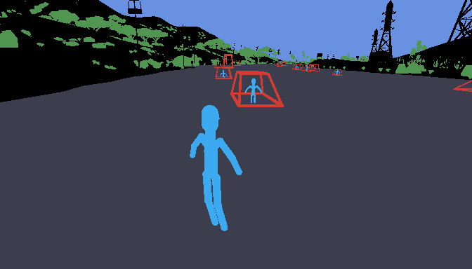

**Caption:** Fig. 3(a), game pair data: frame-aligned proxy rendered from structured runtime annotations.

**Caption[CN]:** 图 3(a)，游戏成对数据：根据结构化运行时标注渲染的帧对齐 proxy。

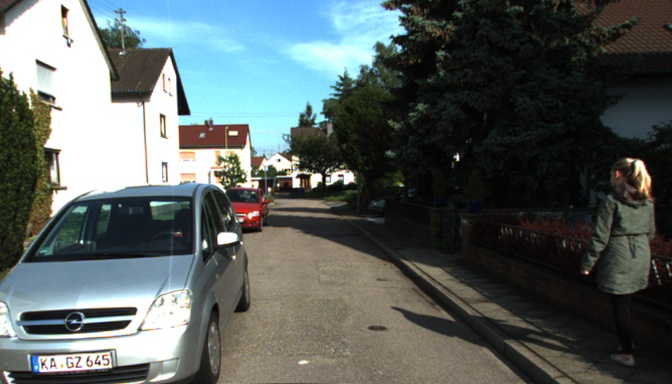

**Caption:** Fig. 3(b), real pair data: RGB target frame from a real-world recording.

**Caption[CN]:** 图 3(b)，真实成对数据：真实世界记录中的 RGB 目标帧。

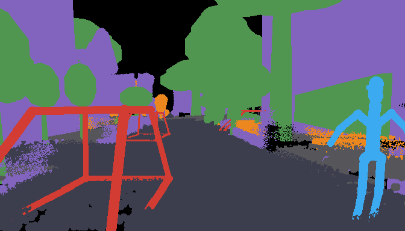

**Caption:** Fig. 3(b), real pair data: offline proxy compiled from calibrated reconstruction and object annotations.

**Caption[CN]:** 图 3(b)，真实成对数据：根据标定重建和物体标注离线编译的 proxy。

**Source caption:** Fig. 3. Paired data construction. Each adjacent RGB–proxy pair is aligned at the same frame. (a) For game data, code reads structured runtime annotations to automatically produce pixel-wise, instance-level proxy annotations and preserve identity across frames. Note that, to ensure that the coding agent can easily reproduce the proxy at inference time, we exclude skeletal pose, detailed 3D models, and other representations that are difficult for coding agents to construct and maintain. Because extraction and compilation are code-based, a coding agent can easily add or revise the retained annotation channels through small, local program changes. (b) For real data, calibrated 3D reconstruction and object annotations compile the aligned proxy offline, preserving scene layout, entity locations, and occlusion without action labels or access to game-engine runtime state.

**Source caption[CN]:** 图 3. 成对数据构建。每个相邻的 RGB–proxy 对都在同一帧对齐。(a) 对于游戏数据，代码读取结构化运行时标注，自动生成逐像素、实例级的 proxy 标注，并跨帧保持身份。注意，为确保 coding agent 能够在推理时轻易复现 proxy，我们排除了骨骼姿态、详细 3D 模型以及其他 coding agents 难以构建和维护的表示。由于提取和编译均基于代码，coding agent 可以通过小规模局部程序修改轻松增加或修订保留的标注通道。(b) 对于真实数据，经标定的 3D 重建和物体标注在线下编译对齐的 proxy，在没有动作标签或游戏引擎运行时状态的情况下保留场景布局、实体位置和遮挡。

> <strong>Para. 4:</strong> Our experiments also indicate that a coding agent can autonomously construct simple but discriminative primitives. For common categories such as people, trees, vehicles, bushes, and ordinary buildings, the agent classifies each identity and composes the corresponding primitives. For structurally complex or uncommon objects, it first decides whether simple primitives preserve sufficient discriminability; otherwise, the system uses a bounding box. The box marks only the identity’s location and coarse spatial extent, while text provides category, appearance, attributes, and action. This fallback avoids requiring the coding agent to reconstruct complex geometry while still informing the video model that the object exists at a particular location.

> <strong>Para. 4[CN]:</strong> 我们的实验还表明，coding agent 可以自主构建简单但具有辨识度的基元。对于人物、树木、车辆、灌木和普通建筑等常见类别，智能体对每个身份进行分类，并组合相应基元。对于结构复杂或不常见的物体，它首先判断简单基元是否能保留足够辨识度；否则系统使用 bounding box。该框只标记身份的位置和粗略空间范围，而文本提供类别、外观、属性和动作。这一回退策略避免要求 coding agent 重建复杂几何，同时仍然告知视频模型该物体存在于特定位置。

> <strong>Para. 5:</strong> The recorded runtime further provides precise identity correspondence. For each frame of the rendered proxy video, we obtain a pixel-wise ground-truth instance map that identifies the identity associated with each pixel. This mapping binds the appearance, attributes, and action descriptions for every identity in structured text to the corresponding proxy region, yielding a more precise condition. Fig. 3a shows one such automatically constructed pair.

> <strong>Para. 5[CN]:</strong> 记录的运行时信息还提供精确的身份对应关系。对于渲染后 proxy video 的每一帧，我们获得逐像素 ground-truth instance map，标识每个像素对应的身份。这一映射将结构化文本中每个身份的外观、属性和动作描述绑定到相应 proxy 区域，从而形成更精确的条件。图 3a 展示了一个这样的自动构建成对样本。

#### Real-world data

> <strong>Para. 6:</strong> Real videos are another important source. Their value is not only scale, but also high-fidelity appearance, motion, and physical interaction that game assets, animation, simulation, and rendering pipelines cannot fully cover. These priors can move the learned observation model beyond the visual and dynamic ceiling imposed by a particular game pipeline. They are especially important for embodied agents, whose tasks require cues about scale, occlusion, contact, camera egomotion, and the motion and physical response caused by actions. Real-video data can make generated visual environments closer to an agent’s deployment distribution, allowing Code World Model to support not only virtual-world generation but also scalable real-world visual environments for training and evaluating agents.

> <strong>Para. 6[CN]:</strong> 真实视频是另一种重要来源。它们的价值不仅在于规模，还在于游戏资产、动画、模拟和渲染流水线无法完全覆盖的高保真外观、运动和物理交互。这些先验可以使学习到的观测模型超越特定游戏流水线施加的视觉与动态上限。对于具身智能体尤其重要，因为其任务需要关于尺度、遮挡、接触、相机自运动以及动作造成的运动和物理响应的线索。真实视频数据可以使生成的视觉环境更接近智能体的部署分布，使 Code World Model 不仅支持虚拟世界生成，也支持用于智能体训练和评测的可扩展真实世界视觉环境。

> <strong>Para. 7:</strong> For approaches that depend on separate action or camera conditions [26, 34, 37], turning real videos into training data typically requires action labels or camera trajectories. Actions in unconstrained real-world videos can be defined at different semantic granularities, making annotation ambiguous, while continuous camera motion is also difficult to estimate and label. Our interface requires only a target video, a corresponding proxy video, and a structured prompt. The visual effects of actions and camera motion are represented directly in the proxy video rather than defined as independent labels.

> <strong>Para. 7[CN]:</strong> 对于依赖独立动作条件或相机条件的方法 [26, 34, 37]，将真实视频转换为训练数据通常需要动作标签或相机轨迹。无约束真实世界视频中的动作可以按不同语义粒度定义，因而标注存在歧义；连续相机运动也难以估计和标注。我们的接口只需要目标视频、对应的 proxy video 和结构化 prompt。动作与相机运动的视觉效果直接在 proxy video 中表示，而不是定义为独立标签。

> <strong>Para. 8:</strong> To verify that proxy–observation pairs can be constructed from real-world recordings, we build a geometry-assisted proof of concept on KITTI-360 [93]. Rectified RGB frames serve as target observations, while calibrated camera poses, the accumulated semantic 3D reconstruction, and 3D object annotations are used only during offline data construction to compile the corresponding conditions; none of them is provided to the video model. At each timestamp, we project the static scene geometry into the calibrated camera view to obtain metric depth and depth-derived surface normals. We represent scene elements requiring explicit spatial grounding using the same coarse primitive vocabulary as for game data: capsule skeletons for pedestrians, wireframes for vehicles, low-poly proxies for vegetation, and coarse 3D extents for large buildings. The projected geometry and proxy primitives are rasterized through a shared depth buffer, preserving camera motion, spatial alignment, and occlusion across all conditions. Using the same dataset frame index establishes a one-to-one correspondence between each RGB target and its compiled conditions. Fig. 3b shows a representative aligned frame, illustrating that proxy conditions can be compiled from an existing real-world 3D reconstruction without access to game-engine runtime state.

> <strong>Para. 8[CN]:</strong> 为验证能否从真实世界记录构建 proxy–observation 对，我们在 KITTI-360 [93] 上构建了一个几何辅助的概念验证。校正后的 RGB 帧充当目标观测；标定相机姿态、累积语义 3D 重建和 3D 物体标注只在线下数据构建阶段用于编译相应条件，它们都不会提供给视频模型。在每个时间戳，我们将静态场景几何投影到标定相机视图中，以获得度量深度和由深度推导的表面法线。对于需要显式空间锚定的场景元素，我们使用与游戏数据相同的粗粒度基元词汇：行人使用 capsule skeleton，车辆使用 wireframe，植被使用低多边形 proxy，大型建筑使用粗略 3D 范围。投影几何和 proxy 基元通过共享深度缓冲进行光栅化，在所有条件中保持相机运动、空间对齐和遮挡。使用相同的数据集帧索引，可以在每个 RGB 目标与其编译条件之间建立一一对应。图 3b 展示了一个代表性对齐帧，说明无需访问游戏引擎运行时状态，也可以从已有真实世界 3D 重建中编译 proxy 条件。

---

## 5. Experiments

### 5.1. Implementation Details

#### Training

> <strong>Para. 1:</strong> We fine-tune the official MiniMax-H3 Ref2VA backbone [77] for proxy-conditioned video generation. Each training sample uses a proxy sequence and structured text as conditions, with the paired RGB video serving as the prediction target. The 157 gameplay takes contain approximately 5.6 hours of source video. We sample 9,420 five-second training clips from these takes at two-second intervals. Each target is a 124-frame video at 1344 × 768 and 24 FPS. Its temporally aligned proxy condition is a 124-frame, 336 × 192 sequence combining fixed-log depth with categorical semantic-ID maps. The multimodal encoder receives a system instruction, a clip-specific text description, and 11 proxy frames sampled at offsets 0, 12, 24, …, 120. We apply rank-128 LoRA [94] throughout all 50 transformer blocks, yielding approximately 596M trainable parameters. Starting from the official Ref2VA checkpoint, we optimize only the video objective on eight NVIDIA H800 GPUs using AdamW with a global batch size of eight, weight decay 0.01, gradient-norm clipping at 1.0, BF16 mixed precision, FlashAttention-3 [95], and gradient checkpointing; the audio loss is disabled. Given our available compute budget, training runs for three epochs, or 3,534 optimizer steps, with a 100-step warmup followed by cosine learning-rate decay from $2 \times 10^{-5}$ to $1 \times 10^{-6}$.

> <strong>Para. 1[CN]:</strong> 我们对官方 MiniMax-H3 Ref2VA backbone [77] 进行微调，用于 proxy 条件视频生成。每个训练样本以 proxy 序列和结构化文本作为条件，以配对的 RGB 视频作为预测目标。157 段游戏录制包含约 5.6 小时源视频。我们以两秒间隔从这些录制中采样 9,420 个五秒训练片段。每个目标是一个 124 帧、分辨率为 1344 × 768、帧率为 24 FPS 的视频。其时间对齐的 proxy 条件是一个 124 帧、分辨率为 336 × 192 的序列，由 fixed-log depth 与类别 semantic-ID maps 组合而成。多模态编码器接收一条系统指令、一条片段级文本描述，以及按偏移量 0、12、24、…、120 采样的 11 帧 proxy。我们在全部 50 个 transformer block 中应用 rank-128 LoRA [94]，得到约 596M 个可训练参数。从官方 Ref2VA checkpoint 开始，我们仅在 8 张 NVIDIA H800 GPU 上优化视频目标，使用 AdamW、全局 batch size 8、weight decay 0.01、梯度范数裁剪 1.0、BF16 混合精度、FlashAttention-3 [95] 和 gradient checkpointing；音频损失被禁用。受可用计算预算限制，训练运行 3 个 epoch，即 3,534 个优化步骤，先进行 100 步 warmup，随后将学习率从 $2 \times 10^{-5}$ 按 cosine 衰减到 $1 \times 10^{-6}$。

#### Coding-agent inference

> <strong>Para. 2:</strong> We use GPT-5.6 Sol as the coding agent. During inference, we provide it with existing game-engine code that supplies basic player controls, collision handling, and a runtime update loop, together with the same proxy primitives used in training-data construction. Building AAA-scale scenes and complex interaction logic entirely from scratch remains difficult for current coding agents. We find, however, that the coding agent can readily use existing AAA game scenes and gameplay logic as templates, combining, extending, and rewriting them to construct each target world. The resulting world is executable and player-controllable, while representing visually relevant state with coarse proxy geometry rather than refined 3D assets. We run this world under user control, record the resulting proxy video, and provide that sequence as a frame-wise condition to the downstream video model. Given the rapid progress of coding agents, we expect them to increasingly construct complex world interactions and scene layouts from scratch.

> <strong>Para. 2[CN]:</strong> 我们使用 GPT-5.6 Sol 作为 coding agent。推理期间，我们向它提供现有的游戏引擎代码，该代码提供基本玩家控制、碰撞处理和运行时更新循环，同时提供与训练数据构建中相同的 proxy 基元。对于当前 coding agents 来说，完全从零构建 AAA 规模场景和复杂交互逻辑仍然困难。不过，我们发现 coding agent 可以很容易地将已有 AAA 游戏场景和 gameplay logic 作为模板，通过组合、扩展和重写来构建每个目标世界。得到的世界是可执行且可由玩家控制的，同时使用粗粒度 proxy 几何而不是精细 3D 资产表示视觉相关状态。我们在用户控制下运行这一世界，记录生成的 proxy video，并将该序列作为逐帧条件提供给下游视频模型。鉴于 coding agents 的快速进展，我们预计它们将越来越能够从零构建复杂世界交互和场景布局。

#### Video-model inference

> <strong>Para. 3:</strong> We use the checkpoint at step 3,534 and sample each video with explicit Euler for 20 steps. For the qualitative examples, GPT Image 2 generates a 1536 × 864 first-frame appearance anchor conditioned on the first proxy frame and a text prompt written by the coding agent. The coding-agent-written image prompt instructs the model to preserve the proxy-specified entity count, approximate positions, relative scale, object orientations, coarse layout, camera height, and framing, while realizing the identities, materials, environment, and overall visual style described in text. The generated image is resized to 1344 × 768, initializes target latent slot 0, and is supplied to both the multimodal encoder and the Ref2VA appearance-reference branch. The complete proxy sequence provides frame-aligned control over camera motion, entity motion, and scene layout, while text specifies appearance, action semantics, and details not represented by the proxy. Each inference call generates a 124-frame video at 1344 × 768 and 24 FPS. Inference is video-only and uses FlashAttention-3 on H800 GPUs.

> <strong>Para. 3[CN]:</strong> 我们使用第 3,534 步的 checkpoint，并用 explicit Euler 在 20 步中采样每个视频。对于定性示例，GPT Image 2 以第一帧 proxy 和 coding agent 编写的文本 prompt 为条件，生成一张 1536 × 864 的首帧外观 anchor。由 coding agent 编写的图像 prompt 指示模型保留 proxy 指定的实体数量、近似位置、相对尺度、物体朝向、粗略布局、相机高度和取景，同时实现文本中描述的身份、材质、环境和总体视觉风格。生成图像被缩放到 1344 × 768，初始化目标 latent slot 0，并同时提供给多模态编码器和 Ref2VA appearance-reference 分支。完整 proxy 序列对相机运动、实体运动和场景布局提供帧对齐控制，而文本指定外观、动作语义以及 proxy 未表示的细节。每次推理调用生成一个 124 帧、分辨率 1344 × 768、帧率 24 FPS 的视频。推理仅使用视频目标，并在 H800 GPU 上使用 FlashAttention-3。

> <strong>Para. 4:</strong> For long-video inference, we run the model over overlapping 124-frame windows with a 34-frame overlap, so each new window advances the video by 90 frames. The first window is initialized with the GPT Image 2 appearance anchor described above. For every subsequent window, the final 34 RGB frames from the preceding window provide continuation context, while the same appearance anchor is again supplied to both the multimodal encoder and the Ref2VA appearance-reference branch. The overlapping RGB context maintains local temporal continuity, whereas reusing the anchor helps preserve global identity and appearance across windows. Each call generates a complete 124-frame window; during stitching, we retain all frames from the first window, discard the regenerated 34-frame overlap from each later window, and append its remaining 90 frames. Frame-aligned proxy conditions are provided throughout the sequence. Their 336 × 192 spatial resolution is one quarter of the 1344 × 768 output resolution along each dimension, corresponding to one sixteenth as many pixels. Consequently, even frame-wise proxy conditioning introduces few additional visual tokens and adds negligible inference overhead relative to full-resolution video generation.

> <strong>Para. 4[CN]:</strong> 对于长视频推理，我们在带有重叠的 124 帧窗口上运行模型，每个窗口重叠 34 帧，因此每个新窗口使视频前进 90 帧。第一个窗口使用上文所述的 GPT Image 2 外观 anchor 初始化。对于每个后续窗口，前一个窗口最后的 34 个 RGB 帧提供延续上下文，同时再次将同一个外观 anchor 提供给多模态编码器和 Ref2VA appearance-reference 分支。重叠 RGB 上下文维持局部时间连续性，而重复使用 anchor 有助于保持不同窗口间的全局身份和外观。每次调用都生成完整的 124 帧窗口；拼接时保留第一个窗口的所有帧，丢弃每个后续窗口重新生成的 34 帧重叠部分，并追加其余 90 帧。整个序列都提供帧对齐的 proxy 条件。proxy 的空间分辨率为 336 × 192，是 1344 × 768 输出分辨率在每个维度上的四分之一，对应像素数的十六分之一。因此，即使逐帧加入 proxy 条件，也只引入少量额外视觉 token；相较全分辨率视频生成，其推理开销可以忽略。

### 5.2. Visual Quality Results

> <strong>Para. 1:</strong> We present visual quality results in Fig. 4. Each video is conditioned on a proxy sequence recorded from a simple interactive world constructed by the coding agent, together with a text prompt written by the same agent. We find that, even after LoRA adaptation on only a small amount of paired training data, the video model closely follows proxy-specified entity positions and motion, scene layout, and camera trajectories.

> <strong>Para. 1[CN]:</strong> 我们在图 4 中展示视觉质量结果。每个视频都以由 coding agent 构建的简单交互世界中记录的 proxy 序列，以及由同一智能体编写的文本 prompt 作为条件。我们发现，即使只在少量成对训练数据上进行 LoRA 适配，视频模型也能紧密遵循 proxy 指定的实体位置和运动、场景布局以及相机轨迹。

> <strong>Para. 2:</strong> Our qualitative comparison videos on the project page show that proxy conditioning provides more precise and responsive control over character motion, actions, and camera movement than action- or camera-conditioned video world models [31, 34, 37]. By specifying frame-wise poses and trajectories directly, the proxy controls individual character actions and camera operations at the same granularity as a modern 3D game. We refer readers to these demos for the complete temporal comparisons. To isolate control quality, the comparisons do not consider inference latency.

> <strong>Para. 2[CN]:</strong> 项目主页上的定性对比视频表明，与动作条件或相机条件的视频世界模型相比，proxy conditioning 能够对角色运动、动作和相机运动提供更精确且更具响应性的控制 [31, 34, 37]。通过直接指定逐帧姿态和轨迹，proxy 以与现代 3D 游戏相同的粒度控制单个角色动作和相机操作。完整的时间对比请参见这些演示。为隔离控制质量，对比不考虑推理延迟。

### Figure 4. Visual quality results / 视觉质量结果

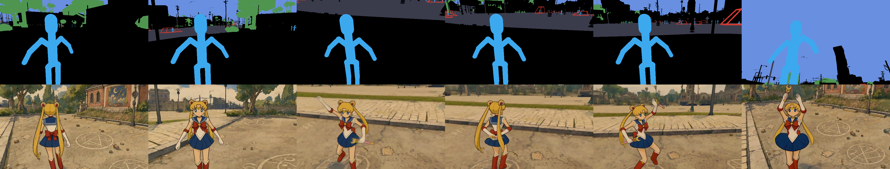

**Caption:** Fig. 4(A). Sailor Moon prompt case: temporally ordered proxy frames above and generated RGB observations below.

**Caption[CN]:** 图 4(A)。Sailor Moon prompt 案例：上方为按时间排序的 proxy 帧，下方为生成的 RGB 观测。

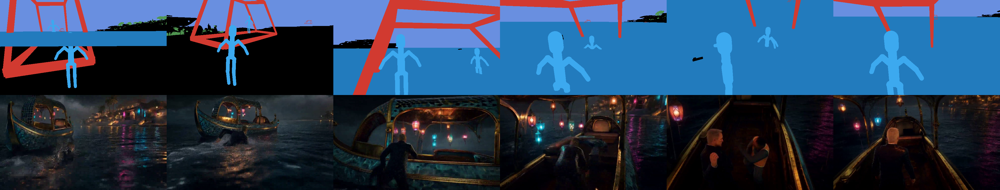

**Caption:** Fig. 4(B). James Bond prompt case: temporally ordered proxy frames above and generated RGB observations below.

**Caption[CN]:** 图 4(B)。James Bond prompt 案例：上方为按时间排序的 proxy 帧，下方为生成的 RGB 观测。

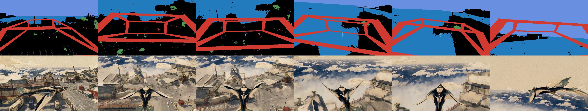

**Caption:** Fig. 4(C). Celestial manta-skiff prompt case: temporally ordered proxy frames above and generated RGB observations below.

**Caption[CN]:** 图 4(C)。celestial manta-skiff prompt 案例：上方为按时间排序的 proxy 帧，下方为生成的 RGB 观测。

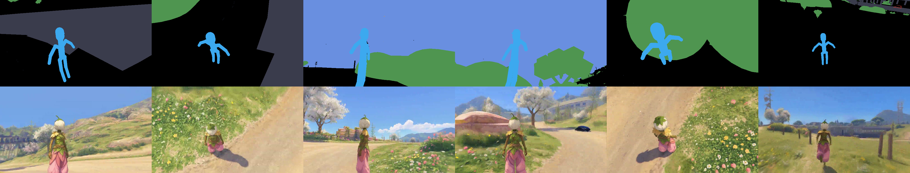

**Caption:** Fig. 4(D). Dandelion-seed courier prompt case: temporally ordered proxy frames above and generated RGB observations below.

**Caption[CN]:** 图 4(D)。dandelion-seed courier prompt 案例：上方为按时间排序的 proxy 帧，下方为生成的 RGB 观测。

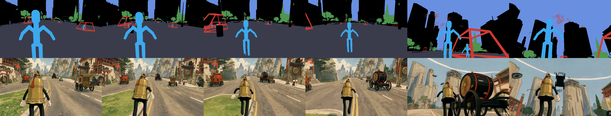

**Caption:** Fig. 4(E). Rubber-hose brass bell pilgrim prompt case: temporally ordered proxy frames above and generated RGB observations below.

**Caption[CN]:** 图 4(E)。rubber-hose brass bell pilgrim prompt 案例：上方为按时间排序的 proxy 帧，下方为生成的 RGB 观测。

**Source caption:** Fig. 4. Visual quality results. Each case contains six temporally ordered frames, with frame-aligned proxies in the upper row and generated RGB observations in the lower row; the corresponding text prompt appears below each pair. Despite using only five hours of GTA V gameplay for fine-tuning, our method exhibits strong generalization across diverse characters, environments, motions, and camera trajectories, preserving rich visual detail while following the spatiotemporal structure specified by the proxy.

**Source caption[CN]:** 图 4. 视觉质量结果。每个案例包含六个按时间排序的帧，上排为帧对齐的 proxy，下排为生成的 RGB 观测；对应文本 prompt 位于每一对图像下方。尽管微调只使用了五小时 GTA V 游戏数据，我们的方法仍能在多样的角色、环境、运动和相机轨迹之间展现较强泛化能力，在遵循 proxy 指定时空结构的同时保留丰富的视觉细节。

---

## 6. Limitations and Conclusions

### Limitations

> <strong>Para. 1:</strong> Our current system has two primary limitations. First, our experiments are limited by available compute. The training scale therefore remains small, and the resulting generation quality is still limited. We also do not implement autoregressive real-time generation. Second, despite their rapid progress, current coding agents still struggle to implement highly complex game mechanisms reliably from scratch. Our prototype therefore does not demonstrate autonomous construction of a complete open-world game or simulator. We expect future coding agents to design, implement, test, and maintain increasingly complex world mechanisms, but reliably achieving this capability remains future work.

> <strong>Para. 1[CN]:</strong> 当前系统有两个主要局限。第一，我们的实验受到可用计算资源限制。因此训练规模仍然较小，生成质量也仍受限制。我们也没有实现自回归实时生成。第二，尽管当前 coding agents 发展迅速，它们仍然难以可靠地从零实现高度复杂的游戏机制。因此，我们的原型尚未展示自主构建完整开放世界游戏或模拟器的能力。我们预计未来 coding agents 将能够设计、实现、测试并维护越来越复杂的世界机制，但可靠实现这一能力仍是未来工作。

### Conclusions

> <strong>Para. 2:</strong> We introduced Code World Model, which separates world evolution from visual realization: a coding agent uses executable code to maintain persistent world state, while a video model generates visual observations. A proxy connects these components through frame-wise spatiotemporal conditions, and our data pipelines construct aligned proxy–observation pairs for training. After adaptation on paired gameplay data, qualitative evaluations using proxies recorded from simple coding-agent-built worlds show that the video model can follow these proxy conditions while preserving visual detail and dynamics, suggesting a promising path toward open-ended world models.

> <strong>Para. 2[CN]:</strong> 我们提出了 Code World Model，将世界演化与视觉实现分离：coding agent 使用可执行代码维护持久世界状态，而视频模型生成视觉观测。proxy 通过逐帧时空条件连接这两个组件，我们的数据流水线构建了用于训练的对齐 proxy–observation 对。在成对游戏数据上适配后，使用从 coding-agent 构建的简单世界中记录的 proxy 进行的定性评估显示，视频模型能够遵循这些 proxy 条件，同时保留视觉细节和动态，说明这是一条通向开放式世界模型的有前景路径。

---

## 7. References

> 参考文献按源 PDF 的可检索书目形式保留，不对作者、题名、期刊、会议、年份、页码或 arXiv 标识做翻译性改写；正文引用编号与原文保持一致。

1. David Ha and Jürgen Schmidhuber. World models. arXiv preprint arXiv:1803.10122, 2018. 1, 7
2. Danijar Hafner, Timothy Lillicrap, Ian Fischer, Ruben Villegas, David Ha, Honglak Lee, and James Davidson. Learning latent dynamics for planning from pixels. In Proceedings of the 36th International Conference on Machine Learning, pages 2555–2565, 2019. 7
3. Danijar Hafner, Jurgis Pasukonis, Jimmy Ba, and Timothy Lillicrap. Mastering diverse domains through world models. arXiv preprint arXiv:2301.04104, 2023. 1
4. Anthony Hu, Lloyd Russell, Hudson Yeo, Zak Murez, George Fedoseev, Alex Kendall, Jamie Shotton, and Gianluca Corrado. GAIA-1: A generative world model for autonomous driving. arXiv preprint arXiv:2309.17080, 2023. 2
5. Sherry Yang, Yilun Du, Kamyar Ghasemipour, Jonathan Tompson, Leslie Kaelbling, Dale Schuurmans, and Pieter Abbeel. Learning interactive real-world simulators. arXiv preprint arXiv:2310.06114, 2024. 2, 6
6. Jake Bruce, Michael Dennis, Ashley Edwards, Jack Parker-Holder, Yuge Shi, et al. Genie: Generative interactive environments. In Proceedings of the 41st International Conference on Machine Learning, 2024. 2, 4
7. Eloi Alonso, Adam Jelley, Vincent Micheli, Anssi Kanervisto, Amos Storkey, Tim Pearce, and François Fleuret. Diffusion for world modeling: Visual details matter in atari. In Advances in Neural Information Processing Systems, 2024. 2, 4, 6, 9
8. Joel Jang, Seonghyeon Ye, Zongyu Lin, Jiannan Xiang, Johan Bjorck, Yu Fang, Fengyuan Hu, Spencer Huang, Kaushil Kundalia, Yen-Chen Lin, Loic Magne, Ajay Mandlekar, Avnish Narayan, You Liang Tan, Guanzhi Wang, Jing Wang, Qi Wang, Yinzhen Xu, Xiaohui Zeng, Kaiyuan Zheng, Ruijie Zheng, Ming-Yu Liu, Luke Zettlemoyer, Dieter Fox, Jan Kautz, Scott Reed, Yuke Zhu, and Linxi Fan. DreamGen: Unlocking generalization in robot learning through video world models. arXiv preprint arXiv:2505.12705, 2025.
9. Ansh Kumar Sharma, Yixiang Sun, Ninghao Lu, Yunzhe Zhang, Jiarao Liu, and Sherry Yang. World-Gymnast: Training robots with reinforcement learning in a world model. arXiv preprint arXiv:2602.02454, 2026. 2
10. Seung Wook Kim, Yuhao Zhou, Jonah Philion, Antonio Torralba, and Sanja Fidler. Learning to simulate dynamic environments with GameGAN. In Proceedings of the IEEE/CVF Conference on Computer Vision and Pattern Recognition, 2020. 2, 4, 9
11. Willi Menapace, Stéphane Lathuilière, Sergey Tulyakov, Aliaksandr Siarohin, and Elisa Ricci. Playable video generation. In Proceedings of the IEEE/CVF Conference on Computer Vision and Pattern Recognition, 2021.
12. Willi Menapace, Stéphane Lathuilière, Aliaksandr Siarohin, Christian Theobalt, Sergey Tulyakov, Vladislav Golyanik, and Elisa Ricci. Playable environments: Video manipulation in space and time. In Proceedings of the IEEE/CVF Conference on Computer Vision and Pattern Recognition, 2022.
13. Vincent Micheli, Eloi Alonso, and François Fleuret. Transformers are sample-efficient world models. In International Conference on Learning Representations, 2023. 4
14. Dani Valevski, Yaniv Leviathan, Moab Arar, and Shlomi Fruchter. Diffusion models are real-time game engines. In International Conference on Learning Representations, 2025. 2, 4, 6, 9
15. Willi Menapace, Aliaksandr Siarohin, Stéphane Lathuilière, Panos Achlioptas, Vladislav Golyanik, Sergey Tulyakov, and Elisa Ricci. Promptable game models: Text-guided game simulation via masked diffusion models. ACM Transactions on Graphics, 2024. 2, 4, 7
16. Jialong Wu, Shaofeng Yin, Ningya Feng, Xu He, Dong Li, Jianye Hao, and Mingsheng Long. iVideoGPT: Interactive VideoGPTs are scalable world models. In Advances in Neural Information Processing Systems, 2024.
17. Jiannan Xiang, Guangyi Liu, Yi Gu, Qiyue Gao, Yuting Ning, Yuheng Zha, Zeyu Feng, Tianhua Tao, Shibo Hao, Yemin Shi, Zhengzhong Liu, Eric P. Xing, and Zhiting Hu. Pandora: Towards general world model with natural language actions and video states. arXiv preprint arXiv:2406.09455, 2024. 7
18. Jack Parker-Holder, Philip Ball, Jake Bruce, Vibhavari Dasagi, et al. Genie 2: A large-scale foundation world model. Google DeepMind Blog, 2024.
19. Jack Parker-Holder and Shlomi Fruchter. Genie 3: A new frontier for world models. Google DeepMind Blog, 2025. 4
20. Anssi Kanervisto, Dave Bignell, Linda Yilin Wen, Martin Grayson, Raluca Georgescu, Sergio Valcarcel Macua, Shan Zheng Tan, Tabish Rashid, Tim Pearce, et al. World and human action models towards gameplay ideation. Nature, 638:656–663, 2025. 4
21. Haoran He, Yang Zhang, Liang Lin, Zhongwen Xu, and Ling Pan. Pre-trained video generative models as world simulators. arXiv preprint arXiv:2502.07825, 2025.
22. Shenyuan Gao, Siyuan Zhou, Yilun Du, Jun Zhang, and Chuang Gan. AdaWorld: Learning adaptable world models with latent actions. In Proceedings of the 42nd International Conference on Machine Learning, pages 18744–18771, 2025. 4
23. Jiwen Yu, Yiran Qin, Xintao Wang, Pengfei Wan, Di Zhang, and Xihui Liu. GameFactory: Creating new games with generative interactive videos. In Proceedings of the IEEE/CVF International Conference on Computer Vision, pages 11590–11599, 2025. 4
24. Haoxuan Che, Xuanhua He, Quande Liu, Cheng Jin, and Hao Chen. GameGen-X: Interactive open-world game video generation. In International Conference on Learning Representations, 2025.
25. Jiaqi Li, Junshu Tang, Zhiyong Xu, Longhuang Wu, Yuan Zhou, Shuai Shao, Tianbao Yu, Zhiguo Cao, and Qinglin Lu. Hunyuan-GameCraft: High-dynamic interactive game video generation with hybrid history condition. arXiv preprint arXiv:2506.17201, 2025.
26. Yifan Zhang, Chunli Peng, Boyang Wang, Puyi Wang, Qingcheng Zhu, Fei Kang, Biao Jiang, Zedong Gao, Eric Li, Yang Liu, and Yahui Zhou. Matrix-Game: Interactive world foundation model. arXiv preprint arXiv:2506.18701, 2025. 11
27. PAN Team, Jiannan Xiang, Yi Gu, Zihan Liu, Zeyu Feng, Qiyue Gao, Yiyan Hu, Benhao Huang, Guangyi Liu, Yichi Yang, Kun Zhou, et al. PAN: A world model for general, interactable, and long-horizon world simulation. arXiv preprint arXiv:2511.09057, 2025. 4
28. Siqiao Huang, Jialong Wu, Qixing Zhou, Shangchen Miao, and Mingsheng Long. Vid2World: Crafting video diffusion models to interactive world models. In International Conference on Learning Representations, 2026. 4
29. Xiaofeng Mao, Zhen Li, Chuanhao Li, Xiaojie Xu, Kaining Ying, Tong He, Jiangmiao Pang, Yu Qiao, and Kaipeng Zhang. YUME-1.5: A text-controlled interactive world generation model. In Proceedings of the IEEE/CVF Conference on Computer Vision and Pattern Recognition, 2026. 4, 7
30. DreamX Team, Yancheng Bai, Rui Chen, Xiangxiang Chu, Rujing Dang, et al. DreamX-World 1.0: A general-purpose interactive world model. arXiv preprint arXiv:2606.16993, 2026. 4, 6
31. Zelin Gao, Qiuyu Wang, Jiapeng Zhu, Jingye Chen, Zichen Liu, et al. Infinite worlds with versatile interactions. arXiv preprint arXiv:2607.07534, 2026. 2, 4, 6, 8, 12
32. Zeqi Xiao, Yushi Lan, Yifan Zhou, Wenqi Ouyang, Shuai Yang, Yanhong Zeng, and Xingang Pan. WorldMem: Long-term consistent world simulation with memory. arXiv preprint arXiv:2504.12369, 2025. 2, 4
33. Taiye Chen, Xun Hu, Zihan Ding, and Chi Jin. VRAG: Learning world models for interactive video generation. In Advances in Neural Information Processing Systems, 2025.
34. Wenqiang Sun, Haiyu Zhang, Haoyuan Wang, Junta Wu, Zehan Wang, Zhenwei Wang, Yunhong Wang, Jun Zhang, Tengfei Wang, and Chunchao Guo. WorldPlay: Towards long-term geometric consistency for real-time interactive world modeling. arXiv preprint arXiv:2512.14614, 2025. 2, 4, 6, 11, 12
35. Yicong Hong, Yiqun Mei, Chongjian Ge, Yiran Xu, Yang Zhou, Sai Bi, Yannick Hold-Geoffroy, Mike Roberts, Matthew Fisher, Eli Shechtman, Kalyan Sunkavalli, Feng Liu, Zhengqi Li, and Hao Tan. RELIC: Interactive video world model with long-horizon memory. arXiv preprint arXiv:2512.04040, 2025.
36. Robbyant Team, Zelin Gao, Qiuyu Wang, Yanhong Zeng, Jiapeng Zhu, et al. Advancing open-source world models. arXiv preprint arXiv:2601.20540, 2026.
37. Zile Wang, Zexiang Liu, Jiaxing Li, Kaichen Huang, Baixin Xu, et al. Matrix-Game 3.0: Real-time and streaming interactive world model with long-horizon memory. arXiv preprint arXiv:2604.08995, 2026. 4, 6, 11, 12
38. Jiwen Yu, Jianhong Bai, Yiran Qin, Quande Liu, Xintao Wang, Pengfei Wan, Di Zhang, and Xihui Liu. Context as memory: Scene-consistent interactive long video generation with memory retrieval. arXiv preprint arXiv:2506.03141, 2025. 2, 4, 6
39. Runjia Li, Philip Torr, Andrea Vedaldi, and Tomas Jakab. VMem: Consistent interactive video scene generation with surfel-indexed view memory. arXiv preprint arXiv:2506.18903, 2025. 2, 6
40. Hanlin Wang, Hao Ouyang, Qiuyu Wang, Wen Wang, Qingyan Bai, et al. WorldDirector: Building controllable world simulators with persistent dynamic memory. arXiv preprint arXiv:2607.02517, 2026.
41. Zhexiao Xiong, Yizhi Song, Hao Kang, Qing Yan, Liming Jiang, et al. ActWorld: From explorable to interactive world model via action-aware memory. arXiv preprint arXiv:2606.17730, 2026. 4
42. Xun Huang, Zhengqi Li, Guande He, Mingyuan Zhou, and Eli Shechtman. Self forcing: Bridging the train-test gap in autoregressive video diffusion. arXiv preprint arXiv:2506.08009, 2025. 4
43. Ruiqi Wu, Xuanhua He, Meng Cheng, Tianyu Yang, Yong Zhang, Zhuoliang Kang, Xunliang Cai, Xiaoming Wei, Chunle Guo, Chongyi Li, and Ming-Ming Cheng. Infinite-World: Scaling interactive world models to 1000-frame horizons via pose-free hierarchical memory. In International Conference on Machine Learning, 2026. 4
44. Wei Yu, Runjia Qian, Yumeng Li, Liquan Wang, Songheng Yin, Sri Siddarth Chakaravarthy P, Dennis Anthony, Yang Ye, Yidi Li, Weiwei Wan, and Animesh Garg. MosaicMem: Hybrid spatial memory for controllable video world models. arXiv preprint arXiv:2603.17117, 2026. 2, 4
45. Decart, Quinn McIntyre, Spruce Campbell, Xinlei Chen, Robert Wachen, and Julian Quevedo. Oasis: A universe in a transformer, 2024. 2, 4
46. Reactor Technologies, Inc. Happy Oyster: Real-time world model by alibaba. Reactor model documentation, 2026. Model by Alibaba Cloud Model Studio. 4
47. Ruili Feng, Han Zhang, Zhantao Yang, Jie Xiao, Zhilei Shu, Zhiheng Liu, Andy Zheng, Yukun Huang, Yu Liu, and Hongyang Zhang. The matrix: Infinite-horizon world generation with real-time moving control. arXiv preprint arXiv:2412.03568, 2024. 4
48. Junliang Guo, Yang Ye, Tianyu He, Haoyu Wu, Yushu Jiang, Tim Pearce, and Jiang Bian. MineWorld: A real-time and open-source interactive world model on minecraft. arXiv preprint arXiv:2504.08388, 2025.
49. Xianglong He, Chunli Peng, Zexiang Liu, Boyang Wang, Yifan Zhang, et al. Matrix-Game 2.0: An open-source, real-time, and streaming interactive world model. arXiv preprint arXiv:2508.13009, 2025. 4
50. Xinle Cheng, Tianyu He, Jiayi Xu, Junliang Guo, Di He, and Jiang Bian. Playing with transformer at 30+ FPS via next-frame diffusion. arXiv preprint arXiv:2506.01380, 2025. 4
51. Shanchuan Lin, Ceyuan Yang, Hao He, Jianwen Jiang, Yuxi Ren, Xin Xia, Yang Zhao, Xuefeng Xiao, and Lu Jiang. Autoregressive adversarial post-training for real-time interactive video generation. arXiv preprint arXiv:2506.09350, 2025.
52. Shuai Yang, Wei Huang, Ruihang Chu, Yicheng Xiao, Yuyang Zhao, et al. LongLive: Real-time interactive long video generation. arXiv preprint arXiv:2509.22622, 2025. 7
53. Kunhao Liu, Wenbo Hu, Jiale Xu, Ying Shan, and Shijian Lu. Rolling forcing: Autoregressive long video diffusion in real time. arXiv preprint arXiv:2509.25161, 2025.
54. Hongzhou Zhu, Min Zhao, Guande He, Hang Su, Chongxuan Li, and Jun Zhu. Causal forcing: Autoregressive diffusion distillation done right for high-quality real-time interactive video generation. arXiv preprint arXiv:2602.02214, 2026. 7
55. Min Zhao, Hongzhou Zhu, Bokai Yan, Zihan Zhou, Yimin Chen, et al. MinWM: A full-stack open-source framework for real-time interactive video world models. arXiv preprint arXiv:2605.30263, 2026. 2, 4, 7
56. Ashish Vaswani, Noam Shazeer, Niki Parmar, Jakob Uszkoreit, Llion Jones, Aidan N. Gomez, Łukasz Kaiser, and Illia Polosukhin. Attention is all you need. In Advances in Neural Information Processing Systems, pages 5998–6008, 2017. 2
57. Tom B. Brown, Benjamin Mann, Nick Ryder, Melanie Subbiah, Jared Kaplan, Prafulla Dhariwal, et al. Language models are few-shot learners. In Advances in Neural Information Processing Systems, pages 1877–1901, 2020.
58. Aakanksha Chowdhery, Sharan Narang, Jacob Devlin, Maarten Bosma, Gaurav Mishra, Adam Roberts, et al. PaLM: Scaling language modeling with pathways. arXiv preprint arXiv:2204.02311, 2022.
59. Jordan Hoffmann, Sebastian Borgeaud, Arthur Mensch, Elena Buchatskaya, Trevor Cai, Eliza Rutherford, et al. Training compute-optimal large language models. arXiv preprint arXiv:2203.15556, 2022.
60. Long Ouyang, Jeffrey Wu, Xu Jiang, Diogo Almeida, Carroll L. Wainwright, Pamela Mishkin, et al. Training language models to follow instructions with human feedback. In Advances in Neural Information Processing Systems, pages 27730–27744, 2022.
61. OpenAI. GPT-4 technical report. arXiv preprint arXiv:2303.08774, 2023.
62. Jason Wei, Xuezhi Wang, Dale Schuurmans, Maarten Bosma, Brian Ichter, Fei Xia, Ed Chi, Quoc V. Le, and Denny Zhou. Chain-of-thought prompting elicits reasoning in large language models. In Advances in Neural Information Processing Systems, pages 24824–24837, 2022.
63. Shunyu Yao, Jeffrey Zhao, Dian Yu, Nan Du, Izhak Shafran, Karthik Narasimhan, and Yuan Cao. ReAct: Synergizing reasoning and acting in language models. In International Conference on Learning Representations, 2023.
64. Timo Schick, Jane Dwivedi-Yu, Roberto Dessì, Roberta Raileanu, Maria Lomeli, Eric Hambro, Luke Zettlemoyer, Nicola Cancedda, and Thomas Scialom. Toolformer: Language models can teach themselves to use tools. In Advances in Neural Information Processing Systems, pages 68539–68551, 2023.
65. Mark Chen, Jerry Tworek, Heewoo Jun, Qiming Yuan, Henrique Ponde de Oliveira Pinto, Jared Kaplan, et al. Evaluating large language models trained on code. arXiv preprint arXiv:2107.03374, 2021.
66. John Yang, Carlos E. Jimenez, Alexander Wettig, Kilian Lieret, Shunyu Yao, Karthik Narasimhan, and Ofir Press. SWE-agent: Agent-computer interfaces enable automated software engineering. In Advances in Neural Information Processing Systems, pages 50528–50652, 2024.
67. Hao Tang, Darren Key, and Kevin Ellis. WorldCoder, a model-based LLM agent: Building world models by writing code and interacting with the environment. In Advances in Neural Information Processing Systems, 2024. 5, 6
68. Nicola Dainese, Matteo Merler, Minttu Alakuijala, and Pekka Marttinen. Generating code world models with large language models guided by monte carlo tree search. arXiv preprint arXiv:2405.15383, 2024. 5
69. Aidan Curtis, Hao Tang, Thiago Veloso, Kevin Ellis, Joshua B. Tenenbaum, Tomás Lozano-Pérez, and Leslie Pack Kaelbling. LLM-guided probabilistic program induction for POMDP model estimation. In Proceedings of the 9th Conference on Robot Learning, 2025. 5
70. Wolfgang Lehrach, Daniel Hennes, Miguel Lázaro-Gredilla, Xinghua Lou, Carter Wendelken, et al. Code world models for general game playing. arXiv preprint arXiv:2510.04542, 2025. 2, 5, 6
71. Kimi Team, Tongtong Bai, Yifan Bai, Yiping Bao, et al. Kimi K3: Open frontier intelligence. arXiv preprint arXiv:2607.24653, 2026. 2, 5
72. DeepSeek-AI, Anyi Xu, Bangcai Lin, Bing Xue, Bingxuan Wang, et al. DeepSeek-V4: Towards highly efficient million-token context intelligence. arXiv preprint arXiv:2606.19348, 2026. 5
73. Wayne Chi, Yixiong Fang, Arnav Yayavaram, Siddharth Yayavaram, Seth Karten, et al. GameDevBench: Evaluating agentic capabilities through game development. arXiv preprint arXiv:2602.11103, 2026. 5, 6
74. Yilei Jiang, Jinyuan Hu, Qianyin Xiao, Yaozhi Zheng, Ruize Ma, et al. OpenGame: Open agentic coding for games. arXiv preprint arXiv:2604.18394, 2026. 2, 5, 6
75. HunyuanWorld Team, Zhenwei Wang, Yuhao Liu, Junta Wu, Zixiao Gu, et al. HunyuanWorld 1.0: Generating immersive, explorable, and interactive 3d worlds from words or pixels. arXiv preprint arXiv:2507.21809, 2025. 3, 5, 7
76. Dilin Wang, Hyunyoung Jung, Tom Monnier, Kihyuk Sohn, Chuhang Zou, et al. WorldGen: From text to traversable and interactive 3d worlds. In Proceedings of the IEEE/CVF Conference on Computer Vision and Pattern Recognition, 2026. 3, 5, 7
77. MiniMax-AI. MiniMax H3. Official GitHub repository, 2026. 4, 11
78. William Peebles and Saining Xie. Scalable diffusion models with transformers. In Proceedings of the IEEE/CVF International Conference on Computer Vision, pages 4195–4205, 2023. 4, 7
79. Weijie Kong, Qi Tian, Zijian Zhang, Rox Min, Zuozhuo Dai, et al. HunyuanVideo: A systematic framework for large video generative models. arXiv preprint arXiv:2412.03603, 2024.
80. Team Wan, Ang Wang, Baole Ai, Bin Wen, Chaojie Mao, Chen-Wei Xie, et al. Wan: Open and advanced large-scale video generative models. arXiv preprint arXiv:2503.20314, 2025. 4, 7
81. Lukas Höllein, Ang Cao, Andrew Owens, Justin Johnson, and Matthias Nießner. Text2Room: Extracting textured 3d meshes from 2d text-to-image models. In Proceedings of the IEEE/CVF International Conference on Computer Vision, 2023. 5
82. Hong-Xing Yu, Haoyi Duan, Charles Herrmann, William T. Freeman, and Jiajun Wu. WonderWorld: Interactive 3d scene generation from a single image. arXiv preprint arXiv:2406.09394, 2024.
83. Taiming Lu, Tianmin Shu, Junfei Xiao, Luoxin Ye, Jiahao Wang, et al. GenEx: Generating an explorable world. arXiv preprint arXiv:2412.09624, 2024. 5
84. Manuel-Andreas Schneider, Lukas Höllein, and Matthias Nießner. WorldExplorer: Towards generating fully navigable 3d scenes. arXiv preprint arXiv:2506.01799, 2025. 5
85. Zhongqi Yang, Wenhang Ge, Yuqi Li, Jiaqi Chen, Haoyuan Li, et al. Matrix-3D: Omnidirectional explorable 3d world generation. arXiv preprint arXiv:2508.08086, 2025.
86. Xinyang Li, Tengfei Wang, Zixiao Gu, Shengchuan Zhang, Chunchao Guo, and Liujuan Cao. FlashWorld: High-quality 3d scene generation within seconds. In International Conference on Learning Representations, 2026. 5
87. Sikuang Li, Chen Yang, Jiemin Fang, Taoran Yi, Jia Lu, Jiazhong Cen, Lingxi Xie, Wei Shen, and Qi Tian. WorldGrow: Generating infinite 3d world. arXiv preprint arXiv:2510.21682, 2025.
88. Zixuan Bian, Ruohan Ren, Yue Yang, and Chris Callison-Burch. HOLODECK 2.0: Vision-language-guided 3d world generation with editing. arXiv preprint arXiv:2508.05899, 2025.
89. HY-World Team, Chenjie Cao, Xuhui Zuo, Zhenwei Wang, Yisu Zhang, et al. HY-World 2.0: A multi-modal world model for reconstructing, generating, and simulating 3d worlds. arXiv preprint arXiv:2604.14268, 2026. 5
90. Tyrone Serapio, Arjun Prakash, Haoyang Xu, Kevin Wang, and Amy Greenwald. Distilling game code world model generation into lightweight large language models. arXiv preprint arXiv:2605.24375, 2026. 5
91. Sergey Rodionov. Executable world models for ARC-AGI-3 in the era of coding agents. arXiv preprint arXiv:2605.05138, 2026. 5
92. FAIR CodeGen Team. CWM: An open-weights LLM for research on code generation with world models. arXiv preprint arXiv:2510.02387, 2025. 5
93. Yiyi Liao, Jun Xie, and Andreas Geiger. KITTI-360: A novel dataset and benchmarks for urban scene understanding in 2d and 3d. IEEE Transactions on Pattern Analysis and Machine Intelligence, 2022. 11
94. Edward J. Hu, Yelong Shen, Phillip Wallis, Zeyuan Allen-Zhu, Yuanzhi Li, Shean Wang, Lu Wang, and Weizhu Chen. LoRA: Low-rank adaptation of large language models. In International Conference on Learning Representations, 2022. 11
95. Jay Shah, Ganesh Bikshandi, Ying Zhang, Vijay Thakkar, Pradeep Ramani, and Tri Dao. FlashAttention-3: Fast and accurate attention with asynchrony and low-precision. arXiv preprint arXiv:2407.08608, 2024. 11

---

## 8. Appendix A. Text Prompt Examples

The appendix contains exact prompt literals used to specify appearance, scene, action timelines, and other visible actors. Prompt literals are preserved in English; the Chinese blocks translate the explanatory content without altering literal names, timings, punctuation, or identity constraints.

### Example 1: The Rainkeeper’s Steps

> <strong>Para. 1:</strong> Appearance and scene: The protagonist is the solitary reed-masked rainkeeper, an adult humanlike valley guardian with a sturdy, upright build. A softly weathered celadon mask covers the entire face, forming a smooth brow, straight nose, closed lips, and calm sculpted cheeks above a firm jaw. Narrow dark eye openings remain shadowed beneath a broad, low conical rain hat woven from wet black-brown reeds. The celadon mask, shadowed eyes, humanlike proportions, and reed-covered silhouette are stable identity features. A dense mantle of dark woven river reeds spreads across the shoulders and hangs in layered, uneven lengths past the hips, with individual rain-heavy stalks, cross-ties, and ragged tips clearly visible. Beneath it, a deep indigo raincloth wraps the neck and chest, overlaps into a long weather-darkened tunic, and gathers beneath a thick knotted rope belt. Narrow wrapped sleeves end in dark practical gloves. Loose charcoal trousers descend into mud-dark boots, although the initial lower edge crops the figure at the lower shins and hides both feet and ground contact. Moisture deepens the indigo cloth, gives the reed mantle a subdued sheen, and gathers as restrained silver highlights along the hat brim, mask, gloves, and layered hems. The solitary reed-masked rainkeeper begins at lower center-left, shown nearly in right-facing profile with the whole body oriented toward screen-right. The posture is neutral and balanced, the shoulders remain level beneath the broad mantle, the arms hang naturally beside the torso, and the masked head follows the body's forward direction.

> <strong>Para. 1[CN]:</strong> 外观与场景：主角是 solitary reed-masked rainkeeper，一名成人类人形山谷守护者，体格结实、姿态挺直。一面略显风化的 celadon mask 覆盖整张脸，形成平滑的眉部、直鼻、闭合的嘴唇，以及位于坚实下颌上方、神情平静的雕塑感面颊。宽大、低矮的圆锥形雨帽由湿润的黑褐色芦苇编织而成，帽檐下只露出狭窄的深色眼孔，眼睛仍处于阴影中。celadon mask、阴影中的双眼、人类比例和被芦苇覆盖的轮廓是稳定的身份特征。深色编织河芦苇组成的厚重披肩从双肩铺开，以层叠且不均匀的长度垂过臀部，清晰可见每根被雨水压重的茎秆、交叉绑带和参差末端。披肩下方，深靛色雨布包裹颈部和胸部，并重叠成一件因天气而变暗的长外衣，在厚实打结的绳带下收拢。窄窄的包裹式袖子末端是深色实用手套。宽松的炭灰色长裤向下延伸到泥色深色靴子，但初始画面下边缘只显示到小腿下部，双脚及其与地面的接触被裁掉。潮气使靛色布料颜色更深，使芦苇披肩带有克制的光泽，并在帽檐、面具、手套和层叠衣摆上形成收敛的银色高光。solitary reed-masked rainkeeper 从左下偏中的位置开始，几乎以面向右侧的侧面轮廓出现，整个身体朝向屏幕右侧。姿态中性且平衡，宽阔披肩下的肩膀保持水平，双臂自然垂在躯干两侧，被面具覆盖的头部跟随身体朝向。

> <strong>Para. 2:</strong> No other character, creature, mount, vessel, or moving identity occupies the sanctuary. The solitary reed-masked rainkeeper remains the only salient living figure throughout the visible landscape.

> <strong>Para. 2[CN]:</strong> 圣域中没有其他角色、生物、坐骑、船只或移动身份。solitary reed-masked rainkeeper 始终是可见景观中唯一醒目的生命体。

> <strong>Para. 3:</strong> The rainkeeper stands upon an elevated, walkable stone spillway crossing a vast monsoon-washed terraced valley. Nearest the camera, broad charcoal flagstones form an open, unobstructed surface with a damp diagonal perspective. Pale channels inset between the stones carry thin, fast-moving ribbons of rainwater, their broken silver reflections leading toward screen-right and into the distance. A low, moss-dark parapet extends across the middle distance beyond the rainkeeper. Past it, immense stepped rice terraces descend through flooded emerald levels, slate retaining walls, rain cisterns, and clustered rooflike irrigation shrines. Water spills in narrow sheets from ledge to ledge, softening the masonry with mist and wet reflected light. Tall bamboo rain gauges rise among the terraces, including a prominent clustered gauge near center-right, while taut black irrigation ropes cross the valley between their upper fittings. Layered mountain silhouettes recede through humid aerial haze beneath an open storm-dark sky. Heavy monsoon clouds range from deep charcoal to cool blue-gray, with veils of distant rainfall and a weak break of dramatic side light touching wet stone, celadon, and water. Deep viridian vegetation, wet umber masonry, muted indigo cloth, and restrained silver reflections remain unified by moody classical oil-painting realism, visible disciplined brushwork, rich glazing, and atmospheric depth. The camera begins in a wide horizontal view near the rainkeeper's upper-torso height, viewing the figure from the left side with the lower shins cropped; it then arcs smoothly behind the stationary rainkeeper, holds a broad rear view across the spillway, and returns toward the initial side profile near the end.

> <strong>Para. 3[CN]:</strong> rainkeeper 站在一座架高且可行走的石质泄水道上，该泄水道横跨一片被季风冲刷的巨大梯田山谷。离相机最近处，宽阔的炭灰色石板形成开阔、没有障碍的表面，并呈现潮湿的对角透视。嵌在石板之间的浅色水槽承载细窄而快速流动的雨水带，破碎的银色倒影朝屏幕右侧延伸并汇入远方。rainkeeper 身后中景处横跨着一道低矮、苔藓色发暗的矮墙。矮墙之外，巨大的阶梯状稻田穿过被水淹没的翠绿色台阶、板岩挡土墙、雨水蓄水池和成簇的屋顶状灌溉神龛向下延展。水从一层边缘以窄窄的水幕溢向下一层，雾气和湿润的反光使石砌结构变得柔和。高大的竹制雨量计立在梯田之间，其中一个醒目的成簇雨量计位于右中部；绷紧的黑色灌溉绳索则在山谷中连接各个上方固定点。层叠的山脉轮廓在湿润的空中雾霭中后退，位于开阔且被暴风雨染暗的天空下。浓重的季风云从深炭灰到冷蓝灰不等，远处的降雨如帘，微弱的戏剧性侧光间歇照到湿石、celadon 和水面。深翠绿色植被、湿润赭褐色石砌、低饱和靛色布料和克制的银色反光，统一于阴郁的古典油画写实风格之中，具有可见而克制的笔触、丰富的罩染和大气纵深。相机开始于接近 rainkeeper 上躯干高度的宽幅水平视图，从左侧观看人物，小腿下部被裁切；随后相机平滑地绕到静止的 rainkeeper 身后，在泄水道上保持宽阔背面视图，并在结尾附近回到最初的侧面轮廓。

> <strong>Para. 4:</strong> Protagonist action timeline: 0.00-0.75s: The solitary reed-masked rainkeeper holds the exact opening stance at lower center-left, upright in near right-facing profile with the masked face and torso directed toward screen-right. Both arms remain relaxed, the gloved hands hang beside the thighs, and the broad reed mantle settles heavily over the shoulders while the camera begins moving from the rainkeeper's left side toward a rear three-quarter view.; 0.75-1.50s: The solitary reed-masked rainkeeper remains planted without stepping as the camera continues its smooth arc behind the body. The visible profile narrows, the back of the conical reed hat and layered mantle becomes dominant, and the figure shifts toward the lower center of the composition while still facing along the same open length of spillway.; 1.50-3.75s: The solitary reed-masked rainkeeper stands motionless in a centered rear view, maintaining level shoulders, a straight torso, softly bent elbows, and evenly lowered hands. Only restrained breathing lifts the layered raincloth, loose reed tips stir under the rainfall, and water glides continuously through the pale channels as the camera holds nearly steady behind the figure.; 3.75-4.50s: The solitary reed-masked rainkeeper preserves the same footing and world-facing orientation while the camera resumes its lateral arc from the rear toward the figure's left side. The mantle's rear layers gradually give way to the celadon mask's returning profile, and the rainkeeper drifts visually from lower center toward lower center-left as the terraced valley slides across the background.; 4.50-5.17s: The solitary reed-masked rainkeeper finishes in a near right-facing side profile closely matching the opening orientation, with the chin level, arms lowered, gloves still, and weight evenly supported. The camera settles into a broad side view as rain beads on the hat brim and mantle, silver water continues coursing through the inset channels, and the solitary figure remains upright against the storm-dark terraces.

> <strong>Para. 4[CN]:</strong> 主角动作时间线：0.00-0.75s：solitary reed-masked rainkeeper 在左下偏中的位置保持精确的开场姿态，以近似面向右侧的侧面轮廓直立，面具覆盖的脸和躯干朝向屏幕右侧。双臂保持放松，戴手套的双手垂在大腿旁；相机开始从 rainkeeper 左侧向后方三分之四视角移动时，宽大的芦苇披肩沉重地落在肩上。；0.75-1.50s：相机继续平滑绕到身体后方，solitary reed-masked rainkeeper 仍然站定不迈步。可见的侧面轮廓变窄，圆锥芦苇帽的后部和层叠披肩成为主体，人物在构图中向下方中央移动，但仍面向泄水道相同的开阔延伸方向。；1.50-3.75s：solitary reed-masked rainkeeper 在居中的背面视图中一动不动，肩部保持水平，躯干挺直，肘部轻微弯曲，双手均匀下垂。只有克制的呼吸使层叠雨布起伏，松散芦苇尖端在雨中轻轻摆动，浅色水槽中的水持续滑行，而相机在人物身后几乎保持静止。；3.75-4.50s：solitary reed-masked rainkeeper 保持相同的站姿和面向世界的朝向，相机从后方再次向人物左侧横向弧移。披肩后侧的层叠逐渐让位于回转中的 celadon mask 侧面轮廓；梯田山谷从背景中滑过，rainkeeper 的视觉位置从下方中央漂移向左下偏中。；4.50-5.17s：solitary reed-masked rainkeeper 以与开场高度相似的近似右侧面轮廓结束，下巴水平、双臂下垂、手套静止、体重均匀支撑。相机停在宽阔的侧面视图，雨水在帽檐和披肩上凝结成珠，银色的水继续流过嵌入式水槽，孤独人物在暴风雨染暗的梯田前保持直立。

> <strong>Para. 5:</strong> Other visible actors: 0.00-5.17s, no other visible actors: The spillway, parapet, stepped terraces, irrigation shrines, bamboo rain gauges, distant mountains, and storm sky remain unoccupied by any other people, creatures, mounts, vessels, or independently moving identities throughout.

> <strong>Para. 5[CN]:</strong> 其他可见演员：0.00-5.17s，没有其他可见演员：在整个过程中，泄水道、矮墙、阶梯梯田、灌溉神龛、竹制雨量计、远山和暴风雨天空，都没有其他人、动物、生物、坐骑、船只或独立移动身份占据。

### Example 2: Hollowfacet Hill

> <strong>Para. 6:</strong> Appearance and scene: The protagonist is the candle-headed marionette courier, a lanky carved wooden figure with a narrow torso and long jointed limbs. The courier's body is built from angular dark-teal timber segments joined at the shoulders, elbows, wrists, hips, knees, and ankles by visible polygonal pivots. Blocky wooden hands terminate the slim forearms, and wedge-shaped feet support the elongated legs. A small glowing candle-flame head is enclosed inside a simple angular glass lantern, with warm amber light shining through its broad faceted panes and a dark metal cap forming the lantern's pointed crown. The steady flame, lantern head, dark-teal timber body, narrow marionette proportions, and articulated wooden limbs are stable identity features. A short plum-colored tailcoat made from broad polygon planes wraps the torso, rises into a stiff open collar beneath the lantern, and divides into pointed tails behind the hips. A narrow dark belt with two muted brass studs closes the coat at the waist. Cool lavender moonlight gives the coat's outward planes dusty violet edges while the lantern casts restrained amber light over the collar and upper chest.

> <strong>Para. 6[CN]:</strong> 外观与场景：主角是 candle-headed marionette courier，一个瘦长的雕刻木制人物，躯干狭窄、四肢具有很长的关节。courier 的身体由深青绿色的棱角木质段组成，在肩、肘、腕、髋、膝和踝处由可见的多边形转轴连接。方块状木手位于纤细前臂末端，楔形脚支撑着细长双腿。一颗小型发光蜡烛火焰头被封装在简单的棱角玻璃灯笼内，温暖的琥珀色光线穿过宽阔的切面玻璃，深色金属帽形成灯笼尖锐的冠顶。稳定的火焰、灯笼头、深青绿色木制身体、狭窄的木偶比例以及铰接木制四肢是稳定的身份特征。由宽阔多边形平面制成的短 plum-colored tailcoat 包裹躯干，在灯笼下方升起为僵硬的敞领，并在髋部后方分成尖尾。窄深色腰带以两个低饱和黄铜饰钉收紧外衣。冷淡的薰衣草月光让外衣外向平面带有尘紫色边缘，而灯笼在衣领和上胸部投下克制的琥珀光。

> <strong>Para. 7:</strong> At the opening instant, the courier stands in the lower center-left from a rear three-quarter view, facing screen-right and slightly uphill. The right foot is planted ahead on a higher slate facet, the left leg trails diagonally downhill, the torso remains nearly upright, and both arms hang loosely with slight bends at their wooden joints. The broad hillside thoroughfare fills the foreground and extends unobstructed toward the upper right. Its traversable surface consists of irregular charcoal slate and muted ochre cobbles assembled from crisp triangular facets, with shallow ridges and color changes defining the steep ascent rather than rails or walls. Downhill behind the courier, the terrain opens into a deep violet ravine containing a narrow pale stone road that winds among the cliffs and climbs toward the far heights.

> <strong>Para. 7[CN]:</strong> 开场瞬间，courier 位于左下偏中处，以背面三分之四视角出现，面向屏幕右侧并略微向上坡方向。右脚向前踩在更高的板岩切面上，左腿沿对角线向下坡方向拖后；躯干基本保持直立，双臂自然垂下，木制关节略微弯曲。宽阔的山坡大道充满前景，并无障碍地向右上方延伸。其可通行表面由不规则炭灰色板岩和低饱和赭黄色鹅卵石组成，清晰的三角切面、浅脊和色彩变化定义陡峭上升，而不是栏杆或墙壁。courier 身后的下坡地形向一条深紫色峡谷敞开，峡谷中有一条狭窄的浅色石路，在悬崖间蜿蜒，并向远方高处爬升。

> <strong>Para. 8:</strong> Layered polygonal cliff masses surround the ravine from middle distance to the horizon. Sparse crooked Halloween-town buildings are fused into the darker slopes, with steep roofs, shuttered facades, narrow towers, and small amber-lit windows. Static geometric pumpkins sit beside a few distant houses and among the lower rock ledges, while pointed moss-green trees break up the charcoal and dusty-violet architecture. The entire town uses crisp flat-shaded geometry, simplified silhouettes, matte surfaces, hard polygon edges, and visibly triangular planes. Cool lavender moonlight keeps the open route, ravine, and distant road clearly readable, while the lantern and scattered windows provide restrained warm accents. The trailing camera begins close behind the courier near upper-torso height, holding the exact rear three-quarter layout before following the courier toward the crest and then rising, rolling, and widening with the ensuing fall to reveal more of the ravine, cliffs, winding roads, and hillside town.

> <strong>Para. 8[CN]:</strong> 从中景到地平线，层叠的多边形悬崖群包围峡谷。稀疏而歪斜的 Halloween-town 建筑融入更暗的山坡，具有陡峭屋顶、带百叶窗的立面、狭窄塔楼和小型琥珀色灯窗。静止的几何南瓜坐在少数远处房屋旁以及较低的岩石台阶之间，尖顶状苔藓绿色树木打破炭灰和尘紫色建筑。整个城镇使用清晰的平面着色几何、简化轮廓、哑光表面、硬朗多边形边缘和清晰可见的三角平面。冷薰衣草色月光使开阔路线、峡谷和远处道路保持清晰可读；灯笼和零散窗户提供克制的暖色点缀。跟随相机从 courier 身后、接近上躯干高度的位置开始，保持精确的背面三分之四布局，随后跟随 courier 走向山脊，并在随后的坠落中上升、翻转和拉宽，以展示更多峡谷、悬崖、蜿蜒道路和山坡城镇。

> <strong>Para. 9:</strong> Protagonist action timeline: 0.00-0.75s: The candle-headed marionette courier continues directly from the opening walking pose, settling weight through the forward right foot while the left heel lifts from the lower slate. The narrow torso inclines slightly uphill, the right arm drifts behind the hip, and the left arm begins a small forward swing as the lantern remains upright.; 0.75-1.50s: The courier brings the left leg through and places the left foot farther uphill, completing one measured stride across the uneven facets. The hips advance toward screen-right, the coat tails separate slightly over the moving thighs, and the wooden elbows maintain a loose alternating swing.; 1.50-2.25s: The right foot lifts, passes the planted left leg, and reaches onto another ochre-edged slate plane. The courier's weight rolls forward through the narrow torso, the lantern flame stays enclosed and steady, and the camera trails at nearly the same distance while the convex crest grows nearer.; 2.25-3.00s: The courier takes another short uphill step with the left foot and moves onto the rounded high part of the thoroughfare. Both knees flex to accommodate the sloping surface, the shoulders remain angled away from the camera, and the pointed plum coat tails sway once behind the hips.; 3.00-3.50s: Near the crest, the courier's balanced gait breaks abruptly as the upper body pitches outward toward the open ravine. The forward foot loses firm support, both arms rise and spread from the shoulders, the trailing leg straightens behind, and the lantern head tilts with the torso while the body passes beyond the descending edge.; 3.50-4.00s: Both wedge-shaped feet leave the slate and the courier falls freely into open space. The body extends nearly sideways above the ravine, one arm reaching ahead and the other trailing, as the hips roll and the long legs separate into a loose scissor shape. The camera swings outward and downward to retain the full wooden figure.; 4.00-4.50s: The courier descends rapidly while rotating forward, bringing the lantern head lower than the hips. The shoulders roll toward the cliffs below, both elbows bend under the tumble, and the plum coat tails flare away from the thighs as the winding pale road and dark slopes spread across the background.; 4.50-4.75s: The forward rotation carries the legs upward behind the torso until the courier becomes briefly steep and head-down. The knees bend, the feet sweep through the upper part of the view, and the lantern's amber flame remains visible through the turning glass enclosure.; 4.75-5.17s: The courier continues falling and rolls from the head-down posture into a broad sideways tumble above the ravine. The long legs fold and then begin extending apart, the arms remain unevenly outstretched, and the coat tails flutter close to the rotating hips while the widening camera follows from above and behind without interrupting the descent.

> <strong>Para. 9[CN]:</strong> 主角动作时间线：0.00-0.75s：candle-headed marionette courier 直接从开场行走姿势继续，重心落在前方右脚，左脚跟从较低板岩上抬起。狭窄躯干略微向上坡倾斜，右臂向髋部后方漂移，左臂开始小幅前摆，同时灯笼保持竖直。；0.75-1.50s：courier 将左腿向前摆过，并把左脚放得更靠上坡，完成一次跨越不平切面的有节奏步伐。髋部向屏幕右侧前进，外衣尾摆在移动的大腿上方略微分开，木制肘部保持松弛的交替摆动。；1.50-2.25s：右脚抬起，越过已踩地的左腿，落到另一块带赭色边缘的板岩平面上。courier 的重心沿狭窄躯干向前滚动，灯笼火焰被包住且保持稳定；相机几乎保持相同距离跟随，凸起的山脊逐渐接近。；2.25-3.00s：courier 又用左脚向上坡迈出一小步，走到大道圆隆的高处。双膝为适应坡面而弯曲，肩膀保持背离相机的角度，尖尖的 plum 外衣尾摆在髋后摆动一次。；3.00-3.50s：接近山脊时，courier 的平衡步态突然中断，上身向开放峡谷外侧倾倒。前脚失去稳固支撑，双臂从肩部抬起并张开，拖后的腿向后伸直，灯笼头随躯干倾斜，身体越过下坠边缘。；3.50-4.00s：两只楔形脚离开板岩，courier 自由坠入开放空间。身体在峡谷上方近乎横向伸展，一只手臂向前探，另一只手臂拖后，髋部翻滚，长腿分开形成松散剪刀形。相机向外向下摆动，以保留完整木制人物。；4.00-4.50s：courier 快速下落并向前旋转，灯笼头降到低于髋部。肩部向下方悬崖滚动，双肘在翻滚中弯曲，plum 外衣尾摆从大腿处张开，蜿蜒浅色道路和深色山坡在背景中铺展。；4.50-4.75s：向前旋转将双腿带到躯干后上方，courier 短暂变为陡峭的头朝下姿势。膝盖弯曲，双脚扫过画面上方，灯笼的琥珀色火焰仍可透过旋转的玻璃外壳看见。；4.75-5.17s：courier 继续下落，并从头朝下姿势翻滚成峡谷上方宽阔的侧向翻滚。长腿先折叠随后开始分开伸展，双臂仍不对称地伸展，外衣尾摆靠近旋转的髋部飘动；拉宽的相机从上方和后方跟随，但不中断下落。

> <strong>Para. 10:</strong> Other visible actors: No other visible actors appear from 0.00-5.17s. The crooked hillside buildings, geometric pumpkins, pointed trees, amber windows, layered cliffs, and winding pale roads remain static environmental elements while the lone candle-headed marionette courier crosses the crest and falls through the open ravine.

> <strong>Para. 10[CN]:</strong> 其他可见演员：0.00-5.17s 期间没有其他可见演员。歪斜的山坡建筑、几何南瓜、尖顶树木、琥珀窗户、层叠悬崖和蜿蜒浅色道路都保持为静止环境元素，而孤独的 candle-headed marionette courier 越过山脊，坠入开放峡谷。

### Example 3: The Mycelial Provision Road

> <strong>Para. 11:</strong> Appearance and scene: The protagonist is an adult shoebill courier with a tall, slender avian build. It stands in the lower center-left, seen from behind with its body facing downhill and slightly toward screen-right. Dense slate-blue plumage covers its narrow neck, broad back, folded wings, and tapered tail, with layered flight feathers forming crisp overlapping rows. Its large head carries a short swept crest, a small pale eye visible in profile, and an immense weathered gray bill with tan mottling and a deep hooked tip. The head is turned slightly toward screen-right while the shoulders and torso remain aligned with the descending road. Its wings hang naturally beside the body, their long outer feathers reaching toward the thighs. Dark stiltlike legs descend from beneath the tail, but the feet and ground contact are not visible beyond the lower edge. The slate-blue feather layers, massive mottled bill, compact crest, long dark legs, and upright shoebill silhouette are stable identity features. A practical woven reed pannier rests across the courier's lower back. Thick braided straps pass over both shoulders, and the rounded basket is packed with colorful seedpods, dark perforated pods, small gourds, waxy berries, and curled dried fruit in muted ochre, berry red, plum, and moss green. The pannier rides snugly against the feathers, with its fibrous rim and irregular weave visibly worn by use.

> <strong>Para. 11[CN]:</strong> 外观与场景：主角是一名成年 shoebill courier，具有高挑纤细的鸟类体态。它位于左下偏中处，从背后观看，身体朝向下坡并略微朝向屏幕右侧。密集的板岩蓝羽毛覆盖狭窄的颈部、宽阔背部、折叠的双翼和锥形尾部；层叠飞羽形成清晰交叠的行列。它的大头上有短而向后扫的冠羽，侧面能看到一只小而浅色的眼睛，还有一只巨大、风化灰色的喙，带有棕褐色斑驳和深深的钩形尖端。头部略微转向屏幕右侧，而肩膀和躯干仍与下行道路对齐。翅膀自然垂在身体两侧，长长的外侧羽毛伸向大腿。深色的高跷状双腿从尾部下方延伸，但画面下边缘之外看不到脚和地面接触。板岩蓝羽毛层、巨大斑驳喙、紧凑冠羽、长而深色的双腿以及直立 shoebill 轮廓是稳定的身份特征。一个实用的编织芦苇 pannier 横放在 courier 的下背部。粗厚编织带越过双肩，圆形篮子里装满彩色种荚、带深色孔洞的豆荚、小葫芦、有蜡质感的浆果和卷曲的干果，色彩为低饱和赭色、浆果红、plum 和苔藓绿。pannier 紧贴羽毛，纤维边缘和不规则编织因使用而明显磨损。

> <strong>Para. 12:</strong> A broad lane of pale packed clay descends from the courier into an unstaffed biological market. Shell fragments, fine gravel, shallow ruts, exposed roots, scattered twigs, and damp darker patches break up the firm traversable surface. The road remains open directly ahead, narrowing gently between low displays before reaching the distant settlement. On screen-left, a mossy earthen wall rises close beside the courier beneath enormous shelf fungi. Their broad ochre caps project outward as layered awnings, with fibrous undersides, rain-darkened edges, and small trailing roots. Pitcher plants and shallow woven trays beneath them contain green fruit, dark nuts, reddish tubers, seed clusters, and folded leaves. A tall clay vessel and a short cut-stem container sit near the road edge without obstructing the lane.

> <strong>Para. 12[CN]:</strong> 一条宽阔的浅色夯实黏土道路从 courier 身前向下坡延伸，通往一个无人看守的生物市场。贝壳碎片、细砂砾、浅车辙、裸露根系、散落树枝和潮湿的深色斑块打破坚实且可通行的表面。道路正前方保持开阔，在抵达远处聚落之前，缓缓在低矮摊位之间变窄。屏幕左侧，长满苔藓的土墙紧邻 courier 升起，其下方是巨大的 shelf fungi。它们宽阔的赭色菌盖向外伸出，形成层叠雨棚，纤维状底面、被雨水染暗的边缘以及小小下垂根须清晰可见。菌盖下的 pitcher plants 和浅编织托盘里装着绿色果实、深色坚果、红色块根、种子簇和折叠叶片。一只高大的陶制容器和一只短的截茎容器放在路边，但没有阻挡道路。

> <strong>Para. 13:</strong> On screen-right, a raised bank supports further shelf-fungus awnings and woven root counters. Baskets and low trays hold orderly piles of orange fruit, red berries, pale gourds, spices, and glossy green produce. Tall pitcher plants rise at the nearest corner, their ribbed green and burgundy cups opening upward beside the road. Short wooden posts support the counters, while small jars, knotted roots, moss, and damp leaf litter fill the recesses beneath them. A colossal kapok trunk climbs beyond the bank at the upper screen-right. Farther downhill, additional fungus-roofed displays cluster on both sides while keeping the center of the road clear.

> <strong>Para. 13[CN]:</strong> 屏幕右侧，一块抬高的土坡支撑着更多 shelf-fungus 雨棚和编织根系柜台。篮子和低矮托盘中整齐堆放着橙色水果、红色浆果、浅色葫芦、香料和有光泽的绿色农产品。高大的 pitcher plants 在最近的角落升起，带棱纹的绿色与酒红色杯状结构向上张开，位于道路旁。短木桩支撑着柜台，小罐子、打结根须、苔藓和潮湿落叶填满下方凹处。一根巨大的 kapok 树干在屏幕右上方越过土坡向上生长。更远的下坡处，更多真菌屋顶摊位在道路两侧成簇分布，同时保持道路中央清空。

> <strong>Para. 14:</strong> Immense weathered termite-spire storehouses dominate the distant settlement. Their eroded clay surfaces rise in irregular pinnacles, hollow apertures, buttresses, and broken crownlike ridges, interspersed with hollow kapok towers and dense green trees. Humid haze softens the farthest structures without obscuring their vertical silhouettes. Restrained moss green, clay ochre, berry red, slate gray, and damp earth tones remain natural throughout. Soft overcast midday light reveals accurate feather barbs, fungal fibers, woven reeds, pitted clay, and soil texture without theatrical glow. The trailing camera begins close behind the courier at upper-back height with subtle telephoto compression, holding the courier large in the foreground while the descending market road and termite-spire settlement remain fully legible ahead.

> <strong>Para. 14[CN]:</strong> 巨大且风化的 termite-spire 仓库占据远处聚落的主体。侵蚀的黏土表面升起不规则尖塔、空洞开口、扶壁和破碎的冠状脊，空心 kapok 高塔和茂密绿树交错其中。湿润雾霭使最远处结构变柔和，但不会遮住它们垂直的轮廓。克制的苔藓绿、黏土赭色、浆果红、板岩灰和潮湿大地色始终保持自然。柔和的阴天正午光照出准确的羽枝、真菌纤维、编织芦苇、坑洼黏土和土壤纹理，而没有戏剧性辉光。跟随相机从 courier 身后近处、上背部高度开始，带有轻微长焦压缩；courier 在前景中保持较大，而下行市场道路和 termite-spire 聚落在前方仍完全清晰。

> <strong>Para. 15:</strong> Protagonist action timeline: 0.00-0.75s: The slate-blue shoebill courier holds the exact opening stance near the road center-left, body directed downhill and slightly toward screen-right, head angled toward screen-right, folded wings hanging beside the pannier, and feet remaining outside the visible area. Slow breathing gently lifts the upper back and shifts the woven basket against the feather layers.; 0.75-1.50s: It makes a restrained idle weight shift through its long legs without advancing, allowing the torso to drift slightly toward screen-left while the head remains elevated and the heavy bill stays directed diagonally toward the open road. The seedpods settle together with a small delayed movement inside the pannier.; 1.50-2.25s: The courier eases back toward a centered balance, lowers the wing on screen-right a little away from its flank, and then lets the feathers fall back into their layered resting position. Its neck straightens subtly while the bill retains the same general downhill orientation.; 2.25-3.00s: It rotates its head a small amount farther toward screen-right as if surveying the nearest produce counters, while its shoulders, torso, and planted lower-body position remain aligned with the lane. The crest feathers and loose neck plumage respond with a faint natural tremor before settling.; 3.00-3.75s: The head returns gradually toward the road ahead, led by the bill and followed by a slight neck roll. The courier shifts pressure toward its opposite leg, causing the tail feathers and pannier to sway together by a small amount without any downhill travel.; 3.75-4.50s: It completes the gentle sway and resumes an upright, balanced posture. Both folded wings hang close to the body, the shoulder straps remain taut across the back, and the basket stops moving after one soft pendular correction.; 4.50-5.17s: The slate-blue shoebill courier remains stationary and continues looking downhill, with only quiet breathing, a minute head adjustment, and slight feather settling visible. Its body orientation, foreground scale, relationship to the open lane, and distance from the nearest stalls remain unchanged through the end.

> <strong>Para. 15[CN]:</strong> 主角动作时间线：0.00-0.75s：slate-blue shoebill courier 在道路左下偏中的位置保持精确开场姿态，身体朝向下坡并略微朝向屏幕右侧，头部朝向屏幕右侧，折叠的翅膀垂在 pannier 两旁，双脚位于可见区域之外。缓慢呼吸轻轻抬起上背部，使编织篮贴着羽毛层移动。；0.75-1.50s：它通过长腿进行克制的原地重心转移，但不向前移动；躯干略向屏幕左侧漂移，同时头部保持抬起，沉重鸟喙仍沿对角线指向开阔道路。pannier 内的种荚发生轻微延迟移动并彼此沉降。；1.50-2.25s：courier 逐渐回到居中的平衡位置，将屏幕右侧的翅膀略微从身体侧面放低，随后让羽毛落回层叠的休息位置。颈部轻微伸直，而鸟喙保持大体相同的下坡朝向。；2.25-3.00s：它将头部进一步向屏幕右侧小幅旋转，仿佛正在观察最近的农产品柜台；肩膀、躯干和已踩稳的下半身位置仍与道路对齐。冠羽和松散颈羽先出现轻微自然颤动，然后稳定下来。；3.00-3.75s：头部逐渐转回前方道路，先由鸟喙带动，随后颈部轻微滚动。courier 将压力转移到另一条腿，使尾羽和 pannier 一同小幅摆动，但没有沿下坡移动。；3.75-4.50s：它完成温和摇摆，恢复直立、平衡姿态。折叠的双翼靠近身体下垂，肩带在背部保持拉紧，篮子在一次柔和的摆锤修正后停止运动。；4.50-5.17s：slate-blue shoebill courier 保持静止并继续俯视下坡，只有安静呼吸、微小头部调整和轻微羽毛沉降可见。其身体朝向、前景尺度、与开阔道路的关系以及与最近摊位的距离，直到结尾都不改变。

> <strong>Para. 16:</strong> Other visible actors: 0.00-5.17s, the rooted biological market: The giant shelf-fungus awnings, pitcher-plant bins, woven root counters, arranged produce, immense termite-spire storehouses, and hollow kapok towers remain fixed around the lone courier, with only slight movement in small leaves and exposed fungal fringes under the humid overcast air.

> <strong>Para. 16[CN]:</strong> 其他可见演员：0.00-5.17s，扎根的生物市场：巨大的 shelf-fungus 雨棚、pitcher-plant 箱、编织根系柜台、整齐摆放的农产品、巨大的 termite-spire 仓库和空心 kapok 高塔围绕孤独 courier 保持固定；在湿润阴天空气中，只有小叶片和暴露的真菌边缘出现轻微运动。

> <strong>Para. 17:</strong> Example 3: The Mycelial Provision Road. The subject remains in place while performing subtle idle motion, testing fine motion and scene preservation without large displacement.

> <strong>Para. 17[CN]:</strong> 示例 3：The Mycelial Provision Road。主体保持原地，通过细微的待机运动进行测试，在没有大幅位移的情况下检验细微运动和场景保持能力。

---

## 材料级说明

- 本读者覆盖源 PDF 的 20 页、正文各章节、4 个图组及其图注、95 条参考文献和 Appendix A 的 3 个 prompt example；其中 Appendix A 的长 prompt literal 以英文保留，并紧随中文解释。
- 源 PDF 没有独立实验数值表；实验结果主要以图 4 的定性视觉结果呈现，因此没有凭空添加不存在的 Markdown 数值表。
- 论文原文称图 4 微调用时“五小时 GTA V gameplay”，而实现细节称 157 段录制合计约 5.6 小时；两处数字均按原文保留。
- 资源目录中同时保留从 PDF 提取的原始图像资源：`westlake_logo.png` 为源 PDF 中的机构标志，`fig1_overview.png`、`fig2_pipeline.jpg`、`fig3a_*`、`fig3b_*` 和 `fig4_A.png`–`fig4_E.png` 用于图组复现。
