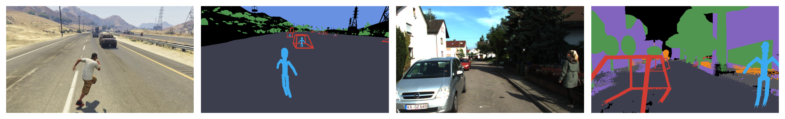
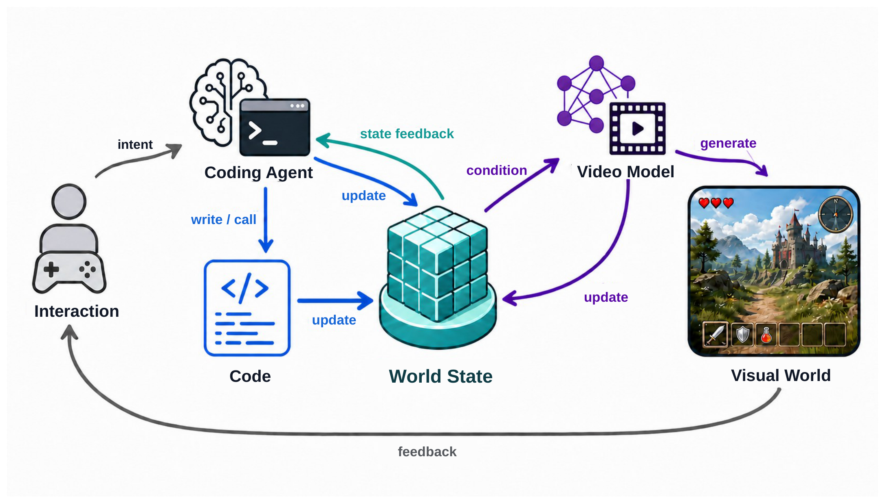
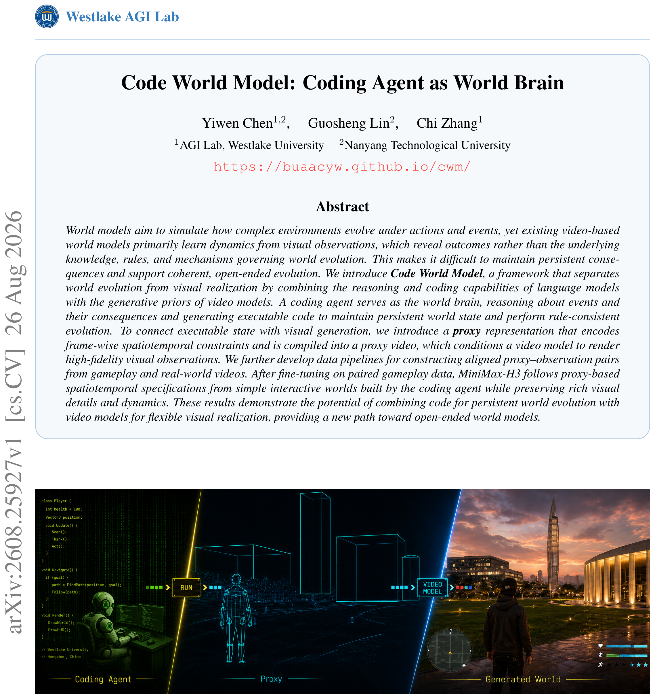
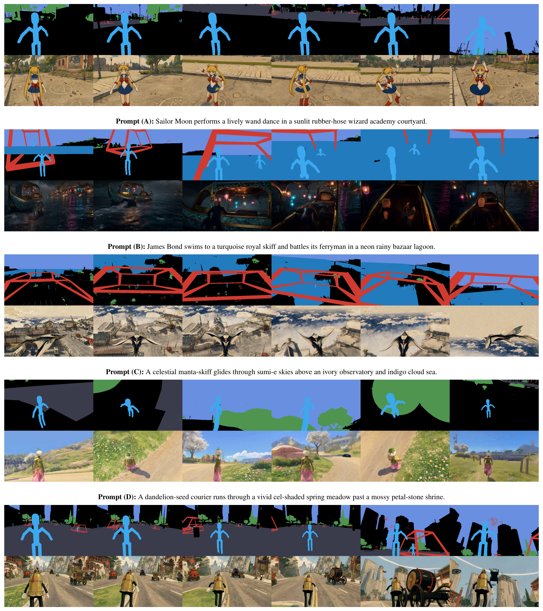

---
tags:
  - papers/video-world-models
  - papers/coding-agents
  - papers/embodied-ai
aliases:
  - Code World Model
  - Coding Agent as World Brain
date: 2026-08-27
arxiv_id: 2608.25927
---

# Code World Model: Coding Agent as World Brain

## 核心信息
- 标题: Code World Model: Coding Agent as World Brain
- 标题翻译: 代码世界模型：作为世界大脑的编码代理
- 作者: Yiwen Chen, Guosheng Lin, Chi Zhang
- 机构: Westlake AGI Lab / Westlake University；Nanyang Technological University
- 发表时间: 2026-08-26（arXiv v1）
- 发表渠道: arXiv，cs.CV
- arXiv: [2608.25927](https://arxiv.org/abs/2608.25927)
- 论文链接: https://buaacyw.github.io/cwm/
- 代码 / 项目: 项目页 https://buaacyw.github.io/cwm/；论文未在 PDF 中给出代码仓库
- 数据 / 资源: GTA V gameplay 配对数据；KITTI-360 几何辅助离线配对证明
- 论文类型: AI method / video world model framework

## 原文摘要翻译
世界模型旨在模拟复杂环境在动作和事件作用下如何演化。然而，现有基于视频的世界模型主要从视觉观察中学习动力学；视觉观察揭示的是结果，而不是支配世界演化的底层知识、规则和机制。这使得系统难以维持持久后果，也难以支持连贯的开放式演化。本文方法将世界演化与视觉实现分离，把语言模型的推理与编码能力和视频模型的生成先验结合起来。编码代理充当世界大脑，推理事件及其后果，并生成可执行代码来维护持久世界状态、执行符合规则的演化。为连接可执行状态与视觉生成，我们引入代理表示，用于编码逐帧时空约束，并将其编译为代理视频；该视频再作为条件输入视频模型，以生成高保真的视觉观察。我们进一步构建了从游戏过程和真实世界视频中制作对齐代理—观察对的数据管线。在配对游戏数据上微调后，MiniMax-H3 能够遵循由编码代理构建的简单交互世界所给出的、基于代理的时空规格，同时保留丰富的视觉细节和动力学。结果展示了将代码用于持久世界演化、将视频模型用于灵活视觉实现的潜力，为开放式世界模型提供了一条新路径。（证据：PDF 第 1 页，摘要）

## 创新点
1. **把世界模型拆成“演化层”和“实现层”。** coding agent 与可执行代码维护规则、实体关系、事件历史和状态更新；视频模型只负责把已演化的状态视觉化。其价值不在于又加入一个代理，而在于明确了“谁决定发生什么”和“谁决定看起来怎样”的职责边界（PDF pp.1–3, 5–7）。
2. **提出来自世界状态的 proxy 接口。** proxy 只保留当前观察必须服从的粗粒度位置、轨迹、姿态、空间关系、遮挡和相机运动，由确定性编译器生成代理视频；文字则补充身份、外观和动作语义。这比让视频模型从密集文字恢复逐帧几何更直接，也比要求 coding agent 生产完整高质量三维资产更轻量（PDF pp.3, 7–9）。
3. **把配对数据构造问题变成同步编译问题。** 游戏运行时同步记录 RGB 与构造 proxy 所需的相机、实体和场景变量；真实视频则用校准三维重建和物体标注离线编译。该设计不需要单独动作标签或显式相机轨迹标签，但真实数据仍依赖额外几何资源（PDF pp.9–11）。
4. **给出一个可运行的原型闭环。** 在约 5.6 小时 GTA V 游戏视频上微调 MiniMax-H3 Ref2VA，使用编码代理从已有游戏场景和逻辑模板组合出简单世界，再以记录的代理驱动视频生成。论文的实验贡献是定性证明代理约束能够被跟随，而不是已经完成开放世界模拟器（PDF pp.11–12）。

## 一句话总结
这篇论文最可信的贡献是一个可检查的状态到视觉条件接口：让 coding agent/code 负责“世界如何继续变化”，让 video model 负责“变化如何被高保真地看见”；当前证据支持原型可行性和定性时空控制，不足以证明持久因果世界或实时开放世界已经实现。

## 研究问题
### 从视觉结果反推规则为何不够
论文把现有视频世界模型的困难归结为观测与机制之间的缺口。视频记录的是动作之后可见的结果，规则、实体关系、知识、离屏状态和跨地点的后果没有直接被编码。游戏画面尤其如此：每一帧由固定游戏代码执行后渲染，但渲染后可观察到的只有稀疏视觉后果；许多状态变化发生在视野之外，或者跨越当前视频上下文（PDF pp.1–2，§1）。

论文用“玩家刺杀城市统治者后离开”的例子说明问题：继承、秩序、贸易、派系关系以及非玩家角色的目标和信念应在玩家不在场时继续变化，玩家很久以后返回时，系统不仅要生成城市当前外观，还要知道期间发生了什么、为什么发生、哪些后果仍然有效。我的分析是，这里提出的并非普通的下一帧预测问题，而是一个带有持久状态和规则修改的世界治理问题。

### 三种时间尺度与两类计算负担
论文将复杂世界运行拆成两类负担（PDF pp.5–7，§3.1）：

- **稀疏但语义复杂的推理**：解释新事件，连接常识、关系和社会结构，决定长期后果，并在必要时改变机制。
- **密集且重复的执行**：更新位置、属性、日程、碰撞、冷却时间和数值规则，并对大量实体连续运行。

coding agent 适合前者，但若每一次低级交互都调用语言模型，会造成成本和响应频率问题。代码适合后者，且能以规则一致、可复用、可测试的方式处理高频更新。视频模型则承担第三种频率：按观察需求生成视觉状态。论文的核心假设是，推理频率、代码更新频率和视频帧率不应被绑在一起。

### 研究问题的精确定义
可将论文的技术问题写成三个问题：

1. 如何让一个 agent 维护会影响未来的可执行世界状态，而不是只给下一次视频生成一个动作提示？
2. 如何把这份状态中与当前观察相关的时空约束以视频模型真正能跟随的方式传递过去？
3. 如何从游戏运行时和真实视频构造同帧、同身份、同视角的训练配对，使视频模型学会“遵循状态约束，同时保留生成先验”？

论文对第一个问题主要给出架构论证，对第二和第三个问题给出 proxy 设计和小规模定性原型。它没有在这版实验中量化长期离屏状态是否真的被保持。

## 数据与任务定义
### 输入、状态与输出
论文先给出传统世界模型的抽象形式。令 $S_t$ 为时刻 $t$ 的完整世界状态，$A_t$ 为玩家、环境或其他代理施加的动作，$O_t$ 为用户或下游代理接收到的视觉观察：

$$
S_{t+1} \sim p(S_{t+1}\mid S_t,A_t),\qquad O_{t+1}\sim p(O_{t+1}\mid S_{t+1}).
$$

Code World Model 将完整状态分成可执行状态和视觉状态：

$$
S_t=(S_t^{exe},S_t^{vis}).
$$

其中 $S_t^{exe}$ 包含不断演化的世界程序、实体属性、规则、关系、事件历史和其他可直接操作的变量；$S_t^{vis}$ 包含由视频模型产生、且需要跨时间保持一致的外观和运动信息（PDF pp.7–8，§3.1）。

联合 agent-code transition 与视频生成器的更新写成：

$$
S_{t+1}^{exe}=T_{AC}(S_t^{exe},A_t),
$$

$$
S_{t+1}^{vis}\sim G_\theta(S_t^{vis},S_{t+1}^{exe}).
$$

这里的 $T_{AC}$ 不是一个已经给出参数化网络的实验细节，而是编码代理调用、组合、修改机制并让代码执行高频更新的抽象记号。论文特别说明，第二个式子中的 $S_{t+1}^{exe}$ 只是抽象条件依赖，不代表把原始代码或完整可执行状态直接送进视频网络；实际传递由文字和代理选择、整理和编译（PDF p.8）。

### Proxy 作为最小充分时空条件
proxy 由当前世界状态中的相机、实体位置、姿态、轨迹和空间关系构成。确定性渲染过程将其变成 proxy video。它不试图表达纹理、材质、细致光照或最终外观，目标是以最低构造负担表达当前观察必须遵循的结构（PDF pp.7–9，§3.2）。

两个条件通道职责不同：

| 条件 | 传递内容 | 生成器中的角色 |
|---|---|---|
| structured text | 身份、外观、角色、动作语义、目标和 proxy 未表达的动态细节 | 保留语言的开放描述能力 |
| proxy video | 逐帧位置、粗尺度、姿态/轨迹、相机、遮挡、实体关系和交互相关状态 | 直接提供时空 grounding |

proxy 不是低质量目标视频，也不是最终三维世界。它是可构造、可检查、可寻址、可局部编辑的视觉提示。复杂或罕见物体可以退化为包围盒，只告诉模型该身份的粗位置和范围，再由文字补充类别与外观。论文认为，过高带宽会要求 coding agent 维护关节级轨迹，过低带宽又不足以约束时空关系，因此 proxy 设计本质上是构造成本与 grounding strength 的折中。

### 配对数据
**游戏数据。** 作者从同一次游戏过程执行中同步记录目标 RGB 视频和构造代理所需的运行时变量，包括相机状态、实体位置与朝向、近似尺度、场景布局及交互相关状态；不保留完整三维模型、纹理和材质。确定性程序沿目标视频的相机轨迹渲染代理，并从运行时得到逐像素实例图，把每个身份的文字描述绑定到对应代理区域（PDF pp.9–10）。同一段运行记录还可以重新编译成不同覆盖范围和信息粒度的代理。

**真实数据证明。** 作者在 KITTI-360 上做几何辅助概念验证。校准相机位姿、累积语义三维重建和三维物体标注只用于离线构造条件，不直接给视频模型。每个时间戳投影静态几何得到度量深度和由深度导出的表面法线，再使用行人胶囊骨架、车辆线框、植被低多边形 proxy 和建筑物粗三维范围，通过共享深度缓冲栅格化，保留相机运动、空间对齐和遮挡（PDF pp.10–11，Fig. 3）。

*图 3。游戏运行时配对与 KITTI-360 几何辅助配对的同帧 RGB–proxy 示例。*

**图 3。** 上排与下排分别展示同帧 RGB target 和 proxy；左侧是游戏运行时配对，右侧是用真实场景几何离线编译的配对。它支持“配对可以被构造”，但不支持“真实视频已经用于训练并改善下游任务”。

## 方法主线
### 机制流程
1. **输入：交互意图与当前世界。** 玩家、环境或其他代理产生交互意图；coding agent 读取持久化的可执行世界状态、程序、事件反馈和已有机制。
2. **操作：高层推理与代码执行。** coding agent 选择已有机制、调用或组合代码，必要时局部改写世界程序；代码随后高频、确定性地更新位置、属性、碰撞、规则和事件。
3. **输出到视觉条件：状态编译。** 从更新后的状态选出当前观察相关的信息，文字序列化语义内容，轻量确定性编译器把 proxy primitives 栅格化为代理视频。
4. **输出：视频观察与反馈。** video model 联合读取文字、代理视频和视觉历史，生成高保真 observation；观察与状态反馈回到 coding agent，支撑下一轮交互和机制修改。

*图 2。Code World Model 的交互意图、编码代理、代码、世界状态、视频模型与视觉世界之间的闭环。*

图 2 的箭头关系比图 1 更接近实现闭环：交互意图进入编码代理，代理通过写入/调用操作代码，代码更新世界状态，世界状态经条件进入视频模型，生成视觉世界，视觉世界和状态反馈再返回交互和代理。

图 1 是概念总览图，左侧为 coding agent/code，中间为粗粒度 proxy，右侧为生成视觉世界。论文明确注明该图为人工智能生成的说明性插图，因此它适合作为概念导航，不应当当作实验系统的真实截图或完整实现证据。

*图 1。Code World Model 的概念总览；论文注明该插图由人工智能生成，仅作说明。*

### Agent、代码与视频模型的边界
coding agent 不是逐步物理引擎。论文设想它在事件发生、目标改变、异常出现或新机制需要加入时介入；在其他时刻，代码根据既有规则持续更新大量实体。代码既不是开发者一次性冻结的游戏逻辑，也不是与 agent 无关的控制器，而是 coding agent 持续维护的可执行扩展。

视频模型也不是世界规则的唯一载体。它可利用外观、运动、物理交互等大规模视频先验生成细节，但“是否命中”“某个后果是否持续”“离屏期间发生了什么”应由可执行状态和代码决定。我的判断是，这个职责分解在软件工程上合理，却把系统正确性问题转移到状态 schema、代码修改安全性、反馈接口和状态到 proxy 的覆盖范围上。

### 从 text 到 proxy
论文先承认结构化文字是最自然的方案：它不引入新模态，能表达新物体和新属性。但作者在近期视频世界模型上的实验观察是，即便带有专门的相机条件路径，文字仍难以精确控制相机轨迹和实体运动。理论上可以用无限长文字描述每一帧的每个像素，但这会带来令牌低效、延迟和跟随可靠性问题（PDF pp.7–8）。

proxy 的设计原则是让控制信号全部可追溯到 coding agent 与代码共同维护的状态，不额外调用不可检查的学习式三维生成器。这样，agent 能看到并修改状态到条件的路径。代理视频使用与目标相同的时空组织，把位置和轨迹放在视频模型更容易对齐的视觉模态中；文字继续负责身份、材质、动作语义和未指定的细节。

### 带宽、粒度与成本
作者使用目标分辨率四分之一的 proxy：目标为 $1344\times768$，proxy 为 $336\times192$，每个空间方向缩小四倍，因此像素数和视觉令牌约为目标的 $1/16$。论文据此认为额外条件负担很小（PDF pp.8–9, 11）。

但这个数字只说明空间令牌比例，不是端到端延迟结果。代理仍要求运行时维护基元、编译视频，并让视频模型在每次观察时做生成推理。论文提出未来让编码代理自主选择启用/停用代理、选择交互关键实体、调整空间粒度、分辨率和帧率；当前实验只实例化一个固定代理设计。

## 关键结果
### 训练协议与原型实现
论文在 157 个 GTA V 游戏片段上构造约 5.6 小时源视频，按两秒间隔采样 9,420 个五秒片段。每个目标为 124 帧、$1344\times768$、每秒 24 帧；代理同样为 124 帧、$336\times192$，包含对数深度与类别语义身份图。多模态编码器读取系统指令、片段文字和 11 个代理帧，采样偏移为 $0,12,24,\ldots,120$（PDF 第 11 页，§4.1）。

| 项目 | 论文设定 |
|---|---|
| 基础模型 | official MiniMax-H3 Ref2VA |
| 参数更新 | rank-128 LoRA，覆盖全部 50 个 transformer blocks |
| 可训练参数 | 约 596M |
| 硬件与优化 | 8 张 NVIDIA H800，AdamW，批量大小 8，BF16，FlashAttention-3，梯度检查点 |
| 正则与裁剪 | weight decay 0.01，gradient-norm clipping 1.0；关闭 audio loss |
| 训练 | 3 个周期，3,534 次优化更新；预热 100 步；学习率 $2\times10^{-5}\to1\times10^{-6}$ 余弦衰减 |
| 视频采样 | 第 3,534 步 checkpoint，explicit Euler 20 steps |

coding-agent 推理阶段使用 GPT-5.6 Sol，并提供已有游戏引擎代码、基础玩家控制、碰撞处理、运行时更新循环和同一套代理基元。作者明确承认编码代理难以从零构建 AAA 级场景和复杂交互，因此实际方式是把已有 GTA V 场景和游戏逻辑作为模板进行组合、扩展和重写。

每个定性样例首先由 GPT Image 2 根据首帧代理与文字生成 $1536\times864$ 外观锚点，再缩放至 $1344\times768$，同时送入多模态编码器和 Ref2VA 外观参考分支。后续每次生成 124 帧；长视频使用 34 帧重叠，每个后续窗口前进 90 帧，保留首窗口全部帧、丢弃后续窗口重叠帧再拼接（PDF 第 11–12 页）。

### 主结果与强基线
论文未呈现数值控制误差、视频质量指标、成功率或统计显著性。主证据是图 4 和项目页的定性对比视频。作者报告，即使只用少量配对数据做 LoRA 适配，生成视频仍能较好跟随 proxy 指定的实体位置与运动、场景布局和相机轨迹，同时保持视觉细节和动力学。

*图 4。五组文字提示下的 proxy 序列与生成 RGB 观察定性结果。*

图 4 包含五组由编码代理撰写的文字提示，覆盖人物舞动、渡船搏斗、飞行、奔跑和奔向载具等角色与场景变化。每组上排是逐帧代理，下排是生成 RGB，文字提示位于两者之间。视觉上，代理行提供了人物数量、粗位置、轨迹与相机变化，RGB 行则完成了角色外观、材质、环境和风格的实现。

作者将该接口与 action-或-camera-conditioned 方法作定性比较，声称逐帧指定实体运动和视角变化的粒度接近现代三维游戏，比只表达粗意图或低维信号的接口更直接。这个比较的证据来自项目页视频而非 PDF 中的统一实验表，而且作者明确为了隔离控制质量而不考虑推理延迟。

### 消融到底说明了什么
这篇论文没有传统意义上的组件消融表。能支持的“消融式”结论只有以下几类对照：

- **文字条件的动机性失败。** 作者说文字即使配合专门的相机条件路径，也不能可靠控制精确轨迹和实体运动；对照数值未列出。
- **proxy bandwidth 的设计空间。** 论文讨论过低/过高带宽的风险，但没有逐粒度实验。
- **游戏配对与真实配对。** Fig. 3 对照的是构造来源，不是两个训练模型的性能对照；KITTI-360 仅展示离线编译可行性。
- **模板依赖。** coding agent 能组合已有场景和逻辑，但正文未呈现“从模板改写”和“从零构建”的受控实验比较。

因此，不能把图 4 的视觉改善全部归因于代理本身。结果同时依赖 MiniMax-H3 的视频先验、5.6 小时 GTA V 配对微调、编码代理撰写的提示、GPT Image 2 首帧锚点、已有游戏引擎模板和视频生成采样设置。

## 深度分析
### 真正贡献是什么
**论文陈述。** 本文方法让编码代理通过可执行代码维护世界状态，代理把状态连接到视频生成，视频模型实现高保真视觉观察（PDF 第 3–4、12 页）。

**我的分析。** 真正新颖且当前证据最接近的部分，是把“程序化世界状态”与“生成式视觉后端”之间的接口明确成白盒、可编译、可局部编辑的 proxy。它不是单纯把语言模型接在视频模型前面，也不是把三维重建当作最终世界，而是承认三种表示各有职责：程序表示规则和持久后果，proxy 表示当前必须满足的时空骨架，生成模型补足外观与细粒度动态。

coding agent 作为“世界大脑”的更强说法仍然是框架愿景。当前实现让它借助已有场景和基础运行循环构建简单交互世界，并没有证明它能长期维护大规模实体关系、可靠测试代码修改，或处理开放世界中的新机制。

### 为什么 proxy 可能有效
1. **表示对齐。** 目标本身是视频，proxy 也保持帧序列结构，实体运动和相机轨迹不需要先被压成长文本再由模型解码。
2. **最小充分状态。** proxy 不承担材质、照明和身份外观，减少了 coding agent 需要构造的内容，给视频模型留下生成空间。
3. **身份绑定。** 游戏运行时提供逐像素实例图，使 text 中的身份描述能与跨帧 proxy 区域对应，而不是只依赖模型自己猜“哪个人是谁”。
4. **确定性编译。** 同一 executable state 可以重复编译不同 proxy，便于局部改变覆盖通道和粒度，也比学习式三维生成器更容易检查来源。
5. **先验分工。** MiniMax-H3 用视频数据学习外观、运动和交互先验，代码只需规定当前世界的结构性约束。Fig. 4 的跨角色、风格和场景变化说明这种分工在小规模原型上具有可见效果。

### 容易误读的地方
- **不是完整世界模型的定量验证。** 论文没有长时程事件链、离屏状态回放、跨地点回访或规则一致率实验。
- **不是把代码直接输入视频模型。** 公式中的 executable state 是抽象依赖，实际输入是选择后的 text 和 proxy。
- **不是最终三维表示。** proxy 的目的只是条件控制，不能支持任意视角导航、碰撞查询或可执行几何交互。
- **不是实时系统。** 每个新视觉观察仍需生成推理，论文还没有实现自回归实时生成，并且定性比较忽略延迟。
- **不是无条件泛化。** 五组样例的 text prompt 是 coding agent 写的，首帧由 GPT Image 2 提供，训练和推理都建立在视频模型强先验与游戏模板上。
- **真实数据结果被高估的风险。** KITTI-360 证明的是离线 proxy 可以从三维重建和标注中编译，不是模型已经在真实视频配对上训练或在真实环境部署。

### 复现注意点
1. **依赖与模型。** 需要 MiniMax-H3 Ref2VA 官方检查点、低秩适配和混合精度训练栈，以及能承载 124 帧、$1344\times768$ 视频的 H800 级算力。论文没有在 PDF 中给出完整环境锁定文件。
2. **数据不可直接复现。** 157 个 takes、约 5.6 小时和 9,420 clips 的采样数字已公开，但 GTA V 运行时抽取的字段、proxy primitive 代码、身份映射、过滤规则和数据发布状态不够具体。
3. **提示词影响。** 编码代理写的结构化文字和图像提示会影响实体数、位置、布局和风格；若复现时改用人工短提示，不能直接对比图 4。
4. **外观锚点影响。** GPT Image 2 首帧同时进入多模态编码器和 Ref2VA appearance-reference branch；去掉该锚点可能改变身份稳定性和首帧质量，应作为明确对照。
5. **长视频拼接。** 需要严格实现 124 帧窗口、34 帧 overlap、90 帧推进、前窗末 34 帧作为后窗 continuation context，以及每个窗口重复使用外观锚点。否则观察到的漂移不能归咎于 proxy。
6. **状态到条件的覆盖。** 复现者应记录每个 primitive 的参数 schema、坐标系、相机投影、深度排序、实例 ID 语义和 bounding-box fallback；这些是白盒主张能否成立的关键。
7. **评价协议。** 不能只生成截图。至少应记录实体位置误差、轨迹误差、相机轨迹误差、实体数量保持、跨窗口身份一致性、离屏事件保持、推理延迟和 coding-agent 代码修改成功率。

### 复杂度与扩展性
代理的额外视觉令牌约为目标的 $1/16$，但总体成本仍由高分辨率视频扩散推理和长视频多窗口生成主导。代码执行虽便宜，但编码代理修改程序后的测试、回滚和安全检查会增加系统复杂度。系统还需要一个把大量世界状态压缩成当前观察条件的选择器；状态越完整，传递和维护越昂贵，状态越稀疏，视频模型越可能补出违反规则的细节。

从工程角度看，最值得验证的不是“视频是否漂亮”，而是状态、代理和 RGB 三者的闭环一致性：如果代码说人物已经离场，代理不应继续画出该人物；如果事件历史改变派系关系，下一次回访的文字与代理必须能复现这一改变；如果视频模型生成了不符合约束的观察，系统需要把可定位的偏差反馈给编码代理，而不是只把 RGB 当作新的真状态。

## 局限
### 作者明示的局限
作者在第 5 节明确指出两类局限（PDF p.12）：

- 可用算力有限，训练规模小、生成质量仍受限；尚未实现自回归实时生成。
- 当前 coding agent 仍难以可靠地从零实现高度复杂的游戏机制，因此原型没有展示自主构建完整开放世界游戏或模拟器。

### 从证据链推出的边界
1. **持久后果尚未被实验证明。** 论文用刺杀统治者的例子阐释需求，但实验只展示简单 coding-agent-built world 的单段 proxy 驱动视频。
2. **定性证据缺少数值校准。** 现稿缺少逐帧控制误差、视频质量指标、失败样本、统计置信区间或统一基线表，因而“closely follows”和“strong generalization”只能按作者定性观察理解。
3. **真实世界管线尚未闭环。** KITTI-360 的深度、表面法线、三维重建和物体标注是离线辅助输入；正文没有把该数据用于微调或真实任务评测。
4. **代理的可编程性受 primitive 库约束。** 简单人、树、车辆、灌木和建筑可以用 primitive 表示；复杂对象退化为 box 后，细粒度姿态和接触关系主要交给视频先验。
5. **视频生成成本与一致性风险并存。** 生成后端提供高视觉上限，却引入延迟、窗口拼接、外观锚点依赖和概率性违约；端到端运行时数字在当前稿中缺席。
6. **复现与归因不充分。** 训练数据、已有游戏模板、coding-agent prompt、GPT Image 2 和 MiniMax-H3 的贡献没有被严格解耦，无法把结果增益归于某一个组件。

## 我的笔记
- 这篇工作值得放在“程序化世界状态—生成式视觉实现”交叉线上，而不是简单归入 coding agent 或视频生成。它与 WorldCoder 一类工作共享“用代码外化世界规则”的思想，但把代码世界进一步接到高保真视频后端；与显式三维世界工作相比，它把三维/二维几何降格为条件接口而非最终产物。
- 对我自己的研究，最可复用的原则是“最小充分状态”：不要让条件表示承担生成模型擅长的外观细节，也不要让生成模型承担必须可审计的规则。需要定义哪些状态是硬约束、哪些只是软提示，并设计自动检查器。
- 下一步若要把框架变成可验证研究，首要实验应是受控三路对比：text-only、proxy-only、text+proxy；同时固定视频 backbone、数据、prompt 和采样，把实体轨迹、相机轨迹和身份一致性量化。
- 第二个关键实验是把“持久后果”从叙述变成任务：先在 coding agent 构建的简化世界中注入离屏事件，再经过若干未观察步，比较回访时 executable state、proxy 和生成 RGB 是否一致。
- 第三个关键实验是做贡献解耦：固定视频模型和配对数据，比较静态代码规则、可修改代码、agent 修改代码；固定 agent 和视频模型，再比较有无实例 ID、不同 proxy 带宽和不同首帧锚点。
- 论文的“白盒”主张很有价值，但白盒只覆盖 state-to-proxy 编译；proxy-to-RGB 仍是黑盒生成。未来应报告约束违约类型，并允许 agent 对生成结果进行验证、重编译或拒绝。

## 引用
1. Chen, Yiwen, Guosheng Lin, and Chi Zhang. “Code World Model: Coding Agent as World Brain.” arXiv:2608.25927v1, 2026. [PDF](https://arxiv.org/pdf/2608.25927v1)；本笔记所有页码和章节证据均来自用户提供的本地 PDF。
2. Ha, David, and Jürgen Schmidhuber. “World Models.” arXiv:1803.10122, 2018。论文将其作为世界模型形式化背景（PDF p.7 参考文献 [1]）。
3. Bruce, Jake, et al. “Genie: Generative Interactive Environments.” ICML 2024。论文将其作为可交互视频世界模型路线代表（PDF pp.2, 4，参考文献 [6]）。
4. Tang, Hao, Darren Key, and Kevin Ellis. “WorldCoder, a Model-Based LLM Agent: Building World Models by Writing Code and Interacting with the Environment.” NeurIPS 2024。论文将其作为代码化世界模型相关工作（PDF pp.5–6，参考文献 [67]）。
5. MiniMax-AI. “MiniMax H3.” Official GitHub repository, 2026。论文使用其 Ref2VA backbone（PDF p.11，参考文献 [77]）。
6. Liao, Yiyi, Jun Xie, and Andreas Geiger. “KITTI-360: A Novel Dataset and Benchmarks for Urban Scene Understanding in 2D and 3D.” IEEE TPAMI, 2022。论文用于真实视频 proxy 构造 proof of concept（PDF p.11，参考文献 [93]）。
