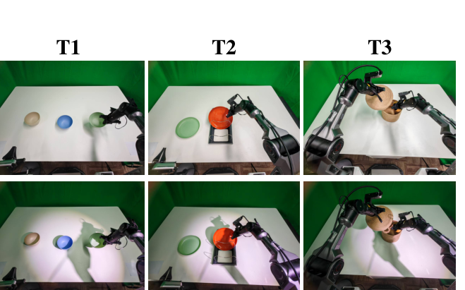
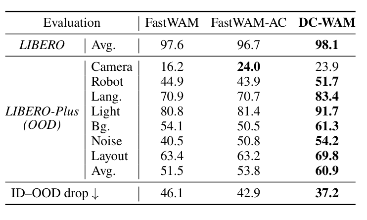
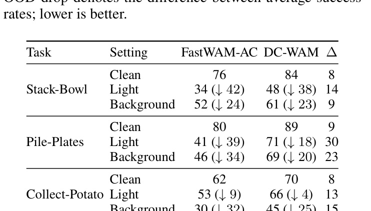
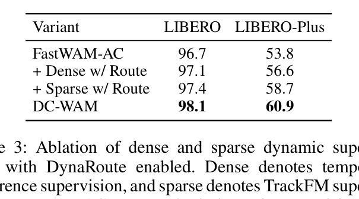
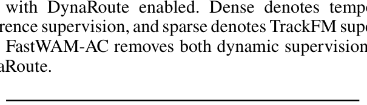

# DC-WAM: Dynamic-Centric Visual Supervision and Reasoning for World-Action Models

**Authors:** Haoyuan Ji, Lingxiang Fan, Shang Su, Yinqiao Lu, Mengkai Shi, Jun Gao, Shuo Feng
**Affiliations:** Tsinghua University; Dense-AI; University of Michigan
**Source:** `/Users/roywangj/journey_wj/research/papers4zotero/zotero1/storage/XMWAPFTH/Ji 等 - 2026 - DC-WAM Dynamic-Centric Visual Supervision and Reasoning for World-Action Models.pdf`
**Detected source format:** selectable-text PDF (`pdf-text`)
**Reader type:** complete paragraph-level Chinese–English reader
**Source scope:** 9 pages (main text pp. 1–7; references pp. 8–9); no appendix or supplementary pages are present in the supplied PDF.

## Page / Section Index

| Source pages | Content |
|---|---|
| 1 | Title, Abstract, Figure 1, Introduction |
| 2 | Introduction, Related Work, Method overview and architecture, Eq. (1) |
| 3 | Figure 2, tracker-derived dynamic map, Eqs. (2)–(5) |
| 4 | Figure 3, dynamic map continuation, DynaRoute, Eqs. (6)–(12) |
| 5 | DynaRoute and action-only inference, training objective, Eqs. (13)–(23), Figure 4 |
| 6 | Eqs. (24)–(26), Experiments, Figure 5 |
| 7 | Tables 1–4, ablations, Analysis, Conclusion |
| 8–9 | References (30 entries) |

## Terminology Ledger

| Canonical term | Chinese rendering | Decision / definition |
|---|---|---|
| World-Action Model (WAM) | 世界-动作模型 | 首次展开，后续保留 WAM |
| dynamic-centric | 以动态为中心 | 指向交互诱发动态而非外观重建 |
| temporal-difference supervision | 时序差分监督 | 稠密动态监督，对应 $\mathcal{L}_{\mathrm{TD}}^V$ |
| tracker-guided flow matching (TrackFM) | 跟踪器引导的流匹配 | 稀疏动态监督，对应 $\mathcal{L}_{\mathrm{TrackFM}}^V$ |
| tracker-derived dynamic map | 跟踪器生成的动态图 | 离线训练目标 $m^*$ / $\widetilde{m}^*$ |
| DynaRoute | DynaRoute | 逐 token 预测动态相关性并生成键侧注意力偏置 |
| action-only inference | 纯动作推理 | 部署时停用视频分支 |
| routed visual cache | 经路由的视觉缓存 | 动作分支复用的 key-value 缓存 $C_V$ |
| in-distribution / out-of-distribution | 分布内（ID）/ 分布外（OOD） | 保留 ID/OOD 缩写 |
| PSNR | PSNR | 保留标准指标名；本文强调其与策略成功率不单调一致 |

> <strong>Para. 1:</strong> **Haoyuan Ji1,2,\*, Lingxiang Fan1,2,\*, Shang Su1,2, Yinqiao Lu1, Mengkai Shi2, Jun Gao3,†, Shuo Feng1,†**

> <strong>Para. 1[CN]:</strong> **Haoyuan Ji1,2,\*、Lingxiang Fan1,2,\*、Shang Su1,2、Yinqiao Lu1、Mengkai Shi2、Jun Gao3,†、Shuo Feng1,†**

> <strong>Para. 2:</strong> 1Tsinghua University  
> 2Dense-AI  
> 3University of Michigan

> <strong>Para. 2[CN]:</strong> 1清华大学  
> 2Dense-AI  
> 3密歇根大学

> <strong>Para. 3:</strong> \*These authors contributed equally.  
> †Corresponding author.

> <strong>Para. 3[CN]:</strong> \*这些作者贡献相同。  
> †通讯作者。

## Abstract

> <strong>Para. 1:</strong> World-Action Models (WAMs) augment robot policies with future visual prediction, but it remains unclear what the visual modality should learn for control. While photorealistic future prediction provides dense supervision, it also incurs substantial computation and can allocate capacity to texture, illumination, and background variations that are only weakly related to action selection. Recent efficient WAM variants suggest that the main benefit of the video branch may not lie in the rendered future itself, but in the control-relevant visual representations induced during training. In this work, we revisit future video prediction from a dynamic-centric perspective and ask whether an existing RGB-based WAM can be redirected from appearance-dominated reconstruction toward interaction-induced visual dynamics without introducing additional modality-specific predictions or online inputs at deployment. We propose DC-WAM, a dynamic-centric WAM framework that redistributes supervision and computation in the RGB video branch. At the supervision level, DC-WAM combines temporal-difference flow matching with trajectory-guided weighting, emphasizing dense temporal changes and localized regions where the gripper, manipulated objects, and contact areas move. At the reasoning level, DynaRoute predicts token-wise dynamic relevance and converts it into an attention bias, guiding the model toward control-relevant future tokens. Experiments in simulation and on real-world manipulation tasks show that DC-WAM consistently improves policy performance, especially under out-of-distribution perturbations in lighting, object appearance, and background texture.

> <strong>Para. 1[CN]:</strong> 世界-动作模型（World-Action Models，WAMs）通过未来视觉预测来增强机器人策略，但视觉模态究竟应当学习什么才能服务于控制，仍不明确。尽管照片级真实的未来预测能够提供稠密监督，但它也会带来大量计算开销，并可能将模型容量分配给与动作选择仅弱相关的纹理、光照和背景变化。近期的高效 WAM 变体表明，视频分支的主要收益或许并不在于渲染出的未来本身，而在于训练期间所诱导出的、与控制相关的视觉表征。在本工作中，我们从以动态为中心的视角重新审视未来视频预测，并探究：在部署时不引入额外的特定模态预测或在线输入的情况下，能否将现有的基于 RGB 的 WAM 从外观主导的重建重新导向由交互引发的视觉动态。我们提出 DC-WAM，这是一种以动态为中心的 WAM 框架，用于重新分配 RGB 视频分支中的监督与计算。在监督层面，DC-WAM 将时序差分流匹配与轨迹引导的加权相结合，重点关注稠密的时序变化，以及夹爪、被操纵物体和接触区域发生运动的局部区域。在推理层面，DynaRoute 预测逐 token 的动态相关性，并将其转换为注意力偏置，引导模型关注与控制相关的未来 token。仿真和真实世界操纵任务上的实验表明，DC-WAM 能够持续提升策略性能，尤其是在光照、物体外观和背景纹理发生分布外扰动时。

### Figure 1. Dynamic-centric supervision and routing

**Caption:** Effect of dynamic-centric supervision and routing. Our method achieves a relatively low PSNR, but improves policy success on LIBERO-Plus evaluation, suggesting that appearance-level reconstruction fidelity is not aligned with control-relevant future prediction.

**Caption[CN]:** 以动态为中心的监督与路由的效果。我们的方法取得了相对较低的 PSNR，却提升了 LIBERO-Plus 评估中的策略成功率，这表明外观层面的重建保真度与控制相关的未来预测并不一致。

## Introduction

> <strong>Para. 1:</strong> Vision-Language-Action (VLA) models map visual observations and language instructions directly to robot actions, leveraging the semantic priors of large vision-language backbones (Kim et al. 2024; Black et al. 2024). World-Action Models (WAMs) further couple action generation with future visual prediction, using anticipated scene evolution as an additional learning signal for robot control (Zhu et al. 2025; Li et al. 2025; Ye et al. 2026b; Li et al. 2026b; Kim et al. 2026). By jointly modeling what the robot should do and how the scene may change, WAMs provide dense temporal supervision beyond action imitation alone.

> <strong>Para. 1[CN]:</strong> 视觉-语言-动作（Vision-Language-Action，VLA）模型利用大型视觉-语言骨干网络的语义先验，将视觉观测和语言指令直接映射为机器人动作（Kim et al. 2024; Black et al. 2024）。世界-动作模型（WAMs）进一步将动作生成与未来视觉预测相耦合，把预期的场景演化用作机器人控制的额外学习信号（Zhu et al. 2025; Li et al. 2025; Ye et al. 2026b; Li et al. 2026b; Kim et al. 2026）。通过联合建模机器人应当做什么以及场景可能如何变化，WAMs 提供了超越单纯动作模仿的稠密时序监督。

> <strong>Para. 2:</strong> However, uniform RGB future prediction entangles manipulation dynamics with appearance factors such as texture, illumination, background, and sensor noise. Although these factors dominate reconstruction errors, they often change across environments without altering the underlying manipulation dynamics, making appearance-centric supervision potentially brittle under visual distribution shifts. Consequently, an RGB video branch may allocate substantial capacity to appearance reconstruction rather than the gripper motion, object displacement, and contact events that are more directly useful for action learning.

> <strong>Para. 2[CN]:</strong> 然而，均匀的 RGB 未来预测将操纵动态与纹理、光照、背景和传感器噪声等外观因素纠缠在一起。尽管这些因素主导着重建误差，但它们往往会随环境变化，却不改变底层的操纵动态，这使得以外观为中心的监督在视觉分布偏移下可能较为脆弱。因此，RGB 视频分支可能会将大量容量用于外观重建，而非夹爪运动、物体位移和接触事件；后者对动作学习更为直接有用。

> <strong>Para. 3:</strong> Recent efficient WAMs show that strong action policies do not necessarily require complete future videos to be iteratively generated during execution (Yuan et al. 2026; Li et al. 2026a; Zhang et al. 2026c). Meanwhile, other methods reduce the ambiguity of RGB prediction by introducing structured future representations, such as semantic masks, point trajectories, optical flow, or geometric states (Yu et al. 2026; Guan et al. 2026; Ranasinghe et al. 2026; Liu et al. 2026; Zhang et al. 2026a). Although these representations provide more structured supervision, they typically modify or expand the predicted future-state modality. We instead ask whether the existing RGB-based WAM can be redirected toward dynamic-centric representations that remain stable across appearance shifts, without additional modality-specific prediction.

> <strong>Para. 3[CN]:</strong> 近期的高效 WAM 表明，强大的动作策略并不一定需要在执行期间迭代生成完整的未来视频（Yuan et al. 2026; Li et al. 2026a; Zhang et al. 2026c）。与此同时，其他方法通过引入结构化的未来表征来降低 RGB 预测的歧义，例如语义掩码、点轨迹、光流或几何状态（Yu et al. 2026; Guan et al. 2026; Ranasinghe et al. 2026; Liu et al. 2026; Zhang et al. 2026a）。尽管这些表征提供了更具结构的监督，但它们通常会修改或扩展所预测的未来状态模态。与之不同，我们探究能否在不增加特定模态预测的情况下，将现有的基于 RGB 的 WAM 重新导向以动态为中心、且在外观变化下保持稳定的表征。

> <strong>Para. 4:</strong> We propose **DC-WAM**, a dynamic-centric World-Action Model that redistributes the supervision and reasoning toward interaction-induced dynamics. At the supervision level, DC-WAM replaces uniform latent reconstruction with two complementary training signals. First, temporal-difference supervision emphasizes changes between adjacent visual flow fields, reducing the influence of temporally persistent appearance components. Second, tracker-guided flow matching reweights the visual objective toward localized regions with strong gripper, object, and contact motion. The tracker-derived targets are constructed offline from training videos and are not required during policy execution. At the reasoning level, we introduce **DynaRoute**, a lightweight module that predicts token-wise dynamic relevance and converts it into an attention bias. This routes visual attention toward future tokens associated with interaction-induced motion.

> <strong>Para. 4[CN]:</strong> 我们提出 **DC-WAM**，这是一种以动态为中心的世界-动作模型，可将监督与推理重新分配至由交互引发的动态。在监督层面，DC-WAM 用两个互补的训练信号取代均匀的潜变量重建。首先，时序差分监督强调相邻视觉流场之间的变化，从而降低时间上持续存在的外观成分的影响。其次，跟踪器引导的流匹配对视觉目标进行重新加权，使其偏向夹爪、物体和接触运动较强的局部区域。由跟踪器生成的目标从训练视频中离线构建，在策略执行期间并不需要。在推理层面，我们引入 **DynaRoute**，这是一个轻量级模块，用于预测逐 token 的动态相关性，并将其转换为注意力偏置。由此，视觉注意力被路由至与交互引发的运动相关联的未来 token。

> <strong>Para. 5:</strong> We retain an action-conditioned visual branch, allowing video supervision to regularize action representations through an explicit action-to-visual pathway (Ye et al. 2026a). The RGB branch is used during training but can be removed at deployment following Fast-WAM-style inference, preserving efficient action generation.

> <strong>Para. 5[CN]:</strong> 我们保留了一个以动作为条件的视觉分支，使视频监督能够通过一条显式的动作到视觉路径来正则化动作表征（Ye et al. 2026a）。RGB 分支在训练期间使用，但在部署时可遵循 Fast-WAM 风格的推理方式将其移除，从而保持高效的动作生成。

> <strong>Para. 6:</strong> Experiments show that DC-WAM substantially improves robustness under distribution shift. As summarized in Fig. 1, the proposed method progressively improves LIBERO-Plus success, demonstrating that DC-WAM improves OOD generalization while maintaining strong clean-condition performance.

> <strong>Para. 6[CN]:</strong> 实验表明，DC-WAM 显著提升了分布偏移下的鲁棒性。如图 1 所总结，所提出的方法逐步提高了 LIBERO-Plus 的成功率，证明 DC-WAM 在保持强劲的干净条件性能的同时，改善了分布外（OOD）泛化能力。

> <strong>Para. 7:</strong> In summary, our contributions are threefold:

> <strong>Para. 7[CN]:</strong> 总而言之，我们的贡献有以下三点：

> <strong>Para. 8:</strong> • We propose DC-WAM, which redirects the existing RGB video branch from appearance-dominated reconstruction toward interaction-induced visual dynamics, without introducing additional modality-specific prediction branches or deployment-time inputs.

> <strong>Para. 8[CN]:</strong> • 我们提出 DC-WAM，将现有的 RGB 视频分支从外观主导的重建重新导向由交互引发的视觉动态，且不引入额外的特定模态预测分支或部署时输入。

> <strong>Para. 9:</strong> • We introduce complementary dynamic-centric supervision and reasoning mechanisms: temporal-difference supervision suppresses persistent appearance components, tracker-guided flow matching emphasizes localized manipulation dynamics, and DynaRoute routes visual attention toward dynamically relevant tokens.

> <strong>Para. 9[CN]:</strong> • 我们引入了互补的、以动态为中心的监督与推理机制：时序差分监督抑制持续存在的外观成分，跟踪器引导的流匹配强调局部操纵动态，而 DynaRoute 则将视觉注意力路由至与动态相关的 token。

> <strong>Para. 10:</strong> • Trained only on clean demonstrations, DC-WAM maintains strong in-distribution performance while substantially improving OOD success and reducing ID–OOD degradation on LIBERO-Plus and real-world manipulation under unseen visual perturbations.

> <strong>Para. 10[CN]:</strong> • DC-WAM 仅使用干净的演示进行训练，在保持强劲分布内性能的同时，显著提升了 LIBERO-Plus 和真实世界操纵任务在未见视觉扰动下的 OOD 成功率，并减小了 ID–OOD 性能下降。

## Related Work

### World-Action Models and Efficient Visual Foresight

> <strong>Para. 1:</strong> Recent WAMs couple video prediction with action generation through modality-specific diffusion, shared visual-action representations, or interleaved generation, achieving strong manipulation performance (Zhu et al. 2025; Li et al. 2025; Ye et al. 2026b; Li et al. 2026b; Ye et al. 2026a). However, generating complete RGB futures introduces substantial inference cost. Recent methods reduce this dependence by removing the video branch at deployment, predicting coarse visual futures with compact experts, or using intermediate features from image-editing backbones (Hu et al. 2024; Yuan et al. 2026; Li et al. 2026a; Zhang et al. 2026c). These results suggest that the value of visual foresight may lie more in the predictive representations learned during training than in the rendered future itself.

> <strong>Para. 1[CN]:</strong> 近期的 WAM 通过特定模态扩散、共享视觉-动作表征或交错生成，将视频预测与动作生成相耦合，并取得了强劲的操纵性能（Zhu et al. 2025; Li et al. 2025; Ye et al. 2026b; Li et al. 2026b; Ye et al. 2026a）。然而，生成完整的 RGB 未来会带来大量推理开销。近期方法通过在部署时移除视频分支、使用紧凑专家预测粗粒度视觉未来，或使用图像编辑骨干网络的中间特征来降低这种依赖（Hu et al. 2024; Yuan et al. 2026; Li et al. 2026a; Zhang et al. 2026c）。这些结果表明，视觉前瞻的价值或许更多地存在于训练期间学得的预测性表征中，而非渲染出的未来本身。

### Structured Visual Representations for Control

> <strong>Para. 1:</strong> Prior VLA methods reduce the spatial ambiguity of current visual observations using trajectory sketches, state-action traces, or image-space target prompts (Gu et al. 2023; Zheng et al. 2024; Dai et al. 2025). World-model policies further introduce structured visual representations into future prediction by replacing or augmenting RGB futures with semantic masks, point trajectories, optical flow, object states, or geometric representations (Lou et al. 2026; Yu et al. 2026; Guan et al. 2026; Ranasinghe et al. 2026; Liu et al. 2026; Zhang et al. 2026a). These representations make future prediction more structured and action-relevant, but typically modify the predicted future representation or introduce additional modality-specific tokens. DC-WAM instead retains the RGB-based visual branch and uses dynamic cues only to reweight visual supervision and attention routing. Our use of trajectory-derived supervision is related to a physically grounded video generation method PhysisForcing (Zhang et al. 2026b), but DC-WAM applies these cues inside a visual-action WAM through temporally resolved token-level relevance maps coupled with action generation.

> <strong>Para. 1[CN]:</strong> 以往的 VLA 方法使用轨迹草图、状态-动作轨迹或图像空间目标提示来降低当前视觉观测的空间歧义（Gu et al. 2023; Zheng et al. 2024; Dai et al. 2025）。世界模型策略进一步将结构化视觉表征引入未来预测：用语义掩码、点轨迹、光流、物体状态或几何表征来替换或增强 RGB 未来（Lou et al. 2026; Yu et al. 2026; Guan et al. 2026; Ranasinghe et al. 2026; Liu et al. 2026; Zhang et al. 2026a）。这些表征使未来预测更具结构、与动作更加相关，但通常会修改所预测的未来表征，或引入额外的特定模态 token。与之不同，DC-WAM 保留基于 RGB 的视觉分支，仅使用动态线索来重新加权视觉监督和注意力路由。我们使用轨迹衍生监督的方式与具备物理基础的视频生成方法 PhysisForcing（Zhang et al. 2026b）相关，但 DC-WAM 通过与动作生成相耦合、在时间上解析的 token 级相关性图，将这些线索应用于视觉-动作 WAM 内部。

### Attention Bias for Action Reasoning

> <strong>Para. 1:</strong> Attention-logit biases inject structured priors without modifying the token set (Shaw, Uszkoreit, and Vaswani 2018; Press, Smith, and Lewis 2022). Unlike static positional biases, DynaRoute adopts a similar logit-level modulation mechanism, but replaces static positional priors with input-dependent dynamic relevance. It predicts a relevance score for each future visual token and converts it into a key-side bias in visual-token attention, emphasizing regions associated with gripper motion, object displacement, and contact changes.

> <strong>Para. 1[CN]:</strong> 注意力 logit 偏置能够在不修改 token 集合的情况下注入结构化先验（Shaw, Uszkoreit, and Vaswani 2018; Press, Smith, and Lewis 2022）。与静态位置偏置不同，DynaRoute 采用类似的 logit 级调制机制，但以依赖输入的动态相关性取代静态位置先验。它为每个未来视觉 token 预测一个相关性分数，并将其转换为视觉 token 注意力中的键侧偏置，从而强调与夹爪运动、物体位移和接触变化相关的区域。

## Method

### Overview

> <strong>Para. 1:</strong> **Overview.** We consider language-conditioned robotic manipulation from visual observations. Given the current RGB image $o_t \in \mathbb{R}^{3 \times H \times W}$, language instruction $\ell$, and proprioceptive state $s_t$, a World-Action Model (WAM) jointly predicts an action chunk and future visual evolution:

> <strong>Para. 1[CN]:</strong> **概述。** 我们研究基于视觉观测、以语言为条件的机器人操纵。给定当前 RGB 图像 $o_t \in \mathbb{R}^{3 \times H \times W}$、语言指令 $\ell$ 和本体感知状态 $s_t$，世界-动作模型（WAM）联合预测一个动作块和未来视觉演化：

$$
p_\theta\!\left(a_{t:t+T_a-1},\,\hat{o}_{t+1:t+T_v}\mid o_t,\ell,s_t\right), \tag{1}
$$

> <strong>Para. 2:</strong> where $T_a$ and $T_v$ denote the action and visual prediction horizons, respectively.

> <strong>Para. 2[CN]:</strong> 其中，$T_a$ 和 $T_v$ 分别表示动作预测范围和视觉预测范围。

### Architecture

> <strong>Para. 1:</strong> **Architecture.** DC-WAM is built on the Wan2.2 backbone (Wan et al. 2025) and follows a visual-action MoT architecture with two branches: an RGB visual branch for future latent video prediction and an action branch for action-chunk generation. We keep the original RGB-based visual branch and do not introduce additional modality-specific experts as extra token vectors in MoT computation.

> <strong>Para. 1[CN]:</strong> **架构。** DC-WAM 构建于 Wan2.2 骨干网络（Wan et al. 2025）之上，并遵循一种包含两个分支的视觉-动作 MoT 架构：用于未来潜视频预测的 RGB 视觉分支，以及用于动作块生成的动作分支。我们保留原始的基于 RGB 的视觉分支，并且不在 MoT 计算中引入额外的特定模态专家作为附加 token 向量。

### Figure 2. Overview of DC-WAM

**Caption:** Overview of DC-WAM. DC-WAM redirects the RGB video branch toward interaction-induced dynamics through complementary dense and sparse supervision. Temporal-difference supervision models changes in adjacent visual flows, while TrackFM reweights visual flow-matching errors using an offline tracker-derived dynamic map. The same map supervises DynaRoute, which predicts token-wise dynamic relevance and converts it into a key-side bias in the visual-action MoT attention. Tracker-derived targets are used only during training and require no additional online input or modality-specific predictions at deployment.

**Caption[CN]:** DC-WAM 概述。DC-WAM 通过互补的稠密监督和稀疏监督，将 RGB 视频分支重新导向由交互引发的动态。时序差分监督对相邻视觉流中的变化进行建模，而 TrackFM 使用由离线跟踪器生成的动态图重新加权视觉流匹配误差。同一张图监督 DynaRoute；DynaRoute 预测逐 token 的动态相关性，并将其转换为视觉—动作 MoT 注意力中的键侧偏置。跟踪器生成的目标仅在训练期间使用，部署时不需要额外在线输入或特定模态预测。

### Tracker-Derived Dynamic Map Construction

> <strong>Para. 1:</strong> We construct tracker-derived dynamic maps offline at the episode level, providing concentration on manipulation dynamics. They are not used during policy execution.

> <strong>Para. 1[CN]:</strong> 我们在 episode 层面离线构建由跟踪器生成的动态图，使模型能够聚焦于操纵动态。这些动态图在策略执行期间不会使用。

> <strong>Para. 2:</strong> Given an episode with $T_{ep}$ frames, we sample candidate points either uniformly over the image or within foreground regions produced by SAM (Kirillov et al. 2023). An off-the-shelf point tracker (Karaev et al. 2024) estimates their trajectories throughout the episode. Let the position of the $n$-th tracked point at global time $t$ be

> <strong>Para. 2[CN]:</strong> 给定一个包含 $T_{ep}$ 帧的 episode，我们在整幅图像上均匀采样候选点，或者在 SAM（Kirillov et al. 2023）生成的前景区域内采样候选点。一个现成的点跟踪器（Karaev et al. 2024）估计这些点在整个 episode 中的轨迹。令全局时刻 $t$ 的第 $n$ 个被跟踪点的位置为

$$
p_{t,n}=\left(x_{t,n},y_{t,n}\right)\in[0,W)\times[0,H), \tag{2}
$$

> <strong>Para. 3:</strong> where $t=0,\ldots,T_{ep}-1$. We compute the frame-wise motion magnitude using the backward temporal difference:

> <strong>Para. 3[CN]:</strong> 其中 $t=0,\ldots,T_{ep}-1$。我们使用后向时序差分来计算逐帧运动幅值：

$$
d_{t,n}=\left\lVert p_{t,n}-p_{t-1,n}\right\rVert_2,\qquad t=1,\ldots,T_{ep}-1, \tag{3}
$$

> <strong>Para. 4:</strong> and set $d_{0,n}=0$. Dynamic points at time $t$ are selected by

> <strong>Para. 4[CN]:</strong> 并令 $d_{0,n}=0$。时刻 $t$ 的动态点通过下式选取：

$$
\mathcal{P}_{\mathrm{dyn}}^{t}=\left\{n\mid d_{t,n}>\delta_{\mathrm{mot}}\right\}, \tag{4}
$$

> <strong>Para. 5:</strong> where $\delta_{\mathrm{mot}}$ filters out static points and small tracking fluctuations.

> <strong>Para. 5[CN]:</strong> 其中，$\delta_{\mathrm{mot}}$ 用于滤除静态点和微小的跟踪波动。

> <strong>Para. 6:</strong> We rasterize the selected dynamic points onto the VAE visual-token grid. Let $(x_k,y_k)$ denote the center of the $k$-th visual token in the original image coordinate system, where $k=1,\ldots,H_zW_z$ and $H_z\times W_z$ is the spatial resolution of the VAE visual latent. The spatial response between point $n$ and token $k$ is

> <strong>Para. 6[CN]:</strong> 我们将选定的动态点栅格化到 VAE 视觉 token 网格上。令 $(x_k,y_k)$ 表示原始图像坐标系中第 $k$ 个视觉 token 的中心，其中 $k=1,\ldots,H_zW_z$，且 $H_z\times W_z$ 是 VAE 视觉潜变量的空间分辨率。点 $n$ 与 token $k$ 之间的空间响应为

$$
\kappa_{t,n,k}=\exp\!\left[-\lambda\left(\frac{(x_k-x_{t,n})^2}{\sigma_x^2}+\frac{(y_k-y_{t,n})^2}{\sigma_y^2}\right)\right], \tag{5}
$$

> <strong>Para. 7:</strong> with $\sigma_x=\frac{W}{W_z}\sigma_p$, $\sigma_y=\frac{H}{H_z}\sigma_p$. Unless otherwise specified, we set $\lambda=0.25$ and $\sigma_p=1.25$.

> <strong>Para. 7[CN]:</strong> 其中，$\sigma_x=\frac{W}{W_z}\sigma_p$，$\sigma_y=\frac{H}{H_z}\sigma_p$。除非另有说明，我们设置 $\lambda=0.25$、$\sigma_p=1.25$。

## Method (continued)

### Figure 3. Attention under visual perturbations

**Caption:** Attention responses under increasing visual perturbations. As perturbation severity increases, FastWAM-AC attention becomes increasingly diffuse and shifts toward static distractors, whereas DC-WAM maintains more consistent and concentrated attention on manipulation-relevant dynamic regions, indicating stronger attention stability and OOD robustness under visual corruption.

**Caption[CN]:** 视觉扰动逐渐增强时的注意力响应。随着扰动严重程度增加，FastWAM-AC 的注意力愈发分散并转向静态干扰物；DC-WAM 则对操控相关动态区域保持更一致且集中的注意力，表明其在视觉损坏下具有更强的注意力稳定性和 OOD 鲁棒性。

### Tracker-Derived Dynamic Map Construction (continued)

> <strong>Para. 1:</strong> The unnormalized token-level dynamic response is obtained by aggregating motion-weighted kernel responses:

> <strong>Para. 1[CN]:</strong> 未归一化的 token 级动态响应通过聚合运动加权的核响应得到：

$$
b_{t,k}=\sum_{n\in\mathcal{P}_{\mathrm{dyn}}^{t}}d_{t,n}\kappa_{t,n,k}.
\tag{6}
$$

> <strong>Para. 2:</strong> Finally, we normalize the response over the entire episode and within each camera view:

> <strong>Para. 2[CN]:</strong> 最后，我们在整个 episode 范围内，并在每个相机视角内部对该响应进行归一化：

$$
m_{t,k}^{*}=\frac{b_{t,k}}{\max_{t',k'}b_{t',k'}+\epsilon}\in[0,1].
\tag{7}
$$

> <strong>Para. 3:</strong> This episode-level normalization preserves both spatial and temporal saliency: it highlights tokens near strong tracked motion and assigns larger relevance values to time steps where interaction-induced changes are more pronounced.

> <strong>Para. 3[CN]:</strong> 这种 episode 级归一化同时保留了空间和时间显著性：它会突出强跟踪运动附近的 token，并为交互所引发变化更为显著的时间步赋予更大的相关性值。

> <strong>Para. 4:</strong> An important consequence of this construction is its reduced sensitivity to temporally persistent appearance shifts. Because the dynamic map is derived from inter-frame point displacements rather than RGB reconstruction errors, static or slowly varying changes in illumination and background texture do not directly contribute to the supervision target, provided that the underlying point trajectories remain stable. Consequently, the visual branch is encouraged to prioritize gripper motion, object displacement, and contact-related changes instead of fitting nuisance appearance variations. This provides a natural source of robustness to appearance-level OOD perturbations, such as lighting and background changes, that alter visual appearance without changing the underlying manipulation dynamics.

> <strong>Para. 4[CN]:</strong> 这一构造带来的一个重要结果是，它对时间上持续存在的外观偏移不那么敏感。由于动态图源自帧间点位移，而非 RGB 重建误差，因此，只要底层点轨迹保持稳定，光照与背景纹理中的静态变化或缓慢变化就不会直接作用于监督目标。因此，视觉分支会被引导去优先关注夹爪运动、物体位移和接触相关变化，而不是拟合无关的外观变化。这为抵御外观层面的 OOD 扰动提供了天然的鲁棒性来源，例如，那些只改变视觉外观、却不改变底层操控动态的光照和背景变化。

> <strong>Para. 5:</strong> These maps are used to reweight the original visual flow-matching loss toward sparse interaction regions and to supervise the dynamic relevance predicted by DynaRoute, whose outputs are defined on the DiT visual-token grid. We further downsample the map to the DiT token resolution $H_D\times W_D$:

> <strong>Para. 5[CN]:</strong> 这些动态图用于对原始视觉流匹配损失进行重加权，使其侧重于稀疏交互区域；它们还用于监督 DynaRoute 所预测的动态相关性，而 DynaRoute 的输出定义在 DiT 视觉 token 网格上。我们进一步将该动态图下采样至 DiT token 分辨率 $H_D\times W_D$：

$$
\widetilde{m}_{t,k}^{*}=D_{\mathrm{tok}}\!\left(m_{t,\cdot}^{*}\right)_{k},
\qquad k=1,\ldots,H_DW_D,
\tag{8}
$$

> <strong>Para. 6:</strong> where $D_{\mathrm{tok}}$ denotes patch-wise downsampling from the VAE latent grid to the DiT token grid.

> <strong>Para. 6[CN]:</strong> 其中，$D_{\mathrm{tok}}$ 表示从 VAE 潜变量网格到 DiT token 网格的逐 patch 下采样。

### Dynamics-Aware Attention Bias

> <strong>Para. 1:</strong> DynaRoute predicts token-wise relevance for future visual tokens and converts it into an additive key-side bias in the visual branch. It encourages the video expert to prioritize interaction-induced dynamics, such as object displacement and robot-environment contact, rather than attending uniformly to all visual tokens.

> <strong>Para. 1[CN]:</strong> DynaRoute 为未来视觉 token 逐 token 预测相关性，并将其转换为视觉分支中的加性 key 侧偏置。它促使视频专家优先关注交互所引发的动态，例如物体位移以及机器人与环境的接触，而不是均匀关注所有视觉 token。

> <strong>Para. 2:</strong> Let $V_{\tau}\in\mathbb{R}^{B\times S_v\times d_v}$ denote the DiT visual-token sequence, where $S_v=T_vK_D$, $K_D=H_DW_D$, and $d_v$ is the visual hidden dimension. We decompose it as

> <strong>Para. 2[CN]:</strong> 令 $V_{\tau}\in\mathbb{R}^{B\times S_v\times d_v}$ 表示 DiT 视觉 token 序列，其中 $S_v=T_vK_D$、$K_D=H_DW_D$，且 $d_v$ 为视觉隐藏维度。我们将其分解为

$$
V_{\tau}=\left[V^{\mathrm{obs}},V_{\tau}^{\mathrm{fut}}\right],
\tag{9}
$$

> <strong>Para. 3:</strong> where $V^{\mathrm{obs}}$ contains the clean current-observation tokens, while $V_{\tau}^{\mathrm{fut}}$ represents the future visual tokens at timestep $\tau$. The observation tokens remain clean at all timesteps. Let $A_{\tau}$ denote the action tokens at the same timestep, and let $S$ denote the fused language and proprioceptive conditioning tokens.

> <strong>Para. 3[CN]:</strong> 其中，$V^{\mathrm{obs}}$ 包含干净的当前观测 token，而 $V_{\tau}^{\mathrm{fut}}$ 表示时间步 $\tau$ 的未来视觉 token。观测 token 在所有时间步都保持干净。令 $A_{\tau}$ 表示同一时间步的动作 token，并令 $S$ 表示融合后的语言与本体感觉条件 token。

> <strong>Para. 4:</strong> DynaRoute is evaluated once at each diffusion timestep:

> <strong>Para. 4[CN]:</strong> 在每个扩散时间步，DynaRoute 都会被求值一次：

$$
z_{\tau}=G_{\psi}\!\left(\operatorname{sg}(V_{\tau}),\operatorname{sg}(A_{\tau}),S,\tau\right)
\in\mathbb{R}^{B\times S_v},
\tag{10}
$$

> <strong>Para. 5:</strong> where $\operatorname{sg}(\cdot)$ denotes stop-gradient. The predicted dynamic relevance is

> <strong>Para. 5[CN]:</strong> 其中，$\operatorname{sg}(\cdot)$ 表示停止梯度。预测的动态相关性为

$$
g_{\tau}=\sigma(z_{\tau})\in(0,1)^{B\times S_v},
\tag{11}
$$

> <strong>Para. 6:</strong> and is supervised by the downsampled tracker-derived map $\widetilde{m}^{*}$ defined in Eq. 8.

> <strong>Para. 6[CN]:</strong> 并由式（8）定义的、经下采样处理且由跟踪器生成的动态图 $\widetilde{m}^{*}$ 进行监督。

> <strong>Para. 7:</strong> For each future visual token $i$, we convert its relevance into a log-space bias:

> <strong>Para. 7[CN]:</strong> 对于每个未来视觉 token $i$，我们将其相关性转换为对数空间中的偏置：

$$
b_i=\alpha\log\!\left(\max(g_i,\epsilon)\right),
\tag{12}
$$

> <strong>Para. 8:</strong> where $\alpha$ controls the routing strength and $\epsilon$ ensures numerical stability. Low-relevance tokens therefore receive stronger negative biases. We further center the bias over visual tokens to stabilize the bias scale:

> <strong>Para. 8[CN]:</strong> 其中，$\alpha$ 控制路由强度，$\epsilon$ 用于确保数值稳定性。因此，相关性较低的 token 会获得更强的负偏置。我们进一步在视觉 token 范围内对偏置进行中心化，以稳定偏置尺度：

$$
\bar{b}_i=b_i-\frac{1}{S_v}\sum_{q=1}^{S_v}b_q.
\tag{13}
$$

> <strong>Para. 9:</strong> Let $Q_{\ell}^{V}$, $K_{\ell}^{V}$, and $V_{\ell}^{V}$ denote the visual queries, keys, and values at the $\ell$-th MoT layer. The same bias is shared across all layers at the current diffusion timestep:

> <strong>Para. 9[CN]:</strong> 令 $Q_{\ell}^{V}$、$K_{\ell}^{V}$ 和 $V_{\ell}^{V}$ 分别表示第 $\ell$ 个 MoT 层中的视觉 query、key 和 value。在当前扩散时间步，同一个偏置会在所有层之间共享：

$$
\operatorname{Attn}_{\ell}^{V\leftarrow V}
=\operatorname{softmax}\!\left(
\frac{Q_{\ell}^{V}(K_{\ell}^{V})^{\top}}{\sqrt{d}}+\bar{B}
\right)V_{\ell}^{V},
\tag{14}
$$

> <strong>Para. 10:</strong> where $\bar{B}$ is obtained by broadcasting $\bar{b}$ over attention heads and visual-query positions.

> <strong>Para. 10[CN]:</strong> 其中，$\bar{B}$ 通过在注意力头和视觉 query 位置上广播 $\bar{b}$ 得到。

> <strong>Para. 11:</strong> Additional implementation details of DynaRoute, together with further analyses of its routing behavior and effectiveness, are provided in Appendix.

> <strong>Para. 11[CN]:</strong> DynaRoute 的其他实现细节，以及对其路由行为和有效性的进一步分析，原文称见附录；但所提供的 9 页 PDF 不含附录，因此本读者不虚构或补写该内容。

### Action-only inference with routed video cache

> <strong>Para. 1:</strong> As illustrated in Fig. 4, DC-WAM follows Fast-WAM-style action-only inference at deployment. Rather than iteratively denoising future video, it executes the video branch only once to construct a routed visual key-value cache $C_V$ for the action branch.

> <strong>Para. 1[CN]:</strong> 如图 4 所示，DC-WAM 在部署时采用 Fast-WAM 风格的纯动作推理。它不再对未来视频进行迭代去噪，而是只执行一次视频分支，为动作分支构建经过路由的视觉 key-value 缓存 $C_V$。

> <strong>Para. 2:</strong> At the initial diffusion step $\tau_{\mathrm{init}}=1$, we form the pseudo-video and noisy action inputs as

> <strong>Para. 2[CN]:</strong> 在初始扩散步 $\tau_{\mathrm{init}}=1$，我们按如下方式构造伪视频输入和带噪动作输入：

$$
\widetilde{V}=\left[V^{\mathrm{obs}},\epsilon^{V}\right],
\qquad \epsilon^{V}\sim\mathcal{N}(0,I),
\tag{15}
$$

> <strong>Para. 3:</strong> and

> <strong>Para. 3[CN]:</strong> 以及

$$
\widetilde{A}=\epsilon^{A},
\qquad \epsilon^{A}\sim\mathcal{N}(0,I),
\tag{16}
$$

> <strong>Para. 4:</strong> where $V^{\mathrm{obs}}$ is the clean observed-frame latent and $\epsilon^{V}$ occupies the future visual slots. DynaRoute is evaluated once to produce

> <strong>Para. 4[CN]:</strong> 其中，$V^{\mathrm{obs}}$ 是干净观测帧的潜变量，$\epsilon^{V}$ 占据未来视觉槽位。DynaRoute 仅被求值一次，以生成

$$
\bar{b}_{\mathrm{cache}}
=\operatorname{Bias}\!\left(
G_{\psi}\!\left(\operatorname{sg}(\widetilde{V}),
\operatorname{sg}(\widetilde{A}),S,\tau_{\mathrm{init}}\right)
\right),
\tag{17}
$$

> <strong>Para. 5:</strong> which is injected during video-cache prefill. After constructing $C_V$, the video branch is no longer executed and the action branch reuses the cached visual keys and values for all subsequent denoising steps.

> <strong>Para. 5[CN]:</strong> 该偏置在视频缓存预填充期间被注入。构建 $C_V$ 后，视频分支不再执行；在之后的所有去噪步骤中，动作分支都会复用缓存中的视觉 key 和 value。

> <strong>Para. 6:</strong> This design preserves train-inference consistency for DynaRoute, as it closely matches the high-noise regime used during training. At large diffusion timesteps, DynaRoute infers dynamic relevance primarily from the clean observation, language instruction, and proprioceptive state; at lower-noise timesteps, it can additionally exploit partially preserved information in the action and future-visual tokens.

> <strong>Para. 6[CN]:</strong> 这一设计保持了 DynaRoute 的训练—推理一致性，因为它与训练期间采用的高噪声情形高度吻合。在较大的扩散时间步，DynaRoute 主要根据干净观测、语言指令和本体感觉状态来推断动态相关性；而在噪声较低的时间步，它还可以利用动作 token 和未来视觉 token 中部分保留下来的信息。

### Figure 4. DynaRoute during training and inference

**Caption:** DynaRoute during training and inference. During training, a layer-shared bias is predicted at each diffusion timestep and injected into video-query attention. At deployment, DynaRoute is evaluated once at $\tau_{\mathrm{init}}=1$ to construct the routed visual cache $C_V$. The video branch is then disabled and the cache is reused throughout action denoising.

**Caption[CN]:** 训练与推理期间的 DynaRoute。训练时，在每个扩散时间步预测一个层间共享偏置，并将其注入 video-query 注意力。部署时，仅在 $\tau_{\mathrm{init}}=1$ 对 DynaRoute 求值一次，以构建经过路由的视觉缓存 $C_V$；随后禁用视频分支，并在整个动作去噪过程中复用该缓存。

### Training Objective

> <strong>Para. 1:</strong> The complete training objective is

> <strong>Para. 1[CN]:</strong> 完整的训练目标为

$$
\mathcal{L}=\mathcal{L}_{\mathrm{FM}}^{A}
+\mathcal{L}_{\mathrm{TD}}^{V}
+\mathcal{L}_{\mathrm{TrackFM}}^{V}
+\mathcal{L}_{\mathrm{Route}},
\tag{18}
$$

> <strong>Para. 2:</strong> where the four terms supervise action generation, dense temporal dynamics, sparse interaction regions, and DynaRoute relevance prediction, respectively.

> <strong>Para. 2[CN]:</strong> 其中，四个项分别监督动作生成、稠密时间动态、稀疏交互区域以及 DynaRoute 相关性预测。

#### Flow matching

> <strong>Para. 1:</strong> For a clean sample $x$ and Gaussian noise $\epsilon\sim\mathcal{N}(0,I)$, we use the linear interpolation

> <strong>Para. 1[CN]:</strong> 对于干净样本 $x$ 和高斯噪声 $\epsilon\sim\mathcal{N}(0,I)$，我们采用线性插值

$$
x_{\tau}=(1-\tau)x+\tau\epsilon,
\qquad \tau\sim\mathcal{U}(0,1),
\tag{19}
$$

> <strong>Para. 2:</strong> with the flow target

> <strong>Para. 2[CN]:</strong> 其流目标为

$$
u=\epsilon-x.
\tag{20}
$$

> <strong>Para. 3:</strong> For actions, the model predicts $\widehat{u}^{A}$ and is trained with

> <strong>Para. 3[CN]:</strong> 对于动作，模型预测 $\widehat{u}^{A}$，并使用下式训练：

$$
\mathcal{L}_{\mathrm{FM}}^{A}
=\mathbb{E}\!\left[\left\|\widehat{u}^{A}-u^{A}\right\|_{2}^{2}\right].
\tag{21}
$$

> <strong>Para. 4:</strong> To emphasize state transitions, we impose a temporal-difference loss on the visual flow velocity at the VAE latent resolution (Gao et al. 2026). Let $\widehat{u}_{t}^{V}$ and $u_{t}^{V}=\epsilon_{t}^{V}-x_{t}^{V}$ denote the predicted visual velocity and the target flow velocity at time step $t$. The temporal difference objective $\mathcal{L}_{\mathrm{TD}}^{V}$ enforces temporal consistency by matching adjacent-frame transitions between the predicted and target visual velocity fields:

> <strong>Para. 4[CN]:</strong> 为了强调状态转移，我们在 VAE 潜变量分辨率下对视觉流速度施加时间差分损失（Gao et al. 2026）。令 $\widehat{u}_{t}^{V}$ 和 $u_{t}^{V}=\epsilon_{t}^{V}-x_{t}^{V}$ 分别表示时间步 $t$ 的预测视觉速度和目标流速度。时间差分目标 $\mathcal{L}_{\mathrm{TD}}^{V}$ 通过匹配预测视觉速度场与目标视觉速度场的相邻帧转移来强制时间一致性：

$$
\mathcal{L}_{\mathrm{TD}}^{V}
=\mathbb{E}\!\left[
\sum_{t=1}^{T_v-1}
\left\|
(\widehat{u}_{t}^{V}-\widehat{u}_{t-1}^{V})
-(u_{t}^{V}-u_{t-1}^{V})
\right\|_{2}^{2}
\right].
\tag{22}
$$

> <strong>Para. 5:</strong> This temporal-difference loss suppresses temporally invariant appearance components, but it does not explicitly localize task-critical interaction regions. We therefore use the tracker-derived dynamic map $m^{*}\in[0,1]^{T_v\times H_z\times W_z}$ to reweight the original visual FM error on the VAE latent grid. Since $m^{*}$ is constructed from thresholded tracked motion, most static background cells have zero or near-zero weights, making the map spatially sparse. For each latent frame $t$ and cell $p$, let

> <strong>Para. 5[CN]:</strong> 这一时间差分损失会抑制时间不变的外观成分，但不会显式定位对任务至关重要的交互区域。因此，我们使用由跟踪器生成的动态图 $m^{*}\in[0,1]^{T_v\times H_z\times W_z}$，对 VAE 潜变量网格上的原始视觉 FM 误差进行重加权。由于 $m^{*}$ 根据经过阈值化的跟踪运动构建，大多数静态背景单元的权重为零或接近零，因此该动态图在空间上是稀疏的。对于每个潜变量帧 $t$ 和单元 $p$，令

$$
e_{t,p}^{V}=\left\|\widehat{u}_{t,p}^{V}-u_{t,p}^{V}\right\|_{2}^{2}.
\tag{23}
$$

> <strong>Para. 6:</strong> The tracker-guided objective is

> <strong>Para. 6[CN]:</strong> 跟踪器引导的目标为

$$
\mathcal{L}_{\mathrm{TrackFM}}^{V}
=\mathbb{E}\!\left[
\frac{\sum_{t,p}m_{t,p}^{*}e_{t,p}^{V}}
{\sum_{t,p}m_{t,p}^{*}+\epsilon}
\right].
\tag{24}
$$

> <strong>Para. 7:</strong> Thus, TrackFM redistributes the visual FM loss toward sparse regions with strong tracked motion, such as the end effector, manipulated objects, and contact areas. Together, the temporal-difference and TrackFM objectives provide complementary dense and sparse dynamic supervision.

> <strong>Para. 7[CN]:</strong> 因此，TrackFM 将视觉 FM 损失重新分配至跟踪运动较强的稀疏区域，例如末端执行器、被操控物体和接触区域。时间差分目标与 TrackFM 目标共同提供互补的稠密和稀疏动态监督。

#### DynaRoute Relevance Prediction

> <strong>Para. 1:</strong> The downsampled token-level target $\widetilde{m}^{*}\in[0,1]^{T_v\times K_D}$ from Eq. (8) is used as the supervision target for DynaRoute. Given the predicted relevance $g\in[0,1]^{T_v\times K_D}$, we combine binary cross-entropy with soft Dice losses:

> <strong>Para. 1[CN]:</strong> 将式（8）中经过下采样的 token 级目标 $\widetilde{m}^{*}\in[0,1]^{T_v\times K_D}$ 用作 DynaRoute 的监督目标。给定预测相关性 $g\in[0,1]^{T_v\times K_D}$，我们将二元交叉熵损失与 soft Dice 损失相结合：

$$
\mathcal{L}_{\mathrm{Route}}
=\mathcal{L}_{\mathrm{BCE}}(g,\widetilde{m}^{*})
+\lambda_{\mathrm{Dice}}\mathcal{L}_{\mathrm{Dice}}(g,\widetilde{m}^{*}),
\tag{25}
$$

> <strong>Para. 2:</strong> where

> <strong>Para. 2[CN]:</strong> 其中

$$
\mathcal{L}_{\mathrm{Dice}}
=1-\frac{2\sum_{t,k}g_{t,k}\widetilde{m}_{t,k}^{*}+\epsilon}
{\sum_{t,k}g_{t,k}+\sum_{t,k}\widetilde{m}_{t,k}^{*}+\epsilon}.
\tag{26}
$$

> <strong>Para. 3:</strong> The BCE term provides token-wise relevance supervision, while the Dice term mitigates the imbalance caused by sparse dynamic regions.

> <strong>Para. 3[CN]:</strong> BCE 项提供逐 token 的相关性监督，而 Dice 项则缓解稀疏动态区域所造成的不平衡。

## Experiments

### Experimental Setup

#### Baselines

> <strong>Para. 1:</strong> We use FastWAM and FastWAM-AC as matched baselines under the same Wan2.2 backbone, demonstrations, action space, and evaluation protocol. FastWAM-AC retains the action-conditioned visual interaction used by DC-WAM but removes the dynamic-centric objectives and DynaRoute, providing direct controlled comparison. All models are trained on eight NVIDIA A100 GPUs.

> <strong>Para. 1[CN]:</strong> 我们采用 FastWAM 和 FastWAM-AC 作为匹配的基线，二者与本文方法使用相同的 Wan2.2 骨干网络、演示数据、动作空间和评估协议。FastWAM-AC 保留了 DC-WAM 所使用的动作条件视觉交互，但移除了以动态为中心的目标和 DynaRoute，从而提供直接的受控比较。所有模型均在八块 NVIDIA A100 GPU 上训练。

#### LIBERO and LIBERO-Plus

> <strong>Para. 1:</strong> We evaluate in-distribution policy performance on the four standard LIBERO suites: Spatial, Object, Goal, and Long (Liu et al. 2023), using 50 rollouts per task. We further use LIBERO-Plus (Fei et al. 2025) specifically as an out-of-distribution benchmark. It perturbs the original LIBERO tasks along seven dimensions: object layout, camera viewpoint, robot initial state, language instruction, lighting, background texture, and sensor noise. Each perturbation is organized into five difficulty levels, from L1 to L5. All methods are trained on the same 2000 clean demonstrations from the standard LIBERO benchmark and evaluated with identical seeds and episode horizons.

> <strong>Para. 1[CN]:</strong> 我们在四个标准 LIBERO 套件——Spatial、Object、Goal 和 Long（Liu et al. 2023）——上评估策略的分布内性能，每个任务执行 50 次 rollout。我们还专门使用 LIBERO-Plus（Fei et al. 2025）作为分布外基准。该基准沿七个维度扰动原始 LIBERO 任务：物体布局、相机视角、机器人初始状态、语言指令、光照、背景纹理和传感器噪声。每种扰动均划分为从 L1 到 L5 的五个难度级别。所有方法都使用标准 LIBERO 基准中相同的 2000 条干净演示进行训练，并采用相同的随机种子和 episode 时长进行评估。

#### Real-world Evaluation

> <strong>Para. 1:</strong> We evaluate DC-WAM on the Agilex Piper bimanual platform shown in Fig. 5 using three long-horizon tasks: T1, stacking three bowls; T2, stacking plates on a shelf; and T3, opening a basket, placing a potato inside, and closing it. We collect 100 successful demonstrations per task. Tracker-derived dynamic maps are generated offline from training videos and used only as training supervision; execution requires no external tracker, segmentation model, or ground-truth dynamic map.

> <strong>Para. 1[CN]:</strong> 我们在图 5 所示的 Agilex Piper 双臂平台上评估 DC-WAM，并采用三个长时程任务：T1，堆叠三个碗；T2，在架子上堆叠盘子；T3，打开篮子、将一个土豆放入其中，再将篮子合上。我们为每个任务采集 100 条成功演示。由跟踪器生成的动态图从训练视频中离线生成，并且仅用作训练监督；执行时不需要外部跟踪器、分割模型或真值动态图。

### Figure 5. Real-world task-by-condition matrix

**Caption:** Real-world task-by-condition evaluation matrix. Columns show three bimanual manipulation tasks, while rows show clean, lighting-perturbed, and background-perturbed settings.

**Caption[CN]:** 真实世界按任务与条件组织的评估矩阵。各列展示三个双臂操控任务，各行展示干净、光照扰动和背景扰动设置。

### Main Results

#### Main Results on LIBERO and LIBERO-Plus

> <strong>Para. 1:</strong> Table 1 reports ID performance on LIBERO and OOD robustness on LIBERO-Plus. DC-WAM reaches 98.1% on LIBERO, improving FastWAM-AC by 1.4 points and FastWAM by 0.5 points. On LIBERO-Plus, it achieves 60.9%, outperforming the two baselines by 7.1 and 9.4 points, respectively. DC-WAM also has the smallest ID–OOD drop (37.2 versus 42.9 and 46.1 points) and improves six of seven perturbation dimensions, with the largest gains under language, background, and lighting shifts.

> <strong>Para. 1[CN]:</strong> 表 1 报告了 LIBERO 上的 ID 性能和 LIBERO-Plus 上的 OOD 鲁棒性。DC-WAM 在 LIBERO 上达到 98.1%，比 FastWAM-AC 高 1.4 个百分点，比 FastWAM 高 0.5 个百分点。在 LIBERO-Plus 上，它达到 60.9%，分别比两个基线高 7.1 和 9.4 个百分点。DC-WAM 的 ID–OOD 降幅也最小（37.2，而另外两者分别为 42.9 和 46.1 个百分点），并在七个扰动维度中的六个维度上取得提升，其中在语言、背景和光照偏移下的增益最大。

#### Results on Real-world Experiments

> <strong>Para. 1:</strong> Table 2 reports real-world performance for policies trained only on clean demonstrations. DC-WAM consistently improves success across the three tasks, with larger gains under lighting shifts and background perturbations. It also exhibits smaller clean-to-OOD performance drops, demonstrating improved real-world OOD robustness.

> <strong>Para. 1[CN]:</strong> 表 2 报告了仅使用干净演示训练的策略在真实世界中的性能。DC-WAM 在三个任务上均稳定提高了成功率，在光照偏移和背景扰动下的增益更大。它从干净条件到 OOD 条件的性能降幅也更小，表明真实世界 OOD 鲁棒性有所提高。

### Ablation Studies

#### Dense and sparse dynamic supervision

> <strong>Para. 1:</strong> We ablate dense and sparse dynamic supervision under the same DynaRoute-enabled setting. Dense corresponds to temporal-difference supervision over the full VAE latent grid, while Sparse corresponds to TrackFM reweighting around tracker-derived interaction regions. As shown in Table 3, each signal improves over FastWAM-AC, and their combination in DC-WAM performs best, indicating that global temporal changes and localized interaction dynamics are complementary.

> <strong>Para. 1[CN]:</strong> 我们在相同的启用 DynaRoute 的设置下，对稠密和稀疏动态监督进行消融。Dense 对应覆盖完整 VAE 潜变量网格的时间差分监督，而 Sparse 对应围绕跟踪器所生成交互区域的 TrackFM 重加权。如表 3 所示，每种信号都能相较 FastWAM-AC 带来提升，而二者在 DC-WAM 中的组合表现最佳，这表明全局时间变化与局部交互动态具有互补性。

### Table 1

**Caption:** Success rate (%) on LIBERO (ID) and LIBERO-Plus (OOD), with all methods trained only on clean LIBERO. ID–OOD drop denotes the difference between average success rates; lower is better.

**Caption[CN]:** LIBERO（ID）和 LIBERO-Plus（OOD）上的成功率（%）；所有方法均只使用干净的 LIBERO 数据训练。ID–OOD drop 表示平均成功率之差；越低越好。

| Evaluation | Category | FastWAM | FastWAM-AC | **DC-WAM** |
|---|---:|---:|---:|---:|
| *LIBERO* | Avg. | 97.6 | 96.7 | **98.1** |
| *LIBERO-Plus (OOD)* | Camera | 16.2 | **24.0** | 23.9 |
|  | Robot | 44.9 | 43.9 | **51.7** |
|  | Lang. | 70.9 | 70.7 | **83.4** |
|  | Light | 80.8 | 81.4 | **91.7** |
|  | Bg. | 54.1 | 50.5 | **61.3** |
|  | Noise | 40.5 | 50.8 | **54.2** |
|  | Layout | 63.4 | 63.2 | **69.8** |
|  | Avg. | 51.5 | 53.8 | **60.9** |
| ID–OOD drop ↓ |  | 46.1 | 42.9 | **37.2** |

### Table 2

**Caption:** Real-world success rate (%). All methods are trained only on clean demonstrations and evaluated without adaptation under clean and unseen appearance-level perturbations. Values in parentheses indicate the absolute success-rate drop relative to the corresponding clean condition.

**Caption[CN]:** 真实世界成功率（%）。所有方法都只使用干净演示训练，并在干净条件和未见过的外观层面扰动下进行无适配评估。括号中的数值表示相对于相应干净条件的成功率绝对降幅。

| Task | Setting | FastWAM-AC | DC-WAM | $\Delta$ |
|---|---|---:|---:|---:|
| Stack-Bowl | Clean | 76 | 84 | 8 |
|  | Light | 34 (↓ 42) | 48 (↓ 38) | 14 |
|  | Background | 52 (↓ 24) | 61 (↓ 23) | 9 |
| Pile-Plates | Clean | 80 | 89 | 9 |
|  | Light | 41 (↓ 39) | 71 (↓ 18) | 30 |
|  | Background | 46 (↓ 34) | 69 (↓ 20) | 23 |
| Collect-Potato | Clean | 62 | 70 | 8 |
|  | Light | 53 (↓ 9) | 66 (↓ 4) | 13 |
|  | Background | 30 (↓ 32) | 45 (↓ 25) | 15 |

#### Dynamics-aware routing and gradient path

> <strong>Para. 1:</strong> Table 4 compares routing strategies under the same dynamic supervision. DynaRoute applies a key-side bias to visual-token attention, while the variants remove routing, shuffle relevance, or bias action-query attention. Its gains over no routing and shuffled relevance demonstrate the importance of spatially aligned dynamic cues, whereas the degradation of action-query routing suggests that these cues should guide the visual branch rather than action tokens directly.

> <strong>Para. 1[CN]:</strong> 表 4 比较了相同动态监督下的不同路由策略。DynaRoute 对视觉 token 注意力施加 key 侧偏置，而各变体则分别移除路由、打乱相关性，或对 action-query 注意力施加偏置。DynaRoute 相比无路由和打乱相关性取得的增益表明，空间对齐的动态线索十分重要；而 action-query 路由带来的性能下降则说明，这些线索应当引导视觉分支，而不是直接引导动作 token。

> <strong>Para. 2:</strong> To further examine the visual-to-action gradient path, we use a stop-gradient variant that blocks gradients from visual objectives to the action branch while preserving the forward computation. The resulting drops of 1.1 points on LIBERO and 3.9 points on LIBERO-Plus indicate that video supervision contributes to action learning through the action-conditioned visual computation path.

> <strong>Para. 2[CN]:</strong> 为进一步考察从视觉到动作的梯度路径，我们采用一个停止梯度变体：它在保留前向计算的同时，阻断视觉目标传向动作分支的梯度。由此导致 LIBERO 上下降 1.1 个百分点、LIBERO-Plus 上下降 3.9 个百分点，这表明视频监督通过动作条件视觉计算路径促进了动作学习。

## Analysis

### Does higher PSNR imply better control?

> <strong>Para. 1:</strong> Figure 1 shows that future-frame PSNR does not correlate monotonically with policy success across supervision variants.

> <strong>Para. 1[CN]:</strong> 图 1 表明，在不同监督变体之间，未来帧 PSNR 与策略成功率并不存在单调相关关系。

### Table 3

**Caption:** Ablation of dense and sparse dynamic supervision with DynaRoute enabled. Dense denotes temporal-difference supervision, and sparse denotes TrackFM supervision. FastWAM-AC removes both dynamic supervision and DynaRoute.

**Caption[CN]:** 启用 DynaRoute 时对稠密和稀疏动态监督的消融。Dense 表示时序差分监督，Sparse 表示 TrackFM 监督。FastWAM-AC 同时移除了动态监督和 DynaRoute。

| Variant | LIBERO | LIBERO-Plus |
|---|---:|---:|
| FastWAM-AC | 96.7 | 53.8 |
| + Dense w/ Route | 97.1 | 56.6 |
| + Sparse w/ Route | 97.4 | 58.7 |
| **DC-WAM** | **98.1** | **60.9** |

### Table 4

**Caption:** Ablation of dynamics-aware attention bias.

**Caption[CN]:** 动态感知注意力偏置的消融。

| Routing variant | LIBERO | LIBERO-Plus |
|---|---:|---:|
| No routing | 97.7 | 59.1 |
| Shuffled relevance | 96.8 | 57.8 |
| Action-query routing | 95.8 | 49.2 |
| **DynaRoute** | **98.1** | **60.9** |
| DynaRoute w/ stop-grad | 97.0 | 57.0 |

### Does higher PSNR imply better control? (continued)

> <strong>Para. 1:</strong> Dense w/ Route yields the lowest PSNR but still outperforms FastWAM-AC, while DC-WAM achieves the highest success despite lower PSNR than several variants. This mismatch indicates that standard video-quality metrics do not fully capture the control utility of future prediction in WAMs. Focusing supervision and attention on interaction-induced dynamics can better support policy learning, even at the cost of appearance fidelity.

> <strong>Para. 1[CN]:</strong> Dense w/ Route 的 PSNR 最低，但其性能仍优于 FastWAM-AC；与此同时，尽管 DC-WAM 的 PSNR 低于多个变体，它却取得了最高成功率。这种不一致表明，标准视频质量指标无法完整刻画 WAM 中未来预测的控制效用。即使会牺牲外观保真度，将监督和注意力聚焦于交互所引发的动态，也能更好地支持策略学习。

### How does DC-WAM reshape visual attention?

> <strong>Para. 1:</strong> Figure 3 compares DC-WAM with the matched FastWAM-AC baseline under paired clean and increasingly corrupted observations. As corruption intensifies, FastWAM-AC becomes diffuse and drifts toward irrelevant background regions, whereas DC-WAM consistently attends to dynamic-relevant objects and interaction regions. This suggests that dynamic-centric supervision and relevance routing produce robust, change-centric representations that preserve action-relevant cues under visual shifts.

> <strong>Para. 1[CN]:</strong> 图 3 在成对的干净观测和损坏程度逐渐增加的观测下，将 DC-WAM 与匹配的 FastWAM-AC 基线进行了比较。随着损坏加剧，FastWAM-AC 的注意力变得分散，并漂移至无关背景区域；相比之下，DC-WAM 始终关注与动态相关的物体和交互区域。这表明，以动态为中心的监督和相关性路由能够产生鲁棒、以变化为中心的表示，并在视觉偏移下保留与动作相关的线索。

## Conclusion

> <strong>Para. 1:</strong> We introduced DC-WAM, a dynamic-centric World-Action Model that improves the control utility of future prediction by shifting the RGB video branch from appearance reconstruction toward interaction-induced dynamics. DC-WAM combines dense and sparse visual objectives with DynaRoute attention bias, requires no additional modality-specific prediction, and supports efficient action-only inference. Experiments on LIBERO, LIBERO-Plus, and real-world bimanual tasks demonstrate improved success and robustness. Ablations confirm the complementarity of dense and sparse supervision, the effectiveness of dynamics-aware routing, and the mismatch between PSNR and control performance. Future work will extend DC-WAM to larger datasets, diverse robot platforms, and WAM architectures beyond MoT.

> <strong>Para. 1[CN]:</strong> 我们提出了 DC-WAM，这是一种以动态为中心的世界—动作模型；它将 RGB 视频分支的关注重点从外观重建转向交互所引发的动态，从而提高未来预测的控制效用。DC-WAM 将稠密和稀疏视觉目标与 DynaRoute 注意力偏置相结合，不需要额外的模态特定预测，并支持高效的纯动作推理。在 LIBERO、LIBERO-Plus 和真实世界双臂任务上的实验表明，该方法提高了成功率和鲁棒性。消融实验验证了稠密监督与稀疏监督的互补性、动态感知路由的有效性，以及 PSNR 与控制性能之间的不一致。未来工作将把 DC-WAM 扩展到更大规模的数据集、更多样的机器人平台，以及 MoT 之外的 WAM 架构。

## References

> <strong>Para. 1:</strong> Bibliographic entries are retained in their original searchable English form; titles are not translated or reconstructed.

> <strong>Para. 1[CN]:</strong> 参考文献保留可检索的原始英文书目信息；不翻译或补造题名。

> <strong>Para. 2:</strong>
> 1. Black, K.; Brown, N.; Driess, D.; Esmail, A.; Equi, M.; Finn, C.; Fusai, N.; Groom, L.; Hausman, K.; Ichter, B.; Jakubczak, S.; Jones, T.; Ke, L.; Levine, S.; Li-Bell, A.; Mothukuri, M.; Nair, S.; Pertsch, K.; Shi, L. X.; Tanner, J.; Vuong, Q.; Walling, A.; Wang, H.; and Zhilinsky, U. 2024. π0 : A Vision-Language-Action Flow Model for General Robot Control. arXiv preprint arXiv:2410.24164.
>
> 2. Dai, Y.; Lee, J.; Zhang, Y.; Ma, Z.; Yang, J.; Zadeh, A.; Li, C.; Fazeli, N.; and Chai, J. 2025. AimBot: A Simple Auxiliary Visual Cue to Enhance Spatial Awareness of Visuomotor Policies. arXiv preprint arXiv:2508.08113.
>
> 3. Fei, S.; Wang, S.; Shi, J.; Dai, Z.; Cai, J.; Qian, P.; Ji, L.; He, X.; Zhang, S.; Fei, Z.; Fu, J.; Gong, J.; and Qiu, X. 2025. LIBERO-Plus: In-Depth Robustness Analysis of Vision-Language-Action Models. arXiv preprint arXiv:2510.13626.
>
> 4. Gao, S.; Liang, W.; Zheng, K.; Malik, A.; Ye, S.; Yu, S.; Tseng, W.-C.; Dong, Y.; Mo, K.; Lin, C.-H.; Ma, Q.; Nah, S.; Magne, L.; Xiang, J.; Xie, Y.; Zheng, R.; Niu, D.; Tan, Y. L.; Zentner, K. R.; Kurian, G.; Indupuru, S.; Jannaty, P.; Gu, J.; Zhang, J.; Malik, J.; Abbeel, P.; Liu, M.-Y.; Zhu, Y.; Jang, J.; and Fan, L. J. 2026. DreamDojo: A Generalist Robot World Model from Large-Scale Human Videos. arXiv preprint arXiv:2602.06949.
>
> 5. Gu, J.; Kirmani, S.; Wohlhart, P.; Lu, Y.; Arenas, M. G.; Rao, K.; Yu, W.; Fu, C.; Gopalakrishnan, K.; Xu, Z.; Sundaresan, P.; Xu, P.; Su, H.; Hausman, K.; Finn, C.; Vuong, Q.; and Xiao, T. 2023. RT-Trajectory: Robotic Task Generalization via Hindsight Trajectory Sketches. arXiv preprint arXiv:2311.01977.

> <strong>Para. 2[CN]:</strong> 第 1–5 条保留原始英文书目信息，以确保作者、题名、年份与 arXiv 标识符可准确检索。

> <strong>Para. 3:</strong>
> 6. Guan, J.; Zhao, W.; Pei, Y.; Chen, Z.; Solin, A.; and Kannala, J. 2026. Point Tracking Improves World Action Models. arXiv preprint arXiv:2605.23856.
>
> 7. Hu, Y.; Guo, Y.; Wang, P.; Chen, X.; Wang, Y.-J.; Zhang, J.; Sreenath, K.; Lu, C.; and Chen, J. 2024. Video Prediction Policy: A Generalist Robot Policy with Predictive Visual Representations. arXiv preprint arXiv:2412.14803.
>
> 8. Karaev, N.; Makarov, I.; Wang, J.; Neverova, N.; Vedaldi, A.; and Rupprecht, C. 2024. CoTracker3: Simpler and Better Point Tracking by Pseudo-Labelling Real Videos. arXiv preprint arXiv:2410.11831.
>
> 9. Kim, M. J.; Gao, Y.; Lin, T.-Y.; Lin, Y.-C.; Ge, Y.; Lam, G.; Liang, P.; Song, S.; Liu, M.-Y.; Finn, C.; and Gu, J. 2026. Cosmos Policy: Fine-Tuning Video Models for Visuomotor Control and Planning. arXiv:2601.16163.
>
> 10. Kim, M. J.; Pertsch, K.; Karamcheti, S.; Xiao, T.; Balakrishna, A.; Nair, S.; Rafailov, R.; Foster, E.; Lam, G.; Sanketi, P.; Vuong, Q.; Kollar, T.; Burchfiel, B.; Tedrake, R.; Sadigh, D.; Levine, S.; Liang, P.; and Finn, C. 2024. OpenVLA: An Open-Source Vision-Language-Action Model. arXiv preprint arXiv:2406.09246.

> <strong>Para. 3[CN]:</strong> 第 6–10 条保留原始英文书目信息，以确保作者、题名、年份与 arXiv 标识符可准确检索。

> <strong>Para. 4:</strong>
> 11. Kirillov, A.; Mintun, E.; Ravi, N.; Mao, H.; Rolland, C.; Gustafson, L.; Xiao, T.; Whitehead, S.; Berg, A. C.; Lo, W.-Y.; Dollár, P.; and Girshick, R. 2023. Segment Anything. arXiv preprint arXiv:2304.02643.
>
> 12. Li, J.; Guo, T.; Ye, Y.; Zhang, R.; Chi, X.; Sun, Q.; Li, Y.; Lou, Y.; Huang, Y.; Lu, Z.; Guo, M.; and Zhang, S. 2026a. Efficient-WAM: A 1B-Parameter World-Action Model with Low-Cost Future Imagination. arXiv preprint arXiv:2606.10040.
>
> 13. Li, L.; Zhang, Q.; Luo, Y.; Yang, S.; Wang, R.; Han, F.; Yu, M.; Gao, Z.; Xue, N.; Zhu, X.; Shen, Y.; and Xu, Y. 2026b. Causal World Modeling for Robot Control. arXiv preprint arXiv:2601.21998.
>
> 14. Li, S.; Gao, Y.; Sadigh, D.; and Song, S. 2025. Unified Video Action Model. arXiv preprint arXiv:2503.00200.
>
> 15. Liu, B.; Zhu, Y.; Gao, C.; Feng, Y.; Liu, Q.; Zhu, Y.; and Stone, P. 2023. LIBERO: Benchmarking Knowledge Transfer for Lifelong Robot Learning. arXiv preprint arXiv:2306.03310.

> <strong>Para. 4[CN]:</strong> 第 11–15 条保留原始英文书目信息，以确保作者、题名、年份与 arXiv 标识符可准确检索。

> <strong>Para. 5:</strong>
> 16. Liu, Y.; Sun, P.; Li, S.; Xie, Y.; Zhang, L.; Chao, X.; Dong, S.; Chen, F.; Zhang, X.-P.; and Ding, W. 2026. OA-WAM: Object-Addressable World Action Model for Robust Robot Manipulation. arXiv preprint arXiv:2605.06481.
>
> 17. Lou, Y.; Chi, X.; Zhang, X.; Qian, Z.; Li, C.; Zhang, R.; Lyu, Y.; Song, G.; Fu, C.; Xu, H.; Wang, P.; and Zhang, S. 2026. Mask World Model: Predicting What Matters for Robust Robot Policy Learning. arXiv preprint arXiv:2604.19683.
>
> 18. Press, O.; Smith, N. A.; and Lewis, M. 2022. Train Short, Test Long: Attention with Linear Biases Enables Input Length Extrapolation. arXiv:2108.12409.
>
> 19. Ranasinghe, K.; Zhou, H.; Fang, Y.; Yang, L.; Xue, L.; Xu, R.; Xiong, C.; Savarese, S.; Ryoo, M. S.; and Niebles, J. C. 2026. Future Optical Flow Prediction Improves Robot Control & Video Generation. arXiv preprint arXiv:2601.10781.
>
> 20. Shaw, P.; Uszkoreit, J.; and Vaswani, A. 2018. Self-Attention with Relative Position Representations. arXiv:1803.02155.

> <strong>Para. 5[CN]:</strong> 第 16–20 条保留原始英文书目信息，以确保作者、题名、年份与 arXiv 标识符可准确检索。

> <strong>Para. 6:</strong>
> 21. Wan, T.; Wang, A.; Ai, B.; Wen, B.; Mao, C.; Xie, C.-W.; Chen, D.; Yu, F.; Zhao, H.; Yang, J.; Zeng, J.; Wang, J.; Zhang, J.; Zhou, J.; Wang, J.; Chen, J.; Zhu, K.; Zhao, K.; Yan, K.; Huang, L.; Feng, M.; Zhang, N.; Li, P.; Wu, P.; Chu, R.; Feng, R.; Zhang, S.; Sun, S.; Fang, T.; Wang, T.; Gui, T.; Weng, T.; Shen, T.; Lin, W.; Wang, W.; Wang, W.; Zhou, W.; Wang, W.; Shen, W.; Yu, W.; Shi, X.; Huang, X.; Xu, X.; Kou, Y.; Lv, Y.; Li, Y.; Liu, Y.; Wang, Y.; Zhang, Y.; Huang, Y.; Li, Y.; Wu, Y.; Liu, Y.; Pan, Y.; Zheng, Y.; Hong, Y.; Shi, Y.; Feng, Y.; Jiang, Z.; Han, Z.; Wu, Z.-F.; and Liu, Z. 2025. Wan: Open and Advanced Large-Scale Video Generative Models. arXiv:2503.20314.
>
> 22. Ye, A.; Wang, B.; Ni, C.; Huang, G.; Zhao, G.; Li, H.; Li, H.; Li, J.; Lv, J.; Liu, J.; Cao, M.; Li, P.; Deng, Q.; Mei, W.; Wang, X.; Chen, X.; Zhou, X.; Wang, Y.; Chang, Y.; Li, Y.; Zhou, Y.; Ye, Y.; Liu, Z.; and Zhu, Z. 2026a. GigaWorld-Policy: An Efficient Action-Centered World–Action Model. arXiv:2603.17240.
>
> 23. Ye, S.; Ge, Y.; Zheng, K.; Gao, S.; Yu, S.; Kurian, G.; Indupuru, S.; Tan, Y. L.; Zhu, C.; Xiang, J.; Malik, A.; Lee, K.; Liang, W.; Ranawaka, N.; Gu, J.; Xu, Y.; Wang, G.; Hu, F.; Narayan, A.; Bjorck, J.; Wang, J.; Kim, G.; Niu, D.; Zheng, R.; Xie, Y.; Wu, J.; Wang, Q.; Julian, R.; Xu, D.; Du, Y.; Chebotar, Y.; Reed, S.; Kautz, J.; Zhu, Y.; Fan, L. J.; and Jang, J. 2026b. World Action Models Are Zero-Shot Policies. arXiv preprint arXiv:2602.15922.
>
> 24. Yu, H.; Lin, H.; Zhang, J.; Zhang, W.; Gu, C.; Li, H.; and Tan, P. 2026. MaskWAM: Unifying Mask Prompting and Prediction for World-Action Models. arXiv preprint arXiv:2606.13515.
>
> 25. Yuan, T.; Dong, Z.; Liu, Y.; and Zhao, H. 2026. Fast-WAM: Do World Action Models Need Test-Time Future Imagination? arXiv preprint arXiv:2603.16666.

> <strong>Para. 6[CN]:</strong> 第 21–25 条保留原始英文书目信息，以确保作者、题名、年份与 arXiv 标识符可准确检索。

> <strong>Para. 7:</strong>
> 26. Zhang, J.; Zhu, J.; Su, T.; Ma, C.; Huang, Z.; Xu, Y.; and Wang, H. 2026a. Learning 4D Geometric Priors for Inference-Efficient World Action Models. arXiv preprint arXiv:2607.05468.
>
> 27. Zhang, P.; Deng, Y.; Sun, S.; Ma, J.; Wang, D.; Du, J.; Pan, Z.; Huang, Y.; Liang, H.; Huang, S.; Zhang, R.; Xie, E.; Liu, M.-Y.; and Zhou, D. 2026b. PhysisForcing: Physics Reinforced World Simulator for Robotic Manipulation. arXiv:2606.28128.
>
> 28. Zhang, Y.; Zhang, W.; Qi, Z.; Zhang, H.; Lin, H.; Zhang, J.; Mu, Y.; Yang, X.; Zeng, W.; and Jin, X. 2026c. ImageWAM: Do World Action Models Really Need Video Generation, or Just Image Editing? arXiv preprint arXiv:2606.19531.
>
> 29. Zheng, R.; Liang, Y.; Huang, S.; Gao, J.; Daumé III, H.; Kolobov, A.; Huang, F.; and Yang, J. 2024. TraceVLA: Visual Trace Prompting Enhances Spatial-Temporal Awareness for Generalist Robotic Policies. arXiv preprint arXiv:2412.10345.
>
> 30. Zhu, C.; Yu, R.; Feng, S.; Burchfiel, B.; Shah, P.; and Gupta, A. 2025. Unified World Models: Coupling Video and Action Diffusion for Pretraining on Large Robotic Datasets. arXiv preprint arXiv:2504.02792.

> <strong>Para. 7[CN]:</strong> 第 26–30 条保留原始英文书目信息，以确保作者、题名、年份与 arXiv 标识符可准确检索。

## Translation Scope Note

> <strong>Para. 1:</strong> This reader covers the complete supplied nine-page PDF. The source text mentions an Appendix, but no appendix pages are included in the supplied file; therefore, no appendix content is invented here.

> <strong>Para. 1[CN]:</strong> 本读者完整覆盖所提供的 9 页 PDF。原文提及 Appendix，但所提供文件不含附录页，因此本文档不虚构任何附录内容。
