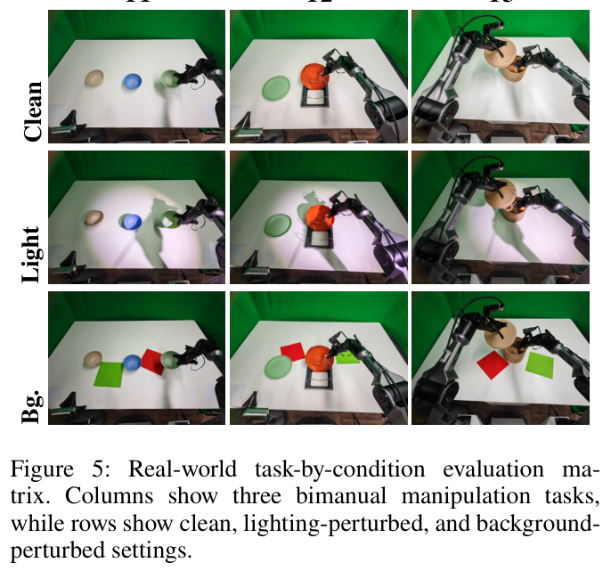

---
tags:
  - papers/embodied-ai
  - papers/world-action-model
aliases:
  - DC-WAM
  - 动态中心世界动作模型
date: 2026-07-28
arxiv_id: "2607.25918"
---

# DC-WAM: Dynamic-Centric Visual Supervision and Reasoning for World-Action Models

## 核心信息

- 标题: DC-WAM: Dynamic-Centric Visual Supervision and Reasoning for World-Action Models
- 标题翻译: DC-WAM：面向世界动作模型的动态中心视觉监督与推理
- 作者: Haoyuan Ji, Lingxiang Fan, Shang Su, Yinqiao Lu, Mengkai Shi, Jun Gao, Shuo Feng
- 机构: Tsinghua University; Dense-AI; University of Michigan
- 发表时间: 2026-07-28
- 发表渠道: arXiv v1
- arXiv: 2607.25918
- 论文链接: https://arxiv.org/abs/2607.25918
- 论文类型: AI 方法论文；具身智能、机器人操作、World-Action Model

## 原文摘要翻译

世界动作模型（WAM）通过预测未来视觉来增强机器人策略，但视觉模态究竟应为控制学习什么仍不清楚。

照片级未来预测虽能提供稠密监督，却计算昂贵，并可能把模型容量分配给与动作选择仅弱相关的纹理、光照和背景变化。

近期高效 WAM 表明，视频分支的主要价值可能不在渲染出的未来画面本身，而在训练过程中诱导出的控制相关视觉表征。

本文从动态中心视角重新审视未来视频预测，并追问：能否在不增加模态专用预测或部署期在线输入的前提下，将现有 基于 RGB 的 WAM 从外观主导的重建转向交互诱发的视觉动态？

作者提出 DC-WAM，在 RGB 视频分支内重新分配监督与计算：监督层面结合时序差分流匹配与轨迹引导加权，突出稠密时序变化以及夹爪、被操作物体和接触区域发生运动的局部位置；推理层面由 DynaRoute 预测逐词元动态相关性，再转成注意力偏置，引导模型关注与控制相关的未来词元。

仿真与真实机器人实验显示，DC-WAM 能持续改善策略表现，尤其是在光照、物体外观和背景纹理发生分布外变化时。（页 1）

## 创新点

1. **不更换 RGB 未来预测的表征类型，而是重写其优化重点。** 与用掩码、点轨迹、光流或几何状态替代/扩充未来模态的路线不同，DC-WAM 保留 Wan2.2 的 RGB 视频分支，仅借助训练期动态线索把容量从静态外观重建转向交互诱发变化。这使它更像一套“监督重分配”方法，而不是新世界表征。（页 1–3，Fig.2）

2. **同一离线动态图承担三个角色。** SAM 提供前景候选，CoTracker3 追踪点轨迹；运动阈值、高斯栅格化和分辨率下采样得到动态图。它既给 TrackFM 做稀疏损失权重，又给 DynaRoute 作为词元相关性标签，同时不进入部署链路。（页 3–4，式2–8）

3. **把动态相关性注入 视觉词元注意力的键端。** DynaRoute将相关性转为中心化 对数空间偏置，影响视频查询对视觉键 的选择；表 4 显示其位置并非可互换实现细节，改成动作查询路由 会严重退化。（页 4–5，式9–14；页 7，表 4）

4. **兼容 FastWAM 式仅动作部署。** 部署时仅在初始高噪声步运行一次视频分支和 DynaRoute，建立带路由的键值缓存，此后动作去噪复用缓存，不迭代生成完整视频。（页 5，Fig.4，式15–17）

## 一句话总结

DC-WAM 的真正主张不是“预测更真实的未来”，而是“让训练期 RGB 未来分支学到更有控制价值的变化”：用稠密时序差分抑制恒定外观、用稀疏轨迹权重聚焦接触区、再用 DynaRoute 把这种动态先验送进视觉注意力；其最好证据是 LIBERO-Plus 从匹配基线 FastWAM-AC 的 **53.8% 提到 60.9%**，而 PSNR 并未同步升高。（页 1、7；图 1；表 1、3）

## 研究问题

### 矛盾不是“要不要 world model”，而是“未来分支 应该学什么”

WAM 把动作生成与未来视觉预测联合起来，直觉上，未来画面提供比行为克隆更稠密的时序监督。但统一的 RGB 重建 error 同时响应两类因素：一类是夹爪运动、物体位移、接触事件；另一类是纹理、光照、背景和传感器噪声。后者像素占比大、容易主导 PSNR，却未必改变正确动作。训练目标于是发生代理错位：模型可能更善于恢复外观，却没有更好地编码控制充分统计量。（页 1–2）

*图 1（原生图，页 1）。五个变体的未来帧 PSNR 与 LIBERO-Plus 成功率不呈单调关系。稠密监督与路由的 PSNR 最低但成功率高于 FastWAM-AC；DC-WAM 的成功率最高，却不是 PSNR 最高。*

应谨慎表述这个矛盾：图 1 支持的是“在本文五个匹配变体上，PSNR 不是成功率的单调代理”，不是“PSNR 对所有 WAM 都无用”。现有 PDF 缺少两类秩相关分析 相关、种子方差与显著性结果，因此这里更像一个有机制支撑的反例，而不是普适统计定律。（页 1、7；图 1）

## 数据与任务定义

### 模型输入与输出

给定当前 RGB 观测、语言指令与本体状态，WAM 联合预测动作块和未来视觉序列。其符号定义如下：

$$
p_\theta(a_{t:t+T_a-1},\hat{o}_{t+1:t+T_v}\mid o_t,\ell,s_t).
$$

骨干为 Wan2.2，采用 视觉—动作混合 Transformer（MoT）：RGB 分支预测未来潜视频，动作分支生成 动作块。未来视觉词元 可以看 动作词元，但 动作词元 不能看 未来视觉词元，只能看当前观测，避免未来信息泄漏。（页 2–3，式1）

### 仿真协议

- **LIBERO（ID）**：Spatial、Object、Goal、Long 四套任务，每个任务评估 50 次回合。
- **LIBERO-Plus（OOD）**：对原 LIBERO 沿布局、相机、机器人初始状态、语言、光照、背景、传感器噪声 七个维度扰动，每维有 L1–L5 五档难度。
- 三个方法都使用相同 Wan2.2 骨干、动作空间、2000 条干净 LIBERO 示范、随机种子和回合时长；训练使用 **8×NVIDIA A100**。这使 FastWAM-AC 成为相对干净的匹配基线。（页 6）

### 真实机器人协议

平台是 Agilex Piper 双臂平台，含三项长时程任务：T1 叠三只碗；T2 把盘子叠到架子上；T3 打开篮子、放入土豆并关上。每项任务收集 **100 条成功示范**，每个“任务 × 条件”执行 **100 次试验**；条件包括干净环境、外部聚光灯造成的光照变化，以及彩纸形成的局部背景干扰物。（页 6，Fig.5）

*图 5（原生图，页 6）。三项真实双臂任务与 clean/light/背景 三类条件；这些扰动主要改变外观而不刻意改变动力学。*

## 方法主线

### 机制流程

*图 2（原生图，页 3）。从离线 tracker-derived 动态图 到 稠密/稀疏监督、DynaRoute 和总训练目标的完整关系。*

1. **输入与教师构建**：输入干净示范视频；SAM 给出前景候选点，CoTracker3 跨整段回合追踪。根据相邻帧位移筛出动态点并做高斯栅格化。输出为两个尺度上的动态图。（页 3–4，式2–8）

2. **视觉监督重分配**：在完整 VAE 潜空间网格上匹配相邻流速度之差，再用动态图加权原始视觉流匹配误差。

   **输出去向**：稠密时序差分损失和稀疏 TrackFM 损失共同更新 RGB 分支。（页 5–6，式22–24）

3. **动态相关性路由**：DynaRoute 读取停止梯度 后的视觉/动作词元、语言与本体条件和扩散时间步，预测词元相关性；由 $\tilde m^*$ 监督。**输出去向**：中心化键端注意力偏置，注入每层视觉查询注意力。（页 4–5，式9–14, 25–26）

4. **部署压缩**：初始高噪声步只运行一次 DynaRoute 和视频分支，建立带路由的视觉键值缓存；后续只执行动作去噪。**输出去向**：动作分支复用缓存，外部 SAM/CoTracker3 和完整未来视觉去噪 都不需要在线运行。（页 5，Fig.4，式15–17）

### Tracker-derived 动态图：监督的共同坐标系

对每个追踪点，先计算相邻帧位移，并仅保留位移超过运动阈值的点。随后以运动幅值加权词元中心上的高斯核，并在整段回合的各相机视图内归一化，最终得到取值位于 $[0,1]$ 的动态图。（页 3–4，式2–7）

这个构造的关键不是“tracker 更精确”，而是其误差函数对静态外观分布变化 天然迟钝：只要轨迹稳定，恒定光照或背景纹理不会直接形成大监督信号。但它也引入新的假设：相机基本静止、遮挡不过强、追踪失败 不与任务关键区域系统相关。论文没有测试这些反例。（页 4）

### Dense temporal difference 与 稀疏 TrackFM

标准流匹配在线性插值样本上预测从数据到噪声的速度，动作分支以均方误差拟合对应流目标。（页 5，式19–21）

稠密监督不直接匹配每帧 RGB 潜变量的绝对速度，而匹配相邻 速度场 的差：

$$
\mathcal L^V_{\mathrm{TD}}=\mathbb E\left[\sum_{t=1}^{T_v-1}\left\|(\hat u^V_t-\hat u^V_{t-1})-(u^V_t-u^V_{t-1})\right\|_2^2\right].
$$

若某个外观分量跨时间近似恒定，它会在差分中被抵消；因此 TD 提供全局、稠密的“变化”监督，但无法知道哪种变化与任务接触最相关。（页 5，式22）

TrackFM 先计算每个网格单元的视觉流匹配误差，再按动态图权重加权并归一：

$$
\mathcal L^V_{\mathrm{TrackFM}}=\mathbb E\left[\frac{\sum_{t,p}m^*_{t,p}e^V_{t,p}}{\sum_{t,p}m^*_{t,p}+\epsilon}\right].
$$

因此 TD 负责“哪里都看变化”，TrackFM 负责“更重视夹爪、物体与接触位置”。两者互补的逻辑成立，但 tracker 只捕获运动，不必然捕获静态却决定动作的 cue，例如目标容器身份或障碍几何。（页 5–6，式23–24）

### DynaRoute：从动态图标签到 attention logit bias

DynaRoute 在每个扩散时间步预测相关性。视觉与动作输入均停止梯度，因此路由损失不会借输入词元反向塑造主干，但路由器仍会学习。相关性经对数变换和中心化成为注意力偏置。（页 4–5，式10–14）

这种键端偏置 不是删除词元，而是在 Softmax 前改变其被视觉查询 读取的概率。其优点是 词元集合 和主架构不变；风险是错误相关性 会系统性压低信息，尤其当关键证据是低运动或 追踪漏检区域时。

### Action-only routed cache

*图 4（原生图，页 5）。训练时每个扩散步预测共享到各层的偏置；部署时只在 $\tau_{\mathrm{init}}=1$ 预测一次 bias 并构建视觉缓存。*

部署时伪视频由干净观测潜变量 与 高斯噪声未来槽位组成，动作同样从高斯噪声 开始。DynaRoute 在 $\tau_{\mathrm{init}}=1$ 运行一次，偏置用于 视频缓存预填充；之后关闭视频分支，动作分支在每个去噪步复用缓存的视觉键值。（页 5，式15–17）

作者将其解释为 训练—推理一致性：高噪声时路由器 主要依赖干净观测、指令和本体状态。但正文未列出缓存内存、延迟、吞吐或相对 FastWAM 的额外开销，故“高效”在本文中主要是结构继承，不是新的速度实验结论。

### 式18–26：训练目标如何闭环

完整目标为：

$$
\mathcal L=\mathcal L^A_{\mathrm{FM}}+\mathcal L^V_{\mathrm{TD}}+\mathcal L^V_{\mathrm{TrackFM}}+\mathcal L_{\mathrm{Route}}.
$$

式18 给出四项分工；式19–20 定义扩散插值与流目标；式21 是动作流匹配；式22 是稠密时序差分；式23–24 是 动态图加权的稀疏 TrackFM；式25–26 用 二元交叉熵 加软 Dice 损失 训练路由器：

$$
\mathcal L_{\mathrm{Route}}=\mathcal L_{\mathrm{BCE}}(g,\tilde m^*)+\lambda_{\mathrm{Dice}}\mathcal L_{\mathrm{Dice}}(g,\tilde m^*).
$$

二元交叉熵提供逐词元判别，软 Dice 损失缓解动态区域稀疏造成的类别不平衡。现有 PDF 缺少各损失权重、运动阈值、路由强度和 Dice 权重的完整设置，仅给出动态图栅格化的尺度系数 0.25 与宽度参数 1.25。（页 3、5–6，式18–26）

## 关键结果

### 主结果与强基线

| 方法 | LIBERO（ID） | LIBERO-Plus（OOD） | ID–OOD 下降 ↓ |
|---|---:|---:|---:|
| FastWAM | 97.6 | 51.5 | 46.1 |
| FastWAM-AC | 96.7 | 53.8 | 42.9 |
| **DC-WAM** | **98.1** | **60.9** | **37.2** |

相对匹配基线 FastWAM-AC，DC-WAM 的 OOD 成功率提高 **7.1 个百分点**，ID 提高 **1.4 个百分点**。相对 FastWAM，二者分别提高 **9.4** 与 **0.5** 个百分点。

七类 LIBERO-Plus 中，DC-WAM 在机器人初始状态 51.7、语言 83.4、光照 91.7、背景 61.3、噪声 54.2、布局 69.8 上领先；唯一例外是相机 23.9，略低于 FastWAM-AC 24.0。这一负结果与机制一致：相机视角改变会让图像坐标轨迹线索更难保持对齐。（页 7，表 1）

### 真实任务各条件增益

| 任务 | 条件 | FastWAM-AC | DC-WAM | 增益 |
|---|---|---:|---:|---:|
| Stack-Bowl | 干净 / 光照 / 背景 | 76 / 34 / 52 | 84 / 48 / 61 | +8 / +14 / +9 |
| Pile-Plates | 干净 / 光照 / 背景 | 80 / 41 / 46 | 89 / 71 / 69 | +9 / +30 / +23 |
| Collect-Potato | 干净 / 光照 / 背景 | 62 / 53 / 30 | 70 / 66 / 45 | +8 / +13 / +15 |

九个任务—条件 全部提升，最大增益是 Pile-Plates 光照条件的 **+30**。括号中的干净至扰动下降也缩小：Stack-Bowl 光照 42→38、背景 24→23；Pile-Plates 39→18、34→20；Collect-Potato 9→4、32→25。（页 7，表 2）

*表 2（原生裁图，页 7）。抽取图只完整覆盖后两项任务，所以上表按原文完整转录三项任务；图片用于核对 Pile-Plates 与 Collect-Potato。*

真实结果很有价值，但不要把 100 次试验 误当 100 个独立环境：测试仍来自一个平台、三个任务和人工设计的两类 appearance perturbation，论文也没有置信区间。

### Dense 与 稀疏 消融到底说明什么

*表 3（原生图，页 7）。所有“+ Dense/+ Sparse”行都在 DynaRoute enabled 条件下测试。*

| 变体 | LIBERO | LIBERO-Plus |
|---|---:|---:|
| FastWAM-AC | 96.7 | 53.8 |
| + 稠密监督与路由 | 97.1 | 56.6 |
| + Sparse w/ Route | 97.4 | 58.7 |
| DC-WAM | **98.1** | **60.9** |

稠密监督相对 FastWAM-AC 为 +0.4/+2.8；稀疏监督为 +0.7/+4.9；组合达到 +1.4/+7.1。结果支持“全局时序变化与局部交互区域互补”。然而，表 3 不是严格的 2×2×2 因子消融：基线同时移除了动态监督和 DynaRoute；带稠密/稀疏监督的行均启用路由。因此不能从这张表精确估计 时序差分、TrackFM 与 DynaRoute 的独立主效应与交互项。（页 7，表 3 图注）

### Routing 与 停止梯度

| 路由变体 | LIBERO | LIBERO-Plus | 相对 DynaRoute 的 OOD 差值 |
|---|---:|---:|---:|
| 无路由 | 97.7 | 59.1 | -1.8 |
| Shuffled 相关性 | 96.8 | 57.8 | -3.1 |
| 动作查询路由 | 95.8 | 49.2 | -11.7 |
| **DynaRoute** | **98.1** | **60.9** | 0 |
| DynaRoute 与梯度阻断 | 97.0 | 57.0 | -3.9 |

无路由 到 DynaRoute 的 +1.8 OOD 说明 路由有增益；shuffled 相关性 更差，说明不是任意偏置 或正则噪声都有效，空间对齐重要；动作查询路由 的 49.2 是最强负结果，表明动态线索 应组织 视觉计算，而不是直接压 动作查询注意力。（页 7，表 4）

这里要区分两种停止梯度。式10是在路由器输入处停止梯度；表 4 的消融则额外阻断“视觉目标 → 动作分支”的梯度，同时保持前向路径。后者从 98.1/60.9 降至 97.0/57.0，即 -1.1/-3.9，支持视频监督经动作条件视觉路径正则动作表征。但它不是对“视频分支是否必要”的纯净因果试验，因为改变梯度也会改变联合优化条件。（页 4、7；式10；表 4）

## 深度分析

### 真正贡献是什么

第一贡献是**重新定义 RGB 辅助目标 的有效信息**。论文的贡献不在创造新未来模态，而是把“预测所有像素”拆成“捕获稠密变化”和“聚焦稀疏交互”，再把同一动态标签用于 注意力路由。这个共同坐标系让监督和推理先验相互一致，比单独增加一个加权 loss 更完整。（页 3–6，Fig.2）

第二贡献是**证明训练期 视觉预见 与部署期 视频生成 可以解耦**。这条 部署 思路主要继承 FastWAM，但 DC-WAM 补上了一个更明确的问题：既然部署不需要完整视频，训练时也不应以照片级 重建 为唯一目标。（页 1–2, 5）

第三贡献是**给出 注意力注入路径的反例证据**。表 4 的 动作查询路由 崩到 49.2，说明“把动态先验加到 attention”不是模块名层面的创新，查询/键路径和影响哪个 专家分支 才是机制本体。（页 7，表 4）

### 为什么结果成立

*图 3（原生图，页 4）。随着视觉扰动从干净条件加重到 L3，FastWAM-AC 的 注意力变得弥散并漂向静态干扰物；DC-WAM 对操作相关区域的响应更稳定。*

其有效性来自三个彼此配合的 inductive bias：

- **时间差分是 nuisance cancellation**：跨帧近似不变的 appearance component 被相减抑制。
- **轨迹权重是稀疏 credit assignment**：巨大的背景 latent grid 不再与小面积接触区域同权竞争梯度。
- **key-side route 是软选择而非硬裁剪**：仍保留所有 词元，但降低低 相关性 key 的读出概率，较容易嵌入既有 MoT。

图 3 为该解释提供可视化支持，表 3/4 给出性能对应关系。不过 注意力热图 不是因果证据；它最多显示模型内部响应与作者机制叙述一致。（页 4、7；Fig.3）

### 与邻近工作的准确定位

- **FastWAM**：核心问题是 测试时迭代未来想象 的成本；DC-WAM直接继承其 仅动作缓存 范式，新增的是训练期监督和 路由。
- **FastWAM-AC**：本文最重要的 匹配基线。它保留 动作条件视觉交互，却去掉 动态目标 和 DynaRoute，因此 53.8→60.9 是最可信的总体方法增益。（页 6）
- **MaskWAM 与 Mask World Model**：通过掩码提示与预测或结构化掩码未来表征 改变/增加未来状态表征；DC-WAM 声称不增加 模态专用词元或分支，而是在 RGB 分支内使用动态线索。（页 2）
- **ImageWAM**：用图像编辑骨干及其中间特征 降低完整视频生成负担；DC-WAM不把 视频改成图像编辑，而是重新分配 RGB 视频目标的容量。（页 1–2）
- **PhysisForcing**：同样从轨迹得到物理线索，但面向物理增强世界模拟器；DC-WAM把线索转成与动作生成耦合的具时间分辨率词元相关性。（页 2）

因此最准确的标签不是“新的视频世界模型”，而是**面向控制效用的 RGB-WAM 训练目标与注意力路由改造**。

### 为什么 PSNR 不能代表控制质量

PSNR 对每个像素误差近似一视同仁，而控制 效用 高度非均匀：夹爪与接触区面积小，却决定动作；背景和光照面积大，却可在不改变最优动作的情况下变化。只要优化容量有限，降低大面积外观误差可能挤占学习小面积动力学的容量。DC-WAM 有意牺牲某些外观 保真度，换取对决策充分信息的敏感性，因此 图 1 的“低 PSNR、高成功率”不是异常，而是目标重加权的预期结果。（页 1、7；图 1）

更严格的下一步应报告：逐 任务/随机种子 的 PSNR–success Spearman 相关；控制相关区域内的 加权 PSNR/光流误差；以及相同 算力 下的 单位计算量成功率。否则现有结果只能反驳“PSNR 必然单调代表控制”，还不能建立一个新的可靠代理指标。

### 复现注意点

1. **骨干与算力**：Wan2.2 视觉—动作 MoT，所有模型 8×A100；训练步数、批量大小、耗时、显存与参数规模在现有 PDF 中均缺失。（页 2, 6）

2. **数据**：2000 条干净 LIBERO 示范；50 次回合/任务；相同 随机种子/回合时长。真实机器人每项任务 100 条示范、每 任务—条件 100 次试验。（页 6）

3. **离线教师链**：SAM 前景采样 + CoTracker3 回合级追踪 + $\delta_{\mathrm{mot}}$ 阈值 + 高斯栅格化 + VAE 与 DiT 网格下采样。部署不需要追踪器，但训练预处理成本和错误会进入标签。（页 3–4）

4. **已给超参数**：动态图核函数给出尺度系数 0.25 与宽度参数 1.25。候选点数量与采样比例、运动阈值、DynaRoute 架构、路由强度、Dice 权重、各损失权重、优化器与学习率计划均未在现有 PDF 中列明。（页 3–6）

5. **文档缺口**：PDF 共 9 页，页 8–9 为 references，**不含 Appendix**；但正文两处称 DynaRoute 细节和分析见 Appendix。不能据此虚构实现细节。（页 5, 8–9）

## 局限

1. **OOD 范围偏窄。** LIBERO-Plus 和真实实验主要改变 布局/视角/外观/噪声，真实实验更只覆盖 光照/背景。评测范围不包含动力学参数变化、物体质量/摩擦、工具失败、遮挡、任务语义组合等更强分布变化。（页 6–7）

2. **动态图假设未受压力测试。** 相机运动、快速遮挡、重复纹理、静态关键目标和 CoTracker3 漏跟踪都可能破坏相关性；Camera 指标 23.9 未胜过 FastWAM-AC 的 24.0，已经提示 图像坐标线索 对视角 分布变化 的边界。（页 7，表 1）

3. **消融不完全因子化。** 缺少 TD × TrackFM × DynaRoute 的完整 $2^3$ 表，无法估计主效应与交互；也未比较 仅 SAM、均匀采点、不同追踪器或理想动态图的对照同样缺失。（页 7，表 3–4）

4. **统计报告不足。** 虽给出相同 seed 和大量 trials，但缺少多种子均值/方差、置信区间和显著性检验；图 1 也无相关系数。（页 6–7）

5. **架构与平台外推有限。** 仅验证 Wan2.2/MoT，一个真实双臂平台、三个任务。作者在结论中也将跨 WAM 架构、更大数据和更多 机器人平台 列为未来工作。（页 7–8）

6. **“无需额外模态”需限定为部署期。** 训练期明确依赖 SAM、CoTracker3 和轨迹派生标签；准确说法是“不增加部署时在线模态/预测 branch”，不是全流程无需额外模型。（页 3, 6）

7. **效率论据主要来自结构，而非测量。** 仅动作缓存避免完整视频去噪是合理的，；延迟、吞吐、FLOPs 或相对 FastWAM-AC 的 路由器额外开销。（页 5）

## 我的笔记

- 最值得复用的研究原则：**不要让 辅助生成指标 自动等价于 downstream 效用。** 在世界模型、视频预测和 智能体记忆 中，都应问清监督误差按什么维度分配、哪些区域真正影响决策。
- 一个漂亮的工程模式是：**离线昂贵教师 → 稀疏结构标签 → 训练轻量 相关性 predictor → 部署移除教师**。但要同时审计教师 failure 是否系统性忽略难例。
- 本文后续最关键的实验不是继续堆平均成功率，而是完整 $2\times2\times2$ 因子消融、追踪器/相机失效测试、多种子 PSNR—控制 相关，以及同等算力下与掩码/点轨迹/光流/图像编辑路线比较单位计算量控制效用。
- 写作中应避免 过度声称：“PSNR 与控制无关”太强；更准确是“标准 全帧 PSNR 在该 匹配变体集合 中不能单调预测策略成功率”。

## 引用

Ji, H., Fan, L., Su, S., Lu, Y., Shi, M., Gao, J., & Feng, S. (2026). *DC-WAM: Dynamic-Centric Visual Supervision and Reasoning for World-Action Models*. arXiv:2607.25918. PDF v1, 9 pages; no appendix in the provided file.
