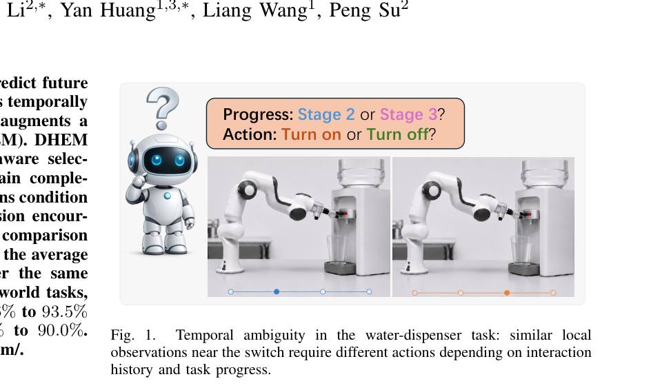
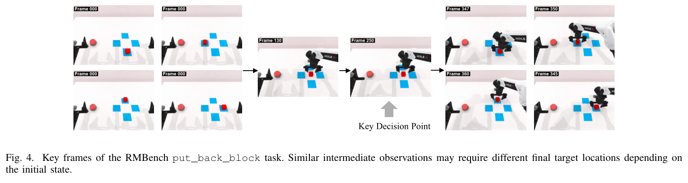
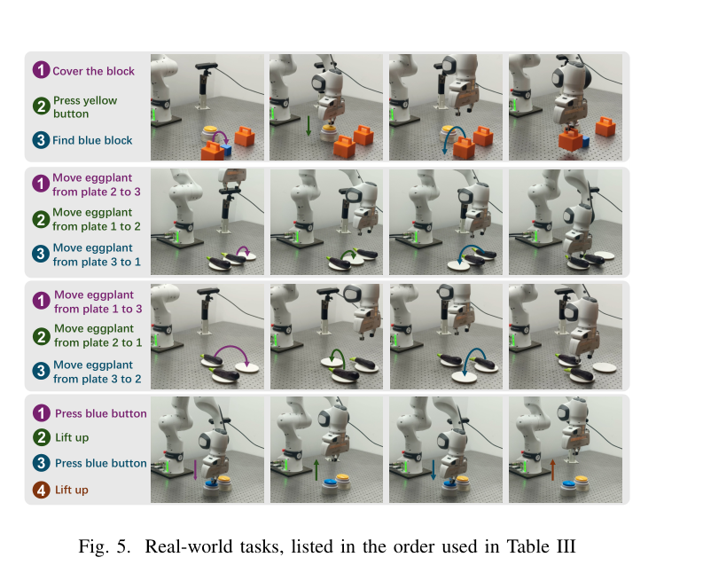
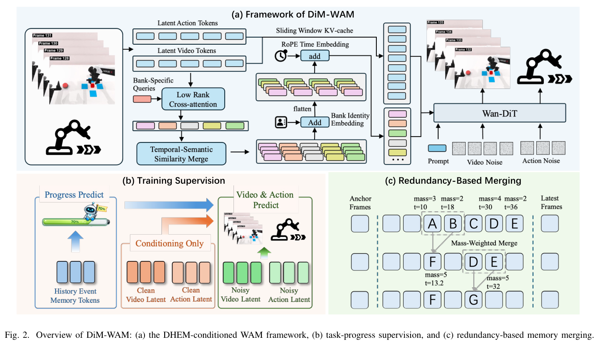
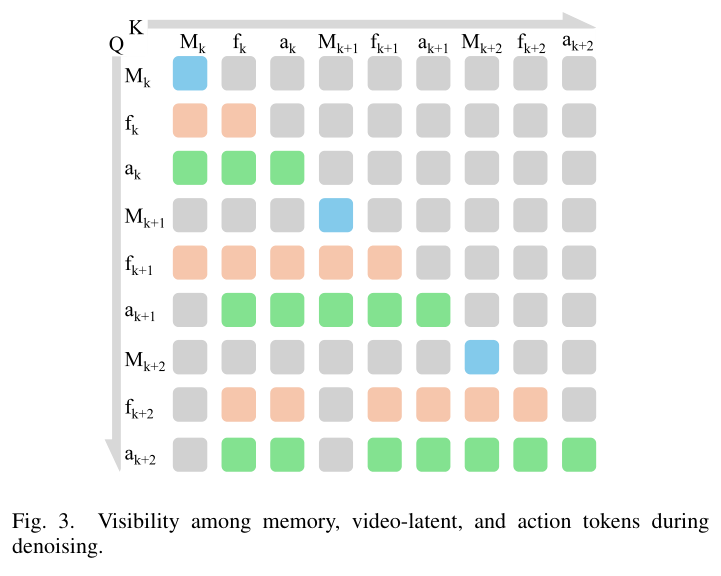
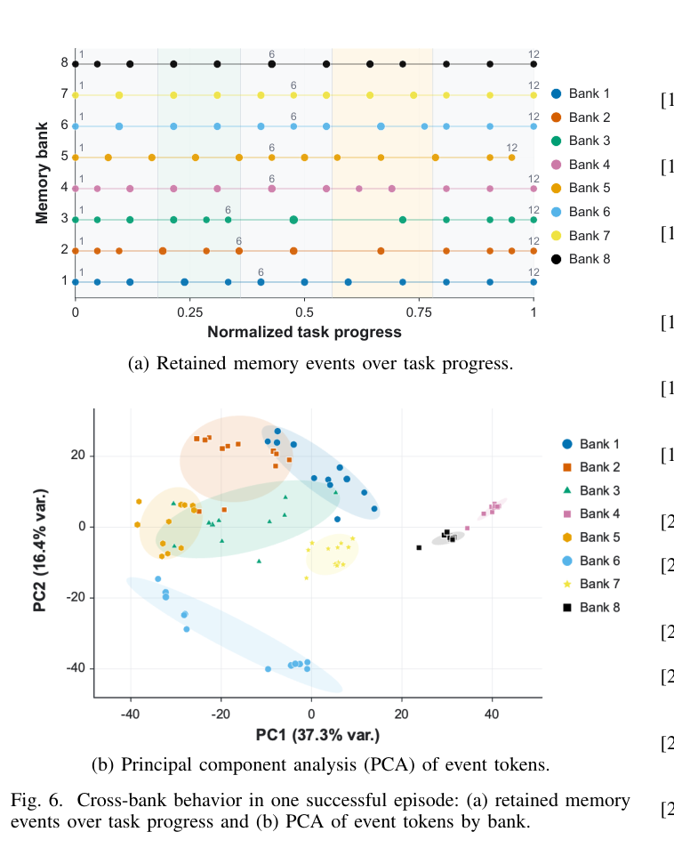

---
tags:
  - papers/embodied-ai
  - papers/world-action-model
  - papers/memory
aliases:
  - DiM-WAM
  - DIM-WAM
  - 多样历史事件记忆世界动作模型
date: 2026-08-04
doi: "10.48550/arXiv.2606.27677"
arxiv_id: "2606.27677"
---

# DIM-WAM: World-Action Modeling with Diverse Historical Event Memory

## 核心信息

- 标题: DIM-WAM: World-Action Modeling with Diverse Historical Event Memory
- 标题翻译: DIM-WAM：具有多样历史事件记忆的世界动作建模
- 作者: Kai Wang, Zhaopeng Gu, Yixiang Chen, Yuan Xu, Qisen Ma, Jiabing Yang, Zhaowen Li, Yan Huang, Liang Wang, Peng Su
- 机构: 中国科学院自动化研究所；深圳引望智能技术有限公司；FiveAges
- 发表时间: 2026
- 发表渠道: arXiv v2
- DOI: 10.48550/arXiv.2606.27677
- arXiv: 2606.27677
- 论文链接: https://arxiv.org/abs/2606.27677
- 代码 / 项目: https://wangkai-casia.github.io/dim-wam
- 数据 / 资源: RMBench（基于 RoboTwin 2.0）；四项 Franka Panda 真实机器人任务
- 论文类型: AI 方法论文；具身智能、长时程机器人操作、世界动作模型

## 原文摘要翻译

世界动作模型通过联合预测未来视觉状态与动作，已经展现出有前景的机器人操作性能。然而，现有方法主要依赖短期历史与短预测视界；对于正确执行依赖更早观察和任务进度的长时程任务，这并不充分。此类具有时间依赖性的任务需要有效利用互补的时间信息，包括近期局部上下文、跨阶段历史事件、即时未来动力学与全局任务进度。

为解决长期遗忘和对全局任务状态感知不足的问题，本文提出 DiM-WAM：一种记忆增强的世界动作模型，将多尺度历史上下文、局部未来动力学和全局任务进度结合起来。其记忆模块从真实观察中抽取紧凑视觉事件信息，经由独立的、基于相似度的合并机制更新多个记忆库；随后读取带有记忆库身份和时间嵌入的长期上下文，以条件化视频与动作去噪。额外的进度监督进一步鼓励记忆词元不仅编码已完成的历史事件，也编码当前任务阶段及其对剩余任务的含义。

在 RMBench 上，DiM-WAM 的平均成功率达到 **69.8%**；在四项真实 Franka 任务上，平均阶段成功率达到 **93.5%**，完整任务成功率达到 **90.0%**。（页 1）

## 创新点

1. **把“长时程历史”拆成多个未预定义语义的有界记忆库，而不是扩展滑动窗口。** 每个库从同一当前观察中以不同可学习查询抽取候选事件，独立写入与维护；库间多样性损失阻止它们退化为同一份缓存。（页 2–5，式 3–5、17–18）

2. **提出以新颖性为准绳的保留规则，而非简单先进先出。** 当记忆已满时，模型只在相邻中间历史槽之间找最冗余的一对；若新事件与最新事件更冗余，就直接丢弃新事件，否则合并旧对、为新事件腾位。它试图优先压缩重复事件，而保留跨阶段转折。（页 3–4，式 6–10，Algorithm 1）

3. **用累计质量加权合并事件与时间。** 被压缩事件不只是取平均：其词元、时间戳均由累计质量加权，质量相加。这样合并后的表示对应已压缩证据的代表，而非任意保留最后一个事件。（页 4，式 11）

4. **把任务进度变成训练期辅助约束，而非在线规划器。** 对所有有效记忆词元池化后预测十个粗进度桶；该头不进入推理决策路径。其价值是迫使记忆读出带有“当前已做到哪一步”的信息，而非仅保存物体外观。（页 4–5，式 14–16）

5. **论文中最可信的总体增益来自训练匹配比较。** 在作者明确声明的相同 50 条示范、1,500 步训练、非方法优化设置和每任务 100 次回合下，LingBot-VA 的全任务平均从 **34.8%** 升到 DiM-WAM 的 **69.8%**。这比把 Mem-0 的 42.0% 当作同等对照更严谨。（页 6–7，表 II）

## 一句话总结

DiM-WAM 的核心不是“给 WAM 加一段更长 KV cache”，而是把真实观测压成多库、可合并、可淘汰的事件记忆，再以粗进度监督约束这些事件对视频与动作去噪有用；它在 RMBench 与小规模真实 Franka 任务上给出强结果，但对多库为何稳定分工、收益究竟来自哪个写入细节、以及协议是否仍泄漏，证据都还不够闭环。

## 研究问题

### 局部画面相同，正确动作可以相反

论文用饮水机任务说明长时程控制的关键难点：机器人靠近同一开关时，开水前与关水前的局部画面可能几乎一样，尤其当透明水流难以察觉；但正确动作分别是按下、避免或反向操作。短局部窗口只看见“同一开关”，看不见此前是否已经交互、目前是第几阶段，因而容易在错误阶段重复动作或提前停止。（页 1，图 1）

*图 1（原生裁图，页 1）。饮水机开关附近存在时间歧义：局部视觉相近，动作取决于交互历史与任务进度。*

这把问题从“生成未来画面够不够清晰”转成“怎样在有限容量里留下未来仍有决策价值的过去”。纯粹拉长局部上下文会增加计算，并稀释少量关键事件的注意力；单一记忆库又可能把语义不同、时间相邻的事件按相似度混掉。DHEM 的动机正是让不同库隐式保留互补事件模式，而不人为指定某库只存物体、某库只存动作。（页 1–3）

### 在本地 WAM 图谱中的位置

它属于 **长时程、记忆增强的 World-Action Model**，不是新视觉生成器。相比记忆增强 VLA 多把历史送入动作推理，DiM-WAM 让记忆同时条件化未来视觉潜变量与动作去噪；相比长视频记忆主要维持视觉连续性，它希望记忆编码对象状态、动作后果与任务进度。（页 2）

但要准确定位：它扩展的是 LingBot-VA 的原始视频—动作输入输出接口，DHEM 是外接的持久事件状态。论文没有证明记忆本身改善了视觉预测质量，也没有把它与“同容量但不同写入策略”的所有替代方案系统比较。（页 5–7）

## 数据与任务定义

### 时间信息分工与模型接口

在第 $i$ 个决策片段，模型持有语言指令 $c$、滑动窗口 WAM 缓存 $C_i$ 与持久记忆 $M_i$。作者把可用证据概括为

$$
I_i=\{H_{\mathrm{short}},H_{\mathrm{long}},F_{\mathrm{short}},G_{\mathrm{prog}}\},
\tag{1}
$$

分别对应近期局部历史、DHEM 长期历史、预测视界内的视频—动作演化及全局粗进度。预测式为

$$
(\hat z_{i:i+H-1},\hat a_{i:i+H-1})=f_\theta(C_i,c;M_i).
\tag{2}
$$

这里的记忆来自之后环境真实采集的观察，而不是模型自己生成的未来；这一点很重要，因为它避免将模型幻想直接写入长期记忆。（页 2、5）

### RMBench 与 put_back_block

RMBench 建在 RoboTwin 2.0 上，包含五个 $M(1)$ 任务和四个 $M(n)$ 任务：前者依赖少数关键历史观察，后者需要跨多次交互累积历史。以 `put_back_block` 为例，机器人将积木移到中央、按按钮后再把它放回四个可能初始位置之一；中途图像相似，最终位置却依赖初始事件。（页 5–6）

*图 4（原生裁图，页 6）。`put_back_block` 的移块—按键—放回过程；相近的中间观察不包含最终目标位置所需的全部信息。*

### 协议审计：先承认一个可见性泄漏，再只修补一个任务

这是本文最值得保留的实验意识。表 I 不直接将成功率归因给记忆，而审计 `put_back_block` 的相机、窗口长度与采样步幅是否会把“初始位置”泄漏给局部策略。此处 window 是输入帧数、stride 是输入帧下采样间隔，并非动作视界。（页 5–6，表 I）

| 相机视图 | 窗口 | 步幅 | 初始状态在局部窗口可见 | 仅靠局部可见目标的机会准确率 | 成功率 |
|---|---:|---:|---|---:|---:|
| front + wrist + head | 30 | 1 | 否 | 25 | 86 |
| head + front | 30 | 1 | 否 | 25 | 41 |
| head + front | 60 | 1 | 否 | 25 | 49 |
| head + front | 120 | 1 | 是 | 100 | 88 |
| front + wrist + head | 30 | 4 | 是 | 100 | 94 |
| head + front | 30 | 4 | 是 | 100 | 98 |

核心异常是：初始状态声称不在局部窗口时，仅加入腕部视角，成功率就从 **41% 升至 86%**。作者据此推测存在与姿态相关的泄漏，因此对表 II 的 $M(1)$ 使用头部加前视、30 帧、步幅 1；$M(n)$ 用步幅 2。（页 5–6，表 I）

这个处理提高了可信度，但不应说“已经消除了泄漏”：审计只覆盖一个任务，作者也明确承认其他任务仍可能残留泄漏；表 I 的 chance 只是“局部可见目标信息的理想目标选择准确率”，并非完整任务成功率上界。更严格的后续工作应逐任务遮蔽初始状态、随机化相机与机器人初始姿态，并报告局部策略的诊断准确率，而不只是整条轨迹成功率。

### 真实机器人协议

真实部分使用单个第三人称相机、$224\times224$ 输入，四项 Franka Panda 多阶段任务：寻找蓝色积木、直线交换、三角形交换、两次按压。各方法每任务共享 15–25 条示范并做 10 次完整任务试验；输出为 7 个绝对关节位置与 1 个二值夹爪状态。阶段成功率（SSR）是完成阶段数除以总阶段数，完整成功率（SR）是完成整项任务的试验比例。（页 6）

*图 5（原生裁图，页 6）。四项真实任务及其表 III 中的排列顺序。*

## 方法主线

### 机制流程

*图 2（原生裁图，页 3）。DiM-WAM 总览：DHEM 条件化 WAM、训练期进度监督，以及记忆满载后的冗余合并。*

1. **从当前真实观察抽取多库候选事件。** 每个库以自己的可学习查询从同一视觉词元集合读出候选，因此输入相同而写入视角可以不同。
2. **每个库独立维护固定槽位。** 新候选若过于重复就被丢弃；否则压缩最冗余的相邻旧事件，并把新事件放入最新槽。
3. **把有效事件变成可读序列。** 词元叠加库身份嵌入，再按槽位相对位置施加 RoPE；这段记忆同时条件化视频、动作去噪。
4. **训练时补进度和跨库多样性。** 进度头让记忆对粗粒度任务位置可预测，多样性损失降低各库均值方向塌缩；推理时不运行进度头。（页 2–5，图 2–3，式 1–19）

### DHEM 的状态：$K$ 个库、每库 $N$ 个槽

记忆状态由并行库构成：

$$
M_i=\{M_i^k\}_{k=1}^{K},\quad M_i^k=\{e_{i,k,n}\}_{n=1}^{N},\quad e_{i,k,n}=(m_{i,k,n},t_{i,k,n},\alpha_{i,k,n},v_{i,k,n}).
\tag{3}
$$

每个事件存词元 $m$、时间戳 $t$、累计质量 $\alpha$ 和有效位 $v$，空间开销为 $O(KN)$，不随轨迹长度增长。实验配置是 **8 个库 × 每库 12 槽**，即 96 个槽；这也是后续消融中最强配置，但并非同容量对照。（页 3、6）

每个库先规范化视觉特征 $x_{i,j}$ 和库查询 $q_k$：

$$
h_{i,j}=\operatorname{LN}_x(x_{i,j}),\qquad r_k=\operatorname{LN}_q(q_k),
\tag{4}
$$

再用共享投影计算注意力权重、汇集候选并经前馈网络残差更新：

$$
a_{i,k,j}=\operatorname{Softmax}_j\!\left(\frac{(W_qr_k)^\top(W_hh_{i,j})}{\sqrt{d_r}}\right),\quad s_{i,k}=\sum_j a_{i,k,j}h_{i,j},\quad \tilde u_{i,k}=s_{i,k}+\operatorname{FFN}(\operatorname{LN}_o(s_{i,k})).
\tag{5}
$$

要点是“多库”并不意味着有人工语义标签。论文希望不同 $q_k$ 和不同已保留状态使库产生差异；但这只是机制意图，稳定的功能分工仍需跨任务、跨随机种子的量化证据。

### 新颖性保留与质量加权合并

每库槽 1 是固定初始状态锚点，槽 $N$ 是最近事件，槽 2 到 $N-1$ 是按时间排序的压缩历史。两事件的冗余优先级为

$$
\rho_k(p,q)=\bigl(1+\cos(m_p,m_q)\bigr)\exp\!\left(-\frac{|t_p-t_q|}{\tau}\right).
\tag{6}
$$

高 $\rho$ 意味着语义相似且时间相近，即相对新颖性低。记忆满时，只有中间历史的相邻有效对可被合并：

$$
A_{i,k}=\{(s,s+1)\mid 2\le s\le N-2,\ v_{k,s}v_{k,s+1}=1\},
\tag{7}
$$

$$
(p^\star,q^\star)=\arg\max_{(p,q)\in A_{i,k}}\rho_k(p,q),
\tag{8}
$$

$$
\rho^{\mathrm{new}}_{i,k}=\bigl(1+\cos(m_{k,N},\tilde u_{i,k})\bigr)\exp\!\left(-\frac{|t_{k,N}-i|}{\tau}\right).
\tag{9}
$$

若上式左侧的新候选冗余度不低于最冗余旧对，则新候选比最冗余旧对还更冗余，直接丢弃：

$$
\rho^{\mathrm{new}}_{i,k}\ge\rho_k(p^\star,q^\star).
\tag{10}
$$

否则合并旧对。合并不是等权平均：

$$
m_{pq}=\frac{\alpha_pm_p+\alpha_qm_q}{\alpha_p+\alpha_q},\quad t_{pq}=\frac{\alpha_pt_p+\alpha_qt_q}{\alpha_p+\alpha_q},\quad \alpha_{pq}=\alpha_p+\alpha_q.
\tag{11}
$$

这使时间戳可成为非整数的连续代表时间，且因它位于原相邻时间之间，合并后仍能保持槽位的时间顺序。作者在所有库中共享相似度函数并设 $\tau=N-1$；库间差异只能来自不同候选与各自历史，并非来自不同的时间尺度。（页 3–4）

### Algorithm 1：需要注意的更新边界

Algorithm 1 的实际优先级是：未初始化时用首事件填满并固定槽 1；若最新槽仍是初始化副本，直接用新事件覆盖；若中间槽还残留锚点副本，先删副本再写入；若有无效中间槽，移动旧最新事件并写新事件；只有真正满载才执行“找最冗余相邻对—丢新或合并旧对”的规则。（页 4，Algorithm 1）

因此，论文所谓的 novelty-aware merging 并不从首段就持续发挥作用；早期大量写入只是初始化和填充。复现时应精确实现锚点、副本和最新槽的状态机，否则即使公式相同，也会改变保留分布。

### 协作读取：库身份、槽位位置与可见性

每个有效词元加库身份嵌入 $b_k$；槽位以相对当前片段的坐标编码：

$$
\pi_{i,n}=\pi_{\mathrm{cur}}-2(N-1-n),
\tag{12}
$$

$$
R_i=\operatorname{RoPE}_{\pi}\operatorname{Flat}_{n,k}\bigl[(m_{i,k,n}+b_k,\pi_{i,n})\bigr]_{v_{i,k,n}=1}.
\tag{13}
$$

展平顺序为先槽位、后记忆库：同一槽位的各库词元先相邻，库身份负责区分来源。RoPE 跟随保留槽位顺序，而**不**按质量加权后的连续时间戳重新排序；也就是说，时间表示同时含“离散槽位年龄”和“事件内容”，二者并不完全一致。（页 4）

*图 3（原生裁图，页 5）。记忆、视频潜变量与动作词元在去噪时的可见关系。记忆条件化当前去噪，但不追加到持久 KV cache。*

图 3 的边界条件值得强调：记忆事件不会写进持久 KV cache，持久记忆只由之后从环境获得的真实观察更新。这避免预测自举污染，但也意味着记忆系统无法靠内部生成来填补未观察到的状态。

### 进度监督、多样性约束与总目标

对可读记忆 $R_i$ 均值池化后，进度头输出 $B$ 个桶上的分布：

$$
p_i=\operatorname{Softmax}(h_{\mathrm{prog}}(\operatorname{Pool}(R_i))),\qquad p_i\in\Delta^{B-1}.
\tag{14}
$$

对于 $T$ 个片段，论文用归一化轨迹位置定义进度比 $r_i$（$T=1$ 时单独安全处理），再量化标签与交叉熵：

$$
y_i=\min(\lfloor Br_i\rfloor,B-1),\qquad
\mathcal L_{\mathrm{prog}}=-\log p_{i,y_i}.
\tag{15–16}
$$

它监督的是示范走到第几段，而不是“已经盖上盒子”这类语义状态。若不同轨迹的同一任务阶段持续时间差异大，轨迹位置可以是噪声标签；作者在局限中也承认这一点。（页 4–5、7–8）

为抑制库塌缩，先取库内有效词元均值 $\mu_{i,k}$ 并归一化为 $\bar\mu_{i,k}$，最小化任意两库均值的平方余弦：

$$
\mathcal L_{\mathrm{div}}=\frac{1}{|P|}\sum_{(k,l)\in P}(\bar\mu_{i,k}^{\top}\bar\mu_{i,l})^2.
\tag{17–18}
$$

总损失为

$$
\mathcal L=\mathcal L_{\mathrm{video}}+\mathcal L_{\mathrm{action}}+\lambda_{\mathrm{div}}\mathcal L_{\mathrm{div}}+\lambda_{\mathrm{prog}}\mathcal L_{\mathrm{prog}}.
\tag{19}
$$

视频与动作扩散去噪项权重均为 1；实验取 $\lambda_{\mathrm{div}}=10^{-3}$、$\lambda_{\mathrm{prog}}=10^{-2}$、$B=10$。这四项是联合增加的，因而最终系统收益不能从表 II 中分辨究竟由多库、合并、进度头还是辅助目标配重带来。（页 5–6）

## 关键结果

### 主结果与强基线：必须区分“训练匹配”与“上下文参考”

表 II 涵盖九个 RMBench 任务。DP、ACT、$\pi_{0.5}$、X-VLA、Mem-0 是基准报告的上下文参考。

Fast-WAM、LingBot-VA 与 DiM-WAM 是作者在审计后协议下得到的内部世界动作模型结果。

作者仅将 LingBot-VA 对 DiM-WAM 标为训练匹配：同为 50 条示范、相同非方法优化设置、1,500 步训练、每任务 100 回合，差别才是 DHEM、进度监督及其目标项。（页 6–7，表 II）

| RMBench 指标 | Fast-WAM† | LingBot-VA† | DiM-WAM† | 解读 |
|---|---:|---:|---:|---|
| $M(1)$ 平均 | 2.8 | 34.2 | **80.6** | 关键初始事件或少数历史观察的任务，DiM-WAM 增益最大 |
| $M(n)$ 平均 | 5.5 | 35.5 | **56.3** | 跨交互累计历史也改善，但仍显著低于 $M(1)$ |
| Overall 平均 | 4.0 | 34.8 | **69.8** | 唯一可较干净归因的总体比较是 34.8 → 69.8 |

逐任务上，DiM-WAM 在九项中的八项报告最高值；其在积木重排、放回积木、交换积木、交换 T 字积木分别达到 99、98、96、97。$M(n)$ 中，“盖住积木”为 56，“按压按钮”为 34，说明“有记忆”并不等于已经解决所有跨步骤累计任务。（页 7，表 II）

Mem-0 的总体平均为 42.0，因此 69.8 比它高 27.8 个百分点；但 Mem-0 是该基准报告的数值，不与本方法共享训练、算力与实现设置。更稳妥的说法是“本文方法超过该表中 Mem-0 的上下文参考结果”，而不是“DHEM 因而优于 Mem-0 的记忆机制”。

### 真实机器人：SSR 很高，SR 也强，但样本很小

表 III 报告的是成功计数，两种指标的分母不同：寻找蓝色积木的阶段成功率分母为 40；两个交换任务各为 60；两次按压为 30；每项完整任务成功率分母均为 10。（页 7，表 III）

| 方法 | 寻找蓝色积木：阶段 / 完整 | 直线交换：阶段 / 完整 | 三角形交换：阶段 / 完整 | 两次按压：阶段 / 完整 | 平均阶段 | 平均完整 |
|---|---|---|---|---|---:|---:|
| $\pi_{0.5}$ | 0/40；0/10 | 3/60；0/10 | 0/60；0/10 | 0/30；0/10 | 1.3 | 0.0 |
| Fast-WAM | 0/40；0/10 | 0/60；0/10 | 0/60；0/10 | 0/30；0/10 | 0.0 | 0.0 |
| LingBot-VA | 21/40；1/10 | 47/60；6/10 | 31/60；4/10 | 30/30；10/10 | 70.6 | 52.5 |
| **DiM-WAM** | **39/40；9/10** | **55/60；9/10** | **51/60；8/10** | **30/30；10/10** | **93.5** | **90.0** |

相对 LingBot-VA，平均阶段成功率为 **70.6 → 93.5**，平均完整任务成功率为 **52.5 → 90.0**。完整任务增益最大的任务是寻找蓝色积木（10%→90%，+80 点）和三角形交换（40%→80%，+40 点），二者确实分别需要跨阶段身份或空间信息；这与论文的记忆叙述相符。（页 6–7）

但 Press Twice 的局部窗口已覆盖约 85% 的示范，两个方法都是 10/10，作者明确不把它解释成记忆优势。更根本的是每任务只有 10 个完整试验，90% 即 9/10，80% 即 8/10；没有置信区间或不同训练种子，不能把小样本点估计写成稳定的真实机器人定律。

### 消融到底说明什么

| 变体 | Swap T | Swap Blocks | 平均 |
|---|---:|---:|---:|
| 1 × 32 memory | 71.0 | 80.0 | 75.5 |
| 4 × 8 memory | 88.0 | 92.0 | 90.0 |
| 8 × 12 memory | **97.0** | **96.0** | **96.5** |
| 8 × 12，去掉进度头 | 92.0 | 89.0 | 90.5 |

固定总容量 32 时，1×32 到 4×8 把平均从 **75.5** 提至 **90.0**，这是支持“多库结构优于单库”的最干净片段。8×12 到去进度头从 **96.5** 降到 **90.5**，支持进度头对该完整配置有贡献。（页 7，表 IV）

但 4×8 到 8×12 把银行数从 4 改为 8，**同时把总容量从 32 增至 96**；96.5 不能被归因于更多银行。表 IV 也不独立移除新颖性筛选、相邻限制、质量加权合并、库身份嵌入或多样性损失。因此论文证明的是“若干记忆设计和进度头组成的系统在两个任务上有效”，尚未证明每个记忆维护环节的独立必要性。

### 图 6 是机制一致性，不是机制证据

*图 6（原生裁图，页 8）。一个成功 `put_back_block` 回合的跨库保留位置与事件词元 PCA。*

图 6 中，不同库保留不同事件位置、累积质量经常集中在转换附近，PCA 分布既有差异也有重叠。这与“互补库”叙述一致；但它只有一个成功回合，既无跨随机种子统计、无库—事件语义互信息，也没有失败回合对照。作者自身也明确说它不建立跨库稳定专门化的一般趋势。（页 7–8）

## 深度分析

### 真正贡献是什么

真正可复用的想法是 **事件级有界压缩的写入规则与世界动作模型联合训练之间的契合**。单纯把历史词元送进 Transformer 并不新鲜；DHEM 的具体性在于：锚点保留、最新事件保留、中间相邻冗余合并、新候选可被拒绝、质量加权融合和库级多样性共同构成一个可执行的长时程状态机。它能以 $O(KN)$ 代价让记忆长度脱钩于轨迹长度。

进度损失也是比“更多历史”更强的归纳偏置：如果中间画面像，控制需要的是阶段判别，而不是逐帧重建精度。不过进度标签来自轨迹位置，恰好把“示范时间”和“任务语义”绑定；其效果可能依赖任务执行速度一致的设定。

### 为什么看上去会有效

- **局部窗口处理即时动力学，DHEM 处理不可从最近帧恢复的跨阶段事实。** 二者分工避免让少数远古线索一直占据局部缓存。
- **新颖性规则对重复观察有压缩偏好。** 假设同一阶段的大量相近画面连续到来，合并邻近旧对和拒绝接近最新事件能保留转折处的表示。
- **质量加权合并避免“最后一个事件支配历史”。** 多次被合并的事件质量更大，其词元与代表时间对压缩后的历史影响更大。
- **多库允许相同观察的多个注意力摘要并存。** 这可能比一个全局相似度空间更不容易把对象身份、布局、交互状态混为一谈。

这些是机制合理性，并非全部已被实验证明。特别是“质量”在这里本质上是合并计数，而非信息价值、置信度或任务效用；如果大量重复但无用的事件先被合并，它依然会拥有更大的质量。

### 协议审计的含义：本文最成熟、也最未完成的一段

作者发现腕部视角能在初始状态不在局部窗口时显著提升成功率，随后收紧 $M(1)$ 相机与步幅，这是应有的基准治理，而不是可忽略的附录细节。它提醒后续做长时程记忆基准时，必须分别审计：相机是否泄漏初始布局、机械臂姿态是否成为阶段代理、输入采样是否把早期帧保留在窗口、语言是否暗含目标位置。

但此审计也暴露出结论的脆弱点：它只对 `put_back_block` 做了敏感性试验。剩余八项任务、$M(n)$ 的步幅 2、不同相机与初始姿态组合均没有同级检查。因而 69.8 既是方法成绩，也是在一个部分审计过的协议上的成绩；最严谨的复现应先重跑每项任务的泄漏矩阵，再讨论记忆增益。

### 训练与算力公平性

本文方法与 LingBot-VA 有明确训练匹配关系；Fast-WAM 遵循官方优化配方，$\pi_{0.5}$ 使用推荐的 20,000 步，Fast-WAM 在真实任务训练 150 轮。

本文每个任务专用模型训练在 **8 张 NVIDIA H800** 上，作者直接声明比较并非算力匹配。（页 6）

因此，Fast-WAM 的完整任务成功率为 0.0，$\pi_{0.5}$ 的完整任务成功率也为 0.0，不应被解读为“基础模型路线必然失败”，只能说明在各自所用配方和这批任务示范下没有完成整任务。论文最干净的因果问题是：在 LingBot-VA 这一世界动作模型上，同时加入 DHEM 与进度训练是否有益？答案由表 II 支持；更广泛的路线优劣尚未被公平比较。

### 复现注意点

1. **协议不是背景参数。** RMBench 用头部加前视、30 帧窗口、$128\times128$；$M(1)$ 步幅 1、$M(n)$ 步幅 2。先复核每项任务的局部可见性与姿态泄漏。
2. **记忆状态机必须逐分支实现。** 初始化副本、固定锚点、最新槽、中间无效槽、相邻候选集和“丢新而不动旧最新事件”的行为都会改变实际记忆。
3. **已给出的超参数有限但关键。** AdamW、学习率 $10^{-5}$、批大小为 1、梯度累积 10、1,500 步、四片段截断反传、8×12 槽、$B=10$、干净键值缓存随机丢弃率 0.3、$\lambda_{\mathrm{div}}=10^{-3}$、$\lambda_{\mathrm{prog}}=10^{-2}$。（页 6）

4. **读写时序须守住环境边界。** 记忆只由环境真实观察更新，不能将预测视频或动作分支的中间表示写进持久状态。
5. **PDF 是 8 页、无附录。** 没有更多实现表、种子方差、训练耗时、显存、消融网格或额外定性案例可以援引；不能把项目页或相关工作中的常见做法补写成本文细节。

## 局限

1. **因果归因不完整。** 主比较同时改变 DHEM、进度监督和两个辅助损失；表 IV 只隔离了固定 8×12 条件下去进度头，不能分开判断新颖性保留、质量合并、库查询、库身份和多样性损失。

2. **容量与库数混杂。** 4×8 和 8×12 的总槽数不同，故 90.0→96.5 不能证明八库优于四库。应补齐固定 96 槽下的 1×96、4×24、8×12，以及固定 32 槽下的更多银行数。

3. **协议泄漏只被局部审计。** 表 I 已发现腕部视角的姿态相关泄漏迹象，却只审计一个任务。跨任务、跨视图、跨步幅的残余泄漏尚未排除。

4. **真实世界统计力度有限。** 每任务 10 个完整试验，没有置信区间、随机种子或操作者批次；SSR 的阶段计数也不是独立的完整任务样本。应将 9/10、8/10 视为点估计，而不是稳定排序。

5. **“多库分工”缺少量化证明。** Fig. 6 是单回合 PCA 和事件位置可视化，不能说明每个库在不同 episode 中学到了可重现的语义角色。

6. **进度监督可能学到示范节拍。** 轨迹位置标签在阶段时长变化、等待动作、失败恢复或多策略完成同任务时未必对应语义进度；论文也承认它不是显式规划器。

7. **评测分布狭窄。** 主要覆盖依赖记忆的机器人操作、一个仿真基准、四个 Franka 任务和单个第三人称真实相机。更广机器人本体、观察视角、非视觉状态缺失、对象遮挡与任务重排的外推尚未建立。

## 我的笔记

- 对世界动作模型研究最有价值的不是“记忆词元越多越好”，而是 **先写清长时程记忆基准的局部策略到底有没有偷看到答案**。DIM-WAM 的表 I 是很好的提醒：如果不做可见性审计，长时程成功率很可能混入相机或姿态捷径。
- DHEM 的结构可迁移到世界模型中的其他持久状态：保留锚点、保留最新、只压缩相邻冗余历史、以质量维护压缩代表。它比无约束检索更利于在线状态预算，但仍缺少面对错误观测和遮挡的鲁棒性验证。
- 若把该思路用于后续工作，最必要的不是换更复杂检索器，而是补齐：固定总容量的银行数消融；每个维护规则的 $2^n$ 或至少分层消融；每任务泄漏测试；多种子置信区间；记忆内容与未来成功的可预测性分析。
- 写作上应避免两种过度宣称：其一，“69.8 优于所有基线”忽略训练匹配关系；其二，“不同库学到语义专家”超过 Fig. 6 的单回合证据。最强、最准确的表述是：**在作者审计后但仍未完全排除泄漏的 RMBench 协议中，DHEM 与进度监督的组合相对训练匹配 LingBot-VA 显著提高报告成功率。**

## 引用

Wang, K., Gu, Z., Chen, Y., Xu, Y., Ma, Q., Yang, J., Li, Z., Huang, Y., Wang, L., & Su, P. (2026). *DIM-WAM: World-Action Modeling with Diverse Historical Event Memory*. arXiv:2606.27677v2. 提供的源 PDF 共 8 页，正文、结论和 38 条参考文献齐全；未检测到附录。
