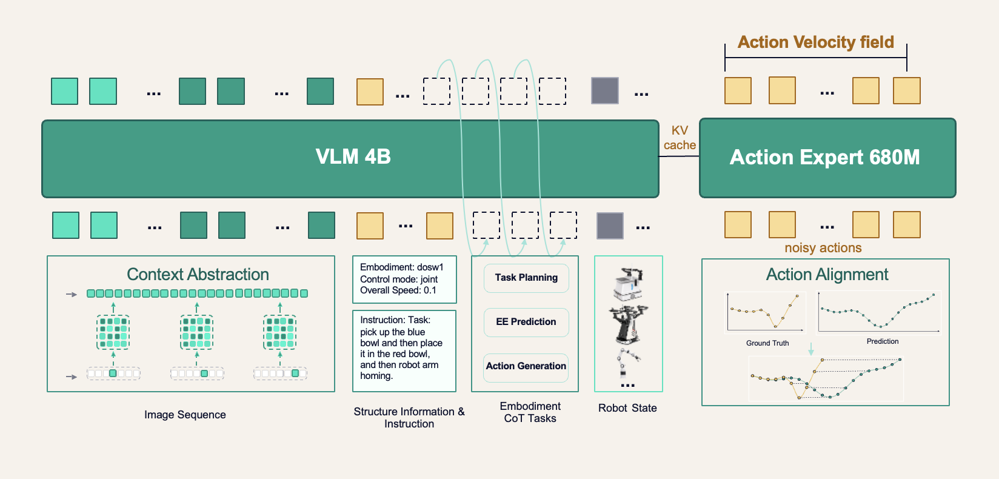

# DM0.5: An Open-World Foundation Model for General-Purpose Embodied Intelligence

> **Dexmal (原力灵机) 官方技术白皮书与系统报告 (Technical Whitepaper & Release Report)**  
> **发布机构 (Organization):** Dexmal（原力灵机 / 重庆智能科技有限公司）  
> **发布日期 (Date):** 2026-09-01  
> **开源生态 (Ecosystem):** [GitHub](https://github.com/dexmal) | [Hugging Face](https://huggingface.co/dexmal) | [ModelScope](https://modelscope.cn/organization/dexmal)  
> **官方主页 (Official Portal):** [www.dexmal.com](https://www.dexmal.com)  

**Caption:** Dexmal (原力灵机) official corporate emblem and technical publication banner.
**Caption[CN]:** 原力灵机（Dexmal）官方机构徽标与技术发布横幅。

## 目录索引 (Page & Section Index)

- [1. 术语对照表 (Terminology Ledger)](#1-术语对照表-terminology-ledger)
- [2. 总体概述 (Overview)](#2-总体概述-overview)
  - 核心突破五大维度 (Five Core Improvements)
  - 开放世界能力演示矩阵 (Open-World Manipulation Demonstrations)
- [3. 模型架构与关键设计 (Model Architecture)](#3-模型架构与关键设计-model-architecture)
  - 3.1 架构概览与 VLA 范式 (Architecture Overview & 4B+680M Design)
  - 3.2 上下文抽象层：历史上下文融合 (Context Abstraction Layer: Historical Context Fusion)
  - 3.3 具身思维链任务：广义具身推理 (Embodiment CoT Tasks: Broad Embodied Reasoning)
  - 3.4 轨迹对齐层：动态动作匹配 (Trajectory Alignment Layer: Dynamic Action Matching)
  - 3.5 训练策略 (Training Strategy & Multi-Source Optimization)
  - 3.6 推理机制 (Inference & Action Chunking Performance)
- [4. 数据工程体系 (Data Engineering)](#4-数据工程体系-data-engineering)
  - 4.1 多源异构数据构成 (Data Composition)
  - 4.2 数据清洗五步法 (Data Cleaning Strategy)
- [5. 实验评估与分析 (Experiments & Benchmark Results)](#5-实验评估与分析-experiments--benchmark-results)
  - 5.1 零样本泛化能力评估 (Zero-Shot Generalization: Atomic Actions & Constraints)
  - 5.2 下游微调适应能力 (Fine-Tuning Capability)
    - 5.2.1 真机桌面操作：RoboChallenge Table30 v2 (Real-Robot Manipulation)
    - 5.2.2 仿真单双臂操作基准：LIBERO 与 RoboTwin2.0 (Simulated Manipulation)
    - 5.2.3 仿真具身导航基准：R2R 与 RxR (Simulated Navigation)
  - 5.3 历史上下文工作记忆深度验证 (Historical Context Modeling Experiments)
  - 5.4 策略执行鲁棒性评测 (Policy Robustness)
    - 5.4.1 相机视角空间扰动测试 (Camera Viewpoint Perturbation Matrix)
    - 5.4.2 人类主动物理干预测试 (Human Perturbations & Dynamic Adaptation)
- [6. 结论与未来愿景 (Conclusion & Future Horizons)](#6-结论与未来愿景-conclusion--future-horizons)
- [7. 原力灵机生态与硬件矩阵 (Dexmal Ecosystem, Robots & Applications)](#7-原力灵机生态与硬件矩阵-dexmal-ecosystem-robots--applications)
- [8. 专业技术述评 (Technical Critical Reading Postscript)](#8-专业技术述评-technical-critical-reading-postscript)

## 1. 术语对照表 (Terminology Ledger)

| 英文术语 (English Term) | 规范学术翻译 (Standard Chinese) | 所属模块 (Module) | 技术定义与上下文内涵 (Technical Definition & Context) |
| :--- | :--- | :--- | :--- |
| **VLA Model** | 视觉—语言—动作模型 | 架构范式 | 将视觉观测与语言指令联合编码并端到端生成机械臂连续控制动作的具身模型。 |
| **Embodied Foundation Model** | 具身基座大模型 | 基础模型 | 具备多物理环境通用理解、跨具身形态泛化与零样本动作执行能力的基座模型。 |
| **Action Expert** | 动作专家 | 动作解码 | 专门用于去噪采样并输出高频连续机器人关节或末端动作的高效扩散／流匹配解码网络（680M）。 |
| **Context Abstraction Layer** | 上下文抽象层 | 记忆系统 | 负责对长达 60 秒的历史视觉时隙进行时空下采样与词元压缩、生成短期工作记忆的模块。 |
| **Embodiment CoT Tasks** | 具身思维链任务 | 语义推理 | 嵌入机器人示教数据训练的 11 项自回归多任务链，涵盖任务规划、事件预测与动作意图摘要。 |
| **Trajectory Alignment Layer** | 轨迹对齐层 | 动作监督 | 摒弃时间戳刚性对齐，依据动态规划与单调性几何匹配算法对齐预测与示教轨迹的对齐层。 |
| **Dynamic Action Matching** | 动态动作匹配 | 优化机制 | 允许操作节奏速度合理拉伸伸缩、专注物理接触点关键动作对齐的动态规划最优匹配机制。 |
| **Flow Matching** | 流匹配 | 动作生成 | 基于连续时间常微分方程（ODE）向量场回归的高性能生成模型，推理效率优于传统扩散去噪。 |
| **Action Chunking** | 动作块生成 | 推理控制 | 策略单次推理输出未来固定步长连续动作序列（DM0.5 为 50 步）以增强时间连贯性的机制。 |
| **Teleoperation Pace Noise** | 遥操作节奏相位噪声 | 数据质量 | 因人工示教人员操作习惯、迟疑或急促导致示教数据中时序节奏不一引发的高频对齐噪声。 |
| **Multi-Embodiment Support** | 多具身形态支持 | 硬件迁移 | 覆盖单臂（Franka/UR5）、双臂移动（Dexmal-Mirror）、人形（AgiBot/Galaxea）等多构型。 |
| **Zero-Shot Generalization** | 零样本泛化能力 | 评估维度 | 模型在完全未见过的物理场景、未见物体、未见空间约束组合下仅凭语言指令直接闭环执行。 |
| **Atomic Action Primitives** | 原子操作原语 | 评测基准 | 构成复杂桌面操作的 8 类基础动作：pick, put, move, pull, cover, wipe, stack, press。 |
| **Semantic Constraints** | 语义条件约束 | 评测基准 | 施加于指令中的 7 类空间与物理条件：颜色、形状、尺寸、状态、次序、相对位置、绝对位置。 |
| **RoboChallenge Table30 v2** | 桌面30项真机挑战基准 | 真实评测 | 包含长时程记忆、精细插花、双臂托盘协同等高难度桌面操作的真机评估基准。 |
| **LIBERO / RoboTwin2.0** | 仿真操作权威基准 | 仿真评测 | 分别测试单臂 4 套复杂技能套件与双臂在清洁及随机扰动场景下的泛化控制基准。 |
| **R2R / RxR** | 房间—房间具身导航基准 | 导航评测 | 评估模型依据自然语言长文本路径指引在未知三维室内环境中进行自适应路径规划的基准。 |
| **Dexmal-Mirror** | 原力灵机双臂移动机器人 | 硬件平台 | 原力灵机自研的双臂协作移动操作平台，搭载全向移动底盘、双七自由度机械臂与多视角感知套件。 |

## 2. 总体概述 (Overview)

### Figure 1. DM0.5 开放世界全景概念图

**Caption:** DM0.5: An open-world foundation model for general-purpose embodied intelligence, transitioning robotic manipulation from controlled laboratory setups to dynamic real-world environments.
**Caption[CN]:** DM0.5：通用具身智能开放世界基座模型，推动机器人操作从受控实验室环境走向动态开放的真实物理世界。

> <strong>Para. 1:</strong> Over the past two years, Vision-Language-Action (VLA) models have moved robotics toward a unified representation of perception, language, and action. Robots are no longer limited to executing fixed programs. They can begin to interpret natural-language instructions, recognize objects in open-world scenes, and translate visual semantics into executable control signals.

> <strong>Para. 1[CN]:</strong> 在过去的两年中，视觉—语言—动作（Vision-Language-Action, VLA）模型推动机器人学走向感知、语言与动作的统一表征。机器人不再局限于执行预先设定的固定程序，而是开始能够理解自然语言指令、在开放世界场景中识别物体，并将视觉语义转化为可执行的控制信号。

> <strong>Para. 2:</strong> In February 2026, we released DM0, our first embodied-native foundation model built from the ground up. DM0 learned a range of complex manipulation tasks in controlled environments and gave us an early view of what this paradigm can offer when paired with the right data, effective optimization, and reliable evaluation.

> <strong>Para. 2[CN]:</strong> 2026 年 2 月，我们发布了从零自研的首个原生具身基座模型 DM0。DM0 在受控环境中学习了一系列复杂操作任务，使我们初步领略到在恰当的数据、有效的优化策略以及可靠的评估体系结合下，该范式所能释放的巨大潜力。

> <strong>Para. 3:</strong> However, the real world demands far more from robots than a compelling demo. A general-purpose embodied foundation model cannot simply perform predefined tasks in fixed scenes. It must understand the task instruction, infer why the next action is needed, and execute reliably across different camera views, object states, environments, robot embodiments, and external disturbances. It must also adapt quickly to new real-world tasks after fine-tuning on limited data.

> <strong>Para. 3[CN]:</strong> 然而，真实物理世界对机器人的要求远非一段引人瞩目的技术演示所能涵盖。一个通用具身基座大模型绝不能仅仅停留在固定场景中执行预定义任务。它必须理解任务指令、推断为何需要执行下一步动作，并在不同的相机视角、物体状态、物理环境、机器人具身构型以及外部动态扰动下保持可靠执行。同时，它还必须能够在少量数据的微调下快速适应全新的真实世界任务。

> <strong>Para. 4:</strong> This is the motivation behind DM0.5: moving beyond the lab and toward the open world.

> <strong>Para. 4[CN]:</strong> 这正是 DM0.5 的核心研发动力：走出实验室，迈向真正开放的世界。

> <strong>Para. 5:</strong> The core improvements of DM0.5 can be summarized in five areas:
>
> - Improved zero-shot generalization: DM0.5 extends the zero-shot capability of VLA models to unseen open environments, where it follows natural-language instructions from users to complete robotic manipulation tasks.
> - Efficient and reliable fine-tuning: A stronger foundation model leads to stronger downstream expert policies. DM0.5 improves task-specific training quality while reducing the amount of data and compute required for adaptation.
> - Longer historical context modeling: The DM0.5 architecture supports learning from historical observations and can incorporate up to 60 seconds of task history.
> - More robust policy behavior: DM0.5 demonstrates stable policy behavior under changes in lighting, camera viewpoint, and active human perturbations.
> - Multi-embodiment support: Through multi-robot, multi-task training, DM0.5 can be transferred through post-training to robot embodiments that were not seen during pretraining.

> <strong>Para. 5[CN]:</strong> DM0.5 的核心技术突破可归纳为以下五个关键维度：
>
> - 显著提升的零样本泛化能力：DM0.5 将 VLA 模型的零样本泛化能力拓展至此前未见的开放物理环境中，能够精准遵循用户的自然语言指令完成各类机器人操作任务。
> - 高效且可靠的下游微调能力：更强大的基座模型孕育出更为卓越的下游专家策略。DM0.5 在显著提升特定任务训练质量的同时，大幅降低了下游策略适配所需的数据规模与算力开销。
> - 更长程的历史上下文建模：DM0.5 的模型架构深度支持从历史观测中持续学习，能够整合并建模长达 60 秒的任务执行历史信息。
> - 更稳健的策略执行鲁棒性：DM0.5 在光照条件剧烈变化、相机视角大幅度偏移以及人类主动物理扰动下，均展现出高度稳定的策略控制表现。
> - 跨机器人多具身形态支持：通过多机器人、多任务的联合训练体系，DM0.5 能够通过后训练（Post-training）无缝迁移至预训练阶段从未见过的全新机器人构型与本体平台上。

> <strong>Para. 6:</strong> In real-world validation, DM0.5 demonstrates robust execution across a diverse suite of challenging manipulation tasks in open environments, including:
>
> - Table arrangement in an open environment, dynamically categorizing, picking, and neatly organizing diverse household objects;
> - Object placement under cross-container spatial constraints, reasoning over geometric affordances and collision-free trajectories;
> - Executing multi-target, constrained instructions, parsing long natural-language prompts involving conditional sequencing and target filtering;
> - Multi-step stacking and precise alignment, achieving millimeter-level insertion and contact-rich assembly under visual occlusion.

> <strong>Para. 6[CN]:</strong> 在真实物理世界的系统验证中，DM0.5 在开放环境下的多项极具挑战性的复杂操作任务中展现了高鲁棒性的执行能力，包括：
>
> - 开放环境下的桌面整理：动态识别、拾取并分类摆放各类形态各异的日常杂物；
> - 跨容器空间约束下的物体摆放：对容器的空间可容纳度与无碰撞轨迹进行实时空间几何推理；
> - 多目标约束指令执行：精准解析包含条件执行次序与多目标筛选的长文本自然语言指令；
> - 多步骤堆叠与精细对齐：在视觉遮挡与紧密接触工况下，实现毫米级精度的对齐插拔与稳定堆叠。

## 3. 模型架构与关键设计 (Model Architecture)

### 3.1 架构概览与 VLA 范式 (Architecture Overview & 4B+680M Design)

### Figure 2. DM0.5 系统架构全景图

**Caption:** DM0.5 system architecture diagram illustrating the 4B VLM backbone, Context Abstraction Layer with 60-second historical visual memory, 11 Embodiment CoT reasoning tasks, Trajectory Alignment Layer with dynamic programming action matching, and the 680M Flow Matching Action Expert.
**Caption[CN]:** DM0.5 系统架构概览图，展示了 4B VLM 视觉语言骨干、融合最长 60 秒历史视觉记忆的上下文抽象层、11 项具身思维链（CoT）自回归推理任务、基于动态规划动作匹配的轨迹对齐层，以及 680M 参数的流匹配（Flow Matching）动作专家。

> <strong>Para. 7:</strong> DM0.5 follows a VLA architecture using a 4B Vision-Language Model (VLM) as the backbone and a 680M Action Expert to generate continuous robot actions.

> <strong>Para. 7[CN]:</strong> DM0.5 遵循典型的视觉—语言—动作（VLA）架构体系，采用一个 40 亿参数（4B）的视觉语言模型（VLM）作为多模态感知与语义推理骨干，并配备一个 6.8 亿参数（680M）的动作专家（Action Expert）专门用于生成高频连续的机器人控制动作。

> <strong>Para. 8:</strong> Compared with DM0, DM0.5 is not only a larger model trained on more data. Its main advances come from systematic improvements in historical context modeling, embodied reasoning, action supervision, and data quality. These changes move the model beyond a policy driven primarily by the current frame, toward an embodied foundation model that can understand task progress, handle open-ended instructions, and generate stable continuous actions.

> <strong>Para. 8[CN]:</strong> 与上一代模型 DM0 相比，DM0.5 绝非仅仅是参数规模扩大与训练数据堆叠的产物。其核心突破源自对历史上下文建模、具身语义推理、动作监督对齐以及数据工程质量的系统性重构。这些技术创新推动模型彻底摆脱了主要依赖当前单帧图像的反应式被动策略局限，迈向能够全局理解任务进展、从容应对开放式开放指令并生成高稳定性连续动作的通用具身基座大模型。

> <strong>Para. 9:</strong> DM0.5 introduces several key designs to address long-horizon dependencies, semantic reasoning, data noise, and action continuity in real robot tasks. The model supports long-horizon historical context, jointly modeling current observations with key visual information from the recent past. During training, embodied reasoning tasks are added so that the model learns not only to predict actions, but also to reason about task stages, environmental changes, and future action intent. For action generation, DM0.5 builds on Flow Matching and improves action-matching supervision, reducing temporal alignment noise caused by variations in teleoperation pace. At the same time, an efficient data-cleaning pipeline enables finer-grained filtering, alignment, and sampling across multi-source, multi-robot, and multi-task datasets, improving the stability of action supervision.

> <strong>Para. 9[CN]:</strong> 为应对真实机器人任务中普遍存在的长程时序依赖、深层语义推理、数据采集噪声以及动作平滑连续性等核心瓶颈，DM0.5 引入了多项关键架构设计。模型原生支持长程历史上下文，将当前观测与近期的关键历史视觉信息进行联合表征与融合。在训练阶段，模型引入了具身思维链推理任务，使其不仅学会直接映射预测动作，更能对当前任务阶段、环境动态演变以及未来动作意图展开显式多步推理。在动作生成方面，DM0.5 基于流匹配（Flow Matching）框架改进了动作匹配监督机制，有效抑制了因人工遥操作节奏快慢不均所引发的时序对齐相位噪声。与此同时，高效的数据清洗流水线在多来源、多机器人本体及多任务海量数据中实现了细粒度过滤、几何对齐与动态重采样，极大增强了动作监督信号的稳定性。

> <strong>Para. 10:</strong> Together, these designs improve DM0.5's instruction following, long-context memory, action robustness, and cross-task generalization in open environments. The model can complete a broader range of unseen instructions in zero-shot settings, adapt more efficiently during downstream fine-tuning, and maintain more stable execution under camera changes, human interference, and different robot embodiments.

> <strong>Para. 10[CN]:</strong> 这一整套系统性创新共同赋予了 DM0.5 卓越的指令遵循能力、长程上下文工作记忆、高鲁棒性动作执行力以及面向开放环境的泛化迁移能力。该模型能够在零样本设置下理解并完成更为宽泛的未见指令，在下游任务微调过程中以极高的数据效率完成快速收敛，并在相机视角变动、人类主动物理干预以及跨机器人本体迁移时，始终保持平稳坚韧的控制执行表现。

### 3.2 上下文抽象层：历史上下文融合 (Context Abstraction Layer: Historical Context Fusion)

> <strong>Para. 11:</strong> Traditional VLA models typically receive only the current image and current robot state at each control step. This is often sufficient for short, local, approximately Markovian tasks. DM0.5 introduces historical frames so that the policy can access a short-term contextual memory during decision-making.

> <strong>Para. 11[CN]:</strong> 传统的 VLA 策略模型在每个控制步通常仅接收当前单帧图像输入以及当前机器人本体状态。这种近似马尔可夫决策过程的单帧输入范式在处理简短、局部且无时序依赖的操作时往往足够有效，但在处理长程复杂任务时存在严重的记忆缺失。DM0.5 正式引入了历史关键帧机制，使控制策略在决策求解时能够直接调取短期上下文工作记忆。

> <strong>Para. 12:</strong> At inference time, the model receives the current frame together with several key frames from the past. This gives it access to changes in task state over a window of up to one minute: where an object was picked up, whether a tool has already been used, whether an area has already been cleaned, or whether the robot has already passed a particular landmark.

> <strong>Para. 12[CN]:</strong> 在推理阶段，模型不仅接收当前帧视觉观测，还同步摄入从历史时序中抽取的数个关键帧。这使得模型能够实时感知长达 60 秒时间窗口内的任务演进状态：例如某一物体最初是在何处被抓起的、特定工具是否已被使用完毕、特定桌面区域是否已被彻底清理干净，抑或机器人在导航过程中是否已经穿过了某一关键地标。

> <strong>Para. 13:</strong> During training, the data pipeline samples multiple historical slots before the current timestep. Each historical slot is processed through temporal sampling and spatial sampling, then compressed into a fixed number of visual tokens. Randomized history lengths and history augmentation are used so that the model learns to handle long histories, short histories, and cases where no useful history is available. This reduces the model's dependence on a fixed history window and allows it to fall back gracefully to current-observation-driven behavior when historical context is missing or partially corrupted.

> <strong>Para. 13[CN]:</strong> 在训练流程中，数据流水线在当前时间步之前动态采样多个历史时隙（Historical Slots）。每个历史时隙均经过严谨的时序采样与空间下采样，随后被压缩编码为固定数量的紧凑视觉词元（Visual Tokens）。通过采用随机历史长度策略与历史特征增强技术，模型被训练为能够同时从容应对极长历史、极短历史乃至完全无可用历史信息的各种极端工况。这种自适应机制彻底解除了模型对固定长度历史窗口的机械依赖，使其在历史上下文缺失或因通信丢包造成部分损坏时，能够平滑优雅地退化回基于当前观测的反应式控制模式。

设当前控制时间步为 $t$，历史视觉观测时隙为 $\{t - 	au_1, t - 	au_2, \dots, t - 	au_H\}$，其中最大回溯时程 $	au_H \le 60\text{ s}$。上下文抽象层将各历史图像帧 $I_{t-	au}$ 经过时空下采样压缩为固定长度的视觉潜变量：

$$ Z_{\text{hist}} = \left\{ \mathcal{E}_{\text{visual}}(I_{t-\tau_h}) \in \mathbb{R}^{L_{\text{token}} \times d} \mid h = 1, \dots, H \right\} $$

### 3.3 具身思维链任务：广义具身推理 (Embodiment CoT Tasks: Broad Embodied Reasoning)

> <strong>Para. 14:</strong> Embodied reasoning is not new, but in DM0.5 we make it a central part of training. The underlying motivation is that an embodied foundation model should build strong representations of environmental change, instruction semantics, and its own embodiment state and behavior. Language remains one of the most efficient representational interfaces for this kind of learning.

> <strong>Para. 14[CN]:</strong> 具身推理虽然并非全新概念，但在 DM0.5 中，我们首次将其提升为模型多任务联合训练的核心支柱。这一设计的底层逻辑在于：一个真正的具身基座模型，必须对物理环境演变规律、指令多层语义、自身具身动力学状态以及行为因果逻辑建立起深层表征。而自然语言正是承载此类抽象认知学习最高效、泛化性最强的表征媒介之一。

> <strong>Para. 15:</strong> DM0.5 introduces 11 autoregressive tasks into training on robot data. As a result, training is not driven solely by continuous action supervision. It also reinforces instruction following, action prediction, and temporal scene understanding. Given the current image, robot state, task instruction, and historical context, the model is asked to answer constrained questions about the task.

> <strong>Para. 15[CN]:</strong> DM0.5 在机器人具身数据集的训练中创新性地引入了 11 项自回归推理任务。由此，模型的优化目标不再仅仅由连续动作空间的回归损失单独驱动，而是同时被赋予了指令语义对齐、未来动作预测以及时空场景理解的强监督约束。在输入当前图像、本体状态、任务指令与历史上下文的前提下，模型被要求自回归生成针对该任务特定约束问题的标准推理链答案。

> <strong>Para. 16:</strong> These embodied reasoning tasks fall into three categories:
>
> - Task planning focuses on the current task stage, the relationship between previous and future steps, and overall task progress. This helps the model understand what has already been done and what should happen next.
> - Event and environment prediction focuses on task boundaries, state transitions, and key future events. This strengthens the model's ability to perceive scene evolution and stage changes.
> - Action generation focuses on future actions or semantic summaries of action intent. This helps the model form a clearer representation of intended behavior before generating continuous actions.

> <strong>Para. 16[CN]:</strong> 这 11 项具身思维链任务主要划分为以下三大核心类别：
>
> - 任务规划（Task Planning）：聚焦于判定当前任务所处的具体阶段、解析历史已执行步骤与后续未执行步骤之间的因果依赖关系，以及全局评估任务完成进度。这赋予了模型明确“先前完成了什么”以及“当下应当继续做什么”的全局意识；
> - 事件与环境预测（Event and Environment Prediction）：聚焦于捕捉子任务边界、物体状态转移（如由开转关、由脏转净）以及未来即将发生的关键物理事件。这极大强化了模型对场景时空演变与物理接触变化的敏感度；
> - 动作意图生成（Action Generation）：聚焦于生成未来动作的离散语义描述或动作意图的高维摘要。这帮助模型在调用动作专家生成底层高频连续控制轨迹之前，先行在语义层面建立起清晰、连贯的意图表征。

> <strong>Para. 17:</strong> This design expands robot data from action-only supervision into joint supervision over instruction understanding, temporal reasoning, and action generation. The model learns not only which action corresponds to the current image, but also why that action is appropriate given the instruction and task progress, and how the world state is likely to change afterward. This improves instruction following, action coherence, and task completion in complex long-horizon tasks.

> <strong>Para. 17[CN]:</strong> 这一体系将传统机器人数据仅能提供底层动作监督的单一模式，全面拓展为涵盖指令理解、时序因果推理与动作生成的联合多任务监督。模型不仅能够学习在特定图像下执行何种数值动作，更能深层领会该动作在当前指令与任务进度约束下的合理性原因，并能前瞻性地预见动作执行后物理世界状态将如何演化。这种多层认知机制显著提升了长程复杂任务中的指令遵循精准度、动作时序连贯性与整体任务成功率。

### 3.4 轨迹对齐层：动态动作匹配 (Trajectory Alignment Layer: Dynamic Action Matching)

> <strong>Para. 18:</strong> Robot data collected through teleoperation often contains substantial variation in execution pace. The same task may be completed at different speeds across demonstrations. If the model is forced to align its predicted actions with fixed timestamps in the original trajectory, it may learn the rhythm of data collection, or overfit to timing noise, rather than learning the underlying task-relevant action structure.

> <strong>Para. 18[CN]:</strong> 通过人工遥操作采集的机器人示教数据往往包含显著的操作节奏差异。即便面对完全相同的任务，不同示范人员、甚至同一人员在不同演示轮次中的操作速度也大相径庭。若强行要求模型将预测动作与原始轨迹中机械固定的时间戳进行刚性对齐，模型极易退化为过拟合特定示教者的节奏偏差与时序噪声，而无法真正掌握与任务完成强相关的底层几何操作结构。

> <strong>Para. 19:</strong> DM0.5 addresses this through dynamic action matching. Instead of aligning supervision by fixed time index, the Trajectory Alignment Layer aligns supervision by trajectory progress.

> <strong>Para. 19[CN]:</strong> DM0.5 通过创新的动态动作匹配（Dynamic Action Matching）机制彻底攻克了这一难题。轨迹对齐层摒弃了依据机械时间戳进行刚性监督的旧模式，转而依据整条轨迹的内在“几何任务进展”来进行非刚性动态对齐。

> <strong>Para. 20:</strong> The model outputs a fixed-length segment of future actions, while the data retains a more fine-grained ground-truth action trajectory. During training, each predicted action is matched to an action anchor in the ground-truth trajectory. The matching must be strictly monotonic: later predicted actions can only match later positions in the trajectory, preventing time reversal. The loss for each candidate match is computed from the error between the predicted action and the corresponding ground-truth anchor. The overall matching is then solved by dynamic programming to minimize the total matching loss across all predicted actions.

> <strong>Para. 20[CN]:</strong> 在具体实现中，模型一次性输出一段固定长度的未来动作片段（例如 50 步动作块），而训练数据则保留了更为密集精细的真实动作参考轨迹。在训练计算时，每一个预测动作均通过软对齐方式与真实参考轨迹中的某一动作锚点（Action Anchor）建立映射。该对齐过程受到严格的“单调性约束”限制：即在时间上位于后序的预测动作只能与参考轨迹中相同或更后序的位置对齐，坚决杜绝时序倒流现象。候选匹配的损失函数由预测动作与对应真实锚点之间的几何误差决定。最终的最优对齐路径通过动态规划（Dynamic Programming）算法全局高效求解，使得所有预测动作的累积对齐损失达到全局最小。

形式化地，令模型预测的连续动作块为 $\hat{A} = \{\hat{a}_1, \hat{a}_2, \dots, \hat{a}_K\}$（其中 $K=50$），参考示教高频真实轨迹锚点序列为 $A^* = \{a_1^*, a_2^*, \dots, a_M^*\}$（$M \ge K$）。对齐映射 $\pi: \{1, \dots, K\} \to \{1, \dots, M\}$ 满足严格单调递增约束：

$$ 1 \le \pi(1) \le \pi(2) \le \dots \le \pi(K) \le M $$

动态对齐层的全局优化目标为最小化逐点匹配误差与相邻锚点连续性惩罚的复合损失：

$$ \min_{\pi} \sum_{k=1}^K \mathcal{L}_{\text{match}}\left(\hat{a}_k, a_{\pi(k)}^*\right) + \lambda \sum_{k=1}^{K-1} \mathcal{L}_{\text{cont}}\left(a_{\pi(k)}^*, a_{\pi(k+1)}^*\right) $$

> <strong>Para. 21:</strong> To avoid selecting only locally easy actions, DM0.5 also considers trajectory continuity between adjacent anchors. It is not enough for individual action points to be close; the ground-truth trajectory between neighboring anchors should also be reasonably explained by changes in the predicted actions. This allows legitimate variations in execution speed while reducing the risk that the model skips key phases of the task.

> <strong>Para. 21[CN]:</strong> 为防止对齐算法投机性地仅挑选局部误差极小的动作点而跳过关键过渡操作，DM0.5 在目标函数中显式引入了相邻锚点之间的“轨迹连续性约束”。单一离散动作点在几何上的接近是远远不够的；相邻锚点之间的真实轨迹段，必须能够被连续预测动作的变化量合理平滑地解释。这一约束在充分包容操作速度合理伸缩的同时，从数学上杜绝了模型抄近道、遗漏关键物理接触或阶段性关键子动作的风险。

> <strong>Para. 22:</strong> This mechanism reduces temporal phase noise in teleoperation data. It encourages the model to focus on task-critical changes such as grasping, alignment, contact, and release. As a result, the learned action velocity field becomes smoother and more robust, improving generalization across different demonstrators and execution rhythms.

> <strong>Para. 22[CN]:</strong> 该机制从根本上滤除了遥操作数据中的时序相位噪声，强力引导模型将注意力集中在诸如抓取、对齐、接触以及释放等与任务成败休戚相关的关键物理转变上。最终，由动作专家所拟合的动作速度场（Action Velocity Field）变得更为平滑连续且高度稳健，极大提升了模型面对不同操作演示者与多变操作节奏时的泛化自适应能力。

### 3.5 训练策略 (Training Strategy & Multi-Source Optimization)

> <strong>Para. 23:</strong> The training strategy of DM0.5 is centered on multi-source mixture training after data alignment. Robotic manipulation data provides the primary supervision for action learning. Vision-language data preserves the open-vocabulary understanding and spatial reasoning capabilities of the visual backbone. Navigation data provides supervision for long instruction understanding and path decision-making. Video understanding data further improves temporal modeling, event understanding, and dynamic scene representation.

> <strong>Para. 23[CN]:</strong> 训练体系。DM0.5 的整体训练策略以多模态异构数据经几何与格式对齐后的多源混合训练为核心基石。各模态数据协同分工明确：机器人实体操作数据为动作生成提供了最核心的直接行为监督信号；开放领域的通用视觉—语言数据锁定了多模态骨干网络的开放词汇理解与三维空间几何推理能力；具身导航数据为长文本复杂指令解析与长程路径决策提供了关键泛化先验；而海量通用视频理解数据则进一步深层强化了模型的时序动态建模、物理事件理解与非刚性动态场景表征能力。

> <strong>Para. 24:</strong> For optimization, the VLM backbone and the Action Expert use separate learning-rate groups. The VLM backbone is trained with a smaller learning rate to reduce catastrophic forgetting and preserve general vision-language capabilities. The Action Expert uses a larger learning rate to learn the distribution of robot actions more effectively. Training uses mixed precision and distributed optimization, with additional optimization for the Action Expert to support the computational overhead introduced by long context, multi-camera input, and history tokens.

> <strong>Para. 24[CN]:</strong> 在参数优化层面，VLM 骨干网络与动作专家（Action Expert）采用了严格解耦的分组差异化学习率配置。VLM 骨干网络采用极小的精细学习率进行保守更新，以最大限度抑制灾难性遗忘，保全其通用多模态开放词汇理解与世界知识；动作专家则采用相对较大的积极学习率，以便更快速、高效地拟合高维连续机器人动作流的复杂分布。全流程采用混合精度与分布式并行优化架构，并针对长上下文窗口、多相机视角输入以及历史视觉词元所带来的计算与显存开销，对动作专家前向与反向计算图进行了深度的底层工程算子融合与并行优化。

### 3.6 推理机制 (Inference & Action Chunking Performance)

> <strong>Para. 25:</strong> DM0.5 performs inference in action chunks. By default, it uses 10 diffusion / Flow Matching steps to generate a 50-step action chunk. After optimization, DM0.5 runs at 10 Hz on a single NVIDIA RTX 4090 and 20 Hz on a single NVIDIA H100.

> <strong>Para. 25[CN]:</strong> 推理机制。DM0.5 在实际部署执行中采用动作块（Action Chunking）生成机制。在默认配置下，模型仅需经过 10 步去噪迭代的扩散／流匹配（Flow Matching）采样，即可快速生成一段包含未来 50 个时间步的连续动作块。经过深度的推理引擎优化与硬件加速，DM0.5 在单张消费级 NVIDIA RTX 4090 显卡上可稳定达到 10 Hz 的闭环控制频率，而在单张数据中心级 NVIDIA H100 GPU 上更是能够实现高达 20 Hz 的实时超高频控制响应。

在动作解码阶段，给定 VLM 提取的多模态上下文条件特征 $C_t = \{I_t, s_t, Z_{\text{hist}}, \mathcal{T}_{\text{prompt}}\}$，动作专家基于流匹配（Flow Matching）向量场 $v_\theta$ 在单位时间区间 $[0, 1]$ 内执行数值积分采样，默认仅需 10 步 Euler 或 Midpoint 求解步：

$$ \hat{A}_{t:t+50} = \hat{A}_0 + \int_{0}^{1} v_\theta\left(\hat{A}_s, s \mid C_t\right) \, ds, \quad \hat{A}_0 \sim \mathcal{N}(0, I) $$

## 4. 数据工程体系 (Data Engineering)

### 4.1 多源异构数据构成 (Data Composition)

> <strong>Para. 26:</strong> DM0.5 is pretrained on large-scale heterogeneous data, covering robotic manipulation, embodied navigation, first-person human manipulation, and general multimodal vision-language data.

> <strong>Para. 26[CN]:</strong> 数据构成。DM0.5 在大规模、高度异构的海量多模态具身数据上完成了预训练，数据范围全面覆盖了机器人本体操作、具身导航、第一人称人类作业以及通用多模态视觉—语言等四大领域。

> <strong>Para. 27:</strong> The four data categories include:
>
> - Robotic manipulation data: This includes real robot manipulation data from multiple embodiments, including AgileX ALOHA, Galaxea R1 Lite, AgiBot G1, Franka Emika Panda, UR5, ARX5, and Dexmal's in-house dual-arm mobile manipulation robot.
> - Embodied navigation data: This includes a range of open-source vision-language navigation and open-vocabulary navigation datasets, as well as internally collected navigation data from 3D reconstructed scenes.
> - First-person human manipulation data: These data are collected from first-person human operations in everyday production environments. They include rich hand-object interactions, tool use, object manipulation, and fine-grained atomic actions.
> - General multimodal vision-language data: To preserve robust vision-language alignment and open-world understanding, we incorporate large-scale image, video, and visual instruction data, and further strengthen scene semantics, physical dynamics, and task progress through an internal automatic data generation pipeline.

> <strong>Para. 27[CN]:</strong> 四大数据门类的具体构成如下：
>
> - 机器人操作数据：涵盖跨越多种具身本体构型的真实机器人操作数据集，包括敏捷蜂（AgileX）ALOHA、星动纪元（Galaxea）R1 Lite、智元机器人（AgiBot）G1、Franka Emika Panda、优傲（UR5）、松灵（ARX5）以及原力灵机（Dexmal）自研的双臂移动操作机器人平台；
> - 具身导航数据：整合了一系列开源的高质量视觉—语言导航（VLN）与开放词汇导航基准数据集，并辅以在三维实景高精重建场景中自研采集的端到端大范围导航数据；
> - 第一人称人类操作数据：采集中自真实生产生活场景下的人类第一视角（Ego-centric）作业视频，蕴含极其丰富的人手—物体交互动力学、工具物理使用模式、复杂物体精细操控以及细粒度原子动作序列；
> - 通用多模态视觉—语言数据：为确保模型具备深厚的开放世界通识理解与视语对齐基础，大规模引入了开放域图像、视频与图文多轮指令微调数据，并通过自研的自动化数据生成引擎，针对性地注入了物理场景语义、刚体与柔体动力学演变以及任务阶段性进展的结构化合成数据。

### 4.2 数据清洗五步法 (Data Cleaning Strategy)

> <strong>Para. 28:</strong> Data Cleaning Strategy:
>
> - Outlier removal: During ROS data logging, robots may occasionally produce anomalously large, small, or discontinuous values. To prevent such samples from interfering with training, we filter out records that clearly exceed physically reachable ranges or violate motion continuity. We also check the consistency between visual inputs, robot states, and action labels, and remove segments where the image stream shows obvious motion or shaking but the robot state and action records do not reflect that motion.
> - Static-frame removal: Robot datasets often contain long segments where both the image and robot state remain static. These samples provide limited action information, reduce training efficiency, and may hurt action responsiveness during deployment. Before training, we remove long segments with no meaningful state or action change.
> - Low-value action removal: Some data contain incomplete execution, unclear intent, or behaviors unrelated to the current task objective. Such segments can introduce noisy supervision and reduce the stability and generalization of policy learning. We remove invalid or low-value action segments so that the remaining data more accurately reflect task-relevant behavior.
> - Action-pattern deduplication: For some robot platforms, such as ALOHA, different joint combinations may correspond to nearly equivalent end-effector motion patterns. To prevent the model from learning inconsistent or mutually confusing joint mappings, we deduplicate such equivalent motion patterns and retain a unified, consistent joint representation.
> - Relabeling incorrect annotations: Raw datasets may contain incorrect task annotations. We built an automated relabeling pipeline to verify and correct subtask labels through cross-modal consistency checks, improving both label reliability and data utilization.

> <strong>Para. 28[CN]:</strong> 数据清洗五大核心策略：
>
> - 异常值剔除（Outlier Removal）：在 ROS 系统记录示教数据时，传感器硬件或通信偶尔会产生异常突变极大值、极小值或不连续离群点。为杜绝此类劣质样本对模型优化造成梯度冲击，我们全面过滤了明显超出物理可达机械极限或违背运动学连续性的非法记录；同时严格校验视觉输入流、机器人本体状态与动作标签之间的跨模态一致性，剔除图像帧出现剧烈晃动位移但本体状态与动作记录却呈静止状态的“脱节”片段；
> - 静态无效帧剔除（Static-frame Removal）：机器人示教原始日志中往往充斥着大量图像与本体状态长时间毫无变化的停滞片段。此类冗余样本仅能提供微弱的信息增益，不仅严重拖慢模型训练收敛效率，更会导致部署时策略产生迟钝与行动停滞。在送入训练前，我们彻底清除了无实质状态与动作变动的长时段静态片段；
> - 低价值动作片段过滤（Low-value Action Removal）：部分示范数据包含未执行完毕的废弃尝试、意图含糊不清的操作或与当前核心任务目标完全脱节的无关闲置动作。此类片段会引入严重的虚假动作关联噪声，损害策略学习的泛化性与收敛稳定性。我们设立多重准则剔除低价值无效片段，使保留的数据高度保真地映射任务导向的规范行为；
> - 动作运动模式去重（Action-pattern Deduplication）：在某些机器人构型（如 ALOHA）中，存在运动学冗余自由度，导致多种迥异的关节角组合能够映射出完全等价的末端执行器运动位姿。为防止模型在学习过程中陷入自相矛盾或相互混淆的多模态关节角歧义映射，我们对几何等价的动作模式进行了标准化去重，统一强制映射到规范解空间；
> - 错误标注自动纠偏与重标（Relabeling Incorrect Annotations）：针对公开或历史数据集中普遍存在的任务阶段、目标物体与动作意图标签标注错误问题，我们构建了基于跨模态一致性检验的自动化重标注流水线，对所有子任务标签进行逐一复核与智能校正，显著提升了标签可信度与稀缺数据的整体利用率。

## 5. 实验评估与分析 (Experiments & Benchmark Results)

### 5.1 零样本泛化能力评估 (Zero-Shot Generalization: Atomic Actions & Constraints)

> <strong>Para. 29:</strong> To evaluate zero-shot generalization under unseen task configurations, we systematically measure model performance along two dimensions: action type and conditional constraint.

> <strong>Para. 29[CN]:</strong> 零样本泛化能力：任务设置。为科学、系统地评估模型在未曾见过的全新任务配置下的零样本泛化能力，我们从两个彼此正交的维度构建了评测矩阵：动作类型维度与条件约束维度。

> <strong>Para. 30:</strong> The action dimension covers eight basic manipulation primitives: pick, put, move, pull, cover, wipe, stack, and press. The condition dimension covers seven types of semantic constraints: color, shape, size, status, sequence, relative position, and absolute position.

> <strong>Para. 30[CN]:</strong> 其中，动作类型维度完整覆盖了机器人操作中最基础的八项原子操作原语：抓取（pick）、放置（put）、平移（move）、拉动（pull）、覆盖（cover）、擦拭（wipe）、堆叠（stack）以及按压（press）。而条件约束维度则细分为七类复杂的语义与物理条件约束：颜色（color）、形状（shape）、尺寸（size）、物理状态（status）、执行次序（sequence）、相对空间位置（relative position）以及绝对空间位置（absolute position）。

> <strong>Para. 31:</strong> We evaluate four model-platform configurations: Pi0.5-Droid and DM0.5-Droid on the Franka platform; DM0 and DM0.5 on the Dexmal-Mirror platform.

> <strong>Para. 31[CN]:</strong> 我们在两套截然不同的机器人硬件平台上对四种模型配置进行了详尽评测：在 Franka 单臂平台上对比评估开源标杆 Pi0.5-Droid 与 DM0.5-Droid；在原力灵机自研的 Dexmal-Mirror 双臂移动操作平台上对比评估前代模型 DM0 与最新的 DM0.5。

> <strong>Para. 32:</strong> Task success rates by action category and condition dimension are summarized in Table 1 and Table 2. The results show that DM0.5 outperforms Pi0.5-Droid and DM0 across most evaluation dimensions, demonstrating stronger instruction understanding and execution capability.

> <strong>Para. 32[CN]:</strong> 零样本实验结果。模型在各项原子动作类别与指令条件约束维度下的任务执行成功率分别汇总于表 1 与表 2 中。评测数据明确显示：DM0.5 在绝大多数评测维度上均大幅超越了 Pi0.5-Droid 与 DM0，展现出对多模态指令更为深刻的理解力与强大的底层控制执行力。

> <strong>Para. 33:</strong> Overall, DM0.5 exhibits a more systematic zero-shot capability for action execution and language-conditioned manipulation. The improvement is reflected in broader action coverage, more stable basic operations, and stronger instruction following under multiple types of semantic constraints.

> <strong>Para. 33[CN]:</strong> 总体而言，DM0.5 展现出了高度系统化的零样本动作执行与语言条件引导操作能力。这种性能跃升集中体现在更全面的动作空间覆盖度、更稳健的基础原子操作成功率，以及在面对多重复杂语义约束叠加时展现出的绝对优势遵循精度。

### Table 1. 按原子动作类别的零样本操作成功率对比 (Zero-Shot Success Rate by Atomic Action)

| 操作原语 (Action Primitive) | Franka 单臂 Pi0.5-Droid | Franka 单臂 DM0.5-Droid | Dexmal-Mirror 双臂 DM0 | Dexmal-Mirror 双臂 DM0.5 |
| :--- | :---: | :---: | :---: | :---: |
| **抓取 (pick)** | 23.6% | **50.0%** | 27.8% | **78.5%** |
| **放置 (put)** | 20.8% | **47.9%** | 18.1% | **38.2%** |
| **覆盖 (cover)** | 0.0% | **18.1%** | 0.0% | **16.0%** |
| **拉动 (pull)** | 0.0% | **22.9%** | 6.9% | **43.8%** |
| **擦拭 (wipe)** | 14.6% | **81.2%** | 0.0% | **52.8%** |
| **堆叠 (stack)** | 18.1% | **78.5%** | 0.0% | **25.0%** |
| **平移 (move)** | 60.4% | **60.4%** | 6.9% | **52.8%** |
| **按压 (press)** | 0.0% | **72.9%** | 0.0% | **52.8%** |
| **平均成功率 (Average)** | 17.2% | **53.9%** | 7.5% | **45.0%** |

**Caption:** Table 1: Zero-shot success rates across eight basic manipulation primitives for Pi0.5-Droid vs. DM0.5-Droid on the Franka single-arm platform, and DM0 vs. DM0.5 on the Dexmal-Mirror dual-arm platform.
**Caption[CN]:** 表 1：在 Franka 单臂平台（Pi0.5-Droid 对比 DM0.5-Droid）以及 Dexmal-Mirror 双臂平台（DM0 对比 DM0.5）上，八类基础操作原语的零样本任务成功率对比。

### Table 2. 按指令条件约束维度的零样本遵循成功率对比 (Zero-Shot Success Rate by Instruction Constraint)

| 条件约束维度 (Condition Constraint) | Franka 单臂 Pi0.5-Droid | Franka 单臂 DM0.5-Droid | Dexmal-Mirror 双臂 DM0 | Dexmal-Mirror 双臂 DM0.5 |
| :--- | :---: | :---: | :---: | :---: |
| **颜色约束 (color)** | 20.8% | **75.0%** | 21.5% | **50.7%** |
| **形状约束 (shape)** | 10.4% | **22.9%** | 3.5% | **64.6%** |
| **尺寸约束 (size)** | 14.6% | **31.2%** | 10.4% | **47.9%** |
| **状态约束 (status)** | **31.2%** | 14.6% | 0.0% | **41.7%** |
| **绝对位置 (abs-position)** | 14.6% | **47.9%** | 10.4% | **54.2%** |
| **相对位置 (rel-position)** | 10.4% | **54.2%** | 0.0% | **33.3%** |
| **执行次序 (sequence)** | 11.8% | **41.0%** | 0.0% | **10.4%** |
| **平均成功率 (Average)** | 16.3% | **41.0%** | 6.5% | **43.3%** |

**Caption:** Table 2: Zero-shot success rates across seven semantic condition dimensions for Pi0.5-Droid vs. DM0.5-Droid on the Franka single-arm platform, and DM0 vs. DM0.5 on the Dexmal-Mirror dual-arm platform.
**Caption[CN]:** 表 2：在 Franka 单臂平台（Pi0.5-Droid 对比 DM0.5-Droid）以及 Dexmal-Mirror 双臂平台（DM0 对比 DM0.5）上，七类语义条件约束维度的零样本任务成功率对比。

### 5.2 下游微调适应能力 (Fine-Tuning Capability)

#### 5.2.1 真实机器人操作：RoboChallenge Table30 v2 (Real-Robot Manipulation)

> <strong>Para. 34:</strong> We evaluate DM0.5 on RoboChallenge Table30 v2 to measure real-robot tabletop manipulation capability. The benchmark covers a range of real tabletop manipulation scenarios, including long-term memory, multi-step sequential execution, visual perception and target localization, precise pick-and-place, tool interaction, and bimanual coordination.

> <strong>Para. 34[CN]:</strong> 下游微调能力——真实机器人操作：RoboChallenge Table30 v2。我们选用 RoboChallenge Table30 v2 权威基准全面检验 DM0.5 在真实机器人桌面操作中的微调适配极限。该基准覆盖了极具挑战性的真实桌面操作综合场景，包括长时程记忆保持、多步骤时序连续执行、复杂视觉感知与微小目标精确定位、毫米级精确抓放、工具物理交互以及高动态双臂协同作业。

> <strong>Para. 35:</strong> DM0.5 achieves state-of-the-art overall performance on Table30 v2, with an overall Success Rate of 43% and a comprehensive Score of 54.42. In tasks that require memory of target states and action order, such as stamping localization and button pressing, the historical context modeling in DM0.5 improves execution stability.

> <strong>Para. 35[CN]:</strong> DM0.5 在 Table30 v2 评测中斩获了代表行业最高水平的 SOTA 综合表现，达成了 43% 的全场最高任务成功率（Success Rate）以及 54.42 的综合评分（Comprehensive Score）。尤其在诸如盖章精确定位与多按键顺序触发等对目标历史状态记忆与动作执行次序有着严苛要求的子任务中，DM0.5 凭借其历史上下文建模能力展现出极其显著的执行稳定性。

> <strong>Para. 36:</strong> DM0.5 also performs strongly on complex fine-grained manipulation tasks, supported by its vision-language-action pretraining. In dual-arm manipulation tasks such as carrying a tray with both hands, the model can maintain relative pose and transport stability. In tasks such as flower arrangement, which require object recognition, grasp-pose selection, and precise placement, the model demonstrates strong visual grounding and end-effector control.

> <strong>Para. 36[CN]:</strong> 得益于高质量视觉—语言—动作统一预训练所构筑的深厚物理先验，DM0.5 在复杂细粒度操作任务中同样表现卓越。在需要双臂协同作业的高难度任务（如双手端托盘运输）中，模型能够高度平稳地自适应维持双手机械臂的相对位姿与动力学平衡；在诸如精细插花等需要多类别微小物体精准识别、最优抓取姿态推断与毫米级插孔装配的任务中，模型展现出令人信服的视觉定位精度与末端执行器精细伺服控制能力。

> <strong>Para. 37:</strong> Overall, the Table30 v2 results show that DM0.5 benefits significantly from memory in long-horizon tasks while maintaining leading performance in dual-arm coordination and fine manipulation. This validates its effectiveness as a real-robot multi-task generalist policy.

> <strong>Para. 37[CN]:</strong> 综合 Table30 v2 的全维度评测结果，DM0.5 证明了工作记忆机制在长程任务中不可替代的巨大增益，同时在双臂协同力学平衡与微细精巧操作中稳居行业领先梯队。这充分论证了 DM0.5 作为真实世界机器人多任务通用策略（Generalist Policy）的卓越有效性与实用价值。

#### 5.2.2 仿真操作基准：LIBERO 与 RoboTwin2.0 (Simulated Manipulation Benchmarks)

> <strong>Para. 38:</strong> We evaluate the fine-tuning capability of DM0.5 on two widely used simulation benchmarks: the single-arm manipulation environment LIBERO and the dual-arm manipulation environment RoboTwin2.0. The results show that fine-tuned DM0.5 adapts strongly in both settings and reaches state-of-the-art performance levels among the compared methods.

> <strong>Para. 38[CN]:</strong> 仿真操作基准评测。我们在学术界与工业界广泛采纳的两大仿真评测基准上测试了 DM0.5 的下游微调适应能力：即专注于单臂操作的 LIBERO 基准以及专注于双臂精细协同操作的 RoboTwin2.0 基准。评测数据证实，经过下游适配的 DM0.5 在单双臂两类仿真场景中均展现出极其强劲的自适应迁移性能，在所有主流对比方法中全面刷新了最优 SOTA 表现。

##### Table 3. LIBERO 单臂操作仿真基准评测结果对比

| 方法 (Method) | Spatial 空间泛化 | Object 物体泛化 | Goal 目标泛化 | Long 长程任务 | 平均成功率 (Average) |
| :--- | :---: | :---: | :---: | :---: | :---: |
| $\pi_0$ | 96.8% | 98.8% | 95.8% | 85.2% | 94.2% |
| $\pi_{0.5}$ | 98.8% | 98.2% | 98.0% | 92.4% | 96.9% |
| OpenVLA-OFT | 97.6% | 98.4% | 97.9% | 94.5% | 97.1% |
| GR00T N1.7 | 97.7% | 98.5% | 97.5% | 94.4% | 97.0% |
| StarVLA | 99.0% | 99.8% | 98.5% | 94.1% | 97.9% |
| ABot-M0 | 98.8% | 99.8% | 99.0% | 96.6% | 98.6% |
| Being-H0.5 | **99.2%** | 99.6% | 99.4% | 97.4% | 98.9% |
| Cosmos Policy | 98.1% | **100.0%** | 98.2% | 97.6% | 98.5% |
| **DM0.5 (Ours)** | 99.0% | 99.8% | **99.6%** | 97.4% | **99.0%** |

##### Table 4. RoboTwin2.0 双臂协同操作仿真基准评测结果对比

| 方法 (Method) | 标准清洁场景 (Clean) | 随机扰动场景 (Randomized) | 总体平均成功率 (Average) |
| :--- | :---: | :---: | :---: |
| $\pi_0$ | 65.9% | 58.4% | 62.2% |
| $\pi_{0.5}$ | 82.7% | 76.8% | 79.8% |
| Motus | 88.7% | 87.0% | 87.9% |
| LingBot-VLA | 86.5% | 85.3% | 85.9% |
| LingBot-VA | 92.9% | 91.5% | 92.2% |
| ABot-M0 | 86.1% | 85.1% | 85.6% |
| StarVLA | 88.2% | 88.3% | 88.3% |
| Being-H0.7 | 90.2% | 89.6% | 89.9% |
| Qwen-VLA | 86.1% | 87.2% | 86.7% |
| **DM0.5 (Ours)** | **93.6%** | **93.3%** | **93.5%** |

#### 5.2.3 仿真具身导航基准：R2R 与 RxR (Simulated Navigation Benchmarks)

> <strong>Para. 39:</strong> We evaluate DM0.5 on navigation using the R2R and RxR benchmarks. DM0.5 achieves the best performance on most evaluation metrics.

> <strong>Para. 39[CN]:</strong> 仿真导航基准评测。我们进一步在经典的视觉—语言具身导航标杆基准 R2R（Room-to-Room）以及更具挑战性的多语言细粒度导航基准 RxR（Room-across-Room）上系统评估了 DM0.5 的导航决策能力。DM0.5 在绝大多数核心评测指标上均摘得桂冠。

> <strong>Para. 40:</strong> On R2R Val-Unseen, DM0.5-Nav achieves the best Navigation Error, Oracle Success, and Success Rate among the compared methods. On the more challenging RxR Val-Unseen benchmark, DM0.5-Nav ranks first across all four listed metrics.

> <strong>Para. 40[CN]:</strong> 在 R2R 的未见验证集（Val-Unseen）上，DM0.5-Nav 取得了对比方案中最低的导航误差（NE 4.8 米）、最高的预言机成功率（OS 69.5%）以及最高的最终任务成功率（SR 59.7%）；在指令篇幅更长、路径更为曲折的 RxR 未见验证集（Val-Unseen）上，DM0.5-Nav 更是凭借绝对优势在所有四项关键指标（NE、SR、SPL、nDTW）中全线位居第一。

##### Table 5. R2R 与 RxR 具身视觉—语言导航基准评测结果对比

| 方法 (Method) | R2R NE↓ | R2R OS↑ | R2R SR↑ | R2R SPL↑ | RxR NE↓ | RxR SR↑ | RxR SPL↑ | RxR nDTW↑ |
| :--- | :---: | :---: | :---: | :---: | :---: | :---: | :---: | :---: |
| NaVid | 5.7m | 49.2% | 41.9% | 36.5% | 5.7m | 45.7% | 38.2% | — |
| Uni-NaVid | 5.6m | 53.3% | 47.0% | 42.7% | 6.2m | 48.7% | 40.9% | — |
| NaVILA | 5.2m | 62.5% | 54.0% | 49.0% | 6.8m | 49.3% | 44.0% | 58.8% |
| StreamVLN | 5.0m | 64.2% | 56.9% | **51.9%** | 6.2m | 52.9% | 46.0% | 61.9% |
| Qwen-VLA-Instruct | 5.1m | 69.0% | 57.5% | 51.2% | 5.8m | 59.6% | 47.8% | 57.1% |
| **DM0.5-Nav (Ours)** | **4.8m** | **69.5%** | **59.7%** | 48.6% | **4.8m** | **65.5%** | **51.0%** | **64.2%** |

### 5.3 历史上下文工作记忆深度验证 (Historical Context Modeling Experiments)

> <strong>Para. 41:</strong> Historical context modeling measures whether a model can integrate past observations into the context of its current decision. In embodied tasks, many key conditions are not always visible in the current frame. An object may have already been moved. The tabletop state may have changed due to previous actions. A task rule may have appeared only at the beginning of an episode through a human demonstration.

> <strong>Para. 41[CN]:</strong> 历史上下文建模深度验证。历史上下文建模能力直接衡量模型能否将过去的视觉观测无缝整合进当前时间步的决策条件之中。在复杂的具身智能任务中，许多关键的物理先验条件在当前单帧画面中往往处于不可见状态：某一目标物体可能早先已被移走；桌面物理布局已因先前的动作发生根本改变；或者某项关键任务规则仅在整个回合的最开端通过人类的一段简短示教展示过一次。

> <strong>Para. 42:</strong> To evaluate this capability, we designed two real-world experiments on Dexmal-Mirror, corresponding to short-horizon and long-horizon contextual memory.

> <strong>Para. 42[CN]:</strong> 为严谨量化检验该项能力，我们在 Dexmal-Mirror 双臂移动操作机器人平台上专门设计了两项直击痛点的真实世界对比实验，分别对应短时程与长时程上下文工作记忆的极限检验。

> <strong>Para. 43:</strong> The first experiment, "pick up the cup and wipe the table," evaluates short-term memory. The robot must first pick up a cup so that the area underneath it becomes visible, then wipe the table, and finally place the cup back at its original position. After the cup is picked up, its initial location is no longer directly visible in the current frame. DM0.5 uses historical visual memory to recover the cup's initial position and restore it at the end of the task.

> <strong>Para. 43[CN]:</strong> 第一项实验为“拿起水杯并擦拭桌面”，旨在严苛检验模型的短时程工作记忆。机器人必须首先抓取并移开桌面上的水杯以暴露杯底被遮挡的污渍区域，随后操纵抹布完成桌面擦拭，并在任务最后将水杯精准放回其原始初始位置。显而易见，当水杯被抓起并移动后，其最初的空间几何位姿在当前视觉画面中已无任何直接视觉线索可循。DM0.5 凭借其强大的历史视觉工作记忆，成功推断并复原了水杯的初始三维位姿，在擦拭完毕后分毫不差地完成了水杯原位放回。

> <strong>Para. 44:</strong> The second experiment, "learning from a human demonstration," evaluates longer-range memory. At the beginning of the task, a human first demonstrates a rule. The robot must observe how the battery is placed during the demonstration and preserve that rule during the later robot execution phase. DM0.5 uses long historical visual context to convert the early demonstration into a subsequent manipulation policy and maintain rule consistency across execution stages.

> <strong>Para. 44[CN]:</strong> 第二项实验为“人类示范即时学习”，旨在检验模型跨越更长时程的记忆与逻辑泛化能力。在任务初始阶段，人类作业人员首先进行一段简短规则示教。机器人必须通过视觉紧密观测示教过程中电池被放置的具体空间方位与特定朝向规则，并在随后自主操作阶段严格遵循并复现该项抽象规则。DM0.5 成功调用了长达数十秒的历史视觉上下文，将前序的人类示教转化为后序机械臂的闭环控制策略，在跨越不同执行阶段的过程中自始至终保持了操作规则的一致性。

> <strong>Para. 45:</strong> These two experiments demonstrate DM0.5's contextual memory at complementary time scales. The cup-and-table task shows that the model can use recent history to track object state and task progress. The battery-placement task shows that the model can retain an early demonstration and use it to constrain later robot actions. Together, they suggest that context abstractions formed during pretraining can be activated during downstream supervised fine-tuning and participate in action prediction under vision-language conditions.

> <strong>Para. 45[CN]:</strong> 这两项精心设计的物理实验在互补的时域尺度上雄辩地证明了 DM0.5 上下文记忆的坚韧有效性：“水杯—桌面”任务证实了模型利用近程历史持续追踪物体物理状态演变与任务进度的能力；而“电池示教”任务则证明了模型持久保持早期示教并将其作为软约束引导后续动作的高维认知能力。二者共同表明，在预训练阶段沉淀的上下文抽象能力，能够在下游有监督微调中被彻底激活，深度参与并赋能视语条件下的动作求解。

### 5.4 策略执行鲁棒性评测 (Policy Robustness)

#### 5.4.1 相机视角空间扰动测试 (Camera Viewpoint Perturbation Matrix)

### Figure 3. Franka 平台多机位空间部署示意图

**Caption:** Figure 3: Spatial camera configuration on the Franka platform, showing nine third-person camera viewpoints (L1-L3 on the left, R1-R3 on the right) alongside the fixed wrist camera for coarse-to-fine policy robustness evaluation.
**Caption[CN]:** 图 3：Franka 机器人平台的相机空间部署构型，展示了 9 种第三人称相机机位（左侧 L1–L3 与右侧 R1–R3）以及手腕固定相机，用于评估“粗定位到精细对齐”双阶段策略的鲁棒性。

> <strong>Para. 46:</strong> In the Franka platform experiments, the deployed setup includes one wrist camera fixed to the robot end effector and two independently movable third-person cameras. This setup is designed to quantify how changes in camera spatial pose affect manipulation performance.

> <strong>Para. 46[CN]:</strong> 策略鲁棒性——相机视角扰动。在 Franka 机械臂平台的鲁棒性专项实验中，实际部署的传感器套件包含一个牢固安装在机械臂末端执行器上的手腕相机，以及两个位置与姿态可在三维空间中大范围独立移动的第三人称全局相机。该硬件架构专门用于量化评估外部相机空间位姿的任意剧烈偏移对机器人操作精度的干扰程度。

> <strong>Para. 47:</strong> We evaluate nine camera configurations, corresponding to three camera poses on the left side and three camera poses on the right side. Under each configuration, the model performs 10 consecutive pick-and-place trials: six standard tabletop-height pick-and-place tasks, and four variants where the placement target is raised to a higher position.

> <strong>Para. 47[CN]:</strong> 我们构建并评估了 9 种极具代表性的相机机位空间构型组合，对应于左侧相机的 3 种极端姿态（Left 1-3）与右侧相机的 3 种极端姿态（Right 1-3）的正交组合。在每种特定机位配置下，模型连续执行 10 轮严格的抓取—放置实测任务：其中 6 轮为标准桌面高度作业，另 4 轮为将目标放置点大幅抬高至空中特定托架的立体大落差变体任务。

> <strong>Para. 48:</strong> The results show that although the third-person camera positions vary, the model maintains a consistently high success rate across configurations. A closer inspection of the model's trajectories reveals a clear two-stage strategy. In the first stage, the model uses global scene information from the third-person cameras to guide the end effector toward the vicinity of the target object. In the second stage, it relies primarily on local visual feedback from the fixed wrist camera to perform fine-grained adjustment and alignment.

> <strong>Para. 48[CN]:</strong> 详尽的实验结果表明：尽管第三人称相机机位经历了大跨度的空间移动与视场变形，模型在全部 9 种配置下均保持了惊人的超高成功率（最低 80%，最高 100%）。对末端控制轨迹的深入分析揭示了模型自发习得的一种优雅的“粗到细双阶段策略”：在第一阶段，模型充分利用第三人称全局相机的视场宏观信息，引导机械臂末端高速趋近目标物体外围区域；进入第二阶段后，策略注意力平滑过渡至末端手腕相机的微距高频视觉反馈，执行亚毫米级的局部微调与精准对齐。

> <strong>Para. 49:</strong> When either third-person camera is placed at an extreme viewpoint, such as Left3 or Right3, the spatial offset during the first-stage coarse-localization phase becomes more noticeable. In most trials, however, the model can still compensate for this offset through local refinement from the wrist camera and successfully complete the task.

> <strong>Para. 49[CN]:</strong> 当第三人称相机被推移至极端的极限大倾角机位（如 Left3 或 Right3）时，第一阶段粗定位过程中的空间几何初态偏差确实会有所增大。但在几乎所有试次中，模型均能迅速依赖末端手腕相机的实时闭环视觉伺服，在最终抓取前迅速修正这一空间偏差，高质量达成抓取与装配闭环。

##### Table 6. Franka 平台 9 种第三人称相机视角组合下的抓取—放置成功率矩阵

| 相机配置 (Configuration) | L1R1 | L2R1 | L3R1 | L1R2 | L2R2 | L3R2 | L1R3 | L2R3 | L3R3 | 平均成功率 (Average) |
| :--- | :---: | :---: | :---: | :---: | :---: | :---: | :---: | :---: | :---: | :---: |
| **成功率 (Success Rate)** | 100% | 90% | 80% | 90% | 90% | 90% | 80% | 90% | 90% | **88.9%** |

#### 5.4.2 人类主动物理干预测试 (Human Perturbations & Dynamic Adaptation)

> <strong>Para. 50:</strong> To evaluate the robustness of DM0.5 in real robot manipulation environments, we conduct real-world tests on Dexmal-Mirror under human perturbations. The results show that DM0.5 can maintain scene understanding and continue the task execution when the target is moved by a human or temporarily occluded.

> <strong>Para. 50[CN]:</strong> 策略鲁棒性——人类主动物理扰动。为严酷检验 DM0.5 在真实复杂人机协作环境中的动态自适应与容错能力，我们在 Dexmal-Mirror 平台上展开了人类恶意物理干预下的真机对抗测试。测试结果无可争议地表明：当目标作业物体被人类实验员突发移走、甚至被物体与手部短暂严重遮挡时，DM0.5 依然能牢牢维系对全局场景演化的清醒认知，持续稳定推进任务闭环。

> <strong>Para. 51:</strong> When the position and orientation of a container change, the model does not simply follow the original fixed trajectory. Instead, it adjusts the end-effector position and action direction according to the updated visual state, then continues manipulating the target object.

> <strong>Para. 51[CN]:</strong> 当目标容器的空间位置与三维朝向被外力突然推移变动时，模型绝非机械刻板地沿袭原定开环轨迹强行执行。相反，策略会在下一控制帧迅速感知这一物理突变，敏锐调整末端执行器的空间三维矢量与逼近姿态，依据刷新后的视觉几何状态平滑重新规划逼近航向，进而继续精准完成目标抓放。

> <strong>Para. 52:</strong> This behavior indicates strong adaptation to dynamic scenes and strong task continuity. When external disturbances change the spatial relationship among the target object, container, and robot arm, the model can re-establish the correspondence among them and avoid task interruption or action failure caused by local environmental changes.

> <strong>Para. 52[CN]:</strong> 这一出色的动态恢复行为体现了策略对非平稳物理场景的高度自适应性与强韧的任务连续性。每当外界突发扰动打破目标物体、目标容器与机械臂三者原有的相对空间拓扑关系时，模型总能实时重建三者之间的几何对齐拓扑映射，彻底消除了局部突发环境变异导致的动作脱靶、碰撞卡死或任务崩溃。

> <strong>Para. 53:</strong> Overall, DM0.5 demonstrates stable robust behavior under human perturbations. This capability comes from large-scale, diverse real-robot data and from the model's ability to efficiently learn mappings among visual state, spatial relationships, and actions.

> <strong>Para. 53[CN]:</strong> 总体而言，DM0.5 在面对剧烈的人类主动动态扰动时，展现出了令人赞叹的抗干扰韧性与策略平滑度。这种超越传统机器人的类人操作容错特质，不仅深深植根于海量高多样性真实机器人交互大数据的先验滋养，更直接归功于模型在视觉高维状态、三维相对几何关系与连续流动作矢量之间所建立的高效且平滑的映射表征。

## 6. 结论与未来愿景 (Conclusion & Future Horizons)

> <strong>Para. 54:</strong> We believe that building for the open world is not about packing ever more tasks into a model; it is about rejecting the fiction that a task list can stand in for the world.

> <strong>Para. 54[CN]:</strong> 结论。我们始终坚信：为开放物理世界构建通用具身智能，绝不是盲目地将成百上千个孤立任务机械式地硬塞进模型之中；其核心在于破除那种“一份穷举式的任务清单就能代表真实大千世界”的认知虚妄。

> <strong>Para. 55:</strong> The faster path toward general embodied intelligence is to move beyond scripted environments and train models in ways that expose them, as much as possible, to the complexity of the real world.

> <strong>Para. 55[CN]:</strong> 通向通用具身智能（General Embodied Intelligence）的最快路径，唯有果断超越高度受控的剧本化实验室环境，探索出能够让模型最大程度直面并消化真实物理世界无穷复杂性与偶发动态性的全新训练范式。

> <strong>Para. 56:</strong> DM0.5 is one step along this path. It gives robots longer memory, more open-ended understanding, and more stable behavior. More importantly, it moves robotic systems closer to operating in a world without predefined answers.

> <strong>Para. 56[CN]:</strong> DM0.5 正是原力灵机在这一探索征程上迈出的坚实一步。它赋予了机器人更长程的时空工作记忆、更具弹性的开放式语义理解，以及面对动态扰动时更为沉着稳定的物理行为模式。而更为至关重要的是，它正在驱动机器人智能体真正逼近那个“不存在任何预设标准答案”的纷繁现实世界。

> <strong>Para. 57:</strong> Today, we still need to collect robot data, design tasks, and build evaluations. In the future, we hope the real world itself will become the best teacher. Every interaction, every attempt, every success, and every failure can become part of how a robot understands the world and improves itself. Eventually, robots should do more than reproduce actions they have seen before. They should use their understanding of the world to complete tasks that were never written into a script.

> <strong>Para. 57[CN]:</strong> 在当下，我们依然需要系统化地采集机器人交互示教、精心构筑任务场景并设计完备的评测基准。但在不远的未来，我们坚信真实物理世界本身将成为具身智能最好的导师。每一次物理触碰、每一次自主尝试、每一次功成与每一次挫败，都将内化为机器人深刻领悟世界运行规律并实现自我迭代进化的宝贵养分。最终，机器人将彻底跨越“机械复现已知行为”的低阶形态，凭借其对物理世界的深刻认知，从容应对并完美完成那些从未被写入任何固定脚本的人类复杂需求。

> <strong>Para. 58:</strong> DM0.5 is only the beginning of that story.

> <strong>Para. 58[CN]:</strong> DM0.5 仅仅是这篇宏伟具身智能史诗的全新开端。

## 7. 原力灵机生态与硬件矩阵 (Dexmal Ecosystem, Robots & Applications)

> <strong>Para. 59:</strong> Dexmal (原力灵机) is committed to building foundational embodied AI infrastructures across models (DM0.5, DW0.5, DM0), full-stack commercial robots (Dexmal-Mirror dual-arm mobile manipulator, vertical domain robots, general-purpose humanoids), and industrial vertical applications including logistics & warehousing (Atomix), commercial operations, and open embodied research ecosystems.

> <strong>Para. 59[CN]:</strong> 机构生态与产业落地版图：原力灵机（Dexmal）致力于构筑覆盖全栈模型的具身智能核心底座（DM0.5 泛化具身基座模型、DW0.5 具身世界模型、DM0 基础模型）、全系列具身机器人整机矩阵（Dexmal-Mirror 双臂全向移动操作平台、垂直行业专用机器人、科研与通用人形平台），并在智慧物流与仓储（Atomix）、高端商用物业服务、具身智能基础设施运维等核心产业中实现全面闭环落地。

### Figure 4. 原力灵机品牌标识与具身全栈产业矩阵

**Caption:** Dexmal brand and organizational footer banner representing end-to-end embodied intelligence research and industrial applications.
**Caption[CN]:** 原力灵机（Dexmal）品牌与组织横幅，代表端到端具身智能研究与产业化应用布局。

### Figure 5. 微信官方公众平台 (WeChat Channel)

**Caption:** Dexmal official WeChat public channel for technical releases and embodied robotics updates.
**Caption[CN]:** 原力灵机（Dexmal）官方微信公众号二维码与技术发布入口。

### Figure 6. 小红书官方互动平台 (RedNote Channel)

**Caption:** Dexmal official RedNote (Xiaohongshu) platform channel for video demonstrations and embodied intelligence community engagement.
**Caption[CN]:** 原力灵机（Dexmal）官方小红书频道入口，用于展示视频演示与具身智能社区互动。

### Figure 7. 国际 X (Twitter) 官方发布平台

**Caption:** Dexmal official global X (Twitter) channel for international research communication.
**Caption[CN]:** 原力灵机（Dexmal）官方国际 X（Twitter）社交媒体发布入口。

#### 原力灵机机构联系方式与法律信息

| 项目 (Field) | 详情 (Details) |
| :--- | :--- |
| **商务合作 (Business Inquiries)** | business@dexmal.com |
| **总部与研发地址 (Office Address)** | 北京市海淀区西三旗街道金隅智造工场 N3 (N3, Jinyu Zhizao Factory, Xisanqi Street, Haidian District, Beijing, China) |
| **企业实体 (Corporate Entity)** | 原力灵机（重庆）智能科技有限公司 (Dexmal (Chongqing) Intelligent Technology Co., Ltd.) |
| **备案信息 (ICP & Filing)** | 渝 ICP 备 2025054032-1 号 ｜ 渝公网安备 50019002505609 号 |
| **版权声明 (Copyright)** | Copyright © 2025–2026 Dexmal (Chongqing) Intelligent Technology Co., Ltd. All Rights Reserved. |

## 8. 专业技术述评 (Technical Critical Reading Postscript)

> [!NOTE]
> **本读本编制性质说明：** 本文档为基于原力灵机（Dexmal）2026 年 9 月发布的官方工业级技术白皮书与系统发布报告（Technical Release Whitepaper / System Announcement）编制的全文逐段中英双语精读译本。

### 核心创新亮点评析

1. **从马尔可夫单帧向 60 秒长程工作记忆的跃迁：** 传统 VLA（如 RT-2、OpenVLA、$\pi_0$）绝大多数采用当前单帧图像进行反应式控制，难以应对时序依赖任务。DM0.5 通过上下文抽象层（Context Abstraction Layer）将长达 60 秒的历史视觉帧下采样并压缩为紧凑词元，使机器人在抓杯擦桌复原、遵循早期示教等任务中展现出了非凡的上下文保持力。
2. **轨迹对齐层（Dynamic Action Matching）根治遥操作节奏噪声：** 人工遥操作示教由于人员迟疑、快慢不均，在固定时间戳下会引入严重的相位噪声。DM0.5 引入基于动态规划的单调连续对齐机制，使模型关注抓取、接触、对齐等关键任务几何拓扑，显著平滑了流匹配动作专家的速度场。
3. **具身思维链（Embodiment CoT）赋能因果推理：** 11 项涵盖任务规划、事件预测与动作意图摘要的自回归多任务训练，使 VLM 骨干具备深层物理常识与阶段感知，有效避免了纯行为克隆（BC）在长程复合任务中的复合误差漂移。
4. **高效边缘部署与超高频控制：** 4B VLM 结合 680M 动作专家的高效架构，通过 10 步流匹配即可生成 50 步动作块，在单张 RTX 4090 上实现 10 Hz、在 H100 上实现 20 Hz 的实时闭环控制，具备极强的工业落地实用性。

### 局限性与开放研究挑战

1. **非学术多栏论文格式：** 该白皮书作为工业界技术发布报告，未披露完整的具体训练超参数（如批大小、具体学习率数值、对齐惩罚权重 $\lambda$ 的退火策略等），亦未提供形式化的开源代码行数审计。
2. **长程连续执行复合误差累积：** 尽管在 Table30 v2 上取得了 43% 的 SOTA 成功率，但在真实物理世界超长时程（超过数分钟）作业中，开环动作块与闭环修正之间的延迟博弈仍需更高阶的世界模型（如结合其披露的 DW0.5 世界模型进行预演）提供前瞻修正。

