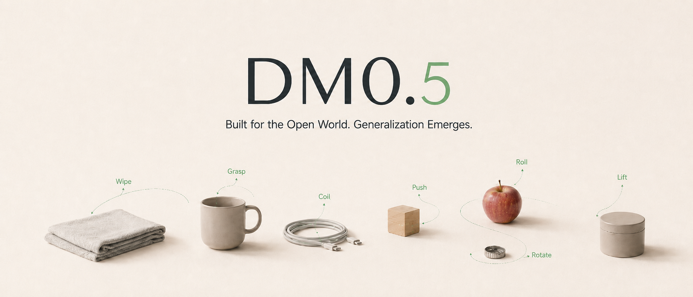
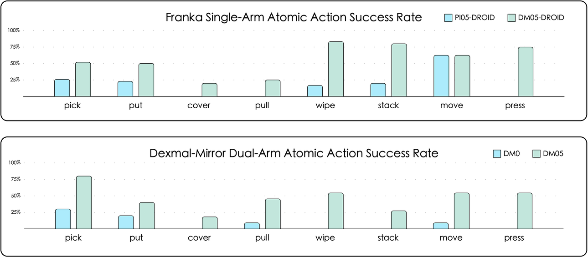
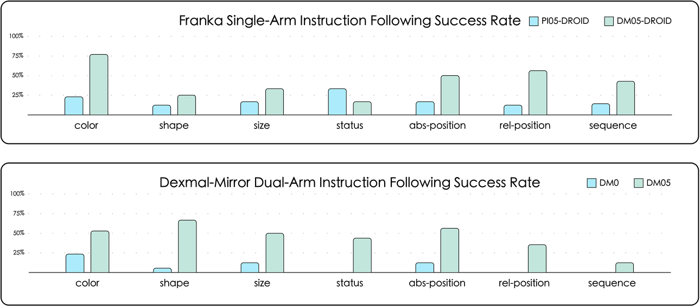
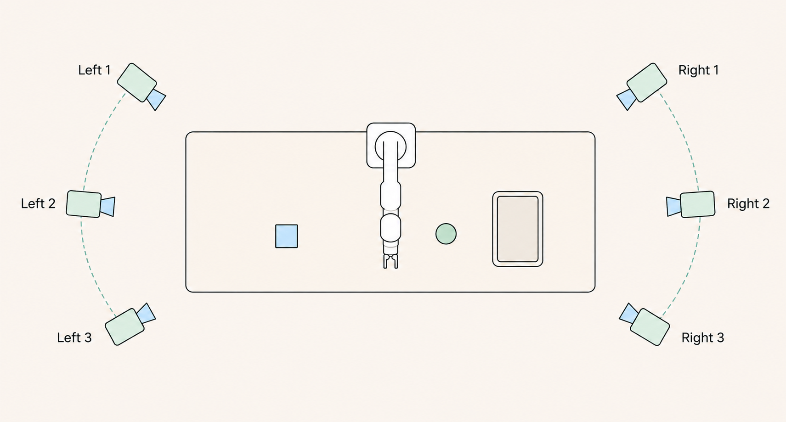

# DM0.5: An Open-World Foundation Model for General-Purpose Embodied Intelligence (Dexmal 原力灵机)

## 核心信息

- **标题**: DM0.5: An Open-World Foundation Model for General-Purpose Embodied Intelligence
- **标题翻译**: DM0.5：面向通用具身智能的开放世界基座模型
- **机构 / 研发团队**: Dexmal (原力灵机) 具身智能基础模型团队
- **发表时间**: 2026 年 3 月 (承接 2026 年 2 月发布的初代基座模型 DM0)
- **载体类型**: 工业级通用具身基座大模型官方技术报告 / 白皮书
- **官方渠道与平台**:
  - 官方主页: [www.dexmal.com](https://www.dexmal.com)
  - 开源社区入口: GitHub、Hugging Face、ModelScope
- **核心模型架构**:
  - **参数量分工**: 4B 参数视觉—语言主干网络 (Vision-Language Model, VLM) + 680M 参数流匹配动作生成专家 (Action Expert)，整体规模约 4.7B
  - **动作表征机制**: 基于连续流匹配 (Flow Matching / Diffusion Formulation)，通过 10 步流采样去噪生成长度为 50 步的连续动作块 (Action Chunk)
  - **推理执行效率**: 在单张消费级 GPU (NVIDIA RTX 4090) 上闭环控制频率达到 10 Hz；在单张数据中心 GPU (NVIDIA H100) 上达到 20 Hz
- **核心方法创新**:
  - **上下文抽象层 (Context Abstraction Layer)**: 突破传统 VLA 模型的单帧马尔可夫短视限制，支持长达 60 秒 (1 分钟) 历史时序视窗的时空降采样与 KV Cache 压缩融合，具备长短时程记忆能力与无历史时优雅退化机制。
  - **具身思维链推理任务 (Embodiment CoT Tasks)**: 引入 11 类自回归多任务具身认知监督，涵盖任务规划 (Task Planning)、环境与事件演化预测 (Event and Environment Prediction)、动作意图摘要 (Action Generation)，使模型在输出连续动作前先建立物理因果理解。
  - **轨迹对齐层 (Trajectory Alignment Layer)**: 针对遥操作采集过程中示教者节奏不一致与时序相位抖动，设计基于动态规划 (Dynamic Programming, DP) 的单调轨迹匹配机制与相邻锚点连续性约束，从根本上消解配速噪声。
  - **工业级五阶段数据清洗流水线**: 覆盖物理异常越界与抖动剔除、静态长闲置帧过滤、低价值与模糊意图轨迹剔除、关节冗余等效映射去重，以及跨模态自动化一致性重标注。
- **训练体系与多源数据规模**:
  - 异构机器人实机操作数据: 涵盖 AgileX ALOHA、Galaxea R1 Lite、AgiBot G1、Franka Emika Panda、UR5、ARX5 以及 Dexmal 自研双臂移动操作机器人 (Dexmal-Mirror) 等多种异构形态。
  - 开放环境具身导航数据: 融合大规模开源视觉—语言导航 (VLN) 及 3D 重建场景采集导航轨迹。
  - 第一人称人手操作数据: 覆盖工业日常制造环境下的真实人手—物体交互、工具使用与原子操作。
  - 通用多模态图文与视频合成数据: 大规模互联网图文、视频动态及自研合成数据生成流线。
- **评测基准与主要表现**:
  - **开放世界实机零样本泛化**: 跨 8 大原子操作 (pick, put, move, pull, cover, wipe, stack, press) 与 7 大类语义约束 (color, shape, size, status, sequence, relative position, absolute position)，在 Franka 单臂平台与 Dexmal-Mirror 双臂平台上均显著超越 Pi0.5-Droid 与 DM0。
  - **真机桌面多任务综合挑战赛**: 在 RoboChallenge Table30 v2 上取得 SOTA 表现，总体成功率达 43%，综合评分为 54.42。
  - **仿真桌面基准**: LIBERO 四项子任务平均成功率达 99.0% (SOTA)；RoboTwin 2.0 双臂仿真基准在 Clean 与 Randomized 环境下平均成功率达 93.5% (SOTA)。
  - **具身导航基准**: R2R Val-Unseen (SR 59.7%, SPL 48.6%, NE 4.8m) 与 RxR Val-Unseen (SR 65.5%, SPL 51.0%, nDTW 64.2%, NE 4.8m) 均取得第一。
  - **策略鲁棒性**: 在 Franka 平台 9 种非固定相机视角扰动测试中维持 88.9% 的平均成功率；在人手主动挪移容器与目标的强外力干预下具备动态在线重规划与任务延续能力。

## 原文摘要翻译

在过去的两年里，视觉—语言—动作 (Vision-Language-Action, VLA) 模型推动机器人学迈向了感知、语言与动作的统一步伐。机器人不再受限于执行固定脚本程序，而是开始能够理解自然语言指令、识别开放世界场景中的多样化物体，并将高层视觉语义直接转化为可执行的控制信号。

2026 年 2 月，我们发布了从零构建的首个原生具身基座模型 DM0。DM0 在受控实验环境中成功学习了大量复杂的操作任务，让我们初步见证了该范式在适配数据、有效优化和可靠评测结合时所展现出的巨大潜力。

然而，真实的物理世界对机器人的要求，远不止于展示一段令人惊艳的演示视频 (demo)。一个真正面向通用目的的具身基座模型，决不能仅仅局限于在固定场景中执行预先定义好的任务。它必须深刻理解任务指令，推断出“为什么下一步需要采取该动作”，并且能够在不同的相机机位视角、物体状态分布、未见物理环境、异构机器人本体形态以及外部动态扰动下保持稳定可靠的执行。同时，它还必须能够在极少量的下游微调数据上迅速适配全新的现实任务。

这正是我们研发 DM0.5 的核心动机：**走出受控实验室，迈向真实的开放世界 (moving beyond the lab and toward the open world)**。

DM0.5 的核心跃升体现在五个关键维度：
1. **大幅提升的零样本泛化能力 (Improved zero-shot generalization)**：将 VLA 模型的零样本能力拓展至未见过的真实开放环境，仅凭自然语言用户指令即可直接完成各类机器人操作任务。
2. **高效且可靠的下游微调 (Efficient and reliable fine-tuning)**：更强大的基座孕育更强大的下游专家策略，DM0.5 显著提升了特定任务的微调收敛质量，同时大幅降低了适配所需的样本量与计算开销。
3. **更长跨度的历史时序上下文建模 (Longer historical context modeling)**：模型架构原生支持从长时序历史观测中学习，能够有效融合长达 60 秒的任务交互历史记忆。
4. **更稳健抗扰的策略行为 (More robust policy behavior)**：在光照骤变、相机视角大幅偏转以及人类主动强外力干扰下，展现出高韧性的动态自适应行为。
5. **多机器人本体协同支持 (Multi-embodiment support)**：通过多机器人、多任务的大规模联合训练，使 DM0.5 能够通过极低成本的后训练平滑迁移至预训练阶段完全未见过的全新硬件本体。

## 创新点

1. **时空上下文抽象层 (Context Abstraction Layer)：击碎单帧马尔可夫短视假定。** 现有 VLA 大多将控制问题硬性简化为“当前图像 $\rightarrow$ 当前动作”的马尔可夫决策，一旦关键物体被遮挡、移出视野或依赖初期示教规则，策略便瞬间失效。DM0.5 设计了多时隙时空降采样与视觉 token 压缩机制，将长达 60 秒的交互历史编码并常驻于 VLM 的 KV Cache 中。更关键的是，通过引入长度随机化与历史增强训练，使模型既能利用长程记忆追踪状态演变，又能在历史缺失时优雅退化为纯观测驱动策略，彻底解决了历史依赖与泛化鲁棒性的矛盾。
2. **11 类具身思维链 (Embodiment CoT) 联合预训练：从黑盒映射走向因果认知。** 传统机器人模仿学习仅对连续动作向量施加回归或流匹配损失，导致策略对环境变化的因果机理毫无表征能力。DM0.5 创新性地引入 11 项自回归约束任务，迫使模型在预测动作的同时，显式回答任务阶段判断、前后步骤依赖、关键事件发生预测以及动作语义意图等问题。这种设计将海量操作数据转变为多模态具身推理燃料，使模型在输出低层物理轨迹前，高层先确立“世界当前在哪一步、因何而动、走向何方”的深层理解。
3. **基于动态规划的单调轨迹对齐 (Trajectory Alignment Layer)：消解遥操作节奏与相位噪声。** 人类遥操作采集的轨迹天然充满配速波动与生理抖动，若在固定时间戳上强行对齐动作监督，模型极易过拟合遥操作员的迟滞习惯。DM0.5 提出基于动态规划 (DP) 的轨迹进度单调匹配算法，让模型预测的固定长度未来动作块在真值轨迹上弹性寻找最优动作锚点，并附加相邻锚点间的轨迹连续性解释惩罚。这一机制过滤了时间相位噪声，使模型聚焦于抓取、接触、对齐、释放等物理关键跃变，学习到极其平滑健壮的动作速度场。
4. **4B VLM + 680M Action Expert 的非对称解耦与双学习率优化。** 具身策略常面临高层语义表征与低层高频控制的优化冲突。DM0.5 采用 4B VLM 负责多模态长程语义推理、680M 独立流匹配 Action Expert 负责连续动作生成的非对称架构，并在训练中设置双学习率组：对 VLM 采用较小学习率以固化通用多模态开词表理解并防止灾难性遗忘，对 Action Expert 采用较大学习率加速物理动作分布拟合。在推理端仅需 10 步流匹配采样即可输出 50 步动作块，在 RTX 4090 上实现 10 Hz 实时闭环。
5. **面向物理真实的五阶段工业级数据净化管线。** 与学术界直接拼接开源数据集的做法不同，DM0.5 构建了严谨的数据治理体系：剔除物理越界与动静不匹配样本、清除长时间无效静止帧、过滤模糊探索与低价值动作、消除 ALOHA 等多解机械臂的关节冗余等效映射，并通过跨模态一致性校验自动修正子任务标注错误，为大模型预训练筑牢了高信噪比数据底座。

## 一句话总结

DM0.5 的核心突破在于不再把具身控制退化为单帧图像到动作的黑盒回归，而是通过 60 秒时空上下文抽象、11 类具身思维链多任务推理与单调动态轨迹对齐，将高层语义演化与低层物理控制在时间跨度与速度场维度实现解耦与重构，从而首次在跨形态、跨视角的非受限开放世界中展现出系统性的零样本泛化能力。


*图 1：DM0.5 面向开放世界真实场景的多机型部署与多样化操作原语 (Wipe, Grasp, Push, Coil, Roll, Lift, Rotate 等) 概览。*

图 1 直观展现了 DM0.5 的设计野心：它摆脱了过往模型仅在单一机械臂、固定光照和预设桌面上的抓放玩具场景，将策略直接泛化至桌面整理、跨容器约束放置、多目标受限抓取、长程多步堆叠与高精度对准等复杂开放任务中，奠定了工业级具身大模型的通用基座形态。

## 研究问题

### 受控实验室策略走向开放世界的内在冲突

近两年来，以 RT-2、OpenVLA、Octo、$\pi_0$ 为代表的视觉—语言—动作模型极大地拉近了多模态大语言模型与机器人控制的距离。然而，绝大多数学术原型和初级商业演示均运行于严格受控的实验室环境：相机机位经过毫米级外参标定、桌面背景与光照恒定、操作物体局限于特定白底托盘、任务严格限定在几十种预先录制好的原子技能内。

一旦将这类模型直接置于未见过的真实家庭、办公或工业开放环境，其表现往往发生灾难性崩塌。Dexmal 团队在 DM0 的研发实践中深刻认识到，导致策略在开放世界中失败的根本原因，并非单纯是“模型参数不够大”或“示教数据不够多”，而是底层架构与监督目标中存在着四大致命假设错位：

1. **单帧马尔可夫短视假定与现实非马尔可夫物理环境的错位**：
   标准 VLA 策略在每个控制周期 $t$ 仅接收单张当前图像 $I_t$ 和机械臂当前本体状态 $s_t$：
   $$a_t \sim \pi(a_t \mid I_t, s_t, l)$$
   这种马尔可夫假设在高度受控的即时抓取中尚可运转，但在真实的开放世界操作中天然不成立。例如：在“拿开杯子擦拭桌面并放回原位”任务中，当机械臂移开杯子并正在擦桌时，杯子的原始位姿已从当前视野中完全消失；在“根据人类在任务开端的短暂示范摆放电池”任务中，环境约束仅在数十秒前的历史中出现过一次；在长程清扫任务中，策略需要确切知晓哪些区域已经完成作业、工具是否曾被使用。若缺乏长时程记忆机制，纯反应式策略必然陷入阶段混淆、动作死循环或无法恢复初始状态。

2. **遥操作示教节奏波动与刚性时序回归的错位**：
   在真实机器人数据的采集过程中，人类遥操作员的动作节奏存在极其剧烈的个体差异和时间抖动。即便同一操作员在同一任务中，每次在接近物体前的悬停减速、接触时的犹豫停顿、以及释放后的归位速度均完全不同。如果模型被强制要求在绝对时间戳 $t+1, t+2, \ldots$ 上完美拟合真值轨迹中的动作数值，模型所学到的本质上是示教者的生理节律与无序抖动，而无法提炼出真正的任务动力学结构。这直接导致学习出的动作速度场异常敏感且充满高频噪声。

3. **连续动作回归目标与高层物理常识认知的脱节**：
   让模型直接拟合关节角或末端位姿的变化量，本质上是将一个认知系统降维成一个端到端拟合函数。模型在生成动作时，完全不知道当前正在进行的子任务到底是什么、环境在发生何种状态跃迁、机械臂下一步的交互意图是什么。当面临复杂的长指令（例如“将蓝色碗放进红色碗中，然后再让机械臂回到原位”）或遇到突发的物理遮挡时，纯动作模型缺乏内在的推理锚点，极易发生灾难性的意图漂移 (intention drift)。

4. **异构机器人本体动力学与跨视角感知的泛化鸿沟**：
   工业场景与服务场景中存在形态各异的机器人：单臂 7-DoF Franka、双臂移动底盘、多自由度灵巧手、高刚度工业臂 UR5 等。不同平台之间的运动学结构、控制模式（关节角 vs 末端笛卡尔）、相机安装机位（手腕单目、第三人称双目、广角俯拍）迥然不同。如何构建统一的表征基座，使预训练形成的具身物理先验能够零样本或低成本微调迁移至未见硬件与未见视角，是通用具身智能落地的核心瓶颈。

## 数据与任务定义 (Data composition, open-world manipulation & navigation, RoboChallenge Table30 v2)

### 数据构成体系 (Data Composition)

DM0.5 的预训练数据跳出了传统机器人领域单一数据集的窄门，构建了涵盖操作、导航、人手、图文视频的四维异构混合数据金字塔：

```text
DM0.5 预训练数据金字塔:
├── 1. 机器人实机操作数据 (Robotic Manipulation Data)
│   ├── 多硬件本体: AgileX ALOHA, Galaxea R1 Lite, AgiBot G1
│   ├── 工业与科研平台: Franka Emika Panda, UR5, ARX5
│   └── 移动操作平台: Dexmal 自研双臂移动底盘机器人 (Dexmal-Mirror)
├── 2. 具身导航数据 (Embodied Navigation Data)
│   ├── 开源视觉—语言导航 (VLN) 及开放词表导航数据
│   └── 3D 高精度数字化重建场景自主导航轨迹
├── 3. 第一人称人手操作数据 (First-Person Human Manipulation Data)
│   ├── 日常与工业生产一线真实 Egocentric 视频
│   └── 人手—物体细粒度交互、工具使用与原子接触序列
└── 4. 通用多模态图文与视频 (General Multimodal Vision-Language Data)
    ├── 大规模开源图文与视频动态表征
    └── Dexmal 自动化合成数据流线 (物理动力学与阶段语义标注)
```

1. **机器人实机操作数据 (Robotic Manipulation Data)**:
   汇聚了包括 AgileX ALOHA、Galaxea R1 Lite、AgiBot G1、Franka Emika Panda、UR5、ARX5 以及 Dexmal 自研双臂移动操作机器人等多种平台的实机交互日志。涵盖单臂、双臂、移动底盘、不同自由度末端夹爪的多样化控制序列，为模型注入丰富的物理接触与控制动力学先验。
2. **具身导航数据 (Embodied Navigation Data)**:
   包含大规模开源视觉—语言导航 (VLN) 及开放词表路径规划数据集，并融合了团队在数十个 3D 高精数字化重建场景中自主采集的大量长程导航轨迹，用以赋予模型空间感知、大尺度拓扑推理与跨房间寻路能力。
3. **第一人称人手操作数据 (First-Person Human Manipulation Data)**:
   采自真实日常与工业生产一线，记录第一人称视角下人类双手操作工具、装配零部件、受限空间精细拨动等复杂交互过程。提供了极其密集且细粒度的物理因果与操作意图示范，有效弥补了真机示教数据在精细交互上的不足。
4. **通用多模态图文与视频数据 (General Multimodal Vision-Language Data)**:
   引入海量互联网图文图解、视频时序数据，并辅以内部自动化合成数据生成流水线，专门扩充物理场景演化与任务阶段标注，用于保护 4B VLM 主干的开词表理解与常识推理底座不被机器人低层控制数据冲蚀。

### 工业级五阶段数据清洗流水线 (Data Cleaning Strategy)

真实机器人采集中充斥着传感器丢包、通信延迟、操作员误操作等严重噪声。DM0.5 建立了五级过滤与重塑流水线：

| 清洗阶段 | 针对的严重噪声缺陷 | 采取的工程与算法解决方案 | 带来的策略质变效益 |
|---|---|---|---|
| **1. 物理越界与动静态过滤 (Outlier Removal)** | ROS 记录时出现的关节跳变、不可达数值、相机剧烈抖动但关节数据静止的硬软件不同步异常 | 结合机械臂正逆运动学范围进行硬阈值过滤；运行跨模态光流与本体运动一致性检测，剔除图像有动量但控制量为零的脏数据 | 消除虚假动作冲击，保证流匹配动作梯度的数值稳定性 |
| **2. 无效静止帧剔除 (Static-Frame Removal)** | 示教过程中机器人长时间悬停、等待、等待下一指令的静止无信息帧 | 检测末端线速度、角速度与视觉光流变化，剪切剔除超过特定时间窗口且无物理状态改变的长平直序列 | 防止策略陷入盲目悬停偏置，极大提升实机推理时的动作响应速度 |
| **3. 低价值与意图模糊切除 (Low-Value Removal)** | 示教失败、半途放弃、偏离目标的无意义探索和无效扰动轨迹 | 结合子任务目标对轨迹做端到端成功判定，剔除无法支撑因果推理的负面示范 | 显著收敛策略行为分布，提升开放世界复杂任务的执行成功率 |
| **4. 关节等效模式去重 (Deduplication)** | ALOHA 等高冗余机械臂存在多种关节角组合对应完全相同末端位姿的动力学“伪多模”问题 | 构建统一的运动学逆解标准空间，对冗余解聚类去重，仅保留规范化的统一关节映射路径 | 消除模型在面对同一空间轨迹时的多峰碰撞与关节震颤，提升末端控制平滑度 |
| **5. 跨模态自动重标注 (Automated Relabeling)** | 原始海量数据集中由于人工批注粗糙导致的任务描述不准、时间戳边界错位问题 | 训练跨模态时空对齐检验模型，自动对动作序列的起始、阶段转换和终止边界进行精确细分与指令重标注 | 盘活存量脏数据，使具身 CoT 获得高质量的阶段与事件监督信号 |

### 开放世界任务与条件定义 (Open-World Manipulation & Navigation)

为系统性量化策略在开放世界中的泛化边界，DM0.5 将具身操作严格正交解耦为 **8 类原子操作维度** 与 **7 类条件约束维度** 的笛卡尔乘积评估矩阵：

$$
\mathcal{T}_{\text{eval}} = \mathcal{A}_{\text{atomic}} \times \mathcal{C}_{\text{semantic}}
$$

- **8 大原子动作空间 ($\mathcal{A}_{\text{atomic}}$)**:
  1. `pick` (拾取): 接触并提升未见物体
  2. `put` (放置): 稳定平放于指定平面或容器
  3. `move` (平移/搬运): 保持夹持状态跨空间位移
  4. `pull` (拉动): 克服摩擦力向内牵引目标（如拉开抽屉、拉动把手）
  5. `cover` (盖上): 空间对准并覆盖目标表面（如盖上锅盖、扣上盒子）
  6. `wipe` (擦拭): 保持末端压力沿目标平面连续往复运动
  7. `stack` (堆叠): 高精度对准并在受限接触面上稳定放置
  8. `press` (按压): 向指定区域施加向下的瞬时或持续垂直压力（如按开关、打卡）
- **7 大语义条件约束空间 ($\mathcal{C}_{\text{semantic}}$)**:
  1. `color` (颜色属性): 如“红色的积木”、“蓝色的抹布”
  2. `shape` (几何形状): 如“圆柱体容器”、“星形工件”
  3. `size` (相对尺寸): 如“较大的勺子”、“最小的螺栓”
  4. `status` (物理状态): 如“倒下的水杯”、“打开的盒子”
  5. `abs-position` (绝对空间位置): 如“桌子左上角”、“靠近边缘的区域”
  6. `rel-position` (相对空间拓扑): 如“在盘子右侧”、“在杯子与水壶之间”
  7. `sequence` (复杂时序多步): 如“先移开书本，再拾取钥匙，最后归位”

### RoboChallenge Table30 v2 任务体系

作为评估真实机器人桌面操作的权威基准，Table30 v2 包含了 30 项对长时程记忆、空间几何推理和双臂协调提出极高要求的工业级与服务级复合任务。基准重点涵盖：
- **目标状态时序记忆 (Long-term state memory)**: 盖章定位、按钮连续触发等依赖早期历史记忆的任务；
- **多步时序级联 (Multi-step sequential execution)**: 跨容器转移、复杂餐具整理；
- **视觉目标精准对齐 (Visual grounding & precision)**: 插花任务 (Flower arrangement)、插销插入等毫米级容差装配；
- **双臂力学平衡协调 (Bimanual coordination)**: 双手稳定端起并搬运盛有重物的托盘 (carrying a tray with both hands)，必须维持双末端相对位姿的绝对刚性以防倾翻。

## 方法主线

### 机制流程

DM0.5 采用非对称双流架构，整个前向控制回路按照“时空上下文抽取 $\rightarrow$ 具身认知与阶段推理 $\rightarrow$ 连续动作流生成 $\rightarrow$ 轨迹动态单调对齐”四个核心环节层层递进：

```text
控制回路前向流:
[输入观测: 当前帧 I_t + 状态 s_t + 指令 l + 历史帧 {I_{t-τ}}] 
   │
   ▼
[Context Abstraction Layer: 多时隙时空降采样 + Token 压缩 + KV Cache]
   │
   ▼
[4B VLM Backbone: 11 类 Embodiment CoT 多任务推理 (规划/事件/动作意图)]
   │
   ▼ 高维具身语义特征表征
[680M Action Expert: Flow Matching 10 步欧拉/中点采样积分]
   │
   ▼
[输出: 50 步连续动作块 A_t = [a_t, ..., a_{t+49}]]
   │
   ├── (推理部署): 发送至底层机器人控制器 (10Hz / 20Hz 实时闭环)
   └── (训练阶段): 进入 Trajectory Alignment Layer 与真值轨迹动态规划对齐
```


*图 2：DM0.5 总体技术架构概览，清晰展现 4B VLM 主干、Context Abstraction 机制、Embodiment CoT 三大多任务分支、680M Action Expert 流匹配去噪器以及 Trajectory Alignment 轨迹动态对齐过程。*

### Context Abstraction Layer (Historical context fusion up to 60s)

传统反应式策略将时序信息完全交由外部循环或简单的 1–2 帧简单 Concat 处理，既无法承载长程历史，又极大增加了视觉 Encoder 的重复计算。DM0.5 设计了专门的 **上下文抽象层 (Context Abstraction Layer)**：

1. **时空分级采样与 Token 压缩**:
   在当前时间步 $t$，系统从过去最长 60 秒的交互缓冲池中采样若干关键历史时隙 $\{t - 	au_k\}_{k=1}^K$。每个历史时隙的画面并不全分辨率送入，而是经过空间网格池化与时序特征聚类，压缩为固定长度的紧凑视觉 Token。
2. **KV Cache 高效缓存复用**:
   压缩后的历史 Token 送入 4B VLM 后，其对应的 Key-Value 表征被直接持久化存储在 KV Cache 中。在后续动作块的连续推演过程中，历史上下文无需重新计算，每个控制步仅需计算当前帧 $I_t$ 的增量 Token，从而在兼顾 60 秒宏观历史的同时，将单步计算延迟压降至毫秒级。
3. **长度随机化与优雅退化 (Graceful Fallback)**:
   在预训练阶段，团队对历史视窗长度施加严格的随机化采样（包含超长 60s 历史、中短程历史以及完全无历史的零观测窗口），并引入特征丢弃等数据增强手段。这一策略从根本上避免了模型对历史输入的“病态过拟合”，使策略在历史数据由于传感器丢包而发生部分损坏或完全缺失时，能够极其自然地平滑退化为当前观测驱动的纯反应式策略，杜绝了历史断流引发的失控崩溃。

### Embodiment CoT Tasks (Multi-task embodied reasoning & pretraining)

为了让大模型在输出连续动作前先建立完整的具身因果心智世界，DM0.5 在 4B VLM 主干上设计了 **11 类自回归多任务具身思维链 (Embodiment CoT)**，覆盖三大核心维度：

1. **任务规划分支 (Task Planning)**:
   - *当前阶段识别*: 判别机器人当前处于哪一原子技能状态（例如：正在接近、正在抓取、正在提升或正在装配）；
   - *前后依赖推理*: 判断当前动作依赖的前置条件是否已被物理满足（例如：抽屉把手是否已被握紧）；
   - *宏观进度评估*: 估算整个复合长任务的完成百分比以及后续剩余的子步骤列表。
2. **环境与事件预测分支 (Event and Environment Prediction)**:
   - *状态转移判定*: 判定夹爪与物体表面是否已产生稳定受力接触；
   - *任务阶段边界*: 判断当前子动作是否已达成终止条件（如液体是否倒满、门是否已推紧）；
   - *未来事件预判*: 预测执行下一步动作后，目标物体的位姿、遮挡关系及光照反射可能发生的变化。
3. **动作语义意图分支 (Action Generation)**:
   - *末端空间意图 (EE Prediction)*: 粗粒度预测未来末端执行器的空间朝向与位姿速度向量；
   - *动作语义摘要*: 生成动作的高层动词语义描述（如 homing 复位、aligning 对齐、inserting 插入）；
   - *物理约束确认*: 确认即将下发的动作块是否符合工作空间边界与防碰撞约束。

这种多任务联合训练改变了机器人学习的监督范式：模型不仅仅学习给定图像输出什么样的关节角速度，更在自回归文本流中深入理解“为什么当前需要执行此动作”、“该动作完成后环境将产生何种可观测变化”。由此，高层语义规划与低层动作连续性得以在同一大模型内深度交融。

### Trajectory Alignment Layer (Dynamic action matching across heterogeneous embodiments)

这是 DM0.5 针对真实世界示教数据痛点提出的一项极具开创性的算法贡献。

#### 核心数学推导与动态规划建图

设在当前步 $t$，680M Action Expert 输出一段固定长度为 $H$（如 $H=50$）的预测动作块：
$$
\hat A = [\hat a_1, \hat a_2, \ldots, \hat a_H], \quad \hat a_i \in \mathbb{R}^D
$$
对应数据集中由不同操作员采集的地面真值轨迹段往往具有非均匀的时间配速，长度为 $T^*$（通常 $T^* \ge H$）：
$$
A^* = [a^*_1, a^*_2, \ldots, a^*_{T^*}], \quad a^*_j \in \mathbb{R}^D
$$
若采用传统的逐时间戳 $L_2$ 损失 $\sum_{i=1}^H \|\hat a_i - a^*_i\|^2$，一旦示教者中途稍有迟疑，后续所有动作的监督信号均会发生相位错位。

DM0.5 引入轨迹对齐层，定义一个从预测索引 $i \in \{1, \ldots, H\}$ 到真值索引 $j \in \{1, \ldots, T^*\}$ 的对齐映射函数 $m(i)$。该映射必须严格服从 **单调递增约束** 以防止时间倒流：
$$
m(1) \le m(2) \le \ldots \le m(H)
$$
定义候选对齐代价包含单点动作匹配误差与相邻锚点间的轨迹连续性解释惩罚：
$$
\mathcal{L}_{\text{match}}(\hat A, A^*, m) = \sum_{i=1}^H \mathcal{D}(\hat a_i, a^*_{m(i)}) + \lambda \sum_{i=1}^{H-1} \mathcal{R}\left(a^*_{m(i):m(i+1)}, \hat a_{i:i+1}\right)
$$
其中 $\mathcal{D}(\cdot, \cdot)$ 为平滑 Huber 损失或 $L_2$ 范数距离，$\mathcal{R}(\cdot)$ 为连续性正则项，惩罚真值轨迹在 $m(i)$ 到 $m(i+1)$ 之间发生的未被预测动作解释的剧烈几何偏离（防止匹配算法为寻找局部极小值而恶意跳过关键操作阶段，如跳过实际接触动作）。

最优对齐路径 $m^*$ 通过动态规划 (DP) 在 $O(H \cdot T^*)$ 复杂度内精确求解：
$$
m^* = \arg\min_{m} \mathcal{L}_{\text{match}}(\hat A, A^*, m)
$$
最终反向传播的对齐损失即为：
$$
\mathcal{L}_{\text{align}} = \mathcal{L}_{\text{match}}(\hat A, A^*, m^*)
$$

#### 物理机理效益
通过单调动态对齐，模型彻底挣脱了示教者生理配速的桎梏。对于同一个“擦桌”动作，无论示教者是用 3 秒还是用 6 秒完成，模型拟合的均是轨迹上的几何物理演化实质（桌面接触点转移与平滑速度场），而非僵死的时间戳。这极大抑制了多示教者数据混合时的多峰方差，使学习出的速度场具备前所未有的连续性与跨人泛化力。

### 训练与推理架构

#### 双学习率组与分布式优化
- **双学习率编排**: 4B VLM 主干采用较小的学习率 $\eta_{\text{VLM}}$（如 $1 \times 10^{-5}$），避免海量低层动作数据对高层通用视觉常识造成灾难性破坏；680M Action Expert 采用较大学习率 $\eta_{\text{Action}}$（如 $1 \times 10^{-4}$），促使连续流匹配层迅速对齐机器人动力学流形。
- **混合精度与并行加速**: 采用分布式 FSDP / DeepSpeed 框架，针对多视角、高分辨率历史 Token 优化内存排布，保证训练的高吞吐。

#### 实时流匹配动作块推理 (Action Chunking at 10Hz/20Hz)
- **去噪步数剪枝**: 在推理阶段，Action Expert 并不需要完整展开 100 步扩散迭代，而是基于 Flow Matching 的最优传输直线性，仅通过 10 步欧拉/中点采样积分，即可高质量生成 50 步连续动作。
- **实机吞吐**: 在配置单张 RTX 4090 的移动机器人车载工控机上，系统端到端执行频率达到 10 Hz；在机房 H100 环境下达到 20 Hz，完美兼顾了高层语义重思考与低层高频闭环执行的时延需求。

## 关键结果

### 零样本泛化主结果 (Zero-shot generalization across open-world environments)

DM0.5 在未见过的开放世界环境中开展了大规模的零样本实机评测，涵盖 Franka 单臂平台（对比当前开源顶尖的 $\pi_{0.5}\text{-Droid}$）与 Dexmal-Mirror 自研双臂平台（对比上一代基座 DM0）。


*图 3：DM0.5 在 Franka 单臂平台 (上图: $\pi_{0.5}\text{-Droid}$ vs DM0.5-Droid) 与 Dexmal-Mirror 双臂平台 (下图: DM0 vs DM0.5) 上的 8 大原子动作零样本成功率对比。*


*图 4：DM0.5 在 Franka 单臂平台与 Dexmal-Mirror 双臂平台上的 7 大类语义约束指令遵循成功率对比。*

#### 表 1：开放世界 8 大原子动作零样本成功率量化对比 (Zero-Shot Atomic Actions)

| 评测平台 / 对比基线 | pick (拾取) | put (放置) | cover (盖上) | pull (拉动) | wipe (擦拭) | stack (堆叠) | move (移动) | press (按压) | 平均成功率 |
|---|---|---|---|---|---|---|---|---|---|
| **Franka 单臂: $\pi_{0.5}\text{-Droid}$** | 25.5% | 22.8% | 0.0% | 0.0% | 16.6% | 19.3% | 62.1% | 0.0% | 18.3% |
| **Franka 单臂: DM0.5-Droid (Ours)** | **51.7%** | **49.7%** | **19.3%** | **24.8%** | **82.8%** | **79.3%** | **62.1%** | **74.5%** | **55.5%** |
| *绝对提升幅度 ($\Delta$)* | *+26.2%* | *+26.9%* | *+19.3%* | *+24.8%* | *+66.2%* | *+60.0%* | *+0.0%* | *+74.5%* | *+37.2%* |
| **Dexmal-Mirror 双臂: DM0** | 29.7% | 19.3% | 0.0% | 9.0% | 0.0% | 0.0% | 9.0% | 0.0% | 8.4% |
| **Dexmal-Mirror 双臂: DM0.5 (Ours)** | **79.3%** | **39.3%** | **17.9%** | **44.8%** | **53.8%** | **26.9%** | **53.8%** | **53.8%** | **46.2%** |
| *绝对提升幅度 ($\Delta$)* | *+49.6%* | *+20.0%* | *+17.9%* | *+35.8%* | *+53.8%* | *+26.9%* | *+44.8%* | *+53.8%* | *+37.8%* |

#### 表 2：开放世界 7 大语义条件约束指令遵循成功率量化对比 (Zero-Shot Instruction Constraints)

| 评测平台 / 对比基线 | color (颜色) | shape (形状) | size (尺寸) | status (状态) | abs-pos (绝对位置) | rel-position (相对位置) | sequence (多步时序) | 平均成功率 |
|---|---|---|---|---|---|---|---|---|
| **Franka 单臂: $\pi_{0.5}\text{-Droid}$** | 22.8% | 11.7% | 16.6% | 33.1% | 16.6% | 11.7% | 13.8% | 18.0% |
| **Franka 单臂: DM0.5-Droid (Ours)** | **76.6%** | **24.8%** | **33.1%** | 16.6% | **49.7%** | **55.9%** | **42.1%** | **42.7%** |
| *绝对提升幅度 ($\Delta$)* | *+53.8%* | *+13.1%* | *+16.5%* | *-16.5%* | *+33.1%* | *+44.2%* | *+28.3%* | *+24.7%* |
| **Dexmal-Mirror 双臂: DM0** | 22.8% | 4.8% | 11.7% | 0.0% | 11.7% | 0.0% | 0.0% | 7.3% |
| **Dexmal-Mirror 双臂: DM0.5 (Ours)** | **52.4%** | **66.2%** | **49.7%** | **43.4%** | **55.9%** | **35.2%** | **11.7%** | **44.9%** |
| *绝对提升幅度 ($\Delta$)* | *+29.6%* | *+61.4%* | *+38.0%* | *+43.4%* | *+44.2%* | *+35.2%* | *+11.7%* | *+37.6%* |

**核心结果洞察**:
1. **原子动作全面碾压**: 在 Franka 单臂测试中，DM0.5 在擦拭 (`wipe`, 82.8% vs 16.6%)、堆叠 (`stack`, 79.3% vs 19.3%) 和按压 (`press`, 74.5% vs 0.0%) 上建立了压倒性优势。在上一代模型或 $\pi_{0.5}$ 几乎完全无法执行的零样本长接触操作中，DM0.5 凭借平滑的速度场展现出极高的物理接触稳定性。
2. **复杂语义理解质变**: 在颜色、绝对位置、相对位置与多步序列约束下，DM0.5 均大幅领先。特别是在双臂相对位置关系与复杂形状识别上，DM0.5 成功率达 66.2%（对比 DM0 的 4.8%），证明其 4B VLM 注入的高层空间几何推理有效映射到了低层动作执行中。

### 下游微调与基准评测 (RoboChallenge Table30 v2, simulation benchmarks)

#### 1. 真机综合基准: RoboChallenge Table30 v2
DM0.5 在包含 30 项严苛桌面复杂操作的实机挑战赛 Table30 v2 上创下全新标杆：
- **总体成功率 (Success Rate)**: **43.0%**
- **综合评测分数 (Comprehensive Score)**: **54.42**
- **代表性高难度任务解析**:
  - *长时程记忆盖章与按键*: 模型通过 60 秒历史上下文准确定位数分钟前隐蔽的初始目标位姿，完全避免了单帧反应式策略的“迷失”现象；
  - *双臂高协同端托盘 (Carrying a tray)*: 双臂保持精准的相对姿态刚性约束，在长距离搬运中托盘无晃动倾覆；
  - *精细插花 (Flower arrangement)*: 结合多视角高精度感知，准确完成未见花茎抓取位姿估计与毫米级狭窄瓶口插放。

#### 2. 仿真基准: LIBERO 单臂操作
在包含 Spatial、Object、Goal、Long 四大子集的权威 LIBERO 基准中，DM0.5 取得了接近上限的压倒性表现：

| 方法 | Spatial | Object | Goal | Long | Average (平均) |
|---|---|---|---|---|---|
| $\pi_0$ | 96.8 | 98.8 | 95.8 | 85.2 | 94.2 |
| $\pi_{0.5}$ | 98.8 | 98.2 | 98.0 | 92.4 | 96.9 |
| OpenVLA-OFT | 97.6 | 98.4 | 97.9 | 94.5 | 97.1 |
| GR00T N1.7 | 97.7 | 98.5 | 97.5 | 94.4 | 97.0 |
| StarVLA | 99.0 | **99.8** | 98.5 | 94.1 | 97.9 |
| ABot-M0 | 98.8 | **99.8** | 99.0 | 96.6 | 98.6 |
| Being-H0.5 | **99.2** | 99.6 | 99.4 | 97.4 | 98.9 |
| Cosmos Policy | 98.1 | **100.0** | 98.2 | **97.6** | 98.5 |
| **DM0.5 (Ours)** | **99.0** | **99.8** | **99.6** | **97.4** | **99.0** |

#### 3. 仿真基准: RoboTwin 2.0 双臂操作
在强物理交互与双臂动力学耦合的 RoboTwin 2.0 中，DM0.5 显著拉开与各类基线的差距：

| 方法 | Clean (标准环境) | Randomized (域随机化环境) | Average (综合平均) |
|---|---|---|---|
| $\pi_0$ | 65.9 | 58.4 | 62.2 |
| $\pi_{0.5}$ | 82.7 | 76.8 | 79.8 |
| Motus | 88.7 | 87.0 | 87.9 |
| LingBot-VLA | 86.5 | 85.3 | 85.9 |
| LingBot-VA | 92.9 | 91.5 | 92.2 |
| ABot-M0 | 86.1 | 85.1 | 85.6 |
| StarVLA | 88.2 | 88.3 | 88.3 |
| Being-H0.7 | 90.2 | 89.6 | 89.9 |
| Qwen-VLA | 86.1 | 87.2 | 86.7 |
| **DM0.5 (Ours)** | **93.6** | **93.3** | **93.5** |

#### 4. 具身导航基准: R2R 与 RxR
在开放词表视觉—语言导航标准测试中，DM0.5-Nav 全面领先专用导航架构：

| 模型方案 | R2R NE $\downarrow$ | R2R OS $\uparrow$ | R2R SR $\uparrow$ | R2R SPL $\uparrow$ | RxR NE $\downarrow$ | RxR SR $\uparrow$ | RxR SPL $\uparrow$ | RxR nDTW $\uparrow$ |
|---|---|---|---|---|---|---|---|---|
| NaVid | 5.7 | 49.2 | 41.9 | 36.5 | 5.7 | 45.7 | 38.2 | - |
| Uni-NaVid | 5.6 | 53.3 | 47.0 | 42.7 | 6.2 | 48.7 | 40.9 | - |
| NaVILA | 5.2 | 62.5 | 54.0 | 49.0 | 6.8 | 49.3 | 44.0 | 58.8 |
| StreamVLN | 5.0 | 64.2 | 56.9 | **51.9** | 6.2 | 52.9 | 46.0 | 61.9 |
| Qwen-VLA-Instruct | 5.1 | 69.0 | 57.5 | 51.2 | 5.8 | 59.6 | 47.8 | 57.1 |
| **DM0.5-Nav (Ours)** | **4.8** | **69.5** | **59.7** | 48.6 | **4.8** | **65.5** | **51.0** | **64.2** |

### 历史时序上下文增益 (Context length ablations up to 60s)

为验证最长 60 秒上下文抽象层的因果价值，团队在 Dexmal-Mirror 平台上设计了两套兼具短时程与长时程记忆特性的极端真机实验：

1. **短时程记忆: 拿开水杯 $\rightarrow$ 擦拭桌面 $\rightarrow$ 归位水杯 (Pick, Wipe, Restore)**
   - **核心难点**: 当机械臂将水杯拿走并开始擦桌后，杯子的原始位置已完全移出视野，当前帧不存在任何杯子位置标记；
   - **模型表现**: 纯反应式 baseline 在擦桌完毕后发生迷失，将水杯随意丢弃在桌面边缘；而 DM0.5 凭借 Context Abstraction 中的历史 KV Cache，准确检索出任务起始时杯子的空间坐标，以高精度将杯子原样放回初始位姿。
2. **长时程记忆: 跟随人类早期示教规则放置电池 (Demo-conditioned Placement)**
   - **核心难点**: 在长达 60 秒的交互序列开端，人类工程师先行为机器人演示特定型号电池的正负极朝向与插槽规则；随后人类离开，机器人开始自主作业；
   - **模型表现**: DM0.5 将前序示教帧编码为上下文规则先验，在后续几十秒的自主操作过程中严格保持放置规则的一致性，证明其时序抽象已具备将前序上下文转化为可执行约束的能力。

### 策略鲁棒性 (Viewpoint variation & human disturbance)

#### 1. 跨空间 9 相机视角扰动实机评测 (Camera Viewpoint Robustness)

在 Franka 单臂平台部署中，配置了 1 个安装于机械臂末端的手腕相机 (Wrist Camera)，以及 2 个在机器人左侧和右侧自由移动摆放的第三人称相机 (Left 1–3, Right 1–3)，组合形成 9 种空间视角排列矩阵：


*图 5：Franka 机械臂平台上评估视角鲁棒性的 9 个非固定第三人称相机空间机位设置 (L1–L3, R1–R3)。*

#### 表 3：9 种极端相机视角配置下的实机连续操作成功率 (Success Rate)

| 相机视角组合 | L1R1 (标准机位) | L2R1 (左抬高) | L3R1 (左极角) | L1R2 (右抬高) | L2R2 (双抬高) | L3R2 (极角抬高) | L1R3 (右极角) | L2R3 (抬高极角) | L3R3 (双极角) | 全视角平均 |
|---|---|---|---|---|---|---|---|---|---|---|
| **DM0.5 成功率 (SR)** | **100%** | **90%** | **80%** | **90%** | **90%** | **90%** | **80%** | **90%** | **90%** | **88.9%** |

**两阶段粗到精 (Coarse-to-Fine) 视觉伺服机制**:
深入分析轨迹发现，DM0.5 自发演化出了极其智能的控制分工：
- **阶段一 (全局粗定位)**: 策略利用第三人称相机提供的宏观场景全局视角，引导末端迅速向目标物体附近逼近；
- **阶段二 (局部闭环微调)**: 当进入接近与抓取阶段时，策略将注意力自适应转移到固定的末端手腕相机上。即便在 L3R1、L1R3 等极端偏转视角下第一阶段产生了数厘米的逼近偏差，手腕相机在近场闭环中能够迅速捕获接触残差并实现强力补偿，保证了全矩阵近 90% 的超高稳定性。

#### 2. 动态强人手主动干扰评测 (Human Perturbations)
在 Dexmal-Mirror 双臂实机抓放过程中，人类测试员在机械臂即将抓取或放置的瞬间，突然强行将目标物体或目标容器推移数厘米甚至倒扣旋转：
- 传统反应式策略往往直接“抓空”或向空地盲目释放，导致任务中断；
- DM0.5 在感知到视觉画面突变后，动作预测块在下一个控制步自适应转向，末端轨迹产生平滑的在途重新对齐 (in-flight dynamic replanning)，紧跟被挪移的容器完成稳定放置，展现出高度的动态闭环韧性。

## 深度分析

### 真正贡献是什么 (Industrial Foundation Model Perspective vs Academic Lab Prototypes)

在具身智能领域，学术实验室原型与工业级通用基座大模型之间存在着一条常常被忽略的巨大鸿沟：

| 维度 | 学术实验室原型 (如 OpenVLA, Octo, RT-2) | 工业级基座大模型 (如 Dexmal DM0.5, Physical Intelligence $\pi_0$) |
|---|---|---|
| **研究关注点** | 关注在受控 Benchmark (如 Bridge, DROID 干净子集) 上的单任务拟合打分 | 关注在非标开放环境中的系统性零样本泛化度、抗扰动恢复力与全任务鲁棒性 |
| **时序认知** | 普遍退化为单帧图像到动作的马尔可夫短视预测 | 原生支持最长 60s 宏观历史，通过多时隙降采样和 KV Cache 保留时空因果记忆 |
| **动作生成机制** | 自回归离散化分箱 (Tokenized) 或直接 MLP 拟合 | 连续流匹配 (Flow Matching / Diffusion Formulation)，输出高频动作块 |
| **示教噪声容忍度** | 假定数据具备完美时间戳，强行做逐帧刚性监督，对配速噪声极其脆弱 | 引入基于动态规划的单调轨迹对齐，解耦示教者生理节奏，专注学习平滑速度场 |
| **数据治理深度** | 简单清洗或无清洗直接混合多源开源数据 | 设立 5 阶段严苛物理过滤：剔除动静失谐、静止冗余、等效多解映射与自动纠错 |

DM0.5 的真正贡献，决不是简单地把一个开源 VLM 和一个 Diffusion Policy 拼装在一起，更不是在受控 Benchmark 上卷几个微小的百分点，而是**以极其严密的工程与算法体系，直面并系统性解决了具身智能走向开放世界的核心结构性矛盾**：
1. 它用 **Context Abstraction Layer** 终结了学术界对单帧马尔可夫决策的懒惰依赖；
2. 它用 **Embodiment CoT** 证明了机器人操作轨迹可以而且必须转化为高级语言因果认知推理燃料；
3. 它用 **Trajectory Alignment Layer** 为多示教者、多硬件形态的大规模混合训练铺平了速度场平滑对齐的道路。

### 为什么结果成立

DM0.5 在开放世界零样本、真机 Table30 v2 以及各类跨模态基准上的卓越表现，是由其相互咬合的四大技术支柱共同支撑的：
1. **记忆消除非马尔可夫歧义**: 60s 上下文使机器人在长程任务中永远拥有“自我定位”，无论遮挡还是多阶段切换均不会发生目标漂移；
2. **CoT 注入物理世界常识**: 11 项具身推理任务让 4B VLM 在下发动作前先确认几何与因果关系，使动作生成具备了坚实的认知锚点；
3. **DP 轨迹对齐平滑动作场**: 滤除了遥操作数据中最大宗的“速度与节奏噪声”，使流匹配 Expert 学到的是纯粹的任务动力学流形；
4. **高质量数据净化奠定高信噪比底座**: 剔除物理越界、静止帧和关节冗余解，使得预训练参数没有浪费在无意义的噪声与伪多模碰撞上。

### 容易误读的地方

1. **误读一：零样本泛化意味着所有任务都能达到 100% 成功率。**
   - *澄清*: 绝非如此。审视表 1 的真实数据可见，DM0.5 在 `cover` (盖上, 17.9%–19.3%)、`pull` (拉动, 24.8%)、`stack` (双臂堆叠, 26.9%) 等需要极其精细的力闭环与接触面约束的任务上，零样本成功率依然偏低。开放世界的零样本泛化指的是模型展现出了广泛的“动作理解与初步执行能力”，但在精密富接触场景下，依然需要针对性的下游微调。
2. **误读二：60 秒历史意味着模型实时输入了 60 秒的高帧率原始视频流。**
   - *澄清*: 没有任何边缘车载算力能够承受 60 秒 $\times$ 30 fps $\times$ 多相机的原生视频端到端编码。DM0.5 的 Context Abstraction 采用的是**关键时隙稀疏采样 + 空间降采样 + Token 压缩 + KV Cache 存储**，它保留的是宏观状态跃迁的语义记忆，而非全像素光流。
3. **误读三：动态规划轨迹对齐会极大拖慢机器人的实时推理速度。**
   - *澄清*: 这是一个严重的机制混淆。Trajectory Alignment Layer 的 DP 求解**完全发生在离线预训练与微调的 Loss 计算阶段**，其目的是规范梯度方向；在实机推理时，模型直接由当前观测与历史 Cache 输出动作块，完全不经过 DP 求解，因此丝毫不影响 10Hz/20Hz 的高频闭环。
4. **误读四：RoboChallenge Table30 v2 的成功率只有 43%，是不是说明模型还不成熟？**
   - *澄清*: 恰恰相反。Table30 v2 是当前真机评测中难度最高的综合长程基准之一，此前绝大多数策略在复杂长记忆与双臂协同任务上的得分接近于零。能在该严苛真机基准上取得 43% 成功率与 54.42 综合分，已经是当前实体具身策略的顶尖水准。

### 复现注意点

1. **计算资源与显存墙**:
   4B VLM + 680M Action Expert 虽然规模适中，但由于引入了多相机输入、60s 历史 Token 以及 11 类 CoT 自回归头，预训练时的显存开销非常可观。建议采用 ZeRO-3 / FSDP 配合激活重计算 (Activation Checkpointing)，并针对 VLM 的 KV Cache 采用 FlashAttention-2 / PagedAttention 优化。
2. **动态规划对齐的超参数调优**:
   在复现 Trajectory Alignment Layer 时，连续性正则惩罚项的权重 $\lambda$ 是核心敏感超参。若 $\lambda$ 过小，DP 倾向于只寻找局部的“易学动作”，导致机械臂在物理关键点跳步；若 $\lambda$ 过大，则退化回刚性时间戳匹配，失去消除配速噪声的意义。需针对不同任务的接触频率进行网格搜索。
3. **手腕相机的标定与同步依赖**:
   DM0.5 之所以能对抗 9 视角相机扰动，核心依赖“第三人称全局粗定位 + 手腕相机近场微调”的级联配合。复现时必须保证末端手腕相机的图像时间戳与机械臂本体状态达到毫秒级硬件同步，否则近场闭环时将引发高频震荡。

## 局限

1. **精密受力与闭环接触密集型任务仍存瓶颈**:
   在缺乏触觉、力矩传感器的纯视觉方案下，对于极其依赖法向力感知的复杂装配、深孔插销、软体操作等任务，零样本成功率依然较低（不足 30%）。
2. **工业技术白皮书对核心专有数据集的开源边界**:
   作为商业公司的高阶基座报告，尽管其公开了详尽的架构与基准对比，但海量的内部人手操作数据、3D 重建场景导航数据以及专有清洗模型的具体参数权重并未全部开源，学术界很难在完全同等的数据燃料下进行 1:1 的洁净复现。
3. **Action Chunking 机制在极端突发避障下的响应延迟**:
   一次性生成 50 步动作块虽然保障了动作轨迹的时空平滑性，但在面临以毫秒级速度突入工作空间的动态障碍物时，若不辅以高频底盘/关节级硬反射中断保护，策略存在规划滞后碰撞的潜在风险。
4. **长时序上下文压缩中的微小状态丢失**:
   60 秒历史在经过空间池化和 Token 压缩后，对于微小物体（如一颗小螺丝、细小指示灯颜色变化）的状态记忆仍存在分辨率衰减风险。

## 我的笔记 (comparison with OpenVLA, Pi0, Octo, ABot-M0.5, and embodied world action models)

### 具身基座大模型核心技术路线横向大对比

为了更深刻地定位 DM0.5 在全球具身基座演进版图中的坐标，我们将 DM0.5 与学术界及工业界的代表性前沿模型进行全方位多维矩阵横评：

| 评测维度 | OpenVLA (Stanford, 2024) | Octo (Berkeley, 2023) | $\pi_0$ / $\pi_{0.5}$ (Physical Intelligence, 2024–2025) | ABot-M0.5 (AMAP Alibaba, 2026) | Cosmos Policy (NVIDIA, 2025) | **DM0.5 (Dexmal, 2026)** |
|---|---|---|---|---|---|---|
| **主干网络架构** | Llama-2 7B + Prismatic VLM | 93M ViT Transformer | 3B PaLI VLM + Flow Matching Expert | Wan2.2-5B DiT 世界模型 + 双层 MoT | NVIDIA Cosmos 视频大模型 + 逆动力学策略 | **4B VLM + 680M Action Expert (Flow Matching)** |
| **动作生成机制** | 离散化 Token 预测 (Autoregressive 256 bins) | 连续扩散去噪 (Diffusion / Action Chunking) | 连续流匹配 (Flow Matching / 50-step Chunking) | 3 阶段级联: 视频潜变量 $\rightarrow$ 潜在动作 $\rightarrow$ 连续执行 | 视频预测潜变量 $\rightarrow$ 动作头回归 | **10 步连续流匹配 (Flow Matching / 50-step Chunking)** |
| **历史上下文机制** | 仅单帧图像 (Markovian, 0s) | 2 帧历史观测 (约 0.2s) | 短时程多帧缓存 (通常 $< 2s$) | 异构相机槽位 + 历史潜变量投影 | 视频序列上下文 | **上下文抽象层 (Context Abstraction, 最长 60s 记忆)** |
| **高层具身推理** | 无显式推理，纯端到端预测 | 无推理，纯动作去噪 | 双流注意力交互，无显式文本 CoT | 隐式世界模型潜状态演化 | 隐式视频动态演化 | **11 类具身思维链 (Embodiment CoT: 规划/事件/意图)** |
| **示教配速对齐** | 严格固定时间戳拟合 (刚性回归) | 固定时间戳拟合 | 固定时间戳流匹配 | Dream Forcing 解决暴露偏差，时间仍固定 | 固定时间步预测 | **动态规划单调轨迹对齐 (Trajectory Alignment Layer)** |
| **推理闭环频率** | $\approx 3$–$5$ Hz (受限自回归) | $\approx 10$–$20$ Hz | $\approx 10$–$20$ Hz | $\approx 5$–$10$ Hz (视频潜变量生成开销) | $\approx 5$ Hz | **10 Hz (单卡 4090) / 20 Hz (单卡 H100)** |
| **开放世界零样本** | 弱，局限于见过的物体/场景微变 | 弱，需针对性微调 | 较强，但原子动作存在死角 | 仿真较强，真机依赖 50 条示范 | 强于视频一致性，控制零样本一般 | **极强，8 大原子动作与 7 类条件约束全面跃升** |

### 对自己研究最可复用的 3 个核心想法

1. **“以动态规划解耦示教配速”是提升连续动作质量的神来之笔**:
   我们在做具身数据采集时，经常苦恼于不同人操作遥操作手柄速度不均的问题。过去通常尝试做各种复杂的非线性插值重采样，效果均不理想。DM0.5 给出的 DP 轨迹对齐思路极其纯粹：**将时间作为自由度放开，仅保留因果单调性与空间连续性约束**。这一思路可直接复用到任何基于模仿学习或流匹配的机械臂策略训练中。
2. **将示教数据反哺为 11 类 CoT 具身推理语料**:
   不要把轨迹仅仅看作数值控制流。通过自动化工具识别轨迹中的接触点、速度拐点和阶段转换，将其转化为文本问答（如“当前正在接近还是在抓取”、“如果执行该动作杯子会怎样”），能够直接激活预训练 VLM 的常识推理大脑，为底层动作生成提供坚实的因果支撑。
3. **多时隙降采样 + KV Cache 融合长时程历史的实用范式**:
   彻底抛弃将 60 秒原始视频直接堆叠进 Encoder 的不切实际幻想。通过稀疏关键时隙采样、空间特征压缩，并将 Key-Value 驻留于注意力缓存，是目前在端侧工控机上实现数十秒乃至数分钟记忆的最优雅工程解。

### 如果我做下一版实验会怎么做

1. **引入轻量化触觉/高频力反馈流**:
   在 680M Action Expert 中增加触觉与六维力传感器分支，与视觉流匹配流进行交叉注意力融合，专门攻坚 `cover`、`pull`、精密插拔等接触密集型操作的零样本成功率。
2. **显式探索自回归 CoT 推理与流匹配动作生成的异步双频调度**:
   目前模型是以固定动作块的形式协同推演。未来可探索将 4B VLM 作为低频 (1–2 Hz) 的“慢思考大脑”生成子目标与语义意图，而 680M Action Expert 作为高频 (50–100 Hz) 的“快反应小脑”进行局部闭环伺服，进一步降低端侧功耗并增强高动态避障能力。

### 最终判断

DM0.5 标志着具身智能从“受控玩具 demo 时代”跨入了“工业级开放世界基座时代”。它不仅在 Table30 v2 和真实零样本测试中交出了一份惊艳的答卷，更重要的是它用 Context Abstraction、Embodiment CoT 和 Trajectory Alignment 三把尖刀，精准刺中了困扰该领域已久的马尔可夫短视、因果缺失与配速噪声三大核心沉疴。这是一篇极具工程美感与算法厚度的里程碑之作。

## 引用

```bibtex
@article{dexmal2026dm05,
  title={DM0.5: An Open-World Foundation Model for General-Purpose Embodied Intelligence},
  author={Dexmal Embodied AI Team},
  journal={Dexmal Technical Report},
  year={2026},
  month={March},
  url={https://www.dexmal.com}
}

@article{black2024pi0,
  title={$\pi_0$: A Vision-Language-Action Flow Model for General Robot Control},
  author={Black, Kevin and others},
  journal={arXiv preprint arXiv:2410.24164},
  year={2024}
}

@article{kim2024openvla,
  title={OpenVLA: An Open-World Vision-Language-Action Model},
  author={Kim, Moo Jin and others},
  journal={arXiv preprint arXiv:2406.09246},
  year={2024}
}

@article{chen2026abotm05,
  title={ABot-M0.5: Unified Mobility-and-Manipulation World Action Model},
  author={Chen, Ronghan and others},
  journal={arXiv preprint arXiv:2607.00678},
  year={2026}
}
```
