# DiT4DiT：全文中英对照精读

> [!summary] 一句话主旨
> DiT4DiT 不把“完整生成出来的未来视频”直接喂给策略，而是在视频扩散模型的**某个中间去噪时刻与中间层**截取动态特征，再用这些特征条件化动作扩散模型；视频与动作以两个独立的 flow-matching 时间步联合训练。

## Abstract / 摘要

**English.** Vision-language-action models have recently shown strong promise for general-purpose robot control. Yet most of them inherit static image-text pretraining, which provides semantic knowledge but lacks an explicit account of how the physical world evolves under actions. World action models attempt to close this gap by predicting future observations together with robot actions, but existing designs often entangle visual reconstruction and control or require expensive future-video generation at test time.

**中文。** 视觉—语言—动作模型近年来在通用机器人控制上展现出很强的潜力。然而，多数模型继承的是静态图文预训练：它们拥有丰富的语义知识，却没有显式学习物理世界如何随动作而演化。世界动作模型试图通过同时预测未来观测和机器人动作来补足这一点，但已有方法往往把视觉重建与控制紧密耦合，或者在测试时必须付出昂贵的未来视频生成成本。

**English.** We propose DiT4DiT, a cascaded architecture that couples a video Diffusion Transformer with an action Diffusion Transformer. Instead of conditioning action prediction on fully reconstructed future frames, DiT4DiT exposes intermediate denoising features from the video DiT as temporal conditions for the action DiT. The two branches are jointly optimized with dual flow-matching objectives while their diffusion timesteps and noise scales are decoupled.

**中文。** 本文提出 DiT4DiT：一个由视频扩散 Transformer（video DiT）与动作扩散 Transformer（action DiT）串联而成的级联架构。它并不等待视频模型把未来帧完整还原出来，而是直接取出视频 DiT 在去噪过程中的中间特征，将其作为动作 DiT 的时间动态条件。两条分支用双重 flow-matching 目标联合优化，但视频与动作采用解耦的扩散时间步和噪声尺度。

**English.** DiT4DiT reaches 98.6% average success on LIBERO and 50.8% on RoboCasa-GR1, while showing strong real-world performance and zero-shot generalization on Unitree G1. The framework improves sample efficiency by more than tenfold and accelerates convergence by as much as seven times over representative VLA baselines.

**中文。** DiT4DiT 在 LIBERO 上达到 98.6% 的平均成功率，在 RoboCasa-GR1 上达到 50.8%，并在 Unitree G1 真机任务上表现出较强的控制能力和零样本泛化。相较代表性 VLA 基线，该框架把样本效率提高了十倍以上，训练收敛速度最高提升约七倍。

## 1. Introduction / 引言

**English.** A robot policy must understand not only what objects are present but also how the scene will change after contact, motion, and interaction. Static vision-language pretraining is excellent at object and instruction semantics; it is much weaker at action-conditioned temporal dynamics. This mismatch becomes especially visible in contact-rich, long-horizon, and out-of-distribution manipulation.

**中文。** 一个机器人策略不仅要知道场景里“有什么”，还要知道发生接触、移动和交互后场景“会怎样变化”。静态视觉—语言预训练很擅长识别物体和理解指令，却不擅长建模由动作引起的时间动力学。这种缺口在接触丰富、长时程以及分布外操作任务中尤其明显。

**English.** Video generation models offer a natural dynamics prior because they are trained to represent temporally coherent visual evolution. A naive solution would generate a complete future video first and then infer actions from it. The authors argue that this is neither necessary nor ideal: pixel-perfect reconstruction consumes computation, and late denoising stages may emphasize appearance details that are irrelevant—or even harmful—to control.

**中文。** 视频生成模型天然携带动力学先验，因为它们学习的是具有时间一致性的视觉演化。最直接的办法是先完整生成未来视频，再根据视频预测动作。但作者认为这既非必要，也未必最佳：追求像素级重建会消耗大量计算；而去噪后期关注的纹理和外观细节对控制可能无关，甚至可能伤害动作预测。

**English.** DiT4DiT therefore treats the video DiT as a differentiable dynamics feature generator. Its intermediate hidden states describe plausible future evolution before the video has been fully decoded. An action DiT reads these representations together with the current observation, language instruction, and robot state. Joint training makes the video features increasingly action-aware, while retaining the broad dynamics prior learned by the video model.

**中文。** 因此，DiT4DiT 把视频 DiT 当作一个可微分的“动力学特征生成器”。视频尚未完全解码时，其中间隐藏状态已经表示了若干可能的未来演化。动作 DiT 再联合读取这些表示、当前观测、语言指令和机器人本体状态。联合训练让视频特征逐渐变得与动作更相关，同时保留视频模型原有的广泛动力学先验。

**English.** The paper claims three main contributions: a general video-DiT/action-DiT cascade; an asymmetric tri-timestep design that stabilizes cross-modal training; and extensive evaluation in simulation and on a humanoid robot, including data-efficiency and zero-shot tests.

**中文。** 论文概括了三点贡献：第一，提出通用的视频 DiT—动作 DiT 级联框架；第二，用非对称三时间步设计稳定跨模态联合训练；第三，在仿真和人形机器人上进行广泛评估，并专门考察数据效率与零样本泛化。

## 2. Related Work / 相关工作

**English.** Existing robot foundation policies typically tokenize observations, language, proprioception, and actions into a shared transformer or use a diffusion head for continuous control. They benefit from large robot datasets but depend heavily on embodiment-specific demonstrations. Meanwhile, video models learn rich temporal regularities from much larger-scale visual data, yet their outputs are rarely integrated into control without an expensive generation loop.

**中文。** 现有机器人基础策略通常把观测、语言、本体状态和动作编码进共享 Transformer，或者使用扩散头生成连续控制。它们受益于大规模机器人数据，却高度依赖特定形态机器人的示范。另一边，视频模型能从更大规模的视觉数据中学到丰富的时间规律，但若把它们用于控制，往往需要昂贵的视频生成循环。

**English.** Prior world-action models differ in how tightly they couple prediction and control. Some jointly emit future visual tokens and actions; others use video prediction as an auxiliary target. DiT4DiT positions itself between these extremes: the video branch remains a generative model with its own objective, but the action branch consumes internal video features instead of decoded pixels.

**中文。** 既有世界动作模型在“预测”和“控制”的耦合方式上不同：有的联合输出未来视觉 token 和动作，有的只把视频预测作为辅助训练目标。DiT4DiT 处于两者之间：视频分支仍是拥有独立生成目标的模型，但动作分支读取的是视频模型内部特征，而非已经解码的像素。

## 3. Scaling Proxy Study / 扩展性先导实验

**English.** Before introducing the full architecture, the authors test whether video-generation features are useful for robot control. A frozen or fine-tuned video DiT is compared with image-centric visual encoders under different data scales. The proxy experiments show that FLARE-style latent visual features and video-generation representations improve both convergence and final success, particularly when demonstrations are scarce.

**中文。** 在提出完整架构前，作者先验证视频生成特征是否真的有助于控制。他们在不同数据规模下，将冻结或微调的视频 DiT 与以图像为中心的视觉编码器进行比较。先导实验表明，FLARE 风格的潜在视觉特征和视频生成表征不仅加速收敛，也提高最终成功率，且在示范数据较少时优势更明显。

## 4. Method / 方法

### 4.1 Flow Matching Preliminaries / Flow Matching 预备知识

**English.** For a clean sample \(x_0\) and Gaussian noise \(z\), the paper defines a linear probability path

$$x_\tau=(1-\tau)x_0+\tau z,\qquad \tau\in[0,1].$$

The clean endpoint is at \(\tau=0\), and the noisy endpoint is at \(\tau=1\). The vector field is trained to predict the path velocity \(z-x_0\):

$$\mathcal L_{\mathrm{FM}}=\mathbb E\left[\left\|v_\theta(x_\tau,\tau)-(z-x_0)\right\|_2^2\right].$$

At inference, numerical integration runs from noise back toward the clean sample.

**中文。** 对干净样本 \(x_0\) 和高斯噪声 \(z\)，论文采用线性概率路径

$$x_\tau=(1-\tau)x_0+\tau z,\qquad \tau\in[0,1].$$

这里 \(\tau=0\) 是干净端点，\(\tau=1\) 是纯噪声端点。模型学习预测沿该路径的速度 \(z-x_0\)：

$$\mathcal L_{\mathrm{FM}}=\mathbb E\left[\left\|v_\theta(x_\tau,\tau)-(z-x_0)\right\|_2^2\right].$$

推理时再通过数值积分从噪声端走回干净样本。注意，这篇论文的时间方向与一些扩散论文的记号相反，阅读后续 \(\tau_f\) 时必须牢记这一点。

### 4.2 Problem Formulation / 问题定义

**English.** Given current observation \(o_t\) and language instruction \(l\), the video model represents a distribution over future observations, while the action model predicts an action trajectory conditioned on the current inputs and a hook \(H(\cdot)\) applied to the video model's intermediate state:

$$o_{t+1}\sim p_v(\cdot\mid o_t,l),$$

$$a_t\sim p_a(\cdot\mid o_t,H(o_{t+1}^{\tau_v})).$$

The goal is to model video dynamics and actions jointly rather than treating future prediction as an isolated preprocessing stage.

**中文。** 给定当前观测 \(o_t\) 和语言指令 \(l\)，视频模型表示未来观测的分布；动作模型则根据当前输入，以及作用在视频模型中间状态上的钩子函数 \(H(\cdot)\)，预测一段动作轨迹：

$$o_{t+1}\sim p_v(\cdot\mid o_t,l),$$

$$a_t\sim p_a(\cdot\mid o_t,H(o_{t+1}^{\tau_v})).$$

目标不是把未来预测当成与策略无关的预处理，而是联合建模视觉动力学和动作。

### 4.3 Architecture / 总体架构

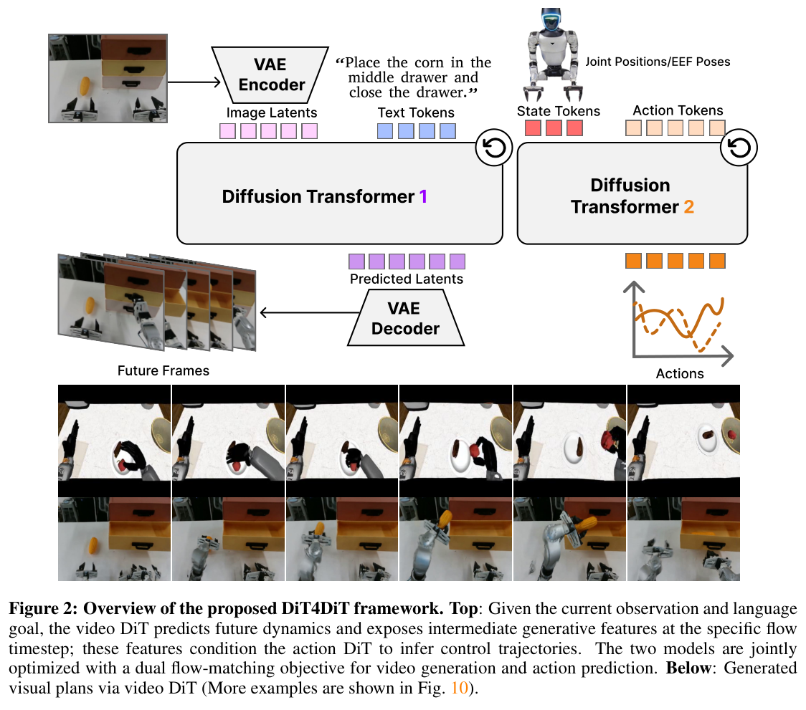

**English.** The video branch is initialized from Cosmos-Predict2.5-2B. A causal VAE encodes current and future frames into latent tokens; language embeddings are provided by Cosmos-Reason1. The video DiT receives the current visual condition, text, and a noised future latent. A hook extracts hidden states either from a selected transformer block or by aggregating layers.

**中文。** 视频分支以 Cosmos-Predict2.5-2B 初始化。因果 VAE 把当前帧与未来帧编码成潜变量 token，语言嵌入来自 Cosmos-Reason1。视频 DiT 接收当前视觉条件、文本以及加噪后的未来潜变量；一个 hook 从指定 Transformer 层提取隐藏状态，也可以聚合多层特征。

**English.** The action branch is adapted from the GR00T-N1 action architecture. It forms tokens from proprioceptive state, noisy future actions, and learnable future positions, and uses adaptive layer normalization plus cross-attention to consume the video features. Thus, video generation supplies a temporal plan in representation space, while the action model maps that plan to embodiment-specific controls.

**中文。** 动作分支改造自 GR00T-N1 的动作架构。它把机器人本体状态、带噪的未来动作和可学习的未来位置组成 token，并通过自适应层归一化和交叉注意力读取视频特征。因而，视频生成模块在表征空间里给出“时间计划”，动作模型再把这份计划映射成特定机器人形态的控制量。

### 4.4 Asymmetric Tri-timestep Design / 非对称三时间步设计

**English.** A central design is to distinguish three roles: the video training timestep \(\tau_v\), the feature-interception timestep \(\tau_f\), and the action timestep \(\tau_a\). The video branch covers the complete corruption path, typically sampling \(\tau_v\) uniformly. The action branch uses its own noise schedule, with \(\tau_a=1-\sigma\) and \(\sigma\sim\mathrm{Beta}(\alpha,\beta)\). The feature hook is evaluated at a controlled timestep \(\tau_f\), which is bucketed during training and fixed deterministically at inference.

**中文。** 方法的核心是区分三种职责：视频训练时间步 \(\tau_v\)、特征截取时间步 \(\tau_f\) 与动作时间步 \(\tau_a\)。视频分支覆盖完整加噪路径，通常均匀采样 \(\tau_v\)；动作分支使用自己的噪声日程，令 \(\tau_a=1-\sigma\)、\(\sigma\sim\mathrm{Beta}(\alpha,\beta)\)；特征 hook 则在受控的 \(\tau_f\) 处读取视频特征——训练时从若干 bucket 采样，推理时固定为确定值。

**English.** This separation matters because “learning to generate a clean video” and “providing the best feature for control” are different objectives. If all timesteps are tied, the action model sees a condition whose semantic content and noise level change together with action corruption. Decoupling makes the conditional feature distribution more stable and lets the action path be optimized for control.

**中文。** 这种分离很重要，因为“生成干净视频”和“为控制提供最佳特征”并不是同一个目标。如果所有时间步绑定在一起，动作模型看到的条件会随着动作噪声同步改变，其语义含量和噪声水平都不稳定。解耦后，条件特征分布更稳定，动作去噪路径也能专门为控制优化。

### 4.5 Joint Training / 联合训练

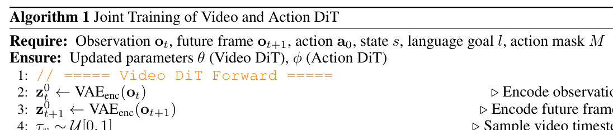

**English.** Training encodes the current observation and target future video, samples video and action noise, constructs their interpolated states, and forwards the video DiT to obtain both its flow prediction and intermediate hidden feature. The action DiT then predicts the action flow under that feature. The total objective is

$$\mathcal L_{\text{total}}=\mathcal L_{\text{action}}+\lambda\mathcal L_{\text{video}},$$

with masking for padded action dimensions or horizons. The text encoder and VAE are frozen, whereas the two DiTs are fine-tuned jointly.

**中文。** 训练时，模型编码当前观测和目标未来视频，分别采样视频噪声与动作噪声，构造各自的插值状态；视频 DiT 一次前向同时输出视频流速度和中间隐藏特征，动作 DiT 再在该特征条件下预测动作流。总损失为

$$\mathcal L_{\text{total}}=\mathcal L_{\text{action}}+\lambda\mathcal L_{\text{video}},$$

并对填充的动作维度或时域位置使用 mask。文本编码器和 VAE 保持冻结，两个 DiT 则联合微调。

### 4.6 Inference / 推理

**English.** Full future-video synthesis is optional. For action inference, DiT4DiT samples a video latent at the fixed feature timestep and performs one video-DiT forward pass to obtain \(h=H(\cdot,\tau_f)\). It does not need to complete the multi-step video denoising trajectory or decode pixels. The action DiT then starts from action noise and integrates its own vector field for \(N_a\) steps.

**中文。** 完整未来视频的合成是可选项。做动作推理时，DiT4DiT 在固定特征时间步构造视频潜变量，只进行一次 video DiT 前向，得到 \(h=H(\cdot,\tau_f)\)；它不需要走完整的多步视频去噪轨迹，也不需要把潜变量解码成像素。随后 action DiT 从动作噪声出发，用 \(N_a\) 步积分得到控制序列。

> [!important] 容易误读的地方
> “Video DiT predicts future dynamics”不等于“每次执行动作前都完整生成未来视频”。真正进入策略的是视频 DiT 的中间去噪特征。Figure 2 下方的未来帧主要证明视频分支确实学到了合理动力学，并非在线控制必经的数据通路。

## 5. Experiments / 实验

### 5.1 Setups / 实验设置

**English.** The evaluation spans LIBERO, RoboCasa-GR1, and a real Unitree G1 platform. LIBERO contains four suites with ten tasks each and 500 demonstrations per suite setting. RoboCasa-GR1 covers 24 household manipulation tasks with 1,000 trajectories per task, a 29-dimensional action space, egocentric input only, 50 rollouts per task, and a maximum horizon of 720 steps.

**中文。** 实验覆盖 LIBERO、RoboCasa-GR1 和真实 Unitree G1。LIBERO 包含四个任务套件，每个套件十项任务，并使用相应的 500 条示范。RoboCasa-GR1 含 24 项家庭操作任务，每项任务 1,000 条轨迹；动作空间为 29 维，仅使用第一视角输入；每项任务评估 50 次，最长 720 步。

**English.** The real-robot benchmark uses seven tasks, a 16-DoF action representation, one egocentric camera, 200 demonstrations per task, and 20 evaluation rollouts. For real-world experiments, the video and action backbones are first pretrained on 241,450 simulated GR1 episodes and then fine-tuned on 1,400 real demonstrations. Simulated DiT4DiT and Qwen3DiT are trained from scratch with respect to action data outside each benchmark, whereas several compared VLAs use their official pretrained checkpoints.

**中文。** 真机基准包含七项任务，使用 16 自由度动作表示、一台第一视角相机、每项任务 200 条示范和 20 次评估。真机训练中，视频与动作骨干先在 241,450 条 GR1 仿真轨迹上预训练，再用 1,400 条真实示范微调。仿真实验里的 DiT4DiT 与 Qwen3DiT 就相应基准以外的动作数据而言是从零训练；而若干对比 VLA 使用官方预训练权重。因此，表中的“from scratch”不能理解为所有视觉/视频权重完全随机初始化。

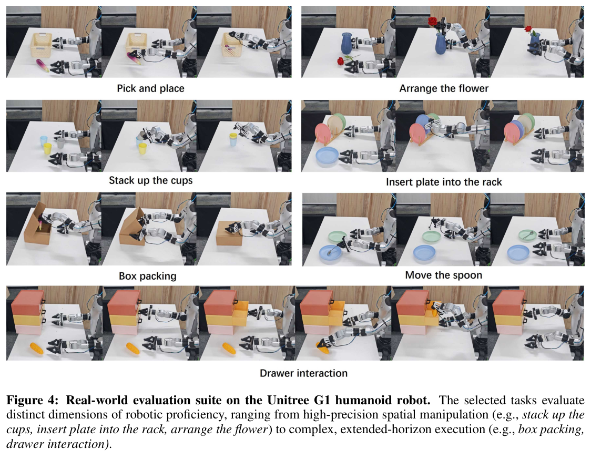

### 5.2 Simulation Results / 仿真结果

**English.** On LIBERO, DiT4DiT obtains 98.4 on Spatial, 99.6 on Object, 98.6 on Goal, and 97.6 on Long, averaging 98.6. It exceeds Qwen3DiT's 96.6 average and the strongest listed pretrained VLA, CogVLA, at 97.4. The long-horizon score is especially notable because temporal dynamics should matter most there.

**中文。** 在 LIBERO 上，DiT4DiT 在 Spatial、Object、Goal 和 Long 四个套件中分别达到 98.4、99.6、98.6 和 97.6，平均为 98.6。它超过 Qwen3DiT 的 96.6，也高于表中最强的预训练 VLA——CogVLA 的 97.4。Long 套件上的提升尤其值得关注，因为长时程任务最依赖时间动力学。

**English.** On RoboCasa-GR1, DiT4DiT averages 50.8%, compared with 41.8 for GR00T-N1.5, 40.8 for GR00T-N1.6, and 36.2 for Qwen3DiT. It ranks first on 16 of 24 tasks. This benchmark exposes a larger gap than LIBERO because of diverse objects, long horizons, bimanual control, and contact-rich behaviors.

**中文。** 在 RoboCasa-GR1 上，DiT4DiT 的平均成功率为 50.8%，而 GR00T-N1.5、GR00T-N1.6 和 Qwen3DiT 分别为 41.8%、40.8% 和 36.2%。它在 24 项任务中的 16 项取得最佳结果。该基准包含更多样的物体、更长时域、双臂控制和接触丰富行为，因此比 LIBERO 更能放大动力学建模带来的差异。

### 5.3 Real-world Results / 真机结果

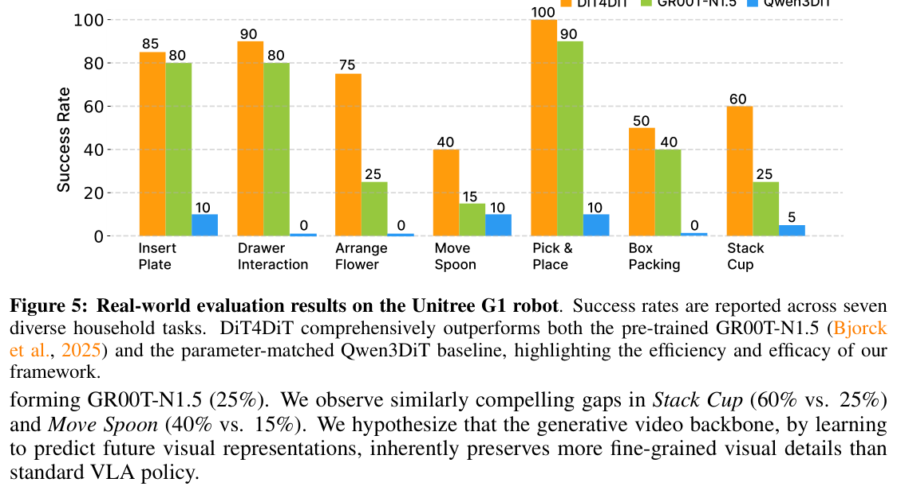

**English.** DiT4DiT is strongest on most real tasks. Representative results include 75% on Arrange Flower versus 25% for GR00T-N1.5, 60% versus 25% on Stack Cup, 40% versus 15% on Move Spoon, 90% on Drawer Interaction, and 50% on Box Packing. Qwen3DiT never exceeds 10% and fails completely on several tasks, suggesting that merely replacing the visual backbone with a large multimodal model does not supply the same dynamics prior.

**中文。** DiT4DiT 在多数真机任务上表现最好。例如，Arrange Flower 为 75%，GR00T-N1.5 为 25%；Stack Cup 为 60% 对 25%；Move Spoon 为 40% 对 15%；Drawer Interaction 达到 90%，Box Packing 达到 50%。Qwen3DiT 从未超过 10%，并在若干任务上完全失败。这说明仅仅换成更大的多模态视觉骨干，并不能获得与视频生成先验相同的动力学能力。

### 5.4 Zero-shot Generalization / 零样本泛化

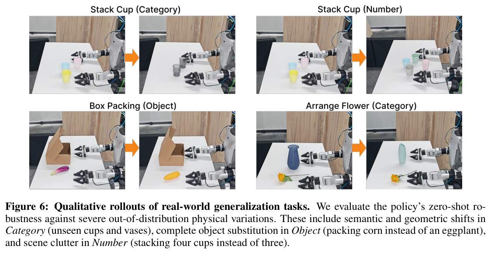

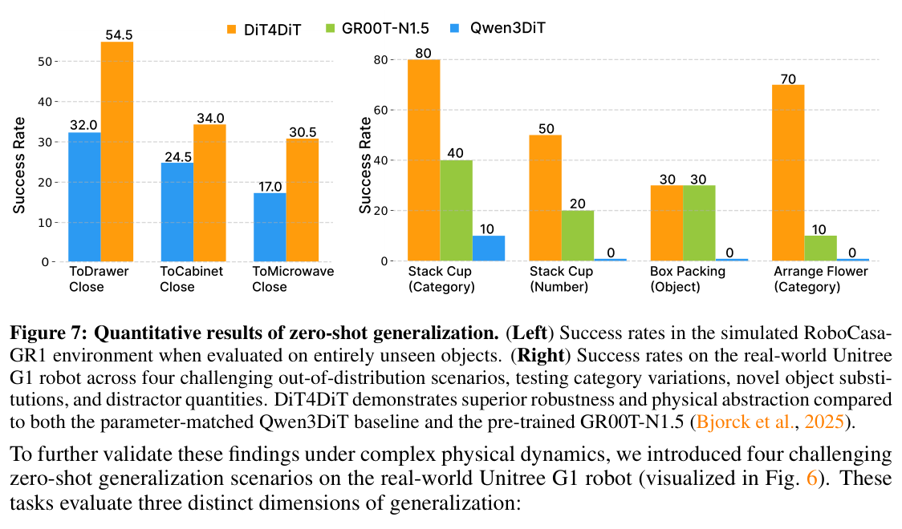

**English.** In simulation, policies are trained with only a bottle and then tested with unseen cans, cups, milk containers, and wine bottles across Drawer, Cabinet, and Microwave tasks. DiT4DiT reaches 54.5, 34.0, and 30.5 respectively, compared with 32.0, 24.5, and 17.0 for Qwen3DiT. The gains indicate that the video prior transfers interaction structure beyond memorized object appearance.

**中文。** 在仿真零样本实验中，策略训练时只见过 bottle，测试时则替换为未见过的 can、cup、milk container 和 wine bottle，并在 Drawer、Cabinet、Microwave 三类任务上评估。DiT4DiT 分别达到 54.5、34.0 和 30.5，而 Qwen3DiT 为 32.0、24.5 和 17.0。这说明视频先验迁移的是交互结构，而不只是记住物体外观。

**English.** Real-world generalization tests category changes, object substitutions, and quantity changes. For example, DiT4DiT reaches 70% on an unseen-category Arrange Flower variant, versus 10% for GR00T-N1.5 and 0 for Qwen3DiT; it also reaches 50% on the quantity-shifted Stack Cup task. Nevertheless, these are still constrained variations around known task templates, not unrestricted open-world zero-shot control.

**中文。** 真机泛化实验考察类别变化、物体替换和数量变化。例如，在未见类别的 Arrange Flower 变体中，DiT4DiT 达到 70%，GR00T-N1.5 为 10%，Qwen3DiT 为 0；在改变杯子数量的 Stack Cup 中，DiT4DiT 达到 50%。不过，这些仍是围绕已知任务模板设计的受控变化，不能等同于无限制的开放世界零样本控制。

## 6. Ablations and Analysis / 消融与分析

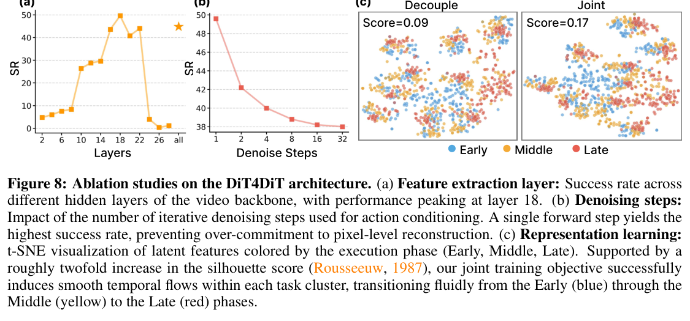

**English.** The best control feature comes from video-DiT layer 18. Early layers are too local and weakly semantic; final layers around 24–28 show a sharp performance collapse, plausibly because they specialize in pixel reconstruction. Averaging all layers is slightly worse than selecting layer 18, showing that “more features” is not automatically better.

**中文。** 最适合控制的视频特征来自 video DiT 第 18 层。浅层特征过于局部，语义不足；第 24–28 层等末端层的成功率明显崩塌，可能因为它们已经专门服务于像素重建。简单平均所有层也略逊于单独选择第 18 层，说明特征并非越多越好。

**English.** A single video-DiT forward pass gives the strongest action performance. Increasing video denoising from 1 to 32 steps monotonically hurts control. The result supports the paper's main claim: intermediate noisy states retain action-relevant uncertainty and dynamics, whereas fully denoised visual states can overcommit to one appearance-level future.

**中文。** 只进行一次 video DiT 前向时，动作性能最好；把视频去噪步数从 1 增加到 32，控制性能反而单调下降。这直接支持论文的核心主张：中间含噪状态保留了与动作有关的不确定性和动力学，而完全去噪后的视觉状态可能过早押注某个外观层面的未来。

**English.** Joint training improves the temporal organization of video features. A t-SNE visualization shows the silhouette score rising from 0.09 under decoupled training to 0.17 under joint training, with early, middle, and late phases becoming more ordered. This is suggestive representation evidence rather than a substitute for a direct task-level ablation.

**中文。** 联合训练还改善了视频特征的时间组织。t-SNE 可视化中，分离训练的轮廓系数为 0.09，联合训练后升至 0.17，早期、中期和晚期阶段呈现更清晰的次序。但这只是表征层面的支持性证据，不能完全替代任务成功率上的直接消融。

### Efficiency / 效率

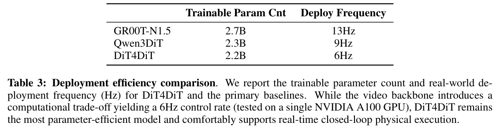

**English.** DiT4DiT has 2.2B trainable parameters and runs at 6 Hz in the reported deployment table, compared with 13 Hz for GR00T-N1.5 and 9 Hz for Qwen3DiT. Thus its statistical and generalization gains do not come with the fastest policy loop. The single-pass feature design avoids full video generation, but the extra video DiT remains computationally expensive.

**中文。** 部署表中，DiT4DiT 有 2.2B 可训练参数，运行频率为 6 Hz；GR00T-N1.5 和 Qwen3DiT 分别为 13 Hz 和 9 Hz。因此，它在成功率和泛化上的优势并不意味着最快的策略循环。单次特征截取避免了完整视频生成，但额外的视频 DiT 仍带来显著计算成本。

## 7. Conclusion / 结论

**English.** DiT4DiT demonstrates that video generation can benefit robot control without requiring test-time future-video reconstruction. Intermediate generative features form a useful bridge between broad visual dynamics and embodiment-specific action prediction. The asymmetric tri-timestep formulation and joint flow matching make this bridge trainable and stable.

**中文。** DiT4DiT 说明：视频生成知识可以服务机器人控制，却不必在测试时完整重建未来视频。中间生成特征在广泛视觉动力学与特定机器人动作预测之间构成了一座有效桥梁；非对称三时间步和联合 flow matching 则让这座桥可以稳定训练。

## Appendix / 附录信息

### Training configuration / 训练配置

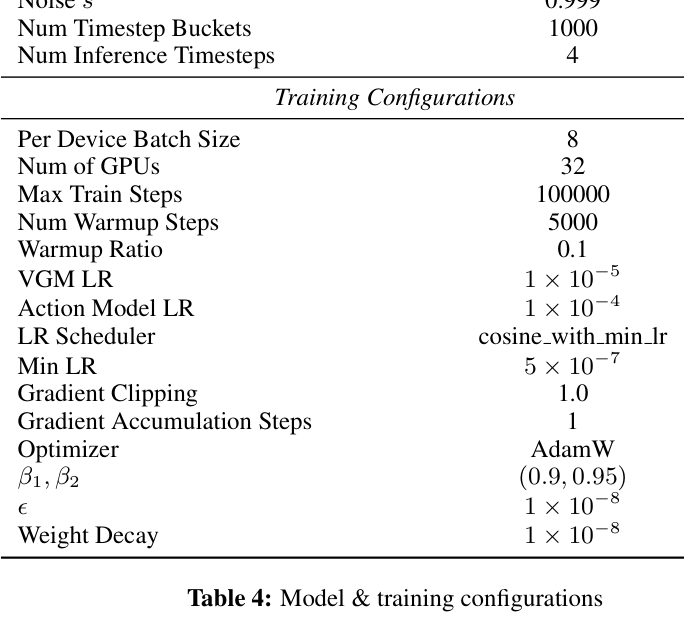

**English.** The implementation uses Cosmos-Predict2.5-2B as the video backbone, FlashAttention-2, dropout 0.2, AdaLN conditioning, AdamW, gradient clipping at 1.0, a video-model learning rate of \(10^{-5}\), and an action-model learning rate of \(10^{-4}\). The extracted table also reports Beta parameters 1.5 and 1.0 and a cosine schedule with minimum learning rate \(5\times10^{-7}\). Several entries in the PDF extraction are visually ambiguous, so the image above should be treated as the authoritative record.

**中文。** 实现以 Cosmos-Predict2.5-2B 为视频骨干，使用 FlashAttention-2、0.2 dropout、AdaLN 条件注入、AdamW 和 1.0 的梯度裁剪；视频模型学习率为 \(10^{-5}\)，动作模型学习率为 \(10^{-4}\)。表中还给出 Beta 分布参数 1.5/1.0，以及最小学习率 \(5\times10^{-7}\) 的余弦调度。PDF 文本抽取对少数条目存在歧义，因此具体配置应以上方原表图为准。

### Robot system and datasets / 机器人系统与数据集

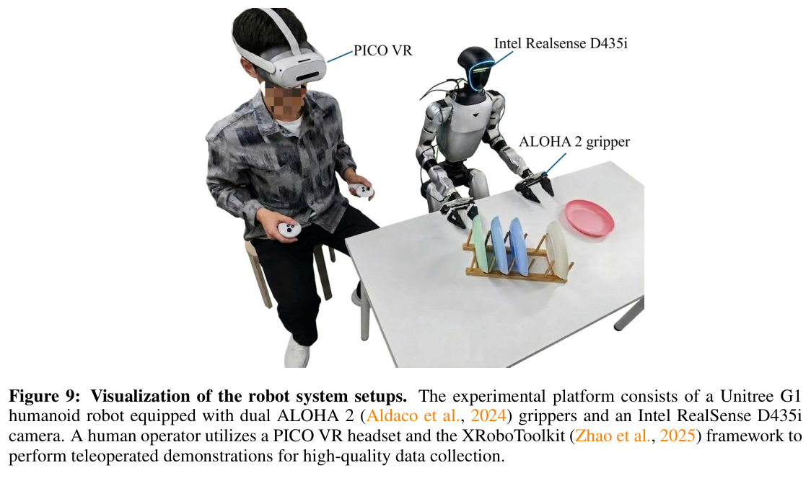

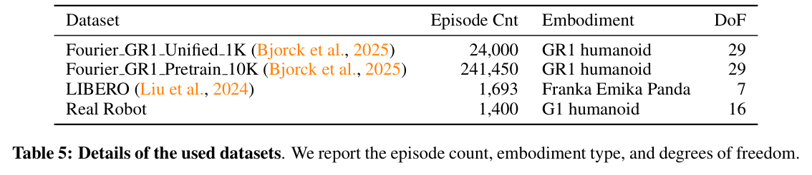

**English.** The real platform is a Unitree G1 humanoid with two 7-DoF arms, ALOHA2 grippers, and an Intel RealSense D435i egocentric camera at 640×480. Demonstrations are collected with PICO VR and XRoboToolkit. Dataset statistics include 24,000 RoboCasa-GR1 episodes, 241,450 simulated GR1 pretraining episodes, 1,693 LIBERO episodes, and 1,400 real-robot episodes, with action spaces of 29, 29, 7, and 16 DoF respectively.

**中文。** 真机平台是 Unitree G1 人形机器人，配备两条 7 自由度机械臂、ALOHA2 夹爪和一台 640×480 的 Intel RealSense D435i 第一视角相机。示范通过 PICO VR 与 XRoboToolkit 采集。数据统计包括 24,000 条 RoboCasa-GR1 轨迹、241,450 条 GR1 仿真预训练轨迹、1,693 条 LIBERO 轨迹和 1,400 条真机轨迹，对应动作自由度分别为 29、29、7 和 16。

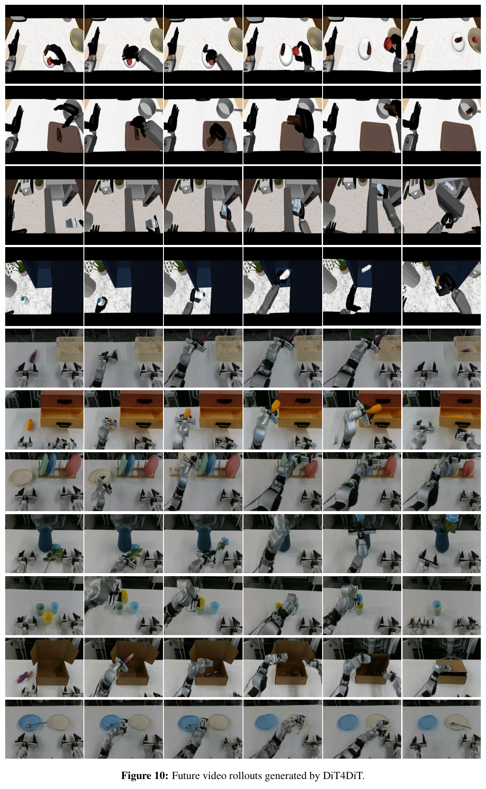

### Limitations / 局限

**English.** The authors identify single-view egocentric perception as a key limitation: occlusion can hide critical objects and contacts. They also leave broader scaling across embodiments and richer visual context for future work. Additional practical concerns follow from the results: the policy runs more slowly than the compared VLA baselines, its strongest zero-shot tests remain close variations of trained tasks, and the paper reports efficiency under both A100 and RTX 4090 contexts without fully disentangling which measurement used which system.

**中文。** 作者明确指出，单一第一视角是关键限制：遮挡可能隐藏重要物体与接触状态；跨更多机器人形态扩展以及使用更丰富视觉上下文也留待未来研究。从结果还能看到几个实践问题：策略频率慢于对比 VLA；最强的零样本实验仍是训练任务附近的受控变体；文中同时出现 A100 与 RTX 4090 的效率测试背景，却没有完全厘清各项指标对应的硬件环境。

## References / 参考文献

为保证笔记可读性，参考文献列表不逐条翻译；完整条目见原 PDF 第 15–19 页。正文中的方法归属、模型名称和实验比较均保留原文语义。

