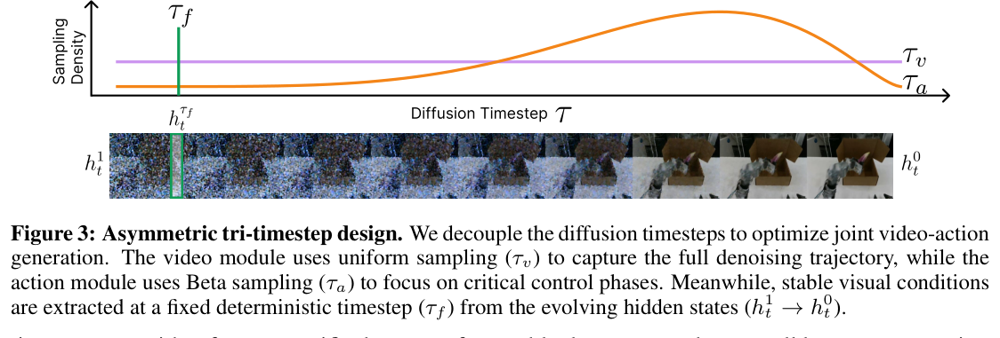

# DiT4DiT: Jointly Modeling Video Dynamics and Actions for Generalizable Robot Control

## 核心信息

- 标题: DiT4DiT: Jointly Modeling Video Dynamics and Actions for Generalizable Robot Control
- 标题翻译: DiT4DiT：联合建模视频动力学与动作，实现可泛化机器人控制
- 作者: Teli Ma, Jia Zheng, Zifan Wang, Chunli Jiang, Andy Cui, Junwei Liang, Shuo Yang
- 机构: Mondo Robotics；HKUST(GZ)；HKUST
- 发表时间: 2026-03-22
- 发表渠道: arXiv 预印本
- arXiv: 2603.10448v2
- 论文链接: https://arxiv.org/abs/2603.10448
- 代码 / 项目: https://dit4dit.github.io/
- 论文类型: 世界动作模型 / 机器人控制方法论文

## 原文摘要翻译

视觉—语言—动作模型虽能借助静态图文预训练获得语义知识，却缺少物理世界随动作演化的显式先验。DiT4DiT 把视频扩散 Transformer 与动作扩散 Transformer 级联起来：它不让动作模型等待完整未来帧，而是使用视频 DiT 的中间去噪特征作为时间条件；两条分支通过解耦时间步的双流匹配目标联合优化。

模型在 LIBERO 上达到 98.6% 平均成功率、在 RoboCasa-GR1 上达到 50.8%，并在 Unitree G1 真机任务中表现出更高的数据效率和零样本泛化能力。

## 创新点

1. **把 video DiT 从“视频输出器”改造成“动态表征器”。** 真正送入动作策略的是隐藏特征，不是已经解码的未来像素。
2. **用 DiT 条件化另一个 DiT。** 视频 DiT 提供跨时间的潜在计划，动作 DiT 负责把计划变成连续、形态相关的控制轨迹。
3. **三时间步解耦。** 视频训练、特征截取与动作去噪不再共享同一个噪声时间，减少条件分布随动作噪声一起漂移的问题。
4. **用消融反驳“越接近干净视频越适合控制”。** 最优点出现在中间层和单次前向，而不是最终视频重建阶段。

## 一句话总结

> DiT4DiT 的关键不是“让机器人先看完一段未来电影”，而是把视频扩散模型尚未完成去噪时的中间表征，当作一份保留不确定性的动态计划交给动作扩散模型。

## 研究问题

传统 VLA 的强项是语义映射：看到图像和指令后输出动作。但机器人任务还包含另一个问题——动作之后世界如何变化。静态图文预训练很难提供接触、遮挡、物体运动和长时程交互的先验。视频生成模型恰好在时间一致性上更强，可是若在线完整生成未来视频，会产生两个负担：

- 多步视频去噪带来高延迟；
- 像素级准确并不等于控制相关，生成后期可能把模型容量消耗在纹理和唯一外观未来上。

因此论文真正问的是：**能否在不完成视频生成的情况下，把视频模型已经形成的动态知识取出来用于动作预测？**

## 方法主线

### 机制流程


*Fig. 2：视频 DiT 在指定 flow timestep 暴露中间生成特征，动作 DiT 以该特征为条件预测控制轨迹；图像裁剪与原图编号已核验。*

流程可以压缩成四步：

1. 因果 VAE 把当前图像和训练时的未来视频编码到潜空间；语言由 Cosmos-Reason1 编码。
2. Cosmos-Predict2.5-2B 初始化的视频 DiT 在某个含噪未来潜变量上前向，既预测视频 flow，又暴露中间隐藏状态 \(h\)。
3. GR00T 风格的动作 DiT 接收机器人状态、带噪动作标记和 \(h\)，预测动作流。
4. 两个 flow-matching 损失联合反向传播，使视频特征不仅能支持视觉生成，也逐渐组织出对动作有用的时间信息。

形式上，视频分支描述

$$o_{t+1}\sim p_v(\cdot\mid o_t,l),$$

动作分支描述

$$a_t\sim p_a\bigl(\cdot\mid o_t,H(o_{t+1}^{\tau_v})\bigr),$$

其中 \(H\) 不是视频解码器，而是从 video DiT 指定层取隐藏状态的 hook。

### Flow matching 的时间方向

论文写作

$$x_\tau=(1-\tau)x_0+\tau z,$$

所以 \(\tau=0\) 是干净样本，\(\tau=1\) 是纯噪声；目标速度是

$$v^*(x_\tau,\tau)=z-x_0.$$

推理从噪声向干净端积分。这个定义与一些把 \(t=0\) 当噪声的论文相反，若忽略这一点，就会把“高/低 timestep”对语义成熟度的解释整个倒置。

## 三时间步为什么必要


*Fig. 3：\(\tau_v\) 覆盖视频训练路径，\(\tau_f\) 控制中间特征截取，\(\tau_a\) 控制动作噪声；三者职责与采样分布解耦。*

DiT4DiT 区分三个时间变量：

| 时间步 | 所属对象 | 作用 |
|---|---|---|
| \(\tau_v\) | 视频训练路径 | 让视频 DiT 学完整的从干净未来到噪声的 vector field，通常均匀采样。 |
| \(\tau_f\) | 条件特征 | 决定在哪个噪声状态、哪个生成阶段截取视频隐藏特征；训练用 bucket，推理固定。 |
| \(\tau_a\) | 动作训练/推理路径 | 控制动作轨迹自身的噪声强度，按独立 Beta 日程采样。 |

直觉上，视频目标与动作目标对“好特征”的要求不同：

- 视频生成希望最终恢复像素细节，因此必须学完整轨迹；
- 动作预测只关心物体会往哪里去、接触是否发生、任务阶段如何推进；
- 若强制视频和动作共享 timestep，动作模型看到的条件会同时改变噪声和语义成熟度，训练目标不稳定；
- 固定或受控的 \(\tau_f\) 给动作模型提供相对稳定的动态表征。

总损失为

$$\mathcal L_{\text{total}}=\mathcal L_{\text{action}}+\lambda\mathcal L_{\text{video}}.$$

联合损失的意义不是简单“多一个辅助任务”，而是让动作梯度能够塑造视频 DiT 内部哪类动态信息更容易被读取。

## 推理到底生成不生成视频

答案是：**用于动作控制时，不必完整生成。**

视频可视化需要从噪声经过多步积分、再由 VAE 解码；但策略执行只在固定 \(\tau_f\) 构造一次含噪视频潜变量，做一次视频 DiT 前向，取得中间特征 \(h\)。接着动作 DiT 独立完成动作流的积分。

因此数据通路是：

```text
当前图像 + 指令
      ↓
video DiT 单次前向（固定 τ_f）
      ↓
中间动态特征 h
      ↓
action DiT 多步动作去噪
      ↓
动作 chunk
```

论文展示的未来视频主要有两种用途：训练视频 flow 目标，以及证明视频分支确实学到了合理的时序变化。它不是每次控制的必经中间产物。

## 数据与任务定义

仿真评测包括 LIBERO 和 RoboCasa-GR1；真机平台为 Unitree G1。

真实系统使用双 7 自由度手臂、ALOHA2 夹爪、单个 RealSense D435i 第一视角相机，动作表示为 16 自由度。

| 数据 | Episode 数 | 动作 DoF | 角色 |
|---|---:|---:|---|
| RoboCasa-GR1 | 24,000 | 29 | 24 项仿真任务训练/评测 |
| GR1 simulation pretraining | 241,450 | 29 | 真机模型的仿真预训练 |
| LIBERO | 1,693 | 7 | 四个标准套件 |
| Real robot | 1,400 | 16 | 七项 G1 任务，每项约 200 条 |

一个关键口径是表中的**从零训练**：表注说它意味着没有使用“当前基准之外的动作数据”，而不是整个模型没有视觉/视频预训练。DiT4DiT 的视频 DiT 仍由 Cosmos-Predict2.5-2B 初始化。若把 98.6% 解释成“完全随机初始化的 2.2B 模型只用 1,693 条 LIBERO 轨迹”，会严重夸大结论。

## 关键结果

### LIBERO


*Table 1：LIBERO 四套件成功率；DiT4DiT 平均 98.6%，表中“从零训练”只限定外部动作数据。*

DiT4DiT 的四套件结果为 98.4 / 99.6 / 98.6 / 97.6，平均 98.6%。Qwen3DiT 为 96.6%，表中最强的预训练 VLA CogVLA 为 97.4%。

最有信息量的是长时程套件：DiT4DiT 为 97.6，高于 CogVLA 的 95.4 和 Qwen3DiT 的 93.6，符合“时间动力学帮助长时程任务”的机制预期。

不过 LIBERO 已接近饱和，1–2 个百分点的差异容易受评测随机性、checkpoint 选择和 rollout 数影响；论文更有说服力的主结果其实来自 RoboCasa-GR1。

### RoboCasa-GR1


*Table 2：RoboCasa-GR1 的 24 项任务成功率；DiT4DiT 平均 50.8%，在 16 项任务中排名第一。*

DiT4DiT 在 24 项任务上平均 50.8%，高于 GR00T-N1.5 的 41.8%、GR00T-N1.6 的 40.8% 和 Qwen3DiT 的 36.2%，并在 16 项任务上排名第一。这里的优势不仅是平均值，还是在接触丰富、双臂和长时程任务上的广泛提升，因此比 LIBERO 的天花板差异更能支持方法有效性。

### G1 真机

论文报告 DiT4DiT 在插花、叠杯、移动勺子、抽屉交互和装箱任务上分别达到 75%、60%、40%、90%、50%。Qwen3DiT 在所有任务上不超过 10%，并在若干任务为 0；GR00T-N1.5 更强，但在插花与叠杯等任务仍明显落后。

需要注意每项真机任务只有 20 次 rollout，单次成功对应 5 个百分点。因此 10 个百分点以内的差异只相当于两次成功，最好结合任务间一致趋势看，而不是过度解释单个柱子的精确值。

## 零样本泛化


*Fig. 7：左侧为仿真对象类别替换，右侧为真实 G1 的类别、对象和数量变化；裁剪包含完整图例和图注。*

仿真中只用瓶子训练，再换成罐头、杯子、牛奶盒和酒瓶。DiT4DiT 在抽屉、橱柜、微波炉三组任务上达到 54.5 / 34.0 / 30.5，Qwen3DiT 为 32.0 / 24.5 / 17.0。真机还考察类别替换、对象替换和数量变化，其中插花类别变化为 70%，叠杯数量变化为 50%。

这些结果支持：视频先验让模型更容易复用“抓取—移动—放置—闭合”等交互结构，而不是完全依赖训练物体的外观。但它们还不是开放世界泛化：任务语言、技能骨架、机器人形态和场景布局都与训练分布高度相关。

## 消融到底说明了什么


*Fig. 8：第 18 层特征最佳；增加视频去噪步数持续伤害控制；联合训练使早中晚任务阶段在特征空间中更有序。*

### 1. 中间层优于最终层

第 18 层最好；浅层语义不足，24–28 等末端层出现明显下降。一个合理解释是：中间层已经形成物体运动、接触和任务阶段等抽象动态，而末端层开始服务于精确像素恢复，使表征变得更外观化、更确定。

### 2. 一次前向优于完整去噪

视频去噪 1 步最好，从 2 增加到 32 步时成功率持续降低。这不是说视频模型没用，恰恰说明视频模型最有用的信息位于生成过程内部，而非最终图像。中间含噪特征还保留多种可行未来；完全去噪会把分布压到一个具体视觉结果，可能丢失动作需要的多模态性。

### 3. 联合训练改善时间结构

t-SNE 中，分离训练的轮廓系数为 0.09，联合训练为 0.17；后者的早期、中期、晚期特征更有顺序。这说明动作监督可能把视频隐藏空间重组为任务进度表征。但 t-SNE 依赖降维和可视化选择，0.17 仍不是很高，因此它是解释性证据，不是联合训练必然提升控制的充分证明。

## 深度分析

下面把论文的结构设计与实验现象逐一对应。这里的解释与作者证据保持一致，但对“中间噪声保留多种未来”等内容仍应视为机制推断，而非已经被完全验证的因果结论。

### 为什么它可能有效

### 动力学先验比像素预测更重要

视频模型在大规模数据中学到的是运动连续性、遮挡后的再出现、物体支撑关系和人类操作模式。动作策略并不需要复现所有像素，只要读取这些规律即可。DiT4DiT 用隐藏状态接口把“学动力学”和“解码画面”分离开。

### 中间噪声保留可行动的不确定性

对控制而言，未来常常不是唯一的：杯子可以从不同角度抓，花可以沿多条轨迹放入容器。中间去噪状态编码的是一簇可能未来；最终视频则更像从中挑出一个具体样本。动作模型在前者上条件化，可能更容易找到符合机器人约束的轨迹。

### 级联结构把通用知识与形态控制分工

视频 DiT 更接近形态无关的视觉动力学；动作 DiT 负责关节、末端姿态和动作维度。这种分工解释了为什么模型能用仿真视频/动作数据预训练，再以较少真实示范适配 G1。

## 与 DreamZero、Fast-WAM 的关系

三者都在研究“视频世界模型怎样服务策略”，但路径不同：

| 方法 | 世界模型信息怎样进入动作 | 测试时是否完整生成未来视频 | 核心取舍 |
|---|---|---|---|
| DreamZero | 联合视频—动作 chunk，在闭环中用真实观测回填历史 | 原始形式联合去噪视频与动作；Flash 进一步单步化 | 强调大规模异构数据、闭环自回归与实时系统 |
| Fast-WAM | 把训练过的视频 DiT 改成一次前向的 world encoder | 不需要 | 直接追问 test-time imagination 是否必要 |
| DiT4DiT | 从指定时间步、指定层抽取视频 DiT 中间特征，以交叉注意力条件化动作 DiT | 不需要 | 强调中间生成表征、三时间步解耦与联合流匹配 |

DiT4DiT 与 Fast-WAM 的结论很接近：显式生成像素未来不是必要条件。但 DiT4DiT 给出了更具体的表征接口——“在哪个噪声时刻、哪一层取特征”，并通过 layer/step 消融说明最终去噪甚至可能有害。

## 容易误读的地方

1. **不是把未来视频直接喂给动作模型。** 动作条件是隐藏状态 \(h\)，未来帧只用于训练目标和可视化。
2. **一次前向不等于没有噪声。** 模型仍在指定 \(\tau_f\) 上处理含噪潜变量，只是不把视频 ODE 积分到终点。
3. **三个 timestep 并非三个视频帧。** 它们是三条功能路径上的噪声/流时间。
4. **from scratch 不等于全随机初始化。** 它限定的是外部动作数据，视频骨干依然预训练。
5. **zero-shot 不等于新任务任意组合。** 主要是已知技能模板内的对象类别、实例和数量变化。
6. **“10× sample efficiency、7× convergence”来自作者定义的比较设置。** 不应脱离数据量、初始化和成功阈值泛化为普遍训练规律。

## 复现注意点

- 明确论文的 flow 时间方向：\(\tau=0\) clean，\(\tau=1\) noise。
- video DiT 初始化为 Cosmos-Predict2.5-2B；文本嵌入来自 Cosmos-Reason1；VAE 和文本编码器冻结。
- 复现时应分别记录 \(\tau_v\)、\(\tau_f\)、\(\tau_a\)，尤其不能把 feature timestep 误绑到动作 timestep。
- 特征层优先从第 18 层开始，但层号依赖具体 backbone 深度；迁移到其他 video DiT 时应按相对深度重新搜索。
- 推理 benchmark 必须区分 video-DiT 单次前向成本与 action-DiT 积分步数，不能只报告动作头延迟。
- 真机每项 20 次 rollout，建议至少报告二项分布置信区间或跨 seed 结果。
- Table 3 声称单 A100 测试，附录真机工作站为 RTX 4090；复现时要单独报告测量硬件、精度、batch size 和同步方式。

## 局限

- 单第一视角容易在双臂、抽屉和容器任务中发生遮挡；模型缺少外部相机或显式三维状态。
- 2.2B 模型只有 6Hz，仍难覆盖更高频、强接触或动态操作。
- 跨 embodiment 的证据主要来自仿真到同一 G1 平台的预训练—微调，还没有展示机器人形态差异很大的迁移。
- 零样本变化受控，未验证长组合指令、全新技能或强背景变化。
- 没有充分拆分“视频预训练规模”“中间特征接口”“联合训练”“三时间步”各自贡献。
- t-SNE 仅提供定性机制解释；最好增加 linear probe、时间预测或干预式因果消融。

## 我的笔记

这篇论文最值得记住的不是“又一个 WAM”，而是一个更具体的设计原则：**生成模型最适合控制的接口未必是生成结果，而可能是生成过程中的中间状态。** 这与视觉表征学习中“中层保留结构、末层专门化到训练目标”的经验一致，但这里又多了一层扩散时间维度——需要同时选择 layer 和 timestep。

从研究角度，下一步很自然：

1. 不再只取单个 \((\text{layer},\tau_f)\)，而是让动作模型自适应选择多尺度动态特征。

2. 把单一含噪未来扩展成多个潜在未来分支，研究不确定性是否能改善风险敏感控制。

3. 用因果干预检查视频特征是否真的编码“动作导致的变化”，而不是数据中的任务阶段捷径。

4. 比较冻结视频 DiT、LoRA 与联合微调对动力学保留和灾难性遗忘的影响。

5. 在更高频触觉/力控任务中检验 6Hz 视觉动态先验是否仍然有价值。

## 引用

Ma, T., Zheng, J., Wang, Z., Jiang, C., Cui, A., Liang, J., & Yang, S. (2026). *DiT4DiT: Jointly Modeling Video Dynamics and Actions for Generalizable Robot Control*. arXiv:2603.10448v2.
