# Efficient-WAM: A 1B-Parameter World-Action Model with Low-Cost Future Imagination

**Authors:** Jiajun Li; Tiecheng Guo; Yifan Ye; Rongyu Zhang; Xiaowei Chi; Qianpu Sun; Ying Li; Yunfan Lou; Yan Huang; Zhihe Lu; Meng Guo; Shanghang Zhang  
**Affiliations:** The University of Hong Kong; Peking University; Muka Robotics; Institute of Automation, Chinese Academy of Sciences; Nanjing University  
**Version:** arXiv:2606.10040v2 [cs.RO], 10 June 2026  
**DOI:** 10.48550/arXiv.2606.10040  
**Zotero provenance:** canonical item key `9CXEVNRE`; attachment key `HPMGAGVC`  
**Canonical source:** `/Users/roywangj/journey_wj/research/papers4zotero/zotero1/storage/HPMGAGVC/Li 等 - 2026 - Efficient-WAM A 1B-Parameter World-Action Model with Low-Cost Future Imagination.pdf`  
**SHA-256:** `03bceaba02b236070153c14f956db378efa4aa2c8d3aaf6df6d3a70be16073d7`  
**Source format:** selectable-text PDF (`pdf-text`), 18 pages  
**Reader role:** authoritative complete paragraph-level Chinese–English reader; `paper.md` and `detailed_paper.md` are byte-identical.  
**Project page:** https://efficientwam.github.io/

## Page / Section Index

| Pages | Content |
|---|---|
| 1 | Title, Abstract, Keywords, Figure 1 |
| 2 | 1 Introduction |
| 3 | 2 Related Works; 3 Method; 3.1 Design Formulation |
| 4 | Figure 2; 3.2 Compact Architecture; 3.3 Multiscale Video-Latent Layout |
| 5 | 3.3 continued; 3.4 Asymmetric Denoising; 3.5 Training Objectives; 4.1 Setup |
| 6 | 4.2 Simulation; Tables 1–2; 4.3 Real-world |
| 7 | Figure 3; 4.4 Ablations; Table 3 |
| 8 | Figure 4; 4.5 Efficiency; 5 Conclusion; 6 Limitations |
| 9–11 | Acknowledgments; References [1]–[40] |
| 12–13 | Appendix A Training Details; equations (4)–(8); Appendix B begins; Figure 5 |
| 14 | Appendix B continued; Figure 6 |
| 15 | Appendix C latency; Table 5; Appendix D |
| 16 | Figures 7–8 |
| 17 | Appendix E; Table 6 |
| 18 | Table 7 and discussion |

## Terminology Ledger

| Canonical term | 中文 | Definition / decision |
|---|---|---|
| World-Action Model (WAM) | 世界—动作模型 | Jointly predicts future visual evolution and robot actions; retain WAM after first use. |
| Efficient-WAM | Efficient-WAM | Compact 1B-parameter structural baseline; model name remains English. |
| Efficient-WAM-RT | Efficient-WAM-RT | Fully optimized real-time variant with low-resolution futures and asymmetric denoising. |
| action-centric future imagination | 以动作为中心的未来想象 | Future prediction optimized as control guidance rather than photorealistic rendering. |
| Mixture-of-Transformers (MoT) | Transformer 混合架构 | Layer-wise interaction between video and action experts. |
| world-knowledge transfer | 世界知识迁移 | Structured layer slicing plus teacher-guided distillation from WAN-2.2-5B. |
| future video latent | 未来视频潜变量 | $z_v$; low-resolution token-sparse future representation. |
| asymmetric video-action denoising | 非对称视频—动作去噪 | Different denoising budgets $T_v$ and $T_a$. |
| flow matching | 流匹配 | Conditional generative objective used for video and action branches. |
| action chunk | 动作块 | A horizon-$H$ sequence; here $H=16$. |
| Clean / Random | 干净 / 随机化 | RoboTwin 2.0 evaluation settings. |
| latency per chunk | 每动作块延迟 | Wall-clock policy-call latency for predicting one $H=16$ chunk. |

## Abstract

> <strong>Para. 1:</strong> World-Action Models (WAMs) have emerged as a promising paradigm for embodied control by coupling future visual prediction with action generation. However, most existing WAMs rely on photorealistic future prediction, which incurs high inference latency and makes real-time robot deployment difficult. This motivates a more efficient WAM design that preserves the control benefits of future visual prediction while reducing its inference cost.

> <strong>Para. 1[CN]:</strong> 世界—动作模型（WAM）通过将未来视觉预测与动作生成耦合，已成为具身控制中很有前景的范式。然而，大多数现有 WAM 依赖照片级真实的未来预测，导致推理延迟高，难以实时部署机器人。因此，需要一种更高效的 WAM 设计，在降低推理成本的同时保留未来视觉预测对控制的益处。

> <strong>Para. 2:</strong> We introduce Efficient-WAM, a World-Action Model that reduces the cost of future imagination while preserving its control benefit. Efficient-WAM improves inference efficiency via a compact video expert transferred from WAN-2.2-5B, token-sparse video latents, and asymmetric video-action denoising that allocates fewer sampling steps to video than to actions. Instead of optimizing the future branch for visual fidelity, Efficient-WAM treats future video prediction as a compact guidance signal for action generation.

> <strong>Para. 2[CN]:</strong> 我们提出 Efficient-WAM：一种在保留控制收益的同时降低未来想象成本的世界—动作模型。它通过从 WAN-2.2-5B 迁移得到的紧凑视频专家、token 稀疏的视频潜变量，以及为视频分配少于动作的采样步数的非对称视频—动作去噪来提升推理效率。Efficient-WAM 不再以视觉保真度为目标优化未来分支，而是将未来视频预测视为指导动作生成的紧凑信号。

> <strong>Para. 3:</strong> Comprehensive experiments on RoboTwin 2.0 and real-world manipulation tasks show that Efficient-WAM maintains strong action performance despite visibly coarse future predictions. While maintaining competitive control capabilities, our 1B-parameter model can reduce per-chunk latency to around 100 ms during physical deployment, achieving a 30× speedup over existing WAMs.

> <strong>Para. 3[CN]:</strong> 在 RoboTwin 2.0 与真实世界操作任务上的综合实验表明，尽管未来预测明显粗糙，Efficient-WAM 仍保持较强的动作性能。在维持有竞争力的控制能力时，这个 1B 参数模型可在实体部署中将每动作块延迟降至约 100 ms，相比现有 WAM 加速 30×。

> <strong>Para. 4:</strong> **Keywords:** World-Action Models, Robot Manipulation, Efficient Robot Learning

> <strong>Para. 4[CN]:</strong> **关键词：** 世界—动作模型、机器人操作、高效机器人学习

### Figure 1. Efficient-WAM 概览

**Caption:** Overview of Efficient-WAM. Efficient-WAM uses low-cost future imagination to capture task-relevant object and robot dynamics without photorealistic video generation. Compared with prior WAMs, it achieves lower latency and strong task success in simulation and real-world settings.

**Caption[CN]:** Efficient-WAM 概览。它利用低成本未来想象捕获与任务相关的物体和机器人动力学，而无需生成照片级真实视频。与既有 WAM 相比，它在仿真与真实场景中实现更低延迟和较强任务成功率。

## 1 Introduction

> <strong>Para. 1:</strong> Robot control requires understanding how the physical scene will evolve during interaction. World-Action Models (WAMs) [1, 2] address this by coupling future video prediction [3, 4, 5] with action generation [6, 7, 8, 9]. By predicting how observations change over time, WAMs embed rich physical dynamics and world priors into the control policy, making them a promising robot-learning paradigm. Yet the strongest systems still rely on very large video generators [5, 8], based on the belief that sharper, more photorealistic futures will yield better actions. That belief comes with a cost: heavy compute, high latency, and steep hardware demands that block real-time deployment.

> <strong>Para. 1[CN]:</strong> 机器人控制需要理解交互期间物理场景将如何演化。世界—动作模型（WAM）[1, 2] 将未来视频预测 [3, 4, 5] 与动作生成 [6, 7, 8, 9] 耦合来解决这一问题。通过预测观测随时间的变化，WAM 将丰富的物理动力学与世界先验嵌入控制策略，因此成为有前景的机器人学习范式。但最强系统仍依赖超大视频生成器 [5, 8]，其依据是“更清晰、更逼真的未来会产生更好动作”。代价则是计算沉重、延迟高、硬件要求苛刻，阻碍实时部署。

> <strong>Para. 2:</strong> A different picture is taking shape. High-quality control does not require photorealistic video. What the policy truly needs is a future representation that preserves task-relevant geometry, motion tendencies, and contact cues. For example, VPP [4] shows that action generation remains effective even when the denoising process is reduced to a single step, while Fast-WAM [10] demonstrates that WAMs can remain competitive even when explicit future generation is skipped during inference. Building on this insight, we aim not for perfect images but for action-centric futures, and we reframe efficiency as a modeling problem by proposing Efficient-WAM.

> <strong>Para. 2[CN]:</strong> 另一种图景正在形成：高质量控制并不需要照片级真实视频。策略真正需要的是保留任务相关几何、运动趋势与接触线索的未来表示。例如，VPP [4] 表明即使将去噪缩减为单步，动作生成仍有效；Fast-WAM [10] 则表明推理时跳过显式未来生成，WAM 仍可保持竞争力。基于这一洞见，我们追求的不是完美图像，而是以动作为中心的未来，并通过提出 Efficient-WAM 将效率重新表述为建模问题。

> <strong>Para. 3:</strong> Our core idea is to make the video branch smaller and smarter within a Mixture-of-Transformers (MoT) framework [11, 12] through structured pruning guided by world-knowledge transfer from the foundation model WAN-2.2-5B [13]. This distillation step defines what the model must keep to remain action-faithful: channels and pathways that encode geometry, dynamics, and contact. Once the backbone has been carved down around these essentials, two complementary accelerations follow naturally. First, token density can fall without harming control. Because pruning concentrates capacity on task-relevant structure, the model can predict lower-resolution future latents that still carry the cues needed by the action expert. Computation and memory scale down with token count, while the distilled priors preserve the information that matters. Second, denoising can be asymmetric. The pruned video branch no longer needs a long sampling schedule to hallucinate photorealistic detail, whereas the action branch benefits from richer trajectory refinement. Allocating fewer steps to video and more to action reduces latency where it counts while preserving decision quality.

> <strong>Para. 3[CN]:</strong> 核心思想是在 Transformer 混合架构（MoT）[11, 12] 中，利用来自基础模型 WAN-2.2-5B [13] 的世界知识迁移来指导结构化剪枝，使视频分支更小且更聪明。蒸馏明确模型为保持动作忠实性必须保留什么：编码几何、动力学和接触的通道与路径。围绕这些要素压缩骨干后，两种互补加速自然出现。第一，可降低 token 密度而不损害控制；剪枝将容量集中于任务相关结构，因此低分辨率未来潜变量仍携带动作专家所需线索，计算和内存随 token 数下降，而蒸馏先验保留关键信息。第二，去噪可以非对称；剪枝后的视频分支不再需要长采样日程来幻化真实细节，而动作分支受益于更充分的轨迹细化。减少视频步数、增加动作步数，可在关键处降延迟并保持决策质量。

> <strong>Para. 4:</strong> Unlike early-exit or dynamic layer-skipping methods [14, 15] or single-step denoising and diffusion-policy distillation methods [16, 17, 18] that trade stability for short-term gains, our design integrates model size, token budget, and sampling depth into a coherent, action-centric system that achieves massive efficiency gains with minimal compromise to control performance. Pruning focuses representation on control-critical content. Lower token density then becomes a safe consequence rather than a risky shortcut. Asymmetric denoising exploits the increased reliability of the pruned video predictor to further reduce sampling. The three levers reinforce one another, producing a compact future-imagination module aligned with the controller’s needs.

> <strong>Para. 4[CN]:</strong> 不同于以稳定性换取短期收益的早退/动态跳层方法 [14, 15]，以及单步去噪和扩散策略蒸馏方法 [16, 17, 18]，本设计将模型规模、token 预算和采样深度整合进一致的、以动作为中心的系统，以极小控制性能代价获得巨大效率增益。剪枝使表示聚焦控制关键内容，较低 token 密度因而成为安全结果而非冒险捷径；非对称去噪利用剪枝后视频预测器更高的可靠性进一步减少采样。三者相互强化，形成符合控制器需求的紧凑未来想象模块。

> <strong>Para. 5:</strong> We evaluate Efficient-WAM in simulation and real-world manipulation. Despite intentionally coarse future predictions, it achieves 86.7% average success in simulation and 66.25% in real-world tasks, comparable to or better than heavyweight WAM baselines. By jointly optimizing model size, token budget, and denoising, Efficient-WAM reduces per-chunk latency to 98 ms on a local consumer GPU. Our core contributions are:
>
> - We identify the critical deployment bottleneck of WAMs and introduce an “action-centric future imagination” design principle, demonstrating that WAMs can be effectively decoupled from the pursuit of photorealistic video generation.
> - We propose Efficient-WAM, which holistically reduces inference costs by optimizing model size, token count, and denoising steps, enabling low-latency real-world deployment while preserving world priors and control performance.
> - We decompose WAM inference cost into model size, visual tokens, and denoising steps, showing how pruning enables lower-resolution future latents and shorter video-side sampling.

> <strong>Para. 5[CN]:</strong> 我们在仿真和真实世界操作中评估 Efficient-WAM。尽管有意使用粗糙的未来预测，它在仿真中达到 86.7% 平均成功率，在真实任务中达到 66.25%，可比肩或超过重型 WAM 基线。通过联合优化模型规模、token 预算和去噪，Efficient-WAM 在本地消费级 GPU 上将每动作块延迟降至 98 ms。核心贡献为：
>
> - 识别 WAM 的关键部署瓶颈，提出“以动作为中心的未来想象”原则，表明 WAM 可与追求照片级真实视频生成有效解耦。
> - 提出 Efficient-WAM，通过整体优化模型规模、token 数与去噪步数降低推理成本，在保留世界先验和控制性能时支持低延迟真实部署。
> - 将 WAM 推理成本分解为模型规模、视觉 token 和去噪步数，并说明剪枝如何支持低分辨率未来潜变量与更短的视频侧采样。

## 2 Related Works

> <strong>Para. 1:</strong> Recent World-Action Models (WAMs) couple future visual prediction with action generation to inject physical priors into robot policies [7, 19, 8, 9, 11]. While these approaches demonstrate the value of future prediction, they often inherit the computationally heavy design of video generators: large backbones, dense visual tokens, and iterative denoising. Emerging evidence suggests that pixel-level fidelity is not always necessary for control. Being-H0.7 [20] avoids raw-pixel prediction, Fast-WAM [10] skips explicit future generation at inference, and recent WAM variants explore action-centered or asynchronous video-action designs [21, 22]. Efficient-WAM builds on this direction but retains a lightweight future-imagination branch, asking how compact the video branch can be while still preserving useful guidance for action generation.

> <strong>Para. 1[CN]:</strong> 近期 WAM 将未来视觉预测与动作生成耦合，把物理先验注入机器人策略 [7, 19, 8, 9, 11]。这些方法证明了未来预测的价值，却常继承视频生成器的重计算设计：大骨干、稠密视觉 token 与迭代去噪。新证据表明，控制并不总需像素级保真度。Being-H0.7 [20] 避免原始像素预测，Fast-WAM [10] 在推理时跳过显式未来生成，近期变体探索动作中心或异步视频—动作设计 [21, 22]。Efficient-WAM 延续此方向，但保留轻量未来想象分支，追问视频分支可压缩到何种程度而仍能有效指导动作生成。

> <strong>Para. 2:</strong> Efficiency has also been studied in VLA and generative robot policies through compact architectures, quantization, early-exit, token compression, dynamic layer activation, and action-sampling acceleration [23, 14, 24, 15, 25, 26, 16, 17, 18]. These methods mainly optimize the policy backbone or action sampler, and are complementary to our focus on the video-imagination bottleneck in WAMs. To preserve world priors after compression, we further draw on knowledge distillation, Transformer distillation, and structural pruning [27, 28, 29, 30]. Unlike generic model compression, our goal is not to reproduce a large video generator, but to transfer spatiotemporal knowledge from WAN-2.2-5B [13] into a compact, action-oriented video expert.

> <strong>Para. 2[CN]:</strong> VLA 与生成式机器人策略也通过紧凑架构、量化、早退、token 压缩、动态层激活和动作采样加速研究效率 [23, 14, 24, 15, 25, 26, 16, 17, 18]。这些方法主要优化策略骨干或动作采样器，与本文聚焦 WAM 视频想象瓶颈互补。为在压缩后保留世界先验，本文借鉴知识蒸馏、Transformer 蒸馏与结构化剪枝 [27, 28, 29, 30]。区别于通用模型压缩，目标不是复现大型视频生成器，而是把 WAN-2.2-5B [13] 的时空知识迁移至紧凑、面向动作的视频专家。

## 3 Method
## 3.1 Design Formulation

> <strong>Para. 1:</strong> A World-Action Model explicitly models the joint distribution of future scene evolution and control actions. Given a current observation $o$, a language instruction $l$, and a robot state $s$, the joint prediction objective is $p(z_v,a_{1:H}\mid o,l,s)$, where $z_v$ represents explicit future visual latents and $a_{1:H}$ is the action chunk.

> <strong>Para. 1[CN]:</strong> WAM 显式建模未来场景演化与控制动作的联合分布。给定当前观测 $o$、语言指令 $l$ 和机器人状态 $s$，联合预测目标为 $p(z_v,a_{1:H}\mid o,l,s)$，其中 $z_v$ 表示显式未来视觉潜变量，$a_{1:H}$ 为动作块。

> <strong>Para. 2:</strong> To make joint prediction tractable, the architecture factorizes the distribution into future imagination and future-conditioned action generation:

> <strong>Para. 2[CN]:</strong> 为使联合预测可处理，架构将分布分解为未来想象与以未来为条件的动作生成：

$$p(z_v,a_{1:H}\mid o,l,s)=\underbrace{p_\phi(z_v\mid o,l)}_{\text{video branch}}\cdot\underbrace{p_\theta(a_{1:H}\mid o,l,s,z_v)}_{\text{action branch}}.\tag{1}$$

> <strong>Para. 3:</strong> Here, $p_\phi$ predicts future dynamic context, while $p_\theta$ extracts executable control signals from this imagination. Efficient-WAM preserves this joint formulation but questions whether $z_v$ must be photorealistic.

> <strong>Para. 3[CN]:</strong> 其中 $p_\phi$ 预测未来动态上下文，$p_\theta$ 从该想象中提取可执行控制信号。Efficient-WAM 保留联合形式，但质疑 $z_v$ 是否必须照片级真实。

> <strong>Para. 4:</strong> To connect this formulation to efficiency, denote active video model size by $M_v$, future prediction resolution by $r_v$, resulting future-token count by $N^v_{\mathrm{tok}}(r_v)$, and video denoising budget by $K_v$. For a fixed implementation family, video-side cost is:

> <strong>Para. 4[CN]:</strong> 为将该形式与效率联系起来，记活动视频模型规模为 $M_v$、未来预测分辨率为 $r_v$、未来 token 数为 $N^v_{\mathrm{tok}}(r_v)$、视频去噪预算为 $K_v$。对固定实现族，视频侧成本为：

$$C_{\mathrm{video}}=F_{\mathrm{video}}\!\left(M_v,N^v_{\mathrm{tok}}(r_v),K_v\right).\tag{2}$$

> <strong>Para. 5:</strong> This abstraction highlights controllable factors of video-side computation. Following an action-centric principle, Efficient-WAM compresses all three factors via a compact video expert distilled from WAN-2.2-5B, low-resolution future latents, and asymmetric video-action denoising.

> <strong>Para. 5[CN]:</strong> 该抽象突出视频侧计算的可控因素。依照以动作为中心的原则，Efficient-WAM 通过从 WAN-2.2-5B 蒸馏的紧凑视频专家、低分辨率未来潜变量和非对称视频—动作去噪，系统压缩这三个因素。

### Figure 2. Efficient-WAM 架构

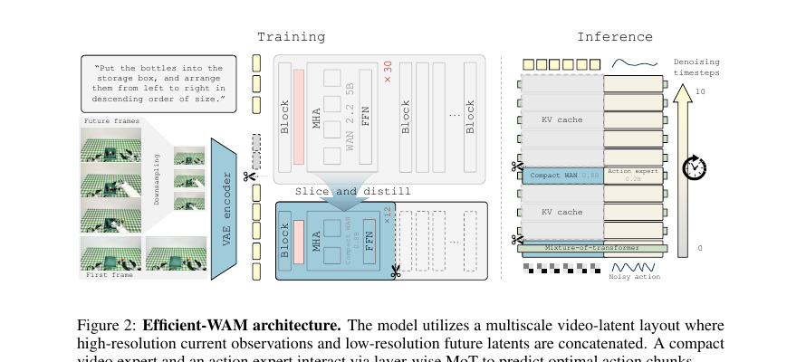

**Caption:** Efficient-WAM architecture. The model utilizes a multiscale video-latent layout where high-resolution current observations and low-resolution future latents are concatenated. A compact video expert and an action expert interact via layer-wise MoT to predict optimal action chunks.

**Caption[CN]:** Efficient-WAM 架构。模型采用多尺度视频潜变量布局，拼接高分辨率当前观测与低分辨率未来潜变量。紧凑视频专家和动作专家通过逐层 MoT 交互，以预测最优动作块。

## 3.2 Compact Architecture with World-Knowledge Transfer

> <strong>Para. 0:</strong> The 1B-parameter system comprises a 0.8B compact video expert and a 0.2B action expert; its teacher is WAN-2.2-5B.

> <strong>Para. 0[CN]:</strong> 该 1B 参数系统由 0.8B 紧凑视频专家与 0.2B 动作专家组成；教师模型为 WAN-2.2-5B。

> <strong>Para. 1:</strong> Large-scale video-generation backbones encode rich world priors, yet massive parameter counts make them ill-suited for real-time robotic control. We adopt a compact MoT architecture with a lightweight video expert and dedicated action expert, retaining necessary world priors while reducing computation.

> <strong>Para. 1[CN]:</strong> 大规模视频生成骨干编码丰富世界先验，但其庞大参数量不适合实时机器人控制。本文采用紧凑 MoT 架构，以轻量视频专家和专用动作专家在保留必要世界先验时降低计算。

> <strong>Para. 2:</strong> We prune WAN-2.2-5B by reducing Transformer depth and width. Instead of random initialization, selected teacher-layer weights are copied via layer slicing so the student inherits geometry, motion, and contact priors while shedding capacity for high-fidelity pixel rendering. Standard video flow matching is supplemented with a teacher-guided distillation loss aligning intermediate hidden states and temporal changes.

> <strong>Para. 2[CN]:</strong> 本文通过减少 Transformer 深度和宽度剪枝 WAN-2.2-5B。学生不随机初始化，而是通过层切片复制选定教师层权重，从而继承几何、运动与接触先验，并去除用于高保真像素渲染的容量。标准视频流匹配还加入教师引导蒸馏损失，对齐中间隐藏状态和时间变化。

> <strong>Para. 3:</strong> The compact video expert is coupled layer-wise with the action expert. Instructions enter through cross-attention; robot states and noisy actions are embedded as action tokens. At each MoT layer, action tokens attend to video tokens for future context before returning to the action stream. During main action training, the video expert is frozen to preserve stable world priors while optimizing the action expert.

> <strong>Para. 3[CN]:</strong> 紧凑视频专家与动作专家逐层耦合。指令经交叉注意力注入，机器人状态与带噪动作嵌入为动作 token。每个 MoT 层中，动作 token 关注视频 token 以获取未来上下文，再映射回动作流。主要动作训练阶段冻结视频专家，以在优化动作专家时保留稳定世界先验。

## 3.3 Coarse Future Prediction with Multiscale Video-Latent Layout

> <strong>Para. 1:</strong> Standard WAMs predict future videos at the input resolution, wasting capacity on action-irrelevant details. Efficient-WAM encodes the current observation into high-resolution condition tokens (e.g., $384\times320$), but downsamples target future frames (e.g., $192\times160$) before VAE encoding to obtain token-sparse low-resolution future latents. Both are patchified and concatenated. Joint attention therefore retains high-fidelity current-state detail while using coarse future dynamics as guidance. Ablations show that intentionally reducing future-token density preserves action accuracy while cutting attention cost and accelerating inference.

> <strong>Para. 1[CN]:</strong> 标准 WAM 以输入分辨率预测未来视频，将容量浪费于动作无关细节。Efficient-WAM 把当前观测编码为高分辨率条件 token（如 $384\times320$），但在 VAE 编码前下采样目标未来帧（如 $192\times160$），得到 token 稀疏的低分辨率未来潜变量；二者经 patch 化后拼接。联合注意力因而既保留当前状态的高保真细节，又用粗粒度未来动力学作指导。消融显示，有意降低未来 token 密度可保持动作精度，同时削减注意力成本并加速推理。

## 3.4 Asymmetric Video-Action Denoising

> <strong>Para. 1:</strong> Video and action branches conventionally share a denoising schedule, although visual structure and precise control coordinates converge at different rates. Actions require precise multi-step sampling; future video needs only coarse dynamic context. Global structure such as object geometry and contact boundaries appears in the first few steps, so a long schedule for photorealistic textures is wasteful.

> <strong>Para. 1[CN]:</strong> 视频与动作分支通常共享去噪日程，但视觉结构与精确控制坐标的收敛速率不同。动作需要精确多步采样；未来视频只需粗粒度动态上下文。物体几何、接触边界等全局结构在最初几步就出现，因此为照片级纹理执行长日程十分浪费。

> <strong>Para. 2:</strong> At inference, training-free asymmetric denoising allocates more steps to action (e.g., 5–10) and refreshes video far fewer times (e.g., only the initial 2 steps). Cached video features condition ongoing action refinement between refreshes. Video generation stops once actionable dynamics are clear, substantially reducing overhead with negligible success loss.

> <strong>Para. 2[CN]:</strong> 推理时，免训练的非对称去噪为动作分配更多步（如 5–10），而视频只少量刷新（如最初 2 步）。刷新之间复用缓存视频特征来调节持续的动作细化。一旦可行动力学明确就停止视频生成，以几乎可忽略的成功率损失显著降低开销。

## 3.5 Training Objectives

> <strong>Para. 1:</strong> Both branches use conditional flow matching [31, 32]. Let $x_1$ be target data (clean future video latent $x^v_1$ or action chunk $x^a_1$), $x_0\sim\mathcal N(0,I)$, $x_t=(1-t)x_0+tx_1$, and $u_t=x_1-x_0$. The unified objective is:

> <strong>Para. 1[CN]:</strong> 两个分支均使用条件流匹配 [31, 32]。令 $x_1$ 为目标数据（干净未来视频潜变量 $x^v_1$ 或动作块 $x^a_1$），$x_0\sim\mathcal N(0,I)$，$x_t=(1-t)x_0+tx_1$，$u_t=x_1-x_0$。统一目标为：

$$\mathcal L_{\mathrm{FM}}=\mathbb E_{t,x_0,x_1}\left[\lVert f(x_t,t;c)-u_t\rVert_2^2\right].\tag{3}$$

> <strong>Para. 2:</strong> Training has three phases. Stage 1 adapts the compact video expert with $\mathcal L_{\mathrm{stage\text{-}1}}=\mathcal L_{\mathrm{video\text{-}FM}}+\lambda_{\mathrm{distill}}\mathcal L_{\mathrm{distill}}$. Stage 2 attaches the action expert, freezes video, and uses $\mathcal L_{\mathrm{stage\text{-}2}}=\mathcal L_{\mathrm{action\text{-}FM}}+\lambda_v\mathcal L_{\mathrm{video\text{-}FM}}$. Stage 3 co-trains both experts end-to-end with the same joint objective.

> <strong>Para. 2[CN]:</strong> 训练分三阶段。阶段 1 用 $\mathcal L_{\mathrm{stage\text{-}1}}=\mathcal L_{\mathrm{video\text{-}FM}}+\lambda_{\mathrm{distill}}\mathcal L_{\mathrm{distill}}$ 适配紧凑视频专家。阶段 2 接入动作专家、冻结视频分支，并使用 $\mathcal L_{\mathrm{stage\text{-}2}}=\mathcal L_{\mathrm{action\text{-}FM}}+\lambda_v\mathcal L_{\mathrm{video\text{-}FM}}$。阶段 3 以相同联合目标端到端共同训练两个专家。

## 4 Experiments
## 4.1 Experimental Setup and Model Variants

> <strong>Para. 1:</strong> Efficient-WAM is the structural baseline, isolating the compact video expert while retaining high-resolution futures and symmetric denoising; it provides an upper bound for the distilled 1B architecture. Efficient-WAM-RT adds low-resolution future latents and asymmetric denoising for real-time deployment, trading marginal accuracy for speed. Both predict closed-loop action chunks with $H=16$ via flow matching. RoboTwin simulation and ablations use one A800 GPU; real-world Astribot S1 latency uses a local RTX 4090.

> <strong>Para. 1[CN]:</strong> Efficient-WAM 是结构基线：仅考察紧凑视频专家，同时保留高分辨率未来预测和对称去噪，给出蒸馏后 1B 架构的能力上界。Efficient-WAM-RT 加入低分辨率未来潜变量与非对称去噪，面向实时部署，以少量精度换速度。二者均通过流匹配预测 $H=16$ 的闭环动作块。RoboTwin 仿真与消融使用单张 A800；Astribot S1 真实延迟使用本地 RTX 4090。

## 4.2 Evaluation in Simulation Environment

> <strong>Para. 1:</strong> RoboTwin 2.0 [34] contains 50 bimanual manipulation tasks under clean and randomized visual settings. Models are co-trained on 2,500 clean and 25,000 randomized demonstrations and evaluated with 100 trials per task per setting. Baselines include VLA methods $\pi_0$ [35], StarVLA-$\alpha$ [36], $\pi_{0.5}$ [37], ABot-M0 [38], and LingBot-VLA [39], plus WAM methods UWM [19], GigaWorld-Policy [21], and Motus [11].

> <strong>Para. 1[CN]:</strong> RoboTwin 2.0 [34] 包含 50 个双臂操作任务，使用干净与随机化视觉设置。模型在 2,500 条干净和 25,000 条随机化示范上共同训练，每任务、每设置评估 100 次。基线包括 VLA 方法 $\pi_0$ [35]、StarVLA-$\alpha$ [36]、$\pi_{0.5}$ [37]、ABot-M0 [38]、LingBot-VLA [39]，以及 WAM 方法 UWM [19]、GigaWorld-Policy [21]、Motus [11]。

### Table 1. RoboTwin 2.0 主结果

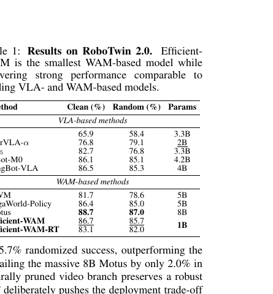

**Caption:** Results on RoboTwin 2.0. Efficient-WAM is the smallest WAM-based model while delivering strong performance comparable to leading VLA- and WAM-based models.

**Caption[CN]:** RoboTwin 2.0 结果。Efficient-WAM 是参数量最小的 WAM 模型，同时性能可比领先 VLA 与 WAM 模型。

| Method | Family | Clean (%) | Random (%) | Params |
|---|---|---|---|---|
| π0 | VLA | 65.9 | 58.4 | 3.3B |
| StarVLA-α | VLA | 76.8 | 79.1 | 2B |
| π0.5 | VLA | 82.7 | 76.8 | 3.3B |
| ABot-M0 | VLA | 86.1 | 85.1 | 4.2B |
| LingBot-VLA | VLA | 86.5 | 85.3 | 4B |
| UWM | WAM | 81.7 | 78.6 | 5B |
| GigaWorld-Policy | WAM | 86.4 | 85.0 | 5B |
| Motus | WAM | 88.7 | 87.0 | 8B |
| Efficient-WAM | WAM | 86.7 | 85.7 | 1B |
| Efficient-WAM-RT | WAM | 83.1 | 82.0 | 1B |

> <strong>Para. 2:</strong> At 1B parameters, Efficient-WAM reaches 86.7% clean and 85.7% randomized success, outperforming 4B LingBot-VLA and 5B GigaWorld-Policy while trailing 8B Motus by 2.0 points in clean evaluation. Efficient-WAM-RT deliberately shifts to 83.1%/82.0% while still beating several heavyweight baselines, securing the latency needed for reactive deployment.

> <strong>Para. 2[CN]:</strong> Efficient-WAM 仅 1B 参数，却达到 86.7% 干净与 85.7% 随机化成功率，超过 4B LingBot-VLA 与 5B GigaWorld-Policy，在干净设置下仅落后 8B Motus 2.0 个百分点。Efficient-WAM-RT 有意将结果调整至 83.1%/82.0%，仍超过若干重型基线，并换得反应式部署所需延迟。

## 4.3 Real-World Experiments

> <strong>Para. 1:</strong> Efficient-WAM-RT is deployed on Astribot S1 for four tasks probing localization, gentle handling, long-horizon semantic grounding, and bimanual coordination. All models ($\pi_{0.5}$, Motus, and ours) use the same 100 human demonstrations per task with one policy per task and are evaluated for 20 trials each.

> <strong>Para. 1[CN]:</strong> Efficient-WAM-RT 部署在 Astribot S1 上，评估四项任务，覆盖定位、轻柔操作、长时程语义落地与双臂协调。所有模型（$\pi_{0.5}$、Motus 和本文模型）每任务均使用相同的 100 条人工示范、训练专用策略，并各评估 20 次。

### Table 2. Astribot S1 真实世界结果

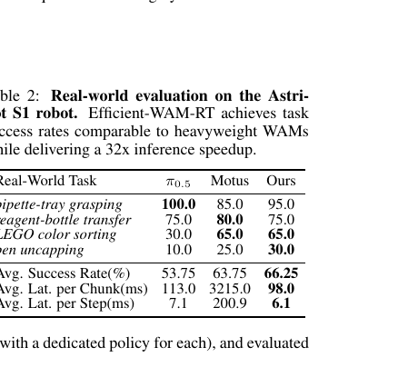

**Caption:** Real-world evaluation on the Astribot S1 robot. Efficient-WAM-RT achieves task success rates comparable to heavyweight WAMs while delivering a 32× inference speedup.

**Caption[CN]:** Astribot S1 真实世界评估。Efficient-WAM-RT 的任务成功率可比重型 WAM，同时推理加速 32×。

| Real-World Task | π0.5 | Motus | Ours |
|---|---|---|---|
| pipette-tray grasping | 100.0 | 85.0 | 95.0 |
| reagent-bottle transfer | 75.0 | 80.0 | 75.0 |
| LEGO color sorting | 30.0 | 65.0 | 65.0 |
| pen uncapping | 10.0 | 25.0 | 30.0 |
| Avg. Success Rate (%) | 53.75 | 63.75 | 66.25 |
| Avg. Lat. per Chunk (ms) | 113.0 | 3215.0 | 98.0 |
| Avg. Lat. per Step (ms) | 7.1 | 200.9 | 6.1 |

> <strong>Para. 2:</strong> Efficient-WAM-RT slightly exceeds Motus in average success (66.25% vs. 63.75%) with only 98 ms per chunk, a 32× speedup. $\pi_{0.5}$ handles simple grasping but struggles on LEGO sorting and pen uncapping; both WAMs remain stronger on those complex tasks. The result supports replacing expensive photorealism with essential geometry, motion, and contact cues.

> <strong>Para. 2[CN]:</strong> Efficient-WAM-RT 的平均成功率略高于 Motus（66.25% 对 63.75%），每动作块仅 98 ms，获得 32× 加速。$\pi_{0.5}$ 擅长简单抓取，却在 LEGO 排序和开笔帽上明显困难；两个 WAM 在复杂任务上更强。结果支持以必要的几何、运动与接触线索取代昂贵的照片级真实生成。

### Figure 3. 真实世界操作任务

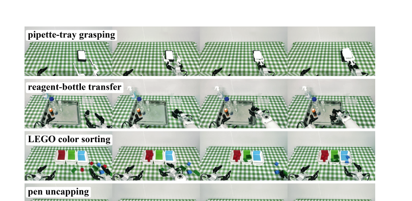

**Caption:** Real-world manipulation tasks. Evaluation on the Astribot S1 robot covers precise grasping, object transfer, semantic sorting, and bimanual coordination.

**Caption[CN]:** 真实世界操作任务。Astribot S1 上的评估覆盖精确抓取、物体转移、语义排序与双臂协调。

## 4.4 Ablation Studies

> <strong>Para. 1:</strong> The three video-side designs are ablated progressively on RoboTwin 2.0. All ablation models use 20 rollouts per task across 50 tasks; therefore absolute rates have expected minor variance from the 100-rollout main results.

> <strong>Para. 1[CN]:</strong> 三项视频侧设计在 RoboTwin 2.0 上逐步消融。所有消融模型在 50 个任务上每任务评估 20 次，因此绝对成功率相较每任务 100 次的主结果存在预期的小幅方差。

> <strong>Para. 2:</strong> **Compact Video Expert.** Randomly initialized downsizing severely degrades performance. Layer slicing is critical; teacher-guided distillation further closes the gap to the 5B teacher while reducing latency from 2013 ms to 430 ms.

> <strong>Para. 2[CN]:</strong> **紧凑视频专家。** 随机初始化的缩小模型性能严重下降。层切片至关重要；教师引导蒸馏进一步缩小与 5B 教师的差距，同时将延迟从 2013 ms 降至 430 ms。

> <strong>Para. 3:</strong> **Future Resolution.** Lower-resolution latents reduce tokens from 240 to 60 and latency from 430 ms to 377 ms while preserving success, indicating reliance on coarse structural cues rather than sharp details.

> <strong>Para. 3[CN]:</strong> **未来分辨率。** 低分辨率潜变量将 token 从 240 降至 60、延迟从 430 ms 降至 377 ms，同时保持成功率，说明动作主要依赖粗粒度结构线索而非清晰细节。

### Table 3. 视频专家设计消融

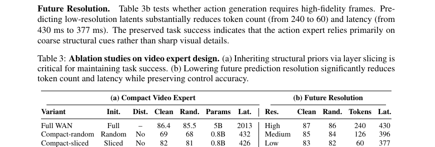

**Caption:** Ablation studies on video expert design. (a) Inheriting structural priors via layer slicing is critical for maintaining task success. (b) Lowering future prediction resolution significantly reduces token count and latency while preserving control accuracy.

**Caption[CN]:** 视频专家设计消融。（a）通过层切片继承结构先验对保持任务成功率至关重要。（b）降低未来预测分辨率显著减少 token 数和延迟，同时保持控制精度。

| Variant | Init. | Dist. | Clean | Rand. | Params | Lat. (ms) |
|---|---|---|---|---|---|---|
| Full WAN | Full | – | 86.4 | 85.5 | 5B | 2013 |
| Compact-random | Random | No | 69 | 68 | 0.8B | 432 |
| Compact-sliced | Sliced | No | 82 | 81 | 0.8B | 426 |
| Efficient-WAM | Sliced | Yes | 87 | 86 | 0.8B | 430 |

| Future Res. | Clean | Rand. | Tokens | Lat. (ms) |
|---|---|---|---|---|
| High | 87 | 86 | 240 | 430 |
| Medium | 85 | 84 | 126 | 396 |
| Low | 83 | 82 | 60 | 377 |

> <strong>Para. 4:</strong> **Asymmetric Video-Action Denoising.** Configurations are $[T_v,T_a]$. Reducing $[10,10]$ to $[2,10]$ cuts latency from 430 to 139 ms (3.1×) while success changes only from 87.1% to 86.3%. The video branch can stop after actionable geometry emerges while action-side refinement continues.

> <strong>Para. 4[CN]:</strong> **非对称视频—动作去噪。** 配置记作 $[T_v,T_a]$。从 $[10,10]$ 降至 $[2,10]$，延迟由 430 降至 139 ms（3.1×），成功率仅由 87.1% 变为 86.3%。视频分支可在可行动几何出现后停止，而动作侧继续细化。

### Figure 4. 非对称去噪的延迟—成功率权衡

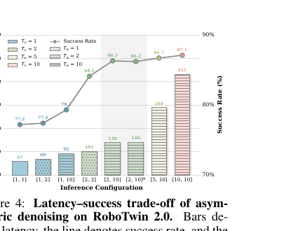

**Caption:** Latency–success trade-off of asymmetric denoising on RoboTwin 2.0. Bars denote latency, the line denotes success rate, and the shaded region marks our selected configuration.

**Caption[CN]:** RoboTwin 2.0 上非对称去噪的延迟—成功率权衡。柱表示延迟，折线表示成功率，阴影表示选定配置。

## 4.5 System-Level Efficiency Analysis

> <strong>Para. 1:</strong> Distillation cuts latency from over 2000 ms to about 430 ms. From there, low-resolution futures independently reduce it to 377 ms and asymmetric denoising to 139 ms. Efficient-WAM-RT combines all three on a local RTX 4090, removes simulation overheads, and reaches 98 ms per action chunk—about 30× faster than standard WAMs.

> <strong>Para. 1[CN]:</strong> 蒸馏将延迟从 2000 ms 以上降至约 430 ms；在此基础上，低分辨率未来独立降至 377 ms，非对称去噪独立降至 139 ms。Efficient-WAM-RT 在本地 RTX 4090 上组合三者并移除仿真开销，达到每动作块 98 ms，约比标准 WAM 快 30×。

## 5 Conclusion

> <strong>Para. 1:</strong> Efficient-WAM addresses the WAM deployment bottleneck through action-centric future imagination, prioritizing control-relevant physical priors over photorealistic rendering. Structured world-knowledge transfer, low-resolution future latents, and asymmetric denoising substantially reduce latency while maintaining accuracy comparable to heavyweight WAMs, enabling real-time closed-loop control.

> <strong>Para. 1[CN]:</strong> Efficient-WAM 以动作为中心的未来想象解决 WAM 部署瓶颈，优先保留控制相关物理先验而非照片级渲染。结构化世界知识迁移、低分辨率未来潜变量和非对称去噪在维持可比重型 WAM 的精度时显著降低延迟，支持实时闭环控制。

## 6 Limitations

> <strong>Para. 1:</strong> **Trade-off in Fine-Grained Tasks.** Coarse, low-resolution future latents trade visual fidelity for speed. Although effective for macroscopic manipulation such as grasping, transfer, and sorting, tasks requiring extreme pixel-level precision or micro-manipulation (e.g., thread insertion) may benefit from higher-resolution guidance.

> <strong>Para. 1[CN]:</strong> **细粒度任务的权衡。** 粗糙的低分辨率未来潜变量以视觉保真度换速度。它对抓取、转移、排序等宏观操作有效，但要求极端像素级精度或微操作的任务（如穿线）可能仍受益于高分辨率视觉指导。

> <strong>Para. 2:</strong> **Static Inference Schedules.** Efficient-WAM-RT currently uses a fixed asymmetric schedule (e.g., $[2,10]$) during physical deployment. Future work could allocate compute dynamically, increasing video denoising only when dynamics are uncertain or complex.

> <strong>Para. 2[CN]:</strong> **静态推理日程。** Efficient-WAM-RT 在实体部署中目前使用固定非对称日程（如 $[2,10]$）。未来可动态分配计算，仅在任务动力学不确定或复杂时增加视频去噪预算。

## Acknowledgments

> <strong>Para. 1:</strong> This work was supported by the Beijing Natural Science Foundation (L252060).

> <strong>Para. 1[CN]:</strong> 本工作得到北京市自然科学基金（L252060）支持。

## References

Bibliographic entries are retained in English, in source order, for searchability.

[1] S. Wang, J. Shi, Z. Fu, X. He, F. Liu, C. Yang, Y. Zhou, Z. Fei, J. Gong, J. Fu, M. Z. Shou, X. Huang, X. Qiu, and Y.-G. Jiang. World action models: The next frontier in embodied ai. arXiv preprint arXiv:2605.12090, 2026.

[2] B. Hou, G. Li, J. Jia, T. An, X. Guo, S. Leng, H. Geng, Y. Ze, T. Harada, P. Torr, O. Mees, M. Pollefeys, Z. Liu, J. Wu, P. Abbeel, J. Malik, Y. Du, and J. Yang. World model for robot learning: A comprehensive survey. arXiv preprint arXiv:2605.00080, 2026.

[3] C. Finn and S. Levine. Deep visual foresight for planning robot motion. In Proceedings of the IEEE International Conference on Robotics and Automation, 2017.

[4] Y. Hu, Y. Guo, P. Wang, X. Chen, Y.-J. Wang, J. Zhang, K. Sreenath, C. Lu, and J. Chen. Video prediction policy: A generalist robot policy with predictive visual representations. In Proceedings of the International Conference on Machine Learning, 2025.

[5] H. Wu, Y. Jing, C. Cheang, G. Chen, J. Xu, X. Li, M. Liu, H. Li, and T. Kong. Unleashing large-scale video generative pre-training for visual robot manipulation. In Proceedings of the International Conference on Learning Representations, 2024.

[6] Y. Du, M. Yang, B. Dai, H. Dai, O. Nachum, J. B. Tenenbaum, D. Schuurmans, and P. Abbeel. Learning universal policies via text-guided video generation. In Advances in Neural Informa- tion Processing Systems, 2023.

[7] S. Li, Y. Gao, D. Sadigh, and S. Song. Unified video action model. In Proceedings of Robotics: Science and Systems, 2025.

[8] M. J. Kim, Y. Gao, T.-Y. Lin, Y.-C. Lin, Y. Ge, G. Lam, P. Liang, S. Song, M.-Y. Liu, C. Finn, and J. Gu. Cosmos policy: Fine-tuning video models for visuomotor control and planning. arXiv preprint arXiv:2601.16163, 2026.

[9] S. Ye, Y. Ge, K. Zheng, S. Gao, S. Yu, G. Kurian, S. Indupuru, Y. L. Tan, C. Zhu, J. Xiang, et al. World action models are zero-shot policies. arXiv preprint arXiv:2602.15922, 2026.

[10] T. Yuan, Z. Dong, Y. Liu, and H. Zhao. Fast-WAM: Do world action models need test-time future imagination? arXiv preprint arXiv:2603.16666, 2026.

[11] H. Bi, H. Tan, S. Xie, Z. Wang, S. Huang, H. Liu, R. Zhao, Y. Feng, C. Xiang, Y. Rong, H. Zhao, H. Liu, Z. Su, L. Ma, H. Su, and J. Zhu. Motus: A unified latent action world model. arXiv preprint arXiv:2512.13030, 2025.

[12] L. Li, Q. Zhang, Y. Luo, S. Yang, R. Wang, F. Han, M. Yu, Z. Gao, N. Xue, X. Zhu, Y. Shen, and Y. Xu. Causal world modeling for robot control. arXiv preprint arXiv:2601.21998, 2026.

[13] Wan Team. Wan: Open and advanced large-scale video generative models. arXiv preprint arXiv:2503.20314, 2025.

[14] Y. Yue, Y. Wang, B. Kang, Y. Han, S. Wang, S. Song, J. Feng, and G. Huang. DeeR-VLA: Dynamic inference of multimodal large language models for efficient robot execution. In Advances in Neural Information Processing Systems, volume 37, 2024.

[15] Z. Yang, Y. Qi, T. Xie, B. Yu, S. Liu, and M. Li. DySL-VLA: Efficient vision-language-action model inference via dynamic-static layer-skipping for robot manipulation. arXiv preprint arXiv:2602.22896, 2026. 9

[16] Y. Song, P. Dhariwal, M. Chen, and I. Sutskever. Consistency models. In Proceedings of the 40th International Conference on Machine Learning, volume 202 of Proceedings of Machine Learning Research, pages 32211–32252, 2023.

[17] A. Prasad, K. Lin, J. Wu, L. Zhou, and J. Bohg. Consistency policy: Accelerated visuomotor policies via consistency distillation. In Proceedings of Robotics: Science and Systems, 2024. arXiv:2405.07503.

[18] Z. Wang, Z. Li, A. Mandlekar, Z. Xu, J. Fan, Y. Narang, L. Fan, Y. Zhu, Y. Balaji, M. Zhou, M.-Y. Liu, and Y. Zeng. One-step diffusion policy: Fast visuomotor policies via diffusion dis- tillation. In Proceedings of the 42nd International Conference on Machine Learning, volume 267 of Proceedings of Machine Learning Research, pages 59770–59791, 2025.

[19] C. Zhu, R. Yu, S. Feng, B. Burchfiel, P. Shah, and A. Gupta. Unified world models: Coupling video and action diffusion for pretraining on large robotic datasets. In Proceedings of Robotics: Science and Systems, 2025. arXiv:2504.02792.

[20] H. Luo, W. Zhang, Y. Feng, S. Zheng, H. Xu, C. Xu, Z. Xi, Y. Fu, and Z. Lu. Being-H0.7: A latent World-Action model from egocentric videos. arXiv preprint arXiv:2605.00078, 2026.

[21] A. Ye, B. Wang, C. Ni, G. Huang, G. Zhao, H. Li, H. Li, J. Li, J. Lv, J. Liu, M. Cao, P. Li, Q. Deng, W. Mei, X. Wang, X. Chen, X. Zhou, Y. Wang, Y. Chang, Y. Li, Y. Zhou, Y. Ye, Z. Liu, and Z. Zhu. GigaWorld-Policy: An efficient action-centered world–action model. arXiv preprint arXiv:2603.17240, 2026.

[22] J. Guo, Q. Li, P. Li, Z. Chen, N. Sun, Y. Su, H. Wang, Y. Zhang, X. Li, and H. Liu. Unified 4D world action modeling from video priors with asynchronous denoising. arXiv preprint arXiv:2604.26694, 2026.

[23] M. J. Kim, K. Pertsch, S. Karamcheti, T. Xiao, A. Balakrishna, S. Nair, R. Rafailov, E. P. Foster, P. R. Sanketi, Q. Vuong, T. Kollar, B. Burchfiel, R. Tedrake, D. Sadigh, S. Levine, P. Liang, and C. Finn. OpenVLA: An open-source vision-language-action model. In Proceedings of the 8th Conference on Robot Learning, volume 270 of Proceedings of Machine Learning Research, pages 2679–2713, 2025.

[24] Y. Ye, J. Ma, J. Cen, and Z. Lu. Token expand-merge: Training-free token compression for vision-language-action models. arXiv preprint arXiv:2512.09927, 2025.

[25] W. Guan, Q. Hu, A. Li, and J. Cheng. Efficient vision-language-action models for embodied manipulation: A systematic survey. arXiv preprint arXiv:2510.17111, 2025.

[26] C. Chi, Z. Xu, S. Feng, E. Cousineau, Y. Du, B. Burchfiel, R. Tedrake, and S. Song. Diffusion policy: Visuomotor policy learning via action diffusion. In Proceedings of Robotics: Science and Systems, 2023. arXiv:2303.04137.

[27] G. Hinton, O. Vinyals, and J. Dean. Distilling the knowledge in a neural network. arXiv preprint arXiv:1503.02531, 2015.

[28] X. Jiao, Y. Yin, L. Shang, X. Jiang, X. Chen, L. Li, F. Wang, and Q. Liu. TinyBERT: Distilling BERT for natural language understanding. In Findings of the Association for Computational Linguistics: EMNLP 2020, pages 4163–4174, 2020.

[29] A. Fan, E. Grave, and A. Joulin. Reducing transformer depth on demand with structured dropout. In Proceedings of the International Conference on Learning Representations, 2020.

[30] P. Molchanov, S. Tyree, T. Karras, T. Aila, and J. Kautz. Pruning convolutional neural networks for resource efficient inference. In Proceedings of the International Conference on Learning Representations, 2017. 10

[31] Y. Lipman, R. T. Q. Chen, H. Ben-Hamu, M. Nickel, and M. Le. Flow matching for generative modeling. In Proceedings of the International Conference on Learning Representations, 2023.

[32] X. Liu, C. Gong, and Q. Liu. Flow straight and fast: Learning to generate and transfer data with rectified flow. In Proceedings of the International Conference on Learning Representations, 2023.

[33] T. Z. Zhao, V. Kumar, S. Levine, and C. Finn. Learning fine-grained bimanual manipulation with low-cost hardware. In Proceedings of Robotics: Science and Systems, 2023.

[34] T. Chen, Z. Chen, B. Chen, Z. Cai, Y. Liu, Z. Li, Q. Liang, X. Lin, Y. Ge, Z. Gu, W. Deng, Y. Guo, T. Nian, X. Xie, Q. Chen, K. Su, T. Xu, G. Liu, M. Hu, H.-a. Gao, K. Wang, Z. Liang, Y. Qin, X. Yang, P. Luo, and Y. Mu. RoboTwin 2.0: A scalable data generator and benchmark with strong domain randomization for robust bimanual robotic manipulation. arXiv preprint arXiv:2506.18088, 2025.

[35] K. Black, N. Brown, D. Driess, A. Esmail, M. Equi, C. Finn, N. Fusai, L. Groom, K. Haus- man, B. Ichter, S. Jakubczak, T. Jones, L. Ke, S. Levine, A. Li-Bell, M. Mothukuri, S. Nair, K. Pertsch, L. X. Shi, J. Tanner, Q. Vuong, A. Walling, H. Wang, and U. Zhilinsky. π0 : A vision-language-action flow model for general robot control. In Proceedings of Robotics: Sci- ence and Systems, 2025.

[36] J. Ye, N. Gao, S. Yang, J. Zheng, Z. Wang, Y. Chen, P. Chen, Y. Chen, S. Liu, and J. Jia. StarVLA-α: Reducing complexity in vision-language-action systems. arXiv preprint arXiv:2604.11757, 2026.

[37] Physical Intelligence, K. Black, N. Brown, J. Darpinian, K. Dhabalia, D. Driess, A. Esmail, M. Equi, C. Finn, N. Fusai, M. Y. Galliker, D. Ghosh, L. Groom, K. Hausman, B. Ichter, S. Jakubczak, T. Jones, L. Ke, D. LeBlanc, S. Levine, A. Li-Bell, M. Mothukuri, S. Nair, K. Pertsch, A. Z. Ren, L. X. Shi, L. Smith, J. T. Springenberg, K. Stachowicz, J. Tanner, Q. Vuong, H. Walke, A. Walling, H. Wang, L. Yu, and U. Zhilinsky. π0.5 : A vision-language- action model with open-world generalization. In Proceedings of the Conference on Robot Learning, pages 17–40, 2025.

[38] Y. Yang, S. Zeng, T. Lin, X. Chang, D. Qi, J. Xiao, H. Liu, R. Chen, Y. Chen, D. Huo, F. Xiong, X. Wei, Z. Ma, and M. Xu. ABot-M0: VLA foundation model for robotic manipulation with action manifold learning. arXiv preprint arXiv:2602.11236, 2026.

[39] W. Wu, F. Lu, Y. Wang, S. Yang, S. Liu, F. Wang, Q. Zhu, H. Sun, Y. Wang, S. Ma, Y. Ren, K. Zhang, H. Yu, J. Zhao, S. Zhou, Z. Qiu, H. Xiong, Z. Wang, Z. Wang, R. Cheng, Y.-L. Li, Y. Huang, X. Zhu, Y. Shen, and K. Zheng. A pragmatic VLA foundation model. arXiv preprint arXiv:2601.18692, 2026.

[40] Q. Sun, X. Chi, Y. Rui, Y. Li, K. Ge, J. Li, S. Han, and S. Zhang. Labshield: A multimodal benchmark for safety-critical reasoning and planning in scientific laboratories. arXiv preprint arXiv:2603.11987, 2026. 11 Appendix

## Appendix
## A Training Details

### Table 4. 训练阶段与优化设置

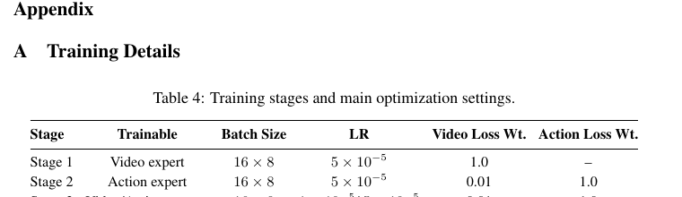

**Caption:** Training stages and main optimization settings.

**Caption[CN]:** 训练阶段与主要优化设置。

| Stage | Trainable | Batch Size | LR | Video Loss Wt. | Action Loss Wt. |
|---|---|---|---|---|---|
| Stage 1 | Video expert | 16 × 8 | 5 × 10⁻⁵ | 1.0 | – |
| Stage 2 | Action expert | 16 × 8 | 5 × 10⁻⁵ | 0.01 | 1.0 |
| Stage 3 | Video/Action experts | 16 × 8 | 1 × 10⁻⁵ / 5 × 10⁻⁵ | 0.01 | 1.0 |
| Shared | AdamW; cosine LR; bf16; weight decay 1 × 10⁻³ |  |  |  |  |

> <strong>Para. 1:</strong> Table 4 outlines the staged recipe used in simulation and real-world experiments. Stage 1 constructs the compact video expert; Stage 2 attaches the action expert and freezes video; Stage 3 jointly refines both experts with distinct learning rates.

> <strong>Para. 1[CN]:</strong> 表 4 给出仿真和真实实验共用的分阶段配方。阶段 1 构建紧凑视频专家；阶段 2 接入动作专家并冻结视频分支；阶段 3 以不同学习率联合细化两个专家。

> <strong>Para. 2:</strong> Stage 1 initializes a 12-layer WAN student by selecting teacher layers $[1,2,4,6,8,11,14,17,20,23,26,30]$. Width is 2048 hidden dimensions, 8192 FFN dimensions, and 16 attention heads, obtained by extracting corresponding attention heads, FFN channels, embeddings, modulation parameters, and output heads.

> <strong>Para. 2[CN]:</strong> 阶段 1 从教师层 $[1,2,4,6,8,11,14,17,20,23,26,30]$ 选择并初始化 12 层 WAN 学生。宽度设为 2048 隐藏维、8192 FFN 维和 16 个注意力头，通过直接提取对应注意力头、FFN 通道、嵌入、调制参数与输出头得到。

> <strong>Para. 3:</strong> The frozen teacher provides auxiliary supervision. Stage 1 combines ground-truth video flow matching with hidden-state $\mathcal L_{\mathrm{hid}}$ and temporal-motion $\mathcal L_{\mathrm{mot}}$ distillation. Let $\tilde h^l_{s,n}$ and $\tilde h^{\tau(l)}_{t,n}$ be 256-dimensional projected student and teacher hidden states at aligned layers, for visual token $n$:

> <strong>Para. 3[CN]:</strong> 冻结教师提供辅助监督。阶段 1 将真值视频流匹配与隐藏状态 $\mathcal L_{\mathrm{hid}}$、时间运动 $\mathcal L_{\mathrm{mot}}$ 蒸馏结合。令 $\tilde h^l_{s,n}$ 与 $\tilde h^{\tau(l)}_{t,n}$ 为对齐层上视觉 token $n$ 的 256 维投影学生/教师隐藏状态：

$$\mathcal L_{\mathrm{hid}}=\frac{1}{|\mathcal A_{\mathrm{hid}}|}\sum_{l\in\mathcal A_{\mathrm{hid}}}\mathbb E_n\left[1-\cos\!\left(\tilde h^l_{s,n},\tilde h^{\tau(l)}_{t,n}\right)\right].\tag{4}$$

> <strong>Para. 4:</strong> Spatial tokens are averaged per frame to obtain $h_f^l$, and frame-to-frame deltas $\Delta h_f^l=h_{f+1}^l-h_f^l$ define motion alignment:

> <strong>Para. 4[CN]:</strong> 每帧空间 token 求均值得到 $h_f^l$，帧间差分 $\Delta h_f^l=h_{f+1}^l-h_f^l$ 用于运动对齐：

$$\mathcal L_{\mathrm{mot}}=\frac{1}{|\mathcal A_{\mathrm{mot}}|}\sum_{l\in\mathcal A_{\mathrm{mot}}}\mathbb E_f\left[1-\cos\!\left(\Delta h^l_{s,f},\Delta h^{\tau(l)}_{t,f}\right)\right].\tag{5}$$

> <strong>Para. 5:</strong> The unified Stage-1 objective is:

> <strong>Para. 5[CN]:</strong> 统一阶段 1 目标为：

$$\mathcal L_{\mathrm{stage\text{-}1}}=\mathcal L_{\mathrm{video\text{-}FM}}+\lambda_{\mathrm{dist}}(\mathcal L_{\mathrm{hid}}+\mathcal L_{\mathrm{mot}}).\tag{6}$$

> <strong>Para. 6:</strong> The GT flow-matching weight remains 1.0 while $\lambda_{\mathrm{dist}}$ decays $0.2\rightarrow0.1\rightarrow0$, phasing out teacher guidance. In Stages 2–3, action and video use independently sampled flow-matching timesteps. For clean action $a$, future latent $z_v$, Gaussian noises $\epsilon_a,\epsilon_v$, and $t_a,t_v\in[0,1]$:

> <strong>Para. 6[CN]:</strong> 真值流匹配权重保持 1.0，而 $\lambda_{\mathrm{dist}}$ 按 $0.2\rightarrow0.1\rightarrow0$ 衰减，逐步退出教师指导。阶段 2–3 中，动作与视频独立采样流匹配时间步。对干净动作 $a$、未来潜变量 $z_v$、高斯噪声 $\epsilon_a,\epsilon_v$ 和 $t_a,t_v\in[0,1]$：

$$x^a_{t_a}=(1-t_a)\epsilon_a+t_a a,\quad u_a=a-\epsilon_a,\
x^v_{t_v}=(1-t_v)\epsilon_v+t_v z_v,\quad u_v=z_v-\epsilon_v.\tag{7}$$

> <strong>Para. 7:</strong> The model predicts action and video velocities with stage-specific weights:

> <strong>Para. 7[CN]:</strong> 模型以分阶段权重预测动作与视频速度：

$$\mathcal L_{\mathrm{joint}}=\lambda_a\lVert f_a(x^a_{t_a})-u_a\rVert_2^2+\lambda_v\lVert f_v(x^v_{t_v})-u_v\rVert_2^2.\tag{8}$$

> <strong>Para. 8:</strong> Distinct supervision intensities coexist with rich cross-modal interaction in shared joint attention. Simulation trains one multitask policy over all RoboTwin tasks; real-world experiments train one policy per task. Each stage lasts about 2.5 epochs in simulation and 5 epochs in real-world training.

> <strong>Para. 8[CN]:</strong> 不同监督强度与共享联合注意力中的丰富跨模态交互并存。仿真对所有 RoboTwin 任务训练单一多任务策略；真实实验每任务训练专用策略。每阶段在仿真中约 2.5 个 epoch，在真实训练中约 5 个 epoch。

## B Real-World Evaluation Details

### Figure 5. 真实机器人设置

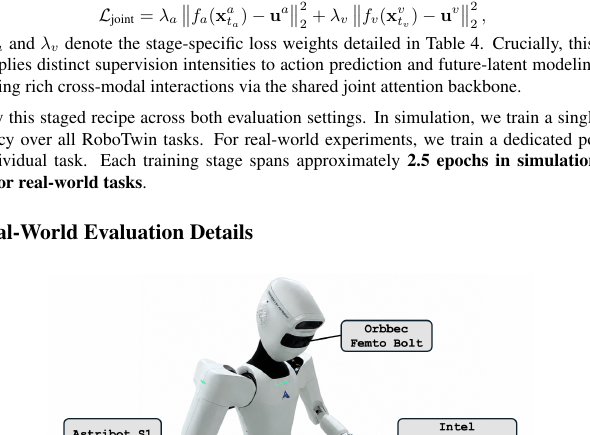

**Caption:** Real-world robot setup.

**Caption[CN]:** 真实世界机器人设置。

> <strong>Para. 1:</strong> **Evaluation protocol.** Policies use 100 training demonstrations and 20 trials per task on Astribot S1. Inputs are three RGB views (left wrist, right wrist, head) and 31-dimensional joint states. Objects are manually reset to randomized feasible poses. Success uses strict binary task-specific criteria; each trial is capped at 3 minutes.

> <strong>Para. 1[CN]:</strong> **评估协议。** Astribot S1 上每任务使用 100 条训练示范并评估 20 次。输入包含三个 RGB 视角（左右腕部、头部）和 31 维关节状态。每次运行前将物体人工重置到随机可行姿态。成功由严格的任务专用二元标准判定；每次最长 3 分钟。

> <strong>Para. 2:</strong> **Task criteria:**
>
> - **Pipette-tray grasping:** lift the tray, keep it strictly level on the custom bottom-support end-effector, avoid tilt/drops, and never touch the top surface.
> - **Reagent-bottle transfer:** lift and set down the fragile glass bottle without dropping, abrupt impact, or collision with adjacent containers [40].
> - **LEGO color sorting:** sort all 3–5 scattered blocks into color-matched containers, leaving none on the table.
> - **Pen uncapping:** one arm stabilizes the body while the other removes the cap; keep the holder upright and drop neither part.

> <strong>Para. 2[CN]:</strong> **任务标准：**
>
> - **移液器托盘抓取：** 抬起托盘，用定制底部支撑末端执行器严格保持水平，避免倾斜/掉落，且不得触碰顶面。
> - **试剂瓶转移：** 抬起并放下易碎玻璃瓶，不得掉落、猛烈撞击或碰撞相邻容器 [40]。
> - **LEGO 颜色排序：** 将全部 3–5 个散落积木放入颜色匹配容器，桌面不得遗漏。
> - **开笔帽：** 一臂固定笔身，另一臂拔帽；笔筒保持直立，笔和帽均不得掉落。

> <strong>Para. 3:</strong> **Execution protocol and runtime.** All models use receding-horizon control with $H=16$, executing 4 or 5 uniformly sampled steps from each chunk; each step represents 0.3 s of motion. Efficient-WAM-RT typically completes successful trials in about 30 s, while Motus needs around two minutes because of start-stop behavior.

> <strong>Para. 3[CN]:</strong> **执行协议与运行时间。** 所有模型使用 $H=16$ 的滚动时域控制，从每动作块均匀采样执行 4 或 5 步；每步对应 0.3 s 物理运动。Efficient-WAM-RT 成功试验通常约 30 s 完成，而 Motus 因走走停停约需两分钟。

> <strong>Para. 4:</strong> **Failure analysis.** Three recurring failures are fine spatial misalignment, incomplete scene coverage after occlusion/viewpoint drift, and contact/collision failure with surrounding objects.

> <strong>Para. 4[CN]:</strong> **失败分析。** 三类反复出现的失败为：细微空间错位；遮挡或视角漂移后场景覆盖不完整；以及与周围物体的接触/碰撞失败。

### Figure 6. 真实世界代表性失败案例

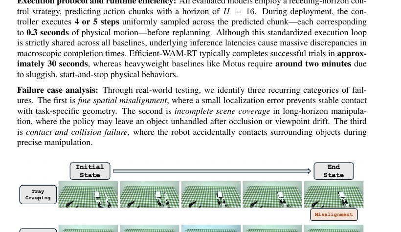

**Caption:** Representative real-world failure cases.

**Caption[CN]:** 代表性真实世界失败案例。

> <strong>Para. 5:</strong> Examples include the tray end-effector snagging the rack, a reagent bottle striking a nearby tray, the extracted pen catching and tipping its holder, and a final LEGO block in a corner remaining unhandled.

> <strong>Para. 5[CN]:</strong> 示例包括托盘末端执行器卡住底架、试剂瓶撞击附近托盘、拔出的笔勾住并碰倒笔筒，以及角落中最后一块 LEGO 未被处理。

## C Latency Measurement Protocol and Summary

> <strong>Para. 1:</strong> Latency is wall-clock time for one policy call predicting an $H=16$ action chunk, measured after one warm-up with cached text embeddings. One-time T5 encoding, robot execution, and external observation acquisition are excluded to isolate policy-side prediction cost.

> <strong>Para. 1[CN]:</strong> 延迟定义为一次策略调用预测 $H=16$ 动作块的墙钟时间；单次预热后测量并缓存文本嵌入。排除一次性 T5 编码、机器人执行和外部观测获取，以隔离策略侧预测成本。

### Table 5. 配置级延迟汇总

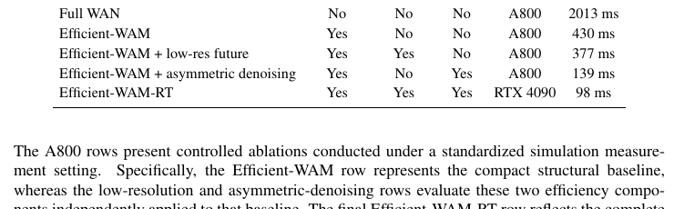

**Caption:** Configuration-level latency measurement summary.

**Caption[CN]:** 配置级延迟测量汇总。

| Configuration | Compact | Low-res | Asym. | GPU | Latency |
|---|---|---|---|---|---|
| Full WAN | No | No | No | A800 | 2013 ms |
| Efficient-WAM | Yes | No | No | A800 | 430 ms |
| Efficient-WAM + low-res future | Yes | Yes | No | A800 | 377 ms |
| Efficient-WAM + asymmetric denoising | Yes | No | Yes | A800 | 139 ms |
| Efficient-WAM-RT | Yes | Yes | Yes | RTX 4090 | 98 ms |

> <strong>Para. 2:</strong> A800 rows are controlled simulation ablations: compact baseline, then low-resolution and asymmetric components applied independently. The RTX 4090 row is the complete real-world profile with all three optimizations enabled.

> <strong>Para. 2[CN]:</strong> A800 各行为受控仿真消融：紧凑基线，以及独立加入低分辨率或非对称组件。RTX 4090 行为三项优化全开的完整真实部署配置。

## D Qualitative Future Prediction Results

> <strong>Para. 1:</strong> Figure 7 shows Full WAN in the MoT interface; Figure 8 shows Efficient-WAM-RT with compact expert, low-resolution futures, and asymmetric denoising. Full WAN gives coherent frames and clear boundaries, whereas Efficient-WAM-RT shows blur, ghosting, and reduced texture. Yet Efficient-WAM-RT scores 83.1%/82.0% versus Full WAN’s 86.4%/85.5%, supporting the claim that coarse geometry and motion cues suffice without photorealism.

> <strong>Para. 1[CN]:</strong> 图 7 展示 MoT 接口中的 Full WAN；图 8 展示同时采用紧凑专家、低分辨率未来和非对称去噪的 Efficient-WAM-RT。Full WAN 产生连贯帧和清晰边界，而 Efficient-WAM-RT 出现模糊、重影和纹理削弱；但前者为 86.4%/85.5%，后者仍达 83.1%/82.0%，支持粗粒度几何与运动线索无需照片级真实即可奏效。

### Figure 7. Full WAN 未来预测示例

**Caption:** Full WAN future prediction examples.

**Caption[CN]:** Full WAN 未来预测示例。

### Figure 8. Efficient-WAM-RT 未来预测示例

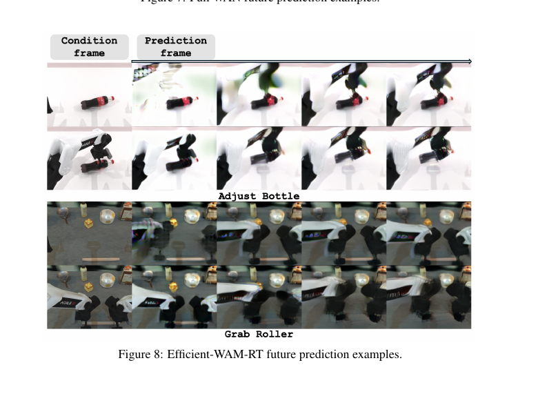

**Caption:** Efficient-WAM-RT future prediction examples.

**Caption[CN]:** Efficient-WAM-RT 未来预测示例。

## E RoboTwin Detailed Results

### Table 6. RoboTwin 逐任务成功率

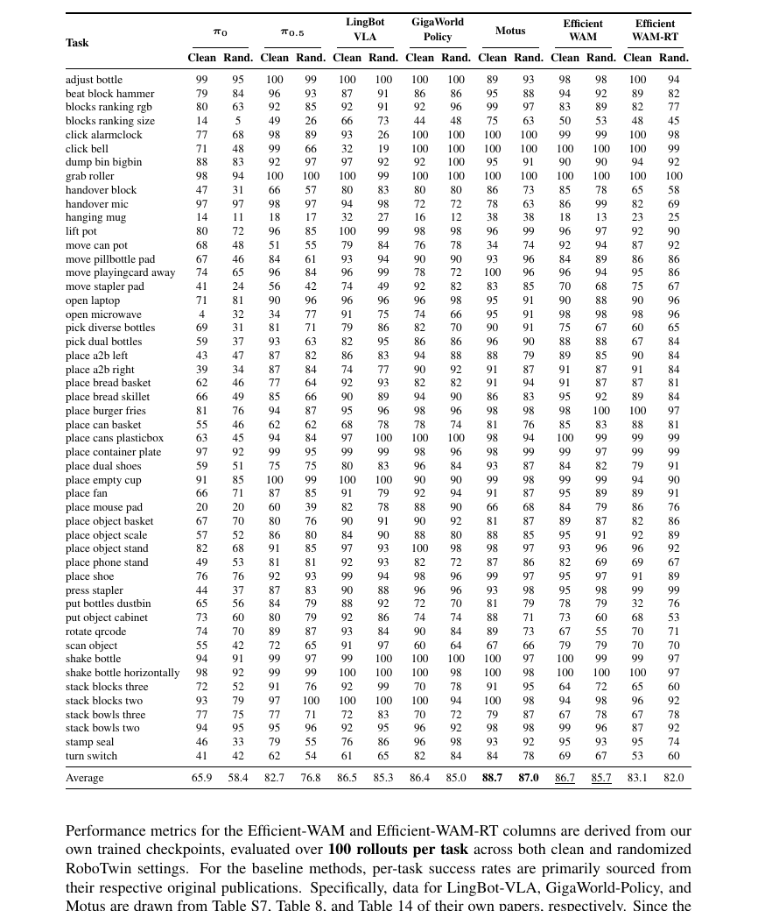

**Caption:** Per-task success rates on RoboTwin under clean and randomized evaluation settings.

**Caption[CN]:** RoboTwin 在干净与随机化评估设置下的逐任务成功率。

| Task | π0 C | π0 R | π0.5 C | π0.5 R | LingBot C | LingBot R | GigaWorld C | GigaWorld R | Motus C | Motus R | Eff.-WAM C | Eff.-WAM R | Eff.-RT C | Eff.-RT R |
|---|---|---|---|---|---|---|---|---|---|---|---|---|---|---|
| adjust bottle | 99 | 95 | 100 | 99 | 100 | 100 | 100 | 100 | 89 | 93 | 98 | 98 | 100 | 94 |
| beat block hammer | 79 | 84 | 96 | 93 | 87 | 91 | 86 | 86 | 95 | 88 | 94 | 92 | 89 | 82 |
| blocks ranking rgb | 80 | 63 | 92 | 85 | 92 | 91 | 92 | 96 | 99 | 97 | 83 | 89 | 82 | 77 |
| blocks ranking size | 14 | 5 | 49 | 26 | 66 | 73 | 44 | 48 | 75 | 63 | 50 | 53 | 48 | 45 |
| click alarmclock | 77 | 68 | 98 | 89 | 93 | 26 | 100 | 100 | 100 | 100 | 99 | 99 | 100 | 98 |
| click bell | 71 | 48 | 99 | 66 | 32 | 19 | 100 | 100 | 100 | 100 | 100 | 100 | 100 | 99 |
| dump bin bigbin | 88 | 83 | 92 | 97 | 97 | 92 | 92 | 100 | 95 | 91 | 90 | 90 | 94 | 92 |
| grab roller | 98 | 94 | 100 | 100 | 100 | 99 | 100 | 100 | 100 | 100 | 100 | 100 | 100 | 100 |
| handover block | 47 | 31 | 66 | 57 | 80 | 83 | 80 | 80 | 86 | 73 | 85 | 78 | 65 | 58 |
| handover mic | 97 | 97 | 98 | 97 | 94 | 98 | 72 | 72 | 78 | 63 | 86 | 99 | 82 | 69 |
| hanging mug | 14 | 11 | 18 | 17 | 32 | 27 | 16 | 12 | 38 | 38 | 18 | 13 | 23 | 25 |
| lift pot | 80 | 72 | 96 | 85 | 100 | 99 | 98 | 98 | 96 | 99 | 96 | 97 | 92 | 90 |
| move can pot | 68 | 48 | 51 | 55 | 79 | 84 | 76 | 78 | 34 | 74 | 92 | 94 | 87 | 92 |
| move pillbottle pad | 67 | 46 | 84 | 61 | 93 | 94 | 90 | 90 | 93 | 96 | 84 | 89 | 86 | 86 |
| move playingcard away | 74 | 65 | 96 | 84 | 96 | 99 | 78 | 72 | 100 | 96 | 96 | 94 | 95 | 86 |
| move stapler pad | 41 | 24 | 56 | 42 | 74 | 49 | 92 | 82 | 83 | 85 | 70 | 68 | 75 | 67 |
| open laptop | 71 | 81 | 90 | 96 | 96 | 96 | 96 | 98 | 95 | 91 | 90 | 88 | 90 | 96 |
| open microwave | 4 | 32 | 34 | 77 | 91 | 75 | 74 | 66 | 95 | 91 | 98 | 98 | 98 | 96 |
| pick diverse bottles | 69 | 31 | 81 | 71 | 79 | 86 | 82 | 70 | 90 | 91 | 75 | 67 | 60 | 65 |
| pick dual bottles | 59 | 37 | 93 | 63 | 82 | 95 | 86 | 86 | 96 | 90 | 88 | 88 | 67 | 84 |
| place a2b left | 43 | 47 | 87 | 82 | 86 | 83 | 94 | 88 | 88 | 79 | 89 | 85 | 90 | 84 |
| place a2b right | 39 | 34 | 87 | 84 | 74 | 77 | 90 | 92 | 91 | 87 | 91 | 87 | 91 | 84 |
| place bread basket | 62 | 46 | 77 | 64 | 92 | 93 | 82 | 82 | 91 | 94 | 91 | 87 | 87 | 81 |
| place bread skillet | 66 | 49 | 85 | 66 | 90 | 89 | 94 | 90 | 86 | 83 | 95 | 92 | 89 | 84 |
| place burger fries | 81 | 76 | 94 | 87 | 95 | 96 | 98 | 96 | 98 | 98 | 98 | 100 | 100 | 97 |
| place can basket | 55 | 46 | 62 | 62 | 68 | 78 | 78 | 74 | 81 | 76 | 85 | 83 | 88 | 81 |
| place cans plasticbox | 63 | 45 | 94 | 84 | 97 | 100 | 100 | 100 | 98 | 94 | 100 | 99 | 99 | 99 |
| place container plate | 97 | 92 | 99 | 95 | 99 | 99 | 98 | 96 | 98 | 99 | 99 | 97 | 99 | 99 |
| place dual shoes | 59 | 51 | 75 | 75 | 80 | 83 | 96 | 84 | 93 | 87 | 84 | 82 | 79 | 91 |
| place empty cup | 91 | 85 | 100 | 99 | 100 | 100 | 90 | 90 | 99 | 98 | 99 | 99 | 94 | 90 |
| place fan | 66 | 71 | 87 | 85 | 91 | 79 | 92 | 94 | 91 | 87 | 95 | 89 | 89 | 91 |
| place mouse pad | 20 | 20 | 60 | 39 | 82 | 78 | 88 | 90 | 66 | 68 | 84 | 79 | 86 | 76 |
| place object basket | 67 | 70 | 80 | 76 | 90 | 91 | 90 | 92 | 81 | 87 | 89 | 87 | 82 | 86 |
| place object scale | 57 | 52 | 86 | 80 | 84 | 90 | 88 | 80 | 88 | 85 | 95 | 91 | 92 | 89 |
| place object stand | 82 | 68 | 91 | 85 | 97 | 93 | 100 | 98 | 98 | 97 | 93 | 96 | 96 | 92 |
| place phone stand | 49 | 53 | 81 | 81 | 92 | 93 | 82 | 72 | 87 | 86 | 82 | 69 | 69 | 67 |
| place shoe | 76 | 76 | 92 | 93 | 99 | 94 | 98 | 96 | 99 | 97 | 95 | 97 | 91 | 89 |
| press stapler | 44 | 37 | 87 | 83 | 90 | 88 | 96 | 96 | 93 | 98 | 95 | 98 | 99 | 99 |
| put bottles dustbin | 65 | 56 | 84 | 79 | 88 | 92 | 72 | 70 | 81 | 79 | 78 | 79 | 32 | 76 |
| put object cabinet | 73 | 60 | 80 | 79 | 92 | 86 | 74 | 74 | 88 | 71 | 73 | 60 | 68 | 53 |
| rotate qrcode | 74 | 70 | 89 | 87 | 93 | 84 | 90 | 84 | 89 | 73 | 67 | 55 | 70 | 71 |
| scan object | 55 | 42 | 72 | 65 | 91 | 97 | 60 | 64 | 67 | 66 | 79 | 79 | 70 | 70 |
| shake bottle | 94 | 91 | 99 | 97 | 99 | 100 | 100 | 100 | 100 | 97 | 100 | 99 | 99 | 97 |
| shake bottle horizontally | 98 | 92 | 99 | 99 | 100 | 100 | 100 | 98 | 100 | 98 | 100 | 100 | 100 | 97 |
| stack blocks three | 72 | 52 | 91 | 76 | 92 | 99 | 70 | 78 | 91 | 95 | 64 | 72 | 65 | 60 |
| stack blocks two | 93 | 79 | 97 | 100 | 100 | 100 | 100 | 94 | 100 | 98 | 94 | 98 | 96 | 92 |
| stack bowls three | 77 | 75 | 77 | 71 | 72 | 83 | 70 | 72 | 79 | 87 | 67 | 78 | 67 | 78 |
| stack bowls two | 94 | 95 | 95 | 96 | 92 | 95 | 96 | 92 | 98 | 98 | 99 | 96 | 87 | 92 |
| stamp seal | 46 | 33 | 79 | 55 | 76 | 86 | 96 | 98 | 93 | 92 | 95 | 93 | 95 | 74 |
| turn switch | 41 | 42 | 62 | 54 | 61 | 65 | 82 | 84 | 84 | 78 | 69 | 67 | 53 | 60 |
| Average | 65.9 | 58.4 | 82.7 | 76.8 | 86.5 | 85.3 | 86.4 | 85.0 | 88.7 | 87.0 | 86.7 | 85.7 | 83.1 | 82.0 |

> <strong>Para. 1:</strong> Efficient-WAM and Efficient-WAM-RT values come from the authors’ checkpoints with 100 rollouts per task in both settings. LingBot-VLA, GigaWorld-Policy, and Motus values are drawn from Table S7, Table 8, and Table 14 of their papers. Because original $\pi_0$ and $\pi_{0.5}$ papers lack RoboTwin evaluation, those values come from Table S1 of the LingBot-VLA paper.

> <strong>Para. 1[CN]:</strong> Efficient-WAM 与 Efficient-WAM-RT 数值来自作者检查点，在两种设置中每任务评估 100 次。LingBot-VLA、GigaWorld-Policy、Motus 数值分别来自其论文表 S7、表 8、表 14。由于原始 $\pi_0$ 与 $\pi_{0.5}$ 论文没有 RoboTwin 评估，其数值来自 LingBot-VLA 论文表 S1。

### Table 7. RoboTwin 干净设置非对称去噪详细扫描

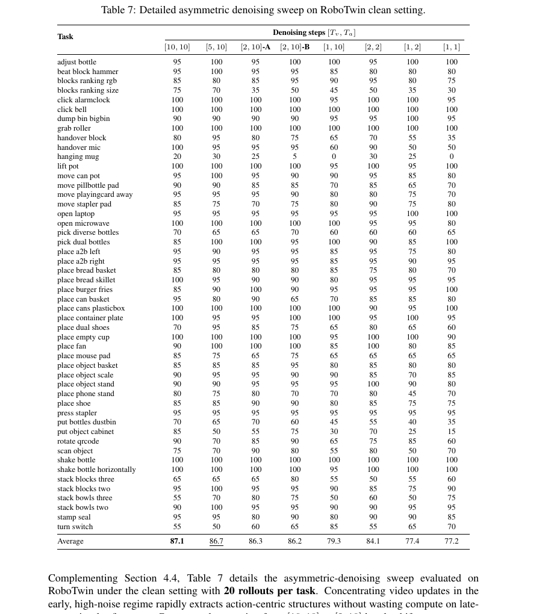

**Caption:** Detailed asymmetric denoising sweep on RoboTwin clean setting.

**Caption[CN]:** RoboTwin 干净设置下非对称去噪的详细扫描。

| Task | [10,10] | [5,10] | [2,10]-A | [2,10]-B | [1,10] | [2,2] | [1,2] | [1,1] |
|---|---|---|---|---|---|---|---|---|
| adjust bottle | 95 | 100 | 95 | 100 | 100 | 95 | 100 | 100 |
| beat block hammer | 95 | 100 | 95 | 95 | 85 | 80 | 80 | 80 |
| blocks ranking rgb | 85 | 80 | 85 | 95 | 90 | 95 | 80 | 75 |
| blocks ranking size | 75 | 70 | 35 | 50 | 45 | 50 | 35 | 30 |
| click alarmclock | 100 | 100 | 100 | 100 | 95 | 100 | 100 | 95 |
| click bell | 100 | 100 | 100 | 100 | 100 | 100 | 100 | 100 |
| dump bin bigbin | 90 | 90 | 90 | 90 | 95 | 95 | 100 | 95 |
| grab roller | 100 | 100 | 100 | 100 | 100 | 100 | 100 | 100 |
| handover block | 80 | 95 | 80 | 75 | 65 | 70 | 55 | 35 |
| handover mic | 100 | 95 | 95 | 95 | 60 | 90 | 50 | 50 |
| hanging mug | 20 | 30 | 25 | 5 | 0 | 30 | 25 | 0 |
| lift pot | 100 | 100 | 100 | 100 | 95 | 100 | 95 | 100 |
| move can pot | 95 | 100 | 95 | 90 | 90 | 95 | 85 | 80 |
| move pillbottle pad | 90 | 90 | 85 | 85 | 70 | 85 | 65 | 70 |
| move playingcard away | 95 | 95 | 95 | 90 | 80 | 80 | 75 | 70 |
| move stapler pad | 85 | 75 | 70 | 75 | 80 | 90 | 75 | 80 |
| open laptop | 95 | 95 | 95 | 95 | 95 | 95 | 100 | 100 |
| open microwave | 100 | 100 | 100 | 100 | 100 | 95 | 95 | 80 |
| pick diverse bottles | 70 | 65 | 65 | 70 | 60 | 60 | 60 | 65 |
| pick dual bottles | 85 | 100 | 100 | 95 | 100 | 90 | 85 | 100 |
| place a2b left | 95 | 90 | 95 | 95 | 85 | 95 | 75 | 80 |
| place a2b right | 95 | 95 | 95 | 95 | 85 | 95 | 90 | 95 |
| place bread basket | 85 | 80 | 80 | 80 | 85 | 75 | 80 | 70 |
| place bread skillet | 100 | 95 | 90 | 90 | 80 | 95 | 95 | 95 |
| place burger fries | 85 | 90 | 100 | 90 | 95 | 95 | 95 | 100 |
| place can basket | 95 | 80 | 90 | 65 | 70 | 85 | 85 | 80 |
| place cans plasticbox | 100 | 100 | 100 | 100 | 100 | 90 | 95 | 100 |
| place container plate | 100 | 95 | 95 | 100 | 100 | 95 | 100 | 95 |
| place dual shoes | 70 | 95 | 85 | 75 | 65 | 80 | 65 | 60 |
| place empty cup | 100 | 100 | 100 | 100 | 95 | 100 | 100 | 90 |
| place fan | 90 | 100 | 100 | 100 | 85 | 100 | 80 | 85 |
| place mouse pad | 85 | 75 | 65 | 75 | 65 | 65 | 65 | 65 |
| place object basket | 85 | 85 | 85 | 95 | 80 | 85 | 80 | 80 |
| place object scale | 90 | 95 | 95 | 90 | 90 | 85 | 70 | 85 |
| place object stand | 90 | 90 | 95 | 95 | 95 | 100 | 90 | 80 |
| place phone stand | 80 | 75 | 80 | 70 | 70 | 80 | 45 | 70 |
| place shoe | 85 | 85 | 90 | 90 | 80 | 85 | 75 | 75 |
| press stapler | 95 | 95 | 95 | 95 | 95 | 95 | 95 | 95 |
| put bottles dustbin | 70 | 65 | 70 | 60 | 45 | 55 | 40 | 35 |
| put object cabinet | 85 | 50 | 55 | 75 | 30 | 70 | 25 | 15 |
| rotate qrcode | 90 | 70 | 85 | 90 | 65 | 75 | 85 | 60 |
| scan object | 75 | 70 | 90 | 80 | 55 | 80 | 50 | 70 |
| shake bottle | 100 | 100 | 100 | 100 | 100 | 100 | 100 | 100 |
| shake bottle horizontally | 100 | 100 | 100 | 100 | 95 | 100 | 100 | 100 |
| stack blocks three | 65 | 65 | 65 | 80 | 55 | 50 | 55 | 60 |
| stack blocks two | 95 | 100 | 95 | 95 | 90 | 85 | 75 | 90 |
| stack bowls three | 55 | 70 | 80 | 75 | 50 | 60 | 50 | 75 |
| stack bowls two | 90 | 100 | 95 | 95 | 90 | 90 | 95 | 95 |
| stamp seal | 95 | 95 | 80 | 90 | 80 | 90 | 90 | 85 |
| turn switch | 55 | 50 | 60 | 65 | 85 | 55 | 65 | 70 |
| Average | 87.1 | 86.7 | 86.3 | 86.2 | 79.3 | 84.1 | 77.4 | 77.2 |

> <strong>Para. 2:</strong> Table 7 uses 20 rollouts per task in the clean setting. Moving from $[10,10]$ to $[2,10]$ changes success only from 87.1% to 86.3%/86.2% across two runs while producing a 3.1× speedup (430 to 139 ms). One video step or aggressive action compression degrades performance, revealing a threshold for safe computational decoupling.

> <strong>Para. 2[CN]:</strong> 表 7 在干净设置下每任务评估 20 次。从 $[10,10]$ 改为 $[2,10]$，两次运行成功率仅从 87.1% 变为 86.3%/86.2%，同时获得 3.1× 加速（430 降至 139 ms）。单个视频步或激进压缩动作侧会降低性能，揭示安全计算解耦的阈值。

## Reader Note

This file preserves the complete substantive paper body, all eight numbered equations, all eight figures, all seven tables (with searchable transcriptions), limitations, acknowledgments, all 40 references, and Appendices A–E in source order. Bibliography entries remain English by policy.
