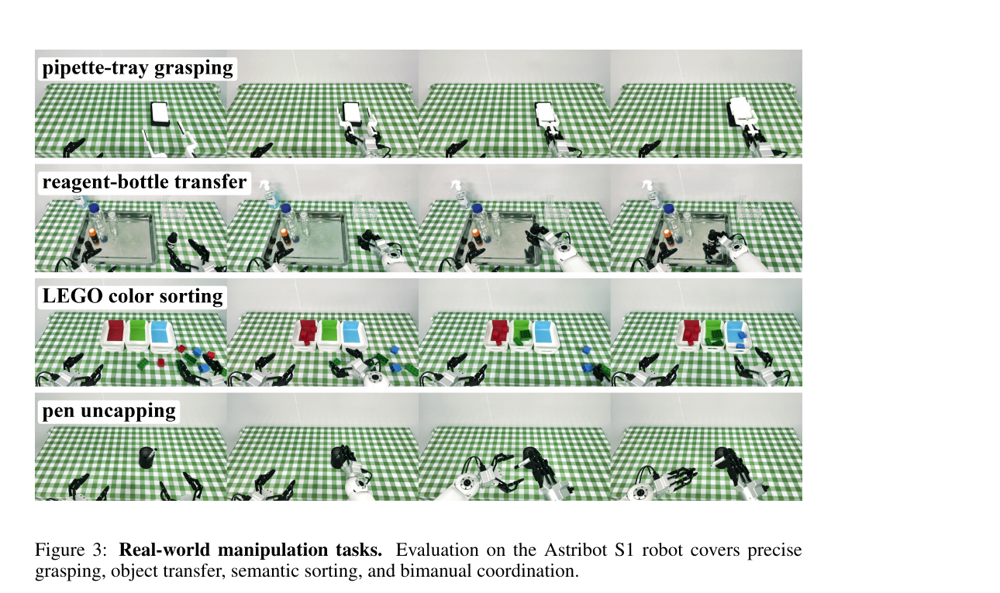
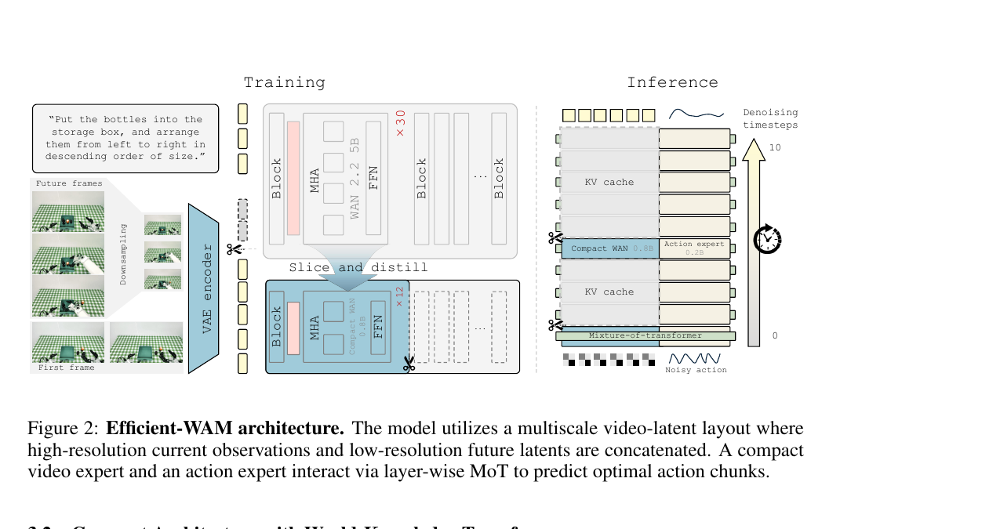
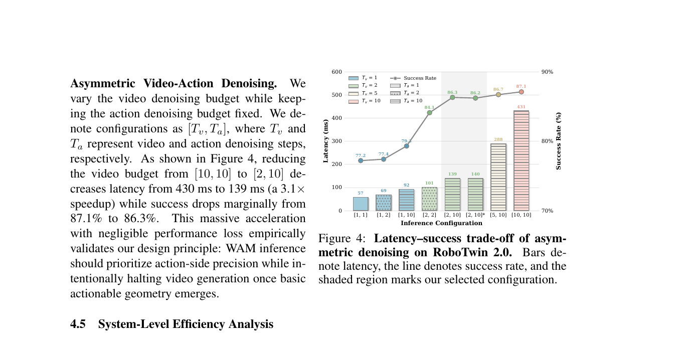

---
tags:
  - papers/world-model
  - papers/robot-learning
aliases:
  - Efficient-WAM
  - 低成本未来想象世界动作模型
date: 2026-06-10
doi: 10.48550/arXiv.2606.10040
arxiv_id: 2606.10040v2
---

# Efficient-WAM：低成本未来想象的 10 亿参数世界动作模型

## 核心信息

- 标题: Efficient-WAM: A 1B-Parameter World-Action Model with Low-Cost Future Imagination
- 标题翻译: Efficient-WAM：具备低成本未来想象的 10 亿参数世界动作模型
- 作者: Jiajun Li, Tiecheng Guo, Yifan Ye, Rongyu Zhang, Xiaowei Chi, Qianpu Sun, Ying Li, Yunfan Lou, Yan Huang, Zhihe Lu, Meng Guo, Shanghang Zhang
- 机构: 香港大学、北京大学、穆卡机器人、自动化研究所、南京大学
- 发表时间: 2026-06-10（arXiv v2）
- 发表渠道: arXiv 预印本
- DOI: 10.48550/arXiv.2606.10040
- arXiv: 2606.10040v2
- 论文链接: https://arxiv.org/abs/2606.10040
- 代码 / 项目: https://efficientwam.github.io/
- 数据 / 资源: RoboTwin 2.0；作者自建 Astribot S1 四任务真实机器人评测
- 论文类型: 世界动作模型、机器人控制与推理加速方法

## 原文摘要翻译

世界动作模型通过将未来视觉预测与动作生成耦合，已成为具身控制的一种有前景范式。然而，多数现有世界动作模型依赖照片级真实的未来预测，这会带来很高的推理延迟，并使实时机器人部署变得困难。由此，作者试图设计一种更高效的世界动作模型：在保留未来视觉预测控制收益的同时降低其推理成本。论文提出 Efficient-WAM，它降低了未来想象的成本，同时保留其控制收益。该模型通过从 WAN-2.2-5B 迁移得到的紧凑视频专家、词元稀疏的视频潜变量，以及非对称的视频—动作去噪来提高推理效率，其中动作采样步数少于视频采样步数。Efficient-WAM 不再以未来分支的视觉保真度为优化目标，而把未来视频预测视为动作生成的紧凑引导信号。RoboTwin 2.0 与真实机器人操作任务上的实验表明，即使未来预测在视觉上较粗糙，模型仍能保持较强的动作性能。在维持有竞争力的控制能力时，该 10 亿参数模型在实体部署中把每个动作块的延迟降至约 100 毫秒，相比既有世界动作模型实现约 30 倍加速。

## 创新点

1. **把未来预测从“渲染目标”改写为“控制条件”。** 论文不再默认更清晰的未来帧必然带来更好的动作，而只要求未来潜变量保留任务相关的几何、运动趋势与接触线索。这一目标重定义，使压缩视频分支成为可接受的设计，而不是事后补救。
2. **沿三个可控成本轴联合压缩。** 作者将视频侧成本写成活动模型规模、未来视觉词元数与视频去噪步数的函数，并分别用结构化切片蒸馏、低分辨率未来潜变量和非对称去噪处理，避免只做单点加速。
3. **以动作精度优先的异步采样链。** 视频分支只在早期刷新少数次，动作分支继续多步细化，并复用缓存的视频特征。该设计直接利用“粗场景结构早于精细动作收敛”的不对称性。
4. **从 50 亿参数视频生成器迁移出约 8 亿参数视频专家。** 结构化层切片配合隐藏状态和时间运动蒸馏，明显优于同尺寸随机初始化，说明模型缩小并不等价于从零训练一个弱视频模型。

## 一句话总结

Efficient-WAM 的真正贡献不是证明“10 亿参数足够理解所有机器人世界”，而是证明：在所测双臂操作任务上，未来想象只要提供粗粒度、动作相关的动力学条件，就能把视频生成分支从照片级渲染器压缩为低成本控制先验，并以小幅成功率代价换取数量级延迟下降。

## 研究问题

### 世界动作模型的部署矛盾

世界动作模型把联合预测分解为未来想象与条件动作生成（式 1）：

$$
p(\mathbf z^v,\mathbf a_{1:H}\mid o,l,s)=p_{\phi}(\mathbf z^v\mid o,l)\,p_{\theta}(\mathbf a_{1:H}\mid o,l,s,\mathbf z^v).
$$

符号依次表示当前观测、语言指令、机器人状态、未来视觉潜变量和长度为十六的动作块，对应上式中的各变量。既有路线常把视频生成器的画质当成核心能力，但高画质意味着大模型、密集视觉词元和长去噪链，三者都与闭环控制的低延迟要求冲突。

### 论文要检验的关键假设

作者的问题不是“能否完全删除未来预测”。Fast-WAM 等工作已显示跳过显式未来生成有时仍有竞争力。本文更窄也更工程化：**能否保留一个极轻的未来分支，使其只编码动作需要的结构信息，并系统压缩其三个成本来源？** 式 2 将视频侧成本抽象为：

$$
C_{\mathrm{video}}=\mathcal F_{\mathrm{video}}\left(\mathcal M_v,N_{\mathrm{tok}}^v(r_v),K_v\right),
$$

其中 $\mathcal M_v$ 为活动视频模型规模，$N_{\mathrm{tok}}^v$ 为由未来分辨率 $r_v$ 决定的词元数，$K_v$ 为视频去噪预算。这个分解决定了后续三个模块，而不是一个泛化的“轻量化”口号。

### 与既有路线的边界

- 相对 UWM、GigaWorld-Policy、Motus 等重型世界动作模型，本文保留联合视频—动作建模，但主动牺牲未来帧保真度。
- 相对 Fast-WAM 的推理时跳过未来生成，本文仍保留显式、低成本的未来条件，试图取得速度与控制先验之间的中间点。
- 相对早退、动态层跳过或单步扩散策略蒸馏，本文不是只压缩动作策略，而是同时重构模型容量、视觉词元和两分支采样调度。
- 相对纯视觉—语言—动作模型，本文仍依赖视频生成教师与未来潜变量；因此其收益不能直接归因于 10 亿参数本身。

## 数据与任务定义

### 仿真：RoboTwin 2.0

评测覆盖 50 个双臂操作任务，训练数据为 2,500 条干净演示与 25,000 条随机化演示。模型在干净和随机视觉条件下分别评测，每个任务运行 100 次；消融因成本只运行 20 次，因此消融表中的绝对成功率与主表存在预期采样方差。比较对象包括 $\pi_0$、StarVLA-$\alpha$、ABot-M0、LingBot-VLA 等视觉—语言—动作模型，以及统一世界模型、GigaWorld-Policy、Motus 等世界动作模型。

### 真实机器人：四种长短程操作

硬件为 Astribot S1，左右腕各使用 Intel RealSense D401，相机观测为三个彩色视角，并输入 31 维关节状态。四项任务分别是移液管托盘抓取、试剂瓶转移、乐高颜色分拣和拔笔帽，覆盖精确抓取、易碎物体搬运、长时程语义循环和细粒度双臂协调。每个任务用 100 条示范训练、评测 20 次，每次最长 3 分钟；物体位置在每轮前人工重置到随机可行状态。

*图 3。Astribot S1 上的四类真实操作，分别强调精确抓取、易碎物体转移、语义分拣与双臂协调。*

### 控制输出与闭环协议

策略预测长度 $H=16$ 的动作块。真实部署采用滚动时域控制：每次只执行预测块中均匀抽取的 4 或 5 个动作，每个动作约对应 0.3 秒实体运动，随后重新观测并规划。论文没有逐维说明动作向量的表示、单位、归一化范围或底层控制频率；因此“动作解码”可确定到流匹配生成动作块与滚动执行层面，但无法仅凭本文完整复刻电机级控制接口。

## 方法主线

### 机制流程

1. **输入与未来目标构造。** 输入当前高分辨率观测、语言指令、机器人状态和带噪动作；训练时还从未来帧经变分自编码器得到视频潜变量。当前帧保持高分辨率，未来帧先降采样后编码，输出高分辨率当前词元与低分辨率未来词元的多尺度上下文。
2. **结构化压缩并蒸馏视频专家。** 从 WAN-2.2-5B 按层深切出 12 层学生，并沿宽度抽取到 2,048 隐藏维、8,192 前馈维和 16 个注意力头，得到约 8 亿参数视频专家；用真值流匹配、层间隐藏状态蒸馏和帧间运动蒸馏，使输出保留几何、运动和接触线索。
3. **层级交互与联合训练。** 约 2 亿参数动作专家通过逐层混合专家骨干与视频专家交互；语言经交叉注意力注入，机器人状态和带噪动作嵌入为动作词元。动作词元读取未来上下文，再映射回动作流，输出可执行动作块。
4. **非对称推理与闭环执行。** 视频只去噪少数步并生成低分辨率未来潜变量，动作侧继续更多步细化；中间动作步复用缓存视频特征。最终解码动作块，执行其中 4–5 步，再获取新观测并重规划。

*图 2。结构化切片与蒸馏得到紧凑视频专家；推理时高分辨率当前词元和低分辨率未来词元共同条件化动作专家，两分支采用不同去噪预算。*

### 为什么是“10 亿参数”

这不是从缩放律推导出的最优规模。具体构成为约 8 亿参数视频专家加约 2 亿参数动作专家。视频专家由 50 亿参数教师的 30 层切为索引 $[1,2,4,6,8,11,14,17,20,23,26,30]$ 的 12 层，同时抽取对应通道、嵌入、调制与输出头。论文的证据只说明该结构在当前任务和对照中形成了较好的精度—延迟点；没有 0.5B、1B、2B 的连续规模扫描，因此标题中的 1B 是实现规格，不是普适容量下界。

### 低成本未来想象的三个部件

**紧凑视频专家。** 随机初始化同尺寸模型在 RoboTwin 消融中只有 69%/68% 的干净/随机成功率；结构切片但不蒸馏为 82%/81%；加入教师蒸馏后达到 87%/86%。这说明核心不是机械裁层，而是结构继承与表征对齐的组合。

**多尺度视频潜变量。** 当前观测按高分辨率编码，例如 $384\times320$；目标未来帧先缩至约 $192\times160$ 再编码。高、中、低三档未来分辨率分别使用 240、126、60 个视频词元，延迟依次为 430、396、377 毫秒；干净/随机成功率则由 87%/86% 降为 85%/84%，再降为 83%/82%。动作侧仍能读取当前帧的高频细节，低分辨率未来只承担粗动力学提示。

**非对称视频—动作去噪。** 以 $[T_v,T_a]$ 表示视频与动作步数。动作需要更精细的轨迹更新，而物体几何和接触结构往往在视频去噪早期就显现。因此作者令动作侧维持 10 步，视频侧可缩至 2 步；视频不刷新时复用缓存特征。主文从 $[10,10]$ 到 $[2,10]$，延迟从 430 毫秒降到 139 毫秒，成功率由 87.1% 降至 86.3%。

*图 4。固定动作去噪预算并逐步压缩视频预算时，前半段延迟大幅下降而成功率基本保持；过度压缩两侧步数后，成功率明显下滑。*

### 训练目标与三阶段训练链

两分支均使用条件流匹配。用 $x_1$ 表示目标、$x_0\sim\mathcal N(0,I)$ 表示噪声，插值路径与速度为 $x_t=(1-t)x_0+tx_1$、$u_t=x_1-x_0$，基础目标（式 3）为：

$$
\mathcal L_{\mathrm{FM}}
=
\mathbb E_{t,\mathbf x_0,\mathbf x_1}
\left[\lVert f(\mathbf x_t,t;c)-\mathbf u_t\rVert_2^2\right].
$$

训练分三阶段。第一阶段只训练视频专家，损失由视频流匹配与蒸馏构成；隐藏状态蒸馏以余弦距离对齐教师和学生的匹配层（式 4），运动蒸馏则对齐相邻帧空间平均特征的差分（式 5）。联合目标（式 6）为：

$$
\mathcal L_{\mathrm{stage1}}
=
\mathcal L_{\mathrm{video-FM}}
+
\lambda_{\mathrm{dist}}(\mathcal L_{\mathrm{hid}}+\mathcal L_{\mathrm{mot}}),
$$

其中蒸馏权重在训练中按 0.2、0.1、0 衰减。第二阶段冻结视频骨干，只训练动作专家，视频损失权重 0.01、动作损失权重 1.0；第三阶段以不同学习率联合微调两专家。附录表 4 报告三阶段批大小均为 $16\times8$。前两阶段学习率均为 $5\times10^{-5}$，第三阶段视频与动作学习率分别为 $1\times10^{-5}$ 和 $5\times10^{-5}$。共享设置为 AdamW 优化器、余弦调度、bf16 混合精度与 $10^{-3}$ 权重衰减。仿真每阶段约 2.5 轮，真实任务每阶段约 5 轮。

### 训练与推理之间容易忽略的差异

训练时，动作块与未来视频潜变量使用独立采样的噪声和时间步，以统一前向骨干同时学习两个速度场（式 7–8）。推理时却故意采用不对称步数，并在视频不更新时缓存其特征。也就是说，低延迟并非仅来自小模型；它依赖“训练时充分联合、推理时计算解耦”的策略。

## 关键结果

### RoboTwin 主结果

| 方法 | 路线 | 参数量 | 干净成功率 | 随机化成功率 |
|---|---:|---:|---:|---:|
| LingBot-VLA | 视觉—语言—动作 | 4B | 86.5% | 85.3% |
| GigaWorld-Policy | 世界动作模型 | 8B | 86.4% | 85.0% |
| Motus | 世界动作模型 | 8B | **88.7%** | **87.0%** |
| Efficient-WAM | 世界动作模型 | 1B | 86.7% | 85.7% |
| Efficient-WAM-RT | 世界动作模型 | 1B | 83.1% | 82.0% |

表 1 支持两个相对克制的结论。第一，紧凑基线以约八分之一参数达到接近强重型模型的平均成功率，并略高于 4B LingBot-VLA 和 8B GigaWorld-Policy；第二，实时版再牺牲约 3.6/3.7 个百分点，以换取显著低延迟。它并未击败所有基线：Motus 仍是平均成功率最高者。

### 真实机器人结果与速度

| 方法 | 平均成功率 | 每动作块延迟 | 每步延迟 | 移液管托盘 | 试剂瓶转移 | 乐高分拣 | 拔笔帽 |
|---|---:|---:|---:|---:|---:|---:|---:|
| $\pi_{0.5}$ | 53.75% | 113.0 ms | 7.1 ms | 100% | 75% | 30% | 10% |
| Motus | 63.75% | 3215.0 ms | 200.9 ms | 85% | 80% | 65% | 25% |
| Efficient-WAM-RT | **66.25%** | **98.0 ms** | **6.1 ms** | 95% | 75% | 65% | 30% |

真实部署中，Efficient-WAM-RT 相对 Motus 每动作块约快 32.8 倍，平均成功率高 2.5 个百分点。更重要的结果模式是：$\pi_{0.5}$ 在简单抓取上最好，却在长时程分拣和精细拔帽上大幅落后；两种世界动作模型在这两类任务上更稳。这与“未来结构条件对长时程或接触密集任务更有用”的解释一致，但四项任务、每项 20 次仍不足以建立普适因果规律。

### 三层加速链的量化分解

附录表 5 在单次预热、缓存文本嵌入、排除观测获取和实体执行的口径下测量长度 16 的动作块：

| 配置 | 紧凑模型 | 低分辨率未来 | 非对称去噪 | 硬件 | 延迟 |
|---|---:|---:|---:|---|---:|
| 完整 WAN | 否 | 否 | 否 | A800 | 2013 ms |
| Efficient-WAM | 是 | 否 | 否 | A800 | 430 ms |
| 再加低分辨率未来 | 是 | 是 | 否 | A800 | 377 ms |
| 再加非对称去噪 | 是 | 是 | 是 | A800 | 139 ms |
| Efficient-WAM-RT | 是 | 是 | 是 | RTX 4090 | 98 ms |

最大单项收益来自模型压缩，约为 4.7 倍；低分辨率只再带来约 1.14 倍；非对称去噪再带来约 2.71 倍。98 毫秒与 139 毫秒来自不同硬件和部署栈，不能把差额全部解释成算法收益。论文所称约 30 倍来自 3215/98 的真实部署对比，而非同一 A800 上的完整消融。

### 消融的正证据与负证据

- **结构迁移必要。** 同为约 0.8B 视频专家，随机初始化仅 69%/68%，切片初始化为 82%/81%，蒸馏后为 87%/86%。
- **低分辨率不是免费午餐。** 高、中、低三档词元数为 240/126/60，延迟为 430/396/377 毫秒，干净/随机成功率为 87/86、85/84、83/82。主文把最低分辨率用于实时版，而不是结构基线。
- **视频步数可大减，动作步数不可同等压缩。** 附录表 7 中 $[10,10]$、$[5,10]$、$[2,10]$ 分别约为 87.1%、86.7%、86.3%；把两侧都降到 $[1,1]$ 则只有 77.2%。这正是“优先保动作侧精度”的证据。
- **粗未来画质差但控制尚可。** 图 7–8 显示实时版存在明显模糊、重影和细节损失；附录仍报告 83.1%/82.0%，距完整 WAN 的 86.4%/85.5% 不远。这只证明画质并非这些任务上的必要条件，不证明画质在所有精密控制中无用。

## 深度分析

### 证据链是否闭合

论文的论证链条较完整：先把成本分解为模型规模、词元数量、采样步数；再为每个变量给出一个机制和独立延迟消融；最后在真实闭环中联合启用。尤其值得肯定的是，附录公开了测时口径、分项延迟、训练阶段和失败案例，避免把单一“30 倍”宣传数字当作全部证据。

不过，三个组件的控制精度证据强度并不相同。紧凑模型的蒸馏消融很强；非对称去噪有完整步数扫描；低分辨率未来只给出三档结果，而且低分辨率使成功率下降约 4 个百分点。实时版最终性能可接受，是三个设计共同作用后的工程判断，不等于每个设计都“无损”。

### 为什么粗未来仍可能工作

动作专家同时看到高分辨率当前观测与低分辨率未来潜变量。因此未来分支无需承担识别全部像素细节，只需回答“目标和手将向哪里移动”“接触大致何时发生”“物体拓扑是否改变”。这也是为何低分辨率未来可以作为方向性条件，而当前帧保留操作所需的局部外观。非对称去噪进一步把生成过程的时间结构转化成调度规则：全局几何较早稳定，动作轨迹的安全与精度则需要后续更新。

但这种机制依赖任务性质。若未来成功与否取决于螺纹、针尖、透明液面或亚毫米插入，低分辨率未来可能丢掉决定性变量。论文自己的局限段也明确承认，微操作可能需要更高分辨率视觉引导。

### 参数、算力与运行时需要分开理解

“1B”只描述模型规模；“98 毫秒”还依赖 RTX 4090 上的本地优化、缓存文本嵌入、单次预热后测量、固定动作块长度，以及排除相机获取与实体执行。依据正文与附录所列训练设置，作者只披露阶段轮数而未披露训练算力总量、墙钟时间、GPU 数量和能耗；这一证据缺口限制结论到**推理侧部署成本下降**，不支持训练也低成本的判断。

此外，紧凑学生依赖 WAN-2.2-5B 教师。若从零复现，仍要获得教师权重、实现精确结构切片、提取匹配层隐藏状态，并准备未来视频监督。于是“低成本”主要属于最终策略推理，而不是端到端研发门槛。

### 标题主张的证据边界

1. 参数消融依据中缺少 0.5B、1B、2B 容量扫描，因此 1B 的最小性或最优性尚未验证。
2. 评测只覆盖同一仿真框架和每任务单独训练的四项真实任务，因此开放世界、跨本体和新任务泛化尚未验证。
3. 主表缺少同骨干、同训练预算、完全移除未来分支的严格对照，因此未来想象相对无未来分支的因果优势尚未隔离。
4. 任务集中于宏观抓取、搬运、排序和拔帽，且作者明确指出微操作限制，因此不能外推为照片级未来在所有控制中都无价值。
5. 训练部分只提供轮数和优化配置、缺少总 GPU 时，因此标题中的低成本证据仅覆盖推理。

### 复现依赖与成本清单

- WAN-2.2-5B 教师及其变分自编码器、层命名和宽度切片映射；
- RoboTwin 2.0 的 50 任务数据、随机化协议和成功判定；
- 未来帧与动作块的时间对齐，当前/未来两种分辨率的潜变量拼接；
- 教师—学生隐藏层映射、运动差分蒸馏及权重退火；
- 逐层混合专家交互、视频特征缓存和独立时间步采样；
- Astribot S1 的 31 维状态定义、动作表示、低层控制器和三个相机标定。

后两项在论文中信息不足，是从论文指标复刻到实体系统的主要障碍。代码项目页存在，但本文文字本身不足以单独重建完整硬件控制栈。

## 局限

### 基准与泛化范围

RoboTwin 的平均分覆盖 50 任务，范围尚可，但训练和测试仍处于同一仿真框架。真实实验只有一个 Astribot S1、本地场景、四项任务，而且每项策略单独训练。跨任务统一策略、零样本任务和跨本体迁移均不在评测覆盖内；由此能支持“可在该硬件上实时闭环”，不能支持“通用世界动作模型”。

### 统计与对照边界

真实任务每项 20 次，平均差异较小：66.25% 对 63.75% 只相差两次成功总量。结果表和实验段只给成功率、未给置信区间或显著性检验，因此这一小差异的不确定性限制了“真实成功率更高”的结论强度。不同基线的训练与架构来源不完全一致；尤其缺少同一 1B 骨干下“无未来预测”“高保真未来”“低成本未来”的全套公平对照，使未来分支本身的净贡献仍不完全可辨。

### 失败模式与安全性

附录归纳三类失败：空间错位导致托盘端执行器挂错位置；视野遮挡或漂移造成漏处理；精密操作中碰撞周边物体。实际执行采用固定非对称去噪预算，难以在不确定或复杂接触时动态增加视频计算。作者提出动态算力分配作为未来方向；正文与附录的评测指标只覆盖任务成功率，碰撞监测、异常恢复和安全停止尚无量化证据。

### 画质—精度权衡

实时版故意牺牲未来帧细节。其成功并不意味着视觉保真度无关，而是当前任务尚能由粗几何和运动线索支撑。论文也承认极细粒度操作可能失败。低分辨率消融已出现约 4 个百分点损失，这是限制证据，不应被“保持竞争力”措辞掩盖。

### 复现信息缺口

依据方法、实验和训练、真实评测、测时三个附录的披露范围，训练总 GPU 时、动作维度与归一化、低层控制频率、动作专家完整结构、推理求解器细节、随机种子与方差均未列出；这些缺口直接限制训练成本核算与实体系统复现。真实基线约两分钟的成功执行时间与实时版约 30 秒的差异也混合了策略行为质量，而不仅是神经网络推理延迟。全文结构还缺少专门的数据可用性、代码可用性、社会影响或伦理声明；项目页提供入口，但不能替代对权重、训练数据、许可和实体安全协议的明确披露。

## 我的笔记

### 可复用的研究洞察

- 对生成式控制模型，先把成本拆成**容量、序列长度、迭代次数**，通常比泛泛做量化或剪枝更容易形成可解释的系统加速链。
- “预测作为控制条件”不必等价于“预测作为可视化输出”。可以为条件分支设计任务充分性指标，例如几何、接触、可达性，而不是只看感知画质。
- 两个生成分支若收敛速度不同，应考虑异步迭代与缓存，而不是强制同一步数；但要用完整二维步数扫描检查是否把性能损失偷偷转移到另一分支。
- 论文最强的实验习惯是把 2013→430→377→139→98 毫秒拆开报告；类似系统论文应始终区分同硬件算法消融与最终部署数字。

### 我会优先补做的实验

1. 在完全相同的 1B 骨干和数据上比较无未来分支、单帧未来表征、低分辨率生成未来与高分辨率生成未来，隔离未来想象的净贡献。
2. 扫描 0.5B、1B、2B 容量，以及视频/动作参数比例，确认 0.8B+0.2B 是否接近帕累托前沿。
3. 对任务按接触精度、遮挡、时域长度分组，分析低分辨率未来在哪些类别开始失效。
4. 给固定非对称调度增加不确定性触发器：碰撞风险或视觉变化大时提高 $T_v$，稳定搬运时降低 $T_v$。
5. 报告至少三随机种子、真实任务二项置信区间、端到端控制周期，以及训练 GPU 时与峰值显存。

### 阅读结论

这是一篇目标明确、消融链条较强的部署型方法论文。它最值得保留的不是“1B 打败 8B”的表面叙事，而是把生成式世界模型中的未来视频从产品级输出降格为控制侧中间变量，并据此重新分配计算。现有证据足以说明该原则在 RoboTwin 与一个双臂平台上有效，却不足以把它上升为所有精细操作或开放世界机器人的普遍规律。

## 引用

Li, J., Guo, T., Ye, Y., Zhang, R., Chi, X., Sun, Q., Li, Y., Lou, Y., Huang, Y., Lu, Z., Guo, M., & Zhang, S. (2026). *Efficient-WAM: A 1B-Parameter World-Action Model with Low-Cost Future Imagination*. arXiv:2606.10040v2. https://doi.org/10.48550/arXiv.2606.10040
