# EventVLA: Event-Driven Visual Evidence Memory for Long-Horizon Vision-Language-Action Policies
## 详细双语精读本 (Detailed Bilingual Reader)

### 导航索引 (Page / Section Index)

| 章节 / 模块 (Section / Module) | 对应页码 (Source Pages) | 核心主题与关键产出 (Key Topics & Assets) |
| :--- | :--- | :--- |
| **Frontmatter & Metadata** | Page 1 | 论文元数据、作者机构、项目主页与双语对照索引 |
| **Terminology Ledger** | N/A | 核心术语与专业对照表 (视觉证据记忆、KEM、视觉锚点等) |
| **Title & Abstract** | Page 1 | 题目、作者、摘要与关键词 (长时程非马尔可夫操作瓶颈) |
| **1. Introduction** | Pages 1–3 | 研究背景、三大现有记忆范式局限、EventVLA 核心机制、Figure 1 |
| **2. Related Work** | Page 3 | 2.1 长时程记忆增强策略；2.2 记忆导向操作基准 |
| **3. EventVLA Framework** | Pages 3–5 | 3.1 问题形式化与基础视觉锚点 (Eq. 1-2)；Figure 2；3.2 关键帧证据记忆 KEM (Eq. 3-4)；3.3 端到端训练与推理 (Eq. 5) |
| **4. RoboTwin-MeM Benchmark** | Pages 5–6 | 8 项非马尔可夫双臂操作任务、$n$ 级中间证据参数化、Figure 3 |
| **5. Experiments** | Pages 6–8 | 5.1 仿真基准评估 (Table 1, Table 2, Table 3)；5.2 消融分析；5.3 真实机器人评估 (Figure 4) |
| **6. Limitations** | Pages 8–9 | 极端长时程任务下有界缓冲区容量上限与未来层次化扩展方向 |
| **7. Conclusion & Acknowledgments** | Page 9 | 总结、致谢与上海人工智能实验室资助说明 |
| **References** | Pages 9–12 | 完整 48 篇参考文献检索目录 (检索格式严格保留) |
| **Appendix A: Implementation Details** | Pages 13–15 | A.1 训练形式化与退火课程 (Eq. 6-7)；A.2 在线推理与 1D NMS 抑制 (Eq. 8)；A.3 VLM 自动化标注流水线与 System Prompt |
| **Appendix B: Experimental Setups** | Pages 15–18 | B.1 RoboTwin-MeM 统计 (Table 4, Figure 5)；B.2 真实世界任务；B.3 网络架构与超参数 (Table 5, Table 6, Table 7) |
| **Appendix C: Extended Results & Analysis** | Pages 19–20 | Table 8 (RMBench 逐任务细分)；C.1 RMBench 分析；C.2 扩展消融与推理延迟吞吐率 (Table 9) |
| **Appendix D: Qualitative Visualizations** | Pages 20–23 | D.1 仿真执行轨迹 (Figure 6, Figure 7)；D.2 真实世界双臂机器人执行序列 (Figure 8) |
| **Critical-Reading Postscript** | N/A | 技术综合剖析、设计权衡、创新实质与潜在研究前沿 |

---

### 核心术语对照表 (Terminology Ledger)

| 英文专业术语 (English Term) | 标准中文翻译 (Chinese Translation) | 概念内涵与上下文解释 (Contextual Definition) |
| :--- | :--- | :--- |
| **Visual Evidence Memory** | 视觉证据记忆 | 专为长时程非马尔可夫机器人操作设计的离散稀疏视觉记忆，仅存储具有因果决策价值的瞬态交互关键观测。 |
| **Keyframe Evidence Memory (KEM)** | 关键帧证据记忆模块 | EventVLA 的核心前瞻性预测头，与主动作头并行，从潜在隐状态直接预测未来时间窗口内关键帧的出现概率。 |
| **Foundational Visual Anchors** | 基础视觉锚点 | 由固定不变的初始全局场景帧 $o_0$ 与局部滑动时间窗口 $\{o_{t-K}, \dots, o_{t-1}\}$ 构成的启发式记忆，捕获基准布局与局部运动平滑度。 |
| **Non-Markovian Decision Process** | 非马尔可夫决策过程 | 状态转移与最优动作不仅取决于当前即时观测，还高度依赖历史中已消失或被遮挡的交互信息的决策过程。 |
| **Foresight-Driven Prediction** | 前瞻驱动预测 | 超越逐单步的即时分类，跨越未来执行视界 $H$ 预测整块（chunk-wise）关键帧时间分布，提前调度记忆写入。 |
| **Chunk-Wise Keyframe Probability** | 动作块级关键帧概率 | 维度为 $[0, 1]^H$ 的预测向量，表征未来 $H$ 个时步中每一时刻作为交互关键帧的概率，支持长视界前瞻调度。 |
| **Delayed Commit / Cooldown** | 延迟提交 / 冷却周期 | 设定置信度阈值 $\tau_{\text{commit}}$ 与时域冷却间隔 $C$，防止临近相似帧反复写入造成有界缓冲区过载。 |
| **1D Non-Maximum Suppression (NMS)** | 一维非极大值抑制 | 沿时域滑动窗口对连续聚集的高概率波峰进行局部极大值筛选，将密集预测概率压缩为离散单点写入事件。 |
| **Soft Labels / Raised Cosine Filter** | 软标签 / 升余弦滤波平滑 | 在标注真值关键帧前后半径 $R$ 范围内使用升余弦函数赋予连续平滑概率，缓解物理交互时间模糊性并稳定训练梯度。 |
| **Teacher-to-Student Curriculum** | 教师向学生演进的课程学习 | 训练初期以高概率 $\alpha$ 采用真值关键帧构造记忆（Teacher-Forcing），随后线性退火至依靠自身预测，消除分布偏移。 |
| **First-In-First-Out (FIFO) Eviction** | 先进先出淘汰策略 | 当动态事件缓冲区达到最大容量 $N_{\max}$ 时，自动淘汰最早存储的关键帧，保证实时计算与多帧注意力算力可控。 |
| **RoboTwin-MeM Benchmark** | RoboTwin-MeM 诊断基准 | 基于 SAPIEN 与 RoboTwin 2.0 构建的非马尔可夫双臂仿真评估基准，按中间关键帧数量 $n \in [1, 5]$ 严格分级。 |
| **RMBench** | RMBench 记忆基准 | 先前存在的机器人长时程操作基准，本论文发现其任务多可通过静态初始锚点和局部滑动窗口解决。 |
| **Bimanual Robotic Manipulation** | 双臂机器人操作 | 采用配备高自由度双机械臂（如 ARX ACONE）协同执行抓取、翻盖、辨识与复位等复合操作任务。 |

---


# EventVLA: Event-Driven Visual Evidence Memory for Long-Horizon Vision-Language-Action Policies

> <span style="color:#3B82F6"><strong>Para. 1:</strong></span> Ganlin Yang$^{1,2*}$, Zhangzheng Tu$^{4,3*}$, Yuqiang Yang$^{2*}$, Sitong Mao$^5$, Junyi Dong$^5$, Tianxing Chen$^6$, Jiaqi Peng$^{7,2}$, Jing Xiong$^{8,2}$, Jiafei Cao$^2$, Jifeng Dai$^7$, Wengang Zhou$^1$, Yao Mu$^{3,2,6\dagger}$, Tai Wang$^{2\dagger}$<br>$^1$University of Science and Technology of China, $^2$Shanghai AI Laboratory, $^3$Shanghai Jiao Tong University, $^4$Dalian University of Technology, $^5$Huawei Technologies Co., Ltd., $^6$The University of Hong Kong, $^7$Tsinghua University, $^8$Peking University.<br>$^*$Equal contribution. $^\dagger$Corresponding authors.<br>Project Page: https://github.com/InternRobotics/EventVLA

> <span style="color:#F59E0B"><strong>Para. 1[CN]:</strong></span> 杨淦林$^{1,2*}$，屠张正$^{4,3*}$，杨宇强$^{2*}$，毛思桐$^5$，董俊毅$^5$，陈天行$^6$，彭家麒$^{7,2}$，熊静$^{8,2}$，曹家飞$^2$，代季峰$^7$，周文罡$^1$，穆尧$^{3,2,6\dagger}$，王泰$^{2\dagger}$<br>$^1$中国科学技术大学，$^2$上海人工智能实验室，$^3$上海交通大学，$^4$大连理工大学，$^5$华为技术有限公司，$^6$香港大学，$^7$清华大学，$^8$北京大学。<br>$^*$同等贡献。$^\dagger$通讯作者。<br>项目主页：https://github.com/InternRobotics/EventVLA

> <span style="color:#3B82F6"><strong>Para. 2:</strong></span> <strong>Abstract:</strong> Memory remains a critical bottleneck for long-horizon robotic manipulation, as standard Vision-Language-Action (VLA) policies often fail when task-relevant cues become occluded or unobservable over time. While existing memory-augmented methods utilize historical context, they either suffer from severe information bottlenecks, incur high latency via decoupled dual systems, or rely on unselective buffers that accumulate massive visual redundancies. To address these limitations, we introduce EventVLA, an end-to-end framework founded on the concept of sparse visual evidence memory that comprises two core components: foundational visual anchors to retain initial and short-term contexts, and a dynamic Keyframe Evidence Memory (KEM) module. Specifically, KEM directly predicts future keyframe probabilities from the VLA’s latent embeddings to autonomously capture and store sparse, task-critical visual events. This foresight-driven mechanism empowers the policy to dynamically evaluate the future causal utility of current observations, preserving transient visual evidence before it becomes unobservable. Furthermore, we propose RoboTwin-MeM, a diagnostic benchmark specifically designed to evaluate non-Markovian manipulation tasks with interactive visual evidence. Extensive evaluations show that across 17 memory-requiring simulation tasks and 4 real-world bimanual tasks, EventVLA achieves an average success rate improvement of +40% over state-of-the-art memory-augmented VLAs. The code, models and datasets are available at https://github.com/InternRobotics/EventVLA.

> <span style="color:#F59E0B"><strong>Para. 2[CN]:</strong></span> <strong>摘要：</strong> 记忆依然是长时程机器人操作中的关键瓶颈，因为当与任务相关的线索随着时间推移而被遮挡或变得不可观测时，标准的视觉-语言-动作（VLA）策略往往会遭遇失败。尽管现有的记忆增强方法尝试利用历史上下文，但它们要么面临严重的信息瓶颈，要么通过解耦的双系统引入高推理延迟，要么依赖无选择性的缓冲区累积大量视觉冗余。为了解决这些局限性，我们提出了 EventVLA，这是一个建立在稀疏视觉证据记忆概念上的端到端框架，包含两个核心组件：用于保留初始与短期上下文的基础视觉锚点，以及一个动态的关键帧证据记忆（Keyframe Evidence Memory, KEM）模块。具体而言，KEM 直接利用 VLA 的潜在嵌入预测未来的关键帧概率，从而自主捕获并存储稀疏的、对任务至关重要的视觉事件。这种前瞻驱动的机制赋予了策略动态评估当前观测未来因果效用的能力，在瞬态视觉证据变得不可观测之前将其保留下来。此外，我们提出了 RoboTwin-MeM，这是一个专门用于评估具有交互式视觉证据的非马尔可夫操作任务的诊断基准。广泛的评估表明，在 17 项需要记忆的仿真任务和 4 项真实世界双臂任务中，EventVLA 相比当前最先进的记忆增强 VLA 实现了平均 +40% 的成功率提升。代码、模型与数据集均已开源于 https://github.com/InternRobotics/EventVLA。

> <span style="color:#3B82F6"><strong>Para. 3:</strong></span> <strong>Keywords:</strong> Memory, Robotic Manipulation, Robotic Benchmark.

> <span style="color:#F59E0B"><strong>Para. 3[CN]:</strong></span> <strong>关键词：</strong> 记忆，机器人操作，机器人基准。


## 1. Introduction

> <span style="color:#3B82F6"><strong>Para. 1:</strong></span> Recent Vision-Language-Action (VLA) policies excel in generalizable and fine-grained manipulation [1, 2, 3, 4, 5], yet they predominantly operate under a strict Markovian assumption. This implicitly assumes all task-relevant information remains persistently visible. In reality, physical workspaces change dynamically, and agents must constantly retain intermediate states, such as the original location of a displaced item to guide subsequent actions. To address this non-Markovian challenge, memory-aware VLAs have emerged across three paradigms [6]. First, Dual-system Memory-VLAs [7, 8, 9] decouple cognition from control but suffer from high latency and severe error propagation. Second, Recurrent architectures [10, 11] compress history into hidden states, creating an information bottleneck that discards fine-grained visual details. Third, Memory Buffers [12, 13] preserve visual fidelity but blindly accumulate redundant frames without a selective mechanism.

> <span style="color:#F59E0B"><strong>Para. 1[CN]:</strong></span> 近期的视觉-语言-动作（Vision-Language-Action, VLA）策略在泛化与精细化操作方面表现出色 [1, 2, 3, 4, 5]，然而它们绝大多数都在严格的马尔可夫假设下运行。该假设隐式地认为所有与任务相关的信息都持续可见。然而在现实中，物理工作空间是动态变化的，智能体必须持续保留中间状态（例如被移动物品的原始位置），以指导后续的动作。为了应对这种非马尔可夫挑战，业界涌现出基于三种范式的具备记忆能力的 VLA [6]：第一类是双系统记忆 VLA [7, 8, 9]，它们将认知与控制解耦，但承受着高延迟和严重的误差传播；第二类是循环神经网络架构 [10, 11]，它们将历史压缩到隐藏状态中，形成了丢弃精细视觉细节的信息瓶颈；第三类是记忆缓冲区 [12, 13]，它们保留了视觉保真度，但在缺乏选择机制的情况下盲目累积冗余帧。

### Figure 1. EventVLA 总体架构与实验概览 (Overview of EventVLA)


**Caption:** Figure 1: Overview of EventVLA. EventVLA tackles long-horizon, memory-requiring manipulation tasks by storing sparse, task-critical visual evidence. The figure illustrates the (a) non-Markovian challenge, (b) our proposed and evaluated benchmarks, (c) event-driven memory design, and (d) strong gains across simulation and real-world tasks.

**Caption[CN]:** Figure 1: EventVLA 概述。EventVLA 通过存储稀疏的关键任务视觉证据来应对需要记忆的长时程操作任务。图中展示了：(a) 非马尔可夫挑战，(b) 我们提出并评估的基准，(c) 事件驱动的记忆设计，以及 (d) 在仿真和真实世界任务中的显著性能提升。

> <span style="color:#3B82F6"><strong>Para. 2:</strong></span> Consequently, a critical question remains: exactly when and what visual evidence should a VLA preserve to maximize execution success without overwhelming computational limits? To avoid the massive redundancy of standard memory buffers [12, 14], we identify that a sparse set of historical keyframes provides sufficient context for many long-horizon tasks. We define these as foundational visual anchors: the initial frame (capturing the invariant global layout) and a short-term history window (providing local motion cues). While these heuristic anchors efficiently solve structurally simple memory-requiring tasks, they fundamentally fail in complex interactive scenarios where task-critical evidence emerges unexpectedly and subsequently disappears. For example, a robot may briefly observe an object’s color when lifting an opaque cover, or need to track a designated target that later becomes occluded. Such transient visual evidence cannot be recovered from initial or recent frames; it manifests as a interactive sparse event that must be actively captured and preserved.

> <span style="color:#F59E0B"><strong>Para. 2[CN]:</strong></span> 因此，一个关键问题依然存在：VLA 究竟应该在何时、保留何种视觉证据，才能在不超出计算限制的前提下最大化执行成功率？为了避免标准记忆缓冲区带来的巨大冗余 [12, 14]，我们发现一组稀疏的历史关键帧就足以针对众多长时程任务提供充分的上下文。我们将它们定义为基础视觉锚点（foundational visual anchors）：初始帧（捕获不变的全局布局）和短期历史窗口（提供局部运动线索）。尽管这些启发式锚点能够高效解决结构相对简单的需要记忆的任务，但在复杂的交互场景中它们根本无法奏效——在这些场景中，对任务至关重要的证据往往会意外出现并随后消失。例如，机器人在掀开不透明盖子时可能会短暂观察到物体的颜色，或者需要追踪随后被遮挡的指定目标。这种瞬态视觉证据无法从初始帧或近期的帧中恢复；它表现为一种必须被主动捕获并保留的交互式稀疏事件。

> <span style="color:#3B82F6"><strong>Para. 3:</strong></span> Building upon this insight, we introduce EventVLA, an end-to-end framework rooted in sparse visual evidence memory. EventVLA eliminates historical redundancy by seamlessly combining foundational visual anchors with a dynamic Keyframe Evidence Memory (KEM) module. Unlike rigid, rule-based heuristics, KEM establishes an autonomous, data-driven mechanism designed to actively capture transient, interaction-driven events. Specifically, by performing foresight-driven keyframe predictions over the upcoming execution horizon, KEM empowers the VLA policy to proactively schedule sparse memory writes for critical intermediate states. This predictive strategy ensures that transient visual evidence is captured long before it becomes explicitly required by the task, seamlessly bridging the temporal gap between its brief appearance and its eventual use in downstream execution. To learn this capability without prohibitive manual annotation, we develop an offline, Qwen3-VL-based [15] automatic labeling pipeline that extracts precise keyframe supervision from demonstrations.

> <span style="color:#F59E0B"><strong>Para. 3[CN]:</strong></span> 基于这一洞察，我们提出了 EventVLA，一个植根于稀疏视觉证据记忆的端到端框架。EventVLA 通过将基础视觉锚点与动态关键帧证据记忆（Keyframe Evidence Memory, KEM）模块无缝结合，彻底消除了历史冗余。与僵化的、基于规则的启发式方法不同，KEM 建立了一种自主的、数据驱动的机制，旨在主动捕获由交互驱动的瞬态事件。具体而言，通过在即将到来的执行视界内执行前瞻驱动的关键帧预测，KEM 赋予了 VLA 策略为关键中间状态主动调度稀疏记忆写入的能力。这种预测性策略确保了瞬态视觉证据在其被任务显式需要之前很久就被捕获，从而无缝弥合了证据短暂出现与后续下游执行实际使用之间的时间鸿沟。为了在不耗费高昂人工标注成本的前提下学习这种能力，我们开发了一套基于 Qwen3-VL [15] 的离线自动化标注流水线，从演示数据中提取精确的关键帧监督信号。

> <span style="color:#3B82F6"><strong>Para. 4:</strong></span> Beyond algorithm design, evaluating memory-augmented policies requires benchmarks that accurately capture the non-Markovian dynamics in real-world manipulation, where task-critical evidence often manifests only transiently during intermediate interactions. Because existing benchmarks like RMBench [8] can largely be solved by basic visual anchors alone, we introduce RoboTwin-MeM, a diagnostic simulation benchmark explicitly featuring such genuinely non-Markovian scenarios. It comprises 8 challenging tasks, where the required intermediate keyframes systematically scale from 1 to 5. Extensive evaluations demonstrate EventVLA’s superiority across diverse domains. It sets a new state-of-the-art on conventional memory-oriented tasks (67.8% on RMBench) and achieves a 75.2% average success rate on the newly transient-memory-required RoboTwin-MeM, vastly outperforming existing memory-based VLAs. Furthermore, in demanding real-world bimanual tasks, EventVLA significantly surpasses both reactive (π0.5 [1]) and memory-augmented (πMEM [9]) baselines with up to 80% success rates, confirming its robust non-Markovian situational awareness.

> <span style="color:#F59E0B"><strong>Para. 4[CN]:</strong></span> 除了算法设计之外，评估记忆增强策略还需要能够准确捕获真实世界操作中非马尔可夫动力学特性的基准，在此类操作中任务关键证据通常仅在中间交互期间短暂出现。由于像 RMBench [8] 这样的现有基准在很大程度上仅凭基础视觉锚点就可解决，我们推出了 RoboTwin-MeM，这是一个专门针对此类真正非马尔可夫场景设计的诊断仿真基准。它包含 8 项极具挑战性的任务，其中所需的中间关键帧数量在 1 到 5 之间系统性递增。广泛的评估证明了 EventVLA 在不同领域的卓越性能：它在传统记忆导向任务上刷新了最优记录（在 RMBench 上达到 67.8%），并在全新需要瞬态记忆的 RoboTwin-MeM 上取得了 75.2% 的平均成功率，大幅超越现有的基于记忆的 VLA。此外，在严苛的真实世界双臂任务中，EventVLA 显著超越了反应式基线（π0.5 [1]）和记忆增强基线（πMEM [9]），取得了高达 80% 的成功率，证实了其强大的非马尔可夫态势感知能力。


## 2. Related Work

### 2.1 Memory-Augmented Policies for Long-Horizon Manipulation

> <span style="color:#3B82F6"><strong>Para. 1:</strong></span> Recent Vision-Language-Action (VLA) foundation models [1, 2, 16, 17, 5, 3, 4, 18, 19, 20, 21, 22, 23, 24, 25] achieve remarkable generalizability but are fundamentally memoryless. Operating under a strict Markovian assumption, they struggle with non-Markovian tasks where critical visual information is transient or occluded. To address this, memory-augmented VLAs have emerged across three paradigms. First, dual-system Memory-VLAs [7, 8, 9, 26, 27] use a high-level VLM for planning but suffer from error propagation and high inference latency. Second, recurrent memory architectures [10, 11, 28, 29, 30] compress histories into hidden states, creating an information bottleneck that discards fine-grained visual details. Third, Memory Buffers [31, 12, 13, 32, 33, 34, 14] retain historical frames to bypass compression; however, existing methods blindly accumulate redundant frames, drowning out sparse key evidence and incurring heavy overhead. EventVLA optimizes this paradigm by preserving only sparse visual evidence. By combining static visual anchors with a dynamic Keyframe Evidence Memory (KEM), EventVLA selectively captures transient states, balancing robust task execution with real-time computational efficiency.

> <span style="color:#F59E0B"><strong>Para. 1[CN]:</strong></span> 近期的视觉-语言-动作（VLA）基础模型 [1, 2, 16, 17, 5, 3, 4, 18, 19, 20, 21, 22, 23, 24, 25] 取得了令人瞩目的泛化能力，但本质上都是无记忆的。在严格的马尔可夫假设下运行使它们难以应对关键视觉信息处于瞬态或被遮挡的非马尔可夫任务。为了解决这一问题，记忆增强型 VLA 沿着三种范式逐步演进：首先，双系统记忆 VLA [7, 8, 9, 26, 27] 利用高层 VLM 进行规划，但遭受误差传播与高推理延迟的困扰；其次，循环记忆架构 [10, 11, 28, 29, 30] 将历史信息压缩到隐藏状态中，造成了丢弃精细视觉细节的信息瓶颈；第三，记忆缓冲区 [31, 12, 13, 32, 33, 34, 14] 保留历史帧以绕过特征压缩；然而现有方法盲目累积冗余帧，淹没了稀疏的关键证据并带来了沉重的计算开销。EventVLA 通过仅保留稀疏视觉证据对这一范式进行了优化。通过将静态视觉锚点与动态关键帧证据记忆（KEM）相结合，EventVLA 选择性地捕获瞬态状态，在稳健的任务执行与实时计算效率之间取得了最佳平衡。

### 2.2 Memory-Oriented Manipulation Benchmarks

> <span style="color:#3B82F6"><strong>Para. 2:</strong></span> Standard simulation suites [35, 36, 37, 38, 39] emphasize long-horizon execution rather than explicit memory reasoning, as task-relevant information typically remains persistently visible. While recent memory-centric benchmarks [40, 41, 42, 43, 44] attempt to address this, they are often limited in scale, tailored exclusively for reinforcement learning, or still feature observable states. The closest suites to ours, RMBench [8] and RoboMME [6], systematically stratify memory demands but can largely be solved by static visual anchors alone, leaving strictly non-Markovian intermediate states under-explored. To bridge this methodological gap, we introduce RoboTwin-MeM. Distinct from existing benchmarks, RoboTwin-MeM isolates genuinely non-Markovian manipulation tasks where critical visual evidence transiently emerges during interaction and subsequently disappears, providing a rigorous diagnostic platform to evaluate a VLA policy’s capacity for intermediate state retention.

> <span style="color:#F59E0B"><strong>Para. 2[CN]:</strong></span> 标准的仿真套件 [35, 36, 37, 38, 39] 侧重于长时程执行而非显式的记忆推理，因为与任务相关的信息通常始终保持可见。尽管近期以记忆为中心的基准测试 [40, 41, 42, 43, 44] 试图解决这一问题，但它们往往规模有限、专为强化学习量身定制、或依然包含持续可观测的状态。与我们最接近的评测基准 RMBench [8] 和 RoboMME [6] 系统地对记忆需求进行了分层，但它们在很大程度上仅凭静态视觉锚点即可解决，导致对严格的非马尔可夫中间状态的探索仍然不足。为了弥补这一方法学空白，我们推出了 RoboTwin-MeM。与现有基准不同，RoboTwin-MeM 独立隔离出真正非马尔可夫的操作任务，在这些任务中关键视觉证据在交互过程中短暂显现并随后消失，从而提供了一个严谨的诊断平台来评估 VLA 策略保留中间状态的能力。


## 3. EventVLA Framework

### 3.1 Problem Formulation and Foundational Visual Anchors

> <span style="color:#3B82F6"><strong>Para. 1:</strong></span> We formalize long-horizon robotic manipulation as a non-Markovian decision process. Standard reactive VLA policies map the current observation $o_t$ and language instruction $l$ directly to an action, i.e., $a_t = \pi(o_t, l)$, which fundamentally fails when critical information becomes occluded or unobservable over time. To address this, EventVLA incorporates an explicit, external sparse visual evidence memory buffer $M_t$ to condition action generation along with the immediate observation:

$$
a_t = \pi(o_t, M_{t-1}, l)
$$

> <span style="color:#F59E0B"><strong>Para. 1[CN]:</strong></span> 我们将长时程机器人操作形式化为非马尔可夫决策过程。标准的反应式 VLA 策略将当前观测 $o_t$ 和语言指令 $l$ 直接映射为动作，即 $a_t = \pi(o_t, l)$，当关键信息随时间推移被遮挡或不可观测时，这种策略从根本上便会失效。为了解决这一问题，EventVLA 引入了一个显式的、外部的稀疏视觉证据记忆缓冲区 $M_t$，用于与当前即时观测一同调节动作生成：

> <span style="color:#3B82F6"><strong>Para. 2:</strong></span> where $M_{t-1}$ selectively stores key historical frames to preserve essential visual evidence while minimizing informational and computational redundancy.

> <span style="color:#F59E0B"><strong>Para. 2[CN]:</strong></span> 其中 $M_{t-1}$ 选择性地存储关键历史帧，以保留必不可少的视觉证据，同时最大限度地减少信息和计算冗余。

> <span style="color:#3B82F6"><strong>Para. 3:</strong></span> The memory buffer is structured as $M_t = \mathcal{A}_t \cup \mathcal{E}_t$, seamlessly uniting foundational visual anchors $\mathcal{A}_t$ and interaction-driven event keyframes $\mathcal{E}_t$. The visual anchors $\mathcal{A}_t$ represent a deterministic, rule-based baseline designed to capture the permanent scene layout and immediate temporal context. Specifically, the visual anchors at timestep $t$ consist of the initial workspace configuration $o_0$ and a short-term history sliding window of size $K$:

$$
\mathcal{A}_t = o_0 \cup \{o_{t-K}, \dots, o_{t-1}\}
$$

> <span style="color:#F59E0B"><strong>Para. 3[CN]:</strong></span> 记忆缓冲区结构化为 $M_t = \mathcal{A}_t \cup \mathcal{E}_t$，无缝联合了基础视觉锚点 $\mathcal{A}_t$ 与交互驱动的事件关键帧 $\mathcal{E}_t$。视觉锚点 $\mathcal{A}_t$ 代表了一种确定性的、基于规则的基线，旨在捕获永久的场景布局与即时的时间上下文。具体而言，在时步 $t$ 的视觉锚点由初始工作空间配置 $o_0$ 以及大小为 $K$ 的短期历史滑动窗口组成：

> <span style="color:#3B82F6"><strong>Para. 4:</strong></span> Here, the initial frame $o_0$ serves as a permanent spatial anchor, allowing the VLA model to preserve an invariant memory of the original scene arrangement before any displacements occur. Meanwhile, the short-term history $o_{t-i}$ supplies the model with critical motion and task progression cues, enabling smooth and continuous action generation. However, since these rigid anchors cannot capture unpredictable, transient evidence arising midway through complex interactions, they are dynamically augmented by $\mathcal{E}_t$ produced by the Keyframe Evidence Memory (KEM) module, as detailed in Section 3.2 and the overall framework is shown in Fig. 2.

> <span style="color:#F59E0B"><strong>Para. 4[CN]:</strong></span> 在此，初始帧 $o_0$ 作为永久的空间锚点，使 VLA 模型能够保留在任何位移发生之前原始场景布局的不变记忆。与此同时，短期历史 $o_{t-i}$ 为模型提供关键的运动与任务推进线索，从而实现平滑且连续的动作生成。然而，由于这些固定的锚点无法捕获在复杂交互中途出现的不可预测的瞬态证据，因此它们通过关键帧证据记忆（KEM）模块生成的 $\mathcal{E}_t$ 进行动态增强，具体细节见第 3.2 节，整体框架如图 2 所示。

### Figure 2. EventVLA 整体框架 (EventVLA Framework)


**Caption:** Figure 2: EventVLA framework. EventVLA maintains a sparse visual evidence memory composed of foundational visual anchors and interaction-driven event keyframes, and uses the KEM module to proactively commit task-critical future key observations into memory.

**Caption[CN]:** Figure 2: EventVLA 框架。EventVLA 维护一个由基础视觉锚点和交互驱动的事件关键帧组成的稀疏视觉证据记忆，并利用 KEM 模块主动将未来关键的任务视觉观测提交至记忆中。

### 3.2 Keyframe Evidence Memory (KEM) Module

> <span style="color:#3B82F6"><strong>Para. 5:</strong></span> To actively capture transient, interaction-driven events that foundational visual anchors inherently miss, such as the brief exposure of an occluded object, we introduce the Keyframe Evidence Memory (KEM) module. To implement this mechanism efficiently, KEM is designed as a lightweight, parallel prediction head operating directly alongside the primary action heads. Rather than utilizing isolated features, the keyframe prediction head ingests the exact hidden states $h_t \in \mathbb{R}^{H \times d}$ extracted from the final layer of the VLA’s autoregressive transformer, for action horizon $H$. Because $h_t$ naturally encapsulates the joint embedding of visual observations and action-conditioned query tokens, the keyframe head inherits a proactive awareness of the model’s future execution plan. Specifically, the keyframe head projects these shared hidden states $h_t$ to a vector of keyframe probabilities $\hat{p}_t$ spanning the future chunk horizon $H$:

$$
\hat{p}_t = \sigma(\text{KEM}_{\text{mlp}}(h_t)) = [\hat{p}_t^1, \hat{p}_t^2, \dots, \hat{p}_t^H]^T \in [0, 1]^H
$$

> <span style="color:#F59E0B"><strong>Para. 5[CN]:</strong></span> 为了主动捕获基础视觉锚点必然遗漏的瞬态交互驱动事件（例如被遮挡物体的短暂暴露），我们引入了关键帧证据记忆（Keyframe Evidence Memory, KEM）模块。为了高效实现这一机制，KEM 被设计为一个轻量级的并行预测头，直接与主动作头协同工作。该关键帧预测头并非利用孤立的特征，而是直接输入从 VLA 自回归 Transformer 最后一层提取的用于动作视界 $H$ 的精确隐藏状态 $h_t \in \mathbb{R}^{H \times d}$。由于 $h_t$ 天然融合了视觉观测与动作条件查询 Token 的联合嵌入，关键帧预测头因此继承了对模型未来执行计划的主动感知能力。具体而言，关键帧头将这些共享的隐藏状态 $h_t$ 投影为跨越未来动作块视界 $H$ 的关键帧概率向量 $\hat{p}_t$：

> <span style="color:#3B82F6"><strong>Para. 6:</strong></span> where $\sigma(\cdot)$ denotes the element-wise sigmoid function, and each scalar $\hat{p}_t^i \in [0, 1]$ explicitly represents the predicted probability of the $i$-th future execution step being a task-critical keyframe. The rationale for this chunk-wise prediction is straightforward: a purely step-wise classifier would completely miss task-critical events that transiently manifest and vanish midway through the execution window (e.g., at step $t + i$ where $0 < i < H$). This limitation motivates KEM to adopt a foresight-driven, chunk-wise paradigm $\hat{p}_t$, empowering the VLA policy to proactively map out a “memory schedule” across the entire upcoming execution horizon.

> <span style="color:#F59E0B"><strong>Para. 6[CN]:</strong></span> 其中 $\sigma(\cdot)$ 表示逐元素的 Sigmoid 函数，每个标量 $\hat{p}_t^i \in [0, 1]$ 明确表示第 $i$ 个未来执行步作为任务关键关键帧的预测概率。采用这种块级（chunk-wise）预测的基本原理非常直接：单纯的逐单步分类器会完全遗漏在执行窗口中途短暂显现并随后消失的任务关键事件（例如在时步 $t + i$ 处，其中 $0 < i < H$）。这种局限性促使 KEM 采用前瞻驱动的块级范式 $\hat{p}_t$，赋予 VLA 策略在整个即将到来的执行视界内主动制定“记忆调度计划”的能力。

> <span style="color:#3B82F6"><strong>Para. 7:</strong></span> Driven by this predictive vector $\hat{p}_t$, EventVLA triggers a sparse memory write event whenever a predicted probability crosses a threshold ($\hat{p}_t^i \ge \tau_{\text{commit}}$), dynamically committing the raw image at $t + i$ to the event buffer $\mathcal{E}_t$. To satisfy real-time constraints, $\mathcal{E}_t$ is bounded by a maximum capacity $N_{\max}$, managed via a First-In-First-Out (FIFO) eviction policy. At any execution step $t$, these dynamically accumulated event keyframes $\mathcal{E}_{t-1}$ are seamlessly combined with the foundational visual anchors $\mathcal{A}_t$ and the immediate observation $o_t$ into a single, temporally ordered sequence:

$$
I_{\text{input}} = \text{concatenate}([\mathcal{A}_t, \mathcal{E}_{t-1}, o_t])
$$

> <span style="color:#F59E0B"><strong>Para. 7[CN]:</strong></span> 在此预测向量 $\hat{p}_t$ 的驱动下，只要预测概率跨越阈值（$\hat{p}_t^i \ge \tau_{\text{commit}}$），EventVLA 就会触发稀疏记忆写入事件，动态地将时步 $t + i$ 处的原始图像提交至事件缓冲区 $\mathcal{E}_t$ 中。为了满足实时性约束，$\mathcal{E}_t$ 受到最大容量 $N_{\max}$ 的限制，并通过先进先出（FIFO）淘汰策略进行管理。在任何执行时步 $t$，这些动态累积的事件关键帧 $\mathcal{E}_{t-1}$ 与基础视觉锚点 $\mathcal{A}_t$ 以及当前观测 $o_t$ 无缝合并为一个按时间顺序排列的统一序列：

> <span style="color:#3B82F6"><strong>Para. 8:</strong></span> Feeding this unified sequence directly into the VLM’s vision encoder allows the self-attention layers to dynamically extract complex temporal correlations across sparse historical frames, natively endowing the model with robust situational awareness for long-horizon manipulation.

> <span style="color:#F59E0B"><strong>Para. 8[CN]:</strong></span> 将这一统一序列直接送入 VLM 的视觉编码器中，使自注意力层能够动态提取跨越稀疏历史帧的复杂时序相关性，从而天然赋予模型针对长时程操作的稳健态势感知能力。

### 3.3 End-to-End Training and Inference Details

> <span style="color:#3B82F6"><strong>Para. 9:</strong></span> To train the KEM module without prohibitive manual annotation costs, we employ an offline Qwen3-VL [15] automated pipeline to extract ground-truth timestamps of task-critical events. To mitigate the inherent temporal ambiguity of physical interactions, we supervise chunk-wise keyframe predictions using temporally smoothed soft labels via a sequence-averaged BCE objective ($\mathcal{L}_{\text{kem}}$). The framework is optimized end-to-end alongside the standard action generation loss ($\mathcal{L}_{\text{action}}$):

$$
\mathcal{L} = \mathcal{L}_{\text{action}} + \lambda \mathcal{L}_{\text{kem}}
$$

> <span style="color:#F59E0B"><strong>Para. 9[CN]:</strong></span> 为了在避免高昂人工标注成本的情况下训练 KEM 模块，我们采用基于 Qwen3-VL [15] 的离线自动化流水线来提取任务关键事件的真值时间戳。为了缓解物理交互固有的时序模糊性，我们通过序列平均的二进制交叉熵（BCE）目标（$\mathcal{L}_{\text{kem}}$），利用经过时间平滑的软标签来监督块级关键帧预测。该框架与标准动作生成损失（$\mathcal{L}_{\text{action}}$）一同进行端到端联合优化：

> <span style="color:#3B82F6"><strong>Para. 10:</strong></span> To bridge the train-test distribution shift while maintaining early training stability, we apply a scheduled teacher-to-student curriculum that gradually transitions memory construction from ground-truth to autonomous predictions. During online inference, continuous keyframe probabilities naturally cluster around unfolding semantic events. To enforce strict memory sparsity and prevent redundant buffer flooding, we distill these dense predictions into discrete write events using a 1D Non-Maximum Suppression (NMS) and temporal cooldown pipeline. Comprehensive mathematical formulations regarding the soft labels, curriculum, NMS algorithm, and the automated labeling pipeline are deferred to Appendix A. Additionally, complete network structures and training configurations are detailed in Appendix B.3.

> <span style="color:#F59E0B"><strong>Para. 10[CN]:</strong></span> 为了弥合训练与测试之间的分布偏移，同时保持训练初期的稳定性，我们应用了一种预定的教师向学生演进的课程学习（teacher-to-student curriculum），逐步将记忆构建从真值过渡到自主预测。在线推理期间，连续的关键帧概率天然地聚集在正在发生的语义事件周围。为了强制实现严格的记忆稀疏性并防止冗余帧淹没缓冲区，我们利用一维非极大值抑制（1D NMS）与时域冷却流水线将这些密集预测提炼为离散的写入事件。关于软标签、课程学习、NMS 算法以及自动化标注流水线的完整数学公式见附录 A。此外，完整的网络结构与训练超参数配置详见附录 B.3。


## 4. RoboTwin-MeM Benchmark

### Figure 3. RoboTwin-MeM 基准中的 8 项评估任务概览 (Overview of the 8 Evaluation Tasks in RoboTwin-MeM Benchmark)


**Caption:** Figure 3: Overview of the 8 evaluation tasks in the RoboTwin-MeM benchmark. To rigorously evaluate the capacity for intermediate visual evidence retention, each task is explicitly parameterized by n (ranges from 1 to 5), denoting the exact number of transient, interaction-driven keyframes that must be memorized to succeed. These task-critical intermediate events are highlighted with blue borders.

**Caption[CN]:** Figure 3: RoboTwin-MeM 基准中 8 个评估任务的概览。为了严谨评估中间视觉证据保留能力，每个任务都通过参数 n（取值范围 1 到 5）进行显式参数化，表示成功完成任务必须记住的由交互驱动的瞬态关键帧的确切数量。这些对任务至关重要的中间事件用蓝色边框高亮标出。

> <span style="color:#3B82F6"><strong>Para. 1:</strong></span> To systematically evaluate the capability of VLA policies to capture and retain transient visual evidence, we introduce RoboTwin-MeM, a diagnostic simulation benchmark. Developed within the RoboTwin 2.0 [35] simulation platform and built on top of the SAPIEN [45] physics engine, RoboTwin-MeM supports both automated data synthesis and integrated policy evaluation within a unified pipeline. This infrastructure ensures scalable data generation alongside consistent, reproducible benchmarking for robotic manipulation. Furthermore, we provide fine-grained language annotations that align strictly with each action-observation pair. These annotations assign explicit linguistic descriptions to low-level interactions and state transitions, offering structured and dense supervision signals that are highly beneficial for training downstream memory modules.

> <span style="color:#F59E0B"><strong>Para. 1[CN]:</strong></span> 为了系统评估 VLA 策略捕获与保留瞬态视觉证据的能力，我们推出了诊断仿真基准 RoboTwin-MeM。该基准在 RoboTwin 2.0 [35] 仿真平台内开发并建立在 SAPIEN [45] 物理引擎之上，在统一的流水线中同时支持自动化数据合成与集成策略评估。这一基础设施确保了大规模数据生成，同时为机器人操作提供了高度一致且可复现的评测环境。此外，我们提供了与每个“动作-观测”对严格对齐的细粒度语言标注。这些标注为底层交互和状态转移赋予了明确的语言学描述，提供了高度结构化且密集的监督信号，这对训练下游记忆模块极具价值。

> <span style="color:#3B82F6"><strong>Para. 2:</strong></span> The core distinction between RoboTwin-MeM and existing memory-centric suites is its explicit isolation and quantification of intermediate memory demands. While previous benchmarks often permit policies to succeed by relying merely on initial static anchors or short-term histories, RoboTwin-MeM forces the model to actively memorize unpredictable visual evidence generated midway through execution. To rigorously diagnose this capability, we explicitly parameterize task complexity using $n$: the exact number of intermediate event keyframes that must be dynamically preserved. As illustrated in Fig. 3, RoboTwin-MeM comprises 8 genuinely non-Markovian tasks featuring extremely long execution horizons, averaging between 430 and 1544 steps per episode. Across the benchmark, the required intermediate keyframe count $n$ systematically ranges from 1 to 5, establishing a tiered difficulty hierarchy for non-Markovian control. The detailed task statistics and language instructions can be found in Table 4.

> <span style="color:#F59E0B"><strong>Para. 2[CN]:</strong></span> RoboTwin-MeM 与现有以记忆为中心套件的核心区别在于，它显式隔离并量化了中间记忆需求。先前的基准往往允许策略仅依靠初始静态锚点或短期历史就能获得成功，而 RoboTwin-MeM 则迫使模型主动记忆执行中途产生的不可预测的视觉证据。为了严格诊断这一能力，我们使用 $n$（即必须动态保留的中间事件关键帧的确切数量）对任务复杂度进行了显式参数化。如图 3 所示，RoboTwin-MeM 包含 8 项真正的非马尔可夫任务，具有极长的执行视界，每个回合平均在 430 到 1544 步之间。在整个基准中，所需的中间关键帧数量 $n$ 在 1 到 5 之间系统递增，从而建立了非马尔可夫控制的分层难度体系。详细的任务统计数据与语言指令参见表 4。

> <span style="color:#3B82F6"><strong>Para. 3:</strong></span> Crucially, this $n$-parameterized design allows RoboTwin-MeM to evaluate a diverse spectrum of memory capabilities beyond trivial history concatenation. First, tasks like Pick the Unhidden Block ($n = 3$) and Cover Blocks Hard ($n = 4$) demand transient memory; essential visual evidence is briefly exposed when a cover is lifted and completely disappears once closed, requiring the policy to instantly anchor this fleeting information. Second, the benchmark evaluates sequence tracking and counting logic via tasks like Press Button Keyframe ($n \in [2, 5]$), where each button press represents an execution-critical event that must be sequentially registered to dictate task success. Finally, the Reproduce Route task ($n = 4$) tests the model’s in-context learning capacity, requiring the agent to observe a demonstration, extract randomized spatial keypoints, and leverage these cues in-context to duplicate the route. This coverage of transient recognition, event counting, and in-context imitation makes RoboTwin-MeM a rigorous benchmark for evaluating memory-augmented robotic policies.

> <span style="color:#F59E0B"><strong>Para. 3[CN]:</strong></span> 至关重要的是，这种以 $n$ 进行参数化的设计使 RoboTwin-MeM 能够评估超越简单历史拼接的广泛记忆能力光谱：首先，像 Pick the Unhidden Block（$n = 3$）和 Cover Blocks Hard（$n = 4$）这类任务需要瞬态记忆；当盖子被掀开时关键视觉证据短暂暴露，而一旦盖子合上证据便彻底消失，要求策略立即锁定这一转瞬即逝的信息。其次，该基准通过像 Press Button Keyframe（$n \in [2, 5]$）这样的任务评估时序追踪与计数逻辑，其中每次按钮按下都代表一个执行关键事件，必须按顺序记录以决定最终的任务成功。最后，Reproduce Route 任务（$n = 4$）测试模型的上下文学习能力，要求智能体观察一段演示，提取随机的空间关键点，并在上下文中利用这些线索来复现相同路径。对瞬态识别、事件计数与上下文模仿的全面覆盖，使 RoboTwin-MeM 成为评估记忆增强型机器人策略的严苛基准。


## 5. Experiments

### 5.1 Performance on Simulation Benchmarks

### Table 1. RMBench 总体平均成功率 (Overall Average Success Rates on RMBench)

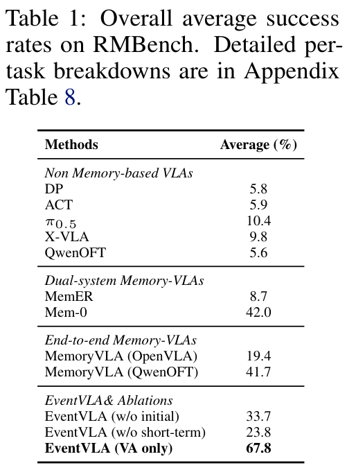

| Methods | Average (%) |
| :--- | :---: |
| **Non Memory-based VLAs** | |
| DP | 5.8 |
| ACT | 5.9 |
| $\pi_{0.5}$ | 10.4 |
| X-VLA | 9.8 |
| QwenOFT | 5.6 |
| **Dual-system Memory-VLAs** | |
| MemER | 8.7 |
| Mem-0 | 42.0 |
| **End-to-end Memory-VLAs** | |
| MemoryVLA (OpenVLA) | 19.4 |
| MemoryVLA (QwenOFT) | 41.7 |
| **EventVLA & Ablations** | |
| EventVLA (w/o initial) | 33.7 |
| EventVLA (w/o short-term) | 23.8 |
| EventVLA (VA only) | 67.8 |

**Caption:** Table 1: Overall average success rates on RMBench. Detailed per-task breakdowns are in Appendix Table 8.

**Caption[CN]:** Table 1: RMBench 上的总体平均成功率。详细的逐任务分解见附录 Table 8。

> <span style="color:#3B82F6"><strong>Para. 1:</strong></span> To thoroughly assess the efficacy of EventVLA, we benchmark our framework against a comprehensive suite of state-of-the-art baselines, categorized into two major paradigms. For standard, reactive (non-memory-based) VLA policies, we select DP [3], ACT [5], $\pi_{0.5}$ [1], X-VLA [17], and QwenOFT [46]. For memory-augmented methods, we evaluate dual-system architectures, including MemER [7] and Mem-0 [8], as well as the end-to-end MemoryVLA [12] framework, where we reproduce its variants based on both the official OpenVLA-OFT [47] and QwenOFT [46] implementations. Our proposed EventVLA is also constructed upon the identical open-source QwenOFT backbone as its foundational base model.

> <span style="color:#F59E0B"><strong>Para. 1[CN]:</strong></span> 为了全面评估 EventVLA 的有效性，我们将我们的框架与涵盖两大主流范式的最先进基线模型进行了基准对比：对于标准的反应式（非记忆基础）VLA 策略，我们选取了 DP [3]、ACT [5]、$\pi_{0.5}$ [1]、X-VLA [17] 和 QwenOFT [46]；对于记忆增强方法，我们评估了包括 MemER [7] 和 Mem-0 [8] 在内的双系统架构，以及端到端 MemoryVLA [12] 框架（我们基于官方 OpenVLA-OFT [47] 和 QwenOFT [46] 分别复现了其对应变体）。我们提出的 EventVLA 同样构建在完全相同的开源 QwenOFT 骨干之上作为其基础模型。

> <span style="color:#3B82F6"><strong>Para. 2:</strong></span> Evaluation on RMBench and the Efficacy of Visual Anchors: First, we evaluate our method on RMBench [8], as shown in Table 1. Because tasks in this suite primarily rely on persistent spatial layouts and fixed motion style rather than hidden intermediate states, we deploy a streamlined version of EventVLA utilizing solely foundational visual anchors. Experimental results demonstrate that this configuration achieves an average success rate of 67.8%, securing state-of-the-art performance and proving that rule-based anchors provide sufficient context for simple memory-required long-horizon manipulation. To validate the structural necessity of these components, we conduct two ablation studies. Removing the initial frame (EventVLA w/o initial) or discarding the short-term history (EventVLA w/o short-term) causes the overall success rate to plummet to 33.7% and 23.8%, respectively. This confirms that both the initial global spatial reference and the short-term motion cues are indispensable for effective visual anchoring.

> <span style="color:#F59E0B"><strong>Para. 2[CN]:</strong></span> 在 RMBench 上的评估与视觉锚点的有效性：首先，我们在 RMBench [8] 上评估了我们的方法，如表 1 所示。由于该套件中的任务主要依赖持久的空间布局和固定的运动模式，而非隐藏的中间状态，因此我们部署了仅使用基础视觉锚点的精简版 EventVLA。实验结果表明，该配置取得了 67.8% 的平均成功率，确立了当前最先进的性能，并证明基于规则的锚点足以针对简单的需要记忆的长时程操作提供充分上下文。为了验证这些组件的结构必要性，我们进行了两项消融研究：去除初始帧（EventVLA w/o initial）或抛弃短期历史（EventVLA w/o short-term）导致整体成功率分别暴跌至 33.7% 和 23.8%。这证实了初始全局空间参考与短期运动线索对于有效的视觉锚定均不可或缺。

### Table 2. RoboTwin-MeM 基准测试结果 (RoboTwin-MeM Benchmark Results)

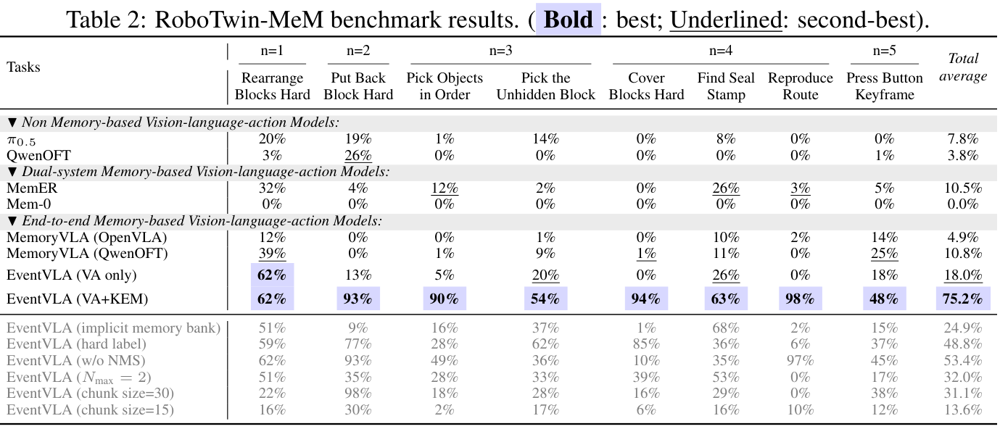

| Tasks | Rearrange Blocks Hard | Put Back Block Hard | Pick Objects in Order | Pick the Unhidden Block | Cover Blocks Hard | Find Seal Stamp | Reproduce Route | Press Button Keyframe | Total average |
| :--- | :---: | :---: | :---: | :---: | :---: | :---: | :---: | :---: | :---: |
| **Complexity ($n$)** | $n=1$ | $n=2$ | $n=3$ | $n=3$ | $n=4$ | $n \in [1,4]$ | $n=4$ | $n \in [2,5]$ | - |
| **▼Non Memory-based Vision-language-action Models:** | | | | | | | | | |
| $\pi_{0.5}$ | 20% | 19% | 1% | 14% | 0% | 8% | 0% | 0% | 7.8% |
| QwenOFT | 3% | 26% | 0% | 0% | 0% | 0% | 0% | 1% | 3.8% |
| **▼Dual-system Memory-based Vision-language-action Models:** | | | | | | | | | |
| MemER | 32% | 4% | 12% | 2% | 0% | 26% | 3% | 5% | 10.5% |
| Mem-0 | 0% | 0% | 0% | 0% | 0% | 0% | 0% | 0% | 0.0% |
| **▼End-to-end Memory-based Vision-language-action Models:** | | | | | | | | | |
| MemoryVLA (OpenVLA) | 12% | 0% | 0% | 1% | 0% | 10% | 2% | 14% | 4.9% |
| MemoryVLA (QwenOFT) | 39% | 0% | 1% | 9% | 1% | 11% | 0% | 25% | 10.8% |
| EventVLA (VA only) | 62% | 13% | 5% | 20% | 0% | 26% | 0% | 18% | 18.0% |
| **EventVLA (VA+KEM)** | **62%** | **93%** | **90%** | **54%** | **94%** | **63%** | **98%** | **48%** | **75.2%** |
| *EventVLA Ablations (RoboTwin-MeM):* | | | | | | | | | |
| EventVLA (implicit memory bank) | 51% | 9% | 16% | 37% | 1% | 68% | 2% | 15% | 24.9% |
| EventVLA (hard label) | 59% | 77% | 28% | 62% | 85% | 36% | 6% | 37% | 48.8% |
| EventVLA (w/o NMS) | 62% | 93% | 49% | 36% | 10% | 35% | 97% | 45% | 53.4% |
| EventVLA ($N_{\max} = 2$) | 51% | 35% | 28% | 33% | 39% | 53% | 0% | 17% | 32.0% |
| EventVLA (chunk size=30) | 22% | 98% | 18% | 28% | 16% | 29% | 0% | 38% | 31.1% |
| EventVLA (chunk size=15) | 16% | 30% | 2% | 17% | 6% | 16% | 10% | 12% | 13.6% |

**Caption:** Table 2: RoboTwin-MeM benchmark results. ( Bold : best; Underlined: second-best).

**Caption[CN]:** Table 2: RoboTwin-MeM 基准测试结果。（粗体：最优；下划线：次优）。

> <span style="color:#3B82F6"><strong>Para. 3:</strong></span> Evaluation on RoboTwin-MeM and the Necessity of KEM: While foundational visual anchors excel on RMBench, their limitations become starkly apparent when evaluated on RoboTwin-MeM, our diagnostic suite explicitly designed to test intermediate state memory. As detailed in Table 2, relying solely on rule-driven visual anchors (VA only) yields a mere 18.0% average success rate. This sharp drop indicates that fixed historical windows are fundamentally inadequate for tasks requiring VLA policies to retain transient visual evidence generated mid-execution. To overcome this non-Markovian bottleneck, the full EventVLA framework augments these visual anchors with the dynamic Keyframe Evidence Memory (KEM) module (VA+KEM). Experimental results reveal a qualitative leap: the complete EventVLA achieves a 75.2% success rate, outperforming all baseline models by a substantial margin. This striking performance delta (from 18.0% to 75.2%) compellingly demonstrates that KEM’s dynamic event capture and foresight-driven writing mechanisms are indispensable for solving complex, long-horizon tasks that hinge on transient intermediate memory.

> <span style="color:#F59E0B"><strong>Para. 3[CN]:</strong></span> 在 RoboTwin-MeM 上的评估与 KEM 的必要性：尽管基础视觉锚点在 RMBench 上表现优异，但在针对中间状态记忆进行严苛测试的 RoboTwin-MeM 上进行评估时，其局限性变得异常明显。如表 2 详细所示，仅依赖规则驱动的视觉锚点（VA only）仅能取得 18.0% 的平均成功率。这一急剧下降表明，固定的历史窗口对于需要 VLA 策略保留执行中途生成的瞬态视觉证据的任务从根本上是不充分的。为了克服这一非马尔可夫瓶颈，完整的 EventVLA 框架利用动态关键帧证据记忆（KEM）模块（VA+KEM）对视觉锚点进行了增强。实验结果展现了质的飞跃：完整的 EventVLA 取得了 75.2% 的成功率，大幅度超越所有基线模型。这一令人惊叹的性能差距（从 18.0% 到 75.2%）极具说服力地证明了 KEM 的动态事件捕获与前瞻驱动写入机制对于解决依赖瞬态中间记忆的复杂长时程任务是不可或缺的。

### Table 3. RoboTwin 2.0 标准马尔可夫基准结果 (RoboTwin 2.0 Benchmark Results)

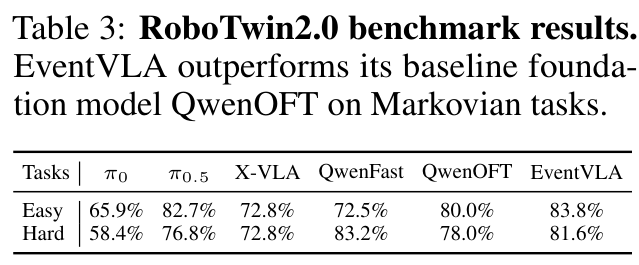

| Tasks | $\pi_0$ | $\pi_{0.5}$ | X-VLA | QwenFast | QwenOFT | EventVLA |
| :--- | :---: | :---: | :---: | :---: | :---: | :---: |
| Easy | 65.9% | 82.7% | 72.8% | 72.5% | 80.0% | 83.8% |
| Hard | 58.4% | 76.8% | 72.8% | 83.2% | 78.0% | 81.6% |

**Caption:** Table 3: RoboTwin2.0 benchmark results. EventVLA outperforms its baseline foundation model QwenOFT on Markovian tasks.

**Caption[CN]:** Table 3: RoboTwin2.0 基准测试结果。EventVLA 在标准马尔可夫任务上超越了其基础基线模型 QwenOFT。

> <span style="color:#3B82F6"><strong>Para. 4:</strong></span> Evaluation on Standard Markovian Benchmarks: To verify that EventVLA preserves fundamental reactive control, we evaluate it on standard Markovian tasks in RoboTwin-2.0 [35] (Table 3). Rather than degrading performance, our memory mechanism slightly improves success rates over the memoryless QwenOFT baseline (80.0% to 83.8% on Easy; 78.0% to 81.6% on Hard), seamlessly complementing standard closed-loop execution.

> <span style="color:#F59E0B"><strong>Para. 4[CN]:</strong></span> 在标准马尔可夫基准上的评估：为了验证 EventVLA 是否保留了基础的反应式控制能力，我们在 RoboTwin-2.0 [35] 的标准马尔可夫任务上对其进行了评估（表 3）。我们的记忆机制不仅没有降低性能，反而相比无记忆的 QwenOFT 基线略微提升了成功率（在 Easy 任务上从 80.0% 提升至 83.8%；在 Hard 任务上从 78.0% 提升至 81.6%），与标准闭环执行形成了无缝互补。

### 5.2 Ablation Analysis of EventVLA

> <span style="color:#3B82F6"><strong>Para. 5:</strong></span> To systematically validate the structural design of the Keyframe Evidence Memory (KEM) module, we conduct ablation studies on the challenging RoboTwin-MeM suite (Table 2, bottom in gray).

> <span style="color:#F59E0B"><strong>Para. 5[CN]:</strong></span> 为了系统验证关键帧证据记忆（KEM）模块的结构设计，我们在极具挑战性的 RoboTwin-MeM 套件上进行了消融研究（表 2 底部灰色区域）。

> <span style="color:#3B82F6"><strong>Para. 6:</strong></span> Core Mechanisms: We observe that replacing explicit raw image concatenation with an implicit latent memory bank drastically drops the success rate from 75.2% to 24.9%, creating a severe information bottleneck. Similarly, substituting temporally smoothed soft labels with rigid binary targets destabilizes the predictive head, reducing performance to 48.8%.

> <span style="color:#F59E0B"><strong>Para. 6[CN]:</strong></span> 核心机制：我们观察到，用隐式潜在记忆库替代显式原始图像拼接会使成功率从 75.2% 急剧下降至 24.9%，从而产生了严重的信息瓶颈。类似地，用刚性二进制目标替代时间平滑的软标签会破坏预测头的稳定性，使性能下降至 48.8%。

> <span style="color:#3B82F6"><strong>Para. 7:</strong></span> Buffer and Horizon Management: Removing the NMS post-processing or restricting the buffer capacity ($N_{\max} = 2$) leads to redundant frame flooding and premature FIFO eviction of critical early evidence, degrading success rates to 53.4% and 32.0%, respectively. Finally, shrinking the execution chunk size (from 50 to 30 or 15) severely truncates KEM’s foresight window, preventing proactive event scheduling and plummeting performance to 31.1% and 13.6%. Comprehensive in-depth analyses of these ablation modes, along with real-time inference speed profiling, are deferred to Appendix C.2.

> <span style="color:#F59E0B"><strong>Para. 7[CN]:</strong></span> 缓冲区与视界管理：移除 NMS 后处理或严格限制缓冲区容量（$N_{\max} = 2$）会导致冗余帧泛滥并引发关键早期证据过早被 FIFO 淘汰，导致成功率分别下降至 53.4% 和 32.0%。最后，缩小执行动作块大小（从 50 缩减至 30 或 15）严重截断了 KEM 的前瞻窗口，阻碍了前瞻性事件调度，导致性能大幅暴跌至 31.1% 和 13.6%。关于这些消融模式的全面深入分析以及实时推理速度评测详见附录 C.2。

### 5.3 Real-World Robot Evaluation

### Figure 4. 真实世界双臂机器人实验环境与评估结果 (Real-World Robot Setups and Results)


**Caption:** Figure 4: Real-world experimental setups and results on the ARX ACONE bimanual robot. We evaluate four memory-intensive manipulation tasks: Find Block Easy, Find Block Hard, Pick-X-Times, and Pick in Order.

**Caption[CN]:** Figure 4: 在 ARX ACONE 双臂机器人上的真实世界实验设置与结果。我们评估了四项需要高强度记忆的操作任务：Find Block Easy、Find Block Hard、Pick-X-Times 以及 Pick in Order。

> <span style="color:#3B82F6"><strong>Para. 8:</strong></span> To evaluate EventVLA in physical environments, we deploy our framework on the ARX ACONE bimanual robot across four non-Markovian manipulation tasks, each tested over 20 independent trials. These tasks explicitly evaluate diverse cognitive memory capabilities under real-world settings: 1) Find Block Easy and Find Block Hard require the model to remember the spatial location of a hidden block after only transient visual exposure. 2) Pick-X-Times tests counting logic, requiring the robot to read a randomized number and manipulate a block accordingly. 3) Pick in Order evaluates in-context memory by asking the robot to reproduce a randomized sequence initially pointed out by a stick. We benchmark EventVLA against a state-of-the-art non-memory model, $\pi_{0.5}$ [1], and a reproduced memory-augmented baseline, $\pi_{\text{MEM}}$ [9].

> <span style="color:#F59E0B"><strong>Para. 8[CN]:</strong></span> 为了在物理环境中评估 EventVLA，我们在 ARX ACONE 双臂机器人上部署了我们的框架，测试了四项非马尔可夫操作任务，每项任务均经过 20 次独立测试。这些任务在真实世界环境下显式评估了多样化的认知记忆能力：1) Find Block Easy 和 Find Block Hard 要求模型在仅经历短暂视觉暴露后记住隐藏积木的空间位置；2) Pick-X-Times 测试计数逻辑，要求机器人读取随机数字并相应地操作积木；3) Pick in Order 评估上下文记忆，要求机器人复现最初由木棍指向的随机序列。我们将 EventVLA 与最先进的无记忆模型 $\pi_{0.5}$ [1] 和复现的记忆增强基线 $\pi_{\text{MEM}}$ [9] 进行了基准对比。

> <span style="color:#3B82F6"><strong>Para. 9:</strong></span> As illustrated in Fig. 4, the purely reactive $\pi_{0.5}$ policy almost entirely fails across all tasks (achieving only 0% to 10% success rates) as it fundamentally lacks the historical context required to infer occluded states. While the memory-augmented $\pi_{\text{MEM}}$ baseline demonstrates partial improvements (e.g., 50% on Find Block Easy), its performance degrades significantly on more complex multi-event-requiring tasks like Pick-X-Times (30%) and Pick in Order (40%) due to the lossy compression of long-term history. In stark contrast, EventVLA achieves commanding success rates of 90%, 60%, 90%, and 75% across the four tasks, respectively. This robust physical performance validates that the KEM module can effectively extract and retain critical transient visual cues, empowering the VLA model with long-horizon memory awareness in the real world.

> <span style="color:#F59E0B"><strong>Para. 9[CN]:</strong></span> 如图 4 所示，纯反应式的 $\pi_{0.5}$ 策略在所有任务中几乎完全失败（仅取得 0% 至 10% 的成功率），因为它从根本上缺乏推断被遮挡状态所需的历史上下文。虽然记忆增强基线 $\pi_{\text{MEM}}$ 展现出部分改进（例如在 Find Block Easy 上达到 50%），但由于长期历史的有损压缩，其在需要多事件的更复杂任务（如 Pick-X-Times 的 30% 和 Pick in Order 的 40%）上性能严重下滑。形成鲜明对比的是，EventVLA 在这四项任务中分别取得了 90%、60%、90% 和 75% 的卓越成功率。这一稳健的物理表现证实了 KEM 模块能够有效提取并保留关键的瞬态视觉线索，从而为 VLA 模型在真实世界中赋予长时程记忆感知能力。


## 6. Limitations

> <span style="color:#3B82F6"><strong>Para. 1:</strong></span> While EventVLA effectively captures transient visual evidence, its bounded event buffer limits scalability in exceptionally long-horizon tasks (e.g., > 10 minutes) with high event densities. Such scenarios risk buffer saturation and premature eviction of early historical cues. Future work will explore hierarchical memory or compressed representations to manage massive event sequences.

> <span style="color:#F59E0B"><strong>Para. 1[CN]:</strong></span> 尽管 EventVLA 能够有效捕获瞬态视觉证据，但在事件密度极高的极长时程任务（例如超过 10 分钟）中，其有界事件缓冲区限制了系统的可扩展性。此类场景存在缓冲区饱和以及早期历史线索被过早淘汰的风险。未来的工作将探索层次化记忆或压缩表征，以管理大规模事件序列。


## 7. Conclusion

> <span style="color:#3B82F6"><strong>Para. 1:</strong></span> We introduced EventVLA, an end-to-end framework tackling non-Markovian long-horizon manipulation via sparse visual evidence memory. By uniting rule-based visual anchors with a foresight-driven Keyframe Evidence Memory (KEM) module, EventVLA proactively captures task-critical transient events, completely avoiding the redundancy of dense memory. Furthermore, we proposed RoboTwin-MeM, a diagnostic benchmark for evaluating intermediate memory capabilities. Extensive evaluations across 17 simulation and 4 real-world tasks demonstrate that EventVLA significantly outperforms state-of-the-art memory-augmented VLAs, ensuring robust memory-requiring long-horizon physical execution.

> <span style="color:#F59E0B"><strong>Para. 1[CN]:</strong></span> 我们提出了 EventVLA，一个通过稀疏视觉证据记忆解决非马尔可夫长时程操作的端到端框架。通过将基于规则的视觉锚点与前瞻驱动的关键帧证据记忆（KEM）模块相结合，EventVLA 主动捕获任务关键的瞬态事件，彻底避免了密集记忆的冗余。此外，我们提出了 RoboTwin-MeM，一个用于评估中间记忆能力的诊断基准。在 17 项仿真任务和 4 项真实世界任务中的广泛评估表明，EventVLA 显著超越了最先进的记忆增强 VLA，确保了需要记忆的长时程物理执行的稳健性。

## Acknowledgments

> <span style="color:#3B82F6"><strong>Para. 1:</strong></span> This work is supported by Shanghai Artificial Intelligence Laboratory.

> <span style="color:#F59E0B"><strong>Para. 1[CN]:</strong></span> 本项工作由上海人工智能实验室资助与支持。


## References

> <span style="color:#3B82F6"><strong>Para. 1:</strong></span> The reference entries below are retained in full, searchable bibliographic format to preserve exact citation provenance.

> <span style="color:#F59E0B"><strong>Para. 1[CN]:</strong></span> 以下参考文献条目完整保留为可检索的书目格式，以维持确切的学术引用出处与溯源审计。

1. [1] P. Intelligence, K. Black, N. Brown, J. Darpinian, K. Dhabalia, D. Driess, A. Esmail, M. Equi, C. Finn, N. Fusai, et al. π0.5: a vision-language-action model with open-world generalization. arXiv preprint arXiv:2504.16054, 2025.
2. [2] P. Intelligence, A. Amin, R. Aniceto, A. Balakrishna, K. Black, K. Conley, G. Connors, J. Darpinian, K. Dhabalia, J. DiCarlo, et al. π*0.6: a vla that learns from experience. arXiv preprint arXiv:2511.14759, 2025.
3. [3] C. Chi, Z. Xu, S. Feng, E. Cousineau, Y. Du, B. Burchfiel, R. Tedrake, and S. Song. Diffusion policy: Visuomotor policy learning via action diffusion. The International Journal of Robotics Research, 44(10-11):1684–1704, 2025.
4. [4] Y. Ze, G. Zhang, K. Zhang, C. Hu, M. Wang, and H. Xu. 3d diffusion policy: Generalizable visuomotor policy learning via simple 3d representations. arXiv preprint arXiv:2403.03954, 2024.
5. [5] T. Z. Zhao, V. Kumar, S. Levine, and C. Finn. Learning fine-grained bimanual manipulation with low-cost hardware. arXiv preprint arXiv:2304.13705, 2023.
6. [6] Y. Dai, H. Fu, J. Lee, Y. Liu, H. Zhang, J. Yang, C. Finn, N. Fazeli, and J. Chai. Robomme: Benchmarking and understanding memory for robotic generalist policies. arXiv preprint arXiv:2603.04639, 2026.
7. [7] A. Sridhar, J. Pan, S. Sharma, and C. Finn. Memer: Scaling up memory for robot control via experience retrieval. arXiv preprint arXiv:2510.20328, 2025.
8. [8] T. Chen, Y. Wang, M. Li, Y. Qin, H. Shi, Z. Li, Y. Hu, Y. Zhang, K. Wang, Y. Chen, et al. Rmbench: Memory-dependent robotic manipulation benchmark with insights into policy design. arXiv preprint arXiv:2603.01229, 2026.
9. [9] M. Torne, K. Pertsch, H. Walke, K. Vedder, S. Nair, B. Ichter, A. Z. Ren, H. Wang, J. Tang, K. Stachowicz, et al. Mem: Multi-scale embodied memory for vision language action models. arXiv preprint arXiv:2603.03596, 2026.
10. [10] L. Xiao, J. Li, J. Gao, F. Ye, Y. Jin, J. Qian, J. Zhang, Y. Wu, and X. Yu. Ava-vla: Improving vision-language-action models with active visual attention. arXiv preprint arXiv:2511.18960, 2025.
11. [11] A. Bulatov, Y. Kuratov, and M. Burtsev. Recurrent memory transformer. Advances in Neural Information Processing Systems, 35:11079–11091, 2022.
12. [12] H. Shi, B. Xie, Y. Liu, L. Sun, F. Liu, T. Wang, E. Zhou, H. Fan, X. Zhang, and G. Huang. Memoryvla: Perceptual-cognitive memory in vision-language-action models for robotic manipulation. arXiv preprint arXiv:2508.19236, 2025.
13. [13] H. Li, S. Yang, Y. Chen, Y. Tian, X. Yang, X. Chen, H. Wang, T. Wang, F. Zhao, D. Lin, et al. Cronusvla: Transferring latent motion across time for multi-frame prediction in manipulation. arXiv e-prints, pages arXiv–2506, 2025.
14. [14] X. Wang, X. Gao, J. Fu, Z. Li, D. Fortier, G. Mullins, A. Kolobov, and B. Guo. Lola: Long horizon latent action learning for general robot manipulation. arXiv preprint arXiv:2512.20166, 2025.
15. [15] S. Bai, Y. Cai, R. Chen, K. Chen, X. Chen, Z. Cheng, L. Deng, W. Ding, C. Gao, C. Ge, et al. Qwen3-vl technical report. arXiv preprint arXiv:2511.21631, 2025.
16. [16] S. Liu, B. Li, K. Ma, L. Wu, H. Tan, X. Ouyang, H. Su, and J. Zhu. Rdt2: Exploring the scaling limit of umi data towards zero-shot cross-embodiment generalization. arXiv preprint arXiv:2602.03310, 2026.
17. [17] J. Zheng, J. Li, Z. Wang, D. Liu, X. Kang, Y. Feng, Y. Zheng, J. Zou, Y. Chen, J. Zeng, et al. X-vla: Soft-prompted transformer as scalable cross-embodiment vision-language-action model. arXiv preprint arXiv:2510.10274, 2025.
18. [18] T. Chen, Y. Mu, Z. Liang, Z. Chen, S. Peng, Q. Chen, M. Xu, R. Hu, H. Zhang, X. Li, et al. G3flow: Generative 3d semantic flow for pose-aware and generalizable object manipulation. In Proceedings of the Computer Vision and Pattern Recognition Conference, pages 1735–1744, 2025.
19. [19] J. Wen, Y. Zhu, J. Li, Z. Tang, C. Shen, and F. Feng. Dexvla: Vision-language model with plug-in diffusion expert for general robot control. arXiv preprint arXiv:2502.05855, 2025.
20. [20] M. Lin, P. Ding, S. Wang, Z. Zhuang, Y. Liu, X. Tong, W. Song, S. Lyu, S. Huang, and D. Wang. Hif-vla: Hindsight, insight and foresight through motion representation for vision-language-action models. arXiv preprint arXiv:2512.09928, 2025.
21. [21] Z. Liang, Y. Li, T. Yang, C. Wu, S. Mao, T. Nian, L. Pei, S. Zhou, X. Yang, J. Pang, et al. Discrete diffusion vla: Bringing discrete diffusion to action decoding in vision-language-action policies. arXiv preprint arXiv:2508.20072, 2025.
22. [22] G. Yang, T. Zhang, H. Hao, W. Wang, Y. Liu, D. Wang, G. Chen, Z. Cai, J. Chen, W. Su, et al. Vlaser: Vision-language-action model with synergistic embodied reasoning. arXiv preprint arXiv:2510.11027, 2025.
23. [23] W. Shen, Y. Liu, Y. Wu, Z. Liang, S. Gu, D. Wang, T. Nian, L. Xu, Y. Qin, J. Pang, et al. Expertise need not monopolize: Action-specialized mixture of experts for vision-language-action learning. arXiv preprint arXiv:2510.14300, 2025.
24. [24] J. Wen, Y. Zhu, M. Zhu, Z. Tang, J. Li, Z. Zhou, X. Liu, C. Shen, Y. Peng, and F. Feng. Diffusionvla: Scaling robot foundation models via unified diffusion and autoregression. In Forty-second International Conference on Machine Learning, 2025.
25. [25] J. Wen, Y. Zhu, J. Li, M. Zhu, Z. Tang, K. Wu, Z. Xu, N. Liu, R. Cheng, C. Shen, et al. Tinyvla: Towards fast, data-efficient vision-language-action models for robotic manipulation. IEEE Robotics and Automation Letters, 2025.
26. [26] R. Zheng, Y. Liang, S. Huang, J. Gao, H. Daumé III, A. Kolobov, F. Huang, and J. Yang. Tracevla: Visual trace prompting enhances spatial-temporal awareness for generalist robotic policies. In International Conference on Learning Representations, volume 2025, pages 54277–54296, 2025.
27. [27] H. Tan, P. Co, Y. Xu, S. Rong, Y. Ji, C. Chi, X. Chen, Q. Zhang, Z. Zhao, P. Wang, et al. Action-sketcher: From reasoning to action via visual sketches for long-horizon robotic manipulation. arXiv preprint arXiv:2601.01618, 2026.
28. [28] H. Wang, Z. Jing, J. Ao, S. Song, X. Li, G. Huang, and C. Bai. Beyond short-horizon: Vq-memory for robust long-horizon manipulation in non-markovian simulation benchmarks. arXiv preprint arXiv:2603.09513, 2026.
29. [29] M. Torne, A. Tang, Y. Liu, and C. Finn. Learning long-context diffusion policies via past-token prediction. arXiv preprint arXiv:2505.09561, 2025.
30. [30] Y.-L. Wei, H. Liao, Y. Lin, P. Wang, Z. Liang, G. Liu, and W.-S. Zheng. Cyclemanip: Enabling cyclic task manipulation via effective historical perception and understanding. arXiv preprint arXiv:2512.01022, 2025.
31. [31] H. Jang, S. Yu, H. Kwon, H. Jeon, Y. Seo, and J. Shin. Contextvla: Vision-language-action model with amortized multi-frame context. arXiv preprint arXiv:2510.04246, 2025.
32. [32] M. Lin, X. Liang, B. Lin, L. Jingzhi, Z. Jiao, K. Li, Y. Ma, Y. Liu, S. Zhao, Y. Zhuang, et al. Echovla: Robotic vision-language-action model with synergistic declarative memory for mobile manipulation. arXiv preprint arXiv:2511.18112, 2025.
33. [33] Y. Lei, Z. Liang, H. Zhang, and P. Luo. Vpwem: Non-markovian visuomotor policy with working and episodic memory. arXiv preprint arXiv:2603.04910, 2026.
34. [34] L. Tan, J. Li, and G. Jing. Memoact: Atkinson-shiffrin-inspired memory-augmented visuomotor policy for robotic manipulation. arXiv preprint arXiv:2603.18494, 2026.
35. [35] T. Chen, Z. Chen, B. Chen, Z. Cai, Y. Liu, Z. Li, Q. Liang, X. Lin, Y. Ge, Z. Gu, et al. Robotwin 2.0: A scalable data generator and benchmark with strong domain randomization for robust bimanual robotic manipulation. arXiv preprint arXiv:2506.18088, 2025.
36. [36] S. Nasiriany, A. Maddukuri, L. Zhang, A. Parikh, A. Lo, A. Joshi, A. Mandlekar, and Y. Zhu. Robocasa: Large-scale simulation of everyday tasks for generalist robots. arXiv preprint arXiv:2406.02523, 2024.
37. [37] S. Tao, F. Xiang, A. Shukla, Y. Qin, X. Hinrichsen, X. Yuan, C. Bao, X. Lin, Y. Liu, T.-k. Chan, et al. Maniskill3: Gpu parallelized robotics simulation and rendering for generalizable embodied ai. arXiv preprint arXiv:2410.00425, 2024.
38. [38] C. Li, R. Zhang, J. Wong, C. Gokmen, S. Srivastava, R. Martín-Martín, C. Wang, G. Levine, M. Lingelbach, J. Sun, et al. Behavior-1k: A benchmark for embodied ai with 1,000 everyday activities and realistic simulation. In Conference on Robot Learning, pages 80–93. PMLR, 2023.
39. [39] X. Li, K. Hsu, J. Gu, K. Pertsch, O. Mees, H. R. Walke, C. Fu, I. Lunawat, I. Sieh, S. Kirmani, et al. Evaluating real-world robot manipulation policies in simulation. arXiv preprint arXiv:2405.05941, 2024.
40. [40] H. Fang, M. Grotz, W. Pumacay, Y. R. Wang, D. Fox, R. Krishna, and J. Duan. Sam2act: Integrating visual foundation model with a memory architecture for robotic manipulation. arXiv preprint arXiv:2501.18564, 2025.
41. [41] E. Cherepanov, N. Kachaev, A. K. Kovalev, and A. I. Panov. Memory, benchmark & robots: A benchmark for solving complex tasks with reinforcement learning. arXiv preprint arXiv:2502.10550, 2025.
42. [42] B. Liu, Y. Zhu, C. Gao, Y. Feng, Q. Liu, Y. Zhu, and P. Stone. Libero: Benchmarking knowledge transfer for lifelong robot learning. Advances in Neural Information Processing Systems, 36:44776–44791, 2023.
43. [43] S. Han, B. Qiu, Y. Liao, S. Huang, C. Gao, S. Yan, and S. Liu. Robocerebra: A large-scale benchmark for long-horizon robotic manipulation evaluation. Advances in Neural Information Processing Systems, 38, 2026.
44. [44] H. Lei, W. Song, H. Zhang, J. Pei, J. Chen, H. Yan, H. Zhao, P. Ding, Z. Zhang, L. Huang, et al. Robomemarena: A comprehensive and challenging robotic memory benchmark. arXiv preprint arXiv:2605.10921, 2026.
45. [45] F. Xiang, Y. Qin, K. Mo, Y. Xia, H. Zhu, F. Liu, M. Liu, H. Jiang, Y. Yuan, H. Wang, et al. Sapien: A simulated part-based interactive environment. In Proceedings of the IEEE/CVF conference on computer vision and pattern recognition, pages 11097–11107, 2020.
46. [46] S. Community. Starvla: A lego-like codebase for vision-language-action model developing. arXiv preprint arXiv:2604.05014, 2026.
47. [47] M. J. Kim, C. Finn, and P. Liang. Fine-tuning vision-language-action models: Optimizing speed and success. arXiv preprint arXiv:2502.19645, 2025.
48. [48] W. Kwon, Z. Li, S. Zhuang, Y. Sheng, L. Zheng, C. H. Yu, J. E. Gonzalez, H. Zhang, and I. Stoica. Efficient memory management for large language model serving with pagedattention. In Proceedings of the ACM SIGOPS 29th Symposium on Operating Systems Principles, 2023.


## Appendix

## A. Implementation Details of EventVLA

### A.1 Training Formulations and Curriculum Strategy

> <span style="color:#3B82F6"><strong>Para. 1:</strong></span> To obtain ground-truth (GT) keyframe supervisions, we leverage an offline automated labeling pipeline powered by Qwen3-VL [15]. By parsing raw demonstration videos alongside task descriptions, the VLM extracts the exact timestamps of task-critical intermediate events, denoted as $t^*$. However, in physical robot execution, keyframe semantics inherently exhibit temporal ambiguity—frames immediately preceding or succeeding $t^*$ are often equally valid for capturing the visual evidence. To prevent noisy gradients caused by rigid binary supervision, we smooth the annotations into a soft target vector $y_t \in [0, 1]^H$ utilizing a raised cosine kernel. Specifically, for a future step $i$ within a dilation radius $R$ of a GT event $t^*$, the soft target is defined as $y_t^i = 0.5\left(1 + \cos\left(\frac{\pi |t+i-t^*|}{R}\right)\right)$.

> <span style="color:#F59E0B"><strong>Para. 1[CN]:</strong></span> 为了获得真值（GT）关键帧监督信号，我们利用了基于 Qwen3-VL [15] 的离线自动化标注流水线。通过解析原始演示视频以及任务描述，VLM 能够提取任务关键中间事件的确切时间戳，记为 $t^*$。然而，在物理机器人执行过程中，关键帧语义天然具备时序模糊性——紧邻 $t^*$ 之前或之后的帧对于捕获视觉证据通常同样有效。为了防止刚性二进制监督导致的梯度噪声，我们利用升余弦核将标注平滑为软目标向量 $y_t \in [0, 1]^H$。具体而言，对于位于真值事件 $t^*$ 膨胀半径 $R$ 内的未来时步 $i$，软目标定义为 $y_t^i = 0.5\left(1 + \cos\left(\frac{\pi |t+i-t^*|}{R}\right)\right)$。

> <span style="color:#3B82F6"><strong>Para. 2:</strong></span> To supervise the chunk-wise keyframe predictions against these temporally smoothed annotations, we formulate the Keyframe Evidence Memory loss $\mathcal{L}_{\text{kem}}$ as a sequence-averaged Binary Cross-Entropy (BCE) objective. This explicitly aligns each predicted scalar probability $\hat{p}_t^i \in [0, 1]$ with its corresponding soft target $y_t^i \in [0, 1]$ across the entire future action horizon $H$:

$$
\mathcal{L}_{\text{kem}} = -\frac{1}{H} \sum_{i=1}^{H} \left[ y_t^i \log(\hat{p}_t^i) + (1 - y_t^i) \log(1 - \hat{p}_t^i) \right]
$$

> <span style="color:#F59E0B"><strong>Para. 2[CN]:</strong></span> 为了针对这些经过时序平滑的标注对块级关键帧预测进行监督，我们将关键帧证据记忆损失 $\mathcal{L}_{\text{kem}}$ 形式化为序列平均的二进制交叉熵（BCE）目标。这显式地将整个未来动作视界 $H$ 内的每个预测标量概率 $\hat{p}_t^i \in [0, 1]$ 与其对应的软目标 $y_t^i \in [0, 1]$ 进行对齐：

> <span style="color:#3B82F6"><strong>Para. 3:</strong></span> The entire framework is then optimized end-to-end via a joint objective that couples memory awareness with precise motor control:

$$
\mathcal{L} = \mathcal{L}_{\text{action}} + \lambda \mathcal{L}_{\text{kem}}
$$

> <span style="color:#F59E0B"><strong>Para. 3[CN]:</strong></span> 整个框架随后通过耦合记忆感知与精确电机控制的联合目标进行端到端优化：

> <span style="color:#3B82F6"><strong>Para. 4:</strong></span> where $\mathcal{L}_{\text{action}}$ denotes the standard continuous action generation loss (e.g., regression or flow-matching), and $\lambda$ serves as a balancing coefficient to appropriately scale the memory supervision.

> <span style="color:#F59E0B"><strong>Para. 4[CN]:</strong></span> 其中 $\mathcal{L}_{\text{action}}$ 表示标准的连续动作生成损失（如回归或流匹配损失），$\lambda$ 作为平衡系数以适当缩放记忆监督的权重。

> <span style="color:#3B82F6"><strong>Para. 5:</strong></span> During training, constructing the event buffer $\mathcal{E}_t$ dynamically from the model’s own predictions in the early stages causes severe training instability, whereas relying exclusively on GT keyframes introduces a critical train-test distribution shift since GT keyframes are unavailable at test time. To bridge this gap, we implement a scheduled teacher-to-student curriculum. We introduce an annealing parameter $\alpha$ that linearly decays from 1 to 0 over the training duration. At each step, the framework decides whether to commit an observation to $\mathcal{E}_t$ using the GT keyframes with probability $\alpha$ (teacher-forcing), or relying on its own thresholded predictions ($\hat{p}_t^i \ge \tau_{\text{commit}}$) with probability $1 - \alpha$. This gradual transition ensures stable initial convergence while forcing the VLA policy to eventually adapt to its own autonomous memory updating cadence.

> <span style="color:#F59E0B"><strong>Para. 5[CN]:</strong></span> 在训练过程中，初期完全依据模型自身的预测动态构建事件缓冲区 $\mathcal{E}_t$ 会导致严重的训练不稳定性；反之，若完全依赖真值关键帧则会引入严重的训练-测试分布偏移，因为测试时真值关键帧是不可用的。为了弥合这一差距，我们实现了一种预定的教师向学生演进的课程学习策略。我们引入了一个在训练期间从 1 线性衰减至 0 的退火参数 $\alpha$。在每个步骤中，框架以概率 $\alpha$ 决定是否使用真值关键帧将观测提交至 $\mathcal{E}_t$（教师强制，Teacher-Forcing），或以概率 $1 - \alpha$ 依赖其自身的阈值化预测（$\hat{p}_t^i \ge \tau_{\text{commit}}$）。这种渐进式过渡既确保了初期的稳定收敛，又迫使 VLA 策略最终适应其自主的记忆更新节奏。

### A.2 Online Inference and Post-Processing

> <span style="color:#3B82F6"><strong>Para. 6:</strong></span> During online inference, the chunk-wise prediction $\hat{p}_t$ naturally yields clustered, temporally continuous high-probability scores around an unfolding semantic event. To prevent redundant frames of the same visual event from flooding the bounded buffer $\mathcal{E}_t$, we compress the $H$-dimensional probability vector into discrete, sparse write events via a rigorous post-processing extraction pipeline.

> <span style="color:#F59E0B"><strong>Para. 6[CN]:</strong></span> 在线推理期间，块级预测 $\hat{p}_t$ 天然会在展开的语义事件周围产生聚集且时间连续的高概率得分。为了防止同一视觉事件的冗余帧泛滥并充斥有界缓冲区 $\mathcal{E}_t$，我们通过严格的后处理提取流水线将 $H$ 维概率向量压缩为离散且稀疏的写入事件。

> <span style="color:#3B82F6"><strong>Para. 7:</strong></span> First, we identify a set of local probability peaks $\mathcal{K}_t$ by applying the confidence threshold $\tau_{\text{commit}}$ coupled with a 1D Non-Maximum Suppression (NMS) algorithm. Specifically, a future step index $i$ is selected as a candidate peak if its probability exceeds the threshold and represents the local maximum within a sliding temporal window of radius $w$:

$$
\mathcal{K}_t = \left\{ i \in \{1, \dots, H\} \;\middle|\; \hat{p}_t^i \ge \tau_{\text{commit}} \land \hat{p}_t^i = \max_{j \in \mathcal{N}_w(i)} \hat{p}_t^j \right\}
$$

> <span style="color:#F59E0B"><strong>Para. 7[CN]:</strong></span> 首先，我们通过结合置信度阈值 $\tau_{\text{commit}}$ 与一维非极大值抑制（1D NMS）算法识别出一组局部概率峰值 $\mathcal{K}_t$。具体而言，如果某个未来时步索引 $i$ 的概率超过阈值且代表半径为 $w$ 的滑动时间窗口内的局部极大值，则被选为候选峰值：

> <span style="color:#3B82F6"><strong>Para. 8:</strong></span> where $\mathcal{N}_w(i) = [\max(1, i - w), \min(H, i + w)]$ denotes the NMS neighborhood.

> <span style="color:#F59E0B"><strong>Para. 8[CN]:</strong></span> 其中 $\mathcal{N}_w(i) = [\max(1, i - w), \min(H, i + w)]$ 表示 NMS 的邻域窗口。

> <span style="color:#3B82F6"><strong>Para. 9:</strong></span> While NMS effectively isolates local peaks, rapid consecutive events might still trigger excessive memory writes. To strictly enforce operational sparsity, a temporal cooldown period $C$ is evaluated sequentially over the candidates. A candidate peak $i \in \mathcal{K}_t$ is officially validated and committed to $\mathcal{E}_t$ if and only if $(t + i) - t_{\text{last}} > C$, where $t_{\text{last}}$ denotes the absolute physical timestamp of the most recently committed keyframe. Through this cascading extraction mechanism, the framework mathematically distills the dense predictive landscape into an optimal, highly sparse subset. This guarantees that memory allocation remains strictly tied to novel interactive evidence, maximizing information retention while seamlessly adhering to real-time execution constraints and bounded memory buffer size $N_{\max}$.

> <span style="color:#F59E0B"><strong>Para. 9[CN]:</strong></span> 虽然 NMS 能够有效隔离局部峰值，但快速连续发生的事件仍可能触发过度的记忆写入。为了严格保证运行时的稀疏性，系统在候选峰值上依次评估时域冷却周期（cooldown period）$C$。当且仅当 $(t + i) - t_{\text{last}} > C$ 时，候选峰值 $i \in \mathcal{K}_t$ 才被正式验证并提交至 $\mathcal{E}_t$，其中 $t_{\text{last}}$ 表示最近一次提交的关键帧的绝对物理时间戳。通过这种级联提取机制，框架在数学上将密集的预测分布提炼为一个最优且高度稀疏的子集。这保证了记忆分配严格与全新的交互证据绑定，在最大限度保留信息的同时，无缝契合了实时执行约束与有界记忆缓冲区容量 $N_{\max}$。

### A.3 Automated Keyframe Annotation Pipeline

> <span style="color:#3B82F6"><strong>Para. 10:</strong></span> To circumvent the prohibitive costs associated with dense manual frame annotation for long-horizon tasks, we develop an automated, highly scalable keyframe labeling pipeline powered by Large Vision-Language Models (VLMs). Specifically, we deploy the state-of-the-art Qwen3-VL-235B-A22B-Instruct-FP8 [15] model on a local server equipped with 8 NVIDIA A800 GPUs using the vLLM [48] framework.

> <span style="color:#F59E0B"><strong>Para. 10[CN]:</strong></span> 为了规避长时程任务中密集人工逐帧标注的高昂成本，我们开发了一套基于大型视觉-语言模型（VLM）的自动化、高可扩展关键帧标注流水线。具体而言，我们在配备 8 块 NVIDIA A800 GPU 的本地服务器上，利用 vLLM [48] 框架部署了最先进的 Qwen3-VL-235B-A22B-Instruct-FP8 [15] 模型。

> <span style="color:#3B82F6"><strong>Para. 11:</strong></span> Data Pre-processing and In-Context Learning. Rather than feeding an unmanageably long continuous video stream directly into the VLM, we uniformly sample the temporal horizon into a discrete set of frames (e.g., 128 frames per episode). To ensure robust spatial awareness, particularly in scenarios involving severe occlusions, we extract and concatenate multi-view observations (e.g., global head camera and wrist camera) for each sampled timestep. Crucially, to align the VLM’s outputs with our specific definition of transient visual evidence, we employ an In-Context Learning (ICL) strategy. The prompt includes a few-shot demonstration from identical or similar tasks, containing the sampled frames alongside their ground-truth keyframe steps, establishing a rigorous template for temporal alignment and JSON-formatted outputs.

> <span style="color:#F59E0B"><strong>Para. 11[CN]:</strong></span> 数据预处理与上下文学习：我们并未将难以处理的超长连续视频流直接输入 VLM，而是将时间视界均匀下采样为离散的帧集合（例如每个回合采样 128 帧）。为了确保稳健的空间感知（特别是在涉及严重遮挡的场景下），我们针对每个采样时步提取并拼接多视角观测（例如全局头部相机与手腕相机）。至关重要的是，为了使 VLM 的输出与我们对瞬态视觉证据的明确定义保持一致，我们采用了上下文学习（In-Context Learning, ICL）策略。提示词中包含了来自相同或相似任务的少样本演示，其中包含采样帧及其对应的真值关键帧时步，为时序对齐与 JSON 格式输出建立了严谨的模板。

> <span style="color:#3B82F6"><strong>Para. 12:</strong></span> The exact system prompt utilized for the automated pipeline is presented below:
>
> ```text
> System Prompt:
> You are an expert robot-video keyframe annotator.
> CRITICAL REQUIREMENT:
> - The annotation MUST strictly follow task instruction.
> - Treat task instruction as the primary objective definition; if visuals are ambiguous, prioritize consistency with it.
> Episode metadata:
> - episode id: <episode id>
> - task instruction: <task instruction>
> - total frames: <total frames>
> - required keyframe count: <num keyframes>
> - provided views: <selected views>
> What to annotate:
> 1. Find key state transitions for this task (e.g., stable grasp acquired, object placed, cycle transition).
> 2. Keep keyframes representative and temporally ordered across the full task progress.
> 3. For repeated pick/place cycles, pick the most stable and recognizable moments per cycle.
> Output format constraints:
> 1. Return JSON only. No markdown, no explanations.
> 2. Format: { "keyframe steps": [int, int, ...] }
> 3. keyframe steps must:
> - have length exactly <num keyframes>
> - be strictly increasing
> - be in [0, <total frames - 1>]
> - contain no duplicates
> ```

> <span style="color:#F59E0B"><strong>Para. 12[CN]:</strong></span> 自动化流水线所使用的确切系统提示词如下所示：
>
> ```text
> System Prompt:
> You are an expert robot-video keyframe annotator.
> CRITICAL REQUIREMENT:
> - The annotation MUST strictly follow task instruction.
> - Treat task instruction as the primary objective definition; if visuals are ambiguous, prioritize consistency with it.
> Episode metadata:
> - episode id: <episode id>
> - task instruction: <task instruction>
> - total frames: <total frames>
> - required keyframe count: <num keyframes>
> - provided views: <selected views>
> What to annotate:
> 1. Find key state transitions for this task (e.g., stable grasp acquired, object placed, cycle transition).
> 2. Keep keyframes representative and temporally ordered across the full task progress.
> 3. For repeated pick/place cycles, pick the most stable and recognizable moments per cycle.
> Output format constraints:
> 1. Return JSON only. No markdown, no explanations.
> 2. Format: { "keyframe steps": [int, int, ...] }
> 3. keyframe steps must:
> - have length exactly <num keyframes>
> - be strictly increasing
> - be in [0, <total frames - 1>]
> - contain no duplicates
> ```

> <span style="color:#3B82F6"><strong>Para. 13:</strong></span> Annotation Reliability and Error Analysis. To rigorously validate the reliability of this automated pipeline, we conducted a comprehensive cross-validation study. In the simulation environments, we compared the keyframes automatically annotated by the Qwen3-VL-235B model against the precise algorithmic ground-truth (GT) states acquired directly from the RoboTwin 2.0 [35] physics engine. The results demonstrate that the VLM’s predictions exhibit an average absolute temporal error of less than 10 timesteps. Furthermore, when deployed on the four complex real-world bimanual tasks, the prediction error remained within 50 timesteps compared to human-annotated ground truth. Given that our evaluation episodes feature extremely long horizons (often exceeding 1500 to 2000 steps), this negligible temporal variance, which is naturally accommodated by our temporally smoothed soft labels, strongly confirms that our VLM-powered automated annotation pipeline is highly reliable, precise, and ready for scalable deployment.

> <span style="color:#F59E0B"><strong>Para. 13[CN]:</strong></span> 标注可靠性与误差分析：为了严密验证该自动化流水线的可靠性，我们进行了一项全面的交叉验证研究。在仿真环境中，我们将 Qwen3-VL-235B 模型自动标注的关键帧与直接从 RoboTwin 2.0 [35] 物理引擎获取的精确算法真值（GT）状态进行了对比。结果表明，VLM 的预测展现出小于 10 个时步的平均绝对时间误差。此外，当部署于四项复杂的真实世界双臂任务时，与人工标注真值相比，预测误差仍然保持在 50 个时步以内。考虑到我们的评估回合具备极长的视界（通常超过 1500 至 2000 步），这一可忽略不计的时间方差能够被我们的时间平滑软标签自然包容，强有力地证实了我们基于 VLM 的自动化标注流水线具备高度的可靠性与精度，完全胜任大规模部署。


## B. Experimental Setups and Benchmarks

### B.1 RoboTwin-MeM Benchmark Details

### Table 4. RoboTwin-MeM 基准测试详细统计数据 (Detailed Statistics of Proposed RoboTwin-MeM Benchmark)

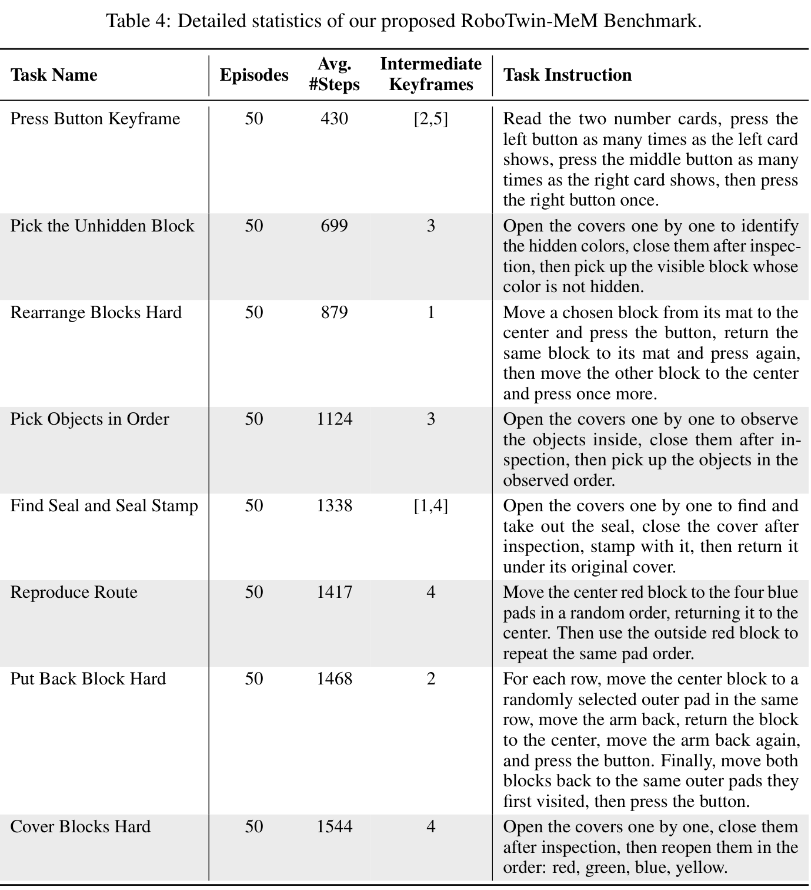

| Task Name | Episodes | Avg. #Steps | Intermediate Keyframes | Task Instruction |
| :--- | :---: | :---: | :---: | :--- |
| **Press Button Keyframe** | 50 | 430 | [2,5] | Read the two number cards, press the left button as many times as the left card shows, press the middle button as many times as the right card shows, then press the right button once. |
| **Pick the Unhidden Block** | 50 | 699 | 3 | Open the covers one by one to identify the hidden colors, close them after inspection, then pick up the visible block whose color is not hidden. |
| **Rearrange Blocks Hard** | 50 | 879 | 1 | Move a chosen block from its mat to the center and press the button, return the same block to its mat and press again, then move the other block to the center and press once more. |
| **Pick Objects in Order** | 50 | 1124 | 3 | Open the covers one by one to observe the objects inside, close them after inspection, then pick up the objects in the observed order. |
| **Find Seal and Seal Stamp** | 50 | 1338 | [1,4] | Open the covers one by one to find and take out the seal, close the cover after inspection, stamp with it, then return it under its original cover. |
| **Reproduce Route** | 50 | 1417 | 4 | Move the center red block to the four blue pads in a random order, returning it to the center. Then use the outside red block to repeat the same pad order. |
| **Put Back Block Hard** | 50 | 1468 | 2 | For each row, move the center block to a randomly selected outer pad in the same row, move the arm back, return the block to the center, move the arm back again, and press the button. Finally, move both blocks back to the same outer pads they first visited, then press the button. |
| **Cover Blocks Hard** | 50 | 1544 | 4 | Open the covers one by one, close them after inspection, then reopen them in the order: red, green, blue, yellow. |

**Caption:** Table 4: Detailed statistics of our proposed RoboTwin-MeM Benchmark.

**Caption[CN]:** Table 4: 我们提出的 RoboTwin-MeM 基准的详细统计数据。

> <span style="color:#3B82F6"><strong>Para. 1:</strong></span> As introduced in Sec. 4 of the main text, RoboTwin-MeM is a diagnostic simulation suite specifically engineered to isolate and evaluate genuinely non-Markovian robotic manipulation. Unlike conventional long-horizon environments where the workspace state remains persistently visible, RoboTwin-MeM enforces strict visual occlusions and temporal delays. In these tasks, critical visual evidence, such as the hidden color of a block, the identity of an object under a cover, or a randomly generated spatial sequence, manifests only transiently during intermediate interactions before becoming completely unobservable.

> <span style="color:#F59E0B"><strong>Para. 1[CN]:</strong></span> 如正文第 4 节所述，RoboTwin-MeM 是一个专门设计的诊断仿真套件，用于隔离并评估真正的非马尔可夫机器人操作。与工作空间状态始终可见的传统长时程环境不同，RoboTwin-MeM 强制施加了严格的视觉遮挡与时间延迟。在这些任务中，关键视觉证据（例如积木的隐藏颜色、盖子下物体的类别或随机生成的空间序列）仅在中间交互过程中短暂显现，随后便完全不可观测。

> <span style="color:#3B82F6"><strong>Para. 2:</strong></span> To systematically quantify memory capacity, RoboTwin-MeM spans 8 complex bimanual manipulation tasks with exceptionally long execution horizons, ranging from an average of 430 to 1,544 steps per episode. The difficulty of each task is explicitly parameterized by $n \in [1, 5]$, which defines the exact number of intermediate keyframe events the robot must autonomously capture and retain to successfully complete the instruction.

> <span style="color:#F59E0B"><strong>Para. 2[CN]:</strong></span> 为了系统量化记忆能力，RoboTwin-MeM 涵盖了 8 项复杂的双臂操作任务，具有超长的执行视界，每个回合平均在 430 到 1544 步之间。每项任务的难度均通过 $n \in [1, 5]$ 进行显式参数化，该参数定义了机器人为了成功完成指令必须自主捕获并保留的中间关键帧事件的确切数量。

### Figure 5. EventVLA 在四项真实世界操作任务中的扩展执行时序 (Expanded Real-World Execution Sequences of EventVLA)


**Caption:** Figure 5: Expanded real-world execution sequences of EventVLA across the four manipulation tasks. The specific task-critical intermediate keyframes, which the policy autonomously captures and commits to memory, are highlighted with blue borders.

**Caption[CN]:** Figure 5: EventVLA 在四项真实世界操作任务中的扩展执行时序。策略自主捕获并提交至记忆中的特定任务关键中间关键帧用蓝色边框高亮标出。

> <span style="color:#3B82F6"><strong>Para. 3:</strong></span> For instance, memory-intensive tasks like Cover Blocks Hard ($n = 4$) and Pick Objects in Order ($n = 3$) require the robot to lift opaque covers to inspect hidden attributes, remember them after the covers are closed, and execute subsequent pick-and-place actions based on that stored memory. Similarly, Press Button Keyframe requires the robot to read randomized number cards and translate them into a sequential counting and pressing logic. As visualized in Fig. 3, these transient, interaction-driven keyframes (highlighted with blue borders) serve as the critical informational bridge between past observations and future actions.

> <span style="color:#F59E0B"><strong>Para. 3[CN]:</strong></span> 例如，像 Cover Blocks Hard（$n = 4$）和 Pick Objects in Order（$n = 3$）这样高强度依赖记忆的任务，要求机器人揭开不透明的盖子以检查隐藏属性，在盖子合上后记住这些属性，并基于存储的记忆执行后续的抓取与放置动作。类似地，Press Button Keyframe 要求机器人读取随机数字卡片，并将其转化为连续的计数和按压逻辑。如图 3 所示，这些由交互驱动的瞬态关键帧（用蓝色边框高亮显示）构成了连接过去观测与未来动作的关键信息桥梁。

> <span style="color:#3B82F6"><strong>Para. 4:</strong></span> The comprehensive task statistics, including the average number of steps, the required intermediate keyframe count $n$, and the specific language instructions for all 8 evaluation tasks, are detailed in Table 4.

> <span style="color:#F59E0B"><strong>Para. 4[CN]:</strong></span> 包含平均步数、所需中间关键帧数量 $n$ 以及所有 8 项评估任务的具体语言指令在内的综合任务统计数据详见表 4。

### B.2 Real-world Tasks Details

> <span style="color:#3B82F6"><strong>Para. 5:</strong></span> To supplement the single-frame task overviews provided in Fig. 4, Fig. 5 presents the expanded, step-by-step temporal sequences for the four real-world manipulation tasks. These full execution rollouts illustrate exactly when transient visual evidence emerges during physical interaction. The task-critical intermediate keyframes that the policy must autonomously capture and commit to its dynamic event buffer, such as briefly exposing a hidden block, reading a randomized number, or observing a specific sequence pointed out by a stick, are explicitly highlighted with blue borders. By successfully isolating and retaining these sparse states, EventVLA effectively bridges the temporal gap required for non-Markovian control.

> <span style="color:#F59E0B"><strong>Para. 5[CN]:</strong></span> 为了补充图 4 提供的单帧任务概览，图 5 展示了四项真实世界操作任务的展开式、逐步时序序列。这些完整的执行展开过程清晰展示了瞬态视觉证据在物理交互过程中确切何时出现。策略必须自主捕获并提交至其动态事件缓冲区的任务关键中间关键帧（例如短暂露出隐藏积木、读取随机数字、或观察木棍指示的特定序列）均用蓝色边框明确高亮。通过成功隔离并保留这些稀疏状态，EventVLA 有效弥合了非马尔可夫控制所需的时间间隔。

### B.3 Network Architecture and Hyper-parameters

> <span style="color:#3B82F6"><strong>Para. 6:</strong></span> For RMBench and RoboTwin-MeM, our EventVLA framework is built upon the open-source QwenOFT [46] architecture, which utilizes Qwen3-VL-4B-Instruct as the foundational Vision-Language Model (VLM). The visual observations are resized to 224 $\times$ 224 before being processed by the vision encoder.

> <span style="color:#F59E0B"><strong>Para. 6[CN]:</strong></span> 对于 RMBench 和 RoboTwin-MeM，我们的 EventVLA 框架建立在开源的 QwenOFT [46] 架构之上，该架构采用 Qwen3-VL-4B-Instruct 作为基础视觉-语言模型（VLM）。视觉观测在被视觉编码器处理之前被调整为 224 $\times$ 224 分辨率。

> <span style="color:#3B82F6"><strong>Para. 7:</strong></span> During the training phase, the entire framework is optimized end-to-end using the AdamW optimizer for 80,000 training steps. We apply a differential learning rate strategy to ensure stable convergence: the pre-trained VLM backbone is fine-tuned with a lower learning rate of $1 \times 10^{-5}$, while the newly initialized components (the action head and the Keyframe Evidence Memory prediction head) are trained with a higher learning rate of $1 \times 10^{-4}$. The action prediction horizon ($H$) is set to 50 steps for all tasks.

> <span style="color:#F59E0B"><strong>Para. 7[CN]:</strong></span> 在训练阶段，整个框架使用 AdamW 优化器进行端到端优化，共训练 80,000 个步数。我们应用了差分学习率策略以确保稳定收敛：预训练的 VLM 骨干以较低的 $1 \times 10^{-5}$ 学习率进行微调，而新初始化的组件（动作头和关键帧证据记忆预测头）则以较高的 $1 \times 10^{-4}$ 学习率进行训练。对于所有任务，动作预测视界（$H$）均设置为 50 步。

### Table 5. RMBench 网络架构与训练超参数 (Network Architecture and Training Hyper-parameters for RMBench)

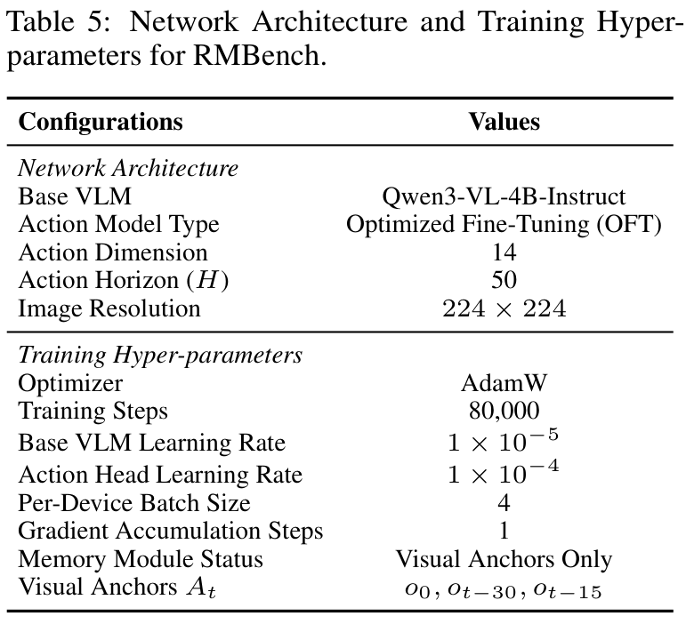

| Configurations | Values |
| :--- | :--- |
| **Network Architecture** | |
| Base VLM | Qwen3-VL-4B-Instruct |
| Action Model Type | Optimized Fine-Tuning (OFT) |
| Action Dimension | 14 |
| Action Horizon ($H$) | 50 |
| Image Resolution | 224 $\times$ 224 |
| **Training Hyper-parameters** | |
| Optimizer | AdamW |
| Training Steps | 80,000 |
| Base VLM Learning Rate | $1 \times 10^{-5}$ |
| Action Head Learning Rate | $1 \times 10^{-4}$ |
| Per-Device Batch Size | 4 |
| Gradient Accumulation Steps | 1 |
| Memory Module Status | Visual Anchors Only |
| Visual Anchors $\mathcal{A}_t$ | $o_0, o_{t-30}, o_{t-15}$ |

**Caption:** Table 5: Network Architecture and Training Hyper-parameters for RMBench.

**Caption[CN]:** Table 5: RMBench 的网络架构与训练超参数。

> <span style="color:#3B82F6"><strong>Para. 8:</strong></span> To explicitly reflect the different memory demands of our evaluated benchmarks, we configure the memory modules differently. For RMBench, which primarily evaluates foundational visual anchoring without the need for intermediate transient memory, the policy is trained exclusively with initial and short-term visual anchors. The detailed network architecture and training hyper-parameters for RMBench are summarized in Table 5.

> <span style="color:#F59E0B"><strong>Para. 8[CN]:</strong></span> 为了明确体现我们所评估基准的不同记忆需求，我们对记忆模块进行了差异化配置。对于主要评估基础视觉锚定而不需要中间瞬态记忆的 RMBench，策略仅使用初始和短期视觉锚点进行训练。RMBench 的详细网络架构与训练超参数汇总于表 5。

### Table 6. RoboTwin-MeM 网络架构与 KEM 超参数 (Network Architecture and KEM Hyper-parameters for RoboTwin-MeM)

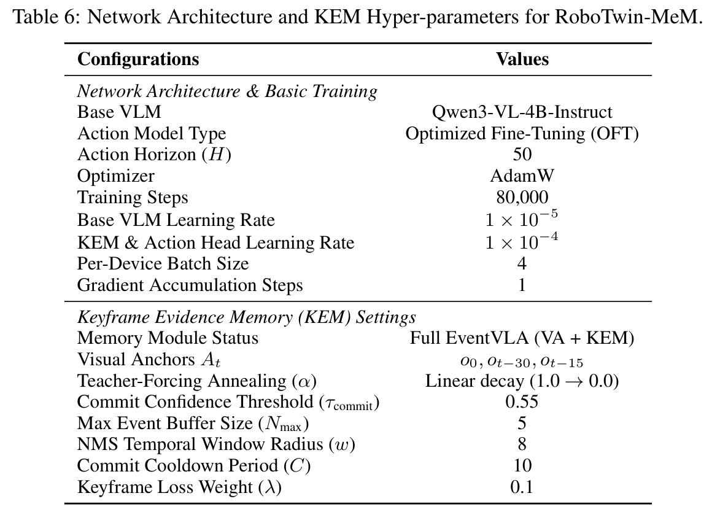

| Configurations | Values |
| :--- | :--- |
| **Network Architecture & Basic Training** | |
| Base VLM | Qwen3-VL-4B-Instruct |
| Action Model Type | Optimized Fine-Tuning (OFT) |
| Action Horizon ($H$) | 50 |
| Optimizer | AdamW |
| Training Steps | 80,000 |
| Base VLM Learning Rate | $1 \times 10^{-5}$ |
| KEM & Action Head Learning Rate | $1 \times 10^{-4}$ |
| Per-Device Batch Size | 4 |
| Gradient Accumulation Steps | 1 |
| **Keyframe Evidence Memory (KEM) Settings** | |
| Memory Module Status | Full EventVLA (VA + KEM) |
| Visual Anchors $\mathcal{A}_t$ | $o_0, o_{t-30}, o_{t-15}$ |
| Teacher-Forcing Annealing ($\alpha$) | Linear decay (1.0 $\to$ 0.0) |
| Commit Confidence Threshold ($\tau_{\text{commit}}$) | 0.55 |
| Max Event Buffer Size ($N_{\max}$) | 5 |
| NMS Temporal Window Radius ($w$) | 8 |
| Commit Cooldown Period ($C$) | 10 |
| Keyframe Loss Weight ($\lambda$) | 0.1 |

**Caption:** Table 6: Network Architecture and KEM Hyper-parameters for RoboTwin-MeM.

**Caption[CN]:** Table 6: RoboTwin-MeM 的网络架构与 KEM 超参数。

> <span style="color:#3B82F6"><strong>Para. 9:</strong></span> Conversely, for the strictly non-Markovian RoboTwin-MeM, the full Keyframe Evidence Memory (KEM) module is activated. To ensure early training stability and bridge the train-test distribution shift, we apply a scheduled teacher-to-student curriculum, where the teacher-forcing probability $\alpha$ decays linearly from 1.0 to 0.0 over the training duration. As detailed in Table 6, we also introduce specific hyper-parameters to govern the online memory extraction pipeline. The chunk-wise keyframe predictions are filtered using a commit confidence threshold of $\tau_{\text{commit}} = 0.55$. To enforce rigorous memory sparsity, we apply a 1D Non-Maximum Suppression (NMS) sliding window with a radius of $w = 8$, followed by a temporal cooldown period of $C = 10$ steps between consecutive memory writes. Finally, the dynamic event buffer is bounded by a maximum capacity of $N_{\max} = 5$, managed by a FIFO eviction policy to satisfy real-time computational constraints.

> <span style="color:#F59E0B"><strong>Para. 9[CN]:</strong></span> 相反，对于严格非马尔可夫的 RoboTwin-MeM，完整的关键帧证据记忆（KEM）模块被激活。为了确保训练初期的稳定性并弥合训练-测试分布偏移，我们应用了一种预定的教师向学生演进课程学习策略，其中教师强制概率 $\alpha$ 在训练期间从 1.0 线性衰减至 0.0。如表 6 详述，我们还引入了特定的超参数来管理在线记忆提取流水线：块级关键帧预测使用 $\tau_{\text{commit}} = 0.55$ 的提交置信度阈值进行过滤；为了强制执行严格的记忆稀疏性，我们应用了半径为 $w = 8$ 的一维非极大值抑制（1D NMS）滑动窗口，并在连续记忆写入之间施加 $C = 10$ 步的时域冷却周期；最后，动态事件缓冲区受最大容量 $N_{\max} = 5$ 限制，并采用 FIFO 淘汰策略以满足实时计算约束。

### Table 7. 真实机器人网络架构与 KEM 超参数 (Network Architecture and KEM Hyper-parameters for Real-Robot)

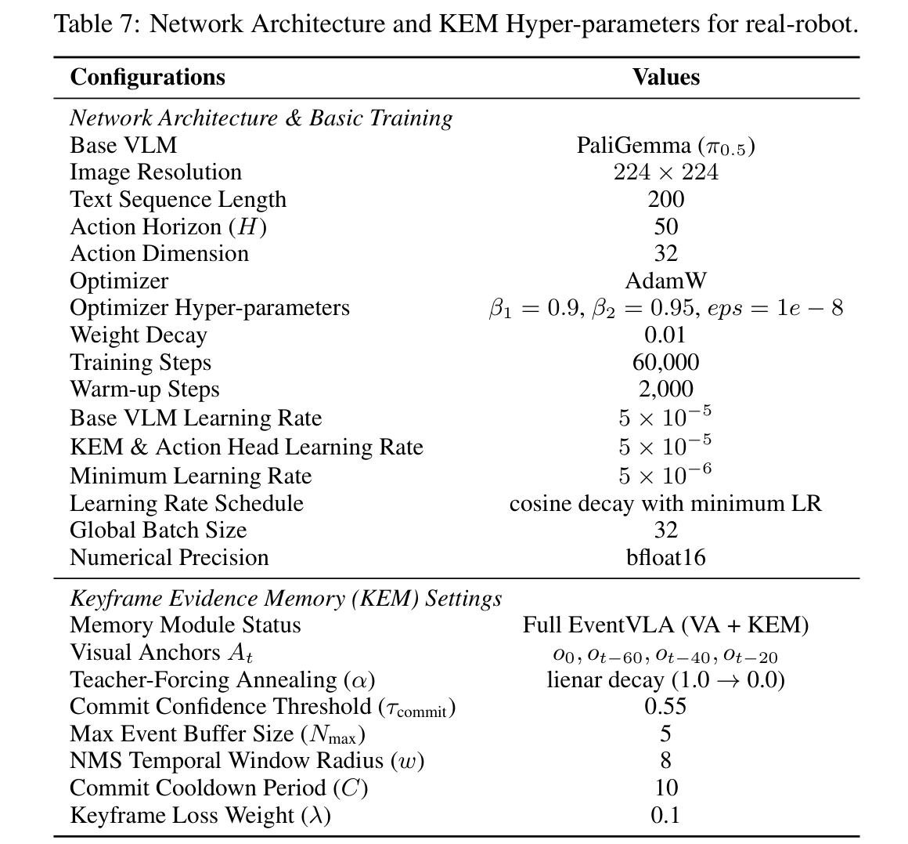

| Configurations | Values |
| :--- | :--- |
| **Network Architecture & Basic Training** | |
| Base VLM | PaliGemma ($\pi_{0.5}$) |
| Image Resolution | 224 $\times$ 224 |
| Text Sequence Length | 200 |
| Action Horizon ($H$) | 50 |
| Action Dimension | 32 |
| Optimizer | AdamW |
| Optimizer Hyper-parameters | $\beta_1 = 0.9, \beta_2 = 0.95, \text{eps} = 1\times 10^{-8}$ |
| Weight Decay | 0.01 |
| Training Steps | 60,000 |
| Warm-up Steps | 2,000 |
| Base VLM Learning Rate | $5 \times 10^{-5}$ |
| KEM & Action Head Learning Rate | $5 \times 10^{-5}$ |
| Minimum Learning Rate | $5 \times 10^{-6}$ |
| Learning Rate Schedule | cosine decay with minimum LR |
| Global Batch Size | 32 |
| Numerical Precision | bfloat16 |
| **Keyframe Evidence Memory (KEM) Settings** | |
| Memory Module Status | Full EventVLA (VA + KEM) |
| Visual Anchors $\mathcal{A}_t$ | $o_0, o_{t-60}, o_{t-40}, o_{t-20}$ |
| Teacher-Forcing Annealing ($\alpha$) | linear decay (1.0 $\to$ 0.0) |
| Commit Confidence Threshold ($\tau_{\text{commit}}$) | 0.55 |
| Max Event Buffer Size ($N_{\max}$) | 5 |
| NMS Temporal Window Radius ($w$) | 8 |
| Commit Cooldown Period ($C$) | 10 |
| Keyframe Loss Weight ($\lambda$) | 0.1 |

**Caption:** Table 7: Network Architecture and KEM Hyper-parameters for real-robot.

**Caption[CN]:** Table 7: 真实机器人的网络架构与 KEM 超参数。

> <span style="color:#3B82F6"><strong>Para. 10:</strong></span> For physical deployment on the real-world robot platform, we adapt our framework utilize $\pi_{0.5}$ [1] as the foundational Vision-Language-Action Model. The action head is configured to predict a 32-dimensional continuous action over a horizon of $H = 50$ steps. During fine-tuning on real-world demonstrations, the entire framework is jointly optimized for 60,000 steps using the AdamW optimizer with a global batch size of 32 in bfloat16 precision. We apply a uniform peak learning rate of $5 \times 10^{-5}$ for both the base VLM and the newly initialized heads, following a cosine decay schedule with 2,000 warm-up steps. To manage the Keyframe Evidence Memory (KEM) module during physical execution, we maintain a commit confidence threshold of $\tau_{\text{commit}} = 0.55$, a maximum event buffer capacity of $N_{\max} = 5$, an NMS temporal window radius of $w = 8$, and a commit cooldown period of $C = 10$. The keyframe loss weight $\lambda$ is set to 0.1, alongside a scheduled teacher-to-student curriculum where $\alpha$ decays linearly from 1.0 to 0.0. The comprehensive network architecture and training details for the real-world tasks are summarized in Table 7.

> <span style="color:#F59E0B"><strong>Para. 10[CN]:</strong></span> 对于在真实世界机器人平台上的物理部署，我们调整框架使其采用 $\pi_{0.5}$ [1] 作为基础视觉-语言-动作模型。动作头配置为在 $H = 50$ 步的视界内预测 32 维连续动作。在真实世界演示数据上微调期间，整个框架使用 AdamW 优化器在 bfloat16 精度下以全局批量大小 32 联合优化 60,000 步。我们对基础 VLM 和新初始化的头部应用统一的 $5 \times 10^{-5}$ 峰值学习率，遵循带有 2,000 步预热的余弦衰减调度。在物理执行期间管理关键帧证据记忆（KEM）模块时，我们保持 $\tau_{\text{commit}} = 0.55$ 的提交置信度阈值、最大事件缓冲区容量 $N_{\max} = 5$、NMS 时域窗口半径 $w = 8$ 以及 $C = 10$ 的提交冷却周期。关键帧损失权重 $\lambda$ 设置为 0.1，并辅以 $\alpha$ 从 1.0 线性衰减至 0.0 的预定教师向学生演进课程学习。真实世界任务的综合网络架构与训练细节汇总于表 7。


## C. Extended Experimental Results and Analysis

### Table 8. RMBench 基准测试逐任务详细结果 (RMBench Benchmark Results)

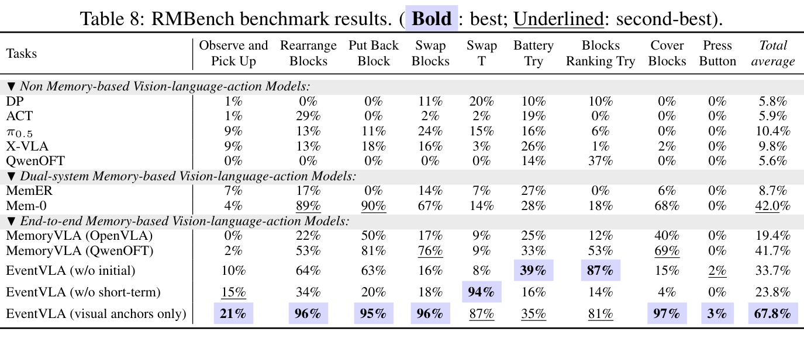

| Tasks | Observe and Pick Up | Rearrange Blocks | Put Back Block | Swap Blocks | Swap T Battery | Try Blocks Ranking | Try Cover Blocks | Press Button | Total average |
| :--- | :---: | :---: | :---: | :---: | :---: | :---: | :---: | :---: | :---: |
| **▼Non Memory-based Vision-language-action Models:** | | | | | | | | | |
| DP | 1% | 0% | 0% | 11% | 20% | 10% | 10% | 0% | 5.8% |
| ACT | 1% | 29% | 0% | 2% | 2% | 19% | 0% | 0% | 5.9% |
| $\pi_{0.5}$ | 9% | 13% | 11% | 24% | 15% | 16% | 6% | 0% | 10.4% |
| X-VLA | 9% | 13% | 18% | 16% | 3% | 26% | 1% | 2% | 9.8% |
| QwenOFT | 0% | 0% | 0% | 0% | 0% | 14% | 37% | 0% | 5.6% |
| **▼Dual-system Memory-based Vision-language-action Models:** | | | | | | | | | |
| MemER | 7% | 17% | 0% | 14% | 7% | 27% | 0% | 6% | 8.7% |
| Mem-0 | 4% | 89% | 90% | 67% | 14% | 28% | 18% | 68% | 42.0% |
| **▼End-to-end Memory-based Vision-language-action Models:** | | | | | | | | | |
| MemoryVLA (OpenVLA) | 0% | 22% | 50% | 17% | 9% | 25% | 12% | 40% | 19.4% |
| MemoryVLA (QwenOFT) | 2% | 53% | 81% | 76% | 9% | 33% | 53% | 69% | 41.7% |
| EventVLA (w/o initial) | 10% | 64% | 63% | 16% | 8% | 39% | 87% | 15% | 33.7% |
| EventVLA (w/o short-term) | 15% | 34% | 20% | 18% | 94% | 16% | 14% | 4% | 23.8% |
| **EventVLA (visual anchors only)** | **21%** | **96%** | **95%** | **96%** | **87%** | **35%** | **81%** | **97%** | **67.8%** |

**Caption:** Table 8: RMBench benchmark results. ( Bold : best; Underlined: second-best).

**Caption[CN]:** Table 8: RMBench 基准测试结果。（粗体：最优；下划线：次优）。

### C.1 Detailed Per-Task Breakdown on RMBench

> <span style="color:#3B82F6"><strong>Para. 1:</strong></span> Due to space limits in the main text, we present the comprehensive task-level breakdown for all baseline models and our ablation variants evaluated on the RMBench [8] suite in Table 8.

> <span style="color:#F59E0B"><strong>Para. 1[CN]:</strong></span> 由于正文篇幅限制，我们在表 8 中给出了在 RMBench [8] 套件上评估的所有基线模型及我们消融变体的逐任务全面细分结果。

> <span style="color:#3B82F6"><strong>Para. 2:</strong></span> The detailed breakdown clearly illustrates that our streamlined configuration, EventVLA (visual anchors only), achieves top-tier or highly competitive success rates across virtually all tasks, demonstrating an impressive overall average of 67.8%. By relying solely on the permanent initial layout anchor $o_0$ and the local motion window $o_{t-i}$, EventVLA effectively captures sufficient visual context for conventional memory-oriented scenarios without the need for complex state compression. Furthermore, the ablation variants (w/o initial and w/o short-term) show severe performance degradation across almost all tasks, confirming that both the initial global spatial reference and short-term motion cues are indispensable components of the visual anchors.

> <span style="color:#F59E0B"><strong>Para. 2[CN]:</strong></span> 详细分解结果清晰表明，我们的精简配置 EventVLA（仅视觉锚点）在几乎所有任务上均取得了顶级或极具竞争力的成功率，展现出高达 67.8% 的优异总体平均成绩。仅依靠永久初始布局锚点 $o_0$ 和局部运动窗口 $o_{t-i}$，EventVLA 便能有效捕获传统记忆导向场景下充足的视觉上下文，而无需复杂的状态压缩。此外，消融变体（去除初始帧和去除短期历史）在几乎所有任务上均表现出严重的性能滑坡，证实了初始全局空间参考与短期运动线索均是视觉锚点中不可或缺的组成部分。

### C.2 Extended Ablation Analysis and Inference Efficiency

> <span style="color:#3B82F6"><strong>Para. 3:</strong></span> Extended Ablation Analysis. To deeply understand the contributions of individual design choices within the Keyframe Evidence Memory (KEM) module, we expand upon the ablation studies conducted on the RoboTwin-MeM suite (summarized in the main text Sec. 5.2 and Table 2).

> <span style="color:#F59E0B"><strong>Para. 3[CN]:</strong></span> 扩展消融分析：为了深入理解关键帧证据记忆（KEM）模块中各个设计决策的贡献，我们对在 RoboTwin-MeM 套件上进行的消融研究进行了拓展分析（正文第 5.2 节及表 2 中已进行简要概述）。

> <span style="color:#3B82F6"><strong>Para. 4:</strong></span> • Memory Representation (Explicit Images vs. Implicit Bank): In the implicit memory bank variant, captured keyframes are aggregated into a compressed latent embedding rather than appended as explicit raw images. When handling complex tasks that demand the retention of multiple distinct events (e.g., $n \ge 3$), squeezing disparate historical features into a single latent vector creates a severe information bottleneck. Explicit raw image concatenation avoids this lossy compression, providing complete, lossless contextual evidence for the VLA’s multi-frame attention mechanism.

> <span style="color:#F59E0B"><strong>Para. 4[CN]:</strong></span> • 记忆表征形式（显式图像对比隐式特征库）：在隐式记忆库变体中，捕获的关键帧被聚合为一个压缩的潜在嵌入向量，而非作为显式原始图像追加。当处理需要保留多个不同事件的复杂任务（如 $n \ge 3$）时，将离散的历史特征强行压缩至单一潜在向量会造成严重的信息瓶颈。显式原始图像拼接避免了这种有损压缩，为 VLA 的多帧注意力机制提供了完整、无损的上下文证据。

> <span style="color:#3B82F6"><strong>Para. 5:</strong></span> • Supervision Strategy (Soft Labels vs. Hard Labels): Physical keyframe events naturally span continuous temporal windows. Replacing our raised cosine soft labels with strict binary targets induces extreme label sparsity and heavily penalizes valid adjacent frames. This rigid supervision destabilizes the predictive head, ultimately causing it to fail in triggering essential memory writes. Soft labels provide the necessary temporal tolerance for robust event capture in environments with execution variance.

> <span style="color:#F59E0B"><strong>Para. 5[CN]:</strong></span> • 监督策略（软标签对比硬标签）：物理关键帧事件天然跨越连续的时间窗口。用严格的二进制目标取代我们的升余弦软标签会导致极端的标签稀疏性，并对有效的邻近帧施加严厉惩罚。这种刚性监督破坏了预测头的稳定性，最终导致其未能成功触发必要的记忆写入。软标签为具有执行方差的环境中稳健的事件捕获提供了必要的时域容差。

> <span style="color:#3B82F6"><strong>Para. 6:</strong></span> • Buffer Management (The Necessity of NMS and Capacity): Without the 1D Non-Maximum Suppression (NMS) post-processing algorithm, redundant adjacent frames rapidly flood the bounded dynamic event buffer. Conversely, a strictly minimal buffer (e.g., $N_{\max} = 2$) inherently lacks the structural capacity required for complex, multi-stage tasks. Both scenarios lead to premature buffer saturation and trigger early FIFO eviction, which mistakenly discards foundational historical evidence (such as the first observed hidden color) before it can be utilized. This underscores that NMS-driven event sparsity and adequate memory capacity are both vital.

> <span style="color:#F59E0B"><strong>Para. 6[CN]:</strong></span> • 缓冲区管理（NMS 的必要性与容量设置）：如果没有一维非极大值抑制（1D NMS）后处理算法，冗余的相邻帧会迅速淹没有界动态事件缓冲区。相反，严格受限的极小缓冲区（例如 $N_{\max} = 2$）在结构上天然缺乏复杂多阶段任务所需的容量。这两种情况都会导致缓冲区过早饱和并触发提前的 FIFO 淘汰，从而在基础历史证据（例如首次观察到的隐藏颜色）被使用之前错误地将其丢弃。这强调了 NMS 驱动的事件稀疏性与充足的记忆容量都是至关重要的。

> <span style="color:#3B82F6"><strong>Para. 7:</strong></span> • Foresight Horizon (The Impact of Action Chunk Size): The execution chunk size governs KEM’s look-ahead window. Shrinking this horizon truncates the model’s predictive capacity, preventing the keyframe head from effectively anticipating and scheduling upcoming transient events, thus neutralizing KEM’s proactive memory commitment capability.

> <span style="color:#F59E0B"><strong>Para. 7[CN]:</strong></span> • 前瞻视界（动作块大小的影响）：执行动作块的大小决定了 KEM 的前瞻窗口。缩小该视界会截断模型的预测能力，阻碍关键帧头有效预判并调度即将到来的瞬态事件，从而抵消了 KEM 主动记忆提交的能力。

> <span style="color:#3B82F6"><strong>Para. 8:</strong></span> Inference Efficiency. To verify that EventVLA can be effectively deployed on physical robots, we meticulously evaluate its real-time inference speed. Table 9 details the latency and throughput of our framework across the RoboTwin-MeM benchmark.

> <span style="color:#F59E0B"><strong>Para. 8[CN]:</strong></span> 推理效率：为了验证 EventVLA 能否有效部署于物理机器人上，我们严谨地评估了其实时推理速度。表 9 详述了我们的框架在整个 RoboTwin-MeM 基准上的延迟与吞吐率。

### Table 9. EventVLA 推理速度消融研究 (Ablation Study on EventVLA's Inference Speed)

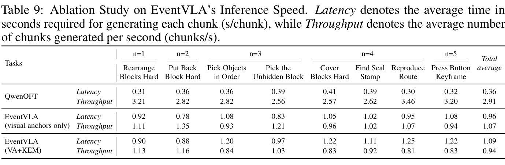

| Tasks | Rearrange Blocks Hard | Put Back Block Hard | Pick Objects in Order | Pick the Unhidden Block | Cover Blocks Hard | Find Seal Stamp | Reproduce Route | Press Button Keyframe | Total average |
| :--- | :---: | :---: | :---: | :---: | :---: | :---: | :---: | :---: | :---: |
| **Complexity ($n$)** | $n=1$ | $n=2$ | $n=3$ | $n=3$ | $n=4$ | $n \in [1,4]$ | $n=4$ | $n \in [2,5]$ | - |
| **QwenOFT** | | | | | | | | | |
| Latency (s/chunk) | 0.31 | 0.36 | 0.36 | 0.39 | 0.41 | 0.39 | 0.30 | 0.32 | 0.36 |
| Throughput (chunks/s) | 3.21 | 2.82 | 2.82 | 2.56 | 2.57 | 2.62 | 3.46 | 3.20 | 2.91 |
| **EventVLA (visual anchors only)** | | | | | | | | | |
| Latency (s/chunk) | 0.92 | 0.78 | 1.08 | 0.83 | 1.05 | 1.02 | 0.95 | 1.08 | 0.96 |
| Throughput (chunks/s) | 1.11 | 1.35 | 0.93 | 1.21 | 0.96 | 1.02 | 1.07 | 0.94 | 1.07 |
| **EventVLA (VA+KEM)** | | | | | | | | | |
| Latency (s/chunk) | 0.90 | 0.88 | 1.20 | 0.97 | 1.22 | 1.11 | 1.25 | 1.22 | 1.09 |
| Throughput (chunks/s) | 1.13 | 1.16 | 0.84 | 1.03 | 0.83 | 0.92 | 0.81 | 0.83 | 0.94 |

**Caption:** Table 9: Ablation Study on EventVLA’s Inference Speed. Latency denotes the average time in seconds required for generating each chunk (s/chunk), while Throughput denotes the average number of chunks generated per second (chunks/s).

**Caption[CN]:** Table 9: EventVLA 推理速度消融研究。Latency（延迟）表示生成每个动作块所需的平均秒数（s/chunk），Throughput（吞吐率）表示每秒生成的平均动作块数量（chunks/s）。

> <span style="color:#3B82F6"><strong>Para. 9:</strong></span> The purely reactive QwenOFT baseline achieves an average throughput of 2.91 Hz with a latency of 0.36 seconds. Incorporating external visual anchors slightly increases the computational footprint due to the extended multi-frame input sequence, resulting in an average throughput of 1.07 Hz. When the full EventVLA framework (incorporating dynamic KEM) is deployed, it maintains an average throughput of 0.94 Hz (1.09 seconds latency). Given that VLA policies typically operate as high-level planners alongside low-level, high-frequency controllers, this throughput comfortably meets the operational constraints for real-world robotic deployment. This confirms that our sparse memory commitment strategy strikes an optimal balance between robust non-Markovian reasoning and practical real-time execution efficiency.

> <span style="color:#F59E0B"><strong>Para. 9[CN]:</strong></span> 纯反应式的 QwenOFT 基线实现了 2.91 Hz 的平均吞吐率与 0.36 秒的延迟。由于多帧输入序列的扩展，引入外部视觉锚点会略微增加计算开销，使得平均吞吐率为 1.07 Hz。当部署完整的 EventVLA 框架（融合动态 KEM）时，其保持了 0.94 Hz 的平均吞吐率（1.09 秒延迟）。鉴于 VLA 策略通常作为高层规划器与底层高频控制器配合运行，该吞吐率完全符合真实世界机器人部署的操作约束。这证实了我们的稀疏记忆提交策略在强大的非马尔可夫推理与实用的实时执行效率之间取得了最佳平衡。


## D. Qualitative Visualizations

### D.1 Simulation Rollouts in RoboTwin-MeM

> <span style="color:#3B82F6"><strong>Para. 1:</strong></span> To provide an intuitive understanding of EventVLA’s dynamic memory scheduling and execution process, we visualize the qualitative rollouts across all 8 strictly non-Markovian tasks in the RoboTwin-MeM benchmark. Figure 6 illustrates the successful execution sequences for four memory-intensive tasks: Rearrange Blocks Hard, Pick the Unhidden Block, Put Back Block Hard, and Cover Blocks Hard. Figure 7 demonstrates the execution pipelines for the remaining four tasks: Press Button Keyframe, Pick Objects in Order, Find Seal and Seal Stamp, and Reproduce Route.

> <span style="color:#F59E0B"><strong>Para. 1[CN]:</strong></span> 为了直观理解 EventVLA 的动态记忆调度与执行过程，我们对 RoboTwin-MeM 基准中全部 8 项严格的非马尔可夫任务的定性执行轨迹进行了可视化。图 6 展示了四项高强度记忆任务的成功执行序列：Rearrange Blocks Hard、Pick the Unhidden Block、Put Back Block Hard 以及 Cover Blocks Hard。图 7 则展示了其余四项任务的执行流水线：Press Button Keyframe、Pick Objects in Order、Find Seal and Seal Stamp 以及 Reproduce Route。

> <span style="color:#3B82F6"><strong>Para. 2:</strong></span> Across these diverse scenarios, the visualizations clearly highlight how the KEM module proactively triggers sparse memory writes the exact moment transient visual evidence emerges (e.g., observing the hidden color of a block immediately after lifting an opaque cover, or reading a randomized number). By locking these critical intermediate states into the event buffer before they become unobservable, EventVLA effectively bridges the temporal gap and seamlessly guides the subsequent long-horizon manipulation.

> <span style="color:#F59E0B"><strong>Para. 2[CN]:</strong></span> 在这些多样化的场景中，可视化清晰突显了 KEM 模块如何在瞬态视觉证据出现的精确时刻（例如掀开不透明盖子后立即观察到积木的隐藏颜色，或读取随机数字）主动触发稀疏记忆写入。通过在这些关键中间状态变得不可观测之前将其锁定在事件缓冲区中，EventVLA 有效弥合了时间间隔，并无缝指导后续的长时程操作。

### Figure 6. EventVLA 在四项 RoboTwin-MeM 仿真任务中的定性执行轨迹 (Qualitative Rollouts of EventVLA on Four RoboTwin-MeM Tasks)

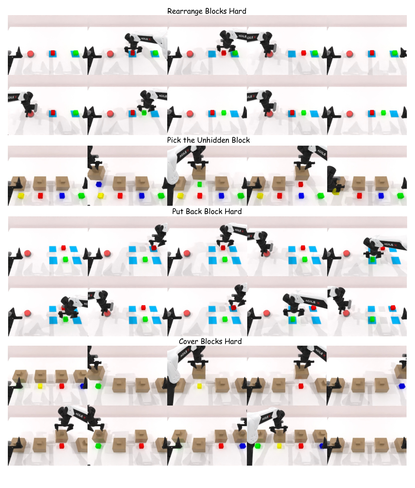

**Caption:** Figure 6: Qualitative rollouts of EventVLA on four RoboTwin-MeM simulation tasks: Rearrange Blocks Hard, Pick the Unhidden Block, Put Back Block Hard, and Cover Blocks Hard.

**Caption[CN]:** Figure 6: EventVLA 在四项 RoboTwin-MeM 仿真任务（Rearrange Blocks Hard、Pick the Unhidden Block、Put Back Block Hard 以及 Cover Blocks Hard）上的定性执行展开。

### Figure 7. EventVLA 在其余四项 RoboTwin-MeM 仿真任务中的定性执行轨迹 (Qualitative Rollouts on Remaining Four RoboTwin-MeM Tasks)

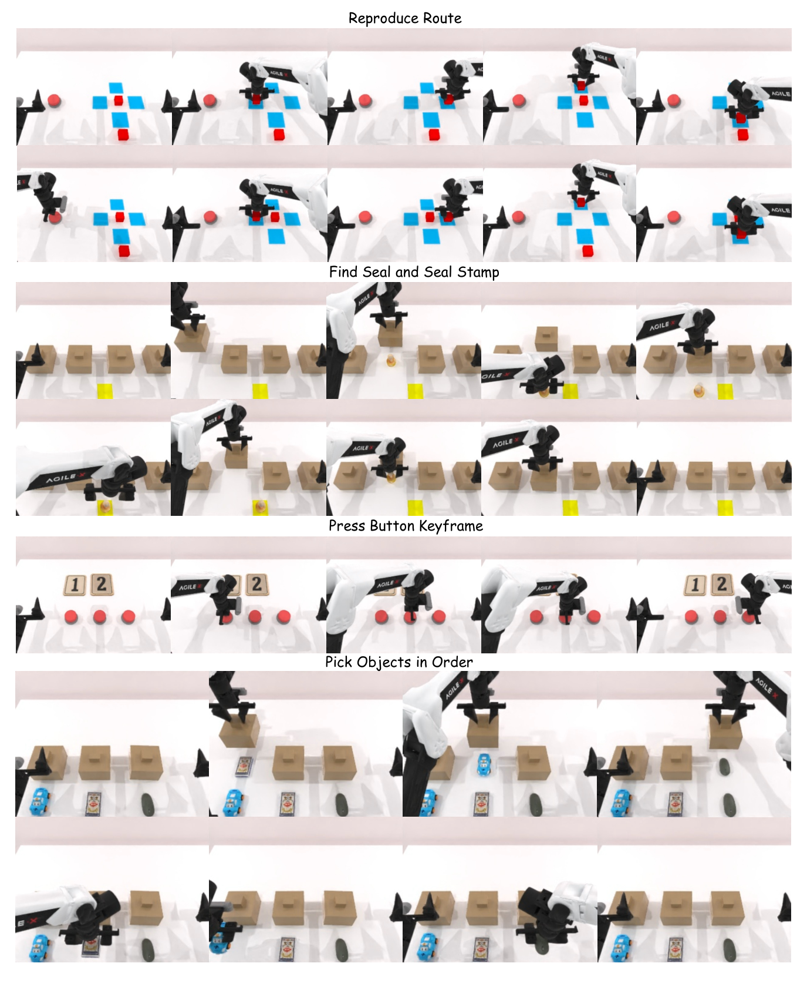

**Caption:** Figure 7: Qualitative rollouts of EventVLA on the remaining four RoboTwin-MeM simulation tasks: Press Button Keyframe, Pick Objects in Order, Find Seal and Seal Stamp, and Reproduce Route.

**Caption[CN]:** Figure 7: EventVLA 在其余四项 RoboTwin-MeM 仿真任务（Press Button Keyframe、Pick Objects in Order、Find Seal and Seal Stamp 以及 Reproduce Route）上的定性执行展开。

### D.2 Real-World Robot Execution Sequences

> <span style="color:#3B82F6"><strong>Para. 3:</strong></span> To further validate the practical efficacy of our framework, we provide qualitative execution sequences of EventVLA deployed on the real-world ARX ACONE bimanual robot. Figure 8 showcases the successful completion of four memory-intensive manipulation tasks: Find Block Easy, Pick-X-Times, Find Block Hard, and Pick in Order.

> <span style="color:#F59E0B"><strong>Para. 3[CN]:</strong></span> 为了进一步验证我们框架的实用有效性，我们提供了 EventVLA 部署于真实世界 ARX ACONE 双臂机器人上的定性执行序列。图 8 展示了四项高强度记忆操作任务的成功执行过程：Find Block Easy、Pick-X-Times、Find Block Hard 以及 Pick in Order。

> <span style="color:#3B82F6"><strong>Para. 4:</strong></span> The visualizations demonstrate that EventVLA can robustly capture and retain critical intermediate visual cues despite real-world occlusions and randomized spatial placements. Whether reading a randomized number from a paper to dictate counting logic, or observing a stick pointing at bottles to memorize an in-context sequence, the policy successfully utilizes its sparse visual evidence memory to execute complex, multi-stage physical tasks, exhibiting both strong non-Markovian remembering and spatial generalization capabilities.

> <span style="color:#F59E0B"><strong>Para. 4[CN]:</strong></span> 可视化表明，尽管存在真实世界的遮挡和随机化的空间摆放，EventVLA 依然能够稳健地捕获并保留关键的中间视觉线索。无论是从纸张上读取随机数字来指导计数逻辑，还是观察木棍指向瓶子以记忆上下文序列，该策略都成功利用其稀疏视觉证据记忆来执行复杂的多阶段物理任务，展现出强大的非马尔可夫记忆与空间泛化能力。

> <span style="color:#3B82F6"><strong>Para. 5:</strong></span> The specific language instructions and execution requirements for the four physical robot tasks evaluated in Figure 8 are as follows:
>
> - **Pick-X-Times**: Pick up and put down the block the number of times as shown on the paper.
> - **Find Block Hard**: Lift the cups on the table one by one from left to right, checking if there is a hidden cube underneath, then put the cups down. Finally, open the cup containing the cube and pick the cube up.
> - **Find Block Easy**: Cover the block with the nearest cup, then lift the cup covering the block and pick up the block.
> - **Pick in Order**: Pick up and put down the bottles on the table in the order which they are pointed by the stick one by one at the beginning.

> <span style="color:#F59E0B"><strong>Para. 5[CN]:</strong></span> 图 8 中评估的四项物理机器人任务的具体语言指令与执行要求如下：
>
> - **Pick-X-Times**：按照纸上所示的次数抓取并放下积木。
> - **Find Block Hard**：从左至右逐个掀起桌上的杯子，检查下方是否有隐藏的方块，然后放下杯子；最后掀开装有方块的杯子并将方块抓起。
> - **Find Block Easy**：用最近的杯子盖住积木，然后掀起盖住积木的杯子并将积木抓起。
> - **Pick in Order**：最初按照木棍逐一指向的顺序，抓取并放下桌上的瓶子。

### Figure 8. EventVLA 在四项真实世界机器人任务中的定性执行序列 (Qualitative Real-World Robot Execution Sequences)

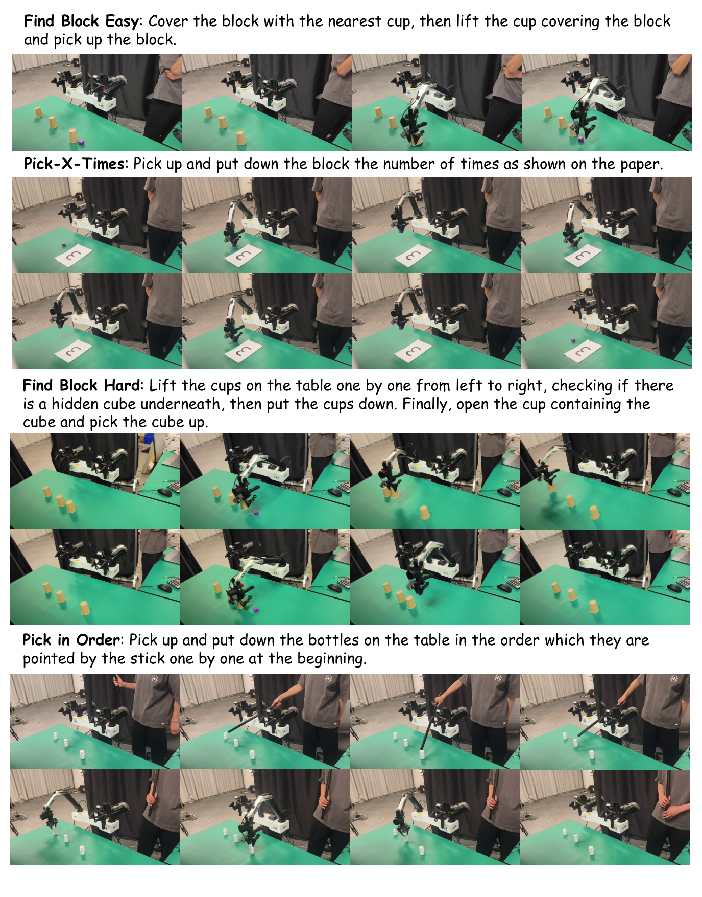

**Caption:** Figure 8: Qualitative real-world robot execution sequences of EventVLA on four tasks: Find Block Easy, Find Block Hard, Pick-X-Times, and Pick in Order.

**Caption[CN]:** Figure 8: EventVLA 在四项任务（Find Block Easy、Find Block Hard、Pick-X-Times 以及 Pick in Order）上的真实世界机器人定性执行序列。


---

## 专家精读后记与技术综合分析 (Critical-Reading Postscript & Technical Synthesis)

> <span style="color:#3B82F6"><strong>Para. 1:</strong></span> <strong>Algorithmic Innovation and Paradigmatic Shift:</strong> Standard Vision-Language-Action (VLA) models operate almost exclusively under a strict Markovian assumption $\pi(a_t \mid o_t, l)$, which implicitly presumes all causal physical state is persistently observable in the instantaneous observation $o_t$. In long-horizon manipulation, this assumption breaks down catastrophic failure whenever critical visual evidence is transient—such as seeing an object color briefly when lifting a lid, or tracking an object that later becomes occluded. Previous attempts to instill memory either forced lossy compression through recurrent states, incurred prohibitive latency and hallucination via decoupled high-level LLM reasoning systems, or dumped dense historical frames into attention buffers that saturate compute and dilute attention. EventVLA establishes an elegant, mathematically principled compromise: sparse visual evidence memory $M_t = \mathcal{A}_t \cup \mathcal{E}_t$. By decomposing memory into deterministic, rule-based visual anchors (invariant initial layout $o_0$ plus local motion window) and a learned, proactive Keyframe Evidence Memory (KEM), the model achieves state-of-the-art situational awareness while preserving real-time closed-loop control frequency (~1 Hz chunk generation).

> <span style="color:#F59E0B"><strong>Para. 1[CN]:</strong></span> <strong>算法创新与范式转换：</strong> 标准的视觉-语言-动作（VLA）模型几乎完全在严格的马尔可夫假设 $\pi(a_t \mid o_t, l)$ 下运行，该假设隐式认定所有因果物理状态均在即时观测 $o_t$ 中持续可见。在长时程操作中，一旦关键视觉证据具有瞬态特征（例如掀开盖子时短暂看到物体颜色，或追踪随后被遮挡的物体），该假设就会导致灾难性失败。以往引入记忆的尝试要么通过循环状态强行进行有损压缩，要么通过解耦的高层 LLM 推理系统引入高延迟和幻觉，要么将密集的历史帧倾倒至注意力缓冲区从而使算力饱和并稀释注意力。EventVLA 建立了一种优雅且具数学严谨性的折中方案：稀疏视觉证据记忆 $M_t = \mathcal{A}_t \cup \mathcal{E}_t$。通过将记忆分解为确定性的、基于规则的视觉锚点（不变的初始布局 $o_0$ 加局部运动窗口）与学习得到的、前瞻性的关键帧证据记忆（KEM），该模型在保持实时闭环控制频率（~1 Hz 动作块生成）的同时实现了顶级的态势感知能力。

> <span style="color:#3B82F6"><strong>Para. 2:</strong></span> <strong>Empirical Insights and the Diagnostic Value of RoboTwin-MeM:</strong> A major empirical revelation of this paper is that existing benchmarks, such as RMBench, can be solved up to 67.8% merely by deploying rule-based visual anchors (the initial scene layout $o_0$ and immediate temporal window), without requiring any intermediate transient state retention. This explains why previous memory-augmented VLAs appeared to perform well despite suffering from fundamental representation bottlenecks. By constructing RoboTwin-MeM with explicit $n$-parameterized intermediate event counts ($n \in [1, 5]$), the authors reveal a dramatic performance cliff: visual anchors alone collapse to 18.0% on truly non-Markovian tasks, whereas the complete EventVLA (VA+KEM) achieves 75.2%. The ablation analyses further demonstrate that explicit raw image tokens far outperform implicit latent vector banks (75.2% vs. 24.9%), proving that multi-modal transformers require uncompressed visual evidence to ground spatial-temporal reasoning. Although the current FIFO buffer eviction policy limits scalability beyond 10-minute ultra-long horizons, EventVLA provides a foundational, highly generalizable architecture for long-horizon autonomous manipulation in complex physical worlds.

> <span style="color:#F59E0B"><strong>Para. 2[CN]:</strong></span> <strong>实证洞见与 RoboTwin-MeM 的诊断价值：</strong> 本文的一大实证发现是，像 RMBench 这样的现有基准，仅凭基于规则的视觉锚点（初始场景布局 $o_0$ 和即时时间窗口）就能达到高达 67.8% 的成功率，而无需任何中间瞬态状态保留。这解释了为何先前的记忆增强 VLA 尽管存在根本性的表征瓶颈却看似表现良好。通过构建以中间事件数量 $n \in [1, 5]$ 显式参数化的 RoboTwin-MeM，作者揭示了一个巨大的性能悬崖：在真正的非马尔可夫任务上，仅凭视觉锚点性能崩溃至 18.0%，而完整的 EventVLA（VA+KEM）达到了 75.2%。消融分析进一步表明，显式原始图像 Token 远优于隐式潜在特征库（75.2% 对比 24.9%），证明多模态 Transformer 需要未压缩的视觉证据来奠定空间-时间推理的基础。尽管当前的 FIFO 缓冲区淘汰策略在超过 10 分钟的超长时程任务中存在扩展瓶颈，但 EventVLA 为复杂物理世界中的长时程自主操作提供了一个基础且高度可泛化的架构蓝图。
