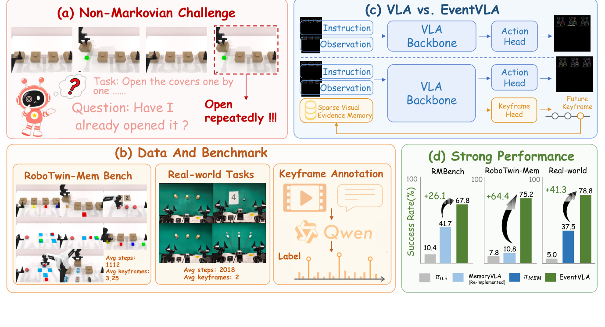
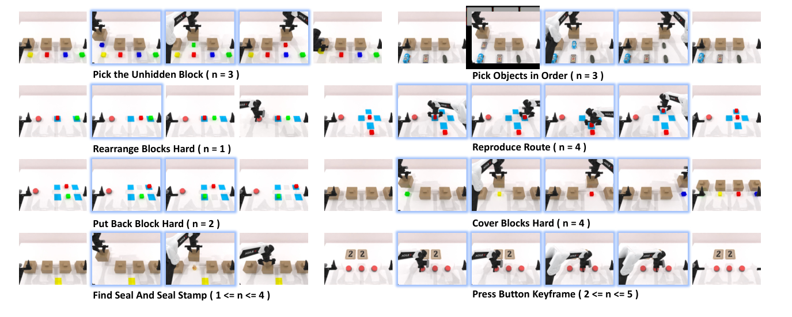
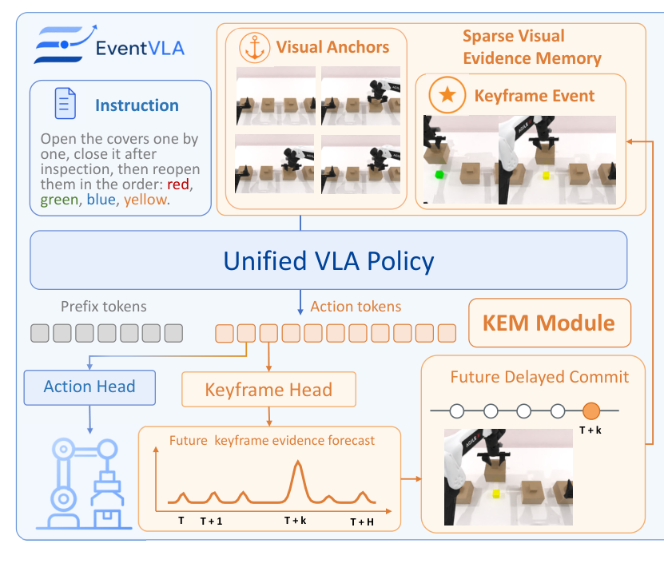
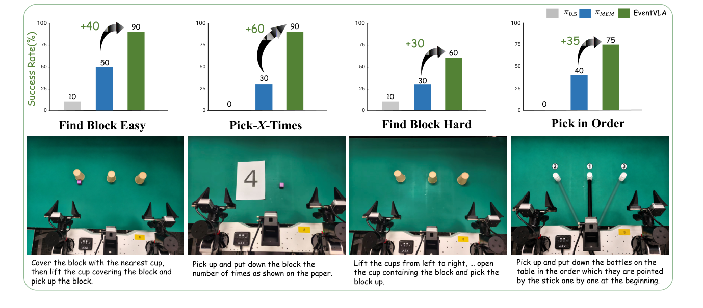
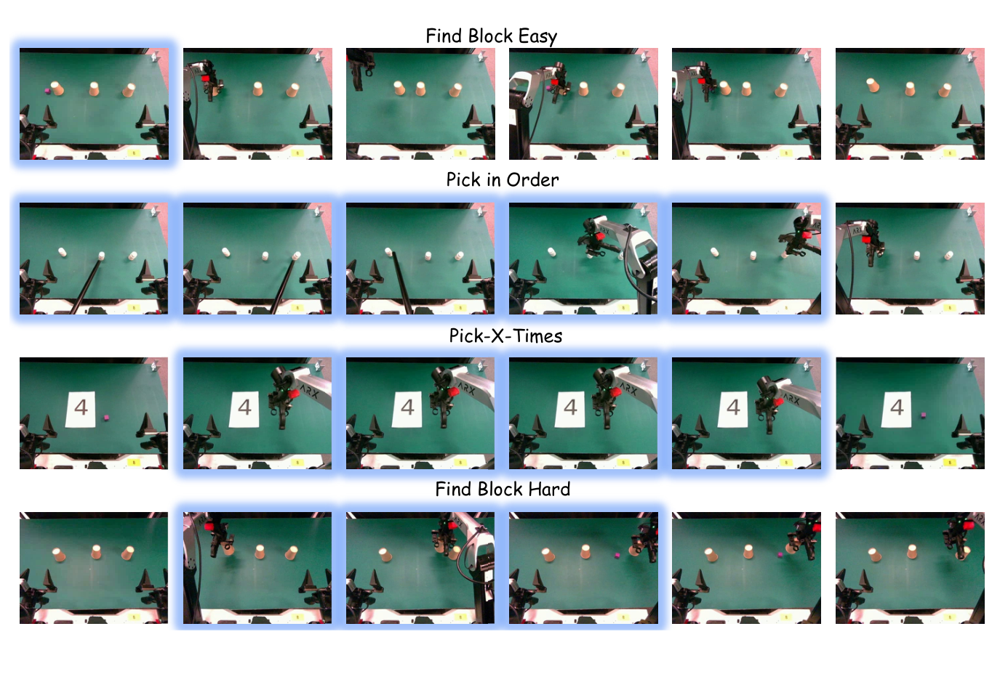

# EventVLA: Event-Driven Visual Evidence Memory for Long-Horizon Vision-Language-Action Policies
## 核心信息
- **论文标题**：EventVLA: Event-Driven Visual Evidence Memory for Long-Horizon Vision-Language-Action Policies
- **作者列表**：Ganlin Yang* (中科大, 上海人工智能实验室), Zhangzheng Tu* (大连理工, 上海交通大学), Yuqiang Yang* (上海人工智能实验室), Sitong Mao (华为), Junyi Dong (华为), Tianxing Chen (香港大学), Jiaqi Peng (清华大学, 上海人工智能实验室), Jing Xiong (北京大学, 上海人工智能实验室), Jiafei Cao (上海人工智能实验室), Jifeng Dai (清华大学), Wengang Zhou (中科大), Yao Mu† (上海交通大学, 上海人工智能实验室, 香港大学), Tai Wang† (上海人工智能实验室)（* 表示同等贡献，† 表示通讯作者）
- **主要机构**：中国科学技术大学、上海人工智能实验室、上海交通大学、大连理工大学、华为技术有限公司、香港大学、清华大学、北京大学
- **发布版本与时间**：arXiv:2606.20092v2 [cs.CV], 2026 年 6 月 29 日
- **开源地址**：
  - 项目主页：[EventVLA](https://github.com/InternRobotics/EventVLA)
  - 官方仓库：`https://github.com/InternRobotics/EventVLA`
- **基础模型与主干网络**：
  - 仿真基准（RMBench, RoboTwin-MeM）：采用 StarVLA 开源的 **QwenOFT**（基于 **Qwen3-VL-4B-Instruct**），冻结大部分参数并微调动作头与 KEM 事件头
  - 真机部署：采用开源 **$\pi_{0.5}$**（基于 PaliGemma 3B）作为端到端底座，预测 32 维连续双臂动作
- **核心定位与场景**：面向非马尔可夫（Non-Markovian）长时程双臂复杂操作的端到端稀疏视觉证据记忆策略；设计按所需中间瞬态关键帧数 $n \in [1, 5]$ 严格参数化的诊断基准 **RoboTwin-MeM**。
- **关键量化数据提炼**：
  - **RoboTwin-MeM（8 任务仿真，平均 430~1544 步）**：EventVLA 达到 **75.2%** 平均成功率，大幅碾压反应式基线 $\pi_{0.5}$（7.8%）、双系统 Mem-0（0.0%）与密集回放 MemoryVLA（10.8%）；相比仅含静态锚点的 EventVLA (VA only) 的 18.0% 提升达 **+57.2 个百分点**。
  - **RMBench（传统长时程记忆基准）**：仅需基础视觉锚点（VA only）即可达成 **67.8%** 的 SOTA 成功率，超越双系统 Mem-0（42.0%）与全密集回放 MemoryVLA（41.7%），揭示了该基准绝大多数任务仅需初始场景记忆的本质。
  - **ARX ACONE 双臂真机（4 项长时程非马尔可夫任务，每任务 20 次独立实机评估）**：EventVLA 取得 **78.8%** 平均成功率，远超反应式 $\pi_{0.5}$（5.0%）与多尺度记忆策略 $\pi_{\mathrm{MEM}}$（37.5%）。
  - **推理效率实测**：生成 50 步 action chunk 的平均延迟仅 **1.09 秒（0.94 Hz）**，相比无记忆基线仅微增 0.13 秒，完美适配 1 Hz 高层规划 + 底层高频插值的物理闭环。
---
## 原文摘要翻译
> <span style="color:#3B82F6"><strong>Para. 1:</strong></span> Memory remains a critical bottleneck for long-horizon robotic manipulation, as standard Vision-Language-Action (VLA) policies often fail when task-relevant cues become occluded or unobservable over time. While existing memory-augmented methods utilize historical context, they either suffer from severe information bottlenecks, incur high latency via decoupled dual systems, or rely on unselective buffers that accumulate massive visual redundancies. To address these limitations, we introduce EventVLA, an end-to-end framework founded on the concept of sparse visual evidence memory that comprises two core components: foundational visual anchors to retain initial and short-term contexts, and a dynamic Keyframe Evidence Memory (KEM) module. Specifically, KEM directly predicts future keyframe probabilities from the VLA’s latent embeddings to autonomously capture and store sparse, task-critical visual events. This foresight-driven mechanism empowers the policy to dynamically evaluate the future causal utility of current observations, preserving transient visual evidence before it becomes unobservable. Furthermore, we propose RoboTwin-MeM, a diagnostic benchmark specifically designed to evaluate non-Markovian manipulation tasks with interactive visual evidence. Extensive evaluations show that across 17 memory-requiring simulation tasks and 4 real-world bimanual tasks, EventVLA achieves an average success rate improvement of +40% over state-of-the-art memory-augmented VLAs. The code, models and datasets are available at https://github.com/InternRobotics/EventVLA.
> <span style="color:#F59E0B"><strong>Para. 1[CN]:</strong></span> 记忆仍然是长时程机器人操作的关键瓶颈，因为当任务相关线索随时间推移被遮挡或变得不可观测时，标准的视觉-语言-动作（VLA）策略往往会直接失效。尽管现有的记忆增强方法尝试利用历史上下文，但它们要么面临严重的信息瓶颈，要么通过解耦的双系统引入高昂的推理延迟，要么依赖无选择性的缓存而积累了海量的视觉冗余。为了克服这些局限，我们提出了 EventVLA——一个建立在**稀疏视觉证据记忆（Sparse Visual Evidence Memory）**概念之上的端到端框架。该框架包含两个核心组件：用于保留初始与短期上下文的**基础视觉锚点（Foundational Visual Anchors）**，以及一个动态的**关键帧证据记忆（Keyframe Evidence Memory, KEM）**模块。具体而言，KEM 直接利用 VLA 的隐层嵌入预测未来的关键帧概率，以自主捕获并存储稀疏且对任务至关重要的视觉事件。这种**前瞻驱动（foresight-driven）**的机制赋予了策略动态评估当前观测未来因果效用的能力，从而在瞬态视觉证据变得不可观测之前将其保留下来。此外，我们提出了 **RoboTwin-MeM**，这是一个专门设计用于评估包含交互式视觉证据的非马尔可夫操作任务的诊断基准。大量评估表明，在 17 个需要记忆的仿真任务以及 4 个真实世界双臂任务中，EventVLA 相比最先进的记忆增强 VLA 取得了平均成功率 +40% 的提升。代码、模型与数据集均已开源于 https://github.com/InternRobotics/EventVLA。
---
## 创新点
1. **确立“稀疏视觉证据记忆（Sparse Visual Evidence Memory）”新范式**：
   - 彻底跳出传统记忆机制在“全历史稠密视频回放”与“单向隐状态有损压缩”之间的两难困境。
   - 科学解耦长时程记忆的双重属性：静态全局布局与平滑运动流交由确定性规则维护的**基础视觉锚点（$A_t$）**；物理交互中瞬时显现又消失的因果线索交由数据驱动的**关键帧证据记忆（$E_t$）**维护。
2. **前瞻驱动的块级事件预测与延迟提交机制（Foresight-Driven KEM & Delayed Commit）**：
   - 洞察到动作分块（Action Chunking）自回归隐藏状态 $h_t$ 内嵌了未来的物理交互意图，构建紧凑并行预测头，直接输出未来 $H$ 步的块级关键帧概率向量 $\hat{p}_t$。
   - 变“事后检索”为“事前调度”：在瞬态线索暴露的当下甚至前夕提前排定捕获日程，结合 1D NMS 峰值检测与时间冷却（Cooldown），将稠密概率脉冲精炼为离散稀疏的图像快照，从根源上杜绝缓存溢出与 FIFO 早熟淘汰。
3. **低成本离线 VLM 伪标签标注与平滑退火监督管道**：
   - 利用 Qwen3-VL-235B 离线多视角感知能力自动化打标专家演示中的事件时间戳 $t^*$，规避繁重人工标注成本。
   - 引入基于**升余弦核（Raised Cosine Kernel）**的连续时间软标签与教师-学生（Teacher-to-Student）退火课程，完美平滑了物理接触边界的时间抖动，消除了训练与在线推理之间的分布偏移。
4. **构建首个严格非马尔可夫操作诊断基准 RoboTwin-MeM**：
   - 揭露既有基准（如 RMBench）存在“依靠初始帧即可作弊通关”的设计缺陷。
   - 基于 SAPIEN / RoboTwin 2.0 平台构建 8 项长时程双臂操作任务（430~1544 步），显式以必须记忆的中间瞬态关键帧数 $n \in [1, 5]$ 进行参数化分级，确立了非马尔可夫具身记忆评测的新标杆。
---
## 一句话总结
EventVLA 摒弃在 VLA 中盲目堆砌稠密视频帧的低效做法，通过自回归隐状态前瞻预判未来关键帧概率，将交互中“稍纵即逝的因果视觉证据”精准截取并以极度稀疏的原始图像快照注入跨时间自注意力，在长时程非马尔可夫双臂操作中实现了极低算力开销下的高鲁棒物理闭环。
---
## 研究问题
### 1. 为什么标准 VLA 在长时程操作中必然面临灾难性失效？
当前的具身智能视觉-语言-动作（VLA）基础模型（如 OpenVLA、$\pi_0$、$\pi_{0.5}$）普遍建立在严格的**马尔可夫假设（Markovian Assumption）**之上，即策略网络将当前单帧（或极短窗口）观测 $o_t$ 与语言指令 $l$ 直接映射为动作 $a_t \sim \pi(o_t, l)$。这种设计暗含了一个极其苛刻且脱离物理现实的前提：**所有指导下一步决策的关键信息，在当前画面中必须始终可见、始终处于可观测状态**。
然而在真实的物理操作空间中，工作环境处于高度动态变化中，大量关键信息本质上是**非马尔可夫的（Non-Markovian）**：
- 机器人在第 1 阶段掀开一个不透明盒盖，窥见了里面的物品颜色或类别；在第 2 阶段将盒盖盖上；在第 5 阶段才需要根据先前看到的颜色去抓取对应道具。在第 5 阶段的即时视野中，盒盖紧闭，物品完全被遮挡，当前帧观测与操作目标之间存在完全的信息断层。
- 机器人在桌面任务初始阶段看到白纸上写着随机数字 $X$；在执行连续的按压或搬运循环时，机械臂自身的遮挡、视角的转换或物体的移位，导致数字卡片脱离视野，机器人陷入“我已经按了几次？还需按几次？”的时间歧义。
如果缺乏历史记忆，策略面对相同的局部观测只能做出随机漂移的动作，或者陷入死循环。
### 2. 现有记忆增强 VLA 的三大根本死结
为了打破马尔可夫假设，学术界先后演化出三类记忆路线，但均面临难以调和的工程与架构缺陷：
1. **双系统解耦架构（Dual-System Memory-VLAs，如 MemER、Mem-0）**：
   - 依赖高层 VLM 负责长程认知、场景图维护与语言规划，底层小策略负责高频电机执行。
   - **痛点**：高层大模型推理延迟极其沉重（单次耗时达数秒），高低层通信割裂，且高层的感知幻觉与决策偏差会在开环控制中引发不可逆的累积误差级联（Error Propagation）。
2. **循环状态压缩范式（Recurrent Architectures，如 AVA-VLA、RMT、VQ-Memory）**：
   - 借助 RNN、LSTM、Transformer 循环状态（Memory Tokens）或离散码本，将历史轨迹递归压缩为一个低维隐向量。
   - **痛点**：存在严重的信息瓶颈（Information Bottleneck）。物理操作对毫米级的抓取接触点、不规则物体几何边缘高度敏感，有损向量压缩在多步循环后极易抹杀细粒度视觉细节，导致“抓不准、放不稳”。
3. **朴素历史缓存机制（Dense Memory Buffers，如 MemoryVLA、CronusVLA）**：
   - 试图绕过有损压缩，直接在输入端拼接历史多帧原始图像或固定步长的滑动窗口（Sliding Window）。
   - **痛点**：缺乏选择性，盲目累积冗余帧。在长达数百甚至上千步的交互轨迹中，绝大部分时间步的画面是平庸无奇的机械臂匀速位移。如果维护全历史，ViT 的视觉 Token 数量呈线性爆炸，GPU 显存溢出、注意力被背景噪声稀释；如果采用有界的 FIFO 滑动窗口，最初暴露的瞬态关键证据（如第 50 步掀盖看到的红球）会在第 100 步被机械臂移动的无效帧冲刷淘汰出缓存，导致后续阶段彻底失忆。

> **图 1 解读**：(a) 非马尔可夫挑战：机器人依次掀盖检查，面对紧闭的盖子，策略无法回答“我是否已经掀过它？”产生重复操作；(b) 评测基准对比：RoboTwin-MeM 显式标注瞬态关键帧；(c) 架构差异：EventVLA 从自回归隐状态直接引出事件头，预测未来关键帧；(d) 仿真与真机的大幅性能飞跃。
因此，具身记忆的核心灵魂问题在于：**机器人究竟应该在“什么时刻（When）”，锁定并捕获“何种视觉证据（What）”，才能既跨越漫长的时间断层，又不会引爆计算开销？**
---
## 数据与任务定义 (RoboTwin-MeM benchmark, non-Markovian manipulation tasks)
### 1. 为什么现有基准（如 RMBench）无法真正检验瞬态记忆能力？
在提出新方法之前，作者对广泛引用的记忆基准 RMBench [8] 进行了深入审计。他们发现了一个惊人的事实：**RMBench 上的绝大部分任务，根本不需要记忆交互过程中的动态瞬态变化，只需依赖任务第 0 步的初始画面和最近几步的运动连续性即可完全通关**。
例如，在 RMBench 的 `Rearrange Blocks` 或 `Put Back Block` 中，目标位置或方块的初始状态在任务未开始前就已经静态陈列在桌面上。策略只要记住初始帧 $o_0$（提供静态空间参考），再加上近期滑动窗口（提供平滑速度信息），就能以 **67.8%** 的超高成功率横扫该基准。这表明，现有基准混淆了“静态场景几何检索”与“非马尔可夫动态交互记忆”。
### 2. RoboTwin-MeM 基准设计：以瞬态证据数 $n \in [1, 5]$ 严格分级
为了彻底隔离并诊断策略对**交互过程中瞬态出现、随后完全遮挡**的视觉证据的捕获能力，本文基于 SAPIEN 物理引擎与 RoboTwin 2.0 双臂仿真平台，构建了 **RoboTwin-MeM** 诊断基准。
RoboTwin-MeM 的核心特性包括：
1. **纯粹的非马尔可夫性**：强行施加视觉物理遮挡（如不透明杯子、倒扣的盖子、移开后遮盖的印章）。
2. **极长执行时域**：单回合平均步长高达 **430 至 1544 步**，属于极其严苛的长时程操作。
3. **显式难度参数化 $n$**：每一项任务被严格标注并参数化为 $n \in [1, 5]$，**$n$ 精确代表了成功完成该任务必须在交互过程中动态捕获并锁入记忆的瞬态关键帧数量**。
下表完整转录并系统梳理了 RoboTwin-MeM 的 8 项任务规范（对应原论文 Table 4 与 Sec. 4）：
| 任务名称 (Task Name) | 回合数 | 平均步长 (Avg. #Steps) | 中间关键帧数 ($n$) | 详细任务指令 (Task Instruction) | 核心记忆挑战类型 |
| :--- | :---: | :---: | :---: | :--- | :--- |
| **Press Button Keyframe** | 50 | 430 | $[2, 5]$ | Read the two number cards, press the left button as many times as the left card shows, press the middle button as many times as the right card shows, then press the right button once. | **事件计数与时序控制**：必须从卡片读取随机数字，并在脑海中维护按压次数的状态转移计数器。 |
| **Pick the Unhidden Block** | 50 | 699 | $3$ | Open the covers one by one to identify the hidden colors, close them after inspection, then pick up the visible block whose color is not hidden. | **瞬态属性排除逻辑**：逐一掀盖获取内部被遮挡方块的颜色，盖上后比对桌上露出的方块，排除相同颜色。 |
| **Rearrange Blocks Hard** | 50 | 879 | $1$ | Move a chosen block from its mat to the center and press the button, return the same block to its mat and press again, then move the other block to the center and press once more. | **阶段转移记忆**：必须记住哪个方块已经在第一阶段被搬移过，避免重复操作同一物体。 |
| **Pick Objects in Order** | 50 | 1124 | $3$ | Open the covers one by one to observe the objects inside, close them after inspection, then pick up the objects in the observed order. | **多物体空间与属性绑定**：必须按掀盖顺序在记忆中建立 `<顺序-物体-位置>` 的三元组映射。 |
| **Find Seal and Seal Stamp** | 50 | 1338 | $[1, 4]$ | Open the covers one by one to find and take out the seal, close the cover after inspection, stamp with it, then return it under its original cover. | **目标搜索与原位归位**：在掀开多个空盖后找到印章，盖印后必须将印章准确放回最初找到它的盖子下方。 |
| **Reproduce Route** | 50 | 1417 | $4$ | Move the center red block to the four blue pads in a random order, returning it to the center. Then use the outside red block to repeat the same pad order. | **上下文内模仿（In-Context Imitation）**：观察外部示教轨迹中的 4 个随机路标点，将其在记忆中重现。 |
| **Put Back Block Hard** | 50 | 1468 | $2$ | For each row, move the center block to a randomly selected outer pad in the same row, move the arm back, return the block to the center, move the arm back again, and press the button. Finally, move both blocks back to the same outer pads they first visited, then press the button. | **双臂长程状态复原**：双臂分别将方块移至外侧垫子并归位，最后必须回忆起第一阶段随机访问的外侧垫子位置。 |
| **Cover Blocks Hard** | 50 | 1544 | $4$ | Open the covers one by one, close them after inspection, then reopen them in the order: red, green, blue, yellow. | **全覆盖瞬态检索**：4 个盖子下分别藏有红绿蓝黄方块，全关后必须按指定颜色顺序重新准确翻开对应盖子。 |

> **图 3 解读**：RoboTwin-MeM 的 8 项非马尔可夫任务，图中蓝色边框高亮标注了机器人必须自主捕获并存入记忆的瞬态中间关键帧（涵盖掀盖检查内部属性、读取卡片数字、记录路径节点等）。
---
## 方法主线
EventVLA 的系统架构极其清晰：它没有引入外挂的繁重检索器，也不破坏 VLA 策略本身的端到端动作预测流，而是将记忆解耦为**确定性静态基底**与**预测性事件驱动写入**两大层次。

> **图 2 解读**：EventVLA 框架。在任意推理步 $T$，模型通过共享的 Transformer 隐状态并行输出未来 $H$ 步的动作块（Action Head）与未来关键帧证据预测（Keyframe Head）。一旦预测概率超过阈值，系统触发**延迟提交（Delayed Commit）**，在未来真实步 $T+k$ 将原始图像收入事件缓存 $E_t$。
### 机制流程
在时间步 $t$，策略面临当前即时视觉观测 $o_t$、语言指令 $l$，以及由先前交互积累下来的外部稀疏证据记忆缓存 $M_{t-1}$。模型的目标是输出未来 $H$ 步的动作块 $a_{t:t+H-1}$：
$$a_t = \pi(o_t, M_{t-1}, l)$$
记忆缓存被严格定义为基础视觉锚点 $A_t$ 与交互驱动的关键帧事件记忆 $E_{t-1}$ 的并集：
$$M_{t-1} = A_t \cup E_{t-1}$$
在输入端，所有选取的关键图像帧被串联成一个统一的按时间先后排序的多帧视觉序列：
$$I_{\mathrm{input}} = \mathrm{concatenate}([A_t, E_{t-1}, o_t])$$
该多帧序列直接送入预训练视觉编码器（ViT）中提取视觉 Token，随后与语言 Token 一同送入自回归 Transformer 主干。
### 核心组件: Keyframe Evidence Memory (KEM) 与 Anchor Frames
#### 1. 基础视觉锚点（Foundational Visual Anchors, $A_t$）
视觉锚点由确定性的规则维护，旨在以最小代价解决场景的不变静态基底与局部运动平滑问题：
$$A_t = o_0 \cup \{o_{t-K}, \dots, o_{t-1}\}$$
- **初始帧 $o_0$（Permanent Spatial Anchor）**：在任务最开端捕获，永久保留在缓存最前列。它为机器人提供了场景最原始的未扰动几何参考（物体原本在哪里、托盘在哪里），防止机械臂在漫长操作后产生全局位姿漂移。
- **短期滑动窗口（Short-term Sliding Window, $\{o_{t-K}, \dots, o_{t-1}\}$）**：在实现中，RoboTwin-MeM 采用间隔采样的 2 帧历史观测 $o_{t-30}, o_{t-15}$；真机部署采用 3 帧 $o_{t-60}, o_{t-40}, o_{t-20}$。这组局部历史提供了速度、接触趋势和动作进度线索，确保动作块平滑闭环衔接。
#### 2. 动态关键帧证据记忆（Dynamic Keyframe Evidence Memory, KEM）
视觉锚点完全无法应对交互途中突发且消失的事件（例如掀开盖子的那一瞬间）。为此，KEM 被设计为与主控动作头并行运作的轻量级预测头。
在时间步 $t$，VLA 主干 Transformer 最后一层输出对应未来动作时域 $H$ 的隐藏状态 $h_t \in \mathbb{R}^{H \times d}$。**极其关键的设计逻辑**：
- $h_t$ 位于自回归解码的核心位置，它不是孤立的视觉特征，而是**视觉观测与待解码动作查询（Action Query Tokens）的联合表征**。
- 因此，$h_t$ 天然具备了策略网络对**未来即将发生什么动作、即将引起什么物理交互**的“前瞻意识（Proactive Foresight Awareness）”。
KEM 预测头利用两层 MLP 将 $h_t$ 映射为未来 $H$ 步的块级关键帧概率分布向量 $\hat{p}_t$：
$$\hat{p}_t = \sigma(\mathrm{KEM}_{\mathrm{mlp}}(h_t)) = [\hat{p}^1_t, \hat{p}^2_t, \dots, \hat{p}^H_t]^\top \in [0, 1]^H$$
其中 $\sigma(\cdot)$ 为 Element-wise Sigmoid，$\hat{p}^i_t$ 明确表征了：**从当前时间步算起的未来第 $i$ 步（即物理时刻 $t+i$），其观测图像成为任务关键因果证据的概率**。
**前瞻预测（Chunk-wise Foresight）相比单步分类的本质飞跃**：
如果退化为单步实时分类器（仅判断当前帧 $o_t$ 是否是关键帧），在动态执行中极易因为机械臂微小的动作抖动或单步延迟，错过那个仅停留 2~3 帧的瞬态画面；而 KEM 采用前瞻时域规划，在执行动作块之初就为未来 $H$ 步排定了“记忆写入日程表（Memory Schedule）”。
### 事件驱动写入机制 (Peak detection & VLM semantic gating)
#### 1. 离线自动化数据标注与软标签平滑
为了摆脱人工打标的昂贵瓶颈，作者构建了基于 **Qwen3-VL-235B-Instruct** 的离线自动化标注管道。通过在 8 张 A800 上部署 vLLM，输入包含全局头部与手腕多视角图像的抽样序列（每回合 128 帧），配合结构化 In-Context Learning 提示词，VLM 自动输出因果状态转移的真实时间戳 $t^*$。经物理引擎金标准检验，时间误差小于 10 步。
物理交互的关键帧往往不是一个孤立的离散数学点，而是一个持续数步的连续过程（例如盒盖抬升至最高点的几个相邻帧都具备等效的证据价值）。若使用硬二值标签（Hard Labels $\in \{0, 1\}$），会产生剧烈的梯度震荡和惩罚噪声。因此，作者引入**升余弦核（Raised Cosine Kernel）**对真实事件 $t^*$ 施加局部半径 $R$ 的时间平滑：
$$y^i_t = \begin{cases} \frac{1}{2} \left[ 1 + \cos\left( \frac{\pi |t+i-t^*|}{R} \right) \right], & \text{if } |t+i-t^*| \le R \\ 0, & \text{otherwise} \end{cases}$$
在此平滑目标下，KEM 的损失函数定义为序列平均的二元交叉熵（Sequence-averaged BCE）：
$$\mathcal{L}_{\mathrm{kem}} = -\frac{1}{H} \sum_{i=1}^H \left[ y^i_t \log(\hat{p}^i_t) + (1 - y^i_t) \log(1 - \hat{p}^i_t) \right]$$
整体策略采用端到端多任务联合学习：
$$\mathcal{L} = \mathcal{L}_{\mathrm{action}} + \lambda \mathcal{L}_{\mathrm{kem}}$$
在训练中设置 $\lambda = 0.1$。
#### 2. 教师-学生渐进式退火课程（Teacher-to-Student Curriculum）
在训练初期，模型自发预测的 $\hat{p}_t$ 极度嘈杂，若完全依赖自预测构建 $E_t$，策略将因记忆崩溃而发散；反之，若始终喂入 GT 关键帧，测试阶段脱离了 GT 就会面临严重的分布漂移。
作者设计了退火系数 $\alpha$（从 $1.0$ 线性衰减至 $0.0$）。在时间步 $t$，系统以概率 $\alpha$ 采用 GT 关键帧写入缓存（Teacher-forcing），以概率 $1-\alpha$ 采用模型自身的预测结果 $\hat{p}^i_t \ge \tau_{\mathrm{commit}}$ 写入缓存。这保证了模型从早期的稳定收敛平滑过渡到推理时的自主闭环适应。
#### 3. 在线推理后处理：1D NMS 与时间冷却管道
在测试部署时，预测向量 $\hat{p}_t$ 在关键事件前后往往会形成连续的局部高概率簇。如果直接按阈值写入，同一个掀盖动作会被连续保存 5~6 帧高度相似的图片，瞬间撑爆缓存。作者设计了一套严谨的两级级联过滤：
1. **局部极大值抑制（1D Non-Maximum Suppression, NMS）**：在时域滑动窗口半径 $w=8$ 内筛选局部峰值候选集 $K_t$：
$$K_t = \left\{ i \in \{1, \dots, H\} \;\middle|\; \hat{p}^i_t \ge \tau_{\mathrm{commit}} \;\land\; \hat{p}^i_t = \max_{j \in [i-w, i+w]} \hat{p}^j_t \right\}$$
2. **时间冷却机制（Commit Cooldown Period, $C$）**：对于满足局部峰值的候选点 $i \in K_t$，系统进一步检查其相对于上一次物理写入时间 $t_{\mathrm{last}}$ 的物理间隔：
$$(t + i) - t_{\mathrm{last}} > C$$
只有跨越冷却窗口（设置 $C=10$ 步）的候选帧才被正式批准。在物理执行行进到时刻 $t+i$ 时，触发**延迟提交（Delayed Commit）**，将该时刻的真实高保真原始图像捕获并压入事件记忆缓存 $E_t$。
缓存容量设有严格上限 $N_{\max}=5$，采用经典的先进先出（FIFO）淘汰策略。
### 证据记忆检索与动作解码
与许多额外引入跨注意力层（Cross-Attention Head）或复杂注意力寻址矩阵的记忆架构不同，EventVLA 采用了一种**极具大模型原生美感的设计**：
- 它不对记忆帧提取抽象特征后存入外挂向量库，而是直接将筛选出的高保真原始 RGB 图像与即时观测拼接（$I_{\mathrm{input}} = [A_t, E_{t-1}, o_t]$）。
- 这组多帧图像被共同送入 VLM 的 ViT 编码器中，统一映射为视觉 Token。
- 记忆检索的动作完全委托给基础 Transformer 原生的**多头自注意力机制（Self-Attention）**。自注意力权重会根据当前语言指令和任务进展，自适应地在初始帧、短期帧、历史关键帧之间建立全连接的语义与空间几何关联。
这种无损的原始图像端到端融合，从根本上避免了隐式特征池化或向量投影造成的几何畸变与信息损失。
---
## 关键结果
### 主结果与强基线 (RoboTwin-MeM, RMBench, RoboTwin 2.0)
#### 1. RoboTwin-MeM：中间瞬态记忆的终极试金石
下表完整转录了论文表 2（Table 2）在 RoboTwin-MeM 基准上的全部实验结果。实验涵盖反应式模型、双系统记忆模型、端到端密集回放记忆模型以及 EventVLA 的全部变体：
| 模型分类 | 方法名称 | n=1<br>Rearrange | n=2<br>Put Back | n=3<br>Pick Order | n=3<br>Pick Unhidden | n=4<br>Cover Blocks | n=4<br>Find Seal | n=4<br>Repro Route | n=5<br>Press Button | **总体平均 (Total Avg)** |
| :--- | :--- | :---: | :---: | :---: | :---: | :---: | :---: | :---: | :---: | :---: |
| **Non-Memory** | $\pi_{0.5}$ | 20% | 19% | 1% | 14% | 0% | 8% | 0% | 0% | **7.8%** |
| | QwenOFT | 3% | 26% | 0% | 0% | 0% | 0% | 0% | 1% | **3.8%** |
| **Dual-System** | MemER | 32% | 4% | 12% | 2% | 0% | 26% | 3% | 5% | **10.5%** |
| | Mem-0 | 0% | 0% | 0% | 0% | 0% | 0% | 0% | 0% | **0.0%** |
| **End-to-End** | MemoryVLA (OpenVLA) | 12% | 0% | 0% | 1% | 0% | 10% | 2% | 14% | **4.9%** |
| | MemoryVLA (QwenOFT) | 39% | 0% | 1% | 9% | 1% | 11% | 0% | 25% | **10.8%** |
| **Ours** | **EventVLA (VA only)** | 62% | 13% | 5% | 20% | 0% | 26% | 0% | 18% | **18.0%** |
| | **EventVLA (VA+KEM)** | **62%** | **93%** | **90%** | **54%** | **94%** | **63%** | **98%** | **48%** | **75.2%** |
| *Ablations* | *w/ implicit memory bank* | 51% | 9% | 16% | 37% | 1% | 68% | 2% | 15% | *24.9%* |
| | *w/ hard label* | 59% | 77% | 28% | 62% | 85% | 36% | 6% | 37% | *48.8%* |
| | *w/o NMS* | 62% | 93% | 49% | 36% | 10% | 35% | 97% | 45% | *53.4%* |
| | *w/ $N_{\max} = 2$* | 51% | 35% | 28% | 33% | 39% | 53% | 0% | 17% | *32.0%* |
| | *w/ chunk size = 30* | 22% | 98% | 18% | 28% | 16% | 29% | 0% | 38% | *31.1%* |
| | *w/ chunk size = 15* | 16% | 30% | 2% | 17% | 6% | 16% | 10% | 12% | *13.6%* |
**核心结果透视**：
1. **基线全线溃败**：没有中间记忆能力的反应式策略（$\pi_{0.5}$ 7.8%）与盲目密集回放的 MemoryVLA（10.8%）几乎无法处理 $n \ge 3$ 的任务，在掀开后闭合的遮挡任务（如 `Cover Blocks Hard`）上得分均为 0%~1%。
2. **规则锚点的天花板**：仅依靠视觉锚点的 EventVLA (VA only) 虽然在单关键帧任务（$n=1$ 的 `Rearrange Blocks Hard`）上依靠初始帧取得了 62% 的可用表现，但在需要中间多帧记忆的任务上彻底哑火，平均仅 18.0%。
3. **KEM 带来决定性质变**：引入动态 KEM 后，平均成功率从 **18.0% 暴增至 75.2%（净增 +57.2%）**！在多达 4 个瞬态关键帧的 `Cover Blocks Hard` 上达到惊人的 **94%**，在轨迹复现 `Reproduce Route` 上达到 **98%**，确立了非马尔可夫控制领域的全新基准标杆。
#### 2. RMBench：揭穿传统记忆基准的“锚点作弊性”
下表转录了论文表 1 及附录表 8（Table 8）在 RMBench 上的总体与分任务表现：
| 模型分类 | 方法名称 | Observe & Pick Up | Rearrange Blocks | Put Back Block | Swap Blocks | Swap T | Battery Try | Blocks Ranking | Cover Try Blocks | Press Button | **总体平均 (Total Avg)** |
| :--- | :--- | :---: | :---: | :---: | :---: | :---: | :---: | :---: | :---: | :---: | :---: |
| **Non-Memory** | DP | 1% | 0% | 0% | 11% | 20% | 10% | 10% | 0% | 0% | **5.8%** |
| | ACT | 1% | 29% | 0% | 2% | 2% | 19% | 0% | 0% | 0% | **5.9%** |
| | $\pi_{0.5}$ | 9% | 13% | 11% | 24% | 15% | 16% | 6% | 0% | 0% | **10.4%** |
| | X-VLA | 9% | 13% | 18% | 16% | 3% | 26% | 1% | 2% | 0% | **9.8%** |
| | QwenOFT | 0% | 0% | 0% | 0% | 0% | 14% | 37% | 0% | 0% | **5.6%** |
| **Dual-System** | MemER | 7% | 17% | 0% | 14% | 7% | 27% | 0% | 6% | 0% | **8.7%** |
| | Mem-0 | 4% | 89% | 90% | 67% | 14% | 28% | 18% | 68% | 0% | **42.0%** |
| **End-to-End** | MemoryVLA (OpenVLA) | 0% | 22% | 50% | 17% | 9% | 25% | 12% | 40% | 0% | **19.4%** |
| | MemoryVLA (QwenOFT) | 2% | 53% | 81% | 76% | 9% | 33% | 53% | 69% | 0% | **41.7%** |
| **Ablations** | EventVLA (w/o initial) | 10% | 64% | 63% | 16% | 8% | 39% | 87% | 15% | 2% | **33.7%** |
| | EventVLA (w/o short-term) | 15% | 34% | 20% | 18% | 94% | 16% | 14% | 4% | 0% | **23.8%** |
| **Ours** | **EventVLA (VA only)** | **21%** | **96%** | **95%** | **96%** | **87%** | **35%** | **81%** | **97%** | **3%** | **67.8%** |
**结果深度洞见**：
EventVLA 在 RMBench 上**甚至无需开启 KEM 动态预测**，仅依靠最基础的视觉锚点（$o_0$ + 短期滑动窗口），就拿到了 **67.8%**，将先前最强的 Mem-0（42.0%）和 MemoryVLA（41.7%）甩开 25 个百分点以上。
消融进一步证明：去掉初始帧 $o_0$，性能腰斩至 33.7%；去掉短期窗口，性能跌至 23.8%。这以无可辩驳的事实验证了作者的论断：**RMBench 的核心本质是对初始布局与局部平滑的考量，其对动态瞬态记忆的评测严重不足**。
#### 3. RoboTwin 2.0 标准马尔可夫任务保底验证
记忆模块是否会破坏模型在基础简单任务上的反应式运动技能？作者在 RoboTwin 2.0 的标准马尔可夫任务上进行了检验（转录自表 3）：
| 任务难度 | $\pi_0$ | $\pi_{0.5}$ | X-VLA | QwenFast | QwenOFT (Base) | **EventVLA (Ours)** |
| :--- | :---: | :---: | :---: | :---: | :---: | :---: |
| **Easy** | 65.9% | 82.7% | 72.8% | 72.5% | 80.0% | **83.8%** |
| **Hard** | 58.4% | 76.8% | 72.8% | 83.2% | 78.0% | **81.6%** |
结果表明，EventVLA 不仅未发生灾难性遗忘或动作迟钝，反而在 Easy 和 Hard 任务上均微幅超越了无记忆的 QwenOFT 基座（+3.8% 与 +3.6%），证明稀疏视觉记忆机制与常规闭环控制高度兼容。
---
### 真实机器人实验与长时程操作验证 (ARX ACONE bimanual)
为了摆脱仿真幻觉，作者在真实世界的 **ARX ACONE 双臂机器人**（配备 RealSense D455 RGB 相机，控制频率 10 Hz）上部署了 EventVLA，底座基于 $\pi_{0.5}$ 微调。
评估设计了 4 项高度依赖非马尔可夫记忆的真实任务（每项任务进行 20 次严格的物理独立试验）：
1. **Find Block Easy**：人用杯子盖住木块，随后机器人必须回忆起方块在哪只杯子下，掀盖并抓取木块。
2. **Find Block Hard**：桌上有多个杯子，机器人必须自左向右依次掀盖排查；一旦在某个杯子下发现木块后将杯子盖回，并在排查完全部杯子后，准确折返翻开藏有木块的杯子并抓取。
3. **Pick-X-Times**：机器人必须阅读桌上随机放置的纸片数字 $X$，随后执行 $X$ 次精确的抓取与放置动作。
4. **Pick in Order**：人类在任务初始用木棍依次指向桌面上的几个瓶子（指定操作顺序）；木棍撤走后，机器人必须按照记忆中的指向顺序依次搬移瓶子。

> **图 4 解读**：ARX ACONE 双臂真机实验结果对比。反应式基线 $\pi_{0.5}$ 彻底崩溃（平均 5%）；多尺度记忆模型 $\pi_{\mathrm{MEM}}$ 在多事件任务上退化明显（平均 37.5%）；EventVLA 达到 **78.8%** 的优异表现。
真机量化对比数据如下：
| 真机任务名称 | $\pi_{0.5}$ (Reactive Base) | $\pi_{\mathrm{MEM}}$ (Memory Baseline) | **EventVLA (Ours)** | 相比 $\pi_{\mathrm{MEM}}$ 提升幅度 |
| :--- | :---: | :---: | :---: | :---: |
| **Find Block Easy** | 10% (2/20) | 50% (10/20) | **90% (18/20)** | **+40%** |
| **Pick-X-Times** | 0% (0/20) | 30% (6/20) | **60% (12/20)** | **+30%** |
| **Find Block Hard** | 10% (2/20) | 30% (6/20) | **90% (18/20)** | **+60%** |
| **Pick in Order** | 0% (0/20) | 40% (8/20) | **75% (15/20)** | **+35%** |
| **真机总平均** | **5.0%** | **37.5%** | **78.8%** | **+41.3%** |

> **图 5 解读**：真机四任务的展开执行序列。蓝色边框标示了策略自主捕获并存入缓存的瞬态关键帧（纸片上的数字、木棍指向的瓶子、杯盖抬起瞬间显露的方块）。
在最考验多阶段记忆的 `Find Block Hard` 中，$\pi_{\mathrm{MEM}}$ 由于在排查后续空杯子时历史特征被逐渐模糊冲淡，成功率仅 30%；而 EventVLA 凭借 KEM 精确锁定了当初显露方块的那一帧像素，成功率高达 **90%**！
---
### 消融到底说明了什么 (KEM vs sliding window vs fixed cadence, latency analysis)
论文通过一系列极其犀利的消融，直击记忆架构设计的命门：
#### 1. 显式原始像素 vs. 隐式潜变量向量库（Implicit Latent Bank）
- **现象**：将捕获的关键帧压成潜向量存入特征池，成功率从 **75.2% 坠落至 24.9%**。
- **机理**：具身抓取需要亚厘米级的空间几何对应。隐式向量在经过非线性均值池化或投影后，丢失了高频纹理与微小接触面细节。**“保存极少量的纯原始图像”在具身控制中远胜于“保存大量的模糊特征向量”**。
#### 2. 连续软标签（Soft Label）vs. 刚性二值标签（Hard Label）
- **现象**：改用严格二值 0/1 监督，性能从 **75.2% 跌落至 48.8%**。
- **机理**：物理接触不是时钟晶振。机械臂掀起盖子、露出方块的过程在不同试次间存在 2~5 帧的不可抗力波动。硬标签在时序切分点上惩罚了同样包含证据的相邻有效帧，造成梯度噪声反噬；升余弦软标签赋予了模型必需的物理时间容差。
#### 3. 1D NMS 峰值检测与时间冷却（Cooldown）的不可或缺性
- **现象**：移除 NMS 后，成功率下降至 **53.4%**；缩减缓存至 $N_{\max}=2$，成功率跌至 **32.0%**。
- **机理**：没有 NMS 时，高概率波峰会导致连续 5~10 帧冗余图像涌入 FIFO 队列，早期的初始线索（如第一个盖子下的颜色）被立刻无情顶出缓存；而 $N_{\max}=2$ 无法容纳多步任务的必要证据链。**稀疏化写入是保证有界缓存不早熟溢出的生命线**。
#### 4. 前瞻时域（Action Horizon / Chunk Size）对记忆调度的约束
- **现象**：将预测块大小从 $H=50$ 缩减为 $30$ 和 $15$，成功率分别暴跌至 **31.1% 和 13.6%**。
- **机理**：Chunk Size 是 KEM 的“视界（Horizon）”。如果时域太短，当关键事件在几十步后发生时，当前的 KEM 根本“看”不到它，无法提前制定记忆计划；当事件真正到达眼前时，单步决策往往猝不及防，错失良机。
#### 5. 推理延迟与吞吐量实测（Table 9）
下表完整转录了论文表 9 在 RoboTwin-MeM 上的实时推理延迟与吞吐量剖析：
| 模型配置 | 性能指标 | n=1<br>Rearrange | n=2<br>Put Back | n=3<br>Pick Order | n=3<br>Pick Unhidden | n=4<br>Cover Blocks | n=4<br>Find Seal | n=4<br>Repro Route | n=5<br>Press Button | **平均 (Avg)** |
| :--- | :--- | :---: | :---: | :---: | :---: | :---: | :---: | :---: | :---: | :---: |
| **QwenOFT (Reactive Base)** | 延迟 (s/chunk) | 0.31 | 0.36 | 0.36 | 0.39 | 0.41 | 0.39 | 0.30 | 0.32 | **0.36** |
| | 吞吐 (chunks/s) | 3.21 | 2.82 | 2.82 | 2.56 | 2.57 | 2.62 | 3.46 | 3.20 | **2.91** |
| **EventVLA (VA only)** | 延迟 (s/chunk) | 0.92 | 0.78 | 1.08 | 0.83 | 1.05 | 1.02 | 0.95 | 1.08 | **0.96** |
| | 吞吐 (chunks/s) | 1.11 | 1.35 | 0.93 | 1.21 | 0.96 | 1.02 | 1.07 | 0.94 | **1.07** |
| **EventVLA (VA+KEM)** | 延迟 (s/chunk) | 0.90 | 0.88 | 1.20 | 0.97 | 1.22 | 1.11 | 1.25 | 1.22 | **1.09** |
| | 吞吐 (chunks/s) | 1.13 | 1.16 | 0.84 | 1.03 | 0.83 | 0.92 | 0.81 | 0.83 | **0.94** |
**工程意义**：
- 纯反应式 QwenOFT 延迟为 0.36 秒。加入视觉锚点后延迟升至 0.96 秒（多帧 ViT 计算开销）。
- **最亮眼的对比**：在视觉锚点基础上**激活完整的 KEM 动态预测后，延迟仅从 0.96 秒微增至 1.09 秒（净增加仅 0.13 秒）**！
- 每次前向计算生成的 Action Chunk 覆盖未来 50 步动作（在 10 Hz 机器人上相当于 5 秒执行窗口）。1.09 秒的推理耗时意味着系统只需占用约 20% 的运行窗口即可完成异步前向计算，吞吐量近 1 Hz，完美满足高层策略与底层高频插值控制器的实时协同。
---
## 深度分析
### 真正贡献是什么 (why selective evidence storage beats dense video memory)
学术界长期存在一种直觉偏见：“既然记忆很重要，那就应该尽可能把历史轨迹的所有视频帧都送入大模型”，或者“用自注意力机制让模型自己在全量历史中寻找线索”。
EventVLA 的成功给出了一个极其深刻的反驳：**因果相关性在物理世界中是极度稀疏的，稠密的历史视频对于动作策略而言大多是毒药而非补品**。
1. **信噪比灾难**：在连续 1500 步的操作中，95% 以上的时间机械臂都在平移、等待或复位。密集回放或大容量缓存让 ViT 充斥着海量的冗余视觉 Token，不仅使自注意力计算呈二次方暴涨，更重要的是将微弱的关键因果信号淹没在无边无际的背景自注意力噪声中。
2. **提前锚定的前瞻哲学**：物理操作具有单向不可逆性。当机器人执行到步骤 5 发现“我不知道这个盒子里有什么”时，它已经无法回头重新观测了。EventVLA 的 KEM 之所以强大，是因为它将记忆的责任前置到了**动作意图萌发的时刻**。策略在伸手掀盖的同时，其自回归隐状态就敏锐地感知到了“这一动作将暴露关键证据”，从而提前安排好了快门的触发。
### 为什么结果成立
1. **VLA 预训练底座的隐空间对齐**：Qwen3-VL 和 PaliGemma 经历了海量图文预训练，其跨帧多模态注意力具备先天的对齐能力。当输入端按时序排布了 $[o_0, o_{t-30}, o_{t-15}, E_1, E_2, o_t]$ 时，大模型内部深层自注意力能够自然而然地完成特征间的跨时空对应，无需额外设计花哨的特征融合模块。
2. **软标签消除物理现实的离散硬碰撞**：许多尝试在强化学习或模仿学习中加入事件检测的工作往往死于打标噪音。升余弦平滑让检测头在面对物理振动、动作速度微变时表现出极强的鲁棒性。
3. **分工明确的双层记忆解耦**：把全局静态几何（初始帧）与局部动力学（近期滑动窗口）拆解为廉价的规则维持，使得数据驱动的 KEM 神经网络可以全神贯注于攻克“瞬态因果事件”，极大地减轻了学习任务的负担。
### 容易误读的地方
1. **误读一：以为 EventVLA 在线运行需要挂载一个 235B 的庞大 VLM 做实时判断**。
   - **澄清**：Qwen3-VL-235B **只在离线阶段**对专家示教数据进行批量伪标签打标！在机器人在线推理部署时，大模型完全离线，在线参与计算的仅仅是挂载在 4B/3B 基础 VLA 最后一层的一个极微型的两层 MLP 预测头，推理延迟仅增加数毫秒，计算开销完全可以忽略不计。
2. **误读二：以为 EventVLA 是一个类似 SORA 或 DiT 的视频世界模型（World Model）**。
   - **澄清**：EventVLA 不生成任何未来的像素，也不对未来的潜在视频帧进行扩散去噪。它是一个纯正的端到端判别式视觉-语言-动作策略（VLA Policy），它的“前瞻（Foresight）”指的是利用隐状态对未来关键帧时间索引的轻量分类，而非重型的动力学视频推演。
3. **误读三：以为 RMBench 上的 67.8% 是完整 EventVLA (VA+KEM) 的表现**。
   - **澄清**：原论文在 RMBench 上报告的 67.8% **仅仅使用了基础视觉锚点（VA only）**！作者这么做的目的恰恰是为了形成反讽：证明 RMBench 不需要任何高级的动态记忆机制，只需记住初始位置即可拿 SOTA，进而凸显出新建 RoboTwin-MeM 基准的必要性。
### 复现注意点
1. **分层差异化学习率（Differential Learning Rate）至关重要**：
   - 在微调过程中，预训练 VLM 主干必须使用极低的学习率（如 $1 \times 10^{-5}$），而新随机初始化的 Action Head 与 KEM Head 必须使用高出十倍的学习率（$1 \times 10^{-4}$）。若使用统一学习率，很容易在初期冲垮预训练视觉语言表征，或者导致 KEM 预测头无法收敛。
2. **退火调度器（Curriculum Scheduler）的步长匹配**：
   - 教师-学生退火因子 $\alpha$ 的线性衰减必须覆盖前 80% 以上的训练周期（80,000 steps）。如果衰减过快，模型在自身预测尚不成熟时被强行喂入嘈杂缓存，会导致策略震荡发散。
3. **后处理超参数在不同机器人频率下的重标定**：
   - 论文给出的超参数（$\tau_{\mathrm{commit}}=0.55, w=8, C=10$）是基于仿真特定控制步频调优的。在迁移到不同控制频率的机械臂（如 20 Hz 或 50 Hz）时，冷却周期 $C$ 和 NMS 半径 $w$ 必须按照物理真实秒数进行等比例尺度缩放，否则冷却期过短会导致缓存瞬间打满。
---
## 局限
1. **极长时程与超高事件密度下的 FIFO 淘汰风险**：
   - 当前的事件记忆缓存容量硬编码为 $N_{\max}=5$。如果面对耗时超过 10 分钟、中间包含 10 个以上关键事件的超复杂流水线任务，基于 FIFO 的粗暴淘汰策略将不可避免地把最初捕获的不可替代证据顶出队列，引发记忆断层。
2. **对动作分块时域（Action Horizon $H=50$）的强依赖**：
   - KEM 的前瞻能力本质上寄生在 Action Chunking 的时域跨度之内。如果底层控制算法退化为单步反应式策略（$H=1$）或短分块策略（$H=8$），KEM 的视界将被彻底剥夺，前瞻调度机制将退化失效。
3. **离线自动标注在生僻或视线遮挡极度严重时的漂移**：
   - Qwen3-VL 自动打标严重依赖于示教视频中手腕相机的良好视线。如果在某些极端工业场景下，所有相机的视线在交互瞬间均被机器人本体盲区遮挡，离线标注将产生错误的时间戳，造成软标签污染。
4. **缺乏类似知识库的跨回合持久化记忆**：
   - EventVLA 的记忆是单回合内的短期情境缓存（Episodic Context），在每个 Episode 结束时彻底清空，无法像智能体记忆库（Global Memory）那样沉淀跨任务的可复用操作常识或失败防御规则。
---
## 我的笔记 (comparison with MemoryWAM, DIM-WAM, Harness VLA)
在当前具身智能长时程非马尔可夫决策的探索版图中，EventVLA 与本地文献库中的三篇代表性工作构成了极具启发性的技术对照面：
```
                           具身长时程记忆架构演进图谱
                           
                 ┌────────────────────────────────────────┐
                 │       长时程非马尔可夫具身决策挑战     │
                 └───────────────────┬────────────────────┘
                                     │
         ┌───────────────────────────┼───────────────────────────┐
         ▼                           ▼                           ▼
 ┌───────────────┐           ┌───────────────┐           ┌───────────────┐
 │   WAM 世界模型 │           │ 智能体外挂架构 │           │ 端到端 VLA 策略│
 │ (动力学与前瞻)│           │ (符号规划编排)│           │ (感知动作一体)│
 └───────┬───────┘           └───────┬───────┘           └───────┬───────┘
         │                           │                           │
    ┌────┴────┐                      │                           │
    ▼         ▼                      ▼                           ▼
┌────────┐┌────────┐        ┌─────────────────┐         ┌─────────────────┐
│Memory  ││DIM-WAM │        │   Harness VLA   │         │    EventVLA     │
│WAM     ││        │        │                 │         │   (本文工作)    │
│(MoT Gist││(多银行  │        │(冻结VLA作为基元 │         │(自回归前瞻KEM   │
│Tokens) ││事件合并)│        │ +Trace/Rule记忆)│         │ +稀疏像素快照)  │
└────────┘└────────┘        └─────────────────┘         └─────────────────┘
```
### 1. 横向对比矩阵
| 维度 | **EventVLA** (本文) | **MemoryWAM** (Yang et al., 2026) | **DIM-WAM** (Yang et al., 2026) | **Harness VLA** (Zhang et al., 2026) |
| :--- | :--- | :--- | :--- | :--- |
| **基础模型范式** | 端到端判别式 VLA (QwenOFT / $\pi_{0.5}$) | 视频-动作生成式世界模型 (Wan2.2 MoT 扩散架构) | 视频-动作生成式世界模型 (Wan2.2 MoT 扩散架构) | 智能体 Harness 外挂 + 冻结 VLA (Claude/Codex + $\pi_{0.5}$) |
| **记忆存储形态** | **极度稀疏的原始高保真 RGB 图像快照** ($N_{\max}=5$) | **可学习 Gist Tokens** ($M=8$ 代替 $L=120$ 潜特征) + 初始/近期帧 | **多银行多槽位隐式向量池** ($K$ 库 $\times$ $N$ 槽位，结合新颖性合并) | **任务轨迹序列 (JSON/Trace)** + 全局成功/失败自然语言规则库 |
| **记忆写入触发** | **动作隐状态自回归前瞻预测** + 1D NMS 峰值检测与时间冷却 | 静态固定规则：每帧附带 Gist Token，固定保留初始帧与滑动窗口 | 动态新颖性度量、相邻帧冗余度加权合并、任务进度头监督 | 规划器根据子任务完成状态显式调用写入，种子引导后持久沉淀 |
| **计算与存储开销** | 极轻量（仅增几帧 ViT Token，前向延迟仅增加 0.13 秒） | KV Cache 缩减 15 倍，但世界模型扩散推理底座本身极重 | 存储复杂度保持 $O(KN)$，但多库联合去噪计算沉重 | 推理依赖云端 LLM API（秒级调用），但本地无额外模型微调开销 |
| **应对遮挡与瞬态的能力** | **极强**：专门捕获瞬态发生的那一帧，原汁原味还原几何细节 | **中等**：长程历史被高度压缩为 Gist Tokens，存在几何细节丢失 | **强**：通过任务进度监督与多样性损失拉开事件间隔，保留关键阶段 | **弱到中等**：依赖高层规划器重新调用感知基元或重试，难以捕获瞬态微秒级细节 |
### 2. 深度学术洞见与范式权衡
#### 对比 MemoryWAM：原始像素保留 vs. 抽象 Token 压缩
MemoryWAM 的核心哲学是**压缩（Compression）**。它认为全历史的 KV Cache 是不可承受的，因此用每帧 8 个可学习的 Gist Token 去吸纳和代替原来的 120 个视觉潜变量，在长程历史中实现 $15\times$ 的压缩比。
然而，EventVLA 的消融实验（`implicit memory bank` 导致成功率从 75.2% 坠落至 24.9%）对这种压缩哲学泼了一盆冷水：**在物理操作中，把多帧图像强行压缩成低维隐变量往往得不偿失**。EventVLA 走向了完全相反的哲学——**极端稀疏化与无损保留（Extreme Sparsity & Lossless Preservation）**。我不压缩像素，我只对“存哪一帧”进行极致严苛的前瞻把关。全轨迹 1500 步，我只挑出 2~4 帧最致命的画面，原汁原味地喂给策略。事实证明，在机械臂需要对齐细小孔隙、辨别微小颜色的场景下，EventVLA 的稀疏像素策略远比 Gist Token 更加务实、更具判别力。
#### 对比 DIM-WAM：单层峰值调度 vs. 复杂多银行合并
DIM-WAM 设计了一套极其精巧繁复的“多银行（Multi-Bank）多样化历史事件记忆（DHEM）”，不仅要算特征余弦相似度，还要做新颖性淘汰、质量加权合并，甚至引入了多样性排斥损失来强迫不同银行专门化分工。
相比之下，EventVLA 展现了极强的**奥卡姆剃刀美感**。它不需要复杂的内存碎片整理和加权合并算法，也不需要假设记忆应该分成几个“银行”。它直接借助动作分块模型天生具备的“未来意图感知”，用一个极其朴素的二值事件预测头，配合经典的 1D NMS 滤波，就把动态记忆问题转化为一个“自动打标记截屏”的过程。DIM-WAM 试图在特征空间中解决记忆漂移，而 EventVLA 直接在时间轴上用真实像素锚定现实。
#### 对比 Harness VLA：策略内化事件 vs. 智能体外挂编排
Harness VLA 代表了当前非常火热的“自顶向下”智能体路线：把预训练 VLA 冻结起来，视作一个只能执行 30 步接触的微技能基元（`VLA_ACT`），由高层的 Coding LLM 通过任务轨迹记忆和自然语言规则去调度解析控制器（如 `MOVE_TO`、`SET_GRIPPER`）来进行舞台搭建（Staging）和失败重试。
Harness VLA 在处理宏观的任务扰动（如目标互换、长程多阶段）时表现优异，但其死穴在于**无法感知高速变化的交互瞬态**。如果一个事件在 0.5 秒内发生并结束（例如掀开盖子的瞬间），Harness VLA 的高层循环根本来不及反应，API 通信延迟就已彻底错过了该时机。而 EventVLA 是“自底向上”的内化机制：记忆模块与底层动作生成共用同一个 Transformer 隐空间，前瞻与写入发生在毫秒级的一体化前向传播中。
### 3. 未来的融合构想
将上述四者结合，可以勾勒出未来终极具身长时程智能体的大一统雏形：
- **最顶层（System 2 规划层）**：采用类似 **Harness VLA** 的全局轨迹记忆与规则库，负责几分钟级别的任务拆解、重试逻辑与跨任务常识检索；
- **决策核（System 1 策略层）**：采用类似 **EventVLA** 的端到端前瞻机制，在每个子任务接触密集阶段，自主决定何时截取稀疏因果快照，构建高保真局部工作记忆；
- **动力学底层（Simulation/Imagination）**：结合 **MemoryWAM / DIM-WAM** 的低开销扩散世界模型，在规划发生歧义时，利用已有的稀疏事件帧进行未来物理演化推演。
---
## 引用
```bibtex
@article{yang2026eventvla,
  title   = {EventVLA: Event-Driven Visual Evidence Memory for Long-Horizon Vision-Language-Action Policies},
  author  = {Yang, Ganlin and Tu, Zhangzheng and Yang, Yuqiang and Mao, Sitong and Dong, Junyi and Chen, Tianxing and Peng, Jiaqi and Xiong, Jing and Cao, Jiafei and Dai, Jifeng and Zhou, Wengang and Mu, Yao and Wang, Tai},
  journal = {arXiv preprint arXiv:2606.20092},
  year    = {2026}
}
```
**核心关联参考文献**：
- [1] $\pi_{0.5}$: A Vision-Language-Action Model with Open-World Generalization (Physical Intelligence, 2025)
- [7] MemER: Scaling Up Memory for Robot Control via Experience Retrieval (Sridhar et al., 2025)
- [8] RMBench: Memory-Dependent Robotic Manipulation Benchmark with Insights into Policy Design (Chen et al., 2026)
- [9] MEM: Multi-Scale Embodied Memory for Vision Language Action Models (Torne et al., 2026)
- [12] MemoryVLA: Perceptual-Cognitive Memory in Vision-Language-Action Models for Robotic Manipulation (Shi et al., 2025)
- [15] Qwen3-VL Technical Report (Bai et al., 2025)
- [35] RoboTwin 2.0: A Scalable Data Generator and Benchmark with Strong Domain Randomization for Robust Bimanual Robotic Manipulation (Chen et al., 2025)
- [46] StarVLA: A Lego-Like Codebase for Vision-Language-Action Model Developing (StarVLA Community, 2026)
