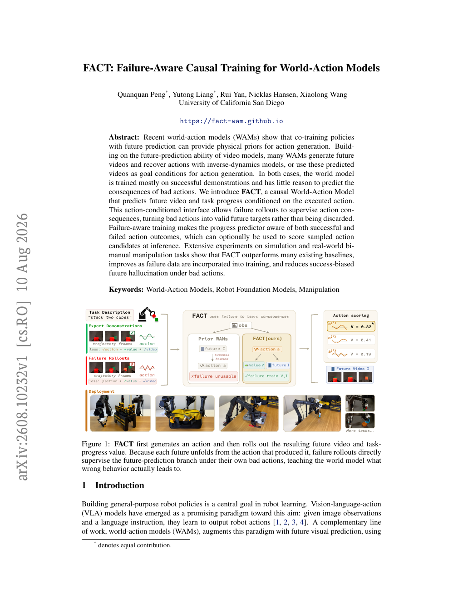
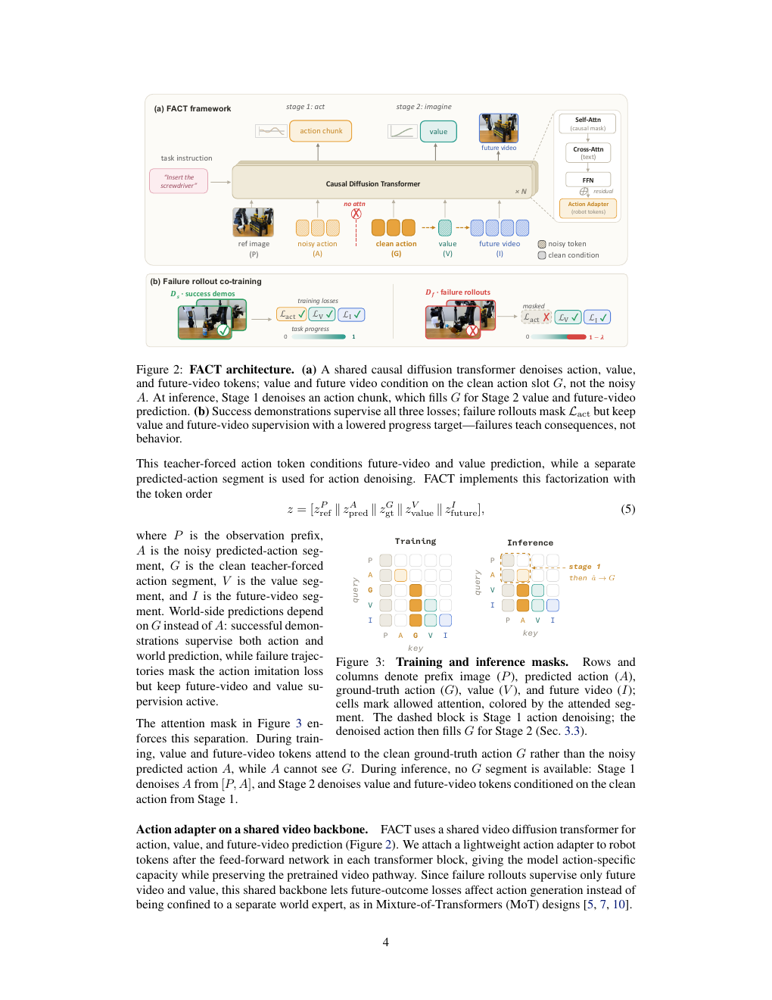
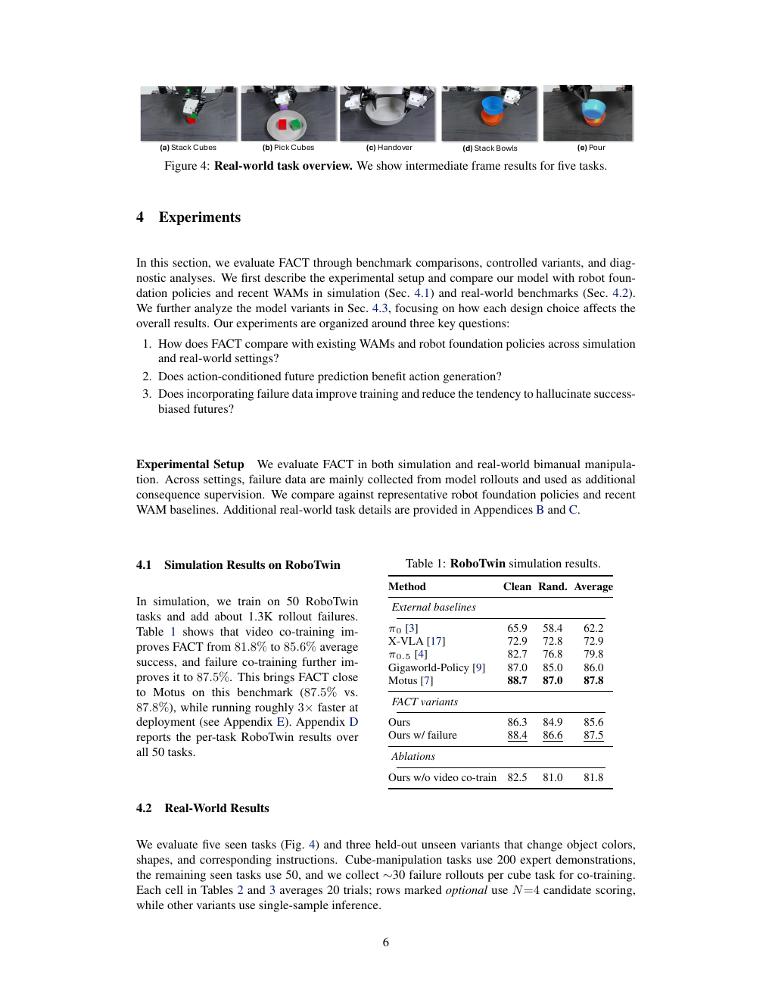
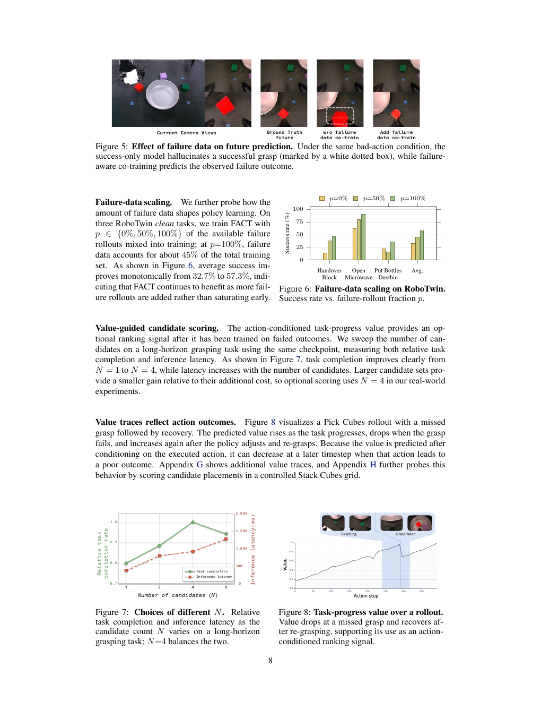
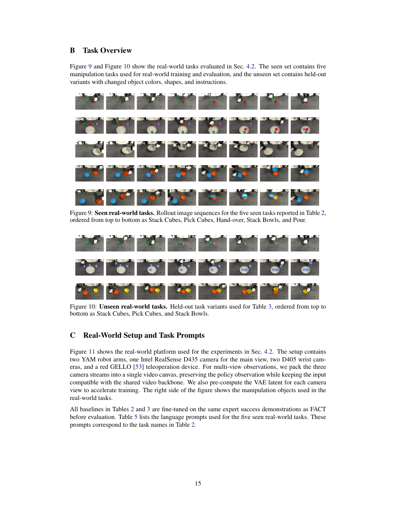
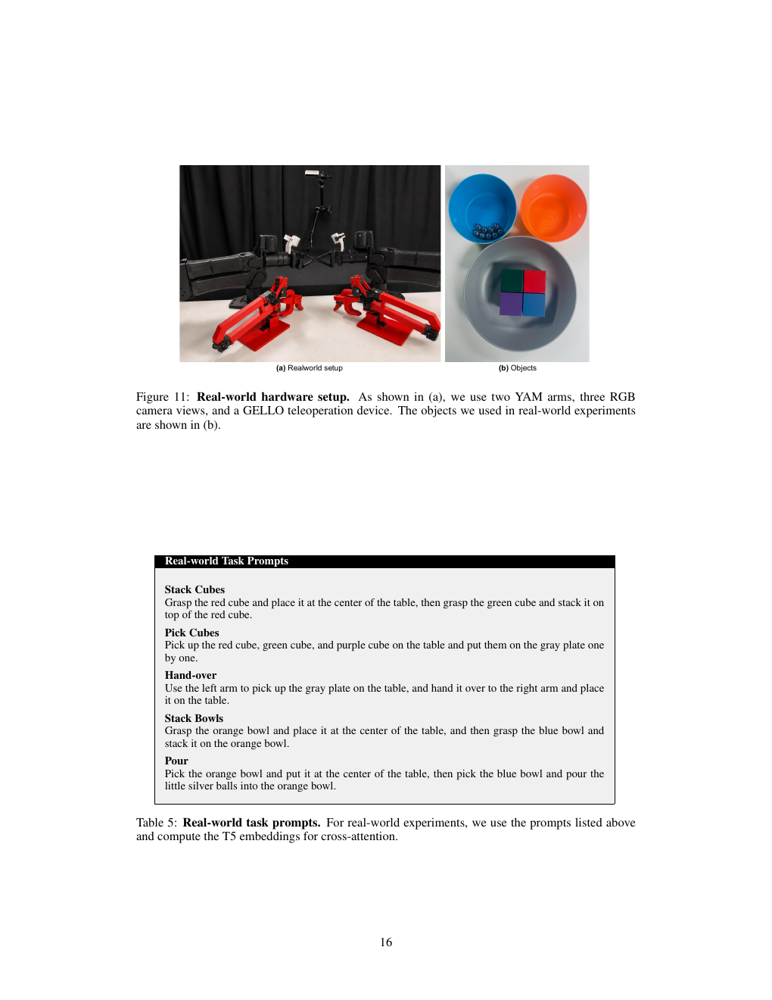
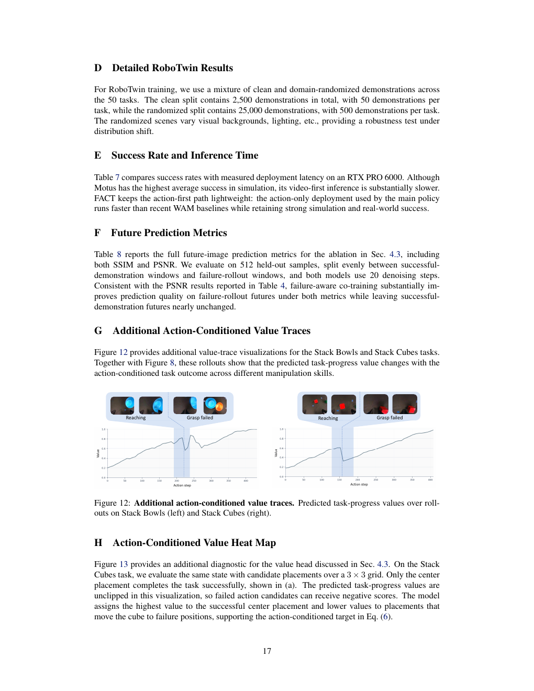
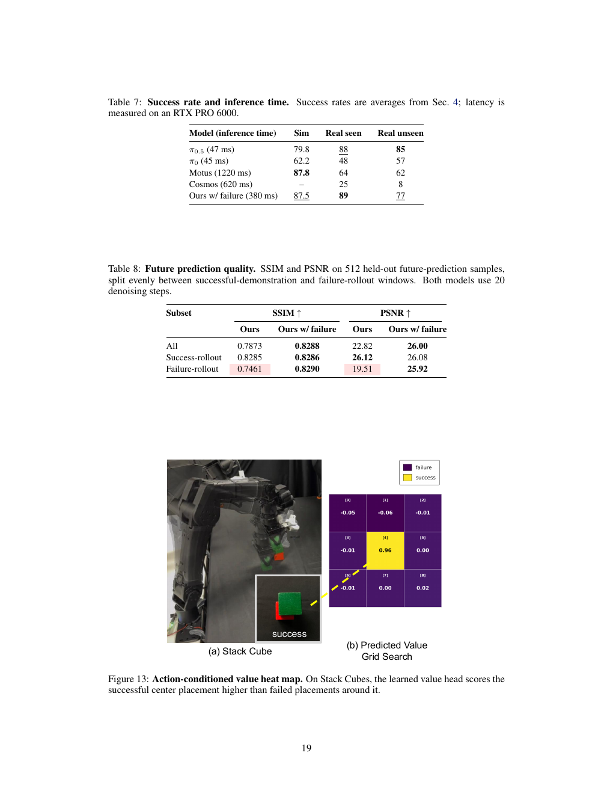

# FACT：Failure-Aware Causal Training for World-Action Models

## Source identity

- **Title:** FACT: Failure-Aware Causal Training for World-Action Models
- **Authors:** Quanquan Peng*, Yutong Liang*, Rui Yan, Nicklas Hansen, Xiaolong Wang
- **Affiliation:** University of California San Diego
- **Project page:** https://fact-wam.github.io
- **Source:** Peng 等，2026，FACT: Failure-Aware Causal Training for World-Action Models；arXiv:2608.10232v1 [cs.RO]，10 August 2026。
- **Local source PDF:** `/Users/roywangj/journey_wj/research/papers4zotero/zotero1/storage/G7H4ME3D/Peng 等 - 2026 - FACT Failure-Aware Causal Training for World-Action Models.pdf`
- **Reader status:** 完整逐段双语阅读稿；正文、图注、表格、附录与参考文献均覆盖。图像资源采用按页渲染的 PDF 页面图，便于核对原始版式；详见 `translation_notes.md`。

## Coverage index

1. Abstract and Keywords（摘要与关键词）
2. Introduction（引言）
3. Related Work（相关工作）
4. Method（方法）
   - 4.1 Problem Formulation（问题形式化）
   - 4.2 Model Architecture（模型架构）
   - 4.3 Training and Inference Strategy（训练与推理策略）
5. Experiments（实验）
   - 5.1 Simulation Results on RoboTwin
   - 5.2 Real-World Results
   - 5.3 Ablation Studies
6. Limitations（局限性）
7. Conclusion（结论）
8. References（参考文献）
9. Appendix A–H（附录 A–H）

## Terminology ledger

| English | Chinese | Note |
|---|---|---|
| World-Action Model (WAM) | 世界—动作模型 | 保留缩写 WAM。|
| Failure-Aware Causal Training (FACT) | 失败感知因果训练 | 方法名保留 FACT。|
| vision-language-action (VLA) | 视觉—语言—动作 | 模型范式。|
| action-conditioned | 动作条件化的 | 表示预测显式以已执行动作作为条件。|
| future prediction / future video | 未来预测 / 未来视频 | 与动作生成分支相区分。|
| task progress / value | 任务进度 / 价值 | 文中 value head 译为价值头。|
| teacher forcing | 教师强制 | clean ground-truth action condition。|
| flow matching | 流匹配 | 保留算法术语。|
| rollout failure | rollout 失败轨迹 | 机器人策略执行中未完成任务的轨迹。|
| success-biased hallucination | 成功偏置幻觉 | 在坏动作下仍预测成功未来。|
| candidate scoring | 候选动作评分 | 用价值头对采样动作排序。|

# Abstract（摘要）

> <span style="color:#3B82F6"><strong>Para. 1:</strong></span> Recent world-action models (WAMs) show that co-training policies with future prediction can provide physical priors for action generation. Building on the future-prediction ability of video models, many WAMs generate future videos and recover actions with inverse-dynamics models, or use these predicted videos as goal conditions for action generation. In both cases, the world model is trained mostly on successful demonstrations and has little reason to predict the consequences of bad actions.

> <span style="color:#F59E0B"><strong>Para. 1[CN]:</strong></span> 近期的世界—动作模型（world-action models，WAMs）表明，将策略与未来预测共同训练，可以为动作生成提供物理先验。许多 WAMs 建立在视频模型的未来预测能力之上：它们生成未来视频，再用逆动力学模型恢复动作；或者将预测得到的视频作为动作生成的目标条件。在这两种情况下，世界模型主要在成功示范上训练，因此几乎没有理由去预测错误动作会带来的后果。

> <span style="color:#3B82F6"><strong>Para. 2:</strong></span> We introduce FACT, a causal World-Action Model that predicts future video and task progress conditioned on the executed action. This action-conditioned interface allows failure rollouts to supervise action consequences, turning bad actions into valid future targets rather than being discarded. Failure-aware training makes the progress predictor aware of both successful and failed action outcomes, which can optionally be used to score sampled action candidates at inference. Extensive experiments on simulation and real-world bimanual manipulation tasks show that FACT outperforms many existing baselines, improves as failure data are incorporated into training, and reduces success-biased future hallucination under bad actions.

> <span style="color:#F59E0B"><strong>Para. 2[CN]:</strong></span> 我们提出 FACT，这是一种以执行动作作为条件来预测未来视频和任务进度的因果世界—动作模型。这个动作条件化接口使失败 rollout 能够监督动作后果：错误动作不再被丢弃，而是转化为有效的未来目标。失败感知训练使进度预测器同时了解成功和失败的动作结果，并且在推理时可以选择性地用它为采样得到的动作候选评分。在仿真和真实世界双臂操作任务上的大量实验表明，FACT 优于许多现有基线；随着失败数据被纳入训练，其性能进一步提高；在坏动作下，它也减少了成功偏置的未来幻觉。

> <span style="color:#3B82F6"><strong>Keywords:</strong></span> World-Action Models, Robot Foundation Models, Manipulation

> <span style="color:#F59E0B"><strong>Keywords[CN]:</strong></span> 世界—动作模型；机器人基础模型；操作。

### Figure 1. FACT 的核心动机与部署流程



**Caption:** FACT first generates an action and then rolls out the resulting future video and task-progress value. Because each future unfolds from the action that produced it, failure rollouts directly supervise the future-prediction branch under their own bad actions, teaching the world model what wrong behavior actually leads to.

**Caption[CN]:** FACT 首先生成动作，然后 rollout 由该动作产生的未来视频和任务进度价值。由于每个未来都从产生它的动作展开，失败 rollout 可以直接在自身的坏动作条件下监督未来预测分支，从而教会世界模型错误行为实际会导致什么结果。

# 1 Introduction（引言）

> <span style="color:#3B82F6"><strong>Para. 1:</strong></span> Building general-purpose robot policies is a central goal in robot learning. Vision-language-action (VLA) models have emerged as a promising paradigm toward this aim: given image observations and a language instruction, they learn to output robot actions [1, 2, 3, 4]. A complementary line of work, world-action models (WAMs), augments this paradigm with future visual prediction, using video models or future-prediction objectives to learn control together with how the scene may evolve under robot interaction [5, 6, 7, 8, 9, 10]. By coupling action modeling with predicted future observations, WAMs provide a natural way to bring temporal dynamics and physical priors into robot policy learning.

> <span style="color:#F59E0B"><strong>Para. 1[CN]:</strong></span> 构建通用机器人策略是机器人学习的核心目标。视觉—语言—动作（VLA）模型已经成为实现这一目标的有前景范式：给定图像观测和语言指令，模型学习输出机器人动作 [1, 2, 3, 4]。与之互补的一条研究路线是世界—动作模型（WAMs）：它通过未来视觉预测来扩展这一范式，利用视频模型或未来预测目标，学习控制策略以及机器人交互下场景可能如何演化 [5, 6, 7, 8, 9, 10]。将动作建模与预测的未来观测相结合，WAMs 为把时间动态和物理先验引入机器人策略学习提供了自然方式。

> <span style="color:#3B82F6"><strong>Para. 2:</strong></span> Existing WAMs commonly use predicted futures as an intermediate signal for choosing actions. One way is to imagine future videos and decode actions with an inverse dynamics model, as in video-first systems [5, 11]. This design benefits from a strong world prior, but action decoding depends on a second-stage network and often requires the future video to be fully denoised before control can proceed. A second line uses predicted future frames or latents as conditions for action prediction [6, 8, 10, 12]. These designs make future prediction useful as an auxiliary signal, yet their future targets are usually expert demonstrations: the model sees plausible futures paired with good actions, but not the consequences of bad actions. As a result, a bad action at test time can still be paired with a success-biased future [13, 14]. The key challenge is not merely adding more data, but using rollouts that fail to complete the desired task without turning them into bad demonstrations.

> <span style="color:#F59E0B"><strong>Para. 2[CN]:</strong></span> 现有 WAMs 通常把预测的未来作为选择动作的中间信号。一种做法是像 video-first 系统一样想象未来视频，再用逆动力学模型解码动作 [5, 11]。这种设计受益于强大的世界先验，但动作解码依赖第二阶段网络，而且通常必须等未来视频完全去噪后才能继续控制。另一条路线把预测的未来帧或潜变量作为动作预测的条件 [6, 8, 10, 12]。这些设计使未来预测成为有用的辅助信号，但它们的未来目标通常来自专家示范：模型看到的是与良好动作配对的合理未来，却看不到坏动作的后果。因此，测试时的坏动作仍可能被配对到一个成功偏置的未来 [13, 14]。关键挑战并不只是增加更多数据，而是要利用那些未能完成目标任务的 rollout，同时不能把它们变成坏的示范。

> <span style="color:#3B82F6"><strong>Para. 3:</strong></span> This raises the question: can we use failure rollouts as consequence supervision without treating failed actions as imitation targets? In this work, we propose FACT (Failure-Aware Causal Training), a causal World-Action Model that separates what to imitate from what to predict. FACT first proposes an action, then predicts the future video and task-progress value conditioned on the executed action. For successful demonstrations, actions, future video, and progress are all supervised. For failure rollouts, the action imitation loss is masked, but the observed failed future and lower progress value remain valid supervision. This turns failure data into action-conditioned consequence supervision and mitigates the tendency to hallucinate only successful futures under incorrect actions.

> <span style="color:#F59E0B"><strong>Para. 3[CN]:</strong></span> 这引出了一个问题：能否把失败 rollout 用作后果监督，而不把失败动作当作模仿目标？本文提出 FACT（Failure-Aware Causal Training，失败感知因果训练），一种将“需要模仿的内容”和“需要预测的内容”分离开的因果世界—动作模型。FACT 先提出一个动作，再以执行的动作作为条件预测未来视频和任务进度价值。对于成功示范，动作、未来视频和进度都接受监督；对于失败 rollout，动作模仿损失被屏蔽，但观测到的失败未来和较低进度价值仍然是有效监督。这把失败数据转化为动作条件化的后果监督，并减轻了在错误动作下只幻觉出成功未来的倾向。

> <span style="color:#3B82F6"><strong>Para. 4:</strong></span> By learning action-conditioned consequences from both successful demonstrations and failed rollouts, FACT produces a progress estimate that is sensitive to action quality. At inference time, the model can either execute the sampled action directly or optionally use this estimate to rank action candidates. Overall, our contributions are:
>
> 1. We propose FACT, a causal World-Action Model with an action-then-future sequence, enabling co-training on failure trajectories without corrupting action decoding.
> 2. We introduce a teacher-forced action-conditioned mask that separates action generation from future prediction, allowing failed actions to supervise future and value learning without undermining policy.
> 3. We validate the model in simulation and real-world benchmarks, showing improved policy success, reduced success-biased future hallucination under bad actions, and a progress predictor that can optionally support candidate ranking.

> <span style="color:#F59E0B"><strong>Para. 4[CN]:</strong></span> 通过从成功示范和失败 rollout 中学习动作条件化的后果，FACT 得到的进度估计会对动作质量敏感。在推理时，模型既可以直接执行采样动作，也可以选择用该估计为动作候选排序。总体而言，本文的贡献如下：
>
> 1. 提出 FACT，一种采用“先动作、后未来”序列的因果世界—动作模型，使模型能够在不破坏动作解码的情况下对失败轨迹进行联合训练。
> 2. 提出教师强制的动作条件化掩码，将动作生成与未来预测分离，使失败动作能够监督未来和价值学习，而不损害策略。
> 3. 在仿真和真实世界基准上验证模型，展示了更高的策略成功率、在坏动作下更少的成功偏置未来幻觉，以及可选择用于候选排序的进度预测器。

# 2 Related Work（相关工作）

> <span style="color:#3B82F6"><strong>Para. 1:</strong></span> **Vision-language-action models for robotic control.** Vision-language-action (VLA) models have emerged as a leading paradigm for generalist robot policies, transferring semantic priors from vision-language models to low-level action generation. Early large-scale robot transformers and open-source generalist policies learn language-conditioned manipulation from heterogeneous robot datasets [1, 2, 15, 16], while recent flow- or diffusion-based policies further scale continuous action modeling and open-world generalization [3, 4, 17, 18, 19]. Beyond direct action prediction, a growing line of work incorporates predictive dynamics into VLA policies. BagelVLA [10] interleaves language reasoning, visual forecasting, and action generation; DreamZero [11] and other world-action models use future visual prediction for action decoding, planning, or data generation [5, 6, 7, 8, 9, 20, 21, 22, 23]. These methods show that robotic policies can benefit from modeling not only what action to execute, but also how the world may evolve. In contrast, our work focuses on the causal role of action-conditioned futures: failure rollouts provide structured supervision about undesirable consequences rather than merely serving as low-quality demonstrations.

> <span style="color:#F59E0B"><strong>Para. 1[CN]:</strong></span> **用于机器人控制的视觉—语言—动作模型。** 视觉—语言—动作（VLA）模型已经成为通用机器人策略的主流范式，将视觉—语言模型中的语义先验迁移到低层动作生成中。早期的大规模机器人 Transformer 和开源通用策略从异构机器人数据集学习语言条件化操作 [1, 2, 15, 16]；近期基于流或扩散的策略进一步扩展了连续动作建模和开放世界泛化 [3, 4, 17, 18, 19]。除了直接预测动作之外，越来越多的工作把预测性动力学纳入 VLA 策略。BagelVLA [10] 交错进行语言推理、视觉预测和动作生成；DreamZero [11] 及其他世界—动作模型利用未来视觉预测进行动作解码、规划或数据生成 [5, 6, 7, 8, 9, 20, 21, 22, 23]。这些方法表明，机器人策略不仅可以建模要执行什么动作，也可以建模世界可能如何演化。与之不同，本文关注动作条件化未来的因果作用：失败 rollout 提供关于不良后果的结构化监督，而不只是充当低质量示范。

> <span style="color:#3B82F6"><strong>Para. 2:</strong></span> **Data sources for robotic policy learning.** The progress of robotic foundation models is closely tied to broader and more diverse training data. One line of work scales real robot demonstrations through shared datasets, distributed collection, and low-cost teleoperation platforms [24, 25, 26, 27, 28, 29]. Another line reduces collection cost by using human-centric interfaces or egocentric human videos to transfer manipulation priors to robots [30, 31, 32, 33, 34, 35]. Simulation provides complementary supervision through scalable task generation and language-conditioned benchmarks [36, 37, 38, 39, 40, 41]. Recently, reinforcement learning and self-improvement have also re-emerged as alternatives to purely offline imitation, improving policies through rollouts, verified rewards, value models, or world-model-based interaction [42, 43, 44]. FACT follows this broader trend of extracting supervision beyond successful demonstrations, but specifically studies how failure data [45, 46, 47, 48] can be converted to action-conditioned future and value supervision for robust policy learning.

> <span style="color:#F59E0B"><strong>Para. 2[CN]:</strong></span> **机器人策略学习的数据来源。** 机器人基础模型的发展与更广泛、更多样的训练数据紧密相关。一条研究路线通过共享数据集、分布式采集和低成本遥操作平台来扩展真实机器人示范 [24, 25, 26, 27, 28, 29]。另一条路线使用以人为中心的接口或以人类为中心的第一视角视频，将操作先验迁移到机器人上，从而降低采集成本 [30, 31, 32, 33, 34, 35]。仿真则通过可扩展的任务生成和语言条件化基准提供互补监督 [36, 37, 38, 39, 40, 41]。近期，强化学习和自我改进也重新成为纯离线模仿的替代方案，通过 rollout、可验证奖励、价值模型或基于世界模型的交互来改进策略 [42, 43, 44]。FACT 延续了从成功示范之外提取监督这一更广泛趋势，但具体研究如何将失败数据 [45, 46, 47, 48] 转化为动作条件化的未来和价值监督，以实现更稳健的策略学习。

# 3 Method（方法）

> <span style="color:#3B82F6"><strong>Para. 1:</strong></span> We propose FACT, a causal World-Action Model that generates actions before predicting their consequences. In this section, we first define the task setting and prediction targets (Sec. 3.1), and then introduce an action-conditioned architecture that separates action imitation from future prediction, allowing failure rollouts to supervise the world branch without becoming imitation targets (Sec. 3.2). Finally, the training and inference strategy closes this loop: failure rollouts provide supervision about action consequences, and the learned progress estimate provides an optional interface for scoring candidate actions (Sec. 3.3).

> <span style="color:#F59E0B"><strong>Para. 1[CN]:</strong></span> 我们提出 FACT，这是一种在预测动作后果之前先生成动作的因果世界—动作模型。本节首先定义任务设置和预测目标（第 3.1 节），然后介绍一种将动作模仿与未来预测分离的动作条件化架构，使失败 rollout 能够监督世界分支而不成为模仿目标（第 3.2 节）。最后，训练与推理策略闭合这一环路：失败 rollout 提供动作后果监督，而学习到的进度估计则提供一个可选的动作候选评分接口（第 3.3 节）。

## 3.1 Problem Formulation（问题形式化）

> <span style="color:#3B82F6"><strong>Para. 1:</strong></span> We formulate language-conditioned robotic manipulation as a sequential decision-making problem. At time $t$, the robot receives a task instruction $\ell$ and the current observation $o_t=(I^{\mathrm{main}}_t, I^{\mathrm{wristL}}_t, I^{\mathrm{wristR}}_t, s_t)$, where the images are multi-view RGB observations and $s_t\in\mathbb{R}^{d_s}$ is the robot proprioceptive state. The goal is to choose an action chunk $a_{t:t+H}\in\mathbb{R}^{H\times d}$ that advances the task specified by $\ell$. A standard language-conditioned policy models this decision directly as

$$p_\theta(a_{t:t+H}\mid o_t,\ell). \tag{1}$$

> <span style="color:#F59E0B"><strong>Para. 1[CN]:</strong></span> 我们将语言条件化的机器人操作形式化为序列决策问题。在时刻 $t$，机器人接收任务指令 $\ell$ 和当前观测 $o_t=(I^{\mathrm{main}}_t, I^{\mathrm{wristL}}_t, I^{\mathrm{wristR}}_t, s_t)$，其中图像是多视角 RGB 观测，$s_t\in\mathbb{R}^{d_s}$ 是机器人的本体感知状态。目标是选择一个动作块 $a_{t:t+H}\in\mathbb{R}^{H\times d}$，推进由 $\ell$ 指定的任务。标准的语言条件化策略直接将这一决策建模为式（1）。

> <span style="color:#3B82F6"><strong>Para. 2:</strong></span> Meanwhile, the model is additionally asked to predict what the chosen action will lead to. We therefore augment Eq. (1) with an action-conditioned world branch:

$$p_\theta(o'_{t:t+K},v_t(a_{t:t+H})\mid o_t,\ell,a_{t:t+H}). \tag{2}$$

> <span style="color:#F59E0B"><strong>Para. 2[CN]:</strong></span> 同时，模型还需要预测所选动作将导致的结果。因此，我们在式（1）中加入动作条件化的世界分支，如式（2）所示。

> <span style="color:#3B82F6"><strong>Para. 3:</strong></span> Here $o'_{t:t+K}$ denotes future-video observations over the prediction horizon and $v_t(a_{t:t+H})\in[0,1]$ is the predicted task progress after executing action chunk $a_{t:t+H}$. To keep this value target comparable across episodes with different lengths, we first define a normalized progress variable from an episode-level return. Let $r_k$ be a progress reward and $G_t=\sum_{k=1}^{t}r_k$ be the cumulative progress up to time $t$. The normalized progress is

$$p_t=\frac{G_t}{G_T}\in[0,1]. \tag{3}$$

> <span style="color:#F59E0B"><strong>Para. 3[CN]:</strong></span> 其中，$o'_{t:t+K}$ 表示预测时间范围内的未来视频观测，$v_t(a_{t:t+H})\in[0,1]$ 表示执行动作块 $a_{t:t+H}$ 后预测得到的任务进度。为了使不同长度 episode 中的价值目标具有可比性，我们首先根据 episode 级回报定义归一化进度变量。令 $r_k$ 为进度奖励，$G_t=\sum_{k=1}^{t}r_k$ 为截至时刻 $t$ 的累计进度，则归一化进度为式（3）。

> <span style="color:#3B82F6"><strong>Para. 4:</strong></span> where $p_t=0$ denotes the beginning of the task and $p_t=1$ denotes completion. The learned value head is queried as $V_\theta(o_t,\ell,a_{t:t+H})$ and predicts the action-conditioned progress target.

> <span style="color:#F59E0B"><strong>Para. 4[CN]:</strong></span> 其中，$p_t=0$ 表示任务开始，$p_t=1$ 表示任务完成。学习到的价值头以 $V_\theta(o_t,\ell,a_{t:t+H})$ 的形式查询，并预测动作条件化的进度目标。

## 3.2 Model Architecture（模型架构）

> <span style="color:#3B82F6"><strong>Para. 1:</strong></span> **Action-conditioned future prediction.** The model must learn future outcomes from failure rollouts without imitating failed actions. To separate these two effects, we introduce a clean ground-truth action condition $a^{\mathrm{gt}}_{t:t+H}$ for the world branch. Under this teacher-forcing design, Eq. (2) becomes

$$p_\theta(o'_{t:t+K},v_t(a^{\mathrm{gt}}_{t:t+H})\mid o_t,\ell,a^{\mathrm{gt}}_{t:t+H}). \tag{4}$$

> <span style="color:#F59E0B"><strong>Para. 1[CN]:</strong></span> **动作条件化的未来预测。** 模型必须从失败 rollout 学习未来结果，同时不能模仿失败动作。为分离这两个作用，我们为世界分支引入一个干净的真实动作条件 $a^{\mathrm{gt}}_{t:t+H}$。在这一教师强制设计下，式（2）变为式（4）。

> <span style="color:#3B82F6"><strong>Para. 2:</strong></span> This teacher-forced action token conditions future-video and value prediction, while a separate predicted-action segment is used for action denoising. FACT implements this factorization with the token order

$$z=[z_P^{\mathrm{ref}}\Vert z_A^{\mathrm{pred}}\Vert z_G^{\mathrm{gt}}\Vert z_V^{\mathrm{value}}\Vert z_I^{\mathrm{future}}]. \tag{5}$$

> <span style="color:#F59E0B"><strong>Para. 2[CN]:</strong></span> 这个教师强制动作 token 为未来视频和价值预测提供条件，而单独的预测动作片段用于动作去噪。FACT 采用如下 token 顺序实现这一分解：$P$ 是观测前缀，$A$ 是带噪的预测动作片段，$G$ 是干净的教师强制动作片段，$V$ 是价值片段，$I$ 是未来视频片段。

### Figure 2. FACT 架构与失败 rollout 联合训练



**Caption:** FACT architecture. (a) A shared causal diffusion transformer denoises action, value, and future-video tokens; value and future video condition on the clean action slot $G$, not the noisy $A$. At inference, Stage 1 denoises an action chunk, which fills $G$ for Stage 2 value and future-video prediction. (b) Success demonstrations supervise all three losses; failure rollouts mask $L_{act}$ but keep value and future-video supervision with a lowered progress target—failures teach consequences, not behavior.

**Caption[CN]:** FACT 架构。（a）共享的因果扩散 Transformer 对动作、价值和未来视频 token 进行去噪；价值和未来视频以干净动作槽位 $G$ 为条件，而不是以带噪的 $A$ 为条件。在推理时，阶段 1 对动作块去噪，该动作块随后填入 $G$，供阶段 2 进行价值和未来视频预测。（b）成功示范监督三个损失；失败 rollout 屏蔽 $L_{act}$，但保留价值和未来视频监督，并使用降低的进度目标——失败数据教的是后果，而不是行为。

> <span style="color:#3B82F6"><strong>Para. 3:</strong></span> World-side predictions depend on $G$ instead of $A$: successful demonstrations supervise both action and world prediction, while failure trajectories mask the action imitation loss but keep future-video and value supervision active. The attention mask in Figure 3 enforces this separation. During training, value and future-video tokens attend to the clean ground-truth action $G$ rather than the noisy predicted action $A$, while $A$ cannot see $G$. During inference, no $G$ segment is available: Stage 1 denoises $A$ from $[P,A]$, and Stage 2 denoises value and future-video tokens conditioned on the clean action from Stage 1.

> <span style="color:#F59E0B"><strong>Para. 3[CN]:</strong></span> 世界侧预测依赖 $G$ 而不是 $A$：成功示范同时监督动作预测和世界预测；失败轨迹屏蔽动作模仿损失，但保持未来视频和价值监督有效。图 3 的注意力掩码强制执行这一分离。训练期间，价值和未来视频 token 关注干净的真实动作 $G$，而不是带噪的预测动作 $A$；同时，$A$ 不能看到 $G$。推理期间没有可用的 $G$ 片段：阶段 1 从 $[P,A]$ 对 $A$ 去噪，阶段 2 则以阶段 1 得到的干净动作为条件，对价值和未来视频 token 去噪。

### Figure 3. 训练与推理注意力掩码


**Caption:** Training and inference masks. Rows and columns denote prefix image ($P$), predicted action ($A$), ground-truth action ($G$), value ($V$), and future video ($I$); cells mark allowed attention, colored by the attended segment. The dashed block is Stage 1 action denoising; the denoised action then fills $G$ for Stage 2 (Sec. 3.3).

**Caption[CN]:** 训练与推理掩码。行和列分别表示前缀图像（$P$）、预测动作（$A$）、真实动作（$G$）、价值（$V$）和未来视频（$I$）；单元格标记允许的注意力连接，并按被关注片段着色。虚线框是阶段 1 的动作去噪；去噪后的动作随后填入 $G$，用于阶段 2（第 3.3 节）。

> <span style="color:#3B82F6"><strong>Para. 4:</strong></span> **Action adapter on a shared video backbone.** FACT uses a shared video diffusion transformer for action, value, and future-video prediction (Figure 2). We attach a lightweight action adapter to robot tokens after the feed-forward network in each transformer block, giving the model action-specific capacity while preserving the pretrained video pathway. Since failure rollouts supervise only future video and value, this shared backbone lets future-outcome losses affect action generation instead of being confined to a separate world expert, as in Mixture-of-Transformers (MoT) designs [5, 7, 10].

> <span style="color:#F59E0B"><strong>Para. 4[CN]:</strong></span> **共享视频骨干上的动作适配器。** FACT 使用共享的视频扩散 Transformer 进行动作、价值和未来视频预测（图 2）。我们将轻量级动作适配器附加到每个 Transformer block 中前馈网络之后的机器人 token 上，使模型具备动作特定的容量，同时保留预训练的视频通路。由于失败 rollout 只监督未来视频和价值，这一共享骨干使未来结果损失能够影响动作生成，而不是像 Mixture-of-Transformers（MoT）设计 [5, 7, 10] 那样被限制在独立的世界专家中。

# 3.3 Training and Inference Strategy（训练与推理策略）

> <span style="color:#3B82F6"><strong>Para. 1:</strong></span> **Failure-aware value targets.** We denote successful demonstrations by $D_s$ and failure rollouts by $D_f$. Each episode is annotated with its final outcome and, for failed episodes, the failure onset. We instantiate Eq. (3) as an action-conditioned progress target:

$$v_t(a^{\mathrm{gt}}_{t:t+H})=\begin{cases}p_{t+H},&\text{if success},\\\operatorname{clip}(p_{t+H}-\lambda_{\mathrm{fail}}\mathbf{1}_{\mathrm{fail}(t+H)},0,1),&\text{if fail}.\end{cases}\tag{6}$$

> <span style="color:#F59E0B"><strong>Para. 1[CN]:</strong></span> **失败感知的价值目标。** 记成功示范为 $D_s$，失败 rollout 为 $D_f$。每个 episode 都标注最终结果；对于失败 episode，还标注失败发生的时刻。我们将式（3）实例化为动作条件化的进度目标，如式（6）所示，其中 $\mathbf{1}_{\mathrm{fail}(t+H)}$ 表示执行 $a^{\mathrm{gt}}_{t:t+H}$ 时截至该时刻是否已经发生失败。

> <span style="color:#3B82F6"><strong>Para. 2:</strong></span> In our experiments, we use a uniform progress reward for simplicity, so Eq. (3) reduces to $p_t=t/T$ for an episode of length $T$. This target preserves temporal progress while lowering the score assigned to action-conditioned futures that enter failure. Thus, under a failed action sequence, the model is trained to predict both the observed failed future and a lower action-conditioned progress target.

> <span style="color:#F59E0B"><strong>Para. 2[CN]:</strong></span> 为简单起见，我们在实验中使用均匀进度奖励，因此对于长度为 $T$ 的 episode，式（3）化为 $p_t=t/T$。这一目标保留时间上的进度，同时降低进入失败状态的动作条件化未来所获得的分数。因此，在失败动作序列下，模型被训练为同时预测观测到的失败未来和较低的动作条件化进度目标。

> <span style="color:#3B82F6"><strong>Para. 3:</strong></span> **Joint denoising losses.** We train all predicted modalities with the same flow-matching denoising objective [49]. For a target modality $x\in\{a,v,I\}$, let $z^x_0$ be the clean target token and $z^x_1\sim\mathcal{N}(0,I)$ be Gaussian noise. With interpolation $z^x_\tau=(1-\tau)z^x_0+\tau z^x_1$, the modality loss is

$$L_x=\mathbb{E}_{z^x_0,z^x_1,\tau}\left[\left\|u^x_\theta(z^x_\tau,\tau;z)-(z^x_1-z^x_0)\right\|_2^2\right].\tag{7}$$

> <span style="color:#F59E0B"><strong>Para. 3[CN]:</strong></span> **联合去噪损失。** 我们用同一个流匹配去噪目标训练所有预测模态 [49]。对于目标模态 $x\in\{a,v,I\}$，令 $z^x_0$ 为干净目标 token，$z^x_1\sim\mathcal{N}(0,I)$ 为高斯噪声。采用插值 $z^x_\tau=(1-\tau)z^x_0+\tau z^x_1$ 后，模态损失为式（7），其中 $u^x_\theta$ 是预测速度，$z$ 表示式（5）中的完整 token 序列。

> <span style="color:#3B82F6"><strong>Para. 4:</strong></span> Success demonstrations supervise action, value, and future prediction: $L_{D_s}=w_aL_a+w_vL_v+w_IL_I$ (8). For failure rollouts, we remove the action imitation term while retaining value and future-video supervision: $L_{D_f}=w_vL_v+w_IL_I$ (9). Thus, failure data teaches the model the consequences and lower action-conditioned progress of failed actions without making those actions policy targets.

> <span style="color:#F59E0B"><strong>Para. 4[CN]:</strong></span> 成功示范监督动作、价值和未来预测：$L_{D_s}=w_aL_a+w_vL_v+w_IL_I$（8）。对于失败 rollout，我们去掉动作模仿项，同时保留价值和未来视频监督：$L_{D_f}=w_vL_v+w_IL_I$（9）。因此，失败数据教会模型失败动作的后果以及较低的动作条件化进度，但不会使这些动作成为策略目标。

> <span style="color:#3B82F6"><strong>Para. 5:</strong></span> **Two-stage inference.** Inference runs the same transformer in two stages. Stage 1 denoises $[P_{state},P_{ref},A_{noisy}]$ for $K$ denoise flow-Euler steps and returns a clean action chunk $\hat a_{t:t+H}$. If only an action is required, FACT stops here and skips world prediction. When candidate scoring or consequence prediction is requested, Stage 2 places $\hat a_{t:t+H}$ into the clean action-conditioning slot and denoises value and, optionally, future-video latents. Since the prefix $P$ is shared across candidates, prefix key-value caching is used in action-only inference.

> <span style="color:#F59E0B"><strong>Para. 5[CN]:</strong></span> **两阶段推理。** 推理分两个阶段运行同一个 Transformer。阶段 1 对 $[P_{state},P_{ref},A_{noisy}]$ 执行 $K$ 个 flow-Euler 去噪步骤，并返回干净的动作块 $\hat a_{t:t+H}$。如果只需要动作，FACT 在这里停止并跳过世界预测。当请求候选评分或后果预测时，阶段 2 将 $\hat a_{t:t+H}$ 放入干净的动作条件槽位，并对价值以及（可选的）未来视频潜变量进行去噪。由于所有候选共享前缀 $P$，动作-only 推理使用前缀 key-value 缓存。

> <span style="color:#3B82F6"><strong>Para. 6:</strong></span> **Optional candidate scoring.** Candidate ranking [50] is meaningful in FACT because the progress predictor is trained on action-conditioned failed outcomes. With success-only training, progress prediction is calibrated mainly on the expert action manifold and may assign overly optimistic scores to poor actions. We therefore treat value-guided selection as an optional deployment interface and diagnostic of failure-aware consequence learning, rather than an independent source of supervision. For value-guided inference, Stage 1 samples $N$ action candidates $\{a^{(k)}\}_{k=1}^N$ in parallel. Stage 2 predicts $\hat v^{(k)}=V_\theta(o_t,\ell,a^{(k)})$ and executes $a^\star=\arg\max_k\hat v^{(k)}$. This selection rule uses the value head to score the future implied by each candidate action, without training a separate critic.

> <span style="color:#F59E0B"><strong>Para. 6[CN]:</strong></span> **可选的候选评分。** 在 FACT 中，候选排序 [50] 是有意义的，因为进度预测器是在动作条件化的失败结果上训练的。在仅成功训练下，进度预测主要在专家动作流形上校准，可能给较差动作分配过于乐观的分数。因此，我们将价值引导的选择视为一种可选的部署接口和失败感知后果学习的诊断工具，而不是独立的监督来源。对于价值引导的推理，阶段 1 并行采样 $N$ 个动作候选 $\{a^{(k)}\}_{k=1}^N$。阶段 2 预测 $\hat v^{(k)}=V_\theta(o_t,\ell,a^{(k)})$，并执行 $a^\star=\arg\max_k\hat v^{(k)}$。该选择规则使用价值头对每个候选动作所隐含的未来进行评分，无需训练独立的 critic。

> <span style="color:#3B82F6"><strong>Para. 7:</strong></span> **Implementation details.** We initialize the model weights from WAN2.2-5B [51], which serves as the video diffusion backbone, and train with AdamW [52]. The learning rates are $2\times10^{-4}$ for the action FFN and $2\times10^{-5}$ for the WAN backbone; loss weights are $w_a=20$ and $w_v=w_I=1$. The action chunk length is $H=48$ and $\lambda_{fail}=1$. Future-video supervision uses the current frame plus four future offsets, corresponding to $[0,H/4,H/2,3H/4,H]$. Unless otherwise specified, inference uses 20 flow-Euler denoising steps. Appendix A summarizes the failure-aware co-training loop, rollout failure collection, and two-stage inference procedure in pseudocode.

> <span style="color:#F59E0B"><strong>Para. 7[CN]:</strong></span> **实现细节。** 我们从 WAN2.2-5B [51] 初始化模型权重，将其作为视频扩散骨干，并使用 AdamW [52] 训练。动作 FFN 的学习率为 $2\times10^{-4}$，WAN 骨干的学习率为 $2\times10^{-5}$；损失权重为 $w_a=20$ 和 $w_v=w_I=1$。动作块长度为 $H=48$，$\lambda_{fail}=1$。未来视频监督使用当前帧和四个未来偏移，对应 $[0,H/4,H/2,3H/4,H]$。除非另有说明，推理使用 20 个 flow-Euler 去噪步骤。附录 A 用伪代码总结失败感知联合训练环路、rollout 失败采集以及两阶段推理过程。

# 4 Experiments（实验）

### Figure 4. 真实世界任务概览



**Caption:** Real-world task overview. We show intermediate frame results for five tasks.

**Caption[CN]:** 真实世界任务概览。图中展示五项任务的中间帧结果。

> <span style="color:#3B82F6"><strong>Para. 1:</strong></span> In this section, we evaluate FACT through benchmark comparisons, controlled variants, and diagnostic analyses. We first describe the experimental setup and compare our model with robot foundation policies and recent WAMs in simulation (Sec. 4.1) and real-world benchmarks (Sec. 4.2). We further analyze the model variants in Sec. 4.3, focusing on how each design choice affects the overall results. Our experiments are organized around three key questions:
>
> 1. How does FACT compare with existing WAMs and robot foundation policies across simulation and real-world settings?
> 2. Does action-conditioned future prediction benefit action generation?
> 3. Does incorporating failure data improve training and reduce the tendency to hallucinate success-biased futures?

> <span style="color:#F59E0B"><strong>Para. 1[CN]:</strong></span> 本节通过基准比较、受控变体和诊断分析评估 FACT。我们首先介绍实验设置，并在仿真（第 4.1 节）和真实世界基准（第 4.2 节）中将模型与机器人基础策略及近期 WAM 进行比较。随后在第 4.3 节分析模型变体，重点考察每个设计选择如何影响总体结果。实验围绕三个关键问题组织：
>
> 1. 在仿真和真实世界设置中，FACT 与现有 WAM 和机器人基础策略相比表现如何？
> 2. 动作条件化的未来预测是否有利于动作生成？
> 3. 纳入失败数据是否能改善训练，并减少模型产生成功偏置未来幻觉的倾向？

> <span style="color:#3B82F6"><strong>Para. 2:</strong></span> **Experimental Setup.** We evaluate FACT in both simulation and real-world bimanual manipulation. Across settings, failure data are mainly collected from model rollouts and used as additional consequence supervision. We compare against representative robot foundation policies and recent WAM baselines. Additional real-world task details are provided in Appendices B and C.

> <span style="color:#F59E0B"><strong>Para. 2[CN]:</strong></span> **实验设置。** 我们在仿真和真实世界双臂操作中评估 FACT。在各种设置下，失败数据主要从模型 rollout 中采集，并作为额外的后果监督。我们与有代表性的机器人基础策略和近期 WAM 基线进行比较。更多真实世界任务细节见附录 B 和 C。

## 4.1 Simulation Results on RoboTwin（RoboTwin 仿真结果）

| Method | Clean | Rand. | Average |
|---|---:|---:|---:|
| π0 [3] | 65.9 | 58.4 | 62.2 |
| X-VLA [17] | 72.9 | 72.8 | 72.9 |
| π0.5 [4] | 82.7 | 76.8 | 79.8 |
| Gigaworld-Policy [9] | 87.0 | 85.0 | 86.0 |
| Motus [7] | 88.7 | 87.0 | 87.8 |
| FACT（Ours） | 86.3 | 84.9 | 85.6 |
| FACT w/ failure | 88.4 | 86.6 | 87.5 |
| FACT w/o video co-train | 82.5 | 81.0 | 81.8 |

**Table 1.** RoboTwin simulation results.

**Table 1[CN].** RoboTwin 仿真结果。`Clean` 是干净设置，`Rand.` 是随机化设置，`Average` 是两者平均成功率。

> <span style="color:#3B82F6"><strong>Para. 3:</strong></span> In simulation, we train on 50 RoboTwin tasks and add about 1.3K rollout failures. Table 1 shows that video co-training improves FACT from 81.8% to 85.6% average success, and failure co-training further improves it to 87.5%. This brings FACT close to Motus on this benchmark (87.5% vs. 87.8%), while running roughly 3× faster at deployment (see Appendix E). Appendix D reports the per-task RoboTwin results over all 50 tasks.

> <span style="color:#F59E0B"><strong>Para. 3[CN]:</strong></span> 在仿真中，我们在 50 个 RoboTwin 任务上训练，并加入约 1.3K 条 rollout 失败轨迹。表 1 表明，视频联合训练将 FACT 的平均成功率从 81.8% 提升到 85.6%，失败联合训练又将其提升到 87.5%。在这一基准上，FACT 已接近 Motus（87.5% 对 87.8%），同时部署运行速度约快 3 倍（见附录 E）。附录 D 报告全部 50 个任务的逐任务 RoboTwin 结果。

## 4.2 Real-World Results（真实世界结果）

> <span style="color:#3B82F6"><strong>Para. 1:</strong></span> We evaluate five seen tasks (Fig. 4) and three held-out unseen variants that change object colors, shapes, and corresponding instructions. Cube-manipulation tasks use 200 expert demonstrations, the remaining seen tasks use 50, and we collect approximately 30 failure rollouts per cube task for co-training. Each cell in Tables 2 and 3 averages 20 trials; rows marked optional use $N=4$ candidate scoring, while other variants use single-sample inference.

> <span style="color:#F59E0B"><strong>Para. 1[CN]:</strong></span> 我们评估五个已见任务（图 4）以及三个留出的未见变体；未见变体改变了物体颜色、形状和相应指令。立方体操作任务使用 200 条专家示范，其余已见任务使用 50 条；我们为每个立方体任务采集约 30 条失败 rollout 用于联合训练。表 2 和表 3 的每个单元格均为 20 次试验的平均值；标记为 `optional` 的行使用 $N=4$ 的候选评分，其他变体使用单样本推理。

| Method | Stack Cubes | Pick Cubes | Handover | Stack Bowls | Pour | Avg. |
|---|---:|---:|---:|---:|---:|---:|
| Cosmos [6] | 5 | 45 | 25 | 35 | 15 | 25 |
| π0 [3] | 35 | 70 | 40 | 50 | 45 | 48 |
| π0.5 [4] | 75 | 100 | 85 | 80 | 100 | 88 |
| Motus [7] | 50 | 70 | 55 | 85 | 60 | 64 |
| FACT（Ours） | 70 | 85 | 90 | 80 | 85 | 82 |
| FACT w/ failure | 75 | 95 | 85 | 95 | 95 | 89 |
| FACT w/ failure + scoring (optional) | 85 | 100 | 85 | 100 | 90 | 92 |
| FACT + scoring | 80 | 80 | 70 | 90 | 75 | 79 |
| FACT w/o causal mask | 50 | 75 | 95 | 85 | 80 | 77 |
| FACT w/ failed-action loss | 45 | 55 | 75 | 65 | 75 | 63 |
| FACT w/o video co-train | 60 | 55 | 35 | 85 | 55 | 58 |

**Table 2.** Real-world results on seen tasks.

**Table 2[CN].** 已见真实世界任务结果。数值为成功率（%）；`scoring (optional)` 表示使用可选的 $N=4$ 候选评分。

| Method | Stack Cubes | Pick Cubes | Stack Bowls | Avg. |
|---|---:|---:|---:|---:|
| Cosmos [6] | 15 | 10 | 0 | 8 |
| π0 [3] | 30 | 65 | 75 | 57 |
| π0.5 [4] | 65 | 90 | 100 | 85 |
| Motus [7] | 55 | 60 | 70 | 62 |
| FACT（Ours） | 45 | 75 | 80 | 67 |
| FACT w/ failure | 60 | 85 | 85 | 77 |
| FACT w/ failure + scoring (optional) | 65 | 95 | 85 | 82 |

**Table 3.** Unseen real-world task results.

**Table 3[CN].** 未见真实世界任务结果。数值为成功率（%）。

> <span style="color:#3B82F6"><strong>Para. 2:</strong></span> On seen tasks, FACT outperforms Motus (82% vs. 64%); failure-aware training raises this from 82% to 89%, and optional scoring further reaches 92%. Notably, scoring alone without failed outcomes does not help (79%), confirming that the value head only becomes useful after consequence training. On unseen variants, failure-aware training raises success from 67% to 77% and optional scoring to 82%, close to π0.5 at 85% despite π0.5 benefiting from large-scale robot pretraining that FACT does not use. Appendix E compares these with measured inference latency.

> <span style="color:#F59E0B"><strong>Para. 2[CN]:</strong></span> 在已见任务上，FACT 优于 Motus（82% 对 64%）；失败感知训练将成功率从 82% 提升到 89%，可选评分进一步提升到 92%。值得注意的是，没有失败结果时单独使用评分并无帮助（79%），这证实价值头只有在接受后果训练后才有用。在未见变体上，失败感知训练将成功率从 67% 提升到 77%，可选评分提升到 82%；这接近 π0.5 的 85%，尽管 π0.5 受益于 FACT 未使用的大规模机器人预训练。附录 E 将这些结果与实测推理延迟进行比较。

## 4.3 Ablation Studies（消融研究）

> <span style="color:#3B82F6"><strong>Para. 1:</strong></span> **Policy-performance ablations.** The controlled variants in Tables 1 and 2 isolate two design choices of FACT. Removing video co-training reduces RoboTwin average success from 85.6% to 81.8% and real-world seen-task success from 82% to 58%, indicating that future prediction acts as an important regularizer for action generation. The causal-mask ablation is trained without failure data, matching the “Ours” setting except that it removes the clean ground-truth action condition $G$ in Figure 3 and jointly denoises action, value, and future-video tokens. Its lower real-world seen-task success, from 82% to 77%, suggests that teacher-forced action conditioning is important for turning future prediction into stronger action generation. When failure rollouts are added but their action imitation loss is not masked, success drops to 63%, confirming that failed actions should supervise consequences rather than action generation.

> <span style="color:#F59E0B"><strong>Para. 1[CN]:</strong></span> **策略性能消融。** 表 1 和表 2 中的受控变体分别隔离 FACT 的两个设计选择。去掉视频联合训练会使 RoboTwin 平均成功率从 85.6% 降至 81.8%，使真实世界已见任务成功率从 82% 降至 58%，说明未来预测对动作生成起到了重要正则化作用。因果掩码消融不使用失败数据；它与 `Ours` 设置相同，但去掉图 3 中干净的真实动作条件 $G$，并联合对动作、价值和未来视频 token 去噪。真实世界已见任务成功率从 82% 降至 77%，说明教师强制动作条件对于将未来预测转化为更强的动作生成非常重要。当加入失败 rollout 但不屏蔽其动作模仿损失时，成功率降至 63%，证实失败动作应监督后果而不是动作生成。

| Subset | FACT | FACT w/ failure |
|---|---:|---:|
| All | 22.82 | 26.00 |
| Success-rollout | 26.12 | 26.08 |
| Failure-rollout | 19.51 | 25.92 |

**Table 4.** Future prediction quality (PSNR↑). Future-image prediction on 512 held-out samples, split evenly between success demonstrations and failure rollouts.

**Table 4[CN].** 未来预测质量（PSNR↑）。在 512 个留出的样本上评估未来图像预测，样本平均分为成功示范和失败 rollout 两部分。

> <span style="color:#3B82F6"><strong>Para. 2:</strong></span> **Failure data reduces future hallucination.** We compare a success-only checkpoint with one co-trained on success demonstrations and real failure rollouts. Figure 5 shows that, under the same bad-action condition, the success-only model still predicts a successful grasp, while failure-aware co-training predicts the observed failed outcome. Table 4 quantifies this effect: failure-aware co-training substantially improves prediction quality on failure-rollout futures while leaving successful-demonstration futures nearly unchanged, indicating that failure data reduces success-biased future hallucination without degrading normal future prediction. The same trend holds under SSIM, which we report in Appendix F.

> <span style="color:#F59E0B"><strong>Para. 2[CN]:</strong></span> **失败数据减少未来幻觉。** 我们比较仅使用成功数据训练的 checkpoint 与在成功示范和真实失败 rollout 上联合训练的 checkpoint。图 5 表明，在相同的坏动作条件下，仅成功模型仍然预测成功抓取，而失败感知联合训练模型预测观测到的失败结果。表 4 量化了这一效果：失败感知联合训练显著提高了失败 rollout 未来的预测质量，同时成功示范未来几乎不变，说明失败数据减少了成功偏置的未来幻觉，而不会损害正常的未来预测。在 SSIM 指标下也观察到相同趋势，结果见附录 F。

### Figure 5. 失败数据对未来预测的影响



**Caption:** Effect of failure data on future prediction. Under the same bad-action condition, the success-only model hallucinates a successful grasp (marked by a white dotted box), while failure-aware co-training predicts the observed failure outcome.

**Caption[CN]:** 失败数据对未来预测的影响。在相同的坏动作条件下，仅成功模型幻觉出成功抓取（白色虚线框标出），而失败感知联合训练预测观测到的失败结果。

> <span style="color:#3B82F6"><strong>Para. 3:</strong></span> **Failure-data scaling.** We further probe how the amount of failure data shapes policy learning. On three RoboTwin clean tasks, we train FACT with $p\in\{0\%,50\%,100\%\}$ of the available failure rollouts mixed into training; at $p=100\%$, failure data accounts for about 45% of the total training set. As shown in Figure 6, average success improves monotonically from 32.7% to 57.3%, indicating that FACT continues to benefit as more failure rollouts are added rather than saturating early.

> <span style="color:#F59E0B"><strong>Para. 3[CN]:</strong></span> **失败数据规模。** 我们进一步探查失败数据量如何影响策略学习。在三个 RoboTwin 干净任务上，我们将可用失败 rollout 的 $p\in\{0\%,50\%,100\%\}$ 混入训练；当 $p=100\%$ 时，失败数据约占总训练集的 45%。如图 6 所示，平均成功率从 32.7% 单调提升到 57.3%，说明随着加入更多失败 rollout，FACT 仍持续获益，而不是很早就达到饱和。

### Figure 6. RoboTwin 上的失败数据规模实验


**Caption:** Failure-data scaling on RoboTwin. Success rate versus failure-rollout fraction $p$; $p=0\%$, $50\%$, and $100\%$ denote the fraction of available failure rollouts mixed into training.

**Caption[CN]:** RoboTwin 上的失败数据规模实验。成功率随失败 rollout 比例 $p$ 的变化；$p=0\%$、$50\%$ 和 $100\%$ 表示混入训练的可用失败 rollout 比例。

> <span style="color:#3B82F6"><strong>Para. 4:</strong></span> **Value-guided candidate scoring.** The action-conditioned task-progress value provides an optional ranking signal after it has been trained on failed outcomes. We sweep the number of candidates on a long-horizon grasping task using the same checkpoint, measuring both relative task completion and inference latency. As shown in Figure 7, task completion improves clearly from $N=1$ to $N=4$, while latency increases with the number of candidates. Larger candidate sets provide a smaller gain relative to their additional cost, so optional scoring uses $N=4$ in our real-world experiments.

> <span style="color:#F59E0B"><strong>Para. 4[CN]:</strong></span> **价值引导的候选评分。** 动作条件化的任务进度价值在失败结果上训练后，可以提供可选的排序信号。我们在一个长时程抓取任务上使用同一 checkpoint 扫描候选数，同时测量相对任务完成率和推理延迟。如图 7 所示，任务完成率从 $N=1$ 到 $N=4$ 有明显提升，而延迟随候选数量增加。更大的候选集合相对于额外成本带来的收益更小，因此真实世界实验中的可选评分使用 $N=4$。

### Figure 7. 不同候选数量的选择


**Caption:** Choices of different $N$. Relative task completion and inference latency as the candidate count $N$ varies on a long-horizon grasping task; $N=4$ balances the two.

**Caption[CN]:** 不同 $N$ 的选择。在长时程抓取任务上，候选数 $N$ 变化时的相对任务完成率和推理延迟；$N=4$ 在两者之间取得平衡。

> <span style="color:#3B82F6"><strong>Para. 5:</strong></span> **Value traces reflect action outcomes.** Figure 8 visualizes a Pick Cubes rollout with a missed grasp followed by recovery. The predicted value rises as the task progresses, drops when the grasp fails, and increases again after the policy adjusts and re-grasps. Because the value is predicted after conditioning on the executed action, it can decrease at a later timestep when that action leads to a poor outcome. Appendix G shows additional value traces, and Appendix H further probes this behavior by scoring candidate placements in a controlled Stack Cubes grid.

> <span style="color:#F59E0B"><strong>Para. 5[CN]:</strong></span> **价值轨迹反映动作结果。** 图 8 展示了 Pick Cubes 一次先错过抓取、随后恢复的 rollout。随着任务推进，预测价值上升；抓取失败时下降；策略调整并再次抓取后又上升。由于价值是在以执行动作为条件之后预测的，当该动作导致较差结果时，价值可以在更晚的时刻下降。附录 G 展示更多价值轨迹，附录 H 则通过在受控的 Stack Cubes 网格中对候选放置位置评分，进一步探查这一行为。

### Figure 8. rollout 上的任务进度价值


**Caption:** Task-progress value over a rollout. Value drops at a missed grasp and recovers after re-grasping, supporting its use as an action-conditioned ranking signal.

**Caption[CN]:** rollout 上的任务进度价值。错过抓取时价值下降，重新抓取后恢复，支持将其用作动作条件化的排序信号。

# 5 Limitations（局限性）

> <span style="color:#3B82F6"><strong>Para. 1:</strong></span> While this work focuses on failure-aware consequence modeling, scaling the same causal training order to broader robot and human-interaction data may further improve the physical plausibility of future prediction and the discriminative power of the value head. Also, future work could replace our value head or augment it with learned progress estimators while keeping the same action-conditioned value interface. Finally, best-of-$N$ selection trades computation for reliability. FACT can run in action-only mode when latency is critical, but value-guided selection requires an additional scoring pass for each candidate batch.

> <span style="color:#F59E0B"><strong>Para. 1[CN]:</strong></span> 尽管本文聚焦于失败感知的后果建模，但将相同的因果训练顺序扩展到更广泛的机器人数据和人机交互数据，可能进一步提升未来预测的物理合理性以及价值头的判别能力。此外，未来工作可以替换我们的价值头，或用学习到的进度估计器增强它，同时保留相同的动作条件化价值接口。最后，best-of-$N$ 选择用计算量换取可靠性。在延迟关键时，FACT 可以运行 action-only 模式；但价值引导的选择需要对每个候选批次额外执行一次评分过程。

# 6 Conclusion（结论）

> <span style="color:#3B82F6"><strong>Para. 1:</strong></span> We presented FACT, a causal World-Action Model that reverses the usual WAM order by generating actions before predicting future video and task-progress value. A teacher-forcing mask makes the clean executed action the condition for all world-side predictions, allowing failure rollouts to supervise future and value prediction while their action imitation loss is disabled. Across simulation and real-world bimanual manipulation benchmarks, this failure-aware consequence modeling improves policy learning and reduces success-biased future hallucination under bad actions. The learned progress predictor also provides an optional interface for candidate scoring, offering a compute-performance tradeoff at deployment. This action-conditioned view of world modeling provides a natural interface for future training regimes that include online rollouts, DAgger-style corrections, and reinforcement learning from negative experience.

> <span style="color:#F59E0B"><strong>Para. 1[CN]:</strong></span> 我们提出 FACT，一种通过在预测未来视频和任务进度价值之前生成动作，从而反转通常 WAM 顺序的因果世界—动作模型。教师强制掩码使干净的已执行动作成为所有世界侧预测的条件，允许失败 rollout 监督未来和价值预测，同时关闭其动作模仿损失。在仿真和真实世界双臂操作基准上，这种失败感知的后果建模改善了策略学习，并减少了坏动作下成功偏置的未来幻觉。学习到的进度预测器还提供了可选的候选评分接口，在部署时形成计算量与性能之间的折中。这种动作条件化的世界建模视角，为未来包含在线 rollout、DAgger 风格纠正以及从负面经验中强化学习的训练制度提供了自然接口。

# Appendix（附录）

## A Training and Inference Algorithms（训练与推理算法）

> <span style="color:#3B82F6"><strong>Para. 1:</strong></span> Algorithms 1–3 summarize the procedure used by FACT. The notation follows Sec. 3.3: successful demonstrations are denoted by $D_s$, rollout failures by $D_f$, and the action-conditioned task-progress target is larger for actions that are expected to complete the task.

> <span style="color:#F59E0B"><strong>Para. 1[CN]:</strong></span> 算法 1–3 总结 FACT 使用的过程。符号沿用第 3.3 节：成功示范记为 $D_s$，rollout 失败记为 $D_f$；预期能够完成任务的动作具有更大的动作条件化任务进度目标。

### Algorithm 1. Failure-aware co-training of FACT

```text
Require: successful demonstrations D_s, failure rollouts D_f, model θ
1: for each training step do
2:   Sample a minibatch B_s ⊂ D_s and B_f ⊂ D_f
3:   for each trajectory window (o_t, ℓ, a_{t:t+H}, o′_{t:t+K}) ∈ B_s ∪ B_f do
4:     Compute progress target v_t(a_{t:t+H}) using Eq. (6)
5:     Pack tokens [P, A, G, V, I] as in Eq. (5)
6:     Corrupt predicted action, value, and future-video targets with flow-matching noise
7:     if the window comes from D_f then
8:       Set action imitation mask m_a ← 0
9:     else
10:      Set action imitation mask m_a ← 1
11:    end if
12:  end for
13:  Apply the teacher-forcing attention mask from Fig. 3
14:  Update θ with m_a w_a L_a + w_v L_v + w_I L_I
15: end for
```

**Algorithm 1[CN].** FACT 的失败感知联合训练。对失败窗口将动作模仿掩码设为 $m_a=0$，而成功窗口设为 $m_a=1$。

### Algorithm 2. Rollout failures for co-training

```text
Require: D_s, initial policy π_{θ0}, rollout budget M
1:  Initialize D_f ← ∅
2:  Train π_{θ0} on D_s
3:  for task ℓ and rollout m = 1, …, M do
4:    τ^m = {(o_t, a_t)}_{t=1}^{T_m} ∼ π_{θ0}(· | o_t, ℓ)
5:    if success(τ^m) = 0 then
6:      Annotate failure onset t_f when available
7:      D_f ← D_f ∪ {(τ^m, ℓ, t_f)}
8:    end if
9:  end for
10: Continue training on D_s ∪ D_f using Algorithm 1
```

**Algorithm 2[CN].** 用于联合训练的 rollout 失败采集。先在成功示范 $D_s$ 上训练初始策略，再执行 $M$ 次 rollout；未成功的轨迹被标注失败起点并加入 $D_f$。

### Algorithm 3. Two-stage inference with optional candidate scoring

```text
Require: observation o_t, instruction ℓ, number of candidates N
1:  Encode the observation prefix P = (o_t, ℓ)
2:  Sample N noisy action chunks {A^(k)}_{k=1}^N
3:  for k = 1, …, N in parallel do
4:    Stage 1: denoise A^(k) conditioned on P to obtain â^(k)_{t:t+H}
5:    if candidate scoring is disabled then
6:      return â^(1)_{t:t+H}
7:    end if
8:    Stage 2: place â^(k)_{t:t+H} in the clean action-conditioning slot
9:    Denoise the value token to obtain v̂^(k) = V_θ(o_t, ℓ, â^(k)_{t:t+H})
10:   Optionally denoise future-video tokens for consequence visualization
11: end for
12: Select k⋆ = arg max_k v̂^(k)
13: return â^(k⋆)_{t:t+H}
```

**Algorithm 3[CN].** 带可选候选评分的两阶段推理。阶段 1 生成动作候选；若启用候选评分，阶段 2 用价值 token 对每个候选评分，并返回得分最高的候选动作。

## B Task Overview（任务概览）

> <span style="color:#3B82F6"><strong>Para. 1:</strong></span> Figure 9 and Figure 10 show the real-world tasks evaluated in Sec. 4.2. The seen set contains five manipulation tasks used for real-world training and evaluation, and the unseen set contains held-out variants with changed object colors, shapes, and instructions.

> <span style="color:#F59E0B"><strong>Para. 1[CN]:</strong></span> 图 9 和图 10 展示第 4.2 节评估的真实世界任务。已见集合包含用于真实世界训练和评估的五个操作任务；未见集合包含改变物体颜色、形状和指令的留出变体。

### Figure 9. Seen real-world tasks



**Caption:** Seen real-world tasks. Rollout image sequences for the five seen tasks reported in Table 2, ordered from top to bottom as Stack Cubes, Pick Cubes, Hand-over, Stack Bowls, and Pour.

**Caption[CN]:** 已见真实世界任务。表 2 报告的五个已见任务的 rollout 图像序列，从上到下依次为 Stack Cubes、Pick Cubes、Hand-over、Stack Bowls 和 Pour。

### Figure 10. Unseen real-world tasks


**Caption:** Unseen real-world tasks. Held-out task variants used for Table 3, ordered from top to bottom as Stack Cubes, Pick Cubes, and Stack Bowls.

**Caption[CN]:** 未见真实世界任务。表 3 使用的留出任务变体，从上到下依次为 Stack Cubes、Pick Cubes 和 Stack Bowls。

## C Real-World Setup and Task Prompts（真实世界设置与任务提示）

> <span style="color:#3B82F6"><strong>Para. 1:</strong></span> Figure 11 shows the real-world platform used for the experiments in Sec. 4.2. The setup contains two YAM robot arms, one Intel RealSense D435 camera for the main view, two D405 wrist cameras, and a red GELLO [53] teleoperation device. For multi-view observations, we pack the three camera streams into a single video canvas, preserving the policy observation while keeping the input compatible with the shared video backbone. We also pre-compute the VAE latent for each camera view to accelerate training. The right side of the figure shows the manipulation objects used in the real-world tasks.

> <span style="color:#F59E0B"><strong>Para. 1[CN]:</strong></span> 图 11 展示第 4.2 节实验使用的真实世界平台。设置包含两台 YAM 机械臂、一台用于主视角的 Intel RealSense D435 相机、两台腕部 D405 相机，以及一个红色 GELLO [53] 遥操作设备。对于多视角观测，我们将三个相机流打包到同一个视频画布中，在保留策略观测的同时，使输入与共享视频骨干兼容。我们还为每个相机视角预先计算 VAE 潜变量，以加速训练。图右侧展示真实世界任务使用的操作物体。

> <span style="color:#3B82F6"><strong>Para. 2:</strong></span> All baselines in Tables 2 and 3 are fine-tuned on the same expert success demonstrations as FACT before evaluation. Table 5 lists the language prompts used for the five seen real-world tasks. These prompts correspond to the task names in Table 2.

> <span style="color:#F59E0B"><strong>Para. 2[CN]:</strong></span> 表 2 和表 3 中的所有基线在评估前都使用与 FACT 相同的专家成功示范进行微调。表 5 列出五个已见真实世界任务使用的语言提示；这些提示对应表 2 中的任务名称。

### Figure 11. Real-world hardware setup



**Caption:** Real-world hardware setup. As shown in (a), we use two YAM arms, three RGB camera views, and a GELLO teleoperation device. The objects we used in real-world experiments are shown in (b).

**Caption[CN]:** 真实世界硬件设置。如（a）所示，我们使用两台 YAM 机械臂、三个 RGB 相机视角和一个 GELLO 遥操作设备；真实世界实验使用的物体见（b）。

### Real-world Task Prompts（真实世界任务提示）

**Stack Cubes**

> <span style="color:#3B82F6"><strong>Para. 1:</strong></span> Grasp the red cube and place it at the center of the table, then grasp the green cube and stack it on top of the red cube.

> <span style="color:#F59E0B"><strong>Para. 1[CN]:</strong></span> 抓取红色方块并将其放在桌子中央，然后抓取绿色方块并将其堆叠在红色方块上方。

**Pick Cubes**

> <span style="color:#3B82F6"><strong>Para. 2:</strong></span> Pick up the red cube, green cube, and purple cube on the table and put them on the gray plate one by one.

> <span style="color:#F59E0B"><strong>Para. 2[CN]:</strong></span> 依次拾取桌上的红色、绿色和紫色方块，并将它们放到灰色盘子上。

**Hand-over**

> <span style="color:#3B82F6"><strong>Para. 3:</strong></span> Use the left arm to pick up the gray plate on the table, and hand it over to the right arm and place it on the table.

> <span style="color:#F59E0B"><strong>Para. 3[CN]:</strong></span> 使用左臂拾取桌上的灰色盘子，将其交给右臂，再把它放回桌上。

**Stack Bowls**

> <span style="color:#3B82F6"><strong>Para. 4:</strong></span> Grasp the orange bowl and place it at the center of the table, and then grasp the blue bowl and stack it on the orange bowl.

> <span style="color:#F59E0B"><strong>Para. 4[CN]:</strong></span> 抓取橙色碗并将其放在桌子中央，然后抓取蓝色碗并将其堆叠在橙色碗上。

**Pour**

> <span style="color:#3B82F6"><strong>Para. 5:</strong></span> Pick the orange bowl and put it at the center of the table, then pick the blue bowl and pour the little silver balls into the orange bowl.

> <span style="color:#F59E0B"><strong>Para. 5[CN]:</strong></span> 拿起橙色碗并将其放在桌子中央，然后拿起蓝色碗，把小银球倒入橙色碗中。

**Table 5.** Real-world task prompts. For real-world experiments, we use the prompts listed above and compute the T5 embeddings for cross-attention.

**Table 5[CN].** 真实世界任务提示。真实世界实验使用上述提示，并计算 T5 embedding 用于交叉注意力。

## D Detailed RoboTwin Results（RoboTwin 详细结果）

> <span style="color:#3B82F6"><strong>Para. 1:</strong></span> For RoboTwin training, we use a mixture of clean and domain-randomized demonstrations across the 50 tasks. The clean split contains 2,500 demonstrations in total, with 50 demonstrations per task, while the randomized split contains 25,000 demonstrations, with 500 demonstrations per task. The randomized scenes vary visual backgrounds, lighting, etc., providing a robustness test under distribution shift.

> <span style="color:#F59E0B"><strong>Para. 1[CN]:</strong></span> 对于 RoboTwin 训练，我们在 50 个任务上混合使用干净示范和域随机化示范。干净划分总计包含 2,500 条示范，每个任务 50 条；随机化划分包含 25,000 条示范，每个任务 500 条。随机化场景改变视觉背景、光照等因素，从而在分布偏移下提供鲁棒性测试。

| Simulation Task | X-VLA Clean | X-VLA Rand. | Motus Clean | Motus Rand. | FACT w/o video co-train Clean | FACT w/o video co-train Rand. | FACT Clean | FACT Rand. | FACT w/ failure Clean | FACT w/ failure Rand. |
|---|---:|---:|---:|---:|---:|---:|---:|---:|---:|---:|
| Adjust Bottle | 100 | 99 | 89 | 93 | 96 | 97 | 99 | 98 | 99 | 98 |
| Beat Block Hammer | 92 | 88 | 95 | 88 | 84 | 67 | 75 | 80 | 81 | 80 |
| Blocks Ranking Rgb | 83 | 83 | 99 | 97 | 92 | 90 | 96 | 92 | 94 | 93 |
| Blocks Ranking Size | 67 | 74 | 75 | 63 | 52 | 51 | 60 | 50 | 64 | 57 |
| Click Alarmclock | 99 | 99 | 100 | 100 | 85 | 87 | 89 | 92 | 79 | 89 |
| Click Bell | 100 | 100 | 100 | 100 | 68 | 89 | 93 | 91 | 80 | 90 |
| Dump Bin Bigbin | 79 | 77 | 95 | 91 | 93 | 91 | 97 | 95 | 96 | 100 |
| Grab Roller | 100 | 100 | 100 | 100 | 100 | 100 | 100 | 100 | 100 | 100 |
| Handover Block | 73 | 37 | 86 | 73 | 68 | 55 | 65 | 62 | 84 | 72 |
| Handover Mic | 0 | 0 | 78 | 63 | 96 | 96 | 99 | 100 | 100 | 99 |
| Hanging Mug | 23 | 27 | 38 | 38 | 35 | 38 | 36 | 45 | 36 | 49 |
| Lift Pot | 99 | 100 | 96 | 99 | 97 | 99 | 99 | 100 | 100 | 99 |
| Move Can Pot | 89 | 86 | 34 | 74 | 82 | 82 | 80 | 86 | 80 | 90 |
| Move Pillbottle Pad | 73 | 71 | 93 | 96 | 94 | 91 | 94 | 91 | 97 | 97 |
| Move Playingcard Away | 93 | 98 | 100 | 96 | 100 | 95 | 100 | 97 | 100 | 100 |
| Move Stapler Pad | 78 | 73 | 83 | 85 | 40 | 41 | 54 | 50 | 62 | 50 |
| Open Laptop | 93 | 100 | 95 | 91 | 97 | 99 | 98 | 95 | 98 | 100 |
| Open Microwave | 79 | 71 | 95 | 91 | 87 | 78 | 91 | 95 | 98 | 98 |
| Pick Diverse Bottles | 58 | 36 | 90 | 91 | 71 | 66 | 65 | 58 | 79 | 67 |
| Pick Dual Bottles | 47 | 36 | 96 | 90 | 88 | 80 | 87 | 74 | 97 | 83 |
| Place A2b Left | 48 | 49 | 88 | 79 | 89 | 89 | 92 | 89 | 95 | 89 |
| Place A2b Right | 36 | 36 | 91 | 87 | 86 | 90 | 90 | 90 | 93 | 93 |
| Place Bread Basket | 81 | 71 | 91 | 94 | 86 | 76 | 84 | 80 | 85 | 74 |
| Place Bread Skillet | 77 | 67 | 86 | 83 | 85 | 79 | 86 | 81 | 84 | 81 |
| Place Burger Fries | 94 | 94 | 98 | 98 | 95 | 99 | 98 | 97 | 98 | 95 |
| Place Can Basket | 49 | 52 | 81 | 76 | 75 | 67 | 85 | 69 | 87 | 71 |
| Place Cans Plasticbox | 97 | 98 | 98 | 94 | 99 | 95 | 99 | 97 | 99 | 100 |
| Place Container Plate | 97 | 95 | 98 | 99 | 98 | 96 | 96 | 98 | 100 | 98 |
| Place Dual Shoes | 79 | 88 | 93 | 87 | 62 | 65 | 83 | 85 | 85 | 80 |
| Place Empty Cup | 100 | 98 | 99 | 98 | 97 | 100 | 99 | 100 | 100 | 100 |
| Place Fan | 80 | 75 | 91 | 87 | 87 | 75 | 87 | 88 | 95 | 87 |
| Place Mouse Pad | 70 | 70 | 66 | 68 | 52 | 65 | 69 | 77 | 86 | 82 |
| Place Object Basket | 44 | 39 | 81 | 87 | 76 | 79 | 90 | 81 | 88 | 86 |
| Place Object Scale | 52 | 74 | 88 | 85 | 83 | 74 | 81 | 80 | 84 | 84 |
| Place Object Stand | 86 | 88 | 98 | 97 | 91 | 93 | 96 | 94 | 98 | 94 |
| Place Phone Stand | 88 | 87 | 87 | 86 | 89 | 92 | 89 | 95 | 90 | 91 |
| Place Shoe | 96 | 95 | 99 | 97 | 98 | 95 | 99 | 99 | 98 | 98 |
| Press Stapler | 92 | 98 | 93 | 98 | 76 | 74 | 84 | 73 | 82 | 79 |
| Put Bottles Dustbin | 74 | 77 | 81 | 79 | 63 | 75 | 73 | 81 | 83 | 88 |
| Put Object Cabinet | 46 | 48 | 88 | 71 | 79 | 78 | 94 | 85 | 89 | 82 |
| Rotate Qrcode | 34 | 33 | 89 | 73 | 79 | 79 | 79 | 82 | 81 | 84 |
| Scan Object | 14 | 36 | 67 | 66 | 78 | 72 | 87 | 77 | 86 | 80 |
| Shake Bottle Horizontally | 100 | 100 | 100 | 100 | 100 | 98 | 100 | 100 | 100 | 98 |
| Shake Bottle | 99 | 100 | 100 | 97 | 99 | 95 | 100 | 99 | 100 | 97 |
| Stack Blocks Three | 6 | 10 | 91 | 95 | 83 | 79 | 88 | 91 | 96 | 94 |
| Stack Blocks Two | 92 | 87 | 100 | 98 | 97 | 96 | 95 | 97 | 100 | 95 |
| Stack Bowls Three | 76 | 86 | 79 | 87 | 74 | 70 | 82 | 75 | 79 | 77 |
| Stack Bowls Two | 96 | 93 | 98 | 98 | 97 | 95 | 97 | 93 | 94 | 93 |
| Stamp Seal | 76 | 82 | 93 | 92 | 60 | 69 | 72 | 80 | 78 | 91 |
| Turn Switch | 40 | 61 | 84 | 78 | 69 | 48 | 66 | 61 | 61 | 56 |
| **Average** | **72.88** | **72.84** | **88.66** | **87.02** | **82.54** | **80.98** | **86.34** | **84.92** | **88.36** | **86.56** |

**Table 6.** Detailed RoboTwin results. Per-task success rates on 50 RoboTwin tasks under clean and randomized evaluation. Each task is evaluated for 100 trials in each split.

**Table 6[CN].** RoboTwin 详细结果。50 个 RoboTwin 任务在干净和随机化评估下的逐任务成功率；每个任务在每个划分上评估 100 次试验。

## E Success Rate and Inference Time（成功率与推理时间）

> <span style="color:#3B82F6"><strong>Para. 1:</strong></span> Table 7 compares success rates with measured deployment latency on an RTX PRO 6000. Although Motus has the highest average success in simulation, its video-first inference is substantially slower. FACT keeps the action-first path lightweight: the action-only deployment used by the main policy runs faster than recent WAM baselines while retaining strong simulation and real-world success.

> <span style="color:#F59E0B"><strong>Para. 1[CN]:</strong></span> 表 7 在 RTX PRO 6000 上比较成功率和实测部署延迟。尽管 Motus 在仿真中的平均成功率最高，但其 video-first 推理明显更慢。FACT 保持动作优先路径的轻量性：主策略使用的 action-only 部署比近期 WAM 基线运行更快，同时保留较强的仿真和真实世界成功率。

| Model (inference time) | Sim | Real seen | Real unseen |
|---|---:|---:|---:|
| π0.5 (47 ms) | 79.8 | 88 | 85 |
| π0 (45 ms) | 62.2 | 48 | 57 |
| Motus (1220 ms) | 87.8 | 64 | 62 |
| Cosmos (620 ms) | – | 25 | 8 |
| FACT w/ failure (380 ms) | 87.5 | 89 | 77 |

**Table 7.** Success rate and inference time. Success rates are averages from Sec. 4; latency is measured on an RTX PRO 6000.

**Table 7[CN].** 成功率与推理时间。成功率为第 4 节的平均值；延迟在 RTX PRO 6000 上测量。

## F Future Prediction Metrics（未来预测指标）

> <span style="color:#3B82F6"><strong>Para. 1:</strong></span> Table 8 reports the full future-image prediction metrics for the ablation in Sec. 4.3, including both SSIM and PSNR. We evaluate on 512 held-out samples, split evenly between successful-demonstration windows and failure-rollout windows, and both models use 20 denoising steps. Consistent with the PSNR results reported in Table 4, failure-aware co-training substantially improves prediction quality on failure-rollout futures under both metrics while leaving successful-demonstration futures nearly unchanged.

> <span style="color:#F59E0B"><strong>Para. 1[CN]:</strong></span> 表 8 报告第 4.3 节消融实验的完整未来图像预测指标，包括 SSIM 和 PSNR。我们在 512 个留出样本上评估，样本平均分为成功示范窗口和失败 rollout 窗口；两个模型均使用 20 个去噪步骤。与表 4 报告的 PSNR 结果一致，失败感知联合训练在两个指标下都显著提升失败 rollout 未来的预测质量，同时成功示范未来几乎不变。

| Subset | SSIM FACT | SSIM FACT w/ failure | PSNR FACT | PSNR FACT w/ failure |
|---|---:|---:|---:|---:|
| All | 0.7873 | 0.8288 | 22.82 | 26.00 |
| Success-rollout | 0.8285 | 0.8286 | 26.12 | 26.08 |
| Failure-rollout | 0.7461 | 0.8290 | 19.51 | 25.92 |

**Table 8.** Future prediction quality. SSIM and PSNR on 512 held-out future-prediction samples, split evenly between successful-demonstration and failure-rollout windows. Both models use 20 denoising steps.

**Table 8[CN].** 未来预测质量。在 512 个留出的未来预测样本上计算 SSIM 和 PSNR，样本平均分为成功示范窗口和失败 rollout 窗口；两个模型均使用 20 个去噪步骤。

## G Additional Action-Conditioned Value Traces（更多动作条件化价值轨迹）

> <span style="color:#3B82F6"><strong>Para. 1:</strong></span> Figure 12 provides additional value-trace visualizations for the Stack Bowls and Stack Cubes tasks. Together with Figure 8, these rollouts show that the predicted task-progress value changes with the action-conditioned task outcome across different manipulation skills.

> <span style="color:#F59E0B"><strong>Para. 1[CN]:</strong></span> 图 12 提供 Stack Bowls 和 Stack Cubes 任务的更多价值轨迹可视化。结合图 8，这些 rollout 表明，在不同操作技能中，预测的任务进度价值会随动作条件化的任务结果而变化。

### Figure 12. 更多动作条件化价值轨迹



**Caption:** Additional action-conditioned value traces. Predicted task-progress values over rollouts on Stack Bowls (left) and Stack Cubes (right).

**Caption[CN]:** 更多动作条件化价值轨迹。Stack Bowls（左）和 Stack Cubes（右）rollout 上预测的任务进度价值。

## H Action-Conditioned Value Heat Map（动作条件化价值热图）

> <span style="color:#3B82F6"><strong>Para. 1:</strong></span> Figure 13 provides an additional diagnostic for the value head discussed in Sec. 4.3. On the Stack Cubes task, we evaluate the same state with candidate placements over a $3\times3$ grid. Only the center placement completes the task successfully, shown in (a). The predicted task-progress values are unclipped in this visualization, so failed action candidates can receive negative scores. The model assigns the highest value to the successful center placement and lower values to placements that move the cube to failure positions, supporting the action-conditioned target in Eq. (6).

> <span style="color:#F59E0B"><strong>Para. 1[CN]:</strong></span> 图 13 为第 4.3 节讨论的价值头提供了额外诊断。在 Stack Cubes 任务中，我们固定相同状态，并在 $3\times3$ 网格上评估候选放置位置。只有中心放置能够成功完成任务，如（a）所示。在这一可视化中，预测的任务进度价值不做截断，因此失败动作候选可能获得负分。模型为成功的中心放置分配最高价值，为会将方块移到失败位置的放置分配较低价值，从而支持式（6）的动作条件化目标。

### Figure 13. 动作条件化价值热图



**Caption:** Action-conditioned value heat map. On Stack Cubes, the learned value head scores the successful center placement higher than failed placements around it.

**Caption[CN]:** 动作条件化价值热图。在 Stack Cubes 中，学习到的价值头为成功的中心放置分配高于周围失败放置的分数。

# References（参考文献）

> References are retained in searchable bibliographic form, as required by the reader contract. Titles are followed by Chinese translations for bilingual alignment; author lists, venues, page ranges, arXiv identifiers, years, and citation numbering are preserved exactly as source literals.

> 参考文献按可搜索的书目形式保留，符合阅读稿契约。每条标题后附中文翻译以实现双语对齐；作者列表、发表 venue、页码范围、arXiv 标识符、年份和引用编号均保留为源文献字面量。

1. B. Zitkovich, T. Yu, S. Xu, P. Xu, T. Xiao, F. Xia, J. Wu, P. Wohlhart, S. Welker, A. Wahid, et al. **Rt-2: Vision-language-action models transfer web knowledge to robotic control.** In Conference on Robot Learning, pages 2165–2183. PMLR, 2023. — **RT-2：视觉—语言—动作模型将网络知识迁移到机器人控制。**
2. M. J. Kim, K. Pertsch, S. Karamcheti, T. Xiao, A. Balakrishna, S. Nair, R. Rafailov, E. Foster, G. Lam, P. Sanketi, et al. **OpenVLA: An open-source vision-language-action model.** arXiv preprint arXiv:2406.09246, 2024. — **OpenVLA：开源视觉—语言—动作模型。**
3. K. Black, N. Brown, D. Driess, A. Esmail, M. Equi, C. Finn, N. Fusai, L. Groom, K. Hausman, B. Ichter, et al. **π0: A vision-language-action flow model for general robot control.** arXiv preprint arXiv:2410.24164, 2024. — **π0：用于通用机器人控制的视觉—语言—动作流模型。**
4. Physical Intelligence, K. Black, N. Brown, J. Darpinian, K. Dhabalia, D. Driess, A. Esmail, M. Equi, C. Finn, N. Fusai, et al. **π0.5: A vision-language-action model with open-world generalization.** arXiv preprint arXiv:2504.16054, 2025. — **π0.5：具有开放世界泛化能力的视觉—语言—动作模型。**
5. L. Li, Q. Zhang, Y. Luo, S. Yang, R. Wang, F. Han, M. Yu, Z. Gao, N. Xue, X. Zhu, et al. **Causal world modeling for robot control.** arXiv preprint arXiv:2601.21998, 2026. — **用于机器人控制的因果世界建模。**
6. M. J. Kim, Y. Gao, T.-Y. Lin, Y.-C. Lin, Y. Ge, G. Lam, P. Liang, S. Song, M.-Y. Liu, C. Finn, et al. **Cosmos policy: Fine-tuning video models for visuomotor control and planning.** arXiv preprint arXiv:2601.16163, 2026. — **Cosmos policy：微调视频模型用于视觉运动控制与规划。**
7. H. Bi, H. Tan, S. Xie, Z. Wang, S. Huang, H. Liu, R. Zhao, Y. Feng, C. Xiang, Y. Rong, et al. **Motus: A unified latent action world model.** arXiv preprint arXiv:2512.13030, 2025. — **Motus：统一的潜在动作世界模型。**
8. T. Yuan, Z. Dong, Y. Liu, and H. Zhao. **Fast-WAM: Do world action models need test-time future imagination?** arXiv preprint arXiv:2603.16666, 2026. — **Fast-WAM：世界—动作模型是否需要测试时未来想象？**
9. A. Ye, B. Wang, C. Ni, G. Huang, G. Zhao, H. Li, H. Li, J. Li, J. Lv, J. Liu, et al. **Gigaworld-Policy: An efficient action-centered world–action model.** arXiv preprint arXiv:2603.17240, 2026. — **Gigaworld-Policy：高效的以动作为中心的世界—动作模型。**
10. Y. Hu, J. Zhang, Y. Luo, Y. Guo, X. Chen, X. Sun, K. Feng, Q. Lu, S. Chen, Y. Zhang, et al. **BagelVLA: Enhancing long-horizon manipulation via interleaved vision-language-action generation.** arXiv preprint arXiv:2602.09849, 2026. — **BagelVLA：通过交错的视觉—语言—动作生成增强长时程操作。**
11. S. Ye, Y. Ge, K. Zheng, S. Gao, S. Yu, G. Kurian, S. Indupuru, Y. L. Tan, C. Zhu, J. Xiang, et al. **World action models are zero-shot policies.** arXiv preprint arXiv:2602.15922, 2026. — **世界—动作模型是零样本策略。**
12. P. Zhou, S. Chen, D. Chen, J. Wang, R. Jin, B. Zhu, Y. Pan, S. Gu, K. Wang, S. Nan, et al. **τ0-wm: A unified video-action world model for robotic manipulation.** arXiv preprint arXiv:2606.01027, 2026. — **τ0-wm：用于机器人操作的统一视频—动作世界模型。**
13. Z. Bai, P. Wang, T. Xiao, T. He, Z. Han, Z. Zhang, and M. Z. Shou. **Hallucination of multimodal large language models: A survey.** arXiv preprint arXiv:2404.18930, 2024. — **多模态大语言模型的幻觉：综述。**
14. V. Rawte, A. Sheth, and A. Das. **A survey of hallucination in large foundation models.** arXiv preprint arXiv:2309.05922, 2023. — **大型基础模型幻觉综述。**
15. A. Brohan, N. Brown, D. Carbajal, Y. Chebotar, J. Dabis, C. Finn, K. Gopalakrishnan, C. Hausman, A. Herzog, J. Hsu, et al. **RT-1: Robotics transformer for real-world control at scale.** arXiv preprint arXiv:2212.06817, 2022. — **RT-1：面向大规模真实世界控制的机器人 Transformer。**
16. O. M. Team, D. Ghosh, H. Walke, K. Pertsch, K. Black, O. Mees, S. Dasari, H. Hejna, T. Kreiman, C. Xu, et al. **Octo: An open-source generalist robot policy.** arXiv preprint arXiv:2405.12213, 2024. — **Octo：开源通用机器人策略。**
17. J. Zheng, J. Li, Z. Wang, D. Liu, X. Kang, Y. Feng, Y. Zheng, J. Zou, Y. Chen, J. Zeng, et al. **X-VLA: Soft-prompted transformer as scalable cross-embodiment vision-language-action model.** arXiv preprint arXiv:2510.10274, 2025. — **X-VLA：作为可扩展跨 embodiment 视觉—语言—动作模型的软提示 Transformer。**
18. W. Wu, F. Lu, Y. Wang, S. Yang, S. Liu, F. Wang, Q. Zhu, H. Sun, Y. Wang, S. Ma, et al. **A pragmatic VLA foundation model.** arXiv preprint arXiv:2601.18692, 2026. — **实用型 VLA 基础模型。**
19. W. Wu, F. Wang, F. Lu, H. Sun, S. Liu, Y. Wang, Y. Yan, Y. Wang, S. Ma, X. Wang, Y. Liu, S. Yang, T. Zhou, K. Zhang, L. Zhou, C. Su, N. Xue, B. Tan, H. Zhang, Y. Zhang, F. Liao, X. Zhu, Y. Shen, and K. Zheng. **From foundation to application: Improving VLA models in practice.** arXiv preprint arXiv:2607.06403, 2026. — **从基础到应用：实践中改进 VLA 模型。**
20. S. Gao, W. Liang, K. Zheng, A. Malik, S. Ye, S. Yu, W.-C. Tseng, Y. Dong, K. Mo, C.-H. Lin, et al. **DreamDojo: A generalist robot world model from large-scale human videos.** arXiv preprint arXiv:2602.06949, 2026. — **DreamDojo：从大规模人类视频学习的通用机器人世界模型。**
21. J. Lyu, K. Liu, X. Zhang, H. Liao, Y. Feng, W. Zhu, T. Shen, J. Chen, J. Zhang, Y. Dong, et al. **LDA-1B: Scaling latent dynamics action model via universal embodied data ingestion.** arXiv preprint arXiv:2602.12215, 2026. — **LDA-1B：通过通用具身数据摄取扩展潜在动力学动作模型。**
22. G. Jiang, Y. Liang, J.-Y. Huang, C. Jing, R. Duan, P. Abbeel, X. Wang, and X. Zou. **Cross-hand latent representation for vision-language-action models.** arXiv preprint arXiv:2603.10158, 2026. — **视觉—语言—动作模型的跨手潜在表示。**
23. I. Liu, A.-C. Cheng, R. Yan, G. Chen, R.-Z. Qiu, X. Zou, S. Yi, H. Yin, X. Wang, and S. Liu. **Long-horizon manipulation via trace-conditioned VLA planning.** arXiv preprint arXiv:2604.21924, 2026. — **通过轨迹条件化的 VLA 规划进行长时程操作。**
24. S. Dasari, F. Ebert, S. Tian, S. Nair, B. Bucher, K. Schmeckpeper, K. Singh, S. Levine, and C. Finn. **RoboNet: Large-scale multi-robot learning.** arXiv preprint arXiv:1910.11215, 2019. — **RoboNet：大规模多机器人学习。**
25. H. R. Walke, K. Black, T. Z. Zhao, Q. Vuong, C. Zheng, P. Hansen-Estruch, A. W. He, V. Myers, M. J. Kim, M. Du, et al. **BridgeData V2: A dataset for robot learning at scale.** In Conference on Robot Learning, pages 1723–1736. PMLR, 2023. — **BridgeData V2：用于大规模机器人学习的数据集。**
26. A. O’Neill, A. Rehman, A. Maddukuri, A. Gupta, A. Padalkar, A. Lee, A. Pooley, A. Gupta, A. Mandlekar, A. Jain, et al. **Open X-Embodiment: Robotic learning datasets and RT-X models.** In 2024 IEEE International Conference on Robotics and Automation (ICRA), pages 6892–6903. IEEE, 2024. — **Open X-Embodiment：机器人学习数据集与 RT-X 模型。**
27. A. Khazatsky, K. Pertsch, S. Nair, A. Balakrishna, S. Dasari, S. Karamcheti, S. Nasiriany, M. K. Srirama, L. Y. Chen, K. Ellis, et al. **DROID: A large-scale in-the-wild robot manipulation dataset.** arXiv preprint arXiv:2403.12945, 2024. — **DROID：大规模野外机器人操作数据集。**
28. T. Z. Zhao, V. Kumar, S. Levine, and C. Finn. **Learning fine-grained bimanual manipulation with low-cost hardware.** arXiv preprint arXiv:2304.13705, 2023. — **使用低成本硬件学习细粒度双臂操作。**
29. Z. Fu, T. Z. Zhao, and C. Finn. **Mobile ALOHA: Learning bimanual mobile manipulation with low-cost whole-body teleoperation.** arXiv preprint arXiv:2401.02117, 2024. — **Mobile ALOHA：通过低成本全身遥操作学习双臂移动操作。**
30. C. Chi, Z. Xu, C. Pan, E. Cousineau, B. Burchfiel, S. Feng, R. Tedrake, and S. Song. **Universal manipulation interface: In-the-wild robot teaching without in-the-wild robots.** arXiv preprint arXiv:2402.10329, 2024. — **通用操作接口：无需野外机器人即可进行野外机器人教学。**
31. M. Xu, H. Zhang, Y. Hou, Z. Xu, L. Fan, M. Veloso, and S. Song. **DexUMI: Using human hand as the universal manipulation interface for dexterous manipulation.** arXiv preprint arXiv:2505.21864, 2025. — **DexUMI：将人手作为灵巧操作的通用操作接口。**
32. T. Cheng, K. Chen, L. Chen, L. Zhang, Y. Zhang, Y. Ling, M. Hamad, Z. Bing, F. Wu, K. Sharma, et al. **TacUmi: A multi-modal universal manipulation interface for contact-rich tasks.** arXiv preprint arXiv:2601.14550, 2026. — **TacUmi：用于丰富接触任务的多模态通用操作接口。**
33. R. Yang, Q. Yu, Y. Wu, R. Yan, B. Li, A.-C. Cheng, X. Zou, Y. Fang, X. Cheng, R.-Z. Qiu, et al. **EgoVLA: Learning vision-language-action models from egocentric human videos.** arXiv preprint arXiv:2507.12440, 2025. — **EgoVLA：从人类第一视角视频学习视觉—语言—动作模型。**
34. R. Zheng, D. Niu, Y. Xie, J. Wang, M. Xu, Y. Jiang, F. Castañeda, F. Hu, Y. L. Tan, L. Fu, et al. **EgoScale: Scaling dexterous manipulation with diverse egocentric human data.** arXiv preprint arXiv:2602.16710, 2026. — **EgoScale：使用多样的第一视角人类数据扩展灵巧操作。**
35. R.-Z. Qiu, S. Yang, X. Cheng, C. Chawla, J. Li, T. He, G. Yan, D. J. Yoon, R. Hoque, L. Paulsen, et al. **Humanoid policy ~ human policy.** arXiv preprint arXiv:2503.13441, 2025. — **人形机器人策略约等于人类策略。**
36. S. Nasiriany, A. Maddukuri, L. Zhang, A. Parikh, A. Lo, A. Joshi, A. Mandlekar, and Y. Zhu. **RoboCasa: Large-scale simulation of everyday tasks for generalist robots.** arXiv preprint arXiv:2406.02523, 2024. — **RoboCasa：面向通用机器人的大规模日常任务仿真。**
37. S. Nasiriany, S. Nasiriany, A. Maddukuri, and Y. Zhu. **RoboCasa365: A large-scale simulation framework for training and benchmarking generalist robots.** arXiv preprint arXiv:2603.04356, 2026. — **RoboCasa365：训练和评测通用机器人的大规模仿真框架。**
38. A. Mandlekar, S. Nasiriany, B. Wen, I. Akinola, Y. Narang, L. Fan, Y. Zhu, and D. Fox. **MimicGen: A data generation system for scalable robot learning using human demonstrations.** arXiv preprint arXiv:2310.17596, 2023. — **MimicGen：使用人类示范进行可扩展机器人学习的数据生成系统。**
39. B. Liu, Y. Zhu, C. Gao, Y. Feng, Q. Liu, Y. Zhu, and P. Stone. **LIBERO: Benchmarking knowledge transfer for lifelong robot learning.** Advances in Neural Information Processing Systems, 36:44776–44791, 2023. — **LIBERO：评测终身机器人学习中的知识迁移。**
40. O. Mees, L. Hermann, E. Rosete-Beas, and W. Burgard. **CALVIN: A benchmark for language-conditioned policy learning for long-horizon robot manipulation tasks.** IEEE Robotics and Automation Letters, 7(3):7327–7334, 2022. — **CALVIN：长时程机器人操作任务语言条件化策略学习基准。**
41. T. Chen, Z. Chen, B. Chen, Z. Cai, Y. Liu, Z. Li, Q. Liang, X. Lin, Y. Ge, Z. Gu, et al. **RoboTwin 2.0: A scalable data generator and benchmark with strong domain randomization for robust bimanual robotic manipulation.** arXiv preprint arXiv:2506.18088, 2025. — **RoboTwin 2.0：具有强域随机化的可扩展数据生成器和鲁棒双臂机器人操作基准。**
42. H. Li, P. Ding, R. Suo, Y. Wang, Z. Ge, D. Zang, K. Yu, M. Sun, H. Zhang, D. Wang, et al. **VLA-RFT: Vision-language-action reinforcement fine-tuning with verified rewards in world simulators.** arXiv preprint arXiv:2510.00406, 2025. — **VLA-RFT：在世界模拟器中使用可验证奖励的视觉—语言—动作强化微调。**
43. J. Lv, H. Li, J. Li, Y. Nie, F. Kong, Y. Wang, X. Wang, Z. Zhu, C. Ni, Q. Deng, et al. **VIVA: A video-generative value model for robot reinforcement learning.** arXiv preprint arXiv:2604.08168, 2026. — **VIVA：用于机器人强化学习的视频生成价值模型。**
44. J. Yang, K. Lin, J. Li, W. Zhang, T. Lin, L. Wu, Z. Su, H. Zhao, Y.-Q. Zhang, L. Chen, et al. **RISE: Self-improving robot policy with compositional world model.** arXiv preprint arXiv:2602.11075, 2026. — **RISE：使用组合世界模型的自我改进机器人策略。**
45. Z. Liu, A. Bahety, and S. Song. **REFLECT: Summarizing robot experiences for failure explanation and correction.** arXiv preprint arXiv:2306.15724, 2023. — **REFLECT：总结机器人经验以解释和纠正失败。**
46. D. H. Grollman and A. G. Billard. **Robot learning from failed demonstrations.** International Journal of Social Robotics, 4(4):331–342, 2012. — **从失败示范中进行机器人学习。**
47. X. Wang, S. Cheng, S. Wang, X. Zhang, D. Zhang, and W. Zhang. **Learning from demonstration with failure awareness for safe robot navigation.** arXiv preprint arXiv:2604.23360, 2026. — **带失败感知的示范学习用于安全机器人导航。**
48. B. Li, M. Mishra, Y. I. Liu, S. Tao, N. Kumar, A. G. Gray, R. Wickramarachchi, J. Francis, S. Scherer, and T. Silver. **Recover, discover, plan: Learning skills and concepts from robot failures.** arXiv preprint arXiv:2606.18328, 2026. — **恢复、发现、规划：从机器人失败中学习技能和概念。**
49. Y. Lipman, R. T. Chen, H. Ben-Hamu, M. Nickel, and M. Le. **Flow matching for generative modeling.** arXiv preprint arXiv:2210.02747, 2022. — **生成建模的流匹配。**
50. H. Qi, H. Yin, A. Zhu, Y. Du, and H. Yang. **Inference-time enhancement of generative robot policies via predictive world modeling.** IEEE Robotics and Automation Letters, 2026. — **通过预测性世界建模在推理时增强生成式机器人策略。**
51. T. Wan, A. Wang, B. Ai, B. Wen, C. Mao, C.-W. Xie, D. Chen, F. Yu, H. Zhao, J. Yang, et al. **Wan: Open and advanced large-scale video generative models.** arXiv preprint arXiv:2503.20314, 2025. — **Wan：开放且先进的大规模视频生成模型。**
52. I. Loshchilov and F. Hutter. **Decoupled weight decay regularization.** arXiv preprint arXiv:1711.05101, 2017. — **解耦权重衰减正则化。**
53. P. Wu, Y. Shentu, Z. Yi, X. Lin, and P. Abbeel. **GELLO: A general, low-cost, and intuitive teleoperation framework for robot manipulators.** In 2024 IEEE/RSJ International Conference on Intelligent Robots and Systems (IROS), pages 12156–12163. IEEE, 2024. — **GELLO：通用、低成本且直观的机器人机械臂遥操作框架。**

