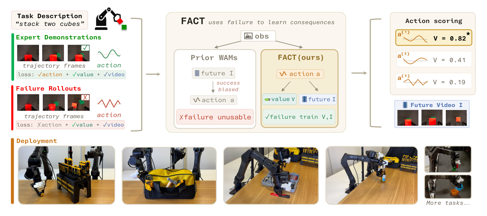
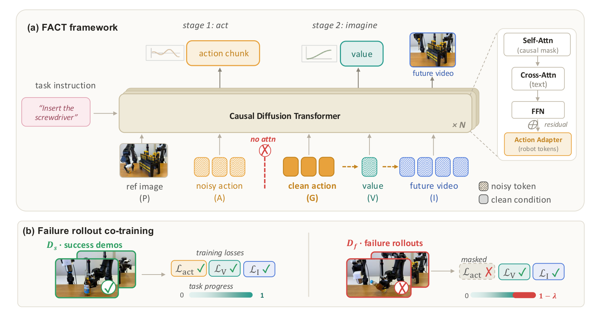
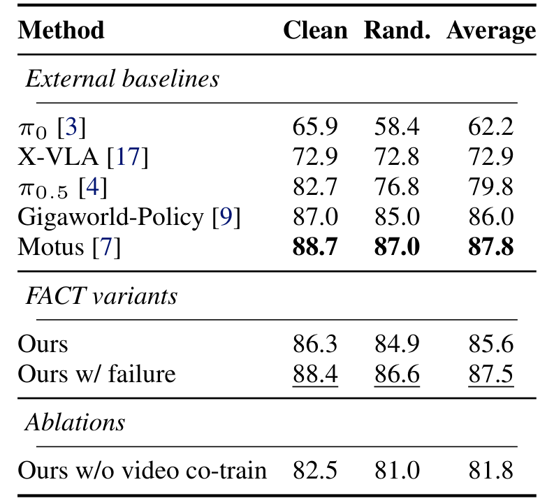
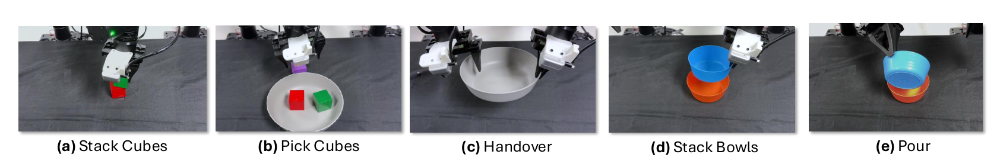
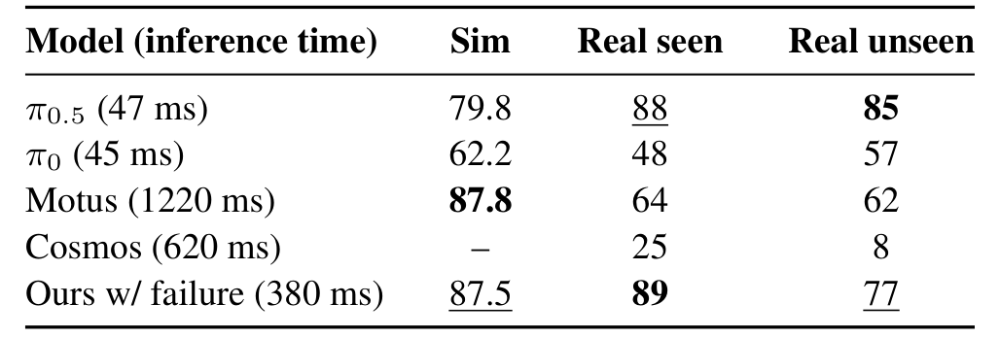

---
tags:
  - papers/robotics
  - papers/world-action-model
  - papers/failure-aware-learning
aliases:
  - FACT
  - Failure-Aware Causal Training
  - 失败感知因果训练
date: 2026-08-25
arxiv_id: 2608.10232
---

# FACT: Failure-Aware Causal Training for World-Action Models

## 核心信息
- 标题: FACT: Failure-Aware Causal Training for World-Action Models
- 标题翻译: FACT：面向世界—动作模型的失败感知因果训练
- 作者: Quanquan Peng, Yutong Liang, Rui Yan, Nicklas Hansen, Xiaolong Wang
- 机构: University of California San Diego
- 发表时间: 2026-08-10（arXiv:2608.10232v1）
- 发表渠道: arXiv，计算机视觉与机器人方向预印本
- arXiv: 2608.10232
- 论文链接: https://arxiv.org/abs/2608.10232；项目页：https://fact-wam.github.io
- 代码 / 项目: 项目页 https://fact-wam.github.io；论文未在正文中给出代码仓库
- 数据 / 资源: RoboTwin 仿真任务、真实双臂双手操作任务、成功示范与模型失败回滚
- 论文类型: AI 方法论文

## 原文摘要翻译
近期的世界—动作模型表明，将策略与未来预测联合训练，可以为动作生成提供物理先验。许多世界—动作模型建立在视频模型的未来预测能力之上：有些先生成未来视频，再用逆动力学模型恢复动作；另一些把预测视频作为动作生成的目标条件。在这两种情况下，世界模型主要在成功示范上训练，因此没有充分理由去预测坏动作的后果。我们提出 FACT，一种根据已执行动作预测未来视频和任务进度的因果世界—动作模型。这种动作条件接口允许失败回滚监督动作后果，使坏动作不再被丢弃，而能成为有效的未来目标。失败感知训练让进度预测器同时了解成功和失败的动作结果，并且在推理时可以选择用它为采样得到的动作候选打分。在仿真和真实双手操作任务上的大量实验表明，FACT 优于多种已有基线；随着失败数据加入训练，性能继续提升；在坏动作下，成功偏置的未来幻觉得到减少。

## 创新点
1. **把失败样本从“坏示范”重新定义为“后果示范”。** 失败轨迹中的动作不应被策略模仿，但动作执行后真实发生的未来视频和较低任务进度仍然是有效监督。FACT 通过屏蔽失败样本的动作模仿损失、保留价值和视频损失实现了这一区分（第 2–6 页，式 (8)–(9)）。
2. **把世界分支放在动作之后，并用干净执行动作作为条件。** 训练序列为观测前缀、噪声动作、教师强制动作、价值和未来视频；价值与未来视频只能读取干净动作槽位，而动作分支不能读取该槽位。这样，失败后果可以回传到共享骨干，同时不会把失败动作直接变成策略目标（第 4 页，图 2–3）。
3. **把失败感知进度值变成可选的候选动作筛选接口。** 经过失败后果训练后，价值头不再只在专家动作流形上校准，可以为多个动作候选估计动作条件进度。它不是额外训练的独立评论家，而是同一个因果世界分支在部署阶段的可选接口（第 5–6 页，式 (10)）。
4. **用一组诊断实验把机制收益拆开。** 论文不仅比较总成功率，还分别测量视频协同训练、因果掩码、失败动作损失、失败数据比例、坏动作未来预测和候选数量，从而把“失败数据有用”与“失败动作可直接模仿”区分开（第 6–8 页，表 1–4，图 5–8）。

## 一句话总结
FACT 的关键不是简单增加失败数据，而是先生成动作、再以该执行动作条件化预测后果，并只让失败轨迹监督世界与价值分支，从而把负经验转化为不会污染策略的训练信号。

## 研究问题
既有世界—动作模型通常从成功示范学习“合理动作—合理未来”的配对关系；当测试时动作偏离专家流形，模型仍可能生成成功偏置的未来。这使未来预测失去判断坏动作的能力，也让基于未来或价值的动作选择变得过于乐观。论文在引言中把问题表述得很清楚：挑战不是单纯收集更多数据，而是要利用未完成任务的回滚，同时不能把失败动作当作模仿目标（第 1–2 页）。

这带来三个相互关联的研究问题：

- 能否把失败回滚当作动作条件后果监督，而不是低质量示范？
- 能否在同一模型中让策略学习和世界预测共享表示，却避免失败动作损害策略？
- 如果进度值确实读到了动作后果，它能否在推理时识别并筛掉较差动作候选？

论文的回答依赖一个因果顺序：观测和语言指令先决定动作，执行动作再决定未来视频和任务进度，而不是让一个成功偏置的未来反过来暗示动作。这个顺序是全文真正的组织轴。

## 数据与任务定义
### 输入、输出与进度变量
模型接收语言指令、三路多视角彩色图像和机器人本体感知状态，并输出长度为 $H$ 的动作块；世界分支随后预测未来观测和动作条件任务进度（第 3 页，式 (1)–(2)）。

$$
o_t=(I_t^{(1)},I_t^{(2)},I_t^{(3)},s_t),\qquad a_{t:t+H}\in\mathbb{R}^{H\times d},\qquad v_t(a_{t:t+H})\in[0,1].
$$

进度首先由每一步的进度奖励累计得到：

$$
G_t=\sum_{k=1}^{t}r_k,\qquad p_t=\frac{G_t}{G_T}\in[0,1].
$$

在实验中采用均匀进度奖励，因此长度为 $T$ 的回滚中 $p_t=t/T$。这使不同长度的任务可以使用同一数值范围，但也意味着该进度值更接近时间归一化进度，而不是细粒度的物理完成度（第 3–6 页，式 (3)）。

### 成功示范与失败回滚
成功示范集合记为 $D_s$，失败回滚集合记为 $D_f$。仿真部分覆盖 50 个 RoboTwin 任务，并额外加入约 1.3K 条模型回滚失败；训练同时使用 clean 和 domain-randomized 示范，后者共 25,000 条、每个任务 500 条，前者共 2,500 条、每个任务 50 条（第 6 页；第 18 页附录表 6）。

真实实验包含五个已见双臂任务：堆叠方块、抓取方块、双臂交接、堆叠碗和倾倒；另有改变物体颜色、形状与对应指令的三个未见变体。立方体操作使用 200 条专家示范，其余已见任务使用 50 条；每个立方体任务约收集 30 条失败回滚。表 2 和表 3 中每个单元平均 20 次试验（第 6–7 页）。

真实硬件为两台 YAM 机械臂、一个主视角深度相机、两个腕部相机和 GELLO 遥操作设备；三路相机流被拼成统一视频画布，并预先计算视觉自编码器潜变量以加速训练（第 15–16 页附录）。

> [!figure]- Figure 1：动作—后果接口与失败监督
> 建议位置：数据与任务定义
> 放置原因：图 1 把成功示范、失败回滚、动作生成、未来视频和进度评分放在同一条链上，是理解数据语义的最短入口。
> 当前状态：共享目录已有对应裁剪；本次笔记引用该目录中的已存在图像，不覆盖共享视觉决策表。

*图 1（论文第 1 页）：FACT 先生成动作，再展开该动作导致的未来视频与任务进度；失败回滚因此可以直接监督自己的后果。*

### 失败进度目标
成功动作的目标是动作块结束后的进度 $p_{t+H}$。失败动作则在失败发生后减去惩罚：

$$
v_t=p_{t+H},\quad \text{成功};
$$

$$
v_t=\left[p_{t+H}-\lambda_f\mathbf{1}_{\mathrm{fail}}\right]_{0}^{1}.
$$

失败时使用上式，成功时直接使用 $p_{t+H}$；实验取 $\lambda_{\mathrm{fail}}=1$（第 5 页，式 (6)）。这个设计把失败监督拆成两部分：实际观察到的失败未来，以及与该动作相对应的较低进度目标。它没有把失败简单编码成终止标签，因此仍保留了失败前的时间进展信息。

## 方法主线
### 机制流程
1. **输入与动作生成。** 将多视角观测、语言指令和机器人状态编码为观测前缀 $P$，并在动作槽位 $A$ 中对动作块进行流匹配去噪，输出候选动作或单个执行动作。
2. **动作条件后果展开。** 训练时把真实执行动作放入干净条件槽位 $G$；价值槽位 $V$ 和未来视频槽位 $I$ 只能依据 $G$ 预测动作后果，输出动作条件进度和未来视频。
3. **成功/失败分流训练。** 对成功示范计算动作、价值和视频三项损失；对失败回滚把动作损失权重置零，但保留价值和未来视频损失，让失败样本教会模型“错误动作会导致什么”。
4. **可选候选筛选。** 推理第一阶段并行生成 $N$ 个动作候选；第二阶段把每个去噪动作放入 $G$，预测 $\hat v^{(k)}$，再选择价值最高的候选。只需要动作时可跳过第二阶段。

这条流程与图 2 的两阶段接口一致：Stage 1 负责动作，Stage 2 负责价值和未来视频。它也解释了为何失败回滚可以进入训练，而不必被伪装成成功示范（第 4–6 页，图 2；第 14 页附录算法 1–3）。

> [!figure]- Figure 2：共享因果扩散变换器
> 建议位置：方法主线 / 机制流程
> 放置原因：图 2 同时展示共享骨干、动作适配器、动作—价值—未来视频三种槽位以及失败回滚的损失掩码。
> 当前状态：共享目录已有对应裁剪；本次笔记引用该目录中的已存在图像，不覆盖共享视觉决策表。

*图 2（论文第 4 页）：共享因果扩散变换器在训练时使用干净动作条件，在推理时先得到动作再填入该条件槽位。*

### 模型结构与因果掩码
FACT 采用共享的视频扩散变换器，并在每个变换器块的前馈网络之后，为机器人动作标记加入轻量动作适配器。共享骨干使未来视频和价值损失能够影响动作生成；作者将此与把世界专家和策略专家分开的混合变换器设计区分开来（第 4 页）。

训练 标记 顺序为：

$$
z=[z_P^{\mathrm{ref}}\,\|\,z_A^{\mathrm{pred}}\,\|\,z_G^{\mathrm{gt}}\,\|\,z_V^{\mathrm{value}}\,\|\,z_I^{\mathrm{future}}].
$$

其中 $P$ 是观测前缀，$A$ 是带噪预测动作，$G$ 是教师强制的干净动作。

$V$ 是价值，$I$ 是未来视频。训练掩码让价值和视频分支读取干净动作条件，而动作分支不能读取教师动作。

推理时没有教师动作条件：第一阶段从观测前缀和动作槽位得到动作，第二阶段再把去噪动作填入条件槽位，预测价值和未来视频（第 4 页，式 (4)–(5)，图 3）。

这里的“因果”不是泛指使用 Transformer，而是明确约束了信息流：世界分支的监督条件是执行动作，策略分支不能偷看教师动作。失败轨迹因此能把视频/价值误差传入共享表示，却不会直接把错误动作推向策略分布。

### 训练目标与失败掩码
对动作、进度值和未来视频三种模态，论文统一采用流匹配去噪目标。

对干净目标、随机噪声和插值状态，模态损失写为：

$$
z_\tau^x=(1-\tau)z_0^x+\tau z_1^x,
$$

$$
\mathcal{L}_x=\mathbb{E}\left[\left\|u_\theta^x(z_\tau^x,\tau;z)-(z_1^x-z_0^x)\right\|_2^2\right],\qquad x\in\{a,v,I\}.
$$

成功示范使用：

$$
\mathcal{L}_{D_s}=w_a\mathcal{L}_a+w_v\mathcal{L}_v+w_I\mathcal{L}_I;
$$

失败回滚使用：

$$
\mathcal{L}_{D_f}=w_v\mathcal{L}_v+w_I\mathcal{L}_I.
$$

因此失败回滚不是“没有标签”，而是只缺少动作模仿标签。实验设置为 $w_a=20$、$w_v=w_I=1$，动作块长度 $H=48$，未来视频使用当前帧及 $H/4$、$H/2$、$3H/4$、$H$ 五个时间偏移（第 5–6 页，式 (7)–(9)）。

### 两阶段推理与候选评分
第一阶段运行 20 步流欧拉去噪得到动作块。若只需要动作，模型在此停止；若要预测后果或做候选筛选，就把动作放入干净条件槽位，再去噪价值和可选的未来视频。共享前缀可以使用键值缓存，保持仅动作的快路径（第 5–6 页）。

$$
[P_{\mathrm{state}},P_{\mathrm{ref}},A_{\mathrm{noisy}}]\longrightarrow\hat a_{t:t+H}.
$$

给定 $N$ 个候选时，选择规则为：

$$
a^*=\underset{k\in\{1,\ldots,N\}}{\operatorname{argmax}}\;\hat v^{(k)}
=\underset{a\in\{a^{(1)},\ldots,a^{(N)}\}}{\operatorname{argmax}}\;V_\theta(o_t,\ell,a).
$$

论文把这一接口定位为可选部署策略和失败感知后果学习的诊断，而不是独立评论家。真实实验采用 $N=4$，因为图 7 显示继续扩大候选集合时收益变小而延迟继续增加（第 5–8 页）。

## 关键结果
### 主结果与强基线
#### RoboTwin 仿真

| 方法 | Clean | Rand. | 平均 |
|---|---:|---:|---:|
| π0 | 65.9 | 58.4 | 62.2 |
| X-VLA | 72.9 | 72.8 | 72.9 |
| π0.5 | 82.7 | 76.8 | 79.8 |
| Gigaworld-Policy | 87.0 | 85.0 | 86.0 |
| Motus | **88.7** | **87.0** | **87.8** |
| FACT（Ours） | 86.3 | 84.9 | 85.6 |
| FACT + failure | **88.4** | **86.6** | **87.5** |
| FACT（无视频协同训练） | 82.5 | 81.0 | 81.8 |

表 1 的关键信息不是“FACT 全面超过所有方法”：Motus 平均 87.8% 仍略高于 FACT + failure 的 87.5%。更准确的结论是，失败感知训练把 FACT 从 85.6% 推到 87.5%，接近 Motus，同时保持更轻的动作优先部署路径；作者报告其部署速度约快 3 倍（第 6 页，表 1）。

*表 1（论文第 6 页）：RoboTwin 仿真 Clean、Rand. 与平均成功率；粗体为各列较高值。*

#### 真实已见与未见任务

| 配置 | 已见任务平均 | 未见变体平均 | 证据位置 |
|---|---:|---:|---|
| FACT（Ours） | 82% | 67% | 第 7 页，表 2–3 |
| FACT + failure | 89% | 77% | 第 7 页，表 2–3 |
| FACT + failure + scoring | **92%** | **82%** | 第 7 页，表 2–3 |
| Motus | 64% | 62% | 第 7 页，表 2–3 |
| π0.5 | 88% | **85%** | 第 7 页，表 2–3 |

已见任务中，失败感知训练带来 7 个百分点提升，候选评分再带来 3 个百分点提升。未见变体中，失败感知训练带来 10 个百分点提升，候选评分再带来 5 个百分点提升，但 π0.5 仍达到 85%。这组结果支持“失败后果监督改善当前任务与简单组合变化下的泛化”，并不支持 FACT 已超过依赖大规模机器人预训练的 π0.5。

*图 4（论文第 6 页）：真实实验的五个已见双臂任务概览。*

### 消融到底说明了什么

| 变体 | 已见任务平均成功率 | 对照的机制含义 |
|---|---:|---|
| FACT | 82% | 完整方法 |
| FACT + scoring（无失败后果训练） | 79% | 评分本身不能替代失败校准 |
| 无因果掩码 | 77% | 干净动作条件与信息隔离重要 |
| 失败动作也计算动作损失 | 63% | 失败动作应教后果，不应教模仿 |
| 无视频协同训练 | 58% | 未来预测对动作生成有正则作用 |

这些消融形成一条相对完整的因果链：

- **未来视频是策略正则，而非只用于展示。** RoboTwin 中去掉视频协同训练使平均成功率从 85.6% 降至 81.8%；真实已见任务从 82% 降至 58%（第 7 页）。
- **教师强制动作条件确实有独立作用。** 去掉因果掩码、让动作、价值和视频共同去噪，真实已见任务从 82% 降至 77%（第 7 页）。
- **失败动作不能作为普通模仿数据。** 保留失败动作损失时成功率降到 63%，这比仅去掉视频协同训练的 58% 高，但仍显著低于完整 FACT；说明失败样本的监督角色需要按分支拆开。
- **评分必须建立在失败后果上。** Ours + scoring 只有 79%，低于 Ours 82%；failure-aware + scoring 才达到 92%。价值头若只在专家流形上训练，评分并不自动可靠。

### 失败未来预测与数据规模
表 4 在 512 个留出样本上把成功示范窗口与失败回滚窗口均分。失败回滚的 PSNR 从 19.51 提升到 25.92，SSIM 从 0.7461 提升到 0.8290；成功回滚 PSNR 几乎不变（26.12 到 26.08），SSIM 也只从 0.8285 到 0.8286。这个模式比单看平均 PSNR 更有说服力：失败数据主要修补坏动作区域的成功偏置，并未以牺牲正常未来预测为代价（第 7 页，表 4；第 19 页附录表 8）。

*表 7（论文第 19 页）：成功率与 RTX PRO 6000 推理时间；图中同时给出延迟证据。*

在失败数据规模实验中，三项 RoboTwin clean task 的失败比例 $p$ 从 0%、50% 增到 100%，平均成功率从 32.7% 单调增至 57.3%；$p=100\%$ 时失败数据约占全部训练集的 45%（第 8 页，图 6）。这说明在论文测试区间内收益尚未早早饱和，但不能把单调曲线外推到更高比例或不同失败分布。

候选评分的代价也很明确：从 $N=1$ 增至 $N=4$，长时程抓取任务完成率明显上升；继续增大候选数，收益相对变小而延迟继续增加，因此真实实验选择 $N=4$（第 8 页，图 7）。附录表 7 给出 RTX PRO 6000 上的延迟量级。

π0.5 约 47 毫秒，π0 45 毫秒，Motus 1220 毫秒，Cosmos 620 毫秒，失败感知 FACT 约 380 毫秒。

FACT 不是最快的视觉语言动作模型，但比需要视频优先推理的 Motus 轻得多。

## 深度分析
### 真正贡献是什么
真正贡献是**训练信号的重新分工**，而不是“在 WAN2.2-5B 上再加一个价值头”。论文把一个失败回滚拆成两种语义：动作本身不能作为正确行为，但动作导致的未来和进度是可观察的因果后果。然后通过 $G$ 槽位、因果注意力和失败动作损失掩码，把这两种语义分别送进策略分支和世界分支。

这个贡献有三个工程上重要的后果：

1. 失败数据不必被丢弃，也不必被重新标注成“应该这样做”；它只需要包含观测、动作、未来和失败状态。
2. 未来预测不再只覆盖专家动作流形，因此价值头在坏动作候选上有机会得到校准。
3. 共享骨干让视频和价值误差真正影响动作表示；如果世界分支是完全隔离的专家，失败后果可能只改善预测而不改善策略。

因此，应把 FACT 看作一种“动作条件世界模型训练协议”，而不只是一个新网络模块。其最可迁移的抽象是：**对负经验保留结果监督，对错误决策屏蔽行为监督。**

关于失败数据能否稳定外推，原文的实验段落没有列出失败类型分布、失败起点标注一致性、失败收集成本和多随机种子方差；这一判断依据来自第 6–9 页的实验与限制描述。它的影响是：当前证据能支持机制在给定任务协议下有效，但不能判断收益对失败分布、标注噪声和随机初始化是否稳健。

### 为什么结果成立
结果模式与机制高度对应。无视频协同训练的显著下降说明未来预测目标向动作表示提供了比单纯动作回归更丰富的时序约束；因果掩码消融下降说明这种未来目标必须条件化于执行动作，而不能让预测动作和教师动作之间的信息流混在一起；失败动作损失消融下降说明失败轨迹的价值不在于复制动作，而在于覆盖动作后果。

未来预测指标进一步排除了一个较弱解释：失败感知模型并非只是整体更强，而是只在 failure-rollout 子集显著改善，success-rollout 子集基本不变。也就是说，失败数据的主要作用是降低坏动作下的成功幻觉，而不是普遍增加视频清晰度（第 7 页，表 4；第 8 页，图 5）。

候选评分结果也很有诊断性。没有失败后果训练时，评分把已见任务从 82% 降到 79%；有失败后果训练后，再从 89% 提到 92%。因此价值头的作用不是“多采样总会更好”，而是取决于其是否学过候选动作可能造成的失败区域。图 8 的值轨迹在抓取失败处下降、重新抓取后恢复；附录图 13 的 3×3 放置网格则把中心成功位置赋予最高值，其他失败位置获得较低甚至负值（第 8 页；第 19 页）。

### 容易误读的地方
- **不要说 FACT 在仿真上超过 Motus。** FACT + failure 的平均成功率是 87.5%，Motus 是 87.8%；更稳妥的说法是性能接近，同时延迟更低。
- **不要把 92% 归因于失败训练单独完成。** 92% 是失败感知训练加候选评分；失败感知但不评分是 89%。
- **不要把未见任务理解成强分布外泛化。** 论文改变的是颜色、形状和指令，技能与任务家族仍然相近。
- **不要把进度值当作通用强化学习价值函数。** 这里的目标由归一化进度和失败惩罚构造，且论文采用了均匀进度奖励；它是动作条件任务进度估计，不是经过长期回报校准的通用评论家。
- **不要把失败回滚当作自动高质量数据。** 原文对失败类型、失败起点标注噪声、回滚采样偏差及失败/成功数据精确配比的统计仍不完整。

### 复现注意点
1. **先复现监督掩码，再复现模型规模。** 单元测试应确认成功批次同时计算动作、价值和视频三项损失，失败批次严格跳过动作损失；还要确认信息流满足教师动作条件的方向约束。

$$
\mathcal{L}_{D_s}=w_a\mathcal{L}_a+w_v\mathcal{L}_v+w_I\mathcal{L}_I,\qquad \mathcal{L}_{D_f}=w_v\mathcal{L}_v+w_I\mathcal{L}_I.
$$
2. **严格保持训练—推理接口不对称。** 训练有真实 $G$，推理没有；第二阶段必须使用第一阶段去噪后的动作填充 $G$，不能把 带噪的动作标记 直接拿来预测价值。
3. **未来帧采样会改变结果含义。** 论文使用当前帧和四个相对动作块偏移，并采用 20 步去噪；改变视频目标或去噪步数后，不能直接比较表 4 的 PSNR/SSIM。
4. **复现主结果需要同一示范协议。** 真实基线也在相同成功示范上微调，但 π0.5 还依赖大规模预训练；报告时应同时说明预训练资源和微调数据。
5. **部署要分开报告动作-only 与评分模式。** 动作-only 可以跳过世界预测；候选评分需要对每个候选增加价值 pass，且未来视频可视化还会进一步增加成本。
6. **统计报告仍不充分。** 原文给出成功率均值和每格 20 次试验，但没有置信区间或随机种子方差；复现版本应补充这些不确定性。

## 局限
### 论文明确承认的限制
作者指出，当前因果训练顺序还可以扩展到更广泛的机器人和人类交互数据，以提升未来预测的物理合理性和价值头的判别能力；价值头也可以被更强的进度估计器替换或增强。部署上的主要限制是 best-of-$N$ 选择需要为每个候选增加评分计算，延迟与可靠性存在直接折中；若延迟敏感，可以只运行动作模式（第 9 页）。

### 基于证据的额外边界
- **任务覆盖有限。** 50 个仿真任务和五个已见真实双臂任务足以验证机制，但不足以证明对不同机械臂、相机、动作空间和交互对象的普适性。
- **失败数据过程未充分量化。** 论文给出约 1.3K 条仿真失败和每个立方体任务约 30 条真实失败，但没有系统报告回滚预算、失败类型分布、失败 onset 标注成本和数据去重策略。
- **价值目标较简单。** 统一进度奖励让 $p_t=t/T$ 易于复现，却可能把时间进展和真实任务完成度混在一起；复杂接触任务未必适合这一标量目标。
- **公平比较存在资源差异。** 论文说明所有真实基线使用相同成功示范微调，但 π0.5 等方法受益于大规模机器人预训练，FACT 的优势更像当前微调协议下的效率—性能折中，而非完全同资源竞赛。
- **统计不确定性缺失。** 20 次试验的均值不足以判断小幅差异是否稳健；没有多种子和置信区间时，尤其应谨慎解读 2–5 个百分点的提升。

## 我的笔记
### 对世界模型研究的启发
很多世界模型训练默认“可预测的未来”就是“应该发生的未来”。FACT 提醒我们，未来预测的监督语义取决于它所条件化的动作：同一个当前观测可以对应多个候选动作和不同后果，成功示范只覆盖其中一小块。把失败回滚纳入条件模型，才能让世界模型在错误动作区域也有真实目标。

### 对机器人策略训练的启发
失败数据最有价值的部分不一定是失败动作的形状，而是动作与后果之间的配对。这个原则可以迁移到 DAgger 式纠正、在线回滚和从负经验强化学习：错误动作仍然保留为条件变量，策略损失则由专家纠正或成功动作提供。FACT 的 $G$ 槽位是一个可复用的接口设计。

### 我会优先做的后续实验
1. 固定总数据预算，对比“更多成功示范”和“更多失败回滚”两种扩充方式，画出成功率、坏动作 PSNR 和价值校准误差曲线。
2. 把均匀进度奖励替换为稀疏终止奖励、接触事件奖励和阶段性任务奖励，检查失败惩罚 $\lambda_{\mathrm{fail}}$ 是否需要随任务阶段变化。
3. 在保持动作-only 延迟不变的情况下，使用轻量价值头或低步数价值去噪，测量候选评分收益与额外延迟的 Pareto 前沿。
4. 做跨硬件与跨视角迁移实验，分别冻结 WAN 骨干、只训练 动作适配器，以及联合微调，量化共享视频骨干的迁移成本。
5. 为失败候选做校准评估：比较预测进度、真实后续完成率与失败 onset，避免把“值低”误认为“真的不可恢复”。

### 复现结论
如果只保留一个最小复现版本，应先实现成功/失败双数据流、动作—条件标记排列、动作损失掩码和两阶段推理；视频质量、候选数量和共享骨干规模可以后置。若这四处没有复现，单纯把失败样本拼进数据集不能复现论文声称的失败感知效果。

$$
[P,A,G,V,I].
$$

## 引用
1. Peng, Q., Liang, Y., Yan, R., Hansen, N., and Wang, X. “FACT: Failure-Aware Causal Training for World-Action Models.” arXiv:2608.10232, 2026.
2. Black, K. et al. “π0: A Vision-Language-Action Flow Model for General Robot Control.” arXiv:2410.24164, 2024.
3. Physical Intelligence et al. “π0.5: A Vision-Language-Action Model with Open-World Generalization.” arXiv:2504.16054, 2025.
4. Bi, H. et al. “Motus: A Unified Latent Action World Model.” arXiv:2512.13030, 2025.
5. Li, L. et al. “Causal World Modeling for Robot Control.” arXiv:2601.21998, 2026.
6. Lipman, Y. et al. “Flow Matching for Generative Modeling.” arXiv:2210.02747, 2022.
7. Wan, T. et al. “Wan: Open and Advanced Large-Scale Video Generative Models.” arXiv:2503.20314, 2025.
8. Qi, H. et al. “Inference-Time Enhancement of Generative Robot Policies via Predictive World Modeling.” IEEE Robotics and Automation Letters, 2026.
9. Grollman, D. H. and Billard, A. G. “Robot Learning from Failed Demonstrations.” International Journal of Social Robotics, 2012.
10. Chen, T. et al. “RoboTwin 2.0: A Scalable Data Generator and Benchmark with Strong Domain Randomization for Robust Bimanual Robotic Manipulation.” arXiv:2506.18088, 2025.
