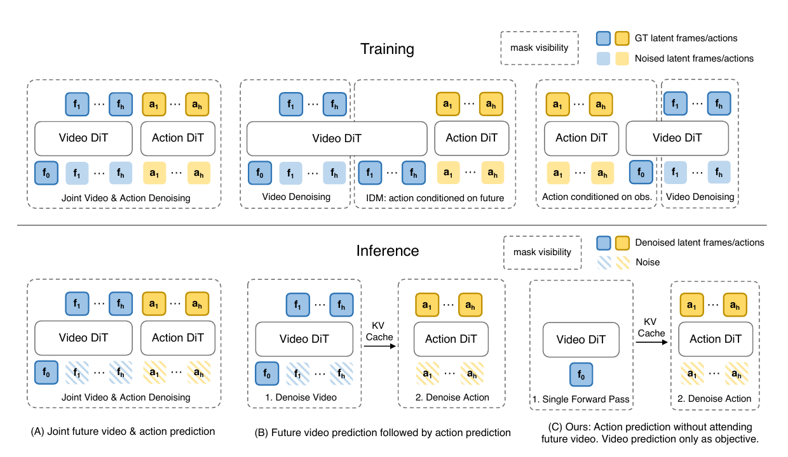
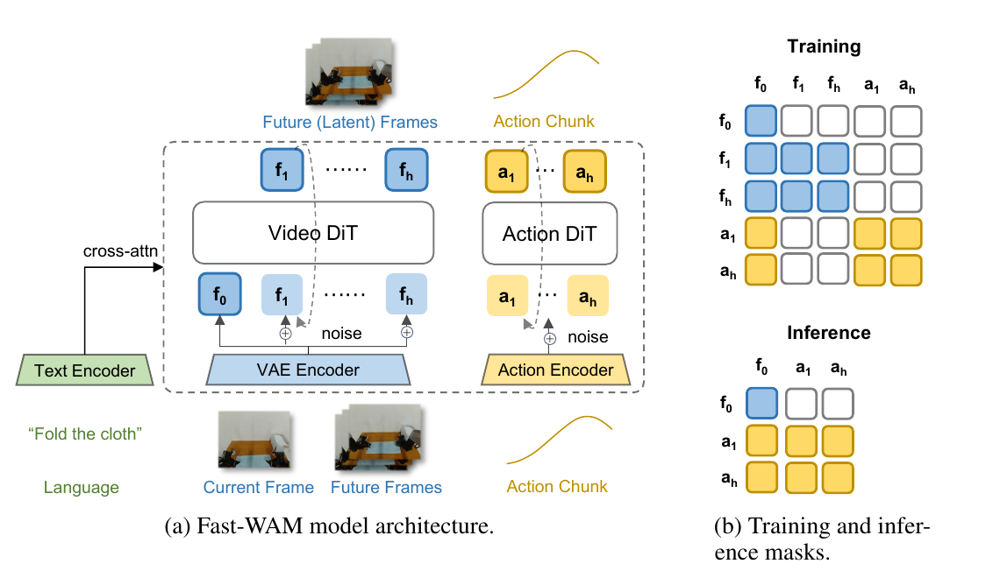
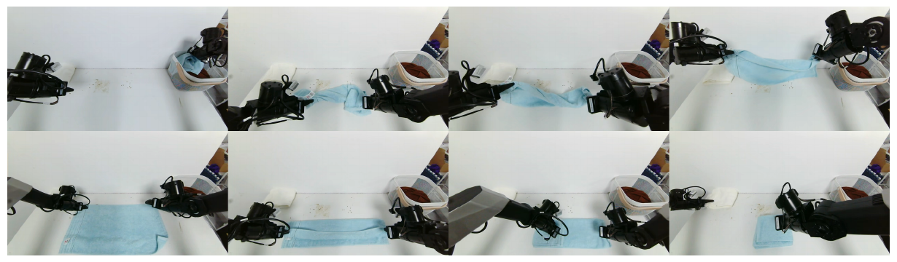
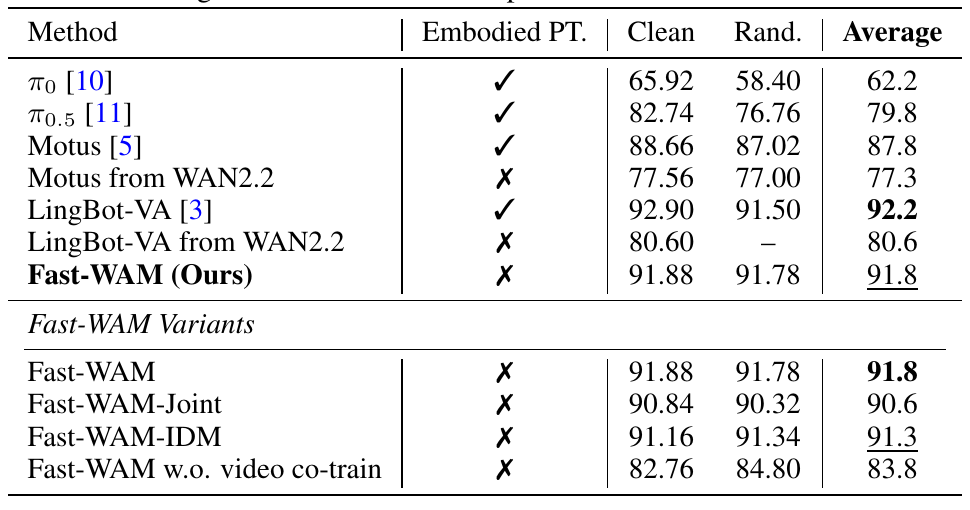
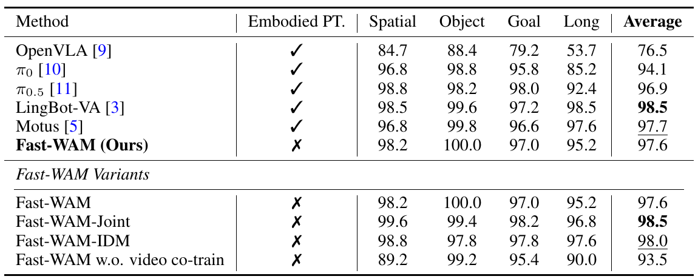
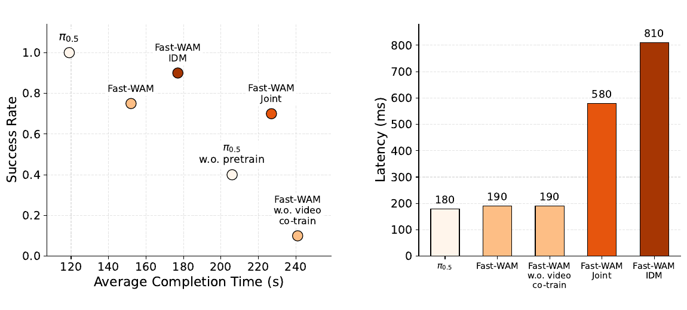
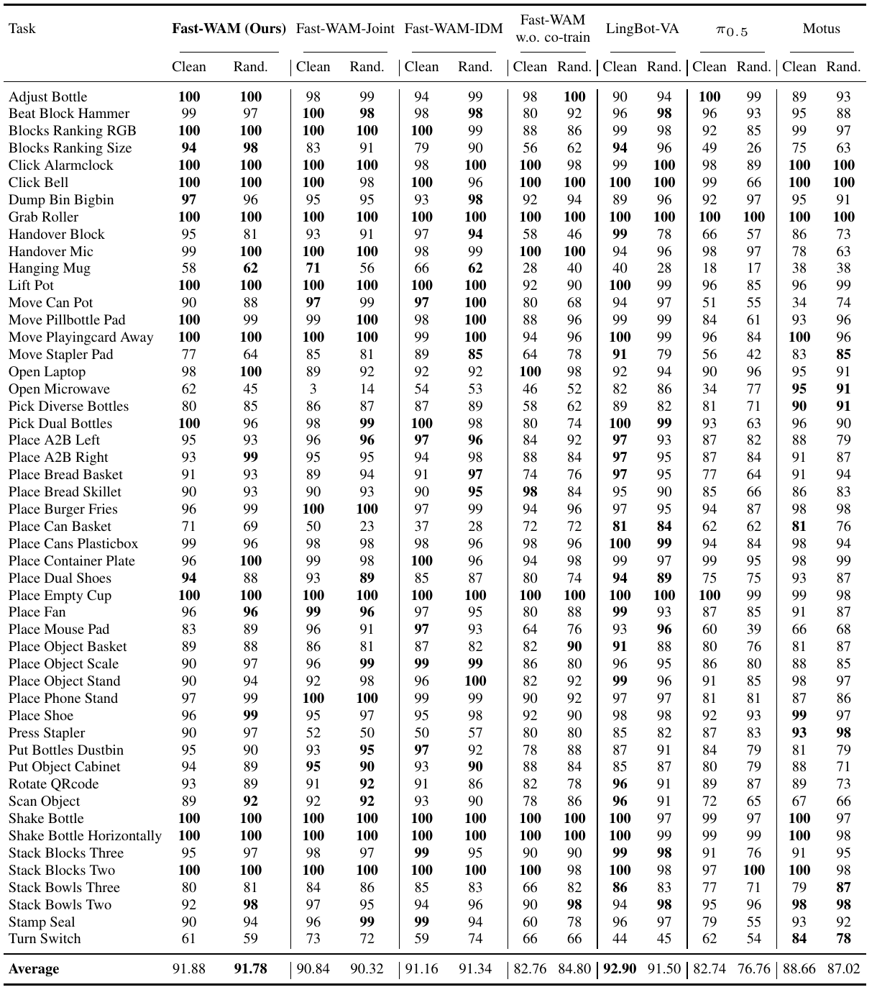

# Fast-WAM: Do World Action Models Need Test-time Future Imagination?

**Authors:** Tianyuan Yuan, Zibin Dong, Yicheng Liu, Hang Zhao  
**Affiliations:** IIIS, Tsinghua University; Galaxea AI  
**Source:** `/Users/roywangj/journey_wj/research/papers4zotero/zotero1/storage/DPU4SKTI/Yuan 等 - 2026 - Fast-WAM Do World Action Models Need Test-time Future Imagination.pdf`  
**Version:** arXiv:2603.16666v2, 23 March 2026  
**Detected source format:** selectable-text PDF (`pdf-text`)  
**Reader type:** complete full-paper Chinese-English Markdown reader. Figure/table links reuse read-only assets from the main checkout because strict one-file mode forbids copying assets into this worktree.

## Page / Section Index

| PDF pages | Section |
|---|---|
| 1 | Abstract; Introduction begins |
| 2-3 | Introduction; Related Work; Method begins |
| 3-5 | Problem Formulation; Model Architecture; Training Objective |
| 5-6 | Controlled Variants; Implementation Details; Experiment Setup |
| 7-9 | Simulation and real-world results; Conclusion |
| 10-12 | References |
| 12-13 | Appendix A: RoboTwin Detailed Results |

## Terminology Ledger

| Canonical term | 中文 | 本文中的含义 |
|---|---|---|
| World Action Model (WAM) | 世界动作模型 | 通过未来视觉建模辅助机器人动作预测的模型 |
| Vision-Language-Action (VLA) policy | 视觉-语言-动作策略 | 直接由视觉和语言条件预测机器人动作的策略 |
| imagine-then-execute | 先想象、后执行 | 推理时先生成未来视觉，再据此预测动作 |
| test-time future imagination | 测试时未来想象 | 部署时显式生成未来观测的过程 |
| video co-training | 视频协同训练 | 训练时将未来视频预测作为动作学习的辅助目标 |
| embodied pretraining | 具身预训练 | 使用额外机器人交互或示范数据进行的策略预训练 |
| latent world representation | 潜在世界表征 | 视频骨干网络从当前视觉与语言中编码出的隐空间特征 |
| Diffusion Transformer (DiT) | 扩散 Transformer | 用于视频或动作流匹配/去噪的 Transformer |
| Mixture-of-Transformer (MoT) | Transformer 混合架构 | 视频 DiT 与动作专家 DiT 通过共享注意力协作的架构 |
| inverse dynamics model (IDM) | 逆动力学模型 | 依据观测变化反推动作的模型 |
| flow matching | 流匹配 | 学习从噪声分布到数据分布速度场的生成目标 |

## Abstract

> <strong>Para. 1:</strong> World Action Models (WAMs) have emerged as a promising alternative to Vision-Language-Action (VLA) models for embodied control because they explicitly model how visual observations may evolve under action. Most existing WAMs follow an imagine-then-execute paradigm, incurring substantial test-time latency from iterative video denoising, yet it remains unclear whether explicit future imagination is actually necessary for strong action performance.

> <strong>Para. 1[CN]:</strong> 世界动作模型（WAM）正在成为具身控制中视觉-语言-动作（VLA）模型的一种有前景的替代方案，因为它们显式建模视觉观测会如何随动作发生变化。多数现有 WAM 采用“先想象、后执行”范式，迭代式视频去噪带来了显著的测试时延迟；然而，要获得强大的动作性能，是否真的必须显式想象未来，仍不明确。

> <strong>Para. 2:</strong> In this paper, we ask whether WAMs need explicit future imagination at test time, or whether their benefit comes primarily from video modeling during training. We disentangle the role of video modeling during training from explicit future generation during inference by proposing Fast-WAM, a WAM architecture that retains video co-training during training but skips future prediction at test time. We further instantiate several Fast-WAM variants to enable a controlled comparison of these two factors. Across these variants, we find that Fast-WAM remains competitive with imagine-then-execute variants, while removing video co-training causes a much larger performance drop. Empirically, Fast-WAM achieves competitive results with state-of-the-art methods both on simulation benchmarks (LIBERO and RoboTwin) and real-world tasks, without embodied pretraining. It runs in real time with 190 ms latency, over $4\times$ faster than existing imagine-then-execute WAMs. These results suggest that the main value of video prediction in WAMs may lie in improving world representations during training rather than generating future observations at test time.

> <strong>Para. 2[CN]:</strong> 本文追问：WAM 是否需要在测试时显式想象未来，抑或其收益主要来自训练阶段的视频建模？作者提出 Fast-WAM，将训练阶段视频建模的作用与推理阶段显式生成未来的作用解耦：训练时保留视频协同训练，测试时跳过未来预测。作者还实现了若干受控变体，以比较这两个因素。实验发现，Fast-WAM 与“先想象、后执行”变体保持竞争力，而移除视频协同训练会造成更大的性能下降。即使没有具身预训练，Fast-WAM 在 LIBERO、RoboTwin 和真实机器人任务上仍达到具有竞争力的结果；其延迟为 190 ms，相比现有“先想象、后执行”WAM 快逾 $4\times$。这表明，WAM 中视频预测的主要价值可能是训练时改善世界表征，而不是测试时生成未来观测。

## 1. Introduction

> <strong>Para. 1:</strong> Building general-purpose embodied agents requires policies that can not only map visual observations to actions, but also reason about how the physical world evolves under interaction. This has motivated growing interest in World Action Models (WAMs), which combine future visual prediction and action modeling in a unified framework. Compared with standard Vision-Language-Action (VLA) models, WAMs are appealing because modeling future observations may help capture physical dynamics and task-relevant temporal structure.

> <strong>Para. 1[CN]:</strong> 构建通用具身智能体，要求策略不仅能把视觉观测映射为动作，还能推理物理世界在交互下如何演化。这推动了人们对世界动作模型（WAM）的关注：它在统一框架中结合未来视觉预测与动作建模。相比标准 VLA，WAM 的吸引力在于，建模未来观测或许能捕获物理动力学以及与任务相关的时间结构。

> <strong>Para. 2:</strong> Most existing WAMs follow an imagine-then-execute paradigm: they first generate future observations, then predict actions conditioned on the imagined future. While intuitive, this design incurs substantial test-time latency due to iterative video denoising [1-5]. More fundamentally, it remains unclear whether explicit future imagination is actually necessary for strong action performance. The effectiveness of WAMs may stem from two distinct sources: (1) the video prediction objective during training, which may help the model acquire stronger physical priors and action-conditioned representations, and (2) explicit future generation during inference, which may provide additional foresight for action prediction. Existing WAM systems typically entangle these two factors, making it difficult to determine which one is actually responsible for the observed gains.

> <strong>Para. 2[CN]:</strong> 多数现有 WAM 采用“先想象、后执行”范式：先生成未来观测，再以想象出的未来为条件预测动作。这一设计虽然直观，却因迭代视频去噪产生显著的测试时延迟 [1-5]。更根本的问题是，强动作性能是否确实需要显式未来想象。WAM 的有效性可能来自两个不同来源：（1）训练时的视频预测目标，它可能让模型获得更强的物理先验和动作条件表征；（2）推理时显式生成未来，它可能为动作预测提供额外前瞻。现有系统通常把两者纠缠在一起，因而难以判断收益究竟源自何者。

### Figure 1. Three representative WAM paradigms / 三类代表性 WAM 范式

**Caption:** Three representative WAM paradigms. (A) Joint-modeling WAMs denoise future video and action tokens together. (B) Causal WAMs first generate future observations and then condition action prediction on the generated future representation. (C) Fast-WAM retains video co-training during training but removes explicit future generation at inference time, directly predicting actions from latent world representations in a single forward pass.

**Caption[CN]:** 三类代表性 WAM 范式。（A）联合建模 WAM 同时去噪未来视频与动作 token。（B）因果 WAM 先生成未来观测，再以所生成的未来表征为条件预测动作。（C）Fast-WAM 在训练阶段保留视频协同训练，但在推理阶段移除显式未来生成，通过一次前向传播直接从潜在世界表征预测动作。

> <strong>Para. 3:</strong> In this paper, we revisit this design choice and ask a simple question: do WAMs need to imagine future observations at test time, or do they benefit primarily from learning to model them during training? Our key idea is to decouple the video prediction objective used in WAM training from explicit future generation at inference time. If the main value of world modeling lies in shaping better latent representations during training, then a WAM should be able to retain this benefit without paying the test-time cost of future video synthesis.

> <strong>Para. 3[CN]:</strong> 本文重新审视这一设计选择，并提出一个简单问题：WAM 是否必须在测试时想象未来观测，还是它的主要收益其实来自训练时学习如何建模未来？核心思路是把 WAM 训练所用的视频预测目标与推理时显式生成未来解耦。如果世界建模的主要价值在于训练阶段塑造更好的潜在表征，那么 WAM 应当能够保留这种收益，而不必承担测试时合成未来视频的成本。

> <strong>Para. 4:</strong> Based on this perspective, we propose Fast-WAM, a WAM architecture that preserves video co-training during training but skips future prediction at test time. Instead of using a pretrained video generation model to iteratively synthesize future frames during inference, Fast-WAM repurposes a pretrained video Diffusion Transformer (DiT) as a single-pass world encoder for action generation. Concretely, we build Fast-WAM with a Mixture-of-Transformer (MoT) architecture with shared attention, consisting of a video DiT and an action expert DiT, as illustrated in Figure 1(C). During training, the video prediction objective shapes the video DiT to encode physically meaningful motion and interaction structure. During inference, the video DiT processes the observation context in a single forward pass and provides latent world representations for action denoising, avoiding explicit future video denoising and enabling efficient real-time control.

> <strong>Para. 4[CN]:</strong> 基于这一观点，作者提出 Fast-WAM：训练时保留视频协同训练，测试时跳过未来预测。Fast-WAM 不再在推理过程中用预训练视频生成模型迭代合成未来帧，而是把预训练视频扩散 Transformer（DiT）改作单次前向的世界编码器，为动作生成提供表征。具体来说，模型采用带共享注意力的 Transformer 混合架构（MoT），由视频 DiT 和动作专家 DiT 组成，如图 1(C) 所示。训练时，视频预测目标促使视频 DiT 编码具有物理意义的运动与交互结构；推理时，视频 DiT 一次处理观测上下文，为动作去噪提供潜在世界表征，从而避免显式未来视频去噪并实现高效实时控制。

> <strong>Para. 5:</strong> To study our central question in a controlled way, we instantiate Fast-WAM into variants that mirror representative imagine-then-execute WAM designs. For simplicity, we focus on single action chunk generation and omit the outer auto-regressive loop. Existing WAMs can be broadly grouped into two representative paradigms: (A) future videos and actions are jointly denoised with shared attention [4-6]; and (B) actions are predicted after, and conditioned on, generated future videos [3, 7, 8]. We also implement a no-video-co-training variant, which serves as a direct control for the role of the training objective itself. Together, these comparisons isolate the contribution of test-time future imagination from that of video co-training during training.

> <strong>Para. 5[CN]:</strong> 为受控研究核心问题，作者实现了与代表性“先想象、后执行”设计相对应的 Fast-WAM 变体。为简化比较，实验聚焦单个动作块生成，省略外层自回归循环。现有 WAM 可大致分为：（A）通过共享注意力联合去噪未来视频和动作 [4-6]；（B）先生成未来视频，再以它为条件预测动作 [3, 7, 8]。作者还实现了一个不含视频协同训练的版本，直接控制训练目标本身的作用。这样便能分离测试时未来想象与训练时视频协同训练各自的贡献。

> <strong>Para. 6:</strong> Experiments on simulation benchmarks (LIBERO and RoboTwin) show that Fast-WAM achieves strong results without any embodied pretraining, demonstrating strong data efficiency. On real-world robotic tasks, Fast-WAM remains highly effective while running at only 190 ms latency, making it more than $4\times$ faster than existing imagine-then-execute WAM approaches. More importantly, controlled comparisons show that Fast-WAM stays close to imagine-then-execute variants, while removing the video co-training objective causes a much larger performance drop. These results suggest that the main value of video prediction in WAMs may lie in improving world representations during training rather than explicitly generating future observations at test time.

> <strong>Para. 6[CN]:</strong> LIBERO 和 RoboTwin 实验表明，Fast-WAM 在没有任何具身预训练的情况下仍取得强结果，体现了良好的数据效率。在真实机器人任务上，它以 190 ms 延迟保持较强性能，相比现有“先想象、后执行”WAM 快逾 $4\times$。更重要的是，Fast-WAM 与需要未来想象的变体表现接近，而移除视频协同训练目标造成的下降更大。因此，视频预测在 WAM 中的主要价值可能在于训练时改善世界表征，而非测试时显式生成未来观测。

> <strong>Para. 7:</strong> Our contributions are three-fold:
>
> - We identify and study a basic question in WAMs: whether their gains come primarily from video modeling during training or from explicit future imagination during inference.
> - We propose Fast-WAM, a WAM architecture that retains video co-training during training while eliminating future prediction at test time, enabling real-time inference.
> - Through controlled comparisons on simulation and real-world benchmarks, including variants with and without video co-training, we show that much of the benefit of WAMs comes from the video co-training objective itself, while explicit future generation at inference time appears to be less critical than previously assumed.

> <strong>Para. 7[CN]:</strong> 本文贡献有三点：
>
> - 我们提出并研究 WAM 中的一个基本问题：其收益主要来自训练期间的视频建模，还是来自推理期间的显式未来想象。
> - 我们提出 Fast-WAM，这是一种在训练期间保留视频协同训练、同时消除测试时未来预测的 WAM 架构，从而实现实时推理。
> - 我们在仿真与真实世界基准上开展受控比较，包括有无视频协同训练的变体；结果表明，WAM 的大部分收益来自视频协同训练目标本身，而推理时的显式未来生成似乎没有此前设想的那么关键。

## 2. Related Work

> <strong>Para. 1:</strong> **Vision-Language-Action Policies.** Recent progress in embodied foundation models has been driven by Vision-Language-Action (VLA) policies, which directly map visual observations and language instructions to robot actions using large pretrained vision-language backbones [9-19]. By inheriting strong semantic priors from web-scale pretraining, these models have shown strong generalization across objects, scenes, and language instructions. However, standard VLA pretraining is largely based on static image-text data and does not explicitly model how the physical world evolves under action [3, 4]. Fast-WAM preserves a direct-policy interface at test time, similar to VLAs, but learns it under an additional world-modeling objective based on future visual prediction.

> <strong>Para. 1[CN]:</strong> **视觉-语言-动作策略。** 近年来，具身基础模型的进展主要由 VLA 策略推动；这类模型利用大型预训练视觉语言骨干，将视觉观测和语言指令直接映射为机器人动作 [9-19]。由于继承了网络规模预训练中的强语义先验，它们在物体、场景和语言指令变化下表现出较强泛化。然而，标准 VLA 预训练主要基于静态图文数据，并不显式建模物理世界如何在动作作用下演化 [3, 4]。Fast-WAM 在测试时保留与 VLA 相似的直接策略接口，但训练时额外使用基于未来视觉预测的世界建模目标。

> <strong>Para. 2:</strong> **World Action Models and Video-based Robot Policies.** A parallel line of work studies robot control through future visual prediction, using video generation to model environment dynamics and infer actions [8, 20-31]. Recent methods further scale this idea by jointly modeling future video and robot actions in a unified framework [1-6, 32, 33]. Following [4], these models are called World Action Models because they leverage world modeling—predicting future visual states—to support downstream action prediction. Most existing WAMs either generate future visual trajectories before predicting actions, or jointly model future video and actions within a shared generative process. Rather than proposing another imagine-then-execute WAM, this work studies whether WAM gains come primarily from video co-training or explicit future imagination.

> <strong>Para. 2[CN]:</strong> **世界动作模型与基于视频的机器人策略。** 另一条研究路线通过未来视觉预测来控制机器人，用视频生成建模环境动力学并推断动作 [8, 20-31]。近期方法进一步在统一框架中联合建模未来视频与机器人动作 [1-6, 32, 33]。沿用文献 [4] 的称呼，这些模型被称为 WAM，因为它们通过预测未来视觉状态进行世界建模，以支持下游动作预测。多数 WAM 要么先生成未来视觉轨迹再预测动作，要么在共享生成过程中联合建模未来视频与动作。本文不是再提出一个“先想象、后执行”WAM，而是研究收益主要来自视频协同训练还是显式未来想象。

> <strong>Para. 3:</strong> This work is also related to efforts that exploit video modeling for action prediction while reducing or bypassing explicit test-time video synthesis. VPP [34] conditions robot policies on predictive visual representations extracted from a video diffusion model, while UVA [35] jointly models video and action and skips video decoding at test time for faster inference. In contrast, Fast-WAM focuses on disentangling training-time video co-training and test-time future imagination through controlled variants under one shared framework.

> <strong>Para. 3[CN]:</strong> 本文也与利用视频建模进行动作预测、同时减少或绕过测试时显式视频合成的工作相关。VPP [34] 以从视频扩散模型提取的预测性视觉表征作为机器人策略条件；UVA [35] 联合建模视频与动作，并在测试时跳过视频解码以加速推理。与它们不同，Fast-WAM 的重点是在同一共享框架下通过受控变体，解耦训练时视频协同训练与测试时未来想象的相对作用。

## 3. Method

### 3.1 Problem Formulation

> <strong>Para. 1:</strong> We consider embodied policy learning from visual observations and language instructions. Let $o$ denote the current observation, $l$ the task instruction, and $a_{1:H}$ an action chunk of horizon $H$. A standard visuomotor policy models the conditional distribution below, which directly maps current perceptual context to a sequence of actions.

$$
p(a_{1:H}\mid o,l).
\tag{1}
$$

> <strong>Para. 1[CN]:</strong> 本文考虑从视觉观测和语言指令学习具身策略。令 $o$ 表示当前观测，$l$ 表示任务指令，$a_{1:H}$ 表示长度为 $H$ 的动作块。标准视觉运动策略对上式条件分布建模，直接将当前感知上下文映射为动作序列。

> <strong>Para. 2:</strong> WAMs augment this formulation by introducing future visual observations as an intermediate variable. Let $v_{1:T}$ denote future visual observations over horizon $T$. Many existing WAMs follow an imagine-then-execute factorization:

$$
p(a_{1:H}\mid o,l)=\int p(v_{1:T}\mid o,l)\,p(a_{1:H}\mid o,l,v_{1:T})\,dv_{1:T}.
\tag{2}
$$

> <strong>Para. 2[CN]:</strong> WAM 通过引入未来视觉观测这一中间变量扩展上述形式。令 $v_{1:T}$ 表示预测跨度 $T$ 内的未来视觉观测。许多现有 WAM 遵循上式的“先想象、后执行”分解：先从当前观测和语言采样未来视觉，再在该未来视觉条件下生成动作。

> <strong>Para. 3:</strong> In practice, Equation (2) is implemented either by jointly denoising future video and actions within a shared model, or by first generating future video and then feeding it to an inverse-dynamics or action-prediction module. Some WAMs further wrap this formulation in an outer auto-regressive rollout, which is omitted here for simplicity and controlled comparison.

> <strong>Para. 3[CN]:</strong> 实践中，式（2）通常有两种实现：在共享模型中联合去噪未来视频和动作；或先生成未来视频，再输入逆动力学/动作预测模块。有些 WAM 还在外层加入自回归滚动，本文为简化并保证受控比较而省略该循环。

> <strong>Para. 4:</strong> WAM effectiveness may arise from two factors: the training-time video prediction objective, which encourages physically meaningful latent representations, and explicit future generation during inference, which may provide foresight. Existing formulations usually couple both because the same model learns future video prediction and synthesizes future observations at test time. Fast-WAM decouples them: world modeling remains a co-training signal, but inference predicts actions directly from current observation and instruction.

$$
p_\theta(a_{1:H}\mid o,l).
\tag{3}
$$

> <strong>Para. 4[CN]:</strong> WAM 的有效性可能来自两个因素：训练阶段的视频预测目标促使模型学习具有物理意义的潜在表征；推理阶段显式生成未来则可能提供前瞻。现有形式通常将两者耦合，因为同一模型既学习未来视频预测，又在测试时合成未来观测。Fast-WAM 将两者解耦：世界建模仍是协同训练信号，但推理时直接依据当前观测和指令预测动作。

> <strong>Para. 5:</strong> Fast-WAM therefore has a direct-policy interface at test time, similar to a standard VLA, while representation learning remains grounded in WAM-style video modeling. Let $z(o,l)$ be the latent world representation produced by the video backbone. Fast-WAM parameterizes actions as

$$
p_\theta(a_{1:H}\mid o,l)=p_\theta(a_{1:H}\mid z(o,l)).
\tag{4}
$$

> <strong>Para. 5[CN]:</strong> 因而 Fast-WAM 在测试时具有类似标准 VLA 的直接策略接口，但其表征学习仍由 WAM 式视频建模塑造。令 $z(o,l)$ 表示视频骨干在当前上下文条件下产生的潜在世界表征，Fast-WAM 据此参数化动作分布。它与“先想象、后执行”WAM 的关键区别是：$z(o,l)$ 由一次编码前向传播得到，而不是在推理时显式采样或去噪未来观测 $v_{1:T}$。

### 3.2 Model Architecture

> <strong>Para. 1:</strong> **Overview.** During training, Fast-WAM jointly learns action prediction and video modeling so that its visual backbone captures physically meaningful motion and interaction structure. During inference, it does not generate future observations. It keeps only clean latent tokens of the first observation frame, processes them with the video model in a single forward pass, and uses the resulting latent world representation for direct action generation.

> <strong>Para. 1[CN]:</strong> **概览。** 训练时，Fast-WAM 联合学习动作预测与视频建模，使视觉骨干捕获具有物理意义的运动和交互结构。推理时，它不生成未来观测，只保留第一帧观测的干净 latent token，通过视频模型做一次前向传播，再用得到的潜在世界表征直接生成动作。

> <strong>Para. 2:</strong> **Architecture.** Fast-WAM uses the video DiT of Wan2.2-5B [36] as its world-modeling backbone and reuses the pretrained text encoder and video VAE. The built-in T5 encodes task language for cross-attention, while the VAE maps visual observations to latent video tokens. An action expert DiT is added for action-chunk generation. The complete model is a Mixture-of-Transformer architecture with shared attention between video and action branches.

> <strong>Para. 2[CN]:</strong> **架构。** Fast-WAM 以 Wan2.2-5B [36] 的视频 DiT 为世界建模骨干，并复用其预训练文本编码器与视频 VAE。内置 T5 编码任务语言并通过交叉注意力提供给所有 token；VAE 将视觉观测映射到视频 latent token。作者另加一个动作专家 DiT 生成动作块，完整模型构成视频和动作分支共享注意力的 MoT 架构。

### Figure 2. Fast-WAM architecture and masks / Fast-WAM 架构与掩码

**Caption:** Fast-WAM architecture and the structured attention mask used to disentangle video co-training from action generation.

**Caption[CN]:** Fast-WAM 架构，以及用于将视频协同训练与动作生成解耦的结构化注意力掩码。

> <strong>Para. 3:</strong> Input tokens are divided into three groups: clean latent tokens of the first observation frame as a shared visual anchor; noisy future-video latent tokens used only for training-time video modeling; and action tokens processed by the action expert. All groups attend to language embeddings through cross-attention. A structured attention mask controls information flow. During training, future noisy video tokens attend bidirectionally within the video branch and access the clean first-frame tokens; action tokens attend bidirectionally within their branch and also access the clean first-frame tokens. Crucially, actions cannot attend to future-video tokens, and clean first-frame tokens cannot attend to other tokens.

> <strong>Para. 3[CN]:</strong> 输入 token 分为三组：作为共享视觉锚点的第一观测帧干净 latent token；仅用于训练时视频建模的含噪未来视频 latent token；以及由动作专家处理的动作 token。三组 token 都通过交叉注意力读取语言嵌入。结构化注意力掩码控制信息流：训练时，含噪未来视频 token 可在视频分支内部双向注意并读取干净首帧；动作 token 可在动作分支内部双向注意，也能读取首帧。关键限制是，动作 token 不能读取未来视频 token，干净首帧 token 也不读取其他 token。

> <strong>Para. 4:</strong> This mask grounds both video modeling and action prediction in the same current visual context while preventing future information from leaking into the action branch. At inference, the future-video branch is removed entirely. Only clean first-frame tokens pass through the video backbone once to produce latent world features for the action expert. No future noisy video tokens are instantiated and no future-video denoising is performed, greatly reducing inference cost.

> <strong>Para. 4[CN]:</strong> 该掩码让视频建模和动作预测都基于同一个当前视觉上下文，同时阻止未来信息泄漏到动作分支。推理时，未来视频分支被完全移除；只有干净首帧 token 通过视频骨干一次，为动作专家产生潜在世界特征。由于不再实例化未来含噪视频 token，也不做未来视频去噪，推理成本显著下降。

> <strong>Para. 5:</strong> **Training objective.** For a target $y$—either an action chunk $a_{1:H}$ or future video latents $z_{1:T}$—the model samples Gaussian noise $\epsilon\sim\mathcal{N}(0,I)$ and $t\in(0,1)$, then constructs

$$
y_t=(1-t)y+t\epsilon.
\tag{5}
$$

> <strong>Para. 5[CN]:</strong> **训练目标。** 对目标变量 $y$（动作块 $a_{1:H}$ 或未来视频 latent $z_{1:T}$），模型采样高斯噪声 $\epsilon\sim\mathcal{N}(0,I)$ 与时间步 $t\in(0,1)$，再用式（5）在干净目标与噪声之间构造插值样本。

> <strong>Para. 6:</strong> The model learns the corresponding velocity field with the standard flow-matching objective

$$
\mathcal{L}_{\mathrm{FM}}(y)=
\mathbb{E}_{y,\epsilon,t}
\left[\left\lVert f_\theta(y_t,t,o,l)-(\epsilon-y)\right\rVert_2^2\right].
\tag{6}
$$

> <strong>Para. 6[CN]:</strong> 模型使用标准流匹配目标学习相应速度场：给定被加噪的 $y_t$、时间步、观测和语言，预测从数据 $y$ 指向噪声 $\epsilon$ 的速度 $\epsilon-y$。

> <strong>Para. 7:</strong> For action prediction, $y=a_{1:H}$; for video co-training, $y=z_{1:T}$, where $z_{1:T}$ are future-frame latents produced by the pretrained VAE. The objectives are

$$
\mathcal{L}_{\mathrm{act}}=\mathcal{L}_{\mathrm{FM}}(a_{1:H}),
\tag{7}
$$

$$
\mathcal{L}_{\mathrm{vid}}=\mathcal{L}_{\mathrm{FM}}(z_{1:T}),
\tag{8}
$$

$$
\mathcal{L}=\mathcal{L}_{\mathrm{act}}+\lambda\mathcal{L}_{\mathrm{vid}},
\tag{9}
$$

> <strong>Para. 7[CN]:</strong> 动作预测令 $y=a_{1:H}$；视频协同训练令 $y=z_{1:T}$，其中 $z_{1:T}$ 是预训练 VAE 得到的未来帧 latent。总损失将动作流匹配损失与视频流匹配损失相加，权重 $\lambda$ 用于平衡动作学习和视频协同训练。

### 3.3 Controlled Variants for Disentangled WAM Design

> <strong>Para. 1:</strong> To isolate training-time video co-training from inference-time future imagination, the authors implement representative WAM variants under the same backbone, tokenization, and training recipe. Fast-WAM-Joint jointly denoises future video and action tokens with shared attention, so action generation remains coupled to future-video modeling throughout denoising. Fast-WAM-IDM first generates future-video tokens from the current observation and language, then conditions action prediction on the resulting future representation.

> <strong>Para. 1[CN]:</strong> 为分离训练时视频协同训练与推理时未来想象，作者在相同骨干、token 化和训练配方下实现代表性 WAM 变体。Fast-WAM-Joint 通过共享注意力联合去噪未来视频与动作 token，使动作生成在整个去噪过程中都与未来视频建模耦合。Fast-WAM-IDM 则先根据当前观测与语言生成未来视频 token，再以得到的未来表征为条件预测动作。

> <strong>Para. 2:</strong> A third variant keeps Fast-WAM's architecture and inference procedure unchanged but removes only the video-modeling objective during training. It directly controls for video co-training. Together, the variants separate the two factors normally entangled in WAMs: whether future observations are explicitly imagined at inference, and whether future-video prediction supervises representation learning during training.

> <strong>Para. 2[CN]:</strong> 第三个变体保持 Fast-WAM 架构和推理流程不变，只移除训练阶段的视频建模目标，从而直接检验视频协同训练的作用。这些变体共同分离 WAM 通常纠缠的两个因素：推理时是否显式想象未来观测，以及训练时是否利用未来视频预测监督表征学习。

## 4. Experiments

### 4.1 Implementation Details

> <strong>Para. 1:</strong> Fast-WAM uses pretrained Wan2.2-5B, including its video DiT, text encoder, and video VAE. The action expert follows the video branch architecture but reduces its hidden dimension to $d_a=1024$, yielding a 1B action expert and 6B parameters in total. The action horizon is $H=32$. Video is temporally downsampled by $4\times$ to 9 frames per chunk. Images from multiple cameras are concatenated into one image before VAE encoding.

> <strong>Para. 1[CN]:</strong> Fast-WAM 使用预训练 Wan2.2-5B 的视频 DiT、文本编码器和视频 VAE。动作专家沿用视频分支架构，但将隐藏维度缩小至 $d_a=1024$，得到约 1B 的动作专家，总参数量为 6B。动作跨度为 $H=32$。视频时间维下采样 $4\times$，每个块包含 9 帧；多相机图像先拼接成单张图，再送入 VAE。

> <strong>Para. 2:</strong> Both video and action branches use flow matching and a logit-normal distribution over $t$ as the noise schedule. Inference uses 10 denoising steps with classifier-free guidance scale 1.0. All settings use AdamW, learning rate $1\times10^{-4}$, weight decay 0.01, cosine annealing, mixed precision, and gradient clipping at 1.0. Latency is measured on one NVIDIA RTX 5090D V2 32GB GPU.

> <strong>Para. 2[CN]:</strong> 视频与动作分支都使用流匹配，并对时间步 $t$ 采用 logit-normal 噪声日程。推理使用 10 个去噪步，CFG scale 为 1.0。所有设置均使用 AdamW、$1\times10^{-4}$ 学习率、0.01 权重衰减、余弦退火、混合精度和 1.0 梯度裁剪。延迟在单张 NVIDIA RTX 5090D V2 32GB GPU 上测量。

> <strong>Para. 3:</strong> Fast-WAM-Joint is created by allowing attention between video and action tokens. Fast-WAM-IDM follows [3] and augments ground-truth video tokens with noise at probability $p=0.5$.

> <strong>Para. 3[CN]:</strong> Fast-WAM-Joint 通过允许视频与动作 token 相互注意构建；Fast-WAM-IDM 遵循 [3]，以 $p=0.5$ 的概率对真实视频 token 做噪声增强。

### 4.2 Experiment Setup

> <strong>Para. 1:</strong> The evaluation covers LIBERO, RoboTwin 2.0, and a real-world manipulation task.

> <strong>Para. 1[CN]:</strong> 实验覆盖 LIBERO、RoboTwin 2.0 以及一个真实世界操作任务。

> <strong>Para. 2:</strong> **LIBERO.** The standard protocol trains models on LIBERO-Spatial, LIBERO-Object, LIBERO-Goal, and LIBERO-Long. Each suite contains 500 demonstrations across 10 tasks. Models train for 20k steps and are evaluated over 2,000 trials across 40 tasks with different random seeds.

> <strong>Para. 2[CN]:</strong> **LIBERO。** 按标准协议在 LIBERO-Spatial、Object、Goal 和 Long 四个套件上训练。每个套件包含 10 个任务的 500 条示范；模型训练 20k 步，并在 40 个任务、不同随机种子下共进行 2,000 次测试。

> <strong>Para. 3:</strong> **RoboTwin 2.0.** This bimanual benchmark contains over 50 tasks requiring coordinated dual-arm control. Multi-task training mixes 2,500 demonstrations from clean scenes with 25,000 demonstrations under heavy scene randomization. Models train for 30k steps. Average success is computed from 100 trials per task in clean and randomized settings.

> <strong>Para. 3[CN]:</strong> **RoboTwin 2.0。** 该双臂操作基准包含 50 多个需要双臂协调的任务。多任务训练混合干净场景中的 2,500 条示范与强场景随机化下的 25,000 条示范；模型训练 30k 步。在干净与随机化设置下，每个任务运行 100 次并汇报平均成功率。

### Figure 3. Real-world towel folding / 真实世界毛巾折叠

**Caption:** Real-world towel-folding task on the Galaxea R1 Lite platform. Folding a deformable object requires long-horizon planning and precise closed-loop manipulation, making it a challenging benchmark for evaluating both task success and execution efficiency.

**Caption[CN]:** Galaxea R1 Lite 平台上的真实世界毛巾折叠任务。折叠可变形物体需要长时程规划与精确闭环操作，因此适合同时评估任务成功率和执行效率。

> <strong>Para. 4:</strong> **Real-world evaluation.** The real-world task is long-horizon towel folding on Galaxea R1 Lite. The authors collect 60 hours of teleoperated demonstrations and train all models for 30k steps. They report both average success rate and average completion time: success measures eventual completion, while time measures whether the policy executes efficiently rather than relying on repeated trial-and-error corrections.

> <strong>Para. 4[CN]:</strong> **真实世界评估。** 真实任务是在 Galaxea R1 Lite 上执行长时程毛巾折叠。作者采集 60 小时遥操作示范，所有模型训练 30k 步，同时汇报平均成功率与平均完成时间：前者衡量最终能否完成，后者衡量策略是否高效执行，而非依赖反复试错纠正。

### 4.3 Main Results

#### 4.3.1 Overall comparison on simulation benchmarks

### Table 1. RoboTwin results / RoboTwin 结果

**Caption:** Results on RoboTwin. Fast-WAM matches strong pretrained WAM baselines without using embodied pretraining, while the two imagine-then-execute variants remain highly comparable and removing video co-training causes a substantial drop.

**Caption[CN]:** RoboTwin 结果。Fast-WAM 在不使用具身预训练的情况下匹配强预训练 WAM 基线；两个“先想象、后执行”变体与其非常接近，而移除视频协同训练会带来明显下降。

| Method | Embodied PT. | Clean | Rand. | Average |
|---|:---:|---:|---:|---:|
| $\pi_0$ [10] | ✓ | 65.92 | 58.40 | 62.2 |
| $\pi_{0.5}$ [11] | ✓ | 82.74 | 76.76 | 79.8 |
| Motus [5] | ✓ | 88.66 | 87.02 | 87.8 |
| Motus from WAN2.2 | — | 77.56 | 77.00 | 77.3 |
| LingBot-VA [3] | ✓ | 92.90 | 91.50 | 92.2 |
| LingBot-VA from WAN2.2 | — | 80.60 | — | 80.6 |
| **Fast-WAM (Ours)** | — | **91.88** | **91.78** | **91.8** |
| Fast-WAM-Joint | — | 90.84 | 90.32 | 90.6 |
| Fast-WAM-IDM | — | 91.16 | 91.34 | 91.3 |
| Fast-WAM w.o. video co-train | — | 82.76 | 84.80 | 83.8 |

### Table 2. LIBERO results / LIBERO 结果

**Caption:** Results on LIBERO. Fast-WAM achieves competitive overall performance without embodied pretraining, remains close to both imagine-then-execute variants, and outperforms the no-video-co-training ablation by a clear margin.

**Caption[CN]:** LIBERO 结果。Fast-WAM 在没有具身预训练的情况下取得有竞争力的整体性能，与两个“先想象、后执行”变体接近，并明显优于去掉视频协同训练的消融版本。

| Method | Embodied PT. | Spatial | Object | Goal | Long | Average |
|---|:---:|---:|---:|---:|---:|---:|
| OpenVLA [9] | ✓ | 84.7 | 88.4 | 79.2 | 53.7 | 76.5 |
| $\pi_0$ [10] | ✓ | 96.8 | 98.8 | 95.8 | 85.2 | 94.1 |
| $\pi_{0.5}$ [11] | ✓ | 98.8 | 98.2 | 98.0 | 92.4 | 96.9 |
| LingBot-VA [3] | ✓ | 98.5 | 99.6 | 97.2 | 98.5 | 98.5 |
| Motus [5] | ✓ | 96.8 | 99.8 | 96.6 | 97.6 | 97.7 |
| **Fast-WAM (Ours)** | — | **98.2** | **100.0** | **97.0** | **95.2** | **97.6** |
| Fast-WAM-Joint | — | 99.6 | 99.4 | 98.2 | 96.8 | 98.5 |
| Fast-WAM-IDM | — | 98.8 | 97.8 | 97.8 | 97.6 | 98.0 |
| Fast-WAM w.o. video co-train | — | 89.2 | 99.2 | 95.4 | 90.0 | 93.5 |

> <strong>Para. 1:</strong> Tables 1 and 2 summarize RoboTwin and LIBERO. Fast-WAM achieves performance comparable to state-of-the-art methods on both benchmarks without embodied pretraining. On RoboTwin, it reaches 91.8%, exceeding all baselines without embodied pretraining. It surpasses Motus both with pretraining (87.8%) and without it (77.3%), and LingBot-VA without pretraining (80.6%), while approaching pretrained LingBot-VA (92.2%).

> <strong>Para. 1[CN]:</strong> 表 1 和表 2 分别总结 RoboTwin 与 LIBERO 结果。Fast-WAM 无需具身预训练，便在两个基准上取得与先进方法相当的性能。它在 RoboTwin 达到 91.8%，超过全部无具身预训练基线；同时超过有预训练的 Motus（87.8%）、无预训练的 Motus（77.3%）与 LingBot-VA（80.6%），并接近预训练 LingBot-VA（92.2%）。

> <strong>Para. 2:</strong> On LIBERO, Fast-WAM averages 97.6% without embodied pretraining. It outperforms the strong VLA baseline $\pi_{0.5}$ and remains competitive with pretrained WAM baselines LingBot-VA (98.5%) and Motus (97.7%). This indicates consistent effectiveness across two distinct simulation benchmarks despite not using the embodied pretraining adopted by most baselines.

> <strong>Para. 2[CN]:</strong> 在 LIBERO 上，Fast-WAM 无具身预训练时平均成功率为 97.6%。它超过强 VLA 基线 $\pi_{0.5}$，并与预训练 WAM 基线 LingBot-VA（98.5%）和 Motus（97.7%）相当。这表明，即便不采用多数基线所用的具身预训练，它仍能在两个不同仿真基准上保持稳定效果。

#### 4.3.2 Controlled comparison with Fast-WAM variants

> <strong>Para. 1:</strong> Across both simulation benchmarks, Fast-WAM remains comparable to the two imagine-then-execute variants, whereas removing video co-training causes a much larger drop. On RoboTwin, Fast-WAM scores 91.8%, Fast-WAM-Joint 90.6%, and Fast-WAM-IDM 91.3%; the no-video-co-training version falls to 83.8%.

> <strong>Para. 1[CN]:</strong> 在两个仿真基准上，Fast-WAM 都与两个“先想象、后执行”变体相当，而移除视频协同训练会导致更大下降。RoboTwin 上，Fast-WAM 为 91.8%，Fast-WAM-Joint 为 90.6%，Fast-WAM-IDM 为 91.3%；没有视频协同训练的版本则降至 83.8%。

> <strong>Para. 2:</strong> LIBERO shows the same trend: Fast-WAM scores 97.6%, close to Joint at 98.5% and IDM at 98.0%, whereas removing video co-training drops performance to 93.5%, with visible degradation on Spatial and Long. The authors therefore argue that the video prediction objective shaping world-grounded representations is more important than whether future imagination is performed explicitly at test time.

> <strong>Para. 2[CN]:</strong> LIBERO 呈现相同趋势：Fast-WAM 为 97.6%，接近 Joint 的 98.5% 和 IDM 的 98.0%；移除视频协同训练则降至 93.5%，Spatial 与 Long 子集下降尤其明显。因此作者认为，塑造世界落地表征的视频预测目标，比测试时是否显式执行未来想象更重要。

#### 4.3.3 Real-world performance and efficiency

### Figure 4. Real-world performance and latency / 真实任务性能与延迟

**Caption:** Real-world results on the long-horizon towel-folding task. The left panel plots success rate against average completion time, where upper-left is better. The right panel compares inference latency. Fast-WAM achieves strong real-world performance with substantially lower latency than imagine-then-execute variants, while removing video co-training degrades both success rate and completion time.

**Caption[CN]:** 长时程毛巾折叠任务的真实世界结果。左图比较成功率与平均完成时间，越靠左上越好；右图比较推理延迟。Fast-WAM 在保持较强真实任务性能的同时，延迟明显低于“先想象、后执行”变体；移除视频协同训练会同时损害成功率和完成时间。

> <strong>Para. 1:</strong> Pretrained $\pi_{0.5}$ is strongest on towel folding, with the highest success and shortest completion time. Within the Fast-WAM family, results are broadly comparable: Fast-WAM-IDM has the highest success, while Fast-WAM completes faster. Every video-co-trained Fast-WAM variant substantially outperforms $\pi_{0.5}$ without pretraining, suggesting strong data efficiency from WAM-style video supervision.

> <strong>Para. 1[CN]:</strong> 在毛巾折叠上，预训练 $\pi_{0.5}$ 最强，成功率最高且完成时间最短。Fast-WAM 家族内部总体表现接近：IDM 成功率最高，Fast-WAM 完成更快。所有带视频协同训练的 Fast-WAM 变体都明显优于无预训练 $\pi_{0.5}$，说明 WAM 式视频监督具有较强数据效率。

> <strong>Para. 2:</strong> Removing video co-training causes a dramatic failure: success drops to 10%, and completion time becomes the longest among all methods. This gap is much larger than differences among Fast-WAM variants, supporting the claim that video co-training is the dominant factor behind real-world performance, whereas the effect of test-time future imagination is comparatively limited.

> <strong>Para. 2[CN]:</strong> 移除视频协同训练会导致严重失败：成功率降至 10%，完成时间也成为所有方法中最长。该差距远大于 Fast-WAM 各变体之间的差异，支持了“视频协同训练是推动真实任务性能的主要因素，而测试时未来想象作用相对有限”的论断。

> <strong>Para. 3:</strong> Fast-WAM runs at 190 ms latency, while imagine-then-execute variants are much slower, especially Fast-WAM-IDM at 810 ms. Fast-WAM thus offers a stronger deployment trade-off: comparable action performance with substantially lower inference cost.

> <strong>Para. 3[CN]:</strong> Fast-WAM 推理延迟为 190 ms，而“先想象、后执行”变体明显更慢，Fast-WAM-IDM 尤其达到 810 ms。因此，Fast-WAM 提供了更适合部署的折中：动作性能相近，但推理成本显著更低。

## 5. Conclusion

> <strong>Para. 1:</strong> This paper revisits whether WAM gains come primarily from explicit future imagination at test time or video modeling during training. Fast-WAM retains video co-training but skips future prediction at inference, enabling direct action generation from world-grounded latent representations. Across simulation and real-world tasks, it achieves strong performance without embodied pretraining and runs in real time. Controlled comparisons show that removing video co-training is far more damaging than removing test-time future imagination. The authors conclude that video prediction may be most valuable as a representation-learning objective, and identify larger-scale pretraining data and model scaling as future directions.

> <strong>Para. 1[CN]:</strong> 本文重新考察 WAM 的收益主要来自测试时显式未来想象，还是训练时视频建模。Fast-WAM 保留视频协同训练、跳过推理时未来预测，从世界落地的潜在表征直接生成动作。它在仿真和真实任务中无需具身预训练便取得强性能，并达到实时速度。受控实验表明，移除视频协同训练造成的损失远大于移除测试时未来想象。作者据此认为，视频预测最重要的价值可能是作为表征学习目标，并将扩大预训练数据与模型规模列为未来方向。

## References

> <strong>Para. 1:</strong> The bibliography is retained in its original English form for exact searchability.
>
> [1] Jonas Pai, Liam Achenbach, Victoriano Montesinos, Benedek Forrai, Oier Mees, and Elvis Nava. mimic-video: Video-action models for generalizable robot control beyond vlas. arXiv preprint 2512.15692, 2025.
>
> [2] Junbang Liang, Pavel Tokmakov, Ruoshi Liu, Sruthi Sudhakar, Paarth Shah, Rares Ambrus, and Carl Vondrick. Video generators are robot policies. arXiv preprint arXiv:2508.00795, 2025.
>
> [3] Lin Li, Qihang Zhang, Yiming Luo, Shuai Yang, Ruilin Wang, Fei Han, Mingrui Yu, Zelin Gao, Nan Xue, Xing Zhu, Yujun Shen, and Yinghao Xu. Causal world modeling for robot control. arXiv preprint arXiv:2601.21998, 2026.
>
> [4] Seonghyeon Ye, Yunhao Ge, Kaiyuan Zheng, Shenyuan Gao, Sihyun Yu, George Kurian, Suneel Indupuru, You Liang Tan, Chuning Zhu, Jiannan Xiang, Ayaan Malik, Kyungmin Lee, William Liang, Nadun Ranawaka, Jiasheng Gu, Yinzhen Xu, Guanzhi Wang, Fengyuan Hu, Avnish Narayan, Johan Bjorck, Jing Wang, Gwanghyun Kim, Dantong Niu, Ruijie Zheng, Yuqi Xie, Jimmy Wu, Qi Wang, Ryan Julian, Danfei Xu, Yilun Du, Yevgen Chebotar, Scott Reed, Jan Kautz, Yuke Zhu, Linxi "Jim" Fan, and Joel Jang. World action models are zero-shot policies, 2026. URL https://arxiv.org/abs/2602.15922.
>
> [5] Hongzhe Bi, Hengkai Tan, Shenghao Xie, Zeyuan Wang, Shuhe Huang, Haitian Liu, Ruowen Zhao, Yao Feng, Chendong Xiang, Yinze Rong, Hongyan Zhao, Hanyu Liu, Zhizhong Su, Lei Ma, Hang Su, and Jun Zhu. Motus: A unified latent action world model, 2025. URL https://arxiv.org/abs/2512.13030.
>
> [6] Chuning Zhu, Raymond Yu, Siyuan Feng, Benjamin Burchfiel, Paarth Shah, and Abhishek Gupta. Unified world models: Coupling video and action diffusion for pretraining on large robotic datasets, 2025. URL https://arxiv.org/abs/2504.02792.
>
> [7] Yao Feng, Hengkai Tan, Xinyi Mao, Chendong Xiang, Guodong Liu, Shuhe Huang, Hang Su, and Jun Zhu. Vidar: Embodied video diffusion model for generalist manipulation, 2025. URL https://arxiv.org/abs/2507.12898.
>
> [8] Yilun Du, Mengjiao Yang, Bo Dai, Hanjun Dai, Ofir Nachum, Joshua B. Tenenbaum, Dale Schuurmans, and Pieter Abbeel. Learning universal policies via text-guided video generation, 2023. URL https://arxiv.org/abs/2302.00111.
>
> [9] Moo Jin Kim, Karl Pertsch, Siddharth Karamcheti, Ted Xiao, Ashwin Balakrishna, Suraj Nair, Rafael Rafailov, Ethan Foster, Grace Lam, Pannag Sanketi, et al. Openvla: An open-source vision-language-action model. arXiv preprint arXiv:2406.09246, 2024.
>
> [10] Kevin Black, Noah Brown, Danny Driess, Adnan Esmail, Michael Equi, Chelsea Finn, Niccolo Fusai, Lachy Groom, Karol Hausman, Brian Ichter, et al. π0: A vision-language-action flow model for general robot control. arXiv preprint arXiv:2410.24164, 2024.
>
> [11] Physical Intelligence, Kevin Black, Noah Brown, James Darpinian, Karan Dhabalia, Danny Driess, Adnan Esmail, Michael Equi, Chelsea Finn, Niccolo Fusai, et al. pi0.5: a visionlanguage-action model with open-world generalization. arXiv preprint arXiv:2504.16054, 2025.
>
> [12] Johan Bjorck, Fernando Castañeda, Nikita Cherniadev, Xingye Da, Runyu Ding, Linxi Fan, Yu Fang, Dieter Fox, Fengyuan Hu, Spencer Huang, et al. Gr00t n1: An open foundation model for generalist humanoid robots. arXiv preprint arXiv:2503.14734, 2025.
>
> [13] Brianna Zitkovich, Tianhe Yu, Sichun Xu, Peng Xu, Ted Xiao, Fei Xia, Jialin Wu, Paul Wohlhart, Stefan Welker, Ayzaan Wahid, et al. Rt-2: Vision-language-action models transfer web knowledge to robotic control. In Conference on Robot Learning, pages 2165–2183. PMLR, 2023.
>
> [14] Songming Liu, Lingxuan Wu, Bangguo Li, Hengkai Tan, Huayu Chen, Zhengyi Wang, Ke Xu, Hang Su, and Jun Zhu. Rdt-1b: a diffusion foundation model for bimanual manipulation. arXiv preprint arXiv:2410.07864, 2024.
>
> [15] Qingwen Bu, Jisong Cai, Li Chen, Xiuqi Cui, Yan Ding, Siyuan Feng, Shenyuan Gao, Xindong He, Xuan Hu, Xu Huang, et al. Agibot world colosseo: A large-scale manipulation platform for scalable and intelligent embodied systems. arXiv preprint arXiv:2503.06669, 2025.
>
> [16] Mustafa Shukor, Dana Aubakirova, Francesco Capuano, Pepijn Kooijmans, Steven Palma, Adil Zouitine, Michel Aractingi, Caroline Pascal, Martino Russi, Andres Marafioti, et al. Smolvla: A vision-language-action model for affordable and efficient robotics. arXiv preprint arXiv:2506.01844, 2025.
>
> [17] Gemini Robotics Team, Saminda Abeyruwan, Joshua Ainslie, Jean-Baptiste Alayrac, Montserrat Gonzalez Arenas, Travis Armstrong, Ashwin Balakrishna, Robert Baruch, Maria Bauza, Michiel Blokzijl, et al. Gemini robotics: Bringing ai into the physical world. arXiv preprint arXiv:2503.20020, 2025.
>
> [18] Galaxea Team. Galaxea g0: Open-world dataset and dual-system vla model. arXiv preprint arXiv:2509.00576v1, 2025.
>
> [19] Junjie Wen, Yichen Zhu, Jinming Li, Zhibin Tang, Chaomin Shen, and Feifei Feng. Dexvla: Vision-language model with plug-in diffusion expert for general robot control. arXiv preprint arXiv:2502.05855, 2025.
>
> [20] Hongtao Wu, Ya Jing, Chilam Cheang, Guangzeng Chen, Jiafeng Xu, Xinghang Li, Minghuan Liu, Hang Li, and Tao Kong. Unleashing large-scale video generative pre-training for visual robot manipulation, 2023.
>
> [21] Siyuan Zhou, Yilun Du, Jiaben Chen, Yandong Li, Dit-Yan Yeung, and Chuang Gan. Robodreamer: Learning compositional world models for robot imagination. arXiv preprint arXiv:2404.12377, 2024.
>
> [22] Homanga Bharadhwaj, Debidatta Dwibedi, Abhinav Gupta, Shubham Tulsiani, Carl Doersch, Ted Xiao, Dhruv Shah, Fei Xia, Dorsa Sadigh, and Sean Kirmani. Gen2act: Human video generation in novel scenarios enables generalizable robot manipulation. arXiv preprint arXiv:2409.16283, 2024.
>
> [23] John Won, Kyungmin Lee, Huiwon Jang, Dongyoung Kim, and Jinwoo Shin. Dual-stream diffusion for world-model augmented vision-language-action model, 2025. URL https://arxiv.org/abs/2510.27607.
>
> [24] Chi-Lam Cheang, Guangzeng Chen, Ya Jing, Tao Kong, Hang Li, Yifeng Li, Yuxiao Liu, Hongtao Wu, Jiafeng Xu, Yichu Yang, Hanbo Zhang, and Minzhao Zhu. Gr-2: A generative video-language-action model with web-scale knowledge for robot manipulation. arXiv preprint arXiv:2410.06158, 2024.
>
> [25] Joel Jang, Seonghyeon Ye, Zongyu Lin, Jiannan Xiang, Johan Bjorck, Yu Fang, Fengyuan Hu, Spencer Huang, Kaushil Kundalia, Yen-Chen Lin, Loic Magne, Ajay Mandlekar, Avnish Narayan, You Liang Tan, Guanzhi Wang, Jing Wang, Qi Wang, Yinzhen Xu, Xiaohui Zeng, Kaiyuan Zheng, Ruijie Zheng, Ming-Yu Liu, Luke Zettlemoyer, Dieter Fox, Jan Kautz, Scott Reed, Yuke Zhu, and Linxi Fan. Dreamgen: Unlocking generalization in robot learning through video world models, 2025. URL https://arxiv.org/abs/2505.12705.
>
> [26] Qingqing Zhao, Yao Lu, Moo Jin Kim, Zipeng Fu, Zhuoyang Zhang, Yecheng Wu, Zhaoshuo Li, Qianli Ma, Song Han, Chelsea Finn, Ankur Handa, Ming-Yu Liu, Donglai Xiang, Gordon Wetzstein, and Tsung-Yi Lin. Cot-vla: Visual chain-of-thought reasoning for vision-languageaction models, 2025. URL https://arxiv.org/abs/2503.22020.
>
> [27] Jun Cen, Siteng Huang, Yuqian Yuan, Kehan Li, Hangjie Yuan, Chaohui Yu, Yuming Jiang, Jiayan Guo, Xin Li, Hao Luo, Fan Wang, Fan Wang, and Deli Zhao. Rynnvla-002: A unified vision-language-action and world model. arXiv preprint arXiv:2511.17502, 2025.
>
> [28] Jun Cen, Chaohui Yu, Hangjie Yuan, Yuming Jiang, Siteng Huang, Jiayan Guo, Xin Li, Yibing Song, Hao Luo, Fan Wang, Deli Zhao, and Hao Chen. Worldvla: Towards autoregressive action world model. arXiv preprint arXiv:, 2025.
>
> [29] Pengfei Zhou, Liliang Chen, Shengcong Chen, Di Chen, Wenzhi Zhao, Rongjun Jin, Guanghui Ren, and Jianlan Luo. Act2goal: From world model to general goal-conditioned policy, 2025. URL https://arxiv.org/abs/2512.23541.
>
> [30] Ruijie Zheng, Jing Wang, Scott Reed, Johan Bjorck, Yu Fang, Fengyuan Hu, Joel Jang, Kaushil Kundalia, Zongyu Lin, Loic Magne, Avnish Narayan, You Liang Tan, Guanzhi Wang, Qi Wang, Jiannan Xiang, Yinzhen Xu, Seonghyeon Ye, Jan Kautz, Furong Huang, Yuke Zhu, and Linxi Fan. Flare: Robot learning with implicit world modeling, 2025. URL https://arxiv.org/abs/2505.15659.
>
> [31] Wenyao Zhang, Hongsi Liu, Zekun Qi, Yunan Wang, Xinqiang Yu, Jiazhao Zhang, Runpei Dong, Jiawei He, He Wang, Zhizheng Zhang, Li Yi, Wenjun Zeng, and Xin Jin. Dreamvla: A visionlanguage-action model dreamed with comprehensive world knowledge. CoRR, abs/2507.04447, 2025. doi: 10.48550/ARXIV.2507.04447. URL https://doi.org/10.48550/arXiv.2507.04447.
>
> [32] Moo Jin Kim, Yihuai Gao, Tsung-Yi Lin, Yen-Chen Lin, Yunhao Ge, Grace Lam, Percy Liang, Shuran Song, Ming-Yu Liu, Chelsea Finn, and Jinwei Gu. Cosmos policy: Fine-tuning video models for visuomotor control and planning. arXiv preprint arXiv:2601.16163, 2026.
>
> [33] Yue Liao, Pengfei Zhou, Siyuan Huang, Donglin Yang, Shengcong Chen, Yuxin Jiang, Yue Hu, Jingbin Cai, Si Liu, Jianlan Luo, Liliang Chen, Shuicheng Yan, Maoqing Yao, and Guanghui Ren. Genie envisioner: A unified world foundation platform for robotic manipulation. arXiv preprint arXiv:2508.05635, 2025.
>
> [34] Yucheng Hu, Yanjiang Guo, Pengchao Wang, Xiaoyu Chen, Yen-Jen Wang, Jianke Zhang, Koushil Sreenath, Chaochao Lu, and Jianyu Chen. Video prediction policy: A generalist robot policy with predictive visual representations. arXiv preprint arXiv:2412.14803, 2024.
>
> [35] Shuang Li, Yihuai Gao, Dorsa Sadigh, and Shuran Song. Unified video action model. arXiv preprint arXiv:2503.00200, 2025.
>
> [36] Team Wan, Ang Wang, Baole Ai, Bin Wen, Chaojie Mao, Chen-Wei Xie, Di Chen, Feiwu Yu, Haiming Zhao, Jianxiao Yang, Jianyuan Zeng, Jiayu Wang, Jingfeng Zhang, Jingren Zhou, Jinkai Wang, Jixuan Chen, Kai Zhu, Kang Zhao, Keyu Yan, Lianghua Huang, Mengyang Feng, Ningyi Zhang, Pandeng Li, Pingyu Wu, Ruihang Chu, Ruili Feng, Shiwei Zhang, Siyang Sun, Tao Fang, Tianxing Wang, Tianyi Gui, Tingyu Weng, Tong Shen, Wei Lin, Wei Wang, Wei Wang, Wenmeng Zhou, Wente Wang, Wenting Shen, Wenyuan Yu, Xianzhong Shi, Xiaoming Huang, Xin Xu, Yan Kou, Yangyu Lv, Yifei Li, Yijing Liu, Yiming Wang, Yingya Zhang, Yitong Huang, Yong Li, You Wu, Yu Liu, Yulin Pan, Yun Zheng, Yuntao Hong, Yupeng Shi, Yutong Feng, Zeyinzi Jiang, Zhen Han, Zhi-Fan Wu, and Ziyu Liu. Wan: Open and advanced large-scale video generative models. arXiv preprint arXiv:2503.20314, 2025.
>
> [37] Bo Liu, Yifeng Zhu, Chongkai Gao, Yihao Feng, Qiang Liu, Yuke Zhu, and Peter Stone. Libero: Benchmarking knowledge transfer for lifelong robot learning. arXiv preprint arXiv:2306.03310, 2023.
>
> [38] Tianxing Chen, Zanxin Chen, Baijun Chen, Zijian Cai, Yibin Liu, Zixuan Li, Qiwei Liang, Xianliang Lin, Yiheng Ge, Zhenyu Gu, et al. Robotwin 2.0: A scalable data generator and benchmark with strong domain randomization for robust bimanual robotic manipulation. arXiv preprint arXiv:2506.18088, 2025.

> <strong>Para. 1[CN]:</strong> 为确保作者、题名、年份、URL、DOI 与 arXiv 标识可精确检索，以上 38 条参考文献完整保留英文书目信息，不翻译书目条目。

## Appendix A. RoboTwin Detailed Results

> <strong>Para. 1:</strong> Appendix Table 3 reports per-task success rates under both clean and randomized RoboTwin evaluation settings.

> <strong>Para. 1[CN]:</strong> 附录表 3 给出 RoboTwin 各任务在干净场景与随机化场景下的逐任务成功率。

### Table 3. Per-task RoboTwin success rates / RoboTwin 逐任务成功率

**Caption:** Per-task success rates on RoboTwin under clean and randomized evaluation settings.

**Caption[CN]:** RoboTwin 干净场景和随机化评估设置下的逐任务成功率。

| Task | Fast-WAM C | Fast-WAM R | Joint C | Joint R | IDM C | IDM R | w.o. co-train C | w.o. co-train R | LingBot-VA C | LingBot-VA R | $\pi_{0.5}$ C | $\pi_{0.5}$ R | Motus C | Motus R |
|---|---:|---:|---:|---:|---:|---:|---:|---:|---:|---:|---:|---:|---:|---:|
| Adjust Bottle | 100 | 100 | 98 | 99 | 94 | 99 | 98 | 100 | 90 | 94 | 100 | 99 | 89 | 93 |
| Beat Block Hammer | 99 | 97 | 100 | 98 | 98 | 98 | 80 | 92 | 96 | 98 | 96 | 93 | 95 | 88 |
| Blocks Ranking RGB | 100 | 100 | 100 | 100 | 100 | 99 | 88 | 86 | 99 | 98 | 92 | 85 | 99 | 97 |
| Blocks Ranking Size | 94 | 98 | 83 | 91 | 79 | 90 | 56 | 62 | 94 | 96 | 49 | 26 | 75 | 63 |
| Click Alarmclock | 100 | 100 | 100 | 100 | 98 | 100 | 100 | 98 | 99 | 100 | 98 | 89 | 100 | 100 |
| Click Bell | 100 | 100 | 100 | 98 | 100 | 96 | 100 | 100 | 100 | 100 | 99 | 66 | 100 | 100 |
| Dump Bin Bigbin | 97 | 96 | 95 | 95 | 93 | 98 | 92 | 94 | 89 | 96 | 92 | 97 | 95 | 91 |
| Grab Roller | 100 | 100 | 100 | 100 | 100 | 100 | 100 | 100 | 100 | 100 | 100 | 100 | 100 | 100 |
| Handover Block | 95 | 81 | 93 | 91 | 97 | 94 | 58 | 46 | 99 | 78 | 66 | 57 | 86 | 73 |
| Handover Mic | 99 | 100 | 100 | 100 | 98 | 99 | 100 | 100 | 94 | 96 | 98 | 97 | 78 | 63 |
| Hanging Mug | 58 | 62 | 71 | 56 | 66 | 62 | 28 | 40 | 40 | 28 | 18 | 17 | 38 | 38 |
| Lift Pot | 100 | 100 | 100 | 100 | 100 | 100 | 92 | 90 | 100 | 99 | 96 | 85 | 96 | 99 |
| Move Can Pot | 90 | 88 | 97 | 99 | 97 | 100 | 80 | 68 | 94 | 97 | 51 | 55 | 34 | 74 |
| Move Pillbottle Pad | 100 | 99 | 99 | 100 | 98 | 100 | 88 | 96 | 99 | 99 | 84 | 61 | 93 | 96 |
| Move Playingcard Away | 100 | 100 | 100 | 100 | 99 | 100 | 94 | 96 | 100 | 99 | 96 | 84 | 100 | 96 |
| Move Stapler Pad | 77 | 64 | 85 | 81 | 89 | 85 | 64 | 78 | 91 | 79 | 56 | 42 | 83 | 85 |
| Open Laptop | 98 | 100 | 89 | 92 | 92 | 92 | 100 | 98 | 92 | 94 | 90 | 96 | 95 | 91 |
| Open Microwave | 62 | 45 | 3 | 14 | 54 | 53 | 46 | 52 | 82 | 86 | 34 | 77 | 95 | 91 |
| Pick Diverse Bottles | 80 | 85 | 86 | 87 | 87 | 89 | 58 | 62 | 89 | 82 | 81 | 71 | 90 | 91 |
| Pick Dual Bottles | 100 | 96 | 98 | 99 | 100 | 98 | 80 | 74 | 100 | 99 | 93 | 63 | 96 | 90 |
| Place A2B Left | 95 | 93 | 96 | 96 | 97 | 96 | 84 | 92 | 97 | 93 | 87 | 82 | 88 | 79 |
| Place A2B Right | 93 | 99 | 95 | 95 | 94 | 98 | 88 | 84 | 97 | 95 | 87 | 84 | 91 | 87 |
| Place Bread Basket | 91 | 93 | 89 | 94 | 91 | 97 | 74 | 76 | 97 | 95 | 77 | 64 | 91 | 94 |
| Place Bread Skillet | 90 | 93 | 90 | 93 | 90 | 95 | 98 | 84 | 95 | 90 | 85 | 66 | 86 | 83 |
| Place Burger Fries | 96 | 99 | 100 | 100 | 97 | 99 | 94 | 96 | 97 | 95 | 94 | 87 | 98 | 98 |
| Place Can Basket | 71 | 69 | 50 | 23 | 37 | 28 | 72 | 72 | 81 | 84 | 62 | 62 | 81 | 76 |
| Place Cans Plasticbox | 99 | 96 | 98 | 98 | 98 | 96 | 98 | 96 | 100 | 99 | 94 | 84 | 98 | 94 |
| Place Container Plate | 96 | 100 | 99 | 98 | 100 | 96 | 94 | 98 | 99 | 97 | 99 | 95 | 98 | 99 |
| Place Dual Shoes | 94 | 88 | 93 | 89 | 85 | 87 | 80 | 74 | 94 | 89 | 75 | 75 | 93 | 87 |
| Place Empty Cup | 100 | 100 | 100 | 100 | 100 | 100 | 100 | 100 | 100 | 100 | 100 | 99 | 99 | 98 |
| Place Fan | 96 | 96 | 99 | 96 | 97 | 95 | 80 | 88 | 99 | 93 | 87 | 85 | 91 | 87 |
| Place Mouse Pad | 83 | 89 | 96 | 91 | 97 | 93 | 64 | 76 | 93 | 96 | 60 | 39 | 66 | 68 |
| Place Object Basket | 89 | 88 | 86 | 81 | 87 | 82 | 82 | 90 | 91 | 88 | 80 | 76 | 81 | 87 |
| Place Object Scale | 90 | 97 | 96 | 99 | 99 | 99 | 86 | 80 | 96 | 95 | 86 | 80 | 88 | 85 |
| Place Object Stand | 90 | 94 | 92 | 98 | 96 | 100 | 82 | 92 | 99 | 96 | 91 | 85 | 98 | 97 |
| Place Phone Stand | 97 | 99 | 100 | 100 | 99 | 99 | 90 | 92 | 97 | 97 | 81 | 81 | 87 | 86 |
| Place Shoe | 96 | 99 | 95 | 97 | 95 | 98 | 92 | 90 | 98 | 98 | 92 | 93 | 99 | 97 |
| Press Stapler | 90 | 97 | 52 | 50 | 50 | 57 | 80 | 80 | 85 | 82 | 87 | 83 | 93 | 98 |
| Put Bottles Dustbin | 95 | 90 | 93 | 95 | 97 | 92 | 78 | 88 | 87 | 91 | 84 | 79 | 81 | 79 |
| Put Object Cabinet | 94 | 89 | 95 | 90 | 93 | 90 | 88 | 84 | 85 | 87 | 80 | 79 | 88 | 71 |
| Rotate QRcode | 93 | 89 | 91 | 92 | 91 | 86 | 82 | 78 | 96 | 91 | 89 | 87 | 89 | 73 |
| Scan Object | 89 | 92 | 92 | 92 | 93 | 90 | 78 | 86 | 96 | 91 | 72 | 65 | 67 | 66 |
| Shake Bottle | 100 | 100 | 100 | 100 | 100 | 100 | 100 | 100 | 100 | 97 | 99 | 97 | 100 | 97 |
| Shake Bottle Horizontally | 100 | 100 | 100 | 100 | 100 | 100 | 100 | 100 | 100 | 99 | 99 | 99 | 100 | 98 |
| Stack Blocks Three | 95 | 97 | 98 | 97 | 99 | 95 | 90 | 90 | 99 | 98 | 91 | 76 | 91 | 95 |
| Stack Blocks Two | 100 | 100 | 100 | 100 | 100 | 100 | 100 | 98 | 100 | 98 | 97 | 100 | 100 | 98 |
| Stack Bowls Three | 80 | 81 | 84 | 86 | 85 | 83 | 66 | 82 | 86 | 83 | 77 | 71 | 79 | 87 |
| Stack Bowls Two | 92 | 98 | 97 | 95 | 94 | 96 | 90 | 98 | 94 | 98 | 95 | 96 | 98 | 98 |
| Stamp Seal | 90 | 94 | 96 | 99 | 99 | 94 | 60 | 78 | 96 | 97 | 79 | 55 | 93 | 92 |
| Turn Switch | 61 | 59 | 73 | 72 | 59 | 74 | 66 | 66 | 44 | 45 | 62 | 54 | 84 | 78 |
| Average | 91.88 | 91.78 | 90.84 | 90.32 | 91.16 | 91.34 | 82.76 | 84.80 | 92.90 | 91.50 | 82.74 | 76.76 | 88.66 | 87.02 |
