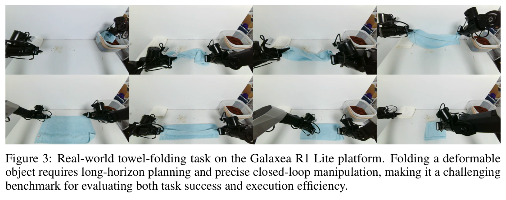
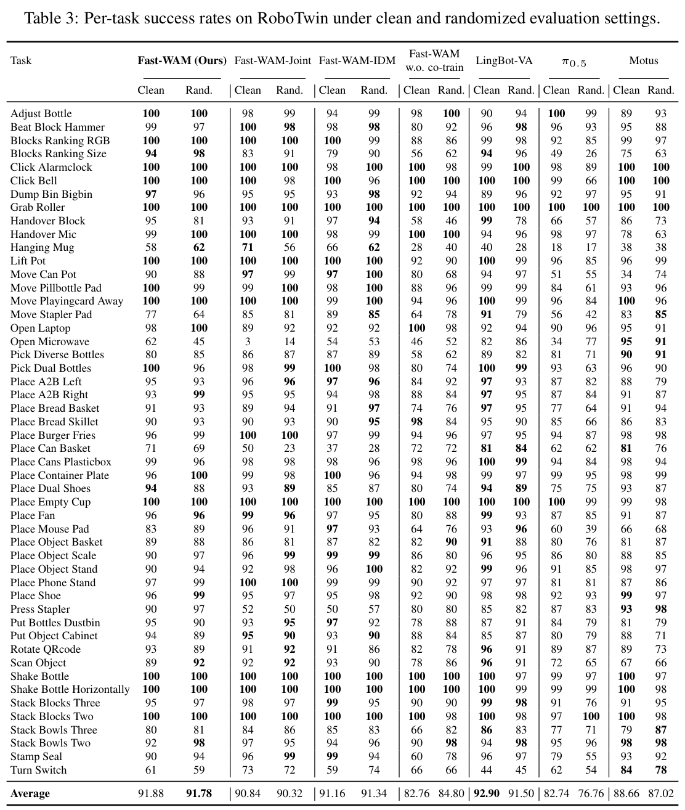
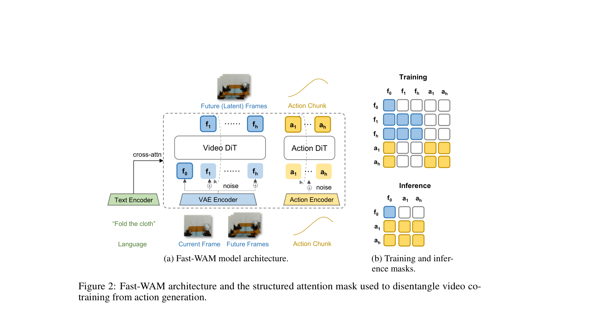
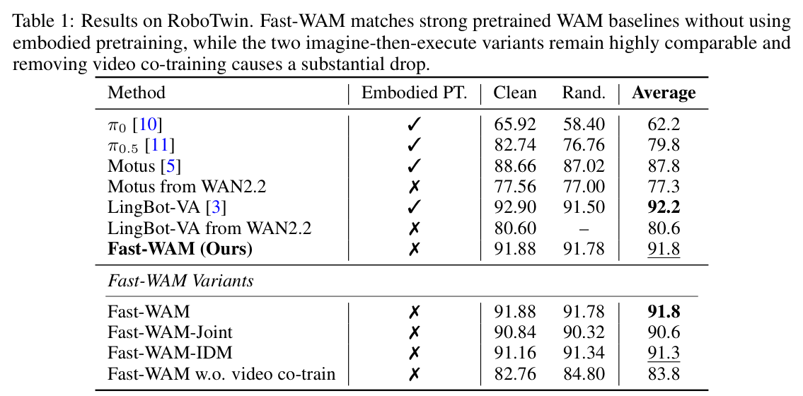

---
tags:
  - papers/world-model
  - papers/robot-learning
aliases:
  - Fast-WAM
  - Do World Action Models Need Test-time Future Imagination?
date: 2026-03-23
doi: 10.48550/arXiv.2603.16666
arxiv_id: 2603.16666
---

# Fast-WAM: Do World Action Models Need Test-time Future Imagination?

## 核心信息

- 标题: Fast-WAM: Do World Action Models Need Test-time Future Imagination?
- 标题翻译: Fast-WAM：世界动作模型在测试时真的需要想象未来吗？
- 作者: Tianyuan Yuan, Zibin Dong, Yicheng Liu, Hang Zhao
- 机构: 清华大学交叉信息研究院；Galaxea AI
- 发表时间: 2026-03-23（arXiv v2）
- 发表渠道: arXiv 预印本
- DOI: 10.48550/arXiv.2603.16666
- arXiv: 2603.16666
- 论文链接: https://arxiv.org/abs/2603.16666
- 代码 / 项目: https://yuantianyuan01.github.io/FastWAM/
- 论文类型: 世界动作模型、机器人策略与系统消融研究

## 原文摘要翻译

世界动作模型（WAM）之所以成为视觉—语言—动作模型的一种有前景的替代方案，是因为它们会显式建模视觉观测如何随动作发生变化。现有多数世界动作模型遵循“先想象、后执行”的范式，需要在测试时迭代去噪视频，因此产生显著延迟；然而，强动作性能是否真的依赖显式未来想象仍不清楚。

本文研究世界动作模型在测试时是否必须显式想象未来，抑或其收益主要来自训练阶段的视频建模。为区分训练期视频建模与推理期显式未来生成的作用，作者提出 `Fast-WAM`：训练时保留视频协同训练，测试时跳过未来预测。作者进一步构造多个共享实现下的受控变体，对这两个因素进行比较。实验发现，`Fast-WAM` 的表现仍可与“先想象、后执行”变体竞争，而去掉视频协同训练会造成大得多的性能下降。在没有具身预训练的条件下，`Fast-WAM` 在 `LIBERO`、`RoboTwin` 和真实机器人任务上均取得可与先进方法竞争的结果；其推理延迟为 `190 ms`，相对现有“先想象、后执行”路线快逾四倍。这些结果表明，世界动作模型中视频预测的主要价值，可能是训练时改善世界表征，而不是测试时生成未来观测。

## 创新点

1. **把一个纠缠的问题拆成两个可检验因素。** 论文不再把“训练时预测视频”和“推理时生成视频”视作不可分割的世界模型流程，而是分别检验二者对动作性能的贡献。这比单纯提出一个更快策略更有研究价值。
2. **通过结构化注意力掩码建立无泄露的训练接口。** 动作令牌可以读取当前干净观测，却不能读取未来视频令牌。因此，未来视频只提供辅助训练信号；推理时删除未来视频分支不会让动作分支突然失去训练时依赖的条件。
3. **在统一实现中构造三类 WAM 与一个关键负对照。** `Fast-WAM-Joint` 代表视频—动作联合生成，`Fast-WAM-IDM` 代表先视频后动作，去视频协同训练版本则只删除视频损失。这组对照比跨论文排行榜更能支持核心机制判断。
4. **把世界模型压缩为训练期能力，而非部署期程序。** 推理时视频骨干仅对当前观测做一次前向表征，随后由动作专家去噪动作，不再迭代生成未来视频，从而把受控实现的延迟从 `580/810 ms` 降到 `190 ms`。

## 一句话总结

`Fast-WAM` 真正证明的不是“机器人永远不需要想象未来”，而是：在本文的单动作块控制设置中，**视频预测作为训练期辅助目标的价值明显大于把未来视频真的生成出来再决策的价值**，因此可以用近似直接策略的推理接口保留大部分世界建模收益。

## 研究问题

### 两种收益过去被混在了一起

传统视觉运动策略直接学习

$$
p(a_{1:H}\mid o,l),
$$

其中 $o$ 是当前观测，$l$ 是语言指令，$a_{1:H}$ 是长度为 $H$ 的动作块。很多世界动作模型则引入未来视觉轨迹 $v_{1:T}$：

$$
p(a_{1:H}\mid o,l)=\int p(v_{1:T}\mid o,l)\,p(a_{1:H}\mid o,l,v_{1:T})\,\mathrm{d}v_{1:T}.
$$

工程上，这通常对应两条路线：要么视频和动作一起去噪，要么先生成未来视频，再用逆动力学模型或动作头得到动作。问题在于，只看最终性能无法知道增益究竟来自：训练时的视频目标塑造了更好的动态表征，还是测试时看到“想象的未来”真的改善了决策。

`Fast-WAM` 把部署接口改写为

$$
p_\theta(a_{1:H}\mid o,l)
=p_\theta(a_{1:H}\mid z(o,l)),
$$

其中 $z(o,l)$ 是视频骨干对当前上下文一次前向得到的潜在世界表征。它保留训练期视频预测，却不在推理期采样 $v_{1:T}$。

### 论文实际检验的命题

作者检验的是：在同一 `Wan2.2-5B` 骨干、相近训练配方和单动作块生成条件下，以下哪种删除更伤性能？

- 保留视频协同训练，但删除测试期未来视频生成；
- 保留直接动作接口，但删除训练期视频协同损失。

这不是对“规划是否需要未来状态”的哲学否定，而是对**显式生成未来视频是否值得其部署成本**的受控实验。

## 数据与任务定义

### 三类评测覆盖什么

| 评测 | 训练数据 | 训练步数 | 测试规模与指标 | 主要边界 |
|---|---:|---:|---|---|
| `LIBERO` | 四个套件各 `500` 条示范，每套 `10` 个任务 | `20k` | 共 `40` 任务、`2000` 次测试；报告各套件成功率 | 任务固定，主要测标准仿真操控泛化 |
| `RoboTwin 2.0` | `2500` 条干净场景示范 + `25,000` 条强随机化示范，超过 `50` 个双臂任务 | `30k` | 每任务在干净和随机化场景各 `100` 次；报告平均成功率 | 任务多、视觉随机化强，但仍是仿真 |
| 真实毛巾折叠 | `60` 小时遥操作示范 | `30k` | 成功率、平均完成时间、策略推理延迟 | 单一本体、单一真实任务，统计不确定性未充分给出 |

真实任务使用 `Galaxea R1 Lite` 双臂平台。毛巾属于可形变物体，折叠要求连续闭环修正，因此作者同时报告成功率和完成时间：前者回答能否完成，后者用于识别是否依赖反复试错。

*论文原图编号：Figure 3。真实毛巾折叠的动作序列，说明该任务同时包含可形变物体动力学、双臂协调和长程闭环执行。*

### 逐任务结果透露的难点

`RoboTwin` 的平均值接近 `92%`，但逐任务表显示失败并不均匀。例如打开微波炉、悬挂杯子和扳动开关等任务的表现明显低于大量接近满分的放置、抓取任务；这意味着主平均分不能自动等价为对所有接触模式都稳定。

*论文原图编号：Table 3。RoboTwin 五十余个任务在干净与随机化场景下的逐任务成功率；它最适合用来检查平均分掩盖的任务异质性。*

## 方法主线

### 机制流程

1. **编码当前上下文。** 当前图像经预训练视频 `VAE` 转为干净首帧潜变量，语言经 `T5` 编码；二者作为视频骨干与动作专家的公共条件。
2. **训练期并行学习两项任务。** 视频 `DiT` 从带噪未来潜变量学习恢复未来帧，动作专家从带噪动作学习恢复动作块；两者都能读取当前首帧和语言，但动作分支被禁止读取未来视频令牌。
3. **让视频目标塑造共享世界表征。** 视频损失更新 `Wan2.2-5B` 视频骨干，使其当前观测表征带有运动、接触和时序变化信息；动作专家通过共享注意力读取这些表征完成动作生成。
4. **推理期裁掉未来视频分支。** 仅保留当前首帧令牌，视频骨干做一次前向产生 $z(o,l)$，随后动作专家执行动作流匹配采样。这里的“一次前向”指视频表征分支；动作本身仍使用论文设定的 `10` 步去噪。

*论文原图编号：Figure 2。左侧是视频骨干与动作专家组成的混合 Transformer，右侧掩码展示训练时未来视频与动作彼此隔离、推理时完全移除未来视频令牌。*

### 注意力隔离为什么是核心

输入令牌分为三组：当前干净首帧 $f_0$、训练期未来带噪视频 $f_{1:T}$、动作令牌 $a_{1:H}$。训练掩码满足：

- 未来视频令牌能在视频分支内双向注意，并读取 $f_0$；
- 动作令牌能在动作分支内双向注意，并读取 $f_0$；
- 动作令牌不能读取未来视频令牌；
- $f_0$ 不读取其他令牌，避免其被目标侧信息污染；
- 三组令牌都通过交叉注意力读取语言表示。

这个限制非常关键。如果动作训练时能看真实或带噪的未来帧，测试时删掉未来分支就会产生条件缺失，性能下降无法区分是“未来想象必要”还是“训练—推理不一致”。本文通过掩码把视频预测变成真正的辅助任务，而不是动作的隐式标签泄露通道。

### 流匹配训练目标

对动作块或未来视频潜变量统一记为目标 $y$。随后采样标准高斯噪声和连续时间，并构造

$$
y_t=(1-t)y+t\epsilon.
$$

这里 $t=0$ 对应干净数据，$t=1$ 对应纯噪声。模型学习速度场

$$
\mathcal L_{\mathrm{FM}}(y)
=\mathbb E_{y,\epsilon,t}
\left[\left\|f_\theta(y_t,t,o,l)-(\epsilon-y)\right\|_2^2\right].
$$

分别令 $y=a_{1:H}$ 与 $y=z_{1:T}$，得到动作损失和视频损失：

$$
\mathcal L
=\mathcal L_{\mathrm{act}}+\lambda\mathcal L_{\mathrm{vid}}.
$$

实现上，这是同一种流匹配代码作用在两类令牌上；论文特有之处不是新的扩散公式，而是借助掩码让 $\mathcal L_{\mathrm{vid}}$ 只改变表征学习，不成为动作分支的未来条件。

### 三个受控变体

| 版本 | 训练期视频目标 | 动作能否读取未来视频 | 推理期是否生成未来视频 | 对应范式 |
|---|---|---|---|---|
| `Fast-WAM` | 有 | 否 | 否 | 训练期世界建模、推理期直接策略 |
| `Fast-WAM-Joint` | 有 | 是 | 是，与动作联合去噪 | `DreamZero`、`Motus` 等联合生成路线的受控代表 |
| `Fast-WAM-IDM` | 有 | 是，视频先生成 | 是，先视频后动作 | `Causal WAM`、`Vidar` 等因果路线的受控代表 |
| 无视频协同训练版本 | 无 | 不适用 | 否 | 检验视频辅助训练本身 |

`Fast-WAM-IDM` 还沿用因果 WAM 的训练习惯：以 `0.5` 概率向真实视频令牌加噪，使动作模块适应推理期不完美的生成视频。

### 训练与推理细节

- 视频骨干、文本编码器和视频 `VAE` 来自 `Wan2.2-5B`；动作专家采用相似结构但隐藏维度为 `1024`，约 `1B` 参数，总模型约 `6B`。
- 动作 horizon 为 `32`；视频时间维下采样 `4` 倍，每个块得到 `9` 帧；多相机图像先拼接成一张图再送入 `VAE`。
- 视频与动作都使用对数几率正态分布采样噪声时间；推理采用 `10` 步去噪，分类器自由引导系数为 `1.0`。
- 优化器为 `AdamW`，学习率 $10^{-4}$、权重衰减 `0.01`、余弦退火；混合精度训练，梯度裁剪阈值为 `1.0`。
- 延迟统一在单张 `NVIDIA RTX 5090D V2 32GB` 上测量。这个硬件条件必须保留，否则跨论文的毫秒数没有可比性。

## 关键结果

### 仿真主结果与强基线

| 方法 | 具身预训练 | RoboTwin 平均成功率 | LIBERO 平均成功率 |
|---|---:|---:|---:|
| `pi0.5` | 有 | 79.8 | 96.9 |
| `Motus` | 有 | 87.8 | 97.7 |
| `LingBot-VA` | 有 | **92.2** | **98.5** |
| `Fast-WAM` | **无** | 91.8 | 97.6 |

在 `RoboTwin` 上，`Fast-WAM` 的 `91.8%` 接近具身预训练的 `LingBot-VA` 的 `92.2%`，并超过有预训练的 `Motus`。

在 `LIBERO` 上，`Fast-WAM` 的 `97.6%` 与 `Motus` 的 `97.7%` 接近，但略低于 `LingBot-VA` 的 `98.5%`。这些结果支持“视频生成预训练骨干加任务内视频协同训练具有较高数据效率”，但跨论文基线并非严格等数据、等参数和等优化预算，不能把差异全部归因于架构。

*论文原图编号：Table 1。RoboTwin 的干净、随机化与平均成功率；下半部分是共享实现中的核心受控比较。*

*论文原图编号：Table 2。LIBERO 四套件结果；`Fast-WAM` 在无具身预训练条件下接近强预训练基线。*

### 消融到底说明了什么

| 共享实现版本 | RoboTwin | LIBERO | 相对 Fast-WAM 的解释 |
|---|---:|---:|---|
| `Fast-WAM` | 91.8 | 97.6 | 不生成未来视频的基准点 |
| `Fast-WAM-Joint` | 90.6 | 98.5 | 显式联合想象并未稳定优于直接策略 |
| `Fast-WAM-IDM` | 91.3 | 98.0 | 先视频后动作仅有任务相关的小幅差异 |
| 无视频协同训练 | 83.8 | 93.5 | 分别下降 `8.0` 与 `4.1` 个百分点 |

最重要的证据不是 `Fast-WAM` 在某张榜单上第一，而是差异结构：取消测试期想象时，性能与 `Joint/IDM` 相近；取消训练期视频目标时，两个基准都明显下降。这个模式符合作者提出的机制——视频损失主要在训练阶段改善当前观测表征。

不过，`LIBERO` 上 `Joint` 比 `Fast-WAM` 高 `0.9` 个百分点，`IDM` 高 `0.4` 个百分点。论文因此只能说显式未来想象“不是主要因素”或“在这些任务上非必要”，不能说它严格没有价值。

### 真实折叠与延迟

从 `Figure 4` 读取的近似结果如下：

| 方法 | 成功率 | 平均完成时间 | 单次推理延迟 |
|---|---:|---:|---:|
| 具身预训练 `pi0.5` | 约 100% | 约 120 s | 180 ms |
| 无具身预训练 `pi0.5` | 约 40% | 约 206 s | 未单列 |
| `Fast-WAM` | 约 75% | 约 152 s | **190 ms** |
| `Fast-WAM-Joint` | 约 70% | 约 227 s | 580 ms |
| `Fast-WAM-IDM` | 约 90% | 约 176 s | 810 ms |
| 无视频协同训练 | 10% | 约 241 s | 190 ms |

真实任务给出两个同时成立、但需要分别解读的结论。第一，删除视频协同训练把成功率压到 `10%`，且完成最慢，强烈支持训练期视频目标。第二，`IDM` 的成功率约 `90%`，高于 `Fast-WAM` 的约 `75%`，说明显式未来在某些形变物体任务上可能仍改善成功率，只是它把延迟推到 `810 ms`。因此更准确的结论是：`Fast-WAM` 提供更好的性能—延迟折中，而不是在每个性能指标上统治想象式模型。

*论文原图编号：Figure 4。左图同时比较成功率和完成时间，右图给出统一硬件下的策略延迟；图中数值是本文部署结论的直接证据。*

## 深度分析

### 真正贡献是什么

这篇论文最值得保留的并不是又一个机器人策略，而是一种**辅助生成任务的因果拆解方法**：

1. 保留辅助目标、移除部署分支，检验训练表征收益。
2. 保留同一部署接口、移除辅助目标，检验辅助训练收益。
3. 用严格掩码保证动作没有偷看未来目标。
4. 在共享骨干与训练配方下比较，不把跨论文系统差异当成机制证据。

这套逻辑可迁移到语言推理、视觉预测和多模态控制：一个昂贵的中间生成过程可能适合充当训练监督，却未必需要成为推理时的必经链路。

### 为什么结果可能成立

视频预测迫使骨干编码“接下来会发生什么”，因而当前帧特征需要包含物体几何、接触关系、运动方向和动作可达性。动作专家即使看不到未来令牌，也能从被视频损失塑造的当前表示中读取这些先验。换句话说，未来视频在训练时像一个稠密的时空监督；部署时模型消费的是被该监督训练过的表征，而不是视频本身。

延迟差异也与计算链直接一致：`Fast-WAM` 只做一次视频骨干编码加动作去噪；`Joint` 需要在动作去噪过程中同时维护未来视频令牌；`IDM` 先完整去噪未来视频，再去噪动作。因此 `190 < 580 < 810 ms` 并非偶然优化，而是推理图本身的计算量排序。

### 与 DreamZero 等 WAM 的关系

*论文原图编号：Figure 1。三种范式的训练与推理链：联合视频—动作生成、先视频后动作，以及仅把视频预测保留为训练目标的 `Fast-WAM`。*

`DreamZero` 在这篇论文的分类中属于左侧“联合视频与动作去噪”范式：当前块的视频潜变量和动作共同生成，并可利用闭环真实视觉历史。`Fast-WAM-Joint` 是作者在同一 `Wan2.2` 框架中构造的受控代理，用来测试联合未来生成是否必要；它不是对 `DreamZero` 完整系统的等价复现。

二者最本质的差别是：

| 维度 | DreamZero 类联合 WAM | Fast-WAM |
|---|---|---|
| 训练 | 联合学习未来视频与动作 | 并行学习视频与动作，但掩码阻断动作读取未来视频 |
| 推理 | 当前块显式生成视频潜变量与动作 | 不实例化未来视频令牌，只编码当前观测并生成动作 |
| 历史 | 可利用跨块真实视觉缓存并自回归推进 | 本文受控实验聚焦单动作块，省略外层自回归循环 |
| 目标 | 保留视觉想象作为在线世界模型 | 把视频建模降为训练期表征监督 |

因此，本文的证据更像是在挑战“每次控制都必须先生成未来”这一默认假设，而不是否定 `DreamZero` 的闭环历史、异构数据预训练或长期状态能力。另一个容易误读的点是跨论文延迟：`Fast-WAM` 的 `190 ms` 在单张 `RTX 5090D V2` 上测得，而 `DreamZero` 的不同版本涉及不同模型规模、去噪步数、量化和硬件。没有同硬件复现，就不能把毫秒数直接当作绝对胜负。

### 容易误读的地方

- **“没有具身预训练”不等于“从零训练”。** `Fast-WAM` 使用了预训练 `Wan2.2-5B` 视频生成骨干、文本编码器和视频 `VAE`；缺少的是大规模机器人动作预训练。
- **“单次前向”不等于整条策略只运行一次网络。** 视频分支只编码一次当前帧，但动作流仍采用 `10` 个去噪步骤。
- **“不想象未来”指不显式采样未来视频。** 当前表征仍带有由视频预测训练出的动态先验，不能把它归类为普通静态视觉编码器。
- **“未来想象不重要”受任务与协议限制。** 论文明确省略外层自回归滚动；对长记忆、多分支搜索、主动信息收集或遮挡恢复任务，结论尚未被检验。
- **“快逾四倍”主要对应 `810/190` 的 `IDM` 变体。** 相对 `Joint` 的 `580 ms`，加速约为 `3.1` 倍，不能把所有想象式实现概括成统一的四倍差距。

### 复现注意点

1. **先验证掩码，而不是先追指标。** 单元测试应检查动作查询对未来视频键和值的注意力恒为零，首帧令牌也不能被目标侧令牌更新；否则会产生训练泄露。
2. **四个变体必须共用数据、骨干、动作编码、噪声日程和训练步数。** 只替换推理流程或 $\mathcal L_{\mathrm{vid}}$，否则无法复现论文的因果比较。
3. **区分视频编码耗时与动作去噪耗时。** 需要分别记录 `VAE`、视频 `DiT` 单次前向、每个动作去噪步和控制栈总延迟；只报告总毫秒数无法定位收益来源。
4. **记录视频损失权重 $\lambda$。** 论文正文给出联合目标，却未在抽取到的实现细节中明确其数值；这可能显著影响“视频协同训练有多重要”的结论。
5. **多相机拼接会改变空间布局。** 复现时需固定相机顺序、分辨率、裁剪方式和 `VAE` 输入尺寸，否则预训练视频骨干接收到的视觉结构会变化。
6. **真实任务需要补全统计协议。** 应公开测试回合数、失败判据、超时阈值、动作频率以及均值的不确定性，才能判断约 `75%` 与 `90%` 的差距是否稳定。

## 局限

1. **问题范围比标题窄。** 实验回答的是单动作块、特定掩码设计和三个评测环境下是否需要显式未来视频生成，不是所有世界模型是否需要规划未来。
2. **真实证据集中于一个任务。** 毛巾折叠确实困难，但单一平台、单一形变任务不足以覆盖导航、遮挡、工具使用、失败恢复和需要记忆的长程控制。
3. **没有直接等设置比较 DreamZero 等完整系统。** `Joint` 与 `IDM` 是共享框架内的代表性实现；它们有利于内部因果判断，却不能替代对各方法工程优化、缓存机制和数据规模的完整复现。
4. **关键超参数报告仍不够完整。** 视频损失权重 $\lambda$、批大小、训练算力、动作归一化和真实控制频率等细节会影响复现与延迟解释。
5. **规模结论尚未建立。** 作者也把更大预训练数据和模型扩展留作未来工作；当前结果不能说明随着规模增长，测试期未来想象的边际价值会继续下降。
6. **成功率与延迟存在真实权衡。** `IDM` 在毛巾折叠上成功率更高但慢得多，说明“最佳系统”取决于任务更在意实时响应还是最终成功；论文并未给出统一效用函数。

## 我的笔记

### 我认为最可复用的想法

训练时预测未来、推理时不生成未来，是一个很强的设计模板。它类似把“思维过程”或“重建任务”当作表征监督：只要部署头从未依赖中间生成物，就可能在保留学习收益的同时删掉昂贵链路。关键不是简单蒸馏，而是从训练开始就通过信息流设计保证可删除性。

### 下一步最值得做的实验

- 在同一骨干上加入多帧真实历史，比较“当前单帧表征”“历史缓存表征”和“显式未来生成”三者的性能—延迟前沿。
- 系统扫描 $\lambda$，同时报告视频生成质量、动作成功率与训练稳定性，确认收益来自动态表征而非额外梯度规模。
- 选取必须做多步选择的任务，例如遮挡取物、需要中途重新规划的工具使用，测试显式未来是否在分支决策处重新变得重要。
- 与 `DreamZero` 在同数据、同硬件、同动作频率、同去噪步数下比较，并分别打开或关闭其未来视频—动作交互，避免把系统优化差异误当成建模结论。
- 对真实折叠报告至少三次独立训练、置信区间与失败类型，判断 `Fast-WAM-IDM` 的成功率优势是否具有统计稳定性。

### 阅读判断

这篇论文值得保留，因为它用相对干净的实验设计挑战了 WAM 领域一个昂贵的默认前提。其最强证据是“删除视频协同训练比删除在线未来生成更伤性能”；最弱之处是外推范围仍有限。对后续工作，最合理的表述不是“世界模型不需要想象”，而是“应先证明在线想象带来的增益超过其延迟、误差与系统复杂度，再决定是否把它放进控制闭环”。

## 引用

Yuan, Tianyuan, Zibin Dong, Yicheng Liu, and Hang Zhao. “Fast-WAM: Do World Action Models Need Test-time Future Imagination?” arXiv:2603.16666, 2026. https://arxiv.org/abs/2603.16666.

相关对照：

- Ye et al. “World Action Models are Zero-shot Policies.” arXiv:2602.15922, 2026.
- Li et al. “Causal World Modeling for Robot Control.” arXiv:2601.21998, 2026.
- Bi et al. “Motus: A Unified Latent Action World Model.” arXiv:2512.13030, 2025.
