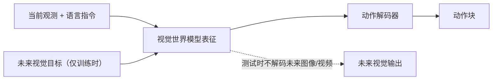
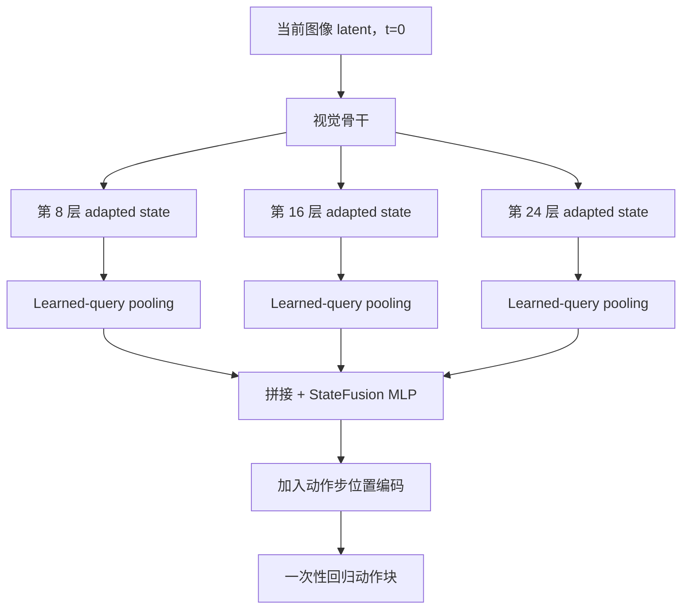
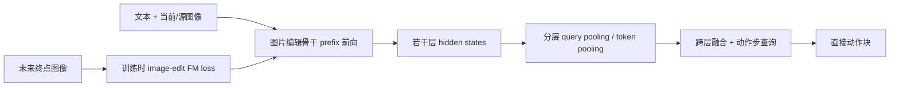

# Fast-WAM、Light-WAM 与 ImageWAM：方法、缓存机制与 StateFusion 可迁移性

> [!abstract] 阅读结论
> 1. 三者共享同一个核心思想：**训练时用未来视觉建模提供监督，执行时不真的生成并解码未来视觉结果，而是直接输出动作**。
> 2. Fast-WAM 与 ImageWAM 都保留生成式 Action DiT；Light-WAM 则用 **StateFusion（即下文所指、问题中称作 StageFusion 的模块）** 替换 Action DiT，直接回归整段动作。
> 3. StateFusion 不是普通 MoT 的一个 attention 小改动：它取消了动作 token 在每层 Transformer 中与视觉 token 的联合建模，也取消了动作 flow-matching 与多步去噪，改为对视觉骨干多个中间层做 query pooling、融合和直接动作回归。
> 4. ImageWAM 不只是把 Fast-WAM 的视频模型换成图片编辑模型：它把未来监督从“完整未来轨迹”改成“当前图像到未来终点图像的状态变化”，同时改变了训练样本、token/mask、语言与图像条件、动作跨度、去噪步数以及系统优化方式。
> 5. **ImageWAM 官方代码目前没有像 Light-WAM 那样离线预计算训练图像的 VAE latent。** 它只预计算文本/Qwen embedding；视觉 latent 仍在线编码。它确实会在一次动作采样内预填充并复用逐层 KV，但这属于在线、单次控制查询内的 cache，不是 Light-WAM 的数据集级 latent cache。
> 6. StateFusion 原理上可以移植到 ImageWAM，而且 ImageWAM 的 prefix-only 推理接口已经提供了很好的基础；但它需要新增多层 hidden-state 收集、融合头、直接动作损失和推理分支，**不是无改动复用**。预期会进一步降低时延，但也可能损失 ImageWAM 在复杂、多模态动作分布上的能力。

## 1. 阅读范围与版本

本笔记同时核对了论文、已有精读笔记和实际代码；结论以当前本地代码为准。

| 方法 | 论文/笔记 | 代码版本 |
|---|---|---|
| Fast-WAM | [[Fast-WAM Do World Action Models Need Test-time Future Imagination/paper\|Fast-WAM paper]] | `/Users/roywangj/journey_wj/research/author/WAM/FastWAM`，commit `45d8e14` |
| Light-WAM | [[Light-WAM Efficient World Action Models with State-Fusion Action Decoding/paper\|Light-WAM paper]] | `/Users/roywangj/journey_wj/research/author/WAM/Light-WAM`，commit `8245c87` |
| ImageWAM | [[ImageWAM Do World Action Models Really Need Video Generation, or Just Image Editing/paper\|ImageWAM paper]] | `/Users/roywangj/journey_wj/research/author/WAM/ImageWAM`，commit `5d4a341` |

> [!note] 术语说明
> Light-WAM 的论文标题、配置和代码使用的是 **State-Fusion / StateFusion**，不是 StageFusion。本文统一写作 StateFusion；两者在本问题中指同一模块。这里的 **MoT 是 Mixture-of-Transformers**，不是多目标跟踪（Multi-Object Tracking）。

## 2. 三种方法放在同一框架下看

### 2.1 共同母题

三种方法都把视觉世界建模视为一种训练监督，而不把“先生成未来、再从未来求动作”作为必要的测试时流程：

因此，三者都反对把测试时显式 future imagination 当成必要条件。真正不同的是：

- 用什么未来视觉目标训练世界模型；
- 视觉表征怎样传给动作模块；
- 动作是通过 diffusion/flow 生成，还是一次性回归；
- 哪些计算可以离线或在单次采样内复用。

### 2.2 总体对照

| 维度                | Fast-WAM                   | Light-WAM                          | ImageWAM                         |
| ----------------- | -------------------------- | ---------------------------------- | -------------------------------- |
| 未来视觉监督            | 多帧未来视频 latent              | 低分辨率未来视频 latent                    | 当前图像到未来终点图像的编辑目标                 |
| 视觉骨干              | Wan2.2-5B 视频 DiT           | Wan2.1-T2V-1.3B，小骨干 + LoRA/adapter | OmniGen2、Ovis-U1、FLUX.2 等图片编辑骨干  |
| 动作模块              | 约 1B Action DiT            | **无 Action DiT**；StateFusion 直接回归  | 各骨干配套的约 0.64B–1.1B Action DiT    |
| 视觉—动作连接           | 逐层 MoT；动作去噪时读取视觉 prefix KV | 多层视觉状态 query pooling 后融合           | 逐层、骨干特定的 MoT；动作去噪时读取编辑 prefix KV |
| 动作训练目标            | action flow matching       | 直接动作 MSE                           | action flow matching             |
| 视觉训练目标            | video flow matching        | video flow matching                | image-edit flow matching         |
| 动作跨度              | 32 steps                   | 配置/任务相关；RoboTwin 示例为 24            | 16 steps                         |
| 测试时动作去噪           | 论文设置 10 steps              | 0；一次直接回归                           | 效率实验设置 3 steps                   |
| 测试时生成未来视觉         | 否                          | 否                                  | 否                                |
| 离线视觉 latent cache | 官方流程未使用                    | **使用；训练集视频 VAE latent**            | 官方流程未使用                          |
| 离线文本 cache        | 使用                         | 使用                                 | 使用 Qwen/text embedding           |
| 单次推理内逐层 KV cache  | 使用                         | StateFusion 无多步动作去噪，因而不需要同类复用      | 使用                               |

## 3. 三篇工作的核心机制

### 3.1 Fast-WAM：未来视频只在训练时提供学习信号

Fast-WAM 由视频专家和动作专家组成。训练时，它同时给未来视频 latent 和动作加噪，优化：

$$
\mathcal{L} = \mathcal{L}_{\text{action-FM}}
+ \lambda_{\text{video}}\mathcal{L}_{\text{video-FM}}.
$$

关键点不是让动作分支在训练时偷看真实未来。代码中的 mask 让动作 token 只读取当前第一帧的稳定视觉 prefix 和动作自身，而不能读取带噪未来视频 token。未来视频任务通过共享训练和视觉表征约束，迫使当前观测编码包含与未来变化有关的信息。

推理时的流程是：

1. 在线把当前图像编码为 VAE latent；
2. 用 $t_{\text{video}}=0$ 对当前视觉 prefix 前向一次；
3. 保存每层视觉 K/V；
4. 在约 10 个动作去噪步中，只重算动作侧 Q/K/V，并复用视觉 K/V；
5. 不生成未来视频，也不做视频 VAE decode。

这解释了 Fast-WAM 的主要结论：**未来视频预测有训练价值，但测试时完整 future rollout 没有必要。**

### 3.2 Light-WAM：进一步取消生成式动作专家

Light-WAM 接受 Fast-WAM“测试时不用生成未来”的结论，并继续追问：既然执行时只需要动作，是否还需要一个大型 Action DiT 和多步动作去噪？

它采用四个主要改动：

1. 把视觉骨干缩小到 Wan2.1-T2V-1.3B；
2. 冻结原始骨干，以 LoRA 和第 8/16/24 层的稀疏 adapter 进行任务适配；
3. 训练未来视频时把视觉 latent 空间分辨率再下采样 2 倍；
4. 删除 Action DiT，以 StateFusion 从多个视觉中间层直接预测动作块。

训练中仍保留未来视频 flow-matching，因此并未放弃世界建模监督。但动作支路使用当前干净观测、完整 latent 分辨率和 $t=0$ 的独立前向，随后用 MSE 直接监督动作。

StateFusion 的当前实现为：

1. 在选定层取得 adapter 后的视觉 hidden states；配置中的 8/16/24 是 Python 零基 block 索引，即自然语言中的第 9/17/25 个 block；
2. 每层使用一组 learned queries 对全部视觉 token 做 multi-head attention pooling；
3. 当前代码用学习到的 softmax 权重合并 query 输出（论文公式近似写作平均），经过压缩投影后，把多层特征拼接并融合；
4. 为动作块中每个时间位置加入 step positional embedding；
5. MLP 一次性输出形状为 `[batch, horizon, action_dim]` 的动作。

当前默认配置只使用 `adapted` 特征；代码虽然也支持 `backbone`、`delta` 等来源，但不能把这种可选能力误写成论文默认路径。

### 3.3 ImageWAM：把“未来视频”重写成“未来状态编辑”

ImageWAM 认为机器人动作往往更依赖“当前场景需要发生什么变化”，未必需要学习每一帧的运动轨迹。因此它使用：

$$
(\text{instruction}, o_t) \rightarrow \hat{o}_{t+H+1}
$$

式的图片编辑任务，以未来终点图像而不是完整未来视频作为辅助监督。

训练时：

- 稳定 prefix 包含语言指令与当前/源图像；
- 未来目标图像作为带噪编辑 target；
- 动作也作为带噪 token；
- 同时优化 image-edit flow matching 与 action flow matching；
- mask 阻止动作读取带噪 target，只允许其读取稳定的文本/源图像 prefix 与动作自身。

推理时：

1. 当前图像仍需在线经过 VAE/视觉编码器；
2. 不构造和去噪真实的目标图像；
3. 论文正文表述为在固定编辑 timestep $\tau^*$ 前向一次；当前发布代码默认采用更激进的 prefix-only、$t=0,\ x=\varnothing$ 路径；
4. 保存编辑骨干各层的 prefix K/V；
5. Action DiT 用 3 个去噪步生成动作，并在每一步复用上述 K/V。

ImageWAM 因而不是“部署时做一次图片编辑再执行动作”，而是**借用图片编辑模型的内部变化表征，部署时不输出编辑图像**。

## 4. StateFusion 与正常 MoT 到底有什么区别？

### 4.1 正常 MoT：逐层、token 级、生成式动作建模

Fast-WAM/非 StateFusion 路径中的 MoT（Mixture-of-Transformers）在每个 Transformer block 都保留两个序列：

- 视觉 token 经过视觉专家的 normalization、QKV 投影和 post block；
- 动作 token 经过动作专家对应的 normalization、QKV 投影和 post block；
- 两侧 Q/K/V 按 mask 进入联合 attention，再拆回各自序列。

因此，动作始终是 Transformer 内的一组 token，并带有动作 diffusion timestep。部署时每个动作去噪步都要让动作 token 通过整套动作层；视觉 prefix 的 K/V 可以预先算一次，但动作侧仍要重复计算。

### 4.2 StateFusion：多层状态的晚期融合与直接回归

StateFusion 路径只运行视觉骨干：

它没有：

- Transformer 内的动作 token 序列；
- 逐层视觉—动作联合 attention；
- Action DiT；
- action diffusion timestep；
- action flow-matching scheduler；
- 多次动作去噪。

### 4.3 一句话区分

> **MoT 是“动作 token 在每层读取视觉 token/KV，并通过多步 diffusion 生成”；StateFusion 是“先完成一次视觉前向，再把多个视觉层的状态压缩融合，一次回归整段动作”。**

| 比较项 | 普通 MoT + Action DiT | StateFusion |
|---|---|---|
| 交互粒度 | 每层、token 级 | 选定层收集后，feature 级晚期融合 |
| 动作表示 | Transformer token 序列 | horizon-conditioned 输出槽/MLP |
| 输出分布 | 生成式 flow/diffusion | 确定性直接回归 |
| 推理次数 | 视觉 prefill 1 次 + 动作网络多次 | 视觉骨干 1 次 + 小头 1 次 |
| 表达能力 | 更适合多峰/复杂动作分布 | 更快，但更容易平均化多峰动作 |
| 主要成本 | Action DiT × 去噪步数 | 视觉骨干一次前向 |

这也是 Light-WAM 的速度收益来源，而不只是“少缓存几层”或“换了一个 pooling”。

## 5. ImageWAM 与 Fast-WAM：除了视频模型换成图片编辑模型，还有什么不同？

### 5.1 辅助任务的语义不同

- Fast-WAM 学的是一段未来轨迹 $o_{t+1:t+H}$，强调连续时序动力学。
- ImageWAM 学的是当前状态到未来终点状态的变化 $o_t\rightarrow o_{t+H}$，强调指令条件下“应当发生什么改变”。

所以 ImageWAM 减少的不只是帧数，也改变了 world-model prior：从 motion/trajectory prior 变为 state-change/edit prior。

### 5.2 数据构造与时间跨度不同

- Fast-WAM 的论文设置使用 32-step 动作块和 9 帧视频 latent 序列。
- ImageWAM 在 LIBERO/RoboTwin 中使用 16-step 动作块，并使用动作块末端之后的单一 endpoint（论文记作 $o_{t+H+1}$；数据设置为对应的约 16 帧未来图像）。

因此二者的成功率和速度并不是严格控制变量下的“视频 vs 图片”单因素实验。

### 5.3 条件序列与 attention mask 不同

- Fast-WAM 的稳定视觉条件主要是视频序列的当前第一帧。
- ImageWAM 的稳定条件是文本/多模态 instruction prefix 加源图像；带噪目标图像是单独的 edit target。
- ImageWAM 为 OmniGen2、Ovis-U1、FLUX.2 分别实现了不同 token 布局和 cache/MoT 接口，而非简单复用 Wan 视频 token。

两者有一个重要共同点：动作都不能读取带噪的未来 target，而只读取稳定 prefix。这避免了训练时未来信息泄漏。

### 5.4 预训练先验和可训练部分不同

Fast-WAM 借用视频生成模型的时序先验。ImageWAM 借用大规模图片编辑模型中已有的语言理解、物体对应和前后状态变化先验；论文设置冻结多模态理解/VLM 部分，训练图片 diffusion 支路与 Action DiT。

这意味着 ImageWAM 的优势可能同时来自：

- endpoint 任务本身更适合机器人；
- 图片编辑预训练数据更丰富；
- 更强的语言—图像对齐；
- 不同模型大小与架构；
- 不同动作 horizon 和去噪步数。

所以论文结果支持“图片编辑是更高效、很有竞争力的视觉世界建模选择”，但不能完全证明所有提升只来自把视频目标换成单图目标。

### 5.5 动作采样和系统优化不同

- Fast-WAM 论文主要使用 10 个动作去噪步。
- ImageWAM 的效率表使用 3 个动作去噪步。
- ImageWAM 还报告了 prefix-only、编译和静态图等工程优化；这部分收益不等同于方法本身的 FLOPs 减少。

在同一 A6000 表中，cache-only Fast-WAM 为约 302 ms，ImageWAM 为约 263 ms；ImageWAM 的约 69 ms 是加入 prefix/compile/static 等优化后的系统结果。论文“约 $1/4$ 时延、$1/6$ FLOPs”的醒目说法主要是相对完整的 FastWAM-IDM 路径，而不是相对已经去掉 future rollout 的 Fast-WAM cache-only 路径。

### 5.6 经验表现侧重点不同

| 结果（论文报告） | Fast-WAM | Light-WAM | ImageWAM |
|---|---:|---:|---:|
| LIBERO 平均成功率 | 97.6 | 97.2 | 98.4 |
| RoboTwin 平均成功率 | 约 91.9 | 76.4 | 约 93.2 |
| LIBERO-Plus | 51.5 | 未报告同表结果 | 83.1 |

Light-WAM 在 LIBERO 上几乎维持性能，但在 RoboTwin 上相对 Fast-WAM 明显下降，说明直接回归头的效率收益伴随容量/分布建模代价。ImageWAM 最有辨识度的结果不是普通 LIBERO 上约 1 个点的差异，而是 LIBERO-Plus 鲁棒性的大幅提升；但仍需注意上面列出的预训练与架构混杂因素。

## 6. 三种“提前计算”必须分开讨论

“cache/提前计算”在这三套代码里至少有三种含义：

| cache 类型          | 生命周期                   | Fast-WAM |             Light-WAM | ImageWAM |
| ----------------- | ---------------------- | -------: | --------------------: | -------: |
| 数据集级视觉 VAE latent | 训练前离线生成，跨 epoch 复用     |        否 |                 **是** |        否 |
| 数据集级文本 embedding  | 训练前离线生成                |        是 |                     是 |        是 |
| 逐层视觉/prefix KV    | 每次新观测在线算一次，只在该次动作去噪内复用 |        是 | StateFusion 不需要多步动作复用 |        是 |

### 6.1 Light-WAM 的 latent cache 是什么？

Light-WAM 的 `scripts/precompute.sh` 会调用 `precompute_video_latents.py`，把训练集视频预先过 VAE 后保存为 `video_latents` shard。训练 dataset 在 `use_latent_cache=true` 时直接读取这些 latent，绕过重复的图像解码、数据变换和 VAE encode。

这是 Light-WAM 训练吞吐提升链条中的一部分：

| 累积配置 | 训练速度（steps/s） |
|---|---:|
| Fast-WAM 基线 | 0.49 |
| 小视觉骨干 + Action DiT | 0.43 |
| + StateFusion | 0.56 |
| + 离线 latent cache | 0.86 |
| + 未来 latent 空间 2× 下采样 | 2.08 |

最终相对 Fast-WAM 基线约为 4.25×。其中只有一部分来自 StateFusion；离线 latent cache 和低分辨率未来视频训练同样重要。

> [!important]
> 这个 cache 加速的是训练。真实机器人每个控制时刻的相机观测都在变化，Light-WAM 推理代码仍然在线做 VAE encode；它没有把未知的在线观测 latent 预先存好。

### 6.2 ImageWAM 是否做了同样的视觉 latent 预计算？

**结论：当前官方训练流程没有。**

代码证据是：

- ImageWAM dataset 返回 pixel/video 数据和可选的缓存文本 embedding，没有读取视觉 latent shard 的分支；
- OmniGen2 路径若输入中显式给出 `target_latent` / `ref_image_latents`，模型 API 可以跳过编码；否则会在线编码源图像与目标图像；
- 当前 dataset 与训练脚本没有填入这些视觉 latent 字段；
- FLUX 路径也在线编码 source/target；
- `scripts/` 中只有 Qwen/text embedding 预计算，没有与 Light-WAM `precompute_video_latents.py` 对应的图片 latent 预计算脚本。

因此，更精确的说法是：

> ImageWAM 的模型接口局部具备“接收预编码 latent”的能力，但当前仓库没有形成数据集级视觉 latent cache 管线；它预计算的是文本 embedding。

### 6.3 ImageWAM 的 KV cache 又是什么？

ImageWAM 确实“先算好一些中间量”：

1. 对当前文本+源图像 prefix 前向一次；
2. 保存每个编辑 Transformer 层的 K/V；
3. 3 个动作去噪步只更新动作 token，重复使用 prefix K/V。

但这个 cache：

- 是在线产生的；
- 每遇到一个新相机观测就要重算；
- 只在当前动作采样循环中有效；
- 缓存的是 Transformer K/V，不是 VAE image latent。

Fast-WAM 也采用同类逐层 KV cache。因此，ImageWAM 在这一点上更接近 Fast-WAM，而不是 Light-WAM 的离线训练 latent cache。

> [!note] 论文描述与当前代码
> ImageWAM 正文 Eq. (10) 把部署写成选择固定编辑时刻 $\tau^*$，运行一次编辑支路并取得 $C_{edit}^{\tau^*}$。当前 main 代码的默认高效路径实际设置 `timestep_video=0, x=None`，只对文本/源图像 prefix 做 prefill，不实例化 noisy endpoint token。这与论文附录的 image-denoising-free / prefix-only 优化一致，但写实现细节时应与正文的一般公式区分。

## 7. StateFusion 能否用到 ImageWAM？

### 7.1 结论：可以作为明确的架构改造，但不能直接复制粘贴

可行性的关键依据是：

- ImageWAM 已经能在不放入 noisy target image 的情况下做 prefix-only 前向；
- 动作本来就只读取文本/源图像的稳定 prefix，不依赖真实未来 target；
- 当前代码已经逐层遍历并导出 prefix K/V，所以在相同位置额外导出 hidden states 是自然扩展；
- 图片编辑 loss 可以继续作为训练时辅助监督，与直接动作头并不矛盾。

一个合理的 **ImageWAM-StateFusion** 应为：

测试时保留左侧路径，完全删除 Action DiT 的 3 步动作去噪。

### 7.2 最小代码改造

1. **暴露多层 hidden states。**  
   当前 `prefill_*_cache` 主要返回每层 K/V。应在选定层收集 post-block hidden states；直接 pooling K/V 也能做实验，但不等价于 Light-WAM 的 StateFusion。

2. **为不同编辑骨干增加投影适配。**  
   OmniGen2、Ovis-U1、FLUX.2 的维度、token 布局与 block 类型不同；尤其 FLUX 的 double-stream/single-stream 阶段不能假设同一层接口。可以先只在一个骨干上验证。

3. **新增 StateFusion action head。**  
   对文本+源图像有效 token 做 mask-aware learned-query pooling，再进行跨层融合。动作 horizon 为 16，输出相应动作维度。

4. **把 action flow loss 改为直接动作损失。**  
   推荐像 Light-WAM 一样，在训练中保留 endpoint image-edit flow loss，同时增加一条干净 prefix、$t=0$ 的动作前向，以 MSE/Huber 监督动作。

5. **增加独立推理分支。**  
   在线编码当前图像，编辑骨干只前向一次，直接头输出动作；删除动作 scheduler、action noise 初始化和循环去噪。

6. **保留可控消融开关。**  
   不要一开始删除原 Action DiT，先让 `action_decoder = flow | state_fusion` 可切换，保证能够做同一骨干、同一 horizon、同一输入下的公平比较。

### 7.3 不建议机械照搬 Light-WAM 的地方

Light-WAM 当前实现最终把每层的 learned-query 输出再次加权合并为单个层向量。图片编辑表征中可能存在细粒度的“源物体—目标变化区域”对应；过早压成单向量可能损失 ImageWAM 的主要优势。

更稳妥的两个版本是：

- **复刻版：**完全采用 Light-WAM 的每层 query pooling → 单向量 → 跨层融合；
- **保真版：**保留每层多个 query slots，让 16 个动作步 query 对这些 slots 做一次轻量 cross-attention。

第二种仍远轻于完整 Action DiT，但更可能保存空间对应关系。

### 7.4 主要风险

1. **多模态动作被平均化。**  
   Action DiT 建模条件动作分布；直接 MSE 容易在多解任务中输出平均动作。Light-WAM 在 RoboTwin 上的性能下降是现实预警。

2. **图片编辑先验可能没有被正确读取。**  
   ImageWAM 的优势可能分散在不同深度和局部 token 中；选层与 pooling 方式需要消融，不能默认 8/16/24 对所有骨干都合适。

3. **速度收益可能小于直觉。**  
   新方案能去掉 3 次 Action DiT，但仍要在线执行图像 VAE/encoder 和一次编辑骨干 prefill。ImageWAM 已报告约 69 ms 的编译优化路径，StateFusion 在该优化基线上还能节省多少必须实测。

4. **参数过大的融合头会抵消收益。**  
   Light-WAM 的 StateFusion 头本身约 351M 参数。对 ImageWAM 应同时报告 head 参数量、FLOPs、显存和端到端时延，而不能只报告“去掉 Action DiT”。

### 7.5 推荐实验顺序

| 阶段 | 模型 | 目的 |
|---|---|---|
| A | 原始 ImageWAM + 3-step Action DiT | 公平基线 |
| B | final-layer mean pooling + MLP | 判断直接回归是否基本可行 |
| C | 多层 learned-query StateFusion | 测试多层状态是否真正有用 |
| D | 保留 query slots + 轻量 action cross-attention | 测试是否能保住局部变化与多步结构 |

必须控制相同的编辑骨干、输入分辨率、action horizon、训练数据和硬件，并至少消融：

- image-edit loss 开/关；
- 选层位置与层数；
- query 数量 $Q=8/16/32$；
- 单向量融合 vs 保留 query slots；
- MSE、Huber 与 flow action head；
- eager、compile 后的视觉编码/骨干/action head 分项时延；
- LIBERO、LIBERO-Plus、RoboTwin 的成功率与长尾失败类型。

我的预期是：**在 LIBERO 这类相对单峰的动作任务上，ImageWAM-StateFusion 很可能接近原性能并更快；在 RoboTwin 或多解、长程任务上，更可能出现 Light-WAM 式的性能损失。保留多个 query slots 的轻量头可能是速度与能力之间更好的折中。** 这是基于现有结果的研究推断，不是论文已验证结论。

## 8. 速度结果应该如何解释

不同论文使用的 GPU、软件优化、动作步数和输入设置不同，不能把所有毫秒数直接横向排列：

| 来源与硬件 | 对比 | 结果 | 可支持的结论 |
|---|---|---|---|
| Light-WAM，RTX 4090 | Light-WAM vs 重新测量的 Fast-WAM | 72.03 ms vs 404.62 ms；4.1 GiB vs 12.7 GiB | 同表内可说明直接头显著降低推理成本 |
| ImageWAM，A6000 | Fast-WAM cache-only vs ImageWAM | 302 ms vs 263 ms | 同类 cache-only 实现下是中等幅度改善 |
| ImageWAM，A6000 | FastWAM-IDM vs 优化 ImageWAM | 1081 ms vs 69 ms | 同时包含取消 rollout、少步动作和编译/静态图收益 |
| Fast-WAM，RTX 5090D | Fast-WAM | 约 190 ms | 只能说明该实现/硬件下的绝对时延，不能和 4090/A6000 直接比 |

因此，若实现 ImageWAM-StateFusion，最重要的不是宣称“理论上少了 3 个 step”，而是在同一台机器上报告：

$$
T_{\text{total}}
= T_{\text{VAE/encoder}}
+ T_{\text{visual prefix}}
+ T_{\text{action head}}
+ T_{\text{runtime overhead}}.
$$

## 9. 最终回答

### 9.1 三者有哪些异同？

- 相同：都利用未来视觉监督训练动作模型；测试时都不需要输出可见的未来图像/视频。
- Fast-WAM：完整未来视频辅助训练 + MoT Action DiT，多步生成动作。
- Light-WAM：仍用未来视频辅助训练，但用小骨干、低分辨率 future latent、离线训练 latent cache 和 StateFusion 直接动作回归追求极致效率。
- ImageWAM：将辅助世界模型改成当前到未来终点的图片编辑，保留 MoT/Action DiT，但动作步数更少，并利用编辑模型的语言—图像变化先验。

### 9.2 StateFusion 与普通 MoT 有什么区别？

StateFusion 不是在 MoT attention 上加一个 fusion 层，而是绕过/删除动作专家路径：普通 MoT 让动作 token 在每个 Transformer 层与视觉表征交互，并多步去噪；StateFusion 只读取一次视觉骨干多个层的 hidden states，pool/fuse 后直接回归动作块。

### 9.3 ImageWAM 与 Fast-WAM 除了骨干还有什么区别？

未来目标从完整轨迹变成终点状态，样本与时间跨度、token 布局、mask、语言/源图像条件、预训练先验、动作 horizon、动作去噪步数、多骨干适配和编译优化都不同。因此它不是单纯的 backbone replacement。

### 9.4 ImageWAM 是否像 Light-WAM 一样提前算 latent？

如果指离线视觉 VAE latent：**没有，当前官方管线只缓存文本 embedding，训练图像仍在线编码。**  
如果指推理中的中间状态：**有，它在每次新观测到来后在线预填充逐层 prefix K/V，并在该次动作去噪的 3 个 step 中复用。** 两种 cache 不能混为一谈。

### 9.5 StateFusion 能否用于 ImageWAM？

**可以，且代码路径上可行，但需要正式改造和重新训练。** 最自然的方案是保留 endpoint image-edit loss，从若干编辑骨干层收集 prefix hidden states，增加 mask-aware 多层融合直接动作头，并在推理时删除 Action DiT。它很可能进一步加速，但会有确定性回归导致多模态能力下降、局部编辑信息被 pooling 损失等风险。

## 10. 关键代码证据索引

以下行号对应“阅读范围与版本”中的 commit；后续代码变更可能导致偏移。

### Fast-WAM

- `src/fastwam/models/wan22/fastwam.py:277-383`：输入构造；`337-339` 在线 VAE encode。
- `src/fastwam/models/wan22/fastwam.py:385-407`：视觉/动作 attention mask。
- `src/fastwam/models/wan22/fastwam.py:448-568`：视频与动作联合 flow-matching 训练。
- `src/fastwam/models/wan22/fastwam.py:906-1048`：当前帧 prefill 和动作去噪推理。
- `src/fastwam/models/wan22/mot.py:257-341`：逐层视觉 KV prefill。
- `src/fastwam/models/wan22/mot.py:343-445`：动作步复用视觉 KV。
- `scripts/precompute_text_embeds.py`、`src/fastwam/datasets/lerobot/robot_video_dataset.py`：文本 embedding cache；未形成视觉 latent cache。

### Light-WAM

- `configs/model/lightwam.yaml:1-41`：1.3B 骨干、2× future latent 下采样、删除 Action DiT、adapter/LoRA 与 StateFusion 配置。
- `src/lightwam/models/wan22/state_fusion_action_expert.py:61-152`：learned-query pooler。
- `src/lightwam/models/wan22/state_fusion_action_expert.py:230-441`：多层融合与直接动作输出。
- `src/lightwam/models/wan22/lightwam.py:1388-1443`：当前观测单次视觉前向 + StateFusion。
- `src/lightwam/models/wan22/lightwam.py:1445-1521`：低分辨率未来视频分支和高分辨率直接动作分支。
- `src/lightwam/models/wan22/lightwam.py:2309-2356`：StateFusion 推理分支。
- `src/lightwam/models/wan22/mot.py:451-569`：非 StateFusion 路径的标准逐层 MoT。
- `src/lightwam/models/wan22/wan_video_dit.py:731-811,1040-1077`：adapter state 收集和纯视觉骨干前向。
- `scripts/precompute.sh:63-90`、`scripts/precompute_video_latents.py`：离线视频 latent 预计算。
- `src/lightwam/datasets/lerobot/robot_video_dataset.py:751-818`：训练 dataset 读取 latent cache。
- `scripts/train_libero_core.sh:164`：训练启动器启用 `use_latent_cache=true`。

### ImageWAM

- `src/imagewam/models/backbones/imagewam.py:1251-1325`：OmniGen2 输入与在线 source/target encode；API 可选接收预编码 latent。
- `src/imagewam/models/backbones/imagewam.py:1908-1929`：DIM/FLUX source 与 target 在线编码。
- `src/imagewam/models/backbones/imagewam.py:1976-2104`：不同编辑骨干的 prefix/target/action mask。
- `src/imagewam/models/backbones/imagewam.py:2166-2323`：OmniGen2 联合 image/action flow-matching。
- `src/imagewam/models/backbones/imagewam.py:3515-3630`：FLUX prefix prefill、KV cache 与动作去噪。
- `src/imagewam/models/backbones/imagewam.py:3780-3926`：OmniGen2 在线 VAE、prefix KV prefill 与动作去噪。
- `src/imagewam/datasets/lerobot/robot_video_dataset.py:335-365,401-443`：pixel 输入与可选 Qwen/text cache；无视觉 latent shard 读取。
- `scripts/flux2/run_train_flux2_klein_imagewam.sh:96-107`：Qwen embedding 预计算开关。

## 11. 事实、推断与建议的边界

- “ImageWAM 当前没有官方视觉 latent cache 管线”是对当前仓库的代码事实，不代表未来版本或私有训练系统一定没有。
- “StateFusion 可移植”是由现有 prefix-only 接口、mask 和多层 cache 结构支持的工程判断；三篇论文均未报告 ImageWAM-StateFusion 实验。
- “可能在 RoboTwin 上掉点”“保留 query slots 可能更稳”是根据 Light-WAM 性能与图片编辑表征特性提出的研究假设，需要消融验证。
- 跨论文速度和成功率只用于理解趋势；硬件、骨干、参数量、horizon、去噪步数和编译设置不完全一致。
- Fast-WAM 论文描述的 timestep 采样与当前代码并非完全一致：当前 scheduler 使用 uniform $u$ 后接 rational shift，并带自定义 timestep weight，而不是论文文字中的 logit-normal；这不影响本文对网络连接与 cache 生命周期的判断。
- Light-WAM 论文公式把 16 个 query 输出写成平均，当前代码则使用可学习 softmax 权重合并；本文对 StateFusion 的实现描述以代码为准。
