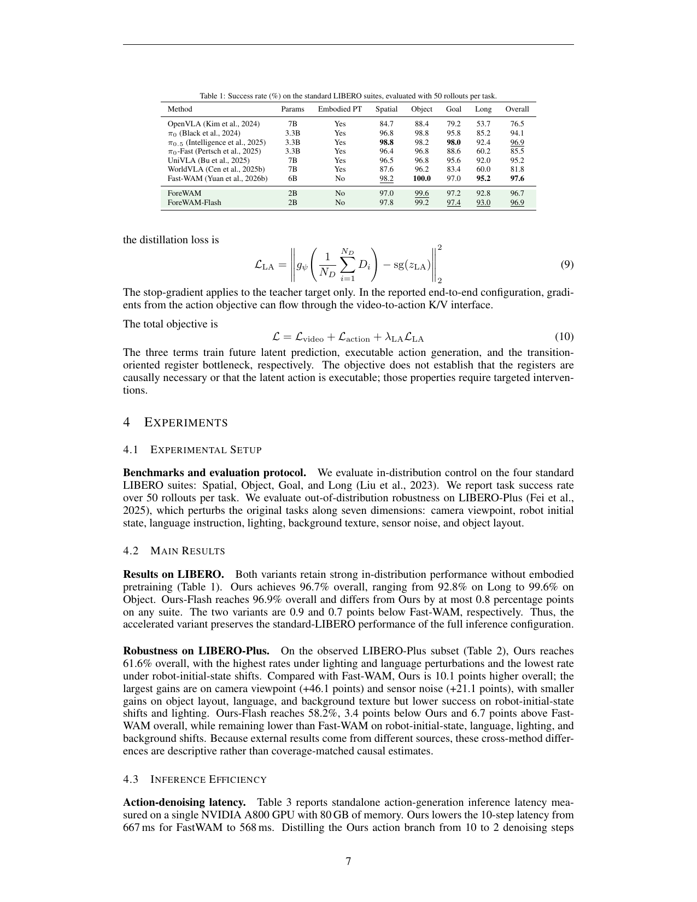
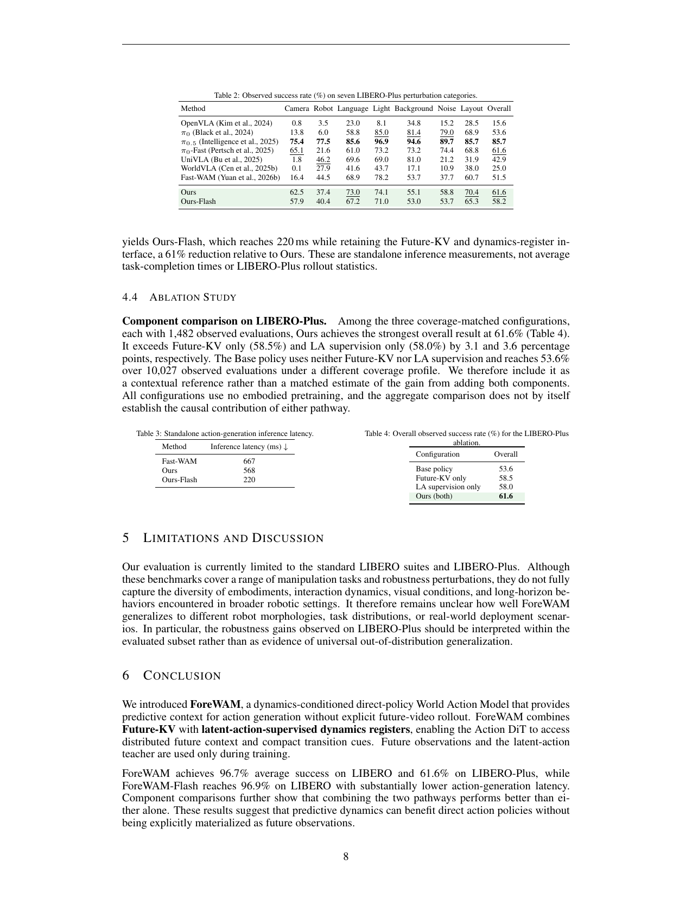

# Foresight Without Seeing: Latent Futures for World Action Models

## 文献元数据 / Metadata

- **Authors:** Jiakai Huang, Zhongbo Wu, Zheng Zhang, Zihan Wang, Shan You, Tao Huang
- **Affiliations:** 1 Shanghai Jiao Tong University; 2 ACE Robotics; 3 Nanyang Technological University
- **Version:** arXiv:2608.11605v1, 12 August 2026
- **Source PDF:** `Huang 等 - 2026 - Foresight Without Seeing Latent Futures for World Action Models.pdf`
- **PDF page count:** 12

## 阅读说明 / Reading note

> <strong>Para. 1:</strong> This file preserves the source paper in order. Each substantive prose block is followed by its Chinese translation. References are retained in searchable original bibliographic form, as required for exact author names, titles, venues, URLs, and identifiers.

> <strong>Para. 1[CN]:</strong> 本文件按原文顺序保留论文内容。每个实质性英文段落后紧跟中文译文。参考文献以可检索的原始书目信息保留，以确保作者姓名、标题、出版物、URL 和标识符的准确性。

## Abstract / 摘要

> <strong>Para. 2:</strong> World Action Models (WAMs) couple future visual prediction with robot action generation, enabling policies to model how the physical world evolves during interaction. Existing WAMs differ primarily in how such predictive dynamics are exposed to the action pathway. Explicit-future WAMs provide direct access to predicted scene evolution through future generation, but incur substantial inference costs from iterative video denoising. In contrast, direct-policy WAMs skip future generation and efficiently predict actions from the current observation, but lack an explicit inference-time interface for exposing predictive dynamics to the Action DiT. To bridge this gap, we propose ForeWAM, a dynamics-conditioned direct-policy WAM that provides predictive context for action generation without decoding future videos. At its core, Future-KV performs a single Video DiT prefill over the clean current visual latent and stochastic future slots, and reuses the resulting layer-wise key-value states throughout action denoising. This allows the Action DiT to access predictive context formed by the video backbone without iterative future generation. We further introduce dynamics registers supervised by a frozen latent action teacher, encouraging the implicit future states to capture interaction-induced transitions, including object motion, contact changes, and task progress. Ground-truth future observations and the teacher are used only during training; deployment requires neither future observations nor the teacher and performs no future video generation. Without embodied robot data pretraining, the standard and accelerated variants of ForeWAM achieve average success rates of 96.7% and 96.9% on LIBERO, respectively. The standard variant further achieves 61.6% success on LIBERO-Plus. These results demonstrate that direct-policy WAMs can retain efficient action prediction while exposing predictive dynamics to the action pathway, without explicitly generating future observations.

> <strong>Para. 2[CN]:</strong> 世界动作模型（World Action Models，WAM）将未来视觉预测与机器人动作生成结合起来，使策略能够建模物理世界在交互过程中的演化方式。现有 WAM 的主要差异在于：这类预测性动力学以何种方式暴露给动作路径。显式未来型 WAM 通过生成未来内容，直接提供对预测场景演化的访问，但迭代式视频去噪会带来很高的推理成本。相较之下，直接策略型 WAM 跳过未来生成，从当前观测高效预测动作，但缺少在推理时向 Action DiT 暴露预测动力学的显式接口。为弥合这一差距，我们提出 ForeWAM：一种动力学条件化的直接策略型 WAM，无需解码未来视频即可为动作生成提供预测上下文。其核心 Future-KV 在干净的当前视觉潜变量和随机未来槽位上执行一次 Video DiT 预填充，并在整个动作去噪过程中复用由此得到的逐层键值状态。这使 Action DiT 能够访问由视频骨干形成的预测上下文，而不需要迭代生成未来内容。我们进一步引入由冻结潜在动作教师监督的动力学寄存器，促使隐式未来状态捕获交互诱导的状态转变，包括物体运动、接触变化和任务进展。真实未来观测与教师仅在训练期间使用；部署时既不需要未来观测，也不需要教师，并且不进行未来视频生成。在没有具身机器人数据预训练的情况下，ForeWAM 的标准版和加速版在 LIBERO 上分别取得 96.7% 和 96.9% 的平均成功率；标准版在 LIBERO-Plus 上进一步取得 61.6% 的成功率。这些结果表明，直接策略型 WAM 能够在保持高效动作预测的同时，向动作路径暴露预测动力学，而无需显式生成未来观测。

## 1 Introduction / 引言

> <strong>Para. 3:</strong> Vision-Language-Action (VLA) models offer a promising approach to Physical AI by predicting robot actions from visual observations and language instructions. However, they primarily learn reactive observation-to-action mappings without explicitly modeling how the physical world evolves through interaction. World Action Models (WAMs) have emerged as a new paradigm that couples future visual prediction with action generation, enabling policies to capture interaction-induced scene dynamics (Du et al., 2023; Hu et al., 2024; Sadigh & Song; Ye et al., 2026b; Zhu et al., 2025). WAM designs differ primarily in how predictive visual context reaches the action pathway, as summarized in Figure 1.

> <strong>Para. 3[CN]:</strong> 视觉-语言-动作（Vision-Language-Action，VLA）模型通过根据视觉观测和语言指令预测机器人动作，为 Physical AI 提供了一条有前景的路径。然而，它们主要学习反应式的“观测到动作”映射，并未显式建模物理世界如何在交互中演化。世界动作模型（WAM）作为一种新范式出现，将未来视觉预测与动作生成结合，使策略能够捕获交互诱导的场景动力学（Du et al., 2023；Hu et al., 2024；Sadigh & Song；Ye et al., 2026b；Zhu et al., 2025）。WAM 设计的主要区别在于预测视觉上下文如何到达动作路径，如图 1 所总结。

> <strong>Para. 4:</strong> Figure 1(a) first generates future observations and then conditions action prediction on them, whereas Figure 1(b) denoises future video and actions together (Du et al., 2023; Ye et al., 2026b; Bi et al., 2026). Both expose predicted scene changes to the action pathway, but iterative video denoising adds inference cost and generation errors may propagate into action prediction. Figure 1(c), represented by Fast-WAM, avoids future-video generation at inference while retaining future-video modeling during training (Yuan et al., 2026b). This improves efficiency, but leaves open how the Action DiT can access predictive, action-relevant context without a future rollout. Together, these designs expose a trade-off between predictive context and inference efficiency, raising a central question:

> <strong>Para. 4[CN]:</strong> 图 1(a) 先生成未来观测，再以其为条件预测动作；图 1(b) 则联合去噪未来视频和动作（Du et al., 2023；Ye et al., 2026b；Bi et al., 2026）。两者都将预测到的场景变化暴露给动作路径，但迭代式视频去噪增加了推理成本，而且生成误差可能传播到动作预测中。由 Fast-WAM 代表的图 1(c) 在训练期间保留未来视频建模，却在推理时避免未来视频生成（Yuan et al., 2026b）。这提高了效率，但 Action DiT 如何在没有未来 rollout 的情况下访问预测性、与动作相关的上下文，仍然是开放问题。总体而言，这些设计揭示了预测上下文与推理效率之间的权衡，并提出一个核心问题：

> <strong>Para. 5:</strong> How can a direct-policy WAM enable its Action DiT to access predictive dynamics without explicitly generating future observations?

> <strong>Para. 5[CN]:</strong> 直接策略型 WAM 如何在不显式生成未来观测的情况下，使其 Action DiT 访问预测动力学？

> <strong>Para. 6:</strong> We address this question with ForeWAM, a Foresight-without-Seeing World Action Model that learns to act from latent futures without video rollouts. As shown in Figure 1(d), ForeWAM preserves the direct-policy inference structure while replacing explicit future-observation generation with a latent future interface exposed to the Action DiT. At its core is Future-KV, an implicit interface that transfers predictive context from the Video DiT to the Action DiT. Future-KV preserves the clean visual latent of the current observation, initializes unobserved future slots with noise, and processes them through a single Video DiT prefill. The resulting layer-wise key–value states are cached and reused throughout action denoising, allowing the action pathway to access predictive context over both the current observation and latent future slots without iteratively generating or decoding future video.

> <strong>Para. 6[CN]:</strong> 我们提出 ForeWAM 来回答这一问题。这是一种“无须看见即可预见”（Foresight-without-Seeing）的世界动作模型，学习从潜在未来出发行动，而不进行视频 rollout。如图 1(d) 所示，ForeWAM 保留直接策略的推理结构，同时以暴露给 Action DiT 的潜在未来接口替代显式未来观测生成。其核心是 Future-KV，即将预测上下文从 Video DiT 传递给 Action DiT 的隐式接口。Future-KV 保留当前观测的干净视觉潜变量，将未观测的未来槽位初始化为噪声，并通过一次 Video DiT 预填充处理它们。所得逐层键值状态被缓存，并在整个动作去噪过程中复用，使动作路径能够在不迭代生成或解码未来视频的情况下，同时访问当前观测和潜在未来槽位上的预测上下文。

> <strong>Para. 7:</strong> To further encourage these implicit future states to focus on scene transitions induced by robot interaction, we introduce dynamics registers supervised by a frozen LaWM latent-action teacher (Chen et al., 2026a). During training, the teacher extracts compact, non-executable latent-action representations from pairs of real visual observations before and after a transition. These representations supervise the dynamics registers to encode state-transition information, including object motion, contact changes, and task progress. Future-KV thus establishes a predictive information pathway from the Video DiT to the Action DiT, while latent-action supervision further strengthens the interaction-relevant dynamics represented along this pathway. Ground-truth future observations and the latent-action teacher are used only during training. At deployment, ForeWAM requires neither future observations nor the teacher and performs no future-video generation.

> <strong>Para. 7[CN]:</strong> 为进一步促使这些隐式未来状态聚焦于机器人交互诱导的场景转变，我们引入由冻结 LaWM 潜在动作教师监督的动力学寄存器（Chen et al., 2026a）。训练期间，教师从一次转变前后的真实视觉观测对中提取紧凑且不可执行的潜在动作表示。这些表示监督动力学寄存器编码状态转变信息，包括物体运动、接触变化和任务进展。因此，Future-KV 在 Video DiT 与 Action DiT 之间建立了预测信息通路，而潜在动作监督进一步增强了该通路所表示的与交互相关的动力学。真实未来观测和潜在动作教师仅用于训练。部署时，ForeWAM 既不需要未来观测，也不需要教师，并且不生成未来视频。

> <strong>Para. 8:</strong> As a result, ForeWAM achieves competitive performance while substantially improving both training and inference efficiency, using only a compact Wan2.1-T2V-1.3B Video DiT and eliminating the need for embodied robot-data pretraining. To further accelerate inference, we apply OneDP (Wang et al., 2024) to distill the action-denoising process into a reduced-step schedule, yielding an accelerated variant termed ForeWAM-Flash. On our observed LIBERO-Plus subset, ForeWAM and ForeWAM-Flash achieve success rates of 61.6% and 58.2%, respectively, surpassing the reported Fast-WAM result of 51.5% by 10.1 and 6.7 percentage points. ForeWAM reduces the mean action-generation latency from 667 ms to 568 ms, a 14.8% reduction relative to Fast-WAM, while ForeWAM-Flash further lowers it to 220 ms, corresponding to a 67.0% reduction. Moreover, ForeWAM uses approximately one-third of the policy parameters of Fast-WAM (2B versus 6B).

> <strong>Para. 8[CN]:</strong> 因此，ForeWAM 在取得有竞争力性能的同时，显著提高了训练和推理效率：它只使用紧凑的 Wan2.1-T2V-1.3B Video DiT，并消除了具身机器人数据预训练的需求。为进一步加速推理，我们应用 OneDP（Wang et al., 2024）将动作去噪过程蒸馏为更少步数的调度，得到称为 ForeWAM-Flash 的加速版本。在我们观测到的 LIBERO-Plus 子集上，ForeWAM 和 ForeWAM-Flash 的成功率分别为 61.6% 和 58.2%，比报告的 Fast-WAM 结果 51.5% 分别高出 10.1 和 6.7 个百分点。ForeWAM 将平均动作生成延迟从 667 ms 降至 568 ms，相对于 Fast-WAM 降低 14.8%；ForeWAM-Flash 则进一步降至 220 ms，对应 67.0% 的降低。此外，ForeWAM 使用的策略参数约为 Fast-WAM 的三分之一（2B 对比 6B）。

> <strong>Para. 9:</strong> Our main contributions are summarized as follows:
>
> - We identify a key interface problem in direct-policy WAMs: removing future-video generation improves efficiency but eliminates the explicit pathway through which predictive dynamics reach the Action DiT.
> - We propose ForeWAM, combining Future-KV with latent-action-supervised dynamics registers. A single Video DiT prefill produces layer-wise K/V states for action denoising, while a frozen LaWM teacher encourages the registers to capture interaction-induced scene transitions.
> - Without embodied robot-data pretraining, ForeWAM achieves up to 10.1 percentage points higher LIBERO-Plus success and 67.0% lower action-generation latency than the reported Fast-WAM configuration, while using approximately one-third of its policy parameters. Matched component comparisons further validate the proposed design.

> <strong>Para. 9[CN]:</strong> 我们的主要贡献概括如下：
>
> - 我们识别出直接策略型 WAM 中的一个关键接口问题：移除未来视频生成能够提高效率，但也消除了预测动力学到达 Action DiT 的显式路径。
> - 我们提出 ForeWAM，将 Future-KV 与潜在动作监督的动力学寄存器结合起来。一次 Video DiT 预填充为动作去噪生成逐层 K/V 状态，而冻结的 LaWM 教师促使寄存器捕获交互诱导的场景转变。
> - 在没有具身机器人数据预训练的情况下，ForeWAM 相比报告的 Fast-WAM 配置，LIBERO-Plus 成功率最高提升 10.1 个百分点，动作生成延迟降低 67.0%，同时仅使用其约三分之一的策略参数。匹配组件的比较进一步验证了所提出的设计。

### Figure 1. World Action Model paradigms / 世界动作模型范式

**Caption:** World Action Model paradigms. (a) Cascaded WAMs first generate future observations and then condition action prediction on them. (b) Joint WAMs generate future observations and actions within a unified generative process. (c) Direct-policy WAMs skip future rollout at inference and condition action prediction on a latent world representation extracted from the current observation. (d) Our ForeWAM retains direct action prediction while additionally exposing action-relevant predictive dynamics through hidden future-slot K/V states and dynamics registers. Hatched tokens denote noisy variables; future slots are stochastic internal states rather than observed future frames.

**Caption[CN]:** 世界动作模型范式。(a) 级联式 WAM 首先生成未来观测，再以其为条件进行动作预测。(b) 联合式 WAM 在统一的生成过程中生成未来观测和动作。(c) 直接策略型 WAM 在推理时跳过未来 rollout，并根据从当前观测提取的潜在世界表示进行动作预测。(d) 我们的 ForeWAM 保留直接动作预测，同时通过隐藏的未来槽位 K/V 状态和动力学寄存器额外暴露与动作相关的预测动力学。阴影标记的 token 表示带噪变量；未来槽位是随机内部状态，而不是观测到的未来帧。

## 2 Related Work / 相关工作

### Vision-language-action policies / 视觉-语言-动作策略

> <strong>Para. 10:</strong> VLA models map visual observations and language instructions to executable robot actions (Brohan et al., 2022; 2023; Kim et al., 2024; Team et al., 2024; Liu et al., 2025; Huang & Zheng, 2025; Yang et al., 2026), commonly by attaching an action decoder to a pretrained vision-language backbone (Intelligence et al., 2026; 2025; Zhao et al., 2025). Diffusion and flow objectives support multimodal continuous action generation (Chi et al., 2025; Lipman et al., 2022; Black et al., 2024), while large-scale robot pretraining can improve transfer across tasks and embodiments (Bjorck et al., 2025; Bu et al., 2025; Zheng et al., 2026). These methods establish strong direct policies, but do not by themselves provide an explicit action-facing interface through which predictive visual dynamics can be accessed during control.

> <strong>Para. 10[CN]:</strong> VLA 模型将视觉观测和语言指令映射为可执行的机器人动作（Brohan et al., 2022；2023；Kim et al., 2024；Team et al., 2024；Liu et al., 2025；Huang & Zheng, 2025；Yang et al., 2026），通常通过在预训练视觉-语言骨干上连接动作解码器来实现（Intelligence et al., 2026；2025；Zhao et al., 2025）。扩散和 flow 目标支持多模态连续动作生成（Chi et al., 2025；Lipman et al., 2022；Black et al., 2024），而大规模机器人预训练能够改善跨任务和跨具身形态的迁移（Bjorck et al., 2025；Bu et al., 2025；Zheng et al., 2026）。这些方法建立了强大的直接策略，但它们本身没有提供一个面向动作的显式接口，使控制期间能够访问预测性视觉动力学。

### World-action models / 世界动作模型

> <strong>Para. 11:</strong> World Action Models (WAMs) augment direct action prediction with predictive world dynamics. Existing future-modeling WAMs broadly follow cascaded and joint paradigms. Cascaded approaches follow an imagine-then-act structure, predicting future observations or intermediate representations before extracting actions. Some methods explicitly generate future visual observations as intermediate plans (Du et al., 2023; 2024; Hu et al., 2024; Huang et al., 2024), whereas others use structured or compressed predictive representations, such as correspondences, point tracks, motion fields, masks, or distilled foresight (Bharadhwaj et al., 2024; Ko et al., 2024; Xu et al., 2024; Zhi et al., 2025; Lou et al., 2026; Yan et al., 2026). Joint WAMs instead co-model future states and actions within a shared architecture, allowing world and action representations to interact during generation. Autoregressive variants organize visual states and actions within a unified generative sequence (Cen et al., 2025b;a; Cheang et al., 2024; Wu et al., 2024), whereas diffusion- and flow-based variants jointly model world dynamics and action trajectories, with some recent approaches using latent or implicit representations for greater efficiency (Bi et al., 2026; Ye et al., 2026b; Zhu et al., 2025; Guo et al., 2024; Shen et al., 2026; Kim et al., 2026; Won et al., 2025; Yang et al., 2025; Chen et al., 2026b; Li et al., 2026; Yuan et al., 2026a; Team et al., 2026; Lyu et al., 2026). Although these approaches expose future scene evolution to action prediction, iterative future generation or tightly coupled world–action computation introduces substantial inference overhead. Direct-policy WAMs such as Fast-WAM avoid future generation by predicting actions from the current observation representation (Yuan et al., 2026b; Ye et al., 2026a). However, future dynamics are not explicitly exposed to the Action DiT under this direct-policy interface. In contrast, our method retains direct-policy inference while exposing predictive dynamics to the Action DiT through a hidden future-slot K/V interface and dynamics registers supervised by a LaWM latent-action target (Chen et al., 2026a). The intended contribution is therefore the complementary composition of these two conditioning paths, rather than no-rollout inference or future-aware representation learning in isolation.

> <strong>Para. 11[CN]:</strong> 世界动作模型通过预测性世界动力学增强直接动作预测。现有进行未来建模的 WAM 大体遵循级联式和联合式范式。级联方法采用“想象后行动”的结构，先预测未来观测或中间表示，再提取动作。一些方法显式生成未来视觉观测作为中间计划（Du et al., 2023；2024；Hu et al., 2024；Huang et al., 2024），另一些方法使用结构化或压缩的预测表示，例如对应关系、点轨迹、运动场、掩码或蒸馏得到的预见表示（Bharadhwaj et al., 2024；Ko et al., 2024；Xu et al., 2024；Zhi et al., 2025；Lou et al., 2026；Yan et al., 2026）。联合式 WAM 则在共享架构内共同建模未来状态与动作，使世界表示和动作表示在生成期间交互。自回归变体在统一生成序列中组织视觉状态和动作（Cen et al., 2025b;a；Cheang et al., 2024；Wu et al., 2024）；扩散和 flow 变体则联合建模世界动力学和动作轨迹，近期一些方法还采用潜在或隐式表示以提高效率（Bi et al., 2026；Ye et al., 2026b；Zhu et al., 2025；Guo et al., 2024；Shen et al., 2026；Kim et al., 2026；Won et al., 2025；Yang et al., 2025；Chen et al., 2026b；Li et al., 2026；Yuan et al., 2026a；Team et al., 2026；Lyu et al., 2026）。尽管这些方法将未来场景演化暴露给动作预测，迭代式未来生成或紧耦合的世界-动作计算仍会引入很大的推理开销。Fast-WAM 等直接策略型 WAM 通过从当前观测表示预测动作来避免未来生成（Yuan et al., 2026b；Ye et al., 2026a）。然而，在这种直接策略接口下，未来动力学并未显式暴露给 Action DiT。相比之下，我们的方法保留直接策略推理，同时通过隐藏的未来槽位 K/V 接口以及由 LaWM 潜在动作目标监督的动力学寄存器，将预测动力学暴露给 Action DiT（Chen et al., 2026a）。因此，本文有意贡献的是这两条条件化路径的互补组合，而不是孤立的无 rollout 推理或具备未来感知的表示学习。

## 3 Method / 方法

> <strong>Para. 12:</strong> Our goal is to expose predictive visual context to a direct action policy without decoding a future video at deployment. The proposed model combines a video diffusion transformer, a dedicated Action DiT, a hidden future-slot K/V cache, and latent-action-supervised dynamics registers (Figure 2). The cache preserves distributed visual context, whereas the registers provide a compact transition-oriented pathway. We first formalize the deployment interface, then describe token routing and the two conditioning paths, and finally specify the joint training objective.

> <strong>Para. 12[CN]:</strong> 我们的目标是在部署时不解码未来视频的情况下，将预测性视觉上下文暴露给直接动作策略。所提出的模型结合了视频扩散 Transformer、专用 Action DiT、隐藏的未来槽位 K/V 缓存，以及潜在动作监督的动力学寄存器（图 2）。缓存保留分布式视觉上下文，而寄存器提供紧凑的、面向状态转变的路径。我们首先形式化部署接口，随后描述 token 路由和两条条件化路径，最后给出联合训练目标。

### 3.1 Problem Formulation / 问题形式化

> <strong>Para. 13:</strong> We consider language-conditioned chunk-level control. At control time, the policy receives a synchronized multi-camera observation $o$, an instruction $l$, and a proprioceptive state $p$. It predicts an executable action chunk $a_{1:H} \in \mathbb{R}^{H \times d_{act}}$ of horizon $H$. A direct policy models

$$
p_\theta(a_{1:H}\mid o,l,p). \tag{1}
$$

> <strong>Para. 13[CN]:</strong> 我们考虑语言条件化的分块控制。在控制时刻，策略接收同步的多摄像头观测 $o$、指令 $l$ 和本体感知状态 $p$，并预测时域为 $H$ 的可执行动作块 $a_{1:H} \in \mathbb{R}^{H \times d_{act}}$。直接策略建模为

$$
p_\theta(a_{1:H}\mid o,l,p). \tag{1}
$$

> <strong>Para. 14:</strong> At inference, future observations, privileged simulator state, and teacher outputs are unavailable. Let $u_{1:T}$ denote a future visual trajectory or its latent representation. An explicit-future WAM may factorize action prediction conceptually as

$$
p(a_{1:H}\mid o,l,p)=\int p_\phi(u_{1:T}\mid o,l,p)\,p_\theta(a_{1:H}\mid o,l,p,u_{1:T})\,du_{1:T}. \tag{2}
$$

> <strong>Para. 14[CN]:</strong> 推理时无法获得未来观测、特权模拟器状态和教师输出。令 $u_{1:T}$ 表示未来视觉轨迹或其潜在表示。显式未来型 WAM 在概念上可以将动作预测分解为

$$
p(a_{1:H}\mid o,l,p)=\int p_\phi(u_{1:T}\mid o,l,p)\,p_\theta(a_{1:H}\mid o,l,p,u_{1:T})\,du_{1:T}. \tag{2}
$$

> <strong>Para. 15:</strong> This factorization is commonly approximated by generating a future representation before or together with the action. It exposes temporal context, but couples control latency to future generation. A direct-policy WAM can instead retain a future-video training objective while omitting future rollout at inference (Yuan et al., 2026b). Our problem is to retain this direct policy while giving its Action DiT an explicit route to predictive visual context.

> <strong>Para. 15[CN]:</strong> 这种分解通常通过在动作之前或与动作一起生成未来表示来近似。它暴露了时间上下文，但将控制延迟与未来生成耦合起来。直接策略型 WAM 则可以保留未来视频训练目标，同时在推理时省略未来 rollout（Yuan et al., 2026b）。我们要解决的问题是在保留该直接策略的同时，为其 Action DiT 提供访问预测性视觉上下文的显式路径。

> <strong>Para. 16:</strong> We distinguish the teacher-forced training target from the deployment-time interface. Let $z_{1:T}$ denote the VAE encoding of the demonstrated video segment used by the video flow-matching loss. During training, the video branch uses this target; at deployment, we construct a stochastic substrate $\tilde z^{F}_{1:T}$ without observing the future segment, and expose its hidden per-layer K/V state $H_{KV}$ together with its dynamics-register slice $D_\theta$ to the Action DiT. Given a current-frame latent $z_{cur}(o)$, the substrate is

$$
\tilde z^{F}_{1:T}=\operatorname{concat}(z_{cur}(o),\epsilon^F),\qquad \epsilon^F\sim\mathcal{N}(0,I). \tag{3}
$$

> <strong>Para. 16[CN]:</strong> 我们区分教师强制的训练目标与部署时接口。令 $z_{1:T}$ 表示演示视频片段的 VAE 编码，该片段用于视频 flow-matching 损失。训练期间，视频分支使用这一目标；部署时，在不观察未来片段的情况下构造随机基底 $\tilde z^{F}_{1:T}$，并将其隐藏的逐层 K/V 状态 $H_{KV}$ 以及动力学寄存器切片 $D_\theta$ 暴露给 Action DiT。给定当前帧潜变量 $z_{cur}(o)$，该基底为

$$
\tilde z^{F}_{1:T}=\operatorname{concat}(z_{cur}(o),\epsilon^F),\qquad \epsilon^F\sim\mathcal{N}(0,I). \tag{3}
$$

> <strong>Para. 17:</strong> A single video prefill produces the dynamics-register states and their per-layer cache:

$$
(D_\theta,H_{KV})=\operatorname{KVPrefill}_\phi\left(\tilde z^{F}_{1:T},l,p\right). \tag{4}
$$

> <strong>Para. 17[CN]:</strong> 一次视频预填充产生动力学寄存器状态及其逐层缓存：

$$
(D_\theta,H_{KV})=\operatorname{KVPrefill}_\phi\left(\tilde z^{F}_{1:T},l,p\right). \tag{4}
$$

> <strong>Para. 18:</strong> The resulting deployment-time policy is

$$
p_\theta\left(a_{1:H}\mid o,l,p,D_\theta(o,l,p,\epsilon^F),H_{KV}(o,l,p,\epsilon^F)\right). \tag{5}
$$

> <strong>Para. 18[CN]:</strong> 由此得到的部署时策略为

$$
p_\theta\left(a_{1:H}\mid o,l,p,D_\theta(o,l,p,\epsilon^F),H_{KV}(o,l,p,\epsilon^F)\right). \tag{5}
$$

> <strong>Para. 19:</strong> Equation 5 remains a direct action policy: it conditions on neither a ground-truth future nor a decoded video. The stochastic future slots are an internal conditioning substrate, and their usefulness is learned from the joint video–action objective rather than from future observations at deployment.

> <strong>Para. 19[CN]:</strong> 方程 (5) 仍然是直接动作策略：它既不以真实未来为条件，也不以解码后的视频为条件。随机未来槽位是内部条件化基底，其有效性是从联合视频-动作目标中学习得到的，而不是在部署时从未来观测中获得的。

### 3.2 Model Architecture / 模型架构

#### Design rationale / 设计动机

> <strong>Para. 20:</strong> Direct-policy WAMs eliminate the iterative cost of generating future video, but this efficiency also leaves the action expert without an explicit, action-facing representation of how the scene may evolve. When the Action DiT is conditioned primarily on features of the current observation, it must infer both the present scene configuration and the consequences of candidate actions from the same visual context. This is particularly challenging for interaction-dependent behaviors, such as grasping, pushing, and placing, in which the appropriate action depends on the state transition induced by physical contact. We therefore seek to retain direct action prediction while providing the action expert with hidden features that encode task-relevant temporal structure, without access to future observations or decoded future video at inference time.

> <strong>Para. 20[CN]:</strong> 直接策略型 WAM 消除了生成未来视频的迭代成本，但这种效率也使动作专家缺少一个面向动作的显式表示，无法表示场景可能如何演化。当 Action DiT 主要以当前观测的特征为条件时，它必须从同一视觉上下文中同时推断当前场景配置和候选动作的后果。这对于依赖交互的行为尤其困难，例如抓取、推动和放置，因为适当动作取决于物理接触所诱导的状态转变。因此，我们希望保留直接动作预测，同时为动作专家提供编码任务相关时间结构的隐藏特征，而在推理时不访问未来观测或解码后的未来视频。

> <strong>Para. 21:</strong> Our model addresses this challenge through two complementary context pathways. First, Future-KV provides distributed visual context over the current frame and future latent slots. The video backbone preserves the clean latent of the current frame, initializes the future slots with noise, and performs a single prefill. The resulting layer-wise keys and values are cached and made available to the Action DiT throughout action denoising. Because the cache is maintained in feature space, Future-KV exposes spatiotemporal context without requiring an iterative future-video rollout or pixel-space reconstruction.

> <strong>Para. 21[CN]:</strong> 我们的模型通过两条互补的上下文路径解决这一挑战。第一，Future-KV 在当前帧和未来潜在槽位上提供分布式视觉上下文。视频骨干保留当前帧的干净潜变量，将未来槽位初始化为噪声，并执行一次预填充。得到的逐层键和值被缓存，并在整个动作去噪过程中提供给 Action DiT。由于缓存保留在特征空间中，Future-KV 无需迭代式未来视频 rollout 或像素空间重建，即可暴露时空上下文。

> <strong>Para. 22:</strong> Second, we apply latent-action (LA) supervision to a compact set of dynamics registers. A frozen LaWM teacher maps the demonstrated visual transition to a latent-action target, and a trainable projection head encourages the dynamics registers to match this target. This supervision biases the registers towards interaction-relevant changes, rather than requiring the action expert to recover such information solely from a generic future-video objective. The latent-action target serves as a non-executable transition cue and is used only during training.

> <strong>Para. 22[CN]:</strong> 第二，我们对一组紧凑的动力学寄存器施加潜在动作（LA）监督。冻结的 LaWM 教师将演示视觉转变映射为潜在动作目标，可训练的投影头则促使动力学寄存器匹配该目标。这种监督使寄存器偏向与交互相关的变化，而不要求动作专家仅从通用未来视频目标中恢复这些信息。潜在动作目标充当不可执行的转变提示，并且仅在训练期间使用。

> <strong>Para. 23:</strong> The two pathways impose different inductive biases. Future-KV preserves rich, distributed visual information, whereas the LA-supervised dynamics registers provide a compact, action-oriented summary of transition structure. The Action DiT reads both pathways through the structured attention routing described below. At inference, actions are predicted directly from the current observation and these hidden representations; neither future observations nor the LaWM teacher is available, and no future video is decoded. Sec. 4.4 evaluates the corresponding component configurations, including a coverage-distinct base-policy reference without Future-KV or LA supervision. The observed complementarity is therefore a configuration-level result rather than a fully matched causal conclusion.

> <strong>Para. 23[CN]:</strong> 两条路径施加了不同的归纳偏置。Future-KV 保留丰富的分布式视觉信息，而 LA 监督的动力学寄存器提供紧凑、面向动作的转变结构摘要。Action DiT 通过下文所述的结构化注意力路由读取两条路径。推理时，动作直接根据当前观测及这些隐藏表示进行预测；未来观测和 LaWM 教师均不可用，也不会解码未来视频。第 4.4 节评估相应的组件配置，包括一个不使用 Future-KV 或 LA 监督、且覆盖范围不同的基础策略参考。因此，观测到的互补性是配置层面的结果，而不是完全匹配的因果结论。

#### Token groups and routing / Token 分组与路由

> <strong>Para. 24:</strong> The reported configuration uses four token groups: current-frame tokens $C$, dynamics registers $D=\{D_i\}_{i=1}^{N_D}$, future-slot tokens $F$, and action tokens $A$. Readability registers are disabled. The current observation is encoded into $C$, and $F$ occupies the latent positions initialized in Eq. 3. The Action DiT receives a noisy action chunk and predicts its flow. Both branches use the Wan2.1 text condition; the proprioceptive state is projected into the conditioning space as an additional context token.

> <strong>Para. 24[CN]:</strong> 报告的配置使用四组 token：当前帧 token $C$、动力学寄存器 $D=\{D_i\}_{i=1}^{N_D}$、未来槽位 token $F$ 和动作 token $A$。可读性寄存器被禁用。当前观测被编码为 $C$，而 $F$ 占据方程 (3) 初始化的潜在位置。Action DiT 接收带噪动作块并预测其 flow。两个分支都使用 Wan2.1 文本条件；本体感知状态被投影到条件空间，作为额外的上下文 token。

> <strong>Para. 25:</strong> The structured attention mask routes information as Figure 3. Thus, future-slot tokens can integrate the current frame and dynamics registers, and action tokens can read the complete video sequence together with the registers. In the implementation, each action query concatenates the cached video keys and values with the keys and values computed from the current action tokens at that denoising step. The mask defines architectural routing; it is not by itself evidence of disentanglement or causal sufficiency.

> <strong>Para. 25[CN]:</strong> 结构化注意力掩码按照图 3 所示路由信息。因此，未来槽位 token 可以整合当前帧和动力学寄存器，动作 token 则可以读取完整视频序列以及寄存器。在实现中，每个动作查询都会将缓存的视频键和值，与该去噪步骤由当前动作 token 计算得到的键和值拼接起来。掩码定义的是架构路由；它本身并不是解耦或因果充分性的证据。

#### Future-KV prefill / Future-KV 预填充

> <strong>Para. 26:</strong> During training, the video branch receives demonstrated future latents and learns a future-latent flow objective, so its intermediate states receive a temporal learning signal. At inference, we preserve the clean current latent, place pure noise in future slots, and run the video branch once at the prefill level $\sigma=1.0$. We cache the resulting key and value tensors at every layer and reuse them throughout action denoising. Future-KV therefore incurs one video prefill per action query instead of an iterative future-video rollout. The cached states are hidden conditioning features, not realized future frames; no future observation is decoded or fed back into the control loop. In the end-to-end configuration, gradients from the action loss remain connected to this prefill during training.

> <strong>Para. 26[CN]:</strong> 训练期间，视频分支接收演示未来潜变量并学习未来潜变量 flow 目标，因此其中间状态获得时间学习信号。推理时，我们保留干净的当前潜变量，在未来槽位中放入纯噪声，并在预填充层级 $\sigma=1.0$ 运行一次视频分支。我们缓存每一层得到的键和值张量，并在整个动作去噪过程中复用它们。因此，Future-KV 对每个动作查询只产生一次视频预填充，而不是迭代式未来视频 rollout。缓存状态是隐藏的条件特征，而非已实现的未来帧；没有未来观测被解码或反馈到控制循环中。在端到端配置中，动作损失的梯度在训练期间仍与该预填充保持连接。

#### Latent-action-supervised dynamics registers / 潜在动作监督的动力学寄存器

> <strong>Para. 27:</strong> Generic video supervision need not preferentially retain interaction-relevant change. We therefore use a frozen LaWM latent-action encoder, trained as an inverse-dynamics component, to encode the demonstrated visual transition as a quantized latent-action target $z_{LA}$ during training. The mean-pooled dynamics registers pass through a trainable projection $g_\psi$ into the teacher space. This target describes a visual transition; it is neither passed to the policy at deployment nor interpreted as a motor command. Executable actions remain the output of the Action DiT. The LA path is thus a training-time shaping signal for a compact register interface, not a second action decoder.

> <strong>Para. 27[CN]:</strong> 通用视频监督不一定会优先保留与交互相关的变化。因此，在训练期间，我们使用冻结的 LaWM 潜在动作编码器（它作为逆动力学组件训练）将演示视觉转变编码为量化的潜在动作目标 $z_{LA}$。经过均值池化的动力学寄存器通过可训练投影 $g_\psi$ 映射到教师空间。该目标描述的是视觉转变；它既不会在部署时传递给策略，也不会被解释为电机命令。可执行动作仍然由 Action DiT 输出。因此，LA 路径是对紧凑寄存器接口的训练时塑形信号，而不是第二个动作解码器。

> <strong>Para. 28:</strong> At inference, the policy encodes the current observation, builds the stochastic future substrate, prefills the cache once, and denoises the action chunk while reading $C$, $D$, and $H_{KV}$. The teacher and observed future transition are absent from this computation.

> <strong>Para. 28[CN]:</strong> 推理时，策略编码当前观测，构建随机未来基底，执行一次缓存预填充，并在读取 $C$、$D$ 和 $H_{KV}$ 的同时对动作块进行去噪。教师和观测到的未来转变都不参与该计算。

### 3.3 Training Objective / 训练目标

> <strong>Para. 29:</strong> We train the video and action branches with continuous flow matching (Lipman et al., 2022). For a target $y$, either a future video latent or an action chunk, we draw noise $\epsilon$ and a time variable $t$, and form

$$
y_t=(1-t)y+t\epsilon. \tag{6}
$$

> <strong>Para. 29[CN]:</strong> 我们使用连续 flow matching 训练视频分支和动作分支（Lipman et al., 2022）。对于目标 $y$（可以是未来视频潜变量或动作块），采样噪声 $\epsilon$ 和时间变量 $t$，并构造

$$
y_t=(1-t)y+t\epsilon. \tag{6}
$$

> <strong>Para. 30:</strong> The target velocity is $\epsilon-y$, giving

$$
\mathcal{L}_{FM}(y)=\mathbb{E}_{y,\epsilon,t}\left[\left\|f_\theta(y_t,t,o,l,p)-(\epsilon-y)\right\|_2^2\right]. \tag{7}
$$

> <strong>Para. 30[CN]:</strong> 目标速度为 $\epsilon-y$，因此

$$
\mathcal{L}_{FM}(y)=\mathbb{E}_{y,\epsilon,t}\left[\left\|f_\theta(y_t,t,o,l,p)-(\epsilon-y)\right\|_2^2\right]. \tag{7}
$$

> <strong>Para. 31:</strong> The video and action losses are

$$
\mathcal{L}_{video}=\mathcal{L}_{FM}(z_{1:T}),\qquad \mathcal{L}_{action}=\mathcal{L}_{FM}(a_{1:H}), \tag{8}
$$

> where $z_{1:T}$ is the demonstrated video-latent target and $a_{1:H}$ is the demonstrated executable action chunk. The frozen teacher supplies a detached target $z_{LA}$. With mean-pooled dynamics registers, the distillation loss is

$$
\mathcal{L}_{LA}=\left\|g_\psi\left(\frac{1}{N_D}\sum_{i=1}^{N_D}D_i\right)-\operatorname{sg}(z_{LA})\right\|_2^2. \tag{9}
$$

> <strong>Para. 31[CN]:</strong> 视频损失和动作损失为

$$
\mathcal{L}_{video}=\mathcal{L}_{FM}(z_{1:T}),\qquad \mathcal{L}_{action}=\mathcal{L}_{FM}(a_{1:H}), \tag{8}
$$

其中，$z_{1:T}$ 是演示视频潜变量目标，$a_{1:H}$ 是演示的可执行动作块。冻结教师提供脱离梯度的目标 $z_{LA}$。对于均值池化的动力学寄存器，蒸馏损失为

$$
\mathcal{L}_{LA}=\left\|g_\psi\left(\frac{1}{N_D}\sum_{i=1}^{N_D}D_i\right)-\operatorname{sg}(z_{LA})\right\|_2^2. \tag{9}
$$

> <strong>Para. 32:</strong> The stop-gradient applies to the teacher target only. In the reported end-to-end configuration, gradients from the action objective can flow through the video-to-action K/V interface. The total objective is

$$
\mathcal{L}=\mathcal{L}_{video}+\mathcal{L}_{action}+\lambda_{LA}\mathcal{L}_{LA}. \tag{10}
$$

> The three terms train future latent prediction, executable action generation, and the transition-oriented register bottleneck, respectively. The objective does not establish that the registers are causally necessary or that the latent action is executable; those properties require targeted interventions.

> <strong>Para. 32[CN]:</strong> 停止梯度仅作用于教师目标。在报告的端到端配置中，动作目标的梯度可以通过视频到动作的 K/V 接口传播。总目标为

$$
\mathcal{L}=\mathcal{L}_{video}+\mathcal{L}_{action}+\lambda_{LA}\mathcal{L}_{LA}. \tag{10}
$$

三个项分别训练未来潜变量预测、可执行动作生成以及面向状态转变的寄存器瓶颈。该目标并不能证明寄存器在因果上是必要的，也不能证明潜在动作是可执行的；这些性质需要有针对性的干预来验证。

## 4 Experiments / 实验

### 4.1 Experimental Setup / 实验设置

> <strong>Para. 33:</strong> We evaluate in-distribution control on the four standard LIBERO suites: Spatial, Object, Goal, and Long (Liu et al., 2023). We report task success rate over 50 rollouts per task. We evaluate out-of-distribution robustness on LIBERO-Plus (Fei et al., 2025), which perturbs the original tasks along seven dimensions: camera viewpoint, robot initial state, language instruction, lighting, background texture, sensor noise, and object layout.

> <strong>Para. 33[CN]:</strong> 我们在四个标准 LIBERO 套件——Spatial、Object、Goal 和 Long——上评估分布内控制（Liu et al., 2023），每个任务进行 50 次 rollout 并报告任务成功率。我们在 LIBERO-Plus（Fei et al., 2025）上评估分布外鲁棒性；该基准沿七个维度扰动原始任务：摄像机视角、机器人初始状态、语言指令、光照、背景纹理、传感器噪声和物体布局。

### 4.2 Main Results / 主要结果

#### Results on LIBERO / LIBERO 结果

> <strong>Para. 34:</strong> Both variants retain strong in-distribution performance without embodied pretraining (Table 1). Ours achieves 96.7% overall, ranging from 92.8% on Long to 99.6% on Object. Ours-Flash reaches 96.9% overall and differs from Ours by at most 0.8 percentage points on any suite. The two variants are 0.9 and 0.7 points below Fast-WAM, respectively. Thus, the accelerated variant preserves the standard-LIBERO performance of the full inference configuration.

> <strong>Para. 34[CN]:</strong> 两个变体在没有具身预训练的情况下仍保持很强的分布内性能（表 1）。Ours 的总体成功率为 96.7%，各套件范围从 Long 的 92.8% 到 Object 的 99.6%。Ours-Flash 的总体成功率为 96.9%，在任何套件上与 Ours 的差异最多为 0.8 个百分点。两个变体分别比 Fast-WAM 低 0.9 和 0.7 个百分点。因此，加速变体保持了完整推理配置在标准 LIBERO 上的性能。

#### Robustness on LIBERO-Plus / LIBERO-Plus 鲁棒性

> <strong>Para. 35:</strong> On the observed LIBERO-Plus subset (Table 2), Ours reaches 61.6% overall, with the highest rates under lighting and language perturbations and the lowest rate under robot-initial-state shifts. Compared with Fast-WAM, Ours is 10.1 points higher overall; the largest gains are on camera viewpoint (+46.1 points) and sensor noise (+21.1 points), with smaller gains on object layout, language, and background texture but lower success on robot-initial-state shifts and lighting. Ours-Flash reaches 58.2%, 3.4 points below Ours and 6.7 points above Fast-WAM overall, while remaining lower than Fast-WAM on robot-initial-state, language, lighting, and background shifts. Because external results come from different sources, these cross-method differences are descriptive rather than coverage-matched causal estimates.

> <strong>Para. 35[CN]:</strong> 在观测到的 LIBERO-Plus 子集上（表 2），Ours 的总体成功率达到 61.6%；在光照和语言扰动下成功率最高，在机器人初始状态偏移下最低。与 Fast-WAM 相比，Ours 的总体结果高出 10.1 个百分点；最大增益出现在摄像机视角（+46.1 个百分点）和传感器噪声（+21.1 个百分点）上，在物体布局、语言和背景纹理上增益较小，但在机器人初始状态偏移和光照下成功率较低。Ours-Flash 达到 58.2%，总体比 Ours 低 3.4 个百分点、比 Fast-WAM 高 6.7 个百分点，但在机器人初始状态、语言、光照和背景偏移上仍低于 Fast-WAM。由于外部结果来自不同来源，这些跨方法差异是描述性的，而不是覆盖范围匹配的因果估计。

### 4.3 Inference Efficiency / 推理效率

#### Action-denoising latency / 动作去噪延迟

> <strong>Para. 36:</strong> Table 3 reports standalone action-generation inference latency measured on a single NVIDIA A800 GPU with 80 GB of memory. Ours lowers the 10-step latency from 667 ms for Fast-WAM to 568 ms. Distilling the Ours action branch from 10 to 2 denoising steps yields Ours-Flash, which reaches 220 ms while retaining the Future-KV and dynamics-register interface, a 61% reduction relative to Ours. These are standalone inference measurements, not average task-completion times or LIBERO-Plus rollout statistics.

> <strong>Para. 36[CN]:</strong> 表 3 报告了在一张具有 80 GB 显存的 NVIDIA A800 GPU 上测量的独立动作生成推理延迟。Ours 将 Fast-WAM 的 10 步延迟从 667 ms 降低到 568 ms。将 Ours 的动作分支从 10 步蒸馏到 2 步去噪得到 Ours-Flash；在保留 Future-KV 和动力学寄存器接口的同时，它达到 220 ms，相对于 Ours 降低 61%。这些是独立推理测量值，不是平均任务完成时间，也不是 LIBERO-Plus rollout 统计值。

### 4.4 Ablation Study / 消融研究

#### Component comparison on LIBERO-Plus / LIBERO-Plus 上的组件比较

> <strong>Para. 37:</strong> Among the three coverage-matched configurations, each with 1,482 observed evaluations, Ours achieves the strongest overall result at 61.6% (Table 4). It exceeds Future-KV only (58.5%) and LA supervision only (58.0%) by 3.1 and 3.6 percentage points, respectively. The Base policy uses neither Future-KV nor LA supervision and reaches 53.6% over 10,027 observed evaluations under a different coverage profile. We therefore include it as a contextual reference rather than a matched estimate of the gain from adding both components. All configurations use no embodied pretraining, and the aggregate comparison does not by itself establish the causal contribution of either pathway.

> <strong>Para. 37[CN]:</strong> 在三个覆盖范围匹配的配置中，每个配置均有 1,482 次观测评估，Ours 以 61.6% 取得最强总体结果（表 4）。它分别比仅使用 Future-KV（58.5%）和仅使用 LA 监督（58.0%）高 3.1 和 3.6 个百分点。Base policy 既不使用 Future-KV，也不使用 LA 监督，在覆盖范围不同的 10,027 次观测评估中达到 53.6%。因此，我们将其作为上下文参考，而不是将其视为加入两个组件所带来增益的匹配估计。所有配置均不使用具身预训练，汇总比较本身不能确立任一路径的因果贡献。

### Table 1. Success rate (%) on the standard LIBERO suites

| Method | Params | Embodied PT | Spatial | Object | Goal | Long | Overall |
|---|---:|:---:|---:|---:|---:|---:|---:|
| OpenVLA (Kim et al., 2024) | 7B | Yes | 84.7 | 88.4 | 79.2 | 53.7 | 76.5 |
| π0 (Black et al., 2024) | 3.3B | Yes | 96.8 | 98.8 | 95.8 | 85.2 | 94.1 |
| π0.5 (Intelligence et al., 2025) | 3.3B | Yes | 98.8 | 98.2 | 98.0 | 92.4 | 96.9 |
| π0-Fast (Pertsch et al., 2025) | 3.3B | Yes | 96.4 | 96.8 | 88.6 | 60.2 | 85.5 |
| UniVLA (Bu et al., 2025) | 7B | Yes | 96.5 | 96.8 | 95.6 | 92.0 | 95.2 |
| WorldVLA (Cen et al., 2025b) | 7B | Yes | 87.6 | 96.2 | 83.4 | 60.0 | 81.8 |
| Fast-WAM (Yuan et al., 2026b) | 6B | No | 98.2 | 100.0 | 97.0 | 95.2 | 97.6 |
| ForeWAM | 2B | No | 97.0 | 99.6 | 97.2 | 92.8 | 96.7 |
| ForeWAM-Flash | 2B | No | 97.8 | 99.2 | 97.4 | 93.0 | 96.9 |

**Caption:** Success rate (%) on the standard LIBERO suites, evaluated with 50 rollouts per task.

**Caption[CN]:** 标准 LIBERO 套件上的成功率（%），每个任务使用 50 次 rollout 评估。

### Table 2. Observed success rate (%) on seven LIBERO-Plus perturbation categories

| Method | Camera | Robot | Language | Light | Background | Noise | Layout | Overall |
|---|---:|---:|---:|---:|---:|---:|---:|---:|
| OpenVLA (Kim et al., 2024) | 0.8 | 3.5 | 23.0 | 8.1 | 34.8 | 15.2 | 28.5 | 15.6 |
| π0 (Black et al., 2024) | 13.8 | 6.0 | 58.8 | 85.0 | 81.4 | 79.0 | 68.9 | 53.6 |
| π0.5 (Intelligence et al., 2025) | 75.4 | 77.5 | 85.6 | 96.9 | 94.6 | 89.7 | 85.7 | 85.7 |
| π0-Fast (Pertsch et al., 2025) | 65.1 | 21.6 | 61.0 | 73.2 | 73.2 | 74.4 | 68.8 | 61.6 |
| UniVLA (Bu et al., 2025) | 1.8 | 46.2 | 69.6 | 69.0 | 81.0 | 21.2 | 31.9 | 42.9 |
| WorldVLA (Cen et al., 2025b) | 0.1 | 27.9 | 41.6 | 43.7 | 17.1 | 10.9 | 38.0 | 25.0 |
| Fast-WAM (Yuan et al., 2026b) | 16.4 | 44.5 | 68.9 | 78.2 | 53.7 | 37.7 | 60.7 | 51.5 |
| Ours | 62.5 | 37.4 | 73.0 | 74.1 | 55.1 | 58.8 | 70.4 | 61.6 |
| Ours-Flash | 57.9 | 40.4 | 67.2 | 71.0 | 53.0 | 53.7 | 65.3 | 58.2 |

**Caption:** Observed success rate (%) on seven LIBERO-Plus perturbation categories.

**Caption[CN]:** 七类 LIBERO-Plus 扰动类别上的观测成功率（%）。

### Table 3. Standalone action-generation inference latency

| Method | Inference latency (ms) ↓ |
|---|---:|
| Fast-WAM | 667 |
| Ours | 568 |
| Ours-Flash | 220 |

**Caption:** Standalone action-generation inference latency.

**Caption[CN]:** 独立动作生成推理延迟。

### Table 4. Overall observed success rate (%) for the LIBERO-Plus ablation

| Configuration | Overall |
|---|---:|
| Base policy | 53.6 |
| Future-KV only | 58.5 |
| LA supervision only | 58.0 |
| Ours (both) | 61.6 |

**Caption:** Overall observed success rate (%) for the LIBERO-Plus ablation.

**Caption[CN]:** LIBERO-Plus 消融实验的总体观测成功率（%）。

## 5 Limitations and Discussion / 局限性与讨论

> <strong>Para. 38:</strong> Our evaluation is currently limited to the standard LIBERO suites and LIBERO-Plus. Although these benchmarks cover a range of manipulation tasks and robustness perturbations, they do not fully capture the diversity of embodiments, interaction dynamics, visual conditions, and long-horizon behaviors encountered in broader robotic settings. It therefore remains unclear how well ForeWAM generalizes to different robot morphologies, task distributions, or real-world deployment scenarios. In particular, the robustness gains observed on LIBERO-Plus should be interpreted within the evaluated subset rather than as evidence of universal out-of-distribution generalization.

> <strong>Para. 38[CN]:</strong> 我们目前的评估仅限于标准 LIBERO 套件和 LIBERO-Plus。尽管这些基准涵盖了一系列操作任务和鲁棒性扰动，但它们无法充分体现更广泛机器人场景中遇到的具身形态、交互动力学、视觉条件和长时域行为的多样性。因此，ForeWAM 对不同机器人形态、任务分布或真实世界部署场景的泛化能力仍不明确。尤其是，在 LIBERO-Plus 上观察到的鲁棒性增益应当被理解为在所评估子集内的结果，而不应视为普适分布外泛化的证据。

## 6 Conclusion / 结论

> <strong>Para. 39:</strong> We introduced ForeWAM, a dynamics-conditioned direct-policy World Action Model that provides predictive context for action generation without explicit future-video rollout. ForeWAM combines Future-KV with latent-action-supervised dynamics registers, enabling the Action DiT to access distributed future context and compact transition cues. Future observations and the latent-action teacher are used only during training.

> <strong>Para. 39[CN]:</strong> 我们提出了 ForeWAM，这是一种动力学条件化的直接策略型世界动作模型，无需显式未来视频 rollout 即可为动作生成提供预测上下文。ForeWAM 将 Future-KV 与潜在动作监督的动力学寄存器结合，使 Action DiT 能够访问分布式未来上下文和紧凑的状态转变提示。未来观测和潜在动作教师仅在训练期间使用。

> <strong>Para. 40:</strong> ForeWAM achieves 96.7% average success on LIBERO and 61.6% on LIBERO-Plus, while ForeWAM-Flash reaches 96.9% on LIBERO with substantially lower action-generation latency. Component comparisons further show that combining the two pathways performs better than either alone. These results suggest that predictive dynamics can benefit direct action policies without being explicitly materialized as future observations.

> <strong>Para. 40[CN]:</strong> ForeWAM 在 LIBERO 上达到 96.7% 的平均成功率，在 LIBERO-Plus 上达到 61.6%；ForeWAM-Flash 在 LIBERO 上达到 96.9%，同时动作生成延迟显著更低。组件比较进一步表明，将两条路径结合起来的表现优于任一路径单独使用。这些结果说明，预测动力学能够使直接动作策略受益，而不必将其显式实现为未来观测。

## References / 参考文献

> <strong>Para. 41:</strong> The following references are transcribed from the source PDF. Bibliographic entries are intentionally retained in the original language and punctuation so that author names, titles, venues, page ranges, URLs, and arXiv identifiers remain exact and searchable.

> <strong>Para. 41[CN]:</strong> 以下参考文献根据源 PDF 转录。书目条目有意保留原始语言和标点，以确保作者姓名、标题、出版物、页码范围、URL 和 arXiv 标识符准确且可检索。

1. Homanga Bharadhwaj, Roozbeh Mottaghi, Abhinav Gupta, and Shubham Tulsiani. Track2act: Predicting point tracks from internet videos enables generalizable robot manipulation. In European Conference on Computer Vision, pp. 306–324. Springer, 2024.
2. Hongzhe Bi, Hengkai Tan, Shenghao Xie, Zeyuan Wang, Shuhe Huang, Haitian Liu, Ruowen Zhao, Yao Feng, Chendong Xiang, Yinze Rong, et al. Motus: A unified latent action world model. In Proceedings of the IEEE/CVF Conference on Computer Vision and Pattern Recognition, pp. 35101–35113, 2026.
3. Johan Bjorck, Fernando Castañeda, Nikita Cherniadev, Xingye Da, Runyu Ding, Linxi Fan, Yu Fang, Dieter Fox, Fengyuan Hu, Spencer Huang, et al. Gr00t n1: An open foundation model for generalist humanoid robots. arXiv preprint arXiv:2503.14734, 2025.
4. Kevin Black, Noah Brown, Danny Driess, Adnan Esmail, Michael Equi, Chelsea Finn, Niccolo Fusai, Lachy Groom, Karol Hausman, Brian Ichter, et al. π0: A vision-language-action flow model for general robot control. arXiv preprint arXiv:2410.24164, 2024.
5. Anthony Brohan, Noah Brown, Justice Carbajal, Yevgen Chebotar, Joseph Dabis, Chelsea Finn, Keerthana Gopalakrishnan, Karol Hausman, Alex Herzog, Jasmine Hsu, et al. Rt-1: Robotics transformer for real-world control at scale. arXiv preprint arXiv:2212.06817, 2022.
6. Anthony Brohan, Noah Brown, Justice Carbajal, Yevgen Chebotar, Xi Chen, Krzysztof Choromanski, Tianli Ding, Danny Driess, Avinava Dubey, Chelsea Finn, et al. Rt-2: Vision-language-action models transfer web knowledge to robotic control. arXiv preprint arXiv:2307.15818, 2023.
7. Qingwen Bu, Yanting Yang, Jisong Cai, Shenyuan Gao, Guanghui Ren, Maoqing Yao, Ping Luo, and Hongyang Li. Univla: Learning to act anywhere with task-centric latent actions, 2025. URL https://arxiv.org/abs/2505.06111, 2025.
8. Jun Cen, Siteng Huang, Yuqian Yuan, Kehan Li, Hangjie Yuan, Chaohui Yu, Bohan Hou, Yuming Jiang, Jiayan Guo, Xin Li, et al. Rynnvla-002: A unified vision-language-action and world model. arXiv preprint arXiv:2511.17502, 2025a.
9. Jun Cen, Chaohui Yu, Hangjie Yuan, Yuming Jiang, Siteng Huang, Jiayan Guo, Xin Li, Yibing Song, Hao Luo, Fan Wang, et al. Worldvla: Towards autoregressive action world model. arXiv preprint arXiv:2506.21539, 2025b.
10. Chi-Lam Cheang, Guangzeng Chen, Ya Jing, Tao Kong, Hang Li, Yifeng Li, Yuxiao Liu, Hongtao Wu, Jiafeng Xu, Yichu Yang, et al. Gr-2: A generative video-language-action model with web-scale knowledge for robot manipulation. arXiv preprint arXiv:2410.06158, 2024.
11. Jialei Chen, Kai Wang, Kang Chen, Shuaihang Chen, Feng Gao, Wenhao Tang, Zhiyuan Li, Weilin Liu, Zhuyu Yao, Boxun Li, et al. Lawam: Latent world action models for efficient dynamics-aware robot policies. arXiv preprint arXiv:2606.15768, 2026a.
12. Jiayi Chen, Wenxuan Song, Pengxiang Ding, Ziyang Zhou, Han Zhao, Barrett Tang, Donglin Wang, and Haoang Li. Unified diffusion vla: Vision-language-action model via joint discrete denosing diffusion process. In International Conference on Learning Representations, volume 2026, pp. 139291–139311, 2026b.
13. Cheng Chi, Zhenjia Xu, Siyuan Feng, Eric Cousineau, Yilun Du, Benjamin Burchfiel, Russ Tedrake, and Shuran Song. Diffusion policy: Visuomotor policy learning via action diffusion. The International Journal of Robotics Research, 44(10-11):1684–1704, 2025.
14. Yilun Du, Sherry Yang, Bo Dai, Hanjun Dai, Ofir Nachum, Josh Tenenbaum, Dale Schuurmans, and Pieter Abbeel. Learning universal policies via text-guided video generation. Advances in neural information processing systems, 36:9156–9172, 2023.
15. Yilun Du, Sherry Yang, Pete Florence, Fei Xia, Ayzaan Wahid, Pierre Sermanet, Tianhe Yu, Pieter Abbeel, Joshua B Tenenbaum, Leslie Kaelbling, et al. Video language planning. In International Conference on Learning Representations, volume 2024, pp. 31138–31155, 2024.
16. Senyu Fei, Siyin Wang, Junhao Shi, Zihao Dai, Jikun Cai, Pengfang Qian, Li Ji, Xinzhe He, Shiduo Zhang, Zhaoye Fei, et al. Libero-plus: In-depth robustness analysis of vision-language-action models. arXiv preprint arXiv:2510.13626, 2025.
17. Yanjiang Guo, Yucheng Hu, Jianke Zhang, Yen-Jen Wang, Xiaoyu Chen, Chaochao Lu, and Jianyu Chen. Prediction with action: Visual policy learning via joint denoising process. Advances in Neural Information Processing Systems, 37:112386–112410, 2024.
18. Yucheng Hu, Yanjiang Guo, Pengchao Wang, Xiaoyu Chen, Yen-Jen Wang, Jianke Zhang, Koushil Sreenath, Chaochao Lu, and Jianyu Chen. Video prediction policy: A generalist robot policy with predictive visual representations. arXiv preprint arXiv:2412.14803, 2024.
19. Jiakai Huang and Weiping Zheng. Size-aware contrastive imitation learning for language-conditioned multi-task robotic manipulation. 2025.
20. Shuaiyi Huang, Mara Levy, Zhenyu Jiang, Anima Anandkumar, Yuke Zhu, Linxi Fan, De-An Huang, and Abhinav Shrivastava. Ardup: Active region video diffusion for universal policies. In 2024 IEEE/RSJ International Conference on Intelligent Robots and Systems (IROS), pp. 8465–8472. IEEE, 2024.
21. Physical Intelligence, Kevin Black, Noah Brown, James Darpinian, Karan Dhabalia, Danny Driess, Adnan Esmail, Michael Equi, Chelsea Finn, Niccolo Fusai, et al. π0.5: a vision-language-action model with open-world generalization, 2025. URL https://arxiv.org/abs/2504.16054, 1(2):3, 2025.
22. Physical Intelligence, Bo Ai, Ali Amin, R Aniceto, A Balakrishna, G Balke, K Black, G Bokinsky, S Cao, T Charbonnier, et al. π0.7: a steerable generalist robotic foundation model with emergent capabilities, 2026. URL https://arxiv.org/abs/2604.15483, 2026.
23. Moo Jin Kim, Karl Pertsch, Siddharth Karamcheti, Ted Xiao, Ashwin Balakrishna, Suraj Nair, Rafael Rafailov, Ethan Foster, Grace Lam, Pannag Sanketi, et al. Openvla: An open-source vision-language-action model. arXiv preprint arXiv:2406.09246, 2024.
24. Moo Jin Kim, Yihuai Gao, Tsung-Yi Lin, Yen-Chen Lin, Yunhao Ge, Grace Lam, Percy Liang, Shuran Song, Ming-Yu Liu, Chelsea Finn, et al. Cosmos policy: Fine-tuning video models for visuomotor control and planning. arXiv preprint arXiv:2601.16163, 2026.
25. Po-Chen Ko, Jiayuan Mao, Yilun Du, Shao-Hua Sun, and Joshua B Tenenbaum. Learning to act from actionless videos through dense correspondences. In International Conference on Learning Representations, volume 2024, pp. 40938–40958, 2024.
26. Runze Li, Hongyin Zhang, Junxi Jin, Qixin Zeng, Zifeng Zhuang, Yiqi Tang, Shangke Lyu, and Donglin Wang. World-value-action model: Implicit planning for vision-language-action systems. arXiv preprint arXiv:2604.14732, 2026.
27. Yaron Lipman, Ricky TQ Chen, Heli Ben-Hamu, Maximilian Nickel, and Matt Le. Flow matching for generative modeling. arXiv preprint arXiv:2210.02747, 2022.
28. Bo Liu, Yifeng Zhu, Chongkai Gao, Yihao Feng, Qiang Liu, Yuke Zhu, and Peter Stone. Libero: Benchmarking knowledge transfer for lifelong robot learning. Advances in Neural Information Processing Systems, 36:44776–44791, 2023.
29. Songming Liu, Lingxuan Wu, Bangguo Li, Hengkai Tan, Huayu Chen, Zhengyi Wang, Ke Xu, Hang Su, and Jun Zhu. Rdt-1b: A diffusion foundation model for bimanual manipulation. In International Conference on Learning Representations, volume 2025, pp. 29982–30009, 2025.
30. Yunfan Lou, Xiaowei Chi, Xiaojie Zhang, Zezhong Qian, Chengxuan Li, Rongyu Zhang, Yaoxu Lyu, Guoyu Song, Chuyao Fu, Haoxuan Xu, et al. Mask world model: Predicting what matters for robust robot policy learning. arXiv preprint arXiv:2604.19683, 2026.
31. Jiangran Lyu, Kai Liu, Xuheng Zhang, Haoran Liao, Yusen Feng, Wenxuan Zhu, Tingrui Shen, Jiayi Chen, Jiazhao Zhang, Yifei Dong, et al. Lda-1b: Scaling latent dynamics action model via universal embodied data ingestion. arXiv preprint arXiv:2602.12215, 2026.
32. Karl Pertsch, Kyle Stachowicz, Brian Ichter, Danny Driess, Suraj Nair, Quan Vuong, Oier Mees, Chelsea Finn, and Sergey Levine. Fast: Efficient action tokenization for vision-language-action models. arXiv preprint arXiv:2501.09747, 2025.
33. Shuang Li Yihuai Gao Dorsa Sadigh and Shuran Song. Unified video action model.
34. Yichao Shen, Fangyun Wei, Zhiying Du, Yaobo Liang, Yan Lu, Jiaolong Yang, Nanning Zheng, and Baining Guo. Videovla: Video generators can be generalizable robot manipulators. Advances in neural information processing systems, 38:95597–95621, 2026.
35. Kairos Team, Fei Wang, Shan You, Qiming Zhang, Tao Huang, Zuoyi Fu, Zhisheng Zheng, Yunlong Xi, Feng Lv, Xiaoming Wu, Zeyu Liu, Cong Wan, Pu Li, Ruiqing Yang, Xiaoou Li, Wei Wang, Kangkang Zhu, Yuwei Zhang, Shi Fu, Zheng Zhang, Xiaoning Wu, Xuzeng Fan, Dacheng Tao, and Xiaogang Wang. Kairos: A regret-aware native world-action model stack for physical ai, 2026. URL https://arxiv.org/abs/2606.16533.
36. Octo Model Team, Dibya Ghosh, Homer Walke, Karl Pertsch, Kevin Black, Oier Mees, Sudeep Dasari, Joey Hejna, Tobias Kreiman, Charles Xu, et al. Octo: An open-source generalist robot policy. arXiv preprint arXiv:2405.12213, 2024.
37. Wan Team. Wan: Open and advanced large-scale video generative models. arXiv preprint arXiv:2503.20314, 2025.
38. Zhendong Wang, Zhaoshuo Li, Ajay Mandlekar, Zhenjia Xu, Jiaojiao Fan, Yashraj Narang, Linxi Fan, Yuke Zhu, Yogesh Balaji, Mingyuan Zhou, et al. One-step diffusion policy: Fast visuomotor policies via diffusion distillation. arXiv preprint arXiv:2410.21257, 2024.
39. John Won, Kyungmin Lee, Huiwon Jang, Dongyoung Kim, and Jinwoo Shin. Dual-stream diffusion for world-model augmented vision-language-action model. arXiv preprint arXiv:2510.27607, 2025.
40. Hongtao Wu, Ya Jing, Chilam Cheang, Guangzeng Chen, Jiafeng Xu, Xinghang Li, Minghuan Liu, Hang Li, and Tao Kong. Unleashing large-scale video generative pre-training for visual robot manipulation. In International Conference on Learning Representations, volume 2024, pp. 10641–10662, 2024.
41. Mengda Xu, Zhenjia Xu, Yinghao Xu, Cheng Chi, Gordon Wetzstein, Manuela Veloso, and Shuran Song. Flow as the cross-domain manipulation interface. arXiv preprint arXiv:2407.15208, 2024.
42. Haodong Yan, Zhide Zhong, Jiaguan Zhu, Junjie He, Weilin Yuan, Wenxuan Song, Xin Gong, Yingjie Cai, Guanyi Zhao, Xu Yan, et al. S-vam: Shortcut video-action model by self-distilling geometric and semantic foresight. arXiv preprint arXiv:2603.16195, 2026.
43. Liudi Yang, Yang Bai, George Eskandar, Fengyi Shen, Mohammad Altillawi, Dong Chen, Ziyuan Liu, and Abhinav Valada. Covar: Co-generation of video and action for robotic manipulation via multi-modal diffusion. arXiv preprint arXiv:2512.16023, 2025.
44. Yandan Yang, Shuang Zeng, Tong Lin, Xinyuan Chang, Dekang Qi, Junjin Xiao, Haoyun Liu, Ronghan Chen, Yuzhi Chen, Dongjie Huo, et al. Abot-m0: Vla foundation model for robotic manipulation with action manifold learning. arXiv preprint arXiv:2602.11236, 2026.
45. Angen Ye, Boyuan Wang, Chaojun Ni, Guan Huang, Guosheng Zhao, Hao Li, Hengtao Li, Jie Li, Jindi Lv, Jingyu Liu, et al. Gigaworld-policy: An efficient action-centered world–action model. arXiv preprint arXiv:2603.17240, 2026a.
46. Seonghyeon Ye, Yunhao Ge, Kaiyuan Zheng, Shenyuan Gao, Sihyun Yu, George Kurian, Suneel Indupuru, You Liang Tan, Chuning Zhu, Jiannan Xiang, et al. World action models are zero-shot policies. arXiv preprint arXiv:2602.15922, 2026b.
47. Ge Yuan, Qiyuan Qiao, Jing Zhang, and Dong Xu. Adaworldpolicy: World-model-driven diffusion policy with online adaptive learning for robotic manipulation. arXiv preprint arXiv:2602.20057, 2026a.
48. Tianyuan Yuan, Zibin Dong, Yicheng Liu, and Hang Zhao. Fast-wam: Do world action models need test-time future imagination? arXiv preprint arXiv:2603.16666, 2026b.
49. Qingqing Zhao, Yao Lu, Moo Jin Kim, Zipeng Fu, Zhuoyang Zhang, Yecheng Wu, Zhaoshuo Li, Qianli Ma, Song Han, Chelsea Finn, et al. Cot-vla: Visual chain-of-thought reasoning for vision-language-action models. In 2025 IEEE/CVF Conference on Computer Vision and Pattern Recognition (CVPR), pp. 1702–1713. IEEE, 2025.
50. Jinliang Zheng, Jianxiong Li, Zhihao Wang, Dongxiu Liu, Xirui Kang, Yuchun Feng, Yinan Zheng, Jiayin Zou, Yilun Chen, Jia Zeng, et al. X-vla: Soft-prompted transformer as scalable cross-embodiment vision-language-action model. In International Conference on Learning Representations, volume 2026, pp. 60580–60606, 2026.
51. Hongyan Zhi, Peihao Chen, Siyuan Zhou, Yubo Dong, Quanxi Wu, Lei Han, and Mingkui Tan. 3dflowaction: Learning cross-embodiment manipulation from 3d flow world model. arXiv preprint arXiv:2506.06199, 2025.
52. Chuning Zhu, Raymond Yu, Siyuan Feng, Benjamin Burchfiel, Paarth Shah, and Abhishek Gupta. Unified world models: Coupling video and action diffusion for pretraining on large robotic datasets. arXiv preprint arXiv:2504.02792, 2025.

## Appendix A Implementation Details / 附录 A 实现细节

### Architecture and inputs / 架构与输入

> <strong>Para. 42:</strong> We initialize the visual branch from Wan2.1-T2V-1.3B, retaining its video DiT, text encoder, and video VAE (Wan Team, 2025). We precompute instruction embeddings with the corresponding Wan2.1 text encoder. Both the video DiT and the action expert comprise 30 transformer blocks. The video branch uses hidden dimension $d_v=1536$, whereas the action expert uses $d_a=1024$ and is initialized from a linearly interpolated Wan2.1 ActionDiT checkpoint. The action horizon is $H=32$.

> <strong>Para. 42[CN]:</strong> 我们从 Wan2.1-T2V-1.3B 初始化视觉分支，保留其视频 DiT、文本编码器和视频 VAE（Wan Team, 2025）。我们使用对应的 Wan2.1 文本编码器预先计算指令嵌入。视频 DiT 和动作专家都包含 30 个 Transformer block。视频分支的隐藏维度为 $d_v=1536$，动作专家使用 $d_a=1024$，并从线性插值得到的 Wan2.1 ActionDiT 检查点初始化。动作时域为 $H=32$。

> <strong>Para. 43:</strong> Each training example contains 33 observation frames. A temporal ratio of 4 between the action and video streams maps each 32-step action chunk to 9 video frames. We concatenate the two synchronized camera views along the image width before VAE encoding, producing a $224\times448$ image composed of two $224\times224$ views. The policy additionally receives an 8-dimensional proprioceptive state. Each action is seven-dimensional, comprising a 6-DoF end-effector pose and one gripper-control dimension.

> <strong>Para. 43[CN]:</strong> 每个训练样本包含 33 帧观测。动作流与视频流之间的时间比例为 4，因此每个 32 步动作块对应 9 帧视频。我们在 VAE 编码前沿图像宽度拼接两个同步摄像机视图，生成由两个 $224\times224$ 视图组成的 $224\times448$ 图像。策略还接收一个 8 维本体感知状态。每个动作为 7 维，由 6-DoF 末端执行器位姿和 1 个夹爪控制维度组成。

### Optimization and inference / 优化与推理

> <strong>Para. 44:</strong> We train the video and action branches with continuous flow matching using a 1,000-timestep schedule and a shift of 5.0. The standard policy uses 10 action denoising steps at inference; Ours-Flash applies the accelerated variant of the same interface. We disable readability registers and use $N_D=16$ dynamics registers. A frozen LaWAM teacher supplies a 32-dimensional latent-action target. Gradients from the action objective propagate through the video-to-action interface without stop-gradient. At inference, we retain the current latent, initialize future slots with noise, and prefill the video K/V cache once at $\sigma=1.0$. This cache is reused across all action-denoising steps.

> <strong>Para. 44[CN]:</strong> 我们使用连续 flow matching 训练视频和动作分支，采用 1,000 个时间步的调度和 5.0 的 shift。标准策略在推理时使用 10 个动作去噪步；Ours-Flash 对同一接口应用加速变体。我们禁用可读性寄存器，并使用 $N_D=16$ 个动力学寄存器。冻结的 LaWAM 教师提供一个 32 维潜在动作目标。动作目标的梯度在没有停止梯度的情况下通过视频到动作接口传播。推理时，我们保留当前潜变量，用噪声初始化未来槽位，并在 $\sigma=1.0$ 处对视频 K/V 缓存执行一次预填充。该缓存在所有动作去噪步骤中复用。

> <strong>Para. 45:</strong> We optimize the joint objective with AdamW using a learning rate of $1\times10^{-4}$, weight decay of $0.01$, cosine annealing, and gradient clipping at $1.0$. None of the reported variants receives embodied pretraining before LIBERO training.

> <strong>Para. 45[CN]:</strong> 我们使用 AdamW 优化联合目标，学习率为 $1\times10^{-4}$，权重衰减为 $0.01$，采用 cosine annealing，并将梯度裁剪到 $1.0$。报告的所有变体在 LIBERO 训练前均未接受具身预训练。

## Material-level caveats / 材料级 caveat

> <strong>Para. 46:</strong> The PDF extraction presents the paper as a 12-page arXiv version. Figure and table assets in this reader are page-level PNG renders because the source PDF embeds diagrams and tables together with surrounding page content; the searchable Markdown transcriptions preserve the table values. The extracted source does not contain a standalone prompt or code listing beyond the exact mathematical and implementation literals reproduced above. The source text itself contains a malformed-looking Eq. (9) line break in the extracted layout; this reader restores the intended squared-norm expression while marking no unconfirmed prose as factual.

> <strong>Para. 46[CN]:</strong> PDF 提取表明该论文是 12 页的 arXiv 版本。本阅读稿中的图表资源采用整页 PNG 渲染，因为源 PDF 将图示和表格与周围页面内容一起嵌入；可检索的 Markdown 转录保留了表格数值。提取的源文件除上述精确数学和实现字面量外，不包含独立的提示词或代码列表。源文本的抽取布局在方程 (9) 处出现看似异常的换行；本阅读稿恢复了其预期的平方范数表达式，并未将任何无法确认的散文内容臆写为事实。
