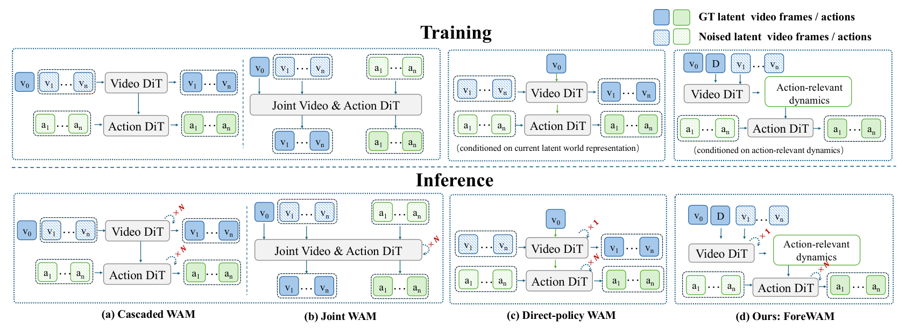
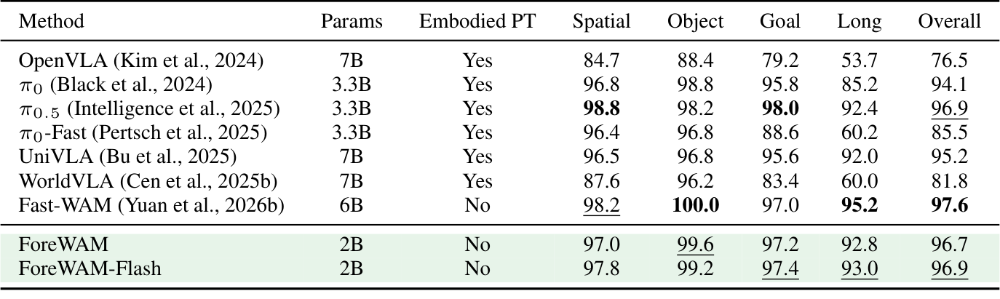
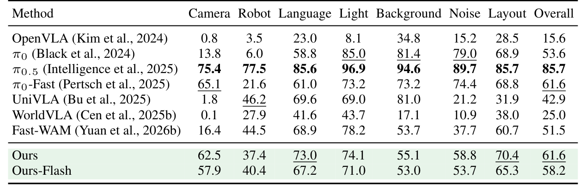
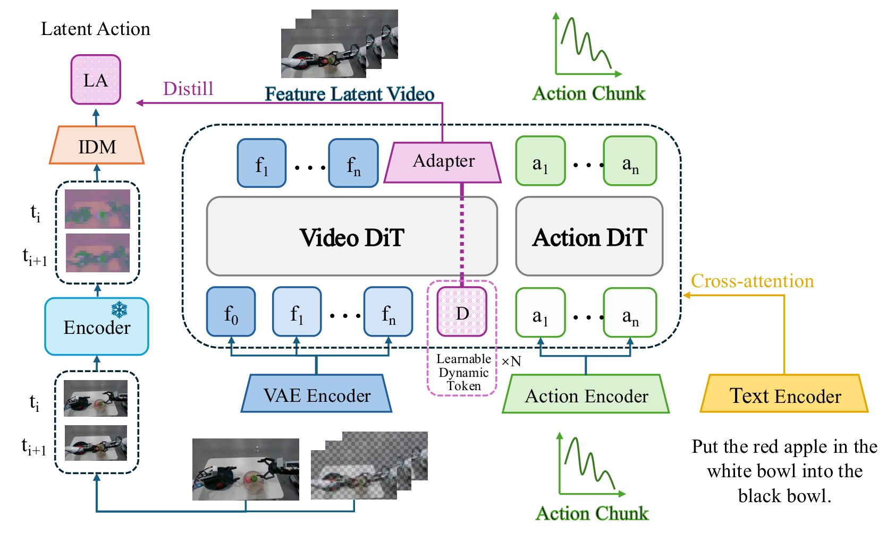

---
tags:
  - papers/embodied-ai
  - papers/world-action-model
  - papers/robot-manipulation
aliases:
  - ForeWAM
  - Foresight Without Seeing
  - Latent Futures WAM
date: 2026-08-12
doi: 10.48550/arxiv.2608.11605
arxiv_id: 2608.11605
---

# Foresight Without Seeing: Latent Futures for World Action Models

## 核心信息
- 标题: Foresight Without Seeing: Latent Futures for World Action Models
- 标题翻译: 不看见也能预见：面向世界动作模型的潜在未来
- 作者: Jiakai Huang, Zhongbo Wu, Zheng Zhang, Zihan Wang, Shan You, Tao Huang
- 机构: Shanghai Jiao Tong University；ACE Robotics；Nanyang Technological University
- 发表时间: 2026-08-12（arXiv v1）
- 发表渠道: arXiv（Cornell University）
- DOI: 10.48550/arxiv.2608.11605
- arXiv: 2608.11605
- 论文链接: https://arxiv.org/abs/2608.11605
- 代码 / 项目: 论文未在本文给出代码仓库
- 数据 / 资源: LIBERO、LIBERO-Plus；Wan2.1-T2V-1.3B；LaWAM 潜在动作教师
- 论文类型: 机器人操作世界动作模型方法论文

## 原文摘要翻译
世界动作模型把未来视觉预测与机器人动作生成结合起来，使策略能够建模交互过程中物理世界如何演化。现有方法的主要差异在于，预测动态以何种方式暴露给动作路径。显式未来型方法通过生成未来场景直接提供预测的场景演化信息，但迭代式视频去噪带来较高的推理成本。相反，直接策略方法跳过未来生成，仅依据当前观测高效预测动作，却缺少一个在推理时向动作专家暴露预测动态的显式接口。

为弥合这一差距，作者提出 ForeWAM，一种动态条件直接策略方法，在不解码未来视频的情况下为动作生成提供预测上下文。其核心模块 Future-KV 在当前干净视觉潜变量和随机未来槽位上执行一次视频骨干预填充，并在整个动作去噪过程中复用由此得到的逐层键值状态。这样，动作专家可以访问由视频骨干形成的预测上下文，而无需迭代生成未来视频。作者还引入由冻结潜在动作教师监督的动态寄存器，使隐式未来状态倾向于捕获交互诱发的转变，包括物体运动、接触变化和任务进度。真实未来观测和教师仅在训练时使用；部署时两者都不需要，也不进行未来视频生成。

在没有具身机器人数据预训练的条件下，ForeWAM 的标准版和加速版在 LIBERO 上分别取得 96.7% 和 96.9% 的平均成功率，标准版在 LIBERO-Plus 上取得 61.6% 的成功率。这些结果表明，直接策略 WAM 可以在保持高效动作预测的同时，让动作路径获得预测动态，而不必显式生成未来观测。

## 创新点
1. **把问题从“要不要未来想象”改写为“预测动态如何进入动作专家”。** 论文不把直接策略与显式未来生成简单看作速度二选一，而是指出：去掉轨迹执行后，动作专家同时承担当前状态理解和交互后果推断，缺少面向动作的预测动态接口。
2. **Future-KV：潜在未来槽位上的单次视频预填充。** 当前帧潜变量保持干净，未来槽位填入噪声；视频骨干只运行一次，缓存每层键值并供所有动作去噪步读取。贡献点是接口和计算复用，而不是生成一段可见未来视频。
3. **用冻结 LaWAM 教师 监督紧凑的动态寄存器。** 教师从转变前后的真实视觉观测得到量化潜在动作目标，训练投影头使寄存器总结物体运动、接触和任务进度；该目标不是可执行电机指令，也不进入部署。
4. **双路径条件的组合。** Future-KV 保留分布式、丰富的视觉上下文，寄存器则提供紧凑的转变摘要。表 4 中两者组合高于任一路径单独使用，但这仍是配置级证据，不是完整因果分解。

## 一句话总结
ForeWAM 的实质是把“未来视频生成”压缩成一次 隐状态 预填充：用 Future-KV 提供分布式潜在上下文、用潜在动作寄存器提供交互转变摘要，使直接策略动作专家 不看见未来也能利用未来结构，同时把推理开销留在动作去噪而非视频 轨迹执行 上。

## 研究问题
### 问题意识
传统 VLA 主要学习观测到动作的反应式映射，难以显式表达动作造成的场景变化。WAM 通过未来视觉或中间动态来补上这一点，但有两条路线的张力：级联与联合世界动作模型 能让动作路径看到未来，却要承担未来视频的迭代去噪；直接策略 WAM 保留低时延，却没有明确的预测上下文通路。

作者的具体问题是：**如何让 直接策略 WAM 的 动作专家 访问预测动态，同时不在部署时显式生成未来观测？** 图 1 将 ForeWAM 放在这条设计轴上：它不是重新回到 先想象后行动，也不是单纯移除 未来目标，而是保留训练期未来建模，并设计一个部署期可读取的隐状态接口。

### 相关工作定位
论文把邻近工作分成三层：一是视觉语言动作模型直接把视觉、语言映射到动作；二是级联世界动作模型在动作前生成未来观测、点轨迹、运动场或其他预测表示；三是联合世界动作模型在共享生成过程中共同建模世界状态和动作。Fast-WAM 已经代表直接策略的无轨迹生成方向；ForeWAM 声称的增量不在于“第一次做到不生成未来”，而在于把隐藏未来槽位的键值和潜在动作监督寄存器重新接到动作专家。这个定位把贡献边界收窄为两种条件路径的互补组合。

## 数据与任务定义
### 控制输入输出
控制时输入为同步多相机观测 $o$、语言指令 $l$ 和八维本体感知状态 $p$；输出是长度为 $H=32$ 的动作块，其动作维度记为 $d_{act}$。每个动作是七维，包括六自由度末端位姿和一个夹爪控制维度。

训练样本含 33 个观测帧。动作流和视频流的时间比例为 4，因此一个 32 步动作块对应 9 个视频帧。两路同步相机沿图像宽度拼接，形成 $224\times448$ 的输入（两个 $224\times224$ 视图）。

### 评测协议
- **LIBERO：** 空间、物体、目标、长时程 四套标准套件；每个任务进行 50 次轨迹执行，报告成功率。
- **LIBERO-Plus：** 对原任务施加七类扰动：相机视角、机器人初始状态、语言指令、光照、背景纹理、传感器噪声和物体布局。论文使用观测子集；跨论文结果来自不同来源和覆盖，因此不能直接当作严格匹配的因果实验。
- **资源条件：** Wan2.1-T2V-1.3B 视频分支初始化，Wan2.1 ActionDiT 动作分支采用线性插值检查点；两支均为 30 个变换器模块，视频隐藏维度 $d_v=1536$，动作专家维度 $d_a=1024$，使用 $N_D=16$ 个动态寄存器。

## 方法主线
### 机制流程
1. **形成部署期潜在基底。** 将当前观测编码成干净潜变量，把未来槽位设为高斯噪声，形成当前潜变量与噪声槽位的拼接序列。
   $$\tilde z^{Fsub}_{1:T}=[z_{cur}(o);\epsilon_F],\qquad \epsilon_F\sim\mathcal{N}(0,I).$$
2. **执行一次视频骨干预填充。** 输入潜在基底、语言和本体感知条件，得到动态寄存器切片 $D_\theta$ 以及每层键值缓存 $H_{KV}$：
   $$ (D_\theta,H_{KV})=\operatorname{KVPrefill}_\phi(\tilde z^{Fsub}_{1:T},l,p). $$
3. **动作去噪读取两条路径。** 动作专家在当前视觉标记、16 个动态寄存器、随机未来槽位对应的缓存和动作标记上运行；每个动作查询将缓存的视觉键值与当前动作标记本步计算的键值拼接。结构化掩码决定标记可读范围。
4. **输出动作块而非未来视频。** 部署策略为
   $$p_\theta(a_{1:H}\mid o,l,p,D_\theta(o,l,p,\epsilon_F),H_{KV}(o,l,p,\epsilon_F)).$$
   该式仍是直接动作策略：没有真实未来、教师输出，也没有未来视频解码回控制回路。

### Future-KV：把未来生成变成缓存接口
Future-KV 的关键不是声称随机槽位本身等于真实未来，而是让训练期 视频流目标通过网络参数把“当前帧加未来槽位”的中间状态塑造成可被动作专家利用的上下文。预填充发生在 $\sigma=1.0$，然后每个动作去噪步复用缓存。这样一次动作查询所需的视频计算不随动作去噪步重复进行，也不需要像显式未来 WAM 那样逐步还原像素或未来潜变量。

### 动态寄存器：用潜在动作约束“什么变化值得保留”
通用视频监督可能更偏向外观和可重建性，不会自动优先编码接触变化。冻结的 LaWAM 教师从转变前后的视觉观测得到量化潜在动作目标 $z_{LA}$；均值池化的寄存器经过可训练投影 $g_\psi$ 对齐教师空间：
$$\mathcal{L}_{LA}=\left\|g_\psi\left(\frac{1}{N_D}\sum_{i=1}^{N_D}D_i\right)-\operatorname{sg}(z_{LA})\right\|_2^2.$$ 
停止梯度只作用于 教师目标。该潜在动作是视觉转变线索，不是动作指令；真正可执行的动作仍由 动作专家 产生。

### 标记组与结构化路由
论文使用四组标记：当前帧标记、动态寄存器、未来槽位标记和动作标记；可读寄存器在报告配置中关闭。未来槽位可整合当前帧与寄存器，动作标记可读取完整视频序列及寄存器。这里的掩码是架构路由规则，不是寄存器已经解耦或具有因果充分性的证据；作者明确把这两种强解释留给后续干预实验。

### 联合训练目标
对未来视频潜变量或动作块目标 $y$，从噪声 $\epsilon$ 和时间 $t$ 构造
$$y_t=(1-t)y+t\epsilon,$$
目标速度为 $\epsilon-y$，流匹配损失为
$$\mathcal{L}_{FM}(y)=\mathbb{E}_{y,\epsilon,t}\left[\|f_\theta(y_t,t,o,l,p)-(\epsilon-y)\|_2^2\right].$$
视频损失和动作损失分别定义为：
$$\mathcal{L}_{1}=\mathcal{L}_{FM}(z_{1:T}),\qquad \mathcal{L}_{2}=\mathcal{L}_{FM}(a_{1:H}).$$
总目标为
$$\mathcal{L}=\mathcal{L}_{1}+\mathcal{L}_{2}+\lambda\mathcal{L}_{LA}.$$
报告配置中动作损失的梯度可以穿过 视频到动作的键值接口回到 预填充；这使 Future-KV 不只是离线特征抽取，而是端到端动作目标参与塑形的路径。

## 关键结果
### 主结果与强基线

*图注：四类 WAM 范式的训练/推理对照。ForeWAM 保留直接策略推理，却把未来槽位的隐状态键值和动作相关动态暴露给动作专家。*

*图注：标准 LIBERO 成功率（每任务 50 次轨迹执行）。图中原表已保留，下面转录关键行。*

| 方法 | 参数 | 具身预训练 | 空间 | 物体 | 目标 | 长时程 | 总体 |
|---|---:|:---:|---:|---:|---:|---:|---:|
| Fast-WAM | 6B | No | 98.2 | 100.0 | 97.0 | 95.2 | 97.6 |
| ForeWAM | 2B | No | 97.0 | 99.6 | 97.2 | 92.8 | 96.7 |
| ForeWAM-Flash | 2B | No | 97.8 | 99.2 | 97.4 | 93.0 | 96.9 |

ForeWAM-Flash 的总体成功率比标准 ForeWAM 高 0.2 个百分点，比快速基线低 0.7 个百分点；标准版比快速基线低 0.9 个百分点。这个结果支持“减少去噪步数不必破坏标准 LIBERO 性能”，但长时程套件是明显较弱的一项，标准版比快速基线低 2.4 个百分点。2B 对 6B 的规模差也不能单独解释为算法优越性，因为训练初始化和数据条件仍需同时考虑。

### LIBERO-Plus 鲁棒性

*图注：七类 LIBERO-Plus 扰动下的观测成功率。完整裁剪图用于核对，下面转录核心结果。*

| 方法 | 相机 | 机器人 | 语言 | 光照 | 背景 | 噪声 | 布局 | 总体 |
|---|---:|---:|---:|---:|---:|---:|---:|---:|
| Fast-WAM | 16.4 | 44.5 | 68.9 | 78.2 | 53.7 | 37.7 | 60.7 | 51.5 |
| ForeWAM | 62.5 | 37.4 | 73.0 | 74.1 | 55.1 | 58.8 | 70.4 | 61.6 |
| ForeWAM-Flash | 57.9 | 40.4 | 67.2 | 71.0 | 53.0 | 53.7 | 65.3 | 58.2 |

标准 ForeWAM 相比 Fast-WAM 总体高 10.1 个百分点，主要差异来自 相机（+46.1）和 噪声（+21.1）；但 机器人初始状态和光照低于 Fast-WAM。ForeWAM-Flash 比标准版低 3.4 个百分点，却仍比 Fast-WAM 高 6.7 个百分点。这里最稳妥的表述是“在论文观测子集上表现更好”，而不是“证明了普适分布外泛化”：来源和覆盖不完全匹配，作者也明确将这些差异标为描述性比较。

### 延迟与加速
原文表 3 的候选图像缺失，因此用原文数值转录：

| 方法 | 独立动作生成延迟（ms） |
|---|---:|
| Fast-WAM | 667 |
| ForeWAM | 568 |
| ForeWAM-Flash | 220 |

测量在单张 A800 80 GB 显卡上进行。标准 ForeWAM 将 10 步动作去噪从 667 毫秒降到 568 毫秒，降低 14.8%；加速版将动作去噪从 10 步蒸馏到 2 步，降至 220 毫秒，相对标准版降低 61%，相对快速基线降低约 67.0%。这些是独立动作生成测量，不是平均任务完成时间，也不是 LIBERO-Plus 轨迹统计；端到端相机编码、视频变分自编码器、文本编码和控制循环的总时延仍不清楚。

### 消融到底说明了什么
原文表 4 的候选图像缺失，转录如下：

| 配置 | 观测总体成功率（%） | 评测覆盖 |
|---|---:|---:|
| 基础策略 | 53.6 | 10,027（不同覆盖配置） |
| 仅 Future-KV | 58.5 | 1,482（覆盖匹配） |
| 仅潜在动作监督 | 58.0 | 1,482（覆盖匹配） |
| 本文方法（两者） | 61.6 | 1,482（覆盖匹配） |

在三种覆盖匹配配置中，组合比仅使用 Future-KV 高 3.1 个百分点，比仅使用潜在动作监督高 3.6 个百分点；这支持两条路径的配置级互补。基础策略虽为 53.6%，但样本覆盖不同，不能直接作为加入两组件后的匹配因果增益。论文也承认聚合比较不能单独建立任一通路的因果贡献。

### 训练阶段与部署阶段的信息边界

| 信息 | 训练 | 部署 |
|---|:---:|:---:|
| 当前视觉观测 | 使用 | 使用 |
| 真实未来视频潜变量 | 使用于视频流匹配目标 | 不可用 |
| LaWAM 潜在动作教师 | 提供 $z_{LA}$ | 不可用 |
| 随机未来槽位 | 形成训练/部署接口 | 使用噪声槽位 |
| 视频骨干 | 训练未来潜变量并形成状态 | 只做一次预填充 |
| 未来视频解码 | 可作为训练目标 | 不执行 |
| 动作专家 | 受视频、动作、潜在动作目标共同训练 | 直接去噪动作块 |

## 深度分析

*图注：ForeWAM 的动态条件动作专家结构；训练期真实未来帧和潜在动作教师提供监督，部署期只保留当前观测、随机未来槽位和缓存接口。*

### 真正贡献是什么
真正贡献是一个**隐式预测上下文到动作专家的接口设计**，不是“用噪声预测真实未来”，也不是重新提出流匹配。Future-KV 解决的是分布式视觉信息怎样低成本传递；动态寄存器解决的是 通用视频目标可能不突出交互转变的问题。前者像宽带上下文，后者像窄带动态摘要；两者组合是论文的工程与建模核心。

论文的结果链条也有两层：第一层是系统效率，单次预填充加缓存复用 直接减少未来轨迹生成；第二层是控制效用，潜在动作目标给寄存器加入动作相关的转变偏置。表 4 的互补趋势与 LIBERO-Plus 的增益相吻合，但由于没有完整因子、多种子和干预实验，只能说设计得到支持，不能说每个中间表征已被因果验证。

### 为什么结果可能成立
1. **训练/部署接口一致。** 部署时虽然没有真实未来，仍构造同样形状的 当前加未来基底，网络学到的是对隐藏槽位的处理规则，而不是把教师当成在线输入。
2. **缓存复用改变了计算位置。** 视频分支不在每个动作去噪步重跑，动作专家读取固定的层级键值；因此降的是重复未来生成开销，而不是凭空降低所有模型计算。
3. **监督信号互补。** 视频流匹配迫使视频骨干学习时间结构，潜在动作寄存器损失又把有限寄存器容量推向交互诱发变化。LIBERO-Plus 对 相机/噪声的增益与“隐藏视觉动态可提升鲁棒性”的解释相容，但不是唯一解释。
4. **Flash 的性能—速度折中可见。** 2 步蒸馏保留接口并在 LIBERO 上保持 96.9%，但 LIBERO-Plus 降到 58.2%，说明标准套件的保持不等于所有扰动下的等价保持。

### 容易误读的地方
- “不看见未来”不表示模型没有视觉信息，而是部署不看真实未来帧、不解码未来视频；当前观测仍然是核心输入。
- 动态寄存器中的潜在动作 不是电机动作，不能把 $z_{LA}$ 当作第二个动作解码器。
- 61.6% 对 51.5% 不是严格控制变量下的单一算法增益，因为 LIBERO-Plus 的外部结果和 覆盖可能不同。
- 220 ms 不是机器人任务的总响应时间；它是独立动作生成测量。
- 图 3 的 掩码 规定信息路由，不自动证明 解耦、因果充分性或 寄存器的唯一语义。

### 复现注意点
- **依赖与初始化：** Wan2.1-T2V-1.3B 视频骨干、文本编码器、视频变分自编码器；Wan2.1 动作分支 的线性插值初始化；冻结 LaWAM 教师；OneDP 加速分支。
- **输入实现：** 两相机沿宽度拼接为 $224\times448$，动作块长度 32，对应 9 个视频帧；本体感知为 8 维，动作输出为 7 维。
- **优化：** 连续 流匹配，1,000 步时间表、shift 5.0；AdamW 学习率 $10^{-4}$、权重衰减 0.01、余弦退火、梯度裁剪 1.0。
- **推理：** 标准版 10 个动作去噪步；Flash 使用 2 步加速；未来槽位为噪声；$\sigma=1.0$ 只做一次 视频骨干预填充；缓存跨全部动作去噪步复用。
- **验证设计：** 应固定 LIBERO-Plus 覆盖，报告多随机种子和置信区间；分别干预 缓存、动态寄存器、教师目标 和 动作损失梯度，才能把“互补”推进到因果归因。还需说明 220 ms 是否含编码与条件准备。
- **资料风险：** 这份 PDF 是 arXiv v1，正文未检测到 附录；代码仓库、训练时长、显存峰值、数据规模和 教师的完整训练细节未在文中给出。

## 局限
1. **任务外推有限。** 评测只覆盖标准 LIBERO 和 LIBERO-Plus，缺少真实机器人、不同形态、不同接触动力学和更长时程行为；因此不能把 基准鲁棒性 外推为真实部署可靠性。
2. **因果归因不足。** 表 4 只有少量配置比较，基础策略的覆盖不同；没有完整 2×2 因子、多种子或 寄存器/缓存 的中途干预，无法严格确认每个模块的独立和交互贡献。
3. **统计信息不完整。** 结果主要是单点 成功率，缺少置信区间、种子方差和失败模式分解；延迟也没有给出端到端任务时间分布。
4. **对随机潜在未来的解释仍开放。** 随机槽位可被视为条件基底，但文中未展开噪声采样敏感性，也没有证明其隐状态与某个真实未来轨迹一一对应。
5. **效率边界需要更清楚。** 缓存复用确实避免迭代 未来视频去噪，但视频骨干 预填充、相机编码、视频变分自编码器和动作去噪的完整算力账本没有展开；“67% 更低延迟”只适用于报告的 独立动作生成 设置。
6. **资料可复现性不足。** 文中给出模型维度和优化器超参，但未给出公开代码、训练数据规模、训练时长、$\lambda$、教师 码本细节和完整评测脚本。

- **复现资料缺口。** 公开代码仓库、训练数据规模、训练时长、显存峰值、完整的损失权重与 教师 训练细节均未列出，独立复现受限。

## 我的笔记
### 对 WAM 研究的启发
- 未来建模的价值不必通过可视化未来帧体现；更关键的是明确设计一个 面向动作的接口，并说明它在训练和部署时各自看到什么。
- “丰富的分布式表示 + 紧凑的任务相关瓶颈”是值得复用的组合。前者降低信息遗漏，后者把监督集中到控制真正需要的转变。
- 对 世界动作模型的效率比较应拆成三项：未来表示生成成本、动作生成成本、任务轨迹执行成本。只报 动作去噪 延迟容易把系统级加速说得过满。
- LIBERO-Plus 的类别结果比 总体更有诊断价值：ForeWAM 在 相机/噪声上的优势与 机器人初始状态/光照 上的劣势说明“预测动态有用”不是各类扰动都同样成立。

### 可迁移的实验问题
1. 做固定覆盖的 $2\times2$ 消融：Future-KV 开/关 × 潜在动作监督开/关，并用相同随机种子、同样评测样本测 交互效应。
2. 以不同噪声种子重复部署，测动作分布、成功率方差和寄存器稳定性，判断 随机未来基底 是鲁棒性来源还是额外噪声。
3. 对预填充缓存做层、头、标记 级遮挡，测动作专家对不同键值深度的依赖；对动态寄存器做置乱或零化，才可检验“转变线索”的实际作用。
4. 把 独立动作生成延迟、端到端观测到动作延迟、每任务总时间和显卡显存一并报告，避免把局部速度数字等同系统效率。
5. 在真实接触变化、遮挡和跨机器人形态上评测，并把失败按接触、初始状态、语言和视觉噪声分类。

## 引用
- Huang, J., Wu, Z., Zhang, Z., Wang, Z., You, S., & Huang, T. (2026). *Foresight Without Seeing: Latent Futures for World Action Models*. arXiv:2608.11605. https://arxiv.org/abs/2608.11605
- Yuan, T., Dong, Z., Liu, Y., & Zhao, H. (2026). *Fast-WAM: Do World Action Models Need Test-Time Future Imagination?* arXiv:2603.16666.（本文的直接策略对照）
- Chen, J., Wang, K., Chen, K., et al. (2026). *LaWAM: Latent World Action Models for Efficient Dynamics-Aware Robot Policies*. arXiv:2606.15768.（本文潜在动作教师来源）
- Lipman, Y., Chen, R. T. Q., Ben-Hamu, H., Nickel, M., & Le, M. (2022). *Flow Matching for Generative Modeling*. arXiv:2210.02747.（流匹配目标）
- Liu, B., Zhu, Y., Gao, C., Feng, Y., Liu, Q., Zhu, Y., & Stone, P. (2023). *LIBERO: Benchmarking Knowledge Transfer for Lifelong Robot Learning*. NeurIPS 36.
- Fei, S., Wang, S., Shi, J., et al. (2025). *LIBERO-Plus: In-Depth Robustness Analysis of Vision-Language-Action Models*. arXiv:2510.13626.
