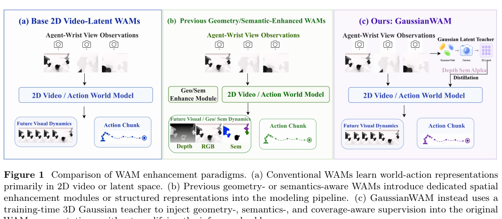
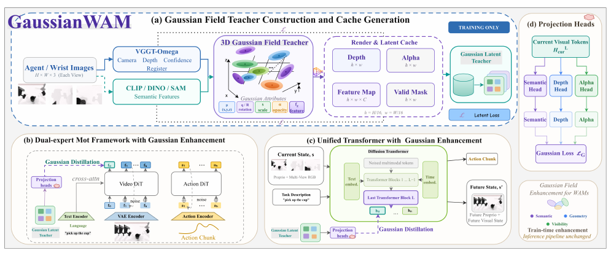
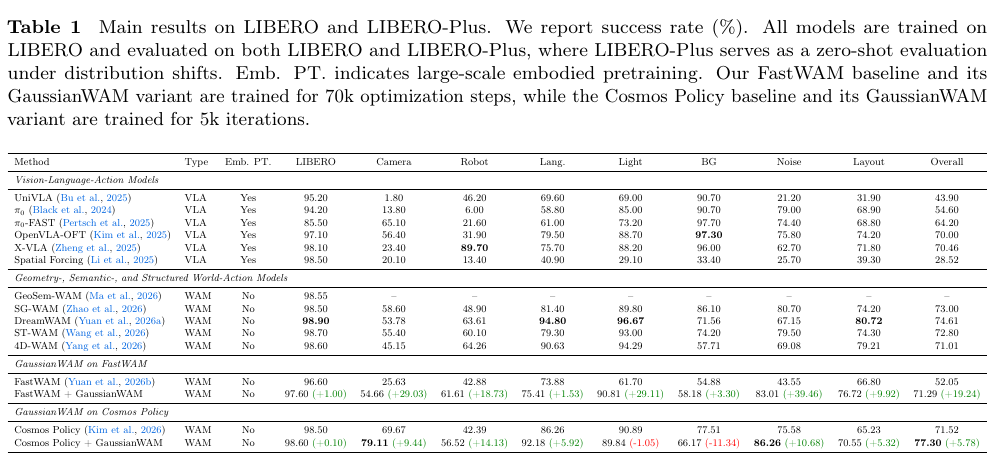
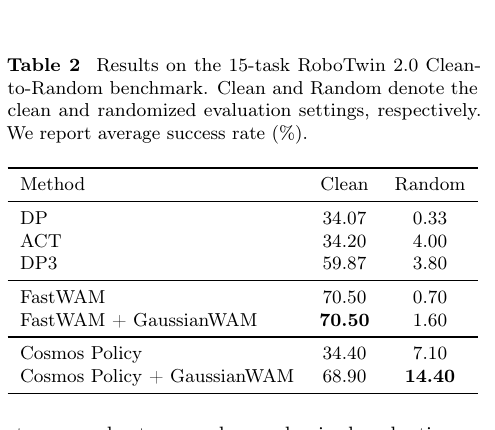
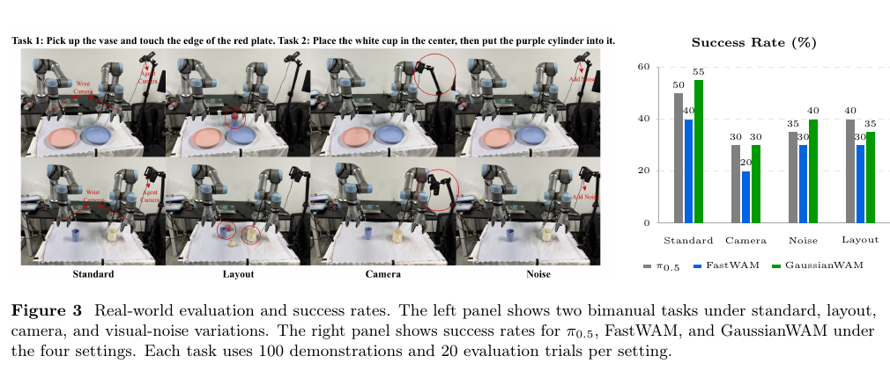
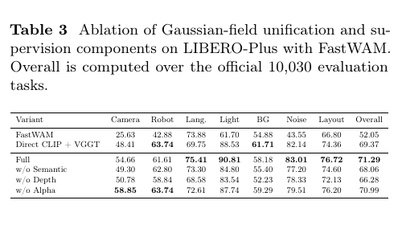
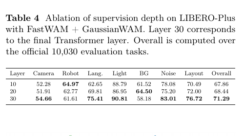
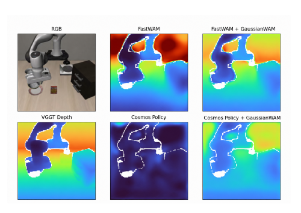
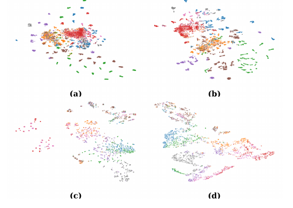

# GaussianWAM：从 3D Gaussian Fields 向 World-Action Models 蒸馏几何与语义

> **Source identity / 来源标识**  Zhang et al., arXiv:2608.24714v1 [cs.RO], 25 Aug 2026; 13-page PDF supplied by the user.

> **Reader scope / 阅读范围**  This file is a complete paragraph-level English–Chinese reader of the supplied PDF. References retain searchable bibliographic metadata; Chinese title translations are added where useful.

> **阅读范围**　本文件是对用户提供 PDF 的逐段英中对照全文阅读稿。参考文献保留可搜索的原始书目信息，并在适当处补充中文题名译文。

## Contents / 目录

- Abstract / 摘要
- 1 Introduction / 引言
- 2 Related Work / 相关工作
- 3 Method / 方法
- 4 Experiments / 实验
- 5 Conclusion / 结论
- References / 参考文献

## Terminology ledger / 术语表

| English | 中文 | Note |
|---|---|---|
| World-Action Model (WAM) | 世界—动作模型 | 保留缩写 WAM。 |
| Gaussian field / Gaussian primitive | Gaussian 场 / Gaussian 基元 | 3D Gaussian Splatting 语境下保留 Gaussian。 |
| visual-semantic feature | 视觉—语义特征 | 与 geometry / depth 对应。 |
| coverage / alpha | 覆盖度 / alpha（不透明度累积） | alpha 作为模型输出名保留。 |
| distillation | 蒸馏 | training-time distillation 为“训练时蒸馏”。 |
| distribution shift | 分布偏移 | LIBERO-Plus 的 camera、robot 等条件。 |
| success rate | 成功率 | 文中单位为 %。 |

## Abstract / 摘要

<!-- source:block-001 page=1 section="Abstract" type=paragraph -->
> <strong>Para. 1:</strong> World-Action Models (WAMs) jointly learn future visual prediction and action generation, using video dynamics as a representation-learning signal for robotic manipulation. However, their video latents are primarily optimized for visual prediction and are not explicitly encouraged to preserve cross-view geometric structure or spatially localized, object-relevant semantics. We propose GaussianWAM, a training-time representation-enhancement framework that organizes geometric and semantic supervision through a 3D Gaussian field. Given synchronized multi-view observations, frozen geometry and vision foundation models provide depth, camera parameters, and dense semantic features. GaussianWAM binds these heterogeneous signals to shared Gaussian primitives and renders spatially aligned semantic, depth, and coverage targets, which are distilled into the current-observation representations of the WAM. All teacher models, Gaussian components, and auxiliary prediction heads are removed after training, leaving the original WAM inference path without additional modules or forward computation. On LIBERO-Plus, GaussianWAM improves FastWAM from 52.05% to 71.29% and Cosmos Policy from 71.52% to 77.30%. Direct CLIP and VGGT distillation already establishes a strong FastWAM baseline of 69.37%, while Gaussian-field unification further improves it to 71.29%, supporting the benefit of spatially organizing heterogeneous teacher signals. GaussianWAM also improves performance on standard LIBERO and shows positive transfer trends on RoboTwin and real-world manipulation. These results suggest that training-time Gaussian distillation provides a practical way to inject geometry- and semantics-related supervision into WAM representations without changing their deployment architecture.

> <strong>Para. 1[CN]:</strong> 世界—动作模型（WAM）联合学习未来视觉预测与动作生成，并将视频动态作为机器人操作的表征学习信号。然而，其视频潜变量主要针对视觉预测进行优化，并未被显式鼓励去保留跨视角几何结构或空间局部化、与对象相关的语义。我们提出 GaussianWAM，一种训练时的表征增强框架，通过 3D Gaussian 场组织几何与语义监督。给定同步的多视角观测，冻结的几何基础模型和视觉基础模型提供深度、相机参数与稠密语义特征。GaussianWAM 将这些异构信号绑定到共享的 Gaussian 基元，并渲染空间对齐的语义、深度和覆盖度目标，再将其蒸馏到 WAM 的当前观测表征中。训练完成后，所有教师模型、Gaussian 组件和辅助预测头都会被移除，原始 WAM 推理路径不增加额外模块或前向计算。在 LIBERO-Plus 上，GaussianWAM 将 FastWAM 从 52.05% 提升至 71.29%，将 Cosmos Policy 从 71.52% 提升至 77.30%。直接进行 CLIP 与 VGGT 蒸馏已建立 69.37% 的强 FastWAM 基线，而 Gaussian 场统一进一步将其提升至 71.29%，支持了对异构教师信号进行空间组织的益处。GaussianWAM 还提升了标准 LIBERO 上的性能，并在 RoboTwin 和真实世界操作中呈现正向迁移趋势。这些结果表明，训练时 Gaussian 蒸馏能够在不改变部署架构的情况下，以实用方式向 WAM 表征注入与几何和语义相关的监督。

## 1 Introduction / 引言

<!-- source:block-002 page=1 section="1 Introduction" type=paragraph -->
> <strong>Para. 2:</strong> Recent World-Action Models (WAMs) and video-action models have introduced a new modeling paradigm for robotic control. Unlike conventional vision-language-action (VLA) models that primarily predict robot actions directly from current observations (Brohan et al., 2022; Kim et al., 2024), WAMs leverage the temporal dynamics and implicit physical priors learned by video generative models to jointly learn future visual dynamics and action generation (Ye et al., 2026b). As illustrated in Fig. 1, this paradigm moves beyond purely reactive action prediction and uses future scene evolution as an additional representation-learning signal. In this sense, future prediction serves not only as a visual generation objective, but also as temporal supervision for action generation.

> <strong>Para. 2[CN]:</strong> 近年来，世界—动作模型（WAM）和视频—动作模型为机器人控制引入了新的建模范式。不同于主要根据当前观测直接预测机器人动作的传统视觉—语言—动作（VLA）模型（Brohan et al., 2022；Kim et al., 2024），WAM 利用视频生成模型所学习的时间动态与隐式物理先验，联合学习未来视觉动态与动作生成（Ye et al., 2026b）。如图 1 所示，该范式超越了纯反应式动作预测，并将未来场景演化作为额外的表征学习信号。换言之，未来预测不仅是视觉生成目标，也是动作生成的时间监督。

### Figure 1. WAM enhancement paradigms / WAM 增强范式

**Caption:** Figure 1 Comparison of WAM enhancement paradigms. (a) Conventional WAMs learn world-action representations primarily in 2D video or latent space. (b) Previous geometry- or semantics-aware WAMs introduce dedicated spatial enhancement modules or structured representations into the modeling pipeline. (c) GaussianWAM instead uses a training-time 3D Gaussian teacher to inject geometry-, semantics-, and coverage-aware supervision into the original WAM representations, without modifying the inference backbone.

**Caption[CN]:** 图 1 WAM 增强范式对比。(a) 传统 WAM 主要在二维视频或潜空间中学习世界—动作表征。(b) 以往具备几何或语义感知能力的 WAM 会在建模流程中引入专用空间增强模块或结构化表征。(c) GaussianWAM 则使用训练时的 3D Gaussian 教师，将几何、语义和覆盖度感知的监督注入原始 WAM 表征，而不修改推理骨干。

<!-- source:block-003 page=2 section="1 Introduction" type=paragraph -->
> <strong>Para. 3:</strong> Despite this progress, the video latent representations learned by existing WAMs are primarily optimized for visual reconstruction or prediction and are not explicitly constrained to preserve cross-view geometric structure. Most WAMs model the world primarily in RGB image space or two-dimensional video latent space. While such representations can effectively capture appearance changes, motion continuity, and implicit dynamics, visual coherence does not necessarily imply geometric reliability. Robotic manipulation fundamentally takes place in three-dimensional space, where precise control requires a reliable understanding of scene geometry and spatial relationships among objects. Consequently, latent representations learned solely through RGB reconstruction or video prediction may remain geometrically under-constrained, limiting the capability of WAMs for precise spatial interaction and action generation (Li et al., 2026b; Zhang et al., 2026; Ma et al., 2026; Yan et al., 2026; Zhao et al., 2026; Yuan et al., 2026a; Yang et al., 2026).

> <strong>Para. 3[CN]:</strong> 尽管取得了这些进展，现有 WAM 学到的视频潜在表征主要针对视觉重建或预测进行优化，并未受到显式约束以保留跨视角几何结构。大多数 WAM 主要在 RGB 图像空间或二维视频潜空间中建模世界。此类表征能够有效捕获外观变化、运动连续性和隐式动态，但视觉一致性并不必然意味着几何可靠性。机器人操作本质上发生在三维空间中；精确控制需要可靠理解场景几何以及对象之间的空间关系。因此，仅通过 RGB 重建或视频预测学习的潜在表征可能仍然受到几何约束不足的影响，从而限制 WAM 进行精确空间交互和动作生成的能力（Li et al., 2026b；Zhang et al., 2026；Ma et al., 2026；Yan et al., 2026；Zhao et al., 2026；Yuan et al., 2026a；Yang et al., 2026）。

<!-- source:block-004 page=2 section="1 Introduction" type=paragraph -->
> <strong>Para. 4:</strong> Moreover, WAM video latents are not explicitly optimized to preserve spatially localized, object-relevant semantic information. Although language instructions can condition video generation and action prediction, such conditioning does not necessarily ensure that visual tokens consistently correspond to task-relevant objects and their spatial locations. In other words, task-level language conditioning does not necessarily translate into object-relevant semantic structure in the visual latent space. Visual foundation models such as CLIP (Radford et al., 2021), DINO (Oquab et al., 2023), and SAM (Kirillov et al., 2023) provide rich object- and region-level semantic priors, while geometric foundation models such as VGGT (Wang et al., 2025) provide depth and camera cues. Therefore, effective WAM representations for robotic manipulation should capture not only where objects are in 3D space, but also what the corresponding visual regions represent.

> <strong>Para. 4[CN]:</strong> 此外，WAM 视频潜变量并未经过显式优化以保留空间局部化、与对象相关的语义信息。尽管语言指令可以对视频生成和动作预测进行条件控制，但这种条件控制并不能保证视觉 token 始终对应于任务相关对象及其空间位置。换言之，任务级语言条件不一定会转化为空间视觉潜变量中与对象相关的语义结构。CLIP（Radford et al., 2021）、DINO（Oquab et al., 2023）和 SAM（Kirillov et al., 2023）等视觉基础模型提供丰富的对象级和区域级语义先验，而 VGGT（Wang et al., 2025）等几何基础模型提供深度与相机线索。因此，用于机器人操作的有效 WAM 表征不仅应捕获对象在三维空间中的位置，还应捕获相应视觉区域所表示的内容。

<!-- source:block-005 page=2 section="1 Introduction" type=paragraph -->
> <strong>Para. 5:</strong> A seemingly straightforward solution is to distill geometric and semantic knowledge from multiple pretrained teachers into the WAM backbone, or to explicitly extend WAMs toward 3D/4D world modeling (Guo et al., 2026; Li et al., 2026b). However, both directions have important limitations. Independent geometric and semantic teachers typically produce heterogeneous features in different representation spaces, viewpoints, and confidence regimes. Applying separate feature losses therefore treats geometry and semantics as disconnected supervision signals, without a shared spatial carrier that consistently associates semantic information with the same physical 3D structures across views. On the other hand, explicit 3D/4D world models often require additional 3D encoders, decoders, rendering modules, geometric annotations, or future 3D rollouts, increasing both training complexity and inference cost. These limitations raise two key questions: How can heterogeneous geometric and semantic knowledge be unified into a spatially coherent representation for WAMs? And can such structured supervision be introduced without sacrificing the inference efficiency of the original policy?

> <strong>Para. 5[CN]:</strong> 一个看似直接的解决方案是将多个预训练教师的几何与语义知识蒸馏到 WAM 骨干中，或将 WAM 显式扩展为 3D/4D 世界建模（Guo et al., 2026；Li et al., 2026b）。然而，这两个方向都存在重要局限。独立的几何教师和语义教师通常在不同表征空间、视角和置信度体系中产生异构特征。因此，分别施加特征损失会把几何与语义视为彼此断开的监督信号，缺少一个共享空间载体来跨视角一致地将语义信息关联到相同的物理三维结构。另一方面，显式的 3D/4D 世界模型往往需要额外的 3D 编码器、解码器、渲染模块、几何标注或未来 3D rollout，从而增加训练复杂度和推理成本。这些局限引出两个关键问题：如何将异构的几何与语义知识统一为空间上连贯的 WAM 表征？以及，能否在不牺牲原始策略推理效率的情况下引入这种结构化监督？

<!-- source:block-006 page=2 section="1 Introduction" type=paragraph -->
> <strong>Para. 6:</strong> To address these challenges, we propose GaussianWAM, a Gaussian Field Enhancement framework for World-Action Models. We use a 3D Gaussian field as a unified spatial carrier that organizes geometric and semantic supervision from different foundation models within the same set of Gaussian primitives. Specifically, multi-view geometric cues are lifted into 3D Gaussian primitives, while visual-semantic features are associated with the corresponding Gaussians, allowing each primitive to jointly carry geometry- and semantics-related attributes. In this way, heterogeneous supervision originally defined in different representation spaces can be spatially aligned within a unified reconstructed 3D coordinate system, rather than being independently distilled in separate 2D feature spaces (Kerbl et al., 2023; Kerr et al., 2023; Zhou et al., 2024; Qin et al., 2024). In addition, Gaussian rendering naturally produces a coverage signal, which we use to restrict supervision to locations supported by valid geometry and non-negligible rendered Gaussian contributions.

> <strong>Para. 6[CN]:</strong> 为应对这些挑战，我们提出 GaussianWAM，一种面向世界—动作模型的 Gaussian 场增强框架。我们使用 3D Gaussian 场作为统一空间载体，将不同基础模型提供的几何与语义监督组织在同一组 Gaussian 基元中。具体而言，多视角几何线索被提升到 3D Gaussian 基元中，而视觉—语义特征与对应 Gaussian 相关联，使每个基元能够同时携带几何和语义属性。这样，原本定义在不同表征空间中的异构监督便可在统一重建的三维坐标系中实现空间对齐，而不是在彼此独立的二维特征空间中分别蒸馏（Kerbl et al., 2023；Kerr et al., 2023；Zhou et al., 2024；Qin et al., 2024）。此外，Gaussian 渲染会自然地产生覆盖度信号，我们利用该信号将监督限制在由有效几何和非可忽略渲染 Gaussian 贡献支持的位置。

<!-- source:block-007 page=3 section="1 Introduction" type=paragraph -->
> <strong>Para. 7:</strong> Concretely, GaussianWAM constructs a Gaussian field from current multi-view observations and renders its geometric, semantic, and coverage signals back onto the token grid aligned with the WAM backbone. These dense signals are distilled into current-observation video latents through training-time Gaussian distillation, encouraging WAM representations to retain geometry-related and spatially aligned semantic information. In other words, the enhanced representations better capture both where objects are in 3D space and what the corresponding visual regions represent. Crucially, the Gaussian field and all external teachers are used only during training and are completely removed at inference time. GaussianWAM therefore introduces no additional 3D reconstruction, semantic encoding, Gaussian rendering, or rollout overhead during deployment, preserving the original inference pipeline and computational cost of the underlying WAM.

> <strong>Para. 7[CN]:</strong> 具体而言，GaussianWAM 根据当前多视角观测构建 Gaussian 场，并将其几何、语义和覆盖度信号重新渲染到与 WAM 骨干对齐的 token 网格上。随后，通过训练时 Gaussian 蒸馏将这些稠密信号注入当前观测的视频潜变量，促使 WAM 表征保留与几何相关且空间对齐的语义信息。换言之，增强后的表征能够更好地同时捕获对象在三维空间中的位置，以及相应视觉区域所表示的内容。关键在于，Gaussian 场和所有外部教师仅在训练阶段使用，并在推理时被完全移除。因此，GaussianWAM 在部署时不会引入额外的 3D 重建、语义编码、Gaussian 渲染或 rollout 开销，保留底层 WAM 原有的推理流程和计算成本。

<!-- source:block-008 page=3 section="1 Introduction" type=paragraph -->
> <strong>Para. 8:</strong> Our contributions are:
>
> - We propose GaussianWAM, a general enhancement framework for WAMs that uses a Gaussian field as a unified 3D spatial carrier to organize complementary geometric and visual-semantic supervision for action-relevant latent representations.
> - We introduce a Gaussian-field-based distillation mechanism that first binds geometric and visual-semantic knowledge within a unified 3D spatial representation, and then distills the rendered semantic, depth, and coverage signals into current-observation WAM representations.
> - We adopt a training-only enhancement strategy that completely removes the Gaussian field and external teachers at inference, preserving the original WAM inference pipeline and computational cost. We extensively validate GaussianWAM on two representative WAM architectures, FastWAM and Cosmos Policy, and observe consistent improvements across LIBERO, LIBERO-Plus, RoboTwin, and real-world robotic experiments, demonstrating its effectiveness, robustness, and generalization ability.

> <strong>Para. 8[CN]:</strong> 我们的贡献如下：
>
> - 提出 GaussianWAM，一种通用的 WAM 增强框架，将 Gaussian 场作为统一的三维空间载体，为与动作相关的潜在表征组织互补的几何和视觉—语义监督。
> - 引入基于 Gaussian 场的蒸馏机制：首先在统一的三维空间表征中绑定几何与视觉—语义知识，然后将渲染得到的语义、深度和覆盖度信号蒸馏到当前观测的 WAM 表征中。
> - 采用仅训练时增强的策略，在推理阶段完全移除 Gaussian 场和外部教师，保持原始 WAM 推理流程与计算成本不变。我们在 FastWAM 和 Cosmos Policy 两种代表性 WAM 架构上广泛验证 GaussianWAM，并在 LIBERO、LIBERO-Plus、RoboTwin 和真实世界机器人实验中观察到一致提升，体现其有效性、鲁棒性和泛化能力。

## 2 Related Work / 相关工作

<!-- source:block-009 page=3 section="2 Related Work" type=paragraph -->
> <strong>Para. 9:</strong> World-action models and video-action models. World-Action Models (WAMs) and video-action models augment robot policies with predictive world modeling, jointly learning future visual dynamics and action generation. Representative methods such as Fast-WAM (Yuan et al., 2026b), Cosmos Policy (Kim et al., 2026), LingBot (Li et al., 2026a), and GigaWorld-Policy (Ye et al., 2026a) demonstrate that future observation or latent dynamics modeling can provide effective representation-learning signals for robotic manipulation. Compared with purely reactive VLA policies, these approaches enable the policy to exploit temporal dynamics and implicit physical priors learned from video generation. However, their world representations are still predominantly modeled in RGB image space or 2D video latent space, leaving the resulting representations weakly grounded in explicit 3D structure and spatially aligned visual semantics. GaussianWAM retains the original WAM architecture and enhances its internal representations through structured training-time supervision without modifying the inference pipeline.

> <strong>Para. 9[CN]:</strong> 世界—动作模型与视频—动作模型。世界—动作模型（WAM）和视频—动作模型通过预测式世界建模增强机器人策略，联合学习未来视觉动态与动作生成。Fast-WAM（Yuan et al., 2026b）、Cosmos Policy（Kim et al., 2026）、LingBot（Li et al., 2026a）和 GigaWorld-Policy（Ye et al., 2026a）等代表性方法表明，未来观测或潜在动态建模可以为机器人操作提供有效的表征学习信号。与纯反应式 VLA 策略相比，这些方法使策略能够利用视频生成所学习的时间动态和隐式物理先验。然而，它们的世界表征仍主要在 RGB 图像空间或二维视频潜空间中建模，使所得表征缺乏显式三维结构和空间对齐视觉语义的充分支撑。GaussianWAM 保留原始 WAM 架构，通过结构化的训练时监督增强其内部表征，而不修改推理流程。

<!-- source:block-010 page=3 section="2 Related Work" type=paragraph -->
> <strong>Para. 10:</strong> Geometry- and semantic-aware world-action learning. Recent studies have begun to incorporate structured geometric and semantic priors into WAMs to improve spatial understanding and action generation (Li et al., 2026b; Zhang et al., 2026; Ma et al., 2026; Yan et al., 2026; Yang et al., 2026; Guo et al., 2026). These methods explore complementary directions including explicit 3D/4D representations, geometric foresight, spatial features, and auxiliary geometry or semantic prediction. In particular, GeoSem-WAM (Ma et al., 2026) highlights the complementary role of geometry and semantics in learning structured world representations beyond RGB prediction. Despite these advances, geometric and semantic knowledge is typically introduced through task-specific representations, prediction branches, or separate supervision objectives, without an explicit shared spatial carrier that associates both types of information with the same physical 3D structures. GaussianWAM instead unifies geometric and visual-semantic knowledge within a common 3D Gaussian field and distills the resulting structured representation into action-relevant WAM latents.

> <strong>Para. 10[CN]:</strong> 几何与语义感知的世界—动作学习。近期研究开始将结构化几何和语义先验融入 WAM，以改进空间理解和动作生成（Li et al., 2026b；Zhang et al., 2026；Ma et al., 2026；Yan et al., 2026；Yang et al., 2026；Guo et al., 2026）。这些方法探索了互补方向，包括显式 3D/4D 表征、几何前瞻、空间特征以及辅助几何或语义预测。特别是 GeoSem-WAM（Ma et al., 2026）强调，几何与语义在学习超越 RGB 预测的结构化世界表征中具有互补作用。尽管取得这些进展，几何和语义知识通常仍通过任务特定表征、预测分支或相互独立的监督目标引入，缺少一个显式共享的空间载体，将两类信息关联到相同的物理三维结构。GaussianWAM 则在共同的 3D Gaussian 场中统一几何与视觉—语义知识，并将所得结构化表征蒸馏到与动作相关的 WAM 潜变量中。

<!-- source:block-011 page=3 section="2 Related Work" type=paragraph -->
> <strong>Para. 11:</strong> 3D Gaussian fields for representation enhancement. 3D Gaussian Splatting (3DGS) (Kerbl et al., 2023) provides an explicit and efficient 3D scene representation in which Gaussian primitives encode spatial attributes such as position, scale, rotation, and opacity. Beyond appearance reconstruction, recent works have extended Gaussian primitives to carry high-dimensional features from pretrained foundation models. Feature 3DGS (Zhou et al., 2024) distills 2D foundation-model features into Gaussian primitives, while LangSplat (Qin et al., 2024) constructs language-aware Gaussian fields for open-vocabulary 3D understanding. Gaussian world models such as GWM (Lu et al., 2025) and ManiGaussian (Lu et al., 2024) further explore Gaussian representations for robotic manipulation and dynamic scene modeling. More recently, Feature4X (Zhou et al., 2025) demonstrates that heterogeneous features from visual and video foundation models can be lifted into a unified dynamic Gaussian representation. These works establish Gaussian primitives as a flexible spatial carrier that jointly preserves explicit geometry while accommodating rich semantic features. Building on this property, GaussianWAM uses a 3D Gaussian field to spatially bind geometric and visual-semantic knowledge and render dense supervision for WAM representation enhancement. Unlike prior Gaussian feature fields that primarily serve as scene representations for downstream 3D/4D perception and interaction, our Gaussian field is used only as a training-time knowledge carrier and is completely removed during policy inference.

> <strong>Para. 11[CN]:</strong> 用于表征增强的 3D Gaussian 场。3D Gaussian Splatting（3DGS）（Kerbl et al., 2023）提供了一种显式且高效的三维场景表征，其中 Gaussian 基元编码位置、尺度、旋转和不透明度等空间属性。在外观重建之外，近期工作扩展 Gaussian 基元，使其能够携带来自预训练基础模型的高维特征。Feature 3DGS（Zhou et al., 2024）将二维基础模型特征蒸馏到 Gaussian 基元中，而 LangSplat（Qin et al., 2024）构建面向语言的 Gaussian 场，用于开放词汇三维理解。GWM（Lu et al., 2025）和 ManiGaussian（Lu et al., 2024）等 Gaussian 世界模型进一步探索了 Gaussian 表征在机器人操作和动态场景建模中的应用。最近，Feature4X（Zhou et al., 2025）展示了如何将视觉和视频基础模型的异构特征提升到统一的动态 Gaussian 表征中。这些工作确立了 Gaussian 基元作为灵活的空间载体：它既能保留显式几何，又能容纳丰富语义特征。在此性质基础上，GaussianWAM 使用 3D Gaussian 场对几何与视觉—语义知识进行空间绑定，并渲染稠密监督以增强 WAM 表征。不同于以往主要作为下游 3D/4D 感知与交互场景表征的 Gaussian 特征场，我们的 Gaussian 场仅作为训练时知识载体，并在策略推理时被完全移除。

## 3 Method / 方法

### 3.1 Overview / 概览

### Figure 2. Overview of GaussianWAM / GaussianWAM 概览

**Caption:** Figure 2 Overview of GaussianWAM. (a) A 3D Gaussian teacher is constructed from synchronized multi-view observations and rendered into semantic, depth, and alpha targets, together with a validity mask, which are cached for training. (b) In FastWAM-style dual-expert MoT models, Gaussian supervision is applied to current-observation video representations. (c) In Cosmos-Policy-style unified Transformers, the same supervision is applied to current-observation visual tokens in the shared backbone. (d) Lightweight semantic, depth, and alpha heads distill the cached Gaussian targets into WAM visual representations. All Gaussian-related modules are removed at inference, preserving the original WAM forward path and computational cost.

**Caption[CN]:** 图 2 GaussianWAM 概览。(a) 从同步多视角观测构建 3D Gaussian 教师，并将其渲染为语义、深度和 alpha 目标，同时生成有效性掩码；这些目标会被缓存用于训练。(b) 在 FastWAM 风格的双专家 MoT 模型中，Gaussian 监督施加于当前观测的视频表征。(c) 在 Cosmos Policy 风格的统一 Transformer 中，相同监督施加于共享骨干中的当前观测视觉 token。(d) 轻量级语义、深度和 alpha 预测头将缓存的 Gaussian 目标蒸馏到 WAM 视觉表征中。所有与 Gaussian 相关的模块在推理时被移除，保留原始 WAM 前向路径和计算成本。

<!-- source:block-012 page=4 section="3.1 Overview" type=paragraph -->
> <strong>Para. 12:</strong> We propose GaussianWAM, a general training-time 3D Gaussian enhancement framework for World-Action Models. As shown in Fig. 2, GaussianWAM first constructs an offline 3D Gaussian teacher from current multi-view observations. The Gaussian field provides a unified spatial representation that combines 3D geometry, visual-semantic features, and rendering-derived coverage information. These signals are rendered onto spatial grids aligned with the visual representations of the WAM and distilled into action-relevant visual representations during policy training.

> <strong>Para. 12[CN]:</strong> 我们提出 GaussianWAM，一种面向世界—动作模型的通用训练时 3D Gaussian 增强框架。如图 2 所示，GaussianWAM 首先根据当前多视角观测构建离线 3D Gaussian 教师。Gaussian 场提供统一的空间表征，将三维几何、视觉—语义特征和渲染得到的覆盖度信息结合起来。这些信号被渲染到与 WAM 视觉表征对齐的空间网格上，并在策略训练期间蒸馏到与动作相关的视觉表征中。

<!-- source:block-013 page=4 section="3.1 Overview" type=paragraph -->
> <strong>Para. 13:</strong> The Gaussian teacher is used only during training. At inference time, all foundation-model teachers, Gaussian construction and rendering modules, and auxiliary prediction heads are removed. The enhanced policy therefore follows exactly the same forward path as the original WAM. We instantiate GaussianWAM on both a FastWAM-style dual-expert MoT architecture (Yuan et al., 2026b) and a Cosmos-Policy-style unified DiT (Kim et al., 2026).

> <strong>Para. 13[CN]:</strong> Gaussian 教师仅在训练阶段使用。在推理时，所有基础模型教师、Gaussian 构建与渲染模块以及辅助预测头都会被移除。因此，增强后的策略严格遵循与原始 WAM 相同的前向路径。我们分别在 FastWAM 风格的双专家 MoT 架构（Yuan et al., 2026b）和 Cosmos Policy 风格的统一 DiT（Kim et al., 2026）上实例化 GaussianWAM。

### 3.2 Gaussian Teacher Construction / Gaussian 教师构建

<!-- source:block-014 page=5 section="3.2 Gaussian Teacher Construction" type=paragraph -->
> <strong>Para. 14:</strong> For each training sample, we construct a dense 3D Gaussian teacher from synchronized multi-view observations $\{I^v\}_{v=1}^{V}$. The teacher takes only visual observations as input, while language instructions and proprioceptive states remain inputs to the policy.

> <strong>Para. 14[CN]:</strong> 对于每个训练样本，我们根据同步多视角观测 $\{I^v\}_{v=1}^{V}$ 构建稠密 3D Gaussian 教师。教师仅以视觉观测为输入，而语言指令和本体感知状态仍然作为策略输入。

<!-- source:block-015 page=5 section="3.2 Gaussian Teacher Construction" type=paragraph -->
> <strong>Para. 15:</strong> Geometry extraction. We employ a frozen geometry foundation model, VGGT-Omega (Wang et al., 2025), to estimate dense depth, depth confidence, and camera parameters:

> <strong>Para. 15[CN]:</strong> 几何提取。我们采用冻结的几何基础模型 VGGT-Omega（Wang et al., 2025）来估计稠密深度、深度置信度和相机参数：

$$
\{D^v,C^v,K^v,E^v\}_{v=1}^{V}=\mathrm{VGGT}(\{I^v\}_{v=1}^{V}),	ag{1}
$$

<!-- source:block-016 page=5 section="3.2 Gaussian Teacher Construction" type=paragraph -->
> <strong>Para. 16:</strong> where $D^v$ and $C^v$ denote the depth and depth-confidence maps, while $K^v$ and $E^v$ denote the corresponding camera intrinsics and extrinsics. The estimated depth and confidence maps are resized to a common $14	imes14$ teacher grid for each view, with the camera intrinsics scaled accordingly. Invalid or low-confidence estimates are filtered to obtain a geometry-valid mask $M^v_{\mathrm{geo}}$. The remaining valid pixels are then back-projected into 3D space using the corresponding depth and camera parameters.

> <strong>Para. 16[CN]:</strong> 其中，$D^v$ 和 $C^v$ 分别表示深度图和深度置信度图，$K^v$ 和 $E^v$ 表示对应的相机内参与外参。对于每个视角，估计得到的深度图和置信度图被调整到统一的 $14	imes14$ 教师网格，并相应缩放相机内参。无效或低置信度估计会被过滤，以得到几何有效掩码 $M^v_{\mathrm{geo}}$。随后，使用相应的深度和相机参数，将剩余有效像素反投影到三维空间。

<!-- source:block-017 page=5 section="3.2 Gaussian Teacher Construction" type=paragraph -->
> <strong>Para. 17:</strong> Visual-semantic feature extraction. We additionally extract dense visual-semantic features using a frozen CLIP image encoder (Radford et al., 2021). Specifically, we use CLIP ViT-B/16 in all experiments. The patch tokens are reshaped into a spatial feature map and resized to the same teacher grid. The resulting CLIP features are projected to a 64-dimensional representation, yielding $F^v_{\mathrm{sem}}$ for each view. By placing geometric cues and visual-semantic features on the same spatial grid, we associate the two types of information at corresponding image locations before lifting them into the Gaussian field. We use CLIP in our implementation, while the same construction is compatible in principle with other dense visual foundation encoders, such as DINO (Oquab et al., 2023) or SAM (Kirillov et al., 2023).

> <strong>Para. 17[CN]:</strong> 视觉—语义特征提取。我们还使用冻结的 CLIP 图像编码器（Radford et al., 2021）提取稠密视觉—语义特征。具体而言，所有实验均使用 CLIP ViT-B/16。patch token 被重塑为空间特征图，并调整到相同的教师网格。所得 CLIP 特征被投影为 64 维表征，为每个视角得到 $F^v_{\mathrm{sem}}$。通过将几何线索和视觉—语义特征放置在同一空间网格上，我们在把它们提升到 Gaussian 场之前，将两类信息关联到对应的图像位置。实现中使用 CLIP；原则上，相同构建也兼容 DINO（Oquab et al., 2023）或 SAM（Kirillov et al., 2023）等其他稠密视觉基础编码器。

<!-- source:block-018 page=5 section="3.2 Gaussian Teacher Construction" type=paragraph -->
> <strong>Para. 18:</strong> Gaussian field initialization. Using the geometry-valid 3D points, we initialize a Gaussian field $G=\{g_i\}_{i=1}^{N}$. We adopt dense initialization with spatial stride 1 on the teacher grid, such that every geometry-valid location initializes one Gaussian primitive:

> <strong>Para. 18[CN]:</strong> Gaussian 场初始化。利用几何有效的三维点，我们初始化 Gaussian 场 $G=\{g_i\}_{i=1}^{N}$。我们在教师网格上采用空间步长为 1 的稠密初始化，使每个几何有效位置初始化一个 Gaussian 基元：

$$
g_i=\{x_i,r_i,s_i,o_i,z_i\},	ag{2}
$$

<!-- source:block-019 page=5 section="3.2 Gaussian Teacher Construction" type=paragraph -->
> <strong>Para. 19:</strong> where $x_i\in\mathbb{R}^3$ denotes the 3D center, $r_i$ represents the Gaussian rotation, $s_i\in\mathbb{R}^3$ denotes the spatial scale, $o_i$ denotes opacity, and $z_i\in\mathbb{R}^{64}$ stores the visual-semantic feature initialized from the corresponding location in $F^v_{\mathrm{sem}}$. This construction binds explicit 3D geometry and visual-semantic information to the same Gaussian primitives within a common 3D coordinate system.

> <strong>Para. 19[CN]:</strong> 其中，$x_i\in\mathbb{R}^3$ 表示三维中心，$r_i$ 表示 Gaussian 旋转，$s_i\in\mathbb{R}^3$ 表示空间尺度，$o_i$ 表示不透明度，$z_i\in\mathbb{R}^{64}$ 存储从 $F^v_{\mathrm{sem}}$ 对应位置初始化的视觉—语义特征。该构建将显式三维几何与视觉—语义信息绑定到共同三维坐标系中的同一 Gaussian 基元上。

<!-- source:block-020 page=5 section="3.2 Gaussian Teacher Construction" type=paragraph -->
> <strong>Para. 20:</strong> Multi-view Gaussian fitting. We render the Gaussian field into each observed camera view using a differentiable depth-aware Gaussian renderer $R$:

> <strong>Para. 20[CN]:</strong> 多视角 Gaussian 拟合。我们使用可微的、具有深度感知能力的 Gaussian 渲染器 $R$，将 Gaussian 场渲染到每个观测相机视角：

$$
(\hat F^v,\hat D^v,\hat A^v)=R(G;K^v,E^v),	ag{3}
$$

<!-- source:block-021 page=5 section="3.2 Gaussian Teacher Construction" type=paragraph -->
> <strong>Para. 21:</strong> where $\hat F^v$, $\hat D^v$, and $\hat A^v$ denote the rendered visual-semantic feature map, depth map, and accumulated Gaussian coverage map, respectively. Specifically, $R$ transforms the Gaussian primitives into the target camera frame, projects them onto the teacher grid using $K^v$, and performs depth-aware, opacity-weighted soft splatting. The projected Gaussian contributions are aggregated to obtain the rendered feature and depth maps, while their accumulated weights define the coverage map $\hat A^v$. We optimize the Gaussian field jointly across all observed views using

> <strong>Para. 21[CN]:</strong> 其中，$\hat F^v$、$\hat D^v$ 和 $\hat A^v$ 分别表示渲染后的视觉—语义特征图、深度图和累积 Gaussian 覆盖度图。具体而言，$R$ 将 Gaussian 基元变换到目标相机坐标系，利用 $K^v$ 将其投影到教师网格，并执行深度感知、按不透明度加权的软 splatting。通过聚合投影的 Gaussian 贡献得到渲染特征图和深度图，而累积权重定义覆盖度图 $\hat A^v$。我们在所有观测视角上联合优化 Gaussian 场，目标为：

$$
\mathcal{L}_{\mathrm{fit}}=\lambda_s\mathcal{L}^{\mathrm{fit}}_{\mathrm{sem}}+\lambda_d\mathcal{L}_{\mathrm{depth}}+\lambda_c\mathcal{L}_{\mathrm{cov}}+\mathcal{L}_{\mathrm{reg}},	ag{4}
$$

<!-- source:block-022 page=5 section="3.2 Gaussian Teacher Construction" type=paragraph -->
> <strong>Para. 22:</strong> where $\mathcal{L}^{\mathrm{fit}}_{\mathrm{sem}}$ aligns $\hat F^v$ with $F^v_{\mathrm{sem}}$ using cosine distance, and $\mathcal{L}_{\mathrm{depth}}$ aligns $\hat D^v$ with $D^v$ using an $\ell_1$ loss. The coverage objective $\mathcal{L}_{\mathrm{cov}}$ encourages high Gaussian coverage at geometry-valid locations while suppressing spurious coverage outside valid regions. $\mathcal{L}_{\mathrm{reg}}$ denotes lightweight regularization on the Gaussian parameters, including scale regularization and penalties on excessive center drift and, when optimized, deviation of semantic features from their initialization. The fitting stage optimizes the selected Gaussian parameters, including their centers, rotations, scales, and opacities, with semantic features optionally refined during fitting. Each per-sample Gaussian field is optimized for $N_{\mathrm{fit}}$ iterations, where we set $N_{\mathrm{fit}}=50$.

> <strong>Para. 22[CN]:</strong> 其中，$\mathcal{L}^{\mathrm{fit}}_{\mathrm{sem}}$ 使用余弦距离使 $\hat F^v$ 与 $F^v_{\mathrm{sem}}$ 对齐，$\mathcal{L}_{\mathrm{depth}}$ 使用 $\ell_1$ 损失使 $\hat D^v$ 与 $D^v$ 对齐。覆盖度目标 $\mathcal{L}_{\mathrm{cov}}$ 鼓励几何有效位置具有较高 Gaussian 覆盖，同时抑制有效区域之外的伪覆盖。$\mathcal{L}_{\mathrm{reg}}$ 表示对 Gaussian 参数施加的轻量正则化，包括尺度正则、对过度中心漂移的惩罚，以及在优化语义特征时对其偏离初始化值的惩罚。拟合阶段优化选定的 Gaussian 参数，包括中心、旋转、尺度和不透明度；语义特征可在拟合过程中选择性细化。每个样本的 Gaussian 场优化 $N_{\mathrm{fit}}$ 次迭代，本文设定 $N_{\mathrm{fit}}=50$。

### 3.3 Gaussian Distillation / Gaussian 蒸馏

<!-- source:block-023 page=6 section="3.3 Gaussian Distillation" type=paragraph -->
> <strong>Para. 23:</strong> Offline teacher cache. After fitting, we render the optimized Gaussian field and store

> <strong>Para. 23[CN]:</strong> 离线教师缓存。拟合完成后，我们渲染优化后的 Gaussian 场并存储：

$$
\mathcal{T}=\{T_{\mathrm{sem}},T_{\mathrm{depth}},T_{\alpha},T_{\mathrm{valid}}\}.	ag{5}
$$

<!-- source:block-024 page=6 section="3.3 Gaussian Distillation" type=paragraph -->
> <strong>Para. 24:</strong> Here, $T_{\mathrm{sem}}$ is the visual-semantic feature map rendered from the optimized Gaussian field, $T_{\mathrm{depth}}$ is the rendered depth, and $T_{lpha}$ represents accumulated Gaussian coverage. We define the final valid mask as

> <strong>Para. 24[CN]:</strong> 其中，$T_{\mathrm{sem}}$ 是从优化后的 Gaussian 场渲染得到的视觉—语义特征图，$T_{\mathrm{depth}}$ 是渲染深度，$T_{lpha}$ 表示累积 Gaussian 覆盖度。我们将最终有效掩码定义为：

$$
T_{\mathrm{valid}}=M_{\mathrm{geo}}\cap M_{\mathrm{render}},\qquad M_{\mathrm{render}}=\mathbb{I}[T_{\alpha}>\tau_{\alpha}],	ag{6}
$$

<!-- source:block-025 page=6 section="3.3 Gaussian Distillation" type=paragraph -->
> <strong>Para. 25:</strong> where we set $	au_{lpha}=10^{-4}$ in all experiments. This small threshold filters locations with negligible accumulated Gaussian coverage, such that downstream supervision is applied only at locations supported by both reliable geometry and valid Gaussian rendering. For WAMs that jointly process multiple camera views, the per-view rendered targets are further resized and composed according to the same multi-view spatial layout used by the policy representation. The resulting semantic, depth, alpha, and validity maps are cached offline and directly reused during policy training, avoiding repeated foundation-model inference and Gaussian fitting.

> <strong>Para. 25[CN]:</strong> 所有实验中我们设定 $	au_{lpha}=10^{-4}$。该较小阈值会过滤累积 Gaussian 覆盖度可忽略的位置，使下游监督仅施加于同时具有可靠几何和有效 Gaussian 渲染支持的位置。对于联合处理多个相机视角的 WAM，各视角渲染目标会按照策略表征所使用的同一多视角空间布局进一步调整大小并组合。最终的语义、深度、alpha 和有效性图会被离线缓存，在策略训练期间直接复用，从而避免重复执行基础模型推理和 Gaussian 拟合。

<!-- source:block-026 page=6 section="3.3 Gaussian Distillation" type=paragraph -->
> <strong>Para. 26:</strong> GaussianWAM distills the cached Gaussian representation into the internal visual representation of a WAM. Let $H^L_{\mathrm{cur}}$ denote the final-layer hidden tokens corresponding to the current visual observations. Their exact source depends on the underlying WAM architecture and is described in Secs. 3.4 and 3.5. We attach three lightweight auxiliary prediction heads, collectively denoted as

> <strong>Para. 26[CN]:</strong> GaussianWAM 将缓存的 Gaussian 表征蒸馏到 WAM 的内部视觉表征中。令 $H^L_{\mathrm{cur}}$ 表示对应当前视觉观测的最终层隐藏 token。其具体来源取决于底层 WAM 架构，见第 3.4 和 3.5 节。我们附加三个轻量级辅助预测头，统称为：

$$
\Phi_G=\{\phi_{\mathrm{sem}},\phi_{\mathrm{depth}},\phi_{\alpha}\},	ag{7}
$$

<!-- source:block-027 page=6 section="3.3 Gaussian Distillation" type=paragraph -->
> <strong>Para. 27:</strong> to predict the cached Gaussian targets:

> <strong>Para. 27[CN]:</strong> 用于预测缓存的 Gaussian 目标：

$$
\hat T_{\mathrm{sem}}=\phi_{\mathrm{sem}}(H^L_{\mathrm{cur}}),\qquad \hat T_{\mathrm{depth}}=\phi_{\mathrm{depth}}(H^L_{\mathrm{cur}}),\qquad \hat T_{\alpha}=\sigma\!\left(\phi_{\alpha}(H^L_{\mathrm{cur}})\right).	ag{8}
$$

<!-- source:block-028 page=6 section="3.3 Gaussian Distillation" type=paragraph -->
> <strong>Para. 28:</strong> The Gaussian distillation objective is

> <strong>Para. 28[CN]:</strong> Gaussian 蒸馏目标为：

$$
\mathcal{L}_G=\lambda_{\mathrm{sem}}\mathcal{L}_{\mathrm{sem}}+\lambda_{\mathrm{depth}}\mathcal{L}_{\mathrm{depth}}+\lambda_{\alpha}\mathcal{L}_{\alpha},	ag{9}
$$

<!-- source:block-029 page=6 section="3.3 Gaussian Distillation" type=paragraph -->
> <strong>Para. 29:</strong> where all losses are evaluated only over $T_{\mathrm{valid}}$. Let $\Omega_{\mathrm{valid}}=\{p\mid T_{\mathrm{valid}}(p)=1\}$ denote the valid locations on the WAM-aligned token grid. We use masked cosine distance for visual-semantic alignment:

> <strong>Para. 29[CN]:</strong> 所有损失仅在 $T_{\mathrm{valid}}$ 上计算。令 $\Omega_{\mathrm{valid}}=\{p\mid T_{\mathrm{valid}}(p)=1\}$ 表示 WAM 对齐 token 网格上的有效位置。对于视觉—语义对齐，我们使用掩码余弦距离：

$$
\mathcal{L}_{\mathrm{sem}}=\frac{1}{|\Omega_{\mathrm{valid}}|}\sum_{p\in\Omega_{\mathrm{valid}}}\left(1-\frac{\hat T_{\mathrm{sem}}(p)^\top T_{\mathrm{sem}}(p)}{\|\hat T_{\mathrm{sem}}(p)\|_2\,\|T_{\mathrm{sem}}(p)\|_2+\epsilon}\right),	ag{10}
$$

<!-- source:block-030 page=6 section="3.3 Gaussian Distillation" type=paragraph -->
> <strong>Para. 30:</strong> where $\epsilon$ is a small constant for numerical stability. We use masked $\ell_1$ losses for depth and Gaussian coverage:

> <strong>Para. 30[CN]:</strong> 其中，$\epsilon$ 是用于数值稳定性的小常数。对于深度和 Gaussian 覆盖度，我们使用掩码 $\ell_1$ 损失：

$$
\mathcal{L}_{\mathrm{depth}}=\frac{1}{|\Omega_{\mathrm{valid}}|}\sum_{p\in\Omega_{\mathrm{valid}}}\left|\hat T_{\mathrm{depth}}(p)-T_{\mathrm{depth}}(p)\right|,	ag{11}
$$

$$
\mathcal{L}_{\alpha}=\frac{1}{|\Omega_{\mathrm{valid}}|}\sum_{p\in\Omega_{\mathrm{valid}}}\left|\hat T_{\alpha}(p)-T_{\alpha}(p)\right|.	ag{12}
$$

<!-- source:block-031 page=6 section="3.3 Gaussian Distillation" type=paragraph -->
> <strong>Para. 31:</strong> The overall training objective is

> <strong>Para. 31[CN]:</strong> 总体训练目标为：

$$
\mathcal{L}_{\mathrm{train}}=\mathcal{L}_{\mathrm{WAM}}+\lambda_G\mathcal{L}_G,	ag{13}
$$

<!-- source:block-032 page=6 section="3.3 Gaussian Distillation" type=paragraph -->
> <strong>Para. 32:</strong> where $\mathcal{L}_{\mathrm{WAM}}$ denotes the original training objective of the underlying WAM. The Gaussian teacher and auxiliary prediction heads are used only during training. At inference time, they are completely removed, leaving the original WAM forward path and inference cost unchanged.

> <strong>Para. 32[CN]:</strong> 其中，$\mathcal{L}_{\mathrm{WAM}}$ 表示底层 WAM 的原始训练目标。Gaussian 教师和辅助预测头仅在训练期间使用。在推理时，它们会被完全移除，从而保留原始 WAM 前向路径且不改变推理成本。

### 3.4 FastWAM-Style Dual-Expert MoT / FastWAM 风格双专家 MoT

<!-- source:block-033 page=7 section="3.4 FastWAM-Style Dual-Expert MoT" type=paragraph -->
> <strong>Para. 33:</strong> FastWAM-style models (Yuan et al., 2026b) employ separate video and action experts coupled through a Mixture-of-Transformers (MoT) architecture. The video expert maintains the visual world representation, which is accessed by the action expert through MoT interaction. We therefore apply Gaussian distillation to the final-layer video representation.

> <strong>Para. 33[CN]:</strong> FastWAM 风格模型（Yuan et al., 2026b）采用独立的视频专家和动作专家，并通过 Mixture-of-Transformers（MoT）架构耦合。视频专家维护视觉世界表征，动作专家通过 MoT 交互访问该表征。因此，我们将 Gaussian 蒸馏施加于最终层视频表征。

<!-- source:block-034 page=7 section="3.4 FastWAM-Style Dual-Expert MoT" type=paragraph -->
> <strong>Para. 34:</strong> Let $H^L_{\mathrm{vid}}$ denote the final-layer video hidden states. We select the spatial tokens corresponding to the current visual observations:

> <strong>Para. 34[CN]:</strong> 令 $H^L_{\mathrm{vid}}$ 表示最终层视频隐藏状态。我们选择对应当前视觉观测的空间 token：

$$
H^L_{\mathrm{cur}}=\mathrm{Select}_{\mathrm{cur}}(H^L_{\mathrm{vid}}),	ag{14}
$$

<!-- source:block-035 page=7 section="3.4 FastWAM-Style Dual-Expert MoT" type=paragraph -->
> <strong>Para. 35:</strong> restore their spatial organization according to the visual token grid, and apply the Gaussian distillation objective defined in Sec. 3.3. Through the MoT interaction, the geometry- and semantic-enhanced video representation is directly available to the action expert. Gaussian supervision can therefore influence action learning without introducing an additional action pathway or modifying the original FastWAM inference procedure.

> <strong>Para. 35[CN]:</strong> 按照视觉 token 网格恢复这些 token 的空间组织，并应用第 3.3 节定义的 Gaussian 蒸馏目标。通过 MoT 交互，动作专家可以直接获得几何和语义增强的视频表征。因此，Gaussian 监督能够影响动作学习，而无需引入额外动作路径或修改原始 FastWAM 推理过程。

### 3.5 Cosmos-Policy-Style Unified DiT / Cosmos Policy 风格统一 DiT

<!-- source:block-036 page=7 section="3.5 Cosmos-Policy-Style Unified DiT" type=paragraph -->
> <strong>Para. 36:</strong> Cosmos-Policy-style models (Kim et al., 2026) instead process visual observations, world-related variables, and action-related tokens within a unified diffusion Transformer. Since there is no separate video expert, Gaussian distillation is applied directly to the final-layer hidden tokens corresponding to the current visual observations.

> <strong>Para. 36[CN]:</strong> Cosmos Policy 风格模型（Kim et al., 2026）则在统一的扩散 Transformer 中处理视觉观测、世界相关变量和动作相关 token。由于不存在独立的视频专家，Gaussian 蒸馏直接施加于对应当前视觉观测的最终层隐藏 token。

<!-- source:block-037 page=7 section="3.5 Cosmos-Policy-Style Unified DiT" type=paragraph -->
> <strong>Para. 37:</strong> Let $H^L$ denote the final Transformer hidden states. We extract the current-observation tokens as

> <strong>Para. 37[CN]:</strong> 令 $H^L$ 表示最终 Transformer 隐藏状态。我们提取当前观测 token：

$$
H^L_{\mathrm{cur}}=\mathrm{Select}_{\mathrm{cur}}(H^L),	ag{15}
$$

<!-- source:block-038 page=7 section="3.5 Cosmos-Policy-Style Unified DiT" type=paragraph -->
> <strong>Para. 38:</strong> restore their spatial organization, and apply the same Gaussian distillation mechanism from Sec. 3.3. Because these visual tokens belong to the shared Transformer backbone, Gaussian supervision directly shapes the latent representation shared by world and action modeling. As with FastWAM, all Gaussian-related modules are removed after training, preserving the original Cosmos Policy inference path.

> <strong>Para. 38[CN]:</strong> 恢复其空间组织，并应用第 3.3 节中的相同 Gaussian 蒸馏机制。由于这些视觉 token 属于共享 Transformer 骨干，Gaussian 监督会直接塑造由世界建模和动作建模共享的潜在表征。与 FastWAM 一样，所有 Gaussian 相关模块在训练后都会被移除，从而保留原始 Cosmos Policy 推理路径。

## 4 Experiments / 实验

### 4.1 Experimental Setup / 实验设置

<!-- source:block-039 page=7 section="4.1 Experimental Setup" type=paragraph -->
> <strong>Para. 39:</strong> Benchmarks. We evaluate GaussianWAM on LIBERO (Liu et al., 2024), LIBERO-Plus (Fei et al., 2025), RoboTwin, and real-world robotic manipulation tasks. LIBERO evaluates standard language-conditioned manipulation, while LIBERO-Plus introduces diverse distribution shifts in camera viewpoint, robot appearance, language instruction, illumination, background, visual noise, and scene layout. RoboTwin is a bimanual manipulation benchmark evaluated under both Clean and Random settings, where the latter introduces stronger scene and visual randomization to test robustness under distribution shifts. Our real-world experiments further evaluate whether the learned representation improvements transfer beyond simulation. We report task success rate (%) as the main evaluation metric.

> <strong>Para. 39[CN]:</strong> 基准测试。我们在 LIBERO（Liu et al., 2024）、LIBERO-Plus（Fei et al., 2025）、RoboTwin 和真实世界机器人操作任务上评估 GaussianWAM。LIBERO 评估标准的语言条件操作；LIBERO-Plus 则引入相机视角、机器人外观、语言指令、光照、背景、视觉噪声和场景布局等多种分布偏移。RoboTwin 是一个双臂操作基准，在 Clean 和 Random 两种设置下评估；后者引入更强的场景和视觉随机化，用于测试分布偏移下的鲁棒性。真实世界实验进一步评估所学习的表征改进能否迁移到仿真之外。我们将任务成功率（%）作为主要评估指标。

<!-- source:block-040 page=8 section="4.1 Experimental Setup" type=paragraph -->
> <strong>Para. 40:</strong> Backbones and training. We instantiate GaussianWAM on two representative WAM architectures: FastWAM (Yuan et al., 2026b), based on a dual-expert Mixture-of-Transformers (MoT) architecture, and Cosmos Policy (Kim et al., 2026), based on a unified diffusion Transformer. For both architectures, Gaussian distillation is applied to the final-layer visual representation corresponding to the current observations.

> <strong>Para. 40[CN]:</strong> 骨干与训练。我们在两种代表性 WAM 架构上实例化 GaussianWAM：基于双专家 Mixture-of-Transformers（MoT）架构的 FastWAM（Yuan et al., 2026b），以及基于统一扩散 Transformer 的 Cosmos Policy（Kim et al., 2026）。对于两种架构，Gaussian 蒸馏均施加于对应当前观测的最终层视觉表征。

<!-- source:block-041 page=8 section="4.1 Experimental Setup" type=paragraph -->
> <strong>Para. 41:</strong> For FastWAM, we train both the baseline and its GaussianWAM variant for 70k optimization steps on 8 NVIDIA A100 GPUs, with a per-GPU batch size of 2 and gradient accumulation over 2 steps, resulting in an effective batch size of 32. We use a learning rate of $1	imes10^{-4}$ with cosine decay and a weight decay of $1	imes10^{-2}$. The Gaussian distillation losses are weighted by $\lambda_{\mathrm{sem}}=0.01$, $\lambda_{\mathrm{depth}}=0.01$, and $\lambda_{lpha}=0.005$. For Cosmos Policy, we use 8 GPUs with a local batch size of 30 and gradient accumulation over 8 steps, resulting in an effective batch size of 1920, following its LIBERO training configuration. Both the baseline and its GaussianWAM variant are trained for 5k iterations. For each backbone, the baseline and GaussianWAM variant use the same training data, backbone configuration, and optimization budget, with Gaussian distillation introduced only during training.

> <strong>Para. 41[CN]:</strong> 对于 FastWAM，我们在 8 张 NVIDIA A100 GPU 上分别训练基线和 GaussianWAM 变体 70k 个优化步；每张 GPU 的 batch size 为 2，梯度累积 2 步，因此有效 batch size 为 32。学习率为 $1	imes10^{-4}$，采用 cosine decay，weight decay 为 $1	imes10^{-2}$。Gaussian 蒸馏损失的权重为 $\lambda_{\mathrm{sem}}=0.01$、$\lambda_{\mathrm{depth}}=0.01$ 和 $\lambda_{lpha}=0.005$。对于 Cosmos Policy，我们使用 8 张 GPU，本地 batch size 为 30，梯度累积 8 步，因此有效 batch size 为 1920，遵循其 LIBERO 训练配置。基线和 GaussianWAM 变体均训练 5k 次迭代。对于每个骨干，基线与 GaussianWAM 变体使用相同训练数据、骨干配置和优化预算，仅在训练期间引入 Gaussian 蒸馏。

### 4.2 Main Results / 主要结果

### Table 1. Main results on LIBERO and LIBERO-Plus / LIBERO 与 LIBERO-Plus 主要结果

**Caption:** Table 1 Main results on LIBERO and LIBERO-Plus. We report success rate (%). All models are trained on LIBERO and evaluated on both LIBERO and LIBERO-Plus, where LIBERO-Plus serves as a zero-shot evaluation under distribution shifts. Emb. PT. indicates large-scale embodied pretraining. Our FastWAM baseline and its GaussianWAM variant are trained for 70k optimization steps, while the Cosmos Policy baseline and its GaussianWAM variant are trained for 5k iterations.

**Caption[CN]:** 表 1 LIBERO 与 LIBERO-Plus 上的主要结果。我们报告成功率（%）。所有模型均在 LIBERO 上训练，并同时在 LIBERO 和 LIBERO-Plus 上评估；其中 LIBERO-Plus 作为分布偏移下的 zero-shot 评估。Emb. PT. 表示大规模具身预训练。FastWAM 基线及其 GaussianWAM 变体训练 70k 个优化步，而 Cosmos Policy 基线及其 GaussianWAM 变体训练 5k 次迭代。

**Searchable transcription / 可搜索转录**

| Method | Type | Emb. PT. | LIBERO | Camera | Robot | Lang. | Light | BG | Noise | Layout | Overall |
|---|---|---:|---:|---:|---:|---:|---:|---:|---:|---:|---:|
| UniVLA | VLA | Yes | 95.20 | 1.80 | 46.20 | 69.60 | 69.00 | 90.70 | 21.20 | 31.90 | 43.90 |
| π0 | VLA | Yes | 94.20 | 13.80 | 6.00 | 58.80 | 85.00 | 90.70 | 79.00 | 68.90 | 54.60 |
| π0-FAST | VLA | Yes | 85.50 | 65.10 | 21.60 | 61.00 | 73.20 | 97.70 | 74.40 | 68.80 | 64.20 |
| OpenVLA-OFT | VLA | Yes | 97.10 | 56.40 | 31.90 | 79.50 | 88.70 | 97.30 | 75.80 | 74.20 | 70.00 |
| X-VLA | VLA | Yes | 98.10 | 23.40 | 89.70 | 75.70 | 88.20 | 96.00 | 62.70 | 71.80 | 70.46 |
| Spatial Forcing | VLA | Yes | 98.50 | 20.10 | 13.40 | 40.90 | 29.10 | 33.40 | 25.70 | 39.30 | 28.52 |
| GeoSem-WAM | WAM | No | 98.55 | – | – | – | – | – | – | – | – |
| SG-WAM | WAM | No | 98.50 | 58.60 | 48.90 | 81.40 | 89.80 | 86.10 | 80.70 | 74.20 | 73.00 |
| DreamWAM | WAM | No | 98.90 | 53.78 | 63.61 | 94.80 | 96.67 | 71.56 | 67.15 | 80.72 | 74.61 |
| ST-WAM | WAM | No | 98.70 | 55.40 | 60.10 | 79.30 | 93.00 | 74.20 | 79.50 | 74.30 | 72.80 |
| 4D-WAM | WAM | No | 98.60 | 45.15 | 64.26 | 90.63 | 94.29 | 57.71 | 69.08 | 79.21 | 71.01 |
| FastWAM | WAM | No | 96.60 | 25.63 | 42.88 | 73.88 | 61.70 | 54.88 | 43.55 | 66.80 | 52.05 |
| FastWAM + GaussianWAM | WAM | No | 97.60 (+1.00) | 54.66 (+29.03) | 61.61 (+18.73) | 75.41 (+1.53) | 90.81 (+29.11) | 58.18 (+3.30) | 83.01 (+39.46) | 76.72 (+9.92) | 71.29 (+19.24) |
| Cosmos Policy | WAM | No | 98.50 | 69.67 | 42.39 | 86.26 | 90.89 | 77.51 | 75.58 | 65.23 | 71.52 |
| Cosmos Policy + GaussianWAM | WAM | No | 98.60 (+0.10) | 79.11 (+9.44) | 56.52 (+14.13) | 92.18 (+5.92) | 89.84 (-1.05) | 66.17 (-11.34) | 86.26 (+10.68) | 70.55 (+5.32) | 77.30 (+5.78) |

<!-- source:block-042 page=8 section="4.2 Main Results" type=paragraph -->
> <strong>Para. 42:</strong> LIBERO and LIBERO-Plus. Table 1 reports the main results on LIBERO and LIBERO-Plus. GaussianWAM consistently improves the underlying WAM backbones. For FastWAM, standard LIBERO success increases from 96.6% to 97.6%, while the official LIBERO-Plus overall score improves substantially from 52.05% to 71.29%. Particularly large gains are observed under camera (+29.03), lighting (+29.11), noise (+39.46), and robot (+18.73) shifts, suggesting that structured Gaussian supervision provides substantially stronger spatial grounding under challenging visual variations.

> <strong>Para. 42[CN]:</strong> LIBERO 与 LIBERO-Plus。表 1 报告了 LIBERO 和 LIBERO-Plus 上的主要结果。GaussianWAM 持续提升底层 WAM 骨干的性能。对于 FastWAM，标准 LIBERO 成功率从 96.6% 提升至 97.6%；官方 LIBERO-Plus 总体分数则从 52.05% 大幅提升至 71.29%。在 camera（+29.03）、lighting（+29.11）、noise（+39.46）和 robot（+18.73）偏移下观察到尤其显著的增益，表明结构化 Gaussian 监督在具有挑战性的视觉变化下提供了明显更强的空间 grounding。

<!-- source:block-043 page=8 section="4.2 Main Results" type=paragraph -->
> <strong>Para. 43:</strong> The improvement is also consistent on a distinct WAM architecture. Under the same 5k-iteration training budget, GaussianWAM improves Cosmos Policy from 71.52% to 77.30% overall. Notable gains are obtained for camera, robot, language, noise, and layout shifts. These results indicate that the proposed enhancement is not specific to the dual-expert FastWAM architecture, but can also benefit a unified world-action Transformer.

> <strong>Para. 43[CN]:</strong> 在不同的 WAM 架构上，该提升同样保持一致。在相同的 5k 次迭代训练预算下，GaussianWAM 将 Cosmos Policy 的总体性能从 71.52% 提升至 77.30%。camera、robot、language、noise 和 layout 偏移均获得了显著增益。这些结果表明，所提出的增强并非双专家 FastWAM 架构特有，也能使统一的世界—动作 Transformer 受益。

### 4.2.1 RoboTwin and real-world evaluation / RoboTwin 与真实世界评估

### Table 2. RoboTwin 2.0 Clean-to-Random results / RoboTwin 2.0 Clean-to-Random 结果

**Caption:** Table 2 Results on the 15-task RoboTwin 2.0 Clean-to-Random benchmark. Clean and Random denote the clean and randomized evaluation settings, respectively. We report average success rate (%).

**Caption[CN]:** 表 2 15 任务 RoboTwin 2.0 Clean-to-Random 基准结果。Clean 和 Random 分别表示干净和随机化评估设置。我们报告平均成功率（%）。

| Method | Clean | Random |
|---|---:|---:|
| DP | 34.07 | 0.33 |
| ACT | 34.20 | 4.00 |
| DP3 | 59.87 | 3.80 |
| FastWAM | 70.50 | 0.70 |
| FastWAM + GaussianWAM | 70.50 | 1.60 |
| Cosmos Policy | 34.40 | 7.10 |
| Cosmos Policy + GaussianWAM | 68.90 | 14.40 |

<!-- source:block-044 page=8 section="4.2 Main Results" type=paragraph -->
> <strong>Para. 44:</strong> We further evaluate GaussianWAM on RoboTwin and real-world robotic manipulation tasks. These experiments complement LIBERO by introducing different scene distributions, object configurations, and embodiment conditions. As shown in Table 2, GaussianWAM matches or improves the corresponding base WAM on RoboTwin, with particularly clear gains under the Random setting. For FastWAM, GaussianWAM preserves the Clean performance at 70.50% while improving Random success from 0.70% to 1.60%. For Cosmos Policy, GaussianWAM improves Clean success from 34.40% to 68.90% and Random success from 7.10% to 14.40%. These results demonstrate that the learned representation enhancement transfers beyond the LIBERO environment and provides stronger robustness under randomized evaluation conditions.

> <strong>Para. 44[CN]:</strong> 我们进一步在 RoboTwin 和真实世界机器人操作任务上评估 GaussianWAM。这些实验通过引入不同的场景分布、对象配置和具身条件，对 LIBERO 评估形成补充。如表 2 所示，GaussianWAM 在 RoboTwin 上达到或超过对应的基础 WAM，且在 Random 设置下的增益尤其清晰。对于 FastWAM，GaussianWAM 将 Clean 性能保持在 70.50%，同时将 Random 成功率从 0.70% 提升至 1.60%。对于 Cosmos Policy，GaussianWAM 将 Clean 成功率从 34.40% 提升至 68.90%，将 Random 成功率从 7.10% 提升至 14.40%。这些结果表明，所学习的表征增强能够迁移到 LIBERO 环境之外，并在随机化评估条件下提供更强鲁棒性。

### Figure 3. Real-world evaluation and success rates / 真实世界评估与成功率

**Caption:** Figure 3 Real-world evaluation and success rates. The left panel shows two bimanual tasks under standard, layout, camera, and visual-noise variations. The right panel shows success rates for $\pi_{0.5}$, FastWAM, and GaussianWAM under the four settings. Each task uses 100 demonstrations and 20 evaluation trials per setting.

**Caption[CN]:** 图 3 真实世界评估与成功率。左侧面板展示两个双臂任务在 standard、layout、camera 和 visual-noise 变化下的情况。右侧面板展示 $\pi_{0.5}$、FastWAM 和 GaussianWAM 在四种设置下的成功率。每个任务在每种设置下使用 100 条示范和 20 次评估试验。

<!-- source:block-045 page=9 section="4.2 Main Results" type=paragraph -->
> <strong>Para. 45:</strong> Real-world manipulation. We further evaluate GaussianWAM on a bimanual real-robot platform consisting of two UR7e robotic arms. We consider two manipulation tasks: lifting a vase to contact the edge of a red plate, and placing a white cup at the designated center before inserting a purple cylinder into it. For each task, we collect 100 demonstrations and evaluate each method over 20 independent trials under every evaluation setting. A trial is considered successful only when all task-specific objectives are completed.

> <strong>Para. 45[CN]:</strong> 真实世界操作。我们进一步在由两台 UR7e 机械臂组成的双臂真实机器人平台上评估 GaussianWAM。我们考虑两个操作任务：抬起花瓶使其接触红色盘子的边缘；以及将白色杯子放置在指定中心后，把紫色圆柱插入杯中。对于每个任务，我们收集 100 条示范，并在每种评估设置下对每种方法进行 20 次独立试验。仅当任务特定的全部目标完成时，一次试验才被视为成功。

<!-- source:block-046 page=9 section="4.2 Main Results" type=paragraph -->
> <strong>Para. 46:</strong> Figure 3 shows the evaluation setup under four conditions: standard, layout, camera, and visual-noise variations. GaussianWAM improves the average success rate of FastWAM from 30.00% to 40.00%. These results demonstrate that the representation enhancement learned through training-time Gaussian distillation remains effective under real-world distribution shifts, while preserving the original WAM inference pipeline at deployment.

> <strong>Para. 46[CN]:</strong> 图 3 展示了四种条件下的评估设置：standard、layout、camera 和 visual-noise 变化。GaussianWAM 将 FastWAM 的平均成功率从 30.00% 提升至 40.00%。这些结果表明，通过训练时 Gaussian 蒸馏学习的表征增强在真实世界分布偏移下仍然有效，同时在部署时保持原始 WAM 推理流程。

### 4.3 Ablation Studies / 消融研究

### Table 3. Gaussian-field unification and supervision components / Gaussian 场统一与监督组件

**Caption:** Table 3 Ablation of Gaussian-field unification and supervision components on LIBERO-Plus with FastWAM. Overall is computed over the official 10,030 evaluation tasks.

**Caption[CN]:** 表 3 在 FastWAM 上针对 LIBERO-Plus 的 Gaussian 场统一与监督组件消融。Overall 在官方 10,030 个评估任务上计算。

| Variant | Camera | Robot | Lang. | Light | BG | Noise | Layout | Overall |
|---|---:|---:|---:|---:|---:|---:|---:|---:|
| FastWAM | 25.63 | 42.88 | 73.88 | 61.70 | 54.88 | 43.55 | 66.80 | 52.05 |
| Direct CLIP + VGGT | 48.41 | 63.74 | 69.75 | 88.53 | 61.71 | 82.14 | 74.36 | 69.37 |
| Full | 54.66 | 61.61 | 75.41 | 90.81 | 58.18 | 83.01 | 76.72 | 71.29 |
| w/o Semantic | 49.30 | 62.80 | 73.30 | 84.80 | 55.40 | 77.20 | 74.60 | 68.06 |
| w/o Depth | 50.78 | 58.84 | 68.58 | 83.54 | 52.23 | 78.33 | 72.13 | 66.28 |
| w/o Alpha | 58.85 | 63.74 | 72.61 | 87.74 | 59.29 | 79.51 | 76.20 | 70.99 |

### Table 4. Supervision depth on LIBERO-Plus / LIBERO-Plus 上的监督深度

**Caption:** Table 4 Ablation of supervision depth on LIBERO-Plus with FastWAM + GaussianWAM. Layer 30 corresponds to the final Transformer layer. Overall is computed over the official 10,030 evaluation tasks.

**Caption[CN]:** 表 4 在 FastWAM + GaussianWAM 上针对 LIBERO-Plus 的监督深度消融。Layer 30 对应最终 Transformer 层。Overall 在官方 10,030 个评估任务上计算。

| Layer | Camera | Robot | Lang. | Light | BG | Noise | Layout | Overall |
|---:|---:|---:|---:|---:|---:|---:|---:|---:|
| 10 | 52.28 | 64.97 | 62.65 | 88.79 | 61.52 | 78.08 | 70.49 | 67.86 |
| 20 | 51.91 | 62.77 | 69.81 | 86.95 | 64.50 | 75.20 | 72.00 | 68.44 |
| 30 | 54.66 | 61.61 | 75.41 | 90.81 | 58.18 | 83.01 | 76.72 | 71.29 |

<!-- source:block-047 page=9 section="4.3 Ablation Studies" type=paragraph -->
> <strong>Para. 47:</strong> Effect of Gaussian-field unification. We first compare GaussianWAM with a direct 2D distillation baseline, where CLIP semantic features and VGGT depth are independently distilled into the WAM representation without constructing a Gaussian field. Direct CLIP + VGGT distillation already provides a strong improvement over FastWAM, increasing the official LIBERO-Plus overall success rate from 52.05% to 69.37%. Notably, GaussianWAM without alpha supervision further reaches 70.99%, outperforming direct CLIP + VGGT distillation by 1.62 points. This result supports the benefit of organizing heterogeneous teacher signals through a shared 3D Gaussian representation, beyond direct multi-teacher supervision. Adding rendering-derived alpha supervision further improves the full model to 71.29%, providing an additional signal of reliable 3D spatial support.

> <strong>Para. 47[CN]:</strong> Gaussian 场统一的作用。我们首先将 GaussianWAM 与直接二维蒸馏基线进行比较：后者不构建 Gaussian 场，而是将 CLIP 语义特征与 VGGT 深度独立地蒸馏到 WAM 表征中。直接 CLIP + VGGT 蒸馏已经相较 FastWAM 带来显著提升，将官方 LIBERO-Plus 总体成功率从 52.05% 提升至 69.37%。值得注意的是，不使用 alpha 监督的 GaussianWAM 进一步达到 70.99%，比直接 CLIP + VGGT 蒸馏高 1.62 个百分点。该结果支持了这样一个观点：通过共享的 3D Gaussian 表征组织异构教师信号，其收益超越直接多教师监督。加入渲染得到的 alpha 监督后，完整模型进一步提升至 71.29%，提供了可靠三维空间支撑的额外信号。

<!-- source:block-048 page=9 section="4.3 Ablation Studies" type=paragraph -->
> <strong>Para. 48:</strong> Effect of Gaussian supervision components. We next study the contribution of semantic, depth, and alpha supervision on LIBERO-Plus. As shown in Table 3, removing any individual component degrades the overall performance. Removing semantic or alpha supervision reduces the official overall success rate from 71.29% to 68.06% and 70.99%, respectively, highlighting the importance of both visual-semantic grounding and rendering-derived 3D spatial support. Removing depth supervision results in the largest performance drop, reducing the overall success rate to 66.28%, demonstrating the importance of explicit geometric information for robust manipulation. Together, these results show that geometry, visual semantics, and Gaussian coverage provide complementary supervision for GaussianWAM.

> <strong>Para. 48[CN]:</strong> Gaussian 监督组件的作用。接下来，我们在 LIBERO-Plus 上研究语义、深度和 alpha 监督的贡献。如表 3 所示，移除任何一个组件都会降低总体性能。移除语义或 alpha 监督会使官方总体成功率分别从 71.29% 降至 68.06% 和 70.99%，突出了视觉—语义 grounding 与渲染得到的三维空间支撑的重要性。移除深度监督导致最大的性能下降，使总体成功率降至 66.28%，说明显式几何信息对于鲁棒操作的重要性。总体而言，这些结果表明，几何、视觉语义和 Gaussian 覆盖度为 GaussianWAM 提供了互补监督。

<!-- source:block-049 page=10 section="4.3 Ablation Studies" type=paragraph -->
> <strong>Para. 49:</strong> Effect of supervision depth. We further investigate where Gaussian distillation should be applied within the WAM backbone. As shown in Table 4, applying Gaussian distillation to the final Transformer layer (layer 30) achieves the best official overall performance of 71.29%, compared with 67.86% and 68.44% at layers 10 and 20, respectively. Although intermediate layers perform favorably under several individual distribution shifts, final-layer supervision provides the strongest overall performance. We therefore apply Gaussian distillation to the final-layer visual representation in our main configuration.

> <strong>Para. 49[CN]:</strong> 监督深度的作用。我们进一步研究 Gaussian 蒸馏应施加于 WAM 骨干的哪个位置。如表 4 所示，将 Gaussian 蒸馏施加到最终 Transformer 层（layer 30）可达到最佳官方总体性能 71.29%，而 layer 10 和 layer 20 分别为 67.86% 和 68.44%。尽管中间层在若干单独的分布偏移下表现较好，最终层监督仍然提供最强总体性能。因此，在主配置中，我们将 Gaussian 蒸馏施加于最终层视觉表征。

### 4.4 Qualitative Analysis / 定性分析

### Figure 4. Frozen-backbone depth probing / 冻结骨干深度探测

**Caption:** Figure 4 Frozen-backbone depth probing of WAM visual representations. The same lightweight depth probe is applied to the base and GaussianWAM models using VGGT-Omega pseudo-depth as supervision.

**Caption[CN]:** 图 4 WAM 视觉表征的冻结骨干深度探测。使用 VGGT-Omega 伪深度作为监督，对基础模型和 GaussianWAM 模型应用相同的轻量级深度探测器。

### Figure 5. t-SNE visualization / t-SNE 可视化

**Caption:** Figure 5 t-SNE visualization of final-layer visual-semantic representations. Panels (a) and (c) show the base FastWAM and Cosmos Policy representations, while panels (b) and (d) show their GaussianWAM-enhanced counterparts.

**Caption[CN]:** 图 5 最终层视觉—语义表征的 t-SNE 可视化。面板 (a) 和 (c) 展示基础 FastWAM 与 Cosmos Policy 表征，面板 (b) 和 (d) 展示相应的 GaussianWAM 增强表征。

<!-- source:block-050 page=10 section="4.4 Qualitative Analysis" type=paragraph -->
> <strong>Para. 50:</strong> We further analyze the geometric and visual-semantic representations learned with GaussianWAM.

> <strong>Para. 50[CN]:</strong> 我们进一步分析 GaussianWAM 所学习的几何与视觉—语义表征。

<!-- source:block-051 page=10 section="4.4 Qualitative Analysis" type=paragraph -->
> <strong>Para. 51:</strong> Geometric representation probing. We freeze the trained WAM backbones and train the same lightweight depth probe on their final-layer visual representations, using VGGT-Omega depth estimates as pseudo-depth supervision. As shown in Figure 4, GaussianWAM-enhanced representations recover clearer scene structure and more coherent depth responses than their corresponding base models, indicating stronger geometric grounding.

> <strong>Para. 51[CN]:</strong> 几何表征探测。我们冻结训练好的 WAM 骨干，并在其最终层视觉表征上训练相同的轻量级深度探测器，使用 VGGT-Omega 深度估计作为伪深度监督。如图 4 所示，GaussianWAM 增强表征相比对应基础模型恢复出更清晰的场景结构和更连贯的深度响应，表明其具有更强的几何 grounding。

<!-- source:block-052 page=10 section="4.4 Qualitative Analysis" type=paragraph -->
> <strong>Para. 52:</strong> Visual-semantic representation visualization. We further visualize the learned visual-semantic representations using t-SNE. For each sample, the final-layer visual features are aggregated into a feature vector and projected into two dimensions using the same t-SNE configuration for the base and GaussianWAM models. As shown in Figure 5, the GaussianWAM-enhanced representations exhibit more compact local clusters and clearer separation among semantic groups, suggesting improved visual-semantic organization in the learned latent space.

> <strong>Para. 52[CN]:</strong> 视觉—语义表征可视化。我们进一步使用 t-SNE 对学习到的视觉—语义表征进行可视化。对于每个样本，将最终层视觉特征聚合为一个特征向量，并使用相同的 t-SNE 配置将基础模型和 GaussianWAM 模型的特征投影到二维空间。如图 5 所示，GaussianWAM 增强表征呈现出更紧凑的局部聚类以及更清晰的语义组间分离，说明学习到的潜空间具有更好的视觉—语义组织。

## 5 Conclusion / 结论

<!-- source:block-053 page=11 section="5 Conclusion" type=paragraph -->
> <strong>Para. 53:</strong> We presented GaussianWAM, a training-time Gaussian-field enhancement framework for World-Action Models. Rather than converting WAMs into explicit 3D or 4D world models, GaussianWAM uses a 3D Gaussian field as a unified spatial teacher that binds geometric and visual-semantic knowledge within the same 3D representation. The rendered semantic, depth, and alpha signals are distilled into action-relevant WAM representations, while a validity mask restricts supervision to reliable spatial regions. All Gaussian-related teacher and prediction modules are removed at inference, preserving the original WAM deployment pipeline and computational cost.

> <strong>Para. 53[CN]:</strong> 我们提出了 GaussianWAM，一种面向世界—动作模型的训练时 Gaussian 场增强框架。GaussianWAM 并不将 WAM 转换为显式 3D 或 4D 世界模型，而是使用 3D Gaussian 场作为统一空间教师，在同一三维表征中绑定几何与视觉—语义知识。渲染得到的语义、深度和 alpha 信号被蒸馏到与动作相关的 WAM 表征中，同时有效性掩码将监督限制在可靠空间区域。所有与 Gaussian 相关的教师和预测模块在推理时均被移除，从而保留原始 WAM 部署流程和计算成本。

<!-- source:block-054 page=11 section="5 Conclusion" type=paragraph -->
> <strong>Para. 54:</strong> Experiments on LIBERO, LIBERO-Plus, RoboTwin, and real-world robotic manipulation demonstrate the effectiveness of GaussianWAM across two distinct WAM architectures, FastWAM and Cosmos Policy. The improvements are particularly pronounced under challenging distribution shifts, indicating stronger geometric and visual-semantic grounding of the learned representations. Ablation studies further demonstrate the complementary contributions of semantic, depth, and alpha supervision, as well as the importance of the supervised representation depth. Overall, our results show that training-time Gaussian distillation provides a practical and inference-efficient approach to strengthening the geometric and visual-semantic grounding of World-Action Models.

> <strong>Para. 54[CN]:</strong> 在 LIBERO、LIBERO-Plus、RoboTwin 和真实世界机器人操作上的实验，证明了 GaussianWAM 在两种不同 WAM 架构 FastWAM 与 Cosmos Policy 上的有效性。在具有挑战性的分布偏移下，提升尤其显著，表明学习到的表征具有更强的几何和视觉—语义 grounding。消融研究进一步证明了语义、深度和 alpha 监督的互补贡献，以及受监督表征深度的重要性。总体而言，我们的结果表明，训练时 Gaussian 蒸馏是一种实用且推理高效的方法，可增强世界—动作模型的几何和视觉—语义 grounding。

## References / 参考文献

> **Reference policy / 参考文献策略**  Bibliographic records below are retained in searchable original form; Chinese title glosses translate the work titles without altering author names, venues, identifiers, or URLs.

> **策略说明**　以下书目记录保留可搜索的英文原始形式；中文题名译文仅翻译工作标题，不改动作者姓名、出版物、标识符或 URL。

1. Kevin Black, Noah Brown, Danny Driess, Adnan Esmail, Michael Equi, Chelsea Finn, Niccolo Fusai, Lachy Groom, Karol Hausman, Brian Ichter, Szymon Jakubczak, Tim Jones, Liyiming Ke, Sergey Levine, Adrian Li-Bell, Mohith Mothukuri, Suraj Nair, Karl Pertsch, Lucy Xiaoyang Shi, James Tanner, Quan Vuong, Anna Walling, Haohuan Wang, and Ury Zhilinsky. π0: A vision-language-action flow model for general robot control. CoRR, abs/2410.24164, 2024. URL https://arxiv.org/abs/2410.24164.
   - 中文题名：π0：用于通用机器人控制的视觉—语言—动作流模型。

2. Anthony Brohan, Noah Brown, Justice Carbajal, Yevgen Chebotar, et al. RT-1: Robotics transformer for real-world control at scale. CoRR, abs/2212.06817, 2022. URL https://arxiv.org/abs/2212.06817.
   - 中文题名：RT-1：面向大规模真实世界控制的机器人 Transformer。

3. Dongbo Bu, Jiaqi Chen, Yucheng Zhou, Jian Yang, Shaoli Huang, and Hongsheng Li. UniVLA: Learning to act anywhere with task-centric latent actions. CoRR, abs/2505.06111, 2025.
   - 中文题名：UniVLA：利用以任务为中心的潜在动作学习在任何地方行动。

4. S. Fei, S. Wang, J. Shi, Z. Dai, J. Cai, P. Qian, L. Ji, X. He, S. Zhang, Z. Fei, J. Fu, J. Gong, and X. Qiu. LIBERO-Plus: A robust evaluation benchmark for robot policies under distribution shifts. CoRR, abs/2510.13626, 2025.
   - 中文题名：LIBERO-Plus：分布偏移下机器人策略的鲁棒评估基准。

5. J. Guo, Q. Li, P. Li, Z. Chen, N. Sun, Y. Su, H. Wang, Y. Zhang, X. Li, and H. Liu. Unified 4d world action modeling from video priors with asynchronous denoising. CoRR, abs/2604.26694, 2026.
   - 中文题名：利用异步去噪从视频先验进行统一 4D 世界—动作建模。

6. Bernhard Kerbl, Georgios Kopanas, Thomas Leimkuehler, and George Drettakis. 3d gaussian splatting for real-time radiance field rendering. ACM Transactions on Graphics, 42(4), 2023.
   - 中文题名：用于实时辐射场渲染的 3D Gaussian Splatting。

7. Justin Kerr, Chung Min Kim, Ken Goldberg, Angjoo Kanazawa, and Matthew Tancik. LERF: Language embedded radiance fields. In Proceedings of the IEEE/CVF International Conference on Computer Vision, 2023.
   - 中文题名：LERF：语言嵌入辐射场。

8. Moo Jin Kim, Karl Pertsch, Siddharth Karamcheti, Ted Xiao, Ashwin Balakrishna, Suraj Nair, Rafael Rafailov, Ethan Foster, Grace Lam, Pannag Sanketi, Quan Vuong, Thomas Kollar, Benjamin Burchfiel, Russ Tedrake, Dorsa Sadigh, Sergey Levine, Percy Liang, and Chelsea Finn. OpenVLA: An open-source vision-language-action model. CoRR, abs/2406.09246, 2024. URL https://arxiv.org/abs/2406.09246.
   - 中文题名：OpenVLA：开源视觉—语言—动作模型。

9. Moo Jin Kim, Chelsea Finn, and Percy Liang. OpenVLA-OFT: A strong vision-language-action baseline fine-tuned on open-source data. CoRR, abs/2505.22285, 2025.
   - 中文题名：OpenVLA-OFT：在开源数据上微调的强视觉—语言—动作基线。

10. Moo Jin Kim, Yihuai Gao, Tsung-Yi Lin, Yen-Chen Lin, Yunhao Ge, Grace Lam, Percy Liang, Shuran Song, Ming-Yu Liu, Chelsea Finn, and Jinwei Gu. Cosmos Policy: Fine-tuning video models for visuomotor control and planning. CoRR, abs/2601.16163, 2026.
   - 中文题名：Cosmos Policy：为视觉运动控制与规划微调视频模型。

11. Alexander Kirillov, Eric Mintun, Nikhila Ravi, Hanzi Mao, Chloe Rolland, Laura Gustafson, Tete Xiao, Spencer Whitehead, Alexander C. Berg, Wan-Yen Lo, Piotr Dollár, and Ross Girshick. Segment anything. In Proceedings of the IEEE/CVF International Conference on Computer Vision, 2023.
   - 中文题名：Segment Anything：分割任何对象。

12. Fuhao Li, Wenxuan Song, Han Zhao, Jingbo Wang, Pengxiang Ding, Donglin Wang, Long Zeng, and Haoang Li. Spatial forcing: Implicit spatial representation alignment for vision-language-action model. CoRR, abs/2510.12276, 2025. URL https://arxiv.org/abs/2510.12276.
   - 中文题名：Spatial Forcing：视觉—语言—动作模型的隐式空间表征对齐。

13. Lin Li, Qihang Zhang, Yiming Luo, Shuai Yang, Ruilin Wang, Fei Han, Mingrui Yu, Zelin Gao, Nan Xue, Xing Zhu, Yujun Shen, and Yinghao Xu. Causal world modeling for robot control. CoRR, abs/2601.21998, 2026a.
   - 中文题名：用于机器人控制的因果世界建模。

14. Y. Li, X. Wei, J. Cao, H. Wang, X. Chi, C. Bai, Q. Sun, J. Li, X. Zhang, J. Tang, S. Han, and S. Zhang. WAM4D: Fast 4d world action model via spatial register tokens. CoRR, abs/2606.14048, 2026b.
   - 中文题名：WAM4D：通过空间寄存器 token 实现快速 4D 世界—动作模型。

15. Bo Liu, Yifeng Zhu, Chongkai Gao, Yihao Feng, Qiang Liu, Yuke Zhu, and Peter Stone. LIBERO: Benchmarking knowledge transfer for lifelong robot learning. Advances in Neural Information Processing Systems, 2024.
   - 中文题名：LIBERO：终身机器人学习中的知识迁移基准。

16. Guanxing Lu, Shiyi Zhang, Ziwei Wang, Changliu Liu, Jiwen Lu, and Yansong Tang. Manigaussian: Dynamic gaussian splatting for multi-task robotic manipulation. In European Conference on Computer Vision, pp. 349–366. Springer, 2024.
   - 中文题名：ManiGaussian：用于多任务机器人操作的动态 Gaussian Splatting。

17. Guanxing Lu, Baoxiong Jia, Puhao Li, Yixin Chen, Ziwei Wang, Yansong Tang, and Siyuan Huang. GWM: Towards scalable gaussian world models for robotic manipulation. In ICCV, pp. 9263–9274, 2025. URL https://openaccess.thecvf.com/content/ICCV2025/html/Lu_GWM_Towards_Scalable_Gaussian_World_Models_for_Robotic_Manipulation_ICCV_2025_paper.html.
   - 中文题名：GWM：面向可扩展机器人操作 Gaussian 世界模型。

18. F. Ma, D. Peng, W. Yue, J. Cao, B. Wang, Q. Zhang, and J. Ma. GeoSem-WAM: Geometry- and semantic-aware world action models. CoRR, abs/2606.03188, 2026.
   - 中文题名：GeoSem-WAM：几何与语义感知的世界—动作模型。

19. Maxime Oquab, Timothee Darcet, Theo Moutakanni, Huy Vo, Marc Szafraniec, Vasil Khalidov, Pierre Fernandez, Daniel Haziza, Francisco Massa, Alaaeldin El-Nouby, et al. DINOv2: Learning robust visual features without supervision. CoRR, abs/2304.07193, 2023.
   - 中文题名：DINOv2：无监督学习鲁棒视觉特征。

20. Karl Pertsch, Kyle Stachowicz, Brian Ichter, Danny Driess, Suraj Nair, Quan Vuong, Oier Mees, Chelsea Finn, and Sergey Levine. FAST: Efficient action tokenization for vision-language-action models. CoRR, abs/2501.09747, 2025. URL https://arxiv.org/abs/2501.09747.
   - 中文题名：FAST：视觉—语言—动作模型的高效动作 token 化。

21. Minghan Qin, Wanhua Li, Jiawei Zhou, Haoqian Wang, and Hanspeter Pfister. LangSplat: 3d language gaussian splatting. In Proceedings of the IEEE/CVF Conference on Computer Vision and Pattern Recognition, 2024.
   - 中文题名：LangSplat：3D 语言 Gaussian Splatting。

22. Alec Radford, Jong Wook Kim, Chris Hallacy, Aditya Ramesh, Gabriel Goh, Sandhini Agarwal, Girish Sastry, Amanda Askell, Pamela Mishkin, Jack Clark, Gretchen Krueger, and Ilya Sutskever. Learning transferable visual models from natural language supervision. In International Conference on Machine Learning, 2021.
   - 中文题名：从自然语言监督中学习可迁移视觉模型。

23. Jianyuan Wang, Minghao Chen, Nikita Karaev, Andrea Vedaldi, Christian Rupprecht, and David Novotny. Vggt: Visual geometry grounded transformer. In Proceedings of the Computer Vision and Pattern Recognition Conference, pp. 5294–5306, 2025.
   - 中文题名：VGGT：视觉几何奠基 Transformer。

24. Mingxin Wang, Bin Hu, Bin Qian, Kaitao Jiang, Haoning Wu, Feng Yan, Bowen Jing, Ruiyang Hao, Enyi Wang, Kangning Niu, Yandan Yang, Mu Xu, Yan Wang, Houde Liu, and Tianlun Li. St-wam: Semantic-temporal world action model for robust manipulation under visual distribution shifts. arXiv preprint arXiv:2607.28993, 2026. URL https://arxiv.org/abs/2607.28993.
   - 中文题名：ST-WAM：视觉分布偏移下用于鲁棒操作的语义—时间世界—动作模型。

25. H. Yan, Z. Zhong, J. Zhu, J. He, W. Yuan, W. Song, X. Gong, Y. Cai, G. Zhao, X. Yan, B. Liu, Y.-C. Chen, and H. Li. S-VAM: Shortcut video-action model by self-distilling geometric and semantic foresight. CoRR, abs/2603.16195, 2026.
   - 中文题名：S-VAM：通过自蒸馏几何与语义前瞻实现的快捷视频—动作模型。

26. L. Yang, W. Song, X. Wang, P. Sheng, Z. Fang, Z. Zhou, J. He, H. Yan, J. Chen, N. Sun, et al. 4D-WAM: Infusing spatiotemporal awareness into world action models through trajectory fields. CoRR, abs/2608.08023, 2026.
   - 中文题名：4D-WAM：通过轨迹场向世界—动作模型注入时空感知。

27. A. Ye, B. Wang, C. Ni, G. Huang, G. Zhao, H. Li, et al. GigaWorld-Policy: An efficient action-centered world-action model. CoRR, abs/2603.17240, 2026a.
   - 中文题名：GigaWorld-Policy：以动作为中心的高效世界—动作模型。

28. Seonghyeon Ye, Yunhao Ge, Kaiyuan Zheng, Shenyuan Gao, Sihyun Yu, George Kurian, Suneel Indupuru, You Liang Tan, Chuning Zhu, Jiannan Xiang, Ayaan Malik, Kyungmin Lee, William Liang, Nadun Ranawaka, Jiasheng Gu, Yinzhen Xu, Guanzhi Wang, Fengyuan Hu, Avnish Narayan, Johan Bjorck, Jing Wang, Gwanghyun Kim, Dantong Niu, Ruijie Zheng, Yuqi Xie, Jimmy Wu, Qi Wang, Ryan Julian, Danfei Xu, Yilun Du, Yevgen Chebotar, Scott Reed, Yuke Zhu, Linxi Fan, and Joel Jang. World Action Models are Zero-shot Policies. CoRR, abs/2602.15922, 2026b. URL https://arxiv.org/abs/2602.15922.
   - 中文题名：World Action Models are Zero-shot Policies：世界—动作模型即 zero-shot 策略。

29. S. Yuan, W. Zhao, X. Shi, H. Jiang, X. Guo, L. Liu, W. Liu, W. Sui, and X. Wang. DreamWAM: Beyond rgb future prediction for world action models. CoRR, abs/2608.04996, 2026a.
   - 中文题名：DreamWAM：超越 RGB 未来预测的世界—动作模型。

30. T. Yuan, Z. Dong, Y. Liu, and H. Zhao. Fast-WAM: Do world action models need test-time future imagination? CoRR, abs/2603.16666, 2026b.
   - 中文题名：Fast-WAM：世界—动作模型是否需要测试时未来想象？

31. J. Zhang, J. Zhu, T. Su, C. Ma, Z. Huang, Y. Xu, and H. Wang. Learning 4d geometric priors for inference-efficient world action models. CoRR, abs/2607.05468, 2026.
   - 中文题名：为推理高效的世界—动作模型学习 4D 几何先验。

32. R. Zhao, Z. Zhang, Y. Su, W. Wang, J. Li, Z. Yang, F. E. H. Tay, M. H. Ang, and H. Zhu. SG-WAM: Self-guided world modeling in geometry-aware policy space. CoRR, abs/2608.01397, 2026.
   - 中文题名：SG-WAM：几何感知策略空间中的自引导世界建模。

33. Z. Zheng, Z. Chen, Y. Chen, and Y. Wu. X-VLA: An embodied generalist agent with cross-embodiment vision-language-action alignment. CoRR, abs/2502.11821, 2025.
   - 中文题名：X-VLA：具有跨具身视觉—语言—动作对齐的具身通用智能体。

34. Shijie Zhou, Hansheng Chang, Sen Jiang, Zhiwen Fan, Zehao Zhu, Dejia Xu, Pradyumna Chari, Suya You, Zhangyang Wang, and Achuta Kadambi. Feature 3dgs: Supercharging 3d gaussian splatting to enable distilled feature fields. In Proceedings of the IEEE/CVF Conference on Computer Vision and Pattern Recognition, 2024.
   - 中文题名：Feature 3DGS：增强 3D Gaussian Splatting 以实现蒸馏特征场。

35. Shijie Zhou, Hui Ren, Yijia Weng, Shuwang Zhang, Zhen Wang, Dejia Xu, Zhiwen Fan, Suya You, Zhangyang Wang, Leonidas Guibas, and Achuta Kadambi. Feature4x: Bridging any monocular video to 4d agentic ai with versatile gaussian feature fields. In Proceedings of the IEEE/CVF Conference on Computer Vision and Pattern Recognition, pp. 14179–14190, 2025.
   - 中文题名：Feature4X：利用多功能 Gaussian 特征场将任意单目视频连接到 4D agentic AI。

## Source and asset notes / 来源与素材说明

- The source is the supplied 13-page PDF; page numbers in `source_map.json` refer to PDF pages 1–13.
- Figure/table crops in `assets/figure_1.png` through `assets/figure_5.png` and `assets/table_1.png` through `assets/table_4.png` were rendered from the supplied PDF at 150 dpi and cropped with margins preserving labels.
- No `images/**`, `paper_DeepPaperNote.md`, or DeepPaperNote JSON files were modified.
- No separate appendix, supplementary section, algorithm block, limitation section, availability statement, or acknowledgments section appears in the supplied 13-page PDF; the source ends with the References section.

