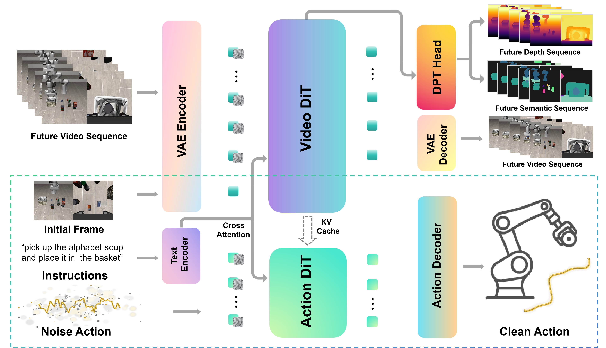
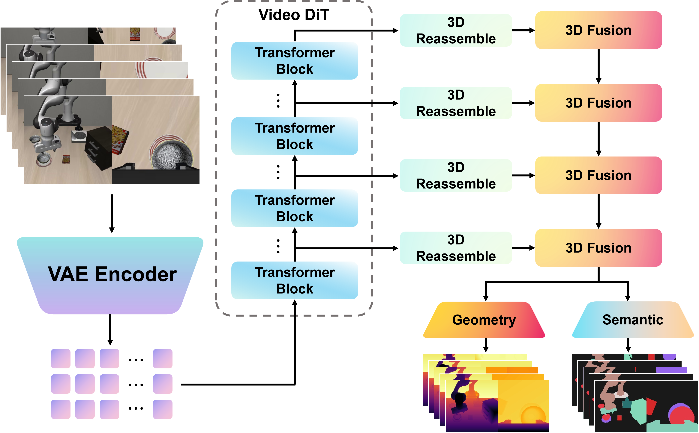
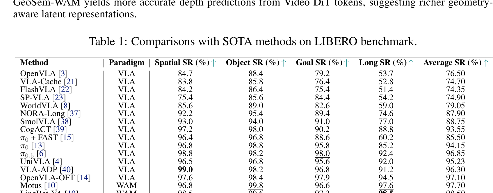
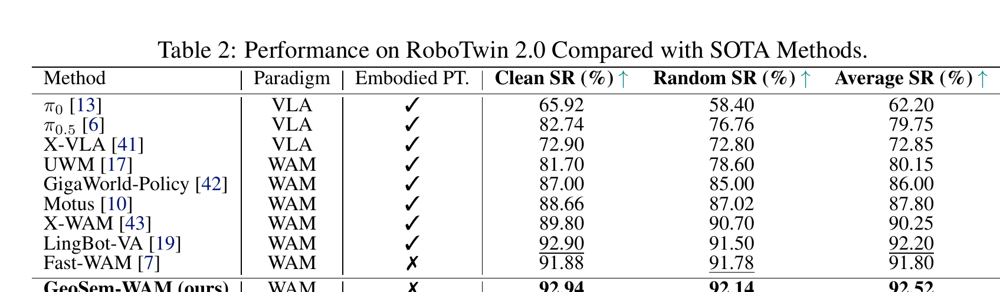
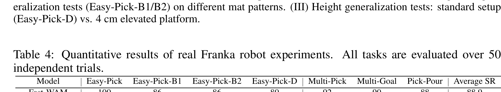
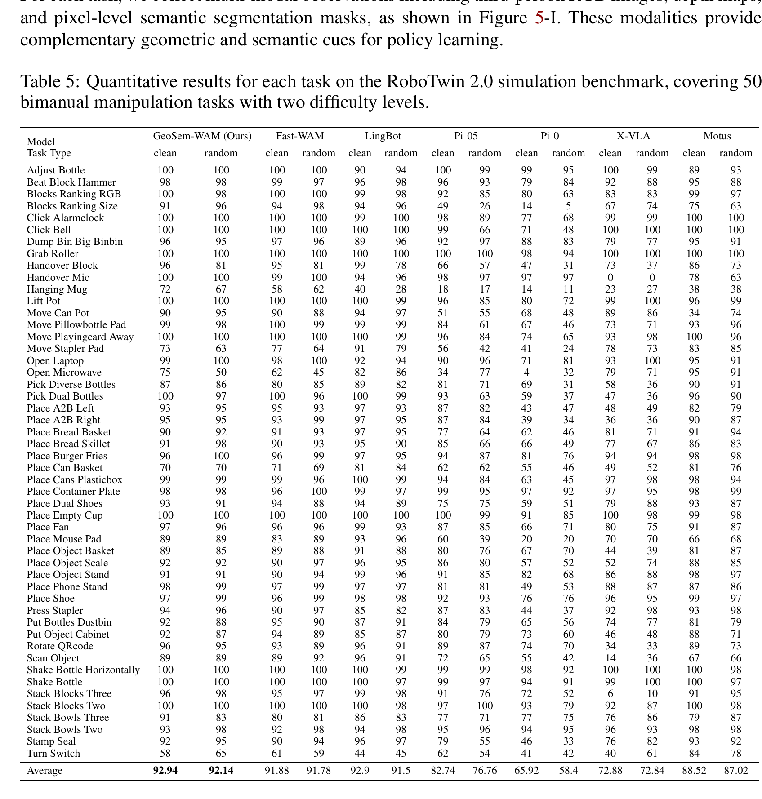
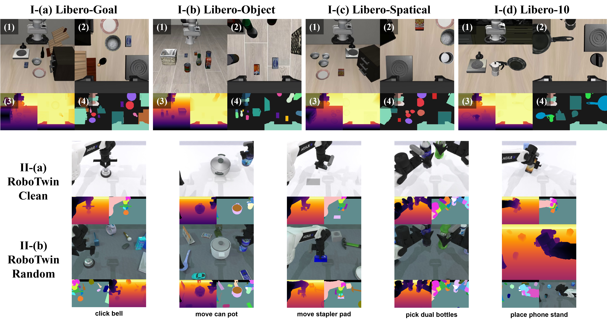
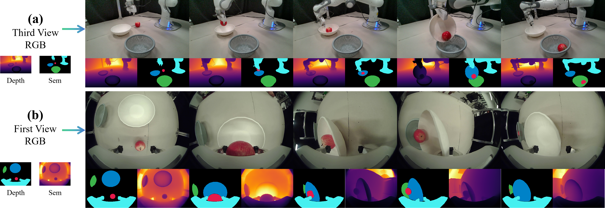

# GeoSem-WAM: Geometry- and Semantic-Aware World Action Models

**Authors:** Fulong Ma, Daojie Peng, Wenjun Yue, Jiahang Cao, Bintao Wang, Qiang Zhang, Jun Ma
**Affiliations:** HKUST(GZ); HKU; USTC; OC; SDU; X-Humaniod
**Source:** arXiv:2606.03188v1, 2 June 2026, 14 pages
**Canonical PDF:** `MRPFNLQG/Ma 等 - 2026 - GeoSem-WAM Geometry- and Semantic-Aware World Action Models.pdf`
**Detected source format:** selectable-text PDF (`pdf-text`), cross-checked against the v1 LaTeX source and rendered pages.
**Reader type:** complete paragraph-level Chinese-English detailed reader with searchable tables and local figure/table assets.
**Notes:** Equal contribution: Fulong Ma and Daojie Peng. Corresponding author: Jun Ma (`jun.ma@ust.hk`). Bibliographic entries are retained in English, in the paper's numbered order, to preserve searchability and citation identity.

## Page / Section Index

| Pages | Content |
|---|---|
| 1–2 | Abstract; 1 Introduction; 2 Related Works |
| 3–5 | 3 Methodology; equations (1)–(9); 4.1 Experimental Setup |
| 5–8 | 4.2 SOTA Comparisons; 4.3 Ablation; 4.4 Real-World Experiments; 5 Conclusion |
| 9–11 | Acknowledgments; References [1]–[45] |
| 12–13 | Appendix A; Table 5; Figure 5 |
| 13–14 | Appendix B; Figure 6 |

## Terminology Ledger

| Term | Translation / handling |
|---|---|
| World Action Model (WAM) | 世界动作模型；首次出现保留 WAM |
| future imagination / rollout | 未来想象 / 未来展开 |
| structured world supervision | 结构化世界监督 |
| geometry-aware / semantic-aware | 几何感知 / 语义感知 |
| latent world representation | 潜在世界表征 |
| Diffusion Transformer (DiT) | 扩散 Transformer（DiT） |
| Dense Prediction Transformer (DPT) | 密集预测 Transformer（DPT） |
| Mixture-of-Transformer (MoT) | Transformer 混合架构（MoT） |
| action chunk | 动作块 |
| embodied pre-training | 具身预训练 |
| success rate (SR) | 成功率（SR） |
| pseudo-label | 伪标签 |
| gradient conflict | 梯度冲突 |

## Abstract

> <strong>Para. 1:</strong> Recent World Action Models (WAMs) have demonstrated impressive capabilities in embodied decision-making. However, whether their effectiveness stems from explicit future imagination during inference or representation learning induced by predictive training remains an open question. Emerging evidence suggests the primary advantage lies in learning robust latent representations rather than generating future observations at test time. Nevertheless, existing WAMs mainly rely on RGB-based future prediction, which provides limited structural and spatial understanding of complex environments. To address this, we propose a structured world modeling framework that enhances latent representations through geometric and semantic supervision. Alongside future RGB prediction, our model introduces two auxiliary prediction branches for future geometry and semantic representations, enabling it to jointly capture scene dynamics, spatial geometry, and semantic context within a unified latent space. Crucially, our approach preserves efficient inference by avoiding explicit future rollout or video generation at test time. Extensive experiments show that incorporating structured world supervision consistently improves action prediction accuracy, scene understanding, and robustness under challenging embodied scenarios, highlighting its potential for advancing scalable and efficient WAMs.

> <strong>Para. 1[CN]:</strong> 近期的世界动作模型（WAM）在具身决策中展现出令人瞩目的能力。然而，其有效性究竟源于推理期间显式的未来想象，还是预测式训练所诱导的表征学习，仍是一个开放问题。新近证据表明，其主要优势在于学习稳健的潜在表征，而非在测试时生成未来观测。尽管如此，现有 WAM 主要依赖基于 RGB 的未来预测，对复杂环境的结构与空间理解有限。为此，我们提出一个结构化世界建模框架，通过几何与语义监督增强潜在表征。除未来 RGB 预测外，模型还引入未来几何和语义表征的两个辅助预测分支，使其能在统一潜在空间中联合捕捉场景动态、空间几何与语义上下文。关键是，该方法在测试时避免显式未来展开或视频生成，从而保持高效推理。大量实验表明，引入结构化世界监督可持续提高动作预测准确率、场景理解能力以及在挑战性具身场景下的稳健性，显示出推进可扩展、高效 WAM 的潜力。

> <strong>Para. 2:</strong> Keywords: Embodied Intelligence, World Action Model, Structured World Modeling, Vision-Language-Action Policy.

> <strong>Para. 2[CN]:</strong> 关键词：具身智能、世界动作模型、结构化世界建模、视觉—语言—动作策略。

## 1 Introduction

> <strong>Para. 1:</strong> World Action Models (WAMs) have emerged as a transformative paradigm for embodied intelligence, enabling agents to learn predictive representations of environmental dynamics from large-scale interaction data—distinct from conventional policy learning that directly maps observations to actions [1–6], WAMs leverage predictive world modeling as an auxiliary objective to enhance decision-making through future-aware representation learning. This approach has achieved remarkable performance across diverse embodied tasks, underscoring the critical role of predictive world modeling in learning robust action policies [7–11], particularly with the advancement of vision-language-action (VLA) models that have established foundational robotic policies (e.g., RT-1 [1], RT-2 [2], OpenVLA [3]) and generalist frameworks (e.g., Octo [12], $\pi_0$ [13]) to unify perception, language, and action, with subsequent works optimizing fine-tuning and action tokenization for real-world deployment [14, 15].

> <strong>Para. 1[CN]:</strong> 世界动作模型（WAM）已成为具身智能的一种变革性范式，使智能体能够从大规模交互数据中学习环境动态的预测表征。不同于直接把观测映射为动作的传统策略学习 [1–6]，WAM 将预测式世界建模作为辅助目标，通过面向未来的表征学习增强决策。这一方法在多类具身任务上取得了显著表现，凸显预测式世界建模对于学习稳健动作策略的重要性 [7–11]。尤其随着视觉—语言—动作（VLA）模型的发展，RT-1 [1]、RT-2 [2]、OpenVLA [3] 等基础机器人策略，以及 Octo [12]、$\pi_0$ [13] 等通用框架，将感知、语言和动作统一起来；后续工作进一步优化微调与动作分词，以服务真实部署 [14, 15]。

> <strong>Para. 2:</strong> Yet despite this progress, a fundamental question remains understudied: why do World Action Models work? Early WAM designs assumed that explicit future imagination during inference [16, 17], generating future trajectories or visual observations [18, 19] to plan ahead, drove their success, but recent evidence increasingly points to a different core benefit: the dynamics-aware latent representations learned through predictive supervision during training, rather than test-time future imagination [7]. In essence, future prediction acts as a structured self-supervised objective. Existing WAMs predominantly rely on RGB-based future prediction, which provides only limited structural understanding of complex environments. Appearance-based supervision lacks explicit geometric reasoning and high-level semantic awareness that are critical for embodied agents operating in real-world scenarios [20], resulting in latent representations that capture short-term visual dynamics but fail to encode richer environmental structure and object-level semantics.

> <strong>Para. 2[CN]:</strong> 尽管已有进展，一个根本问题仍缺乏研究：世界动作模型为何有效？早期 WAM 设计假定，推理时显式想象未来 [16, 17]，即生成未来轨迹或视觉观测 [18, 19] 来提前规划，是其成功来源；但近期证据越来越指向另一项核心收益：训练时通过预测监督学到的动态感知潜在表征，而非测试时的未来想象 [7]。本质上，未来预测充当一种结构化自监督目标。现有 WAM 主要依赖 RGB 未来预测，对复杂环境只能提供有限的结构理解。外观监督缺少真实具身场景所必需的显式几何推理和高层语义感知 [20]，使潜在表征虽能捕捉短期视觉动态，却无法编码更丰富的环境结构与对象级语义。

> <strong>Para. 3:</strong> To address this gap, we propose a structured world modeling framework that augments WAMs with geometry-aware and semantic-aware predictive supervision. Beyond standard future RGB prediction, our framework introduces two auxiliary branches: a geometry prediction branch to learn spatial geometry and 3D structural consistency, and a semantic prediction branch to capture object-level semantics and scene context [5]. By jointly modeling future appearance, geometry, and semantics, our framework learns a more structured latent world representation that better captures the underlying properties of embodied environments—all while preserving the efficient inference paradigm of modern WAMs. Unlike methods requiring computationally expensive future rollout or iterative generation at test time, our approach uses structured predictive supervision only during training, directly predicting actions at inference to balance performance and latency, aligning with ongoing efforts to accelerate VLA inference via token pruning, cache optimization, and dynamic compression [21–23]. Extensive evaluations across diverse embodied interaction tasks confirm that our approach consistently improves action prediction accuracy, robustness, and scene understanding, particularly in challenging scenarios involving occlusions, object interactions, and complex environmental dynamics. Our contributions are summarized as follows:

> <strong>Para. 3[CN]:</strong> 为弥补这一缺口，我们提出结构化世界建模框架，以几何感知和语义感知预测监督增强 WAM。除标准未来 RGB 预测外，框架引入两个辅助分支：几何预测分支学习空间几何与三维结构一致性，语义预测分支捕捉对象级语义和场景上下文 [5]。通过联合建模未来外观、几何与语义，框架学习更结构化的潜在世界表征，更好刻画具身环境的内在属性，同时保留现代 WAM 的高效推理范式。不同于测试时需要高成本未来展开或迭代生成的方法，本方法只在训练时使用结构化预测监督，推理时直接预测动作以平衡性能与延迟，并与通过 token 剪枝、缓存优化和动态压缩加速 VLA 推理的研究方向一致 [21–23]。多类具身交互任务的广泛评估确认，本方法持续提升动作预测准确率、稳健性和场景理解，尤其是在遮挡、对象交互和复杂环境动态等挑战场景中。贡献如下：

> <strong>Para. 4:</strong> 1. We revisit the core value of predictive world modeling in WAMs, providing a clear perspective that its primary benefit stems from training-phase representation learning (i.e., inducing dynamics-aware latent features via predictive supervision) rather than explicit future imagination or rollout during test time, which clarifies the underpinning mechanism of WAM effectiveness and guides more efficient model design.
>
> 2. We propose a novel structured world modeling framework that enriches WAM supervision with multi-modal predictive signals, integrating future RGB, geometry, and semantic prediction into a unified framework. This design explicitly encourages the model to learn spatial geometry, 3D structural consistency, and object-level semantics, addressing the limitation of RGB-only supervision in capturing complex environmental structure.
>
> 3. We demonstrate through comprehensive simulation and real-world experiments that our structured supervision strategy consistently enhances embodied decision-making performance across diverse tasks, while maintaining efficient test-time inference by avoiding explicit future generation. This balance of performance and efficiency makes our framework practical for real-world robotic deployment, with additional analyses verifying the complementary value of geometric and semantic supervision.

> <strong>Para. 4[CN]:</strong> 1. 重新审视 WAM 中预测式世界建模的核心价值，明确其主要收益来自训练阶段的表征学习（即用预测监督诱导动态感知潜在特征），而非测试时显式未来想象或展开；这一观点澄清了 WAM 有效性的底层机制，并指导更高效的模型设计。
>
> 2. 提出一种新的结构化世界建模框架，以多模态预测信号丰富 WAM 监督，把未来 RGB、几何和语义预测整合到统一框架中。该设计显式促使模型学习空间几何、三维结构一致性和对象级语义，解决仅 RGB 监督难以捕捉复杂环境结构的局限。
>
> 3. 通过全面的仿真和真实世界实验表明，结构化监督策略可在多类任务上一致增强具身决策性能，同时通过避免显式未来生成保持高效测试时推理。这一性能—效率平衡使框架适合真实机器人部署，进一步分析也验证了几何与语义监督的互补价值。

### Figure 1. GeoSem-WAM architecture

**Caption:** Overview of the architecture of our method. The overall figure represents the training phase, and the part within the dashed box represents the model inference stage.

**Caption[CN]:** 本文方法的架构概览。整幅图表示训练阶段，虚线框内部分表示模型推理阶段。

## 2 Related Works

### 2.1 Vision-Language-Action (VLA) Policies and World Action Models (WAMs)

> <strong>Para. 1:</strong> Vision-Language-Action (VLA) models serve as the cornerstone of modern embodied intelligence, unifying visual perception, natural language grounding, and robotic action generation. Representative works such as RT-1 [1], RT-2 [2], and OpenVLA [3] successfully transfer web-scale knowledge to real-world robotic control, while generalist frameworks like Octo [12] further expand multi-task adaptability. World Action Models (WAMs) integrate world modeling with action generation, leveraging predictive supervision to learn environmental dynamics and improve decision-making [8, 10]. Most existing WAMs rely on RGB-based future prediction as their core supervision, but recent studies confirm that their key advantage lies in training-phase dynamics-aware representation learning rather than test-time explicit future imagination [7]. Unlike prior works focusing on VLA deployment optimization (e.g., inference acceleration [21] or fine-tuning [14]) or RGB-only WAM designs, our work enhances training supervision with geometric and semantic cues to learn more structured latent representations.

> <strong>Para. 1[CN]:</strong> 视觉—语言—动作（VLA）模型是现代具身智能的基石，统一视觉感知、自然语言落地与机器人动作生成。RT-1 [1]、RT-2 [2] 和 OpenVLA [3] 等代表工作成功把网络规模知识迁移到真实机器人控制，Octo [12] 等通用框架进一步扩大多任务适应性。世界动作模型（WAM）将世界建模与动作生成结合，利用预测监督学习环境动态并改善决策 [8, 10]。现有 WAM 多以 RGB 未来预测为核心监督，但近期研究确认，其关键优势在于训练阶段的动态感知表征学习，而非测试时显式未来想象 [7]。不同于聚焦 VLA 部署优化（如推理加速 [21]、微调 [14]）或仅 RGB 的 WAM 设计，本工作用几何和语义线索增强训练监督，以学习更结构化的潜在表征。

### 2.2 Imitation Learning and Robotic Data Learning

> <strong>Para. 1:</strong> Imitation learning is the core technical support for robotic policy training from demonstration data. Early researches focus on heterogeneous demonstration screening, state adaptive weighting and coarse-to-fine learning strategies to improve imitation efficiency [24]. Meanwhile, large-scale robotic datasets including BridgeData V2 [25] and standardized evaluation benchmarks such as CALVIN [26], LIBERO [27] provide unified training and verification platforms for embodied policy. In addition, data quality enhancement and automatic data curation methods also greatly facilitate scalable robotic model training [28, 29]. Our structured world modeling can serve as an effective representation enhancement module, which can be seamlessly embedded into imitation learning pipelines to excavate deeper structural information from limited demonstration data.

> <strong>Para. 1[CN]:</strong> 模仿学习是利用示范数据训练机器人策略的核心技术支撑。早期研究关注异质示范筛选、状态自适应加权和由粗到细的学习策略，以提高模仿效率 [24]。BridgeData V2 [25] 等大规模机器人数据集，以及 CALVIN [26]、LIBERO [27] 等标准化评测基准，为具身策略提供统一训练与验证平台。数据质量增强和自动数据整理方法也显著促进可扩展机器人模型训练 [28, 29]。本工作的结构化世界建模可作为有效的表征增强模块，无缝嵌入模仿学习流程，从有限示范数据中挖掘更深层结构信息。

### 2.3 Scaling Laws and Foundation Model Representation Learning

> <strong>Para. 1:</strong> Scaling law research in natural language processing reveals that model capability can be steadily promoted through reasonable allocation of parameters, data and computing resources [30–32]. Such conclusions also provide important guidance for the development of robotic foundation models. On the basis of large-scale pre-trained visual-language models such as CLIP [33] and EVA-CLIP [34], embodied models gradually migrate general visual-text alignment knowledge to physical interaction scenarios. Our work conforms to this development trend, and enhances the task-specific structured representation ability of robotic foundation models through customized multi-modal world prediction supervision, without blindly expanding model scale and training data volume.

> <strong>Para. 1[CN]:</strong> 自然语言处理中的缩放定律研究表明，合理分配参数、数据和计算资源可稳定提升模型能力 [30–32]。这些结论也为机器人基础模型发展提供重要指导。基于 CLIP [33]、EVA-CLIP [34] 等大规模预训练视觉—语言模型，具身模型逐步把通用视觉—文本对齐知识迁移到物理交互场景。本工作顺应这一趋势，通过定制的多模态世界预测监督增强机器人基础模型的任务特定结构化表征能力，而非盲目扩大模型规模与训练数据量。

## 3 Methodology

### 3.1 Overview

> <strong>Para. 1:</strong> GeoSem-WAM is motivated by the promise of world modeling for learning richer downstream representations. Beyond standard future pixel prediction, we introduce auxiliary geometry and semantic segmentation branches during training. Similar to Fast-WAM [7], GeoSem-WAM jointly learns video generation, action prediction, and geometric-semantic understanding, forcing the backbone network to capture physically grounded motion and spatial-semantic layouts. During inference, GeoSem-WAM avoids explicit future sequence prediction. Instead, it processes only the first observation’s latent tokens in a single forward pass to directly generate actions, eliminating the computational overhead of future rollouts. The DPT auxiliary branches are also discarded at deployment. Importantly, neither geometry nor semantic annotations are used as model inputs. This design mirrors human cognition: relying solely on raw visual observation while internally reasoning about geometry and semantics to achieve superior task performance.

> <strong>Para. 1[CN]:</strong> GeoSem-WAM 的出发点是利用世界建模学习更丰富的下游表征。除标准未来像素预测外，训练时还引入几何与语义分割辅助分支。与 Fast-WAM [7] 类似，GeoSem-WAM 联合学习视频生成、动作预测和几何—语义理解，迫使骨干网络捕捉具有物理依据的运动以及空间—语义布局。推理时，GeoSem-WAM 避免显式预测未来序列，仅在一次前向传播中处理第一帧观测的潜在 token 并直接生成动作，消除未来展开的计算开销；部署时也丢弃 DPT 辅助分支。重要的是，几何或语义标注均不作为模型输入。该设计类比人类认知：只依靠原始视觉观测，同时在内部对几何和语义进行推理，以获得更好的任务表现。

### 3.2 Architecture

> <strong>Para. 1:</strong> GeoSem-WAM is constructed upon the video Diffusion Transformer (DiT) of Wan2.2-5B [35], which acts as the world modeling backbone. The pretrained text encoder and video VAE from the same model are also reused: task instructions are encoded using the native T5 encoder and delivered to all tokens via cross-attention, whereas visual observations are transformed into latent video tokens through the pretrained VAE. Built on this backbone, we introduce an action expert DiT, similar in architecture but differing in size, designed for action chunk generation. Furthermore, we incorporate DPT-style [36] geometry prediction and semantic segmentation branches. The overall model adopts a Mixture-of-Transformer (MoT) architecture with shared attention between the video and action branches, as shown in Fig. 1. The dashed box denotes the model’s inputs and network architecture at inference stage.

> <strong>Para. 1[CN]:</strong> GeoSem-WAM 构建在 Wan2.2-5B [35] 的视频扩散 Transformer（DiT）之上，后者作为世界建模骨干。同一模型的预训练文本编码器和视频 VAE 也被复用：任务指令由原生 T5 编码器编码，并通过交叉注意力传递给所有 token；视觉观测则经预训练 VAE 转为潜在视频 token。在该骨干上，作者引入一个与其架构相似但规模不同的动作专家 DiT，用于生成动作块；此外还加入 DPT 风格 [36] 的几何预测和语义分割分支。整体采用视频分支与动作分支共享注意力的 Transformer 混合架构（MoT），如图 1 所示。虚线框表示推理阶段的模型输入与网络结构。

#### Latent World Modeling

> <strong>Para. 2:</strong> We model future video dynamics in the latent space of a pretrained VAE. Let $z^{\mathrm{gt}}_{t:t+K}$ denote the ground-truth future video latents. During training, we sample a noise level $\sigma \in [0,1]$ and corrupt the target video latents with Gaussian noise $\epsilon_z \sim \mathcal{N}(0,I)$:

> <strong>Para. 2[CN]:</strong> 作者在预训练 VAE 的潜在空间中建模未来视频动态。令 $z^{\mathrm{gt}}_{t:t+K}$ 表示真实未来视频潜变量。训练时，从 $[0,1]$ 采样噪声水平 $\sigma$，并以高斯噪声 $\epsilon_z \sim \mathcal{N}(0,I)$ 扰动目标视频潜变量：

$$
z^\sigma_{t:t+K}=(1-\sigma)z^{\mathrm{gt}}_{t:t+K}+\sigma\epsilon_z. \tag{1}
$$

> <strong>Para. 3:</strong> Conditioned on the current observation and language instruction, the video DiT predicts the flow target:

> <strong>Para. 3[CN]:</strong> 以当前观测和语言指令为条件，视频 DiT 预测流目标：

$$
\hat v_z=f^{\mathrm{rgb}}_\theta(z^\sigma_{t:t+K},\sigma,c),\qquad v_z=\epsilon_z-z^{\mathrm{gt}}_{t:t+K}. \tag{2}
$$

> <strong>Para. 4:</strong> where $c$ denotes the conditioning context, including the current visual observation and language instruction. The video modeling objective is:

> <strong>Para. 4[CN]:</strong> 其中 $c$ 表示条件上下文，包括当前视觉观测和语言指令。视频建模目标为：

$$
\mathcal L_{\mathrm{rgb}}=\lVert\hat v_z-v_z\rVert_2^2. \tag{3}
$$

#### Action Modeling

> <strong>Para. 5:</strong> The action branch predicts a future action chunk through denoising. During training, we corrupt the ground-truth action sequence $a^{\mathrm{gt}}_{t:t+H-1}$ with Gaussian noise $\epsilon_a$:

> <strong>Para. 5[CN]:</strong> 动作分支通过去噪预测未来动作块。训练时，以高斯噪声 $\epsilon_a$ 扰动真实动作序列 $a^{\mathrm{gt}}_{t:t+H-1}$：

$$
a^\sigma_{t:t+H-1}=(1-\sigma)a^{\mathrm{gt}}_{t:t+H-1}+\sigma\epsilon_a,\qquad \epsilon_a\sim\mathcal N(0,I). \tag{4}
$$

> <strong>Para. 6:</strong> Conditioned on the latent world representation $z_t$, the action DiT predicts the flow target:

> <strong>Para. 6[CN]:</strong> 以潜在世界表征 $z_t$ 为条件，动作 DiT 预测流目标：

$$
\hat v_a=f^{\mathrm{act}}_\phi(a^\sigma_{t:t+H-1},\sigma,z_t),\qquad v_a=\epsilon_a-a^{\mathrm{gt}}_{t:t+H-1}. \tag{5}
$$

> <strong>Para. 7:</strong> The action objective is:

> <strong>Para. 7[CN]:</strong> 动作目标为：

$$
\mathcal L_{\mathrm{act}}=\lVert\hat v_a-v_a\rVert_2^2. \tag{6}
$$

> <strong>Para. 8:</strong> At inference time, the action chunk is initialized from Gaussian noise and iteratively denoised conditioned on $z_t$, without explicitly generating future video frames.

> <strong>Para. 8[CN]:</strong> 推理时，动作块由高斯噪声初始化，并在 $z_t$ 条件下迭代去噪，而无需显式生成未来视频帧。

#### Dense Structured World Supervision

> <strong>Para. 9:</strong> To encourage the learned world representation to encode both geometric structure and object-level semantics, we introduce dense auxiliary supervision on the video latent tokens. We implement the auxiliary branch with a DPT-style [36] dense prediction head. This DPT-style head aggregates intermediate video tokens from multiple Transformer blocks. These multi-level features are projected, fused, and decoded into dense spatial predictions, allowing the auxiliary supervision to leverage both low-level spatial details and high-level semantic abstractions. The details of this DPT-style dense prediction branch are illustrated in Fig. 2. Specifically, the input video is first encoded into tokens via a VAE encoder. After these tokens are processed through multiple Transformer stages, the architecture reassembles the multi-stage tokens into multi-resolution, image-like representations. These representations are then progressively fused and upsampled through fusion modules, and finally decoded by the geometry and semantic heads to yield fine-grained predictions. To better accommodate video inputs, we extend the original reassemble and fusion modules to a 3D reassemble module and a 3D fusion module.

> <strong>Para. 9[CN]:</strong> 为促使学到的世界表征同时编码几何结构与对象级语义，作者在视频潜在 token 上引入密集辅助监督。辅助分支采用 DPT 风格 [36] 的密集预测头，聚合多个 Transformer block 的中间视频 token；这些多层级特征经投影、融合并解码为密集空间预测，使辅助监督能同时利用低层空间细节与高层语义抽象。图 2 展示了该分支细节：输入视频首先由 VAE 编码器转为 token；经多个 Transformer 阶段处理后，架构把多阶段 token 重组为多分辨率、类图像表征；随后通过融合模块逐级融合和上采样，最后由几何头与语义头解码为细粒度预测。为适应视频输入，作者把原始重组和融合模块扩展为三维重组模块与三维融合模块。

### Figure 2. DPT auxiliary head

**Caption:** The architecture of DPT auxiliary head.

**Caption[CN]:** DPT 辅助头的架构。

> <strong>Para. 10:</strong> Let $z_\tau$ denote the latent representation at a future prediction step $\tau\in\{t+1,\ldots,t+K\}$. For geometry supervision, we attach a geometry prediction head $H_{\mathrm{geo}}$ to estimate the future geometry information $\hat o^{\mathrm{geo}}_\tau$, and the geometry branch is trained with an $L_1$ reconstruction objective:

> <strong>Para. 10[CN]:</strong> 令 $z_\tau$ 表示未来预测步 $\tau\in\{t+1,\ldots,t+K\}$ 的潜在表征。对于几何监督，接入几何预测头 $H_{\mathrm{geo}}$ 估计未来几何信息 $\hat o^{\mathrm{geo}}_\tau$，并以 $L_1$ 重建目标训练几何分支：

$$
\mathcal L_{\mathrm{geo}}=\frac{1}{K}\sum_\tau\lVert\hat o^{\mathrm{geo}}_\tau-o^{\mathrm{geo}}_\tau\rVert_1. \tag{7}
$$

> <strong>Para. 11:</strong> For semantic supervision, we attach a semantic prediction head $H_{\mathrm{sem}}$ to predict dense semantic logits $\hat o^{\mathrm{sem}}_\tau$; the semantic branch is optimized using pixel-wise cross-entropy:

> <strong>Para. 11[CN]:</strong> 对于语义监督，接入语义预测头 $H_{\mathrm{sem}}$ 预测密集语义 logits $\hat o^{\mathrm{sem}}_\tau$；语义分支使用逐像素交叉熵优化：

$$
\mathcal L_{\mathrm{sem}}=\frac{1}{K}\sum_\tau\mathrm{CE}(\hat o^{\mathrm{sem}}_\tau,o^{\mathrm{sem}}_\tau). \tag{8}
$$

#### Unified Training Objective

> <strong>Para. 12:</strong> The overall training objective jointly optimizes RGB prediction, geometry prediction, semantic prediction, and action prediction:

> <strong>Para. 12[CN]:</strong> 整体训练目标联合优化 RGB 预测、几何预测、语义预测与动作预测：

$$
\mathcal L=\lambda_{\mathrm{rgb}}\mathcal L_{\mathrm{rgb}}+\lambda_{\mathrm{geo}}\mathcal L_{\mathrm{geo}}+\lambda_{\mathrm{sem}}\mathcal L_{\mathrm{sem}}+\lambda_{\mathrm{act}}\mathcal L_{\mathrm{act}}. \tag{9}
$$

> <strong>Para. 13:</strong> where $\lambda_{\mathrm{rgb}}$, $\lambda_{\mathrm{geo}}$, $\lambda_{\mathrm{sem}}$, and $\lambda_{\mathrm{act}}$ denote balancing coefficients for different objectives.

> <strong>Para. 13[CN]:</strong> 其中 $\lambda_{\mathrm{rgb}}$、$\lambda_{\mathrm{geo}}$、$\lambda_{\mathrm{sem}}$ 和 $\lambda_{\mathrm{act}}$ 表示不同目标的平衡系数。

## 4 Experiments

### 4.1 Experimental Setup

> <strong>Para. 1:</strong> Simulation Environment. We conduct experiments on two commonly adopted simulation benchmarks, LIBERO [27] and RoboTwin [29]. LIBERO includes four task suites, namely LIBERO-Spatial, LIBERO-Object, LIBERO-Goal, and LIBERO-Long. Each suite provides 500 expert demonstrations covering 10 tasks, enabling evaluation of policy generalization across spatial configurations, object categories, goal specifications, and long-horizon execution. RoboTwin is a real-to-sim benchmark designed for bimanual robotic manipulation. It provides an easy setting with in-domain layouts and a more challenging setting with domain randomization, where variations are introduced through scene clutter, background textures, illumination, and tabletop height. We evaluate our approach on a diverse set of tasks and use success rate (SR) as the evaluation metric for both benchmarks.

> <strong>Para. 1[CN]:</strong> 仿真环境。作者在两个常用仿真基准 LIBERO [27] 和 RoboTwin [29] 上实验。LIBERO 包含 LIBERO-Spatial、LIBERO-Object、LIBERO-Goal 与 LIBERO-Long 四个任务套件；每个套件提供覆盖 10 个任务的 500 条专家示范，用于评估策略在空间配置、对象类别、目标规格和长时程执行上的泛化。RoboTwin 是面向双臂机器人操作的 real-to-sim 基准，包含域内布局的简单设置，以及采用域随机化的更具挑战设置；后者在场景杂乱度、背景纹理、照明和桌面高度方面引入变化。两套基准均以成功率（SR）作为评估指标。

### 4.2 Comparisons with State-of-the-Art Methods

> <strong>Para. 1:</strong> LIBERO. Each task is evaluated for 50 trials under different random seeds, and we report the success rate of each task suite as well as the mean success rate across the four suites. As shown in Table 1, our GeoSem-WAM achieves an overall average success rate of 98.55%, demonstrating strong performance across all task categories. Compared with the baseline method Fast-WAM, the average success rate improves from 97.60% to 98.55%, validating the effectiveness of introducing explicit geometry and semantic supervision for future video prediction.

> <strong>Para. 1[CN]:</strong> LIBERO。每个任务在不同随机种子下评估 50 次，报告各任务套件成功率及四套件平均成功率。如表 1 所示，GeoSem-WAM 的总体平均成功率为 98.55%，在所有任务类别上表现强劲。相较 Fast-WAM，平均成功率从 97.60% 提升到 98.55%，验证了为未来视频预测引入显式几何和语义监督的有效性。

### Figure 3. Semantic clustering and depth probing

**Caption:** Fig. (a) and (b): Middle layer Video DiT token embeddings colored by semantic class. GeoSem-WAM yields clearer semantic clustering than baseline. Fig. (c): Frozen-backbone depth probing on LIBERO. GeoSem-WAM yields more accurate depth predictions from Video DiT tokens, suggesting richer geometry-aware latent representations.

**Caption[CN]:** 图 (a)、(b)：按语义类别着色的 Video DiT 中间层 token 嵌入。GeoSem-WAM 比基线形成更清晰的语义聚类。图 (c)：在 LIBERO 上冻结骨干的深度探测。GeoSem-WAM 从 Video DiT token 预测出更准确的深度，表明其潜在表征包含更丰富的几何感知信息。

### Table 1. LIBERO SOTA comparison

**Caption:** Comparisons with SOTA methods on LIBERO benchmark.

**Caption[CN]:** LIBERO 基准上的 SOTA 方法比较。

| Method | Paradigm | Spatial SR (%) ↑ | Object SR (%) ↑ | Goal SR (%) ↑ | Long SR (%) ↑ | Average SR (%) ↑ |
|---|---:|---:|---:|---:|---:|---:|
| OpenVLA [3] | VLA | 84.7 | 88.4 | 79.2 | 53.7 | 76.50 |
| VLA-Cache [21] | VLA | 83.8 | 85.8 | 76.4 | 52.8 | 74.70 |
| FlashVLA [22] | VLA | 84.2 | 86.4 | 75.4 | 51.4 | 74.35 |
| SP-VLA [23] | VLA | 75.4 | 85.6 | 84.4 | 54.2 | 74.90 |
| WorldVLA [8] | VLA | 85.6 | 89.0 | 82.6 | 59.0 | 79.05 |
| NORA-Long [37] | VLA | 92.2 | 95.4 | 89.4 | 74.6 | 87.90 |
| SmolVLA [38] | VLA | 93.0 | 94.0 | 91.0 | 77.0 | 88.75 |
| CogACT [39] | VLA | 97.2 | 98.0 | 90.2 | 88.8 | 93.55 |
| $\pi_0$ + FAST [15] | VLA | 96.4 | 96.8 | 88.6 | 60.2 | 85.50 |
| $\pi_0$ [13] | VLA | 96.8 | 98.8 | 95.8 | 85.2 | 94.15 |
| $\pi_{0.5}$ [6] | VLA | 98.8 | 98.2 | 98.0 | 92.4 | 96.85 |
| UniVLA [4] | VLA | 96.5 | 96.8 | 95.6 | 92.0 | 95.23 |
| VLA-ADP [40] | VLA | 99.0 | 98.2 | 96.8 | 91.2 | 96.30 |
| OpenVLA-OFT [14] | VLA | 97.6 | 98.4 | 97.9 | 94.5 | 97.10 |
| Motus [10] | WAM | 96.8 | 99.8 | 96.6 | 97.6 | 97.70 |
| LingBot-VA [19] | WAM | 98.5 | 99.6 | 97.2 | 98.5 | 98.50 |
| Fast-WAM [7] | WAM | 97.2 | 100.0 | 97.0 | 95.2 | 97.60 |
| GeoSem-WAM (ours) | WAM | 99.0 | 100.0 | 98.2 | 97.0 | 98.55 |

> <strong>Para. 2:</strong> RoboTwin 2.0. On the RoboTwin 2.0 dataset, we evaluate 50 tasks under both the clean and random settings. Table 2 reports the success rates under the clean and random settings, as well as the overall average success rate. As shown in Table 2, our GeoSem-WAM achieves a new state-of-the-art average success rate of 92.52%. Compared with the base model Fast-WAM, it improves the average success rate by 0.8% and outperforms the previous best method, LingBot-VA, without requiring any embodied pre-training. For the specific success rates of each task, please refer to Table 5.

> <strong>Para. 2[CN]:</strong> RoboTwin 2.0。在 RoboTwin 2.0 上，作者于 clean 与 random 两种设置下评估 50 个任务。表 2 报告 clean、random 及总体平均成功率。GeoSem-WAM 取得新的 SOTA 平均成功率 92.52%。相较基础模型 Fast-WAM，平均成功率提高 0.8%，且无需具身预训练便超过此前最佳方法 LingBot-VA。各任务的具体成功率见表 5。

### Table 2. RoboTwin 2.0 SOTA comparison

**Caption:** Performance on RoboTwin 2.0 Compared with SOTA Methods.

**Caption[CN]:** GeoSem-WAM 与 SOTA 方法在 RoboTwin 2.0 上的性能比较。

| Method | Paradigm | Embodied PT. | Clean SR (%) ↑ | Random SR (%) ↑ | Average SR (%) ↑ |
|---|---|---:|---:|---:|---:|
| $\pi_0$ [13] | VLA | ✓ | 65.92 | 58.40 | 62.20 |
| $\pi_{0.5}$ [6] | VLA | ✓ | 82.74 | 76.76 | 79.75 |
| X-VLA [41] | VLA | ✓ | 72.90 | 72.80 | 72.85 |
| UWM [17] | WAM | ✓ | 81.70 | 78.60 | 80.15 |
| GigaWorld-Policy [42] | WAM | ✓ | 87.00 | 85.00 | 86.00 |
| Motus [10] | WAM | ✓ | 88.66 | 87.02 | 87.80 |
| X-WAM [43] | WAM | ✓ | 89.80 | 90.70 | 90.25 |
| LingBot-VA [19] | WAM | ✓ | 92.90 | 91.50 | 92.20 |
| Fast-WAM [7] | WAM | ✗ | 91.88 | 91.78 | 91.80 |
| GeoSem-WAM (ours) | WAM | ✗ | 92.94 | 92.14 | 92.52 |

> <strong>Para. 3:</strong> Furthermore, we analyze GeoSem-WAM from both semantic and geometric perspectives, with qualitative visualizations shown in Fig. 3. In the semantic experiment, as illustrated in Figures 3(a) and 3(b), token visualizations from the intermediate layers of ViT show that GeoSem-WAM exhibits clearer class clustering compared to Fast-WAM, indicating that our method achieves better semantic understanding. Additionally, we freeze the backbone and train a simple depth probe using only the intermediate tokens. The results are shown in Fig. 3(c), where columns 1 to 4 represent the RGB image, the depth map predicted by the depth probe based on Fast-WAM, the depth map predicted by the depth probe based on GeoSem-WAM, and the ground truth depth map, respectively. From Fig. 3(c), it can be observed that the latent tokens of GeoSem-WAM predict depth maps closer to the GT depth maps, whereas those of the baseline method produce blurry depth maps. This demonstrates that under the constraints of both geometric and semantic branches, the model’s latent representation is enhanced for both semantic and geometric understanding. Real robot experiments further validate that our method achieves superior performance on tasks involving semantic and geometric changes, as detailed in Section 4.4.

> <strong>Para. 3[CN]:</strong> 此外，作者从语义与几何两个角度分析 GeoSem-WAM，定性可视化见图 3。在语义实验中，图 3(a)、3(b) 的 ViT 中间层 token 可视化显示，相比 Fast-WAM，GeoSem-WAM 的类别聚类更清晰，说明语义理解更好。作者还冻结骨干，仅用中间 token 训练简单深度探针。图 3(c) 的第 1–4 列依次为 RGB 图像、基于 Fast-WAM 的探针深度、基于 GeoSem-WAM 的探针深度及真实深度。GeoSem-WAM 潜在 token 预测的深度图更接近真实值，而基线结果较模糊。这说明在几何和语义双分支约束下，模型潜在表征的语义与几何理解均得到增强。第 4.4 节真实机器人实验进一步验证了模型在语义与几何变化任务上的优越表现。

### 4.3 Ablation Study

> <strong>Para. 1:</strong> We conduct ablation studies on the LIBERO benchmark to validate our auxiliary branches, using Fast-WAM as the baseline (Table 3). Introducing only geometry supervision improves the average success rate from 97.6% to 98.2% (+0.61%), while only semantic supervision yields 98.1% (+0.51%). Combining both branches achieves the most significant improvement, raising the success rate to 98.6% (+1.02%). These results indicate that explicit geometric and semantic supervision for future video prediction both contribute positively, with their combination yielding the best performance. This aligns with intuition: for robotic manipulation, geometry and semantics correspond to spatial motion perception during execution and task-level logical reasoning, respectively. Together, they form the foundation for accurate and appropriate grasping, thereby enhancing the model’s spatial perception and reasoning capabilities.

> <strong>Para. 1[CN]:</strong> 作者在 LIBERO 上以 Fast-WAM 为基线进行消融（表 3）。仅加入几何监督，平均成功率由 97.6% 升至 98.2%（+0.61%）；仅加入语义监督达到 98.1%（+0.51%）；两者结合提升最大，达到 98.6%（+1.02%）。结果表明，面向未来视频预测的显式几何和语义监督均有正向贡献，组合表现最佳。直观而言，在机器人操作中，几何对应执行过程的空间运动感知，语义对应任务级逻辑推理；二者共同构成准确且恰当地抓取物体的基础，从而增强空间感知与推理能力。

### Table 3. Structured supervision ablation

**Caption:** Component analysis of different structured world supervision objectives on the LIBERO benchmark.

**Caption[CN]:** LIBERO 基准上不同结构化世界监督目标的组件分析。

| Method | RGB | Geometry | Semantic | Average SR (%) ↑ | ΔSR (%) ↑ |
|---|---:|---:|---:|---:|---:|
| RGB-only WAM | ✓ | × | × | 97.6 | – |
| + Geometry-aware | ✓ | ✓ | × | 98.2 | +0.61 |
| + Semantic-aware | ✓ | × | ✓ | 98.1 | +0.51 |
| + Geometry- and Semantic-Aware | ✓ | ✓ | ✓ | 98.6 | +1.02 |

### 4.4 Real-World Experiments on Franka Emika Panda Robot

> <strong>Para. 1:</strong> We conduct real robotic validation on a Franka Emika Panda platform with four manipulation tasks of escalating difficulty, as depicted in Figure 4-I: (a) Easy-Pick for single-object pick-and-place, (b) Multi-Pick handling objects amid multiple distractors, (c) Multi-Goal multi-object placement to different target containers, (d) Pick-Pour cross-bowl apple pouring, which involves long-horizon pick-place-pour coordination. We collect 50 human teleoperation trajectories per task. Raw sequences are preprocessed by discarding idle frames and smoothing action sequences to facilitate stable and efficient model training. We fine-tune GeoSem-WAM following the Fast-WAM training paradigm utilizing two NVIDIA H800 GPUs. During inference, the model is deployed on an RTX 4090 GPU. Each task undergoes 50 repeated trials to calculate average success rate Average SR.

> <strong>Para. 1[CN]:</strong> 作者在 Franka Emika Panda 平台上进行真实机器人验证，包含图 4-I 所示、难度递增的四项操作任务：(a) 单对象拾取放置 Easy-Pick；(b) 多干扰物条件下操作对象的 Multi-Pick；(c) 将多个对象放入不同目标容器的 Multi-Goal；(d) 跨碗倒苹果的 Pick-Pour，涉及长时程拾取—放置—倾倒协调。每项任务收集 50 条人类遥操作轨迹；原始序列通过丢弃空闲帧和动作平滑进行预处理，以促进稳定、高效训练。GeoSem-WAM 遵循 Fast-WAM 训练范式，使用两块 NVIDIA H800 微调；推理部署于 RTX 4090。每项任务重复测试 50 次并计算平均成功率。

> <strong>Para. 2:</strong> To further evaluate the robustness of our policy, we design two additional generalization test settings, as shown in Figure 4-II and 4-III. Figure 4-II presents the background generalization tests on the Easy-Pick task, with two different mat backgrounds (uniform yellow and patterned blue-yellow) to assess how visual distractions affect performance. Figure 4-III illustrates the height generalization tests, where we compare the standard setup (Easy-Pick-D) with an elevated platform setup featuring a 4 cm height difference, verifying the policy’s adaptability to geometric variations in the workspace.

> <strong>Para. 2[CN]:</strong> 为进一步评估策略稳健性，作者设计图 4-II 和 4-III 所示的两项额外泛化测试。图 4-II 在 Easy-Pick 上使用两种不同垫面背景（纯黄色与蓝黄图案），评估视觉干扰对性能的影响。图 4-III 展示高度泛化测试，对比标准设置 Easy-Pick-D 与存在 4 cm 高差的抬高平台设置，以验证策略对工作空间几何变化的适应能力。

### Figure 4. Real-world manipulation experiments

**Caption:** Real-world manipulation experiments overview. (I) Four core tasks: Easy-Pick, Multi-Pick, Multi-Goal, and Pick-Pour, each shown with RGB, depth, and semantic observations. (II) Background generalization tests (Easy-Pick-B1/B2) on different mat patterns. (III) Height generalization tests: standard setup (Easy-Pick-D) vs. 4 cm elevated platform.

**Caption[CN]:** 真实世界操作实验概览。(I) 四项核心任务：Easy-Pick、Multi-Pick、Multi-Goal 和 Pick-Pour，每项均展示 RGB、深度和语义观测。(II) 不同垫面图案上的背景泛化测试 Easy-Pick-B1/B2。(III) 高度泛化测试：标准设置 Easy-Pick-D 与抬高 4 cm 的平台。

> <strong>Para. 3:</strong> Quantitative results across all real-world scenarios are summarized in Table 4. The proposed GeoSem-WAM consistently outperforms the Fast-WAM baseline across all tested tasks and generalization settings. Overall, the average success rate improves from 88.9% to 95.4%, representing a clear performance gain of +6.6%. Notably, the largest improvements are observed in the generalization and challenging multi-step tasks: (1) In the background and height generalization tests, GeoSem-WAM achieves gains of +10%, +8%, and +12% on Easy-Pick-B1, Easy-Pick-B2, and Easy-Pick-D, respectively, effectively mitigating performance drops caused by visual distractions and geometric variations. (2) For the multi-object and long-horizon tasks, it yields consistent improvements of +6% on Multi-Pick, +6% on Multi-Goal, and +4% on Pick-Pour, demonstrating stronger robustness in scenarios requiring complex spatial reasoning and sequential action planning. Across all setups, the single-object Easy-Pick task already reaches perfect performance (100%) with both methods, confirming that our geometric-semantic priors do not degrade basic manipulation capabilities. These results validate that incorporating fused geometric and semantic features significantly enhances the policy’s reliability, adaptability, and generalization in practical robotic manipulation scenarios.

> <strong>Para. 3[CN]:</strong> 所有真实场景的定量结果汇总于表 4。GeoSem-WAM 在全部任务和泛化设置中持续优于 Fast-WAM。总体平均成功率从 88.9% 升至 95.4%，净增 +6.6%。最大提升集中在泛化和挑战性多步任务：(1) 背景与高度泛化测试中，Easy-Pick-B1、Easy-Pick-B2、Easy-Pick-D 分别提升 +10%、+8%、+12%，有效缓解视觉干扰和几何变化造成的性能下降；(2) 多对象与长时程任务中，Multi-Pick、Multi-Goal、Pick-Pour 分别提升 +6%、+6%、+4%，表明在需要复杂空间推理和序列动作规划的场景下更稳健。单对象 Easy-Pick 上两种方法均达到 100%，说明几何—语义先验未损害基础操作能力。结果验证，融合几何和语义特征可显著增强实际机器人操作中的可靠性、适应性与泛化。

### Table 4. Real Franka robot results

**Caption:** Quantitative results of real Franka robot experiments. All tasks are evaluated over 50 independent trials.

**Caption[CN]:** 真实 Franka 机器人实验的定量结果。所有任务均评估 50 次独立试验。

| Model | Easy-Pick | Easy-Pick-B1 | Easy-Pick-B2 | Easy-Pick-D | Multi-Pick | Multi-Goal | Pick-Pour | Average SR |
|---|---:|---:|---:|---:|---:|---:|---:|---:|
| Fast-WAM | 100 | 86 | 86 | 80 | 92 | 90 | 88 | 88.9 |
| GeoSem-WAM | 100 | 96 | 94 | 92 | 98 | 96 | 92 | 95.4 |
| Improvement | 0 | +10 | +8 | +12 | +6 | +6 | +4 | +6.6 |

## 5 Conclusion and Limitations

> <strong>Para. 1:</strong> In this paper, we presented GeoSem-WAM, a geometry- and semantics-enhanced world-action model designed as a plug-and-play module for robot manipulation. By attaching auxiliary DPT-style prediction heads to intermediate video-expert tokens during training, GeoSem-WAM learns from dense geometric and semantic supervision while keeping the action inference pipeline efficient and unchanged at deployment. This structured, training-only supervision allows the model to capture not only visual dynamics, but also task-relevant spatial layouts and object-level semantics, enhancing spatial motion awareness and task logical reasoning without adding test-time computational overhead.

> <strong>Para. 1[CN]:</strong> 本文提出 GeoSem-WAM，一种面向机器人操作、可作为即插即用模块的几何与语义增强世界动作模型。训练时把 DPT 风格辅助预测头接到视频专家的中间 token 上，使 GeoSem-WAM 从密集几何和语义监督中学习，同时部署时保持动作推理流程高效且不变。这种仅用于训练的结构化监督，使模型不仅捕捉视觉动态，也捕捉与任务相关的空间布局和对象级语义，在不增加测试时计算开销的情况下增强空间运动感知与任务逻辑推理。

> <strong>Para. 2:</strong> While effective, GeoSem-WAM has two primary limitations. First, the auxiliary DPT head currently relies on pixel-level annotations, which are scarce in real RGB-only datasets and often require generating potentially noisy pseudo-labels. Future work will explore leveraging self-supervised features from foundation models (e.g., DINO [44]) to implicitly extract spatial and categorical priors directly from raw RGB videos. Second, jointly optimizing heterogeneous loss functions increases training complexity and poses a risk of gradient conflicts. To address this, we aim to integrate gradient deconfliction algorithms, such as gradient surgery [45], to mitigate task interference. Overall, our findings suggest that structured geometric and semantic prediction serves as a valuable auxiliary signal for learning richer representations in world-action modeling.

> <strong>Para. 2[CN]:</strong> 尽管有效，GeoSem-WAM 仍有两项主要局限。第一，辅助 DPT 头目前依赖像素级标注；这类标注在真实 RGB-only 数据集中稀缺，通常需要生成可能含噪的伪标签。未来将探索利用基础模型的自监督特征（如 DINO [44]），直接从原始 RGB 视频中隐式提取空间与类别先验。第二，联合优化异质损失会增加训练复杂度，并带来梯度冲突风险。作者计划引入梯度手术 [45] 等梯度解冲突算法，以缓解任务干扰。总体而言，结构化几何与语义预测可作为世界动作建模中学习更丰富表征的有价值辅助信号。

## Acknowledgments

> <strong>Para. 1:</strong> If a paper is accepted, the final camera-ready version will (and probably should) include acknowledgments. All acknowledgments go at the end of the paper, including thanks to reviewers who gave useful comments, to colleagues who contributed to the ideas, and to funding agencies and corporate sponsors that provided financial support.

> <strong>Para. 1[CN]:</strong> 如果论文被接收，最终 camera-ready 版本将（而且很可能应该）包含致谢。所有致谢均置于论文末尾，包括感谢提供有用意见的审稿人、对想法作出贡献的同事，以及提供资金支持的资助机构和企业赞助方。

> **Source-status note / 源状态说明：** The text above is the CoRL template placeholder present verbatim in arXiv v1; it is not a paper-specific acknowledgment and has not been supplemented. / 上述内容是 arXiv v1 中原样保留的 CoRL 模板占位文字，并非本文特定致谢；本阅读稿未补造任何致谢。

## References

The 45 references are retained in their original English bibliographic form for exact searchability; titles, author names, venues, years, and arXiv identifiers are not translated.

[1] A. Brohan, N. Brown, J. Carbajal, Y. Chebotar, J. Dabis, C. Finn, K. Gopalakrishnan, K. Haus- man, A. Herzog, J. Hsu, et al. RT-1: Robotics transformer for real-world control at scale. arXiv preprint arXiv:2212.06817, 2022.

[2] B. Zitkovich, T. Yu, S. Xu, P. Xu, T. Xiao, F. Xia, J. Wu, P. Wohlhart, S. Welker, A. Wahid, et al. RT-2: Vision-language-action models transfer web knowledge to robotic control. In Conference on Robot Learning, pages 2165–2183. PMLR, 2023.

[3] M. J. Kim, K. Pertsch, S. Karamcheti, T. Xiao, A. Balakrishna, S. Nair, R. Rafailov, E. Foster, G. Lam, P. Sanketi, et al. OpenVLA: An open-source vision-language-action model. arXiv preprint arXiv:2406.09246, 2024.

[4] Q. Bu, Y. Yang, J. Cai, S. Gao, G. Ren, M. Yao, P. Luo, and H. Li. Univla: Learning to act anywhere with task-centric latent actions. arXiv preprint arXiv:2505.06111, 2025.

[5] D. Peng, F. Ma, and J. Ma. Structured observation language for efficient and generalizable vision-language navigation. arXiv preprint arXiv:2603.27577, 2026.

[6] P. Intelligence, K. Black, N. Brown, J. Darpinian, K. Dhabalia, D. Driess, A. Esmail, M. Equi, C. Finn, N. Fusai, et al. pi05: a vision-language-action model with open-world generalization. arXiv preprint arXiv:2504.16054, 2025.

[7] T. Yuan, Z. Dong, Y. Liu, and H. Zhao. Fast-WAM: Do world action models need test-time future imagination? arXiv preprint arXiv:2603.16666, 2026.

[8] J. Cen, C. Yu, H. Yuan, Y. Jiang, S. Huang, J. Guo, X. Li, Y. Song, H. Luo, F. Wang, et al. WorldVLA: Towards autoregressive action world model. arXiv preprint arXiv:2506.21539, 2025.

[9] D. Peng, F. Ma, J. Cao, Q. Zhang, X. Xie, J. Guo, P. Luo, A. F. Luo, B. Zhou, and J. Ma. AttenA+: Rectifying action inequality in robotic foundation models. arXiv preprint arXiv:2605.13548, 2026.

[10] H. Bi, H. Tan, S. Xie, Z. Wang, S. Huang, H. Liu, R. Zhao, Y. Feng, C. Xiang, Y. Rong, et al. Motus: A unified latent action world model. arXiv preprint arXiv:2512.13030, 2025.

[11] T. Hu, Z. Gong, L. Kong, X. Mei, Y. Ding, Q. Zeng, A. Liang, R. Li, Y. Zhong, and J. Liang. NavThinker: Action-conditioned world models for coupled prediction and planning in social navigation. arXiv preprint arXiv:2603.15359, 2026.

[12] O. M. Team, D. Ghosh, H. Walke, K. Pertsch, K. Black, O. Mees, S. Dasari, J. Hejna, T. Kreiman, C. Xu, et al. Octo: An open-source generalist robot policy. arXiv preprint arXiv:2405.12213, 2024.

[13] K. Black, N. Brown, D. Driess, A. Esmail, M. Equi, C. Finn, N. Fusai, L. Groom, K. Hausman, B. Ichter, et al. π0 : A vision-language-action flow model for general robot control. arXiv preprint arXiv:2410.24164, 2024.

[14] M. J. Kim, C. Finn, and P. Liang. Fine-tuning vision-language-action models: Optimizing speed and success. arXiv preprint arXiv:2502.19645, 2025. 9

[15] K. Pertsch, K. Stachowicz, B. Ichter, D. Driess, S. Nair, Q. Vuong, O. Mees, C. Finn, and S. Levine. FAST: Efficient action tokenization for vision-language-action models. arXiv preprint arXiv:2501.09747, 2025.

[16] Y. Feng, H. Tan, X. Mao, C. Xiang, G. Liu, S. Huang, H. Su, and J. Zhu. Vidar: Embodied video diffusion model for generalist manipulation. arXiv preprint arXiv:2507.12898, 2025.

[17] C. Zhu, R. Yu, S. Feng, B. Burchfiel, P. Shah, and A. Gupta. Unified world models: Cou- pling video and action diffusion for pretraining on large robotic datasets. arXiv preprint arXiv:2504.02792, 2025.

[18] S. Ye, Y. Ge, K. Zheng, S. Gao, S. Yu, G. Kurian, S. Indupuru, Y. L. Tan, C. Zhu, J. Xiang, et al. World action models are zero-shot policies. arXiv preprint arXiv:2602.15922, 2026.

[19] L. Li, Q. Zhang, Y. Luo, S. Yang, R. Wang, F. Han, M. Yu, Z. Gao, N. Xue, X. Zhu, et al. Causal world modeling for robot control. arXiv preprint arXiv:2601.21998, 2026.

[20] Y. Huang, T. Davies, J. Yan, J. Sun, X. Chen, and L. Hu. Spatial robograsp: Generalized robotic grasping control policy. arXiv preprint arXiv:2505.20814, 2025.

[21] S. Xu, Y. Wang, C. Xia, D. Zhu, T. Huang, and C. Xu. Vla-cache: Efficient vision-language- action manipulation via adaptive token caching. Advances in Neural Information Processing Systems, 38:164448–164473, 2026.

[22] X. Tan, Y. Yang, P. Ye, J. Zheng, B. Bai, X. Wang, J. Hao, and T. Chen. Think twice, act once: Token-aware compression and action reuse for efficient inference in vision-language-action models. arXiv preprint arXiv:2505.21200, 2025.

[23] Y. Li, Y. Meng, Z. Sun, K. Ji, C. Tang, J. Fan, X. Ma, S. Xia, Z. Wang, and W. Zhu. Sp-vla: A joint model scheduling and token pruning approach for vla model acceleration. arXiv preprint arXiv:2506.12723, 2025.

[24] A. Mandlekar, F. Ramos, B. Boots, S. Savarese, L. Fei-Fei, A. Garg, and D. Fox. Iris: Implicit reinforcement without interaction at scale for learning control from offline robot manipulation data. arXiv preprint arXiv:1911.05321, 2019.

[25] H. Walke, K. Black, A. Lee, M. J. Kim, M. Du, C. Zheng, T. Zhao, P. Hansen-Estruch, Q. Vuong, A. He, V. Myers, K. Fang, C. Finn, and S. Levine. Bridgedata v2: A dataset for robot learning at scale. In Conference on Robot Learning (CoRL), 2023.

[26] O. Mees, L. Hermann, E. Rosete-Beas, and W. Burgard. Calvin: A benchmark for language- conditioned policy learning for long-horizon robot manipulation tasks. IEEE Robotics and Automation Letters (RA-L), 7(3):7327–7334, 2022.

[27] B. Liu, Y. Zhu, C. Gao, Y. Feng, Q. Liu, Y. Zhu, and P. Stone. Libero: Benchmarking knowl- edge transfer for lifelong robot learning. arXiv preprint arXiv:2306.03310, 2023.

[28] J. Hejna, S. Mirchandani, A. Balakrishna, A. Xie, A. Wahid, J. Tompson, P. Sanketi, D. Shah, C. Devin, and D. Sadigh. Robot data curation with mutual information estimators. arXiv preprint arXiv:2502.08623, 2025.

[29] T. Chen, Z. Chen, B. Chen, Z. Cai, Y. Liu, Z. Li, Q. Liang, X. Lin, Y. Ge, Z. Gu, et al. Robotwin 2.0: A scalable data generator and benchmark with strong domain randomization for robust bimanual robotic manipulation. arXiv preprint arXiv:2506.18088, 2025.

[30] J. Kaplan, S. McCandlish, T. Henighan, T. B. Brown, B. Chess, R. Child, S. Gray, A. Rad- ford, J. Wu, and D. Amodei. Scaling laws for neural language models. arXiv preprint arXiv:2001.08361, 2020. 10

[31] J. Hoffmann, S. Borgeaud, A. Mensch, E. Buchatskaya, T. Cai, E. Rutherford, D. de Las Casas, L. A. Hendricks, J. Welbl, A. Clark, et al. Training compute-optimal large language models. arXiv preprint arXiv:2203.15556, 2022.

[32] M. Gordon, K. Duh, and J. Kaplan. Data and parameter scaling laws for neural machine translation. In Proceedings of the 2021 Conference on Empirical Methods in Natural Language Processing (EMNLP), pages 6545–6554, 2021.

[33] A. Radford, J. W. Kim, C. Hallacy, A. Ramesh, G. Goh, S. Agarwal, G. Sastry, A. Askell, P. Mishkin, J. Clark, et al. Learning transferable visual models from natural language supervi- sion. In International conference on machine learning, pages 8748–8763. PmLR, 2021.

[34] Q. Sun, Y. Fang, L. Wu, X. Wang, and Y. Cao. EVA-CLIP: Improved training techniques for clip at scale. arXiv preprint arXiv:2303.15389, 2023.

[35] T. Wan, A. Wang, B. Ai, B. Wen, C. Mao, C.-W. Xie, D. Chen, F. Yu, H. Zhao, J. Yang, et al. Wan: Open and advanced large-scale video generative models. arXiv preprint arXiv:2503.20314, 2025.

[36] R. Ranftl, A. Bochkovskiy, and V. Koltun. Vision transformers for dense prediction. In Pro- ceedings of the IEEE/CVF international conference on computer vision, pages 12179–12188, 2021.

[37] C.-Y. Hung, Q. Sun, P. Hong, A. Zadeh, C. Li, U. Tan, N. Majumder, S. Poria, et al. NORA: A small open-sourced generalist vision language action model for embodied tasks. arXiv preprint arXiv:2504.19854, 2025.

[38] M. Shukor, D. Aubakirova, F. Capuano, P. Kooijmans, S. Palma, A. Zouitine, M. Aractingi, C. Pascal, M. Russi, A. Marafioti, et al. Smolvla: A vision-language-action model for afford- able and efficient robotics. arXiv preprint arXiv:2506.01844, 2025.

[39] Q. Li, Y. Liang, Z. Wang, L. Luo, X. Chen, M. Liao, F. Wei, Y. Deng, S. Xu, Y. Zhang, et al. Cogact: A foundational vision-language-action model for synergizing cognition and action in robotic manipulation. arXiv preprint arXiv:2411.19650, 2024.

[40] X. Pei, Y. Chen, S. Xu, Y. Wang, Y. Shi, and C. Xu. Action-aware dynamic pruning for efficient vision-language-action manipulation. arXiv preprint arXiv:2509.22093, 2025.

[41] J. Zheng, J. Li, Z. Wang, D. Liu, X. Kang, Y. Feng, Y. Zheng, J. Zou, Y. Chen, J. Zeng, et al. X- vla: Soft-prompted transformer as scalable cross-embodiment vision-language-action model. arXiv preprint arXiv:2510.10274, 2025.

[42] A. Ye, B. Wang, C. Ni, G. Huang, G. Zhao, H. Li, H. Li, J. Li, J. Lv, J. Liu, et al. GigaWorld- Policy: An efficient action-centered world–action model. arXiv preprint arXiv:2603.17240, 2026.

[43] J. Guo, Q. Li, P. Li, Z. Chen, N. Sun, Y. Su, H. Wang, Y. Zhang, X. Li, and H. Liu. Unified 4D world action modeling from video priors with asynchronous denoising. arXiv preprint arXiv:2604.26694, 2026.

[44] O. Siméoni, H. V. Vo, M. Seitzer, F. Baldassarre, M. Oquab, C. Jose, V. Khalidov, M. Szafraniec, S. Yi, M. Ramamonjisoa, et al. Dinov3. arXiv preprint arXiv:2508.10104, 2025.

[45] T. Yu, S. Kumar, A. Gupta, S. Levine, K. Hausman, and C. Finn. Gradient surgery for multi- task learning. Advances in neural information processing systems, 33:5824–5836, 2020. 11 A

## Appendix A. Simulation Environments and Multi-Modal Observations

> <strong>Para. 1:</strong> We evaluate our GeoSem-WAM on two challenging simulation benchmarks, Libero [27] and RoboTwin [29], as illustrated in Figure 5.

> <strong>Para. 1[CN]:</strong> 如图 5 所示，作者在两个具有挑战性的仿真基准 Libero [27] 和 RoboTwin [29] 上评估 GeoSem-WAM。

> <strong>Para. 2:</strong> Libero Benchmark. Libero is a household manipulation benchmark with four task suites of increasing complexity:
>
> - Libero-Goal: Tasks with varying goal specifications, requiring the policy to adapt to different target states.
> - Libero-Object: Tasks with diverse object types and configurations, testing object-centric manipulation capabilities.
> - Libero-Spatial: Tasks requiring fine-grained spatial reasoning and relative positioning of objects.
> - Libero-10: A combined suite of 10 long-horizon household tasks, representing the most challenging setting.

> <strong>Para. 2[CN]:</strong> Libero 基准。Libero 是家庭操作基准，包含四个复杂度递增的任务套件：
>
> - Libero-Goal：目标规格变化的任务，要求策略适应不同目标状态。
> - Libero-Object：对象类型与配置多样的任务，测试以对象为中心的操作能力。
> - Libero-Spatial：要求细粒度空间推理与对象相对定位的任务。
> - Libero-10：由 10 个长时程家庭任务构成的组合套件，是最具挑战性的设置。

> <strong>Para. 3:</strong> For each task, we collect multi-modal observations including third-person RGB images, depth maps, and pixel-level semantic segmentation masks, as shown in Figure 5-I. These modalities provide complementary geometric and semantic cues for policy learning.

> <strong>Para. 3[CN]:</strong> 对于每项任务，作者收集第三人称 RGB 图像、深度图和像素级语义分割掩码等多模态观测，如图 5-I 所示。这些模态为策略学习提供互补的几何和语义线索。

### Table 5. RoboTwin 2.0 per-task results (50 tasks)

**Caption:** Quantitative results for each task on the RoboTwin 2.0 simulation benchmark, covering 50 bimanual manipulation tasks with two difficulty levels.

**Caption[CN]:** RoboTwin 2.0 仿真基准逐任务定量结果，覆盖 50 个双臂操作任务和两个难度级别。

**Table note / 表注：** `clean` and `random` are the two evaluation settings. The Markdown transcription below is authoritative and contains exactly 50 task rows, followed by the paper’s Average row. / `clean` 与 `random` 是两种评估设置。以下 Markdown 转录为权威版本，严格包含 50 个任务行，末尾另列原文 Average 行。

| Task Type | GeoSem clean | GeoSem random | Fast-WAM clean | Fast-WAM random | LingBot clean | LingBot random | Pi_05 clean | Pi_05 random | Pi_0 clean | Pi_0 random | X-VLA clean | X-VLA random | Motus clean | Motus random |
|---|---:|---:|---:|---:|---:|---:|---:|---:|---:|---:|---:|---:|---:|---:|
| Adjust Bottle | 100 | 100 | 100 | 100 | 90 | 94 | 100 | 99 | 99 | 95 | 100 | 99 | 89 | 93 |
| Beat Block Hammer | 98 | 98 | 99 | 97 | 96 | 98 | 96 | 93 | 79 | 84 | 92 | 88 | 95 | 88 |
| Blocks Ranking RGB | 100 | 98 | 100 | 100 | 99 | 98 | 92 | 85 | 80 | 63 | 83 | 83 | 99 | 97 |
| Blocks Ranking Size | 91 | 96 | 94 | 98 | 94 | 96 | 49 | 26 | 14 | 5 | 67 | 74 | 75 | 63 |
| Click Alarmclock | 100 | 100 | 100 | 100 | 99 | 100 | 98 | 89 | 77 | 68 | 99 | 99 | 100 | 100 |
| Click Bell | 100 | 100 | 100 | 100 | 100 | 100 | 99 | 66 | 71 | 48 | 100 | 100 | 100 | 100 |
| Dump Bin Big Binbin | 96 | 95 | 97 | 96 | 89 | 96 | 92 | 97 | 88 | 83 | 79 | 77 | 95 | 91 |
| Grab Roller | 100 | 100 | 100 | 100 | 100 | 100 | 100 | 100 | 98 | 94 | 100 | 100 | 100 | 100 |
| Handover Block | 96 | 81 | 95 | 81 | 99 | 78 | 66 | 57 | 47 | 31 | 73 | 37 | 86 | 73 |
| Handover Mic | 100 | 100 | 99 | 100 | 94 | 96 | 98 | 97 | 97 | 97 | 0 | 0 | 78 | 63 |
| Hanging Mug | 72 | 67 | 58 | 62 | 40 | 28 | 18 | 17 | 14 | 11 | 23 | 27 | 38 | 38 |
| Lift Pot | 100 | 100 | 100 | 100 | 100 | 99 | 96 | 85 | 80 | 72 | 99 | 100 | 96 | 99 |
| Move Can Pot | 90 | 95 | 90 | 88 | 94 | 97 | 51 | 55 | 68 | 48 | 89 | 86 | 34 | 74 |
| Move Pillowbottle Pad | 99 | 98 | 100 | 99 | 99 | 99 | 84 | 61 | 67 | 46 | 73 | 71 | 93 | 96 |
| Move Playingcard Away | 100 | 100 | 100 | 100 | 100 | 99 | 96 | 84 | 74 | 65 | 93 | 98 | 100 | 96 |
| Move Stapler Pad | 73 | 63 | 77 | 64 | 91 | 79 | 56 | 42 | 41 | 24 | 78 | 73 | 83 | 85 |
| Open Laptop | 99 | 100 | 98 | 100 | 92 | 94 | 90 | 96 | 71 | 81 | 93 | 100 | 95 | 91 |
| Open Microwave | 75 | 50 | 62 | 45 | 82 | 86 | 34 | 77 | 4 | 32 | 79 | 71 | 95 | 91 |
| Pick Diverse Bottles | 87 | 86 | 80 | 85 | 89 | 82 | 81 | 71 | 69 | 31 | 58 | 36 | 90 | 91 |
| Pick Dual Bottles | 100 | 97 | 100 | 96 | 100 | 99 | 93 | 63 | 59 | 37 | 47 | 36 | 96 | 90 |
| Place A2B Left | 93 | 95 | 95 | 93 | 97 | 93 | 87 | 82 | 43 | 47 | 48 | 49 | 82 | 79 |
| Place A2B Right | 95 | 95 | 93 | 99 | 97 | 95 | 87 | 84 | 39 | 34 | 36 | 36 | 90 | 87 |
| Place Bread Basket | 90 | 92 | 91 | 93 | 97 | 95 | 77 | 64 | 62 | 46 | 81 | 71 | 91 | 94 |
| Place Bread Skillet | 91 | 98 | 90 | 93 | 95 | 90 | 85 | 66 | 66 | 49 | 77 | 67 | 86 | 83 |
| Place Burger Fries | 96 | 100 | 96 | 99 | 97 | 95 | 94 | 87 | 81 | 76 | 94 | 94 | 98 | 98 |
| Place Can Basket | 70 | 70 | 71 | 69 | 81 | 84 | 62 | 62 | 55 | 46 | 49 | 52 | 81 | 76 |
| Place Cans Plasticbox | 99 | 99 | 99 | 96 | 100 | 99 | 94 | 84 | 63 | 45 | 97 | 98 | 98 | 94 |
| Place Container Plate | 98 | 98 | 96 | 100 | 99 | 97 | 99 | 95 | 97 | 92 | 97 | 95 | 98 | 99 |
| Place Dual Shoes | 93 | 91 | 94 | 88 | 94 | 89 | 75 | 75 | 59 | 51 | 79 | 88 | 93 | 87 |
| Place Empty Cup | 100 | 100 | 100 | 100 | 100 | 100 | 100 | 99 | 91 | 85 | 100 | 98 | 99 | 98 |
| Place Fan | 97 | 96 | 96 | 96 | 99 | 93 | 87 | 85 | 66 | 71 | 80 | 75 | 91 | 87 |
| Place Mouse Pad | 89 | 89 | 83 | 89 | 93 | 96 | 60 | 39 | 20 | 20 | 70 | 70 | 66 | 68 |
| Place Object Basket | 89 | 85 | 89 | 88 | 91 | 88 | 80 | 76 | 67 | 70 | 44 | 39 | 81 | 87 |
| Place Object Scale | 92 | 92 | 90 | 97 | 96 | 95 | 86 | 80 | 57 | 52 | 52 | 74 | 88 | 85 |
| Place Object Stand | 91 | 91 | 90 | 94 | 99 | 96 | 91 | 85 | 82 | 68 | 86 | 88 | 98 | 97 |
| Place Phone Stand | 98 | 99 | 97 | 99 | 97 | 97 | 81 | 81 | 49 | 53 | 88 | 87 | 87 | 86 |
| Place Shoe | 97 | 99 | 96 | 99 | 98 | 98 | 92 | 93 | 76 | 76 | 96 | 95 | 99 | 97 |
| Press Stapler | 94 | 96 | 90 | 97 | 85 | 82 | 87 | 83 | 44 | 37 | 92 | 98 | 93 | 98 |
| Put Bottles Dustbin | 92 | 88 | 95 | 90 | 87 | 91 | 84 | 79 | 65 | 56 | 74 | 77 | 81 | 79 |
| Put Object Cabinet | 92 | 87 | 94 | 89 | 85 | 87 | 80 | 79 | 73 | 60 | 46 | 48 | 88 | 71 |
| Rotate QRcode | 96 | 95 | 93 | 89 | 96 | 91 | 89 | 87 | 74 | 70 | 34 | 33 | 89 | 73 |
| Scan Object | 89 | 89 | 89 | 92 | 96 | 91 | 72 | 65 | 55 | 42 | 14 | 36 | 67 | 66 |
| Shake Bottle Horizontally | 100 | 100 | 100 | 100 | 100 | 99 | 99 | 99 | 98 | 92 | 100 | 100 | 100 | 98 |
| Shake Bottle | 100 | 100 | 100 | 100 | 100 | 97 | 99 | 97 | 94 | 91 | 99 | 100 | 100 | 97 |
| Stack Blocks Three | 96 | 98 | 95 | 97 | 99 | 98 | 91 | 76 | 72 | 52 | 6 | 10 | 91 | 95 |
| Stack Blocks Two | 100 | 100 | 100 | 100 | 100 | 98 | 97 | 100 | 93 | 79 | 92 | 87 | 100 | 98 |
| Stack Bowls Three | 91 | 83 | 80 | 81 | 86 | 83 | 77 | 71 | 77 | 75 | 76 | 86 | 79 | 87 |
| Stack Bowls Two | 93 | 98 | 92 | 98 | 94 | 98 | 95 | 96 | 94 | 95 | 96 | 93 | 98 | 98 |
| Stamp Seal | 92 | 95 | 90 | 94 | 96 | 97 | 79 | 55 | 46 | 33 | 76 | 82 | 93 | 92 |
| Turn Switch | 58 | 65 | 61 | 59 | 44 | 45 | 62 | 54 | 41 | 42 | 40 | 61 | 84 | 78 |
| Average | 92.94 | 92.14 | 91.88 | 91.78 | 92.9 | 91.5 | 82.74 | 76.76 | 65.92 | 58.4 | 72.88 | 72.84 | 88.52 | 87.02 |

> <strong>Para. 4:</strong> RoboTwin Benchmark. RoboTwin is a large-scale simulation data generation and benchmarking platform for bimanual robotic manipulation, designed to address the challenges of scarce high-quality training data and difficult sim-to-real transfer. The platform integrates automated expert demonstration generation, large-scale multi-modal datasets, and standardized evaluation systems. Its core features include: a 3D object library containing 731 fine-grained object instances across 147 categories, a closed-loop expert code synthesis pipeline based on multimodal large language models, structured domain randomization across five dimensions (clutter, lighting, background texture, tabletop height, and language instructions), and a standardized benchmark covering 50 bimanual tasks with support for 5 robot embodiments, along with an open dataset of over 100,000 expert trajectories and clean/random evaluation protocols.

> <strong>Para. 4[CN]:</strong> RoboTwin 基准。RoboTwin 是用于双臂机器人操作的大规模仿真数据生成与基准平台，旨在应对高质量训练数据稀缺和 sim-to-real 迁移困难。平台整合自动专家示范生成、大规模多模态数据集和标准化评估系统。核心特征包括：含 147 个类别、731 个细粒度对象实例的三维对象库；基于多模态大语言模型的闭环专家代码合成流程；沿杂乱度、照明、背景纹理、桌面高度和语言指令五个维度的结构化域随机化；覆盖 50 个双臂任务、支持 5 种机器人本体的标准化基准；以及超过 100,000 条专家轨迹的开放数据集和 clean/random 评估协议。

> <strong>Para. 5:</strong> We evaluate on two settings:
>
> - Clean Environment: A controlled setting with minimal visual clutter, serving as a baseline for task performance.
> - Random Environment: A highly cluttered setting with randomly placed distractors, evaluating the policy’s robustness to visual noise and background distractions.

> <strong>Para. 5[CN]:</strong> 作者在两种设置下评估：
>
> - Clean Environment：视觉杂乱最少的受控环境，作为任务表现基线。
> - Random Environment：包含随机放置干扰物的高度杂乱环境，用于评估策略对视觉噪声和背景干扰的稳健性。

> <strong>Para. 6:</strong> The evaluation details are shown in Table 5, which demonstrates that our GeoSem-WAM achieves the best overall success rate compared to previous SOTA methods. Representative tasks include click bell, move can pot, move stapler pad, pick dual bottles, and place phone stand. As shown in Figure 5-II, each task provides synchronized RGB, depth, and semantic observations to support multi-modal policy learning.

> <strong>Para. 6[CN]:</strong> 评估细节见表 5，显示 GeoSem-WAM 相比此前 SOTA 方法取得最佳总体成功率。代表任务包括 click bell、move can pot、move stapler pad、pick dual bottles 和 place phone stand。如图 5-II 所示，每项任务均提供同步 RGB、深度和语义观测，以支持多模态策略学习。

### Figure 5. Simulation environments and multi-modal observations

**Caption:** Overview of simulation environments and multi-modal observations. (I) Libero benchmark tasks: (a) Libero-Goal, (b) Libero-Object, (c) Libero-Spatial, and (d) Libero-10. Each task is visualized with RGB observations (1,2), paired with corresponding depth maps (3) and semantic segmentation masks (4). (II) RoboTwin benchmark tasks: (a) Clean environment, and (b) Random environment. Representative tasks include click bell, move can pot, move stapler pad, pick dual bottles, and place phone stand, with paired RGB, depth, and semantic observations.

**Caption[CN]:** 仿真环境与多模态观测概览。(I) Libero 基准任务：(a) Libero-Goal、(b) Libero-Object、(c) Libero-Spatial、(d) Libero-10。每项任务展示 RGB 观测 (1,2)，并配有对应深度图 (3) 和语义分割掩码 (4)。(II) RoboTwin 基准任务：(a) Clean 环境、(b) Random 环境。代表任务包括 click bell、move can pot、move stapler pad、pick dual bottles 和 place phone stand，并配有 RGB、深度与语义观测。

## Appendix B. Example Episodes of Real World Experiments on Franka

> <strong>Para. 1:</strong> Figure 6 presents the detailed execution flow of the Pick-Pour task. It displays synchronized third-person and ego-centric first-person observations, along with corresponding geometry and semantic segmentation outputs throughout the whole manipulation process.

> <strong>Para. 1[CN]:</strong> 图 6 展示 Pick-Pour 任务的详细执行流程。在整个操作过程中，它给出同步的第三人称与自我中心第一人称观测，以及对应的几何与语义分割输出。

### Figure 6. Pick-Pour execution episode

**Caption:** Example Episodes of Real World Experiments on Franka. Step-by-step demonstration of the Pick-Pour task (I-d): multi-modal observations from both third-person (a) and first-person (ego-centric) (b) views, including RGB, geometry, and semantic segmentation at each key stage of the pick-place-pour sequence.

**Caption[CN]:** Franka 真实世界实验示例 episode。Pick-Pour 任务 (I-d) 的逐步演示：来自第三人称视角 (a) 和第一人称（自我中心）视角 (b) 的多模态观测，包括拾取—放置—倾倒序列各关键阶段的 RGB、几何与语义分割。

