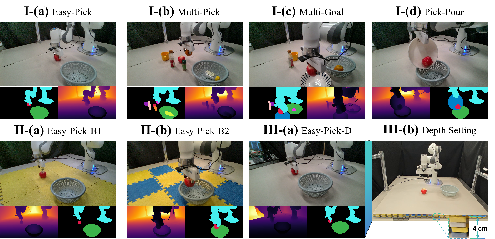
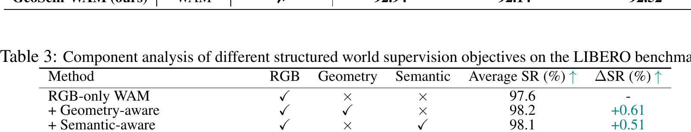
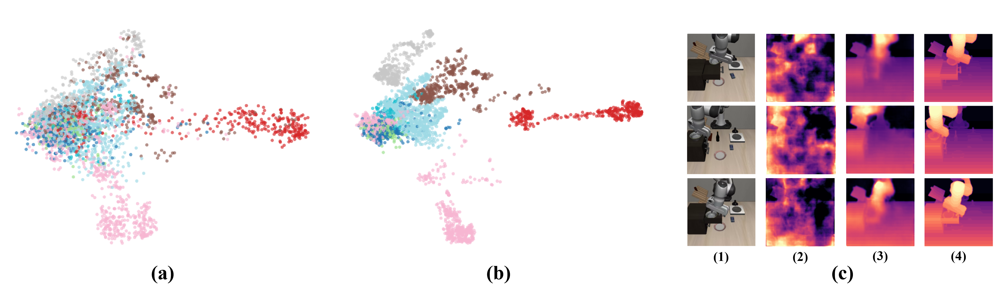

---
tags:
  - papers/embodied-ai
  - papers/world-models
aliases:
  - GeoSem-WAM
  - Geometry- and Semantic-Aware World Action Models
date: 2026-06-02
doi: 10.48550/arXiv.2606.03188
arxiv_id: "2606.03188"
---

# GeoSem-WAM: Geometry- and Semantic-Aware World Action Models

## 核心信息

- 标题: GeoSem-WAM: Geometry- and Semantic-Aware World Action Models
- 标题翻译: GeoSem-WAM：几何与语义感知的世界动作模型
- 作者: Fulong Ma, Daojie Peng, Wenjun Yue, Jiahang Cao, Bintao Wang, Qiang Zhang, Jun Ma
- 机构: HKUST(GZ), HKU, USTC, OC, SDU, X-Humaniod
- 发表时间: 2026-06-02
- 发表渠道: arXiv v1（cs.RO）
- DOI: 10.48550/arXiv.2606.03188
- arXiv: 2606.03188
- 论文链接: https://arxiv.org/abs/2606.03188
- 论文类型: AI 方法论文；具身智能 / 世界动作模型 / 机器人操作

## 原文摘要翻译

近期的世界动作模型在具身决策中展现出令人瞩目的能力。然而，其有效性究竟源于推理期间显式的未来想象，还是预测式训练所诱导的表征学习，仍是一个开放问题。新近证据表明，其主要优势在于学习稳健的潜在表征，而非在测试时生成未来观测。尽管如此，现有世界动作模型主要依赖基于 RGB 的未来预测，对复杂环境的结构与空间理解有限。为此，作者提出一个结构化世界建模框架，通过几何与语义监督增强潜在表征。除未来 RGB 预测外，模型还引入未来几何和语义表征的两个辅助预测分支，使其能在统一潜在空间中联合捕捉场景动态、空间几何与语义上下文。关键是，该方法在测试时避免显式未来展开或视频生成，从而保持高效推理。大量实验表明，引入结构化世界监督可持续提高动作预测准确率、场景理解能力以及在挑战性具身场景下的稳健性，显示出推进可扩展、高效世界动作模型的潜力。

## 创新点

1. **把“未来预测为何有效”重新定位为表征学习问题。** 论文沿用 `Fast-WAM` 的关键判断：世界模型的价值未必在测试时真的“想象未来”，而可能在训练时通过预测目标迫使骨干学到动作相关动态。这个视角把优化重点从昂贵的测试时展开移回训练信号设计。
2. **把 RGB-only 世界监督扩展为外观、几何、语义三条监督轴。** 作者把 DPT 风格密集预测头接到视频 `DiT` 的中间表征单元上，以深度类几何目标和逐像素语义目标约束未来潜变量；新增信息不是推理输入，而是训练期表征正则。
3. **保持部署路径不变。** 辅助头在部署时删除，动作仍基于当前观测潜变量迭代去噪；因此新增模块主要增加训练期标注、显存和优化成本，而不是名义上的推理模块成本。
4. **建立四层证据链。** 论文同时给出单分支/联合分支消融、语义聚类与冻结骨干深度探针、两套仿真基准以及真实 `Franka` 泛化测试。证据比单纯报告平均成功率更完整，但表征证据仍主要是定性的。

## 一句话总结

这篇论文真正新增的不是一套新的动作生成范式，而是在 `Fast-WAM` 上挂接训练期可移除的几何与语义密集预测头：当前证据表明这种结构化监督能小幅稳定提升仿真成功率、显著改善所测真实场景，但尚未证明其普遍优于其他等算力表征正则，也没有用实测延迟支持“零额外推理成本”的强版本主张。

## 研究问题

### 从“要不要想象未来”转向“训练时该预测什么”

`Fast-WAM` 已提出一个关键观察：若测试时不显式生成未来视频，策略仍能保持较强表现，那么世界建模的主要收益可能来自训练期预测监督塑造的潜在表征。`GeoSem-WAM` 接着追问：如果训练信号才是关键，仅预测未来 RGB 是否足够？

作者认为 RGB 目标主要约束外观和短期动态，却不显式要求潜在表征单元保留三维结构和对象类别。机器人操作恰好同时依赖“物体在哪里、如何运动”的几何信息，以及“应该操作哪个对象、目标关系是什么”的语义信息。因此，论文的问题不是设计另一种未来生成器，而是把未来预测从单一外观重建改造成结构化多任务监督。

### 需要严格区分的两个命题

论文直接检验的是：**在既有 WAM 训练链上增加几何/语义辅助目标，能否改善当前评测协议下的动作表现与中间表征。** 它没有完全检验更强命题：**未来预测本身是收益来源。** 因为实验没有比较未来几何/语义预测与当前帧几何/语义重建，也没有在固定训练算力下与更大骨干、更多 RGB 数据或自监督视觉特征进行等价对照。

## 数据与任务定义

### 仿真基准

| 基准 | 数据/任务规模 | 评测设置 | 主要监督与指标 |
|---|---|---|---|
| `LIBERO` | 四个套件；每套件 10 个任务、500 条专家示范 | Spatial、Object、Goal、Long；每任务 50 次、不同随机种子 | RGB、深度、像素级语义；成功率 |
| `RoboTwin 2.0` | 50 个双臂任务；平台总体支持 5 种本体和超过 100,000 条专家轨迹 | clean 与 random；random 改变杂乱度、照明、背景纹理、桌高等 | 同步 RGB、深度、语义；成功率 |

需要注意：附录对 `RoboTwin` 平台能力的描述比正文当前实验更宽。论文报告的是 50 个任务上的 clean 与 random 结果，并不等于已经完成跨 5 种本体的 GeoSem-WAM 验证。

### 真实机器人设置

平台为 `Franka Emika Panda`。四项核心任务分别测试单对象拾取、干扰物条件拾取、多目标放置和长时程倾倒。每个任务收集 50 条人类遥操作轨迹；预处理包括删除空闲帧和动作平滑。作者使用两块 `NVIDIA H800` 微调，在 `RTX 4090` 上推理，每项设置测试 50 次。

额外泛化设置包括两种垫面背景 `Easy-Pick-B1/B2`，以及标准高度与抬高 4 cm 平台之间的几何变化。任务输入在部署时仍是原始视觉观测与语言条件；深度和语义是训练监督，不是推理输入。

*Figure 4 展示真实任务、多模态训练观测以及背景和高度变化。它支持“评测确实包含语义干扰与几何变化”的判断，但不能替代跨平台泛化实验。*

## 方法主线

### 机制流程

1. **输入与基础编码。** 当前视觉观测由 `Wan2.2-5B` 的预训练视频 `VAE` 编为潜在视频表征单元；语言指令由原生 `T5` 编码，并通过交叉注意力条件化所有表征单元。这里基本继承 `Fast-WAM` 的视频世界骨干。
2. **联合预测与共享表征。** 视频 `DiT` 在噪声未来视频潜变量上学习 RGB 流匹配；动作专家 `DiT` 在共享注意力的 `MoT` 架构中，以当前潜在世界表征为条件对未来动作块去噪。几何与语义 DPT 辅助头同时读取多个视频 Transformer 模块的中间表征单元。
3. **结构化辅助监督。** 多层表征单元被投影、重组为多分辨率类图像特征，再经作者扩展的三维重组与三维融合 模块融合、上采样，分别输出未来几何和逐像素语义预测。梯度经共享视频骨干反传，迫使动作依赖的表征保留空间结构与对象级信息。
4. **部署输出。** 测试时只处理第一帧观测的潜在表征单元，不显式生成未来视频；动作块从高斯噪声开始，在当前潜变量条件下迭代去噪。DPT 辅助头被删除，因此最终输出仍是动作块。

*Figure 1 的虚线框给出推理路径。真正新增部分位于训练路径中的几何/语义头，而不是动作采样器。*

### 哪些继承自 Fast-WAM，哪些才是新增

继承部分包括：`Wan2.2-5B` 视频 `DiT`、同源 `VAE/T5`、动作专家、视频与动作分支共享注意力的总体思路、流匹配式视频/动作目标，以及测试时不展开未来视频。新增部分主要是：从中间视频表征单元取多层特征的 DPT 风格密集头、适配视频的 3D 重组与融合、未来几何 `L1` 目标和未来语义交叉熵目标。

因此，把论文理解成“在 `Fast-WAM` 上增加两个训练期表征约束”比理解成全新的 WAM 架构更准确。其研究价值在于监督设计与证据组合，而非重新发明视频或动作生成骨干。

### 训练目标

视频与动作分支都采用连续噪声插值和流匹配。理解本文新增机制时，最关键的是总目标：

$$
\mathcal{L}=\lambda_{\mathrm{rgb}}\mathcal{L}_{\mathrm{rgb}}+\lambda_{\mathrm{geo}}\mathcal{L}_{\mathrm{geo}}+\lambda_{\mathrm{sem}}\mathcal{L}_{\mathrm{sem}}+\lambda_{\mathrm{act}}\mathcal{L}_{\mathrm{act}}.
$$

其中几何与语义项分别为：

$$
\mathcal{L}_{\mathrm{geo}}=\frac{1}{K}\sum_{\tau}\left\|\hat{o}^{\mathrm{geo}}_{\tau}-o^{\mathrm{geo}}_{\tau}\right\|_1,
\qquad
\mathcal{L}_{\mathrm{sem}}=\frac{1}{K}\sum_{\tau}\operatorname{CE}\!\left(\hat{o}^{\mathrm{sem}}_{\tau},o^{\mathrm{sem}}_{\tau}\right).
$$

工程上，这意味着四类梯度共同更新共享表征。论文只给出符号化的平衡系数，缺少具体 `λ`、尺度归一化、权重扫描和梯度夹角。复现难点因此不在抄出公式，而在让四种损失的数值尺度和优化方向可控。

### 推理与采样链路

推理时保留当前观测潜变量 $z_t$，动作序列从高斯噪声初始化，由动作 `DiT` 迭代去噪；未来 RGB、几何和语义均不生成。论文据此声称不增加测试时计算开销。这个说法在**网络拓扑**上成立：辅助头不参与部署；但论文未实测相对 `Fast-WAM` 的延迟、吞吐、显存或功耗，因而“完全等成本”仍是未经实测的推论。

## 关键结果

### 三条主要证据链

| 场景 | GeoSem-WAM | 关键对照 | 绝对变化 | 应如何解读 |
|---|---:|---:|---:|---|
| `LIBERO` 平均成功率 | 98.55% | `Fast-WAM` 97.60% | +0.95 个百分点 | 高位小幅提升；接近饱和区，需方差才能判断稳定性 |
| `RoboTwin` 平均成功率 | 92.52% | `Fast-WAM` 91.80% | +0.72 个百分点 | 对直接基线有效；相对 `LingBot-VA` 92.20% 仅高 0.32 个百分点 |
| 真实 `Franka` 平均成功率 | 95.4% | `Fast-WAM` 88.9% | +6.6 个百分点 | 本文最有说服力的结果，但范围限于单平台与所测设置 |

`LIBERO` 上的优势并非每个子套件都最大：`GeoSem-WAM` 在 Long 为 97.0%，低于 `LingBot-VA` 的 98.5% 和 `Motus` 的 97.6%。这说明结构化监督不是所有任务维度上的统一支配方案。

`RoboTwin` 汇总值也掩盖明显薄弱任务。附录表 5 中，开关旋转任务在标准/随机环境下为 58/65，挂杯任务为 72/67，开微波炉任务为 75/50。后者在随机环境下显著下降，提示密集几何/语义监督并没有消除操作接触、遮挡或长链误差。

*Table 5 的价值不在平均分，而在显示任务间异质性；逐任务失败模式比“新 SOTA”标签更适合指导后续复现。*

### 消融到底说明了什么

| 训练监督 | 平均成功率 | 相对 RGB-only |
|---|---:|---:|
| RGB-only | 97.6% | — |
| RGB + Geometry | 98.2% | +0.61 |
| RGB + Semantic | 98.1% | +0.51 |
| RGB + Geometry + Semantic | 98.6% | +1.02 |

*Table 3 展示几何与语义辅助目标的单独和联合消融。*

这个消融支持三个有限结论：两个单分支在同一 `LIBERO` 协议下各自有正向贡献；联合配置最好；联合增益与两个单分支增益之和接近。但它不能证明几何和语义在优化意义上“天然互补”，因为没有误差条、显著性、多个种子、损失权重敏感性或梯度冲突统计。数值近似相加也可能来自评测离散性或检查点选择。

### 表征证据与真实泛化的对应关系

*Figure 3 对比中间表征的语义聚类与冻结骨干的深度探针。*

图 3 中，中间表征单元的语义颜色聚类更清晰；冻结骨干后训练的简单深度探针也生成更接近真实深度的结果。结果模式与设计目标一致：几何损失应提高空间可解码性，语义损失应提高类别可分性。真实测试中，背景变化分别提升 +10、+8 个百分点，高度变化提升 +12 个百分点，多对象与长时程任务提升 +4 至 +6 个百分点，也与这一解释相容。

但这里仍是“机制一致性证据”，不是严格因果链。论文缺少聚类指标与深度误差，也尚不能证明表征可解码性提升直接导致动作成功率提升。更强验证应把探针指标与逐任务成功率关联，并控制训练计算量与标签来源。

## 深度分析

### 真正贡献是什么

最值得保留的贡献是一个可复用设计模式：**用部署时可移除的密集预测头，把已有视频世界模型的中间表征单元变成更适合动作的结构化表征。** 这种方法对部署延迟友好，也容易迁移到其他共享视觉骨干的 VLA/WAM。论文的新增模块并不复杂，价值主要来自把 `Fast-WAM` 的“训练表征优先”观点落到可操作的监督设计，并用仿真、探针和真机建立跨层证据。

### 为什么几何与语义可能互补

几何目标对连续空间结构施加局部像素约束，使潜在表征单元更容易保留深度顺序、物体边界和运动关系；语义交叉熵则把同类对象压到更可分的类别结构中，为目标选择和任务逻辑提供离散线索。共享骨干同时接收两种梯度后，理论上能够把“在哪里、怎么动”和“是什么、该操作谁”结合起来。

这种互补性最可能在两类任务上显现：一是桌高变化、相对位姿变化等几何分布偏移；二是多对象、干扰背景、目标容器区分等语义复杂度上升。论文真实实验的提升模式与此一致。不过，语义分割也编码物体边界，深度也间接携带类别轮廓，二者并非正交信号；需要梯度余弦相似度、标签打乱或正交化消融才能更清楚解释互补来源。

### “即插即用”的边界

“即插即用”在这里应缩窄理解为：骨干若能暴露多层视频表征单元，训练时可以挂接 DPT 辅助头，部署时可以删除。它不意味着：

- 无需深度和分割标签或伪标签；
- 无需修改数据流水线与视频时序对齐；
- 无需额外训练显存和计算；
- 不必调四项损失权重；
- 任意 VLA 骨干都具备与 `Wan2.2-5B` 相同的多尺度接口；
- 在不同相机布局或机器人本体上无需重新适配。

所以这是“部署接口可移除”，不是“训练工程零成本”。

### 复现成本与关键风险

1. **骨干成本。** `Wan2.2-5B` 本身是 5B 级视频 DiT；训练还要维护动作专家和多层中间激活。真实实验仅说明使用两块 `H800` 微调，缺少批大小、时长、峰值显存、精度格式或优化器设置。
2. **DPT 视频化。** 三维重组与融合 的张量形状、抽取层位置、时间维处理和上采样细节都未充分展开。即使原始 DPT 可用，也不能假定直接替换成 3D 操作即可复现。
3. **标签来源。** 仿真可直接获得深度与分割；真实 RGB-only 数据则需要像素标注或伪标签。伪标签噪声可能形成系统性偏差，且深度尺度、分割类别表和遮挡边界必须与视频时间步对齐。
4. **多任务优化。** `L1`、交叉熵、视频流匹配和动作流匹配的尺度差异可能使某一分支主导共享骨干。论文自己承认存在梯度冲突风险，但缺少 `λ` 与冲突测量。
5. **评测方差。** `LIBERO` 和 `RoboTwin` 的平均提升不足 1 个百分点；没有多个训练种子和置信区间时，很难区分稳定收益、检查点选择与随机波动。

### v1 成熟度信号

论文是 2026 年 6 月的 `arXiv v1`。正文结论后保留了 CoRL 模板的通用 Acknowledgments 占位文字，而非论文特定致谢；这只能作为文稿尚未完成 camera-ready 清理的客观信号，不能推测作者意图。结合缺少超参数、效率实测、误差条与代码链接，当前版本更适合作为有前景的方法草案阅读，而不是完整复现说明书。

## 局限

1. **标注与伪标签依赖。** 密集几何/语义监督在仿真中容易获得，在真实 RGB 数据上却会引入额外标注成本或伪标签噪声。论文提出未来使用 `DINO` 类自监督特征，但没有验证替代后的性能。
2. **损失平衡和梯度冲突未解决。** 作者明确承认异质损失增加训练复杂度，并提出未来使用 梯度手术；当前实验缺少冲突频率、梯度夹角、权重敏感性或失败配置。
3. **效率主张缺少实测。** 删除辅助头确实不改变名义部署拓扑，但没有延迟、吞吐、显存或能耗对照，不能量化“无额外测试时计算”。
4. **平均分接近饱和且无不确定性。** `LIBERO` 和 `RoboTwin` 的增益较小，缺少方差或统计显著性；逐任务结果还存在明显失败点。
5. **真实实验外推有限。** 只验证一个 `Franka` 平台、四类核心任务和若干背景/高度设置；尚未覆盖跨机器人本体、跨相机布局、开放词汇对象或真正开放世界部署。
6. **因果机制没有完全隔离。** 实验无法区分收益究竟来自“预测未来结构”，还是更一般的“加入密集多任务监督”；也未与当前帧重建、自监督特征蒸馏或等算力扩大骨干对照。
7. **文稿与复现材料仍不完整。** `arXiv v1` 保留模板致谢占位，且当前源文缺少代码或项目链接；关键训练细节不足。

## 我的笔记

### 可复用的研究设计

- 对已有世界模型做低部署成本增强时，优先考虑“训练期挂头、部署时移除”的结构化表征正则，而不是在测试时增加生成步骤。
- 验证辅助任务收益时，至少分四层：单分支消融、联合分支、冻结骨干探针、针对机制的分布变化任务。GeoSem-WAM 已覆盖这四层的雏形，但每层都还可补定量严谨性。
- 主结果接近饱和时，不要只看平均分；逐任务失败、误差条、多个种子和训练成本往往更能决定方法是否值得采用。

### 最值得补的实验

1. 在固定训练 FLOPs 和数据量下，对比：几何/语义头、更多 RGB 预测数据、更大骨干、`DINO` 特征蒸馏。
2. 比较未来几何/语义预测、当前帧重建、随机时间步预测，隔离“未来性”与“密集监督”的贡献。
3. 扫描各项 `λ` 的 Pareto 曲线，记录共享骨干梯度余弦相似度，并比较 `PCGrad` 或其他梯度解冲突方法。
4. 报告深度 `RMSE/AbsRel`、语义聚类或线性探针指标，并检验它们与逐任务成功率的相关性。
5. 在第二种机器人本体和不同相机布局上验证辅助头接口与标签空间是否仍可直接复用。

### 阅读结论

**值得跟进，但复现优先级应放在“拿到训练配方与标签生成流程之后”。** 方法直观、真机增益有吸引力，且适合嵌入现有 WAM；然而当前 `v1` 最关键的工程变量——DPT 接层、3D 融合、损失权重、伪标签来源和训练成本——都不足以从论文独立恢复。若后续版本公开代码与完整训练日志，这篇工作会成为研究“世界模型表征监督”而非“测试时想象”的有用基线。

## 引用

Ma, F., Peng, D., Yue, W., Cao, J., Wang, B., Zhang, Q. & Ma, J. *GeoSem-WAM: Geometry- and Semantic-Aware World Action Models*. arXiv:2606.03188 (2026). https://doi.org/10.48550/arXiv.2606.03188
