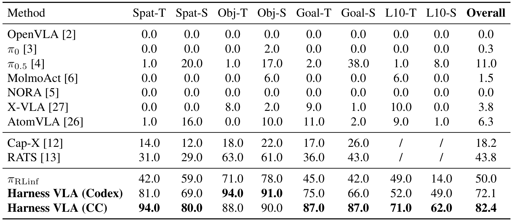
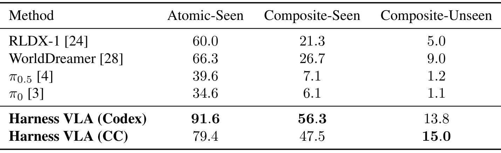
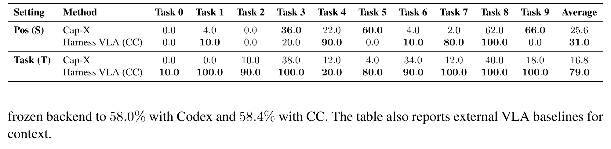

---
tags:
  - papers/robotics
  - papers/vla
  - papers/agentic-manipulation
aliases:
  - Harness VLA
  - Memory-Guided VLA Harness
date: 2026-08-25
doi: 10.48550/arxiv.2607.08448
arxiv_id: 2607.08448
---

# Harness VLA: Steering Frozen VLAs into Reliable Manipulation Primitives via Memory-Guided Agents

## 核心信息
- 标题: Harness VLA: Steering Frozen VLAs into Reliable Manipulation Primitives via Memory-Guided Agents
- 标题翻译: Harness VLA：通过记忆引导的智能体将冻结 VLA 转化为可靠的操作原语
- 作者: Yixian Zhang, Huanming Zhang, Feng Gao, Xiao Li, Zhihao Liu, Chunyang Zhu, Jiaxing Qiu, Yuchen Yan, Jiyuan Liu, Wenhao Tang, Zhengru Fang, Yi Nie, Changxu Wei, Yu Wang, Wenbo Ding, Chao Yu
- 机构: Tsinghua University；Striding AI；Purdue University；Institute of Automation, Chinese Academy of Sciences；Infinigence AI；Hong Kong University of Science and Technology；Zhongguancun Academy
- 发表时间: 2026 年 7 月（arXiv v3，2026-07-15）
- 发表渠道: arXiv，cs.RO
- DOI: 10.48550/arxiv.2607.08448
- arXiv: 2607.08448
- 论文链接: https://arxiv.org/abs/2607.08448v3
- 代码 / 项目: https://harnessvla.github.io/
- 数据 / 资源: LIBERO、LIBERO-Pro、RoboCasa365、RoboTwin C2R；各自的冻结 VLA 后端与任务记忆协议
- 论文类型: AI_method

## 原文摘要翻译
语言条件下的操作既需要精确的、富接触的控制，也需要对语言、场景和长时程任务进行稳健推理。端到端 Vision-Language-Action（VLA）模型具有较强的局部视觉运动技能，但它们通常在分布内任务轨迹上训练，在部署时遇到语义重定向、目标重新绑定、空间布局变化以及局部接触不稳定等扰动后往往失败。LLM 编码智能体能够提供互补的语义与组合推理能力，但纯解析式原语难以处理不规则抓取、受约束放置和关节物体交互。

本文提出 Harness VLA，一种记忆增强的智能体框架：将冻结的 VLA 暴露为可重试的富接触操作原语，并将其与一组用于定位、预 staging、运输、导航和释放的固定解析式原语组合起来。该 harness 不扩展技能库，而是从任务特定执行轨迹、全局成功规则和失败模型中学习这些固定原语的工作范围。规划器负责语义重新定位、非接触执行和 VLA 重新 staging；冻结 VLA 只负责局部富接触阶段，因此 Harness VLA 无需微调，就能把预训练 VLA 推到原始轨迹分布之外。在扰动桌面操作、家庭厨房操作以及从干净设置到随机设置的双臂操作上，Harness VLA 相比最强相关基线在 LIBERO-Pro 和 RoboCasa365 上分别提升 38.6 和 25.4 个百分点，并在 RoboTwin C2R 上达到 58.4%。

## 创新点
1. **把冻结 VLA 重新定义为“可重试的局部接触原语”。** 贡献不在于训练新的 VLA，而在于把 VLA ACT 放进统一的原语接口，显式限制它只处理抓取、插入、按压、旋拧等接触密集阶段；语义绑定、运输、释放和恢复由上层规划器承担（第 2.3 节，pp. 5–7）。
2. **固定词汇、学习编排。** 评测时不能动态发明新技能；系统只使用固定的解析式原语和一个 VLA 原语。探索阶段通过重 staging、短 burst 调用、提前停止和失败修复，学习“何时调用”和“调用前如何摆位”，而不是扩大技能库（第 2.2 节，pp. 5–6）。
3. **两种互补记忆。** Task Specific Memory 保存一个参考 seed 的参数化原语顺序，Global Memory 保存跨任务的成功规则和失败模型。前者提供程序结构先验，后者防止空抓取、虚假成功和不稳定 staging 被重复执行（第 2.2 节；附录 B，pp. 17–25）。
4. **跨 VLA、跨 embodiment 的统一接口。** LIBERO 使用冻结的 πRLinf，RoboCasa365 使用 RLDX-1，RoboTwin 使用冻结的 LingBot-VLA；外部规划器看到的都是 VLA ACT。这让论文把贡献定位在 harness 与任务分解，而不是某个单一 VLA 架构（第 3.1 节，p. 7；附录 D）。

## 一句话总结
这篇论文的真正主张是：当冻结 VLA 的失败主要来自语义绑定、空间分布偏移和长时程组合，而不是局部接触技能本身时，用记忆引导的闭环规划器把任务切成“解析式非接触运动 + 稀疏且可重试的 VLA 接触调用”，就能在不微调 VLA 的前提下显著恢复鲁棒性；但收益依赖模拟器原语、强大的规划模型、参考 seed 以及严格的 prompt/runtime 协议。

## 研究问题
论文针对一个很具体的部署断点：端到端 VLA 在标准任务上能抓取和操作，但在指令重定向、目标重新绑定、物体换位、长时程厨房任务和双臂随机化中，常把训练时的视觉-动作习惯当作当前任务。反过来，纯解析控制器能做运输、姿态调整和释放，却难以完成不规则抓取、紧约束放置或关节物体交互。

因此作者问：**能否保持 VLA 完全冻结、保持一个很小且固定的原语集合，同时让上层智能体通过记忆、感知重新定位和失败恢复，把 VLA 只放在其最擅长的局部接触区域？** 该问题不是“LLM 是否能直接控制机器人”，而是一个职责划分问题：谁负责语义与空间绑定，谁负责自由空间运动，谁负责接触，失败后谁负责诊断和再次 staging。

论文的对照逻辑是：标准 LIBERO 测试是否因拆分而损失分内性能；LIBERO-Pro 的 T（instruction redirection）与 S（position swap）能否证明规划器真的重新绑定了目标；RoboCasa365 是否能把同一接口扩展到移动底座、厨房 fixture 和更长组合任务；RoboTwin C2R 是否能把 clean seed 的结构迁移到 randomized seed；机制分析能否把提升归因到重新定位、重复调用和非接触隔离，而不是只展示最终成功率。

## 数据与任务定义
### 任务与观察
环境 E 由刚体物理引擎驱动。每一步观测被写成：

$$o_t=(I_t^{\mathrm{rgb}}, I_t^d, q_t),$$

其中 $I_t^{\mathrm{rgb}}$ 是 RGB 图像，$I_t^d$ 是与 RGB 对齐的度图，$q_t$ 是机器人本体状态（末端位姿和夹爪状态）。任务由自然语言 $\ell$ 和一个只在终止时提供的二值完成谓词 $G$ 定义。规划器不能读取物体真值位姿或模拟器内部状态；它必须从 RGB 识别实体，再用相应 world map 与多个稳定像素的中位数获得度量位置（附录 E.2，pp. 31–32）。

### 评测协议
| 基准 | 任务/拆分 | 评测方式 | 报告规模 | 论文强调的分布变化 |
|---|---|---|---:|---|
| LIBERO | SPATIAL、OBJECT、GOAL、LIBERO-10 | 每任务 seed 0 探索，seed 1–10 评测 | 400 rollouts | 标准分布内操作 |
| LIBERO-Pro | 4 类 × T/S 两种扰动 | 每 cell 10 tasks × 10 seeds | 800 rollouts | 指令重定向、位置换位 |
| RoboCasa365 | ATOMIC-SEEN、COMPOSITE-SEEN、COMPOSITE-UNSEEN | seed 0 探索；atomic 用 10 个 held-out seeds，composite 用 5 个 | 340 rollouts | 厨房、移动 staging、组合与模板未见 |
| RoboTwin C2R | 50 个双臂任务 | clean demo seed 的记忆迁移到 5 个 randomized seeds | 250 rollouts | clean-to-randomized、双臂接触 |

这里有一个必须保留的协议区别：LIBERO、LIBERO-Pro 和 RoboCasa365 的记忆是由每个任务的 seed 0 在线探索得到的；RoboTwin C2R 使用官方 clean demo 中的 expert-verified seed，再直接迁移到 randomized 设置，没有 randomized-setting bootstrapping 或 VLA 微调。所有成功率由 benchmark 的最终完成谓词决定，单个原语的 post-condition 不能替代最终任务成功（附录 C，pp. 26–29）。

### 冻结 VLA 后端
- LIBERO / LIBERO-Pro：RLinf 发布的 pi05 libero130 fullshot，即冻结的 $\pi_{0.5}$ SFT checkpoint，标准 LIBERO 为 95.3%，LIBERO-Pro 在论文协议下为 50.0%。
- RoboCasa365：官方冻结 RLDX-1 checkpoint，直接 baseline 的 split 分数为 60.0 / 21.3 / 5.0%，加权 overall 为 30.0%。
- RoboTwin C2R：RoboTwin 专用、后训练后的 LingBot-VLA；论文报告直接冻结配置为 50.4%，Harness VLA 使用同一后端。

## 方法主线
### 机制流程
1. **输入与定位。** 输入任务语言、RGB-D、机器人状态，以及 Task Specific Memory 和 Global Memory。规划器通过 RGB 确认当前实体，再用深度/world map 重新计算目标、支撑面、fixture 和接触区；输出是当前场景的可执行目标绑定，而不是沿用参考 seed 的坐标。
2. **选择固定原语。** 规划器 $\Pi$ 把语言、当前观测和记忆上下文映射为一个 JSON 原语调用 $c_t\in\mathcal P$。解析式原语负责 MOVE TO、MOVE POSE、旋转、夹爪、释放、导航和底座微调；VLA ACT 只覆盖局部富接触行为。
3. **闭环执行与诊断。** 环境执行一个原语直到其内部 post-condition，写出新的 state、RGB-D、world map、log 和同步标志。规划器观察结果，判断进展、可恢复失败或不可恢复失败，而不是连续发出未经验证的动作。
4. **记忆化与重试。** 探索 seed 成功后，把原语顺序保存为参数化 JSONL，把策略和失败模型写入 JSON。部署时复用顺序结构但重新定位几何；若 VLA 未抓稳、摆位不合适或完成谓词未满足，规划器先用解析式动作 re-stage，再重新调用 VLA ACT。

论文的抽象可以写为：

$$c_t=\Pi(o_t,\ell,M_{\mathrm{task}},M_{\mathrm{global}}),\qquad o_{t+1}=E(o_t,c_t),$$

直到 $G(o_t)=1$ 或步数预算耗尽。这个写法的工程含义是：VLA 不再是整个 rollout 的控制器，而是一个可被上层反复定位和调用的局部执行器。

### 固定原语接口与职责划分
| 原语 | 类型 | 主要职责 |
|---|---|---|
| MOVE TO | 解析式 composite | 世界坐标中的末端运输 |
| MOVE POSE | 解析式 composite | 位置移动与姿态变量联动 |
| ROTATE WRIST / ROTATE PITCH | 解析式 atomic | 保持位置的姿态调整 |
| SET GRIPPER / RELEASE | 解析式 atomic | 夹爪状态与释放后条件 |
| NAVIGATE TO / MOVE BASE | 解析式（仅 RoboCasa365） | 厨房尺度导航与底座微调 |
| VLA ACT | 学习式 primitive | 抓取、受约束放置、按压、旋钮/水龙头、抽屉、插入、双臂接触 |

VLA ACT 接收 task-conditioned prompt、实时相机和提前停止谓词 $\tau$，输出短 action chunks，直到 $\tau$ 满足或 chunk budget 用尽。规划器不发 torque、joint target 或原始 action chunk，而只绑定原语参数。这样做的关键不是“VLA + LLM”标签，而是把 VLA 的输入分布压缩回它熟悉的局部接触状态，同时让上层承担重新定位与长时程组合。

### 两阶段记忆：结构先验与失败约束
**Task Specific Memory** 对每个任务的 seed 0 记录一个审计 JSON 和一个命令 JSONL。JSON 记录成功与否、策略、恢复决策、失败模式；JSONL 记录执行顺序。它不是开放环轨迹，也不是直接 replay：具体 xyz、xy、四元数、像素和 fixture 坐标必须在当前图像/world map 上重新 grounding。

**Global Memory** 跨任务保存固定原语的操作知识，例如：VLA 适合不规则抓取和 fixture 接触；若夹爪闭合但物体没有随末端移动，应判断为空抓取；不要以视觉接近代替 benchmark success signal；不稳定 staging 后应先重新定位再 retry。论文把这两类信息分开，使“任务特定的程序结构”不会与“跨任务的失败规律”混在一起。

### 探索、部署与成本边界
探索阶段允许 RESET、较长 wall-clock budget，并通过试错搜索 staging 顺序、VLA 调用时机和 early-return threshold。正式评测禁用 RESET，缩短 operational step budget，只使用已经写入的记忆。因而报告的 robust score 并非完全 zero-shot：它依赖一次参考实例的探索，只有 LIBERO-Pro GOAL 的额外实验专门去掉 target-setting Task Specific/Global Memory，以测量纯在线规划能力。

## 关键结果
### 主结果与强基线
#### 标准 LIBERO：不牺牲分布内能力
Harness VLA（Claude Code planner）在标准 LIBERO 达到 **96.0%（384/400）**，OBJECT 为 100.0%，LIBERO-10 为 93.0%。冻结 $\pi_{\mathrm{RLinf}}$ 为 95.3%，因此 harness 的主要收益不是靠牺牲标准性能换来的，而是把同一 checkpoint 暴露成可组合接口（Table 2，p. 8）。

#### LIBERO-Pro：语义重定向与位置换位
| 方法 | Overall |
|---|---:|
| Cap-X | 18.2 |
| RATS | 43.8 |
| $\pi_{\mathrm{RLinf}}$ | 50.0 |
| Harness VLA（Codex） | 72.1 |
| **Harness VLA（Claude Code）** | **82.4** |

Claude Code 版本相对 RATS 提升 38.6 个百分点，相对同一冻结 $\pi_{\mathrm{RLinf}}$ 提升 32.4 个百分点。八个 cell 中，Claude Code 版本为 Spat-T/S 94/80，Obj-T/S 88/90，Goal-T/S 87/87，L10-T/S 71/62；这说明 gain 同时覆盖语义和布局变化，而不是集中在单一个 easy split（Table 3，p. 8）。



**图表解读。** 表中 strongest reported baseline RATS 只覆盖六个非 LIBERO-10 cell，其 overall 是 reported cells 的平均；因此 headline 的 38.6 个百分点是按论文的比较协议得到的，并不等价于在完全相同的所有 cell 上与每个 baseline 一一对比。论文还报告 Codex 版本为 72.1%，说明 planner backbone 会改变结果，但固定 harness、记忆接口和 VLA 后端本身是共用的。

#### RoboCasa365：长时程厨房与移动 staging
| 方法 | Atomic-Seen | Composite-Seen | Composite-Unseen |
|---|---:|---:|---:|
| RLDX-1 | 60.0 | 21.3 | 5.0 |
| WorldDreamer | 66.3 | 26.7 | 9.0 |
| Harness VLA（Codex） | **91.6** | **56.3** | 13.8 |
| Harness VLA（Claude Code） | 79.4 | 47.5 | **15.0** |

RLDX-1 的 weighted overall 为 30.0%；Harness VLA（Codex）为 55.4%，提升 25.4 个百分点；Claude Code 版本为 48.6%。结果支持“导航、staging、接触重试由 planner 负责”的解释，但也暴露 planner backbone 的非单调影响：Codex 在三个 split 上均高于 Claude Code，而 Claude Code 只在 Composite-Unseen 略高（Table 4，p. 9）。



#### 零样本与 clean-to-randomized
LIBERO-Pro GOAL 去掉目标设置的 Task Specific/Global Memory 后，Harness VLA（Claude Code）在 Pos-S 为 31.0%，Task-T 为 79.0%；Cap-X 为 25.6% 和 16.8%。与 few-shot 的 Goal-S 87.0%、Goal-T 87.0% 相比，位置换位下降 56 个百分点，而 instruction redirection 只下降 8 个百分点。这个差异直接表明：Task Specific Memory 对空间化的原语组织和 staging 很重要，语义重新绑定则更多来自在线 planner。

RoboTwin C2R 中，LingBot-VLA 直接冻结为 50.4%，Harness VLA（Codex）为 58.0%，Claude Code 为 **58.4%**；外部对照 GR00T-N1.7、$\pi_{0.5}$ 和 StarVLA 分别为 20.7%、47.9%、10.6%（Table 6，p. 10）。这里必须注意：Harness VLA 使用 clean setting 的记忆迁移到 randomized setting，且 LingBot-VLA 经过 RoboTwin 后训练；所以 58.4% 说明 harness 能利用 clean-to-randomized 结构迁移，但不能被解释为完全不依赖任务记忆的通用 zero-shot。



### 消融到底说明了什么
论文没有给出传统的“去掉单模块后重新训练”的完整 ablation grid，而是通过机制曲线、planner 对照和零样本协议做归因。

1. **重复 VLA 调用曲线（Figure 4，p. 11）。** 限制每个 episode 的最大 VLA 调用次数后，LIBERO-Pro、RoboCasa365、RoboTwin C2R 的成功率在前几次调用快速上升，随后趋于饱和并接近 full harness。它支持“VLA 作为稀疏、可重试的局部尝试”而非连续控制器；但曲线只证明调用预算与成功率的关联，没有单独识别每次 retry 的收益、额外步数成本或 planner 诊断质量。
2. **最终完成 primitive attribution（Figure 6，p. 13）。** LIBERO Pro-family 的成功 rollout 多在 VLA 建立稳定接触后由 analytic primitive 完成最终谓词；RoboCasa365 和 RoboTwin 更常在 VLA primitive 内完成最后的 fixture/双臂接触。这个结果解释了为什么“解析式原语替代 VLA”不是正确表述：解析式控制主要扩展 VLA 前后可工作的空间，而不是承担接触本身。
3. **失败案例与重 staging（Figures 3、5、7，pp. 10–14）。** 论文展示了目标重定向时 $\pi_{\mathrm{RLinf}}$ 重复标准行为、位置换位时仍移动到训练区域；Harness 则先重新定位，再在接触前后用 MOVE TO/RELEASE 组织 VLA。案例与表格共同支持机制，但属于定性 rollout 证据，不是对每类失败的统计覆盖。

### 规模与 primitive 使用
在附录汇总的 manipulation primitive calls 中，LIBERO 共 10,134 次，MOVE TO 占 61.8%，VLA ACT 占 15.8%；RoboCasa365 共 7,772 次，NAVIGATE TO + MOVE BASE 占 19.4%，VLA ACT 占 35.3%；RoboTwin C2R 共 1,675 次，VLA ACT 占 47.4%。按类别看，analytic/VLA 比例分别为 84.2/15.8%、64.7/35.3%、52.6/47.4%（Tables 18–19，pp. 38–39）。这组数字是很有解释力的内部证据：VLA 并未接管整个任务，且 embodiment 越强调双臂接触，VLA 占比越高。

## 深度分析
### 真正贡献是什么
最有价值的贡献不是“把 Claude/Codex 接到机器人上”，也不是一个新的 VLA architecture，而是**改变失败的归属方式**。原本一个端到端 rollout 中，语义误绑定、空间变化、空抓取和运输失误都会污染同一个 policy state；Harness 把它们拆成可审计的 primitive turns：planner 先处理语义/空间，analytic controller 处理自由空间和姿态，VLA 处理局部接触，最后用 benchmark predicate 验证结果。

这使得一次失败可以被局部化：如果物体没有随夹爪移动，Global Memory 给出 empty-grasp 诊断；planner 重新定位和 staging；VLA 再试一次。相比训练一个更大、更分布广的 VLA，这种方法的工程收益是模块职责、命令 trace、日志和恢复路径都可检查。相应的代价是系统性能转移到 planner、prompt、world-map 质量和 simulator primitive backend 上。

### 为什么结果成立
1. **分布偏移被分层消化。** T 扰动主要是语义绑定问题，S 扰动主要是空间定位/staging 问题；planner 负责的恰好是 VLA 弱项，所以 LIBERO-Pro 的两类 cell 都提升。
2. **接触与非接触被隔离。** MOVE TO、旋转、导航和释放对长距离运动更稳定，VLA 不必在长 horizon 内保持所有中间目标；因此接触失败不会直接把运输和释放阶段一起拖垮。
3. **记忆不是 replay，而是结构先验。** 只复用 primitive 顺序，当前几何仍从 RGB-D 重新算，因而 seed 0 轨迹才能迁移到新布局；GOAL zero-shot 的 Goal-S 大幅掉点也反向说明这种结构先验确实在发挥作用。
4. **调用次数是可控的恢复资源。** Figure 4 的快速上升/饱和形态表明少量 retry 已能修复相当部分局部失败，继续增加调用的边际收益下降。这比把 VLA 作为单次 black box 更符合接触操作的随机性。

### 容易误读的地方
- **“zero-shot”不是完全无记忆。** RoboTwin C2R 是 clean seed 到 randomized seed 的 zero-shot transfer；LIBERO-Pro GOAL 才额外测试了不检索 target-setting memory 的设置。
- **“冻结”不等于所有组件都未训练。** VLA 在本文评测期间冻结，但 LingBot-VLA 先经过 RoboTwin SFT；RLDX-1 和 $\pi_{\mathrm{RLinf}}$ 也都是既有 checkpoint。
- **38.6 和 25.4 个百分点不是同一比较对象。** 38.6 是 LIBERO-Pro 相对 RATS 的 headline gap；25.4 是 RoboCasa365 的 Codex 版本相对 RLDX-1 weighted overall 的 gap。不能把它们都当成相对同一冻结 VLA baseline 的提升。
- **planner 不是可忽略的实现细节。** Codex 与 Claude Code 在 RoboCasa365 的排序相反；这说明 harness 的固定接口并没有消除高层模型差异。
- **analytic primitives 不是“简单控制”。** 它们依赖 world-frame 坐标、内置 solver、底座动作、gripper convention、终止条件和环境特定实现；跨真实机器人复现时，这层校准可能比 JSON schema 更关键。

### 对 3D / agent / world-model 研究的定位
这篇工作更接近 **embodied tool-use agent + frozen policy wrapper**，不是 world model、3D scene reconstruction 或 learned dynamics。其“world model”成分主要是 RGB-D/world map 提供的度量 grounding 与环境反馈，不预测未来状态，也不在 latent space 中规划。它与 3D spatial reasoning agent 的交叉点在于：规划器必须从像素和深度构造当前目标的可执行空间绑定；与 world-action model 的差异则在于，未来想象不是核心，真实的 primitive execution feedback 才是闭环的信号。

如果要把它放进本地研究脉络，最重要的启发是：**可以把 VLA 视为一种局部 world-action operator，而不是整条任务策略；记忆保存的是可迁移的操作结构，当前几何仍由感知重新绑定。** 这为后续把 4D/world-action model 的预测能力接到 contact primitive 之前提供了接口，但本文没有证明预测式 world model 会进一步提高成功率。

### 复现注意点
- **依赖与后端：** 需要四个 benchmark 的模拟环境、各自 VLA checkpoint、world-map/RGB-D 文件、primitive controller，以及能够持续写入/读取 JSON 文件的长运行 worker。
- **LLM planner：** 主文只把 Codex 与 Claude Code 作为 planner backbone，对应的 prompt、上下文窗口、调用温度、失败重试策略和版本必须固定；否则结果不可直接比较。
- **记忆生成：** 每个 LIBERO/RoboCasa task 至少要先在 seed 0 做可成功的探索；RoboTwin C2R 依赖 clean demo expert-verified seed。不能把 held-out seed 的成功率当作从零搜索。
- **观测隔离：** 禁止 ground-truth poses 和 simulator internals；重新定位应使用 RGB 选像素、world map 查值、多个稳定像素取中位数，并在机器人、相机、底座或抓取状态改变后重新定位。
- **预算与计数：** RESET 只用于探索，正式评测禁用；最终成功以 benchmark predicate 计数；primitive post-condition、VLA chunk budget 和 episode horizon 必须分开记录。
- **硬件迁移：** 论文结果全是仿真 benchmark。真实机器人需要重新验证接触检测、empty grasp 诊断、坐标系转换、碰撞安全、导航误差和 VLA action chunk 的时序稳定性。

## 局限
1. **高层 planner 的反馈回路仍然开放且成本不明。** 论文承认 high-level planner 与 low-level VLA 之间缺少联合优化；报告了成功率，却没有系统报告 LLM token、wall-clock、调用费用和每个任务的探索预算。
2. **没有环境奖励或人类偏好联合微调。** 记忆与 prompt 能修复已观察到的失败，但对未见 failure mode 的泛化仍依赖 planner 推理；作者将 sample-efficient RL（如 GRPO）列为未来方向。
3. **感知表达受限。** 没有细粒度 image captioning，极拥挤、长时程场景的结构推理可能失败；world map 也依赖稳定像素选择，反光、孔洞、边缘和遮挡会直接影响 grounding。
4. **固定 primitive vocabulary 是双刃剑。** 它让实验可审计，但当任务需要词汇中没有的抽象时，planner 只能拼接已有原语；论文尚未证明自动技能发现与固定词汇结合后的安全、验证和收益。
5. **评测与泛化边界有限。** 四个 benchmark 都是仿真，且不同 benchmark 使用不同 VLA checkpoint 和 planner；RoboTwin 的 LingBot-VLA 还经过 benchmark-specific post-training。因此结果支持“在这些协议下 harness 能扩展冻结后端”，不能直接推出真实世界或跨 embodiment 的普适提升。
6. **消融仍不完整。** 机制曲线和 zero-shot 对照有解释力，但缺少系统的 no-memory、no-global-memory、no-retry、no-re-grounding、analytic-only 和 fixed-call-budget 组合实验，也缺少显著性区间或多次独立 planner seed。

## 我的笔记
- 这篇论文最值得保留的抽象是“**contact specialist + analytic scaffold + auditable memory**”，而不是具体使用哪一个 LLM。未来如果替换 planner，接口应仍然要求每一回合输出结构化 primitive、读取执行结果、诊断失败并写入 trace。
- 如果复现，第一优先级不是换更大的 VLA，而是把失败分类器做扎实：empty grasp、wrong object、unstable staging、false visual success、placement shortfall 等错误是否能被日志和视觉证据可靠区分，决定 retry 是否真的有意义。
- 论文的关键实验缺口是因果拆分。最有价值的后续 ablation 应固定 planner 与 VLA，仅切换“是否重定位”“是否可 retry”“是否读取 Task Specific Memory”“是否读取 Global Memory”，并同时报告 success、VLA calls、primitive calls、episode steps、LLM cost。
- 对本地 world-model 研究而言，可以将未来状态预测用于两个位置：在 VLA ACT 前预测接触是否可行，在失败后预测哪一个 re-staging 原语最可能恢复；但必须保持本文的 final-predicate 验证，而不能把预测置信度当作成功。
- 一个值得测试的真实世界方向是把 Global Memory 做成可检验的经验数据库：每条规则附带场景条件、证据图像、适用 embodiment、失败率和撤销机制，避免 LLM 把一次偶然成功泛化成硬规则。

## 引用
```bibtex
@article{zhang2026harnessvla,
  title   = {Harness VLA: Steering Frozen VLAs into Reliable Manipulation Primitives via Memory-Guided Agents},
  author  = {Zhang, Yixian and Zhang, Huanming and Gao, Feng and Li, Xiao and Liu, Zhihao and Zhu, Chunyang and Qiu, Jiaxing and Yan, Yuchen and Liu, Jiyuan and Tang, Wenhao and Fang, Zhengru and Nie, Yi and Wei, Changxu and Wang, Yu and Ding, Wenbo and Yu, Chao},
  journal = {arXiv preprint arXiv:2607.08448},
  year    = {2026},
  doi     = {10.48550/arXiv.2607.08448}
}
```

**材料级 caveat：** 本笔记基于用户提供的本地 PDF（arXiv 2607.08448v3，39 页）及其可选文本层。PDF 的版面解析把正文第 8–16 页和附录第 17–39 页若干标题识别为重复的 `Method` / `evaluations`，但逐页文本和表格内容仍可读；因此本文使用页码、表号和图号做证据锚定，没有把解析生成的内部 section 名称当作论文原始结构。作者没有在本文中给出完整代码、逐次 LLM 调用成本或独立随机重复实验，相关结论应限于论文报告的仿真协议。
