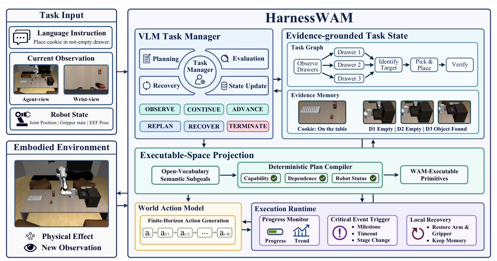
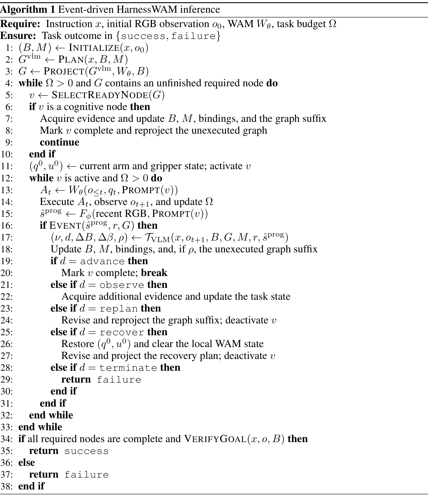
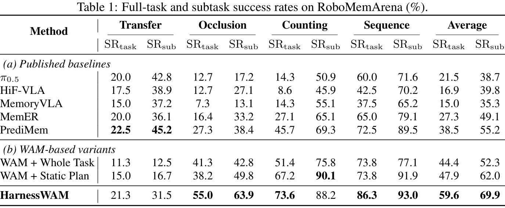
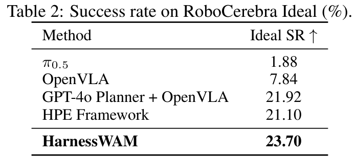
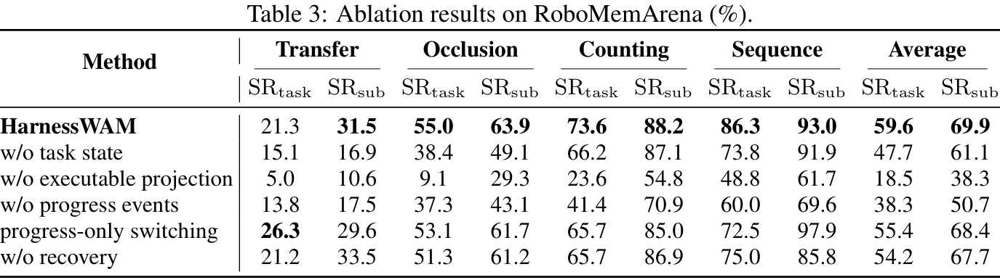
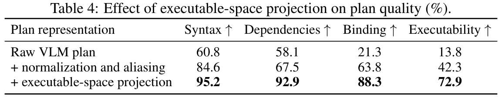

# HarnessWAM: Bridging Prediction and Deliberation in World Action Models

**Authors:** Zhaopeng Gu, et al.  
**Source:** local PDF, SHA256 `e123b7056eb7011730c4ce5fc289f3df7a74b187228cdb5ba029daf46dddcad9`  
**Reader:** complete 15-page bilingual reader; references remain English-only for searchable bibliographic fidelity.

## Section Index
Abstract; 1 Introduction; 2 Related Work (§§2.1–2.2); 3 Method (§§3.1–3.6); 4 Experiments (§§4.1–4.4); 5 Conclusion; References.

## Terminology Ledger
| English | 中文 |
| --- | --- |
| World Action Model (WAM) | 世界动作模型 |
| prediction–deliberation gap | 预测—审议鸿沟 |
| Task Manager | 任务管理器 |
| executable-space projection | 可执行空间投影 |
| embodiment-state recovery | 具身状态恢复 |
| scene belief | 场景信念 |
| task graph | 任务图 |
| progress estimator | 进度估计器 |
| dual-timescale feedback loop | 双时间尺度反馈循环 |
| history-invariance constraint | 历史不变性约束 |

## Abstract

> <strong>Para. 1:</strong> World Action Models (WAMs) jointly learn environmental dynamics and robot actions, introducing priors over physical evolution into embodied control. However, finite-horizon prediction and action generation are insufficient for complex embodied tasks that require global planning, cross-stage state maintenance, execution verification, and failure recovery. We refer to this mismatch as the prediction-deliberation gap of WAMs.

> <strong>Para. 1[CN]:</strong> 世界动作模型（WAM）联合学习环境动力学与机器人动作，为具身控制引入物理演化先验。然而，对于需要全局规划、跨阶段状态维护、执行验证和失败恢复的复杂具身任务，有限时域预测和动作生成并不足够。我们将 WAM 的这种不匹配称为“预测—审议鸿沟”。

> <strong>Para. 2:</strong> To address this gap, we propose HarnessWAM, an agentic framework for WAMs. HarnessWAM employs a vision-language-model-based Task Manager to maintain an evidence-grounded scene belief and a structured task graph. A capability-conditioned executable-space projection further constrains open-ended semantic plans into sequences of atomic skills that satisfy task dependencies, embodiment-state constraints, and the capability boundary of the underlying WAM.

> <strong>Para. 2[CN]:</strong> 为弥合这一鸿沟，我们提出 HarnessWAM，一种面向 WAM 的智能体框架。HarnessWAM 使用基于视觉语言模型的任务管理器维护证据支撑的场景信念和结构化任务图。能力条件化的可执行空间投影进一步把开放式语义计划约束为原子技能序列，使其满足任务依赖、具身状态约束以及底层 WAM 的能力边界。

> <strong>Para. 3:</strong> During execution, HarnessWAM operates through an event-driven, dual-timescale feedback loop: a lightweight progress estimator continuously provides high-frequency execution evidence, while the Task Manager deliberates at salient milestones by jointly considering the current observation, task state, and interaction history to determine whether to advance the task, acquire additional observations, revise the plan, or initiate local recovery. This mechanism enables the robot to recover its state after a subtask failure and resume execution without discarding previously acquired scene knowledge. HarnessWAM achieves state-of-the-art full-task and subtask success rates of 59.6% and 69.9% on RoboMemArena, and an SR of 23.7% on RoboCerebra Ideal.

> <strong>Para. 3[CN]:</strong> 执行期间，HarnessWAM 采用事件驱动的双时间尺度反馈循环：轻量级进度估计器持续提供高频执行证据；任务管理器在显著里程碑处审议，联合考虑当前观测、任务状态和交互历史，决定推进任务、获取更多观测、修改计划或发起局部恢复。该机制使机器人在子任务失败后恢复自身状态，并在不丢弃先前获取的场景知识的情况下继续执行。HarnessWAM 在 RoboMemArena 上取得了 59.6% 的整任务成功率和 69.9% 的子任务成功率，并在 RoboCerebra Ideal 上达到 23.7% 的 SR。

> <strong>Para. 4:</strong> These results demonstrate that model-external structured state maintenance and closed-loop agentic decision making can effectively extend the local control capabilities of WAMs into embodied task execution that is plannable, verifiable, and recoverable.

> <strong>Para. 4[CN]:</strong> 这些结果表明，模型外部的结构化状态维护和闭环智能体决策能够有效把 WAM 的局部控制能力扩展为可规划、可验证、可恢复的具身任务执行。

## 1 Introduction

> <strong>Para. 5:</strong> World Action Models (WAMs) jointly model future observations, environment states, and robot actions, enabling control policies to learn environmental dynamics and the physical consequences of robotic interventions (Li et al., 2026; Ye et al., 2026). Their predictive representations provide a foundation for outcome-aware control, closed-loop correction, and generalizable embodied agents.

> <strong>Para. 5[CN]:</strong> 世界动作模型（WAM）联合建模未来观测、环境状态和机器人动作，使控制策略能够学习环境动力学以及机器人干预所产生的物理后果（Li et al., 2026；Ye et al., 2026）。其预测表征为结果感知控制、闭环纠偏和高泛化性的具身智能体提供了坚实基础。

> <strong>Para. 6:</strong> However, finite-horizon prediction alone is insufficient for persistent agentic decision making. Although WAMs can reliably predict near-term physical evolution and execute local manipulation skills, they do not explicitly maintain the global task state required to verify outcomes, propagate evidence across stages, or determine how to recover from failure. We call this mismatch between local predictive control and the persistent deliberation required by open-ended embodied tasks the prediction–deliberation gap. Figure 1 illustrates this gap in a partially observable task whose target location is initially unknown and must be inferred from exploratory observations.

> <strong>Para. 6[CN]:</strong> 然而，有限时域预测本身不足以支持持久的智能体决策。尽管 WAM 能可靠预测近期物理演化并执行局部操作技能，但它不会显式维护验证执行结果、跨阶段传递证据或确定如何从失败中恢复所需的全局任务状态。我们把局部预测控制与开放式具身任务所需持续审议之间的这种不匹配称为“预测—审议鸿沟”。图 1 展示了在部分可观测任务中的这一鸿沟：目标位置初始未知，必须通过探索性观测进行推断。

### Figure 1. 记忆依赖任务中的预测—审议鸿沟

**Caption:** Prediction–deliberation gap in a memory-dependent task. A conventional WAM leaves the target unresolved, whereas HarnessWAM accumulates evidence, binds the target, and coordinates subsequent execution.

**Caption[CN]:** 记忆依赖任务中的预测—审议鸿沟。传统 WAM 无法解析未观测目标，而 HarnessWAM 积累证据、绑定目标并协调后续执行。

> <strong>Para. 7:</strong> Language-model agents demonstrate that a foundation model’s effective capabilities depend on the harness through which it maintains state, invokes actions, and incorporates feedback (Yao et al., 2022; Shinn et al., 2023; Yang et al., 2024). Existing harnesses mainly target digital environments with discrete interfaces and explicit feedback. Physical interaction instead involves continuous control, partial observability, uncertain outcomes, and potentially irreversible state changes. An embodied harness must consequently ground semantic reasoning in executable skills while persistently tracking task state and physical effects.

> <strong>Para. 7[CN]:</strong> 语言模型智能体表明，基础模型的实际有效能力在很大程度上取决于其 harness（外壳框架）维护状态、调用动作和整合反馈的方式（Yao et al., 2022；Shinn et al., 2023；Yang et al., 2024）。现有的 harness 主要面向具有离散接口和显式反馈的数字软件环境；而物理交互则涉及连续控制、部分可观测性、不确定的动作结果以及可能不可逆的状态改变。因此，具身 harness 必须把语义推理扎实落地于可执行技能之中，同时持久跟踪任务状态与物理效果。

> <strong>Para. 8:</strong> We introduce HarnessWAM, an agentic framework that addresses this challenge through a structured runtime external to the WAM. A vision-language-model-based Task Manager maintains an evidence-grounded scene belief and represents the global instruction as a task graph containing both physical and cognitive operations. Unresolved entities remain symbolic until sufficient visual evidence supports their binding. A capability-conditioned executable-space projection then compiles open-ended semantic plans into primitive sequences supported by validated WAM skills, enforcing task dependencies and consistency with the current scene and embodiment state.

> <strong>Para. 8[CN]:</strong> 我们提出 HarnessWAM，一种通过 WAM 外部结构化运行时解决该挑战的智能体框架。基于视觉语言模型（VLM）的任务管理器维护具有证据支撑的场景信念，并将全局指令表示为同时包含物理操作和认知操作的任务图。未解析的实体保持为符号变量，直到获得充分的视觉证据支持其实体绑定。随后，能力条件化的可执行空间投影将开放式语义计划编译为已验证 WAM 技能所支持的原语序列，严格强制满足任务依赖关系以及与当前场景和具身状态的一致性。

> <strong>Para. 9:</strong> HarnessWAM coordinates physical execution through an event-driven, dual-timescale loop. On the fast timescale, a lightweight progress estimator continuously summarizes subtask progress and completion evidence. On the slow timescale, the Task Manager deliberates only at salient milestones or changes in execution conditions, jointly considering the current observation, progress history, scene belief, task graph, and execution state. It determines whether to continue, advance, acquire evidence, replan, or recover, and may revise only the unexecuted graph suffix when new observations resolve prior uncertainty. Upon local failure, HarnessWAM restores the robot embodiment toward its subtask-initial state while retaining acquired scene knowledge and task memory.

> <strong>Para. 9[CN]:</strong> HarnessWAM 通过事件驱动的双时间尺度循环协调物理执行。在快速时间尺度上，轻量级进度估计器持续总结子任务进度和完成证据；在慢速时间尺度上，任务管理器仅在显著里程碑或执行条件发生变化时进行审议，综合权衡当前观测、进度历史、场景信念、任务图和执行状态。它据此决定是继续、推进、获取证据、重新规划还是执行恢复，并且当新观测消解了先前的认知不确定性时，仅修订任务图中未执行的后缀。在发生局部失败时，HarnessWAM 会将机器人具身状态恢复至子任务初始状态附近，同时完整保留先前积累的场景认知与任务记忆。

> <strong>Para. 10:</strong> The resulting loop integrates planning, execution, evaluation, memory, and recovery without requiring changes to the WAM architecture. HarnessWAM achieves state-of-the-art full-task and subtask success rates of 59.6% and 69.9% on RoboMemArena (Lei et al., 2026). On RoboCerebra Ideal (Han et al., 2026), it attains an SR of 23.7%. These results show that structured agentic orchestration substantially improves WAM reliability in partially observable, memory-dependent, and multi-stage manipulation.

> <strong>Para. 10[CN]:</strong> 由此构成的循环在无需对 WAM 本身架构做任何修改的前提下，将规划、执行、评估、记忆和恢复完整融合。HarnessWAM 在 RoboMemArena（Lei et al., 2026）上取得了 59.6% 的整任务成功率和 69.9% 的子任务成功率，刷新了前沿水准；在 RoboCerebra Ideal（Han et al., 2026）上达到了 23.7% 的成功率。这些结果表明，结构化的智能体编排极大提升了 WAM 在部分可观测、记忆依赖以及多阶段复合操作任务中的可靠性。

> <strong>Para. 11:</strong> Our main contributions are:
>
> - We identify the prediction-deliberation gap and formulate reliable WAM execution as model-external state estimation and closed-loop decision making.
> - We introduce evidence-grounded task state and capability-conditioned executable-space projection to compile open-ended VLM plans into feasible WAM skill sequences.
> - We develop an event-driven, dual-timescale mechanism for progress-aware task transitions, plan revision, and local embodiment-state recovery.
> - We establish state-of-the-art performance on RoboMemArena and RoboCerebra Ideal, validating HarnessWAM on challenging long-horizon embodied tasks.

> <strong>Para. 11[CN]:</strong> 我们的主要贡献包括：
>
> - 识别并指出了“预测—审议鸿沟”，将可靠的 WAM 执行形式化为模型外部的状态估计与闭环决策过程；
> - 提出了证据支撑的任务状态表征与能力条件化的可执行空间投影，将开放式 VLM 计划编译为物理可行的 WAM 技能序列；
> - 开发了事件驱动的双时间尺度机制，实现了进度感知的任务转换、动态计划修订与局部具身状态恢复；
> - 在 RoboMemArena 和 RoboCerebra Ideal 上刷新了最先进性能，在具挑战性的长时程具身任务上充分验证了 HarnessWAM 的有效性。

## 2 Related Work

### 2.1 Predictive World Models and World Action Models

> <strong>Para. 12:</strong> Action-conditioned visual prediction has long supported model-predictive robot control by forecasting the effects of candidate actions (Ebert et al., 2017; 2018b). Recent generative approaches scale this principle through text-conditioned video policies, pretrained video diffusion, and unified video simulation and action decoding (Du et al., 2023; Wen et al., 2024; Liao et al., 2025). These results establish future visual modeling as a useful source of physical-dynamics priors for policy learning.

> <strong>Para. 12[CN]:</strong> 动作条件化的视觉预测长期以来通过推演候选动作的物理后果来支持机器人的模型预测控制（Ebert et al., 2017；2018b）。近期的生成式方法通过文本条件视频策略、预训练视频扩散模型以及统一的视频仿真与动作解码进一步拓展了这一准则（Du et al., 2023；Wen et al., 2024；Liao et al., 2025）。这些研究确立了未来视觉建模作为策略学习中物理动力学先验的重要来源。

> <strong>Para. 13:</strong> World Action Models (WAMs) more directly couple future-observation modeling with action generation. LingBot-VA enables closed-loop asynchronous control through autoregressive video–action generation (Li et al., 2026), while DreamZero demonstrates transfer across tasks, scenes, and embodiments (Ye et al., 2026). Fast-WAM separates video co-training from test-time future generation, showing that representations acquired through predictive training can support efficient action inference without explicit rollout synthesis (Yuan et al., 2026). Recent extensions additionally incorporate compressed or boundary-triggered history into WAM inference (Sun et al., 2026; Yang et al., 2026). This line of work primarily advances dynamics representation, transfer, memory conditioning, and inference efficiency within the model. HarnessWAM addresses an orthogonal question: how to organize local WAM predictions and actions into persistent task-level behavior whose intermediate effects can be verified and whose failures can be recovered.

> <strong>Para. 13[CN]:</strong> 世界动作模型（WAM）更直接地将未来观测建模与动作生成耦合在一起。LingBot-VA 通过自回归视频—动作联合生成实现了闭环异步控制（Li et al., 2026），而 DreamZero 展示了在任务、场景与具身形态间的强迁移能力（Ye et al., 2026）。Fast-WAM 将视频协同训练与测试阶段的未来视频生成解耦，证明了通过预测训练获得的表征无需显式 rollout 合成即可支持高效动作推理（Yuan et al., 2026）。最近的拓展工作进一步将压缩历史或事件边界触发历史引入 WAM 推理（Sun et al., 2026；Yang et al., 2026）。这一系列工作主要致力于推进模型内部的动力学表征、跨域迁移、记忆条件化与推理效率。HarnessWAM 研究的是一个正交的问题：如何将局部 WAM 预测与动作组织为持久的任务级行为，使其物理中间效果可被验证、执行失败可被恢复。

### 2.2 Harnesses for Embodied Agents

> <strong>Para. 14:</strong> Language-agent research demonstrates that foundation-model capability depends strongly on the external loop through which the model maintains state, invokes actions, and incorporates feedback (Yao et al., 2022; Shinn et al., 2023; Yang et al., 2024). Such harnesses are commonly developed for software environments with discrete interfaces, explicit return values, and repeatable execution. Physical interaction instead involves continuous control, partial observability, uncertain action outcomes, and state changes that may be irreversible. Consequently, an embodied harness must ground semantic decisions in physically executable skills and maintain task state beyond individual model calls.

> <strong>Para. 14[CN]:</strong> 语言智能体研究表明，基础模型的实际表现极大依赖于其维护状态、调用动作和整合反馈的外部循环机制（Yao et al., 2022；Shinn et al., 2023；Yang et al., 2024）。此类 harness 通常针对具有离散接口、显式返回值和可重复执行的纯软件数字环境而开发。相比之下，物理交互涉及连续控制、部分可观测性、不确定的动作结果以及可能不可逆的环境状态改变。因此，具身环境下的 harness 必须将语义决策坚实锚定在物理可执行的技能上，并在跨越单次模型调用的广阔时程中持久维护全局任务状态。

> <strong>Para. 15:</strong> Robot planning provides several components of this interface. SayCan grounds language plans with skill affordances (Ahn et al., 2022); Inner Monologue introduces environment feedback into language planning (Huang et al., 2022); and SayPlan and VoxPoser ground high-level reasoning in scene geometry (Rana et al., 2023; Huang et al., 2023). Task-and-motion planning and manipulation primitives similarly connect symbolic structure to continuous feasibility (Garrett et al., 2021; Morrow & Khosla, 1997; Chen et al., 2024). Complementary work studies persistent embodied memory (Guhur et al., 2023; Shi et al., 2026; Blukis et al., 2022; Dai et al., 2026), stage-aware progress and outcome modeling (Maeda et al., 2020; Agia et al., 2024; Luo, 2024; Chen et al., 2025), and failure detection or corrective execution (Ebert et al., 2018a; Zhao et al., 2026; Ying et al., 2026).

> <strong>Para. 15[CN]:</strong> 机器人规划领域为这种接口提供了若干关键组件：SayCan 利用技能可供性（affordances）对语言规划进行物理约束（Ahn et al., 2022）；Inner Monologue 将环境反馈引入语言规划循环（Huang et al., 2022）；SayPlan 和 VoxPoser 则将高层推理扎根于场景几何（Rana et al., 2023；Huang et al., 2023）。任务与运动规划（TAMP）和操作原语同样致力于将符号结构连接到连续可行性空间（Garrett et al., 2021；Morrow & Khosla, 1997；Chen et al., 2024）。互补的系列工作则深入探究了持久具身记忆（Guhur et al., 2023；Shi et al., 2026；Blukis et al., 2022；Dai et al., 2026）、阶段感知进度与结果建模（Maeda et al., 2020；Agia et al., 2024；Luo, 2024；Chen et al., 2025），以及故障检测与纠正性执行（Ebert et al., 2018a；Zhao et al., 2026；Ying et al., 2026）。

> <strong>Para. 16:</strong> HarnessWAM unifies these ingredients around a WAM executor. A Task Manager maintains an evidence-grounded belief and structured task graph, while a deterministic projection compiles open-ended semantic plans into validated WAM skills subject to task dependencies and embodiment constraints. Progress estimation and sparse semantic verification govern task transitions, and embodiment-state recovery handles local execution failures without discarding acquired scene knowledge. This formulation makes planning, memory, verification, and recovery components of a single event-driven decision process rather than independent additions to the control policy.

> <strong>Para. 16[CN]:</strong> HarnessWAM 围绕 WAM 执行器将这些要素有机统一：任务管理器维护基于证据的信念和结构化任务图；确定性投影将开放式语义计划编译为符合任务依赖和具身约束的已验证 WAM 技能；进度估计与稀疏语义验证共同掌控任务状态转换；具身状态恢复机制能够在不丢失已获得场景知识的前提下处理局部执行失败。这种形式化将规划、记忆、验证和恢复融为一体，使之成为单一事件驱动决策过程的核心组件，而非控制策略外部孤立的拼凑附加项。

## 3 Method

### 3.1 Problem Formulation

> <strong>Para. 17:</strong> Consider an embodied manipulation task specified by a natural-language instruction $x$. At time $t$, the environment returns multi-view RGB observations $o_t = (I_t^{\text{agent}}, I_t^{\text{wrist}})$ and the robot proprioceptive state $q_t$. Given a local skill instruction $g_k$, a World Action Model $W_\theta$ generates an action chunk of horizon $H$ conditioned on a finite interaction history:

> <strong>Para. 17[CN]:</strong> 考虑由自然语言指令 $x$ 指定的具身操作任务。在时刻 $t$，环境返回多视角 RGB 观测 $o_t = (I_t^{\text{agent}}, I_t^{\text{wrist}})$ 以及机器人本体感受状态 $q_t$。给定局部技能指令 $g_k$，世界动作模型 $W_\theta$ 在有限交互历史条件下生成时域长度为 $H$ 的动作块（action chunk）：

$$A_t = W_\theta(o_{\le t}, q_t, g_k) = (a_t, \dots, a_{t+H-1}). \tag{1}$$

> <strong>Para. 18:</strong> Each WAM invocation solves a local, finite-horizon control problem defined by $g_k$. Completing the global task additionally requires maintaining latent state across execution stages, assessing physical effects, and revising subsequent decisions as new evidence arrives. We therefore define a harness as a model-external decision process $\mathcal{H}$ operating over discrete task events. It transforms a global instruction into a sequence of verified WAM invocations with the objective of maximizing task-level success. At event time $\tau_k$, we define the embodied runtime state as

> <strong>Para. 18[CN]:</strong> 每次对 WAM 的调用都解决了一个由 $g_k$ 定义的局部有限时域控制问题。要顺利完成全局任务，还必须跨执行阶段维护潜在状态、评估物理动作效果，并在新证据到达时动态修正后续决策。因此，我们将 harness 定义为一个运行在离散任务事件之上的模型外部决策过程 $\mathcal{H}$。它将全局任务指令转化为一系列经过严谨验证的 WAM 调用，以最大化整任务成功率为最终目标。在事件时刻 $\tau_k$，我们将具身运行时状态定义为：

$$z_k = (B_k, G_k, M_k, r_k), \tag{2}$$

$$(z_{k+1}, g_{k+1}) = \mathcal{H}(x, z_k, o_{\tau_k}, e_k). \tag{3}$$

> <strong>Para. 19:</strong> where $B_k, G_k, M_k$, and $r_k$ denote the scene belief, structured task graph, task memory, and execution state of the active skill, respectively. HarnessWAM recursively updates this state from a new observation and event $e_k$, and selects the next local goal. This formulation separates continuous WAM control from task-level deliberation. The WAM realizes a local skill, while the harness determines which skill to invoke, when its execution should terminate, how its outcome changes the task state, and how execution should proceed after failure. The overall objective is to maximize goal satisfaction at task termination. Figure 2 summarizes the HarnessWAM architecture and its event-driven interaction with the embodied environment.

> <strong>Para. 19[CN]:</strong> 其中 $B_k, G_k, M_k$ 和 $r_k$ 分别表示场景信念、结构化任务图、任务记忆以及当前活跃技能的执行状态。HarnessWAM 根据新观测与事件 $e_k$ 递归更新该状态，并选定下一个局部技能目标。该形式化把连续的 WAM 低层控制与任务级审议彻底解耦：WAM 专注于实现具体的局部技能，而 harness 负责裁定调用何种技能、何时终止执行、执行结果如何改变全局任务状态，以及在发生失败后如何继续推进。总体目标是在任务终止时最大化目标满足度。图 2 总结了 HarnessWAM 的系统架构及其与具身环境的事件驱动交互流程。

### Figure 2. HarnessWAM 系统架构与事件驱动交互总览

**Caption:** Overview of HarnessWAM. The VLM Task Manager converts a global instruction and current observations into an evidence-grounded task graph. Executable-space projection compiles open-vocabulary semantic subgoals into WAM-supported primitives subject to capability, dependency, and embodiment-state constraints. The WAM and execution runtime form a fast control loop, while event-triggered Task Manager decisions update state, revise the plan, recover the robot embodiment, or terminate execution.

**Caption[CN]:** HarnessWAM 总览。VLM 任务管理器将全局指令和当前观测转化为有证据支撑的任务图。可执行空间投影将开放词汇语义子目标编译为满足能力、依赖和具身状态约束的 WAM 支持原语。WAM 与执行运行时构成快速控制循环，而事件触发的任务管理器决策负责更新状态、修订计划、恢复机器人具身状态或终止执行。

### 3.2 Evidence-Grounded Task State

> <strong>Para. 20:</strong> In a partially observable environment, the current image is generally insufficient for selecting future behavior. Once a drawer has been closed, for example, the current observation no longer reveals whether it contained a target object. HarnessWAM therefore maintains a scene belief $B_k$ comprising entities together with their attributes, relations, and epistemic status. Each scene fact is represented as

> <strong>Para. 20[CN]:</strong> 在部分可观测环境中，单凭当前时刻的图像通常不足以正确引导未来的动作决策。例如，一旦某个抽屉被关上，当前的视觉观测就再也无法透露其内部是否存放着目标物体。因此，HarnessWAM 维护一个场景信念 $B_k$，它涵盖实体及其属性、相互关系与认知认识状态。每个场景事实均被结构化表示为：

$$f = (s, p, o, v, \eta, c, E), \tag{4}$$

> <strong>Para. 21:</strong> where $s, p, o$, and $v$ denote the subject, predicate, object, and value; $\eta \in \{\text{observed}, \text{inferred}, \text{unknown}\}$ distinguishes direct observations, inferred facts, and unresolved state; $c$ is a confidence score; and $E$ references the supporting RGB evidence. This representation distinguishes not observed from observed to be false: an object becoming occluded does not invalidate a previously established scene fact. To preserve the cross-stage history and visual evidence underlying this belief, HarnessWAM maintains $M_k = (M_k^{\text{task}}, M_k^{\text{evidence}})$, where $M_k^{\text{task}}$ stores completed and failed nodes, retry counts, variable bindings, and the plan-revision history, while $M_k^{\text{evidence}}$ stores visual evidence associated with salient task events. The Task Manager invokes the VLM only at event times to jointly update the scene belief and memory:

> <strong>Para. 21[CN]:</strong> 其中 $s, p, o$ 和 $v$ 分别表示主语、谓词、宾语和取值；$\eta \in \{\text{observed}, \text{inferred}, \text{unknown}\}$ 显式区分直接观测事实、推理得出事实和未解析状态；$c$ 为置信度得分；$E$ 则指向支持该事实的原始 RGB 视觉证据。该表征能够严格区分“未被观测”与“经观测证实为假”：一个物体随后被遮挡，绝不会导致先前已被证实的场景事实失效。为持久留存支撑该信念的跨阶段历史与视觉证据，HarnessWAM 维护 $M_k = (M_k^{\text{task}}, M_k^{\text{evidence}})$，其中 $M_k^{\text{task}}$ 记录已完成与失败的节点、重试次数、变量绑定关系及计划修订历史，而 $M_k^{\text{evidence}}$ 存储与显著任务事件相关的关键视觉证据。任务管理器仅在事件发生时调用 VLM，联合更新场景信念与记忆：

$$M_k = (M_k^{\text{task}}, M_k^{\text{evidence}}), \tag{5}$$

$$(B_{k+1}, M_{k+1}) = U_{\text{VLM}}(x, o_{\tau_k}, B_k, M_k, e_k). \tag{6}$$

> <strong>Para. 22:</strong> Long interaction histories are thus compressed into a queryable and updateable task state whose claims can be traced to visual observations. This explicit compression reduces the need for a VLM to reconstruct task history implicitly from a long video context.

> <strong>Para. 22[CN]:</strong> 漫长的物理交互历史因而被高度压缩为一个既可检索又可增量更新的任务状态，其包含的每一项事实断言均可溯源至具体的视觉观测。这种显式结构化压缩极大降低了 VLM 从超长视频上下文中隐式重建任务历史的严苛负担。

> <strong>Para. 23:</strong> The Task Manager further represents the task as a directed graph $G_k = (V_k, E_k, X_k, \beta_k)$, where $V_k$ is the node set, $E_k$ contains dependency edges, $X_k$ comprises unresolved symbolic variables, and $\beta_k : X_k \rightharpoonup \mathcal{O}$ is a partial binding from variables to scene entities. Each node is represented as $v_i = (op_i, arg_i, pre_i, eff_i, term_i, rec_i)$, specifying an operation, typed arguments, preconditions, expected effects, termination conditions, and a recovery strategy. The graph includes both motor nodes, which induce physical actions, and cognitive nodes, which acquire observations, verify state, bind variables, or update memory.

> <strong>Para. 23[CN]:</strong> 任务管理器进一步将整个任务表示为有向图 $G_k = (V_k, E_k, X_k, \beta_k)$，其中 $V_k$ 为节点集合，$E_k$ 包含依赖关系有向边，$X_k$ 包含尚未解析的符号变量，$\beta_k : X_k \rightharpoonup \mathcal{O}$ 为从变量到具体场景实体的部分绑定映射。每个节点表示为 $v_i = (op_i, arg_i, pre_i, eff_i, term_i, rec_i)$，详细规定了操作原语、类型化参数、前置条件、预期效果、终止判据以及失败恢复策略。该图统一纳入了触发物理动作的运动节点（motor nodes），以及负责采集观测、验证状态、绑定变量或更新记忆的认知节点（cognitive nodes）。

$$G_k = (V_k, E_k, X_k, \beta_k), \tag{7}$$

$$v_i = (op_i, arg_i, pre_i, eff_i, term_i, rec_i), \tag{8}$$

> <strong>Para. 24:</strong> When an entity cannot be identified from the initial observation, the Task Manager retains a symbolic variable instead of committing to an unsupported guess, and updates $\beta_k$ once sufficient evidence becomes available. This graph expresses sequential dependencies, information acquisition, conditional branches, and delayed decisions after exploration within a unified representation.

> <strong>Para. 24[CN]:</strong> 当无法从初始观测中准确识别某实体时，任务管理器会保留符号变量，而非贸然做出缺乏证据支持的猜测，并在后续探索积累了充足证据后再行更新 $\beta_k$。该任务图在统一表征中完备表达了时序依赖、主动信息采集、条件分支决策以及探索后的延迟决断。

### 3.3 Capability-Conditioned Executable-Space Projection

> <strong>Para. 25:</strong> A VLM can propose plans in an open semantic space, whereas a WAM can reliably execute only those local skills supported by its training distribution and control interface. HarnessWAM connects these levels through a projection from open-ended semantic plans to a capability-conditioned executable space, after which the WAM produces continuous control commands.

> <strong>Para. 25[CN]:</strong> VLM 能够在开放语义空间中提出自由规划，但 WAM 却只能可靠执行那些在其训练数据分布与控制接口支持范围内的局部技能。HarnessWAM 通过从开放式语义计划到能力条件化可执行空间的严格投影连接起这两个层级，投影完成后再由 WAM 输出具体的连续控制命令。

> <strong>Para. 26:</strong> We define an extensible ontology of parameterized operations: $P^\star = P^{\text{motion}} \cup P^{\text{grasp}} \cup P^{\text{contact}} \cup P^{\text{articulation}} \cup P^{\text{assembly}} \cup P^{\text{tool}}$, corresponding to free-space motion, object acquisition and release, contact-rich interaction, articulated-object manipulation, assembly, and tool use. Each primitive denotes an operation family with open object arguments and explicit physical semantics, while the WAM generates a concrete trajectory from the current observation. A primitive has the unified representation $p = (\tau_p, \Theta_p, Pre_p, Eff_p, Term_p, Rec_p)$, where $\tau_p$ denotes the interaction type, $\Theta_p$ is a typed parameter space, and the remaining terms specify preconditions, expected effects, termination criteria, and recovery rules.

> <strong>Para. 26[CN]:</strong> 我们定义了一个可扩展的参数化操作本体：$P^\star = P^{\text{motion}} \cup P^{\text{grasp}} \cup P^{\text{contact}} \cup P^{\text{articulation}} \cup P^{\text{assembly}} \cup P^{\text{tool}}$，分别对应自由空间运动、物体抓取与释放、丰富接触交互、关节物体操作、装配以及工具使用。每个原语代表一个具有开放物体参数和明确物理语义的操作族，而 WAM 则根据当前观测生成具体的连续轨迹。原语具有统一的形式化表征 $p = (\tau_p, \Theta_p, Pre_p, Eff_p, Term_p, Rec_p)$，其中 $\tau_p$ 表示交互类型，$\Theta_p$ 为类型化参数空间，其余各项分别明确前置条件、预期效果、终止判据以及恢复规则。

$$P^\star = P^{\text{motion}} \cup P^{\text{grasp}} \cup P^{\text{contact}} \cup P^{\text{articulation}} \cup P^{\text{assembly}} \cup P^{\text{tool}}, \tag{9}$$

$$p = (\tau_p, \Theta_p, Pre_p, Eff_p, Term_p, Rec_p), \tag{10}$$

> <strong>Para. 27:</strong> This compact interface is motivated by empirical evidence that motor behavior exhibits low-dimensional, repetitive, and compositional structure. In natural work activities, the ten most frequent human grasp types account for 81% of grasp duration and 72% of grasp instances (Bullock et al., 2013). Two kinematic primitives explain 95% of the cumulative variance in discrete reaching motions (Moro et al., 2012), and two postural hand synergies explain more than 80% of the variance in 15-DoF grasps over 57 objects (Santello et al., 1998). Robotic manipulation can likewise be organized through a finite set of relative-motion classes between rigid bodies (Morrow & Khosla, 1997). These findings motivate a compact, parameterized, and extensible behavior basis for organizing high-dimensional control. The ontology can grow with the validated capabilities of the WAM and the requirements of the task domain.

> <strong>Para. 27[CN]:</strong> 这一紧凑接口的设计基于大量实证证据，即运动行为在本质上呈现出低维、重复和高度组合性的内在结构。在日常工作活动中，人类最频繁使用的 10 种抓取类型占用了 81% 的抓取时长和 72% 的抓取实例（Bullock et al., 2013）。两个运动学原语即可解释离散伸手动作中 95% 的累积方差（Moro et al., 2012）；而在针对 57 种物体的 15 自由度抓取中，两种手部姿态协同基即可解释超过 80% 的方差（Santello et al., 1998）。类似地，机器人操作也可以通过刚体间有限的相对运动类别集合进行组织（Morrow & Khosla, 1997）。这些发现启示我们采用紧凑、参数化且可扩展的行为基来规整高维连续控制。随着 WAM 实证验证能力的拓宽与任务领域需求的演进，该本体可动态扩充。

> <strong>Para. 28:</strong> For a particular WAM, the executable primitive set is determined by the skills that the model has acquired and that have been empirically validated: $P_W = \{p \in P^\star \mid p \text{ has a validated realization under } W_\theta\}$. Let $\mathcal{L}(P_W)$ denote the plan language generated by supported primitives, and let $\mathcal{F}(z_k)$ denote the feasible set induced by the current scene, object bindings, task dependencies, and embodiment state. HarnessWAM projects a VLM-generated graph as

> <strong>Para. 28[CN]:</strong> 对于特定的 WAM，可执行原语集合由该模型已习得且经过实证验证的技能决定：$P_W = \{p \in P^\star \mid p \text{ has a validated realization under } W_\theta\}$。令 $\mathcal{L}(P_W)$ 表示由所支持原语生成的计划语言，令 $\mathcal{F}(z_k)$ 表示由当前场景、物体绑定、任务依赖及具身状态诱导出的物理可行集合。HarnessWAM 将 VLM 生成的原始图投影为：

$$P_W = \{p \in P^\star \mid p \text{ has a validated realization under } W_\theta\}, \tag{11}$$

$$G_k^{\text{exec}} = \Pi_{\mathcal{L}(P_W) \cap \mathcal{F}(z_k)}(G_k^{\text{vlm}}). \tag{12}$$

> <strong>Para. 29:</strong> The projection is implemented by a deterministic plan compiler. It checks argument types, node dependencies, precondition–effect consistency, single-arm holding state, and graph acyclicity, and then canonicalizes valid nodes into local WAM instructions. For example, $\text{PLACE}(\text{object}, \text{target})$ requires the same object to have been acquired, $\text{POUR}(\text{object}, \text{target})$ requires the robot to be holding that object, and $\text{OPEN}$ and $\text{CLOSE}$ must satisfy the corresponding gripper and object-state constraints. A semantic node that admits a composition of supported primitives is expanded into a valid sequence. If no feasible projection exists, the compiler returns $\bot$ and reports the violated constraints to the Task Manager for replanning.

> <strong>Para. 29[CN]:</strong> 该投影由确定性计划编译器实现。编译器严格校验参数类型、节点依赖关系、前置条件与预期效果的一致性、单臂持握状态以及图的有向无环性（acyclicity），进而将合规节点规整为 WAM 的标准局部指令。例如，$\text{PLACE}(\text{object}, \text{target})$ 要求机械臂已持握该物体，$\text{POUR}(\text{object}, \text{target})$ 要求必须处于抓持状态，而 $\text{OPEN}$ 与 $\text{CLOSE}$ 必须满足对应的夹爪开合与目标物体物理状态约束。对于允许由支持原语复合实现的语义节点，编译器会将其展开为合规序列。若不存在可行投影，编译器返回 $\bot$ 并向任务管理器报告违背的具体约束以触发重新规划。

> <strong>Para. 30:</strong> New observations may change variable bindings or future branches. To preserve consistency with the physical history, HarnessWAM permits revisions only to the unexecuted suffix of the task graph and enforces the history-invariance constraint:

> <strong>Para. 30[CN]:</strong> 新获得的观测可能会改变变量绑定或改变未来的执行分支。为了维护与物理执行历史的一致性，HarnessWAM 仅允许对任务图中尚未执行的后缀部分进行修订，并严格施加历史不变性约束（history-invariance constraint）：

$$G_{k+1}[V_k^{\text{executed}}] = G_k[V_k^{\text{executed}}]. \tag{13}$$

### 3.4 Progress-Conditioned Event Control

> <strong>Para. 31:</strong> Invoking a VLM at every environment step is computationally expensive and exposes task-level decisions to transient visual fluctuations. HarnessWAM instead adopts dual-timescale control: the WAM and a lightweight progress estimator form a fast execution loop, while the Task Manager forms a slow deliberation loop triggered by semantic events.

> <strong>Para. 31[CN]:</strong> 在每一个环境交互步都调用 VLM 计算成本高昂，且容易将任务级高层决策暴露在短暂的视觉扰动与瞬时波动之下。HarnessWAM 采用双时间尺度控制：WAM 与轻量级进度估计器构成快速执行循环，而任务管理器则构成由语义事件触发的慢速审议循环。

> <strong>Para. 32:</strong> In the fast loop, the WAM repeatedly generates action chunks conditioned on the local instruction $g_k$ of the active node. A prompt-conditioned progress estimator $F_\phi$ predicts continuous progress and completion likelihood from the most recent $L$ frames of dual-view RGB observations and the text: $(p_t, c_t, \pi_t^{\text{bin}}) = F_\phi(o_{t-L+1:t}, g_k)$, where $p_t \in [0, 1]$ denotes continuous progress, $c_t \in [0, 1]$ denotes the probability of stage completion, and $\pi_t^{\text{bin}}$ is a discrete distribution over progress intervals. $F_\phi$ extracts multi-view spatial features with a frozen vision–language encoder and models local temporal changes with a causal temporal module. It is trained with

> <strong>Para. 32[CN]:</strong> 在快循环中，WAM 根据当前活跃节点的局部指令 $g_k$ 重复生成动作块。提示词条件化的进度估计器 $F_\phi$ 从最近 $L$ 帧的双视角 RGB 观测及指令文本中实时预测连续进度与完成概率：$(p_t, c_t, \pi_t^{\text{bin}}) = F_\phi(o_{t-L+1:t}, g_k)$，其中 $p_t \in [0, 1]$ 表示连续进度标量，$c_t \in [0, 1]$ 表示阶段完成概率，$\pi_t^{\text{bin}}$ 为进度区间的离散概率分布。$F_\phi$ 利用冻结的视觉语言编码器提取多视角空间特征，并通过因果时序模块对局部时序演变进行建模。其联合训练损失函数为：

$$(p_t, c_t, \pi_t^{\text{bin}}) = F_\phi(o_{t-L+1:t}, g_k), \tag{14}$$

$$\mathcal{L}_{\text{prog}} = \lambda_r \mathcal{L}_{\text{reg}} + \lambda_b \mathcal{L}_{\text{bin}} + \lambda_r \mathcal{L}_{\text{rank}} + \lambda_e \mathcal{L}_{\text{endpoint}} + \lambda_s \mathcal{L}_{\text{success}} + \lambda_m \mathcal{L}_{\text{mono}}, \tag{15}$$

> <strong>Para. 33:</strong> whose terms supervise continuous progress, progress intervals, temporal ordering, trajectory endpoints, stage completion, and local monotonicity, respectively. The estimator continuously supplies execution evidence for the active skill. The runtime converts the progress sequence into candidate milestone events; exhaustion of a skill budget or changes in a condition or variable binding also trigger task-level deliberation. Progress predictions alone never advance the task graph.

> <strong>Para. 33[CN]:</strong> 其各项分别监督连续进度回归、进度区间分类、时序排序、轨迹端点锚定、阶段成功判定以及局部单调性。该估计器持续为活跃技能的执行提供证据流。运行时系统将进度轨迹转换为候选里程碑事件；此外，技能执行预算耗尽、环境条件突变或变量绑定更新也会主动触发任务级审议。需要强调的是，进度估计器的预测本身绝不会直接推进任务图流转。

### Algorithm 1. 事件驱动的 HarnessWAM 推理算法

**Caption:** Algorithm 1: Event-driven HarnessWAM inference. The procedure outlines recursive state estimation, executable projection, fast-loop execution, and slow-loop event-triggered deliberation.

**Caption[CN]:** 算法 1：事件驱动的 HarnessWAM 推理算法。该过程概括了递归状态估计、可执行投影、快循环执行以及慢循环事件触发审议。

> <strong>Para. 34:</strong> At a candidate event $e_k$, the Task Manager jointly reasons over the current RGB observations, progress-estimate history, scene belief, task graph, historical evidence, and execution state:

> <strong>Para. 34[CN]:</strong> 在候选事件 $e_k$ 到达时，任务管理器综合权衡当前 RGB 观测、进度估计历史、场景信念、任务图、历史证据与实时执行状态：

$$y_k = (\nu_k, d_k, \Delta B_k, \Delta \beta_k, \rho_k) = T_{\text{VLM}}(x, o_{\tau_k}, B_k, G_k, M_k, r_k, \hat{s}_k^{\text{prog}}, e_k), \tag{16}$$

> <strong>Para. 35:</strong> where $\hat{s}_k^{\text{prog}}$ summarizes recent progress, completion likelihood, and their temporal trends. The outcome label $\nu_k \in \{\text{success}, \text{failure}, \text{uncertain}\}$ characterizes the physical effect, and $d_k \in \{\text{continue}, \text{advance}, \text{observe}, \text{replan}, \text{recover}, \text{terminate}\}$ is the execution decision. $\Delta B_k$ and $\Delta \beta_k$ update the scene belief and variable bindings, respectively, while $\rho_k$ indicates whether the unexecuted plan should be revised. The active node is marked complete and its successors are enabled only when $d_k = \text{advance}$. The progress estimator thus provides high-frequency execution cues, while the Task Manager determines subtask boundaries from visual outcomes and the structured task state maintained throughout execution.

> <strong>Para. 35[CN]:</strong> 其中 $\hat{s}_k^{\text{prog}}$ 概括了近期的进度、完成概率及其时序趋势。物理效果由结果标签 $\nu_k \in \{\text{success}, \text{failure}, \text{uncertain}\}$ 表征，而 $d_k \in \{\text{continue}, \text{advance}, \text{observe}, \text{replan}, \text{recover}, \text{terminate}\}$ 则为执行决策。$\Delta B_k$ 与 $\Delta \beta_k$ 分别更新场景信念与变量绑定，$\rho_k$ 则指示是否需要对未执行的计划进行重写。仅当 $d_k = \text{advance}$ 时，当前活跃节点才会被标记为完成并解锁后继节点。由此，进度估计器提供了高频执行线索，而任务管理器则依据视觉结果以及全程维护的结构化任务状态来判定子任务边界。

### 3.5 Embodiment-State Recovery and Task Termination

> <strong>Para. 36:</strong> Physical execution deviations, perceptual uncertainty, and plan-level failures require different responses. At the beginning of each motor node, HarnessWAM records the arm joint state $q_k^0$ and gripper state $u_k^0$, and assigns the node an execution budget $T_k$. Budget exhaustion or a verified failure emits a failure-handling event. At this event, the Task Manager reasons over the current RGB observation, progress trajectory, scene belief, task graph, attempt history, and remaining task-level budget encoded in $r_k$. It may continue a slowly progressing skill, acquire additional evidence when the outcome is ambiguous, recover from a local execution deviation, revise the unexecuted plan when the current strategy is invalid, or terminate when no feasible continuation remains.

> <strong>Para. 36[CN]:</strong> 物理执行偏差、感知不确定性与计划层面的失败需要差异化的应对策略。在每个运动节点开始执行前，HarnessWAM 会记录机械臂的关节状态 $q_k^0$ 和夹爪状态 $u_k^0$，并为该节点分配执行步数预算 $T_k$。预算耗尽或经过验证的执行失败将发出故障处理事件。在此事件中，任务管理器结合当前 RGB 观测、进度轨迹、场景信念、任务图、尝试历史以及编码在 $r_k$ 中的剩余整任务预算进行深度审议。它可能选择继续执行进展缓慢的技能、在结果模棱两可时采集额外证据、从局部执行偏差中恢复、在当前策略无效时修订未执行计划，或在无可行路径时终止任务。

> <strong>Para. 37:</strong> When $d_k = \text{recover}$, the saved embodiment state provides a physically grounded recovery target. Multi-step joint control drives the arm and gripper toward $(q_k^0, u_k^0)$:

> <strong>Para. 37[CN]:</strong> 当决策为 $d_k = \text{recover}$ 时，先前保存的具身状态提供了物理可达的恢复锚点。多步关节控制驱动机械臂与夹爪平稳回归至初始姿态 $(q_k^0, u_k^0)$：

$$(q_t, u_t) \xrightarrow[\text{multi-step control}]{\text{recover}} (q_k^0, u_k^0). \tag{17}$$

> <strong>Para. 38:</strong> Recovery resets only the robot embodiment, preserving the environment, scene belief, and information acquired during prior execution. The local WAM state is then cleared. The Task Manager may retry the active node with a revised local goal or replace the unexecuted graph suffix with an alternative strategy, after which the resulting plan is projected back into the executable space. The outcome of each attempt is recorded in $M_k$, allowing subsequent recovery decisions to depend on accumulated evidence and prior failures rather than a fixed per-node retry count.

> <strong>Para. 38[CN]:</strong> 该恢复过程仅重置机器人的具身本体姿态，完整保留物理环境、场景信念以及先前交互积累的所有认知信息。随后清空局部的 WAM 状态缓存。任务管理器可以通过修正后的局部目标重试当前节点，或用替代策略替换任务图中未执行的后缀，之后将生成的计划重新投影到可执行空间。每次尝试的结果都会记录在 $M_k$ 中，使后续的恢复决策能够建立在积累的证据与历史失败分析之上，而非依赖僵化的固定单节点重试次数限制。

> <strong>Para. 39:</strong> The harness determines task termination dynamically, allowing trajectory length to follow physical progress. A task succeeds when every required node is complete and final visual verification confirms the global goal. It fails when the graph terminates without satisfying the goal, the Task Manager determines that no plan supported by the available WAM skills remains feasible, or the bounded task-level execution and recovery budget is exhausted. A finite task graph and bounded task-level budget guarantee eventual termination.

> <strong>Para. 39[CN]:</strong> harness 动态判定任务终止，允许实际轨迹长度自适应于物理操作进展。当所有必须的节点均已完成且最终视觉验证确认满足全局目标时，任务判定为成功；当任务图流转完毕却未达成目标、任务管理器判定当前可用 WAM 技能无法支持任何可行方案、或有界的整任务执行与恢复预算耗尽时，任务判定为失败。有限规模的任务图与有界的整任务预算在理论与实践上共同保证了系统必能有限终止。

### 3.6 Overall Inference Procedure

> <strong>Para. 40:</strong> Algorithm 1 summarizes the complete inference procedure. This procedure characterizes HarnessWAM as an event-driven recursive state-estimation and decision system. Structured memory supplies cross-stage state, executable-space projection constrains VLM decisions, progress estimation connects continuous control to discrete task events, and local recovery handles physical execution deviations. Together, these components organize finite-horizon WAM invocations into persistent, verifiable, and recoverable embodied-agent behavior.

> <strong>Para. 40[CN]:</strong> 算法 1 总结了完整的推理过程。该流程将 HarnessWAM 明确刻画为一个事件驱动的递归状态估计与决策系统。结构化记忆提供跨阶段的全局状态维持，可执行空间投影对 VLM 决策施加物理约束，进度估计器连接连续低层控制与离散高层任务事件，局部恢复机制从容应对物理执行偏差。这些组件协同运作，将有限时域的 WAM 局部调用凝聚为持久、可验证且可恢复的具身智能体宏观行为。

## 4 Experiments

> <strong>Para. 41:</strong> We evaluate whether model-external agentic orchestration improves the reliability of WAM-based embodied task execution across memory-dependent and long-horizon compositional settings. In addition to full-task and subtask success, controlled ablations and plan-level diagnostics isolate how structured task state, executable-space projection, event-driven control, and failure recovery contribute to the resulting behavior.

> <strong>Para. 41[CN]:</strong> 我们深入评估模型外部的智能体编排是否能有效提升基于 WAM 的具身任务执行在记忆依赖与长时程复合场景中的可靠性。除了整任务成功率和子任务成功率之外，控制消融实验与计划级诊断分析进一步剥离并明确了结构化任务状态、可执行空间投影、事件驱动控制以及故障恢复机制对系统最终行为的具体贡献。

### 4.1 Experimental Setup

> <strong>Para. 42:</strong> Benchmarks. We evaluate HarnessWAM on RoboMemArena (Lei et al., 2026) and RoboCerebra Ideal (Han et al., 2026). RoboMemArena comprises 26 long-horizon manipulation tasks with an average trajectory length of 1,076 environment steps, and 68.9% of its subtasks depend on historical information. The benchmark contains four complementary task families: multi-object transfer, occlusion, counting, and sequential execution, with 4, 11, 7, and 4 tasks, respectively. These families evaluate persistent tracking of completed operations, maintenance of occluded scene state, repeated-action counting, and cross-stage reference resolution. RoboCerebra targets long-horizon compositional manipulation and high-level reasoning. The two benchmarks are complementary: RoboMemArena emphasizes history-dependent decisions under partial observability, whereas RoboCerebra Ideal emphasizes reliable extended-plan generation and execution.

> <strong>Para. 42[CN]:</strong> **评估基准**。我们在 RoboMemArena（Lei et al., 2026）和 RoboCerebra Ideal（Han et al., 2026）上对 HarnessWAM 进行了严格评测。RoboMemArena 包含 26 个长时程操作任务，平均轨迹长度达 1076 个环境步，其中 68.9% 的子任务强依赖于历史信息。该基准包含四个互补的任务族：多物体转移（transfer）、遮挡处理（occlusion）、动作计数（counting）和顺序执行（sequence），分别包含 4、11、7 和 4 个任务，全方位评估对已完成操作的持久跟踪、被遮挡场景状态的维护、重复动作的精准计数以及跨阶段指代消解。RoboCerebra 则侧重于长时程复合操作与高层逻辑推理。这两个基准高度互补：RoboMemArena 强调部分可观测下的历史依赖决策，而 RoboCerebra Ideal 强调可靠的扩展计划生成与稳健执行。

> <strong>Para. 43:</strong> Metrics. For RoboMemArena, we report full-task success and subtask success. Let task $i$ contain $K_i$ stage-level verification predicates, where $\psi_i^{(k)}$ indicates whether the goal state of subtask $k$ is satisfied. Full-task success is defined as

> <strong>Para. 43[CN]:</strong> **评测指标**。在 RoboMemArena 上，我们汇报整任务成功率（full-task success）与子任务成功率（subtask success）。设任务 $i$ 包含 $K_i$ 个阶段级验证谓词，其中 $\psi_i^{(k)}$ 指示子任务 $k$ 的目标状态是否达成。整任务成功率定义为所有阶段谓词必须全部满足的比例：

$$SR_{\text{task}} = \frac{1}{N} \sum_{i=1}^N \prod_{k=1}^{K_i} \mathbb{I}\left[\psi_i^{(k)} = 1\right]. \tag{18}$$

$$SR_{\text{sub}} = \frac{1}{N} \sum_{i=1}^N \frac{1}{K_i} \sum_{k=1}^{K_i} \mathbb{I}\left[\psi_i^{(k)} = 1\right]. \tag{19}$$

$$SR_{\text{RC}} = \frac{1}{N} \sum_{i=1}^N \frac{1}{K_i} \sum_{k=1}^{K_i} \mathbb{I}\left[\psi_i^{(k)} = 1\right], \tag{20}$$

> <strong>Para. 44:</strong> Subtask success is the macro-average fraction of completed subtasks. The former measures end-to-end reliability, while the latter retains information about partial progress when the full task is not completed. For RoboCerebra, we follow the official protocol and compute SR as the mean completion rate of key object-state transitions, where $K_i$ is the number of key object-state transitions in task $i$. We report this metric on the RoboCerebra Ideal subset.

> <strong>Para. 44[CN]:</strong> 子任务成功率是已完成子任务比例的宏观平均值。前者衡量端到端成功执行的可靠性，而后者在整任务未彻底完成时保留了关于局部进展的关键信息。在 RoboCerebra 上，我们遵循官方评测协议，将 SR 计算为关键物体状态转移的平均完成率，其中 $K_i$ 为任务 $i$ 中关键状态转移的总数。我们在 RoboCerebra Ideal 子集上汇报该指标。

> <strong>Para. 45:</strong> Evaluation protocol. For HarnessWAM and the same-WAM diagnostic variants, each task is evaluated over 20 rollouts with matched initial states, random seeds, observation interfaces, and task-level execution budgets. We report macro-averages across tasks and rollouts. Published baseline numbers are taken from the corresponding benchmark evaluations. HarnessWAM determines subtask transitions and episode termination dynamically from execution evidence within the task-level budget; it does not use predetermined switching times.

> <strong>Para. 45[CN]:</strong> **评测协议**。对于 HarnessWAM 及其同底模 WAM 诊断变体，每个任务均在严格对齐的初始状态、随机种子、观测接口及整任务步数预算下评估 20 次 rollout。我们汇报跨任务与跨 rollout 的宏平均值。已发表基线的数据均引自对应基准论文的官方评测。HarnessWAM 在任务预算内完全依据实际执行证据动态决定子任务转换与回合终止，绝不使用人为预设的固定切换步数。

> <strong>Para. 46:</strong> Models and implementation details. We use LingBot-VA as the underlying WAM (Li et al., 2026). Its architecture is unchanged and is fine-tuned separately on the training data of each benchmark. Within a benchmark, all comparisons and ablations share the same WAM checkpoint, isolating the contribution of task-level orchestration. On RoboMemArena, the WAM receives $256 \times 256$ agent-view and wrist-view RGB images together with robot state, and generates action chunks conditioned on a local skill instruction. The Task Manager uses Qwen3-VL-32B-Instruct without task-specific fine-tuning. Its visual input consists only of multi-view RGB, without depth, segmentation labels, or privileged simulator state.

> <strong>Para. 46[CN]:</strong> **模型与实现细节**。我们采用 LingBot-VA 作为底层 WAM（Li et al., 2026）。其网络架构保持原样，仅在各基准的训练数据上分别进行微调。在同一基准内部，所有对比方法与消融变体均共享完全相同的 WAM 检查点，从而彻底剥离并凸显任务级智能体编排的核心贡献。在 RoboMemArena 上，WAM 接收 $256 \times 256$ 分辨率的智能体主视角与手腕视角 RGB 图像及机器人本体状态，在局部技能指令条件化下输出动作块。任务管理器采用 Qwen3-VL-32B-Instruct，且未经任何特定任务微调。其视觉输入仅包含多视角 RGB 图像，不依赖深度图、分割标签或任何特权仿真器状态。

> <strong>Para. 47:</strong> The progress estimator takes the latest five timesteps of dual-view RGB and the active skill instruction as input. A frozen SigLIP2-base-patch16-256 encoder extracts multi-view spatial features, followed by a four-layer causal Transformer that models local temporal evolution. Its objective combines continuous progress regression, interval classification, pairwise ranking, endpoint anchoring, completion prediction, and local monotonicity. We split training and validation data by episode and select the checkpoint with the lowest validation progress error. Baselines. On RoboMemArena, we compare against $\pi_{0.5}$ (Intelligence et al., 2025), HiF-VLA (Lin et al., 2026), MemoryVLA (Shi et al., 2026), MemER (Sridhar et al., 2026), and PrediMem (Lei et al., 2026) baselines. We additionally construct two diagnostic baselines using the same LingBot-VA checkpoint as HarnessWAM. WAM + Whole Task conditions the WAM directly on the global instruction, without explicit decomposition or persistent task state. WAM + Static Plan generates a linear subtask sequence once at initialization and holds it fixed throughout execution, without memory updates or replanning. On RoboCerebra Ideal, we compare against $\pi_{0.5}$ (Intelligence et al., 2025), OpenVLA (Kim et al., 2024), GPT-4o Planner + OpenVLA, and the HPE Framework (Han et al., 2026). All HarnessWAM variants use Qwen3-VL-32B-Instruct as the Task Manager.

> <strong>Para. 47[CN]:</strong> 进度估计器以最近 5 个时间步的双视角 RGB 序列及活跃技能指令为输入。使用冻结的 SigLIP2-base-patch16-256 编码器提取多视角空间特征，后接一个 4 层因果 Transformer 建模局部时序演变。其训练目标结合了连续进度回归、区间分类、成对时序排序、端点锚定、完成预测与局部单调性损失。我们在 episode 级别划分训练集与验证集，并选取验证集进度误差最低的检查点。**基线方法**。在 RoboMemArena 上，我们对比了 $\pi_{0.5}$（Intelligence et al., 2025）、HiF-VLA（Lin et al., 2026）、MemoryVLA（Shi et al., 2026）、MemER（Sridhar et al., 2026）以及 PrediMem（Lei et al., 2026）。我们还构建了两个采用与 HarnessWAM 相同 LingBot-VA 检查点的内部分析基线：WAM + Whole Task 直接将 WAM 条件化在全局指令上，不进行显式分解也不维护持久状态；WAM + Static Plan 在初始化阶段一次性生成线性子任务序列并在全程执行中固定不变，不进行记忆更新或重规划。在 RoboCerebra Ideal 上，我们对比了 $\pi_{0.5}$（Intelligence et al., 2025）、OpenVLA（Kim et al., 2024）、GPT-4o Planner + OpenVLA 以及 HPE Framework（Han et al., 2026）。所有 HarnessWAM 变体均采用 Qwen3-VL-32B-Instruct 作为任务管理器。

### 4.2 Main Results

> <strong>Para. 48:</strong> RoboMemArena. Table 1 compares full-task and subtask success across the four task families. The published methods provide benchmark-level context, while WAM + Whole Task and WAM + Static Plan control for the LingBot-VA checkpoint and isolate the effect of task-level orchestration. HarnessWAM achieves the best average performance under both metrics, reaching 59.6% full-task success and 69.9% subtask success. These results exceed PrediMem by 21.1 and 14.7 percentage points, respectively. Within the controlled WAM comparison, introducing a static decomposition improves WAM + Whole Task by 3.5 points in full-task success and 9.7 points in subtask success. HarnessWAM adds a further 11.7 and 7.9 points over WAM + Static Plan, showing that initial decomposition alone does not account for the improvement; persistent task state and closed-loop task management remain necessary for reliable composition. The task-family breakdown further separates local skill reliability from successful composition. Relative to WAM + Static Plan, HarnessWAM improves full-task success by 16.8 points on occlusion and 12.5 points on sequential execution, while its largest subtask gain is 14.8 points on transfer. On counting, subtask success decreases by 1.9 points, yet full-task success increases by 6.4 points, indicating that HarnessWAM more consistently composes locally completed stages into a correct end-to-end execution.

> <strong>Para. 48[CN]:</strong> **RoboMemArena 评测结果**。表 1 对比了四个任务族上的整任务与子任务成功率。已发表基线提供了基准维度的参考背景，而 WAM + Whole Task 与 WAM + Static Plan 则严格控制了 LingBot-VA 权重检查点，精确剥离出任务级智能体编排的纯粹增益。HarnessWAM 在两项指标上均斩获最佳平均性能，分别达到 59.6% 的整任务成功率和 69.9% 的子任务成功率，比最强已发表基线 PrediMem 分别高出 21.1 和 14.7 个百分点。在受控的 WAM 对比中，引入静态规划分解使 WAM + Whole Task 的整任务成功率提升 3.5 个点、子任务成功率提升 9.7 个点；而 HarnessWAM 相比 WAM + Static Plan 进一步大幅提升了 11.7 和 7.9 个点，证明仅靠一次性初始分解根本无法解释该增益，持久的任务状态维护与闭环任务管理对于可靠的复合执行至关重要。任务族的细分对比进一步将局部技能可靠性与全局复合成功区分开来：相较于 WAM + Static Plan，HarnessWAM 在遮挡任务上的整任务成功率提升了 16.8 个点，在顺序执行上提升了 12.5 个点，而在转移任务上子任务增益高达 14.8 个点。在计数任务上，子任务成功率虽略降 1.9 个点，整任务成功率却显著提升了 6.4 个点，这表明 HarnessWAM 能够更加一致且稳健地将局部达成的操作阶段组合成正确的端到端执行链。

### Table 1. Full-task and subtask success rates on RoboMemArena (%)

| Method | Transfer task/sub | Occlusion task/sub | Counting task/sub | Sequence task/sub | Average task/sub |
| :--- | :---: | :---: | :---: | :---: | :---: |
| **(a) Published baselines** | | | | | |
| $\pi_{0.5}$ | 20.0 / 42.8 | 12.7 / 17.2 | 14.3 / 50.9 | 60.0 / 71.6 | 21.5 / 38.7 |
| HiF-VLA | 17.5 / 38.9 | 12.7 / 27.1 | 8.6 / 45.9 | 42.5 / 70.2 | 16.9 / 39.8 |
| MemoryVLA | 15.0 / 37.2 | 7.3 / 13.1 | 14.3 / 55.1 | 37.5 / 65.2 | 15.0 / 35.3 |
| MemER | 20.0 / 36.1 | 16.4 / 33.2 | 27.1 / 65.1 | 65.0 / 79.1 | 27.3 / 49.1 |
| PrediMem | 22.5 / 45.2 | 27.3 / 38.4 | 45.7 / 69.3 | 72.5 / 89.5 | 38.5 / 55.2 |
| **(b) WAM-based variants** | | | | | |
| WAM + Whole Task | 11.3 / 12.5 | 41.3 / 42.8 | 51.4 / 75.8 | 73.8 / 77.1 | 44.4 / 52.3 |
| WAM + Static Plan | 15.0 / 16.7 | 38.2 / 49.8 | 67.2 / 90.1 | 73.8 / 91.9 | 47.9 / 62.0 |
| **HarnessWAM** | **21.3 / 31.5** | **55.0 / 63.9** | **73.6 / 88.2** | **86.3 / 93.0** | **59.6 / 69.9** |

**Caption:** Table 1: Full-task and subtask success rates on RoboMemArena (%).

**Caption[CN]:** 表 1：RoboMemArena 上的整任务与子任务成功率（%）。

> <strong>Para. 49:</strong> RoboCerebra. Table 2 reports performance on the Ideal subset. HarnessWAM achieves an SR of 23.70%, outperforming GPT-4o Planner + OpenVLA by 1.78 percentage points and the HPE Framework by 2.60 points. Because RoboCerebra Ideal is static and fully observable, this improvement shows that the benefits of HarnessWAM extend beyond explicit memory recovery: dependency-aware planning, outcome-conditioned transitions, and failure-aware adaptation also improve the execution of extended multi-skill plans.

> <strong>Para. 49[CN]:</strong> **RoboCerebra 评测结果**。表 2 汇报了在 Ideal 子集上的性能表现。HarnessWAM 取得了 23.70% 的 SR，超越了 GPT-4o Planner + OpenVLA（领先 1.78 个百分点）以及 HPE Framework（领先 2.60 个百分点）。由于 RoboCerebra Ideal 环境是静态且完全可观测的，这一优势充分证明 HarnessWAM 的益处并不局限于显式的历史记忆恢复：其依赖感知规划、基于结果条件化的状态转换以及失败感知自适应机制，同样能显著提升扩展多技能复合长规划的执行质量。

### Table 2. Success rate on RoboCerebra Ideal (%)

| Method | Ideal SR (%) ↑ |
| :--- | :---: |
| $\pi_{0.5}$ | 1.88 |
| OpenVLA | 7.84 |
| GPT-4o Planner + OpenVLA | 21.92 |
| HPE Framework | 21.10 |
| **HarnessWAM** | **23.70** |

**Caption:** Table 2: Success rate on RoboCerebra Ideal (%).

**Caption[CN]:** 表 2：RoboCerebra Ideal 上的成功率（%）。

### 4.3 Ablation Studies

> <strong>Para. 50:</strong> We perform all ablations on RoboMemArena using identical LingBot-VA weights, initial states, and evaluation seeds. Table 3 studies five interventions. Without task state removes structured scene facts, interaction history, and variable bindings, leaving the Task Manager with only the current image and global instruction. Without executable projection bypasses capability, argument, precondition, holding-state, and dependency checks on the VLM plan. Without progress events replaces progress-conditioned event triggering with fixed-interval Task Manager invocation. Progress-only switching allows the progress estimator to determine subtask completion without semantic outcome verification. Without recovery terminates after a detected failure or budget exhaustion, rather than restoring the embodiment state and adapting the remaining plan.

> <strong>Para. 50[CN]:</strong> 我们在 RoboMemArena 上使用完全相同的 LingBot-VA 权重、初始状态和评估随机种子开展所有消融实验。表 3 评估了五项关键机制干预：**w/o task state** 移除了结构化场景事实、交互历史和变量绑定，使任务管理器仅能依赖当前图像和全局指令；**w/o executable projection** 绕过了针对 VLM 规划的能力边界、参数类型、前置条件、持握状态以及依赖关系检查；**w/o progress events** 将基于进度的事件触发替换为固定时间间隔的任务管理器调用；**progress-only switching** 允许进度估计器在不经过语义结果验证的情况下直接判定子任务完成并推进流转；**w/o recovery** 则在检测到失败或预算耗尽时直接终止，而不进行具身姿态恢复与后续计划调整。

### Table 3. Ablation results on RoboMemArena (%)

| Method | Transfer task/sub | Occlusion task/sub | Counting task/sub | Sequence task/sub | Average task/sub |
| :--- | :---: | :---: | :---: | :---: | :---: |
| **HarnessWAM** | **21.3 / 31.5** | **55.0 / 63.9** | **73.6 / 88.2** | **86.3 / 93.0** | **59.6 / 69.9** |
| w/o task state | 15.1 / 16.9 | 38.4 / 49.1 | 66.2 / 87.1 | 73.8 / 91.9 | 47.7 / 61.1 |
| w/o executable projection | 5.0 / 10.6 | 9.1 / 29.3 | 23.6 / 54.8 | 48.8 / 61.7 | 18.5 / 38.3 |
| w/o progress events | 13.8 / 17.5 | 37.3 / 43.1 | 41.4 / 70.9 | 60.0 / 69.6 | 38.3 / 50.7 |
| progress-only switching | 26.3 / 29.6 | 53.1 / 61.7 | 65.7 / 85.0 | 72.5 / 97.9 | 55.4 / 68.4 |
| w/o recovery | 21.2 / 33.5 | 51.3 / 61.2 | 65.7 / 86.9 | 75.0 / 85.8 | 54.2 / 67.7 |

**Caption:** Table 3: Ablation results on RoboMemArena (%).

**Caption[CN]:** 表 3：RoboMemArena 上的消融实验结果（%）。

### Table 4. Effect of executable-space projection on plan quality (%)

| Plan representation | Syntax ↑ | Dependencies ↑ | Binding ↑ | Executability ↑ |
| :--- | :---: | :---: | :---: | :---: |
| Raw VLM plan | 60.8 | 58.1 | 21.3 | 13.8 |
| + normalization and aliasing | 84.6 | 67.5 | 63.8 | 42.3 |
| + executable-space projection | **95.2** | **92.9** | **88.3** | **72.9** |

**Caption:** Table 4: Effect of executable-space projection on plan quality (%).

**Caption[CN]:** 表 4：可执行空间投影对计划质量的影响（%）。

> <strong>Para. 51:</strong> Task-level effects. Executable-space projection has the largest measured contribution: removing it reduces average full-task success from 59.6% to 18.5% and subtask success from 69.9% to 38.3%, corresponding to drops of 41.1 and 31.6 percentage points. The degradation spans all four task families, indicating that a semantically plausible plan is often insufficient unless its operators, arguments, dependencies, and embodiment-state transitions conform to the WAM execution interface. Removing progress-conditioned events produces the next largest decline, lowering the two metrics by 21.3 and 19.2 points; fixed-frequency deliberation therefore provides a poor substitute for execution-aware event selection.

> <strong>Para. 51[CN]:</strong> **任务级消融效应**。可执行空间投影展现出最大的实证贡献：移除该模块使平均整任务成功率从 59.6% 骤降至 18.5%，子任务成功率从 69.9% 跌至 38.3%，分别大幅下跌了 41.1 和 31.6 个百分点。这一退化波及全部四个任务族，明确揭示出：语义上合理的计划在物理执行中往往远远不够，除非其操作符、参数、依赖关系和具身状态转移严格符合 WAM 执行接口的规范。移除基于进度的事件控制带来了次大的性能跌幅，使两项指标分别下滑了 21.3 和 19.2 个百分点；这表明固定频率的生硬审议根本无法替代感知执行状态的自适应事件选择。

> <strong>Para. 52:</strong> Removing structured task state yields 47.7% full-task and 61.1% subtask success, a decrease of 11.9 and 8.8 points from HarnessWAM. Its largest full-task degradation occurs on occlusion, consistent with the need to preserve evidence after relevant scene content becomes hidden. Progress-only switching retains a similar average subtask success (68.4% versus 69.9%) but lowers full-task success to 55.4%. The contrast is particularly pronounced on sequential execution, where subtask success rises to 97.9% while full-task success falls from 86.3% to 72.5%; high local completion scores therefore do not substitute for semantic verification of task transitions. Finally, removing recovery decreases average full-task and subtask success by 5.4 and 2.2 points, with the largest loss on sequential execution, where an unrecovered local failure can invalidate a long remaining suffix.

> <strong>Para. 52[CN]:</strong> 移除结构化任务状态后，整任务和子任务成功率分别为 47.7% 和 61.1%，较完整系统下降了 11.9 和 8.8 个百分点。其中最严重的整任务性能下滑出现在遮挡任务族上，这与相关场景信息被遮蔽后必须保留证据的物理需求高度一致。仅凭进度切换机制（progress-only switching）维持了相近的平均子任务成功率（68.4% 对比 69.9%），但将整任务成功率拉低至 55.4%。这种反差在顺序执行任务上尤为鲜明：子任务成功率看似飙升到了 97.9%，但整任务成功率却从 86.3% 暴跌至 72.5%；这强力证明高额的局部完成度评分根本无法替代对任务阶段转换的严密语义验证。最后，移除恢复机制使平均整任务与子任务成功率分别下降 5.4 和 2.2 个点，其中最大的损失出现在顺序执行任务中，因为未修复的局部小偏差往往会导致整段冗长的后续动作序列彻底失效。

> <strong>Para. 53:</strong> Plan-level diagnosis of executable-space projection. The large task-level degradation caused by removing projection motivates a direct analysis of the intermediate plans. We compare the graph generated directly by the VLM, a lexically normalized graph in which operator expressions and safe entity aliases are mapped to the canonical WAM prompt vocabulary, and the fully projected graph after capability, dependency, binding, and embodiment-state constraints are enforced. We measure syntactic validity, dependency satisfaction, object-binding accuracy, and executability. Reference decompositions are used only for this offline node- and dependency-level analysis and are never provided to HarnessWAM during inference.

> <strong>Para. 53[CN]:</strong> **可执行空间投影的计划级诊断**。移除投影机制所带来的巨大任务级性能退化促使我们对中间规划产物进行直接分析。我们系统对比了三类计划：由 VLM 直接生成的原始图、将操作符表达和安全实体别名映射到规范 WAM 提示词词汇的词汇归一化图，以及在施加了能力边界、依赖关系、实体绑定和具身状态约束后的完全投影图。我们定量评测了语法合规性、依赖满足率、物体绑定准确率以及物理可执行度。基准参考分解仅用于此项离线节点与依赖维度的评测分析，在在线推理过程中从未向 HarnessWAM 提供。

> <strong>Para. 54:</strong> Raw VLM plans exhibit substantial discrepancies with the WAM execution interface: only 60.8% satisfy the required syntax, and their executability is 13.8%. Lexical normalization and alias resolution provide a strong first-stage correction, improving syntax by 23.8 points, object binding by 42.5 points, and executability by 28.5 points. Surface canonicalization alone nevertheless leaves dependency satisfaction at 67.5% and executability at 42.3%. Enforcing the complete executable-space projection raises these metrics to 92.9% and 72.9%, corresponding to further gains of 25.4 and 30.6 points; syntax and binding accuracy also increase to 95.2% and 88.3%. These results distinguish lexical alignment from executable plan construction: canonical vocabulary reduces semantic-interface mismatch, while capability, dependency, binding, and embodiment-state constraints are required to produce plans that can be reliably instantiated by the WAM. This plan-level effect is consistent with the 41.1-point decrease in average full-task success when projection is removed.

> <strong>Para. 54[CN]:</strong> VLM 原始规划与 WAM 执行接口之间存在巨大脱节：仅有 60.8% 的节点满足语法规范，实际物理可执行度仅为 13.8%。词汇归一化与别名消解提供了强劲的第一阶段纠正，将语法合规率提升 23.8 个百分点、物体绑定率提升 42.5 个百分点、可执行度提升 28.5 个百分点。然而，仅靠表层词汇规范化仍使依赖满足率停留在 67.5%、可执行度停留在 42.3%。全面施加可执行空间投影将这两项核心指标进一步推升至 92.9% 和 72.9%，分别获得了 25.4 和 30.6 个百分点的额外巨大增益；语法合规率与绑定准确率也同步攀升至 95.2% 和 88.3%。这些结果清晰区分了“词汇对齐”与“可执行规划构建”的本质差异：规范词表仅缓解了语义接口不匹配，而只有能力边界、依赖顺序、实体绑定与具身状态约束的联合强制，才能产出能够被 WAM 可靠落地的物理计划。这一计划维度的量化规律与消融投影后平均整任务成功率狂跌 41.1 个百分点的现象完全吻合。

### 4.4 Qualitative Results

> <strong>Para. 55:</strong> Figure 3 presents selected keyframes from a representative rollout on RoboMemArena Task 4. HarnessWAM sequentially opens and closes the top, middle, and bottom drawers, recording evidence about their contents whenever each drawer becomes observable. After exploration, the current RGB observation alone no longer reveals which drawer was non-empty. The retained task state nevertheless binds the target to the top drawer and instantiates the remaining manipulation sequence. HarnessWAM then reopens the top drawer, picks the target object, and places it inside. The rollout illustrates how information-gathering actions, cross-stage evidence, delayed target binding, and local WAM skills support coherent execution beyond the observable context of any individual skill.

> <strong>Para. 55[CN]:</strong> 图 3 展示了 HarnessWAM 在 RoboMemArena 任务 4 上的代表性 rollout 关键帧序列。HarnessWAM 依次打开并关闭顶层、中层和底层抽屉，在每个抽屉内部可见时即时记录关于其内容的视觉证据。在完成探索后，仅凭当前时刻的 RGB 观测已完全无法知晓哪个抽屉非空。然而，系统持久保留的任务状态成功将目标绑定至顶层抽屉，并实例化后续的操作序列。随后，HarnessWAM 重新打开顶层抽屉，准确抓取目标物体并将其放置入内。该完整执行过程生动阐释了主动信息采集动作、跨阶段证据传递、延迟目标绑定以及局部 WAM 技能如何协同支撑起超越单一技能局部可观测窗口的连贯宏观执行。

### Figure 3. RoboMemArena 任务 4 上的代表性 Rollout

**Caption:** Figure 3: Selected keyframes from a representative HarnessWAM rollout on RoboMemArena Task 4. The robot opens and closes all three drawers in sequence, retains the evidence identifying the non-empty top drawer after it becomes occluded, and conditions subsequent execution on this target binding. It then reopens the target drawer and picks and places the target object inside.

**Caption[CN]:** 图 3：RoboMemArena 任务 4 代表性 HarnessWAM rollout 的关键帧。机器人依次打开并关闭全部三个抽屉，在顶层非空抽屉被重新遮挡后依然持久保留识别证据，并以此目标绑定为条件指导后续执行。随后重新打开目标抽屉，并将目标物体拾取放置入内。

## 5 Conclusion

> <strong>Para. 56:</strong> We introduced HarnessWAM, a model-external agentic framework that bridges finite-horizon WAM execution and the persistent deliberation required by complex embodied tasks. HarnessWAM organizes local WAM skills through an evidence-grounded scene belief and structured task graph, constrains open-ended VLM plans through capability-conditioned executable-space projection, and couples high-frequency progress estimation with event-triggered semantic verification and embodiment-state recovery. On RoboMemArena, HarnessWAM achieves 59.6% full-task success and 69.9% subtask success; on RoboCerebra Ideal, it achieves an SR of 23.7%. Controlled comparisons and ablations show that the gains cannot be explained by the underlying WAM or an initial decomposition alone. Plan-level diagnostics further show that lexical normalization closes only part of the semantic-interface gap: enforcing capability, dependency, binding, and embodiment-state constraints raises plan executability from 42.3% to 72.9%. Together with persistent task state, execution-aware transitions, and recovery, this constrained planning interface enables more reliable multi-stage composition. These results support a broader view of WAM-based embodied intelligence in which task-level reliability emerges from the interaction between predictive skill execution and a structured agentic runtime. Extending this framework to real-world manipulation, broader WAM skill repertoires, and calibrated uncertainty-aware deliberation constitutes an important direction for future work.

> <strong>Para. 56[CN]:</strong> 我们提出了 HarnessWAM，一种在模型外部弥合有限时域 WAM 执行与复杂具身任务所需持续审议的智能体框架。HarnessWAM 通过证据支撑的场景信念和结构化任务图组织局部 WAM 技能，利用能力条件化的可执行空间投影约束开放式 VLM 规划，并将高频进度估计与事件触发的语义验证和具身状态恢复紧密结合。在 RoboMemArena 上，HarnessWAM 取得了 59.6% 的整任务成功率和 69.9% 的子任务成功率；在 RoboCerebra Ideal 上达到了 23.7% 的 SR。受控对比与消融实验表明，这一增益绝非单纯由底层 WAM 或初始规划分解所能解释。计划级诊断进一步证实，词汇归一化仅能弥补部分语义接口鸿沟：只有强制施加能力、依赖、绑定与具身状态约束，才能将计划的物理可执行度从 42.3% 显著提升至 72.9%。这一受约束的规划接口与持久任务状态、执行感知转换及失败恢复机制相结合，实现了高度可靠的多阶段复合执行。这些研究成果支持了关于基于 WAM 的具身智能的新视野：任务级的高可靠性源于预测性技能执行与结构化智能体运行时之间的有机协同。将该框架拓展至真实物理世界的灵巧操作、更广泛的 WAM 技能库以及经过良好校准的不确定性感知审议，构成了未来研究的重要方向。

## References

References are retained in the original English bibliographic form for searchability and exact citation identity; no reference entry is silently translated or fabricated.

1. Christopher Agia, Rohan Sinha, Jingyun Yang, Zi-ang Cao, Rika Antonova, Marco Pavone, and Jeannette Bohg. Unpacking failure modes of generative policies: Runtime monitoring of consistency and progress. arXiv preprint arXiv:2410.04640, 2024.
2. Michael Ahn, Anthony Brohan, Noah Brown, Yevgen Chebotar, Omar Cortes, Byron David, Chelsea Finn, Chuyuan Fu, Keerthana Gopalakrishnan, Karol Hausman, et al. Do as i can, not as i say: Grounding language in robotic affordances. arXiv preprint arXiv:2204.01691, 2022.
3. Valts Blukis, Chris Paxton, Dieter Fox, Animesh Garg, and Yoav Artzi. A persistent spatial semantic representation for high-level natural language instruction execution. In Conference on Robot Learning, pp. 706–717. PMLR, 2022.
4. Ian M Bullock, Joshua Z Zheng, Sara De La Rosa, Charlotte Guertler, and Aaron M Dollar. Grasp frequency and usage in daily household and machine shop tasks. IEEE transactions on haptics, 6(3):296–308, 2013.
5. Qianzhong Chen, Justin Yu, Mac Schwager, Pieter Abbeel, Yide Shentu, and Philipp Wu. Sarm: Stage-aware reward modeling for long horizon robot manipulation. arXiv preprint arXiv:2509.25358, 2025.
6. Zeren Chen, Zhelun Shi, Xiaoya Lu, Lehan He, Sucheng Qian, Zhenfei Yin, Wanli Ouyang, Jing Shao, Yu Qiao, Cewu Lu, et al. Rh20t-p: A primitive-level robotic dataset towards composable generalization agents. arXiv preprint arXiv:2403.19622, 2024.
7. Yinpei Dai, Hongze Fu, Jayjun Lee, Yuejiang Liu, Haoran Zhang, Jianing Yang, Chelsea Finn, Nima Fazeli, and Joyce Chai. Robomme: Benchmarking and understanding memory for robotic generalist policies. arXiv preprint arXiv:2603.04639, 2026.
8. Yilun Du, Sherry Yang, Bo Dai, Hanjun Dai, Ofir Nachum, Josh Tenenbaum, Dale Schuurmans, and Pieter Abbeel. Learning universal policies via text-guided video generation. Advances in Neural Information Processing Systems, 36:9156–9172, 2023.
9. Frederik Ebert, Chelsea Finn, Alex X Lee, and Sergey Levine. Self-supervised visual planning with temporal skip connections. CoRL, 12(16):23, 2017.
10. Frederik Ebert, Sudeep Dasari, Alex X Lee, Sergey Levine, and Chelsea Finn. Robustness via retrying: Closed-loop robotic manipulation with self-supervised learning. In Conference on robot learning, pp. 983–993. PMLR, 2018a.
11. Frederik Ebert, Chelsea Finn, Sudeep Dasari, Annie Xie, Alex Lee, and Sergey Levine. Visual foresight: Model-based deep reinforcement learning for vision-based robotic control. arXiv preprint arXiv:1812.00568, 2018b.
12. Caelan Reed Garrett, Rohan Chitnis, Rachel Holladay, Beomjoon Kim, Tom Silver, Leslie Pack Kaelbling, and Tomás Lozano-Pérez. Integrated task and motion planning. Annual review of control, robotics, and autonomous systems, 4(1):265–293, 2021.
13. Pierre-Louis Guhur, Shizhe Chen, Ricardo Garcia Pinel, Makarand Tapaswi, Ivan Laptev, and Cordelia Schmid. Instruction-driven history-aware policies for robotic manipulations. In Conference on Robot Learning, pp. 175–187. PMLR, 2023.
14. Songhao Han, Boxiang Qiu, Yue Liao, Siyuan Huang, Chen Gao, Shuicheng Yan, and Si Liu. Robocerebra: A large-scale benchmark for long-horizon robotic manipulation evaluation. Advances in Neural Information Processing Systems, 38, 2026.
15. Wenlong Huang, Fei Xia, Ted Xiao, Harris Chan, Jacky Liang, Pete Florence, Andy Zeng, Jonathan Tompson, Igor Mordatch, Yevgen Chebotar, et al. Inner monologue: Embodied reasoning through planning with language models. arXiv preprint arXiv:2207.05608, 2022.
16. Wenlong Huang, Chen Wang, Ruohan Zhang, Yunzhu Li, Jiajun Wu, and Li Fei-Fei. Voxposer: Composable 3d value maps for robotic manipulation with language models. arXiv preprint arXiv:2307.05973, 2023.
17. Physical Intelligence, Kevin Black, Noah Brown, James Darpinian, Karan Dhabalia, Danny Driess, Adnan Esmail, Michael Equi, Chelsea Finn, Niccolo Fusai, et al. π0.5: a vision-language-action model with open-world generalization. arXiv preprint arXiv:2504.16054, 2025.
18. Moo Jin Kim, Karl Pertsch, Siddharth Karamcheti, Ted Xiao, Ashwin Balakrishna, Suraj Nair, Rafael Rafailov, Ethan Foster, Grace Lam, Pannag Sanketi, et al. Openvla: An open-source vision-language-action model. arXiv preprint arXiv:2406.09246, 2024.
19. Huashuo Lei, Wenxuan Song, Huarui Zhang, Jieyuan Pei, Jiayi Chen, Haodong Yan, Han Zhao, Pengxiang Ding, Zhipeng Zhang, Lida Huang, et al. Robomemarena: A comprehensive and challenging robotic memory benchmark. arXiv preprint arXiv:2605.10921, 2026.
20. Lin Li, Qihang Zhang, Yiming Luo, Shuai Yang, Ruilin Wang, Fei Han, Mingrui Yu, Zelin Gao, Nan Xue, Xing Zhu, et al. Causal world modeling for robot control. arXiv preprint arXiv:2601.21998, 2026.
21. Yue Liao, Pengfei Zhou, Siyuan Huang, Donglin Yang, Shengcong Chen, Yuxin Jiang, Yue Hu, Jingbin Cai, Si Liu, Jianlan Luo, et al. Genie envisioner: A unified world foundation platform for robotic manipulation. arXiv preprint arXiv:2508.05635, 2025.
22. Minghui Lin, Pengxiang Ding, Shu Wang, Zifeng Zhuang, Yang Liu, Xinyang Tong, Wenxuan Song, Shangke Lyu, Siteng Huang, and Donglin Wang. Hif-vla: Hindsight, insight and foresight through motion representation for vision-language-action models. In Proceedings of the IEEE/CVF Conference on Computer Vision and Pattern Recognition, pp. 20732–20742, 2026.
23. Fiona Luo. Vision-language models for robot success detection. In Proceedings of the AAAI Conference on Artificial Intelligence, volume 38, pp. 23750–23752, 2024.
24. Guilherme Maeda, Joni Väätäinen, and Hironori Yoshida. Visual task progress estimation with appearance invariant embeddings for robot control and planning. In 2020 IEEE/RSJ International Conference on Intelligent Robots and Systems (IROS), pp. 7941–7948. IEEE, 2020.
25. Federico L Moro, Nikos G Tsagarakis, and Darwin G Caldwell. On the kinematic motion primitives (kmps)–theory and application. Frontiers in neurorobotics, 6:10, 2012.
26. J Daniel Morrow and Pradeep K Khosla. Manipulation task primitives for composing robot skills. In Proceedings of International Conference on Robotics and Automation, volume 4, pp. 3354–3359. IEEE, 1997.
27. Krishan Rana, Jesse Haviland, Sourav Garg, Jad Abou-Chakra, Ian Reid, and Niko Suenderhauf. Sayplan: Grounding large language models using 3d scene graphs for scalable robot task planning. arXiv preprint arXiv:2307.06135, 2023.
28. Marco Santello, Martha Flanders, and John F Soechting. Postural hand synergies for tool use. Journal of neuroscience, 18(23):10105–10115, 1998.
29. Hao Shi, Bin Xie, Yingfei Liu, Lin Sun, Fengrong Liu, Tiancai Wang, Erjin Zhou, Haoqiang Fan, Xiangyu Zhang, and Gao Huang. Memoryvla: Perceptual-cognitive memory in vision-language-action models for robotic manipulation. In International Conference on Learning Representations, volume 2026, pp. 18567–18602, 2026.
30. Noah Shinn, Federico Cassano, Ashwin Gopinath, Karthik Narasimhan, and Shunyu Yao. Reflexion: Language agents with verbal reinforcement learning. Advances in Neural Information Processing Systems, 36:8634–8652, 2023.
31. Ajay Sridhar, Jennifer Pan, Satvik Sharma, and Chelsea Finn. Scaling up memory for robotic control via experience retrieval. In International Conference on Learning Representations, volume 2026, pp. 97142–97166, 2026.
32. Xiaoquan Sun, Ruijian Zhang, Chen Cao, Yihan Sun, Jiahui Chen, Zetian Xu, Bo Chen, Haijier Chen, Zhen Yang, Jiarun Zhu, et al. Himem-wam: Hierarchical memory-gated world action models for robotic manipulation. arXiv preprint arXiv:2606.10363, 2026.
33. Youpeng Wen, Junfan Lin, Yi Zhu, Jianhua Han, Hang Xu, Shen Zhao, and Xiaodan Liang. Vid-man: Exploiting implicit dynamics from video diffusion model for effective robot manipulation. Advances in Neural Information Processing Systems, 37:41051–41075, 2024.
34. John Yang, Carlos E Jimenez, Alexander Wettig, Kilian Lieret, Shunyu Yao, Karthik R Narasimhan, and Ofir Press. Swe-agent: Agent-computer interfaces enable automated software engineering. In The Thirty-eighth Annual Conference on Neural Information Processing Systems, 2024.
35. Sizhe Yang, Juncheng Mu, Tianming Wei, Chenhao Lu, Xiaofan Li, Linning Xu, Zhengrong Xue, Zhecheng Yuan, Dahua Lin, Jiangmiao Pang, et al. Memorywam: Efficient world action modeling with persistent memory. arXiv preprint arXiv:2606.20562, 2026.
36. Shunyu Yao, Jeffrey Zhao, Dian Yu, Izhak Shafran, Karthik R Narasimhan, and Yuan Cao. React: Synergizing reasoning and acting in language models. In NeurIPS 2022 Foundation Models for Decision Making Workshop, 2022.
37. Seonghyeon Ye, Yunhao Ge, Kaiyuan Zheng, Shenyuan Gao, Sihyun Yu, George Kurian, Suneel Indupuru, You Liang Tan, Chuning Zhu, Jiannan Xiang, et al. World action models are zero-shot policies. arXiv preprint arXiv:2602.15922, 2026.
38. Chenduo Ying, Linkang Du, Yuanchao Shu, and Peng Cheng. Robofailring: Retrieval-augmented and language grounding failure detection for vlm-enabled robotic manipulation. In Proceedings of the 64th Annual Meeting of the Association for Computational Linguistics (Volume 1: Long Papers), pp. 13188–13202, 2026.
39. Tianyuan Yuan, Zibin Dong, Yicheng Liu, and Hang Zhao. Fast-wam: Do world action models need test-time future imagination? arXiv preprint arXiv:2603.16666, 2026.
40. Ganlong Zhao, Zijia Tang, Xingping Chen, Zhanghui Kuang, Ye Tian, and Guanbin Li. Flare: A failure-aware framework for autonomous correction and recovery in visual-language robotic manipulation. In Proceedings of the IEEE/CVF Conference on Computer Vision and Pattern Recognition, pp. 22391–22401, 2026.
