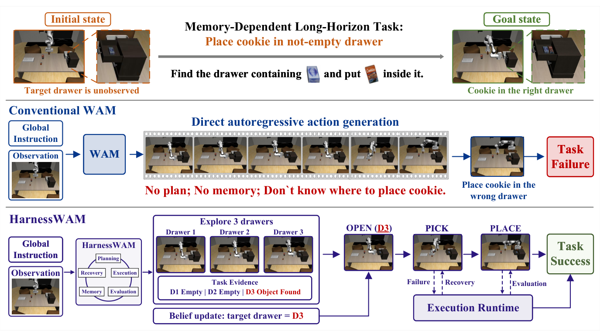
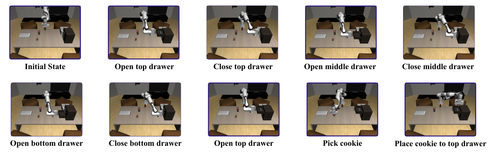

---
tags:
  - papers/worldmodel
  - papers/embodied-ai
  - papers/robotics
aliases:
  - HarnessWAM
  - World Action Models执行框架
arxiv_id: 2608.09516
date: 2026-08-10
---

# HarnessWAM: Bridging Prediction and Deliberation in World Action Models

## 核心信息
- 标题: HarnessWAM: Bridging Prediction and Deliberation in World Action Models
- 标题翻译: HarnessWAM：连接世界动作模型中的预测与审慎决策
- 作者: Zhaopeng Gu, Bingke Zhu, Tianxi Lin, Guibo Zhu, Yingying Chen, Kai Wang, Tingyu Yuan, Chaoyang Zhao, Zhaowen Li, Peng Su, Jinqiao Wang
- 机构: 中国科学院自动化研究所；中国科学院大学；Yinwang Intelligent Technology Co., Ltd.；北京智源人工智能研究院；武汉人工智能研究院
- 发表时间: 2026-08-10（arXiv v1）
- 发表渠道: arXiv，cs.RO
- arXiv: 2608.09516v1
- 论文链接: https://arxiv.org/abs/2608.09516
- 代码 / 项目: 论文未报告公开代码仓库
- 数据 / 资源: RoboMemArena；RoboCerebra Ideal；LingBot-VA检查点
- 论文类型: 世界动作模型（WAM）的模型外智能体编排框架

## 原文摘要翻译
世界动作模型（World Action Models，WAM）联合学习环境动力学与机器人动作，从而为具身控制引入比纯策略演化更丰富的先验。然而，对于需要全局规划、跨阶段状态维护、执行验证与失败恢复的复杂具身任务，有限时域预测和动作生成仍然不足。本文将这种不匹配称为 WAM 的“预测—审慎决策鸿沟”。为解决这一鸿沟，作者提出 HarnessWAM，一个面向 WAM 的智能体框架。HarnessWAM 使用视觉—语言模型驱动的任务管理器维护证据支撑的场景信念与结构化任务图。随后，能力条件化的可执行空间投影把开放式语义计划约束为满足任务依赖、具身状态约束以及底层 WAM 能力边界的动作技能序列。在执行过程中，HarnessWAM 通过事件驱动的双时间尺度反馈回路运行：轻量级进度估计器持续提供高频执行证据，而任务管理器在关键里程碑处联合考虑当前观测、任务状态和交互历史，以决定是否推进任务、获取额外观测、修改计划或启动局部恢复。该机制使机器人能够在积累的场景知识上恢复局部失败，并继续执行经过修订的计划，而不必丢弃已经获得的场景知识。HarnessWAM 在 RoboMemArena 上取得了 59.6% 的全任务成功率和 69.9% 的子任务成功率，在 RoboCerebra Ideal 上取得了 23.7% 的成功率并达到当前最佳。结果说明，模型外的结构化状态维护与闭环智能体决策能够有效弥合 WAM 与具身任务执行之间的鸿沟，使执行过程具有可规划、可验证和可恢复性。[p. 1, Abstract]

## 创新点
1. **把 WAM 的问题重新表述为“预测—审慎决策鸿沟”。** 论文不再把 WAM 只看成由观测到动作块的控制器，而是明确指出：短时域预测可以完成局部技能，却不能独立承担跨阶段记忆、证据累积、全局验证和失败恢复。[p. 1, Introduction]
2. **证据支撑的任务状态与任务图。** 场景事实显式区分“已观测”“推断”和“未知”，并把任务记忆拆成任务记忆与证据记忆；任务图同时包含运动节点和认知节点，使信息获取本身成为计划的一部分。[pp. 5–6, §3.2]
3. **能力条件化的可执行空间投影。** VLM 产生的开放词汇计划要经过操作类型、参数、依赖、前置—效果、绑定和具身状态约束，再编译成当前 WAM 真正支持的技能序列；这是从语义对齐走向执行接口对齐的关键步骤。[p. 6, §3.3, Eq. (9)–(13)]
4. **事件驱动的双时间尺度闭环。** WAM 和轻量级进度估计器在快速回路中工作，VLM 任务管理器只在进度里程碑或执行条件变化时触发慢速决策，避免每个环境步都调用大模型。[pp. 6–8, §3.4–3.6]
5. **把局部恢复嵌入同一控制回路。** 恢复保存执行前的关节与夹爪状态，只重置具身状态而保留环境、信念与历史证据；随后重试当前节点或重写未执行的图后缀。[p. 8, §3.5]

## 一句话总结
HarnessWAM 的真正贡献不是再训练一个更强的 WAM，而是在 WAM 外部加入一个“带证据记忆、可执行编译、事件触发和局部恢复”的运行时，使有限时域动作预测能够被组织成可验证的长时域任务执行。

## 研究问题
论文要回答的是：**当 WAM 只能可靠地预测近未来观测并生成局部动作块时，怎样通过模型外的运行时把这些局部能力组合成部分可观测、依赖历史、容易发生物理偏差的长时域任务？** 该问题包含四个互相牵制的子问题：

- 观察暂时不可见后，如何不把“未知”误当成“空”或“失败”？
- 语义计划中的对象、操作和顺序，如何被限制为当前 WAM 能执行的接口？
- 什么时候应该继续调用动作模型，什么时候需要慢速重规划或补充证据？
- 发生抓取偏差、碰撞或局部失败后，如何恢复而不丢失前面已经验证的状态？

图 1 用抽屉任务把问题说得很清楚：传统 WAM 直接自回归动作，无法记住哪个抽屉曾经暴露过目标；HarnessWAM 先探索并记录证据，再绑定目标抽屉，最后执行开—取—放。[p. 2, Figure 1]

## 数据与任务定义

### 任务和交互接口
给定自然语言指令 $x$、多视角 RGB 观测 $o_t=(I_t^{agent}, I_t^{wrist})$、机器人本体状态 $q_t$ 以及局部技能指令 $g_k$，WAM $W_\theta$ 生成长度为 $H$ 的动作块：

$$
A_t=W_\theta(o_{\leq t},q_t,g_k)=(a_t,\ldots,a_{t+H-1}).
$$

一次 WAM 调用只解决由 $g_k$ 定义的有限时域局部控制问题；HarnessWAM 则需要在时刻 $\tau_k$ 更新全局状态 $z_k$，并选择下一局部目标：

$$
z_k=(B_k,G_k,M_k,r_k), \qquad (z_{k+1},g_{k+1})=\mathcal H(x,z_k,o_{\tau_k},e_k).
$$

其中 $B_k$ 是场景信念，$G_k$ 是结构化任务图，$M_k$ 是任务与证据记忆，$r_k$ 是执行状态，$e_k$ 是候选事件。这个分解把“WAM 如何移动”与“系统何时继续、观察、重规划或恢复”分开。[p. 4, §3.1, Eq. (1)–(3)]

### 实验材料与协议
实验使用两个互补基准：

- **RoboMemArena**：26 个长时域机器人操作任务，平均轨迹长度 1,076 个环境步，68.9% 的子任务依赖历史信息。四类任务分别是多物体转移、遮挡、计数和顺序执行，任务数量为 4、11、7、4。[p. 9, §4.1]
- **RoboCerebra Ideal**：静态且完全可观测的理想子集，用于检验在没有遮挡记忆困难时，显式依赖规划、结果条件转换和失败适应是否仍有价值。[pp. 9–10, §4.1–4.2]

RoboMemArena 的全任务成功率是所有阶段验证谓词均满足的任务比例；子任务成功率是每个任务完成子任务比例的宏平均。RoboCerebra 使用官方协议，按关键对象状态转换的完成率计算 $SR_{RC}$。[p. 9, §4.1, Eq. (18)–(20)] 每个任务评估 20 条 rollout，改变初始状态、随机种子、观测接口和任务级执行预算；报告跨任务与 rollout 的宏平均。[p. 9, Evaluation protocol]

## 方法主线

### 机制流程
1. **初始化与开放式规划。** 任务管理器接收指令和当前观测，建立场景信念 $B$、任务记忆 $M$，并生成包含信息获取、物理操作、验证与恢复节点的开放词汇任务图 $G^{vlm}$。[pp. 4–6, §3.1–3.2]
2. **执行空间编译。** 投影器把任务图中的语义操作映射到当前 WAM 的能力集合 $\mathcal P_W$，检查参数类型、依赖、绑定、前置—效果一致性、单臂状态和图无环性，输出 WAM 可执行图 $G^{exec}$；若不存在可行投影，则要求任务管理器重规划。[p. 6, §3.3]
3. **快回路执行与进度触发。** WAM 依据当前局部指令反复生成动作块；进度估计器从最近 $L$ 个双视角 RGB 帧和局部指令预测连续进度、阶段完成概率和进度区间。进度耗尽、条件或绑定变化、技能预算耗尽都会产生事件。[pp. 6–7, Eq. (14)–(15)]
4. **慢回路决策、恢复与终止。** 在事件触发处，任务管理器联合观测、进度历史、场景信念、任务图、证据记忆和执行状态，选择继续、推进、观察、重规划、恢复或终止；恢复时回到保存的关节—夹爪状态并只重写未执行后缀，最终由全局目标验证决定成功或失败。[pp. 7–8, Algorithm 1; §3.5]

### 证据支撑的场景信念
每个场景事实表示为

$$
f=(s,p,o,v,\eta,c,E),
$$

其中 $s,p,o,v$ 分别是主语、谓词、对象和值；$\eta\in\{observed,inferred,unknown\}$ 标记信息来源；$c$ 是置信度；$E$ 是支持该事实的 RGB 证据。关键设计是“未知不等于假”：抽屉关闭后目标不可见，系统保留此前已经确认的目标事实，而不是因当前图像没有目标就删除它。[p. 5, §3.2, Eq. (4)]

任务记忆进一步写为

$$
M_k=(M_k^{task},M_k^{evidence}),
$$

前者存完成/失败节点、重试次数、变量绑定和计划修订历史，后者存与关键任务事件关联的视觉证据。任务管理器只在事件处调用 VLM 更新 $(B_k,M_k)$，这样长交互历史被压缩成可查询的状态，而不是每次从长视频上下文中隐式重建。[p. 5, Eq. (5)–(6)]

任务图 $G_k=(V_k,E_k,X_k,\beta_k)$ 包含节点、依赖边、未解析变量和变量到场景实体的部分绑定。节点

$$
v_i=(op_i,arg_i,pre_i,eff_i,term_i,rec_i)
$$

同时编码操作、类型化参数、前置条件、预期效果、终止条件和恢复策略；运动节点产生物理动作，认知节点获取观测、绑定变量或更新记忆。[p. 5, §3.2, Eq. (7)–(8)] 这使“先打开所有抽屉再决定目标”不再是隐含的语言模型常识，而是图中的信息获取与条件分支。

### 能力条件化的可执行空间投影
作者把参数化操作的开放本体写成

$$
\mathcal P^*=\mathcal P_{motion}\cup\mathcal P_{grasp}\cup\mathcal P_{contact}\cup\mathcal P_{articulation}\cup\mathcal P_{assembly}\cup\mathcal P_{tool}.
$$

但某个 WAM 的真正可用集合只是

$$
\mathcal P_W=\{p\in\mathcal P^*\mid p\text{ 在 }W_\theta\text{ 下具有经过验证的实现}\}.
$$

于是开放式任务图通过

$$
G_k^{exec}=\Pi_{\mathcal P_W\cap\mathcal F(z_k)}(G_k^{vlm})
$$

投影到当前能力和状态允许的可行集合。确定性计划编译器检查：参数类型；节点依赖；前置—效果一致性；单臂持有状态；图的无环性；以及对象绑定。例如，`PLACE(object,target)` 要求该对象已经被获取，`POUR(object,target)` 要求机器人持有对象且对象状态满足约束。[pp. 6–7, §3.3, Eq. (9)–(13)]

这一层不是普通的动作名称归一化。表 4 显示，原始 VLM 计划的语法、依赖满足、对象绑定和可执行性分别只有 60.8%、58.1%、21.3% 和 13.8%；加入规范化与别名解析后升至 84.6%、67.5%、63.8% 和 42.3%；完整可执行空间投影进一步升至 95.2%、92.9%、88.3% 和 72.9%。[p. 11, Table 4] 因而投影器修复的不只是“词不一样”，更是对象绑定、状态转换和 WAM 接口之间的结构性不一致。

### 进度条件化的事件控制
在快速回路中，进度估计器

$$
(p_t,c_t,\pi_t^{bin})=F_\phi(o_{t-L+1:t},g_k)
$$

输出连续进度 $p_t$、阶段完成概率 $c_t$ 和离散进度区间 $\pi_t^{bin}$。训练损失由连续回归、区间分类、时间排序、轨迹端点、阶段完成和局部单调性六项组成：

$$
\mathcal L_{prog}=\lambda_r\mathcal L_{reg}+\lambda_b\mathcal L_{bin}+\lambda_r\mathcal L_{rank}+\lambda_e\mathcal L_{endpoint}+\lambda_s\mathcal L_{success}+\lambda_m\mathcal L_{mono}.
$$

这里的价值在于把每个环境步的视觉变化压缩为少量语义事件；任务管理器不需要被瞬时图像抖动频繁打断。[p. 7, §3.4, Eq. (14)–(15)] 论文没有报告六项损失的具体权重、进度数据集大小或每类事件的触发频率，这些是复现时的实质缺口。

### 事件决策与局部恢复
在事件 $e_k$ 发生时，任务管理器接收

$$
y_k=(\nu_k,d_k,\Delta B_k,\Delta\beta_k,\rho_k)
=\mathcal T_{VLM}(x,o_{\tau_k},B_k,G_k,M_k,r_k,s_k^{prog},e_k).
$$

其中 $d_k$ 属于继续、推进、观察、重规划、恢复和终止；$\Delta B_k$ 与 $\Delta\beta_k$ 更新信念及变量绑定；$\rho_k$ 指示未执行计划是否需要修改。[p. 7, §3.4, Eq. (16)]

每个运动节点开始时保存关节状态 $q_k^0$ 与夹爪状态 $u_k^0$。发生失败后，系统通过多步控制回到

$$
(q_t,u_t)\xrightarrow{recover}(q_k^0,u_k^0),
$$

随后重试当前节点，或只修订尚未执行的图后缀。环境、场景信念和已积累证据不被清空，因此恢复不是“整条轨迹重来”，而是把失败局部化。[p. 8, §3.5, Eq. (17)]

## 关键结果

### 主结果与强基线

| 方法 | RoboMemArena全任务 | RoboMemArena子任务 | RoboCerebra Ideal |
|---|---:|---:|---:|
| PrediMem | 38.5 | 55.2 | — |
| WAM + Whole Task | 44.4 | 52.3 | — |
| WAM + Static Plan | 47.9 | 62.0 | — |
| GPT-4o Planner + OpenVLA | — | — | 21.92 |
| HPE Framework | — | — | 21.10 |
| **HarnessWAM** | **59.6** | **69.9** | **23.70** |

RoboMemArena 的完整 Table 1 还显示 HarnessWAM 在 Transfer、Occlusion、Counting、Sequence 四类任务上的全任务成功率为 21.3%、55.0%、73.6%、86.3%，子任务成功率为 31.5%、63.9%、88.2%、93.0%。[p. 10, Table 1] 相对于 WAM + Static Plan，平均全任务成功率提升 11.7 个百分点，子任务成功率提升 7.9 个百分点；相对于 PrediMem，分别提升 21.1 和 14.7 个百分点。[p. 10, §4.2]

更有解释力的是任务族差异：相对 WAM + Static Plan，遮挡任务全任务成功率提升 16.8 个百分点，子任务成功率提升 12.5 个百分点；Transfer 任务的子任务成功率提升 14.8 个百分点，但 Counting 的子任务成功率下降 1.9 个百分点而全任务成功率上升 6.4 个百分点。[p. 10, §4.2] 这说明框架最擅长处理“必须保留跨阶段证据”的任务，不代表所有局部计数能力都同步增强。

RoboCerebra Ideal 上 HarnessWAM 达到 23.70%，比 GPT-4o Planner + OpenVLA 高 1.78 个百分点，比 HPE Framework 高 2.60 个百分点。由于该子集静态且完全可观测，这个增益不能只归因于记忆；它更支持依赖感知规划、结果条件转换和失败适应对长时域组合仍有贡献。[p. 10, §4.2]

### 消融到底说明了什么

| 变体 | 全任务平均 | 子任务平均 | 相对完整系统的主要含义 |
|---|---:|---:|---|
| HarnessWAM | 59.6 | 69.9 | 完整系统 |
| 去除任务状态 | 47.7 | 61.1 | 跨阶段状态与历史证据重要 |
| 去除可执行投影 | 18.5 | 38.3 | 执行接口约束是最大贡献项 |
| 去除进度事件 | 38.3 | 50.7 | 固定频率审慎决策不足以替代事件触发 |
| 仅进度切换 | 55.4 | 68.4 | 本地进度不能替代语义验证 |
| 去除恢复 | 54.2 | 67.7 | 局部恢复主要保护长剩余后缀 |

[p. 11, Table 3] 去除可执行空间投影后，全任务成功率从 59.6% 降至 18.5%，子任务成功率从 69.9% 降至 38.3%，是最大幅度下降。去除任务状态的下降为 11.9 和 8.8 个百分点；去除进度事件的下降为 21.3 和 19.2 个百分点；去除恢复的下降较小，但在 Sequence 任务上损失最大，因为一次未恢复的局部失败可能破坏很长的剩余后缀。[p. 11, §4.3]

“仅进度切换”保留了 55.4% 的全任务成功率，明显高于“去除进度事件”的 38.3%，但仍低于完整系统。这一对照把两层职责分开：进度估计器适合判断本地技能是否结束，任务管理器仍需要语义证据去验证阶段效果、更新绑定和决定是否重规划。[p. 11, §4.3]

### 代表性轨迹

图 1 的抽屉案例是框架必要性的最小反例：目标抽屉在初始观测中不可判定，直接动作生成会把饼干放进错误抽屉；HarnessWAM 通过“探索三个抽屉—保留证据—绑定目标—开、取、放”解决跨阶段依赖。[p. 2, Figure 1]

图 2 把系统划分为 VLM 任务管理器、证据支撑任务状态、可执行空间投影、WAM 和执行运行时五个相互作用的部分。其核心不是增加一个孤立的规划模块，而是让状态更新、计划编译、动作执行和事件处理共享同一控制环。[p. 4, Figure 2]

图 3 展示机器人依次打开并关闭顶部、中部和底部抽屉，在目标抽屉被遮挡后仍保留“非空”证据；探索结束后重新打开目标抽屉，抓取饼干并放回其中。[p. 12, Figure 3]

## 深度分析

### 真正贡献是什么

从算法层面看，最有价值的贡献是**把 WAM 的有限时域控制能力包进一个可验证运行时**。WAM 本身仍然负责从多视角 RGB、机器人状态和局部技能指令生成动作块；论文并没有证明它改进了 WAM 的视觉预测、动作生成或物理模型。新增能力来自四种外部约束的组合：状态持久化、计划可执行性、事件触发和恢复边界。[pp. 4–8, §3]

其中可执行空间投影是最像“必要算法”的部分。表 4 的 13.8% 原始可执行性说明，开放式 VLM 计划与具体 WAM 接口之间存在巨大鸿沟；完整投影把它推到 72.9%，并且 Table 3 显示任务级收益最大。因此论文真正证明的是：在当前 WAM 能力较窄、任务依赖较强时，先把语义计划编译成可执行技能，比单纯给 WAM 更长的全局提示更可靠。[pp. 10–11, Tables 3–4]

### 为什么结果成立

1. **任务状态降低了部分可观测性造成的信息遗忘。** 遮挡任务增益最大，且去除任务状态在所有任务族均下降，符合“已观测事实不因暂时不可见而消失”的设计。[pp. 5, 10–11]
2. **投影器把错误从执行期提前到计划期。** 参数、依赖和绑定在动作执行前被检查，减少了“语言上合理、接口上不可执行”的计划；表 4 的依赖满足和绑定准确率提升正好支持这一因果链。[p. 11, Table 4]
3. **事件驱动控制减少无效慢决策，同时保留语义检查。** 固定频率调用或只用本地进度都不如完整系统，说明触发时机和触发内容缺一不可。[p. 11, Table 3]
4. **恢复的收益依赖剩余任务长度。** 平均下降只有 5.4 和 2.2 个百分点，但 Sequence 任务受损最大，说明恢复不是普遍提升局部技能成功率，而是在失败后保护未执行后缀。[p. 11, §4.3]

### 容易误读的地方

- “当前最佳”只在论文列出的 RoboMemArena 与 RoboCerebra Ideal 对比中成立；基准规模小，且论文没有给出统计置信区间或显著性检验。[pp. 9–10]
- RoboCerebra Ideal 是静态、完全可观测子集，不能直接证明 HarnessWAM 在真实噪声、动态遮挡或多机器人场景中具有同等优势。[p. 9]
- 进度估计器被描述为轻量级，但实现细节不足：未给出参数量、推理时延、训练样本规模和事件触发成本，因此“双时间尺度”带来的计算收益尚未被定量证明。[p. 7, §3.4; p. 9, Models and implementation details]
- 任务管理器依赖 Qwen3-VL-32B-Instruct，论文未报告提示词全文、上下文长度、调用次数、失败重试成本或运行总预算。结果可能对大规模视觉—语言模型的提示设计敏感。[p. 9]
- 表 4 的计划质量比较使用离线参考分解，而且明确不把参考分解提供给 HarnessWAM；这能诊断接口错配，但不是端到端执行成功率的独立测试。[p. 11, §4.3]
- “可验证、可恢复”在本文中主要表示任务图谓词、事件决策和本体状态恢复，不等于对物理世界状态有完整真值估计，也不等于安全认证。[pp. 7–8]

### 复现注意点

- **底层模型。** 所有比较和消融共享同一 LingBot-VA 检查点；因此主要比较的是模型外编排，而非不同 WAM 训练质量。[p. 9]
- **输入限制。** WAM 接收 $256\times256$ 的 agent-view 与 wrist-view RGB 图像及机器人状态；任务管理器只使用多视角 RGB，不使用深度、分割标签或特权模拟器状态。[p. 9]
- **任务管理器。** 使用 Qwen3-VL-32B-Instruct，且没有针对任务的微调；必须获取实际系统提示、输出 schema、采样参数和事件上下文拼接方式才能复现。[p. 9]
- **进度估计器。** 冻结 SigLIP2-base-patch16-256，后接四层因果 Transformer；用双视角 RGB 序列和当前技能指令输入。训练/验证按 episode 划分，并选择验证进度误差最低的检查点。[p. 9]
- **评估。** 每个任务 20 条 rollout，改变初始状态、随机种子、观测接口和任务预算；不能用预设切换时间，终止必须由执行证据决定。[p. 9]
- **未报告项。** 论文没有公开代码仓库、完整提示词、投影本体的具体操作表、技能验证数据、恢复控制器参数、运行硬件、总推理时延和成本。以上缺口使独立复现实验而非只复刻概念仍然困难。

## 局限

1. **能力边界依赖人工或经验验证。** $\mathcal P_W$ 的定义要求“在 WAM 下有经过验证的实现”，但验证流程和技能库没有展开。投影器的可靠性可能来自未公开的工程先验，而不是完全自动的能力发现。[p. 6, Eq. (11)]
2. **感知错误仍可能污染记忆。** 证据记忆保留历史事实可以防止遗忘，却也会把早期错误识别持久化；论文没有给出错误证据撤销、冲突消解或置信度校准实验。[p. 5, §3.2]
3. **评估覆盖窄。** 只有两个基准，且一个有 26 个任务、另一个是理想子集；没有真实机器人、不同 WAM、动态环境、长时间运行或安全约束实验。[p. 9]
4. **恢复只覆盖局部具身状态。** 回到关节和夹爪状态并不保证物体姿态、接触力、环境可逆性被恢复；对于不可逆操作，恢复策略可能只能重规划而不能回滚。[p. 8, §3.5]
5. **统计报告不足。** 论文给出百分比和消融差异，但没有每个任务的方差、置信区间、失败类型分布或显著性检验，难以判断小幅增益（例如 RoboCerebra 的 1.78 个百分点）是否稳健。[pp. 10–11]

## 我的笔记

### 可迁移洞察

- 对任何“预测模型 + 长时域任务”的系统，都应把**局部预测器**与**全局运行时**分开设计：前者负责短视控制，后者负责状态、证据、验证和策略边界。
- 在具身智能中，计划的关键质量指标不应只有语言合理性；应同时测量语法、依赖满足、对象绑定、状态转换和可执行性。表 4 提供了一个比单一成功率更接近接口故障的诊断框架。[p. 11]
- “未知”是状态变量而不是负面标签。只要观测会被遮挡或动作会改变可见性，就需要把未观测、推断和已观测事实分开，否则记忆系统会系统性地把暂时不可见误判为不存在。[p. 5]
- 事件驱动并不等于低频调用。更稳健的模式是高频轻量监测负责发现事件，低频语义模块负责解释事件和决定后缀；二者职责不能由任一单层完全替代。[pp. 6–7]
- 恢复应定义清楚边界：哪些状态必须回滚，哪些证据必须保留，哪些图节点可以重试，哪些失败会使任务不可恢复。HarnessWAM 的“只重置具身状态、不清空任务记忆”是适合迁移到工具使用智能体和多阶段规划器的模板。[p. 8]

### 对后续研究的直接问题

1. 如果把 Qwen3-VL-32B-Instruct 替换为更小的视觉—语言模型，投影器和结构化状态能否保持大部分收益？
2. 能否用可学习的能力验证与技能成功模型自动构建 $\mathcal P_W$，减少人工技能库依赖？
3. 如何对证据记忆做冲突检测、时间衰减和主动再验证，避免错误事实长期污染？
4. 事件触发是否可以用不确定性、信息增益或预算约束联合决定，而不只依赖进度估计和条件变化？
5. 在真实机器人上，物体状态不可逆、接触力不可观测时，如何把“恢复”从关节回滚扩展为风险感知的替代计划？

## 引用

Gu, Zhaopeng, Bingke Zhu, Tianxi Lin, Guibo Zhu, Yingying Chen, Kai Wang, Tingyu Yuan, Chaoyang Zhao, Zhaowen Li, Peng Su, and Jinqiao Wang. “HarnessWAM: Bridging Prediction and Deliberation in World Action Models.” arXiv:2608.09516v1 [cs.RO], 10 Aug. 2026. https://arxiv.org/abs/2608.09516
