# Hierarchical Denoising For Multi-Step Visual Reasoning

## Paper Metadata

> <strong>Para. 1:</strong> **Hierarchical Denoising For Multi-Step Visual Reasoning**

> <strong>Para. 1[CN]:</strong> **用于多步视觉推理的分层去噪**

> <strong>Para. 2:</strong> Zezhong Qian$^{1,6}$, Xiaowei Chi$^{2,6}$, Chak-Wing Mak$^{1,6}$, Tianze Zhou$^{3,6}$, Ruibin Yuan$^{2,5}$, Yuhan Rui$^{1,6}$, Hengzhe Sun$^{1}$, Zhuoqun Wu$^{4}$, Yuming Li$^{1}$, Siyuan Qian$^{1}$, Sirui Han$^{2}$, Shanghang Zhang$^{1}$

> <strong>Para. 2[CN]:</strong> Zezhong Qian（钱泽众）$^{1,6}$、Xiaowei Chi（迟晓伟）$^{2,6}$、Chak-Wing Mak（麦泽荣）$^{1,6}$、Tianze Zhou（周天泽）$^{3,6}$、Ruibin Yuan（袁睿彬）$^{2,5}$、Yuhan Rui（芮宇涵）$^{1,6}$、Hengzhe Sun（孙恒哲）$^{1}$、Zhuoqun Wu（吴卓群）$^{4}$、Yuming Li（李宇明）$^{1}$、Siyuan Qian（钱思远）$^{1}$、Sirui Han（韩思睿）$^{2}$、Shanghang Zhang（张尚航）$^{1}$

> <strong>Para. 3:</strong> $^{1}$State Key Laboratory of Multimedia Information Processing, School of Computer Science, Peking University  
> $^{2}$The Hong Kong University of Science and Technology  
> $^{3}$Beihang University  
> $^{4}$Fuzhou University  
> $^{5}$Multimodal Art Projection  
> $^{6}$Muka Robotics

> <strong>Para. 3[CN]:</strong> $^{1}$北京大学计算机学院多媒体信息处理全国重点实验室  
> $^{2}$香港科技大学  
> $^{3}$北京航空航天大学  
> $^{4}$福州大学  
> $^{5}$Multimodal Art Projection  
> $^{6}$Muka Robotics

> <strong>Para. 4:</strong> arXiv:2607.15278v1 [cs.CV], 16 Jul 2026. 40th Conference on Neural Information Processing Systems (NeurIPS 2026).

> <strong>Para. 4[CN]:</strong> arXiv:2607.15278v1 [cs.CV]，2026 年 7 月 16 日。第 40 届神经信息处理系统会议（NeurIPS 2026）。

## Page / Section Index

| Source pages | Content |
|---|---|
| 1 | Metadata, Abstract, Introduction opening |
| 2–3 | Introduction and Related Work |
| 4–6 | Method and experimental setup |
| 7–10 | Main experiments and Conclusion |
| 11–14 | References [1]–[41] |
| 15–16 | Appendix A: HDR-WAM Details |
| 16–18 | Appendix B: Benchmark and Eval Details |
| 19 | Appendix C: Entropy-Matched Hierarchies |
| 20 | Appendix D: Time Complexity Analysis |

## Terminology Ledger

| Canonical term | 中文译法 | Usage decision |
|---|---|---|
| HDR (Hierarchical Denoising for Visual Reasoning) | 面向视觉推理的分层去噪 | 首次展开，后续保留 HDR |
| SHAP (Sparse Hierarchical Attention Pattern) | 稀疏分层注意力模式 | 保留缩写 SHAP |
| streaming autoregressive diffusion | 流式自回归扩散 | 全文统一 |
| bidirectional diffusion | 双向扩散 | 全文统一 |
| hierarchical latent tree | 分层潜变量树 | 指树状多尺度表示 |
| flow matching | 流匹配 | 公式与目标名称统一 |
| KV cache | KV 缓存 | 保留技术缩写 |
| average progress | 平均进度 | 与 success（成功分数）并列 |
| out-of-distribution (OOD) | 分布外（OOD） | 首次展开，后续保留 OOD |
| world-action modeling (WAM) | 世界—动作建模（WAM） | 保留 WAM/HDR-WAM |

## Abstract

> <strong>Para. 1:</strong> Video models are recently evolving into vision foundation models, but they still lack human-like, multi-step reasoning. Existing streaming autoregressive diffusion models are efficient but lack the reasoning ability, whereas bidirectional diffusion allows for global revision but incurs high inference cost due to the dense frames in fixed-sequence denoising. Consequently, both paradigms struggle to maintain logical consistency with low-latency streaming in complex reasoning tasks. Bridging this gap, we propose **HDR (Hierarchical Denoising for Visual Reasoning)**, a unified framework for multi-step reasoning by integrating hierarchical latents into the causal video generation process. HDR organizes video latents into a tree-structured hierarchy to perform coarse-to-fine reasoning before streaming output. Coarse denoising layers maintain uncertain hypotheses for global planning, while finer denoising layers progressively refine them into concrete visual states. A sparse hierarchical attention pattern (**SHAP**) further reduces temporal attention cost. We construct a level-stratified multi-step video reasoning benchmark with out-of-distribution cases, covering six tasks: *maze navigation, Tower of Hanoi, one-line drawing, sliding puzzle, Sokoban,* and *water pouring*. Compared with the streaming autoregressive diffusion baseline, HDR improves overall success from 34.22 to 60.29 (76.2% relative gain) in multi-step reasoning accuracy, and improves average progress from 76.00 to 89.56, indicating more consistent intermediate reasoning trajectories. For deployment efficiency, HDR maintains low-latency streaming at 0.70s per latent, 54.2× faster than bidirectional diffusion during streaming. HDR also demonstrates strong data efficiency, retaining 82.9% of its full-data success score using only 2% of the training data, compared with 52.0% for bidirectional diffusion. Further experiments on real-world robots showcase the potential of HDR in physical interaction, providing a new paradigm for physical world modeling. Project demo page is available at https://hierarchical-diffusion-reasoning.github.io/.

> <strong>Para. 1[CN]:</strong> 近期，视频模型正逐渐演变为视觉基础模型，但它们仍然缺乏类人的多步推理能力。现有的流式自回归扩散模型效率较高，却缺乏推理能力；双向扩散虽然允许进行全局修正，但由于需要对固定序列中的密集帧执行去噪，其推理成本很高。因此，在复杂推理任务中，这两种范式都难以在低延迟流式生成的同时保持逻辑一致性。为弥合这一差距，我们提出 **HDR（Hierarchical Denoising for Visual Reasoning，面向视觉推理的分层去噪）**：一种将分层潜变量整合到因果视频生成过程中、用于多步推理的统一框架。HDR 将视频潜变量组织成树状层级，在流式输出之前执行由粗到细的推理。粗粒度去噪层保留用于全局规划的不确定假设，而更细粒度的去噪层则逐步将其细化为具体的视觉状态。稀疏分层注意力模式（**SHAP**）进一步降低了时间注意力成本。我们构建了一个按层级分层、包含分布外案例的多步视频推理基准，涵盖六项任务：*迷宫导航、汉诺塔、一笔画、滑块拼图、推箱子*和*倒水*。与流式自回归扩散基线相比，HDR 的多步推理总体成功分数从 34.22 提升至 60.29（相对提升 76.2%），平均进度从 76.00 提升至 89.56，表明其中间推理轨迹更为一致。在部署效率方面，HDR 保持了每个潜变量 0.70 秒的低延迟流式生成速度，比双向扩散的流式生成快 54.2 倍。HDR 还表现出很强的数据效率：仅使用 2% 的训练数据时，仍能保留全量数据成功分数的 82.9%，而双向扩散只能保留 52.0%。在真实机器人上的进一步实验展示了 HDR 在物理交互中的潜力，为物理世界建模提供了一种新范式。项目演示页面：https://hierarchical-diffusion-reasoning.github.io/。

# 1 Introduction

> <strong>Para. 1:</strong> Video models are evolving from realistic video synthesizers into generalist visual foundation models capable of visual reasoning [27, 26, 25, 28, 39, 37, 13]. Recent work such as Veo3 [27] showed that large video generation models can solve tasks such as maze navigation, symmetry completion, physical reasoning, and tool-use simulation through generated visual trajectories. Complementarily, recent analysis of diffusion-based video reasoning suggests that such reasoning is closely tied to intermediate denoising states, where the model can maintain and refine candidate solutions over multiple steps [26]. These findings raise a key question: how can video models support reliable multi-step reasoning while still enabling low-latency streaming generation?

> <strong>Para. 1[CN]:</strong> 视频模型正从逼真的视频合成器演变为能够进行视觉推理的通用视觉基础模型 [27, 26, 25, 28, 39, 37, 13]。Veo3 [27] 等近期工作表明，大型视频生成模型能够通过生成视觉轨迹来解决迷宫导航、对称补全、物理推理和工具使用模拟等任务。与此同时，近期对基于扩散的视频推理的分析表明，这种推理与中间去噪状态密切相关；模型可以在这些状态中跨多个步骤保留并细化候选解 [26]。这些发现引出了一个关键问题：视频模型如何在实现低延迟流式生成的同时，支持可靠的多步推理？

**Caption:** Figure 1: Comparison of video generation paradigms.** Streaming autoregressive diffusion models are efficient but commit too early for reliable multi-step reasoning, while bidirectional diffusion supports global revision but requires costly dense fixed-sequence denoising. HDR performs hierarchical denoising before streaming output: coarse layers maintain high-level hypotheses, finer layers refine them into visual states, and sparse hierarchical attention keeps generation efficient.

**Caption[CN]:** 图 1：视频生成范式对比。** 流式自回归扩散模型效率较高，但为了可靠地进行多步推理，它们过早地作出了承诺；双向扩散支持全局修正，却需要代价高昂的密集固定序列去噪。HDR 在流式输出之前执行分层去噪：粗粒度层保留高层假设，细粒度层将这些假设细化为视觉状态，而稀疏分层注意力则维持生成效率。

**Caption:** Comparison of video generation paradigms.

**Caption[CN]:** 视频生成范式对比。

> <strong>Para. 2:</strong> **Figure 1: Comparison of video generation paradigms.** Streaming autoregressive diffusion models are efficient but commit too early for reliable multi-step reasoning, while bidirectional diffusion supports global revision but requires costly dense fixed-sequence denoising. HDR performs hierarchical denoising before streaming output: coarse layers maintain high-level hypotheses, finer layers refine them into visual states, and sparse hierarchical attention keeps generation efficient.

> <strong>Para. 2[CN]:</strong> **图 1：视频生成范式对比。** 流式自回归扩散模型效率较高，但为了可靠地进行多步推理，它们过早地作出了承诺；双向扩散支持全局修正，却需要代价高昂的密集固定序列去噪。HDR 在流式输出之前执行分层去噪：粗粒度层保留高层假设，细粒度层将这些假设细化为视觉状态，而稀疏分层注意力则维持生成效率。

> <strong>Para. 3:</strong> Existing video generation paradigms struggle to satisfy both multi-step reasoning and low-latency streaming. Streaming autoregressive diffusion models, such as CausVid [34] and CausalForcing [41], generate efficiently by conditioning each step only on past context, but this left-to-right commitment limits their ability to revise previous decisions and perform multi-step reasoning [30, 4, 9, 16]. In contrast, bidirectional diffusion models jointly denoise a fixed video sequence, allowing global information flow and revision across time [20, 24, 27]. However, this requires dense full-sequence updates at every denoising step, leading to high deployment cost and poor compatibility with streaming generation [34, 5, 2, 21]. These limitations reveal a fundamental tension: current models either generate efficiently but struggle with logical consistency over multiple steps, or reason globally at the cost of high-latency fixed-sequence denoising.

> <strong>Para. 3[CN]:</strong> 现有视频生成范式难以同时满足多步推理和低延迟流式生成的要求。CausVid [34] 和 CausalForcing [41] 等流式自回归扩散模型仅以过去的上下文为条件生成每一步，因此效率较高；但这种从左到右的承诺限制了它们修正先前决策和执行多步推理的能力 [30, 4, 9, 16]。相比之下，双向扩散模型对固定视频序列进行联合去噪，从而允许信息在时间维度上全局流动和修正 [20, 24, 27]。然而，这要求在每个去噪步骤都对整个序列进行密集更新，导致部署成本高昂，并且难以兼容流式生成 [34, 5, 2, 21]。这些局限揭示出一种根本矛盾：当前模型要么能够高效生成，却难以在多个步骤中保持逻辑一致性；要么能够进行全局推理，却要付出高延迟固定序列去噪的代价。

> <strong>Para. 4:</strong> Motivated by this observation, we propose **HDR (Hierarchical Denoising for Visual Reasoning)**, a unified framework that integrates hierarchical latents into the streaming autoregressive diffusion process. As illustrated in Figure 1, HDR organizes video latents into a tree-structured hierarchy and performs coarse-to-fine multi-step reasoning before streaming output. This hierarchy gives the model an explicit intermediate space for high-level planning before it commits to frame-level generation.

> <strong>Para. 4[CN]:</strong> 受这一观察启发，我们提出 **HDR（Hierarchical Denoising for Visual Reasoning，面向视觉推理的分层去噪）**，这是一个将分层潜变量整合到流式自回归扩散过程中的统一框架。如图 1 所示，HDR 将视频潜变量组织成树状层级，并在流式输出之前进行由粗到细的多步推理。这一层级结构为模型提供了显式的中间空间，使其能够在承诺进行帧级生成之前完成高层规划。

> <strong>Para. 5:</strong> A key design of HDR is to match denoising strength to hierarchy level. Instead of fully denoising every layer, HDR keeps coarse layers at higher noise levels so they can preserve multiple possible global plans, while finer layers receive stronger denoising and lower residual noise to instantiate these plans into concrete visual states. HDR further introduces **SHAP (Sparse Hierarchical Attention Pattern)**, which lets each token communicate only with fixed local and parent-level contexts for fast retrieval. This enables multi-scale information flow without dense full-sequence attention, reducing temporal attention cost while preserving streaming generation.

> <strong>Para. 5[CN]:</strong> HDR 的一项关键设计是使去噪强度与层级相匹配。HDR 并不会对每一层进行完全去噪，而是让粗粒度层保持较高的噪声水平，以保留多种可能的全局规划；细粒度层则接受更强的去噪并保留更少的残余噪声，从而将这些规划实例化为具体的视觉状态。HDR 还引入了 **SHAP（Sparse Hierarchical Attention Pattern，稀疏分层注意力模式）**，使每个 token 仅与固定的局部上下文和父层级上下文通信，以便快速检索。这使多尺度信息能够流动，而无需对整个序列进行密集注意力计算，从而在保留流式生成能力的同时降低时间注意力成本。

> <strong>Para. 6:</strong> We construct a level-stratified multi-step video reasoning benchmark with out-of-distribution cases, covering six tasks: *maze navigation, Tower of Hanoi, one-line drawing, sliding puzzle, Sokoban,* and *water pouring*. These tasks require models to maintain logical consistency across multi-step reasoning trajectories rather than merely generating locally plausible motion. Experiments show that HDR substantially improves both final task completion and intermediate reasoning consistency: it improves the overall success score from 34.22 to 60.29 (76.2% relative gain), and increases the overall average progress score from 76.00 to 89.56. HDR also preserves efficient streaming behavior, achieving 0.70s per latent during streaming, 54.2× faster than bidirectional diffusion. In addition, HDR demonstrates strong data efficiency, retaining 82.9% of its full-data success score when trained with only 2% of the data, compared with 52.0% for bidirectional diffusion. Finally, real-world robot maze experiments show that HDR can transfer its hierarchical reasoning ability to physical interaction, suggesting its potential as a new paradigm for physical world modeling.

> <strong>Para. 6[CN]:</strong> 我们构建了一个按层级分层、包含分布外案例的多步视频推理基准，涵盖六项任务：*迷宫导航、汉诺塔、一笔画、滑块拼图、推箱子*和*倒水*。这些任务要求模型在多步推理轨迹中保持逻辑一致性，而不只是生成局部看似合理的运动。实验表明，HDR 显著提升了最终任务完成能力和中间推理一致性：总体成功分数从 34.22 提升至 60.29（相对提升 76.2%），总体平均进度分数从 76.00 提升至 89.56。HDR 还保留了高效的流式行为，在流式生成期间达到每个潜变量 0.70 秒，比双向扩散快 54.2 倍。此外，HDR 表现出很强的数据效率：仅使用 2% 的数据进行训练时，仍保留全量数据成功分数的 82.9%，而双向扩散仅为 52.0%。最后，真实世界机器人迷宫实验表明，HDR 可以将其分层推理能力迁移到物理交互中，显示出其作为物理世界建模新范式的潜力。

> <strong>Para. 7:</strong> Our contributions can be summarized as follows:  
> • We identify the core tension in multi-step video reasoning: models must maintain logical consistency across long trajectories while also supporting low-latency streaming generation.  
> • We propose **HDR (Hierarchical Denoising for Visual Reasoning)**, a unified framework that integrates hierarchical latents into streaming autoregressive diffusion and performs coarse-to-fine reasoning before streaming output.  
> • We introduce a hierarchy-matched denoising schedule and **SHAP (Sparse Hierarchical Attention Pattern)**. The former preserves high-level hypotheses at coarse layers and refines them at finer layers, while the latter reduces temporal attention cost through local and parent-level contexts.  
> • We construct a level-stratified multi-step video reasoning benchmark with OOD cases, and demonstrate HDR’s advantages in reasoning accuracy, data efficiency, low-latency streaming, and physical-world robot interaction.

> <strong>Para. 7[CN]:</strong> 我们的贡献可概括如下：  
> • 我们指出了多步视频推理中的核心矛盾：模型必须在长轨迹中保持逻辑一致性，同时还要支持低延迟流式生成。  
> • 我们提出 **HDR（Hierarchical Denoising for Visual Reasoning，面向视觉推理的分层去噪）**，这是一个将分层潜变量整合到流式自回归扩散中的统一框架，并在流式输出之前执行由粗到细的推理。  
> • 我们引入了层级匹配的去噪调度和 **SHAP（Sparse Hierarchical Attention Pattern，稀疏分层注意力模式）**。前者在粗粒度层保留高层假设，并在细粒度层对其进行细化；后者通过局部上下文和父层级上下文降低时间注意力成本。  
> • 我们构建了一个按层级分层、包含 OOD 案例的多步视频推理基准，并展示了 HDR 在推理准确率、数据效率、低延迟流式生成和物理世界机器人交互方面的优势。

# 2 Related Work

> <strong>Para. 1:</strong> **Video Model Reasoning.** Recent studies show that video generation models can exhibit reasoning behaviors beyond visual realism. Benchmarks such as VBVR, V-ReasonBench, and VR-Bench evaluate these capabilities across structured problem solving, spatial cognition, physical dynamics, maze navigation, and multi-step planning [25, 18, 35]. Unlike video understanding, where the input video is fixed, video generation requires the model to construct a coherent future trajectory that satisfies both local visual plausibility and global task constraints. This makes generated videos a natural interface for world-model-style reasoning, but also makes early visualized mistakes difficult to correct [28]. Recent analyses further suggest that reasoning in video diffusion models is closely tied to iterative denoising dynamics, where intermediate latents maintain and refine uncertain hypotheses, rather than arising solely from frame-by-frame prediction [26]. However, existing work mainly benchmarks or analyzes emergent reasoning in bidirectional generators, rather than designing architectures that preserve reasoning ability under streaming generation constraints [25, 18, 26].

> <strong>Para. 1[CN]:</strong> **视频模型推理。** 近期研究表明，视频生成模型能够表现出超越视觉真实感的推理行为。VBVR、V-ReasonBench 和 VR-Bench 等基准从结构化问题求解、空间认知、物理动力学、迷宫导航和多步规划等方面评估这些能力 [25, 18, 35]。与输入视频固定的视频理解不同，视频生成要求模型构建一条连贯的未来轨迹，同时满足局部视觉合理性和全局任务约束。这使生成视频成为世界模型式推理的自然接口，但也导致早期已经可视化的错误难以修正 [28]。近期分析进一步表明，视频扩散模型中的推理与迭代去噪动力学密切相关；中间潜变量会保留并细化不确定假设，而推理并非仅来自逐帧预测 [26]。然而，现有工作主要对双向生成器中涌现出的推理能力进行基准测试或分析，而不是设计能够在流式生成约束下保留推理能力的架构 [25, 18, 26]。

> <strong>Para. 2:</strong> **Autoregressive Video Diffusion Models.** Streaming autoregressive diffusion models replace dense full-sequence denoising with sequential temporal computation, enabling low-latency video generation and efficient KV-cache reuse. Recent work improves this paradigm through chunk-wise rollout, queue-based denoising, AR-guided diffusion, causal attention, training–inference alignment, distillation, cache sharing, and sliding-window KV-cache acceleration [7, 12, 15, 34, 5, 9, 41, 31, 22, 11, 10, 29]. These properties make autoregressive video models attractive for closed-loop robot interaction [14, 33], where low latency is critical, and their context-as-memory structure allows previously generated visual states to serve as a persistent temporal memory [36, 8]. Moreover, because generation proceeds autoregressively, sliding-window KV-cache mechanisms can extend rollout length and support effectively unbounded video generation [31, 16, 5]. However, the same sequential commitment makes earlier decisions difficult to revise: once a frame or latent chunk has been produced, later predictions condition on this committed history. HDR preserves the low-latency structure of streaming autoregressive diffusion while introducing a tree-structured latent hierarchy for coarse-to-fine denoising, enabling revisable high-level planning before committing to fine-grained visual details.

> <strong>Para. 2[CN]:</strong> **自回归视频扩散模型。** 流式自回归扩散模型以顺序时间计算取代密集的全序列去噪，从而实现低延迟视频生成和高效的 KV-cache 复用。近期工作通过分块式 rollout、基于队列的去噪、AR 引导扩散、因果注意力、训练—推理对齐、蒸馏、缓存共享以及滑动窗口 KV-cache 加速等方法改进了这一范式 [7, 12, 15, 34, 5, 9, 41, 31, 22, 11, 10, 29]。这些特性使自回归视频模型对于强调低延迟的闭环机器人交互很有吸引力 [14, 33]；其“上下文即记忆”的结构还允许先前生成的视觉状态充当持久的时间记忆 [36, 8]。此外，由于生成以自回归方式进行，滑动窗口 KV-cache 机制可以延长 rollout 长度，并支持实际上无界的视频生成 [31, 16, 5]。然而，同样的顺序承诺也使早期决策难以修正：一旦生成了某一帧或潜变量块，后续预测就会以这段已经承诺的历史为条件。HDR 在保留流式自回归扩散低延迟结构的同时，引入树状潜变量层级来执行由粗到细的去噪，使模型能够在承诺生成细粒度视觉细节之前进行可修正的高层规划。

# 3 Method

> <strong>Para. 1:</strong> We present **HDR (Hierarchical Denoising for Visual Reasoning)**, a hierarchical framework for multi-step video reasoning. HDR preserves the low-latency streaming behavior of streaming autoregressive diffusion while introducing a structured intermediate process for global planning and revision.

> <strong>Para. 1[CN]:</strong> 我们提出 **HDR（Hierarchical Denoising for Visual Reasoning，面向视觉推理的分层去噪）**，一个用于多步视频推理的分层框架。HDR 在保留流式自回归扩散低延迟流式行为的同时，引入了用于全局规划和修正的结构化中间过程。

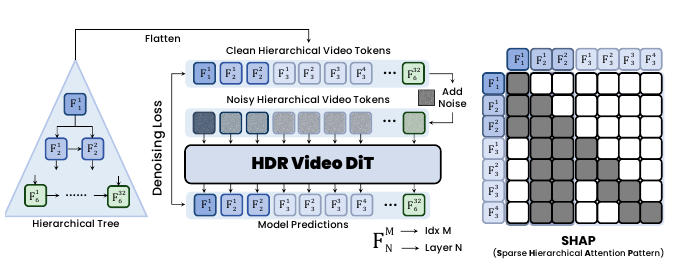

**Caption:** Figure 2: Overview of HDR.** Video latents are organized into a tree-structured hierarchy across multiple temporal resolutions. During training, each hierarchy token is corrupted along a flow-matching path and HDR Video DiT is optimized with a layer-wise objective. During inference, all tree tokens are flattened into a coarse-to-fine autoregressive order. **SHAP (Sparse Hierarchical Attention Pattern)** defines a structured attention mask over this flattened sequence: each token attends only to fixed local, parent-level, and first-frame contexts rather than the full video sequence. Generated tokens are written into a shared KV cache and reused by later tokens across hierarchy levels, enabling multi-scale information propagation with low temporal attention cost.

**Caption[CN]:** 图 2：HDR 概览。** 视频潜变量以树状层级组织，横跨多个时间分辨率。训练期间，每个层级 token 沿着流匹配路径被加噪，并使用逐层目标优化 HDR Video DiT。推理期间，所有树 token 都按照由粗到细的自回归顺序展平。**SHAP（Sparse Hierarchical Attention Pattern，稀疏分层注意力模式）**在该展平序列上定义结构化注意力掩码：每个 token 仅关注固定的局部上下文、父层级上下文和首帧上下文，而不是完整视频序列。生成的 token 被写入共享 KV cache，并由跨层级的后续 token 复用，从而以较低的时间注意力成本实现多尺度信息传播。

**Caption:** Overview of HDR.

**Caption[CN]:** HDR 总览。

> <strong>Para. 2:</strong> **Figure 2: Overview of HDR.** Video latents are organized into a tree-structured hierarchy across multiple temporal resolutions. During training, each hierarchy token is corrupted along a flow-matching path and HDR Video DiT is optimized with a layer-wise objective. During inference, all tree tokens are flattened into a coarse-to-fine autoregressive order. **SHAP (Sparse Hierarchical Attention Pattern)** defines a structured attention mask over this flattened sequence: each token attends only to fixed local, parent-level, and first-frame contexts rather than the full video sequence. Generated tokens are written into a shared KV cache and reused by later tokens across hierarchy levels, enabling multi-scale information propagation with low temporal attention cost.

> <strong>Para. 2[CN]:</strong> **图 2：HDR 概览。** 视频潜变量以树状层级组织，横跨多个时间分辨率。训练期间，每个层级 token 沿着流匹配路径被加噪，并使用逐层目标优化 HDR Video DiT。推理期间，所有树 token 都按照由粗到细的自回归顺序展平。**SHAP（Sparse Hierarchical Attention Pattern，稀疏分层注意力模式）**在该展平序列上定义结构化注意力掩码：每个 token 仅关注固定的局部上下文、父层级上下文和首帧上下文，而不是完整视频序列。生成的 token 被写入共享 KV cache，并由跨层级的后续 token 复用，从而以较低的时间注意力成本实现多尺度信息传播。

> <strong>Para. 3:</strong> We first revisit why streaming autoregressive generation struggles with multi-step reasoning, then introduce the hierarchical latent representation, layer-wise flow-matching objective, and **SHAP (Sparse Hierarchical Attention Pattern)**, which enables efficient inference over flattened tree tokens.

> <strong>Para. 3[CN]:</strong> 我们首先重新审视流式自回归生成为何难以进行多步推理，随后介绍分层潜变量表示、逐层流匹配目标以及 **SHAP（Sparse Hierarchical Attention Pattern，稀疏分层注意力模式）**；SHAP 可在展平后的树 token 上实现高效推理。

## 3.1 Rethinking Streaming Autoregressive Generation for Multi-step Reasoning

> <strong>Para. 4:</strong> We start by comparing bidirectional diffusion and streaming autoregressive diffusion. Let $\mathbf{z}^{t}=\{z_{1}^{t},\ldots,z_{N}^{t}\}$ denote a video latent sequence at denoising step $t$, where $N$ is the number of temporal latent tokens and $z_{i}^{t}$ is the token at temporal position $i$. Let $c$ denote the conditioning signal, such as text, image, or the first frame. A bidirectional video diffusion model updates the entire sequence jointly at every denoising step [24, 20]:

> <strong>Para. 4[CN]:</strong> 我们首先比较双向扩散和流式自回归扩散。令 $\mathbf{z}^{t}=\{z_{1}^{t},\ldots,z_{N}^{t}\}$ 表示去噪步骤 $t$ 时的视频潜变量序列，其中 $N$ 是时间潜变量 token 的数量，$z_{i}^{t}$ 是时间位置 $i$ 上的 token。令 $c$ 表示条件信号，例如文本、图像或首帧。双向视频扩散模型在每个去噪步骤联合更新整个序列 [24, 20]：

$$
\mathbf{z}^{t-1}=D_{\theta}(\mathbf{z}^{t},t,c).
\tag{1}
$$

> <strong>Para. 5:</strong> where $D_{\theta}$ is the denoising network. Because all temporal tokens remain noisy during intermediate denoising steps, information can propagate across the whole sequence before video is committed. This allows uncertain hypotheses to be maintained and refined over multiple denoising steps [26]. However, the same global revision ability comes with high cost: each step repeatedly updates a dense fixed-length sequence, making bidirectional diffusion poorly aligned with low-latency streaming.

> <strong>Para. 5[CN]:</strong> 其中，$D_{\theta}$ 是去噪网络。由于所有时间 token 在中间去噪步骤中都保持含噪状态，信息可以在视频被最终确定之前传播到整个序列。这使不确定假设能够在多个去噪步骤中得到保留和细化 [26]。然而，同样的全局修正能力也伴随着高昂成本：每一步都要反复更新密集的固定长度序列，使双向扩散难以适配低延迟流式生成。

> <strong>Para. 6:</strong> AR diffusion improves deployment efficiency by factorizing generation from left to right:

> <strong>Para. 6[CN]:</strong> AR 扩散通过从左到右分解生成过程来提高部署效率：

$$
p(\mathbf{z}\mid c)=\prod_{i=1}^{N}p(z_i\mid \mathbf{z}_{<i},c).
\tag{2}
$$

> <strong>Para. 7:</strong> where $\mathbf{z}=\{z_{1},\ldots,z_{N}\}$ is the clean latent sequence and $\mathbf{z}_{<i}$ denotes all previously generated temporal tokens. With an autoregressive attention mask, token $z_i$ attends only to past tokens and the condition $c$, enabling streaming inference and KV-cache reuse [34, 41, 9]. However, this structure also creates an irreversible rollout: once $z_i$ is generated, future predictions follow $z_i\rightarrow p(z_{i+1}\mid \mathbf{z}_{\leq i},c)\rightarrow p(z_{i+2}\mid \mathbf{z}_{\leq i+1},c)\rightarrow\cdots$. If an early token encodes an incorrect decision, later tokens must condition on this committed history and cannot revise it, which weakens logical consistency across multi-step reasoning trajectories.

> <strong>Para. 7[CN]:</strong> 其中，$\mathbf{z}=\{z_{1},\ldots,z_{N}\}$ 是干净的潜变量序列，$\mathbf{z}_{<i}$ 表示此前生成的所有时间 token。在自回归注意力掩码下，token $z_i$ 仅关注过去的 token 和条件 $c$，从而支持流式推理和 KV-cache 复用 [34, 41, 9]。然而，这种结构也会产生不可逆的 rollout：一旦生成 $z_i$，后续预测将沿着 $z_i\rightarrow p(z_{i+1}\mid \mathbf{z}_{\leq i},c)\rightarrow p(z_{i+2}\mid \mathbf{z}_{\leq i+1},c)\rightarrow\cdots$ 进行。如果某个早期 token 编码了错误决策，后续 token 就必须以这段已经承诺的历史为条件，并且无法对其进行修正，从而削弱多步推理轨迹中的逻辑一致性。

> <strong>Para. 8:</strong> Thus, the central challenge is not simply choosing between bidirectional and streaming autoregressive generation. Bidirectional diffusion supports global revision but incurs high deployment cost, while streaming autoregressive diffusion is efficient but lacks a mechanism for revisable multi-step reasoning. HDR addresses this tension by introducing a hierarchy of latent variables: coarse levels preserve noisy high-level hypotheses for global planning, while finer levels progressively refine them into concrete visual states before streaming output.

> <strong>Para. 8[CN]:</strong> 因此，核心挑战并不只是从双向生成与流式自回归生成之间二选一。双向扩散支持全局修正，但部署成本高昂；流式自回归扩散虽然高效，却缺少可修正多步推理的机制。HDR 通过引入潜变量层级来解决这一矛盾：粗粒度层保留用于全局规划的含噪高层假设，而细粒度层在流式输出之前逐步将其细化为具体的视觉状态。

## 3.2 Hierarchical Denoising for Visual Reasoning / 用于视觉推理的分层去噪

> <strong>Para. 1:</strong> HDR represents a video using a tree-structured hierarchy of latent tokens:

> <strong>Para. 1[CN]:</strong> HDR 使用树状结构的分层潜在 token 来表示视频：

$$
\mathcal{T}=\{\mathcal{V}^{1},\mathcal{V}^{2},\ldots,\mathcal{V}^{L}\},\qquad
\mathcal{V}^{\ell}=\{v_{\ell,1},\ldots,v_{\ell,N_{\ell}}\}.
\tag{3}
$$

> <strong>Para. 2:</strong> Here, $L$ is the number of hierarchy levels, $\mathcal{V}^{\ell}$ is the set of latent tokens at level $\ell$, $N_{\ell}$ is the number of tokens at that level, and $v_{\ell,i}$ denotes the $i$-th token. We use $\ell=1$ for the coarsest level and $\ell=L$ for the finest level. Coarse tokens summarize global temporal structure and represent high-level plans, while fine tokens encode local visual details and instantiate the final video dynamics. Each non-root token has a parent in the previous coarser level, denoted as $\pi(\ell,i)=(\ell-1,p_{\ell}(i))$ for $\ell>1$, where $p_{\ell}(i)$ maps token $v_{\ell,i}$ to its parent index at level $\ell-1$. The parent token represents the coarse temporal segment that the current token refines.

> <strong>Para. 2[CN]:</strong> 其中，$L$ 是层级数量，$\mathcal{V}^{\ell}$ 是第 $\ell$ 层的潜在 token 集合，$N_{\ell}$ 是该层的 token 数量，$v_{\ell,i}$ 表示第 $i$ 个 token。我们以 $\ell=1$ 表示最粗粒度层，以 $\ell=L$ 表示最细粒度层。粗粒度 token 概括全局时间结构并表示高层规划，而细粒度 token 编码局部视觉细节并将其落实为最终的视频动态。每个非根 token 在前一个更粗粒度层中都有一个父节点；当 $\ell>1$ 时，将其记为 $\pi(\ell,i)=(\ell-1,p_{\ell}(i))$，其中 $p_{\ell}(i)$ 将 token $v_{\ell,i}$ 映射到第 $\ell-1$ 层中的父节点索引。父 token 表示当前 token 所细化的粗粒度时间片段。

> <strong>Para. 3:</strong> As shown in Figure 2, HDR constructs hierarchical tokens from the input video latent sequence and performs coarse-to-fine reasoning before streaming output. During training, each hierarchy token is corrupted along a flow-matching path, and the model learns to predict the corresponding velocity target under hierarchical context. During inference, HDR generates tokens from coarse to fine: upper layers form noisy but revisable global hypotheses, while lower layers refine these hypotheses into concrete visual states. Within each level, generation proceeds autoregressively from left to right, preserving the streaming structure of autoregressive diffusion.

> <strong>Para. 3[CN]:</strong> 如图 2 所示，HDR 从输入视频的潜在序列构建分层 token，并在流式输出之前执行由粗到细的推理。训练期间，每个层级 token 都沿流匹配路径受到扰动，模型学习在分层上下文条件下预测相应的速度目标。推理期间，HDR 从粗到细地生成 token：上层形成带噪但可修订的全局假设，下层则将这些假设细化为具体的视觉状态。在每一层内部，生成过程均从左到右自回归地进行，从而保留自回归扩散的流式结构。

## 3.3 Layer-wise Flow-Matching Objective / 逐层流匹配目标

> <strong>Para. 1:</strong> We now describe the training objective over hierarchical tokens. For a clean hierarchy token $v^{0}_{\ell,i}$, we sample a noise token $\epsilon\sim\mathcal{N}(0,I)$ and construct an interpolated token at continuous time $t\in[0,1]$ as $v^{t}_{\ell,i}=(1-t)v^{0}_{\ell,i}+t\epsilon$. Under this linear probability path, the target velocity field is $u^{t}_{\ell,i}=\epsilon-v^{0}_{\ell,i}$. The HDR network is trained to predict this flow velocity from the interpolated token, the timestep, the hierarchical context $h_{\ell,i}$, and the condition $c$. The layer-wise flow-matching objective sums the velocity regression loss over all hierarchy levels and tokens:

> <strong>Para. 1[CN]:</strong> 下面介绍作用于分层 token 的训练目标。对于一个干净的层级 token $v^{0}_{\ell,i}$，我们采样噪声 token $\epsilon\sim\mathcal{N}(0,I)$，并在连续时间 $t\in[0,1]$ 上构造插值 token：$v^{t}_{\ell,i}=(1-t)v^{0}_{\ell,i}+t\epsilon$。在这条线性概率路径下，目标速度场为 $u^{t}_{\ell,i}=\epsilon-v^{0}_{\ell,i}$。HDR 网络根据插值 token、时间步、分层上下文 $h_{\ell,i}$ 和条件 $c$ 来预测这一流速度。逐层流匹配目标对所有层级与 token 的速度回归损失求和：

$$
\mathcal{L}_{\mathrm{HDR}}
=
\sum_{\ell=1}^{L}\lambda_{\ell}\frac{1}{N_{\ell}}
\sum_{i=1}^{N_{\ell}}
\mathbb{E}_{t,\epsilon}
\left[
\left\|
(\epsilon-v^{0}_{\ell,i})-u_{\theta}(v^{t}_{\ell,i},t,h_{\ell,i},c)
\right\|_{2}^{2}
\right].
\tag{4}
$$

> <strong>Para. 2:</strong> Here, $h_{\ell,i}$ denotes the sparse hierarchical context available to token $v_{\ell,i}$, and $\lambda_{\ell}$ balances the contribution of different hierarchy levels. This objective encourages each level to learn a velocity field appropriate to its temporal abstraction: coarse levels model global planning structure, while fine levels model concrete visual states and motion details.

> <strong>Para. 2[CN]:</strong> 其中，$h_{\ell,i}$ 表示 token $v_{\ell,i}$ 可用的稀疏分层上下文，$\lambda_{\ell}$ 用于平衡不同层级的贡献。该目标促使每一层学习与其时间抽象粒度相适应的速度场：粗粒度层建模全局规划结构，而细粒度层建模具体的视觉状态与运动细节。

> <strong>Para. 3:</strong> A key design of HDR is to match denoising strength to hierarchy level. Instead of assigning the same inference budget to every layer, HDR uses a level-dependent sampling budget $K_{\ell}$, with $K_{1}<K_{2}<\cdots<K_{L}$. Equivalently, the residual noise level decreases from coarse to fine, i.e., $\rho_{1}>\rho_{2}>\cdots>\rho_{L}$. Coarse layers are intentionally stopped at higher noise levels, so their predictions remain partially stochastic and can preserve multiple possible global plans. Finer layers receive stronger denoising and lower residual noise, progressively instantiating these hypotheses into visual states. We provide the entropy-matched derivation of $K_{\ell}$ and its ablation in Appendix C.

> <strong>Para. 3[CN]:</strong> HDR 的一个关键设计是让去噪强度与层级相匹配。HDR 并不为每一层分配相同的推理预算，而是采用依赖层级的采样预算 $K_{\ell}$，满足 $K_{1}<K_{2}<\cdots<K_{L}$。等价地，残余噪声水平从粗到细逐层降低，即 $\rho_{1}>\rho_{2}>\cdots>\rho_{L}$。粗粒度层会有意在较高噪声水平处停止，因此其预测仍具有一定随机性，能够保留多种可能的全局规划。细粒度层则接受更强的去噪并具有更低的残余噪声，逐步将这些假设落实为视觉状态。附录 C 给出了 $K_{\ell}$ 的熵匹配推导及其消融实验。

## 3.4 Sparse Hierarchical Attention Pattern / 稀疏分层注意力模式

> <strong>Para. 1:</strong> HDR implements hierarchical reasoning with SHAP (Sparse Hierarchical Attention Pattern), a structured attention mask over flattened tree tokens. Each hierarchy token is indexed by $(\ell,i)$, where $\ell$ is the hierarchy level and $i$ is the temporal position within that level. To perform inference autoregressively, we flatten all tree tokens into a coarse-to-fine order using $\phi(\ell,i)=i+\sum_{r<\ell}N_{r}$, with $s=\phi(\ell,i)$ denoting the flattened token index. Thus, all tokens in $\mathcal{V}^{1}$ are generated first, followed by $\mathcal{V}^{2}$, and so on until the finest level $\mathcal{V}^{L}$. This ordering matches the inference path shown in Figure 2: higher-level tokens are generated before the lower-level tokens that refine them.

> <strong>Para. 1[CN]:</strong> HDR 使用 SHAP（Sparse Hierarchical Attention Pattern，稀疏分层注意力模式）实现分层推理；SHAP 是作用于展平树 token 的结构化注意力掩码。每个层级 token 以 $(\ell,i)$ 为索引，其中 $\ell$ 表示层级，$i$ 表示该层内的时间位置。为执行自回归推理，我们使用 $\phi(\ell,i)=i+\sum_{r<\ell}N_{r}$ 将所有树 token 按由粗到细的顺序展平，并以 $s=\phi(\ell,i)$ 表示展平后的 token 索引。因此，首先生成 $\mathcal{V}^{1}$ 中的所有 token，随后生成 $\mathcal{V}^{2}$，依此类推，直至最细粒度层 $\mathcal{V}^{L}$。这一顺序与图 2 所示的推理路径一致：先生成高层 token，再生成对其进行细化的低层 token。

> <strong>Para. 2:</strong> For token $v_{\ell,i}$, SHAP first defines its sparse context in tree coordinates:

> <strong>Para. 2[CN]:</strong> 对于 token $v_{\ell,i}$，SHAP 首先在树坐标中定义其稀疏上下文：

$$
\mathcal{A}_{\mathrm{SHAP}}(\ell,i)
=
\mathbf{1}[i>1]\{(\ell,i-1)\}
\cup \mathbf{1}[i=1]\{x_{\mathrm{ref}}\}
\cup \mathbf{1}[\ell>1]\{\pi(\ell,i),\operatorname{left}(\pi(\ell,i)),\operatorname{right}(\pi(\ell,i))\}.
\tag{5}
$$

> <strong>Para. 3:</strong> Here, $x_{\mathrm{ref}}$ is the clean first-frame condition, $(\ell,i-1)$ provides same-level autoregressive continuity, and $\pi(\ell,i)$ is the parent token in the coarser level. The neighboring parent-level tokens $\operatorname{left}(\pi(\ell,i))$ and $\operatorname{right}(\pi(\ell,i))$ provide boundary information from adjacent coarse segments. Invalid boundary indices are omitted. For root-level tokens, which have no parent, the hierarchical context reduces to the first-frame condition and same-level autoregressive context.

> <strong>Para. 3[CN]:</strong> 其中，$x_{\mathrm{ref}}$ 是干净的首帧条件，$(\ell,i-1)$ 提供同层自回归连续性，$\pi(\ell,i)$ 是更粗粒度层中的父 token。相邻的父层 token $\operatorname{left}(\pi(\ell,i))$ 与 $\operatorname{right}(\pi(\ell,i))$ 提供来自相邻粗粒度片段的边界信息。无效的边界索引会被省略。对于没有父节点的根层 token，分层上下文退化为首帧条件与同层自回归上下文。

> <strong>Para. 4:</strong> The tree context is then converted into a binary attention mask over the flattened sequence. Let $S=\sum_{\ell=1}^{L}N_{\ell}$ be the total number of hierarchy tokens and $M_{\mathrm{SHAP}}\in\{0,1\}^{S\times S}$ be the SHAP mask. For $s=\phi(\ell,i)$ and $r=\phi(\ell',j)$, we define:

> <strong>Para. 4[CN]:</strong> 随后，树上下文被转换为展平序列上的二值注意力掩码。令 $S=\sum_{\ell=1}^{L}N_{\ell}$ 为层级 token 的总数，并令 $M_{\mathrm{SHAP}}\in\{0,1\}^{S\times S}$ 为 SHAP 掩码。对于 $s=\phi(\ell,i)$ 和 $r=\phi(\ell',j)$，定义：

$$
M_{\mathrm{SHAP}}[s,r]
=
\mathbf{1}\left[(\ell',j)\in\mathcal{A}_{\mathrm{SHAP}}(\ell,i)\right].
\tag{6}
$$

> <strong>Para. 5:</strong> This mask is sparse by construction: each row contains only a constant number of valid attention targets, independent of video length. It is also autoregressive under the flattened order, because every valid context token is either a previous same-level token, a coarser-level token that has already been generated, or the first-frame condition.

> <strong>Para. 5[CN]:</strong> 按照上述构造，该掩码天然是稀疏的：每一行仅包含恒定数量的有效注意力目标，与视频长度无关。在展平顺序下，它同样具有自回归性质，因为每个有效上下文 token 要么是先前的同层 token，要么是已经生成的更粗粒度 token，要么是首帧条件。

> <strong>Para. 6:</strong> SHAP naturally induces cross-level KV-cache sharing. During inference, once token $v_{\ell,i}$ is generated, its key-value state is written into a global hierarchy cache, denoted by $C_{s}=C_{s-1}\cup\{(k_{\ell,i},v^{\mathrm{KV}}_{\ell,i})\}$, where $s=\phi(\ell,i)$. When generating a later token $v_{\ell',j}$, HDR retrieves only the cached states selected by the SHAP mask, i.e., $h_{\ell',j}=\operatorname{Attn}(q_{\ell',j},\{(k_{\ell,i},v^{\mathrm{KV}}_{\ell,i}):M_{\mathrm{SHAP}}[\phi(\ell',j),\phi(\ell,i)]=1\})$. Thus, information generated at coarse levels is reused by lower levels through the shared KV cache, while local temporal continuity is preserved by same-level autoregressive links. Because each token attends to a fixed-size SHAP context rather than dense full-sequence tokens, HDR reduces temporal attention cost while maintaining multi-scale information flow before streaming output.

> <strong>Para. 6[CN]:</strong> SHAP 自然地促成跨层 KV 缓存共享。推理期间，一旦 token $v_{\ell,i}$ 生成，其键值状态就会写入全局层级缓存，记为 $C_{s}=C_{s-1}\cup\{(k_{\ell,i},v^{\mathrm{KV}}_{\ell,i})\}$，其中 $s=\phi(\ell,i)$。在生成后续 token $v_{\ell',j}$ 时，HDR 仅检索由 SHAP 掩码选中的缓存状态，即 $h_{\ell',j}=\operatorname{Attn}(q_{\ell',j},\{(k_{\ell,i},v^{\mathrm{KV}}_{\ell,i}):M_{\mathrm{SHAP}}[\phi(\ell',j),\phi(\ell,i)]=1\})$。因此，粗粒度层生成的信息可通过共享 KV 缓存被低层复用，而局部时间连续性则由同层自回归连接保持。由于每个 token 关注的是固定大小的 SHAP 上下文，而非稠密的全序列 token，HDR 在流式输出之前维持多尺度信息流的同时，降低了时间注意力成本。

# 4 Experiments / 实验

> <strong>Para. 1:</strong> We evaluate HDR along two axes: multi-step reasoning ability and low-latency streaming generation efficiency. Section 4.1 introduces the benchmark, metrics, baselines, and implementation setup. Section 4.2 compares HDR with full-attention and streaming baselines. Section 4.3 analyzes the hierarchy layers impact, Section 4.4 tests robustness under reduced denoising budgets and limited data, and Section 4.5 evaluates transfer to real-world robot interaction.

> <strong>Para. 1[CN]:</strong> 我们从两个维度评估 HDR：多步推理能力与低延迟流式生成效率。第 4.1 节介绍基准、指标、基线和实现设置。第 4.2 节将 HDR 与全注意力及流式基线进行比较。第 4.3 节分析层级层数的影响，第 4.4 节测试模型在去噪预算缩减和数据受限情况下的鲁棒性，第 4.5 节评估其向真实世界机器人交互的迁移能力。

## 4.1 Benchmarks, Baselines, and Implementation Details / 基准、基线与实现细节

> <strong>Para. 1:</strong> **Benchmarks and metrics.** Existing video reasoning benchmarks are not fully suitable for evaluating streaming multi-step generation: many do not release complete evaluation scripts, and most emphasize short clips or perceptual consistency rather than logical consistency across multiple reasoning steps. We therefore construct a controlled benchmark suite with six tasks: Tower of Hanoi, maze navigation, one-line drawing, sliding puzzle, Sokoban, and water pouring. The benchmark is stratified by difficulty and includes OOD cases to test rule transfer beyond frequent training patterns. The scored evaluation set contains 370 held-out videos. Each task is evaluated with *success*, which measures exact task completion, and *average progress*, which measures partial progress and reflects intermediate logical consistency. We report task results as Success / Avg. Progress pairs and compute overall performance as an unweighted average across the six tasks. Full benchmark construction and task-specific evaluation details are provided in Appendix B.

> <strong>Para. 1[CN]:</strong> **基准与指标。** 现有视频推理基准并不完全适合评估流式多步生成：许多基准没有发布完整的评估脚本，而且多数强调短视频片段或感知一致性，而非跨多个推理步骤的逻辑一致性。因此，我们构建了一个包含六项任务的可控基准套件：汉诺塔、迷宫导航、一笔画、滑块拼图、推箱子和倒水。该基准按难度分层，并包含 OOD（分布外）案例，以测试超越高频训练模式的规则迁移能力。计分评估集包含 370 个留出视频。每项任务使用两个指标进行评估：*success* 衡量任务是否精确完成，*average progress* 衡量部分完成进度并反映中间过程的逻辑一致性。我们以 Success / Avg. Progress 成对报告各任务结果，并将六项任务的无权平均值作为整体表现。完整的基准构建方式和各任务的评估细节见附录 B。

> <strong>Para. 2:</strong> **Baselines and implementation.** We compare HDR with full-attention baselines, including bidirectional diffusion and VideoMAE [23], and streaming baselines, including CausalForcing [41] and VideoGPT [30]. For a controlled comparison, the main diffusion baselines and HDR are built on Wan2.2-5B-TI2V [24]; HDR uses six latent hierarchy levels with the entropy-matched denoising schedule $[5,8,13,20,32,50]$. All methods are trained on the same 18,000-video reasoning dataset, conditioned on the first frame, and optimized with the same flow-matching training setup. Complete baseline definitions, training details, and implementation settings are provided in Appendix I.

> <strong>Para. 2[CN]:</strong> **基线与实现。** 我们将 HDR 与全注意力基线进行比较，包括双向扩散和 VideoMAE [23]；同时也与流式基线进行比较，包括 CausalForcing [41] 和 VideoGPT [30]。为进行受控比较，主要扩散基线与 HDR 均构建于 Wan2.2-5B-TI2V [24] 之上；HDR 使用六个潜在层级，并采用熵匹配去噪调度 $[5,8,13,20,32,50]$。所有方法均在同一个包含 18,000 个视频的推理数据集上训练，以首帧为条件，并使用相同的流匹配训练设置进行优化。完整的基线定义、训练细节和实现设置见附录 I。

## 4.2 Main Results: Bridging Reasoning Precision and Streaming Efficiency / 主要结果：兼顾推理精度与流式效率

> <strong>Para. 1:</strong> HDR improves both the final success of multi-step reasoning trajectories and their intermediate logical consistency. We support this conclusion through quantitative comparisons in Table 1 and qualitative examples in Figure 4. We further evaluate streaming efficiency in Table 2, showing that HDR maintains comparable latency to the AR diffusion baseline [41].

> <strong>Para. 1[CN]:</strong> HDR 同时提升了多步推理轨迹的最终成功率及其中间过程的逻辑一致性。表 1 的定量比较和图 4 的定性示例支持这一结论。我们还在表 2 中评估了流式效率，结果表明 HDR 的延迟与 AR 扩散基线 [41] 相当。

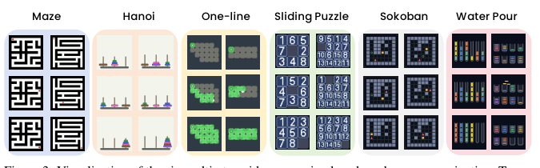

**Caption:** Figure 3: Visualization of the six multi-step video reasoning benchmarks: maze navigation, Tower of Hanoi, one-line drawing, sliding puzzle, Sokoban, and water pouring. Each task requires logical consistency across multiple reasoning steps rather than only local visual plausibility.

**Caption[CN]:** 图 3：六个多步视频推理基准的可视化：迷宫导航、汉诺塔、一笔画、滑块拼图、推箱子和倒水。每项任务都要求在多个推理步骤之间保持逻辑一致性，而不仅仅是局部视觉上的合理性。

**Caption:** Six multi-step video reasoning benchmarks.

**Caption[CN]:** 六项多步视频推理基准。

> <strong>Para. 2:</strong> **Figure 3: Visualization of the six multi-step video reasoning benchmarks: maze navigation, Tower of Hanoi, one-line drawing, sliding puzzle, Sokoban, and water pouring. Each task requires logical consistency across multiple reasoning steps rather than only local visual plausibility.**

> <strong>Para. 2[CN]:</strong> **图 3：六个多步视频推理基准的可视化：迷宫导航、汉诺塔、一笔画、滑块拼图、推箱子和倒水。每项任务都要求在多个推理步骤之间保持逻辑一致性，而不仅仅是局部视觉上的合理性。**

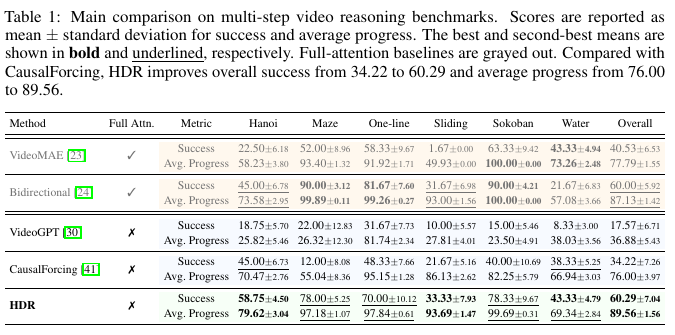

**Caption:** Table 1: Main comparison on multi-step video reasoning benchmarks. Scores are reported as mean $\pm$ standard deviation for success and average progress. The best and second-best means are shown in bold and underlined, respectively. Full-attention baselines are grayed out. Compared with CausalForcing, HDR improves overall success from 34.22 to 60.29 and average progress from 76.00 to 89.56.

**Caption[CN]:** 表 1：多步视频推理基准上的主要比较。成功率和平均进度均以均值 $\pm$ 标准差报告。最佳与次佳均值分别以粗体和下划线标示。全注意力基线在原表中以灰色显示。与 CausalForcing 相比，HDR 将整体成功率从 34.22 提升至 60.29，并将平均进度从 76.00 提升至 89.56。

**Caption:** Main multi-step reasoning benchmark comparison.

**Caption[CN]:** 多步推理基准主结果。

> <strong>Para. 3:</strong> **Table 1: Main comparison on multi-step video reasoning benchmarks. Scores are reported as mean $\pm$ standard deviation for success and average progress. The best and second-best means are shown in bold and underlined, respectively. Full-attention baselines are grayed out. Compared with CausalForcing, HDR improves overall success from 34.22 to 60.29 and average progress from 76.00 to 89.56.**

> <strong>Para. 3[CN]:</strong> **表 1：多步视频推理基准上的主要比较。成功率和平均进度均以均值 $\pm$ 标准差报告。最佳与次佳均值分别以粗体和下划线标示。全注意力基线在原表中以灰色显示。与 CausalForcing 相比，HDR 将整体成功率从 34.22 提升至 60.29，并将平均进度从 76.00 提升至 89.56。**

| Method / 方法 | Full Attn. / 全注意力 | Metric / 指标 | Hanoi / 汉诺塔 | Maze / 迷宫 | One-line / 一笔画 | Sliding / 滑块拼图 | Sokoban / 推箱子 | Water / 倒水 | Overall / 整体 |
|---|:---:|---|---:|---:|---:|---:|---:|---:|---:|
| VideoMAE [23] | ✓ | Success / 成功率 | 22.50±6.18 | 52.00±8.96 | 58.33±9.67 | 1.67±0.00 | 63.33±9.42 | 43.33±4.94 | 40.53±6.53 |
| VideoMAE [23] | ✓ | Avg. Progress / 平均进度 | 58.23±3.80 | 93.40±1.32 | 91.92±1.71 | 49.93±0.00 | **100.00±0.00** | 73.26±2.48 | 77.79±1.55 |
| Bidirectional [24] | ✓ | Success / 成功率 | 45.00±6.78 | **90.00±3.12** | **81.67±7.60** | 31.67±6.98 | **90.00±4.21** | 21.67±6.83 | <u>60.00±5.92</u> |
| Bidirectional [24] | ✓ | Avg. Progress / 平均进度 | 73.58±2.95 | **99.89±0.11** | **99.26±0.27** | 93.00±1.56 | **100.00±0.00** | 57.08±3.66 | 87.13±1.42 |
| VideoGPT [30] | ✗ | Success / 成功率 | 18.75±5.70 | 22.00±12.83 | 31.67±7.73 | 10.00±5.57 | 15.00±5.46 | 8.33±3.00 | 17.57±6.71 |
| VideoGPT [30] | ✗ | Avg. Progress / 平均进度 | 25.82±5.46 | 26.32±12.30 | 81.74±2.34 | 27.81±4.01 | 23.50±4.91 | 38.03±3.56 | 36.88±5.43 |
| CausalForcing [41] | ✗ | Success / 成功率 | 45.00±6.73 | 12.00±8.08 | 48.33±7.66 | 21.67±5.16 | 40.00±10.69 | 38.33±5.25 | 34.22±7.26 |
| CausalForcing [41] | ✗ | Avg. Progress / 平均进度 | 70.47±2.76 | 55.04±8.36 | 95.15±1.28 | 86.13±2.62 | 82.25±5.79 | 66.94±3.03 | 76.00±3.97 |
| **HDR** | ✗ | Success / 成功率 | **58.75±4.50** | <u>78.00±5.25</u> | <u>70.00±10.12</u> | **33.33±7.93** | <u>78.33±9.67</u> | **43.33±4.79** | **60.29±7.04** |
| **HDR** | ✗ | Avg. Progress / 平均进度 | **79.62±3.04** | <u>97.18±1.07</u> | <u>97.84±0.61</u> | **93.69±1.47** | <u>99.69±0.31</u> | **69.34±2.84** | **89.56±1.56** |

> <strong>Para. 4:</strong> **Overall comparison.** Table 1 presents the main comparison on our multi-step video reasoning benchmark. Compared with CausalForcing, the streaming autoregressive diffusion baseline, HDR improves overall success from 34.22 to 60.29, corresponding to a 76.2% relative gain. Average progress also increases from 76.00 to 89.56, indicating stronger intermediate logical consistency. Full-attention baselines, shown in gray, enable dense global interaction but are less aligned with low-latency streaming. Despite not using full temporal attention, HDR achieves the best overall success and average progress, showing that hierarchical denoising can recover strong reasoning precision while preserving the streaming structure of autoregressive diffusion.

> <strong>Para. 4[CN]:</strong> **整体比较。** 表 1 展示了我们在多步视频推理基准上的主要比较。相较于流式自回归扩散基线 CausalForcing，HDR 将整体成功率从 34.22 提升至 60.29，相对增益为 76.2%。平均进度也从 76.00 提升至 89.56，表明其中间过程具有更强的逻辑一致性。原表中以灰色显示的全注意力基线能够实现稠密的全局交互，但与低延迟流式生成的适配性较差。尽管未使用完整的时间注意力，HDR 仍取得了最佳的整体成功率与平均进度，这表明分层去噪能够在保留自回归扩散流式结构的同时恢复强大的推理精度。

> <strong>Para. 5:</strong> **Qualitative evidence of revisable planning.** Figure 4 compares CausalForcing and HDR on Maze and One-line cases. CausalForcing commits to an early local decision that leads to failure: taking the wrong branch in Maze or missing the top block in One-line. HDR instead resolves the ambiguous decision point through hierarchical planning before committing to fine-grained outputs, leading to successful task completion.

> <strong>Para. 5[CN]:</strong> **可修订规划的定性证据。** 图 4 比较了 CausalForcing 与 HDR 在迷宫和一笔画案例上的表现。CausalForcing 过早地锁定了局部决策并最终失败：在迷宫中选择错误分支，或在一笔画中漏掉顶部方块。相比之下，HDR 在输出细粒度结果之前先通过分层规划解决模糊的决策点，从而成功完成任务。

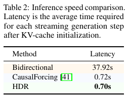

**Caption:** Table 2: Inference speed comparison. Latency is the average time required for each streaming generation step after KV-cache initialization.

**Caption[CN]:** 表 2：推理速度比较。延迟是 KV 缓存初始化之后，每个流式生成步骤所需时间的平均值。

**Caption:** Inference speed comparison.

**Caption[CN]:** 推理速度对比。

> <strong>Para. 6:</strong> **Table 2: Inference speed comparison. Latency is the average time required for each streaming generation step after KV-cache initialization.**

> <strong>Para. 6[CN]:</strong> **表 2：推理速度比较。延迟是 KV 缓存初始化之后，每个流式生成步骤所需时间的平均值。**

| Method / 方法 | Latency / 延迟 |
|---|---:|
| Bidirectional / 双向扩散 | 37.92s |
| CausalForcing [41] | 0.72s |
| **HDR** | **0.70s** |

> <strong>Para. 7:</strong> **Streaming efficiency.** We further report inference speed in Table 2. Latency measures the time required for each streaming generation step after KV-cache initialization. HDR achieves comparable latency to CausalForcing, 0.70s versus 0.72s, while being substantially faster than bidirectional diffusion at 37.92s. This shows that HDR improves multi-step reasoning while preserving low-latency streaming behavior.

> <strong>Para. 7[CN]:</strong> **流式效率。** 我们进一步在表 2 中报告推理速度。延迟衡量 KV 缓存初始化后每个流式生成步骤所需的时间。HDR 的延迟与 CausalForcing 相当，分别为 0.70s 和 0.72s，同时显著快于延迟为 37.92s 的双向扩散。这表明 HDR 在提升多步推理能力的同时保留了低延迟流式行为。

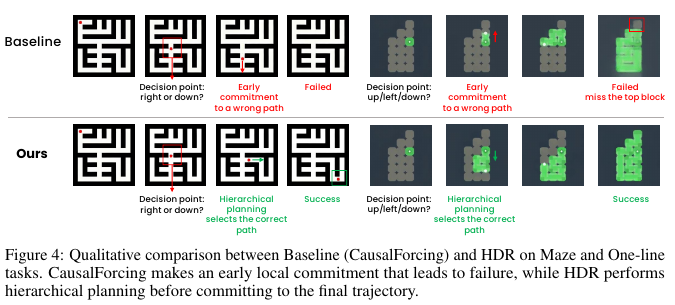

**Caption:** Figure 4: Qualitative comparison between Baseline (CausalForcing) and HDR on Maze and One-line tasks. CausalForcing makes an early local commitment that leads to failure, while HDR performs hierarchical planning before committing to the final trajectory.

**Caption[CN]:** 图 4：基线（CausalForcing）与 HDR 在迷宫和一笔画任务上的定性比较。CausalForcing 过早锁定局部决策并导致失败，而 HDR 在确定最终轨迹之前执行分层规划。

**Caption:** CausalForcing and HDR qualitative comparison.

**Caption[CN]:** CausalForcing 与 HDR 的定性对比。

> <strong>Para. 8:</strong> **Figure 4: Qualitative comparison between Baseline (CausalForcing) and HDR on Maze and One-line tasks. CausalForcing makes an early local commitment that leads to failure, while HDR performs hierarchical planning before committing to the final trajectory.**

> <strong>Para. 8[CN]:</strong> **图 4：基线（CausalForcing）与 HDR 在迷宫和一笔画任务上的定性比较。CausalForcing 过早锁定局部决策并导致失败，而 HDR 在确定最终轨迹之前执行分层规划。**

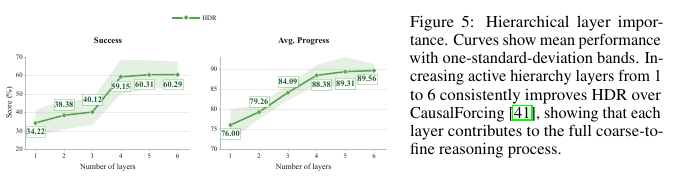

**Caption:** Figure 5: Hierarchical layer importance. Curves show mean performance with one-standard-deviation bands. Increasing active hierarchy layers from 1 to 6 consistently improves HDR over CausalForcing [41], showing that each layer contributes to the full coarse-to-fine reasoning process.

**Caption[CN]:** 图 5：层级层的重要性。曲线显示均值表现，阴影带表示一个标准差。将活跃层级数从 1 增加到 6 时，HDR 相比 CausalForcing [41] 持续获得提升，说明每一层都对完整的由粗到细推理过程有所贡献。

**Caption:** Hierarchical layer importance.

**Caption[CN]:** 分层层级重要性。

> <strong>Para. 9:</strong> **Figure 5: Hierarchical layer importance. Curves show mean performance with one-standard-deviation bands. Increasing active hierarchy layers from 1 to 6 consistently improves HDR over CausalForcing [41], showing that each layer contributes to the full coarse-to-fine reasoning process.**

> <strong>Para. 9[CN]:</strong> **图 5：层级层的重要性。曲线显示均值表现，阴影带表示一个标准差。将活跃层级数从 1 增加到 6 时，HDR 相比 CausalForcing [41] 持续获得提升，说明每一层都对完整的由粗到细推理过程有所贡献。**

## 4.3 Mechanism Analysis: Layer-wise Analysis / 机制分析：逐层分析

> <strong>Para. 1:</strong> **Hierarchical layer importance.** We study how performance changes as the number of active hierarchical layers increases. Figure 5 reorganizes the variants by layer count, from a single-layer setting equivalent to CausalForcing to the full six-layer HDR hierarchy. The one-layer setting lacks the coarse-to-fine reasoning process enabled by the hierarchy. As additional layers are introduced, the model gains progressively richer high-level planning and stronger multi-step reasoning behavior. This trend shows that HDR’s advantage does not come only from the final frame-level refinement: each hierarchy level contributes useful structure, and deeper hierarchies lead to better performance.

> <strong>Para. 1[CN]:</strong> **层级层的重要性。** 我们研究了随着活跃层级数增加，模型性能如何变化。图 5 按层数重新组织各个变体，从等价于 CausalForcing 的单层设置一直到完整的六层 HDR 层级。单层设置缺少由层级结构实现的由粗到细推理过程。随着更多层被引入，模型逐步获得更丰富的高层规划能力和更强的多步推理行为。这一趋势表明，HDR 的优势并非仅来自最终的帧级细化：每个层级都提供了有用结构，而更深的层级会带来更好的性能。

## 4.4 Robustness: Performance under Reduced Budgets and Limited Data / 鲁棒性：预算缩减与数据受限条件下的性能

> <strong>Para. 1:</strong> **Denoising-step reduction.** We first study robustness under reduced denoising budgets. Figure 6(a) compares CausalForcing, bidirectional diffusion, and HDR as the number of inference denoising steps decreases. Both baselines degrade substantially under aggressive step reduction: bidirectional diffusion drops from 60.00 to 17.78 in overall success with one step, while CausalForcing drops from 34.22 to 11.25. In contrast, HDR remains substantially more robust, achieving 34.72 success with one denoising step and preserving 57.6% of its full-step performance, compared with 29.6% and 32.9% for the bidirectional and CausalForcing baselines, respectively.

> <strong>Para. 1[CN]:</strong> **减少去噪步数。** 我们首先研究去噪预算缩减条件下的鲁棒性。随着推理去噪步数减少，图 6(a) 比较了 CausalForcing、双向扩散和 HDR。在大幅减少步数时，两个基线均显著退化：采用一步去噪时，双向扩散的整体成功率从 60.00 降至 17.78，而 CausalForcing 从 34.22 降至 11.25。相比之下，HDR 的鲁棒性显著更强，在仅使用一个去噪步骤时仍取得 34.72 的成功率，并保留完整步数性能的 57.6%；双向扩散和 CausalForcing 基线分别仅保留 29.6% 和 32.9%。

> <strong>Para. 2:</strong> **Data reduction.** We test whether HDR can learn reasoning rules from limited data. Figure 6(b) compares HDR and bidirectional diffusion using the full training set, 10%, and 2% of the data, with task-level results in Appendix Table 10. As data decreases, HDR degrades more gracefully: with only 2% of the training data, it retains 82.9% of its full-data success and 97.2% of its full-data average progress, compared with 52.0% and 89.5% for bidirectional diffusion. This suggests that the hierarchy provides a useful inductive bias for learning transferable task rules rather than simply memorizing training examples.

> <strong>Para. 2[CN]:</strong> **减少数据。** 我们测试 HDR 能否从有限数据中学习推理规则。图 6(b) 使用完整训练集、10% 数据和 2% 数据来比较 HDR 与双向扩散，各任务层面的结果见附录表 10。随着数据量减少，HDR 的退化更加平缓：仅使用 2% 训练数据时，它仍保留完整数据条件下成功率的 82.9% 和平均进度的 97.2%；相比之下，双向扩散分别保留 52.0% 和 89.5%。这表明，层级结构为学习可迁移的任务规则提供了有用的归纳偏置，而非仅仅记忆训练样本。

> <strong>Para. 3:</strong> Together, these ablations show that HDR’s robustness comes from its hierarchical architecture. The model remains effective under limited denoising budgets because coarse layers provide stable global guidance, while lower layers refine this guidance into detailed visual states. Conversely, when coarse levels are absent or training data is limited, the hierarchical reasoning process becomes the key factor that determines whether the model can preserve multi-step logical consistency.

> <strong>Para. 3[CN]:</strong> 综合来看，这些消融实验表明 HDR 的鲁棒性源于其分层架构。在去噪预算受限时，模型仍然有效，因为粗粒度层提供稳定的全局引导，而低层则将该引导细化为具体的视觉状态。反过来，当粗粒度层缺失或训练数据有限时，分层推理过程便成为决定模型能否保持多步逻辑一致性的关键因素。

> <strong>Para. 4:</strong> **(a) Denoising-step reduction. HDR remains more robust than both CausalForcing [41], the streaming AR diffusion baseline, and bidirectional diffusion.**

> <strong>Para. 4[CN]:</strong> **(a) 减少去噪步数。与流式 AR 扩散基线 CausalForcing [41] 以及双向扩散相比，HDR 均表现出更强的鲁棒性。**

> <strong>Para. 5:</strong> **(b) Data reduction. HDR degrades more gracefully than bidirectional diffusion as the training data scale decreases from the full set to 10% and 2%.**

> <strong>Para. 5[CN]:</strong> **(b) 减少数据。当训练数据规模从完整数据集降至 10% 和 2% 时，HDR 的退化比双向扩散更为平缓。**

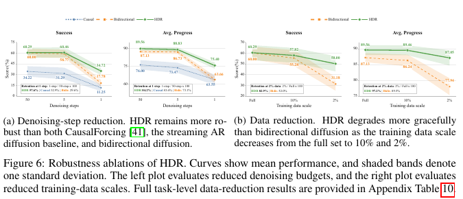

**Caption:** Figure 6: Robustness ablations of HDR. Curves show mean performance, and shaded bands denote one standard deviation. The left plot evaluates reduced denoising budgets, and the right plot evaluates reduced training-data scales. Full task-level data-reduction results are provided in Appendix Table 10.

**Caption[CN]:** 图 6：HDR 的鲁棒性消融实验。曲线显示均值表现，阴影带表示一个标准差。左图评估去噪预算缩减，右图评估训练数据规模缩减。完整的任务级数据缩减结果见附录表 10。

**Caption:** Robustness ablations.

**Caption[CN]:** 鲁棒性消融。

> <strong>Para. 6:</strong> **Figure 6: Robustness ablations of HDR. Curves show mean performance, and shaded bands denote one standard deviation. The left plot evaluates reduced denoising budgets, and the right plot evaluates reduced training-data scales. Full task-level data-reduction results are provided in Appendix Table 10.**

> <strong>Para. 6[CN]:</strong> **图 6：HDR 的鲁棒性消融实验。曲线显示均值表现，阴影带表示一个标准差。左图评估去噪预算缩减，右图评估训练数据规模缩减。完整的任务级数据缩减结果见附录表 10。**

## 4.5 Physical World Modeling: Transfer to Robot Interaction / 物理世界建模：迁移至机器人交互

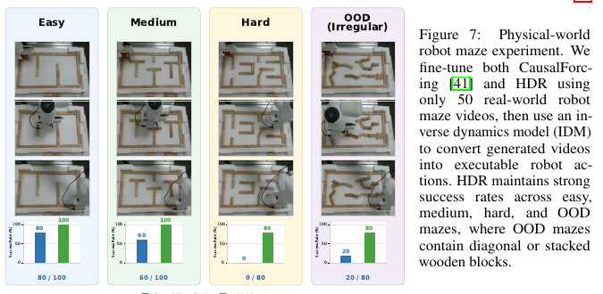

**Caption:** Figure 7: Physical-world robot maze experiment. We fine-tune both CausalForcing [41] and HDR using only 50 real-world robot maze videos, then use an inverse dynamics model (IDM) to convert generated videos into executable robot actions. HDR maintains strong success rates across easy, medium, hard, and OOD mazes, where OOD mazes contain diagonal or stacked wooden blocks.

**Caption[CN]:** 图 7：物理世界机器人迷宫实验。我们仅使用 50 个真实世界机器人迷宫视频对 CausalForcing [41] 和 HDR 进行微调，随后使用逆动力学模型（IDM）将生成视频转换为可执行的机器人动作。HDR 在简单、中等、困难和 OOD 迷宫中均保持较高成功率，其中 OOD 迷宫包含斜向放置或堆叠的木块。

**Caption:** Physical-world robot maze experiment.

**Caption[CN]:** 真实世界机器人迷宫实验。

> <strong>Para. 1:</strong> **Figure 7: Physical-world robot maze experiment. We fine-tune both CausalForcing [41] and HDR using only 50 real-world robot maze videos, then use an inverse dynamics model (IDM) to convert generated videos into executable robot actions. HDR maintains strong success rates across easy, medium, hard, and OOD mazes, where OOD mazes contain diagonal or stacked wooden blocks.**

> <strong>Para. 1[CN]:</strong> **图 7：物理世界机器人迷宫实验。我们仅使用 50 个真实世界机器人迷宫视频对 CausalForcing [41] 和 HDR 进行微调，随后使用逆动力学模型（IDM）将生成视频转换为可执行的机器人动作。HDR 在简单、中等、困难和 OOD 迷宫中均保持较高成功率，其中 OOD 迷宫包含斜向放置或堆叠的木块。**

> <strong>Para. 2:</strong> To evaluate whether HDR transfers beyond synthetic benchmarks, we conduct a physical-world robot maze experiment. The task requires a robot arm to pick up a plush toy and move it through a maze built from toy blocks. This setting introduces visual domain shifts, imperfect object localization, occlusion, lighting variation, and irregular maze boundaries. We pretrain HDR on 3,000 virtual maze videos, fine-tune both HDR and CausalForcing using only 50 real-world robot videos, and convert generated videos into executable robot actions using an inverse dynamics model (IDM).

> <strong>Para. 2[CN]:</strong> 为评估 HDR 能否迁移到合成基准之外，我们开展了物理世界机器人迷宫实验。该任务要求机械臂拾取一个毛绒玩具，并使其穿过由玩具积木搭建的迷宫。该设置引入了视觉域偏移、不精确的物体定位、遮挡、光照变化以及不规则的迷宫边界。我们在 3,000 个虚拟迷宫视频上预训练 HDR，仅使用 50 个真实世界机器人视频对 HDR 和 CausalForcing 进行微调，并利用逆动力学模型（IDM）将生成视频转换为可执行的机器人动作。

> <strong>Para. 3:</strong> We categorize physical-world mazes by difficulty. Easy, medium, and hard mazes are defined by maze complexity, including the number of branches and turns required by the solution path. We also include an OOD setting, where wooden blocks are placed diagonally or stacked together, producing layouts that differ from regular grid-like training mazes. As shown in Figure 7, HDR maintains strong success rates across all settings, indicating that hierarchical denoising can transfer multi-step reasoning ability to physical interaction.

> <strong>Para. 3[CN]:</strong> 我们按照难度对物理世界迷宫进行分类。简单、中等和困难迷宫由迷宫复杂度定义，包括解题路径所需的分支数和转弯数。我们还设置了 OOD 场景，其中木块以斜向或堆叠方式摆放，形成不同于规则网格状训练迷宫的布局。如图 7 所示，HDR 在所有设置中均保持较高成功率，表明分层去噪能够将多步推理能力迁移到物理交互中。

## 4.6 World Action Modeling on RoboDojo / RoboDojo 上的世界动作建模

> <strong>Para. 1:</strong> We also evaluate whether hierarchical denoising transfers to embodied world-action modeling. We instantiate HDR-WAM by combining episode-level visual context with a local action-conditioned rollout, while keeping the detailed token layout, sampling procedure, and attention mask in Appendix A.

> <strong>Para. 1[CN]:</strong> 我们还评估分层去噪能否迁移至具身世界动作建模。我们将回合级视觉上下文与局部动作条件 rollout 相结合，从而实例化 HDR-WAM；详细的 token 布局、采样过程和注意力掩码见附录 A。

> <strong>Para. 2:</strong> Table 3 reports results on the RoboDojo simulation benchmark, which contains 42 robot interaction tasks grouped into five capability dimensions. Without robot-domain or embodied-interaction pretraining, HDR-WAM reaches an overall score of 5.47 and an average success rate of 3.00%.

> <strong>Para. 2[CN]:</strong> 表 3 报告了 RoboDojo 仿真基准上的结果；该基准包含 42 项机器人交互任务，并按五个能力维度分组。在没有机器人领域或具身交互预训练的情况下，HDR-WAM 达到 5.47 的整体得分和 3.00% 的平均成功率。

**Caption:** Table 3: RoboDojo simulation benchmark leaderboard. Each cell reports score / success rate for a capability dimension. Within each pretraining group, the best and second-best scores in each column are shown in bold and underlined, respectively, with ties included. The Pretrain column indicates whether the method uses robot-domain or embodied-interaction pretraining beyond task-specific benchmark training. HDR-WAM adapts HDR to World Action Models through hierarchical episode-conditioned visual planning and local action prediction.

**Caption[CN]:** 表 3：RoboDojo 仿真基准排行榜。每个单元格报告对应能力维度的得分 / 成功率。在每个预训练分组内，各列的最佳与次佳得分分别以粗体和下划线标示，并计入并列情况。Pretrain 列表示该方法是否在特定任务的基准训练之外使用了机器人领域或具身交互预训练。HDR-WAM 通过分层的回合条件视觉规划与局部动作预测，将 HDR 适配为世界动作模型。

**Caption:** RoboDojo simulation benchmark leaderboard.

**Caption[CN]:** RoboDojo 仿真基准排行榜。

> <strong>Para. 3:</strong> **Table 3: RoboDojo simulation benchmark leaderboard. Each cell reports score / success rate for a capability dimension. Within each pretraining group, the best and second-best scores in each column are shown in bold and underlined, respectively, with ties included. The Pretrain column indicates whether the method uses robot-domain or embodied-interaction pretraining beyond task-specific benchmark training. HDR-WAM adapts HDR to World Action Models through hierarchical episode-conditioned visual planning and local action prediction.**

> <strong>Para. 3[CN]:</strong> **表 3：RoboDojo 仿真基准排行榜。每个单元格报告对应能力维度的得分 / 成功率。在每个预训练分组内，各列的最佳与次佳得分分别以粗体和下划线标示，并计入并列情况。Pretrain 列表示该方法是否在特定任务的基准训练之外使用了机器人领域或具身交互预训练。HDR-WAM 通过分层的回合条件视觉规划与局部动作预测，将 HDR 适配为世界动作模型。**

| Alg. / 算法 | Pretrain / 预训练 | Generalization / 泛化 | Precision / 精度 | Long-Horizon / 长时程 | Memory / 记忆 | Open / 开放 | Average / 平均 |
|---|:---:|---:|---:|---:|---:|---:|---:|
| X-WAM [6] | Yes / 是 | **7.39 / 3.33%** | **6.72 / 1.83%** | **17.47 / 9.08%** | <u>6.32 / 4.67%</u> | **0.57 / 0.25%** | **7.69 / 3.83%** |
| GigaWorld-Policy [32] | Yes / 是 | <u>5.34 / 2.89%</u> | <u>6.15 / 1.83%</u> | <u>15.51 / 8.92%</u> | 3.46 / 2.22% | <u>0.54 / 0.50%</u> | <u>6.20 / 3.27%</u> |
| LDA-1B [19] | Yes / 是 | 0.71 / 0.17% | 3.21 / 0.50% | 1.92 / 0.08% | 2.08 / 1.78% | 0.00 / 0.00% | 1.58 / 0.51% |
| RDT-1B [17] | Yes / 是 | 0.56 / 0.33% | 0.38 / 0.00% | 1.13 / 0.00% | 0.49 / 0.33% | 0.00 / 0.00% | 0.51 / 0.13% |
| H-RDT [1] | Yes / 是 | 0.49 / 0.22% | 0.41 / 0.00% | 2.23 / 0.17% | 0.12 / 0.11% | 0.08 / 0.08% | 0.67 / 0.12% |
| **HDR-WAM (Ours) / HDR-WAM（本文）** | No / 否 | <u>4.98 / 3.17%</u> | **5.90 / 2.25%** | **9.85 / 4.75%** | **6.65 / 4.67%** | <u>0.50 / 0.50%</u> | **5.47 / 3.00%** |
| AHA-WAM [3] | No / 否 | **5.79 / 3.28%** | <u>5.86 / 2.42%</u> | 8.61 / 2.67% | 2.97 / 2.78% | **0.88 / 0.83%** | <u>4.82 / 2.39%</u> |
| Fast-WAM [38] | No / 否 | 2.34 / 1.11% | 1.96 / 0.00% | <u>9.14 / 5.17%</u> | <u>3.55 / 3.44%</u> | 0.42 / 0.42% | 3.48 / 2.03% |
| ACT [40] | No / 否 | 0.69 / 0.56% | 0.85 / 0.00% | 1.73 / 0.92% | 1.65 / 0.13% | 0.00 / 0.00% | 0.98 / 0.32% |

**Caption:** Figure 8: RoboDojo environments and HDR-WAM executions.** The figure presents representative tabletop manipulation environments from the RoboDojo simulation benchmark together with executions produced by HDR-WAM. The model achieves particularly strong performance on Long-Horizon tasks, reaching a score of 9.85 and a success rate of 4.75%, demonstrating its ability to maintain coherent task structure over extended interactions. Image labels: Stack Bowls; Build Tower; Fold Clothes.

**Caption[CN]:** 图 8：RoboDojo 环境与 HDR-WAM 执行过程。** 该图展示了 RoboDojo 仿真基准中具有代表性的桌面操作环境，以及 HDR-WAM 在其中生成的执行过程。该模型在长时程（Long-Horizon）任务上表现尤为突出，得分达到 9.85，成功率达到 4.75%，说明其能够在延长的交互过程中维持连贯的任务结构。图像标签：堆叠碗具（Stack Bowls）；搭建塔（Build Tower）；折叠衣物（Fold Clothes）。

**Caption:** RoboDojo environments and HDR-WAM executions.

**Caption[CN]:** RoboDojo 环境与 HDR-WAM 执行结果。

> <strong>Para. 1:</strong> **Figure 8: RoboDojo environments and HDR-WAM executions.** The figure presents representative tabletop manipulation environments from the RoboDojo simulation benchmark together with executions produced by HDR-WAM. The model achieves particularly strong performance on Long-Horizon tasks, reaching a score of 9.85 and a success rate of 4.75%, demonstrating its ability to maintain coherent task structure over extended interactions. Image labels: Stack Bowls; Build Tower; Fold Clothes.

> <strong>Para. 1[CN]:</strong> **图 8：RoboDojo 环境与 HDR-WAM 执行过程。** 该图展示了 RoboDojo 仿真基准中具有代表性的桌面操作环境，以及 HDR-WAM 在其中生成的执行过程。该模型在长时程（Long-Horizon）任务上表现尤为突出，得分达到 9.85，成功率达到 4.75%，说明其能够在延长的交互过程中维持连贯的任务结构。图像标签：堆叠碗具（Stack Bowls）；搭建塔（Build Tower）；折叠衣物（Fold Clothes）。

> <strong>Para. 3:</strong> Among no-pretraining World Action Model baselines, it improves over AHA-WAM (4.82/2.39%) and Fast-WAM (3.48/2.03%), establishing a new no-pretraining WAM state of the art on the benchmark.

> <strong>Para. 3[CN]:</strong> 在不使用预训练的世界动作模型基线中，该方法超越了 AHA-WAM（4.82/2.39%）和 Fast-WAM（3.48/2.03%），在该基准上确立了新的无预训练 WAM 最先进水平。

> <strong>Para. 4:</strong> The strongest gains appear in the Long-Horizon and Memory dimensions, where HDR-WAM reaches 9.85/4.75% and 6.65/4.67%, respectively. This pattern matches the intended role of hierarchical denoising: sparse episode-level landmarks help preserve coherent task structure over extended interactions, while the local action-conditioned rollout keeps the actor responsive to the current observation. Figure 8 visualizes representative RoboDojo environments and HDR-WAM executions, further illustrating the model’s strong long-horizon task capability.

> <strong>Para. 4[CN]:</strong> 最显著的增益出现在长时程（Long-Horizon）和记忆（Memory）维度，HDR-WAM 在这两个维度上分别达到 9.85/4.75% 和 6.65/4.67%。这一模式与层次化去噪的预期作用一致：稀疏的情节级地标有助于在延长的交互中保持连贯的任务结构，而局部动作条件滚动生成则使执行器持续对当前观测作出响应。图 8 展示了具有代表性的 RoboDojo 环境和 HDR-WAM 执行过程，进一步说明了该模型强大的长时程任务能力。

## 5 Conclusion

> <strong>Para. 1:</strong> We introduced HDR, a framework for long-horizon video reasoning. By organizing video latents into a coarse-to-fine temporal tree, equipping the hierarchy with sparse structured attention, and allocating denoising budgets according to an entropy-matched principle, the method recovers much of the reasoning ability of bidirectional diffusion without relying on full temporal attention.

> <strong>Para. 1[CN]:</strong> 我们提出了 HDR，一个用于长时程视频推理的框架。该方法将视频潜变量组织为由粗到细的时间树，为这一层次结构配备稀疏结构化注意力，并依据熵匹配原则分配去噪预算，从而在不依赖完整时间注意力的情况下，恢复了双向扩散的大部分推理能力。

> <strong>Para. 2:</strong> Empirically, HDR outperforms the causal baseline and remains competitive with bidirectional diffusion across six benchmarks. Ablations show both ingredients matter: removing coarse hierarchy levels hurts, and fully denoising every level is inferior to preserving uncertainty at upper levels.

> <strong>Para. 2[CN]:</strong> 实验结果表明，HDR 在六个基准上优于因果基线，并保持了与双向扩散相当的竞争力。消融实验显示，这两个组成要素均至关重要：移除粗粒度层次会损害性能，而对每一层都进行完全去噪，不如在上层保留不确定性。

> <strong>Para. 3:</strong> More broadly, our results suggest that global reasoning in generative video modeling does not necessarily require dense all-to-all temporal computation. Structured multi-scale latent planning provides a promising alternative that preserves causal efficiency while preserving reasoning ability.

> <strong>Para. 3[CN]:</strong> 更广泛地说，我们的结果表明，生成式视频建模中的全局推理未必需要稠密的全对全时间计算。结构化的多尺度潜变量规划提供了一种很有前景的替代方案，它在保留因果效率的同时，也保留了推理能力。

## References

> <strong>Para. 1:</strong> [1] Hongzhe Bi, Lingxuan Wu, Tianwei Lin, Hengkai Tan, Zhizhong Su, Hang Su, and Jun Zhu. H-rdt: Human manipulation enhanced bimanual robotic manipulation, 2025.

> <strong>Para. 1[CN]:</strong> [1] Hongzhe Bi, Lingxuan Wu, Tianwei Lin, Hengkai Tan, Zhizhong Su, Hang Su, and Jun Zhu. H-rdt：人类操作增强的双臂机器人操作，2025。

> <strong>Para. 2:</strong> [2] Andreas Blattmann, Tim Dockhorn, Sumith Kulal, Daniel Mendelevitch, Maciej Kilian, Dominik Lorenz, Yam Levi, Zion English, Vikram Voleti, Adam Letts, Varun Jampani, and Robin Rombach. Stable video diffusion: Scaling latent video diffusion models to large datasets, 2023.

> <strong>Para. 2[CN]:</strong> [2] Andreas Blattmann, Tim Dockhorn, Sumith Kulal, Daniel Mendelevitch, Maciej Kilian, Dominik Lorenz, Yam Levi, Zion English, Vikram Voleti, Adam Letts, Varun Jampani, and Robin Rombach. 稳定视频扩散：将潜变量视频扩散模型扩展到大型数据集，2023。

> <strong>Para. 3:</strong> [3] Jisong Cai, Long Ling, Shiwei Chu, Zhongshan Liu, Jiayue Kang, Zhixuan Liang, Wenjie Xu, Yinan Mao, Weinan Zhang, Xiaokang Yang, Ru Ying, Ran Zheng, and Yao Mu. Aha-wam:asynchronous horizon-adaptive world-action modeling with observation-guided context routing, 2026.

> <strong>Para. 3[CN]:</strong> [3] Jisong Cai, Long Ling, Shiwei Chu, Zhongshan Liu, Jiayue Kang, Zhixuan Liang, Wenjie Xu, Yinan Mao, Weinan Zhang, Xiaokang Yang, Ru Ying, Ran Zheng, and Yao Mu. Aha-wam：采用观测引导上下文路由的异步时域自适应世界—动作建模，2026。

> <strong>Para. 4:</strong> [4] Haoge Deng, Ting Pan, Haiwen Diao, Zhengxiong Luo, Yufeng Cui, Huchuan Lu, Shiguang Shan, Yonggang Qi, and Xinlong Wang. Autoregressive video generation without vector quantization, 2025.

> <strong>Para. 4[CN]:</strong> [4] Haoge Deng, Ting Pan, Haiwen Diao, Zhengxiong Luo, Yufeng Cui, Huchuan Lu, Shiguang Shan, Yonggang Qi, and Xinlong Wang. 无需向量量化的自回归视频生成，2025。

> <strong>Para. 5:</strong> [5] Kaifeng Gao, Jiaxin Shi, Hanwang Zhang, Chunping Wang, Jun Xiao, and Long Chen. Ca2-vdm: Efficient autoregressive video diffusion model with causal generation and cache sharing, 2025.

> <strong>Para. 5[CN]:</strong> [5] Kaifeng Gao, Jiaxin Shi, Hanwang Zhang, Chunping Wang, Jun Xiao, and Long Chen. Ca2-vdm：采用因果生成与缓存共享的高效自回归视频扩散模型，2025。

> <strong>Para. 6:</strong> [6] Jun Guo, Qiwei Li, Peiyan Li, Zilong Chen, Nan Sun, Yifei Su, Heyun Wang, Yuan Zhang, Xinghang Li, and Huaping Liu. Unified 4d world action modeling from video priors with asynchronous denoising, 2026.

> <strong>Para. 6[CN]:</strong> [6] Jun Guo, Qiwei Li, Peiyan Li, Zilong Chen, Nan Sun, Yifei Su, Heyun Wang, Yuan Zhang, Xinghang Li, and Huaping Liu. 基于视频先验和异步去噪的统一 4d 世界动作建模，2026。

> <strong>Para. 7:</strong> [7] Roberto Henschel, Levon Khachatryan, Hayk Poghosyan, Daniil Hayrapetyan, Vahram Tadevosyan, Zhangyang Wang, Shant Navasardyan, and Humphrey Shi. Streamingt2v: Consistent, dynamic, and extendable long video generation from text, 2025.

> <strong>Para. 7[CN]:</strong> [7] Roberto Henschel, Levon Khachatryan, Hayk Poghosyan, Daniil Hayrapetyan, Vahram Tadevosyan, Zhangyang Wang, Shant Navasardyan, and Humphrey Shi. Streamingt2v：由文本生成一致、动态且可扩展的长视频，2025。

> <strong>Para. 8:</strong> [8] Yicong Hong, Yiqun Mei, Chongjian Ge, Yiran Xu, Yang Zhou, Sai Bi, Yannick Hold-Geoffroy, Mike Roberts, Matthew Fisher, Eli Shechtman, Kalyan Sunkavalli, Feng Liu, Zhengqi Li, and Hao Tan. Relic: Interactive video world model with long-horizon memory, 2025.

> <strong>Para. 8[CN]:</strong> [8] Yicong Hong, Yiqun Mei, Chongjian Ge, Yiran Xu, Yang Zhou, Sai Bi, Yannick Hold-Geoffroy, Mike Roberts, Matthew Fisher, Eli Shechtman, Kalyan Sunkavalli, Feng Liu, Zhengqi Li, and Hao Tan. Relic：具备长时程记忆的交互式视频世界模型，2025。

> <strong>Para. 9:</strong> [9] Xun Huang, Zhengqi Li, Guande He, Mingyuan Zhou, and Eli Shechtman. Self forcing: Bridging the train-test gap in autoregressive video diffusion, 2025.

> <strong>Para. 9[CN]:</strong> [9] Xun Huang, Zhengqi Li, Guande He, Mingyuan Zhou, and Eli Shechtman. 自强制：弥合自回归视频扩散中的训练—测试差距，2025。

> <strong>Para. 10:</strong> [10] Dongya Jia, Zhuo Chen, Jiawei Chen, Chenpeng Du, Jian Wu, Jian Cong, Xiaobin Zhuang, Chumin Li, Zhen Wei, Yuping Wang, et al. Ditar: Diffusion transformer autoregressive modeling for speech generation. In International Conference on Machine Learning, pages 27255–27270. PMLR, 2025.

> <strong>Para. 10[CN]:</strong> [10] Dongya Jia, Zhuo Chen, Jiawei Chen, Chenpeng Du, Jian Wu, Jian Cong, Xiaobin Zhuang, Chumin Li, Zhen Wei, Yuping Wang, et al. Ditar：用于语音生成的扩散 Transformer 自回归建模。发表于 International Conference on Machine Learning，页码 27255–27270。PMLR，2025。

> <strong>Para. 11:</strong> [11] Yang Jin, Zhicheng Sun, Ningyuan Li, Kun Xu, Kun Xu, Hao Jiang, Nan Zhuang, Quzhe Huang, Yang Song, Yadong MU, and Zhouchen Lin. Pyramidal flow matching for efficient video generative modeling. In The Thirteenth International Conference on Learning Representations, 2025.

> <strong>Para. 11[CN]:</strong> [11] Yang Jin, Zhicheng Sun, Ningyuan Li, Kun Xu, Kun Xu, Hao Jiang, Nan Zhuang, Quzhe Huang, Yang Song, Yadong MU, and Zhouchen Lin. 用于高效视频生成建模的金字塔流匹配。发表于 The Thirteenth International Conference on Learning Representations，2025。

> <strong>Para. 12:</strong> [12] Jihwan Kim, Junoh Kang, Jinyoung Choi, and Bohyung Han. Fifo-diffusion: Generating infinite videos from text without training, 2024.

> <strong>Para. 12[CN]:</strong> [12] Jihwan Kim, Junoh Kang, Jinyoung Choi, and Bohyung Han. Fifo-diffusion：无需训练、从文本生成无限视频，2024。

> <strong>Para. 13:</strong> [13] Dan Kondratyuk, Lijun Yu, Xiuye Gu, José Lezama, Jonathan Huang, Grant Schindler, Rachel Hornung, Vighnesh Birodkar, Jimmy Yan, Ming-Chang Chiu, Krishna Somandepalli, Hassan Akbari, Yair Alon, Yong Cheng, Josh Dillon, Agrim Gupta, Meera Hahn, Anja Hauth, David Hendon, Alonso Martinez, David Minnen, Mikhail Sirotenko, Kihyuk Sohn, Xuan Yang, Hartwig Adam, Ming-Hsuan Yang, Irfan Essa, Huisheng Wang, David A. Ross, Bryan Seybold, and Lu Jiang. Videopoet: A large language model for zero-shot video generation, 2024.

> <strong>Para. 13[CN]:</strong> [13] Dan Kondratyuk, Lijun Yu, Xiuye Gu, José Lezama, Jonathan Huang, Grant Schindler, Rachel Hornung, Vighnesh Birodkar, Jimmy Yan, Ming-Chang Chiu, Krishna Somandepalli, Hassan Akbari, Yair Alon, Yong Cheng, Josh Dillon, Agrim Gupta, Meera Hahn, Anja Hauth, David Hendon, Alonso Martinez, David Minnen, Mikhail Sirotenko, Kihyuk Sohn, Xuan Yang, Hartwig Adam, Ming-Hsuan Yang, Irfan Essa, Huisheng Wang, David A. Ross, Bryan Seybold, and Lu Jiang. Videopoet：用于零样本视频生成的大语言模型，2024。

> <strong>Para. 14:</strong> [14] Lin Li, Qihang Zhang, Yiming Luo, Shuai Yang, Ruilin Wang, Fei Han, Mingrui Yu, Zelin Gao, Nan Xue, Xing Zhu, Yujun Shen, and Yinghao Xu. Causal world modeling for robot control, 2026.

> <strong>Para. 14[CN]:</strong> [14] Lin Li, Qihang Zhang, Yiming Luo, Shuai Yang, Ruilin Wang, Fei Han, Mingrui Yu, Zelin Gao, Nan Xue, Xing Zhu, Yujun Shen, and Yinghao Xu. 用于机器人控制的因果世界建模，2026。

> <strong>Para. 15:</strong> [15] Zongyi Li, Shujie Hu, Shujie Liu, Long Zhou, Jeongsoo Choi, Lingwei Meng, Xun Guo, Jinyu Li, Hefei Ling, and Furu Wei. Arlon: Boosting diffusion transformers with autoregressive models for long video generation, 2025.

> <strong>Para. 15[CN]:</strong> [15] Zongyi Li, Shujie Hu, Shujie Liu, Long Zhou, Jeongsoo Choi, Lingwei Meng, Xun Guo, Jinyu Li, Hefei Ling, and Furu Wei. Arlon：利用自回归模型增强扩散 Transformer，以生成长视频，2025。

> <strong>Para. 16:</strong> [16] Kunhao Liu, Wenbo Hu, Jiale Xu, Ying Shan, and Shijian Lu. Rolling forcing: Autoregressive long video diffusion in real time, 2025.

> <strong>Para. 16[CN]:</strong> [16] Kunhao Liu, Wenbo Hu, Jiale Xu, Ying Shan, and Shijian Lu. 滚动强制：实时自回归长视频扩散，2025。

> <strong>Para. 17:</strong> [17] Songming Liu, Lingxuan Wu, Bangguo Li, Hengkai Tan, Huayu Chen, Zhengyi Wang, Ke Xu, Hang Su, and Jun Zhu. Rdt-1b: a diffusion foundation model for bimanual manipulation, 2025.

> <strong>Para. 17[CN]:</strong> [17] Songming Liu, Lingxuan Wu, Bangguo Li, Hengkai Tan, Huayu Chen, Zhengyi Wang, Ke Xu, Hang Su, and Jun Zhu. Rdt-1b：用于双臂操作的扩散基础模型，2025。

> <strong>Para. 18:</strong> [18] Yang Luo, Xuanlei Zhao, Baijiong Lin, Lingting Zhu, Liyao Tang, Yuqi Liu, Ying-Cong Chen, Shengju Qian, Xin Wang, and Yang You. V-reasonbench: Toward unified reasoning benchmark suite for video generation models, 2025.

> <strong>Para. 18[CN]:</strong> [18] Yang Luo, Xuanlei Zhao, Baijiong Lin, Lingting Zhu, Liyao Tang, Yuqi Liu, Ying-Cong Chen, Shengju Qian, Xin Wang, and Yang You. V-reasonbench：迈向面向视频生成模型的统一推理基准套件，2025。

> <strong>Para. 19:</strong> [19] Jiangran Lyu, Kai Liu, Xuheng Zhang, Haoran Liao, Yusen Feng, Wenxuan Zhu, Tingrui Shen, Jiayi Chen, Jiazhao Zhang, Yifei Dong, Wenbo Cui, Senmao Qi, Shuo Wang, Yixin Zheng, Mi Yan, Xuesong Shi, Haoran Li, Dongbin Zhao, Ming-Yu Liu, Zhizheng Zhang, Li Yi, Yizhou Wang, and He Wang. Lda-1b: Scaling latent dynamics action model via universal embodied data ingestion, 2026.

> <strong>Para. 19[CN]:</strong> [19] Jiangran Lyu, Kai Liu, Xuheng Zhang, Haoran Liao, Yusen Feng, Wenxuan Zhu, Tingrui Shen, Jiayi Chen, Jiazhao Zhang, Yifei Dong, Wenbo Cui, Senmao Qi, Shuo Wang, Yixin Zheng, Mi Yan, Xuesong Shi, Haoran Li, Dongbin Zhao, Ming-Yu Liu, Zhizheng Zhang, Li Yi, Yizhou Wang, and He Wang. Lda-1b：通过通用具身数据摄取扩展潜在动力学动作模型，2026。

> <strong>Para. 20:</strong> [20] NVIDIA, :, Niket Agarwal, Arslan Ali, Maciej Bala, Yogesh Balaji, Erik Barker, Tiffany Cai, Prithvijit Chattopadhyay, Yongxin Chen, Yin Cui, Yifan Ding, Daniel Dworakowski, Jiaojiao Fan, Michele Fenzi, Francesco Ferroni, Sanja Fidler, Dieter Fox, Songwei Ge, Yunhao Ge, Jinwei Gu, Siddharth Gururani, Ethan He, Jiahui Huang, Jacob Huffman, Pooya Jannaty, Jingyi Jin, Seung Wook Kim, Gergely Klár, Grace Lam, Shiyi Lan, Laura Leal-Taixe, Anqi Li, Zhaoshuo Li, Chen-Hsuan Lin, Tsung-Yi Lin, Huan Ling, Ming-Yu Liu, Xian Liu, Alice Luo, Qianli Ma, Hanzi Mao, Kaichun Mo, Arsalan Mousavian, Seungjun Nah, Sriharsha Niverty, David Page, Despoina Paschalidou, Zeeshan Patel, Lindsey Pavao, Morteza Ramezanali, Fitsum Reda, Xiaowei Ren, Vasanth Rao Naik Sabavat, Ed Schmerling, Stella Shi, Bartosz Stefaniak, Shitao Tang, Lyne Tchapmi, Przemek Tredak, Wei-Cheng Tseng, Jibin Varghese, Hao Wang, Haoxiang Wang, Heng Wang, Ting-Chun Wang, Fangyin Wei, Xinyue Wei, Jay Zhangjie Wu, Jiashu Xu, Wei Yang, Lin Yen-Chen, Xiaohui Zeng, Yu Zeng, Jing Zhang, Qinsheng Zhang, Yuxuan Zhang, Qingqing Zhao, and Artur Zolkowski. Cosmos world foundation model platform for physical ai, 2025.

> <strong>Para. 20[CN]:</strong> [20] NVIDIA, :, Niket Agarwal, Arslan Ali, Maciej Bala, Yogesh Balaji, Erik Barker, Tiffany Cai, Prithvijit Chattopadhyay, Yongxin Chen, Yin Cui, Yifan Ding, Daniel Dworakowski, Jiaojiao Fan, Michele Fenzi, Francesco Ferroni, Sanja Fidler, Dieter Fox, Songwei Ge, Yunhao Ge, Jinwei Gu, Siddharth Gururani, Ethan He, Jiahui Huang, Jacob Huffman, Pooya Jannaty, Jingyi Jin, Seung Wook Kim, Gergely Klár, Grace Lam, Shiyi Lan, Laura Leal-Taixe, Anqi Li, Zhaoshuo Li, Chen-Hsuan Lin, Tsung-Yi Lin, Huan Ling, Ming-Yu Liu, Xian Liu, Alice Luo, Qianli Ma, Hanzi Mao, Kaichun Mo, Arsalan Mousavian, Seungjun Nah, Sriharsha Niverty, David Page, Despoina Paschalidou, Zeeshan Patel, Lindsey Pavao, Morteza Ramezanali, Fitsum Reda, Xiaowei Ren, Vasanth Rao Naik Sabavat, Ed Schmerling, Stella Shi, Bartosz Stefaniak, Shitao Tang, Lyne Tchapmi, Przemek Tredak, Wei-Cheng Tseng, Jibin Varghese, Hao Wang, Haoxiang Wang, Heng Wang, Ting-Chun Wang, Fangyin Wei, Xinyue Wei, Jay Zhangjie Wu, Jiashu Xu, Wei Yang, Lin Yen-Chen, Xiaohui Zeng, Yu Zeng, Jing Zhang, Qinsheng Zhang, Yuxuan Zhang, Qingqing Zhao, and Artur Zolkowski. 面向物理 AI 的 Cosmos 世界基础模型平台，2025。

> <strong>Para. 21:</strong> [21] Zezhong Qian, Xiaowei Chi, Yuming Li, Shizun Wang, Zhiyuan Qin, Xiaozhu Ju, Sirui Han, and Shanghang Zhang. Wristworld: Generating wrist-views via 4d world models for robotic manipulation, 2025.

> <strong>Para. 21[CN]:</strong> [21] Zezhong Qian, Xiaowei Chi, Yuming Li, Shizun Wang, Zhiyuan Qin, Xiaozhu Ju, Sirui Han, and Shanghang Zhang. Wristworld：通过 4d 世界模型为机器人操作生成腕部视角，2025。

> <strong>Para. 22:</strong> [22] Robbyant Team, Zelin Gao, Qiuyu Wang, Yanhong Zeng, Jiapeng Zhu, Ka Leong Cheng, Yixuan Li, Hanlin Wang, Yinghao Xu, Shuailei Ma, Yihang Chen, Jie Liu, Yansong Cheng, Yao Yao, Jiayi Zhu, Yihao Meng, Kecheng Zheng, Qingyan Bai, Jingye Chen, Zehong Shen, Yue Yu, Xing Zhu, Yujun Shen, and Hao Ouyang. Advancing open-source world models, 2026.

> <strong>Para. 22[CN]:</strong> [22] Robbyant Team, Zelin Gao, Qiuyu Wang, Yanhong Zeng, Jiapeng Zhu, Ka Leong Cheng, Yixuan Li, Hanlin Wang, Yinghao Xu, Shuailei Ma, Yihang Chen, Jie Liu, Yansong Cheng, Yao Yao, Jiayi Zhu, Yihao Meng, Kecheng Zheng, Qingyan Bai, Jingye Chen, Zehong Shen, Yue Yu, Xing Zhu, Yujun Shen, and Hao Ouyang. 推进开源世界模型，2026。

> <strong>Para. 23:</strong> [23] Zhan Tong, Yibing Song, Jue Wang, and Limin Wang. Videomae: Masked autoencoders are data-efficient learners for self-supervised video pre-training, 2022.

> <strong>Para. 23[CN]:</strong> [23] Zhan Tong, Yibing Song, Jue Wang, and Limin Wang. Videomae：掩码自编码器是用于自监督视频预训练的数据高效学习器，2022。

> <strong>Para. 24:</strong> [24] Team Wan, Ang Wang, Baole Ai, Bin Wen, Chaojie Mao, Chen-Wei Xie, Di Chen, Feiwu Yu, Haiming Zhao, Jianxiao Yang, Jianyuan Zeng, Jiayu Wang, Jingfeng Zhang, Jingren Zhou, Jinkai Wang, Jixuan Chen, Kai Zhu, Kang Zhao, Keyu Yan, Lianghua Huang, Mengyang Feng, Ningyi Zhang, Pandeng Li, Pingyu Wu, Ruihang Chu, Ruili Feng, Shiwei Zhang, Siyang Sun, Tao Fang, Tianxing Wang, Tianyi Gui, Tingyu Weng, Tong Shen, Wei Lin, Wei Wang, Wei Wang, Wenmeng Zhou, Wente Wang, Wenting Shen, Wenyuan Yu, Xianzhong Shi, Xiaoming Huang, Xin Xu, Yan Kou, Yangyu Lv, Yifei Li, Yijing Liu, Yiming Wang, Yingya Zhang, Yitong Huang, Yong Li, You Wu, Yu Liu, Yulin Pan, Yun Zheng, Yuntao Hong, Yupeng Shi, Yutong Feng, Zeyinzi Jiang, Zhen Han, Zhi-Fan Wu, and Ziyu Liu. Wan: Open and advanced large-scale video generative models, 2025.

> <strong>Para. 24[CN]:</strong> [24] Team Wan, Ang Wang, Baole Ai, Bin Wen, Chaojie Mao, Chen-Wei Xie, Di Chen, Feiwu Yu, Haiming Zhao, Jianxiao Yang, Jianyuan Zeng, Jiayu Wang, Jingfeng Zhang, Jingren Zhou, Jinkai Wang, Jixuan Chen, Kai Zhu, Kang Zhao, Keyu Yan, Lianghua Huang, Mengyang Feng, Ningyi Zhang, Pandeng Li, Pingyu Wu, Ruihang Chu, Ruili Feng, Shiwei Zhang, Siyang Sun, Tao Fang, Tianxing Wang, Tianyi Gui, Tingyu Weng, Tong Shen, Wei Lin, Wei Wang, Wei Wang, Wenmeng Zhou, Wente Wang, Wenting Shen, Wenyuan Yu, Xianzhong Shi, Xiaoming Huang, Xin Xu, Yan Kou, Yangyu Lv, Yifei Li, Yijing Liu, Yiming Wang, Yingya Zhang, Yitong Huang, Yong Li, You Wu, Yu Liu, Yulin Pan, Yun Zheng, Yuntao Hong, Yupeng Shi, Yutong Feng, Zeyinzi Jiang, Zhen Han, Zhi-Fan Wu, and Ziyu Liu. Wan：开放且先进的大规模视频生成模型，2025。

> <strong>Para. 25:</strong> [25] Maijunxian Wang, Ruisi Wang, Juyi Lin, Ran Ji, Thaddäus Wiedemer, Qingying Gao, Dezhi Luo, Yaoyao Qian, Lianyu Huang, Zelong Hong, Jiahui Ge, Qianli Ma, Hang He, Yifan Zhou, Lingzi Guo, Lantao Mei, Jiachen Li, Hanwen Xing, Tianqi Zhao, Fengyuan Yu, Weihang Xiao, Yizheng Jiao, Jianheng Hou, Danyang Zhang, Pengcheng Xu, Boyang Zhong, Zehong Zhao, Gaoyun Fang, John Kitaoka, Yile Xu, Hua Xu, Kenton Blacutt, Tin Nguyen, Siyuan Song, Haoran Sun, Shaoyue Wen, Linyang He, Runming Wang, Yanzhi Wang, Mengyue Yang, Ziqiao Ma, Raphaël Millière, Freda Shi, Nuno Vasconcelos, Daniel Khashabi, Alan Yuille, Yilun Du, Ziming Liu, Bo Li, Dahua Lin, Ziwei Liu, Vikash Kumar, Yijiang Li, Lei Yang, Zhongang Cai, and Hokin Deng. A very big video reasoning suite, 2026.

> <strong>Para. 25[CN]:</strong> [25] Maijunxian Wang, Ruisi Wang, Juyi Lin, Ran Ji, Thaddäus Wiedemer, Qingying Gao, Dezhi Luo, Yaoyao Qian, Lianyu Huang, Zelong Hong, Jiahui Ge, Qianli Ma, Hang He, Yifan Zhou, Lingzi Guo, Lantao Mei, Jiachen Li, Hanwen Xing, Tianqi Zhao, Fengyuan Yu, Weihang Xiao, Yizheng Jiao, Jianheng Hou, Danyang Zhang, Pengcheng Xu, Boyang Zhong, Zehong Zhao, Gaoyun Fang, John Kitaoka, Yile Xu, Hua Xu, Kenton Blacutt, Tin Nguyen, Siyuan Song, Haoran Sun, Shaoyue Wen, Linyang He, Runming Wang, Yanzhi Wang, Mengyue Yang, Ziqiao Ma, Raphaël Millière, Freda Shi, Nuno Vasconcelos, Daniel Khashabi, Alan Yuille, Yilun Du, Ziming Liu, Bo Li, Dahua Lin, Ziwei Liu, Vikash Kumar, Yijiang Li, Lei Yang, Zhongang Cai, and Hokin Deng. 一个非常庞大的视频推理套件，2026。

> <strong>Para. 26:</strong> [26] Ruisi Wang, Zhongang Cai, Fanyi Pu, Junxiang Xu, Wanqi Yin, Maijunxian Wang, Ran Ji, Chenyang Gu, Bo Li, Ziqi Huang, Hokin Deng, Dahua Lin, Ziwei Liu, and Lei Yang. Demystifing video reasoning, 2026.

> <strong>Para. 26[CN]:</strong> [26] Ruisi Wang, Zhongang Cai, Fanyi Pu, Junxiang Xu, Wanqi Yin, Maijunxian Wang, Ran Ji, Chenyang Gu, Bo Li, Ziqi Huang, Hokin Deng, Dahua Lin, Ziwei Liu, and Lei Yang. 揭秘视频推理，2026。

> <strong>Para. 27:</strong> [27] Thaddäus Wiedemer, Yuxuan Li, Paul Vicol, Shixiang Shane Gu, Nick Matarese, Kevin Swersky, Been Kim, Priyank Jaini, and Robert Geirhos. Video models are zero-shot learners and reasoners, 2025.

> <strong>Para. 27[CN]:</strong> [27] Thaddäus Wiedemer, Yuxuan Li, Paul Vicol, Shixiang Shane Gu, Nick Matarese, Kevin Swersky, Been Kim, Priyank Jaini, and Robert Geirhos. 视频模型是零样本学习器与推理器，2025。

> <strong>Para. 28:</strong> [28] Jialong Wu, Xiaoying Zhang, Hongyi Yuan, Xiangcheng Zhang, Tianhao Huang, Changjing He, Chaoyi Deng, Renrui Zhang, Youbin Wu, and Mingsheng Long. Visual generation unlocks human-like reasoning through multimodal world models, 2026.

> <strong>Para. 28[CN]:</strong> [28] Jialong Wu, Xiaoying Zhang, Hongyi Yuan, Xiangcheng Zhang, Tianhao Huang, Changjing He, Chaoyi Deng, Renrui Zhang, Youbin Wu, and Mingsheng Long. 视觉生成通过多模态世界模型解锁类人推理，2026。

> <strong>Para. 29:</strong> [29] Guangxuan Xiao, Yuandong Tian, Beidi Chen, Song Han, and Mike Lewis. Efficient streaming language models with attention sinks. In The Twelfth International Conference on Learning Representations, 2024.

> <strong>Para. 29[CN]:</strong> [29] Guangxuan Xiao, Yuandong Tian, Beidi Chen, Song Han, and Mike Lewis. 采用注意力汇的高效流式语言模型。发表于 The Twelfth International Conference on Learning Representations，2024。

> <strong>Para. 30:</strong> [30] Wilson Yan, Yunzhi Zhang, Pieter Abbeel, and Aravind Srinivas. Videogpt: Video generation using vq-vae and transformers, 2021.

> <strong>Para. 30[CN]:</strong> [30] Wilson Yan, Yunzhi Zhang, Pieter Abbeel, and Aravind Srinivas. Videogpt：使用 vq-vae 与 Transformer 进行视频生成，2021。

> <strong>Para. 31:</strong> [31] Shuai Yang, Wei Huang, Ruihang Chu, Yicheng Xiao, Yuyang Zhao, Xianbang Wang, Muyang Li, Enze Xie, Yingcong Chen, Yao Lu, Song Han, and Yukang Chen. Longlive: Real-time interactive long video generation, 2025.

> <strong>Para. 31[CN]:</strong> [31] Shuai Yang, Wei Huang, Ruihang Chu, Yicheng Xiao, Yuyang Zhao, Xianbang Wang, Muyang Li, Enze Xie, Yingcong Chen, Yao Lu, Song Han, and Yukang Chen. Longlive：实时交互式长视频生成，2025。

> <strong>Para. 32:</strong> [32] Angen Ye, Boyuan Wang, Chaojun Ni, Guan Huang, Guosheng Zhao, Hao Li, Hengtao Li, Jie Li, Jindi Lv, Jingyu Liu, Min Cao, Peng Li, Qiuping Deng, Wenjun Mei, Xiaofeng Wang, Xinze Chen, Xinyu Zhou, Yang Wang, Yifan Chang, Yifan Li, Yukun Zhou, Yun Ye, Zhichao Liu, and Zheng Zhu. Gigaworld-policy: An efficient action-centered world–action model, 2026.

> <strong>Para. 32[CN]:</strong> [32] Angen Ye, Boyuan Wang, Chaojun Ni, Guan Huang, Guosheng Zhao, Hao Li, Hengtao Li, Jie Li, Jindi Lv, Jingyu Liu, Min Cao, Peng Li, Qiuping Deng, Wenjun Mei, Xiaofeng Wang, Xinze Chen, Xinyu Zhou, Yang Wang, Yifan Chang, Yifan Li, Yukun Zhou, Yun Ye, Zhichao Liu, and Zheng Zhu. Gigaworld-policy：一种高效、以动作为中心的世界—动作模型，2026。

> <strong>Para. 33:</strong> [33] Seonghyeon Ye, Yunhao Ge, Kaiyuan Zheng, Shenyuan Gao, Sihyun Yu, George Kurian, Suneel Indupuru, You Liang Tan, Chuning Zhu, Jiannan Xiang, Ayaan Malik, Kyungmin Lee, William Liang, Nadun Ranawaka, Jiasheng Gu, Yinzhen Xu, Guanzhi Wang, Fengyuan Hu, Avnish Narayan, Johan Bjorck, Jing Wang, Gwanghyun Kim, Dantong Niu, Ruijie Zheng, Yuqi Xie, Jimmy Wu, Qi Wang, Ryan Julian, Danfei Xu, Yilun Du, Yevgen Chebotar, Scott Reed, Jan Kautz, Yuke Zhu, Linxi "Jim" Fan, and Joel Jang. World action models are zero-shot policies, 2026.

> <strong>Para. 33[CN]:</strong> [33] Seonghyeon Ye, Yunhao Ge, Kaiyuan Zheng, Shenyuan Gao, Sihyun Yu, George Kurian, Suneel Indupuru, You Liang Tan, Chuning Zhu, Jiannan Xiang, Ayaan Malik, Kyungmin Lee, William Liang, Nadun Ranawaka, Jiasheng Gu, Yinzhen Xu, Guanzhi Wang, Fengyuan Hu, Avnish Narayan, Johan Bjorck, Jing Wang, Gwanghyun Kim, Dantong Niu, Ruijie Zheng, Yuqi Xie, Jimmy Wu, Qi Wang, Ryan Julian, Danfei Xu, Yilun Du, Yevgen Chebotar, Scott Reed, Jan Kautz, Yuke Zhu, Linxi "Jim" Fan, and Joel Jang. 世界动作模型即零样本策略，2026。

> <strong>Para. 34:</strong> [34] Tianwei Yin, Qiang Zhang, Richard Zhang, William T. Freeman, Fredo Durand, Eli Shechtman, and Xun Huang. From slow bidirectional to fast autoregressive video diffusion models, 2025.

> <strong>Para. 34[CN]:</strong> [34] Tianwei Yin, Qiang Zhang, Richard Zhang, William T. Freeman, Fredo Durand, Eli Shechtman, and Xun Huang. 从缓慢的双向视频扩散模型到快速的自回归视频扩散模型，2025。

> <strong>Para. 35:</strong> [35] Jiashuo Yu, Yue Wu, Meng Chu, Zhifei Ren, Zizheng Huang, Pei Chu, Ruijie Zhang, Yinan He, Qirui Li, Songze Li, Zhenxiang Li, Zhongying Tu, Conghui He, Yu Qiao, Yali Wang, Yi Wang, and Limin Wang. Vrbench: A benchmark for multi-step reasoning in long narrative videos, 2025.

> <strong>Para. 35[CN]:</strong> [35] Jiashuo Yu, Yue Wu, Meng Chu, Zhifei Ren, Zizheng Huang, Pei Chu, Ruijie Zhang, Yinan He, Qirui Li, Songze Li, Zhenxiang Li, Zhongying Tu, Conghui He, Yu Qiao, Yali Wang, Yi Wang, and Limin Wang. Vrbench：面向长叙事视频中多步推理的基准，2025。

> <strong>Para. 36:</strong> [36] Jiwen Yu, Jianhong Bai, Yiran Qin, Quande Liu, Xintao Wang, Pengfei Wan, Di Zhang, and Xihui Liu. Context as memory: Scene-consistent interactive long video generation with memory retrieval, 2025.

> <strong>Para. 36[CN]:</strong> [36] Jiwen Yu, Jianhong Bai, Yiran Qin, Quande Liu, Xintao Wang, Pengfei Wan, Di Zhang, and Xihui Liu. 以语境为记忆：通过记忆检索生成场景一致的交互式长视频，2025。

> <strong>Para. 37:</strong> [37] Lijun Yu, José Lezama, Nitesh B. Gundavarapu, Luca Versari, Kihyuk Sohn, David Minnen, Yong Cheng, Vighnesh Birodkar, Agrim Gupta, Xiuye Gu, Alexander G. Hauptmann, Boqing Gong, Ming-Hsuan Yang, Irfan Essa, David A. Ross, and Lu Jiang. Language model beats diffusion – tokenizer is key to visual generation, 2024.

> <strong>Para. 37[CN]:</strong> [37] Lijun Yu, José Lezama, Nitesh B. Gundavarapu, Luca Versari, Kihyuk Sohn, David Minnen, Yong Cheng, Vighnesh Birodkar, Agrim Gupta, Xiuye Gu, Alexander G. Hauptmann, Boqing Gong, Ming-Hsuan Yang, Irfan Essa, David A. Ross, and Lu Jiang. 语言模型胜过扩散模型——分词器是视觉生成的关键，2024。

> <strong>Para. 38:</strong> [38] Tianyuan Yuan, Zibin Dong, Yicheng Liu, and Hang Zhao. Fast-wam: Do world action models need test-time future imagination?, 2026.

> <strong>Para. 38[CN]:</strong> [38] Tianyuan Yuan, Zibin Dong, Yicheng Liu, and Hang Zhao. Fast-wam：世界动作模型是否需要测试时的未来想象？，2026。

> <strong>Para. 39:</strong> [39] Kevin Zhang, Kuangzhi Ge, Xiaowei Chi, Renrui Zhang, Shaojun Shi, Zhen Dong, Sirui Han, and Shanghang Zhang. Can world models benefit vlms for world dynamics?, 2025.

> <strong>Para. 39[CN]:</strong> [39] Kevin Zhang, Kuangzhi Ge, Xiaowei Chi, Renrui Zhang, Shaojun Shi, Zhen Dong, Sirui Han, and Shanghang Zhang. 世界模型能否助益用于世界动力学的 vlms？，2025。

> <strong>Para. 40:</strong> [40] Tony Z. Zhao, Vikash Kumar, Sergey Levine, and Chelsea Finn. Learning fine-grained bimanual manipulation with low-cost hardware, 2023.

> <strong>Para. 40[CN]:</strong> [40] Tony Z. Zhao, Vikash Kumar, Sergey Levine, and Chelsea Finn. 使用低成本硬件学习细粒度双臂操作，2023。

> <strong>Para. 41:</strong> [41] Hongzhou Zhu, Min Zhao, Guande He, Hang Su, Chongxuan Li, and Jun Zhu. Causal forcing: Autoregressive diffusion distillation done right for high-quality real-time interactive video generation, 2026.

> <strong>Para. 41[CN]:</strong> [41] Hongzhou Zhu, Min Zhao, Guande He, Hang Su, Chongxuan Li, and Jun Zhu. 因果强制：以正确方式完成自回归扩散蒸馏，实现高质量实时交互式视频生成，2026。

## A HDR-WAM Details  
## A HDR-WAM 细节

### A.1 Hierarchical Action Modeling  
### A.1 分层动作建模

> <strong>Para. 1:</strong> HDR-WAM adapts HDR to embodied world-action modeling by treating control as a joint denoising problem over visual dynamics and actions. The video stream predicts action-conditioned future observations, while the action stream predicts executable action chunks conditioned on language, proprioception, and visual context.

> <strong>Para. 1[CN]:</strong> HDR-WAM 将 HDR 适配于具身世界—动作建模，将控制视为一个同时作用于视觉动态和动作的联合去噪问题。视频流预测由动作条件约束的未来观测，而动作流则基于语言、本体感觉和视觉上下文预测可执行的动作块。

> <strong>Para. 2:</strong> <strong>Temporal views.</strong> Consider an episode $\mathcal{E} = \{(x_t, q_t, u_t)\}_{t=0}^{T-1}$, where $x_t$ is the multi-view RGB observation, $q_t$ is proprioception, and $u_t \in \mathbb{R}^{d_a}$ is the low-level action. For a training sample starting at frame $s$, HDR-WAM constructs two visual views. The episode-level view is a uniformly subsampled set of global anchors

> <strong>Para. 2[CN]:</strong> <strong>时间视图。</strong>考虑一个轨迹 $\mathcal{E} = \{(x_t, q_t, u_t)\}_{t=0}^{T-1}$，其中，$x_t$ 为多视角 RGB 观测，$q_t$ 为本体感觉，$u_t \in \mathbb{R}^{d_a}$ 为低层动作。对于从帧 $s$ 开始的一个训练样本，HDR-WAM 构造两个视觉视图。轨迹级视图是一个均匀下采样得到的全局锚点集合：

$$
\mathcal{I}^{\mathrm{epi}}
=
\left\{
\left\lfloor
\frac{i(T-1)}{N_e-1}
\right\rfloor
\right\}_{i=0}^{N_e-1},
\qquad
X^{\mathrm{epi}}
=
\{x_i : i \in \mathcal{I}^{\mathrm{epi}}\},
$$

> <strong>Para. 3:</strong> which summarizes task phase and long-range progress. The local action-conditioned view contains a local rollout window plus future visual landmarks. With local length $N_\ell$, sampling stride $\Delta$, and $N_f$ future landmarks, we first take

> <strong>Para. 3[CN]:</strong> 它概括了任务阶段和长时程进展。局部动作条件视图包含一个局部 rollout 窗口以及未来视觉地标。给定局部长度 $N_\ell$、采样步长 $\Delta$ 和 $N_f$ 个未来地标，我们首先取：

$$
\mathcal{I}^{\mathrm{loc}}
=
\{s+i\Delta\}_{i=0}^{N_\ell-1},
\qquad
t_{\mathrm{end}}
=
\min(s+(N_\ell-1)\Delta, T-1).
$$

> <strong>Para. 4:</strong> The future landmark indices are then uniformly sampled after the local window,

> <strong>Para. 4[CN]:</strong> 随后，在局部窗口之后对未来地标索引进行均匀采样：

$$
\mathcal{I}^{\mathrm{fut}}
=
\left\{
\left\lfloor
t_{\mathrm{end}}
+
\frac{j}{N_f}(T-1-t_{\mathrm{end}})
\right\rfloor
\right\}_{j=1}^{N_f},
$$

> <strong>Para. 5:</strong> with the last available frame repeated when the remaining suffix is shorter than required. The local visual view is $X^{\mathrm{loc}} = \{x_i : i \in \mathcal{I}^{\mathrm{loc}} \cup \mathcal{I}^{\mathrm{fut}}\}$. In our RoboDojo experiments, $N_e = 9$, $N_\ell = 9$, and $N_f = 4$.

> <strong>Para. 5[CN]:</strong> 当剩余后缀短于所需长度时，重复最后一个可用帧。局部视觉视图为 $X^{\mathrm{loc}} = \{x_i : i \in \mathcal{I}^{\mathrm{loc}} \cup \mathcal{I}^{\mathrm{fut}}\}$。在我们的 RoboDojo 实验中，$N_e = 9$、$N_\ell = 9$ 且 $N_f = 4$。

> <strong>Para. 6:</strong> <strong>Action alignment and token layout.</strong> Actions are aligned only to the $N_\ell - 1$ local visual transitions, not to the episode anchors or future landmarks. Given an action horizon $H$, we split the action chunk into $N_\ell - 1$ groups,

> <strong>Para. 6[CN]:</strong> <strong>动作对齐与 token 布局。</strong>动作仅与 $N_\ell - 1$ 个局部视觉转移对齐，而不与轨迹锚点或未来地标对齐。给定动作视界 $H$，我们将动作块划分为 $N_\ell - 1$ 组：

$$
A_s
=
\{u_s,\ldots,u_{s+H-1}\},
\qquad
G_r
=
\{u_{s+rm},\ldots,u_{s+(r+1)m-1}\},
\qquad
m
=
\frac{H}{N_\ell-1},
$$

> <strong>Para. 7:</strong> where $r = 0,\ldots,N_\ell - 2$. Thus the additional global and future visual tokens provide context but do not introduce extra action targets. After VAE encoding, the two visual views produce latents $Z^{\mathrm{epi}} \in \mathbb{R}^{C \times L_e \times H' \times W'}$ and $Z^{\mathrm{loc}} \in \mathbb{R}^{C \times L_\ell \times H' \times W'}$. We concatenate them along time and keep the first latent of each view clean:

> <strong>Para. 7[CN]:</strong> 其中，$r = 0,\ldots,N_\ell - 2$。因此，额外的全局和未来视觉 token 提供上下文，但不会引入额外的动作目标。经 VAE 编码后，两个视觉视图产生潜变量 $Z^{\mathrm{epi}} \in \mathbb{R}^{C \times L_e \times H' \times W'}$ 和 $Z^{\mathrm{loc}} \in \mathbb{R}^{C \times L_\ell \times H' \times W'}$。我们沿时间维拼接它们，并保持每个视图的第一个潜变量为干净状态：

$$
Z
=
[Z^{\mathrm{epi}}; Z^{\mathrm{loc}}],
\qquad
C
=
\{0,L_e\}.
$$

> <strong>Para. 8:</strong> For $t \notin C$, the training input is noised with the video diffusion process; for $t \in C$, the clean latent is preserved as an observed visual condition. The joint actor sequence is

> <strong>Para. 8[CN]:</strong> 对于 $t \notin C$，训练输入通过视频扩散过程加噪；对于 $t \in C$，干净的潜变量被保留为已观测到的视觉条件。联合 actor 序列为：

$$
S
=
[V^{\mathrm{epi}}, V^{\mathrm{loc}}, A],
$$

> <strong>Para. 9:</strong> where $V^{\mathrm{epi}}$ and $V^{\mathrm{loc}}$ are visual tokens obtained from the two latent views, and $A$ denotes action tokens for the grouped action chunk.

> <strong>Para. 9[CN]:</strong> 其中，$V^{\mathrm{epi}}$ 和 $V^{\mathrm{loc}}$ 是从两个潜变量视图获得的视觉 token，$A$ 表示分组动作块的动作 token。

> <strong>Para. 10:</strong> <strong>Attention mask.</strong> HDR-WAM uses a block attention mask over the joint sequence $S$ to separate visual denoising from action prediction. Let $V = V^{\mathrm{epi}} \cup V^{\mathrm{loc}}$, let $A$ be the action-token set, and let $V_C \subset V$ be tokens belonging to the clean visual latents. The MoT self-attention mask can be written as

> <strong>Para. 10[CN]:</strong> <strong>注意力掩码。</strong>HDR-WAM 在联合序列 $S$ 上使用块状注意力掩码，以将视觉去噪与动作预测分离。令 $V = V^{\mathrm{epi}} \cup V^{\mathrm{loc}}$，令 $A$ 为动作 token 集合，并令 $V_C \subset V$ 为属于干净视觉潜变量的 token。MoT 自注意力掩码可写为：

$$
M_{\mathrm{MoT}}
=
\begin{bmatrix}
M_{V\rightarrow V} & \mathbf{0}_{V\times A}\\
M_{A\rightarrow V} & \mathbf{1}_{A\times A}
\end{bmatrix},
$$

> <strong>Para. 11:</strong> where $M_{V\rightarrow V}$ is the video self-attention pattern, $\mathbf{1}_{A\times A}$ allows action tokens to model the whole action chunk, and $M_{A\rightarrow V}$ satisfies $M_{A\rightarrow V}(a,v) = 1$ only when $v \in V_C$. Video tokens do not directly attend to action tokens through MoT self-attention; instead, action conditioning enters the video denoiser through cross-attention to grouped action context. For the $r$-th local visual transition, the causal group mask is

> <strong>Para. 11[CN]:</strong> 其中，$M_{V\rightarrow V}$ 是视频自注意力模式，$\mathbf{1}_{A\times A}$ 允许动作 token 对整个动作块建模，且 $M_{A\rightarrow V}$ 满足仅当 $v \in V_C$ 时 $M_{A\rightarrow V}(a,v) = 1$。视频 token 不会通过 MoT 自注意力直接关注动作 token；相反，动作条件通过对分组动作上下文的交叉注意力进入视频去噪器。对于第 $r$ 个局部视觉转移，因果组掩码为：

$$
M^{\mathrm{cross}}_{r,k}
=
\mathbf{1}[k \leq r],
$$

> <strong>Para. 12:</strong> so denoising a visual transition can use the corresponding and previous action groups while the clean conditioning frames remain unconditioned by future actions. The video loss excludes clean indices $C$, and the action loss is computed on the action stream with padding masked out.

> <strong>Para. 12[CN]:</strong> 因此，对一个视觉转移进行去噪时，可以使用对应的以及此前的动作组，而干净的条件帧不会受到未来动作的条件约束。视频损失排除干净索引 $C$，动作损失则在动作流上计算，并掩蔽 padding。

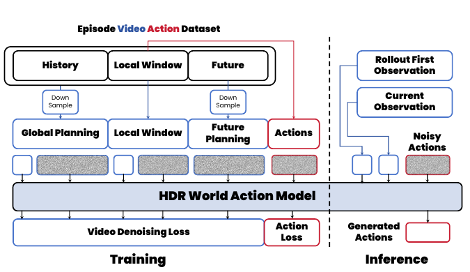

**Caption:** Figure 9: Overview of the HDR-WAM actor. The model combines sparse episode-level visual context with a local action-conditioned rollout, then arranges episode, local visual, and action tokens in a joint sequence. The attention mask separates visual denoising from executable action prediction: action tokens attend to action tokens and clean visual conditions, while visual tokens denoise future observations under language, proprioception, and grouped action context.

**Caption[CN]:** 图 9：HDR-WAM actor 概览。该模型将稀疏的轨迹级视觉上下文与局部动作条件 rollout 相结合，随后将轨迹、局部视觉和动作 token 排列为一个联合序列。注意力掩码将视觉去噪与可执行动作预测分离：动作 token 关注动作 token 和干净视觉条件，而视觉 token 则在语言、本体感觉和分组动作上下文的条件下，对未来观测进行去噪。

**Caption:** Overview of the HDR-WAM actor.

**Caption[CN]:** HDR-WAM actor 总览。

> <strong>Para. 13:</strong> <strong>Figure 9:</strong> Overview of the HDR-WAM actor. The model combines sparse episode-level visual context with a local action-conditioned rollout, then arranges episode, local visual, and action tokens in a joint sequence. The attention mask separates visual denoising from executable action prediction: action tokens attend to action tokens and clean visual conditions, while visual tokens denoise future observations under language, proprioception, and grouped action context.

> <strong>Para. 13[CN]:</strong> <strong>图 9：</strong>HDR-WAM actor 概览。该模型将稀疏的轨迹级视觉上下文与局部动作条件 rollout 相结合，随后将轨迹、局部视觉和动作 token 排列为一个联合序列。注意力掩码将视觉去噪与可执行动作预测分离：动作 token 关注动作 token 和干净视觉条件，而视觉 token 则在语言、本体感觉和分组动作上下文的条件下，对未来观测进行去噪。

### A.2 RoboDojo Data Processing  
### A.2 RoboDojo 数据处理

> <strong>Para. 14:</strong> For each training sample, we construct both temporal views from the same RoboDojo episode. The global view samples 9 RGB frames uniformly from the entire episode, forming sparse anchors for task-level progress. The local action-conditioned view starts at the current frame, takes 9 consecutive local RGB frames under the dataset stride, and appends 4 future landmarks sampled uniformly between the end of the local window and the end of the episode. If the remaining episode is shorter than required, the final available frame is repeated. Thus each local view contains 13 RGB frames, while action supervision remains aligned to the 8 transitions inside the local 9-frame window.

> <strong>Para. 14[CN]:</strong> 对于每个训练样本，我们从同一个 RoboDojo 轨迹构造两个时间视图。全局视图从整个轨迹中均匀采样 9 帧 RGB 图像，形成用于表征任务级进展的稀疏锚点。局部动作条件视图从当前帧开始，按数据集步长获取 9 个连续的局部 RGB 帧，并在局部窗口末尾与轨迹末尾之间均匀采样并附加 4 个未来地标。如果剩余轨迹短于所需长度，则重复最后一个可用帧。因此，每个局部视图包含 13 帧 RGB 图像，而动作监督仍与局部 9 帧窗口内的 8 个转移对齐。

> <strong>Para. 15:</strong> RoboDojo observations use three camera views. We resize the top camera and the two wrist-side cameras, concatenate the side cameras horizontally, and stack the result under the top view before the standard resize, crop, and normalization pipeline. Both temporal views are encoded with the same video VAE and cached at the episode level, so the global anchors are shared by all samples from the same episode. This avoids repeatedly decoding the same long video while preserving the full episode context needed by HDR-WAM.

> <strong>Para. 15[CN]:</strong> RoboDojo 观测使用三个相机视图。我们调整顶视相机和两个腕侧相机的尺寸，将侧视相机图像水平拼接，并在执行标准的缩放、裁剪和归一化流程之前，将其堆叠在顶视图下方。两个时间视图均使用相同的视频 VAE 编码，并在轨迹级别缓存，因此同一轨迹中的所有样本共享全局锚点。这避免了对同一长视频进行重复解码，同时保留了 HDR-WAM 所需的完整轨迹上下文。

## B Benchmark and Eval Details  
## B 基准与评估细节

> <strong>Para. 1:</strong> We evaluate all methods on a mixed benchmark containing six long-horizon reasoning tasks: maze navigation, Tower of Hanoi, one-line drawing, sliding puzzle, Sokoban, and water pouring. These tasks cover diverse reasoning patterns, including spatial planning, state transition, object manipulation, and trajectory consistency.

> <strong>Para. 1[CN]:</strong> 我们在一个混合基准上评估所有方法，该基准包含六项长时程推理任务：迷宫导航、汉诺塔、一笔画、滑动拼图、推箱子和倒水。这些任务涵盖了多样的推理模式，包括空间规划、状态转移、物体操作和轨迹一致性。

> <strong>Para. 2:</strong> Each generated video is evaluated with task-specific success criteria and reported using two metrics. The success score $S \in \{0,1\}$ measures exact task completion under the benchmark-specific success criterion. The average progress score $A \in [0,1]$ measures partial progress toward the target outcome and is therefore more tolerant of minor visual deviations that do not alter the core semantic trajectory. Results in the main paper are reported as Success / Avg. Progress pairs, with both values multiplied by 100.

> <strong>Para. 2[CN]:</strong> 每个生成视频均使用任务特定的成功标准进行评估，并使用两项指标报告结果。成功得分 $S \in \{0,1\}$ 衡量是否按照基准特定的成功标准精确完成任务。平均进展得分 $A \in [0,1]$ 衡量朝向目标结果取得的部分进展，因此对不改变核心语义轨迹的轻微视觉偏差具有更高容忍度。主文中的结果以 Success / Avg. Progress 对的形式报告，两个数值均乘以 100。

> <strong>Para. 3:</strong> For a scored set $\mathcal{D}$, the reported task score is computed as the mean over evaluation samples:

> <strong>Para. 3[CN]:</strong> 对于一个已评分集合 $\mathcal{D}$，报告的任务得分计算为评估样本上的均值：

$$
\mathrm{Success}(\mathcal{D})
=
\frac{1}{|\mathcal{D}|}
\sum_{i\in\mathcal{D}} S_i,
\qquad
\mathrm{Avg.\ Progress}(\mathcal{D})
=
\frac{1}{|\mathcal{D}|}
\sum_{i\in\mathcal{D}} A_i.
$$

> <strong>Para. 4:</strong> The overall score is obtained by averaging the task-level scores across the six benchmarks. This gives equal weight to each reasoning task and reflects the model’s robustness across different forms of long-horizon video reasoning.

> <strong>Para. 4[CN]:</strong> 总体得分通过对六个基准上的任务级得分取平均得到。这为每项推理任务赋予相同权重，并反映模型在不同形式的长时程视频推理中的鲁棒性。

> <strong>Para. 5:</strong> The benchmark uses task-specific difficulty levels. Maze and Hanoi are grouped by native problem size, while the remaining four tasks use level directories. The evaluation split is summarized in Table 4.

> <strong>Para. 5[CN]:</strong> 该基准采用任务特定的难度等级。Maze 和 Hanoi 按原生问题规模分组，而其余四项任务使用等级目录。评估划分汇总于表 4。

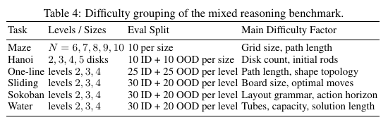

**Caption:** Table 4: Difficulty grouping of the mixed reasoning benchmark.

**Caption[CN]:** 表 4：混合推理基准的难度分组。

**Caption:** Difficulty grouping of the mixed reasoning benchmark.

**Caption[CN]:** 混合推理基准的难度分组。

> <strong>Para. 6:</strong> <strong>Table 4:</strong> Difficulty grouping of the mixed reasoning benchmark.

> <strong>Para. 6[CN]:</strong> <strong>表 4：</strong>混合推理基准的难度分组。

| Task | Levels / Sizes | Eval Split | Main Difficulty Factor |
|---|---|---|---|
| Maze | $N = 6, 7, 8, 9, 10$ | 10 per size | Grid size, path length |
| Hanoi | 2, 3, 4, 5 disks | 10 ID + 10 OOD per size | Disk count, initial rods |
| One-line | levels 2, 3, 4 | 25 ID + 25 OOD per level | Path length, shape topology |
| Sliding | levels 2, 3, 4 | 30 ID + 20 OOD per level | Board size, optimal moves |
| Sokoban | levels 2, 3, 4 | 30 ID + 20 OOD per level | Layout grammar, action horizon |
| Water | levels 2, 3, 4 | 30 ID + 20 OOD per level | Tubes, capacity, solution length |

| 任务 | 等级／规模 | 评估划分 | 主要难度因素 |
|---|---|---|---|
| Maze（迷宫） | $N = 6, 7, 8, 9, 10$ | 每个规模 10 个 | 网格规模、路径长度 |
| Hanoi（汉诺塔） | 2、3、4、5 个圆盘 | 每个规模 10 ID + 10 OOD | 圆盘数量、初始柱位置 |
| One-line（一笔画） | 等级 2、3、4 | 每个等级 25 ID + 25 OOD | 路径长度、形状拓扑 |
| Sliding（滑动拼图） | 等级 2、3、4 | 每个等级 30 ID + 20 OOD | 棋盘大小、最优步数 |
| Sokoban（推箱子） | 等级 2、3、4 | 每个等级 30 ID + 20 OOD | 布局语法、动作视界 |
| Water（倒水） | 等级 2、3、4 | 每个等级 30 ID + 20 OOD | 试管数量、容量、解长度 |

### B.1 Maze Navigation  
### B.1 迷宫导航

> <strong>Para. 7:</strong> Maze samples are generated on square grids with fixed start $(0,0)$ and goal $(N-1,N-1)$. The generator constructs a recursive-division maze graph, solves it with breadth-first search, stores the graph edges and solution path, and renders a red ball moving along the path. The default evaluation set contains 50 samples, with 10 samples for each $N \in \{6,7,8,9,10\}$.

> <strong>Para. 7[CN]:</strong> Maze 样本在方形网格上生成，起点固定为 $(0,0)$，终点固定为 $(N-1,N-1)$。生成器构建递归分割迷宫图，使用广度优先搜索求解，存储图边和解路径，并渲染一个沿该路径移动的红球。默认评估集包含 50 个样本，对每个 $N \in \{6,7,8,9,10\}$ 均包含 10 个样本。

> <strong>Para. 8:</strong> The evaluator tracks the red ball using color segmentation and connected components. The success score requires the decoded route to start correctly, remain in open cells, move only through valid graph edges, and reach the goal. The average progress score is the normalized longest-common-subsequence overlap between the relaxed decoded route $\hat{r}$ and the reference path $r^\star$:

> <strong>Para. 8[CN]:</strong> 评估器使用颜色分割和连通组件跟踪红球。成功得分要求解码路线正确起始、始终处于开放单元格中、仅沿有效图边移动，并到达目标。平均进展得分是宽松解码路线 $\hat{r}$ 与参考路径 $r^\star$ 之间经过归一化的最长公共子序列重叠度：

$$
A_{\mathrm{maze}}
=
\frac{\mathrm{LCS}(\hat{r},r^\star)}
{\max(1,|r^\star|)}.
$$

### B.2 Tower of Hanoi  
### B.2 汉诺塔

> <strong>Para. 9:</strong> Hanoi samples use 2–5 disks and three rods. In-domain samples initialize disks on rods $\{0,1\}$, while OOD samples may initialize disks on $\{0,1,2\}$ and require at least one disk to already appear on the goal rod. The goal is always rod 2. For each initial assignment, the generator solves the shortest legal plan with breadth-first search and renders one lifted disk move at a time.

> <strong>Para. 9[CN]:</strong> Hanoi 样本使用 2–5 个圆盘和三根柱子。域内样本将圆盘初始化于柱 $\{0,1\}$ 上，而 OOD 样本可将圆盘初始化于柱 $\{0,1,2\}$ 上，并要求至少有一个圆盘已经出现在目标柱上。目标始终为柱 2。对于每种初始分配，生成器使用广度优先搜索求解最短合法计划，并一次渲染一个被抬起的圆盘移动。

> <strong>Para. 10:</strong> The evaluator decodes disk tracks, infers moves of the form $(\mathrm{disk}, \mathrm{source}, \mathrm{target})$, and simulates them from the ground-truth initial state. The success score requires all inferred moves to be legal and the final state to place every disk on the goal rod. The average progress score measures plan overlap with the reference shortest plan:

> <strong>Para. 10[CN]:</strong> 评估器解码圆盘轨迹，推断形如 $(\mathrm{disk}, \mathrm{source}, \mathrm{target})$ 的移动，并从真实初始状态开始模拟这些移动。成功得分要求所有推断出的移动均合法，且最终状态将每个圆盘都置于目标柱上。平均进展得分衡量与参考最短计划之间的计划重叠：

$$
A_{\mathrm{hanoi}}
=
\frac{2\,\mathrm{LCS}(\hat{m},m^\star)}
{|\hat{m}|+|m^\star|}.
$$

### B.3 One-line Drawing  
### B.3 一笔画

> <strong>Para. 11:</strong> One-line drawing levels 2, 3, 4 use increasingly larger boards and longer self-avoiding paths. The generator samples a topology family, searches for an adjacent-cell path without revisits, applies random geometric transforms, checks uniqueness and shape constraints, and treats the resulting path as both the occupied shape and the required solution. In the evaluation set, level 2 uses a $9 \times 9$ board, level 3 uses $10 \times 10$, and level 4 uses $12 \times 12$.

> <strong>Para. 11[CN]:</strong> 一笔画的等级 2、3、4 使用逐渐增大的棋盘和更长的自避路径。生成器从一个拓扑族中采样，搜索一条不重复访问的相邻单元格路径，施加随机几何变换，检查唯一性和形状约束，并将所得路径同时视为被占据的形状和所需解。在评估集中，等级 2 使用 $9 \times 9$ 棋盘，等级 3 使用 $10 \times 10$ 棋盘，等级 4 使用 $12 \times 12$ 棋盘。

> <strong>Para. 12:</strong> The evaluator extracts the drawing head, visited cells, white trace cells, and whether the trace remains on the required shape. The success score requires starting from the highlighted cell, covering every occupied cell, avoiding revisits, avoiding non-adjacent jumps, and never leaving the shape. A small visual bridge tolerance is allowed when the white trace already connects an apparent short jump. The average progress score combines coverage, legal-transition ratio, and on-shape ratio:

> <strong>Para. 12[CN]:</strong> 评估器提取绘制头、已访问单元格、白色轨迹单元格，以及轨迹是否保持在所需形状上。成功得分要求从高亮单元格开始，覆盖每个被占据单元格，避免重复访问，避免非相邻跳跃，并且绝不离开形状。当白色轨迹已经连接一个表面上的短跳跃时，允许少量视觉桥接容差。平均进展得分结合覆盖率、合法转移比例和在形状上比例：

$$
A_{\mathrm{one}}
=
0.5C_{\mathrm{cover}}
+
0.3R_{\mathrm{legal}}
+
0.2R_{\mathrm{shape}}.
$$

### B.4 Sliding Puzzle  
### B.4 滑动拼图

> <strong>Para. 13:</strong> Sliding puzzle levels 2 and 3 use $3 \times 3$ boards, while level 4 uses a $4 \times 4$ board. The goal state is the ordered board with the blank tile in the final position. For $3 \times 3$ puzzles, states are sampled from an exact solvable pool under bucket constraints; for $4 \times 4$ puzzles, states are sampled by backward scrambling from the goal. Each accepted sample is solved optimally and filtered by solution length, family, and diversity constraints.

> <strong>Para. 13[CN]:</strong> 滑动拼图的等级 2 和 3 使用 $3 \times 3$ 棋盘，而等级 4 使用 $4 \times 4$ 棋盘。目标状态是空白块位于最后位置的有序棋盘。对于 $3 \times 3$ 拼图，状态在桶约束下从一个精确可解池中采样；对于 $4 \times 4$ 拼图，状态通过从目标状态向后打乱进行采样。每个接受的样本均以最优方式求解，并按解长度、族别和多样性约束进行筛选。

> <strong>Para. 14:</strong> The evaluator decodes board states from video frames and selects the best legal subsequence starting at the initial state. The success score requires the subsequence to reach the goal, preserve tile inventory, contain no illegal blank moves, and have an unresolved-frame ratio below 0.8. The average progress score combines normalized Manhattan progress, final-state quality, rule adherence, and observability:

> <strong>Para. 14[CN]:</strong> 评估器从视频帧中解码棋盘状态，并选择从初始状态开始的最佳合法子序列。成功得分要求该子序列到达目标、保持方块集合不变、不包含非法空白块移动，并且未解析帧比例低于 0.8。平均进展得分结合归一化 Manhattan 进展、最终状态质量、规则遵守程度和可观测性：

$$
A_{\mathrm{slide}}
=
0.45P
+
0.20Q_{\mathrm{final}}
+
0.20R_{\mathrm{rule}}
+
0.15R_{\mathrm{obs}}.
$$

### B.5 Sokoban  
### B.5 推箱子

> <strong>Para. 15:</strong> Sokoban samples use an $8 \times 8$ grid with walls, one player, one box, and one target. The generator builds layouts from grammar operators, samples valid player and box positions, solves each candidate with shortest-path search, and filters by action length, push count, box-target distance, deadlock-like cells, and diversity. Higher levels use longer and more constrained layouts.

> <strong>Para. 15[CN]:</strong> Sokoban 样本使用一个 $8 \times 8$ 网格，其中包含墙壁、一名玩家、一个箱子和一个目标。生成器从语法算子构建布局，采样有效的玩家和箱子位置，使用最短路径搜索求解每个候选项，并按动作长度、推箱次数、箱子—目标距离、类死锁单元格和多样性进行筛选。较高等级使用更长且约束更多的布局。

> <strong>Para. 16:</strong> The evaluator decodes player and box positions and checks whether the recovered state sequence can be explained by legal walking and pushing. The success score requires the player and box to start correctly, the box to end on the target, no wall crossing or overlap, no illegal pulling or pushing, and an unresolved-frame ratio below 0.8. The average progress score emphasizes box progress toward the target:

> <strong>Para. 16[CN]:</strong> 评估器解码玩家和箱子的位置，并检查恢复的状态序列能否由合法行走和推动解释。成功得分要求玩家和箱子正确起始、箱子最终位于目标上、没有穿墙或重叠、没有非法拉动或推动，并且未解析帧比例低于 0.8。平均进展得分强调箱子朝向目标的进展：

$$
A_{\mathrm{sokoban}}
=
0.50P_{\mathrm{box}}
+
0.20Q_{\mathrm{final}}
+
0.15R_{\mathrm{rule}}
+
0.15R_{\mathrm{obs}}.
$$

### B.6 Water Pouring  
### B.6 倒水

> <strong>Para. 17:</strong> Water pouring samples contain vertical tubes with fixed capacity and colored blocks. The generator constructs a solved goal state, samples a backward chain of legal reverse pours to obtain an initial state, solves or validates the resulting puzzle, and filters candidates by solution length, buried blocks, color runs, branching factor, and state diversity. Higher levels increase tube count, color count, capacity, and solution horizon.

> <strong>Para. 17[CN]:</strong> 倒水样本包含具有固定容量和有色块的竖直试管。生成器构造一个已解的目标状态，采样一条合法逆向倒水的反向链以获得初始状态，求解或验证所得谜题，并按解长度、被掩埋的色块、同色连续段、分支因子和状态多样性筛选候选项。较高等级会增加试管数量、颜色数量、容量和解视界。

> <strong>Para. 18:</strong> The evaluator extracts tube states from stationary frames. A legal move transfers the complete contiguous top run of one color into an empty tube or onto the same color, limited by remaining destination capacity. The success score requires the final tube state to be solved, all decoded transitions to be legal, block conservation and capacity constraints to hold, and unresolved stationary frames to remain below 0.35. The average progress score combines rule adherence, progress, final-state quality, and observability:

> <strong>Para. 18[CN]:</strong> 评估器从静止帧中提取试管状态。一次合法移动将一种颜色完整且连续的顶部色块段转移到空试管中，或转移到相同颜色上，且受目标试管剩余容量限制。成功得分要求最终试管状态已解、所有解码出的转移均合法、满足色块守恒和容量约束，并且未解析静止帧保持低于 0.35。平均进展得分结合规则遵守程度、进展、最终状态质量和可观测性：

$$
A_{\mathrm{water}}
=
0.45R_{\mathrm{rule}}
+
0.35P
+
0.15Q_{\mathrm{final}}
+
0.05R_{\mathrm{obs}}.
$$

---

## C Entropy-Matched versus Fully Denoised Hierarchies

> <strong>Para. 1:</strong> Our final ablation studies how denoising budgets should be allocated across the hierarchy. A naive strategy is to fully denoise every hierarchy level before moving to the next one. In our implementation, this corresponds to assigning 50 denoising steps to all layers. Although intuitive, this strategy ignores the different entropy scales of different hierarchy levels. Coarse layers contain fewer temporal tokens and represent lower-resolution hypotheses, while fine layers contain more tokens and carry more detailed visual entropy. Therefore, forcing all levels to remove the same amount of uncertainty is not well matched to the hierarchical representation.

> <strong>Para. 1[CN]:</strong> 我们最后一项消融研究考察了应如何在层级结构中分配去噪预算。一种朴素策略是在进入下一层之前，对每个层级都进行完全去噪。在我们的实现中，这对应于为所有层分配 50 个去噪步。尽管这一策略直观，但它忽略了不同层级具有不同的熵尺度。粗粒度层包含较少的时间 token，并表示低分辨率假设；而细粒度层包含更多 token，并承载更细致的视觉熵。因此，强制所有层消除相同数量的不确定性，与这种层级表示并不匹配。

> <strong>Para. 2:</strong> We instead use an entropy-matched denoising schedule. Let $N_\ell$ denote the number of tokens at layer $\ell$, and let $\tilde{N}_\ell$ denote its effective temporal support. Since a finer layer represents a larger number of temporal degrees of freedom, we assume that the entropy to be removed at layer $\ell$ should grow with its effective support:

> <strong>Para. 2[CN]:</strong> 相反，我们采用熵匹配的去噪调度。令 $N_\ell$ 表示第 $\ell$ 层的 token 数量，令 $\tilde{N}_\ell$ 表示其有效时间支持。由于更细的层表示更多的时间自由度，我们假设第 $\ell$ 层应被消除的熵会随其有效支持而增长：

$$
\Delta H_\ell \propto \tilde{N}_\ell^\beta,
$$

> <strong>Para. 3:</strong> where $\beta$ is a tunable parameter controlling how aggressively denoising budget increases from coarse to fine layers. Larger $\beta$ allocates more denoising steps to fine layers, while smaller $\beta$ makes the schedule more uniform.

> <strong>Para. 3[CN]:</strong> 其中，$\beta$ 是一个可调参数，用于控制去噪预算从粗粒度层到细粒度层增长的激进程度。较大的 $\beta$ 会向细粒度层分配更多去噪步，而较小的 $\beta$ 则使调度更加均匀。

> <strong>Para. 4:</strong> We convert this entropy allocation into a layer-wise denoising budget:

> <strong>Para. 4[CN]:</strong> 我们将该熵分配转换为逐层去噪预算：

$$
K_\ell =
\left\lceil
K_{\max}
\left(
\frac{\tilde{N}_\ell}{\tilde{N}_L}
\right)^\beta
\right\rceil,
$$

> <strong>Para. 5:</strong> where $K_{\max}$ is the maximum denoising budget used by the finest layer. This rule gives fewer denoising steps to coarse layers and more steps to fine layers, matching the intuition that coarse layers should preserve uncertainty while fine layers should resolve it into concrete visual states.

> <strong>Para. 5[CN]:</strong> 其中，$K_{\max}$ 是最细粒度层所使用的最大去噪预算。该规则为粗粒度层分配较少的去噪步、为细粒度层分配更多的去噪步，这与如下直觉相符：粗粒度层应保留不确定性，而细粒度层应将其解析为具体的视觉状态。

> <strong>Para. 6:</strong> For the 21-frame setting, our hierarchy has actual layer sizes:

> <strong>Para. 6[CN]:</strong> 对于 21 帧的设置，我们的层级结构具有如下实际层大小：

$$
N_\ell = [1, 2, 4, 8, 16, 21].
$$

> <strong>Para. 7:</strong> The last layer is truncated by the video length, but the underlying binary hierarchy has effective temporal supports:

> <strong>Para. 7[CN]:</strong> 最后一层会受到视频长度的截断，但底层二叉层级结构具有如下有效时间支持：

$$
\tilde{N}_\ell = [1, 2, 4, 8, 16, 32].
$$

> <strong>Para. 8:</strong> Using $K_{\max} = 50$ and $\beta = 0.66$, the entropy-matched rule gives:

> <strong>Para. 8[CN]:</strong> 采用 $K_{\max} = 50$ 和 $\beta = 0.66$ 时，熵匹配规则给出：

$$
K_\ell =
\left\lceil
50
\left(
\frac{[1, 2, 4, 8, 16, 32]}{32}
\right)^{0.66}
\right\rceil
=
[5, 8, 13, 20, 32, 50].
$$

> <strong>Para. 9:</strong> This is the default denoising schedule used by HDR in the main experiments.

> <strong>Para. 9[CN]:</strong> 这是 HDR 在主要实验中使用的默认去噪调度。

> <strong>Para. 10:</strong> This schedule can also be interpreted through the lens of uncertainty preservation. Coarse layers remove only a small fraction of their uncertainty, so they act as flexible high-level hypotheses. Fine layers remove much more entropy, allowing them to instantiate these hypotheses into detailed frame-level latents. In contrast, the All-50 strategy sets

> <strong>Para. 10[CN]:</strong> 该调度也可以从不确定性保留的视角来理解。粗粒度层仅消除其不确定性的一小部分，因此它们充当灵活的高层假设。细粒度层消除更多熵，从而能够将这些假设实例化为细致的帧级 latent。相比之下，All-50 策略设定：

$$
K_1 = K_2 = \cdots = K_L = 50,
$$

> <strong>Para. 11:</strong> which forces every level to remove the same amount of uncertainty regardless of its temporal scale. This prematurely collapses high-level hypotheses and reduces the ability of lower layers to correct or refine them.

> <strong>Para. 11[CN]:</strong> 这迫使每个层级无论其时间尺度如何，都移除相同数量的不确定性。这会过早地坍缩高层假设，并削弱低层对其进行纠正或细化的能力。

> <strong>Para. 12:</strong> Table 5 compares the entropy-matched schedule with fully denoised and alternative schedules. The All-50 variant performs worse overall than the entropy-matched schedule: the overall success score drops from 60.29 to 58.38, and the average progress score drops from 89.56 to 88.21. We also include two additional schedules for completeness: a sparse-to-full schedule $[5, 5, 5, 5, 5, 50]$, which keeps coarse layers minimally denoised before fully denoising the finest layer, and an exponential schedule $[2, 4, 8, 16, 32, 50]$, which increases the denoising budget more aggressively. Their benchmark results are left blank.

> <strong>Para. 12[CN]:</strong> 表 5 将熵匹配调度与完全去噪及其他替代调度进行了比较。All-50 变体的总体表现差于熵匹配调度：总体成功分数从 60.29 降至 58.38，平均进度分数从 89.56 降至 88.21。为完整起见，我们还纳入了两种额外调度：稀疏到完全调度 $[5, 5, 5, 5, 5, 50]$，其在对最细层进行完全去噪之前仅对粗粒度层进行最小程度的去噪；以及指数调度 $[2, 4, 8, 16, 32, 50]$，其更激进地增加去噪预算。它们的基准测试结果留空。

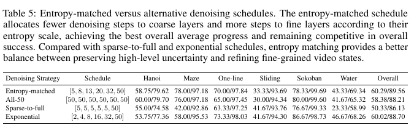

**Caption:** Table 5: Entropy-matched versus alternative denoising schedules.** The entropy-matched schedule allocates fewer denoising steps to coarse layers and more steps to fine layers according to their entropy scale, achieving the best overall average progress and remaining competitive in overall success. Compared with sparse-to-full and exponential schedules, entropy matching provides a better balance between preserving high-level uncertainty and refining fine-grained video states.

**Caption[CN]:** 表 5：熵匹配与替代去噪调度。** 熵匹配调度根据各层的熵尺度，为粗粒度层分配较少去噪步、为细粒度层分配更多去噪步，取得了最佳的总体平均进度，并在总体成功率方面保持竞争力。与稀疏到完全调度和指数调度相比，熵匹配在保留高层不确定性与细化细粒度视频状态之间提供了更好的平衡。

**Caption:** Entropy-matched versus alternative denoising schedules.

**Caption[CN]:** 熵匹配与其他去噪调度对比。

**Table 5: Entropy-matched versus alternative denoising schedules.** The entropy-matched schedule allocates fewer denoising steps to coarse layers and more steps to fine layers according to their entropy scale, achieving the best overall average progress and remaining competitive in overall success. Compared with sparse-to-full and exponential schedules, entropy matching provides a better balance between preserving high-level uncertainty and refining fine-grained video states.

**表 5：熵匹配与替代去噪调度。** 熵匹配调度根据各层的熵尺度，为粗粒度层分配较少去噪步、为细粒度层分配更多去噪步，取得了最佳的总体平均进度，并在总体成功率方面保持竞争力。与稀疏到完全调度和指数调度相比，熵匹配在保留高层不确定性与细化细粒度视频状态之间提供了更好的平衡。

| Denoising Strategy | Schedule | Hanoi | Maze | One-line | Sliding | Sokoban | Water | Overall |
|---|---|---:|---:|---:|---:|---:|---:|---:|
| Entropy-matched | [5, 8, 13, 20, 32, 50] | 58.75/79.62 | 78.00/97.18 | 70.00/97.84 | 33.33/93.69 | 78.33/99.69 | 43.33/69.34 | 60.29/89.56 |
| All-50 | [50, 50, 50, 50, 50, 50] | 60.00/79.70 | 76.00/97.18 | 65.00/97.45 | 30.00/94.34 | 80.00/99.60 | 41.67/65.32 | 58.38/88.21 |
| Sparse-to-full | [5, 5, 5, 5, 5, 50] | 55.00/74.58 | 42.00/92.86 | 63.33/97.25 | 41.67/93.76 | 76.67/99.33 | 23.33/58.99 | 50.33/86.13 |
| Exponential | [2, 4, 8, 16, 32, 50] | 53.75/77.36 | 58.00/95.53 | 73.33/98.03 | 41.67/94.30 | 86.67/98.73 | 46.67/68.26 | 60.02/88.70 |

## D Time Complexity Analysis

> <strong>Para. 1:</strong> We analyze the temporal attention complexity of bidirectional diffusion, Streaming AR Diffusion, and HDR. Let $N$ denote the number of frame-level video tokens and $K$ denote the number of denoising steps. We omit constant factors such as hidden dimension, number of heads, model depth, and the fixed number of tokens attended by HDR.

> <strong>Para. 1[CN]:</strong> 我们分析双向扩散、Streaming AR Diffusion 和 HDR 的时间注意力复杂度。令 $N$ 表示帧级视频 token 的数量，令 $K$ 表示去噪步数。我们省略了隐藏维度、注意力头数、模型深度以及 HDR 所关注的固定 token 数量等常数因子。

> <strong>Para. 2:</strong> **Bidirectional diffusion.** Bidirectional diffusion updates the full video sequence at every denoising step. Each token attends to all $N$ tokens, so one denoising step costs $\mathcal{O}(N^2)$ temporal attention. With $K$ denoising steps, the total complexity is:

> <strong>Para. 2[CN]:</strong> **双向扩散。** 双向扩散在每个去噪步更新完整视频序列。每个 token 都关注全部 $N$ 个 token，因此一个去噪步的时间注意力成本为 $\mathcal{O}(N^2)$。经过 $K$ 个去噪步后，总复杂度为：

$$
\mathcal{O}(KN^2).
$$

> <strong>Para. 3:</strong> This dense all-to-all interaction supports global reasoning, but it repeatedly recomputes the full temporal attention map throughout inference.

> <strong>Para. 3[CN]:</strong> 这种稠密的全对全交互支持全局推理，但在整个推理过程中会反复重新计算完整的时间注意力图。

> <strong>Para. 4:</strong> **Streaming AR Diffusion.** Streaming AR Diffusion generates tokens from left to right. When generating token $i$, it attends to all previously generated tokens. Although KV caching avoids recomputing previous hidden states, the attention length still grows with time. Thus, the total temporal attention cost is:

> <strong>Para. 4[CN]:</strong> **Streaming AR Diffusion。** Streaming AR Diffusion 从左到右生成 token。在生成 token $i$ 时，它会关注此前生成的所有 token。尽管 KV 缓存避免了重新计算先前的隐藏状态，但注意力长度仍会随时间增长。因此，其总时间注意力成本为：

$$
\mathcal{O}\left(K\sum_{i=1}^{N} i\right) = \mathcal{O}(KN^2).
$$

> <strong>Para. 5:</strong> Therefore, Streaming AR Diffusion improves streaming efficiency compared with bidirectional diffusion, but its attention complexity with respect to the number of tokens remains quadratic.

> <strong>Para. 5[CN]:</strong> 因此，与双向扩散相比，Streaming AR Diffusion 提升了流式效率，但其相对于 token 数量的注意力复杂度仍然是二次的。

> <strong>Para. 6:</strong> **HDR.** HDR generates a hierarchical latent tree instead of a flat sequence. For a video with $N$ frame-level tokens, the total number of hierarchy tokens is linear in $N$; for example, a binary tree contains approximately $2N - 1$ nodes. More importantly, each token attends only to a fixed-size context, including its previous same-layer token, its parent, and neighboring parent tokens. Therefore, the temporal attention cost is linear in the number of hierarchy tokens:

> <strong>Para. 6[CN]:</strong> **HDR。** HDR 生成的是一棵层级 latent 树，而不是一个扁平序列。对于包含 $N$ 个帧级 token 的视频，层级 token 的总数随 $N$ 线性增长；例如，一棵二叉树约包含 $2N - 1$ 个节点。更重要的是，每个 token 仅关注固定大小的上下文，包括其前一个同层 token、其父节点以及相邻的父节点 token。因此，时间注意力成本关于层级 token 数量是线性的：

$$
\mathcal{O}(K_{\mathrm{avg}}N),
$$

> <strong>Para. 7:</strong> where $K_{\mathrm{avg}}$ denotes the average denoising budget across hierarchy tokens. Since the hierarchy contains approximately $2N - 1$ tokens for $N$ frame-level tokens, the full attention cost is $\mathcal{O}(K_{\mathrm{avg}}(2N - 1))$, which simplifies to $\mathcal{O}(K_{\mathrm{avg}}N)$. This linear-size hierarchy introduces a longer one-time prefill stage, 16.19s for HDR, compared with 1.48s for bidirectional diffusion and 2.44s for CausalForcing; however, the subsequent streaming latency remains 0.70s per latent and much faster than bidirectional diffusion at 37.92s. In practice, HDR assigns fewer denoising steps to coarse layers, so $K_{\mathrm{avg}}$ is smaller than the full denoising budget used by standard diffusion.

> <strong>Para. 7[CN]:</strong> 其中，$K_{\mathrm{avg}}$ 表示层级 token 的平均去噪预算。由于对于 $N$ 个帧级 token，该层级约包含 $2N - 1$ 个 token，完整注意力成本为 $\mathcal{O}(K_{\mathrm{avg}}(2N - 1))$，可简化为 $\mathcal{O}(K_{\mathrm{avg}}N)$。这种线性规模层级结构引入了更长的一次性预填充阶段：HDR 为 16.19s，而双向扩散为 1.48s、CausalForcing 为 2.44s；但是，后续流式延迟仍为每个 latent 0.70s，远快于双向扩散的 37.92s。在实践中，HDR 为粗粒度层分配更少的去噪步，因此 $K_{\mathrm{avg}}$ 小于标准扩散所用的完整去噪预算。

> <strong>Para. 8:</strong> This analysis highlights the main computational advantage of HDR. Although HDR introduces additional hierarchy tokens, their number grows only linearly with the video length. Since each hierarchy token attends to a constant-size context, the overall temporal attention cost remains linear in $N$. In contrast, both bidirectional diffusion and Streaming AR Diffusion have quadratic attention complexity with respect to the number of video tokens.

> <strong>Para. 8[CN]:</strong> 该分析突出了 HDR 的主要计算优势。尽管 HDR 引入了额外的层级 token，但其数量仅随视频长度线性增长。由于每个层级 token 都关注常数大小的上下文，整体时间注意力成本仍关于 $N$ 线性增长。相比之下，双向扩散和 Streaming AR Diffusion 相对于视频 token 数量均具有二次注意力复杂度。

## Critical Reading Notes / 批判性阅读提示

- HDR 的核心证据链是：层级数增加带来推理提升，熵匹配去噪优于各层完全去噪，同时 SHAP 将时间注意力复杂度降至线性量级。
- 主要结果区分了最终成功率与中间平均进度，但物理世界实验规模较小（50 条真实机器人视频），应视为迁移潜力证据，而非充分的通用机器人验证。
- 本读者严格按指定的 20 页版本收录：正文、参考文献及附录 A–D；未使用 PDF 后续扩展页中的附录 E–I 作为正文或精读证据。
