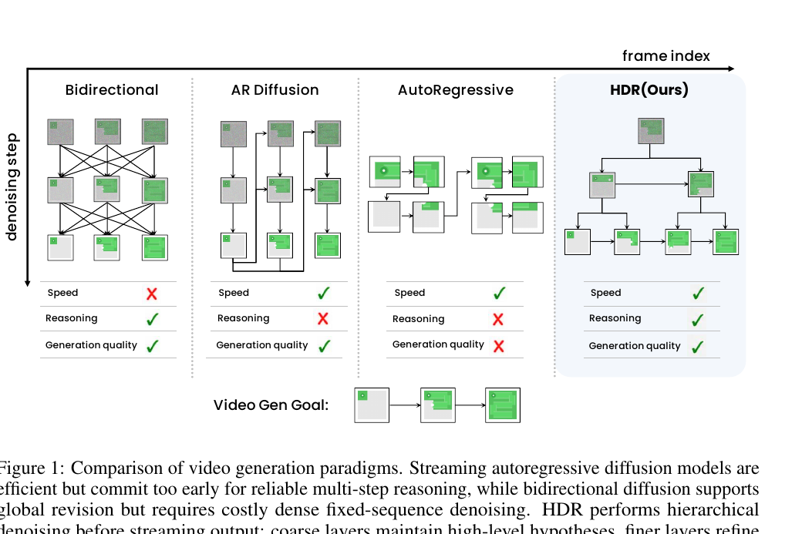
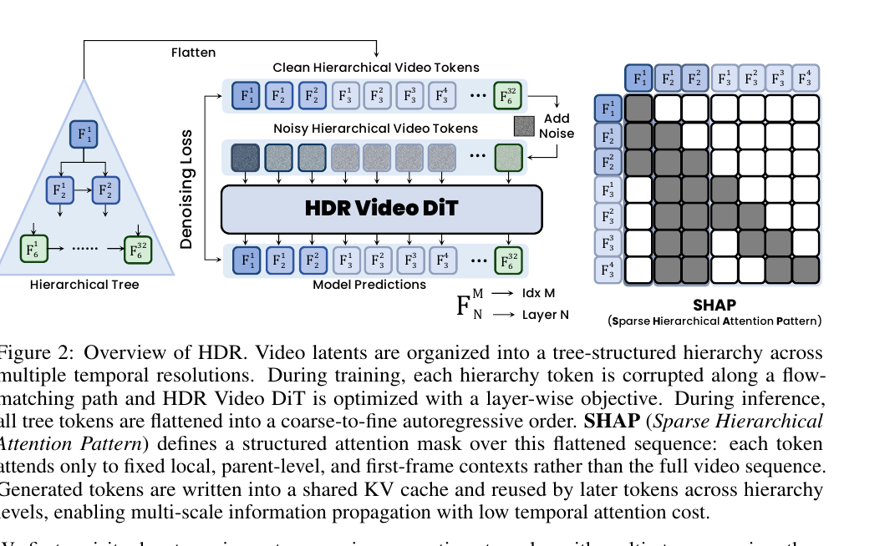
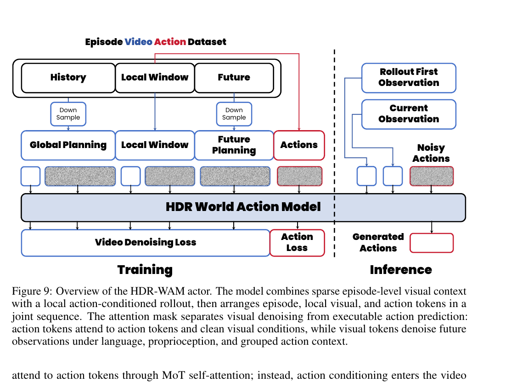
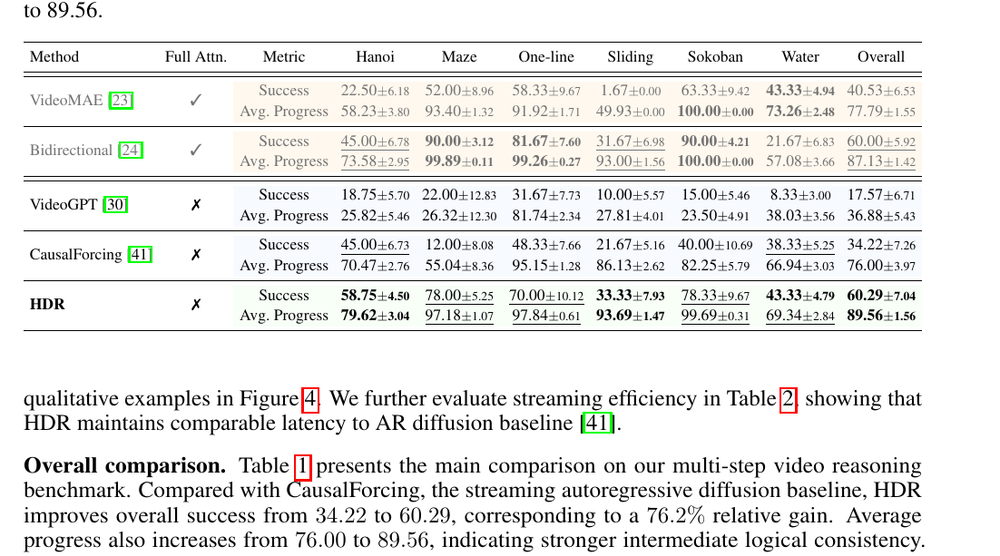
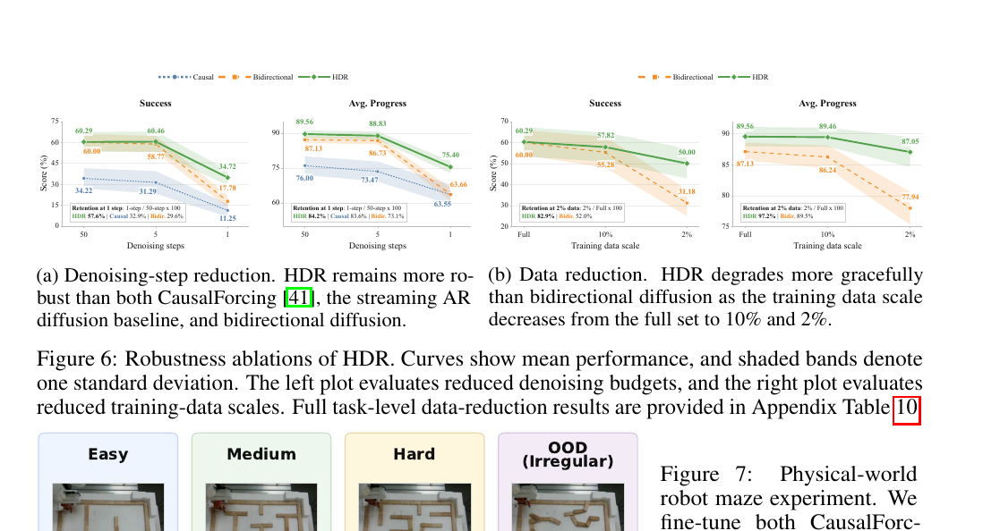
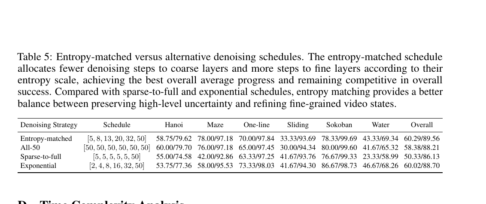
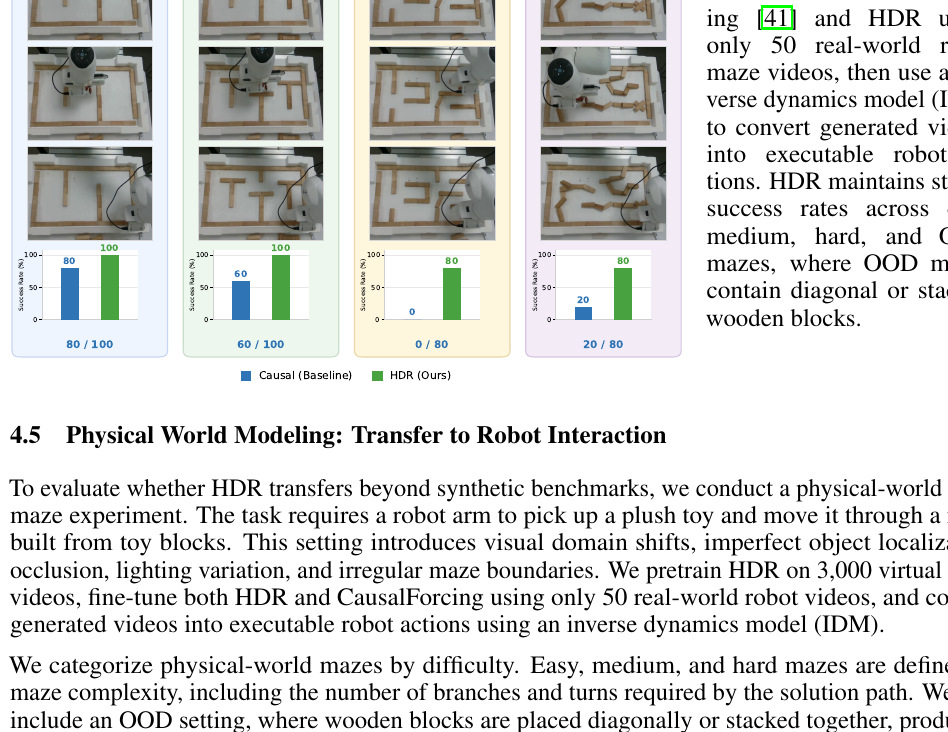
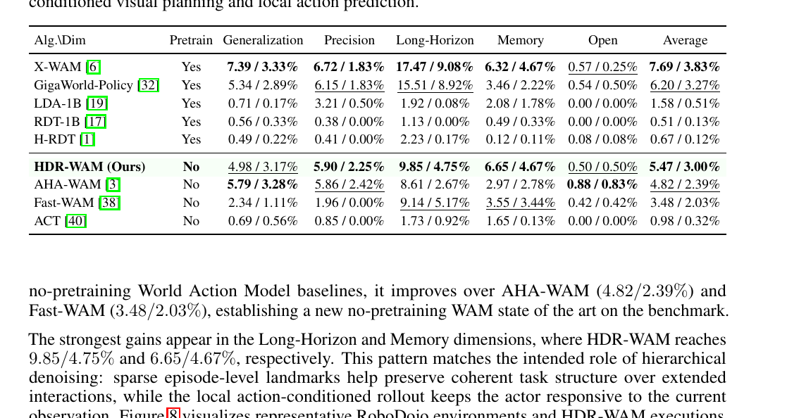

# Hierarchical Denoising For Multi-Step Visual Reasoning

> **作者**：Zezhong Qian, Xiaowei Chi, Chak-Wing Mak, Tianze Zhou, Ruibin Yuan, Yuhan Rui, Hengzhe Sun, Zhuoqun Wu, Yuming Li, Siyuan Qian, Sirui Han, Shanghang Zhang  
> **会议/年份**：NeurIPS 2026（论文首页）  
> **定位**：视频生成式推理 / streaming autoregressive diffusion / world model / embodied world-action modeling  
> **项目页**：https://hierarchical-diffusion-reasoning.github.io/  
> **源文件**：`Qian 等 - 2026 - Hierarchical Denoising For Multi-Step Visual Reasoning.pdf`

## 核心信息

这篇论文处理的不是“怎样让视频更清晰”，而是一个结构性矛盾：**多步视觉推理需要在看到整条候选轨迹后反复修正全局计划，而低延迟交互又要求模型按时间从左到右流式输出。** 双向扩散有全局 revision 能力，但每个去噪步都重算整段固定长度序列；streaming AR diffusion 能复用 KV cache，却会过早提交局部决策，后续只能条件于已经写死的历史。[第 2–4 页，Fig. 1，Sec. 1/3.1]

HDR（Hierarchical Denoising for Visual Reasoning）的回答是：**不要在完整帧序列上做昂贵的全局反复去噪，而是在输出帧之前先生成一棵由粗到细的 latent tree。** 粗层代表长时间跨度的、仍带不确定性的计划假设；细层逐渐把它们细化成局部视觉状态；最终帧级输出仍保持自回归流式生成。训练上，它给每一层独立做 flow matching；推理上，用 entropy-matched schedule 给粗层较少、细层较多的去噪步；计算上，用 SHAP 只连接局部、父层和首帧上下文。[第 4–6 页，Fig. 2，Sec. 3.2–3.4；第 19–20 页，App. C–D]

主结果值得重视：相对 CausalForcing，六任务平均 Success 从 **34.22 提升到 60.29**，Avg. Progress 从 **76.00 提升到 89.56**；steady-state streaming latency 为 **0.70 s**，与 CausalForcing 的 0.72 s 相当，而远快于 bidirectional diffusion 的 37.92 s。[第 7 页，Table 1–2] 但应把结论限定为：**在作者构造的、程序可判定的合成长程任务以及有限机器人验证上，层级预规划显著改善了因果视频生成器的逻辑一致性**；这还不是“通用视觉推理已解决”。

*Fig. 1（第 2 页）：HDR 把可修订的全局推理搬到流式帧输出之前的层级 latent 空间。*

## 原文摘要翻译

视频模型正在从视频合成器演化为视觉基础模型，但仍缺少类人的多步推理能力。现有 streaming autoregressive diffusion 模型效率高，却缺乏推理能力；bidirectional diffusion 虽可进行全局修订，但由于对固定序列中的密集帧反复去噪，推理成本高。因此，两者分别难以在复杂推理任务中维持逻辑一致性和低延迟流式生成。为弥合这一差距，我们提出 **HDR（Hierarchical Denoising for Visual Reasoning）**：一个将层级 latent 融入因果视频生成过程的统一多步推理框架。HDR 将视频 latent 组织成树状层级，在流式输出前执行由粗到细的推理。粗去噪层维持用于全局规划的不确定假设，细层则逐步将其细化为具体视觉状态。稀疏层级注意力模式 SHAP 进一步降低时间注意力成本。

我们构建了按层级难度划分、包含分布外样例的多步视频推理 benchmark，覆盖迷宫、汉诺塔、一笔画、滑块拼图、推箱子和倒水六项任务。相较 streaming autoregressive diffusion 基线，HDR 将总体成功率从 34.22 提升到 60.29（相对提升 76.2%），并将平均进度从 76.00 提升到 89.56，说明中间推理轨迹更加一致。部署上，HDR 的 streaming latency 为每个 latent 0.70 s，比双向扩散快 54.2 倍。只用 2% 训练数据时，HDR 仍保留全数据成功率的 82.9%，而双向扩散仅保留 52.0%。真实机器人实验进一步展示了 HDR 在物理交互中的潜力。[第 1 页，Abstract]

## 创新点

1. **把“全局修订”从帧时间轴迁移到层级时间抽象。** 真正新意不是一般意义上的多尺度表示，而是让粗 latent 在帧输出前承担可保留多假设的 planning buffer，再由细层提交到可视状态。[第 4–5 页，Sec. 3.1–3.2]
2. **Layer-wise flow matching + entropy-matched denoising budget。** 每层预测自己的 flow velocity，但粗层保留残余噪声，细层获得更多 steps。默认预算为 `[5, 8, 13, 20, 32, 50]`，而非每层 50 步。[第 5 页，Eq. 4；第 19 页，App. C]
3. **SHAP（Sparse Hierarchical Attention Pattern）。** 每个 token 只看同层前一个 token、父 token、相邻父区间边界和首帧条件，使时间注意力由二次增长变为与 hierarchy token 数近似线性，并允许跨层 KV-cache 共享。[第 5–6 页，Eq. 5–6；第 20 页，App. D]
4. **从合成 benchmark 延伸到实体交互。** 论文补了真实机器人 maze，以及把 HDR 迁移为 HDR-WAM，在 RoboDojo 42 个任务上联合生成未来视觉与 action chunk。[第 9–10 页，Sec. 4.5–4.6；第 15–16 页，App. A]

## 一句话总结

**HDR 用一棵先规划、后细化的 noisy latent tree，在不放弃 streaming AR 低延迟输出的前提下，部分恢复 bidirectional diffusion 的全局修订能力。**

## 研究问题

### 为什么现有两类视频生成范式都不够

- **Bidirectional diffusion**：每步联合更新完整序列，早期错误可被全局信息纠正；代价是 dense all-to-all attention 与每步全序列重算，时间注意力复杂度为 $\mathcal{O}(KN^2)$。[第 4 页，Eq. 1；第 20 页，App. D]
- **Streaming AR diffusion**：分解为 $p(z\mid c)=\prod_i p(z_i\mid z_{<i},c)$，可流式生成和复用 KV cache；但一旦 $z_i$ 形成错误决策，未来 token 只能继承它，不能改写历史。总注意力长度仍随序列增长，理论上也是 $\mathcal{O}(KN^2)$。[第 4 页，Eq. 2；第 20 页，App. D]
- **HDR 的假设**：全局 reasoning 不必在所有帧、所有 diffusion steps 上做 dense computation；只要有一个先于帧输出、结构化且可修订的 planning space，就可能兼得逻辑一致性与 causal deployment。[第 3–4 页]

论文依次检验：层级 latent 是否优于单层 causal latent；性能是否来自正确的层级去噪机制；这种归纳偏置能否迁移到 OOD、少数据、低 step、真实机器人和 WAM。Table 1、Fig. 5、Fig. 6、Table 5、Fig. 7 与 Table 3 分别对应这些命题，但机器人证据明显弱于主 benchmark。[第 7–10、19–20 页]

## 数据与任务定义

作者构建一个包含 **370 个 held-out videos** 的混合 benchmark，训练使用 **18,000 个视频推理样本**；方法建立在 Wan2.2-5B-TI2V 上、首帧条件、同一 flow-matching setup，HDR 使用 6 层 hierarchy。[第 6 页，Sec. 4.1]

六类任务是 maze navigation、Tower of Hanoi、one-line drawing、sliding puzzle、Sokoban 和 water pouring。Success 要求满足任务特定的完整完成条件；Avg. Progress 对部分进度更宽容；总体分数对六任务等权平均。[第 6–7 页，Table 1；第 17–18 页，App. B]

| 任务 | 难点与 OOD | 评估要点 |
|---|---|---|
| Maze | 网格尺寸、路径长度 | 红球轨迹合法并到终点；progress 用路径 LCS |
| Hanoi | 2–5 盘；OOD 初始分布 | 推断 `(disk, source, target)`，动作合法且完成 |
| One-line | 更大画板、更长路径 | 覆盖、合法转移、保持目标形状 |
| Sliding | 3×3 到 4×4 | 合法移动、目标状态、tile inventory、可观测性 |
| Sokoban | 8×8、复杂布局与死锁 | 人/箱轨迹合法，箱子到目标 |
| Water | 管数、颜色、容量与解长 | 倒水合法、守恒、最终解开 |

[第 17–18 页，Table 4，App. B.1–B.6]

优点是能程序化检查“中间过程是否合法”，比只看末帧更接近 multi-step reasoning。风险是任务主要为离散规则、低纹理、可合成状态，不能代表开放世界物理推理、语言歧义与真实视频感知噪声。

## 方法主线

*Fig. 2（第 4 页）：多时间分辨率 latent tree、共享 HDR Video DiT、逐层 loss 与 SHAP 掩码。*

### 层级 latent tree

HDR 将视频表示为 $\mathcal{T}=\{\mathcal{V}^1,\ldots,\mathcal{V}^L\}$，第 $\ell$ 层为 $\mathcal{V}^{\ell}=\{v_{\ell,1},\ldots,v_{\ell,N_\ell}\}$。第 1 层最粗、第 $L$ 层最细；每个非根 token 都有父节点 $\pi(\ell,i)$。粗 token 覆盖长时间范围、表达全局 plan；细 token 覆盖局部区间、负责具体动态与细节。[第 5 页，Eq. 3]

整棵树按 coarse-to-fine autoregressive order 展平：先生成上层 token，后续下层 token 以父级计划为条件 refinement，最终帧级 latent 才进入 streaming output。“可修订”发生在尚未提交帧之前，而不是回头改写已输出帧。[第 4–6 页，Fig. 2]

### Layer-wise flow matching

对干净 token $v^0_{\ell,i}$，采样 $\epsilon\sim\mathcal{N}(0,I)$，构造 $v^t_{\ell,i}=(1-t)v^0_{\ell,i}+t\epsilon$，目标速度 $u^t_{\ell,i}=\epsilon-v^0_{\ell,i}$。模型在时间 $t$、层级上下文 $h_{\ell,i}$ 与条件 $c$ 下预测 flow velocity，loss 对所有层和 token 求和，由 $\lambda_\ell$ 平衡。[第 5 页，Eq. 4]

关键不在“用了 flow matching”，而是同一 Video DiT 被迫为不同时间抽象学习不同功能：粗层学习任务结构和计划，细层学习运动与视觉实例化。

### Entropy-matched denoising schedule

21-frame 配置的有效时间支持为 $\tilde N_\ell=[1,2,4,8,16,32]$。作者假设每层应消除的熵满足 $\Delta H_\ell\propto \tilde N_\ell^\beta$，令

$$K_\ell=\left\lceil K_{\max}\left(\frac{\tilde N_\ell}{\tilde N_L}\right)^\beta\right\rceil.$$

$K_{\max}=50,\beta=0.66$ 得到 `[5,8,13,20,32,50]`。[第 19 页，App. C]

上层 token 少、时间跨度大，任务是保留多个全局解；若每层都 50 步完全去噪，上层会过早 collapse，削弱下层纠错。细层拥有更多自由度，才需要更多 steps 将不确定性落实为具体状态。[第 5、19 页]

### SHAP

对 $v_{\ell,i}$，可见上下文包括同层前一个 token、父 token、父区间左右邻居和首帧 clean condition；根层退化为首帧 + 同层 AR context。每行 mask 只有常数个目标，生成后 K/V 写入全局 hierarchy cache，后续层按 mask 读取。[第 5–6 页，Eq. 5–6]

同层前驱维持时间连续性，父节点传递计划，相邻父区间提供边界信息。对 $N$ 个帧级 token，约有 $2N-1$ 个 hierarchy tokens，总时间注意力为 $\mathcal{O}(K_{avg}N)$。[第 20 页，App. D]

但 HDR 有 16.19 s 的一次性 prefill，对比 bidirectional 1.48 s、CausalForcing 2.44 s；之后 steady-state 才为每 latent 0.70 s。[第 20 页] 因而“低延迟”准确含义是长 rollout 的摊销持续延迟低，不是首帧响应最快。

### HDR-WAM

HDR-WAM 构造两类视觉视图：稀疏 episode-level anchors 表达任务阶段和长程进度；local action-conditioned window 包含当前附近 9 帧，并追加 4 个未来 landmarks。动作 horizon 与 local visual transitions 对齐，而非与完整 episode anchors 对齐。[第 15 页，App. A.1]

*Fig. 9（第 16 页）：联合 video denoising loss 与 action loss；视觉与 action token 使用分离 block mask。*

动作 token 能看完整 action chunk 与 clean visual condition；视觉 token 不在 MoT self-attention 中直接看动作，而通过对 grouped action context 的 causal cross-attention 获取条件。实现时必须严格复现 mask 与 transition alignment。[第 15–16 页]

## 关键结果

### 主结果与强基线

| 方法 | Full attention | Overall Success | Overall Avg. Progress |
|---|---:|---:|---:|
| VideoMAE | ✓ | 40.53 | 77.79 |
| Bidirectional diffusion | ✓ | 60.00 | 87.13 |
| VideoGPT | ✗ | 17.57 | 36.88 |
| CausalForcing | ✗ | 34.22 | 76.00 |
| **HDR** | ✗ | **60.29** | **89.56** |

[第 7 页，Table 1]

相对 CausalForcing，HDR 的 Success 增加 **26.07 个百分点**（34.22→60.29，论文报告相对增益 76.2%），Progress 增加 **13.56 点**（76.00→89.56）。HDR 无 full attention 却达到与 bidirectional 同档 Success（60.29 vs 60.00）和更高 Progress（89.56 vs 87.13）。但 0.29 点差距结合标准差不足以宣称“显著击败”双向扩散；更稳妥是达到同档成功率，同时有更好轨迹进度和更低持续延迟。

HDR 也非每任务全面占优：Water Success 64.33，低于 VideoMAE 的 68.33，说明 hierarchy 并非对所有规则状态转换自动最优。[第 7 页]

### 0.70 s 的真实含义

Bidirectional 37.92 s，CausalForcing 0.72 s，HDR **0.70 s**；指标是“KV-cache 初始化后每个 streaming generation step 的平均时间”。摘要 54.2× 来自 37.92/0.70，但不包括 HDR 16.19 s hierarchy prefill。[第 7、20 页，Table 2，App. D] 对实时机器人还应报告首动作 latency、rollout 长度与 amortization point。

### 消融到底说明了什么

Fig. 5 从 1 层增加到 6 层，Success 约从 28.38 持续提高到 60.29，Progress 从 76.00 提高到 89.56；不是只在最后帧级 refinement 时跃升。[第 8 页，Fig. 5] 它支持 coarse-to-fine hierarchy，但不能排除额外 token、denoising compute 或 prefill 的贡献。需要 compute-matched flat latent、same-token non-tree、shuffled-parent 等对照。

- 仅 **1 个 denoising step** 时，HDR Success **34.72**，保留 full-step 的 **57.6%**；bidirectional 从 60.00 降至 17.78（29.6%），CausalForcing 从 34.22 降至 11.25（32.9%）。[第 8–9 页，Fig. 6a]
- 只用 **2% 数据**，HDR 保留 full-data Success 的 **82.9%**、Progress 的 **97.2%**；bidirectional 为 52.0% 与 89.5%。[第 8–9 页，Fig. 6b]

结果说明 hierarchy 提供高效结构先验，但“学到可迁移任务规则”仍是推断。2% 子集的任务覆盖、随机采样方差与跨任务迁移并未充分展示。

### Table 5：schedule 机制检验

| Schedule | Overall Success | Overall Avg. Progress |
|---|---:|---:|
| Entropy-matched `[5,8,13,20,32,50]` | **60.29** | **89.56** |
| All-50 `[50,50,50,50,50,50]` | 58.38 | 88.21 |
| Sparse-to-full `[5,5,5,5,5,50]` | 50.33 | 86.13 |
| Exponential `[2,4,8,16,32,50]` | 60.02 | 88.70 |

[第 19–20 页，App. C，Table 5]

Entropy-matched 比 All-50 高 1.91 Success / 1.35 Progress，支持“粗层保留不确定性优于全部完全去噪”；但与简单 Exponential 的 Success 只差 0.27，主要差在 Progress 0.86。因此证据支持预算从粗到细递增，却没有强力证明 $\beta=0.66$ 的熵匹配推导。论文未报告 $\beta$ sweep，也未实际测量每层 entropy。

### 机器人 maze

*Fig. 7（第 9 页）：仅用 50 个真实视频微调后，HDR 在 Easy/Medium/Hard/OOD 的成功率约为 100/100/90/80，CausalForcing 为 80/60/0/20。*

训练使用 3,000 个虚拟 maze videos，之后用 50 个真实机器人视频微调，再通过 inverse dynamics model 把生成视频转为动作。[第 9 页] 结果表明生成计划更可执行，但这不是端到端 policy；样本量也未在主文醒目标出，maze 仍是低维导航。

### HDR-WAM / RoboDojo

无 robot-domain 或 embodied-interaction pretraining 时，HDR-WAM Overall 为 **5.47 / 3.00%**，高于 AHA-WAM 4.82 / 2.39%、Fast-WAM 3.48 / 2.03% 与 ACT 0.98 / 0.32%；Long-Horizon 为 **9.85 / 4.75%**，Memory 为 **6.65 / 4.67%**。[第 9–10 页，Table 3]

但绝对 success rate 只有 3.00%，离可用策略很远；带预训练的 X-WAM Overall 仍为 7.69 / 3.83%。所谓“no-pretraining WAM state of the art”只应限定于该分组。

## 深度分析

### 真正贡献是什么

真正贡献是一个**时间抽象层面的推理接口**：在不可逆帧输出前建立更便宜、可逐级修订的内部轨迹。Layer-wise flow matching 是训练载体，SHAP 是效率实现，entropy schedule 管理上层假设的不确定性；三者共同服务于 latent tree。[第 4–6、19–20 页]

普通视频 pyramid 多为视觉分辨率层级；HDR 的层级轴是**有效时间支持与决策承诺程度**。越粗越像计划草图，越细越接近可观察状态。它把 diffusion noise 解释为 plan uncertainty，并用 schedule 主动管理。

### 为什么结果成立

1. **搜索空间先压缩再展开**：粗层用少 token 表达任务结构，再生成细节。[第 5 页]
2. **延迟承诺**：上层少去噪保留候选，下层在更多局部证据下决定。Table 5 支持递增 schedule，但对精确熵模型支持有限。[第 19–20 页]
3. **结构化信息瓶颈**：SHAP 迫使信息沿父级与局部边界传播，减少 dense attention 捷径。[第 5–6 页]
4. **benchmark 与归纳偏置匹配**：迷宫、汉诺塔、滑块、推箱子天然是全局计划—局部执行结构；这是方法合理性的证据，也是外推边界。[第 6–8、17–18 页]

### 与 bidirectional / streaming AR / WAM 的定位

| 范式 | 全局 revision | streaming/KV cache | 时间注意力 | 主要问题 |
|---|---|---|---|---|
| Bidirectional diffusion | 强 | 弱 | $\mathcal O(KN^2)$ | 37.92 s steady step |
| Streaming AR diffusion | 弱，历史不可改 | 强 | $\mathcal O(KN^2)$，可 cache | early commitment |
| HDR | 在帧输出前的 tree 中间接修订 | 强 | $\mathcal O(K_{avg}N)$ | 16.19 s prefill、强结构假设 |
| HDR-WAM | episode plan + local action rollout | 面向动作分块 | 层级 + block mask | RoboDojo 绝对成功率低 |

[第 2、4、7、15–16、20 页]

HDR-WAM 把 global episode anchors 与 local action-conditioned rollout 显式分开：前者负责阶段与长程 landmark，后者保持 actor 对当前 observation 的响应。这不同于单纯拉长 context，也不同于视频 imagination 后接 IDM；但仍依赖人工 temporal views 与 mask。[第 15–16 页]

### 容易误读与 overclaim

- “快 54.2×”只比较 cache 初始化后的 streaming step；HDR prefill 为 16.19 s。[第 7、20 页]
- “global reasoning 不需要 dense all-to-all”只在六个结构化任务上得到支持，未覆盖开放世界、多主体或非树状依赖。[第 10 页]
- “entropy-matched”更像合理启发式；没有直接估计 entropy，Exponential 已几乎追平 Success。[第 19–20 页]
- 少数据结果说明 inductive bias 高效，但未直接证明跨任务 rule transfer。[第 8–9 页]
- maze 依赖 IDM，RoboDojo success 仅 3.00%，不能扩展为成熟机器人闭环能力。[第 9–10 页]

### 复现注意点

1. 固定 Wan2.2-5B-TI2V、首帧条件、18k 数据和相同 flow-matching setup。[第 6 页]
2. 21-frame 配置 $N_\ell=[1,2,4,8,16,21]$，有效二叉支持 $\tilde N_\ell=[1,2,4,8,16,32]$；不要用 21 替代 32 算 schedule。[第 19 页]
3. 默认 $K_{max}=50,\beta=0.66$，预算 `[5,8,13,20,32,50]`；确认 ceil 与 sampler。[第 19 页]
4. SHAP 要精确实现同层前驱、parent、左右相邻 parent 和首帧；根层/边界 index 正确剔除。[第 5–6 页]
5. 展平顺序是先层后时间；每 token 生成后写入共享 hierarchy cache，避免未来信息泄漏。[第 4、6 页]
6. 六任务依赖 task-specific decoder：颜色分割、connected components、LCS、合法动作、unresolved-frame threshold 等。[第 17–18 页]
7. 时延应分别记录 prefill、time-to-first-action、steady-state、总 episode wall time、硬件/精度/batch。[第 7、20 页]
8. HDR-WAM 中 $N_e=9,N_l=9,N_f=4$；action supervision 对齐 local 9-frame window 的 8 transitions。[第 15–16 页]

## 局限

1. 主 benchmark 偏符号化，视觉复杂度低，不能覆盖真实感知、语言和物理不确定性。[第 6–8、17–18 页]
2. 缺少 compute/token-matched flat、随机树、branching factor、无 parent attention、SHAP vs dense hierarchy 等关键对照。
3. entropy 理论验证弱：未测量层熵，也未展示 $\beta$ 跨任务/长度稳定性。[第 19 页]
4. 16.19 s hierarchy prefill 可能不适合高频闭环；steady-state 指标掩盖启动成本。[第 20 页]
5. 若粗 plan 错误，SHAP 局部连接可能限制跨分支纠正；缺少 coarse-level failure taxonomy。
6. 机器人证据初步：maze 依赖 IDM，HDR-WAM 没有真实硬件长程闭环验证。[第 9–10 页]
7. 代码发布前，数据生成、评估脚本、训练成本、硬件、采样器与完整超参仍不足以无歧义复现。

## 我的笔记

### 对研究的直接启发

- **把 world model 的“思考”与“渲染”分开，但共享生成骨干。** 对 3D agent 可构造 scene graph—object trajectory—render latent 层级，上层定交互拓扑，下层生成几何与动作。
- **按承诺程度而非空间分辨率设计层级。** skill/subgoal 层少去噪保留候选，motor chunk 层多去噪获得可执行控制。
- **从树扩展到 reasoning graph。** 真实任务有回环、共享子目标与跨分支约束，可研究 learned latent DAG、动态 parent routing 或 uncertainty-driven adaptive branching。
- **诚实报告 latency。** planning/prefill、time-to-first-action、steady-state、episode total time 四个数字缺一不可。

### 我会优先补的实验

1. compute-matched flat latent vs hierarchy；
2. $\beta$ sweep，并直接估计每层 residual entropy；
3. parent edge shuffle / remove sibling boundary / remove same-level predecessor；
4. 五类任务训练、第六类测试，做真正 cross-task rule transfer；
5. 动态障碍、遮挡和执行失败反馈下的 closed-loop replanning；
6. HDR-WAM episode anchors 替换为 3D scene/object tokens，测试长程 manipulation memory。

这些实验能把当前“结构匹配型强结果”推进为更普遍的机制证据。

## 引用

Qian, Z. et al. **Hierarchical Denoising For Multi-Step Visual Reasoning.** 40th Conference on Neural Information Processing Systems (NeurIPS 2026). arXiv:2607.15278v1. 页码与图表锚点基于用户提供的 PDF；实际论文内容为正文 1–14 页、附录 A–D 第 15–20 页（A HDR-WAM Details；B Benchmark and Eval Details；C Entropy-Matched versus Fully Denoised Hierarchies；D Time Complexity Analysis）。
