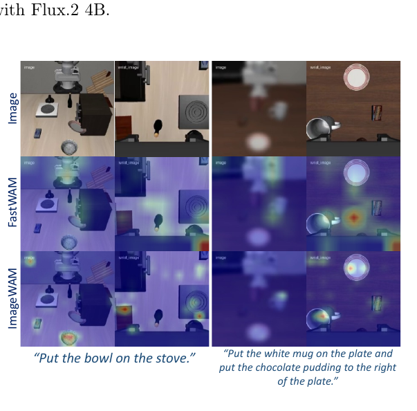
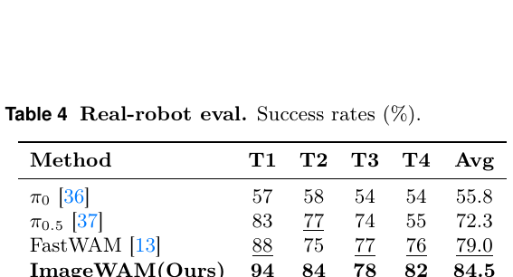
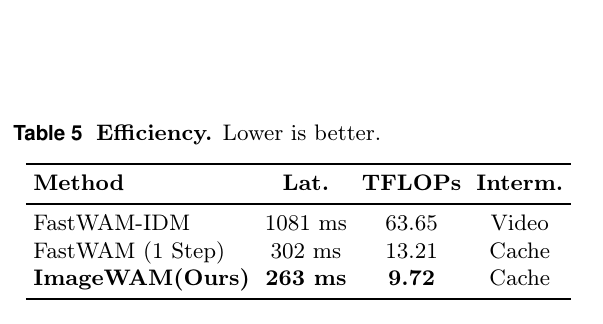
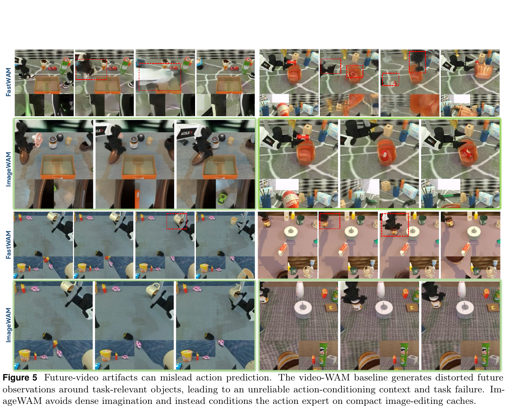
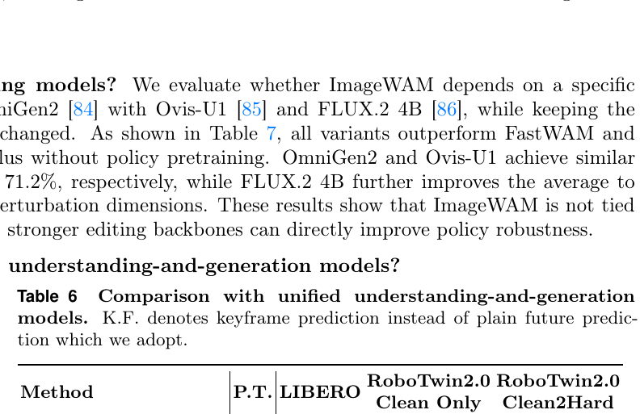
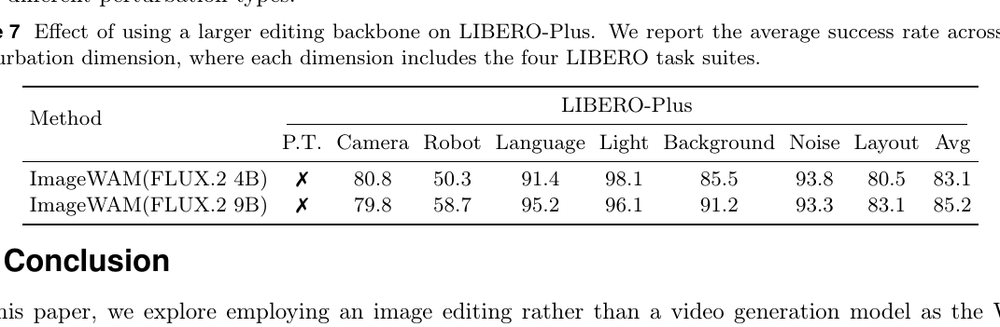
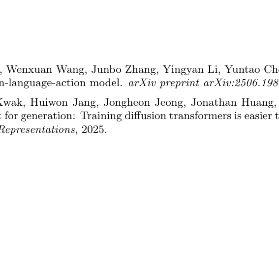
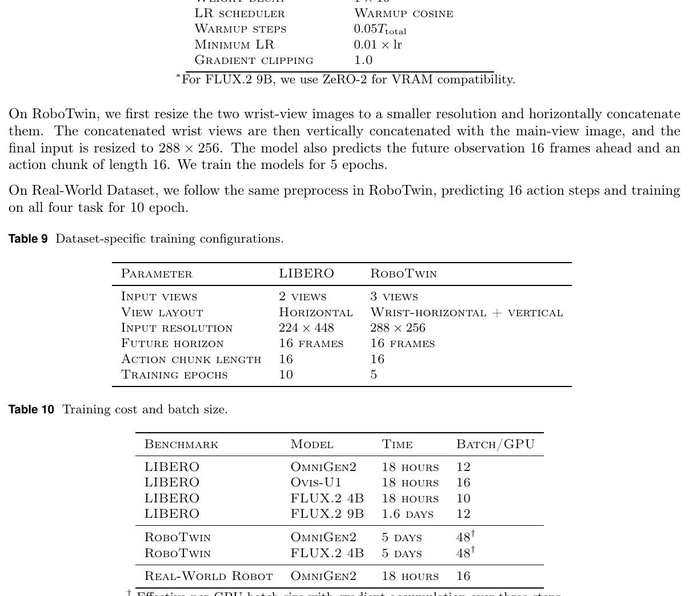

# ImageWAM: Do World Action Models Really Need Video Generation, or Just Image Editing?

**Authors:** Yuyang Zhang, Wenyao Zhang, Zekun Qi, He Zhang, Haitao Lin, Jingbo Zhang, Yao Mu, Xiaokang Yang, Wenjun Zeng, Xin Jin  
**Source:** `/Users/roywangj/journey_wj/research/papers4zotero/zotero1/storage/YWKZTTTF/Zhang 等 - 2026 - ImageWAM Do World Action Models Really Need Video Generation, or Just Image Editing.pdf`  
**Detected source format:** selectable-text PDF (`pdf-text`)  
**Reader type:** complete paragraph-level Chinese–English reader; `detailed_paper.md` is authoritative.

## Page / Section Index

| PDF pages | Content |
|---|---|
| 1–3 | Abstract; Introduction; Related Works; Method §3.1 |
| 4–5 | Method §3.1–3.4; equations (4)–(11) |
| 6–9 | Experiments, main results, analysis, ablations, conclusion |
| 10–15 | References [1]–[98] |
| 16–17 | Appendix §5 architecture and training details; Tables 8–10 |
| 18 | Appendix §6 efficiency; §7 real-world details; §8 RoboTwin results |
| 19 | Table 12 per-task RoboTwin results |

## Terminology Ledger

| Canonical term | Chinese rendering | Decision |
|---|---|---|
| World Action Model (WAM) | 世界动作模型 | 首次展开后保留 WAM |
| ImageWAM | ImageWAM | 方法名不翻译 |
| editing cache | 编辑缓存 | 逐层 KV 上下文 |
| action expert / Action DiT | 动作专家 / Action DiT | 保留架构名 |
| action chunk | 动作块 | $a_{t:t+H}$ |
| P.T. | 额外策略预训练 | 表格标志 |

## Abstract

> <strong>Para. 1:</strong> World Action Models (WAMs) commonly rely on video generation to bridge visual world modeling and robot control. However, video-based WAMs face three coupled limitations: dense multi-frame future tokens make inference costly, full video prediction spends capacity on action-irrelevant temporal and appearance details, and long-horizon future imagination may introduce errors that mislead action prediction. These issues raise a simple question: Does world action model really need video generation? We propose ImageWAM, a simple WAM framework that repurposes pretrained image editing models for robot action prediction. In contrast to video generation, image editing provides a better-matched prior: it only needs to model a target-frame transformation, focuses on action-relevant current-to-target visual differences, and grounds task instructions to localized visual changes through edit pretraining. In practice, ImageWAM does not decode the target frame at inference time; instead, it conditions a flow-matching action expert on the KV caches produced by image-editing denoising, using them as a compact world-action context. ImageWAM outperforms standard VLA baselines and matching competitive WAMs without additional policy pretraining across different simulator and real-world experiments. It also reduces FLOPs to 1/6 and latency to 1/4 of video-based WAMs. Attention analysis further shows that editing caches focus on task-relevant change regions, supporting image editing as an effective alternative to video-based world-action modeling.

> <strong>Para. 1[CN]:</strong> 世界动作模型（WAM）通常依靠视频生成来连接视觉世界建模与机器人控制。然而，基于视频的 WAM 面临三个相互耦合的局限：稠密的多帧未来 token 使推理成本高昂，完整视频预测将模型容量耗费在与动作无关的时间与外观细节上，而长时程未来想象可能引入误差并误导动作预测。这些问题提出了一个简单问题：世界动作模型真的需要视频生成吗？本文提出 ImageWAM，一个将预训练图像编辑模型改用于机器人动作预测的简洁 WAM 框架。与视频生成相比，图像编辑提供了更匹配的先验：它只需建模目标帧变换，聚焦与动作相关的当前到目标视觉差异，并通过编辑预训练将任务指令锚定到局部视觉变化。实践中，ImageWAM 在推理时不解码目标帧；相反，它让流匹配动作专家以图像编辑去噪产生的 KV 缓存为条件，并将其用作紧凑的世界—动作上下文。在不同仿真和真实世界实验中，ImageWAM 无需额外策略预训练便优于标准 VLA 基线和匹配的竞争性 WAM。它还将 FLOPs 降至视频 WAM 的 1/6、延迟降至 1/4。注意力分析进一步表明，编辑缓存聚焦于任务相关变化区域，支持图像编辑成为视频式世界—动作建模的有效替代。

## 1 Introduction

> <strong>Para. 2:</strong> Recent robot policy learning has increasingly explored video generation models as world-action backbones. This direction is appealing because video pretraining exposes models to rich visual dynamics, such as object motion, temporal continuity, physical interaction, and scene evolution [1–5]. It also supports a reason-before-act paradigm: a policy may first imagine how the scene will change, and then use this imagined future to guide action prediction [6–8]. Together with the scalability of generative pretraining on large and heterogeneous video data [9–12], video models provide an intuitive bridge between visual world modeling and robot control.

> <strong>Para. 2[CN]:</strong> 近期机器人策略学习越来越多地探索将视频生成模型作为世界—动作骨干。这一方向很有吸引力，因为视频预训练使模型接触到物体运动、时间连续性、物理交互和场景演化等丰富的视觉动态 [1–5]。它还支持“先推理、后行动”的范式：策略可以先想象场景将如何变化，再利用这一想象的未来指导动作预测 [6–8]。结合生成式预训练在大规模异构视频数据上的可扩展性 [9–12]，视频模型在视觉世界建模与机器人控制之间提供了一座直观桥梁。

> <strong>Para. 3:</strong> However, this bridge also reveals a mismatch as shown in Figure 1(a). Video generation models are trained to synthesize complete future videos. To do so, they must model appearance details, background changes, camera motion, temporal smoothness, and many other factors that may be only weakly related to the robot’s next action [13–15]. Generating many spatio-temporal tokens across multiple frames makes inference costly for real-time robot control [2, 3]. Moreover, generating a physically consistent video is a hard proxy task [16–18]. This is especially true for fine-grained manipulation, where small contact events, slight object displacements, or subtle configuration changes can determine success, but are difficult to predict reliably over multiple frames. If the imagined video is wrong, the downstream action predictor may be misled. These issues raise a simple question: Does the world action model really require video generation?

> <strong>Para. 3[CN]:</strong> 然而，如图 1(a) 所示，这座桥梁也揭示了一种错配。视频生成模型被训练来合成完整的未来视频。为此，它们必须建模外观细节、背景变化、相机运动、时间平滑性以及许多可能仅与机器人下一步动作弱相关的因素 [13–15]。跨多个帧生成大量时空 token，使实时机器人控制的推理成本高昂 [2, 3]。此外，生成物理一致的视频是一个困难的代理任务 [16–18]。对于精细操控尤其如此：微小接触事件、轻微物体位移或细微构型变化可能决定成功，却难以在多帧上可靠预测。如果想象的视频有误，下游动作预测器可能受到误导。这些问题引出了一个简单问题：世界动作模型真的需要视频生成吗？

> <strong>Para. 4:</strong> We argue that image editing models offer a more direct visual generative prior for language-conditioned manipulation. Instead of predicting how an entire scene evolves over time, image editing models are trained to transform a source image according to a language instruction. This objective matches a key requirement of robot policies: the model should understand what task-relevant visual change should happen in the current scene under the given instruction. For many manipulation tasks, the essential signal is not a photorealistic future video, but an instruction-guided transformation from the current observation toward a desired visual state as illustrated in Figure 1(a).

> <strong>Para. 4[CN]:</strong> 我们认为，图像编辑模型为语言条件操控提供了更直接的视觉生成先验。图像编辑模型并不预测整个场景如何随时间演化，而是被训练为根据语言指令变换源图像。这一目标与机器人策略的一项关键需求相匹配：模型应理解在给定指令下，当前场景中应发生什么与任务相关的视觉变化。对于许多操控任务，关键信号并非逼真的未来视频，而是如图 1(a) 所示，从当前观测朝期望视觉状态推进的指令引导变换。

> <strong>Para. 5:</strong> This view gives image editing models three advantages as robot policy backbones. First, they provide strong instruction-to-change alignment. Their pretraining objective directly couples language with visual modifications, encouraging the model to focus on what should change, where it should change, and how the change is specified by the instruction. Second, editing provides an easier and more action-relevant proxy than full video prediction. Rather than modeling complete temporal trajectories, an editing model focuses on the visual difference between the current state and an instruction-consistent target state. This avoids spending capacity on irrelevant temporal details and reduces the risk of using inaccurate future videos for action generation. Third, editing offers a more compact inference path. A policy can use internal editing-aware representations that encode the intended visual transformation, without decoding dense multi-frame videos at inference time.

> <strong>Para. 5[CN]:</strong> 这一视角赋予图像编辑模型作为机器人策略骨干的三项优势。第一，它们提供强指令—变化对齐。其预训练目标将语言与视觉修改直接耦合，促使模型关注应改变什么、应在哪里改变，以及指令指定了怎样的改变。第二，编辑提供了比完整视频预测更容易且更与动作相关的代理任务。编辑模型不建模完整时间轨迹，而是聚焦当前状态与符合指令的目标状态之间的视觉差异。这避免将容量耗费在无关时间细节上，并降低为动作生成使用不准确未来视频的风险。第三，编辑提供更紧凑的推理路径。策略可以使用编码预期视觉变换的内部编辑感知表征，而无需在推理时解码稠密的多帧视频。

> <strong>Para. 6:</strong> Motivated by this insight, we propose ImageWAM, a new framework that repurposes pretrained image editing models as backbones for robot action prediction, as shown in Figure 1(b). Given the current observation and task instruction, ImageWAM extracts editing-aware representations from an image editing backbone and feeds them into an action prediction head. Our goal is not to generate visually appealing edited images, nor to use editing models as goal-image generators. Instead, we use their intermediate instruction-conditioned features as transformation-aware representations for direct policy learning. This design preserves the benefits of generative visual pretraining while avoiding explicit future video synthesis, leading to a compact inference path for real-time control.

> <strong>Para. 6[CN]:</strong> 受这一洞见启发，我们提出 ImageWAM：一个将预训练图像编辑模型改作机器人动作预测骨干的新框架，如图 1(b) 所示。给定当前观测和任务指令，ImageWAM 从图像编辑骨干中提取编辑感知表征，并将其送入动作预测头。我们的目标不是生成视觉上悦目的编辑图像，也不是把编辑模型用作目标图像生成器。相反，我们把其中间指令条件特征作为变换感知表征，用于直接策略学习。该设计在避免显式未来视频合成的同时保留生成式视觉预训练的优势，从而为实时控制形成紧凑推理路径。

> <strong>Para. 7:</strong> Empirically, we find that editing-aware representations are effective for language-conditioned robot policies. Under comparable action prediction architectures, ImageWAM improves over standard visual and vision-language backbones, showing that the gains are not merely due to stronger image recognition or language alignment. Our analyses further show that instruction conditioning and editing-oriented feature extraction are important for obtaining action-relevant representations. These results suggest that image editing models provide a promising backbone choice for robot policy learning, broadening visual generative pretraining beyond video-based world modeling.

> <strong>Para. 7[CN]:</strong> 在经验上，我们发现编辑感知表征对语言条件机器人策略有效。在可比的动作预测架构下，ImageWAM 优于标准视觉和视觉—语言骨干，表明增益并非仅来自更强的图像识别或语言对齐。我们的分析进一步表明，指令条件和面向编辑的特征提取对于获得动作相关表征很重要。这些结果说明，图像编辑模型为机器人策略学习提供了一种有前景的骨干选择，将视觉生成式预训练拓展到视频式世界建模之外。

> <strong>Para. 8:</strong> Our contributions are three-fold:
> - We introduce ImageWAM, a framework that repurposes pretrained image editing models as instruction-conditioned visual backbones for robot action prediction, offering an alternative to video-generation-based world action models.
> - We formulate robot manipulation as instruction-guided visual transformation and identify three properties of image editing pretraining that are well aligned with policy learning: instruction-to-change alignment, easier goal/change proxy, and compact inference.
> - We empirically validate the effectiveness of editing-aware representations against standard visual and vision-language backbones, and analyze the role of instruction conditioning and editing-oriented feature extraction in action prediction.

> <strong>Para. 8[CN]:</strong> 我们的贡献有三点：
> - 我们提出 ImageWAM，将预训练图像编辑模型改作机器人动作预测的指令条件视觉骨干，为基于视频生成的世界动作模型提供替代方案。
> - 我们将机器人操控表述为指令引导的视觉变换，并确定图像编辑预训练与策略学习高度一致的三项属性：指令—变化对齐、更容易的目标/变化代理任务，以及紧凑推理。
> - 我们相对于标准视觉和视觉—语言骨干，经验验证了编辑感知表征的有效性，并分析了指令条件与面向编辑的特征提取在动作预测中的作用。

### Figure 1

**Caption:** Previous video-generation WAMs instantiate world-action reasoning by predicting dense future video tokens, which can be computationally expensive and may allocate capacity to action-irrelevant visual details. ImageWAM replaces future video prediction with an image editing backbone that reasons over a source-grounded, instruction-guided visual transformation. The resulting edit-aware representation serves as a compact world-action intermediate for action prediction, achieving strong policy performance while reducing inference cost.

**Caption[CN]:** 以往的视频生成 WAM 通过预测稠密未来视频 token 来实现世界—动作推理，这在计算上代价高昂，也可能把模型容量分配给与动作无关的视觉细节。ImageWAM 用图像编辑骨干替代未来视频预测，以基于源图像、由指令引导的视觉变换进行推理。所得编辑感知表征作为动作预测的紧凑世界—动作中介，在降低推理成本的同时取得强策略性能。

## 2 Related Works

> <strong>Para. 9:</strong> Text-guided image editing modifies a source image according to a language instruction while preserving irrelevant content [19–28]. Recent diffusion-based and MLLM-enhanced editing models have progressed from simple object-level edits to more complex spatial, semantic, and knowledge-driven modifications [29–35]. While prior work mainly focuses on perceptual quality and instruction fidelity, we study image editing from a robotics perspective, using its source-conditioned and change-centric representations as compact world-action backbones for robot policy learning.

> <strong>Para. 9[CN]:</strong> 文本引导图像编辑根据语言指令修改源图像，同时保留无关内容 [19–28]。近期基于扩散和 MLLM 增强的编辑模型，已从简单物体级编辑发展到更复杂的空间、语义和知识驱动修改 [29–35]。以往工作主要关注感知质量与指令忠实度，而我们从机器人学视角研究图像编辑，将其源条件、变化中心表征用作机器人策略学习的紧凑世界—动作骨干。

> <strong>Para. 10:</strong> Unlike vision language action models [36–57], video generation models have recently been explored as predictive priors for robot policy learning. Early world action model [58–61] treats video generation as an explicit visual planning model: given the current observation and task context, the model predicts a complete future video or visual rollout, which is then translated into executable actions by an inverse dynamics model or action decoder [62–68]. More recent works broaden this paradigm by using video generative models as representation extractors for action generation [5, 69–78], value prediction [79] and interactive world modeling [80–83]. However, they are still largely built around video generation priors. Such designs often require predicting or processing dense spatio-temporal future tokens, leading to non-trivial inference cost and potentially modeling action-irrelevant and unrealistic visual details. ImageWAM uses instruction-guided editing caches as a compact world-action context, avoiding dense future-video token processing while preserving the advantage of WAMs.

> <strong>Para. 10[CN]:</strong> 与视觉—语言—动作模型 [36–57] 不同，视频生成模型近期被探索为机器人策略学习的预测先验。早期世界动作模型 [58–61] 将视频生成视为显式视觉规划模型：给定当前观测和任务上下文，模型预测完整未来视频或视觉 rollout，再由逆动力学模型或动作解码器将其转成可执行动作 [62–68]。更近期工作通过把视频生成模型用作动作生成的表征提取器 [5, 69–78]、价值预测器 [79] 和交互式世界模型 [80–83] 来扩展这一范式。然而，它们仍主要围绕视频生成先验构建。这类设计通常需要预测或处理稠密时空未来 token，导致不可忽略的推理成本，并可能建模与动作无关且不真实的视觉细节。ImageWAM 使用指令引导编辑缓存作为紧凑世界—动作上下文，在保留 WAM 优势的同时避免处理稠密未来视频 token。

## 3 Method

### 3.1 Problem Formulation

> <strong>Para. 11:</strong> We consider robot manipulation conditioned on a current visual observation and a task instruction. At each time step $t$, the robot receives an image observation $o_t$ and a task instruction $l$, and predicts an action chunk

> <strong>Para. 11[CN]:</strong> 我们考虑以当前视觉观测和任务指令为条件的机器人操控。在每个时刻 $t$，机器人接收图像观测 $o_t$ 和任务指令 $l$，并预测一个动作块

$$
a_{t:t+H}=(a_t,a_{t+1},\ldots,a_{t+H})\tag{1}
$$

> <strong>Para. 12:</strong> where $H$ denotes the action horizon. The policy learning objective is

> <strong>Para. 12[CN]:</strong> 其中 $H$ 表示动作 horizon。策略学习目标为

$$
\pi_\theta(a_{t:t+H}\mid o_t,l)\tag{2}
$$

> <strong>Para. 13:</strong> World-action models introduce an intermediate visual reasoning step before action prediction. Video-generation-based WAMs typically instantiate this intermediate by predicting a future visual trajectory:

> <strong>Para. 13[CN]:</strong> 世界动作模型在动作预测之前引入中间视觉推理步骤。基于视频生成的 WAM 通常通过预测未来视觉轨迹来实例化这一中介：

$$
(o_t,l)\rightarrow\hat{o}_{t+1:t+H+1}\rightarrow a_{t:t+H}\tag{3}
$$

> <strong>Para. 14:</strong> This enables reason-before-act policy learning, but requires generating dense spatio-temporal visual tokens across multiple future frames. Instead of predicting the full future trajectory, Our ImageWAM predicts only the endpoint frame:

> <strong>Para. 14[CN]:</strong> 这支持“先推理、后行动”的策略学习，但要求跨多个未来帧生成稠密时空视觉 token。我们的 ImageWAM 不预测完整未来轨迹，而只预测端点帧：

$$
(o_t,l)\rightarrow\hat{o}_{edit}\equiv\hat{o}_{t+H+1}\rightarrow a_{t:t+H}\tag{4}
$$

> <strong>Para. 15:</strong> $\hat{o}_{edit}$ is a single source-conditioned frame that summarizes the task-specified visual transformation of the current observation. It serves as a compact world-action intermediate for action prediction.

> <strong>Para. 15[CN]:</strong> $\hat{o}_{edit}$ 是单个源条件帧，它概括当前观测中由任务指定的视觉变换，并作为动作预测的紧凑世界—动作中介。

### Figure 2

**Caption:** ImageWAM Pipeline. Given a language instruction and the current observation $o_t$, the image editing backbone synthesizes the future frame $\hat{o}_{t+H+1}$. The Action Expert integrates the intermediate KV features from this generation process via joint attention, predicting a sequence of future actions $a_{t:t+H}$ conditioned on the current robot state and action noise.

**Caption[CN]:** ImageWAM 流程。给定语言指令与当前观测 $o_t$，图像编辑骨干合成未来帧 $\hat{o}_{t+H+1}$。动作专家通过联合注意力整合该生成过程的中间 KV 特征，并以当前机器人状态和动作噪声为条件预测未来动作序列 $a_{t:t+H}$。

### 3.2 ImageWAM Architecture

> <strong>Para. 16:</strong> ImageWAM builds on a variant image editing model like OmniGen2 [84], Ovis-U1 [85] and Flux2 [86] by attaching an action expert to their image editing branch. OmniGen2 provides a source-conditioned image editing backbone that takes the current observation $o_t$ and task instruction $l$ as inputs. Instead of using the editing branch only to decode an edited image, ImageWAM reuses the intermediate transformer key-value caches produced during denoising as conditioning context for action generation.

> <strong>Para. 16[CN]:</strong> ImageWAM 以 OmniGen2 [84]、Ovis-U1 [85] 和 Flux2 [86] 等图像编辑模型变体为基础，在其图像编辑分支上连接动作专家。OmniGen2 提供一个以源为条件的图像编辑骨干，输入当前观测 $o_t$ 和任务指令 $l$。ImageWAM 不将编辑分支仅用于解码编辑图像，而是复用去噪期间产生的 Transformer 中间键值缓存，作为动作生成的条件上下文。

> <strong>Para. 17:</strong> During training, we randomly sample an editing denoising timestep $\tau$ and run the editing branch at this timestep. For each transformer layer $\ell$, we collect the corresponding key-value cache:

> <strong>Para. 17[CN]:</strong> 训练时，我们随机采样编辑去噪时刻 $\tau$，并在该时刻运行编辑分支。对于每个 Transformer 层 $\ell$，收集相应键值缓存：

$$
C_{edit}^{\tau}=\{(K_\ell^{\tau},V_\ell^{\tau})\}_{\ell=1}^{L}=f_{edit}^{\tau}(o_t,l)\tag{5}
$$

> <strong>Para. 18:</strong> where $L$ is the number of transformer layers. The cache $C_{edit}^{\tau}$ is computed after the visual latent has interacted with the task instruction through the editing backbone. It therefore contains task-conditioned visual transformation information without requiring the final edited image to be decoded.

> <strong>Para. 18[CN]:</strong> 其中 $L$ 是 Transformer 层数。缓存 $C_{edit}^{\tau}$ 在视觉 latent 通过编辑骨干与任务指令交互之后计算。因此，它包含任务条件视觉变换信息，而不需要解码最终编辑图像。

> <strong>Para. 19:</strong> The action expert conditions on $C_{edit}^{\tau}$ for action generation. This design transfers the image editing model’s internal reasoning process to robot control: the editing branch reasons about how the source observation should change under the task instruction, while the action expert converts this editing context into executable robot actions. Unlike video-generation WAMs, ImageWAM does not require future video tokens to be generated or decoded.

> <strong>Para. 19[CN]:</strong> 动作专家以 $C_{edit}^{\tau}$ 为条件生成动作。该设计把图像编辑模型的内部推理过程迁移到机器人控制：编辑分支推理源观测在任务指令下应如何变化，而动作专家将这一编辑上下文转成可执行机器人动作。不同于视频生成 WAM，ImageWAM 不要求生成或解码未来视频 token。

> <strong>Para. 20:</strong> In addition to the standard video-WAM variant that performs denoising over future video tokens, we also implement a Fast-WAM-style variant [13]. In this variant, future video tokens are used only during training for video co-training, but are removed at inference time. The action expert is conditioned on the KV caches produced from the current observation and task instruction, without instantiating or denoising future video tokens. This gives a video-WAM baseline with the same no-future-token inference interface as Fast-WAM.

> <strong>Para. 20[CN]:</strong> 除在未来视频 token 上执行去噪的标准视频 WAM 变体外，我们还实现了 Fast-WAM 风格变体 [13]。在该变体中，未来视频 token 仅在训练时用于视频共训，而在推理时移除。动作专家以当前观测和任务指令产生的 KV 缓存为条件，不实例化或去噪未来视频 token。由此得到一个与 Fast-WAM 具有相同无未来 token 推理接口的视频 WAM 基线。

> <strong>Para. 21:</strong> We keep the VLM and multimodal understanding components of the editing model frozen, including the modules used to encode task instructions and visual context. Only the diffusion-based image generation branch and the action expert are updated during training. The frozen VLM provides stable language-vision conditioning, while the trainable diffusion branch learns to predict task-relevant future frames and to produce editing caches useful for action generation.

> <strong>Para. 21[CN]:</strong> 我们冻结编辑模型的 VLM 与多模态理解组件，包括用于编码任务指令和视觉上下文的模块。训练时仅更新基于扩散的图像生成分支与动作专家。冻结的 VLM 提供稳定语言—视觉条件，而可训练扩散分支学习预测任务相关未来帧，并产生对动作生成有用的编辑缓存。

### 3.3 Action Prediction and Training

> <strong>Para. 22:</strong> **Image editing objective.** The editing branch is trained to predict a task-relevant future endpoint frame. Let $o_{t+H+1}$ denote the target future observation and let $z^*_{t+H+1}=E_{vae}(o_{t+H+1})$ be its latent representation. We sample image noise $\epsilon_z\sim\mathcal{N}(0,I)$ and an image flow time $r\in(0,1)$, and construct the interpolated image latent

> <strong>Para. 22[CN]:</strong> **图像编辑目标。** 编辑分支被训练为预测任务相关未来端点帧。令 $o_{t+H+1}$ 为目标未来观测，$z^*_{t+H+1}=E_{vae}(o_{t+H+1})$ 为其 latent 表征。采样图像噪声 $\epsilon_z\sim\mathcal{N}(0,I)$ 与图像流时刻 $r\in(0,1)$，构造插值图像 latent

$$
z_r=(1-r)z^*_{t+H+1}+r\epsilon_z\tag{6}
$$

> <strong>Para. 23:</strong> The diffusion image branch predicts the corresponding velocity field:

> <strong>Para. 23[CN]:</strong> 扩散图像分支预测相应速度场：

$$
\mathcal{L}_{img}=\mathbb{E}_{z^*,\epsilon_z,r}[\|u_\phi(z_r,r\mid o_t,l)-(\epsilon_z-z^*_{t+H+1})\|_2^2]\tag{7}
$$

> <strong>Para. 24:</strong> where $u_\phi$ denotes the velocity predictor of the diffusion image branch. This objective preserves the editing branch’s ability to predict task-relevant future visual states and encourages the extracted editing caches to encode useful visual transformation information.

> <strong>Para. 24[CN]:</strong> 其中 $u_\phi$ 表示扩散图像分支的速度预测器。该目标保留编辑分支预测任务相关未来视觉状态的能力，并促使提取的编辑缓存编码有用视觉变换信息。

> <strong>Para. 25:</strong> **Action flow matching.** The action expert generates an action chunk using a flow-matching objective. Let $a^*_{t:t+H}$ denote the expert action chunk and let $\epsilon_a\sim\mathcal{N}(0,I)$ be Gaussian noise. We sample an action flow time $s\in(0,1)$ and construct the interpolated action sample

> <strong>Para. 25[CN]:</strong> **动作流匹配。** 动作专家使用流匹配目标生成动作块。令 $a^*_{t:t+H}$ 表示专家动作块，$\epsilon_a\sim\mathcal{N}(0,I)$ 为高斯噪声。采样动作流时刻 $s\in(0,1)$ 并构造插值动作样本

$$
a_s=(1-s)a^*_{t:t+H}+s\epsilon_a\tag{8}
$$

> <strong>Para. 26:</strong> Conditioned on the current observation, task instruction, and editing context cache $C_{edit}^{\tau}$, the action expert predicts the velocity field:

> <strong>Para. 26[CN]:</strong> 以当前观测、任务指令和编辑上下文缓存 $C_{edit}^{\tau}$ 为条件，动作专家预测速度场：

$$
\mathcal{L}_{act}=\mathbb{E}_{a^*,\epsilon_a,s,\tau}[\|v_\theta(a_s,s\mid o_t,l,C_{edit}^{\tau})-(\epsilon_a-a^*_{t:t+H})\|_2^2]\tag{9}
$$

> <strong>Para. 27:</strong> Here, $s$ denotes the action flow-matching time, while $\tau$ denotes the image editing denoising timestep used to extract the editing cache. Sampling $\tau$ during training exposes the action expert to editing caches from different stages of the denoising process. We jointly optimize the diffusion image branch and the action expert with $\mathcal{L}=\mathcal{L}_{act}+\mathcal{L}_{img}$.

> <strong>Para. 27[CN]:</strong> 这里，$s$ 表示动作流匹配时刻，$\tau$ 表示用于提取编辑缓存的图像编辑去噪时刻。训练时采样 $\tau$，使动作专家接触去噪过程不同阶段的编辑缓存。我们以 $\mathcal{L}=\mathcal{L}_{act}+\mathcal{L}_{img}$ 联合优化扩散图像分支与动作专家。

### 3.4 Efficient Inference

> <strong>Para. 28:</strong> At inference time, ImageWAM avoids full future-video generation and also does not require decoding a complete edited image. Instead of running the full image editing denoising trajectory, we select a fixed editing denoising timestep $\tau^*$ and perform only one editing-branch forward step to obtain

> <strong>Para. 28[CN]:</strong> 推理时，ImageWAM 避免完整未来视频生成，也不需要解码完整编辑图像。我们不运行完整图像编辑去噪轨迹，而是选择固定编辑去噪时刻 $\tau^*$，仅执行一次编辑分支前向以获得

$$
C_{edit}^{\tau^*}=f_{edit}^{\tau^*}(o_t,l)\tag{10}
$$

> <strong>Para. 29:</strong> Action expert generates the action chunk by denoising action samples conditioned on this cache:

> <strong>Para. 29[CN]:</strong> 动作专家通过对以该缓存为条件的动作样本去噪来生成动作块：

$$
\hat{a}_{t:t+H}\sim p_\theta(a_{t:t+H}\mid o_t,l,C_{edit}^{\tau^*})\tag{11}
$$

> <strong>Para. 30:</strong> This inference procedure is more compact than video-generation-based WAMs. A video WAM typically denoises and decodes dense spatio-temporal tokens across multiple future frames. In contrast, ImageWAM computes a single set of layer-wise editing caches and uses them directly as context for the action expert. Thus, ImageWAM preserves the reason-before-act principle of WAMs while avoiding the instantiation of dense future-video tokens.

> <strong>Para. 30[CN]:</strong> 该推理过程比基于视频生成的 WAM 更紧凑。视频 WAM 通常对跨多个未来帧的稠密时空 token 进行去噪和解码。相比之下，ImageWAM 计算单组逐层编辑缓存，并直接将其用作动作专家上下文。因此，ImageWAM 在避免实例化稠密未来视频 token 的同时保留 WAM 的“先推理、后行动”原则。

> <strong>Para. 31:</strong> For comparison, we also implement a Fast-WAM-style inference strategy for the video-WAM backbone. In this setting, future video tokens are removed at test time. The video backbone only processes the current observation and task instruction, and the action expert uses the resulting current-context KV caches for action generation. Therefore, this variant keeps a compact action-conditioning interface but avoids future-video token denoising during deployment.

> <strong>Para. 31[CN]:</strong> 作为比较，我们还为视频 WAM 骨干实现 Fast-WAM 风格推理策略。在该设置中，未来视频 token 在测试时移除。视频骨干只处理当前观测和任务指令，动作专家使用所得当前上下文 KV 缓存生成动作。因此，该变体保留紧凑动作条件接口，同时避免部署期间的未来视频 token 去噪。

## 4 Experiments

### 4.1 Experiment Setup

> <strong>Para. 32:</strong> Unlike many VLA and WAM baselines that rely on additional embodied policy pretraining (P.T.), ImageWAM does not use extra embodied data and is trained only on the downstream benchmark demonstrations. We evaluate ImageWAM on LIBERO [87], LIBERO-Plus [88] and RoboTwin 2.0 [89], as well as on several real-world manipulation tasks as shown in Figure 3 with Flux.2 4B.

> <strong>Para. 32[CN]:</strong> 不同于许多依赖额外具身策略预训练（P.T.）的 VLA 和 WAM 基线，ImageWAM 不使用额外具身数据，只在下游基准示范上训练。我们使用 Flux.2 4B，在 LIBERO [87]、LIBERO-Plus [88]、RoboTwin 2.0 [89] 以及图 3 所示若干真实世界操控任务上评估 ImageWAM。

> <strong>Para. 33:</strong> **LIBERO & LIBERO-Plus.** We evaluate our model on LIBERO [92] and LIBERO-Plus [88]. For LIBERO, we follow the standard benchmarking protocol and train on the four standard suites: Spatial, Object, Goal and LIBERO-Long. Each suite contains 500 expert demonstrations spanning 10 tasks.

> <strong>Para. 33[CN]:</strong> **LIBERO 与 LIBERO-Plus。** 我们在 LIBERO [92] 和 LIBERO-Plus [88] 上评估模型。对于 LIBERO，我们遵循标准基准协议，在 Spatial、Object、Goal 和 LIBERO-Long 四个标准套件上训练。每个套件包含覆盖 10 个任务的 500 条专家示范。

> <strong>Para. 34:</strong> LIBERO-Plus provides a more challenging evaluation setting built upon the LIBERO tasks, with increased visual and layout variations. Following prior work, we use the same original LIBERO training demonstrations and do not incorporate the augmented LIBERO-Plus training data. We evaluate the trained policies under the LIBERO-Plus protocol and report the average success rate.

> <strong>Para. 34[CN]:</strong> LIBERO-Plus 在 LIBERO 任务基础上提供了更具挑战性的评估设置，增加视觉和布局变化。遵循先前工作，我们使用相同的原始 LIBERO 训练示范，不加入增强的 LIBERO-Plus 训练数据。我们按 LIBERO-Plus 协议评估训练后的策略，并报告平均成功率。

> <strong>Para. 35:</strong> **RoboTwin 2.0.** We further evaluate on RoboTwin 2.0 [89], a large-scale simulated benchmark for bimanual robot manipulation. The benchmark covers more than 50 tasks and requires policies to coordinate two robot arms under diverse object layouts and scene conditions. Following the multi-task setting used in prior work [3, 13], we train a single policy on demonstrations from all tasks, including 2,500 trajectories collected in clean scenes and 25,000 trajectories collected with heavy scene randomization. All models are trained for 30k steps. We evaluate each method under both clean and randomized test settings, and report the average success rate over 100 trials per task.

> <strong>Para. 35[CN]:</strong> **RoboTwin 2.0。** 我们进一步在 RoboTwin 2.0 [89] 上评估，这是一个用于双臂机器人操控的大规模仿真基准。该基准覆盖 50 多个任务，要求策略在多样物体布局与场景条件下协调两只机械臂。遵循先前工作 [3, 13] 的多任务设置，我们在所有任务的示范上训练单一策略，包括在干净场景采集的 2,500 条轨迹和在强场景随机化下采集的 25,000 条轨迹。所有模型训练 30k 步。我们在干净和随机化测试设置下评估每种方法，并报告每任务 100 次试验的平均成功率。

> <strong>Para. 36:</strong> **Real-world Experiments.** We also evaluated our model in a real-world dual-arm robot setup. We used the Dobot XTrainer dual-arm robotic platform to collect a dataset consisting of four tasks: Stack Three Bowls (T1), Fold Towel (T2), Open Drawer & Store Marker (T3), and Hang Cup On Rack (T4). These tasks involve long-horizon manipulation, visual occlusion, fine-grained manipulation, and deformable-object manipulation, allowing us to assess the real-world performance of the model. Each task contains 100 trajectories. The model was trained on the combined dataset across all tasks, and all models were trained for 30k steps. We report the overall success rate over 100 trials conducted under multiple different initial configurations on this platform.

> <strong>Para. 36[CN]:</strong> **真实世界实验。** 我们还在真实双臂机器人设置中评估模型。使用 Dobot XTrainer 双臂机器人平台采集包含四个任务的数据集：Stack Three Bowls（T1）、Fold Towel（T2）、Open Drawer & Store Marker（T3）和 Hang Cup On Rack（T4）。这些任务涉及长时程操控、视觉遮挡、精细操控和可变形物体操控，使我们能够评估模型真实世界性能。每项任务包含 100 条轨迹。模型在所有任务的合并数据集上训练，所有模型均训练 30k 步。我们报告该平台上在多种不同初始配置下进行 100 次试验的总体成功率。

### Figure 3

**Caption:** Experiments setup on Robotwin2.0, LIBERO, LIBERO-Plus and real-world robot.

**Caption[CN]:** Robotwin2.0、LIBERO、LIBERO-Plus 与真实机器人的实验设置。

### Figure 4

**Caption:** Attention visualization.

**Caption[CN]:** 注意力可视化。

### Table 1

**Caption:** Results on RoboTwin2.0.

**Caption[CN]:** RoboTwin2.0 结果。

| Method | P.T. | Clean | Rand. | Avg. |
|---|:---:|---:|---:|---:|
| $\pi_0$ | ✓ | 65.92 | 58.40 | 62.16 |
| $\pi_{0.5}$ | ✓ | 82.74 | 76.76 | 79.75 |
| ABot-M0 | ✗ | 81.20 | 80.40 | 80.80 |
| Motus | ✓ | 88.66 | 87.02 | 87.80 |
| LingBot-VA | ✓ | 92.90 | 91.50 | 92.20 |
| FastWAM | ✗ | 91.88 | 91.78 | 91.83 |
| **ImageWAM** | ✗ | **93.20** | **93.56** | **93.38** |

### Table 2

**Caption:** Results on LIBERO.

**Caption[CN]:** LIBERO 结果。

| Method       | P.T. | Spatial | Object | Goal | Long |     Avg. |
| ------------ | :--: | ------: | -----: | ---: | ---: | -------: |
| OpenVLA      |  ✓   |    84.7 |   88.4 | 79.2 | 53.7 |     76.5 |
| GR00T N1     |  ✓   |    84.7 |   88.4 | 79.2 | 53.7 |     76.5 |
| $\pi_0$      |  ✓   |    96.8 |   98.8 | 95.8 | 85.2 |     94.1 |
| $\pi_{0.5}$  |  ✓   |    98.8 |   98.2 | 98.0 | 92.4 |     96.9 |
| LingBot-VA   |  ✓   |    98.5 |   99.6 | 97.2 | 98.5 |     98.5 |
| Motus        |  ✓   |    96.8 |   99.8 | 96.6 | 97.6 |     97.7 |
| Fast-WAM     |  ✗   |    98.2 |  100.0 | 97.0 | 95.2 |     97.6 |
| **ImageWAM** |  ✗   |    97.2 |   99.2 | 98.8 | 98.4 | **98.4** |

### Table 3

**Caption:** Comparison on the LIBERO-Plus benchmark. We report the average success rate across each perturbation dimension, where each perturbation includes the four task suites.

**Caption[CN]:** LIBERO-Plus 基准比较。报告各扰动维度上的平均成功率，其中每种扰动均包含四个任务套件。

| Method | P.T. | Camera | Robot | Language | Light | Background | Noise | Layout | Avg. |
|---|:---:|---:|---:|---:|---:|---:|---:|---:|---:|
| UniVLA | ✓ | 1.8 | 46.2 | 69.6 | 69.0 | 81.0 | 21.2 | 31.9 | 42.9 |
| OpenVLA-OFT | ✓ | 56.4 | 31.9 | 79.5 | 88.7 | 93.3 | 75.8 | 74.2 | 69.6 |
| $\pi_0$ | ✓ | 13.8 | 6.0 | 58.8 | 85.0 | 81.4 | 79.0 | 68.9 | 53.6 |
| $\pi_0$-Fast | ✓ | 65.1 | 21.6 | 61.0 | 73.2 | 73.2 | 74.4 | 68.8 | 61.6 |
| WorldVLA | ✓ | 0.1 | 27.9 | 41.6 | 43.7 | 17.1 | 10.9 | 38.0 | 25.0 |
| FastWAM | ✗ | 16.4 | 44.5 | 68.9 | 78.2 | 53.7 | 37.7 | 60.7 | 51.5 |
| ImageWAM (OmniGen2) | ✗ | 80.0 | 49.2 | 70.9 | 82.6 | 69.4 | 77.1 | 71.8 | 71.8 |
| ImageWAM (Ovis-U1) | ✗ | 63.3 | 58.4 | 75.4 | 86.3 | 66.7 | 75.2 | 74.6 | 71.2 |
| **ImageWAM (FLUX.2 4B)** | ✗ | **80.8** | 50.3 | **91.4** | **98.1** | 85.5 | **93.8** | **80.5** | **83.1** |

### 4.2 Main Results

> <strong>Para. 37:</strong> **Results on RoboTwin 2.0.** Table 1 reports the results on RoboTwin 2.0 under both clean and randomized evaluation settings. In the clean setting, ImageWAM achieves an average success rate of 93.20%. In the randomized setting, ImageWAM achieves an average success rate of 93.56%. Compared with VLA baselines, ImageWAM shows a clear improvement, indicating that the editing-based world-action context provides useful visual transformation information for multi-task control. Compared with video-generation-based WAMs, ImageWAM reaches comparable performance while avoiding dense future-video token prediction, leading to a more efficient world-action reasoning pathway.

> <strong>Para. 37[CN]:</strong> **RoboTwin 2.0 结果。** 表 1 报告 RoboTwin 2.0 在干净和随机化评估设置下的结果。在干净设置中，ImageWAM 的平均成功率为 93.20%；在随机化设置中为 93.56%。相比 VLA 基线，ImageWAM 表现出明显提升，说明基于编辑的世界—动作上下文为多任务控制提供了有用视觉变换信息。相比基于视频生成的 WAM，ImageWAM 在避免稠密未来视频 token 预测的同时达到可比性能，从而形成更高效的世界—动作推理路径。

> <strong>Para. 38:</strong> **Results on LIBERO & LIBERO-Plus.** Table 2 summarizes the results on LIBERO. On the standard LIBERO benchmark, ImageWAM achieves strong performance across Spatial, Object, Goal, and Long suites, showing that the editing-based backbone is effective for diverse manipulation skills. ImageWAM obtains an average success rate of 98.4%, remaining competitive with video-generation-based WAMs and pretrained VLA without any data pretraining.

> <strong>Para. 38[CN]:</strong> **LIBERO 与 LIBERO-Plus 结果。** 表 2 汇总 LIBERO 结果。在标准 LIBERO 基准上，ImageWAM 在 Spatial、Object、Goal 和 Long 套件上均取得强表现，说明基于编辑的骨干对多样操控技能有效。ImageWAM 平均成功率达到 98.4%，在没有任何数据预训练的情况下仍可与基于视频生成的 WAM 和预训练 VLA 竞争。

> <strong>Para. 39:</strong> Under the LIBERO-Plus setting, ImageWAM maintains an average success rate of 83.1%. This suggests that the source-conditioned editing context helps the policy focus on task-relevant visual changes rather than overfitting to fixed visual configurations. Together, the results on LIBERO and LIBERO-Plus indicate that image-editing-based world-action reasoning generalizes well across both standard and distribution-shifted simulation benchmarks.

> <strong>Para. 39[CN]:</strong> 在 LIBERO-Plus 设置下，ImageWAM 保持 83.1% 的平均成功率。这表明源条件编辑上下文有助于策略聚焦任务相关视觉变化，而不是过拟合固定视觉配置。综合 LIBERO 和 LIBERO-Plus 结果，基于图像编辑的世界—动作推理在标准和分布偏移仿真基准上都具有良好泛化。

> <strong>Para. 40:</strong> **Results on Real-world.** As shown in Table 4, ImageWAM achieves an average success rate of 84.5%, outperforming $\pi_0$ (55.8%), $\pi_{0.5}$ (72.3%), and FastWAM (79.0%). Notably, ImageWAM performs best on all four real-world tasks, covering long-horizon manipulation, deformable-object manipulation, visual occlusion, and fine-grained control. Compared with FastWAM, ImageWAM improves success rates by 6 points on T1 (Stack Three Bowls), 9 points on T2 (Fold Towel), 1 point on T3 (Open Drawer & Store Marker), and 6 points on T4 (Hang Cup On Rack). The largest gain appears on T2, suggesting that the editing-based context is particularly useful when the task requires reasoning about task-relevant visual changes in deformable-object manipulation. On T3, both WAM-style methods substantially outperform $\pi_0$, indicating that world-action reasoning helps mitigate the impact of visual occlusion during manipulation. Overall, these results show that replacing dense video-token reasoning with image-editing caches yields a practical and efficient WAM backbone.

> <strong>Para. 40[CN]:</strong> **真实世界结果。** 如表 4 所示，ImageWAM 平均成功率为 84.5%，优于 $\pi_0$（55.8%）、$\pi_{0.5}$（72.3%）和 FastWAM（79.0%）。值得注意的是，ImageWAM 在四个真实任务上均表现最佳，这些任务覆盖长时程操控、可变形物体操控、视觉遮挡和精细控制。相比 FastWAM，ImageWAM 在 T1（Stack Three Bowls）、T2（Fold Towel）、T3（Open Drawer & Store Marker）和 T4（Hang Cup On Rack）上的成功率分别提升 6、9、1 和 6 个百分点。最大增益出现在 T2，表明当任务需要推理可变形物体操控中的任务相关视觉变化时，基于编辑的上下文尤其有用。在 T3 上，两种 WAM 风格方法均显著优于 $\pi_0$，说明世界—动作推理有助于减轻操控期间视觉遮挡的影响。总体而言，这些结果表明，用图像编辑缓存替代稠密视频 token 推理可得到实用且高效的 WAM 骨干。

### Table 4

**Caption:** Real-robot eval. Success rates (%).

**Caption[CN]:** 真实机器人评估。成功率（%）。

| Method | T1 | T2 | T3 | T4 | Avg. |
|---|---:|---:|---:|---:|---:|
| $\pi_0$ | 57 | 58 | 54 | 54 | 55.8 |
| $\pi_{0.5}$ | 83 | 77 | 74 | 55 | 72.3 |
| FastWAM | 88 | 75 | 77 | 76 | 79.0 |
| **ImageWAM** | **94** | **84** | **78** | **82** | **84.5** |

### Table 5

**Caption:** Efficiency. Lower is better.

**Caption[CN]:** 效率。越低越好。

| Method | Latency | TFLOPs | Intermediate |
|---|---:|---:|---|
| FastWAM-IDM | 1081 ms | 63.65 | Video |
| FastWAM (1 Step) | 302 ms | 13.21 | Cache |
| **ImageWAM** | **263 ms** | **9.72** | Cache |

### 4.3 Analysis

> <strong>Para. 41:</strong> **Attention Visualization.** Figure 4 visualizes the attention maps from the ImageWAM and FastWAM. ImageWAM concentrates attention on task-relevant change regions, including manipulated objects, target receptacles, and contact areas, while suppressing irrelevant background regions. This indicates that the editing caches encode source-grounded and change-centric visual information, providing useful context for the action expert.

> <strong>Para. 41[CN]:</strong> **注意力可视化。** 图 4 可视化 ImageWAM 与 FastWAM 的注意力图。ImageWAM 将注意力集中在任务相关变化区域，包括被操控物体、目标容器和接触区域，同时抑制无关背景区域。这表明编辑缓存编码基于源图像且以变化为中心的视觉信息，为动作专家提供有用上下文。

> <strong>Para. 42:</strong> **Latency and FLOPs.** Table 5 compares inference latency and FLOPs on A6000 GPU. Video-generation WAMs process dense spatio-temporal tokens across multiple future frames, whereas ImageWAM obtains a single set of image-editing caches from one editing-branch forward step. As a result, ImageWAM reduces latency from 1081 ms to 263 ms and FLOPs from 63.65 to 9.7, while maintaining competitive task success. This demonstrates that editing caches offer a more efficient world-action intermediate than future-video token rollout.

> <strong>Para. 42[CN]:</strong> **延迟与 FLOPs。** 表 5 比较 A6000 GPU 上的推理延迟和 FLOPs。视频生成 WAM 处理跨多个未来帧的稠密时空 token，而 ImageWAM 通过一次编辑分支前向获得单组图像编辑缓存。因此，ImageWAM 在保持竞争性任务成功率的同时，将延迟从 1081 ms 降至 263 ms、FLOPs 从 63.65 降至 9.7。这说明编辑缓存提供了比未来视频 token rollout 更高效的世界—动作中介。

> <strong>Para. 43:</strong> **Qualitative analysis of future-video artifacts.** Figure 5 illustrates a failure case of video-generation-based WAMs. The imagined future frames contain visible artifacts around task-relevant objects, including distorted geometry and inconsistent spatial layout. Such artifacts may mislead the action expert, since the predicted action is conditioned on the generated future representation. In contrast, ImageWAM does not instantiate dense future-video tokens or decode future frames at inference time. It directly uses image-editing caches as compact action-conditioning context, avoiding the accumulation of visual artifacts in future-video imagination.

> <strong>Para. 43[CN]:</strong> **未来视频伪影的定性分析。** 图 5 展示基于视频生成的 WAM 的一个失败案例。想象的未来帧在任务相关物体周围包含可见伪影，包括几何畸变和空间布局不一致。由于预测动作以生成的未来表征为条件，此类伪影可能误导动作专家。相比之下，ImageWAM 在推理时不实例化稠密未来视频 token，也不解码未来帧；它直接使用图像编辑缓存作为紧凑动作条件上下文，避免未来视频想象中视觉伪影的累积。

### Figure 5

**Caption:** Future-video artifacts can mislead action prediction. The video-WAM baseline generates distorted future observations around task-relevant objects, leading to an unreliable action-conditioning context and task failure. ImageWAM avoids dense imagination and instead conditions the action expert on compact image-editing caches.

**Caption[CN]:** 未来视频伪影会误导动作预测。视频 WAM 基线在任务相关物体周围生成畸变的未来观测，导致不可靠的动作条件上下文和任务失败。ImageWAM 避免稠密想象，转而用紧凑的图像编辑缓存为动作专家提供条件。

### 4.4 Ablation Study

> <strong>Para. 44:</strong> **Q1: Can we use different editing models?** We evaluate whether ImageWAM depends on a specific editing backbone by replacing OmniGen2 [84] with Ovis-U1 [85] and FLUX.2 4B [86], while keeping the action expert and training data unchanged. As shown in Table 7, all variants outperform FastWAM and most VLA baselines on LIBERO-Plus without policy pretraining. OmniGen2 and Ovis-U1 achieve similar average success rates of 71.8% and 71.2%, respectively, while FLUX.2 4B further improves the average to 83.1% and performs best on most perturbation dimensions. These results show that ImageWAM is not tied to a particular edit model, and that stronger editing backbones can directly improve policy robustness.

> <strong>Para. 44[CN]:</strong> **Q1：能否使用不同编辑模型？** 我们通过以 Ovis-U1 [85] 和 FLUX.2 4B [86] 替换 OmniGen2 [84]，同时保持动作专家和训练数据不变，评估 ImageWAM 是否依赖特定编辑骨干。如表 7 所示，在没有策略预训练的情况下，所有变体在 LIBERO-Plus 上均优于 FastWAM 和大多数 VLA 基线。OmniGen2 与 Ovis-U1 的平均成功率相近，分别为 71.8% 和 71.2%；FLUX.2 4B 进一步将平均值提高到 83.1%，并在大多数扰动维度上表现最佳。这些结果说明 ImageWAM 不绑定特定编辑模型，且更强编辑骨干可直接改善策略稳健性。

> <strong>Para. 45:</strong> **Q2: Why do we not use unified understanding-and-generation models?** Unified multimodal models that combine understanding and generation are promising, but the two capabilities impose different architectural demands. Understanding benefits from high-level semantic abstraction, whereas generation requires fine-grained spatial and structural details, especially in deeper layers [98]. Jointly optimizing both objectives in a single fully shared model may therefore introduce interference, where improving generation can hurt understanding, and vice versa. Instead, ImageWAM decouples these roles: we keep the VLM-based understanding components frozen and adapt only the diffusion generation branch and the action expert for robot control. As shown in Table 6, this design outperforms UniVLA and BagelVLA under similar non-keyframe future prediction setting, which are built upon unified understanding-and-generation models, while requiring no additional policy pretraining.

> <strong>Para. 45[CN]:</strong> **Q2：为何不使用统一理解—生成模型？** 结合理解与生成的统一多模态模型很有前景，但两种能力提出不同架构需求。理解受益于高层语义抽象，而生成需要精细空间和结构细节，尤其是在更深层 [98]。因此，在单个完全共享模型中联合优化两个目标可能引入干扰：改善生成可能损害理解，反之亦然。ImageWAM 转而解耦这些角色：保持基于 VLM 的理解组件冻结，只适配扩散生成分支和用于机器人控制的动作专家。如表 6 所示，在相似的非关键帧未来预测设置下，该设计优于建立在统一理解—生成模型上的 UniVLA 和 BagelVLA，同时无需额外策略预训练。

> <strong>Para. 46:</strong> **Q3: What is the effect of the size of the editing backbone?** We evaluate whether increasing the capacity of the editing backbone improves the robustness of the policy in LIBERO-Plus. Replacing FLUX.2 4B with a larger FLUX.2 backbone increases the average success rate from 83.1% to 85.21%. The improvement mainly comes from Robot, Language, Background, and Layout perturbations, suggesting that larger editing models provide stronger instruction-conditioned visual context for action prediction. However, the gains are not uniform across all dimensions: Camera, Light, and Noise do not improve monotonically. This indicates that backbone scaling generally improves robustness, but the benefit depends on how the editing cache aligns with different perturbation types.

> <strong>Para. 46[CN]:</strong> **Q3：编辑骨干大小有何影响？** 我们评估增加编辑骨干容量是否改善策略在 LIBERO-Plus 上的稳健性。以更大的 FLUX.2 骨干替换 FLUX.2 4B，将平均成功率从 83.1% 提高到 85.21%。提升主要来自 Robot、Language、Background 和 Layout 扰动，表明更大编辑模型为动作预测提供更强的指令条件视觉上下文。然而，增益在各维度并不一致：Camera、Light 和 Noise 并未单调改善。这说明扩大骨干通常会改善稳健性，但收益取决于编辑缓存与不同扰动类型的对齐方式。

### Table 6

**Caption:** Comparison with unified understanding-and-generation models. K.F. denotes keyframe prediction instead of plain future prediction which we adopt.

**Caption[CN]:** 与统一理解—生成模型的比较。K.F. 表示关键帧预测，而本文采用普通未来预测。

| Method | P.T. | LIBERO | RoboTwin Clean Only | RoboTwin Clean2Hard |
|---|:---:|---:|---:|---:|
| UniVLA | ✓ | 95.5 | – | – |
| BagelVLA (w/ K.F.) | ✓ | – | 75.3 | 20.9 |
| BagelVLA (w/o K.F.) | ✓ | – | 56.7 | 15.9 |
| **ImageWAM** | ✗ | **98.4** | **84.4** | 18.3 |

### Table 7

**Caption:** Effect of using a larger editing backbone on LIBERO-Plus. We report the average success rate across each perturbation dimension, where each dimension includes the four LIBERO task suites.

**Caption[CN]:** 在 LIBERO-Plus 上使用更大编辑骨干的效果。报告各扰动维度上的平均成功率，其中每个维度包含四个 LIBERO 任务套件。

| Method | Camera | Robot | Language | Light | Background | Noise | Layout | Avg. |
|---|---:|---:|---:|---:|---:|---:|---:|---:|
| FLUX.2 4B | 80.8 | 50.3 | 91.4 | 98.1 | 85.5 | 93.8 | 80.5 | 83.1 |
| FLUX.2 9B | 79.8 | 58.7 | 95.2 | 96.1 | 91.2 | 93.3 | 83.1 | 85.2 |

## 5 Conclusion

> <strong>Para. 47:</strong> In this paper, we explore employing an image editing rather than a video generation model as the WAM backbone because image editing is an inherently ideal general task that naturally demands both visual understanding and generation. By simply predicting a single future frame, our model provides strong intermediate representations for the action model and enables end-to-end policy learning. Our model achieves a 93.56% success rate on RoboTwin (Random), substantially outperforming all VLA baselines and reaching performance comparable to state-of-the-art WAM models. We argue that the language-vision interaction priors in editing models drive our model’s effectiveness and lay the groundwork for broader use of image models.

> <strong>Para. 47[CN]:</strong> 本文探索采用图像编辑模型而非视频生成模型作为 WAM 骨干，因为图像编辑天然是一项理想通用任务，同时要求视觉理解与生成。通过仅预测单个未来帧，我们的模型为动作模型提供强中间表征，并支持端到端策略学习。模型在 RoboTwin（Random）上达到 93.56% 成功率，显著优于所有 VLA 基线，并达到与先进 WAM 模型可比的性能。我们认为，编辑模型中的语言—视觉交互先验驱动了模型有效性，并为更广泛使用图像模型奠定基础。

## References (original English, searchable)

References
[1] Yucheng Hu, Yanjiang Guo, Pengchao Wang, Xiaoyu Chen, Yen-Jen Wang, Jianke Zhang, Koushil Sreenath,
Chaochao Lu, and Jianyu Chen. Video prediction policy: A generalist robot policy with predictive visual
representations. arXiv preprint, 2024.
[2] Seonghyeon Ye, Yunhao Ge, Kaiyuan Zheng, Shenyuan Gao, Sihyun Yu, George Kurian, Suneel Indupuru,
You Liang Tan, Chuning Zhu, Jiannan Xiang, et al. World action models are zero-shot policies. arXiv preprint
arXiv:2602.15922, 2026.
[3] Lin Li, Qihang Zhang, Yiming Luo, Shuai Yang, Ruilin Wang, Fei Han, Mingrui Yu, Zelin Gao, Nan Xue, Xing
Zhu, et al. Causal world modeling for robot control. arXiv preprint arXiv:2601.21998, 2026.
[4] Teli Ma, Jia Zheng, Zifan Wang, Chunli Jiang, Andy Cui, Junwei Liang, and Shuo Yang. Dit4dit: Jointly
modeling video dynamics and actions for generalizable robot control. arXiv preprint arXiv:2603.10448, 2025.
[5] Moo Jin Kim, Yihuai Gao, Tsung-Yi Lin, Yen-Chen Lin, Yunhao Ge, Grace Lam, Percy Liang, Shuran Song,
Ming-Yu Liu, Chelsea Finn, et al. Cosmos policy: Fine-tuning video models for visuomotor control and planning.
arXiv preprint arXiv:2601.16163, 2026.
[6] Yucheng Hu, Jianke Zhang, Yuanfei Luo, Yanjiang Guo, Xiaoyu Chen, Xinshu Sun, Kun Feng, Qingzhou Lu,
Sheng Chen, Yangang Zhang, et al. Bagelvla: Enhancing long-horizon manipulation via interleaved visionlanguage-action generation. arXiv preprint arXiv:2602.09849, 2026.
[7] Jianke Zhang, Yuanfei Luo, Yucheng Hu, Xiaoyu Chen, Yanjiang Guo, Ziyang Liu, Hongbin Xu, Tian Lan, and
Jianyu Chen. Uam: A dual-stream perspective on forgetting in vla training. arXiv preprint arXiv:2605.15735,
2026.
[8] Liaoyuan Fan, Zetian Xu, Chen Cao, Wenyao Zhang, Mingqi Yuan, and Jiayu Chen. Aim: Intent-aware unified
world action modeling with spatial value maps. arXiv preprint arXiv:2604.11135, 2026.
[9] Chuning Zhu, Raymond Yu, Siyuan Feng, Benjamin Burchfiel, Paarth Shah, and Abhishek Gupta. Unified world
models: Coupling video and action diffusion for pretraining on large robotic datasets. arXiv preprint, 2025.
[10] Jiangran Lyu, Kai Liu, Xuheng Zhang, Haoran Liao, Yusen Feng, Wenxuan Zhu, Tingrui Shen, Jiayi Chen,
Jiazhao Zhang, Yifei Dong, et al. Lda-1b: Scaling latent dynamics action model via universal embodied data
ingestion. arXiv preprint arXiv:2602.12215, 2026.
[11] Wenyao Zhang, Bozhou Zhang, Zekun Qi, Wenjun Zeng, Xin Jin, and Li Zhang. Disentangled robot learning via
separate forward and inverse dynamics pretraining. arXiv preprint arXiv:2604.16391, 2026.
[12] Hongzhe Bi, Hengkai Tan, Shenghao Xie, Zeyuan Wang, Shuhe Huang, Haitian Liu, Ruowen Zhao, Yao Feng,
Chendong Xiang, Yinze Rong, et al. Motus: A unified latent action world model. arXiv preprint arXiv:2512.13030,
2025.
[13] Tianyuan Yuan, Zibin Dong, Yicheng Liu, and Hang Zhao. Fast-wam: Do world action models need test-time
future imagination? arXiv preprint arXiv:2603.16666, 2026.
[14] Angen Ye, Boyuan Wang, Chaojun Ni, Guan Huang, Guosheng Zhao, Hao Li, Hengtao Li, Jie Li, Jindi Lv, Jingyu
Liu, et al. Gigaworld-policy: An efficient action-centered world–action model. arXiv preprint arXiv:2603.17240,
2026.
[15] Hanyang Yu, Haitao Lin, Jingbo Zhang, Wenyao Zhang, Chenghao Gu, Heng Li, and Ping Tan. Maskwam:
Unifying mask prompting and prediction for world-action models. arXiv preprint arXiv:2606.13515, 2026.
[16] Baorui Peng, Wenyao Zhang, Liang Xu, Zekun Qi, Jiazhao Zhang, Hongsi Liu, Wenjun Zeng, and Xin Jin.
Reworld: Multi-dimensional reward modeling for embodied world models. arXiv preprint arXiv:2601.12428,
2026.
[17] Xiuyu Yang, Bohan Li, Shaocong Xu, Nan Wang, Chongjie Ye, Zhaoxi Chen, Minghan Qin, Yikang Ding, Zheng
Zhu, Xin Jin, et al. Orv: 4d occupancy-centric robot video generation. arXiv preprint arXiv:2506.03079, 2025.
[18] Haoyu Zhen, Qiao Sun, Hongxin Zhang, Junyan Li, Siyuan Zhou, Yilun Du, and Chuang Gan. Tesseract:
Learning 4d embodied world models. 2025. URL https://arxiv.org/abs/2504.20995.
[19] Yunnan Wang, Ziqiang Li, Wenyao Zhang, Zequn Zhang, Baao Xie, Xihui Liu, Wenjun Zeng, and Xin Jin.
Scene graph disentanglement and composition for generalizable complex image generation. Advances in Neural
Information Processing Systems, 37:98478–98504, 2024.
[20] Google DeepMind. Nano banana pro. https://deepmind.google/technologies/gemini/, 2025. Built on Gem-

ini 3 Pro. Image generation and editing model.
[21] OpenAI. GPT-Image-1.5. https://openai.com/index/new-chatgpt-images-is-here/, 2026. Accessed: 202603-19.
[22] Yang Ye, Xianyi He, Zongjian Li, Bin Lin, Shenghai Yuan, Zhiyuan Yan, Bohan Hou, and Li Yuan. Imgedit: A
unified image editing dataset and benchmark. arXiv preprint arXiv:2505.20275, 2025.
[23] Chenfei Wu, Jiahao Li, Jingren Zhou, Junyang Lin, Kaiyuan Gao, Kun Yan, Sheng-ming Yin, Shuai Bai, Xiao
Xu, Yilei Chen, et al. Qwen-image technical report. arXiv preprint arXiv:2508.02324, 2025.
[24] Zhipu AI. Glm-image. https://huggingface.co/zai-org/GLM-Image, 2026.
[25] NextStep Team, Chunrui Han, Guopeng Li, Jingwei Wu, Quan Sun, Yan Cai, Yuang Peng, Zheng Ge, Deyu
Zhou, Haomiao Tang, et al. Nextstep-1: Toward autoregressive image generation with continuous tokens at scale.
arXiv preprint arXiv:2508.10711, 2025.
[26] Meituan LongCat Team, Bin Xiao, Chao Wang, Chengjiang Li, Chi Zhang, Chong Peng, Hang Yu, Hao Yang,
Haonan Yan, Haoze Sun, et al. Longcat-next: Lexicalizing modalities as discrete tokens. arXiv preprint
arXiv:2603.27538, 2026.
[27] Dian Zheng, Manyuan Zhang, Hongyu Li, Hongbo Liu, Kai Zou, Kaituo Feng, and Hongsheng Li. Uni-edit:
Intelligent editing is a general task for unified model tuning. arXiv preprint arXiv:2605.21487, 2026.
[28] Z-Image Team. Z-image: An efficient image generation foundation model with single-stream diffusion transformer.
arXiv preprint arXiv:2511.22699, 2025.
[29] Kai Zhang, Lingbo Mo, Wenhu Chen, Huan Sun, and Yu Su. Magicbrush: A manually annotated dataset for
instruction-guided image editing. In Advances in Neural Information Processing Systems, 2023.
[30] Tsu-Jui Fu, Wenze Hu, Xianzhi Du, William Yang Wang, Yinfei Yang, and Zhe Gan. Guiding instruction-based
image editing via multimodal large language models. In International Conference on Learning Representations,
2024.
[31] Shelly Sheynin, Adam Polyak, Uriel Singer, Yuval Kirstain, Amit Zohar, Oron Ashual, Devi Parikh, and Yaniv
Taigman. Emu edit: Precise image editing via recognition and generation tasks. In Proceedings of the IEEE/CVF
Conference on Computer Vision and Pattern Recognition, pages 8871–8879, 2024.
[32] Qifan Yu, Wei Chow, Zhongqi Yue, Kaihang Pan, Yang Wu, Xiaoyang Wan, Juncheng Li, Siliang Tang, Hanwang
Zhang, and Yueting Zhuang. Anyedit: Mastering unified high-quality image editing for any idea. In Proceedings
of the IEEE/CVF Conference on Computer Vision and Pattern Recognition, pages 26125–26135, 2025.
[33] Valentin Gabeur, Shangbang Long, Songyou Peng, Paul Voigtlaender, Shuyang Sun, Yanan Bao, Karen Truong,
Zhicheng Wang, Wenlei Zhou, Jonathan T Barron, et al. Image generators are generalist vision learners. arXiv
preprint arXiv:2604.20329, 2026.
[34] Haoxiao Wang, Antao Xiang, Haiyang Sun, Peilin Sun, Changhao Pan, Yifu Chen, Minjie Hong, Weijie
Wang, Shuang Chen, Yue Chen, et al. Diffusion model as a generalist segmentation learner. arXiv preprint
arXiv:2604.24575, 2026.
[35] Gabriel Jeanson, David-Alexandre Duclos, William Larrivée-Hardy, Noé Cochet, Matěj Boxan, Anthony Deschênes, François Pomerleau, and Philippe Giguere. Leveraging image generators to address training data scarcity:
The gen4regen dataset for forest regeneration mapping. arXiv preprint arXiv:2605.05627, 2026.
[36] Kevin Black, Noah Brown, Danny Driess, Adnan Esmail, Michael Equi, Chelsea Finn, Niccolo Fusai, Lachy
Groom, Karol Hausman, Brian Ichter, et al. pi0: A vision-language-action flow model for general robot control.
arXiv preprint, 2024.
[37] Physical Intelligence, Kevin Black, Noah Brown, James Darpinian, Karan Dhabalia, Danny Driess, Adnan Esmail, Michael Equi, Chelsea Finn, Niccolo Fusai, et al. pi0.5: a vision-language-action model with open-world
generalization. arXiv preprint, 2025.
[38] Johan Bjorck, Fernando Castañeda, Nikita Cherniadev, Xingye Da, Runyu Ding, Linxi Fan, Yu Fang, Dieter
Fox, Fengyuan Hu, Spencer Huang, et al. Gr00t n1: An open foundation model for generalist humanoid robots.
arXiv preprint, 2025.
[39] Wenyao Zhang, Hongsi Liu, Zekun Qi, Yunnan Wang, Xinqiang Yu, Jiazhao Zhang, Runpei Dong, Jiawei He,
He Wang, Zhizheng Zhang, et al. Dreamvla: A vision-language-action model dreamed with comprehensive world
knowledge. arXiv preprint, 2025.

[40] Wenxuan Song, Ziyang Zhou, Han Zhao, Jiayi Chen, Pengxiang Ding, Haodong Yan, Yuxin Huang, Feilong
Tang, Donglin Wang, and Haoang Li. Reconvla: Reconstructive vision-language-action model as effective robot
perceiver. In Proceedings of the AAAI Conference on Artificial Intelligence, volume 40, pages 18549–18557, 2026.
[41] HY Team, Xumin Yu, Zuyan Liu, Ziyi Wang, He Zhang, Yongming Rao, Fangfu Liu, Yani Zhang, Ruowen
Zhao, Oran Wang, et al. Hy-embodied-0.5: Embodied foundation models for real-world agents. arXiv preprint
arXiv:2604.07430, 2026.
[42] Haitao Lin, Hanyang Yu, Jingshun Huang, He Zhang, Yonggen Ling, Ping Tan, Xiangyang Xue, and Yanwei
Fu. Universal pose pretraining for generalizable vision-language-action policies. arXiv preprint arXiv:2602.19710,
2026.
[43] Tianyuan Yuan, Yicheng Liu, Chenhao Lu, Zhuoguang Chen, Tao Jiang, and Hang Zhao. Depthvla: Enhancing
vision-language-action models with depth-aware spatial reasoning. arXiv preprint arXiv:2510.13375, 2025.
[44] Delin Qu, Haoming Song, Qizhi Chen, Yuanqi Yao, Xinyi Ye, Yan Ding, Zhigang Wang, JiaYuan Gu, Bin Zhao,
Dong Wang, et al. Spatialvla: Exploring spatial representations for visual-language-action model. arXiv preprint,
2025.
[45] Yang Tian, Sizhe Yang, Jia Zeng, Ping Wang, Dahua Lin, Hao Dong, and Jiangmiao Pang. Predictive inverse
dynamics models are scalable learners for robotic manipulation. ICLR, 2024.
[46] Qingqing Zhao, Yao Lu, Moo Jin Kim, Zipeng Fu, Zhuoyang Zhang, Yecheng Wu, Zhaoshuo Li, Qianli Ma, Song
Han, Chelsea Finn, et al. Cot-vla: Visual chain-of-thought reasoning for vision-language-action models. arXiv
preprint, 2025.
[47] Wanpeng Zhang, Ye Wang, Hao Luo, Haoqi Yuan, Yicheng Feng, Sipeng Zheng, Qin Jin, and Zongqing Lu.
Dig-flow: Discrepancy-guided flow matching for robust vla models. arXiv preprint arXiv:2512.01715, 2025.
[48] Hao Luo, Yicheng Feng, Wanpeng Zhang, Sipeng Zheng, Ye Wang, Haoqi Yuan, Jiazheng Liu, Chaoyi Xu, Qin Jin,
and Zongqing Lu. Being-h0: Vision-language-action pretraining from large-scale human videos. In International
Conference on Machine Learning. PMLR, 2026.
[49] Jiayi Chen, Wenxuan Song, Pengxiang Ding, Ziyang Zhou, Han Zhao, Feilong Tang, Donglin Wang, and Haoang
Li. Unified diffusion vla: Vision-language-action model via joint discrete denoising diffusion process. arXiv
preprint arXiv:2511.01718, 2025.
[50] Fuhao Li, Wenxuan Song, Han Zhao, Jingbo Wang, Pengxiang Ding, Donglin Wang, Long Zeng, and Haoang
Li. Spatial forcing: Implicit spatial representation alignment for vision-language-action model. arXiv preprint
arXiv:2510.12276, 2025.
[51] Jingwen Sun, Wenyao Zhang, Zekun Qi, Shaojie Ren, Zezhi Liu, Hanxin Zhu, Guangzhong Sun, Xin Jin,
and Zhibo Chen. Vla-jepa: Enhancing vision-language-action model with latent world model. arXiv preprint
arXiv:2602.10098, 2026.
[52] Yihao Wang, Pengxiang Ding, Lingxiao Li, Can Cui, Zirui Ge, Xinyang Tong, Wenxuan Song, Han Zhao, Wei
Zhao, Pengxu Hou, et al. Vla-adapter: An effective paradigm for tiny-scale vision-language-action model. In
Proceedings of the AAAI conference on artificial intelligence, volume 40, pages 18638–18646, 2026.
[53] Wei Wu, Fan Lu, Yunnan Wang, Shuai Yang, Shi Liu, Fangjing Wang, Qian Zhu, He Sun, Yong Wang, Shuailei
Ma, et al. A pragmatic vla foundation model. arXiv preprint arXiv:2601.18692, 2026.
[54] Jason Lee, Jiafei Duan, Haoquan Fang, Yuquan Deng, Shuo Liu, Boyang Li, Bohan Fang, Jieyu Zhang, Yi Ru
Wang, Sangho Lee, et al. Molmoact: Action reasoning models that can reason in space. arXiv preprint
arXiv:2508.07917, 2025.
[55] Qi Lv, Weijie Kong, Hao Li, Jia Zeng, Zherui Qiu, Delin Qu, Haoming Song, Qizhi Chen, Xiang Deng, and
Jiangmiao Pang. F1: A vision-language-action model bridging understanding and generation to actions. ArXiv,
abs/2509.06951, 2025. URL https://api.semanticscholar.org/CorpusID:281204333.
[56] Qiuyue Wang, Mingsheng Li, Jian Guan, Jinhui Ye, Sicheng Xie, Yitao Liu, Junhao Chen, Zhixuan Liang, Jie
Zhang, Xintong Hu, et al. Qwen-vla: Unifying vision-language-action modeling across tasks, environments, and
robot embodiments. arXiv preprint arXiv:2605.30280, 2026.
[57] Kechun Xu, Zhenjie Zhu, Anzhe Chen, Shuqi Zhao, Qing Huang, Yifei Yang, Haojian Lu, Rong Xiong, Masayoshi
Tomizuka, and Yue Wang. Seeing to act, prompting to specify: A bayesian factorization of vision language action
policy. arXiv preprint arXiv:2512.11218, 2025.
[58] Yilun Du, Sherry Yang, Bo Dai, Hanjun Dai, Ofir Nachum, Josh Tenenbaum, Dale Schuurmans, and Pieter

Abbeel. Learning universal policies via text-guided video generation. NeurIPS, 2024.
[59] Kevin Black, Mitsuhiko Nakamoto, Pranav Atreya, Homer Walke, Chelsea Finn, Aviral Kumar, and Sergey
Levine. Zero-shot robotic manipulation with pretrained image-editing diffusion models. arXiv preprint, 2023.
[60] Yao Feng, Hengkai Tan, Xinyi Mao, Guodong Liu, Shuhe Huang, Chendong Xiang, Hang Su, and Jun Zhu.
Generalist bimanual manipulation via foundation video diffusion models. arXiv preprint, 2025.
[61] Youpeng Wen, Junfan Lin, Yi Zhu, Jianhua Han, Hang Xu, Shen Zhao, and Xiaodan Liang. Vidman: Exploiting
implicit dynamics from video diffusion model for effective robot manipulation. NeurIPS, 2024.
[62] Yuejiang Liu, Fan Feng, Lingjing Kong, Weifeng Lu, Jinzhou Tang, Kun Zhang, Kevin P. Murphy, Chelsea Finn,
and Yilun Du. World action verifier: Self-improving world models via forward-inverse asymmetry. 2026. URL
https://api.semanticscholar.org/CorpusID:287074218.
[63] Boyuan Chen, Tianyuan Zhang, Haoran Geng, Kiwhan Song, Caiyi Zhang, Peihao Li, William T. Freeman,
Jitendra Malik, Pieter Abbeel, Russ Tedrake, Vincent Sitzmann, and Yilun Du. Large video planner enables
generalizable robot control. ArXiv, abs/2512.15840, 2025. URL https://api.semanticscholar.org/CorpusID:
283933826.
[64] Hengkai Tan, Yao Feng, Xinyi Mao, Shuhe Huang, Guodong Liu, Zhongkai Hao, Hang Su, and Jun Zhu. Anypos:
Automated task-agnostic actions for bimanual manipulation. arXiv preprint, 2025.
[65] Weishi Mi, Yong Bao, Xiaowei Chi, Xiaozhu Ju, Zhiyuan Qin, Kuangzhi Ge, Kai Tang, Peidong Jia, Shanghang
Zhang, and Jian Tang. Tc-idm: Grounding video generation for executable zero-shot robot motion. ArXiv,
abs/2601.18323, 2026. URL https://api.semanticscholar.org/CorpusID:285051517.
[66] Zhongrui Zhang, Cheng-Chuan Yang, Qin Lu, Yanjiang Guo, Jianke Zhang, Yucheng Hu, and Jianyu Chen.
Veo-act: How far can frontier video models advance generalizable robot manipulation? 2026. URL https:
//api.semanticscholar.org/CorpusID:287202336.
[67] Zirui Ge, Pengxiang Ding, Baohua Yin, Qishen Wang, Zhiyong Xie, Yemin Wang, Jinbo Wang, Hengtao Li,
Runze Suo, Wenxuan Song, et al. Vampo: Policy optimization for improving visual dynamics in video action
models. arXiv preprint arXiv:2603.19370, 2026.
[68] Zhanguang Zhang, Zhiyuan Li, Behnam Rahmati, Rui Heng Yang, Yintao Ma, Amir Rasouli, Sajjad Pakdamansavoji, Yangzheng Wu, Lingfeng Zhang, Tongtong Cao, et al. Do world action models generalize better
than vlas? a robustness study. arXiv preprint arXiv:2603.22078, 2026.
[69] Yaxuan Li, Yichen Zhu, Junjie Wen, Chaomin Shen, and Yi Xu. Worldeval: World model as real-world robot
policies evaluator. arXiv preprint arXiv:2505.19017, 2025.
[70] Mutian Xu, Tianbao Zhang, Tianqi Liu, Zhaoxi Chen, Xiaoguang Han, and Ziwei Liu. Kinema4d: Kinematic 4d
world modeling for spatiotemporal embodied simulation. arXiv preprint arXiv:2603.16669, 2026.
[71] Zhennan Jiang, Shangqing Zhou, Yutong Jiang, Zefang Huang, Mingjie Wei, Yuhui Chen, Tianxing Zhou, Zhen
Guo, Hao Lin, Quanlu Zhang, et al. Wovr: World models as reliable simulators for post-training vla policies with
rl. arXiv preprint arXiv:2602.13977, 2026.
[72] Ruicheng Zhang, Guangyu Chen, Zunnan Xu, Zihao Liu, Zhizhou Zhong, Mingyang Zhang, Jun Zhou, and
Xiu Li. Robostereo: Dual-tower 4d embodied world models for unified policy optimization. arXiv preprint
arXiv:2603.12639, 2026.
[73] Boyu Chen, Yi Chen, Lu Qiu, Jerry Bai, Yuying Ge, and Yixiao Ge. Unit: Toward a unified physical language
for human-to-humanoid policy learning and world modeling. arXiv preprint arXiv:2604.19734, 2026.
[74] Jai Bardhan, Patrik Drozdik, Josef Sivic, and Vladimir Petrik. Persistent robot world models: Stabilizing multistep rollouts via reinforcement learning. arXiv preprint arXiv:2603.25685, 2026.
[75] Bingchuan Wei, Bingqi Huang, Jingheng Ma, Sen Cui, et al. Fate: Closed-loop feasibility-aware task generation
with active repair for physically grounded robotic curricula. arXiv preprint arXiv:2603.01505, 2026.
[76] Xiaolei Lang, Yang Wang, Yukun Zhou, Chaojun Ni, Kerui Li, Jiagang Zhu, Tianze Liu, Jiajun Lv, Xingxing
Zuo, Yun Ye, et al. Vag: Dual-stream video-action generation for embodied data synthesis. arXiv preprint
arXiv:2604.09330, 2026.
[77] Yixuan Wang, Rhythm Syed, Fangyu Wu, Mengchao Zhang, Aykut Onol, Jose Barreiros, Hooshang Nayyeri,
Tony Dear, Huan Zhang, and Yunzhu Li. Interactive world simulator for robot policy training and evaluation.
arXiv preprint arXiv:2603.08546, 2026.

[78] Yuejiang Liu, Fan Feng, Lingjing Kong, Weifeng Lu, Jinzhou Tang, Kun Zhang, Kevin Murphy, Chelsea Finn,
and Yilun Du. World action verifier: Self-improving world models via forward-inverse asymmetry. arXiv preprint
arXiv:2604.01985, 2026.
[79] Runze Li, Hongyin Zhang, Junxi Jin, Qixin Zeng, Zifeng Zhuang, Yiqi Tang, Shangke Lyu, and Donglin Wang.
World-value-action model: Implicit planning for vision-language-action systems. arXiv preprint arXiv:2604.14732,
2026.
[80] Yue Liao, Yue Liao, Pengfei Zhou, Siyuan Huang, Donglin Yang, Shengcong Chen, Yuxin Jiang, Hu Yue, Jingbin
Cai, Si Liu, Jianlan Luo, Liliang Chen, Shuicheng Yan, Maoqing Yao, and Guanghui Ren. Genie envisioner:
A unified world foundation platform for robotic manipulation. ArXiv, abs/2508.05635, 2025. URL https:
//api.semanticscholar.org/CorpusID:280545868.
[81] Yaxuan Li, Zhongyi Zhou, Ye Chen, Yaokai Xue, and Yichen Zhu. dworldeval: Scalable robotic policy evaluation
via discrete diffusion world model. 2026. URL https://api.semanticscholar.org/CorpusID:287773839.
[82] Yixuan Wang, Rhythm Syed, Fangyu Wu, Mengchao Zhang, Aykut Onol, Jose Barreiros, Hooshang Nayyeri,
Tony Dear, Huan Zhang, and Yunzhu Li. Interactive world simulator for robot policy training and evaluation.
2026. URL https://api.semanticscholar.org/CorpusID:286377674.
[83] Niket Agarwal, Arslan Ali, Jon Allen, Martin Antolini, Adeline Aubame, Alisson Azzolini, Junjie Bai, Maciej
Bala, Yogesh Balaji, Josh Bapst, et al. Cosmos 3: Omnimodal world models for physical ai. arXiv preprint
arXiv:2606.02800, 2026.
[84] Chenyuan Wu, Pengfei Zheng, Ruiran Yan, Shitao Xiao, Xin Luo, Yueze Wang, Wanli Li, Xiyan Jiang, Yexin Liu,
Junjie Zhou, Ze Liu, Ziyi Xia, Chaofan Li, Haoge Deng, Jiahao Wang, Kun Luo, Bo Zhang, Defu Lian, Xinlong
Wang, Zhongyuan Wang, Tiejun Huang, and Zheng Liu. Omnigen2: Exploration to advanced multimodal
generation. arXiv preprint arXiv:2506.18871, 2025.
[85] Guo-Hua Wang, Shanshan Zhao, Xinjie Zhang, Liangfu Cao, Pengxin Zhan, Lunhao Duan, Shiyin Lu, Minghao
Fu, Jianshan Zhao, Yang Li, and Qing-Guo Chen. Ovis-u1 technical report. arXiv preprint arXiv:2506.23044,
2025.
[86] Black Forest Labs. FLUX.2: Frontier Visual Intelligence. https://bfl.ai/blog/flux-2, 2025.
[87] Bo Liu, Yifeng Zhu, Chongkai Gao, Yihao Feng, Qiang Liu, Yuke Zhu, and Peter Stone. Libero: Benchmarking
knowledge transfer for lifelong robot learning. arXiv preprint, 2023.
[88] Senyu Fei, Siyin Wang, Junhao Shi, Zihao Dai, Jikun Cai, Pengfang Qian, Li Ji, Xinzhe He, Shiduo Zhang,
Zhaoye Fei, Jinlan Fu, Jingjing Gong, and Xipeng Qiu. Libero-plus: In-depth robustness analysis of visionlanguage-action models. arXiv preprint arXiv:2510.13626, 2025.
[89] Tianxing Chen, Zanxin Chen, Baijun Chen, Zijian Cai, Yibin Liu, Zixuan Li, Qiwei Liang, Xianliang Lin, Yiheng
Ge, Zhenyu Gu, et al. Robotwin 2.0: A scalable data generator and benchmark with strong domain randomization
for robust bimanual robotic manipulation. arXiv preprint arXiv:2506.18088, 2025.
[90] Yandan Yang, Shuang Zeng, Tong Lin, Xinyuan Chang, Dekang Qi, Junjin Xiao, Haoyun Liu, Ronghan Chen,
Yuzhi Chen, Dongjie Huo, et al. Abot-m0: Vla foundation model for robotic manipulation with action manifold
learning. arXiv preprint arXiv:2602.11236, 2026.
[91] Moo Jin Kim, Karl Pertsch, Siddharth Karamcheti, Ted Xiao, Ashwin Balakrishna, Suraj Nair, Rafael Rafailov,
Ethan Foster, Grace Lam, Pannag Sanketi, et al. Openvla: An open-source vision-language-action model. arXiv
preprint, 2024.
[92] Bo Liu, Yifeng Zhu, Chongkai Gao, Yihao Feng, Qiang Liu, Yuke Zhu, and Peter Stone. LIBERO: benchmarking
knowledge transfer for lifelong robot learning. In Alice Oh, Tristan Naumann, Amir Globerson, Kate Saenko,
Moritz Hardt, and Sergey Levine, editors, NeurIPS, 2023.
[93] Qingwen Bu, Yanting Yang, Jisong Cai, Shenyuan Gao, Guanghui Ren, Maoqing Yao, Ping Luo, and Hongyang
Li. Univla: Learning to act anywhere with task-centric latent actions. arXiv preprint, 2025.
[94] Moo Jin Kim, Chelsea Finn, and Percy Liang. Fine-tuning vision-language-action models: Optimizing speed and
success. arXiv preprint, 2025.
[95] Karl Pertsch, Kyle Stachowicz, Brian Ichter, Danny Driess, Suraj Nair, Quan Vuong, Oier Mees, Chelsea Finn,
and Sergey Levine. Fast: Efficient action tokenization for vision-language-action models. arXiv preprint, 2025.
[96] Jun Cen, Chaohui Yu, Hangjie Yuan, Yuming Jiang, Siteng Huang, Jiayan Guo, Xin Li, Yibing Song, Hao Luo,
Fan Wang, et al. Worldvla: Towards autoregressive action world model. arXiv preprint, 2025.

[97] Yuqi Wang, Xinghang Li, Wenxuan Wang, Junbo Zhang, Yingyan Li, Yuntao Chen, Xinlong Wang, and Zhaoxiang Zhang. Unified vision-language-action model. arXiv preprint arXiv:2506.19850, 2025.
[98] Sihyun Yu, Sangkyung Kwak, Huiwon Jang, Jongheon Jeong, Jonathan Huang, Jinwoo Shin, and Saining Xie.
Representation alignment for generation: Training diffusion transformers is easier than you think. In International
Conference on Learning Representations, 2025.

## Appendix (post-reference supplementary sections)

### 5.1 Architecture of ImageWAM

> <strong>Para. 48:</strong> Across the three model variants, namely OmniGen2, FLUX.2[klein], and Ovis-U1, we adopt the MoT structure as our multimodal joint modeling architecture.

> <strong>Para. 48[CN]:</strong> 在 OmniGen2、FLUX.2[klein] 和 Ovis-U1 三种模型变体中，我们采用 MoT 结构作为多模态联合建模架构。

#### 5.1.1 OmniGen2-based ImageWAM

> <strong>Para. 49:</strong> For the OmniGen2-based ImageWAM variant, we load the LLM component from the corresponding original pretrained Qwen2.5-VL-3B as the LLM backbone, which provides the downstream model with a strong foundation for vision-language alignment. The last-layer hidden states of the Qwen2.5-VL LLM are fed into the OmniGen2 DiT, together with the latent tokens of the reference image and the future noisy frames, for self-attention. In MoT, we extend the original self-attention mechanism into joint self-attention over four types of tokens: language context tokens, visual condition tokens, visual prediction tokens, and action tokens. The visual prediction transformer and the action transformer independently generate their attention QKV representations, which are then concatenated into a complete QKV sequence. The attention mask is configured such that action tokens attend to the other tokens in a one-way manner, while noisy tokens attend only to context tokens, thereby keeping the information in the context tokens clean.

> <strong>Para. 49[CN]:</strong> 对于基于 OmniGen2 的 ImageWAM 变体，我们加载相应原始预训练 Qwen2.5-VL-3B 的 LLM 组件作为 LLM 骨干，为下游模型提供强视觉—语言对齐基础。Qwen2.5-VL LLM 的末层隐藏状态与参考图像 latent token 和未来噪声帧 token 一起送入 OmniGen2 DiT 进行自注意力。在 MoT 中，我们将原始自注意力机制扩展为四类 token 上的联合自注意力：语言上下文 token、视觉条件 token、视觉预测 token 和动作 token。视觉预测 Transformer 与动作 Transformer 独立生成其注意力 QKV 表征，再拼接为完整 QKV 序列。注意力掩码被配置为动作 token 单向关注其他 token，而噪声 token 仅关注上下文 token，从而保持上下文 token 中的信息干净。

> <strong>Para. 50:</strong> To prevent the visual model from being affected by noisy gradients from the action model during the early stage of training, we adopt an action-head weight-copy initialization strategy similar to [3, 13]. Specifically, our Action DiT uses the same architecture as the image editing model. We copy and interpolate the weights of the image editing model to match the size of the Action DiT, and add additional projection layers to support action inputs and outputs. To enable cross-modal attention while maintaining a moderately sized Action DiT, we use a relatively small DiT hidden dimension 1024 while keeping the same attention hidden dimension 2520. The final size of our Action DiT is approximately 760M parameters.

> <strong>Para. 50[CN]:</strong> 为防止视觉模型在训练早期受到来自动作模型噪声梯度的影响，我们采用与 [3, 13] 类似的动作头权重复制初始化策略。具体而言，Action DiT 使用与图像编辑模型相同的架构。我们复制并插值图像编辑模型权重以匹配 Action DiT 的大小，并增加额外投影层来支持动作输入和输出。为在保持 Action DiT 规模适中的同时实现跨模态注意力，我们使用较小的 DiT 隐藏维度 1024，同时保持相同注意力隐藏维度 2520。最终 Action DiT 约为 760M 参数。

#### 5.1.2 FLUX.2-based ImageWAM

> <strong>Para. 51:</strong> For the FLUX.2-based architecture, the LLM module is the original pretrained Qwen3-4B/8B used by FLUX.2. We similarly extend FLUX.2 into a joint self-attention structure, while modifying the action-head initialization strategy according to the double-stream and single-stream design of FLUX.2. In this setting, the lower layers of the action head are initialized by copying the weights from the image stream in the double-stream stage of FLUX, while the higher layers are initialized from the single-stream blocks of FLUX. The final sizes of the Action DiT in this variant are 642M parameters for the 4B version and 952M parameters for the 9B version.

> <strong>Para. 51[CN]:</strong> 对于基于 FLUX.2 的架构，LLM 模块是 FLUX.2 使用的原始预训练 Qwen3-4B/8B。我们同样将 FLUX.2 扩展为联合自注意力结构，同时根据 FLUX.2 的双流和单流设计修改动作头初始化策略。在该设置中，动作头低层通过复制 FLUX 双流阶段图像流的权重初始化，高层则由 FLUX 单流 block 初始化。该变体中 Action DiT 的最终大小为：4B 版本 642M 参数，9B 版本 952M 参数。

#### 5.1.3 Ovis-U1-based ImageWAM

> <strong>Para. 52:</strong> For the Ovis-U1-based architecture, we use the Qwen3-1.7B model trained and vision-language fine-tuned by Ovis-U1, and adopt its approximately 1.2B-parameter diffusion visual decoder as our visual editing backbone. In this model, the language context tokens also include vision-language tokens processed by the LLM. Since Ovis-U1 adopts an MMDiT structure similar to FLUX, we use the same Action DiT initialization strategy as in the FLUX.2-based ImageWAM variant. Because this model is relatively small, we do not reduce the DiT hidden dimension. The final size of the Action DiT is 1.1B parameters.

> <strong>Para. 52[CN]:</strong> 对于基于 Ovis-U1 的架构，我们使用由 Ovis-U1 训练并进行视觉—语言微调的 Qwen3-1.7B 模型，并采用其约 1.2B 参数的扩散视觉解码器作为视觉编辑骨干。在该模型中，语言上下文 token 还包括经 LLM 处理的视觉—语言 token。由于 Ovis-U1 采用类似 FLUX 的 MMDiT 结构，我们使用与基于 FLUX.2 的 ImageWAM 变体相同的 Action DiT 初始化策略。由于该模型相对较小，我们不缩减 DiT 隐藏维度。Action DiT 最终大小为 1.1B 参数。

### 5.2 Training Details

> <strong>Para. 53:</strong> All models are trained on 8 NVIDIA H20 GPUs. Unless otherwise specified, we use DeepSpeed ZeRO-1 for distributed training. For the FLUX.2 9B variant, we use DeepSpeed ZeRO-2 due to its larger model size. All models are trained with bf16 precision and optimized using AdamW. The common training hyperparameters are summarized in Table 8.

> <strong>Para. 53[CN]:</strong> 所有模型均在 8 张 NVIDIA H20 GPU 上训练。除非另有说明，我们使用 DeepSpeed ZeRO-1 进行分布式训练。对于 FLUX.2 9B 变体，由于模型更大，使用 DeepSpeed ZeRO-2。所有模型均以 bf16 精度训练，并使用 AdamW 优化。通用训练超参数汇总于表 8。

> <strong>Para. 54:</strong> On LIBERO, we horizontally concatenate the two camera views and resize the resulting image to $224\times448$. The model predicts the future observation 16 frames ahead, together with an action chunk of length 16. We train on the merged dataset of the four LIBERO suites for 10 epochs.

> <strong>Para. 54[CN]:</strong> 在 LIBERO 上，我们横向拼接两个相机视角，并将所得图像缩放到 $224\times448$。模型预测 16 帧之后的未来观测，同时预测长度 16 的动作块。我们在四个 LIBERO 套件的合并数据集上训练 10 个 epoch。

> <strong>Para. 55:</strong> On RoboTwin, we first resize the two wrist-view images to a smaller resolution and horizontally concatenate them. The concatenated wrist views are then vertically concatenated with the main-view image, and the final input is resized to $288\times256$. The model also predicts the future observation 16 frames ahead and an action chunk of length 16. We train the models for 5 epochs.

> <strong>Para. 55[CN]:</strong> 在 RoboTwin 上，我们先把两个腕部视角图像缩放到较小分辨率并横向拼接。拼接后的腕部视角再与主视角图像纵向拼接，最终输入缩放到 $288\times256$。模型同样预测 16 帧之后的未来观测和长度 16 的动作块。模型训练 5 个 epoch。

> <strong>Para. 56:</strong> On Real-World Dataset, we follow the same preprocess in RoboTwin, predicting 16 action steps and training on all four task for 10 epoch.

> <strong>Para. 56[CN]:</strong> 在真实世界数据集上，我们采用与 RoboTwin 相同的预处理，预测 16 个动作步，并在全部四个任务上训练 10 个 epoch。

### Table 8

**Caption:** Common training hyperparameters.

**Caption[CN]:** 通用训练超参数。

| Parameter | Value |
|---|---|
| GPUs | 8 NVIDIA H20 |
| Distributed strategy | DeepSpeed ZeRO-1; FLUX.2 9B uses ZeRO-2 |
| Precision | bf16 |
| Optimizer | AdamW |
| Betas | (0.9, 0.95) |
| Learning rate | $1\times10^{-4}$ |
| Weight decay | $1\times10^{-2}$ |
| LR scheduler | Warmup cosine |
| Warmup steps | $0.05T_{total}$ |
| Minimum LR | $0.01\times lr$ |
| Gradient clipping | 1.0 |

### Table 9

**Caption:** Dataset-specific training configurations.

**Caption[CN]:** 数据集特定训练配置。

| Parameter | LIBERO | RoboTwin |
|---|---|---|
| Input views | 2 views | 3 views |
| View layout | Horizontal | Wrist-horizontal + vertical |
| Input resolution | $224\times448$ | $288\times256$ |
| Future horizon | 16 frames | 16 frames |
| Action chunk length | 16 | 16 |
| Training epochs | 10 | 5 |

### Table 10

**Caption:** Training cost and batch size.

**Caption[CN]:** 训练成本与批大小。

| Benchmark | Model | Time | Batch/GPU |
|---|---|---:|---:|
| LIBERO | OmniGen2 | 18 hours | 12 |
| LIBERO | Ovis-U1 | 18 hours | 16 |
| LIBERO | FLUX.2 4B | 18 hours | 10 |
| LIBERO | FLUX.2 9B | 1.6 days | 12 |
| RoboTwin | OmniGen2 | 5 days | 48† |
| RoboTwin | FLUX.2 4B | 5 days | 48† |
| Real-World Robot | OmniGen2 | 18 hours | 16 |

### 6 Efficiency Optimization

> <strong>Para. 57:</strong> To further optimize inference latency, we also evaluate on our model the prefix-only attention training and image-denoising-free inference strategy, similar to that adopted in FastWAM. In addition, we explore model optimization with `torch.compile` and static CUDA graphs. The inference latency results are reported in Table 11, where all models use three action denoising steps during inference. We observe that adding compilation brings nearly a $3\times$ overall speedup, mainly due to the improved efficiency of the action head. This is because, under typical action chunk lengths, the number of action tokens is relatively small, making the parallel efficiency of the Action DiT often suboptimal.

> <strong>Para. 57[CN]:</strong> 为进一步优化推理延迟，我们还在模型上评估仅前缀注意力训练与免图像去噪推理策略，类似 FastWAM 所采用的方法。此外，我们探索使用 `torch.compile` 和静态 CUDA graph 进行模型优化。推理延迟结果见表 11，其中所有模型在推理时均使用三步动作去噪。我们观察到加入编译带来接近 $3\times$ 的总体加速，主要源自动作头效率改善。这是因为在典型动作块长度下，动作 token 数相对较少，使 Action DiT 的并行效率通常并不理想。

### Table 11

**Caption:** Inference latency and relative speedup. Speedup is computed with respect to FastWAM with one video denoising step.

**Caption[CN]:** 推理延迟与相对加速。加速比以执行一步视频去噪的 FastWAM 为基准计算。

| Variant | Latency (ms) | Speedup |
|---|---:|---:|
| FastWAM (1× video denoise) | 302 | 1.00× |
| ImageWAM (1× video denoise) | 263 | 1.15× |
| FastWAM (prefix only) | 194 | 1.56× |
| + compiled | 80 | 3.78× |
| ImageWAM (prefix only) | 198 | 1.53× |
| + action loop compile | 85 | 3.55× |
| + image prefill compile | 77 | 3.92× |
| + action static graph | **69** | **4.38×** |

### 7 Real-World Experiments Detail

#### 7.1 Task settings and evaluation in Real-world Tasks

> <strong>Para. 58:</strong> **Task Settings.** To evaluate the capability and generalizability of ImageWAM, we design four representative and challenging real-world manipulation tasks, including: (1) Stack Three Bowls (T1), stacking three green nested bowls; (2) Fold Towel (T2), folding a fabric towel; (3) Open Drawer & Store Marker (T3), which involves opening a drawer, placing a marker inside, and closing the drawer; and (4) Hang Cup On Rack (T4), hanging a mug onto a designated peg on a wooden stand. We collect an average of 100 demonstrations per task. Each model is evaluated over 50 trials per task. The execution success rate is reported as the primary performance metric.

> <strong>Para. 58[CN]:</strong> **任务设置。** 为评估 ImageWAM 的能力与泛化性，我们设计四个有代表性且具挑战的真实世界操控任务，包括：(1) Stack Three Bowls（T1），叠放三个绿色套碗；(2) Fold Towel（T2），折叠织物毛巾；(3) Open Drawer & Store Marker（T3），包括打开抽屉、把记号笔放入其中并关闭抽屉；(4) Hang Cup On Rack（T4），将杯子挂到木架上的指定挂钩。每任务平均收集 100 条示范。每个模型在每任务 50 次试验上评估。执行成功率作为主要性能指标。

### 8 RoboTwin Evaluation Results

> <strong>Para. 59:</strong> Here we present the per-task results on RoboTwin evaluation in Table 12.

> <strong>Para. 59[CN]:</strong> 这里在表 12 中给出 RoboTwin 评估的逐任务结果。

### Table 12

**Caption:** Per-task success rates on RoboTwin under clean and randomized evaluation settings.

**Caption[CN]:** RoboTwin 在干净与随机化评估设置下的逐任务成功率。

| Task | IW-FLUX C | IW-FLUX R | IW-Omni C | IW-Omni R | Fast-IDM C | Fast-IDM R | Fast-no-co C | Fast-no-co R | LingBot C | LingBot R | $\pi_{0.5}$ C | $\pi_{0.5}$ R | Motus C | Motus R |
|---|---:|---:|---:|---:|---:|---:|---:|---:|---:|---:|---:|---:|---:|---:|
| Adjust Bottle | 100 | 99 | 100 | 100 | 94 | 99 | 98 | 100 | 90 | 94 | 100 | 99 | 89 | 93 |
| Beat Block Hammer | 98 | 99 | 100 | 98 | 98 | 98 | 80 | 92 | 96 | 98 | 96 | 93 | 95 | 88 |
| Blocks Ranking RGB | 96 | 99 | 100 | 96 | 100 | 99 | 88 | 86 | 99 | 98 | 92 | 85 | 99 | 97 |
| Blocks Ranking Size | 96 | 100 | 86 | 92 | 79 | 90 | 56 | 62 | 94 | 96 | 49 | 26 | 75 | 63 |
| Click Alarmclock | 98 | 100 | 100 | 100 | 98 | 100 | 100 | 98 | 99 | 100 | 98 | 89 | 100 | 100 |
| Click Bell | 100 | 100 | 100 | 100 | 100 | 96 | 100 | 100 | 100 | 100 | 99 | 66 | 100 | 100 |
| Dump Bin Bigbin | 96 | 90 | 92 | 88 | 93 | 98 | 92 | 94 | 89 | 96 | 92 | 97 | 95 | 91 |
| Grab Roller | 100 | 100 | 100 | 100 | 100 | 100 | 100 | 100 | 100 | 100 | 100 | 100 | 100 | 100 |
| Handover Block | 96 | 95 | 94 | 84 | 97 | 94 | 58 | 46 | 99 | 78 | 66 | 57 | 86 | 73 |
| Handover Mic | 100 | 100 | 100 | 100 | 98 | 99 | 100 | 100 | 94 | 96 | 98 | 97 | 78 | 63 |
| Hanging Mug | 74 | 84 | 50 | 56 | 66 | 62 | 28 | 40 | 40 | 28 | 18 | 17 | 38 | 38 |
| Lift Pot | 100 | 100 | 100 | 100 | 100 | 100 | 92 | 90 | 100 | 99 | 96 | 85 | 96 | 99 |
| Move Can Pot | 96 | 98 | 96 | 92 | 97 | 100 | 80 | 68 | 94 | 97 | 51 | 55 | 34 | 74 |
| Move Pillbottle Pad | 98 | 100 | 98 | 98 | 98 | 100 | 88 | 96 | 99 | 99 | 84 | 61 | 93 | 96 |
| Move Playingcard Away | 100 | 99 | 100 | 100 | 99 | 100 | 94 | 96 | 100 | 99 | 96 | 84 | 100 | 96 |
| Move Stapler Pad | 67 | 60 | 74 | 82 | 89 | 85 | 64 | 78 | 91 | 79 | 56 | 42 | 83 | 85 |
| Open Laptop | 98 | 98 | 96 | 100 | 92 | 92 | 100 | 98 | 92 | 94 | 90 | 96 | 95 | 91 |
| Open Microwave | 97 | 94 | 98 | 82 | 54 | 53 | 46 | 52 | 82 | 86 | 34 | 77 | 95 | 91 |
| Pick Diverse Bottles | 84 | 88 | 84 | 92 | 87 | 89 | 58 | 62 | 89 | 82 | 81 | 71 | 90 | 91 |
| Pick Dual Bottles | 96 | 98 | 100 | 100 | 100 | 98 | 80 | 74 | 100 | 99 | 93 | 63 | 96 | 90 |
| Place A2B Left | 95 | 93 | 94 | 100 | 97 | 96 | 84 | 92 | 97 | 93 | 87 | 82 | 88 | 79 |
| Place A2B Right | 96 | 94 | 96 | 98 | 94 | 98 | 88 | 84 | 97 | 95 | 87 | 84 | 91 | 87 |
| Place Bread Basket | 96 | 92 | 90 | 94 | 91 | 97 | 74 | 76 | 97 | 95 | 77 | 64 | 91 | 94 |
| Place Bread Skillet | 90 | 89 | 92 | 90 | 90 | 95 | 98 | 84 | 95 | 90 | 85 | 66 | 86 | 83 |
| Place Burger Fries | 95 | 100 | 100 | 100 | 97 | 99 | 94 | 96 | 97 | 95 | 94 | 87 | 98 | 98 |
| Place Can Basket | 74 | 72 | 82 | 76 | 37 | 28 | 72 | 72 | 81 | 84 | 62 | 62 | 81 | 76 |
| Place Cans Plasticbox | 99 | 97 | 100 | 94 | 98 | 96 | 98 | 96 | 100 | 99 | 94 | 84 | 98 | 94 |
| Place Container Plate | 98 | 98 | 98 | 98 | 100 | 96 | 94 | 98 | 99 | 97 | 99 | 95 | 98 | 99 |
| Place Dual Shoes | 81 | 81 | 90 | 84 | 85 | 87 | 80 | 74 | 94 | 89 | 75 | 75 | 93 | 87 |
| Place Empty Cup | 100 | 100 | 100 | 100 | 100 | 100 | 100 | 100 | 100 | 100 | 100 | 99 | 99 | 98 |
| Place Fan | 95 | 94 | 94 | 88 | 97 | 95 | 80 | 88 | 99 | 93 | 87 | 85 | 91 | 87 |
| Place Mouse Pad | 84 | 93 | 90 | 84 | 97 | 93 | 64 | 76 | 93 | 96 | 60 | 39 | 66 | 68 |
| Place Object Basket | 86 | 83 | 92 | 90 | 87 | 82 | 82 | 90 | 91 | 88 | 80 | 76 | 81 | 87 |
| Place Object Scale | 97 | 96 | 92 | 98 | 99 | 99 | 86 | 80 | 96 | 95 | 86 | 80 | 88 | 85 |
| Place Object Stand | 98 | 98 | 100 | 92 | 96 | 100 | 82 | 92 | 99 | 96 | 91 | 85 | 98 | 97 |
| Place Phone Stand | 100 | 100 | 98 | 98 | 99 | 99 | 90 | 92 | 97 | 97 | 81 | 81 | 87 | 86 |
| Place Shoe | 97 | 95 | 94 | 96 | 95 | 98 | 92 | 90 | 98 | 98 | 92 | 93 | 99 | 97 |
| Press Stapler | 97 | 100 | 90 | 94 | 50 | 57 | 80 | 80 | 85 | 82 | 87 | 83 | 93 | 98 |
| Put Bottles Dustbin | 97 | 91 | 92 | 96 | 97 | 92 | 78 | 88 | 87 | 91 | 84 | 79 | 81 | 79 |
| Put Object Cabinet | 91 | 89 | 90 | 96 | 93 | 90 | 88 | 84 | 85 | 87 | 80 | 79 | 88 | 71 |
| Rotate QRcode | 87 | 92 | 82 | 90 | 91 | 86 | 82 | 78 | 96 | 91 | 89 | 87 | 89 | 73 |
| Scan Object | 94 | 90 | 94 | 86 | 93 | 90 | 78 | 86 | 96 | 91 | 72 | 65 | 67 | 66 |
| Shake Bottle | 100 | 100 | 100 | 100 | 100 | 100 | 100 | 100 | 100 | 97 | 99 | 97 | 100 | 97 |
| Shake Bottle Horizontally | 100 | 100 | 100 | 100 | 100 | 100 | 100 | 100 | 100 | 99 | 99 | 99 | 100 | 98 |
| Stack Blocks Three | 96 | 97 | 100 | 100 | 99 | 95 | 90 | 90 | 99 | 98 | 91 | 76 | 91 | 95 |
| Stack Blocks Two | 99 | 100 | 100 | 100 | 100 | 100 | 100 | 98 | 100 | 98 | 97 | 100 | 100 | 98 |
| Stack Bowls Three | 78 | 83 | 84 | 86 | 85 | 83 | 66 | 82 | 86 | 83 | 77 | 71 | 79 | 87 |
| Stack Bowls Two | 94 | 97 | 92 | 98 | 94 | 96 | 90 | 98 | 94 | 98 | 95 | 96 | 98 | 98 |
| Stamp Seal | 79 | 84 | 76 | 84 | 99 | 94 | 60 | 78 | 96 | 97 | 79 | 55 | 93 | 92 |
| Turn Switch | 77 | 79 | 54 | 70 | 59 | 74 | 66 | 66 | 44 | 45 | 62 | 54 | 84 | 78 |
| Average | 93.20 | 93.56 | 92.48 | 92.80 | 91.16 | 91.34 | 82.76 | 84.80 | 92.90 | 91.50 | 82.74 | 76.76 | 88.66 | 87.02 |

## Source Coverage Audit

| Section | Source groups | Reader pairs | Status |
|---|---:|---:|---|

| Abstract | 1 | 1 | complete |

| Introduction | 7 | 7 | complete |

| Related Works | 2 | 2 | complete |

| Method 3.1 | 5 | 5 | complete |

| Method 3.2 | 6 | 6 | complete |

| Method 3.3 | 6 | 6 | complete |

| Method 3.4 | 4 | 4 | complete |

| Experiments 4.1 | 5 | 5 | complete |

| Experiments 4.2 | 4 | 4 | complete |

| Experiments 4.3 | 3 | 3 | complete |

| Experiments 4.4 | 3 | 3 | complete |

| Conclusion | 1 | 1 | complete |

| Appendix 5.1 | 1 | 1 | complete |

| Appendix 5.1.1 | 2 | 2 | complete |

| Appendix 5.1.2 | 1 | 1 | complete |

| Appendix 5.1.3 | 1 | 1 | complete |

| Appendix 5.2 | 4 | 4 | complete |

| Appendix 6 | 1 | 1 | complete |

| Appendix 7.1 | 1 | 1 | complete |

| Appendix 8 | 1 | 1 | complete |

All 59 substantive source paragraph/list groups on pages 1–9 and 16–19 map one-to-one to 59 bilingual reader pairs. References [1]–[98] remain English-only. Equations (1)–(11), Figures 1–5, Tables 1–12, and the full 50-task-plus-average Table 12 transcription are preserved.
