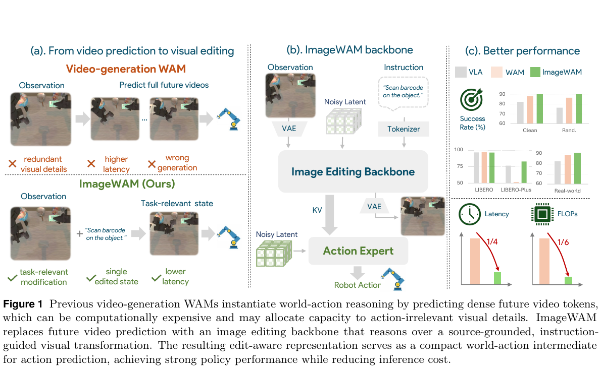
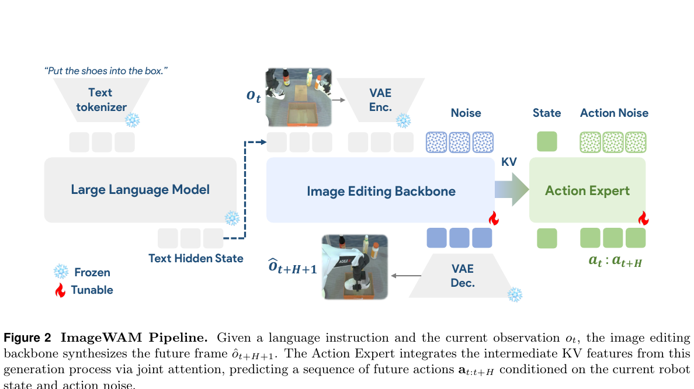
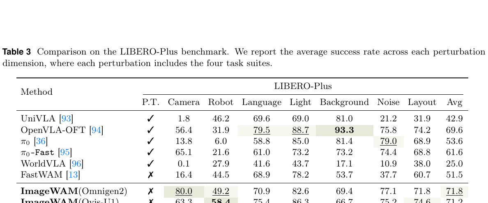
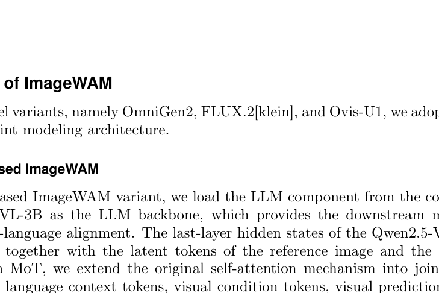

---
tags:
  - papers/embodied-ai
  - papers/world-model
aliases:
  - ImageWAM
  - 图像编辑世界动作模型
date: 2026-06-19
arxiv_id: 2606.19531v1
---

# ImageWAM: Do World Action Models Really Need Video Generation, or Just Image Editing?

## 核心信息

- 标题: ImageWAM: Do World Action Models Really Need Video Generation, or Just Image Editing?
- 标题翻译: ImageWAM：世界动作模型真的需要视频生成吗，还是只需图像编辑？
- 作者: Yuyang Zhang, Wenyao Zhang, Zekun Qi, He Zhang, Haitao Lin, Jingbo Zhang, Yao Mu, Xiaokang Yang, Wenjun Zeng, Xin Jin
- 机构: Shanghai Jiao Tong University; Eastern Institute of Technology; Tencent Robotics X; Tsinghua University; Zhongguancun Academy
- 发表时间: 2026-06-19（arXiv v1 标注 2026-06-17）
- 发表渠道: arXiv preprint
- arXiv: 2606.19531v1
- 论文链接: https://arxiv.org/abs/2606.19531
- 代码 / 项目: https://github.com/yuyangalin/ImageWAM ; https://zhangwenyao1.github.io/ImageWAM/
- 数据 / 资源: LIBERO, LIBERO-Plus, RoboTwin 2.0, Dobot XTrainer 四任务真实机器人数据
- 论文类型: 世界动作模型 / 机器人策略方法论文

## 原文摘要翻译

世界动作模型通常依靠视频生成来连接视觉世界建模与机器人控制，但视频式方法同时面临三项耦合问题：稠密多帧未来 token 增加推理成本；完整视频预测把容量用在与动作无关的时间与外观细节上；长时程未来想象还可能产生误差并误导动作预测。本文由此追问：世界动作模型真的需要视频生成吗？作者提出 ImageWAM，把预训练图像编辑模型改用于机器人动作预测。图像编辑只需建模目标帧变换，聚焦当前到目标之间与动作相关的视觉差异，并通过编辑预训练把任务指令落到局部视觉变化。推理时，ImageWAM 不解码目标帧，而让流匹配动作专家以图像编辑去噪产生的 KV 缓存为条件，将其作为紧凑世界—动作上下文。实验显示，ImageWAM 无需额外策略预训练即可在仿真和真实机器人实验中优于标准 VLA，并与竞争性 WAM 匹配；相较完整视频式 WAM，其 FLOPs 降至约六分之一、延迟降至约四分之一。注意力分析还显示编辑缓存聚焦任务相关变化区域。

## 创新点

1. **把世界—动作中介从“未来视频”改成“编辑缓存”。** 真正的新意不是生成一张目标图，而是复用图像编辑模型一次去噪前向中的逐层 KV 缓存；推理阶段甚至不解码目标帧。
2. **重新匹配代理任务与动作需求。** 完整视频要求同时解释外观、背景、相机与时间连续性；图像编辑直接建模“在指令下当前图像应发生什么局部变化”，信息密度更高，token 数也更少。
3. **共享同一世界—动作表征接口。** 编辑分支与动作专家通过联合注意力耦合；同一组源条件、指令条件 KV 表征既承载目标变化，也直接条件化动作流匹配。
4. **用多骨干、多分布与真实平台验证路线。** OmniGen2、Ovis-U1、FLUX.2 均可接入；评估覆盖 LIBERO、LIBERO-Plus、RoboTwin 2.0 和四项真实双臂任务，并报告硬件、延迟、FLOPs 与编译优化。

## 一句话总结

ImageWAM 的核心判断是：对当前这些语言条件操控任务，策略需要的未必是高保真时间 rollout，而是一个压缩了“指令要求当前场景变成什么”的源条件变化表征；图像编辑 KV 缓存恰好提供了这个表征。

## 研究问题

传统视频 WAM 把“先推理、后行动”具体化为：先生成未来多帧，再由未来表征预测动作。该设计默认了一个强假设——动作所需世界知识必须通过显式时间生成获得。ImageWAM 检验更窄也更实用的问题：**单个未来端点的编辑式变化表征，是否已经足以支持动作预测？**

这里需要区分三个命题：

- 论文直接检验的是“图像编辑缓存能否替代视频 token，成为这些基准上的动作条件”。
- 论文较强地支持“完整视频并非这些任务取得高成功率的必要条件”。
- 论文没有证明“时间建模在所有机器人任务中都没有价值”，尤其未覆盖强部分可观测、需要速度估计、不可逆动态或超长时程闭环预测的任务。

## 数据与任务定义

任务输入为时刻 $t$ 的图像观测 $o_t$ 与语言指令 $l$，输出动作块

$$
a_{t:t+H}=(a_t,a_{t+1},\ldots,a_{t+H}).
$$

ImageWAM 训练时以未来端点 $o_{t+H+1}$ 作为图像编辑目标；LIBERO、RoboTwin 的未来帧 horizon 与动作块长度均为 16。

| 评估域 | 数据与训练协议 | 测试协议 | 主要用途 |
|---|---|---|---|
| LIBERO | 四个 suite；每 suite 500 条示范、10 个任务；合并训练 10 epochs | Spatial/Object/Goal/Long | 标准操控能力 |
| LIBERO-Plus | 只用原始 LIBERO 示范，不用增强训练集 | 7 类相机、机器人、语言、光照、背景、噪声、布局扰动 | 分布偏移稳健性 |
| RoboTwin 2.0 | 2,500 条 clean + 25,000 条强随机化轨迹；单一多任务策略，30k steps | 50 余任务；每任务 clean/random 各 100 trials | 大规模双臂多任务 |
| 真实机器人 | Dobot XTrainer；四任务各约 100 条示范；联合训练 30k steps | 每任务 50 trials；表 4 汇总 100 trials 的主文描述存在粒度表述差异 | 长时程、遮挡、精细与可变形物操控 |

真实任务包括 Stack Three Bowls、Fold Towel、Open Drawer & Store Marker、Hang Cup On Rack。补充材料把每模型评估写为每任务 50 次；主文则写“100 trials conducted under multiple initial configurations”。复现时应以代码或作者说明进一步确认统计口径。

## 方法主线

### 机制流程

1. **输入与理解：** 冻结的 VLM 编码任务指令与视觉上下文，为编辑分支提供稳定语言—视觉条件。
2. **目标变化建模：** 可训练图像编辑扩散分支学习从当前观测 $o_t$ 指向未来端点 $o_{t+H+1}$ 的变化；训练时随机采样编辑去噪时刻 $\tau$。
3. **世界—动作表征：** 从编辑 Transformer 每层提取 $C_{edit}^{\tau}=\{(K_\ell^{\tau},V_\ell^{\tau})\}_{\ell=1}^{L}$，作为已融合源图像和任务指令的紧凑变化上下文。
4. **动作生成：** Action DiT 以观测、指令、当前机器人状态、动作噪声和编辑缓存为条件，通过流匹配生成长度 16 的动作块；推理只执行一次固定编辑时刻前向，不解码图像。

### 为什么图像编辑的“信息密度”更高

视频路线为多个未来帧实例化时空 token，必须承载背景、外观、相机运动与帧间平滑等信息。ImageWAM 的中介只需表达“当前状态在指令下应朝哪里改变”。这并不意味着缓存 token 中每比特都有更高互信息——论文没有测量信息论意义上的密度——而是从**任务相关容量占比**和**实例化 token 数量**两个工程角度提出更紧凑的代理。表 5 的 63.65→9.72 TFLOPs 以及 1081→263 ms 与这个解释一致。

### 编辑目标、条件与共享表征

图像目标是单个未来端点，不是人工生成的目标图，也不是任意文本编辑结果。条件包括当前观测 $o_t$ 与任务指令 $l$；训练目标让编辑分支保留预测任务相关未来状态的能力。动作专家不是另起一套视觉编码器，而是直接读取编辑分支逐层 KV，因此“视觉变化推理”和“动作生成”共享同一世界—动作表征接口。

OmniGen2 版本采用 MoT 联合自注意力：语言上下文、视觉条件、视觉预测与动作 token 分别产生 QKV 后拼接；动作 token 单向关注其他 token，而噪声 token 只关注上下文，以免污染条件。FLUX.2 与 Ovis-U1 使用类似联合注意力，但按各自双流/单流结构初始化 Action DiT。

### 训练目标

图像分支把目标端点编码为 $z^*_{t+H+1}$，对流时刻 $r$ 构造

$$
z_r=(1-r)z^*_{t+H+1}+r\epsilon_z,
$$

并优化速度场损失

$$
\mathcal{L}_{img}=\mathbb{E}\left[\left\|u_\phi(z_r,r\mid o_t,l)-(\epsilon_z-z^*_{t+H+1})\right\|_2^2\right].
$$

动作分支对专家动作 $a^*_{t:t+H}$ 和噪声 $\epsilon_a$ 构造 $a_s=(1-s)a^*_{t:t+H}+s\epsilon_a$，优化

$$
\mathcal{L}_{act}=\mathbb{E}\left[\left\|v_\theta(a_s,s\mid o_t,l,C_{edit}^{\tau})-(\epsilon_a-a^*_{t:t+H})\right\|_2^2\right].
$$

总损失为 $\mathcal{L}_{act}+\mathcal{L}_{img}$。随机化 $\tau$ 让动作专家适应不同编辑去噪阶段的缓存，而不是只依赖某个固定“完成度”的图像表征。

### 推理与动作预测路线

推理固定编辑时刻 $\tau^*$，仅做一次编辑分支前向得到 $C_{edit}^{\tau^*}$，然后用三步动作去噪生成动作块。它既不走完整图像去噪轨迹，也不经 VAE 解码目标帧。因而“ImageWAM 预测单帧”更准确地说是**训练目标预测单帧，部署时消费单步编辑缓存**。

Fast-WAM/Light-WAM 关系必须谨慎表述：论文明确实现并比较的是 **FastWAM** 风格路线——未来视频 token 仅在训练共训，部署时移除；文中没有定义或实验一个名为 Light-WAM 的方法，因此不能把 Light-WAM 的具体机制或结论导入本笔记。两者共同问题意识是减少测试时未来想象，但 ImageWAM 进一步更换了预训练先验：FastWAM 仍来自视频骨干的当前上下文缓存，ImageWAM 来自图像编辑骨干的指令条件变化缓存。

## 关键结果

### 主结果与强基线

| 场景 | ImageWAM | 最相关无额外预训练基线 | 差异 | 结论边界 |
|---|---:|---:|---:|---|
| RoboTwin clean | 93.20 | FastWAM 91.88 | +1.32 | 小幅领先，非压倒性 |
| RoboTwin random | 93.56 | FastWAM 91.78 | +1.78 | 支持随机化稳健性 |
| LIBERO Avg. | 98.4 | Fast-WAM 97.6 | +0.8 | 与强 WAM/VLA 同档 |
| LIBERO-Plus Avg. | 83.1 | FastWAM 51.5 | +31.6 | 最大优势来自分布偏移 |
| Real robot Avg. | 84.5 | FastWAM 79.0 | +5.5 | 四任务均领先 |

LIBERO-Plus 是最有辨识力的结果。FLUX.2 4B 版本在 Language 91.4、Light 98.1、Noise 93.8、Layout 80.5，平均 83.1；但 Robot 只有 50.3，说明编辑先验不是对所有扰动都同样有效。

### 逐任务与真实机器人证据

真实任务中，ImageWAM 相较 FastWAM 在 T1–T4 分别提升 +6、+9、+1、+6 点；最大提升出现在 Fold Towel，符合“编辑缓存擅长表达可变形物体目标变化”的解释，但这仍是四个任务上的事后机制解释，而非专门控制变量实验。

RoboTwin 逐任务表显示平均值背后存在明显异质性。例如 ImageWAM FLUX.2 在 Hanging Mug 为 74/84、Move Stapler Pad 为 67/60、Turn Switch 为 77/79；它并非每个任务都饱和。完整逐任务值已在 `detailed_paper.md` 表 12 中转录，适合后续定位失败模式。

### 效率证据与协议边界

| 路径 | 中介 | 延迟 | TFLOPs | 硬件 / 协议 |
|---|---|---:|---:|---|
| FastWAM-IDM | 解码视频 | 1081 ms | 63.65 | A6000；主文表 5 |
| FastWAM 1 step | 缓存 | 302 ms | 13.21 | A6000；主文表 5 |
| ImageWAM | 编辑缓存 | 263 ms | 9.72 | A6000；主文表 5 |
| ImageWAM prefix-only + compile + static graph | 编辑缓存 | 69 ms | 未报告 | 补充表 11；三步动作去噪 |

“延迟降至 1/4、FLOPs 降至 1/6”以完整视频 FastWAM-IDM 为分母。若与更可比的 FastWAM 单步缓存路线比较，延迟改善约 12.9%，TFLOPs 改善约 26.4%。69 ms 是加入 prefix-only、`torch.compile`、image prefill compile 与 action static graph 后的工程优化结果，不能与未经同等编译的 1081 ms 直接解释成纯模型结构增益。

### 消融到底说明了什么

| 消融 | 结果 | 能证明什么 | 不能证明什么 |
|---|---|---|---|
| OmniGen2 / Ovis-U1 / FLUX.2 4B | 71.8 / 71.2 / 83.1 | 框架不绑定单一编辑器；骨干质量重要 | 增益只来自“编辑能力”而非规模或架构 |
| FLUX.2 4B→9B | 83.1→85.2 | 扩容平均提升稳健性 | 每类扰动都单调改善；Camera/Light/Noise 实际下降 |
| unified 模型比较 | ImageWAM 在 LIBERO 98.4 | 解耦理解与生成是可行设计 | 共享结构必然产生干扰；跨系统比较并非受控消融 |
| attention 可视化 | 更聚焦物体、容器、接触区 | 缓存与变化中心解释一致 | 注意力导致成功率提升的因果关系 |
| future-video 失败案例 | 视频帧出现畸变并失败 | 存在伪影误导动作的可能路径 | 视频 WAM 的总体伪影频率或平均因果效应 |

## 深度分析

### 真正贡献是什么

真正贡献不是“把视频长度从多帧改成一帧”这么简单，而是选择了更合适的**预训练归纳偏置与中间接口**。普通单帧视觉编码器擅长识别当前状态；编辑器则在预训练中学习“源图像 + 指令 → 应发生的局部变化”。ImageWAM 把这种变化条件能力留在 KV 缓存里，再让动作专家读取它。因而其技术主张是：动作策略需要的是 **change-conditioned representation**，不一定是可观看的未来像素序列。

### 为什么结果可能成立

1. **源图像锚定降低漂移。** 编辑任务要求保留无关区域，天然约束模型不要重绘整个场景。
2. **语言直接监督变化位置和内容。** 指令与编辑目标在预训练阶段已耦合，LIBERO-Plus 的 Language、Layout 等扰动改善与此相符。
3. **端点监督压缩冗余时间细节。** 对 pick-and-place 等任务，目标配置比中间运动纹理更接近动作条件所需信息。
4. **联合训练让缓存变得可执行。** 图像损失维持视觉变化能力，动作损失则把缓存塑造成可被 Action DiT 利用的控制上下文。

### 与 FastWAM 的关系

FastWAM 已经质疑测试时未来想象的必要性，并通过 prefix-only 当前上下文缓存降低推理成本。ImageWAM 的增量不只是“也移除未来 token”，而是指出当前上下文应来自何种生成先验：视频骨干缓存可能仍偏向时空生成，编辑骨干缓存则显式围绕源图像与指令变化组织。LIBERO-Plus 83.1 对 51.5 是支持这一差异的主要性能证据；但跨骨干对比仍混合了预训练数据、模型规模和架构差异，不能完全归因于任务形式。

### 证据证明了什么、没有证明什么

论文证明了该方法在给定数据与协议下无需额外具身策略预训练就能达到很强成功率，并显著减少相对完整视频路径的算力。它还通过多编辑骨干说明框架可迁移，通过注意力和定性案例给出机制一致性证据。

论文没有进行等参数、等预训练数据的“图像编辑预训练 vs 视频预训练”严格对照；没有量化 KV 缓存的信息含量；没有测量遮挡后必须依赖历史的任务；也没有证明所生成端点在物理上更准确。结论应读作“在当前操控基准中，编辑缓存是足够且高效的替代中介”，而不是“视频世界模型已无必要”。

### 复现关键点

- 训练硬件为 8×NVIDIA H20；bf16、AdamW、学习率 $10^{-4}$、weight decay $10^{-2}$、warmup cosine、梯度裁剪 1.0。
- 默认 DeepSpeed ZeRO-1；FLUX.2 9B 使用 ZeRO-2。
- LIBERO 输入 $224\times448$、两视角横拼、10 epochs；RoboTwin 输入 $288\times256$、两腕视角横拼后与主视角纵拼、5 epochs。
- Action DiT 参数量随骨干差异很大：OmniGen2 约 760M，FLUX.2 4B/9B 为 642M/952M，Ovis-U1 为 1.1B。
- 推理比较必须记录编辑时刻 $\tau^*$、动作去噪步数、是否 prefix-only、是否编译与是否静态图；否则延迟不可复核。

## 局限

1. **时间需求覆盖不足。** 评估主要是当前视觉足以决定目标变化的操控任务，未覆盖速度、碰撞时序、隐藏状态记忆等强动态需求。
2. **预训练因素未完全控制。** 不同编辑器与视频 WAM 的预训练数据、规模和架构均不同，难把收益唯一归因于“编辑目标”。
3. **机制证据偏相关。** 注意力图和单个视频伪影案例支持叙事，但缺乏系统伪影统计、缓存干预测试或因果定位。
4. **真实机器人规模有限。** 仅一类双臂平台、四个任务；每任务示范和测试次数有限，且主文与补充的 trial 口径需要澄清。
5. **效率数字对分母敏感。** headline 相对完整视频 IDM 很强，但相对 FastWAM cache-only 路线的结构收益更温和；编译收益与算法收益必须分开。
6. **训练成本仍高。** RoboTwin 在 8×H20 上需 5 天，FLUX.2 9B 的 LIBERO 训练需 1.6 天；“推理轻”不等于“训练轻”。

## 我的笔记

这篇最值得保留的不是“image beats video”的口号，而是一个对 world model 很实用的设计准则：**先问控制器真正需要怎样的中间变量，再选择生成代理。** 如果动作只需要目标变化，完整 rollout 就是过度建模；如果任务需要历史、速度或不可见状态，编辑端点又可能不足。

后续最关键的实验应是等规模、等数据条件下比较三种中介：当前帧语义特征、图像编辑变化缓存、视频动态缓存；再通过历史依赖强度和部分可观测程度分桶。这样才能知道 ImageWAM 的优势来自“编辑预训练”，还是仅来自“少 token + 强图像骨干”。另一个直接方向是让系统按任务不确定性自适应选择端点编辑或短视频 rollout，而不是固定站在二选一的一端。

## 引用

Zhang, Y., Zhang, W., Qi, Z., et al. *ImageWAM: Do World Action Models Really Need Video Generation, or Just Image Editing?* arXiv:2606.19531v1 (2026).

- 完整双语读者与逐任务表：[[WorldModel/ImageWAM Do World Action Models Really Need Video Generation, or Just Image Editing/detailed_paper]]
- 项目页：https://zhangwenyao1.github.io/ImageWAM/
- 代码：https://github.com/yuyangalin/ImageWAM
